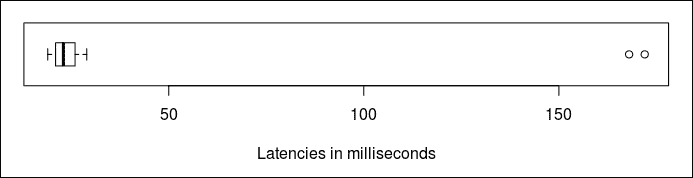
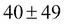
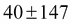
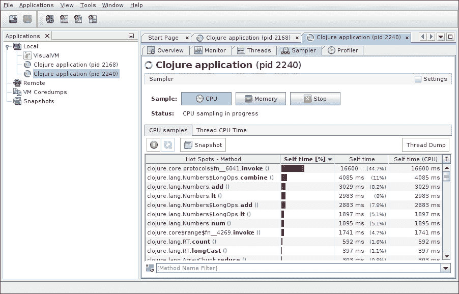
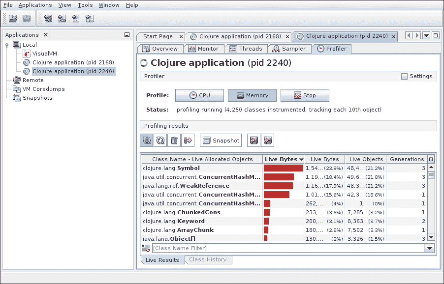

# 第六章：测量性能

根据预期的和实际性能，以及测量系统的缺乏或存在，性能分析和调整可能是一个相当复杂的过程。现在我们将讨论性能特性的分析以及测量和监控它们的方法。在本章中，我们将涵盖以下主题：

+   测量性能和理解结果

+   根据不同的目的进行性能测试

+   监控性能和获取指标

+   分析 Clojure 代码以识别性能瓶颈

# 性能测量和统计学

测量性能是性能分析的基础。正如我们在这本书中之前提到的，我们需要根据各种场景测量几个性能参数。Clojure 的内置`time`宏是一个测量执行代码体所花费时间的工具。测量性能因素是一个更为复杂的过程。测量的性能数字之间可能存在联系，我们需要分析这些联系。使用统计概念来建立联系因素是一种常见的做法。在本节中，我们将讨论一些基本的统计概念，并使用这些概念来解释测量的数据如何为我们提供更全面的视角。

## 一个小小的统计术语入门

当我们有一系列定量数据，例如相同操作的延迟（在多次执行中测量）时，我们可以观察到许多事情。首先，也是最明显的，是数据中的最小值和最大值。让我们用一个示例数据集来进一步分析：

| 23 | 19 | 21 | 24 | 26 | 20 | 22 | 21 | 25 | 168 | 23 | 20 | 29 | 172 | 22 | 24 | 26 |
| --- | --- | --- | --- | --- | --- | --- | --- | --- | --- | --- | --- | --- | --- | --- | --- | --- |

### 中位数，第一四分位数，第三四分位数

我们可以看到，这里的最低延迟是 19 毫秒，而最高延迟是 172 毫秒。我们还可以观察到，这里的平均延迟大约是 40 毫秒。让我们按升序排序这些数据：

| 19 | 20 | 20 | 21 | 21 | 22 | 22 | 23 | 23 | 24 | 24 | 25 | 26 | 26 | 29 | 168 | 172 |
| --- | --- | --- | --- | --- | --- | --- | --- | --- | --- | --- | --- | --- | --- | --- | --- | --- |

之前数据集的中心元素，即第九个元素（值为 23），被认为是数据集的**中位数**。值得注意的是，中位数比**平均数**或**均值**更能代表数据的中心。左半部分的中心元素，即第五个元素（值为 21），被认为是**第一四分位数**。同样，右半部分的中心值，即第 13 个元素（值为 26），被认为是数据集的**第三四分位数**。第三四分位数和第一四分位数之间的差值称为**四分位距（IQR）**，在本例中为 5。这可以用以下**箱线图**来表示：



箱线图突出了数据集的第一个四分位数、中位数和第三个四分位数。如图所示，两个“异常值”延迟数值（168 和 172）异常地高于其他数值。中位数在数据集中不表示异常值，而平均值则表示。


直方图（前面显示的图表）是另一种显示数据集的方法，我们将数据元素分批处理在**时间段**内，并暴露这种时间段的**频率**。一个时间段包含一定范围内的元素。直方图中的所有时间段通常大小相同；然而，当没有数据时，省略某些时间段并不罕见。

### 百分位数

百分位数用参数表示，例如 99 百分位数，或 95 百分位数等。百分位数是指所有指定百分比的数值元素都存在的值。例如，95 百分位数意味着数据集中值*N*，使得数据集中 95%的元素值都低于*N*。作为一个具体的例子，本节前面讨论的延迟数值数据集中的 85 百分位数是 29，因为在 17 个总元素中，有 14 个（即 17 的 85%）其他元素在数据集中的值低于 29。四分位数将数据集分成每个 25%元素的块。因此，第一个四分位数实际上是 25 百分位数，中位数是 50 百分位数，第三个四分位数是 75 百分位数。

### 方差和标准差

数据的分布，即数据元素与中心值之间的距离，为我们提供了对数据的进一步了解。考虑第*i*个偏差作为第*i*个数据集元素值（在统计学中，称为“变量”值）与其平均值之间的差异；我们可以将其表示为。我们可以将其“方差”和“标准差”表示如下：

方差 = ，标准差（σ）=  = 

标准差用希腊字母“sigma”表示，或简单地表示为“s”。考虑以下 Clojure 代码来确定方差和标准差：

```java
(def tdata [23 19 21 24 26 20 22 21 25 168 23 20 29 172 22 24 26])

(defn var-std-dev
  "Return variance and standard deviation in a vector"
  [data]
  (let [size (count data)
        mean (/ (reduce + data) size)
        sum (->> data
                 (map #(let [v (- % mean)] (* v v)))                 (reduce +))
        variance (double (/ sum (dec size)))]
    [variance (Math/sqrt variance)]))

user=> (println (var-std-dev tdata))
[2390.345588235294 48.89116063497873]
```

您可以使用基于 Clojure 的平台 Incanter ([`incanter.org/`](http://incanter.org/))进行统计分析。例如，您可以使用 Incanter 中的`(incanter.stats/sd tdata)`来找到标准差。

**经验法则**说明了数据集元素与标准差之间的关系。它说，数据集中 68.3%的所有元素都位于平均值一个（正或负）标准差的范围内，95.5%的所有元素位于两个标准差范围内，99.7%的所有数据元素位于三个标准差范围内。

观察我们最初使用的延迟数据集，从平均值出发的一个标准差是(范围-9 到 89)，包含所有元素的 88%。从平均值出发的两个标准差是范围-58 到 138)，包含所有元素的 88%。然而，从平均值出发的三个标准差是(范围-107 到 187)，包含所有元素的 100%。由于经验法则通常适用于具有大量元素的均匀分布数据集，因此经验法则所陈述的内容与我们的发现之间存在不匹配。

## 理解 Criterium 输出

在第四章“主机性能”中，我们介绍了 Clojure 库*Criterium*来测量 Clojure 表达式的延迟。以下是一个基准测试结果的示例：

```java
user=> (require '[criterium.core :refer [bench]])
nil
user=> (bench (reduce + (range 1000)))
Evaluation count : 162600 in 60 samples of 2710 calls.
             Execution time mean : 376.756518 us
    Execution time std-deviation : 3.083305 us
   Execution time lower quantile : 373.021354 us ( 2.5%)
   Execution time upper quantile : 381.687904 us (97.5%)

Found 3 outliers in 60 samples (5.0000 %)
low-severe 2 (3.3333 %)
low-mild 1 (1.6667 %)
 Variance from outliers : 1.6389 % Variance is slightly inflated by outliers
```

我们可以看到，结果中包含了一些我们在本节 earlier 讨论过的熟悉术语。高平均值和低标准差表明执行时间的变化不大。同样，下四分位数（第一四分位数）和上四分位数（第三四分位数）表明它们与平均值并不太远。这一结果意味着代码在响应时间方面相对稳定。Criterium 重复执行多次以收集延迟数值。

然而，为什么 Criterium 试图对执行时间进行统计分析？如果我们简单地计算平均值，会有什么遗漏呢？结果发现，所有执行的响应时间并不总是稳定的，响应时间的显示往往存在差异。只有在正确模拟负载下运行足够的时间，我们才能获得关于延迟的完整数据和其它指标。统计分析有助于了解基准测试是否存在问题。

## 指导性能目标

我们在第一章“设计性能”中仅简要讨论了性能目标，因为该讨论需要参考统计概念。假设我们确定了功能场景和相应的响应时间。响应时间是否应该保持固定？我们能否通过限制吞吐量来优先考虑规定的响应时间？

性能目标应指定最坏情况的响应时间，即最大延迟、平均响应时间和最大标准差。同样，性能目标还应提及最坏情况的吞吐量、维护窗口吞吐量、平均吞吐量和最大标准差。

# 性能测试

对性能的测试要求我们知道我们要测试什么，我们希望如何测试，以及为测试执行而设置的环境。有几个需要注意的陷阱，例如缺乏接近真实硬件和生产使用的资源，类似的操作系统和软件环境，测试用例中代表性数据的多样性，等等。测试输入的多样性不足可能导致单调的分支预测，从而在测试结果中引入“偏差”。

## 测试环境

对测试环境的担忧始于生产环境的硬件代表。传统上，测试环境硬件是生产环境的缩小版。在非代表性硬件上进行的性能分析几乎肯定会歪曲结果。幸运的是，近年来，得益于通用硬件和云系统，提供与生产环境相似的测试环境硬件并不太难。

用于性能测试的网络和存储带宽、操作系统和软件应当然与生产环境相同。同样重要的是要有代表测试场景的“负载”。负载包括不同的组合，包括请求的并发性、请求的吞吐量和标准偏差、数据库或消息队列中的当前人口水平、CPU 和堆使用情况等。模拟一个代表性负载是很重要的。

测试通常需要对执行测试的代码片段进行相当多的工作。务必将其开销保持在最低，以免影响基准测试结果。在可能的情况下，使用除测试目标以外的系统生成请求。

## 要测试的内容

任何非平凡系统的实现通常涉及许多硬件和软件组件。在整个系统中对某个功能或服务进行性能测试需要考虑它与各种子系统的交互方式。例如，一个 Web 服务调用可能会触及多个层次，如 Web 服务器（请求/响应打包和解包）、基于 URI 的路由、服务处理程序、应用程序-数据库连接器、数据库层、日志组件等。仅测试服务处理程序将是一个严重的错误，因为这并不是 Web 客户端将体验到的性能。性能测试应该在系统的外围进行，以保持结果的真实性，最好有第三方观察者。

性能目标陈述了测试的标准。测试不需要达到的目标内容是有用的，尤其是在测试并行运行时。运行有意义的性能测试可能需要一定程度的隔离。

## 测量延迟

执行一段代码所获得的延迟可能在每次运行时略有不同。这需要我们多次执行代码并收集样本。延迟数值可能会受到 JVM 预热时间、垃圾收集和 JIT 编译器启动的影响。因此，测试和样本收集应确保这些条件不会影响结果。Criterium 遵循这种方法来产生结果。当我们以这种方式测试非常小的代码片段时，它被称为**微基准测试**。

由于某些操作的延迟在运行期间可能会变化，因此收集所有样本并将它们按时间段和频率分离成直方图是很重要的。在测量延迟时，最大延迟是一个重要的指标——它表示最坏情况的延迟。除了最大值之外，99 百分位和 95 百分位的延迟数值也很重要，以便从不同角度看待问题。实际上收集延迟数值比从标准差推断它们更重要，正如我们之前提到的，经验法则仅适用于没有显著异常值的高斯分布。

在测量延迟时，异常值是一个重要的数据点。异常值比例较高可能表明服务退化的可能性。

### 比较延迟测量

当评估用于项目的库或提出针对某些基线的替代解决方案时，比较延迟基准测试有助于确定性能权衡。我们将检查基于 Criterium 的两个比较基准测试工具，称为 Perforate 和 Citius。两者都使得按上下文分组运行 Criterium 基准测试变得容易，并可以轻松查看基准测试结果。

Perforate ([`github.com/davidsantiago/perforate`](https://github.com/davidsantiago/perforate)) 是一个 Leiningen 插件，允许定义目标；目标（使用`perforate.core/defgoal`定义）是一个具有一个或多个基准测试的常见任务或上下文。每个基准测试使用`perforate.core/defcase`定义。截至 0.3.4 版本，一个示例基准测试代码可能看起来像以下代码片段：

```java
(ns foo.bench
  (:require [perforate.core :as p]))

(p/defgoal str-concat "String concat")
(p/defcase str-concat :apply
  [] (apply str ["foo" "bar" "baz"]))
(p/defcase str-concat :reduce
  [] (reduce str ["foo" "bar" "baz"]))

(p/defgoal sum-numbers "Sum numbers")
(p/defcase sum-numbers :apply
  [] (apply + [1 2 3 4 5 6 7 8 9 0]))
(p/defcase sum-numbers :reduce
  [] (reduce + [1 2 3 4 5 6 7 8 9 0]))
```

你可以在`project.clj`中声明测试环境，并在定义目标时提供设置/清理代码。Perforate 提供了从命令行运行基准测试的方法。

Citius ([`github.com/kumarshantanu/citius`](https://github.com/kumarshantanu/citius)) 是一个库，它为 clojure.test 和其他调用形式提供集成钩子。它比 Perforate 施加更严格的约束，并提供了关于基准测试的额外比较信息。它假设每个测试套件中有一个固定的目标（案例）数量，其中可能有多个目标。

截至 0.2.1 版本，一个示例基准测试代码可能看起来像以下代码片段：

```java
(ns foo.bench
  (:require [citius.core :as c]))

(c/with-bench-context ["Apply" "Reduce"]
  {:chart-title "Apply vs Reduce"
   :chart-filename "bench-simple.png"}
  (c/compare-perf
    "concat strs"
    (apply str ["foo" "bar" "baz"])
    (reduce str ["foo" "bar" "baz"]))
  (c/compare-perf
    "sum numbers"
    (apply + [1 2 3 4 5 6 7 8 9 0])
    (reduce + [1 2 3 4 5 6 7 8 9 0])))
```

在上一个示例中，代码运行基准测试，报告比较总结，并绘制平均延迟的柱状图图像。

### 并发下的延迟测量

当我们使用 Criterium 基准测试一段代码时，它只使用一个线程来确定结果。这为我们提供了一个关于单线程结果的公平输出，但在许多基准测试场景中，单线程延迟与我们需要的相差甚远。在并发情况下，延迟通常与单线程延迟有很大差异。特别是当我们处理*有状态*对象（例如从 JDBC 连接池中绘制连接、更新共享内存状态等）时，延迟很可能会随着竞争程度成比例变化。在这种情况下，了解代码在不同并发级别下的延迟模式是有用的。

我们在前一小节中讨论的 Citius 库支持可调的并发级别。考虑以下共享计数器实现的基准测试：

```java
(ns foo.bench
  (:require
    [clojure.test :refer [deftest]]
    [citius.core :as c])
  (:import [java.util.concurrent.atomic AtomicLong]))

(def a (atom 0))
(def ^AtomicLong b (AtomicLong. 0))

(deftest test-counter
  (c/with-bench-context ["Atom" "AtomicLong"] {}
    (c/compare-perf "counter"
      (swap! a unchecked-inc) (.incrementAndGet b))))

;; Under Unix-like systems run the following command in terminal:
;; CITIUS_CONCURRENCY=4,4 lein test
```

当我在第四代四核英特尔酷睿 i7 处理器（Mac OSX 10.10）上运行这个基准测试时，在并发级别 04 的平均延迟是并发级别 01 的平均延迟的 38 到 42 倍。由于在许多情况下 JVM 用于运行服务器端应用程序，因此在并发下的基准测试变得尤为重要。

## 测量吞吐量

吞吐量是以时间单位来表示的。粗粒度吞吐量，即在一个较长时期内收集的吞吐量数字，可能会隐藏这样一个事实：吞吐量实际上是在爆发式地而不是均匀分布地交付的。吞吐量测试的粒度取决于操作的性质。批量处理可能处理数据爆发，而网络服务可能提供均匀分布的吞吐量。

### 平均吞吐量测试

尽管截至版本 0.2.1 的 Citius 在基准测试结果中显示了外推吞吐量（每秒，每线程），但由于各种原因，这个吞吐量数字可能并不能很好地代表实际的吞吐量。让我们构建一个简单的吞吐量基准测试 harness，如下所示，从辅助函数开始：

```java
(import '[java.util.concurrent ExecutorService Executors Future])
(defn concurrently
  ([n f]
    (concurrently n f #(mapv deref %)))
  ([n f g]
    (let [^ExecutorService
          thread-pool (Executors/newFixedThreadPool n)
          future-vals (transient [])]
      (dotimes [i n]
        (let [^Callable task (if (coll? f) (nth f i) f)
              ^Future each-future (.submit thread-pool task)]
          (conj! future-vals each-future)))
      (try
        (g (persistent! future-vals))
        (finally
          (.shutdown thread-pool))))))

(defn call-count
  []
  (let [stats (atom 0)]
    (fn
      ([] (deref stats))
      ([k] (if (identical? :reset k)
             (reset! stats 0)
             (swap! stats unchecked-inc))))))

(defn wrap-call-stats
  [stats f]
  (fn [& args]
    (try
      (let [result (apply f args)]
        (stats :count)
        result))))

(defn wait-until-millis
  ([^long timeout-millis]
    (wait-until-millis timeout-millis 100))
  ([^long timeout-millis ^long progress-millis]
    (while (< (System/currentTimeMillis) timeout-millis)
      (let [millis (min progress-millis
                     (- timeout-millis (System/currentTimeMillis)))]
        (when (pos? millis)
          (try
            (Thread/sleep millis)
            (catch InterruptedException e
              (.interrupt ^Thread (Thread/currentThread))))
          (print \.)
          (flush))))))
```

现在我们已经定义了辅助函数，让我们看看基准测试代码：

```java
(defn benchmark-throughput*
  [^long concurrency ^long warmup-millis ^long bench-millis f]
  (let [now        #(System/currentTimeMillis)
        exit?      (atom false)
        stats-coll (repeatedly concurrency call-count)
        g-coll     (->> (repeat f)
                     (map wrap-call-stats stats-coll)
                     (map-indexed (fn [i g]
                                    (fn []
                                      (let [r (nth stats-coll i)]
                                        (while (not (deref exit?))
                                          (g))
                                        (r)))))
                     vec)
        call-count (->> (fn [future-vals]
                          (print "\nWarming up")
                          (wait-until-millis (+ (now) warmup-millis))
                          (mapv #(% :reset) stats-coll) ; reset count
                          (print "\nBenchmarking")
                          (wait-until-millis (+ (now) bench-millis))
                          (println)
                          (swap! exit? not)
                          (mapv deref future-vals))
                     (concurrently concurrency g-coll)
                     (apply +))]
    {:concurrency concurrency
     :calls-count call-count
     :duration-millis bench-millis
     :calls-per-second (->> (/ bench-millis 1000)
                         double
                         (/ ^long call-count)
                         long)}))

(defmacro benchmark-throughput
  "Benchmark a body of code for average throughput."
  [concurrency warmup-millis bench-millis & body]
  `(benchmark-throughput*
    ~concurrency ~warmup-millis ~bench-millis (fn [] ~@body)))
```

现在我们来看看如何使用 harness 测试代码的吞吐量：

```java
(def a (atom 0))
(println
  (benchmark-throughput
    4 20000 40000 (swap! a inc)))
```

这个 harness 只提供了简单的吞吐量测试。为了检查吞吐量模式，你可能想要将吞吐量分配到滚动固定时间窗口中（例如每秒吞吐量）。然而，这个主题超出了本文的范围，尽管我们将在本章后面的*性能监控*部分中涉及到它。

## 负载、压力和耐久性测试

测试的一个特点是每次运行只代表执行过程中的一个时间片段。重复运行可以建立它们的总体行为。但是，应该运行多少次才算足够呢？对于某个操作可能有几种预期的负载场景。因此，需要在各种负载场景下重复测试。简单的测试运行可能并不总是表现出操作的长期行为和响应。在较长的时间内以不同的高负载运行测试，可以让我们观察任何可能不会在短期测试周期中出现的异常行为。

当我们在远超预期的延迟和吞吐量目标的负载下测试一个操作时，这就是**压力测试**。压力测试的目的是确定操作在超出其开发的最大负载时表现出的合理行为。观察操作行为的另一种方法是观察它在非常长时间运行时的表现，通常为几天或几周。这种长时间的测试被称为**耐久测试**。虽然压力测试检查操作的良好行为，但耐久测试检查操作在长时间内的稳定行为。

有几种工具可以帮助进行负载和压力测试。Engulf ([`engulf-project.org/`](http://engulf-project.org/)) 是一个用 Clojure 编写的基于 HTTP 的分布式负载生成工具。Apache JMeter 和 Grinder 是基于 Java 的负载生成工具。Grinder 可以使用 Clojure 进行脚本化。Apache Bench 是一个用于 Web 系统的负载测试工具。Tsung 是一个用 Erlang 编写的可扩展、高性能的负载测试工具。

# 性能监控

在长时间测试期间或应用上线后，我们需要监控其性能，以确保应用继续满足性能目标。可能存在影响应用性能或可用性的基础设施或运营问题，或者偶尔的延迟峰值或吞吐量下降。通常，监控通过生成持续的反馈流来减轻这种风险。

大概有三种组件用于构建监控堆栈。一个**收集器**将每个需要监控的主机上的数字发送出去。收集器获取主机信息和性能数字，并将它们发送到一个**聚合器**。聚合器接收收集器发送的数据，并在用户代表**可视化器**请求时持久化这些数据。

项目 **metrics-clojure** ([`github.com/sjl/metrics-clojure`](https://github.com/sjl/metrics-clojure)) 是一个 Clojure 封装的 **Metrics** ([`github.com/dropwizard/metrics`](https://github.com/dropwizard/metrics)) Java 框架，它作为一个收集器。**Statsd** 是一个知名的聚合器，它本身不持久化数据，而是将数据传递给各种服务器。其中最受欢迎的可视化项目之一是 **Graphite**，它不仅存储数据，还为请求的时段生成图表。还有其他几种替代方案，特别是用 Clojure 和 Ruby 编写的 **Riemann** ([`riemann.io/`](http://riemann.io/))，它是一个基于事件处理的聚合器。

## 通过日志进行监控

近年来出现的一种流行的性能监控方法是通过对日志的监控。这个想法很简单——应用程序以日志的形式发出指标数据，这些数据从单个机器发送到中央日志聚合服务。然后，这些指标数据在每个时间窗口内进行聚合，并进一步移动以进行归档和可视化。

作为此类监控系统的示例，你可能想使用 **Logstash-forwarder** ([`github.com/elastic/logstash-forwarder`](https://github.com/elastic/logstash-forwarder)) 从本地文件系统抓取应用程序日志并将其发送到 **Logstash** ([`www.elastic.co/products/logstash`](https://www.elastic.co/products/logstash))，在那里它将指标日志转发到 **StatsD** ([`github.com/etsy/statsd`](https://github.com/etsy/statsd)) 进行指标聚合，或者转发到 **Riemann** ([`riemann.io/`](http://riemann.io/)) 进行事件分析和监控警报。StatsD 和/或 Riemann 可以将指标数据转发到 Graphite ([`graphite.wikidot.com/`](http://graphite.wikidot.com/)) 进行归档和时间序列指标数据的图表化。通常，人们希望将非默认的时间序列数据存储（如 **InfluxDB**：[`influxdb.com/`](https://influxdb.com/)) 或可视化层（如 **Grafana**：[`grafana.org/`](http://grafana.org/)) 与 Graphite 连接起来。

关于这个话题的详细讨论超出了本文的范围，但我认为探索这个领域对你大有裨益。

## 环境监控（web 监控）

如果你使用 Ring ([`github.com/ring-clojure/ring`](https://github.com/ring-clojure/ring)) 开发 Web 软件，那么你可能觉得 metrics-clojure 库的 Ring 扩展很有用：[`metrics-clojure.readthedocs.org/en/latest/ring.html`](http://metrics-clojure.readthedocs.org/en/latest/ring.html) ——它跟踪了许多有用的指标，这些指标可以以 JSON 格式查询，并通过网络浏览器与可视化集成。

要从网络层发出连续的指标数据流，**服务器端事件** (**SSE**) 可能是一个好主意，因为它具有低开销。**http-kit** ([`www.http-kit.org/`](http://www.http-kit.org/)) 和 **Aleph** ([`aleph.io/`](http://aleph.io/))，它们与 Ring 一起工作，今天都支持 SSE。

## 反省

Oracle JDK 和 OpenJDK 都提供了两个名为 **JConsole** (可执行名称 `jconsole`) 和 **JVisualVM** (可执行名称 `jvisualvm`) 的 GUI 工具，我们可以使用它们来反省正在运行的 JVM 以获取仪器化数据。JDK 中还有一些命令行工具 ([`docs.oracle.com/javase/8/docs/technotes/tools/`](http://docs.oracle.com/javase/8/docs/technotes/tools/))，可以窥探正在运行的 JVM 的内部细节。

反省一个正在运行的 Clojure 应用程序的一种常见方法是运行一个 **nREPL** ([`github.com/clojure/tools.nrepl`](https://github.com/clojure/tools.nrepl)) 服务，这样我们就可以稍后使用 nREPL 客户端连接到它。使用 Emacs 编辑器（内嵌 nREPL 客户端）进行 nREPL 的交互式反省在一些人中很受欢迎，而其他人则更喜欢编写 nREPL 客户端脚本来执行任务。

### 通过 JMX 进行 JVM 仪器化

JVM 通过可扩展的 **Java 管理扩展** (**JMX**) API 内置了一种反省管理资源的机制。它为应用程序维护者提供了一种将可管理资源作为“MBeans”公开的方法。Clojure 有一个名为 `java.jmx` 的易于使用的 `contrib` 库 ([`github.com/clojure/java.jmx`](https://github.com/clojure/java.jmx))，用于访问 JMX。有一些开源工具可用于通过 JMX 可视化 JVM 仪器化数据，例如 `jmxtrans` 和 `jmxetric`，它们与 Ganglia 和 Graphite 集成。

使用 Clojure 获取 JVM 的快速内存统计信息相当简单：

```java
(let [^Runtime r (Runtime/getRuntime)]
  (println "Maximum memory" (.maxMemory r))
  (println "Total memory" (.totalMemory r))
  (println "Free memory" (.freeMemory r)))
Output:
Maximum memory 704643072
Total memory 291373056
Free memory 160529752
```

# 分析

我们在第一章中简要讨论了分析器类型，即“通过设计进行性能”。我们之前讨论的与反省相关的 JVisualVM 工具也是一个 CPU 和内存分析器，它随 JDK 一起提供。让我们看看它们在实际中的应用——考虑以下两个 Clojure 函数，它们分别对 CPU 和内存进行压力测试：

```java
(defn cpu-work []
  (reduce + (range 100000000)))

(defn mem-work []
  (->> (range 1000000)
       (map str)
       vec
       (map keyword)
       count))
```

使用 JVisualVM 非常简单——从左侧面板打开 Clojure JVM 进程。它具有采样和常规分析器风格的分析。当代码运行时，开始对 CPU 或内存使用进行分析，并等待收集足够的数据以在屏幕上绘制。



以下展示了内存分析的实际操作：



注意，JVisualVM 是一个非常简单、入门级的分析器。市场上有多款商业 JVM 分析器，用于满足复杂需求。

## 操作系统和 CPU/缓存级别分析

仅对 JVM 进行性能分析可能并不总是能揭示全部情况。深入到操作系统和硬件级别的性能分析通常能更好地了解应用程序的情况。在类 Unix 操作系统中，如`top`、`htop`、`perf`、`iota`、`netstat`、`vista`、`upstate`、`pidstat`等命令行工具可以帮助。对 CPU 进行缓存缺失和其他信息的分析是捕捉性能问题的有用来源。在 Linux 的开源工具中，**Likwid**（[`code.google.com/p/likwid/`](http://code.google.com/p/likwid/) 和 [`github.com/rrze-likwid/likwid`](https://github.com/rrze-likwid/likwid)）对于 Intel 和 AMD 处理器来说体积小但效果显著；**i7z**（[`code.google.com/p/i7z/`](https://code.google.com/p/i7z/) 和 [`github.com/ajaiantilal/i7z`](https://github.com/ajaiantilal/i7z)）专门针对 Intel 处理器。还有针对更复杂需求的专用商业工具，如**Intel VTune Analyzer**。

## I/O 性能分析

分析 I/O 可能也需要特殊的工具。除了`iota`和`blktrace`之外，`ioping`（[`code.google.com/p/ioping/`](https://code.google.com/p/ioping/) 和 [`github.com/koct9i/ioping`](https://github.com/koct9i/ioping)）对于测量 Linux/Unix 系统上的实时 I/O 延迟很有用。**vnStat**工具对于监控和记录 Linux 上的网络流量很有用。存储设备的 IOPS 可能无法完全反映真相，除非它伴随着不同操作的延迟信息，以及可以同时发生的读取和写入次数。

在 I/O 密集型的工作负载中，必须随着时间的推移寻找读取和写入 IOPS，并设置一个阈值以实现最佳性能。应用程序应限制 I/O 访问，以确保不超过阈值。

# 摘要

提供高性能应用程序不仅需要关注性能，还需要系统地测量、测试、监控和优化各种组件和子系统的性能。这些活动通常需要正确的技能和经验。有时，性能考虑甚至可能将系统设计和架构推回设计图板。早期采取的结构化步骤对于确保持续满足性能目标至关重要。

在下一章中，我们将探讨性能优化工具和技术。
