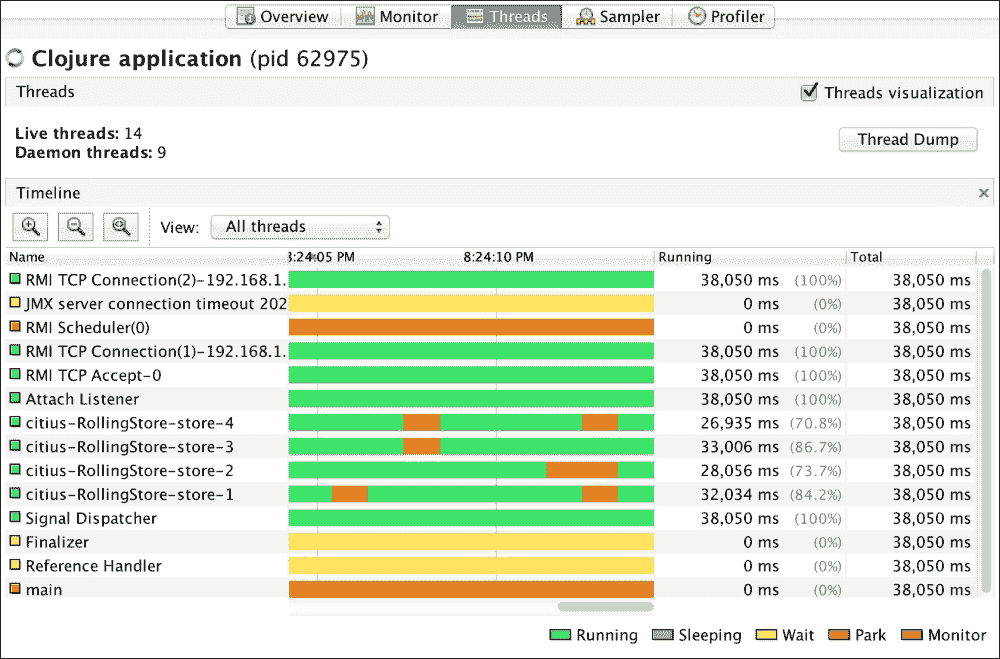

# 第七章 性能优化

性能优化本质上具有累加性，因为它通过将性能调优添加到对底层系统如何工作的了解以及性能测量结果中来实现。本章建立在之前涵盖“底层系统如何工作”和“性能测量”的章节之上。尽管你会在本章中注意到一些类似食谱的部分，但你已经知道了利用这些部分所需的前提条件。性能调优是一个测量性能、确定瓶颈、应用知识以尝试调整代码，并重复这一过程直到性能提高的迭代过程。在本章中，我们将涵盖：

+   为提高性能设置项目

+   识别代码中的性能瓶颈

+   使用 VisualVM 分析代码

+   Clojure 代码的性能调优

+   JVM 性能调优

# 项目设置

虽然找到瓶颈对于修复代码中的性能问题是至关重要的，但有一些事情可以在一开始就做，以确保更好的性能。

## 软件版本

通常，新的软件版本包括错误修复、新功能和性能改进。除非有相反的建议，最好使用较新版本。对于使用 Clojure 的开发，考虑以下软件版本：

+   **JVM 版本**：截至本文撰写时，Java 8（Oracle JDK，OpenJDK，Zulu）已发布为最新稳定的生产就绪版本。它不仅稳定，而且在多个领域（特别是并发）的性能优于早期版本。如果你有选择，请选择 Java 8 而不是 Java 的旧版本。

+   **Clojure 版本**：截至本文撰写时，Clojure 1.7.0 是最新稳定的版本，它在性能上比旧版本有多个改进。还有一些新功能（transducers，volatile）可以使你的代码性能更好。除非没有选择，否则请选择 Clojure 1.7 而不是旧版本。

## Leiningen project.clj 配置

截至 2.5.1 版本，默认的 Leiningen 模板（`lein new foo`，`lein new app foo`）需要一些调整才能使项目适应性能。确保你的 Leiningen `project.clj`文件有适当的以下条目。

### 启用反射警告

在 Clojure 编程中最常见的陷阱之一是无意中让代码退回到反射。回想一下，我们在第三章中讨论了这一点，*依赖 Java。启用*，启用反射警告非常简单，让我们通过向`project.clj`添加以下条目来修复它：

```java
:global-vars {*unchecked-math* :warn-on-boxed ; in Clojure 1.7+
              *warn-on-reflection* true}
```

在之前的配置中，第一个设置`*unchecked-math* :warn-on-boxed`仅在 Clojure 1.7 中有效——它会发出数字装箱警告。第二个设置`*warn-on-reflection* true`在更早的 Clojure 版本以及 Clojure 1.7 中也能工作，并在代码中发出反射警告信息。

然而，将这些设置包含在 `project.clj` 中可能不够。只有当命名空间被加载时才会发出反射警告。你需要确保所有命名空间都被加载，以便在整个项目中搜索反射警告。这可以通过编写引用所有命名空间的测试或通过执行此类操作的脚本来实现。

### 在基准测试时启用优化 JVM 选项

在 第四章 中，我们讨论了 Leiningen 默认启用分层编译，这以牺牲 JIT 编译器的优化为代价提供了较短的启动时间。默认设置对于性能基准测试来说非常具有误导性，因此你应该启用代表你在生产中使用的 JVM 选项：

```java
:profiles {:perf {:test-paths ^:replace ["perf-test"]
                  :jvm-opts ^:replace ["-server"
                                       "-Xms2048m" "-Xmx2048m"]}}
```

例如，前面的设置定义了一个 Leiningen 配置文件，它覆盖了默认 JVM 选项，以配置一个具有 2 GB 固定大小堆空间的 `server` Java 运行时。它还将测试路径设置为目录 `perf-test`。现在你可以按照以下方式运行性能测试：

```java
lein with-profile perf test
```

如果你的项目有需要不同 JVM 选项的性能测试套件，你应该根据需要定义多个配置文件来运行测试。

## 区分初始化和运行时

大多数非平凡项目在能够运行之前需要设置很多上下文。这些上下文的例子可能包括应用程序配置、内存状态、I/O 资源、线程池、缓存等等。虽然许多项目从临时的配置和初始化开始，但最终项目需要将初始化阶段与运行时分离。这种区分的目的不仅是为了净化代码的组织，而且是为了在运行时接管之前尽可能多地预先计算。这种区分还允许初始化阶段（根据配置条件）轻松地对初始化代码进行性能日志记录和监控。

非平凡程序通常分为多个层次，例如业务逻辑、缓存、消息传递、数据库访问等等。每个层次都与一个或多个其他层次有依赖关系。通过使用第一性原理编写代码，可以执行初始化阶段的隔离，许多项目实际上就是这样做的。然而，有一些库通过允许你声明层次之间的依赖关系来简化这个过程。**组件** ([`github.com/stuartsierra/component`](https://github.com/stuartsierra/component)) 和 **Prismatic 图** ([`github.com/Prismatic/plumbing`](https://github.com/Prismatic/plumbing)) 是此类库的显著例子。

Component 库有很好的文档。可能不容易明显地看出如何使用 Prismatic 图进行依赖解析；以下是一个虚构的例子来说明：

```java
(require '[plumbing.core :refer [fnk]])
(require '[plumbing.graph :as g])

(def layers
  {:db      (fnk [config]    (let [pool (db-pool config)]
                               (reify IDatabase ...)))
   :cache   (fnk [config db] (let [cache-obj (mk-cache config)]
                               (reify ICache    ...)))
   :service (fnk [config db cache] (reify IService  ...))
   :web     (fnk [config service]  (reify IWeb      ...))})

(defn resolve-layers
  "Return a map of reified layers"
  [app-config]
  (let [compiled (g/compile layers)]
    (compiled {:config app-config})))
```

这个例子仅仅展示了层依赖图的构建，但在测试中，你可能需要不同的构建范围和顺序。在这种情况下，你可以定义不同的图并在适当的时候解决它们。如果你需要为测试添加拆解逻辑，你可以在每个拆解步骤中添加额外的`fnk`条目，并用于拆解。

# 识别性能瓶颈

在前面的章节中，我们讨论了代码的随机性能调整很少有效，因为我们可能没有在正确的位置进行调整。在我们可以调整代码中的这些区域之前，找到性能瓶颈至关重要。找到瓶颈后，我们可以围绕它进行替代解决方案的实验。在本节中，我们将探讨如何找到瓶颈。

## Clojure 代码中的延迟瓶颈

延迟是寻找瓶颈的起点，也是最明显的度量指标。对于 Clojure 代码，我们在第六章中观察到，代码分析工具可以帮助我们找到瓶颈区域。当然，分析器非常有用。一旦通过分析器发现热点，你可能会找到一些方法来在一定程度上调整这些热点的延迟。

大多数分析器在聚合上工作，一批运行，按资源消耗对代码中的热点进行排名。然而，调整延迟的机会往往在于分析器可能没有突出的长尾。在这种情况下，我们可能需要采用直接钻取技术。让我们看看如何使用**Espejito** ([`github.com/kumarshantanu/espejito`](https://github.com/kumarshantanu/espejito))进行这样的钻取，这是一个用于在单线程执行路径中的测量点测量延迟的 Clojure 库（截至版本 0.1.0）。使用**Espejito**有两个部分，都需要修改你的代码——一个用于包装要测量的代码，另一个用于报告收集到的测量数据。以下代码演示了一个虚构的电子商务用例，即向购物车添加商品：

```java
(require '[espejito.core :as e])

;; in the top level handler (entry point to the use case)
(e/report e/print-table
  ...)

;; in web.clj
(e/measure "web/add-cart-item"
  (biz/add-item-to-cart (resolve-cart request) item-code qty)
  ...)

;; in service.clj (biz)
(defn add-item-to-cart
  [cart item qty]
  (e/measure "biz/add-cart-item"
    (db/save-cart-item (:id cart) (:id item) qty)
    ...))

;; in db.clj (db)
(defn save-cart-item
  [cart-id item-id qty]
  (e/measure "db/save-cart-item"
    ...))
```

只需在代码的最外层（顶级）层报告一次调用。测量调用可以在调用路径中的任何位置进行。请注意不要在紧密循环中放置测量调用，这可能会使内存消耗增加。当此执行路径被触发时，功能按常规工作，同时延迟被透明地测量和记录在内存中。`e/report`调用打印出记录的指标表。一个示例输出（编辑以适应）可能如下所示：

```java
|                 :name|:cumulat|:cumul%|:indiv |:indiv%|:thrown?|
|----------------------+--------+-------+-------+-------+--------|
|    web/add-cart-item |11.175ms|100.00%|2.476ms|22.16% |        |
| biz/add-item-to-cart | 8.699ms| 77.84%|1.705ms|15.26% |        |
|    db/save-cart-item | 6.994ms| 62.59%|6.994ms|62.59% |        |
```

在这里，我们可以观察到数据库调用是最昂贵的（单个延迟），其次是网络层。我们的调整偏好可能会根据测量点的昂贵程度来指导。

### 只在热点时进行测量

在深入测量中我们没有涵盖的一个重要方面是环境是否已准备好进行测量。`e/report`调用每次都是无条件调用的，这不仅会有自己的开销（表格打印），而且 JVM 可能尚未预热，JIT 编译器可能尚未启动以正确报告延迟。为了确保我们只报告有意义的延迟，让我们在以下示例条件下触发`e/report`调用：

```java
(defmacro report-when
  [test & body]
  `(if ~test
    (e/report e/print-table
      ~@body)
    ~@body))
```

现在，假设它是一个基于**Ring**（[`github.com/ring-clojure/ring`](https://github.com/ring-clojure/ring)）的 Web 应用程序，并且你希望在 Web 请求包含参数`report`且其值为`true`时才触发报告。在这种情况下，你的调用可能如下所示：

```java
(report-when (= "true" (get-in request [:params "report"]))
  ...)
```

基于条件的调用期望 JVM 在多次调用之间保持运行，因此它可能不适用于命令行应用程序。

这种技术也可以用于性能测试，在某个预热期间可能进行非报告调用，然后通过提供自己的报告函数而不是`e/print-table`来进行报告调用。你甚至可以编写一个采样报告函数，它会在一段时间内汇总样本，并最终报告延迟指标。不仅限于性能测试，你还可以使用它进行延迟监控，其中报告函数记录指标而不是打印表格，或将延迟分解发送到指标聚合系统。

## 垃圾回收瓶颈

由于 Clojure 运行在 JVM 上，因此必须了解应用程序中的 GC 行为。你可以在`project.clj`或 Java 命令行中指定相应的 JVM 选项来在运行时打印 GC 详细信息：

```java
:jvm-options ^:replace [..other options..
 "-verbose:gc" "-XX:+PrintGCDetails"
 "-XX:+PrintGC" "-XX:+PrintGCTimeStamps"
                        ..other options..]
```

这会导致在应用程序运行时打印出 GC 事件的详细摘要。为了将输出捕获到文件中，你可以指定以下参数：

```java
:jvm-options ^:replace [..other options..
                        "-verbose:gc" "-XX:+PrintGCDetails"
                        "-XX:+PrintGC" "-XX:+PrintGCTimeStamps"
 "-Xloggc:./memory.log"
                        ..other options..]
```

也有必要查看完全垃圾回收（GC）事件之间的时间以及事件期间的时间：

```java
:jvm-options ^:replace [..other options..
                        "-verbose:gc" "-XX:+PrintGCDetails"
                        "-XX:+PrintGC" "-XX:+PrintGCTimeStamps"
 "-XX:+PrintGCApplicationStoppedTime"
 "-XX:+PrintGCApplicationConcurrentTime"
                        ..other options..]
```

以下是一些其他有用的选项，用于调试 GC：

+   `-XX:+HeapDumpOnOutOfMemoryError`

+   `-XX:+PrintTenuringDistribution`

+   `-XX:+PrintHeapAtGC`

之前选项的输出可以帮助你识别可以尝试通过选择合适的垃圾回收器、其他代际堆选项和代码更改来修复的 GC 瓶颈。为了方便查看 GC 日志，你可能喜欢使用 GUI 工具，如**GCViewer**（[`github.com/chewiebug/GCViewer`](https://github.com/chewiebug/GCViewer)）来完成此目的。

### 等待在 GC 安全点的线程

当代码中存在一个长时间紧循环（没有任何 I/O 操作）时，如果在循环结束时或内存不足（例如，无法分配）时发生 GC，则执行该循环的线程无法被带到安全点。这可能会在 GC 期间对其他关键线程产生灾难性的影响。你可以通过启用以下 JVM 选项来识别这类瓶颈：

```java
:jvm-options ^:replace [..other options..
                        "-verbose:gc" "-XX:+PrintGCDetails"
                        "-XX:+PrintGC" "-XX:+PrintGCTimeStamps"
 "-XX:+PrintSafepointStatistics"
                        ..other options..]
```

之前选项生成的 safepoint 日志可能有助于您在 GC 期间识别紧循环线程对其他线程的影响。

### 使用 jstat 检查 GC 细节

Oracle JDK（也称为 OpenJDK、Azul 的 Zulu）附带了一个名为`jstat`的实用工具，可以用来检查 GC 细节。您可以在[`docs.oracle.com/javase/8/docs/technotes/tools/unix/jstat.html`](https://docs.oracle.com/javase/8/docs/technotes/tools/unix/jstat.html)找到有关此实用工具的详细信息——以下示例展示了如何使用它：

```java
jstat -gc -t <process-id> 10000
jstat -gccause -t <process-id> 10000
```

之前提到的第一个命令每 10 秒监控一次各种堆代中的对象分配和释放，以及其他 GC 统计信息。第二个命令还打印出 GC 的原因以及其他详细信息。

## 检查 Clojure 源代码生成的字节码

我们在第三章*依赖 Java*中讨论了如何查看任何 Clojure 代码生成的等效 Java 代码。有时，生成的字节码与 Java 之间可能没有直接关联，这时检查生成的字节码非常有用。当然，这要求读者至少对 JVM 指令集有一些了解（[`docs.oracle.com/javase/specs/jvms/se8/html/jvms-6.html`](http://docs.oracle.com/javase/specs/jvms/se8/html/jvms-6.html)）。这个工具可以让你非常有效地分析生成字节码指令的成本。

项目**no.disassemble**（[`github.com/gtrak/no.disassemble`](https://github.com/gtrak/no.disassemble)）是一个非常实用的工具，用于发现生成的字节码。将其包含在您的`project.clj`文件中作为 Leiningen 插件：

```java
:plugins [[lein-nodisassemble "0.1.3"]]
```

然后，在 REPL 中，您可以逐个检查生成的字节码：

```java
(require '[no.disassemble :as n])
(println (n/disassemble (map inc (range 10))))
```

之前的代码片段打印出了在那里输入的 Clojure 表达式的字节码。

## 吞吐量瓶颈

吞吐量瓶颈通常源于共享资源，这些资源可能是 CPU、缓存、内存、互斥锁、GC、磁盘和其他 I/O 设备。每种资源都有不同的方法来查找利用率、饱和度和负载水平。这也很大程度上取决于所使用的操作系统，因为它管理这些资源。深入探讨特定于操作系统的确定这些因素的方法超出了本文的范围。然而，我们将在下一节中查看一些这些资源的分析以确定瓶颈。

吞吐量的净效应表现为与延迟的倒数关系。根据 Little 定律，这是自然的——我们将在下一章中看到。在第六章*测量性能*中，我们讨论了并发下的吞吐量测试和延迟测试。这应该大致是吞吐量趋势的良好指标。

# 使用 VisualVM 分析代码

Oracle JDK（也称为 OpenJDK）附带了一个名为**VisualVM**的强大分析器；与 JDK 一起提供的发行版被称为 Java VisualVM，可以通过二进制可执行文件来调用：

```java
jvisualvm
```

这将启动 GUI 分析器应用程序，您可以通过它连接到正在运行的 JVM 实例。分析器具有强大的功能([`visualvm.java.net/features.html`](https://visualvm.java.net/features.html))，这些功能对于查找代码中的各种瓶颈非常有用。除了分析堆转储和线程转储外，VisualVM 还可以实时交互式地绘制 CPU 和堆消耗，以及线程状态。它还具有针对 CPU 和内存的采样和跟踪分析器。

# 监视器选项卡

**监视器**选项卡提供了运行时的图形概述，包括 CPU、堆、线程和加载的类：


此选项卡用于快速查看信息，将更深入的挖掘留给其他选项卡。

## 线程选项卡

在以下截图中，**线程**选项卡显示了所有线程的状态：



查找是否有任何线程正在竞争、进入死锁、利用率低或占用更多 CPU 是非常有用的。特别是在具有内存状态的并发应用程序中，以及在由线程共享的有限 I/O 资源（如连接池或对其他主机的网络调用）的应用程序中，如果您设置了线程名称，此功能提供了深入了解。

注意名为**citius-RollingStore-store-1**到**citius-RollingStore-store-4**的线程。在理想的无竞争场景中，这些线程将具有绿色的**运行**状态。请看图像右下角的图例，它解释了线程状态：

+   **运行**：一个线程正在运行，这是理想的状态。

+   **睡眠**：一个线程暂时放弃了控制权。

+   **等待**：一个线程正在临界区等待通知。调用了`Object.wait()`，现在正在等待`Object.notify()`或`Object.notifyAll()`将其唤醒。

+   **挂起**：一个线程在许可（二进制信号量）上挂起，等待某些条件。通常与`java.util.concurrent` API 中的并发阻塞调用一起出现。

+   **监视器**：一个线程已达到对象监视器，等待某些锁，可能是等待进入或退出临界区。

您可以为感兴趣的线程安装*线程检查器*插件以获取详细信息。要检查命令行中的线程转储，您可以使用`jstack`或`kill -3`命令。

## 采样器选项卡

**采样器**选项卡是轻量级的采样分析器选项卡，可以采样 CPU 和内存消耗。您可以轻松地找到代码中的热点，这些热点可能从调整中受益。然而，采样分析受采样周期和频率的限制，无法检测内联代码等。它是瓶颈的良好一般指标，看起来与我们第六章中看到的截图相似，*测量性能*。您一次可以分析 CPU 或内存。

**CPU**选项卡显示整体 CPU 时间分布和每个线程的 CPU 消耗。在采样进行时，您可以获取线程转储并分析转储。有多个 VisualVM 插件可用于更深入的分析。

**内存**选项卡显示堆直方图指标，包括对象的分布和实例计数。它还显示 PermGen 直方图和每个线程的分配数据。在项目中设置线程名称是一个非常好的主意，并且强烈推荐这样做，这样在工具中就可以轻松定位这些名称。在此选项卡中，您可以强制进行垃圾回收，为分析获取堆转储，并以多种方式查看内存指标数据。

### 设置线程名称

在 Clojure 中设置线程名称使用 Java 互操作非常简单：

```java
(.setName ^Thread (Thread/currentThread) "service-thread-12")
```

然而，由于线程通常跨越多个上下文，在大多数情况下，您应该像以下那样在有限的范围内进行操作：

```java
(defmacro with-thread-name
  "Set current thread name; execute body of code in that context."
  [new-name & body]
  `(let [^Thread thread# (Thread/currentThread)
         ^String t-name# thread#]
     (.setName thread# ~new-name)
     (try
       ~@body
       (finally
         (.setName thread# t-name#)))
```

现在，您可以使用这个宏来执行任何具有指定线程名称的代码块：

```java
(with-thread-name (str "process-order-" order-id)
  ;; business code
  )
```

这种设置线程名称的方式确保在离开线程局部作用域之前恢复原始名称。如果您的代码有多个部分，并且您为每个部分设置不同的线程名称，您可以通过查看在分析和监控工具上出现的任何竞争时的名称来检测哪些代码部分导致竞争。

## **分析器**选项卡

**分析器**选项卡允许您在 JVM 中分析运行中的代码，并分析 CPU 和内存消耗。此选项比**采样器**选项卡具有更大的开销，并且在 JIT 编译、内联和准确性方面提出了不同的权衡。此选项卡在可视化方面的多样性不如**采样器**选项卡。此选项卡与**采样器**选项卡的主要区别在于它更改运行代码的字节码以进行准确测量。当您选择 CPU 分析时，它开始对代码进行 CPU 分析。如果您从 CPU 切换到内存分析，它将重新对运行代码进行内存分析，并且每次您想要不同的分析时都会重新进行仪器分析。这种仪器分析的一个缺点是，如果您的代码部署在应用程序容器中，如 Tomcat，它可能会大幅减慢一切。

虽然您可以从**采样器**中获得大多数常见的 CPU 瓶颈信息，但您可能需要**分析器**来调查**采样器**和其他分析技术已发现的瓶颈。您可以使用仪器分析器有选择地分析并深入已知瓶颈，从而将其不良影响限制在代码的小部分。

## **Visual GC**选项卡

**Visual GC**是一个 VisualVM 插件，可以实时地直观显示 GC 状态。


如果您的应用程序使用大量内存并且可能存在 GC 瓶颈，此插件可能对各种故障排除目的非常有用。

## 替代分析器

除了 VisualVM 之外，还有几个针对 Java 平台的第三方性能分析器和性能监控工具。在开源工具中，Prometheus ([`prometheus.io/`](http://prometheus.io/)) 和 Moskito ([`www.moskito.org/`](http://www.moskito.org/)) 相对流行。开源性能工具的非详尽列表在这里：[`java-source.net/open-source/profilers`](http://java-source.net/open-source/profilers)

有几个商业专有性能分析器你可能想了解一下。YourKit ([`www.yourkit.com/`](https://www.yourkit.com/)) 的 Java 性能分析器可能是许多人用来分析 Clojure 代码的最著名性能分析器，他们从中获得了很大的成功。还有其他针对 JVM 的性能分析工具，例如 JProfiler ([`www.ej-technologies.com/products/jprofiler/overview.html`](https://www.ej-technologies.com/products/jprofiler/overview.html))，这是一个基于桌面的性能分析器，以及基于网络的托管解决方案，如 New Relic ([`newrelic.com/`](http://newrelic.com/)) 和 AppDynamics ([`www.appdynamics.com/`](https://www.appdynamics.com/))。

# 性能调优

一旦通过测试和性能分析结果对代码有了深入理解，我们就需要分析值得考虑优化的瓶颈。更好的方法是找到表现最差的片段并对其进行优化，从而消除最薄弱的环节。我们在前几章讨论了硬件和 JVM/Clojure 的性能方面。优化和调整需要根据这些方面重新思考设计和代码，然后根据性能目标进行重构。

一旦确定了性能瓶颈，我们必须找出根本原因，并逐步尝试改进，看看什么有效。性能调优是一个基于测量、监控和实验的迭代过程。

## 调优 Clojure 代码

识别性能瓶颈的本质对于实验代码的正确方面非常有帮助。关键是确定成本的来源以及成本是否合理。

### CPU/缓存绑定

正如我们在本章开头所指出的，设置具有正确 JVM 选项和项目设置的项目会让我们了解反射和装箱，这是在糟糕的设计和算法选择之后常见的 CPU 绑定性能问题的来源。一般来说，我们必须看看我们是否在进行不必要的或次优的操作，尤其是在循环内部。例如，transducers 在 CPU 绑定操作中比懒序列更适合更好的性能。

尽管建议公共函数使用不可变数据结构，但在性能必要时，实现细节可以使用瞬态和数组。在适当的情况下，记录是映射的一个很好的替代品，因为前者有类型提示和紧密的字段布局。对原始数据类型的操作比它们的包装类型更快（因此推荐）。

在紧密循环中，除了 transients 和 arrays，您可能更喜欢使用带有未检查数学的 loop-recur 以提高性能。您也可能喜欢避免在紧密循环中使用多方法和动态变量，而不是传递参数。使用 Java 和宏可能是最后的手段，但如果有这样的性能需求，仍然是一个选项。

### 内存受限

在代码中分配更少的内存总是可以减少与内存相关的性能问题。优化内存受限代码不仅关乎减少内存消耗，还关乎内存布局以及如何有效地利用 CPU 和缓存。我们必须检查我们是否使用了适合 CPU 寄存器和缓存行的数据类型。对于缓存和内存受限代码，我们必须了解是否存在缓存未命中以及原因——通常数据可能太大，无法适应缓存行。对于内存受限代码，我们必须关注数据局部性，代码是否过于频繁地访问互连，以及数据在内存中的表示是否可以简化。

### 多线程

带有副作用共享资源是多线程代码中竞争和性能瓶颈的主要来源。正如我们在本章的 *VisualVM 代码分析* 部分所看到的，更好地分析线程可以更好地了解瓶颈。提高多线程代码性能的最佳方法是减少竞争。减少竞争的简单方法是增加资源并减少并发性，尽管只有最优的资源水平和并发性对性能才是有益的。在设计并发时，仅追加、单写者和无共享方法都工作得很好。

另一种减少竞争的方法可能是利用线程局部队列直到资源可用。这种技术与 Clojure 代理所使用的技术类似，尽管它是一个复杂的技术。第五章 *并发* 对代理进行了详细说明。我鼓励您研究代理源代码以更好地理解。当使用 CPU 受限资源（例如 `java.util.concurrent.atomic.AtomicLong`）时，您可以使用一些 Java 8 类（如 `java.util.concurrent.atomic.LongAdder`，它也在处理器之间平衡内存消耗和竞争条带化）使用的竞争条带化技术。这种技术也很复杂，通用的竞争条带化解决方案可能需要牺牲读一致性以允许快速更新。

## I/O 受限

I/O 受限任务可能受到带宽或 IOPS/延迟的限制。任何 I/O 瓶颈通常表现为频繁的 I/O 调用或未受约束的数据序列化。将 I/O 限制在仅所需的最小数据上是一种常见的减少序列化和降低延迟的机会。I/O 操作通常可以批量处理以提高吞吐量，例如 *SpyMemcached* 库使用异步批量操作以实现高吞吐量。

I/O 密集型瓶颈通常与多线程场景相关。当 I/O 调用是同步的（例如，JDBC API），自然需要依赖多个线程在有限资源池上工作。异步 I/O 可以减轻线程的阻塞，让线程在 I/O 响应到达之前做其他有用的工作。在同步 I/O 中，我们付出了线程（每个分配了内存）在 I/O 调用上阻塞的成本，而内核则安排它们。

## JVM 调优

经常 Clojure 应用程序可能会从 Clojure/Java 库或框架中继承冗余，这会导致性能不佳。追踪不必要的抽象和不必要的代码层可能会带来可观的性能提升。在将依赖库/框架包含到项目中之前，考虑其性能是一个好的方法。

JIT 编译器、垃圾收集器和安全点（在 Oracle HotSpot JVM 中）对应用程序的性能有重大影响。我们在第四章“主机性能”中讨论了 JIT 编译器和垃圾收集器。当 HotSpot JVM 达到无法再执行并发增量 GC 的点时，它需要安全地挂起 JVM 以执行完全 GC。这也被称为“停止世界”GC 暂停，可能持续几分钟，而 JVM 看起来是冻结的。

Oracle 和 OpenJDK JVM 在被调用时接受许多命令行选项，以调整和监控 JVM 中组件的行为方式。对于想要从 JVM 中提取最佳性能的人来说，调整 GC 是常见的做法。

您可能想尝试以下 JVM 选项（Oracle JVM 或 OpenJDK）以提升性能：

| JVM 选项 | 描述 |
| --- | --- |
| `-XX:+AggressiveOpts` | 侵略性选项，启用压缩堆指针 |
| `-server` | 服务器类 JIT 阈值（用于 GUI 应用程序请使用 -client） |
| `-XX:+UseParNewGC` | 使用并行 GC |
| `-Xms3g` | 指定最小堆大小（在桌面应用程序上保持较小） |
| `-Xmx3g` | 指定最大堆大小（在服务器上保持最小/最大相同） |
| `-XX:+UseLargePages` | 减少（如果操作系统支持）转换查找缓冲区丢失，详情请见 [`www.oracle.com/technetwork/java/javase/tech/largememory-jsp-137182.html`](http://www.oracle.com/technetwork/java/javase/tech/largememory-jsp-137182.html) |

在 Java 6 HotSpot JVM 上，**并发标记清除**（CMS）垃圾收集器因其 GC 性能而受到好评。在 Java 7 和 Java 8 HotSpot JVM 上，默认的 GC 是并行收集器（以提高吞吐量），而撰写本文时，有一个提议在即将到来的 Java 9 中默认使用 G1 收集器（以降低暂停时间）。请注意，JVM GC 可以根据不同的目标进行调整，因此同一配置可能对不同的应用程序效果不佳。请参考 Oracle 发布的以下链接中关于调整 JVM 的文档：

+   [`www.oracle.com/technetwork/java/tuning-139912.html`](http://www.oracle.com/technetwork/java/tuning-139912.html)

+   [`docs.oracle.com/javase/8/docs/technotes/guides/vm/gctuning/`](https://docs.oracle.com/javase/8/docs/technotes/guides/vm/gctuning/)

## 背压

在负载下看到应用程序表现不佳并不罕见。通常，应用程序服务器简单地看起来无响应，这通常是高资源利用率、GC 压力、更多线程导致更繁忙的线程调度和缓存未命中等多种因素的综合结果。如果已知系统的容量，解决方案是在达到容量后拒绝服务以应用**背压**。请注意，只有在系统经过负载测试以确定最佳容量后，才能最优地应用背压。触发背压的容量阈值可能与单个服务直接相关，也可能不直接相关，而是可以定义为负载标准。

# 摘要

值得重申的是，性能优化始于了解底层系统的工作原理，以及在我们构建的系统上代表硬件和负载的性能测量。性能优化的主要组成部分是使用各种类型的测量和剖析来识别瓶颈。之后，我们可以应用实验来调整代码的性能，并再次进行测量/剖析以验证。调整机制取决于瓶颈的类型。

在下一章中，我们将看到在构建应用程序时如何解决性能问题。我们的重点将放在影响性能的几个常见模式上。
