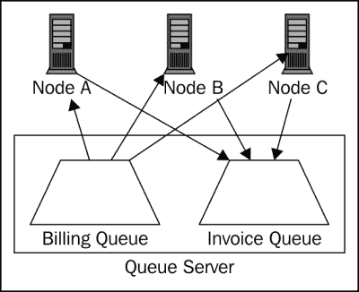
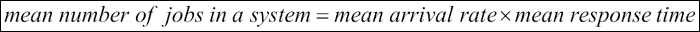
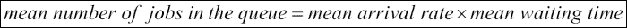

# 第八章 应用性能

最早的计算设备是为了执行自动计算而建造的，随着计算机能力的增强，它们因为能够进行多少以及多快地计算而变得越来越受欢迎。即使今天，这种本质仍然存在于我们通过在计算机上运行的应用程序来期待计算机能够比以前更快地执行我们的业务计算的预期中。

与我们在前几章中看到的较小组件级别的性能分析和优化相比，提高应用层性能需要整体方法。更高级别的关注点，例如每天服务一定数量的用户，或者通过多层系统处理已识别的负载量，需要我们思考组件如何组合以及负载是如何设计通过它的。在本章中，我们将讨论这些高级关注点。与上一章类似，总体而言，本章适用于用任何 JVM 语言编写的应用程序，但重点在于 Clojure。在本章中，我们将讨论适用于代码所有层的通用性能技术：

+   选择库

+   日志记录

+   数据大小

+   资源池化

+   提前获取和计算

+   阶段化和批量处理

+   李特尔法则

# 选择库

大多数非平凡应用都高度依赖于第三方库来实现各种功能，例如日志记录、处理网络请求、连接数据库、写入消息队列等。许多这些库不仅执行关键业务功能的一部分，而且出现在性能敏感的代码区域，影响整体性能。在充分进行性能分析之后，我们明智地选择库（在功能与性能权衡方面）是至关重要的。

选择库的关键因素不是确定使用哪个库，而是拥有我们应用程序的性能模型，并且对代表性负载下的用例进行了基准测试。只有基准测试才能告诉我们性能是否存在问题或可接受。如果性能低于预期，深入分析可以显示第三方库是否导致了性能问题。在第六章测量性能和第七章性能优化中，我们讨论了如何测量性能和识别瓶颈。您可以针对性能敏感的用例评估多个库，并选择适合的库。

库通常会随着新版本的发布而提高（或偶尔降低）性能，因此测量和配置（比较，跨版本）应该成为我们应用程序开发和维护生命周期中的持续实践。另一个需要注意的因素是，库可能会根据用例、负载和基准表现出不同的性能特征。魔鬼在于基准的细节。确保你的基准尽可能接近你应用程序的代表性场景。

## 通过基准测试进行选择

让我们简要地看看一些通用用例，在这些用例中，第三方库的性能是通过基准测试暴露的。

### Web 服务器

由于其通用性和范围，Web 服务器通常会受到大量的性能基准测试。这里有一个针对 Clojure Web 服务器的基准测试示例：

[`github.com/ptaoussanis/clojure-web-server-benchmarks`](https://github.com/ptaoussanis/clojure-web-server-benchmarks)

Web 服务器是复杂的软件组件，它们可能在各种条件下表现出不同的特性。正如你将注意到的，性能数字根据 keep-alive 模式与非 keep-alive 模式以及请求量而变化——在撰写本文时，Immutant-2 在 keep-alive 模式下表现更好，但在非 keep-alive 基准测试中表现不佳。在生产中，人们通常在应用程序服务器前使用反向代理服务器，例如 Nginx 或 HAProxy，这些服务器与应用程序服务器建立 keep-alive 连接。

### 网络路由库

如此列出的 Clojure 有几个 Web 路由库：

[`github.com/juxt/bidi#comparison-with-other-routing-libraries`](https://github.com/juxt/bidi#comparison-with-other-routing-libraries)

同样的文档还显示了一个以**Compojure**为基准的性能基准测试，其中（在撰写本文时）Compojure 的表现优于**Bidi**。然而，另一个基准测试比较了 Compojure、**Clout**（Compojure 内部使用的库）和**CalfPath**路由。

[`github.com/kumarshantanu/calfpath#development`](https://github.com/kumarshantanu/calfpath#development)

在这个基准测试中，截至本文撰写时，Clout 的表现优于 Compojure，而 CalfPath 的表现优于 Clout。然而，你应该注意任何更快库的注意事项。

### 数据序列化

在 Clojure 中，有几种方法可以序列化数据，例如 EDN 和 Fressian。Nippy 是另一个序列化库，它有基准测试来展示它在 EDN 和 Fressian 上的性能表现：

[`github.com/ptaoussanis/nippy#performance`](https://github.com/ptaoussanis/nippy#performance)

我们在第二章*Clojure 抽象*中介绍了 Nippy，展示了它是如何使用 transients 来加速其内部计算的。即使在 Nippy 内部，也有几种不同的序列化方式，它们具有不同的特性/性能权衡。

### JSON 序列化

解析和生成 JSON 是 RESTful 服务和 Web 应用程序中非常常见的用例。Clojure contrib 库 clojure/data.json ([`github.com/clojure/data.json`](https://github.com/clojure/data.json)) 提供了这项功能。然而，许多人发现 Cheshire 库 [`github.com/dakrone/cheshire`](https://github.com/dakrone/cheshire) 的性能远优于前者。Cheshire 包含的基准测试可以通过以下命令运行：

```java
lein with-profile dev,benchmark test
```

Cheshire 内部使用 Jackson Java 库 [`github.com/FasterXML/jackson`](https://github.com/FasterXML/jackson)，它以其良好的性能而闻名。

### JDBC

使用关系型数据库的应用程序中，JDBC 访问是另一个非常常见的用例。Clojure contrib 库 `clojure/java.jdbc` [`github.com/clojure/java.jdbc`](https://github.com/clojure/java.jdbc) 提供了 Clojure JDBC API。Asphalt [`github.com/kumarshantanu/asphalt`](https://github.com/kumarshantanu/asphalt) 是一个替代的 JDBC 库，比较基准测试可以按照以下方式运行：

```java
lein with-profile dev,c17,perf test
```

到本文写作时为止，Asphalt 的性能优于 `clojure/java.jdbc` 几微秒，这在低延迟应用中可能很有用。然而，请注意，JDBC 性能通常受 SQL 查询/连接、数据库延迟、连接池参数等因素的影响。我们将在后面的章节中更详细地讨论 JDBC。

# 日志记录

日志记录是一种普遍的活动，几乎所有非平凡的应用程序都会进行。日志调用非常频繁，因此确保我们的日志配置针对性能进行了优化非常重要。如果您对日志系统（尤其是在 JVM 上）不熟悉，您可能需要花些时间先熟悉这些内容。我们将介绍 `clojure/tools.logging`、**SLF4J** 和 **LogBack** 库（作为一个组合）的使用，并探讨如何使它们性能良好：

+   Clojure/tools.logging [`github.com/clojure/tools.logging`](https://github.com/clojure/tools.logging)

+   SLF4J: [`www.slf4j.org/`](http://www.slf4j.org/)

+   LogBack: [`logback.qos.ch/`](http://logback.qos.ch/)

## 为什么选择 SLF4J/LogBack？

除了 SLF4J/LogBack，Clojure 应用程序中还有几个日志库可供选择，例如 Timbre、Log4j 和 java.util.logging。虽然这些库本身没有问题，但我们通常被迫选择一个可以覆盖我们应用程序中大多数其他第三方库（包括 Java 库）的库进行日志记录。SLF4J 是一个 Java 日志门面，它可以检测任何可用的实现（LogBack、Log4j 等）——我们选择 LogBack 只是因为它性能良好且高度可配置。clojure/tools.logging 库提供了一个 Clojure 日志 API，它会在类路径中检测 SLF4J、Log4j 或 java.util.logging（按此顺序），并使用找到的第一个实现。

## 设置

让我们通过使用 LogBack、SLF4J 和`clojure/tools.logging`为使用 Leiningen 构建的项目设置日志系统。

### 依赖项

您的`project.clj`文件应该在`:dependencies`键下包含 LogBack、SLF4J 和`clojure/tools.logging`依赖项：

```java
[ch.qos.logback/logback-classic "1.1.2"]
[ch.qos.logback/logback-core    "1.1.2"]
[org.slf4j/slf4j-api            "1.7.9"]
[org.codehaus.janino/janino     "2.6.1"]  ; for Logback-config
[org.clojure/tools.logging      "0.3.1"]
```

之前提到的版本是当前的，并且是在写作时有效的。如果您有的话，您可能想使用更新的版本。

### LogBack 配置文件

您需要在`resources`目录下创建一个`logback.xml`文件：

```java
<?xml version="1.0" encoding="UTF-8"?>
<configuration>

  <appender name="FILE"
            class="ch.qos.logback.core.rolling.RollingFileAppender">
    <file>${logfile.general.name:-logs/application.log}</file>
    <rollingPolicy class="ch.qos.logback.core.rolling.TimeBasedRollingPolicy">
      <!-- daily rollover -->
      <fileNamePattern>${logfile.general.name:-logs/application.log}.%d{yyyy-MM-dd}.%i.gz</fileNamePattern>
      <timeBasedFileNamingAndTriggeringPolicy class="ch.qos.logback.core.rolling.SizeAndTimeBasedFNATP">
        <!-- or whenever the file size reaches 100MB -->
        <maxFileSize>100MB</maxFileSize>
      </timeBasedFileNamingAndTriggeringPolicy>
      <!-- keep 30 days worth of history -->
      <maxHistory>30</maxHistory>
    </rollingPolicy>
    <append>true</append>
    <encoder class="ch.qos.logback.core.encoder.LayoutWrappingEncoder">
      <layout class="ch.qos.logback.classic.PatternLayout">
        <pattern>%d{HH:mm:ss.SSS} [%thread] %-5level %logger{36} - %msg%n</pattern>
      </layout>
 <immediateFlush>false</immediateFlush>
    </encoder>
  </appender>

 <appender name="AsyncFile" class="ch.qos.logback.classic.AsyncAppender">
 <queueSize>500</queueSize>
 <discardingThreshold>0</discardingThreshold>
 <appender-ref ref="FILE" />
 </appender>

  <!-- You may want to set the level to DEBUG in development -->
  <root level="ERROR">
 <appender-ref ref="AsyncFile" />
  </root>

  <!-- Replace com.example with base namespace of your app -->
  <logger name="com.example" additivity="false">
    <!-- You may want to set the level to DEBUG in development -->
    <level value="INFO"/>
 <appender-ref ref="AsyncFile" />
  </logger>

</configuration>
```

之前的`logback.xml`文件故意设计得简单（为了说明），只包含足够的配置，以便您开始使用 LogBack 进行日志记录。

### 优化

优化点在我们在本节中之前看到的`logback.xml`文件中被突出显示。我们将`immediateFlush`属性设置为`false`，这样消息在刷新到追加器之前会被缓冲。我们还用异步追加器包装了常规文件追加器，并编辑了`queueSize`和`discardingThreshold`属性，这比默认设置得到了更好的结果。

除非进行优化，否则日志配置通常是许多应用程序性能不佳的常见原因。通常，性能问题只有在高负载且日志量非常大时才会显现。之前讨论的优化只是众多可能的优化中的一部分。在 LogBack 文档中，例如**编码器**([`logback.qos.ch/manual/encoders.html`](http://logback.qos.ch/manual/encoders.html))、**追加器**([`logback.qos.ch/manual/appenders.html`](http://logback.qos.ch/manual/appenders.html))和**配置**([`logback.qos.ch/manual/configuration.html`](http://logback.qos.ch/manual/configuration.html))部分提供了有用的**信息**。互联网上也有关于如何使用 7 个 LogBack 调整来即时提高 Java 日志的技巧[`blog.takipi.com/how-to-instantly-improve-your-java-logging-with-7-logback-tweaks/`](http://blog.takipi.com/how-to-instantly-improve-your-java-logging-with-7-logback-tweaks/)，可能提供有用的指导。

# 数据大小

在数据大小方面，抽象的成本起着重要作用。例如，一个数据元素是否可以适应处理器缓存行直接取决于其大小。在 Linux 系统中，我们可以通过检查`/sys/devices/system/cpu/cpu0/cache/`目录下的文件中的值来找出缓存行大小和其他参数。请参阅第四章，*主机性能*，其中我们讨论了如何计算原语、对象和数据元素的大小。

我们在数据大小方面通常遇到的一个问题是我们在任何时间点在堆中保留多少数据。正如我们在前面的章节中提到的，垃圾回收（GC）对应用程序性能有直接影响。在处理数据时，我们通常并不真的需要我们持有的所有数据。考虑一下生成某个时间段（月份）内已售商品的总结报告的例子。在计算子时间段（按月）的总结数据后，我们不再需要项目详情，因此在我们添加总结的同时删除不需要的数据会更好。请看以下示例：

```java
(defn summarize [daily-data]  ; daily-data is a map
  (let [s (items-summary (:items daily-data))]
    (-> daily-data
      (select-keys [:digest :invoices])  ; keep required k/v pairs
      (assoc :summary s))))

;; now inside report generation code
(-> (fetch-items period-from period-to :interval-day)
  (map summarize)
  generate-report)
```

如果我们在之前的`summarize`函数中没有使用`select-keys`，它将返回一个包含额外`:summary`数据以及地图中所有其他现有键的映射。现在，这种事情通常与懒序列结合使用，因此为了使此方案有效，重要的是不要保留懒序列的头部。回想一下，在第二章中，我们讨论了保留懒序列头部所带来的风险。

## 减少序列化

我们在前面章节中讨论过，通过 I/O 通道进行序列化是延迟的常见来源。过度序列化的风险不容忽视。无论我们是从数据源通过 I/O 通道读取还是写入数据，所有这些数据都需要在处理之前准备、编码、序列化、反序列化和解析。涉及的数据越少，对每一步来说越好，以便降低开销。在没有涉及 I/O（如进程间通信）的情况下，通常没有必要进行序列化。

在与 SQL 数据库一起工作时，过度序列化的一个常见例子是。通常，有一些常见的 SQL 查询函数可以检索表或关系的所有列——它们被各种实现业务逻辑的函数调用。检索我们不需要的数据是浪费的，并且与我们在上一段中讨论的原因一样，对性能有害。虽然为每个用例编写一个 SQL 语句和一个数据库查询函数可能看起来工作量更大，但这样做会带来更好的性能。使用 NoSQL 数据库的代码也容易受到这种反模式的影响——我们必须注意只检索我们需要的，即使这可能导致额外的代码。

在减少序列化时，有一个需要注意的陷阱。通常，在没有序列化数据的情况下，需要推断一些信息。在这种情况下，如果我们删除了一些序列化以推断其他信息，我们必须比较推断成本与序列化开销。这种比较可能不仅限于每个操作，而且可能是整体上的，这样我们就可以考虑我们可以分配的资源，以便为我们的系统各个部分实现能力。

## 将数据块化以减轻内存压力

当我们不考虑文件大小而读取文本文件时会发生什么？整个文件的内容将驻留在 JVM 堆中。如果文件大于 JVM 堆容量，JVM 将终止，抛出`OutOfMemoryError`。如果文件很大，但不足以迫使 JVM 进入 OOM 错误，它将为其他操作在应用程序中留下相对较少的 JVM 堆空间。当我们执行任何不考虑 JVM 堆容量的操作时，也会发生类似的情况。幸运的是，可以通过分块读取数据并在读取更多之前处理它们来解决这个问题。在第三章《依赖 Java》中，我们简要讨论了内存映射缓冲区，这是另一种补充解决方案，你可能愿意探索。

### 文件/网络操作的大小

让我们以一个数据摄取过程为例，其中半自动作业通过**文件传输协议（FTP）**将大型**逗号分隔文件（CSV）**上传到文件服务器，另一个自动作业（用 Clojure 编写）定期运行以通过网络文件系统（NFS）检测文件的到达。检测到新文件后，Clojure 程序处理文件，更新数据库中的结果，并归档文件。程序检测并处理多个文件并发。CSV 文件的大小事先未知，但格式是预定义的。

根据前面的描述，一个潜在的问题是，由于可能同时处理多个文件，我们如何分配 JVM 堆空间给并发文件处理作业？另一个问题是操作系统对一次可以打开的文件数量有限制；在类 Unix 系统中，你可以使用`ulimit`命令来扩展限制。我们不能任意地读取 CSV 文件内容——我们必须限制每个作业的内存量，并限制可以并发运行的作业数量。同时，我们也不能一次读取文件中的非常少的行，因为这可能会影响性能：

```java
(def ^:const K 1024)

;; create the buffered reader using custom 128K buffer-size
(-> filename
  java.io.FileInputStream.
  java.io.InputStreamReader.
  (java.io.BufferedReader. (* K 128)))
```

幸运的是，我们可以在从文件（甚至从网络流）读取时指定缓冲区大小，以便根据需要调整内存使用和性能。在前面的代码示例中，我们明确设置了读取器的缓冲区大小，以促进这一点。

### JDBC 查询结果的大小

Java 的 SQL 数据库接口标准 JDBC（技术上不是一个缩写），支持通过 JDBC 驱动程序获取查询结果时的*获取大小*。默认的获取大小取决于 JDBC 驱动程序。大多数 JDBC 驱动程序保持一个较低的默认值，以避免高内存使用和内部性能优化原因。这个规范的一个显著例外是 MySQL JDBC 驱动程序，它默认完全获取并存储所有行到内存中：

```java
(require '[clojure.java.jdbc :as jdbc])

;; using prepare-statement directly
(with-open
  [stmt (jdbc/prepare-statement
          conn sql :fetch-size 1000 :max-rows 9000)
   rset (resultset-seq (.executeQuery stmt))]
  (vec rset))

;; using query
(jdbc/query db [{:fetch-size 1000}
           "SELECT empno FROM emp WHERE country=?" 1])
```

当使用 Clojure contrib 库的`java.jdbc`（自版本 0.3.7 起[`github.com/clojure/java.jdbc`](https://github.com/clojure/java.jdbc)），可以在准备语句时设置获取大小，如前一个示例所示。请注意，获取大小并不能保证成比例的延迟；然而，它可以安全地用于内存大小调整。我们必须测试由于获取大小引起的性能影响延迟变化，这在不同负载和特定数据库及 JDBC 驱动程序的使用场景中是必须的。另一个需要注意的重要因素是，`:fetch-size`的好处只有在查询结果集是增量且惰性消费的情况下才有用——如果函数从结果集中提取所有行以创建一个向量，那么从内存节省的角度来看，`:fetch-size`的好处就消失了。除了获取大小之外，我们还可以传递`:max-rows`参数来限制查询返回的最大行数——然而，这表示额外的行将从结果中截断，而不是数据库是否会在内部限制行数以实现这一点。

# 资源池

在 JVM 上，有一些资源初始化成本相当高。例如，HTTP 连接、执行线程、JDBC 连接等。Java API 识别这些资源，并内置了对创建某些资源池的支持，这样消费者代码在需要时可以从池中借用资源，并在工作结束时简单地将其返回到池中。Java 的线程池（在第五章 Chapter 5 中讨论，*并发*）和 JDBC 数据源是突出的例子。这个想法是保留初始化对象以供重用。尽管 Java 不支持直接对资源类型进行池化，但总可以在自定义昂贵资源周围创建一个池抽象。请注意，池化技术在 I/O 活动中很常见，但也可以同样适用于初始化成本高的非 I/O 目的。

## JDBC 资源池

Java 支持通过 `javax.sql.DataSource` 接口获取 JDBC 连接，该接口可以被池化。一个 JDBC 连接池实现了这个接口。通常，JDBC 连接池是由第三方库或 JDBC 驱动本身实现的。一般来说，很少 JDBC 驱动实现连接池，因此像 Apache DBCP、c3p0、BoneCP、HikariCP 等开源第三方 JDBC 资源池库非常流行。它们还支持验证查询以清除可能由网络超时和防火墙引起的陈旧连接，并防止连接泄漏。Apache DBCP 和 HikariCP 可以通过它们各自的 Clojure 包装库 Clj-DBCP ([`github.com/kumarshantanu/clj-dbcp`](https://github.com/kumarshantanu/clj-dbcp)) 和 HikariCP ([`github.com/tomekw/hikari-cp`](https://github.com/tomekw/hikari-cp)) 从 Clojure 访问，并且有一些 Clojure 示例描述了如何构建 C3P0 和 BoneCP 池 ([`clojure-doc.org/articles/ecosystem/java_jdbc/connection_pooling.html`](http://clojure-doc.org/articles/ecosystem/java_jdbc/connection_pooling.html))。

连接不是唯一需要池化的 JDBC 资源。每次我们创建一个新的 JDBC 预编译语句时，根据 JDBC 驱动程序的实现，通常整个语句模板都会发送到数据库服务器以获取预编译语句的引用。由于数据库服务器通常部署在不同的硬件上，可能存在网络延迟。因此，预编译语句的池化是 JDBC 资源池库的一个非常理想特性。Apache DBCP、C3P0 和 BoneCP 都支持语句池化，而 Clj-DBCP 包装库可以开箱即用地实现预编译语句的池化，以获得更好的性能。HikariCP 认为，如今，语句池化已经由 JDBC 驱动程序内部完成，因此不需要显式池化。我强烈建议使用连接池库进行基准测试，以确定它是否真的适用于您的 JDBC 驱动程序和应用程序。

# I/O 批处理和节流

众所周知，嘈杂的 I/O 调用通常会导致性能不佳。一般来说，解决方案是将几条消息批在一起，然后在一个负载中发送。在数据库和网络调用中，批处理是一种常见且有用的技术，可以提高吞吐量。另一方面，大的批处理大小实际上可能会损害吞吐量，因为它们倾向于产生内存开销，并且组件可能无法一次性处理大的批处理。因此，确定批处理大小和节流与批处理本身一样重要。我强烈建议在代表性负载下进行自己的测试，以确定最佳批处理大小。

## JDBC 批处理操作

JDBC 在其 API 中已经很长时间支持批量更新，包括 `INSERT`、`UPDATE`、`DELETE` 语句。Clojure contrib 库 `java.jdbc` 通过其自己的 API 支持 JDBC 批量操作，如下所示：

```java
(require '[clojure.java.jdbc :as jdbc])

;; multiple SQL statements
(jdbc/db-do-commands
  db true
  ["INSERT INTO emp (name, countrycode) VALUES ('John Smith', 3)"
   "UPDATE emp SET countrycode=4 WHERE empid=1379"])

;; similar statements with only different parametrs
(jdbc/db-do-prepared
  db true
  "UPDATE emp SET countrycode=? WHERE empid=?"
  [4 1642]
  [9 1186]
  [2 1437])
```

除了批量更新支持外，我们还可以进行批量 JDBC 查询。其中一种常见的技术是使用 SQL `WHERE` 子句来避免 `N+1` 查询问题。`N+1` 问题指的是当我们对主表中的每一行执行一个查询到另一个子表时的情况。类似的技巧可以用来将同一表上的几个相似查询合并为一个，并在程序之后分离数据。

考虑以下使用 clojure.java.jdbc 0.3.7 和 MySQL 数据库的示例：

```java
(require '[clojure.java.jdbc :as j])

(def db {:subprotocol "mysql"
         :subname "//127.0.0.1:3306/clojure_test"
         :user "clojure_test" :password "clojure_test"})

;; the snippet below uses N+1 selects
;; (typically characterized by SELECT in a loop)
(def rq "select order_id from orders where status=?")
(def tq "select * from items where fk_order_id=?")
(doseq [order (j/query db [rq "pending"])]
  (let [items (j/query db [tq (:order_id order)])]
    ;; do something with items
    …))

;; the snippet below avoids N+1 selects,
;; but requires fk_order_id to be indexed
(def jq "select t.* from orders r, items t
  where t.fk_order_id=r.order_id and r.status=? order by t.fk_order_id")
(let [all-items (group-by :fk_order_id (j/query db [jq "pending"]))]
  (doseq [[order-id items] all-items]
    ;; do something with items
    ...))
```

在前面的例子中，有两个表：`orders` 和 `items`。第一个片段从 `orders` 表中读取所有订单 ID，然后通过循环查询 `items` 表中的相应条目。这是你应该注意的 `N+1` 查询性能反模式。第二个片段通过发出单个 SQL 查询来避免 `N+1` 查询，但除非列 `fk_order_id` 已索引，否则可能表现不佳。

## API 级别的批量支持

在设计任何服务时，提供一个用于批量操作的 API 非常有用。这为 API 增加了灵活性，使得批量大小和节流可以以细粒度的方式控制。不出所料，这也是构建高性能服务的一个有效方法。在实现批量操作时，我们经常遇到的一个常见开销是识别每个批次中的每个项目及其在请求和响应之间的关联。当请求是异步的时，这个问题变得更加突出。

解决项目识别问题的解决方案是通过为请求（批次）中的每个项目分配一个规范或全局 ID，或者为每个请求（批次）分配一个唯一的 ID，并为请求中的每个项目分配一个属于批次的本地 ID。

确切解决方案的选择通常取决于实现细节。当请求是同步的时，你可以省略对每个请求项的识别（参考 Facebook API：[`developers.facebook.com/docs/reference/api/batch/`](http://developers.facebook.com/docs/reference/api/batch/)，其中响应中的项遵循请求中的相同顺序）。然而，在异步请求中，可能需要通过状态检查调用或回调来跟踪项。所需的跟踪粒度通常指导适当的项识别策略。

例如，如果我们有一个用于订单处理的批量 API，每个订单都会有一个唯一的 Order-ID，可以在后续的状态检查调用中使用。在另一个例子中，假设有一个用于创建物联网（**IoT**）设备 API 密钥的批量 API——在这里，API 密钥事先并不知道，但它们可以在同步响应中生成和返回。然而，如果这必须是一个异步批量 API，服务应该响应一个批量请求 ID，稍后可以使用该 ID 查找请求的状态。在请求 ID 的批量响应中，服务器可以包括请求项目 ID（例如设备 ID，对于客户端可能是唯一的，但不是所有客户端都是唯一的）及其相应的状态。

## 节流对服务的请求

由于每个服务只能处理一定的容量，因此我们向服务发送请求的速率很重要。对服务行为的期望通常涉及吞吐量和延迟两个方面。这要求我们以指定的速率发送请求，因为低于该速率可能会导致服务利用率不足，而高于该速率可能会使服务过载或导致失败，从而引起客户端利用率不足。

假设第三方服务每秒可以接受 100 个请求。然而，我们可能不知道该服务的实现有多稳健。尽管有时并没有明确指定，但在每秒内一次性发送 100 个请求（例如在 20 毫秒内），可能会低于预期的吞吐量。例如，将请求均匀地分布在 1 秒的时间内，比如每 10 毫秒发送一个请求（1000 毫秒 / 100 = 10 毫秒），可能会增加达到最佳吞吐量的机会。

对于节流，**令牌桶** ([`zh.wikipedia.org/wiki/Token_bucket`](https://zh.wikipedia.org/wiki/Token_bucket)) 和 **漏桶** ([`zh.wikipedia.org/wiki/Leaky_bucket`](https://zh.wikipedia.org/wiki/Leaky_bucket)) 算法可能很有用。在非常细粒度的层面上进行节流需要我们缓冲项目，以便我们可以保持均匀的速率。缓冲会消耗内存，并且通常需要排序；队列（在第五章中介绍，*并发*），管道和持久存储通常很好地服务于这个目的。再次强调，由于系统限制，缓冲和排队可能会受到背压的影响。我们将在本章后面的部分讨论管道、背压和缓冲。

# 预计算和缓存

在处理数据时，我们通常会遇到一些情况，其中一些常见的计算步骤先于几种后续步骤。也就是说，一部分计算是共同的，而剩余的是不同的。对于高延迟的常见计算（如访问数据时的 I/O 和内存/CPU 处理），将它们一次性计算并存储为摘要形式是非常有意义的，这样后续步骤就可以简单地使用摘要数据并从该点继续进行，从而降低整体延迟。这也被称为半计算数据的分阶段处理，是优化非平凡数据处理的一种常见技术。

Clojure 对缓存有良好的支持。内置的 `clojure.core/memoize` 函数执行基本的计算结果缓存，但在使用特定的缓存策略和可插拔后端方面没有灵活性。Clojure 的 contrib 库 `core.memoize` 通过提供几个配置选项来弥补 `memoize` 的缺乏灵活性。有趣的是，`core.memoize` 中的功能也作为单独的缓存库很有用，因此公共部分被提取出来，作为名为 `core.cache` 的 Clojure contrib 库，`core.memoize` 是在这个库之上实现的。

由于许多应用程序出于可用性、扩展性和维护原因部署在多个服务器上，它们需要快速且空间高效的分布式缓存。开源的 memcached 项目是一个流行的内存分布式键值/对象存储，可以作为 Web 应用的缓存服务器。它通过散列键来识别存储值的服务器，并且没有开箱即用的复制或持久性。它用于缓存数据库查询结果、计算结果等。对于 Clojure，有一个名为 SpyGlass 的 memcached 客户端库（[`github.com/clojurewerkz/spyglass`](https://github.com/clojurewerkz/spyglass)）。当然，memcached 不仅限于 Web 应用；它也可以用于其他目的。

# 并行管道

想象一下这样的情况，我们必须以一定的吞吐量执行工作，每个工作包括相同序列的不同大小的 I/O 任务（任务 A），一个内存受限的任务（任务 B），以及再次，一个 I/O 任务（任务 C）。一个简单的方法是创建一个线程池并在其上运行每个工作，但很快我们会意识到这不是最佳方案，因为我们无法确定每个 I/O 资源的利用率，因为操作系统调度线程的不确定性。我们还观察到，尽管几个并发工作有类似的 I/O 任务，但我们无法在我们的第一种方法中批量处理它们。

在下一个迭代中，我们将每个作业分成阶段（A、B、C），使得每个阶段对应一个任务。由于任务已知，我们为每个阶段创建一个适当大小的线程池并执行其中的任务。任务 A 的结果需要由任务 B 使用，B 的结果需要由任务 C 使用——我们通过队列启用这种通信。现在，我们可以调整每个阶段的线程池大小，批量处理 I/O 任务，并调整它们以实现最佳吞吐量。这种安排是一种并发管道。一些读者可能会觉得这种安排与 actor 模型或**阶段事件驱动架构**（**SEDA**）模型有微妙的相似之处，这些是针对此类方法更精细的模型。回想一下，我们在第五章中讨论了几种进程内队列，*并发*。

## 分布式管道

采用这种方法，可以通过网络队列将作业执行扩展到集群中的多个主机，从而卸载内存消耗、持久性和交付到队列基础设施。例如，在某个场景中，集群中可能有几个节点，它们都在运行相同的代码，并通过网络队列交换消息（请求和中间结果数据）。

下图展示了简单的发票生成系统如何连接到网络队列：



RabbitMQ、HornetQ、ActiveMQ、Kestrel 和 Kafka 是一些知名的开源队列系统。偶尔，作业可能需要分布式状态和协调。Avout ([`avout.io/`](http://avout.io/)) 项目实现了 Clojure 的原子和 ref 的分布式版本，可用于此目的。Tesser ([`github.com/aphyr/tesser`](https://github.com/aphyr/tesser)) 是另一个用于本地和分布式并行性的 Clojure 库。Storm ([`storm-project.net/`](http://storm-project.net/)) 和 Onyx ([`www.onyxplatform.org/`](http://www.onyxplatform.org/)) 项目是使用 Clojure 实现的分布式实时流处理系统。

# 应用反向压力

我们在上章简要讨论了反向压力。没有反向压力，我们无法构建一个具有可预测稳定性和性能的合理负载容忍系统。在本节中，我们将看到如何在应用程序的不同场景中应用反向压力。在基本层面上，我们应该有一个系统最大并发作业数的阈值，并根据该阈值，在一定的到达率之上拒绝新的请求。被拒绝的消息可能由客户端重试，如果没有对客户端的控制，则忽略。在应用反向压力到面向用户的服务时，检测系统负载并首先拒绝辅助服务可能是有用的，以保存容量并在高负载下优雅地降级。

## 线程池队列

JVM 线程池由队列支持，这意味着当我们向已经达到最大运行作业数量的线程池提交作业时，新作业将进入队列。默认情况下，队列是无界的，这不适合应用背压。因此，我们必须创建一个由有界队列支持的线程池：

```java
(import 'java.util.concurrent.LinkedBlockingDeque)
(import 'java.util.concurrent.TimeUnit)
(import 'java.util.concurrent.ThreadPoolExecutor)
(import 'java.util.concurrent.ThreadPoolExecutor$AbortPolicy)
(def tpool
  (let [q (LinkedBlockingDeque. 100)
        p (ThreadPoolExecutor$AbortPolicy.)]
    (ThreadPoolExecutor. 1 10 30 TimeUnit/SECONDS q p)))
```

现在，在这个池中，每当尝试添加的作业数量超过队列容量时，它将抛出一个异常。调用者应将异常视为缓冲区满的条件，并通过定期调用 `java.util.concurrent.BlockingQueue.remainingCapacity()` 方法等待直到缓冲区再次有空闲容量。

## Servlet 容器，如 Tomcat 和 Jetty

在同步的 **Tomcat** 和 **Jetty** 版本中，每个 HTTP 请求都会从用户可以配置的公共线程池中分配一个专用线程。正在服务的并发请求数量受线程池大小的限制。一种常见的控制到达率的方法是设置服务器的线程池大小。在开发模式下，**Ring** 库默认使用嵌入的 Jetty 服务器。Ring 中的嵌入 Jetty 适配器（在 Ring 中）可以通过程序配置线程池大小。

在 Tomcat 和 Jetty 的异步（Async Servlet 3.0）版本中，除了线程池大小外，还可以指定处理每个请求的超时时间。然而，请注意，线程池大小在异步版本中不会像在同步版本中那样限制请求数量。请求处理被转移到 ExecutorService（线程池），它可能会缓冲请求，直到有可用的线程。这种缓冲行为很棘手，因为这可能会导致系统过载——你可以通过定义自己的线程池来覆盖默认行为，而不是使用 servlet 容器的线程池，在等待请求达到一定阈值时返回 HTTP 错误。

## HTTP Kit

**HTTP Kit** ([`http-kit.org/`](http://http-kit.org/)) 是一个高性能的异步（基于 Java NIO 实现）的 Clojure 网络服务器。它内置了对通过指定队列长度应用背压以处理新请求的支持。截至 HTTP Kit 2.1.19，请参阅以下代码片段：

```java
(require '[org.httpkit.server :as hk])

;; handler is a typical Ring handler
(hk/run-server handler {:port 3000 :thread 32 :queue-size 600})
```

在前面的代码片段中，工作线程池大小为 32，最大队列长度指定为 600。如果没有指定，则应用背压的默认最大队列长度为 20480。

## Aleph

Aleph ([`aleph.io/`](http://aleph.io/)) 是另一个基于 Java Netty ([`netty.io/`](http://netty.io/)) 库的高性能异步网络服务器，而 Java Netty 又是基于 Java NIO。Aleph 通过其与 Netty 兼容的自定义原语扩展了 Netty。Aleph 的工作线程池通过一个选项指定，如下面的代码片段所示，截至 Aleph 0.4.0：

```java
(require '[aleph.http :as a])

;; handler is a typical Ring handler
(a/start-server handler {:executor tpool})
```

在这里，`tpool`指的是在子节*线程池队列*中讨论的有界线程池。默认情况下，Aleph 使用一个动态线程池，最大限制为 512 个线程，通过**Dirigiste** ([`github.com/ztellman/dirigiste`](https://github.com/ztellman/dirigiste))库达到 90%的系统利用率。

反压不仅涉及将有限数量的工作项入队，当对等方速度慢时，还会减慢工作项的处理速度。Aleph 通过“在内存耗尽之前不接受数据”——它回退到阻塞而不是丢弃数据，或者引发异常并关闭连接来处理每个请求的反压（例如，在流式响应数据时）。

# 性能和排队理论

如果我们观察多次运行中的性能基准数字，即使硬件、负载和操作系统保持不变，这些数字也很少完全相同。每次运行之间的差异可能高达-8%到 8%，没有明显的原因。这可能会让人感到惊讶，但深层次的原因是计算机系统的性能本质上具有**随机性**。计算机系统中存在许多小因素，使得在任何给定时间点的性能不可预测。至多，性能变化可以通过一系列随机变量的概率来解释。

基本前提是每个子系统或多或少像是一个队列，其中请求等待它们的轮次被服务。CPU 有一个指令队列，其 fetch/decode/branch-predict 的时序不可预测，内存访问再次取决于缓存命中率以及是否需要通过互连进行调度，而 I/O 子系统使用中断来工作，这些中断可能又依赖于 I/O 设备的机械因素。操作系统调度等待而不执行线程。构建在所有这些之上的软件基本上在各种队列中等待以完成任务。

## Little 定律

Little 定律指出，在稳态下，以下情况成立：



这是一个相当重要的定律，它使我们能够了解系统容量，因为它独立于其他因素。例如，如果满足请求的平均时间是 200 毫秒，而服务率约为每秒 70 次，那么正在被服务请求的平均数量是*70 次/秒 x 0.2 秒 = 14 个请求*。

注意，Little 定律没有讨论请求到达率或延迟（由于 GC 和/或其他瓶颈）的峰值，或者系统对这些因素的响应行为。当到达率在某个点出现峰值时，您的系统必须拥有足够的资源来处理服务请求所需的并发任务数量。我们可以推断出，Little 定律有助于测量和调整一段时间内的平均系统行为，但我们不能仅基于这一点来规划容量。

### 根据 Little 定律进行性能调整

为了保持良好的吞吐量，我们应该努力维持系统总任务数的上限。由于系统中可能存在许多种类的任务，并且在没有瓶颈的情况下，许多任务可以愉快地共存，因此更好的说法是确保系统利用率和瓶颈保持在限制范围内。

通常，到达率可能不在系统的控制范围内。对于此类场景，唯一的选择是尽可能减少延迟，并在系统中的总作业达到一定阈值后拒绝新的请求。你可能只能通过性能和负载测试来了解正确的阈值。如果你可以控制到达率，你可以根据性能和负载测试来调节到达（流量），以保持稳定的流动。

# 摘要

设计用于性能的应用程序应基于预期的系统负载和使用案例的模式。测量性能对于指导过程中的优化至关重要。幸运的是，有几个著名的优化模式可以利用，例如资源池、数据大小、预取和预计算、分阶段、批量处理等等。实际上，应用程序的性能不仅取决于使用案例和模式——整个系统是一个连续的随机事件序列，可以通过统计方法进行评估，并由概率指导。Clojure 是一种用于高性能编程的有趣语言。这本书规定了性能的许多指针和实践，但没有一个咒语可以解决所有问题。魔鬼在于细节。了解惯用和模式，通过实验看看哪些适用于你的应用程序，并知道哪些规则你可以为了性能而弯曲。
