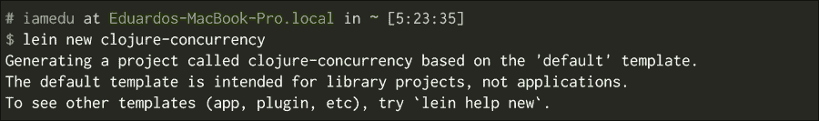
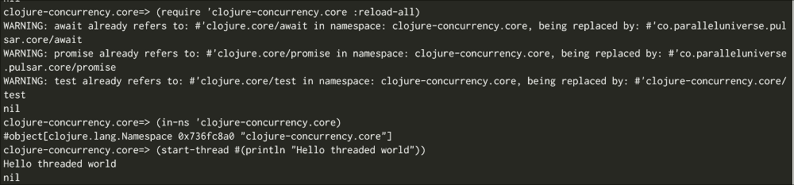
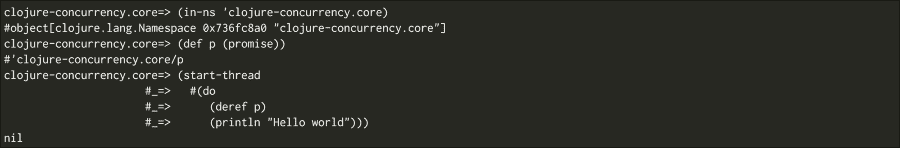
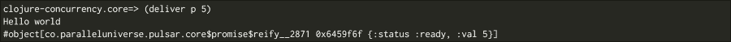
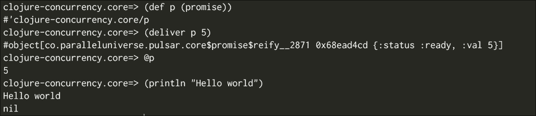
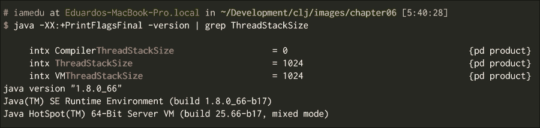
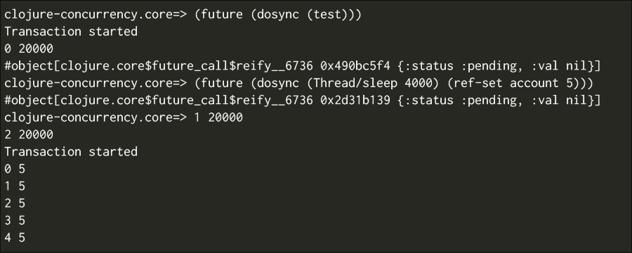
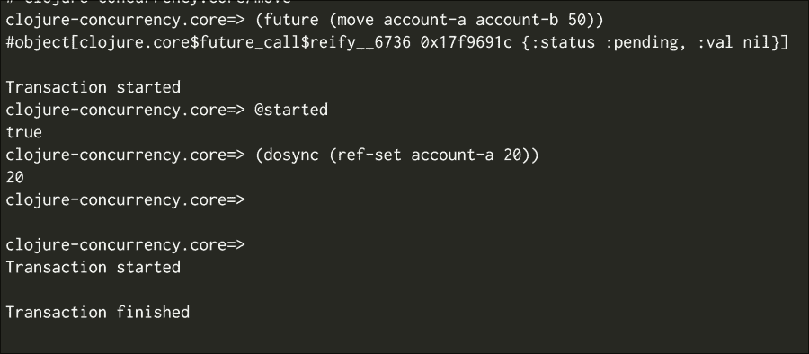

# 第六章。并发

编程已经改变了，在过去，我们只需依赖计算机每年变得更强大。这变得越来越困难；因此，硬件制造商正在采取不同的方法。现在，他们正在将更多的处理器嵌入到计算机中。如今，看到只有或四个核心的手机并不罕见。

这需要一种不同的软件编写方式，其中我们能够显式地执行其他进程中的某些任务。现代语言正在尝试使这项任务对现代开发者来说可行且更容易，Clojure 也不例外。

在本章中，我们将通过回顾 Clojure 的核心概念和原语来了解 Clojure 如何使你能够通过编写简单的并发程序；特别是，我们需要理解 Clojure 嵌入到语言中的身份和值的概念。在本章中，我们将涵盖以下主题：

+   运用你的 Java 知识

+   Clojure 的状态和身份模型

+   承诺

+   未来

+   软件事务内存和引用

+   原子

+   代理

+   验证器

+   监视器

# 运用你的 Java 知识

知道 Java 以及熟悉 Java 的线程 API 给你带来了巨大的优势，因为 Clojure 依赖于你已经知道的工具。

在这里，你将看到如何使用线程，你可以扩展这里看到的一切来执行其他服务。

在继续之前，让我们创建一个新的项目，我们将将其用作所有测试的沙盒。

如下截图所示创建它：



修改 `clojure-concurrency.core` 命名空间，使其看起来类似于以下代码片段：

```java
(ns clojure-concurrency.core)

(defn start-thread [func]
  (.start (Thread. func)))
```

这里发生的事情很容易理解。我们使用我们的函数创建了一个线程，然后启动它；这样我们就可以在 REPL 中使用它，如下所示：



### 小贴士

`java.lang.Thread` 有一个构造函数，它接收一个实现可运行接口的对象。你只需传递一个 Clojure 函数，因为 Clojure 中的每个函数都实现了可运行和可调用接口。这意味着你还可以在 Clojure 中透明地使用执行器！

我们将在任意顺序中看到 `nil` 和 `Hello threaded world` 的值。`nil` 值是启动线程返回的值。

`Hello threaded world` 是来自另一个线程的消息。有了这个，我们现在有了基本的工具来了解和理解 Clojure 中线程的工作方式。

# Clojure 的状态和身份模型

Clojure 对并发有非常强烈的看法，为了以更简单的方式处理它，它重新定义了状态和身份的含义。让我们探索 Clojure 中这些概念的含义。

当谈论 Java 中的状态时，你可能首先会想到你的 Java 类属性的值。Clojure 中的状态与 Java 类似，它指的是对象的值，但有一些非常重要的差异，这些差异允许更简单的并发。

在 Clojure 中，身份是一个可能在时间上具有不同值的实体。考虑以下例子：

+   我有一个身份；我将继续是这一特定个体，我的观点、想法和外表可能会随时间而改变，但我始终是同一个具有相同身份的个体。

+   你有一个银行账户；它有一个特定的号码，由特定的银行运营。你账户中的金额会随时间变化，但它始终是同一个银行账户。

+   考虑一个股票代码（例如 GOOG），它标识了股市中的一支股票；与其相关的价值会随时间变化，但它的身份不会变。

**状态**是身份在某个时间点所采取的值。它的一个重要特征是不可变性。状态是身份在某个给定时间点的快照。

所以，在之前的例子中：

+   你现在是谁，你的感受，你的外表，以及你的想法，都是你的当前状态

+   你目前在银行账户中的钱是其当前状态

+   GOOG 股票的价值是其当前状态

所有这些状态都是不可变的；无论你明天是谁，或者你赢了多少或花了多少，这都是真的，并且永远是真的，在这个特定的时间点上，你处于某种状态。

### 小贴士

Clojure 的作者 Rich Hickey 是一位伟大的演讲者，他有几场演讲解释了 Clojure 背后的思想和哲学。在其中一场（Are We There Yet?）中，他非常详细地解释了这个关于状态、身份和时间的观点。

现在我们来解释 Clojure 中的两个关键概念：

+   **身份**：在你的一生中，你有一个单一的身份；你永远不会停止成为你自己，即使你在整个一生中都在不断变化。

+   **状态**：在任何给定的生活时刻，你都是一个特定的人，有喜好、厌恶和一些信念。我们称这种生活时刻的存在方式为状态。如果你看一个特定的生活时刻，你会看到一个固定的值。没有任何东西会改变你在那个时间点的样子。那个特定的状态是不可变的；随着时间的推移，你会有不同的状态或值，但每个状态都是不可变的。

我们利用这个事实来编写更简单的并发程序。每次你想与一个身份交互时，你查看它，并获取它的当前值（一个时间点的快照），然后你用你所拥有的东西进行操作。

在命令式编程中，你通常有一个保证你拥有最新值的保证，但很难保持它的一致性状态。原因在于你依赖于共享的可变状态。

共享的可变状态是为什么你需要使用同步代码、锁和互斥锁的原因。它也是复杂程序和难以追踪的错误的原因。

现在，Java 正在从其他编程语言中吸取教训，现在它有了允许更简单并发编程的原语。这些想法来自其他语言和新的想法，所以有很大可能性有一天你会在其他主流编程语言中看到与你在学习这里相似的概念。

没有保证你总能得到最新的值，但不用担心，你只需要换一种思维方式，并使用 Clojure 提供的并发原语。

这与你在现实生活中工作的方式类似，当你为朋友或同事做某事时，你并不知道他们具体发生了什么；你与他们交谈，获取当前的事实，然后去工作。在你做这些的同时，可能需要改变一些东西；在这种情况下，我们需要一个协调机制。

Clojure 有各种这样的协调机制，让我们来看看它们。

# 承诺

如果你是一个全栈 Java 开发者，你很可能在 JavaScript 中遇到过承诺。

承诺是简单的抽象，不会对你提出严格的要求；你可以使用它们在另一个线程、轻量级进程或任何你喜欢的地方计算结果。

在 Java 中，有几种实现这种方式的方法；其中之一是使用未来（futures，`java.util.concurrentFuture`），如果你想得到一个更类似于 JavaScript 的承诺的实现，有一个叫做**jdeferred**（[`github.com/jdeferred/jdeferred`](https://github.com/jdeferred/jdeferred)）的很好的实现，你可能之前已经使用过了。

从本质上讲，承诺只是你可以提供给调用者的一个承诺，调用者可以在任何给定时间使用它。有两种可能性：

+   如果承诺已经被履行，调用将立即返回

+   如果不是，调用者将阻塞直到承诺得到履行

让我们看看一个例子；请记住在`clojure-concurrency.core`包中使用`start-thread`函数：



### 小贴士

承诺（Promises）只计算一次，然后被缓存。所以一旦计算完成，你就可以放心地多次使用它们，不会产生任何运行时成本！

让我们在这里停下来分析代码，我们创建了一个名为`p`的承诺，然后启动一个线程执行两件事。

它试图从`p`（`deref`函数试图从承诺中读取值）获取一个值，然后打印`Hello world`。

我们现在还看不到`Hello world`消息；相反，我们会看到一个`nil`值。这是为什么？

启动线程返回`nil`值，现在发生的事情正是我们最初描述的；`p`是承诺，我们的新线程将阻塞它直到它得到一个值。

为了看到`Hello world`消息，我们需要履行承诺。现在让我们来做这件事：



正如你所见，我们现在得到了`Hello world`消息！

如我所说，没有必要使用另一个线程。现在让我们在 REPL 中看看另一个例子：



### 小贴士

您可以使用 `@p` 而不是 (`deref p`)，这对本章中的每个身份也适用。

在这个例子中，我们不创建单独的线程；我们创建承诺，交付它，然后在同一线程中使用它。

如您所见，承诺是一种极其简单的同步机制，您可以选择是否使用线程、执行器服务（这只是线程池）或某种其他机制，例如轻量级线程。

让我们看看用于创建轻量级线程的 Pulsar 库。

## Pulsar 和轻量级线程

创建线程是一个昂贵的操作，并且它会消耗 RAM 内存。为了知道在 Mac OS X 或 Linux 中创建线程消耗了多少内存，请运行以下命令：

```java
java -XX:+PrintFlagsFinal -version | grep ThreadStackSize

```

您在这里看到的内容将取决于您使用的操作系统和 JVM 版本，在 Mac OS X 上使用 Java 1.8u45，我们得到以下输出：



我为每个线程获取 1024 千字节的堆栈大小。我们能做些什么来提高这些数字？其他语言，如 Erlang 和 Go，一开始就创建几个线程，然后使用这些线程执行任务。能够挂起特定任务并在同一线程中运行另一个任务变得很重要。

在 Clojure 中有一个名为 **Pulsar** 的库（[`github.com/puniverse/pulsar`](https://github.com/puniverse/pulsar)），它是一个名为 **Quasar** 的 Java API 的接口（[`github.com/puniverse/quasar`](https://github.com/puniverse/quasar)）。

为了支持 Pulsar，从版本 0.6.2 开始，您需要做两件事。

+   将 `[co.paralleluniverse/pulsar "0.6.2"]` 依赖项添加到您的项目中

+   将一个仪器代理添加到您的 JVM 中（将 `adding :java-agents [[co.paralleluniverse/quasar-core "0.6.2"]]` 添加到您的 `project.clj` 文件中）

仪器代理应该能够挂起线程中的函数，然后将其更改为其他函数。最后，您的 `project.clj` 文件应该看起来类似于：

```java
 (defproject clojure-concurrency "0.1.0-SNAPSHOT"
  :description "FIXME: write description"
  :url "http://example.com/FIXME"
  :license {:name "Eclipse Public License"
            :url "http://www.eclipse.org/legal/epl-v10.html"}
            :dependencies [[org.clojure/clojure "1.6.0"]
            [co.paralleluniverse/pulsar "0.6.2"]]
  :java-agents [[co.paralleluniverse/quasar-core "0.6.2"]])
```

让我们用 Pulsar 的轻量级线程（称为纤维）来编写我们的最后一个使用承诺的例子。

Pulsar 在 `co.paralleluniverse.pulsar.core` 包中提供了自己的承诺，并且可以用作 `clojure.core` 中承诺的替代品：

```java
 (clojure.core/use 'co.paralleluniverse.pulsar.core)
(def p1 (promise))
(def p2 (promise))
(def p3 (promise))
(spawn-fiber #(clojure.core/deliver p2 (clojure.core/+ @p1 5)))
(spawn-fiber #(clojure.core/deliver p3 (clojure.core/+ @p1 @p2)))
(spawn-thread #(println @p3))
(clojure.core/deliver p1 99)
;; 203
```

这个例子更有趣一些，我们使用了 Pulsar 的两个函数：

+   `spawn-fiber`：这个函数创建一个轻量级线程，如果您想在一个程序中创建数千个纤维，也是可以的。它们创建成本低，只要您仔细编程，就不应该有很多问题。

+   `span-thread`：这是 Pulsar 的 start-thread 版本，它创建一个真实线程并运行它。

在这个特定的例子中，我们在两个纤维中计算 `p2` 和 `p3`，然后在线程中计算 `p3`。在这个时候，一切都在等待我们提供 `p1` 的值；我们使用 `deliver` 函数来完成它。

Pulsar 还有其他非常有趣的功能，允许更简单的并行编程，如果你感兴趣，可以查看文档。在本章的最后部分，我们将探讨`core.async`。Pulsar 有一个基于`core.async`的接口模型，如果你喜欢，可以使用它。

# 未来（Futures）

如果你已经使用 Java 一段时间了，你可能知道`java.util.concurrent.Future`类，这是 Clojure 对未来的实现，它与 Java 非常相似，只是稍微简单一些。它的接口和用法几乎与承诺相同，但有一个非常重要的区别，当使用未来时，所有操作都会自动在不同的线程中运行。

让我们看看一个使用未来的简单示例，在任何 REPL 中执行以下操作：

```java
(def f (future (Thread/sleep 20000) "Hello world"))
(println @f)
```

你的 REPL 应该冻结 20 秒，然后打印`Hello world`。

### 提示

未来（futures）也被缓存，所以你只需要为计算成本付费一次，然后你可以根据需要多次使用它们。

初看之下，未来（futures）似乎比承诺（promises）简单得多。你不需要担心创建线程或纤程，但这种方法也有其缺点：

+   你的灵活性较少；你只能在预定义的线程池中运行未来（futures）。

+   如果你的未来（futures）占用太多时间，它们可能最终不会运行，因为隐含的线程池有可用的线程数量。如果它们都忙碌，一些任务将最终排队等待。

`Futures`有其用例，如果你有很少的处理器密集型任务，如果你有 I/O 密集型任务，也许使用带有纤程的承诺是个好主意，因为它们允许你保持处理器空闲以并行运行更多任务。

# 软件事务内存和 refs

Clojure 最有趣的功能之一是**软件事务内存**（**STM**）。它使用**多版本并发控制**（**MVCC**），其工作方式与数据库非常相似，实现了乐观并发控制的一种形式。

### 注意

MVCC 是数据库用于事务的；这意味着事务内的每个操作都有自己的变量副本。在执行其操作后，它会检查在事务过程中是否有任何使用的变量发生变化，如果发生了变化，则事务失败。这被称为乐观并发控制，因为我们持乐观态度，我们不锁定任何变量；我们让每个线程做自己的工作，认为它会正确工作，然后检查它是否正确。在实践中，这允许更高的并发性。

让我们从最明显的例子开始，一个银行账户。

现在让我们写一些代码，进入 REPL 并编写：

```java
(def account (ref 20000))
(dosync (ref-set account 10))
(deref account)

(defn test []
  (dotimes [n 5]
    (println n @account)
    (Thread/sleep 2000))
  (ref-set account 90))

(future (dosync (test)))
(Thread/sleep 1000)
(dosync (ref-set account 5))
```

尝试同时编写未来（future）和`dosync`函数，以便得到相同的结果。

我们这里只有三行代码，但发生的事情却相当多。

首先，我们定义一个`ref (account)`；引用是事务中的管理变量。它们也是我们看到的 Clojure 身份概念的第一个实现。请注意，账户现在是一个身份，它在其生命周期中可能具有多个值。

我们现在修改其值，我们在事务中进行此操作，因为引用不能在事务之外修改；因此，`dosync`块。

最后，我们打印账户，我们可以使用（`deref`账户）或`@account`，就像我们对承诺和未来所做的那样。

引用可以从任何地方读取，不需要它在事务内。

现在我们来看一些更有趣的东西，将下面的代码写入或复制到 REPL 中：

```java
(def account (ref 20000))

(defn test []
  (println "Transaction started")
  (dotimes [n 5]
    (println n @account)
    (Thread/sleep 2000))
  (ref-set account 90))

(future (dosync (test)))
(future (dosync (Thread/sleep 4000) (ref-set account 5)))
```

如果一切顺利，你应该得到以下截图类似的输出：



这可能看起来有点奇怪，发生了什么？

第一个事务使用账户的当前值开始其过程，另一个事务在第一个事务完成之前修改了账户的值；Clojure 意识到这一点，并重新启动了第一个事务。

### 提示

你不应该在事务中执行有副作用的函数，因为没有保证它们只会执行一次。如果你需要做类似的事情，你应该使用代理。

这是事务工作方式的第一个示例，但使用`ref-set`通常不是一个好主意。

让我们看看另一个例子，将资金从账户*A*转移到账户*B*的经典例子：

```java
(def account-a (ref 10000))
(def account-b (ref 2000))
(def started (clojure.core/promise))

(defn move [acc1 acc2 amount]
  (dosync
    (let [balance1 @acc1
           balance2 @acc2]
      (println "Transaction started")
      (clojure.core/deliver started true)
      (Thread/sleep 5000)
      (when (> balance1 amount)
        (alter acc1 - amount)
        (alter acc2 + amount))
      (println "Transaction finished"))))

(future (move account-a account-b 50))
@started
(dosync (ref-set account-a 20))
```

这是一个更好的示例，说明了事务是如何工作的；你可能会看到以下截图中的类似内容：



首先，你需要了解`alter`函数是如何工作的；它很简单，它接收：

+   需要修改的引用

+   它必须应用的功能

+   额外的参数

所以这个函数：

```java
(alter ref fun arg1 arg2)
```

翻译成类似以下内容：

```java
(ref-set ref (fun @ref arg1 arg2))
```

这是修改当前值的首选方式。

让我们一步一步地描述这里发生的事情：

1.  我们定义了两个账户，余额分别为 10000 和 2000。

1.  我们尝试将 500 个单位从第一个账户移动到第二个账户，但首先我们休眠 5 秒钟。

1.  我们通过承诺宣布我们已经开始事务。当前线程继续运行，因为它正在等待已启动的值。

1.  我们将账户-a 的余额设置为 20。

1.  第一个事务意识到发生了变化并重新启动。

1.  事务继续进行并最终完成。

1.  没有发生任何变化，因为新的余额不足以移动 50 个单位。

最后，如果你检查余额，如`[@account-a @account-b]`，你会看到第一个账户有 20，第二个账户有 2000。

有另一个用例你应该考虑；让我们检查以下代码：

```java
(def account (ref 1000))
(def secured (ref false))
(def started (promise))

(defn withdraw [account amount secured]
  (dosync
    (let [secured-value @secured]
      (deliver started true)
      (Thread/sleep 5000)
      (println :started)
      (when-not secured-value
        (alter account - amount))
      (println :finished))))

(future (withdraw account 500 secured))
@started
(dosync (ref-set secured true))
```

理念是，如果`secured`设置为 true，你不应该能够提取任何资金。

如果你运行它，然后检查 `@account` 的值，你会发现即使将 `secured` 的值更改为 true 后仍然发生提款。为什么是这样？

原因是事务只检查你在事务中修改的值或你读取的值；这里我们在修改之前读取了受保护的价值，所以事务没有失败。我们可以通过以下代码告诉事务要更加小心一些：

```java
 (ensure secured)
;; instead of
@secured

(def account (ref 1000))
(def secured (ref false))
(def started (promise))

(defn withdraw [account amount secured]
  (dosync
    (let [secured-value (ensure secured)]
      (deliver started true)
      (Thread/sleep 5000)
      (println :started)
      (when-not secured-value
        (alter account - amount))
      (println :finished))))

(future (withdraw account 500 secured))
@started
(dosync (ref-set secured true))
```

几乎发生了同样的事情。有什么区别？

有一个细微的区别，第二个事务不能完成，直到第一个事务完成。如果你仔细观察，你会注意到你只能在其他事务运行之后修改受保护的价值。

这类似于一个锁；不是最好的主意，但在某些情况下很有用。

# 原子

我们现在已经看到了在 Clojure 中承诺、未来和事务是如何工作的。现在我们将看到原子。

尽管 STM 非常有用且强大，但在实践中它并不常用。

原子是 Clojure 在并发编程中的工作马，当涉及到修改单个值的事务时。

你可以把原子想象成修改单个值的事务。你可能想知道，那有什么好处？想象一下，你有很多事件想要存储在一个单一的向量中。如果你习惯于 Java，你可能会知道使用 `java.util.ArrayList` 包肯定会出问题；因为你几乎肯定会丢失数据。

在那种情况下，你可能想使用 `java.util.concurrent` 包中的一个类，你如何在 Clojure 中保证没有数据丢失？

很简单，原子来救命！让我们尝试这段代码：

```java
(clojure.core/use 'co.paralleluniverse.pulsar.core)
(def events (atom []))
(defn log-events [count event-id]
  (dotimes [_ count]
    (swap! events conj event-id)))
(dotimes [n 5]
  (spawn-fiber #(log-events 500 n)))
```

我们再次使用 Pulsar 和其轻量级线程。在这里，我们定义了一个事件原子和一个 `log-events` 函数。

`log-events` 执行给定次数的 `swap!`。

`Swap!` 与它接收到的 `alter` 函数类似：

+   应该修改的原子

+   应用到原子的函数

+   额外的参数

在这种情况下，它给原子赋予来自新的值：

```java
(conj events event-id)
```

然后，我们创建了五个纤维，每个纤维向事件原子添加 500 个事件。

运行此代码后，我们可以这样检查每个纤维的事件数量：

```java
(count (filter #(= 0 %) @events))
;; 500
(count (filter #(= 1 %) @events))
;; 500
(count (filter #(= 2 %) @events))
;; 500
(count (filter #(= 3 %) @events))
;; 500
(count (filter #(= 4 %) @events))
;; 500
```

如你所见，我们每个纤维有 500 个元素，没有数据丢失，并使用 Clojure 的默认数据结构。不需要为每个用例使用特殊的数据结构，锁或互斥锁。这允许有更高的并发性。

当你修改一个原子时，你需要等待操作完成，这意味着它是同步的。

# 代理

如果你不在乎某些操作的结果呢？你只需要触发某件事，然后忘记它。在这种情况下，代理就是你所需要的。

代理也在单独的线程池中运行，有两个函数可以用来触发一个代理：

+   `send`: 这将在隐式线程池中执行你的函数

+   `send-off`: 这尝试在一个新线程中执行你的函数，但有一个变化，它将重用另一个线程

如果你想要在事务中引起副作用，那么 agent 是最佳选择；因为它们只有在事务成功完成后才会执行。

它们以非常简单的方式工作，以下是一个示例用法：

```java
(def agt (agent 0))
(defn sum [& nums]
  (Thread/sleep 5000)
  (println :done)
  (apply + nums))
(send agt sum 10) ;; You can replace send with send-off
                  ;; if you want this to be executed in a different thread
@agt
```

如果你复制粘贴确切的上一段代码，你会看到一个`0`然后是一个`:done`消息，如果你检查`@agt`的值，那么你会看到值`10`。

Agent 是执行给定任务并在不同线程中修改一些值的简单语义方式，比 futures 或手动在另一个线程中修改值更简单。

## 验证器

我们已经看到了主要的并发原语，现在让我们看看一些适用于所有这些的实用工具。

我们可以定义一个验证器来检查某个函数的新值是否可取；你可以为 refs、atoms、agents 甚至 vars 使用它们。

`validator`函数必须接收一个值，如果新值有效则返回`true`，否则返回`false`。

让我们创建一个简单的`validator`来检查新值是否小于`5`：

```java
(def v (atom 0))
(set-validator! v #(< % 5))
(swap! v + 10)

;; IllegalStateException Invalid reference state  clojure.lang.ARef.validate (ARef.java:33)
```

我们遇到了异常。原因是新值（`10`）无效。

你可以无问题地添加`4`：

```java
(swap! v + 4)
;; 4
```

在验证器和 agent 上要小心，因为你可能不知道何时发生异常：

```java
(def v (agent 0))
(set-validator! v #(< % 5))
(swap! v + 10)
;; THERE IS NO EXCEPTION
```

## 监视器

与验证器类似，也存在监视器。监视器是当 Clojure 的身份获得新值时执行的函数。一个重要的问题是监视器运行的线程。监视器在与被监视实体相同的线程中运行（如果你向一个 agent 添加监视器，它将在 agent 的线程中运行），它将在 agent 代码执行之前运行，所以你应该小心，并使用旧值和新值而不是使用`deref`读取值：

```java
(def v (atom 0))
(add-watch v :sample (fn [k i old-value new-value] (println (= i v) k old-value new-value)))
(reset! v 5)
```

`add-watch`函数接收：

+   应该被监视的 ref、atom、agent 或 var

+   一个将被传递给监视器函数的键

+   一个有四个参数的函数：键、引用本身、旧值和新值

执行前面的代码后，我们得到：

```java
true :sample 0 5
```

# core.async

`core.async`是另一种并发编程的方式；它使用轻量级线程和通道来在它们之间进行通信。

## 为什么是轻量级线程？

轻量级线程用于像 go 和 Erlang 这样的语言中。它们擅长在单个进程中运行成千上万的线程。

轻量级线程和传统线程之间有什么区别？

传统的线程需要预留内存。这也需要一些时间。如果你想要创建几千个线程，你将为每个线程使用可观的内存；请求内核这样做也需要时间。

轻量级线程与传统的线程有什么区别？要拥有几百个轻量级线程，你只需要创建几个线程。不需要预留内存，轻量级线程只是一个软件概念。

这可以通过大多数语言实现，Clojure 通过使用 `core.async` 添加了一级支持（不改变语言本身，这是 Lisp 力量的部分），让我们看看它是如何工作的。

有两个概念你需要记住：

+   **Goblocks**：它们是轻量级的线程。

+   **通道**：通道是 goblocks 之间通信的一种方式，你可以把它们看作是队列。Goblocks 可以向通道发布消息，其他 goblocks 可以从它们那里获取消息。正如存在针对队列的集成模式一样，也存在针对通道的集成模式，你将发现类似广播、过滤和映射的概念。

现在，让我们逐一尝试它们，以便你能更好地理解如何在我们的程序中使用它们。

## Goblocks

你可以在 `clojure.core.async` 命名空间中找到 goblocks。

Goblocks 非常容易使用，你需要 go 宏，你将做类似这样的事情：

```java
(ns test
  (:require [clojure.core.async :refer [go]]))

(go
  (println "Running in a goblock!"))
```

它们类似于线程；你只需要记住你可以自由创建 goblocks。在单个 JVM 中可以有成千上万的运行 goblocks。

## 通道

你实际上可以使用任何你喜欢的东西在 goblocks 之间进行通信，但建议你使用通道。

通道有两个主要操作：放入和获取。让我们看看如何做：

```java
 (ns test
  (:require [clojure.core.async :refer [go chan >! <!]]))

(let [c (chan)]
  (go (println (str "The data in the channel is" (<! c))))
  (go (>! c 6)))
```

就这些了！！看起来很简单，正如你所见，我们使用通道的主要有三个函数：

+   `chan`：这个函数创建一个通道，通道可以在缓冲区中存储一些消息。如果你想使用这个功能，你应该只将缓冲区的大小传递给 `chan` 函数。如果没有指定大小，通道只能存储一条消息。

+   `>!`: put 函数必须在 goblock 内部使用；它接收一个通道以及你想要向其发布的值。如果通道的缓冲区已满，此函数将阻塞。它将阻塞，直到从通道中消耗掉一些内容。

+   `<!`: 这个取函数；这个函数必须在 goblock 内部使用。它接收你正在从中获取的通道。它是阻塞的，如果你没有在通道中发布任何内容，它将等待直到有数据可用。

你可以使用许多其他与通道一起使用的函数，现在让我们添加两个相关的函数，你可能会很快使用到：

+   `>!!`: 阻塞 put 操作，与 `put` 函数的工作方式完全相同；只不过它可以从任何地方使用。注意，如果通道无法接收更多数据，此函数将阻塞从其运行的整个线程。

+   `<!!`: 阻塞操作与 `take` 函数的工作方式完全相同，只不过你可以从任何地方使用，而不仅仅是 goblock 内部。只需记住，这将在有数据可用之前阻塞运行它的线程。

如果你查看 `core.async` API 文档([`clojure.github.io/core.async/`](http://clojure.github.io/core.async/))，你会找到相当多的函数。

其中一些看起来类似于提供类似队列功能的函数，让我们看看`broadcast`函数：

```java
(ns test
  (:require [clojure.core.async.lab :refer [broadcast]]
            [clojure.core.async :refer [chan <! >!! go-loop]])

(let [c1 (chan 5)
      c2 (chan 5)
      bc (broadcast c1 c2)]
  (go-loop []
    (println "Getting from the first channel" (<! c1))
    (recur))
  (go-loop []
    (println "Getting from the second channel" (<! C2))
    (recur))
  (>!! bc 5)
  (>!! bc 9))
```

使用这个，你可以同时发布到多个通道，如果你想要将多个进程订阅到单个事件源，并且有很大的关注点分离，这很有帮助。

如果你仔细看，你也会在那里找到熟悉的函数：`map`、`filter`和`reduce`。

### 备注

根据`core.async`的版本，其中一些函数可能已经不再存在。

为什么这里有这些函数？这些函数是用来修改数据集合的，对吧？

原因在于，已经投入了大量努力来使用通道作为高级抽象。

想法是将通道视为事件集合，如果你这样想，就很容易看出你可以通过映射旧通道的每个元素来创建一个新的通道，或者你可以通过过滤掉一些元素来创建一个新的通道。

在 Clojure 的最近版本中，抽象通过转换器变得更加明显。

## 转换器

转换器是一种将计算与输入源分离的方法。简单来说，它们是将一系列步骤应用于序列或通道的方法。

让我们看看一个序列的例子：

```java
(let [odd-counts (comp (map count)
                       (filter odd?))
      vs [[1 2 3 4 5 6]
          [:a :c :d :e]
          [:test]]]
  (sequence odd-counts vs))
```

`comp`感觉类似于线程宏，它组合函数并存储计算的步骤。

有趣的部分在于我们可以使用相同的奇数计数转换与通道，例如：

```java
(let [odd-counts (comp (map count)
                       (filter odd?))
      input (chan)
      output (chan 5 odd-counts)]
  (go-loop []
    (let [x (<! output)]
      (println x))
      (recur))
  (>!! input [1 2 3 4 5 6])
  (>!! input [:a :c :d :e])
  (>!! input [:test]))
```

# 摘要

我们已经检查了核心 Clojure 并发编程机制，如您所见，它们感觉自然，并且建立在已经存在的范式之上，例如不可变性。最重要的想法是身份和价值是什么；我们现在知道我们可以有以下值作为标识符：

+   引用

+   原子

+   代理

我们还可以使用`defer`函数或`@`快捷键获取它们的值快照。

如果我们想要使用更原始的东西，我们可以使用承诺或未来。

我们还看到了如何使用线程或 Pulsar 的纤维。Clojure 的大多数原语并不特定于某种并发机制，因此我们可以使用任何并行编程机制与任何类型的 Clojure 原语一起使用。
