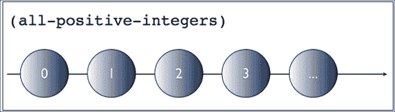
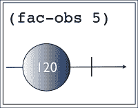
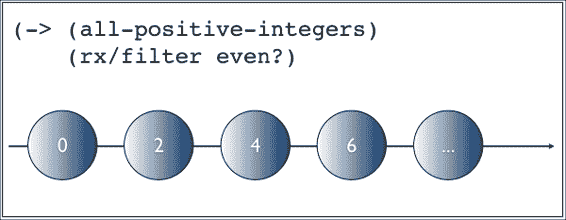
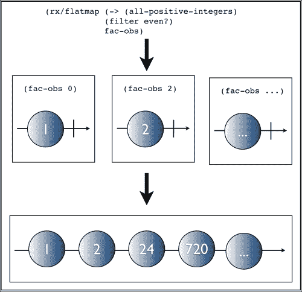
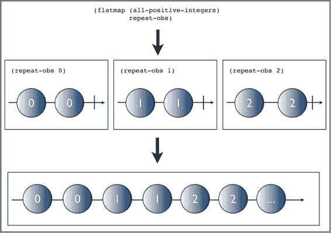

# 第二章. 概览响应式扩展

响应式扩展或 Rx 是微软的一个响应式编程库，用于构建复杂的异步程序。它将时间变化的值和事件建模为可观察序列，并通过扩展观察者设计模式来实现。

它的第一个目标平台是.NET，但 Netflix 已经将 Rx 移植到 JVM，命名为 RxJava。微软还开发和维护了一个名为 RxJS 的 JavaScript 版本的 Rx，这是我们用来构建正弦波应用的工具。这两个移植对我们来说效果很好，因为 Clojure 运行在 JVM 上，ClojureScript 在 JavaScript 环境中运行。

如我们在第一章中看到的，*什么是响应式编程？*，Rx 受到了函数式响应式编程的启发，但使用了不同的术语。在 FRP 中，两个主要的抽象是行为和事件。尽管实现细节不同，可观察序列代表事件。Rx 还通过另一种称为`BehaviorSubject`的数据类型提供了类似行为的抽象。

在本章中，我们将：

+   探索 Rx 的主要抽象：可观察的

+   了解迭代器和可观察之间的双重性

+   创建和操作可观察序列

# 观察者模式再探

在第一章中，*什么是响应式编程？*，我们简要概述了观察者设计模式及其在 Clojure 中使用 watch 的简单实现。这是我们的做法：

```java
(def numbers (atom []))

(defn adder [key ref old-state new-state]
  (print "Current sum is " (reduce + new-state)))

(add-watch numbers :adder adder) 
```

在前面的例子中，我们的可观察主题是变量`numbers`，观察者是`adder` watch。当可观察的内容发生变化时，它会*同步地*将变化推送到观察者。

现在，让我们对比一下处理序列的工作方式：

```java
(->> [1 2 3 4 5 6]
     (map inc)
     (filter even?)
     (reduce +))
```

这次，向量是被观察的主题，处理它的函数可以被视为观察者。然而，这在一个基于拉取的模型中工作。向量不会将任何元素推送到序列中。相反，`map`和其他函数会向序列请求更多元素。这是一个同步操作。

Rx 使序列以及更多内容表现得像可观察的，这样你仍然可以像对普通序列进行函数组合一样对它们进行映射、过滤和组合。

## 观察者 – Iterator 的对立面

Clojure 的序列操作符，如 map、filter、reduce 等，支持 Java 的 Iterable。正如其名所示，Iterable 是一个可以迭代的对象。在底层，这是通过从这样的对象中检索 Iterator 引用来支持的。Java 的 Iterator 接口看起来如下：

```java
public interface Iterator<E> {
    boolean hasNext();
    E next();
    void remove();
}
```

当传入实现此接口的对象时，Clojure 的序列操作符通过使用`next`方法从它那里拉取数据，同时使用`hasNext`方法知道何时停止。

### 小贴士

需要使用`remove`方法从底层集合中移除其最后一个元素。这种就地修改在多线程环境中显然是不安全的。每当 Clojure 为了互操作性实现此接口时，`remove`方法简单地抛出`UnsupportedOperationException`。

另一方面，可观察对象有观察者订阅它。观察者有以下接口：

```java
public interface Observer<T> {
    void onCompleted();
    void onError(Throwable e);
    void onNext(T t);
}
```

如我们所见，实现此接口的观察者将使用从其订阅的任何可观察对象中可用的下一个值调用其`onNext`方法。因此，它是一个基于*推送*的通知模型。

如果我们并排查看接口，这种二重性[4]会变得更加清晰：

```java
Iterator<E> {                       Observer<T> {
    boolean hasNext();                  void onCompleted();
    E next();                           void onError(Throwable e);
    void remove();                      void onNext(T t);
}                                       }
```

可观察对象提供了让生产者异步地将项目推送到消费者的能力。一些例子将有助于巩固我们的理解。

# 创建可观察对象

本章全部关于响应式扩展，所以让我们创建一个名为`rx-playground`的项目，我们将在我们的探索之旅中使用它。我们将使用 RxClojure（见[`github.com/ReactiveX/RxClojure`](https://github.com/ReactiveX/RxClojure)），这是一个提供`RxJava()`（见[`github.com/ReactiveX/RxJava`](https://github.com/ReactiveX/RxJava)）Clojure 绑定的库：

```java
$ lein new rx-playground

```

打开项目文件，并添加对 RxJava 的 Clojure 绑定的依赖项：

```java
(defproject rx-playground "0.1.0-SNAPSHOT"
  :description "FIXME: write description"
  :url "http://example.com/FIXME"
  :license {:name "Eclipse Public License"
            :url "http://www.eclipse.org/legal/epl-v10.html"}
  :dependencies [[org.clojure/clojure "1.5.1"]
                 [io.reactivex/rxclojure "1.0.0"]])"]])
```

现在，在项目的根目录中启动一个 REPL，这样我们就可以开始创建一些可观察对象了：

```java
$ lein repl

```

我们需要做的第一件事是导入 RxClojure，让我们在 REPL 中输入以下内容来解决这个问题：

```java
(require '[rx.lang.clojure.core :as rx])
(import '(rx Observable))
```

创建新可观察对象的最简单方法是调用`justreturn`函数：

```java
(def obs (rx/return 10))
```

现在，我们可以订阅它：

```java
(rx/subscribe obs
              (fn [value]
                (prn (str "Got value: " value))))
```

这将在 REPL 中打印字符串`"Got value: 10"`。

可观察对象的`subscribe`函数允许我们为其生命周期中的三个主要事件注册处理程序：新值、错误或通知可观察对象已完成值发射。这分别对应于观察者接口的`onNext`、`onError`和`onCompleted`方法。

在前面的例子中，我们只是订阅了`onNext`，这就是为什么我们只收到了可观察对象的唯一值，即 10。

单值可观察对象并不特别有趣。让我们创建并交互一个发射多个值的可观察对象：

```java
(-> (rx/seq->o [1 2 3 4 5 6 7 8 9 10])
    (rx/subscribe prn))
```

```java
range operator:
```

```java
(-> (rx/range 1 10)
    (rx/subscribe prn))
```

当然，这还没有在 Clojure 中使用原始值或序列方面展现出任何优势。

但如果我们需要一个在给定间隔内发射未定义数量整数的可观察对象怎么办？在 Clojure 中将这表示为一个序列变得具有挑战性，但 Rx 使其变得简单：

```java
(import '(java.util.concurrent TimeUnit))
(rx/subscribe (Observable/interval 100 TimeUnit/MILLISECONDS)
              prn-to-repl)
```

### 小贴士

RxClojure 尚未提供对 RxJava API 的所有绑定。`interval`方法就是这样一个例子。我们需要使用互操作性并直接在 RxJava 的`Observable`类上调用该方法。

可观察对象的 `interval` 方法接受一个数字和一个时间单位作为参数。在这种情况下，我们告诉它每 100 毫秒发出一个整数——从零开始。如果我们在一个连接到 REPL 的编辑器中输入这个命令，然而，会发生两件事：

+   我们将看不到任何输出（取决于你的 REPL；这在 Emacs 中是正确的）

+   我们将有一个无限期发出数字的流氓线程

这两个问题都源于 `Observable/interval` 是我们使用的第一个不同步发出值的工厂方法。相反，它返回一个可观察对象，将工作推迟到另一个线程。

第一个问题很容易解决。像 `prn` 这样的函数会打印到动态变量 `*out*` 绑定的任何内容。当在某些 REPL 环境中（如 Emacs）工作时，这绑定到 REPL 流，这就是为什么我们通常能看到我们打印的所有内容。

然而，由于 Rx 将工作推迟到另一个线程，`*out*` 已经不再绑定到 REPL 流，所以我们看不到输出。为了解决这个问题，我们需要捕获 `*out*` 的当前值并在我们的订阅中绑定它。这将在我们实验 Rx 的 REPL 中非常有用。因此，让我们为它创建一个辅助函数：

```java
(def  repl-out *out*)
(defn prn-to-repl [& args]
  (binding [*out* repl-out]
    (apply prn args)))
```

我们首先创建一个变量 `repl-out`，它包含当前的 REPL 流。接下来，我们创建一个函数 `prn-to-repl`，它的工作方式与 `prn` 类似，但它使用 `binding` 宏创建一个新的绑定，该绑定对 `*out*` 在该范围内有效。

这仍然留下了流氓线程的问题。现在正是提到从可观察对象的 `subscribe` 方法返回的订阅对象的时候。通过保留对该对象的引用，我们可以调用它的 `unsubscribe` 方法来表示我们不再对那个可观察对象产生的值感兴趣。

将所有这些放在一起，我们的间隔示例可以重写如下：

```java
 (def subscription (rx/subscribe (Observable/interval 100 TimeUnit/MILLISECONDS)
                                prn-to-repl))

(Thread/sleep 1000)

(rx/unsubscribe subscription)
```

我们创建一个新的间隔可观察对象，并立即订阅它，就像我们之前做的那样。然而，这次，我们将结果订阅分配给一个局部变量。注意，它现在使用我们的辅助函数 `prn-to-repl`，所以我们将立即看到值被打印到 REPL。

接下来，我们让当前的——REPL——线程休眠一秒钟。这足以让可观察对象从 0 到 9 生成数字。大约在这个时候，REPL 线程会醒来并取消订阅该可观察对象，导致它停止发出值。

## 自定义可观察对象

Rx 提供了许多其他工厂方法来创建可观察对象（见 [`github.com/ReactiveX/RxJava/wiki/Creating-Observables`](https://github.com/ReactiveX/RxJava/wiki/Creating-Observables)），但本书的范围不包括它们的所有内容。

尽管如此，有时，内置的工厂方法都不是你想要的。对于这种情况，Rx 提供了 `create` 方法。我们可以用它从头开始创建一个自定义的可观察对象。

作为例子，我们将创建我们在这个章节中早期使用的 just 可观察对象的自定义版本：

```java
(defn just-obs [v]
  (rx/observable*
   (fn [observer]
     (rx/on-next observer v)
     (rx/on-completed observer))))

(rx/subscribe (just-obs 20) prn)
```

```java
20 to the REPL.
```

### 小贴士

虽然创建自定义可观察对象相对直接，但我们应确保首先使用内置的工厂函数，只有在必要时才创建自己的。

# 操作可观察对象

现在我们知道了如何创建可观察对象，我们应该看看我们可以用它们做什么有趣的事情。在本节中，我们将了解将可观察对象视为序列的含义。

我们从简单的事情开始。让我们从一个包含所有整数的可观察对象中打印出前五个正偶数的和：

```java
(rx/subscribe (->> (Observable/interval 1 TimeUnit/MICROSECONDS)
                   (rx/filter even?)
                   (rx/take 5)
                   (rx/reduce +))
                   prn-to-repl)
```

这开始看起来对我们来说非常熟悉。我们创建了一个间隔，它将以每 1 微秒从零开始发射所有正整数。然后，我们过滤出这个可观察对象中的所有偶数。显然，这是一个太大的列表来处理，所以我们只需从其中取出前五个元素。最后，我们使用`+`来减少值。结果是 20。

为了强调使用可观察对象编程实际上就像操作序列一样，我们将再举一个例子，我们将结合两个不同的可观察序列。一个包含我喜欢的音乐家的名字，另一个是他们各自乐队的名字：

```java
(defn musicians []
  (rx/seq->o ["James Hetfield" "Dave Mustaine" "Kerry King"]))

(defn bands     []
  (rx/seq->o ["Metallica" "Megadeth" "Slayer"]))
```

我们希望向 REPL 打印一个格式为`Musician name – from: band name`的字符串。附加的要求是，乐队名称应该以大写形式打印，以产生冲击力。

我们首先创建另一个包含大写乐队名称的可观察对象：

```java
(defn uppercased-obs []
  (rx/map (fn [s] (.toUpperCase s)) (bands)))
```

虽然这不是严格必要的，但这使代码变得可重用，可以在程序中的几个地方使用，从而避免重复。对原始乐队名称感兴趣的订阅者可以继续订阅`bands`可观察对象。

拥有这两个可观察对象后，我们可以继续将它们组合起来：

```java
(-> (rx/map vector
            (musicians)
            (uppercased-obs))
    (rx/subscribe (fn [[musician band]]
                    (prn-to-repl (str musician " - from: " band)))))
```

再次强调，这个例子应该感觉熟悉。我们追求的解决方案是将两个可观察对象一起 zip 的方法。RxClojure 通过 map 提供`zip`行为，就像 Clojure 的核心`map`函数一样。我们用三个参数调用它：要 zip 的两个可观察对象以及一个函数，该函数将使用每个可观察对象中的一个元素调用，并返回适当的表示。在这种情况下，我们只是将它们转换成一个向量。

接下来，在我们的订阅者中，我们简单地解构向量以访问音乐家和乐队名称。我们最终可以将最终结果打印到 REPL：

```java
"James Hetfield - from: METALLICA"
"Dave Mustaine - from: MEGADETH"
"Kerry King - from: SLAYER"

```

# 平铺映射及其相关

在上一节中，我们学习了如何使用诸如 map、reduce 和`zip`之类的操作来转换和组合可观察对象。然而，上述两个可观察对象——音乐家和乐队——完全能够独立产生值。它们不需要任何额外的输入。

在本节中，我们将考察一个不同的场景：我们将学习如何组合可观察量，其中一个可观察量的输出是另一个可观察量的输入。我们之前在第一章中遇到了`flatmap`，*什么是响应式编程？*如果你一直在想它的作用是什么，本节将正好解答这个问题。

我们将要做的：给定一个表示所有正整数列表的可观察量，我们将计算该列表中所有偶数的阶乘。由于列表太大，我们将从中取五个元素。最终结果应该是 0、2、4、6 和 8 的阶乘，分别对应。

我们首先需要一个函数来计算数字*n*的阶乘，以及我们的可观察量：

```java
(defn factorial [n]
  (reduce * (range 1 (inc n))))

(defn all-positive-integers []
  (Observable/interval 1 TimeUnit/MICROSECONDS))
```

在本节中，使用某种视觉辅助工具将会有所帮助，所以我们将从一个代表之前可观察量的弹珠图开始：



中间的箭头代表时间，它从左到右流动。这个图表代表一个无限的 Observable 序列，正如其末尾使用省略号所指示的那样。

由于我们现在正在组合所有可观察量，我们将创建一个可观察量，给定一个数字，它将使用之前定义的辅助函数发出其阶乘。我们将使用 Rx 的`create`方法来完成这个目的：

```java
(defn fact-obs [n]
  (rx/observable*
   (fn [observer]
     (rx/on-next observer (factorial n))
     (rx/on-completed observer))))
```

这与我们在本章早期创建的`just-obs`可观察量非常相似，不同之处在于它计算其参数的阶乘，并发出结果/阶乘，然后立即结束序列。以下图表说明了它是如何工作的：



我们将数字 5 喂给可观察量，它反过来发出其阶乘，即 120。时间线末尾的垂直线表示序列随后终止。

运行代码确认我们的函数是正确的：

```java
(rx/subscribe (fact-obs 5) prn-to-repl)

;; 120

```

到目前为止一切顺利。现在，我们需要将两个可观察量结合起来以实现我们的目标。这就是 Rx 中的`flatmap`发挥作用的地方。我们首先将看到它的实际应用，然后进行解释：

```java
(rx/subscribe (->> (all-positive-integers)
                   (rx/filter  even?)
                   (rx/flatmap fact-obs)
                   (rx/take 5))
              prn-to-repl)
```

如果我们运行前面的代码，它将打印出 0、2、4、6 和 8 的阶乘，正如我们所希望的那样：

```java
1
2
24
720
40320

```

```java
 filter all even numbers from all-positive-numbers. This leaves us with the following observable sequence:
```



与`所有正整数`类似，这同样是一个无限的可观察量。

然而，我们代码的下一行看起来有点奇怪。我们调用`flatmap`并给它`fact-obs`函数。我们已知该函数本身返回另一个可观察量。`flatmap`将使用它发出的每个值调用`fact-obs`。`fact-obs`将反过来为每个数字返回一个单值可观察量。然而，我们的订阅者不知道如何处理可观察量！它只是对阶乘感兴趣！

正因如此，在调用`fact-obs`以获取一个可观察量之后，`flatmap`将它们全部扁平化为一个我们可以订阅的单个可观察量。这听起来有点复杂，所以让我们可视化一下这意味着什么：



正如你在前面的图中可以看到的，在整个`flatmap`执行过程中，我们最终得到一个可观察对象的列表。然而，我们并不关心每个可观察对象，而是关心它们发出的值。因此，`Flatmap`是完美的工具，因为它将它们——*扁平化*——组合成图底部所示的可观察对象序列。

你可以将`flatmap`视为可观察序列的*mapcat*。

代码的其余部分是直接的。我们只需从这个可观察对象中取出前五个元素并订阅它，就像我们迄今为止所做的那样。

## 道路上的另一个 flatMap

你可能会想知道如果我们正在*flatMap*的可观察序列发出多个值会发生什么。那么呢？

在我们开始下一节之前，我们将看到一个最后的例子，以说明在这种情况下`flatMap`的行为。

这是一个发出其参数两次的可观察对象：

```java
(defn repeat-obs [n]
  (rx/seq->o (repeat 2 n)))
```

使用它是直接的：

```java
(-> (repeat-obs 5)
    (rx/subscribe prn-to-repl))

;; 5
;; 5

```

如前所述，我们现在将这个可观察对象与我们之前创建的`all-positive-integers`可观察对象结合起来。在继续阅读之前，想想对于前三个正整数，你期望的输出是什么。

代码如下：

```java
(rx/subscribe (->> (all-positive-integers)
                   (rx/flatmap repeat-obs)
                   (rx/take 6))
              prn-to-repl)
```

输出如下：

```java
0
0
1
1
2
2

```

对于一些读者来说，结果可能是不预期的。让我们看看这个例子的水滴图，确保我们理解它是如何工作的：



每次调用`repeat-obs`时，它都会发出两个值并终止。然后`flatmap`将它们全部组合成一个单一的可观察对象，使之前的输出更清晰。

关于`flatmap`——以及本节标题——最后值得一提的一点是，它的“朋友”指的是`flatmap`的几个名称。

例如，Rx.NET 称其为`selectMany`。RxJava 和 Scala 称其为`flatMap`——尽管 RxJava 有一个名为`mapMany`的别名。Haskell 社区称其为*bind*。尽管它们有不同的名称，但这些函数的语义是相同的，并且是称为 Monad 的高阶抽象的一部分。我们不需要了解任何关于 Monad 的知识来继续。

需要记住的重要一点是，当你坐在酒吧和朋友讨论**组合事件系统**时，所有这些名称意味着相同的事情。

# 错误处理

构建可靠应用程序的一个非常重要的方面是知道当事情出错时应该做什么。认为网络是可靠的、硬件不会失败，或者我们作为开发者不会犯错误是幼稚的。

RxJava 接受这个事实，并提供了一套丰富的组合器来处理失败，其中一些我们将在此处进行考察。

## OnError

让我们从创建一个表现不佳的可观察对象开始，该对象总是抛出异常：

```java
(defn exceptional-obs []
  (rx/observable*
   (fn [observer]
     (rx/on-next observer (throw (Exception. "Oops. Something went wrong")))
     (rx/on-completed observer))))
```

现在让我们看看如果我们订阅它会发生什么：

```java
(rx/subscribe (->> (exceptional-obs)
                   (rx/map inc))
              (fn [v] (prn-to-repl "result is " v)))

;; Exception Oops. Something went wrong  rx-playground.core/exceptional-obs/fn--1505
```

`exceptional-obs`抛出的异常没有被捕获，所以它简单地冒泡到 REPL。如果这是一个 Web 应用程序，我们的用户将看到一个 Web 服务器错误，例如**HTTP 代码 500 – 内部服务器错误**。这些用户可能不会再使用我们的系统。

理想情况下，我们希望有机会优雅地处理这个异常，可能是一个友好的错误消息，让我们的用户知道我们在乎他们。

如我们在本章前面所见，`subscribe`函数可以接受最多 3 个函数作为参数：

+   第一个，或者说是`onNext`处理器，当可观察对象发出新值时被调用

+   第二个，或者说是`onError`，每当可观察对象抛出异常时被调用

+   第三个也是最后一个函数，或者说是`onComplete`，当可观察对象完成并且不会发出任何新项目时被调用

对于我们的目的，我们感兴趣的是`onError`处理器，使用它是直接的：

```java
(rx/subscribe (->> (exceptional-obs)
                   (rx/map inc))
              (fn [v] (prn-to-repl "result is " v))
              (fn [e] (prn-to-repl "error is " e)))

;; "error is " #<Exception java.lang.Exception: Oops. Something went wrong>
```

这次，我们不是抛出异常，而是错误处理器被调用并传递给它。这给了我们向用户显示适当消息的机会。

## 捕获

`onError`的使用让我们整体上有了更好的体验，但它并不灵活。

让我们想象一个不同的场景，其中有一个可观察对象从网络中检索数据。如果这个观察者失败，我们希望向用户展示一个缓存值而不是错误消息？

这就是`catch`组合子发挥作用的地方。它允许我们指定一个函数，当可观察对象抛出异常时调用，这与`OnError`的作用类似。

然而，与`onError`不同，`catch`必须返回一个新的可观察对象，该对象将从异常抛出的那一刻起成为新项目的新来源：

```java
(rx/subscribe (->> (exceptional-obs)
                   (rx/catch Exception e
                       (rx/return 10))
                   (rx/map inc))
              (fn [v] (prn-to-repl "result is " v)))

;; "result is " 11
```

在前面的例子中，我们实际上指定了，每当`exceptional-obs`抛出时，我们应该返回值`10`。我们不仅限于单个值。实际上，我们可以使用任何我们喜欢的可观察对象作为新来源：

```java
(rx/subscribe (->> (exceptional-obs)
                   (rx/catch Exception e
                     (rx/seq->o (range 5)))
                   (rx/map inc))
              (fn [v] (prn-to-repl "result is " v)))

;; "result is " 1
;; "result is " 2
;; "result is " 3
;; "result is " 4
;; "result is " 5
```

## 重试

我们将要检查的最后一个是`retry`错误处理组合子。当我们知道错误或异常只是暂时性的，我们应该给它另一个尝试的机会，通过重新订阅可观察对象。

首先，我们将创建一个可观察对象，当它第一次被订阅时将失败。然而，下次被订阅时，它将成功并发出一个新项目：

```java
(defn retry-obs []
  (let [errored (atom false)]
    (rx/observable*
     (fn [observer]
       (if @errored
         (rx/on-next observer 20)
         (do (reset! errored true)
             (throw (Exception. "Oops. Something went wrong"))))))))
```

让我们看看如果我们简单地订阅它会发生什么：

```java
(rx/subscribe (retry-obs)
              (fn [v] (prn-to-repl "result is " v)))

;; Exception Oops. Something went wrong  rx-playground.core/retry-obs/fn--1476
```

如预期的那样，异常就像我们的第一个例子一样简单地冒泡。然而，我们知道——为了这个例子，这是一个暂时性的失败。让我们看看如果我们使用`retry`会发生什么变化：

```java
(rx/subscribe (->> (retry-obs)
                   (.retry))
              (fn [v] (prn-to-repl "result is " v)))

;; "result is " 20
```

现在，我们的代码负责重试可观察对象，并且正如预期的那样，我们得到了正确的输出。

重要的是要注意，`retry`将无限期地尝试重新订阅，直到成功。这可能不是你想要的，所以 Rx 提供了一个变体，称为`retryWith`，它允许我们指定一个谓词函数，以控制何时以及是否应该停止重试。

所有这些算子都为我们提供了构建可靠反应式应用程序所需的工具，我们应当始终牢记它们，毫无疑问，它们是我们工具箱中的一大补充。关于这方面的更多信息，请参考 RxJava 的维基页面：[`github.com/ReactiveX/RxJava/wiki/Error-Handling-Operators`](https://github.com/ReactiveX/RxJava/wiki/Error-Handling-Operators)。

# 背压

我们可能还会遇到的问题是，可观察对象生成项目比我们消费得快。在这种情况下出现的问题是如何处理这个不断增长的项的积压。

例如，考虑将两个可观察对象一起压缩。`zip`操作符（或在 RxClojure 中的`map`）只有在所有可观察对象都发出一个项目时才会发出新的值。

因此，如果其中一个可观察对象在生成项目方面比其他项目快得多，`map`将需要缓冲这些项目并等待其他项目，这很可能会引起错误，如下所示：

```java
(defn fast-producing-obs []
  (rx/map inc (Observable/interval 1 TimeUnit/MILLISECONDS)))

(defn slow-producing-obs []
  (rx/map inc (Observable/interval 500 TimeUnit/MILLISECONDS)))

(rx/subscribe (->> (rx/map vector
                           (fast-producing-obs)
                           (slow-producing-obs))
                   (rx/map (fn [[x y]]
                             (+ x y)))
                   (rx/take 10))
              prn-to-repl
              (fn [e] (prn-to-repl "error is " e)))

;; "error is " #<MissingBackpressureException rx.exceptions.MissingBackpressureException>
```

如前述代码所示，我们有一个快速生成的可观察对象，其发出项目比较慢的可观察对象快 500 倍。显然，我们无法跟上它，Rx 确实会抛出`MissingBackpressureException`。

这个异常告诉我们的是，快速生成的可观察对象不支持任何类型的背压——Rx 称之为*反应式拉背压*——也就是说，消费者不能让它放慢速度。幸运的是，Rx 为我们提供了在这些场景中有用的组合器。

## 样本

其中一个组合器是`sample`，它允许我们在给定的时间间隔内采样一个可观察对象，从而限制源可观察对象的输出。让我们将其应用到之前的例子中：

```java
(rx/subscribe (->> (rx/map vector
                           (.sample (fast-producing-obs) 200
                                    TimeUnit/MILLISECONDS)
                           (slow-producing-obs))
                   (rx/map (fn [[x y]]
                             (+ x y)))
                   (rx/take 10))
              prn-to-repl
              (fn [e] (prn-to-repl "error is " e)))

;; 204
;; 404
;; 604
;; 807
;; 1010
;; 1206
;; 1407
;; 1613
;; 1813
;; 2012
```

唯一的改变是我们先在快速生成的可观察对象上调用`sample`，然后再调用`map`。我们将每 200 毫秒采样一次。

通过忽略在这个时间片中发出的所有其他项目，我们已经减轻了最初的问题，即使原始的可观察对象不支持任何形式的背压。

样本组合器只是在这种情况下有用的组合器之一。其他还包括`throttleFirst`、`debounce`、`buffer`和`window`。然而，这种方法的一个缺点是，很多生成的项目最终都被忽略了。

根据我们构建的应用程序类型，这可能是一个可接受的折衷方案。但如果我们对所有项目都感兴趣呢？

## 背压策略

如果一个可观察对象不支持背压，但我们仍然对其发出的所有项目感兴趣，我们可以使用 Rx 提供的内置背压组合器之一。

作为例子，我们将查看一个这样的组合器，`onBackpressureBuffer`：

```java
(rx/subscribe (->> (rx/map vector
                           (.onBackpressureBuffer (fast-producing-obs))
                           (slow-producing-obs))
                   (rx/map (fn [[x y]]
                             (+ x y)))
                   (rx/take 10))
              prn-to-repl
              (fn [e] (prn-to-repl "error is " e)))

;; 2
;; 4
;; 6
;; 8
;; 10
;; 12
;; 14
;; 16
;; 18
;; 20
```

这个例子与使用`sample`的例子非常相似，但输出却相当不同。这次我们得到了两个可观察对象发出的所有项目。

`onBackpressureBuffer`策略实现了一种简单的策略，即缓冲所有由较慢的 Observable 发出的项目，并在消费者准备好时发出它们。在我们的例子中，这每 500 毫秒发生一次。

其他策略包括`onBackpressureDrop`和`onBackpressureBlock`。

值得注意的是，响应式拉回压力（Reactive pull backpressure）仍在开发中，要了解最新进展的最佳方式是查看 RxJava 主题的 wiki 页面：[`github.com/ReactiveX/RxJava/wiki/Backpressure`](https://github.com/ReactiveX/RxJava/wiki/Backpressure).

# 摘要

在本章中，我们深入探讨了 RxJava，它是微软从.NET 的响应式扩展移植过来的。我们了解了其主要抽象，即可观察对象（observable），以及它与可迭代对象的关系。

我们还学习了如何以多种方式创建、操作和组合可观察对象。这里展示的例子是为了保持简单而设计的。尽管如此，所有提出的概念在现实应用中都非常有用，并将在我们下一章中派上用场，那时我们将在一个更实际的例子中使用它们。

最后，我们通过查看错误处理和回压（backpressure），这两者都是可靠应用程序的重要特性，应该始终牢记。
