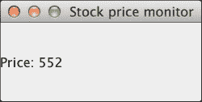
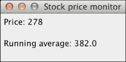
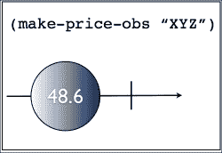

# 第三章。异步编程和网络

几个商业应用程序需要异步地对外部刺激——如网络流量——做出反应。这类软件的一个例子可能是允许我们跟踪股市中公司股价的桌面应用程序。

我们将首先使用更传统的方法来构建这个应用程序。这样做时，我们将：

+   能够识别和理解第一种设计的缺点

+   学习如何使用 RxClojure 处理如滚动平均值这样的有状态计算

+   使用可观察序列以声明性方式重写示例，从而减少我们第一种方法中发现的复杂性

# 构建股票市场监控应用程序

我们的股票市场程序将包括三个主要组件：

+   一个模拟外部服务的函数，我们可以从中查询当前价格——在现实情况下这很可能是网络调用

+   一个以预定义间隔轮询先前函数的调度器

+   负责更新屏幕的显示函数

我们将首先创建一个新的 Leiningen 项目，我们的应用程序源代码将存储在这里。在命令行中输入以下内容，然后切换到新创建的目录：

```java
lein new stock-market-monitor
cd stock-market-monitor

```

由于我们将为该应用程序构建一个 GUI，请在`project.clj`的依赖项部分添加对 Seesaw 的依赖项：

```java
[seesaw "1.4.4"]
```

接下来，在您最喜欢的编辑器中创建一个`src/stock_market_monitor/core.clj`文件。让我们创建和配置我们应用程序的 UI 组件：

```java
(ns stock-market-monitor.core
  (:require [seesaw.core :refer :all])
  (:import (java.util.concurrent ScheduledThreadPoolExecutor
                                 TimeUnit)))

(native!)

(def main-frame (frame :title "Stock price monitor"
                       :width 200 :height 100
                       :on-close :exit))

(def price-label       (label "Price: -"))

(config! main-frame :content price-label)
```

如您所见，用户界面相当简单。它由一个标签组成，将显示公司的股价。我们还导入了两个 Java 类，`ScheduledThreadPoolExecutor`和`TimeUnit`，我们将在稍后使用它们。

下一步，我们需要的是我们的轮询机制，这样我们就可以在给定的时间表上调用定价服务。我们将通过线程池来实现这一点，以避免阻塞主线程：

### 小贴士

用户界面 SDK，如 Swing，有主线程或 UI 线程的概念。这是 SDK 用来将 UI 组件渲染到屏幕上的线程。因此，如果我们在这个线程中执行阻塞操作——甚至只是运行缓慢的操作——用户体验将受到严重影响，这就是为什么使用线程池来卸载昂贵的函数调用。

```java
(def pool (atom nil))

(defn init-scheduler [num-threads]
  (reset! pool  (ScheduledThreadPoolExecutor. num-threads)))
(defn run-every [pool millis f]
  (.scheduleWithFixedDelay pool
                           f
                           0 millis TimeUnit/MILLISECONDS))

(defn shutdown [pool]
  (println "Shutting down scheduler...")
  (.shutdown pool))
```

`init-scheduler`函数使用给定的线程数创建`ScheduledThreadPoolExecutor`。这就是我们的周期性函数将运行的线程池。`run-every`函数在给定的`pool`中安排函数`f`以`millis`指定的间隔运行。最后，`shutdown`是一个在程序终止时将被调用的函数，它将优雅地关闭线程池。

程序的其余部分将这些部分组合在一起：

```java
(defn share-price [company-code]
  (Thread/sleep 200)
  (rand-int 1000))

(defn -main [& args]
  (show! main-frame)
  (.addShutdownHook (Runtime/getRuntime)
                    (Thread. #(shutdown @pool)))
  (init-scheduler 1)
  (run-every @pool 500
             #(->> (str "Price: " (share-price "XYZ"))
                   (text! price-label)
                   invoke-now)))
```

`share-price`函数暂停 200 毫秒以模拟网络延迟，并返回一个介于 0 和 1,000 之间的随机整数，代表股票的价格。

我们`-main`函数的第一行向运行时添加了一个关闭钩子。这允许我们的程序拦截终止——例如在终端窗口中按下*Ctrl* + *C*——并给我们机会关闭线程池。

### 小贴士

`ScheduledThreadPoolExecutor`池默认创建非守护线程。如果除了程序的主线程外还有任何非守护线程存活，程序就无法终止。这就是为什么关闭钩子是必要的。

接下来，我们使用单个线程初始化调度器，并安排每 500 毫秒执行一个函数。这个函数会请求 XYZ 的当前股价，并更新标签。

### 小贴士

桌面应用程序需要在 UI 线程中完成所有渲染。然而，我们的周期性函数在单独的线程上运行，并需要更新价格标签。这就是为什么我们使用`invoke-now`，这是一个 Seesaw 函数，它将主体调度到尽可能快地执行在 UI 线程中。

在项目的根目录中输入以下命令来运行程序：

```java
lein trampoline run -m stock-market-monitor.core

```

### 小贴士

Trampolining 告诉 leiningen 不要将我们的程序 JVM 嵌套在其内部，这样我们就可以通过关闭钩子自己处理*Ctrl* + *C*的使用。

将会显示一个类似于以下截图的窗口，其上的值将根据之前实现的计划进行更新：



这是一个不错的解决方案。代码相对简单，并且满足我们的原始要求。然而，如果我们从大局来看，我们的程序中存在相当多的噪声。其中大部分代码行都在处理创建和管理线程池，虽然这是必要的，但并不是我们解决问题的核心——这是一个实现细节。

目前我们将保持现状，并添加一个新要求：滚动平均值。

# 滚动平均值

现在我们可以看到给定公司的最新股价，显示过去，比如说，五次股价的滚动平均值是有意义的。在现实场景中，这将提供一个公司股票市场趋势的客观视图。

让我们扩展我们的程序以适应这个新要求。

首先，我们需要修改我们的命名空间定义：

```java
(ns stock-market-monitor.core
  (:require [seesaw.core :refer :all])
  (:import (java.util.concurrent ScheduledThreadPoolExecutor
                                 TimeUnit)
           (clojure.lang PersistentQueue)))
```

唯一的改变是一个新的导入语句，用于 Clojure 的`PersistentQueue`类。我们稍后会使用它。

我们还需要一个新的标签来显示当前的运行平均值：

```java
(def running-avg-label (label "Running average: -"))
(config! main-frame :content
         (border-panel
          :north  price-label
          :center running-avg-label
          :border 5))
```

接下来，我们需要一个函数来计算滚动平均值。滚动平均——或移动平均——是统计学中的一个计算，其中你取数据集中一个子集的平均值。这个子集具有固定的大小，并且随着数据的到来而向前移动。通过一个例子，这会变得清楚。

假设你有一个包含从 1 到 10（包括 10）的数字列表。如果我们使用`3`作为子集大小，滚动平均值如下：

```java
[1 2 3 4 5 6 7 8 9 10] => 2.0
[1 2 3 4 5 6 7 8 9 10] => 3.0
[1 2 3 4 5 6 7 8 9 10] => 4.0
```

上一段代码中突出显示的部分显示了当前用于计算子集平均值的*窗口*。

既然我们已经知道了滚动平均值是什么，我们就可以继续在我们的程序中实现它：

```java
(defn roll-buffer [buffer num buffer-size]
  (let [buffer (conj buffer num)]
    (if (> (count buffer) buffer-size)
      (pop buffer)
      buffer)))

(defn avg [numbers]
  (float (/ (reduce + numbers)
            (count numbers))))

(defn make-running-avg [buffer-size]
  (let [buffer (atom clojure.lang.PersistentQueue/EMPTY)]
    (fn [n]
      (swap! buffer roll-buffer n buffer-size)
      (avg @buffer))))

(def running-avg (running-avg 5))
```

`roll-buffer`函数是一个实用函数，它接受一个队列、一个数字和一个缓冲区大小作为参数。它将那个数字添加到队列中，如果队列超过缓冲区限制，则弹出最旧的元素，从而使其内容*滚动*。

接下来，我们有一个用于计算数字集合平均值的函数。如果除法不均匀，我们将结果转换为浮点数。

最后，高阶`make-running-avg`函数返回一个有状态的、单参数函数，它封装了一个空的持久队列。这个队列用于跟踪当前的数据子集。

我们通过调用它并使用缓冲区大小为 5 来创建这个函数的实例，并将其保存到`running-avg`变量中。每次我们用数字调用这个新函数时，它都会使用`roll-buffer`函数将其添加到队列中，然后最终返回队列中项目的平均值。

我们编写的用于管理线程池的代码将原样重用，所以我们剩下要做的就是更新我们的周期性函数：

```java
(defn worker []
  (let [price (share-price "XYZ")]
    (->> (str "Price: " price) (text! price-label))
    (->> (str "Running average: " (running-avg price))
         (text! running-avg-label))))

(defn -main [& args]
  (show! main-frame)
  (.addShutdownHook (Runtime/getRuntime)
                    (Thread. #(shutdown @pool)))
  (init-scheduler 1)
  (run-every @pool 500
             #(invoke-now (worker))))
```

由于我们的函数不再是单行代码，我们将其抽象到它自己的函数`worker`中。就像之前一样，它更新价格标签，但我们还扩展了它以使用之前创建的`running-avg`函数。

我们准备好再次运行程序：

```java
lein trampoline run -m stock-market-monitor.core

```

你应该看到，就像以下截图所示的一个窗口：



你应该看到，除了显示 XYZ 的当前股价之外，程序还跟踪并刷新价格流的运行平均值。

# 识别我们当前方法的问题

除了负责构建用户界面的代码行之外，我们的程序大约有 48 行长。

程序的核心在于`share-price`和`avg`函数，它们分别负责查询价格服务和计算一列*n*个数字的平均值。它们只代表六行代码。在这个小程序中有很多*附加复杂性*。

附加复杂性是由与当前问题无关的代码引起的复杂性。在这个例子中，我们有两种这样的复杂性的来源——在这个讨论中，我们忽略了特定于 UI 的代码：线程池和滚动缓冲区函数。它们给阅读和维护代码的人带来了大量的认知负担。

线程池与我们的问题无关。它只关注如何异步运行任务的语义。滚动缓冲区函数指定了队列的详细实现以及如何使用它来表示该概念。

理想情况下，我们应该能够抽象出这些细节，专注于我们问题的核心；**组合事件系统**（**CES**）正允许我们做到这一点。

# 使用 RxClojure 移除偶然复杂性

在第二章中，我们学习了 RxClojure 这个开源 CES 框架的基本构建块——《反应式扩展概述》。在本节中，我们将利用这些知识来从我们的程序中移除偶然的复杂性。这将使我们能够以清晰、声明性的方式显示价格和滚动平均值。

我们编写的 UI 代码保持不变，但我们需要确保在`project.clj`文件的依赖关系部分声明了 RxClojure：

```java
[io.reactivex/rxclojure "1.0.0"]
```

然后，确保我们引入以下库：

```java
(ns stock-market-monitor.core
  (:require [rx.lang.clojure.core :as rx]
            [seesaw.core :refer :all])
  (:import (java.util.concurrent TimeUnit)
           (rx Observable)))
```

这次我们解决问题的方法也有所不同。让我们看看第一个要求：它要求我们显示一家公司在股市中的当前股价。

每次我们查询价格服务时，我们都会得到一个——可能是不同的一—关于相关公司的价格。正如我们在第二章中看到的那样，将其建模为可观察序列是很容易的，所以我们将从这里开始。我们将创建一个函数，为我们提供给定公司的股价可观察对象：

```java
(defn make-price-obs [company-code]
  (rx/return (share-price company-code)))
```

这是一个产生单个值并终止的可观察对象。它等同于以下弹珠图：



第一部分要求之一是我们需要在预定义的时间间隔内查询服务——在这个例子中是每 500 毫秒一次。这暗示了我们之前遇到的一个名为*interval*的可观察对象。为了获得我们想要的轮询行为，我们需要将 interval 和价格可观察对象结合起来。

你可能还记得，`flatmap`是完成这项工作的工具：

```java
(rx/flatmap (fn [_] (make-price-obs "XYZ"))
                    (Observable/interval 500 
                                         TimeUnit/MILLISECONDS))
```

实际上，我们可以简单地订阅这个新的可观察对象并测试它。将你的主函数修改为以下片段并运行程序：

```java
(defn -main [& args]
  (show! main-frame)
  (let [price-obs (rx/flatmap (fn [_] (make-price-obs "XYZ"))
                              (Observable/interval 500 TimeUnit/MILLISECONDS))]
    (rx/subscribe price-obs
                  (fn [price]
                    (text! price-label (str "Price: " price))))))
```

这非常酷！我们只用几行代码就复制了我们第一个程序的行为。最好的部分是，我们不必担心线程池或调度操作。通过将问题视为可观察序列，以及结合现有和新可观察对象，我们能够声明性地表达我们想要程序执行的操作。

这已经为我们提供了在可维护性和可读性方面的巨大好处。然而，我们仍然缺少程序的一半：滚动平均值。

## 可观察滚动平均值

可能并不立即明显我们如何将滚动平均值建模为可观察对象。我们需要记住的是，几乎所有我们可以将其视为值序列的东西，我们都可以将其建模为可观察序列。

滚动平均值也没有什么不同。让我们暂时忘记价格是从一个封装在可观察对象中的网络调用中来的。让我们想象我们有一个 Clojure 向量中所有我们关心的值：

```java
(def values (range 10))
```

我们需要一种方法来以大小为 5 的分区（或缓冲区）处理这些值，这样在每次交互中只丢弃一个值。在 Clojure 中，我们可以使用`partition`函数来完成这个目的：

```java
(doseq [buffer (partition 5 1 values)]
  (prn buffer))

(0 1 2 3 4)
(1 2 3 4 5)
(2 3 4 5 6)
(3 4 5 6 7)
(4 5 6 7 8)
...

```

`partition`函数的第二个参数被称为*步长*，它是开始新分区前应跳过的项目偏移量。在这里，我们将它设置为 1，以便创建我们需要的滑动窗口效果。

那么，接下来的大问题是：我们在处理可观察序列时能否以某种方式利用`partition`？

事实上，RxJava 有一个名为`buffer`的转换器，正是为此目的。前面的例子可以重写如下：

```java
(-> (rx/seq->o (vec (range 10)))
    (.buffer 5 1)
    (rx/subscribe
     (fn [price]
       (prn (str "Value: " price)))))
```

### 小贴士

如前所述，并非所有 RxJava 的 API 都通过 RxClojure 暴露，因此在这里我们需要使用互操作来从可观察序列访问`buffer`方法。

如前所述，`buffer`的第二个参数是偏移量，但在 RxJava 文档中被称为`skip`。如果你在 REPL 中运行它，你会看到以下输出：

```java
"Value: [0, 1, 2, 3, 4]"
"Value: [1, 2, 3, 4, 5]"
"Value: [2, 3, 4, 5, 6]"
"Value: [3, 4, 5, 6, 7]"
"Value: [4, 5, 6, 7, 8]"
...

```

这正是我们想要的。唯一的区别是，缓冲方法会等待直到它有足够的元素——在这个例子中是五个——然后才继续。

现在，我们可以回到我们的程序，并在主函数中融入这个想法。它看起来是这样的：

```java
(defn -main [& args]
  (show! main-frame)
  (let [price-obs (-> (rx/flatmap make-price-obs
                                  (Observable/interval 500 TimeUnit/MILLISECONDS))
                      (.publish))
        sliding-buffer-obs (.buffer price-obs 5 1)]
    (rx/subscribe price-obs
                  (fn [price]
                    (text! price-label (str "Price: " price))))
    (rx/subscribe sliding-buffer-obs
                  (fn [buffer]
                    (text! running-avg-label (str "Running average: " (avg buffer)))))
    (.connect price-obs)))
```

```java
price-obs, we had created before. The new sliding buffer observable is created using the buffer transformer on price-obs.
```

然后，我们可以独立订阅每个序列，以便更新价格和滚动平均值标签。运行程序将显示我们之前看到的相同屏幕：


你可能注意到了两个之前没有见过的方法调用：`publish` 和 `connect`。

`publish`方法返回一个可连接的可观察序列。这意味着可观察序列不会开始发出值，直到其`connect`方法被调用。我们在这里这样做是因为我们想确保所有订阅者都能收到原始可观察序列发出的所有值。

总结来说，我们没有添加太多额外的代码，就以一种简洁、声明性的方式实现了所有要求，这使得代码易于维护和跟踪。我们还将之前的 roll-buffer 函数完全变得不再必要。

程序 CES 版本的完整源代码在此提供供参考：

```java
(ns stock-market-monitor.05frp-price-monitor-rolling-avg
  (:require [rx.lang.clojure.core :as rx]
            [seesaw.core :refer :all])
  (:import (java.util.concurrent TimeUnit)
           (rx Observable)))

(native!)

(def main-frame (frame :title "Stock price monitor"
                       :width 200 :height 100
                       :on-close :exit))

(def price-label       (label "Price: -"))
(def running-avg-label (label "Running average: -"))

(config! main-frame :content
         (border-panel
          :north  price-label
          :center running-avg-label
          :border 5))

(defn share-price [company-code]
  (Thread/sleep 200)
  (rand-int 1000))

(defn avg [numbers]
  (float (/ (reduce + numbers)
            (count numbers))))

(defn make-price-obs [_]
  (rx/return (share-price "XYZ")))

(defn -main [& args]
  (show! main-frame)
  (let [price-obs (-> (rx/flatmap make-price-obs
                                  (Observable/interval 500 TimeUnit/MILLISECONDS))
                      (.publish))
        sliding-buffer-obs (.buffer price-obs 5 1)]
    (rx/subscribe price-obs
                  (fn [price]
                    (text! price-label (str "Price: " price))))
    (rx/subscribe sliding-buffer-obs
                  (fn [buffer]
                    (text! running-avg-label (str "Running average: " (avg buffer)))))
    (.connect price-obs)))
```

注意，在这个程序版本中，我们不需要使用关闭钩子。这是因为 RxClojure 创建了守护线程，一旦应用程序退出，这些线程会自动终止。

# 摘要

在本章中，我们使用我们的股票市场程序模拟了一个现实世界应用。我们以某种传统的方式编写了它，使用了线程池和自定义队列实现。然后我们将其重构为 CES 风格，使用了 RxClojure 的可观察序列。

一旦熟悉了 RxClojure 和 RxJava 的核心概念，生成的程序将更短、更简单、更容易阅读。

在下一章中，我们将介绍 core.async，为实施我们自己的基本 CES 框架做准备。
