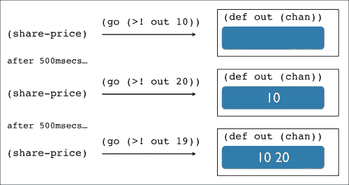
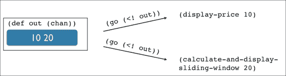

# 第四章。核心异步简介

那些程序一次只能做一件事的日子已经一去不复返了。能够同时执行多个任务是大多数现代商业应用的核心。这就是异步编程的用武之地。

异步编程——更普遍地说，并发——是关于利用你的硬件资源比以前做得更多。这意味着在等待结果的同时从网络或数据库连接中获取数据。或者，也许在用户仍然可以操作图形界面时，将 Excel 电子表格读入内存。总的来说，它提高了系统的响应性。

在本章中，我们将探讨不同平台如何处理这种编程风格。更具体地说，我们将：

+   了解核心异步的背景和 API

+   通过以核心异步的抽象实现股票市场应用程序来巩固我们对核心异步的理解

+   理解核心异步如何处理错误处理和背压

+   简短地浏览一下转换器

# 异步编程和并发

不同的平台有不同的编程模型。例如，JavaScript 应用程序是单线程的，并且有一个事件循环。在发起网络调用时，通常会在稍后阶段注册一个回调，当网络调用成功或出错时会被调用。

与此相反，当我们处于 JVM 上时，我们可以充分利用多线程来实现并发。通过 Clojure 提供的许多并发原语之一（如 futures）来创建新线程非常简单。

然而，异步编程变得繁琐。Clojure futures 没有提供一种原生的方式让我们在稍后阶段通知它们的完成。此外，从尚未完成的 future 中检索值是一个阻塞操作。这可以在以下代码片段中清楚地看到：

```java
(defn do-something-important []
  (let [f (future (do (prn "Calculating...")
                      (Thread/sleep 10000)))]
    (prn "Perhaps the future has done its job?")
    (prn @f)
    (prn "You will only see this in about 10 seconds...")))

(do-something-important)
```

第二次调用打印时，会取消引用 future，由于它尚未完成，这导致主线程阻塞。这就是为什么只有在 future 运行的线程完成后，你才会看到最后的打印。当然，可以通过为第一个线程创建一个单独的线程来模拟回调，但这个解决方案最多是笨拙的。

在 Clojure 中，GUI 编程是缺乏回调的例外。与 JavaScript 类似，Clojure Swing 应用程序也拥有事件循环，可以响应用户输入并调用监听器（回调）来处理它们。

另一个选项是用一个传递给 future 的自定义回调重写前面的示例：

```java
(defn do-something-important [callback]
  (let [f (future (let [answer 42]
                    (Thread/sleep 10000)
                    (callback answer)))]
    (prn "Perhaps the future has done its job?")
    (prn "You should see this almost immediately and then in 10 secs...")
     f))

(do-something-important (fn [answer]
                          (prn "Future is done. Answer is " answer)))
```

这次输出的顺序应该更有意义。然而，如果我们从这个函数返回 future，我们就无法给它另一个回调。我们失去了在 future 结束时执行操作的能力，又回到了必须取消引用它，从而再次阻塞主线程——这正是我们想要避免的。

### 小贴士

Java 8 引入了一个新的类，`CompletableFuture`，它允许注册一个在完成时被调用的回调。如果你有这个选项，你可以使用互操作来让 Clojure 利用这个新类。

如你所意识到的那样，CES（Continuous Event Stream）与异步编程密切相关：我们在上一章中构建的股票市场应用就是一个这样的程序示例。主线程（或 UI 线程）永远不会因为从网络获取数据而阻塞。此外，我们还在订阅时注册了回调。

然而，在许多异步应用程序中，回调并不是最佳选择。过度使用回调可能导致所谓的回调地狱。Clojure 提供了一个更强大、更优雅的解决方案。

在接下来的几节中，我们将探讨`core.async`，这是一个用于异步编程的 Clojure 库，以及它与响应式编程的关系。

# core.async

如果你曾经进行过任何数量的 JavaScript 编程，你可能已经经历过回调地狱。如果你没有，以下代码应该能给你一个很好的概念：

```java
http.get('api/users/find?name=' + name, function(user){
  http.get('api/orders?userId=' + user.id, function(orders){
    orders.forEach(function(order){
      container.append(order);
    });
  });
});
```

这种编程风格很容易失控——不是编写更自然、顺序的步骤来实现任务，而是将逻辑分散到多个回调中，增加了开发者的认知负担。

作为对这个问题的回应，JavaScript 社区发布了几个承诺库，旨在解决这个问题。我们可以将承诺视为我们可以传递到和从我们的函数中返回的空盒子。在未来的某个时刻，另一个进程可能会在这个盒子里放入一个值。

例如，前面的片段可以用以下承诺来编写：

```java
http.get('api/users/find?name=' + name)
  .then(function(user){
    return http.get('api/orders?userId=' + user.id);
  })
  .then(function(orders){
    orders.forEach(function(order){
      container.append(order);
    });
  });  
```

```java
then function is a public function of the promises API. It is definitely a step in the right direction as the code is composable and easier to read.
```

然而，由于我们倾向于按步骤序列思考，我们希望编写以下内容：

```java
user   = http.get('api/users/find?name=' + name);
orders = http.get('api/orders?userId=' + user.id);
orders.forEach(function(order){
  container.append(order);
});
```

尽管代码看起来是同步的，但行为应该与前面的示例没有不同。这正是`core.async`让我们在 Clojure 和 ClojureScript 中都能做到的。

## 通信顺序过程

`core.async`库建立在旧想法之上。它所依赖的基础最初由 Tony Hoare——著名的快速排序算法的发明者——在他的 1978 年论文《通信顺序过程》（*Communicating Sequential Processes*，简称 CSP）中描述。（见[`www.cs.ucf.edu/courses/cop4020/sum2009/CSP-hoare.pdf`](http://www.cs.ucf.edu/courses/cop4020/sum2009/CSP-hoare.pdf)）。CSP 自那时以来已在几种语言中得到扩展和实现，其中最新的是 Google 的**Go**编程语言。

本书的范围不包括深入探讨这篇开创性论文的细节，因此以下是对主要思想的简化描述。

在 CSP（Communicating Sequential Processes）中，工作是通过两种主要抽象来建模的：通道和进程。CSP 也是消息驱动的，因此它完全解耦了消息的生产者和消费者。将通道视为阻塞队列是有用的。

以下是一个展示这些基本抽象的简单方法：

```java
(import 'java.util.concurrent.ArrayBlockingQueue)

(defn producer [c]
  (prn "Taking a nap")
  (Thread/sleep 5000)
  (prn "Now putting a name in queue...")
  (.put c "Leo"))

(defn consumer [c]
  (prn "Attempting to take value from queue now...")
  (prn (str "Got it. Hello " (.take c) "!")))

(def chan (ArrayBlockingQueue. 10))

(future (consumer chan))
(future (producer chan))
```

在 REPL 中运行此代码应该会显示类似于以下内容的输出：

```java
"Attempting to take value from queue now..."
"Taking a nap"
;; then 5 seconds later
"Now putting a name in que queue..."
"Got it. Hello Leo!"

```

为了不阻塞我们的程序，我们使用一个未来在每个自己的线程中启动消费者和生成者。由于消费者首先启动，我们很可能会立即看到其输出。然而，一旦它尝试从通道或队列中获取值，它就会阻塞。它将等待值变得可用，并且只有在生成者完成其小憩后才会继续——显然这是一个非常重要的任务。

现在，让我们将其与使用 core.async 的解决方案进行比较。首先，创建一个新的 leiningen 项目并添加对其的依赖：

```java
[org.clojure/core.async "0.1.278.0-76b25b-alpha"]
```

现在，在 REPL 或你的核心命名空间中输入以下内容：

```java
(ns core-async-playground.core
 (:require [clojure.core.async :refer [go chan <! >! timeout]]))

(defn prn-with-thread-id [s]
 (prn (str s " - Thread id: " (.getId (Thread/currentThread)))))

(defn producer [c]
 (go (prn-with-thread-id "Taking a nap ")
 (<! (timeout 5000))
 (prn-with-thread-id "Now putting a name in que queue...")
 (>! c "Leo")))

(defn consumer [c]
 (go (prn-with-thread-id "Attempting to take value from queue now...")
 (prn-with-thread-id (str "Got it. Hello " (<! c) "!"))))

(def c (chan))

(consumer c)
(producer c)

```

这次我们使用了一个辅助函数，`prn-with-thread-id`，它将当前线程 ID 附加到输出字符串中。我很快就会解释原因，但除此之外，输出将与之前的一个相同：

```java
"Attempting to take value from queue now... - Thread id: 43"
"Taking a nap  - Thread id: 44"
"Now putting a name in que queue... - Thread id: 48"
"Got it. Hello Leo! - Thread id: 48"

```

从结构上看，这两个解决方案看起来相当相似，但由于我们在这里使用了相当多的新函数，让我们将其分解：

+   `chan` 是一个创建 `core.async` 通道的函数。如前所述，它可以被视为一个并发阻塞队列，并且是库中的主要抽象。默认情况下 `chan` 创建一个无界通道，但 `core.async` 提供了许多更多有用的通道构造函数，其中一些我们将在稍后使用。

+   `timeout` 是另一个这样的通道构造函数。它给我们一个会在返回 nil 给获取进程之前等待给定时间的通道，并在之后立即关闭自己。这是 `core.async` 中 **Thread/sleep** 的等效函数。

+   函数 `>!` 和 `<!` 分别用于向通道中放入和从通道中取出值。需要注意的是，它们必须在使用 `go` 块的内部使用，正如我们稍后将要解释的。

+   `go` 是一个宏，它接受一个表达式体——形成一个 `go` 块——并创建轻量级进程。这就是魔法发生的地方。在 `go` 块内部，任何调用 `>!` 和 `<!` 以等待通道中可用值的操作都会被挂起。挂起是 `core.async` 状态机内部使用的特殊类型的阻塞。Huey Petersen 的博客文章深入探讨了这一状态机（见 [`hueypetersen.com/posts/2013/08/02/the-state-machines-of-core-async/`](http://hueypetersen.com/posts/2013/08/02/the-state-machines-of-core-async/)）。

Go 块正是我选择在我们的示例中打印线程 ID 的原因。如果我们仔细观察，我们会意识到最后两个语句是在同一个线程中执行的——这并不总是 100%正确，因为并发本质上是非确定性的。这是 `core.async` 与使用线程/未来的解决方案之间的基本区别。

线程可能很昂贵。在 JVM 上，它们的默认堆栈大小是 512 千字节——可以通过`-Xss` JVM 启动选项进行配置。在开发高度并发的系统时，创建数千个线程可以迅速耗尽应用程序运行的机器的资源。

`core.async`承认了这个限制，并为我们提供了轻量级进程。内部，它们确实共享一个线程池，但与为每个 go 块无谓地创建一个线程不同，当 put/take 操作等待一个值变得可用时，线程会被回收和重用。

### 小贴士

在撰写本文时，`core.async`使用的线程池默认为可用处理器的数量乘以 2，加 42。因此，具有八个处理器的机器将有一个包含 58 个线程的池。

因此，对于`core.async`应用程序来说，拥有数万个轻量级进程是很常见的。它们创建起来非常便宜。

由于这是一本关于响应式编程的书，你现在可能心中会有的问题是：我们能否使用`core.async`构建响应式应用程序？简短的答案是：是的，我们可以！为了证明这一点，我们将重新审视我们的股票市场应用程序，并使用`core.async`重写它。

# 使用 core.async 重写股票市场应用

通过使用我们熟悉的例子，我们能够专注于迄今为止讨论的所有方法之间的差异，而不会因为新的、具体的领域规则而分心。

在我们深入实施之前，让我们快速概述一下我们的解决方案应该如何工作。

就像我们之前的实现一样，我们有一个可以查询股票价格的服务。然而，我们的方法的不同之处是一个直接的后果，即`core.async`通道的工作方式。

在给定的计划中，我们希望将当前价格写入`core.async`通道。这可能看起来是这样的：



此过程将持续将价格放入`out`通道。对于每个价格，我们需要做两件事：显示它并显示计算出的滑动窗口。由于我们喜欢我们的函数解耦，我们将使用两个`go`块，一个用于每个任务：



等一下。我们的方法似乎有些不对劲。一旦我们从输出通道中取出一个价格，它就不再可用，无法被其他 go 块获取，因此，我们的函数最终得到的是第二个值，20。使用这种方法，我们将得到一个大约每隔一个项目计算滑动窗口的滑动窗口，这取决于 go 块之间的交织程度是否一致。

显然，这并不是我们想要的，但它有助于我们更深入地思考问题。`core.async`的语义阻止我们从通道中读取值超过一次。大多数时候，这种行为都是可以接受的——尤其是如果你把它们看作队列的话。那么我们如何为两个函数提供相同的值呢？

为了解决这个问题，我们将利用`core.async`提供的另一个通道构造函数，称为`broadcast`。正如其名所示，`broadcast`返回一个通道，当写入时，将其值写入作为参数传递给它的通道。实际上，这改变了我们的高级图示，如下所示：


总结来说，我们将尝试将价格写入这个广播通道，然后它将把其值转发到我们将从中操作的两个通道：价格和滑动窗口。

在确立了总体思路之后，我们就可以深入代码了。

## 实现应用程序代码

我们已经在上一节中创建了一个依赖于`core.async`的项目，所以我们将基于那个项目进行工作。让我们首先在`project.clj`文件中添加对 seesaw 的额外依赖项：

```java
  :dependencies [[org.clojure/clojure "1.5.1"]
                 [org.clojure/core.async "0.1.278.0-76b25b-alpha"]
                 [seesaw "1.4.4"]]
```

接下来，在`src`目录中创建一个名为`stock_market.clj`的文件，并添加以下命名空间声明：

```java
(ns core-async-playground.stock-market
  (:require [clojure.core.async
             :refer [go chan <! >! timeout go-loop map>] :as async])
  (:require [clojure.core.async.lab :refer [broadcast]])
  (:use [seesaw.core]))
```

如果您还没有这样做，现在可能是重启您的 REPL 的好时机。不用担心我们还没有看到的任何函数。在本节中，我们将了解它们。

GUI 代码基本保持不变，所以对于下一个代码片段不需要解释：

```java
(native!)

(def main-frame (frame :title "Stock price monitor"
                       :width 200 :height 100
                       :on-close :exit))

(def price-label       (label "Price: -"))
(def running-avg-label (label "Running average: -"))

(config! main-frame :content
         (border-panel
          :north  price-label
          :center running-avg-label
          :border 5))

(defn share-price [company-code]
  (Thread/sleep 200)
  (rand-int 1000))

(defn avg [numbers]
  (float (/ (reduce + numbers)
            (count numbers))))

(defn roll-buffer [buffer val buffer-size]
  (let [buffer (conj buffer val)]
    (if (> (count buffer) buffer-size)
      (pop buffer)
      buffer)))

(defn make-sliding-buffer [buffer-size]
  (let [buffer (atom clojure.lang.PersistentQueue/EMPTY)]
    (fn [n]
      (swap! buffer roll-buffer n buffer-size))))

(def sliding-buffer (make-sliding-buffer 5))
```

唯一的不同之处在于，我们现在有一个返回数据窗口的`sliding-buffer`函数。这与我们的原始应用形成对比，在原始应用中，`rolling-avg`函数负责创建窗口并计算平均值。这种新的设计更通用，因为它使得这个函数更容易重用。滑动逻辑仍然是相同的。

接下来，我们有使用`core.async`的主应用程序逻辑：

```java
(defn broadcast-at-interval [msecs task & ports]
  (go-loop [out (apply broadcast ports)]
    (<! (timeout msecs))
    (>! out (task))
    (recur out)))

(defn -main [& args]
  (show! main-frame)
  (let [prices-ch         (chan)
        sliding-buffer-ch (map> sliding-buffer (chan))]
    (broadcast-at-interval 500 #(share-price "XYZ") prices-ch sliding-buffer-ch)
    (go-loop []
      (when-let [price (<! prices-ch)]
        (text! price-label (str "Price: " price))
        (recur)))
    (go-loop []
      (when-let [buffer (<! sliding-buffer-ch)]
        (text! running-avg-label (str "Running average: " (avg buffer)))
        (recur)))))
```

让我们一步步地看代码。

第一个函数`broadcast-at-interval`负责创建广播通道。它接收一个变量数量的参数：描述间隔的毫秒数，表示要执行的任务的函数，以及一个输出通道的序列。这些通道用于创建广播通道，go 循环将向其中写入价格。

接下来，是我们的主函数。`let`块是其中有趣的部分。正如我们在高级图中讨论的那样，我们需要两个输出通道：一个用于价格，一个用于滑动窗口。它们都在以下内容中创建：

```java
...
  (let [prices-ch         (chan)
        sliding-buffer-ch (map> sliding-buffer (chan))]
...
```

`prices-ch` 应该是显而易见的；然而，`sliding-buffer-ch` 使用了一个我们之前未曾遇到过的函数：`map>`。这又是 `core.async` 中另一个有用的通道构造器。它接受两个参数：一个函数和一个目标通道。它返回一个通道，在将值写入目标通道之前，将此函数应用于每个值。一个例子将有助于说明它是如何工作的：

```java
(def c (map> sliding-buffer (chan 10)))
(go (doseq [n (range 10)]
 (>! c n)))
(go (doseq [n (range 10)]
 (prn  (vec (<! c)))))

;; [0]
;; [0 1]
;; [0 1 2]
;; [0 1 2 3]
;; [0 1 2 3 4]
;; [1 2 3 4 5]
;; [2 3 4 5 6]
;; [3 4 5 6 7]
;; [4 5 6 7 8]
;; [5 6 7 8 9]

```

也就是说，我们将一个价格写入通道，并在另一端得到一个滑动窗口。最后，我们创建了包含副作用的两块 go 块。它们无限循环，从两个通道中获取值并更新用户界面。

你可以通过在终端运行程序来看到它的实际效果：

```java
$ lein run -m core-async-playground.stock-market

```

# 错误处理

回到 第二章，我们学习了反应式扩展如何处理错误和异常。它提供了一套丰富的组合器来处理异常情况，并且使用起来非常简单。

尽管与 `core.async` 一起工作是一种乐趣，但它并没有提供很多异常处理的支持。事实上，如果我们只考虑愉快的路径来编写代码，我们甚至不知道发生了错误！

让我们看看一个例子：

```java
(defn get-data []
  (throw (Exception. "Bad things happen!")))

(defn process []
  (let [result (chan)]
    ;; do some processing...
    (go (>! result (get-data)))
    result))
```

```java
`get-data` simulates a function that fetches data from the network or an in-memory cache. In this case it simply throws an exception.`process` is a function that depends on `get-data` to do something interesting and puts the result into a channel, which is returned at the end.
```

让我们看看当我们把它们放在一起会发生什么：

```java
 (go (let [result  (<! (->> (process "data")
                           (map> #(* % %))
                           (map> #(prn %))))]
      (prn "result is: " result)))
```

没有发生任何事情。零，零，什么都没有，什么也没有。

这正是 `core.async` 中错误处理的问题：默认情况下，我们的异常被 go 块吞没，因为它在单独的线程上运行。我们处于这种状态，实际上并不知道发生了什么。

然而，并非所有都失去了。David Nolen 在他的博客上概述了一种处理此类异步异常的模式。它只需要几行额外的代码。

我们首先定义一个辅助函数和宏——这可能会存在于我们使用 `core.async` 的任何地方的实用命名空间中：

```java
(defn throw-err [e]
  (when (instance? Throwable e) (throw e))
  e)

(defmacro <? [ch]
  `(throw-err (async/<! ~ch)))
```

`throw-err` 函数接收一个值，如果它是一个 `Throwable` 的子类，它就会被抛出。否则，它只是简单地返回。

宏 `<?` 实质上是 `<!` 的直接替代品。事实上，它使用 `<!` 从通道中获取值，但首先将其传递给 `throw-err`。

在有了这些实用工具之后，我们需要对我们的 `process` 函数做一些更改：

```java
(defn process []
  (let [result (chan)]
    ;; do some processing...
    (go (>! result (try (get-data)
                        (catch Exception e
                          e))))
    result))
```

唯一的改变是我们将 `get-data` 包裹在一个 `try`/`catch` 块中。仔细看看 `catch` 块：它只是返回异常。

这很重要，因为我们需要确保异常被放入通道中。

接下来，我们更新我们的消费者代码：

```java
(go (try (let [result  (<? (->> (process "data")
 (map> #(* % %))
 (map> #(prn %))))]
 (prn "result is: " result))
 (catch Exception e
 (prn "Oops, an error happened! We better do something about it here!"))))
;; "Oops, an error happened! We better do something about it here!"

```

这次我们用 `<?` 代替 `<!`。这很有意义，因为它会重新抛出通道中发现的任何异常。因此，我们现在可以使用简单的 `try`/`catch` 来重新控制我们的异常。

# 在 第二章 中，我们学习了反应式扩展如何处理错误和异常。它提供了一套丰富的组合器来处理异常情况，并且使用起来非常简单。

`core.async` 允许协调背压的主要机制是缓冲。`core.async` 不允许无界缓冲，因为这可能是错误和资源消耗的来源。

相反，我们必须深入思考我们应用程序的独特需求，并选择一个合适的缓冲策略。

## 固定缓冲区

这是最简单的缓冲形式。它固定为选择的数字`n`，允许生产者在不需要等待消费者的情况下将项目放入通道：

```java
(def result (chan (buffer 5)))
(go-loop []
 (<! (async/timeout 1000))
 (when-let [x (<! result)]
 (prn "Got value: " x)
 (recur)))

(go  (doseq [n (range 5)]
 (>! result n))
 (prn "Done putting values!")
 (close! result))

;; "Done putting values!"
;; "Got value: " 0
;; "Got value: " 1
;; "Got value: " 2
;; "Got value: " 3
;; "Got value: " 4

```

在前面的例子中，我们创建了一个大小为`5`的缓冲区，并启动了一个`go`循环来消费其中的值。`go`循环使用一个`timeout`通道来延迟其启动。

然后，我们开始另一个 go 块，将数字从 0 到 4 放入结果通道，并在完成后打印到控制台。

到那时，第一个超时将已过期，我们将看到值打印到 REPL。

现在我们来看看如果缓冲区不够大会发生什么：

```java
(def result (chan (buffer 2)))
(go-loop []
 (<! (async/timeout 1000))
 (when-let [x (<! result)]
 (prn "Got value: " x)
 (recur)))

(go  (doseq [n (range 5)]
 (>! result n))
 (prn "Done putting values!")
 (close! Result))
;; "Got value: " 0
;; "Got value: " 1
;; "Got value: " 2
;; "Done putting values!"
;; "Got value: " 3
;; "Got value: " 4

```

这次我们的缓冲区大小是`2`，但其他一切都是相同的。正如你所看到的，`go`循环完成得晚得多，因为它试图将另一个值放入结果通道，但由于其缓冲区已满而被阻塞/暂停。

与大多数事情一样，这可能没问题，但如果我们不打算阻塞一个快速的生产者，仅仅因为我们不能快速消费其项目，我们必须寻找另一个选项。

## 丢弃缓冲区

丢弃缓冲区也有一个固定的大小。然而，当它满时，它不会阻塞生产者，而是简单地忽略任何新的项目，如下所示：

```java
(def result (chan (dropping-buffer 2)))
(go-loop []
 (<! (async/timeout 1000))
 (when-let [x (<! result)]
 (prn "Got value: " x)
 (recur)))

(go  (doseq [n (range 5)]
 (>! result n))
 (prn "Done putting values!")
 (close! result))

;; "Done putting values!"
;; "Got value: " 0
;; "Got value: " 1

```

如前所述，我们仍然有一个大小为二的缓冲区，但这次生产者迅速结束，从未被阻塞。`dropping-buffer`简单地忽略了所有超出其限制的项目。

## 滑动缓冲区

丢弃缓冲区的缺点是，我们可能不会在给定时间处理最新的项目。对于必须处理最新信息的情况，我们可以使用滑动缓冲区：

```java
(def result (chan (sliding-buffer 2)))
(go-loop []
 (<! (async/timeout 1000))
 (when-let [x (<! result)]
 (prn "Got value: " x)
 (recur)))

(go  (doseq [n (range 5)]
 (>! result n))
 (prn "Done putting values!")
 (close! result))

;; "Done putting values!"
;; "Got value: " 3
;; "Got value: " 4

```

如前所述，我们只得到两个值，但它们是`go`循环产生的最新值。

当滑动缓冲区的限制被超过时，`core.async`会丢弃最旧的项目以腾出空间给最新的项目。我大多数时候都使用这种缓冲策略。

# 转换器

在我们完成本书的`core.async`部分之前，不提及 Clojure 1.7 中即将出现的内容以及这对`core.async`的影响是不明智的。

在撰写本文时，Clojure 的最新版本是`1.7.0-alpha5`——尽管它是一个 alpha 版本，但包括我在内的大量人已经在生产中使用它。

因此，最终版本可能就在眼前，也许在你阅读这篇文章的时候，1.7 最终版可能已经发布。

在即将发布的版本中，最大的变化是引入了`transducers`。我们不会在这里介绍它的细节，而是将重点放在使用 Clojure 序列和`core.async`通道的示例中的高层次含义上。

如果你想了解更多，我推荐 Carin Meier 的*绿色鸡蛋和转换器*博客文章([`gigasquidsoftware.com/blog/2014/09/06/green-eggs-and-transducers/`](http://gigasquidsoftware.com/blog/2014/09/06/green-eggs-and-transducers/))。这是一个很好的起点。

此外，关于该主题的官方 Clojure 文档网站也是一个有用的资源 ([`clojure.org/transducers`](http://clojure.org/transducers))。

让我们从创建一个新的 leiningen 项目开始：

```java
$ lein new core-async-transducers

```

现在，打开你的 `project.clj` 文件，确保你有正确的依赖项：

```java
...
  :dependencies [[org.clojure/clojure "1.7.0-alpha5"]
                 [org.clojure/core.async "0.1.346.0-17112a-alpha"]]
...
```

接下来，在项目根目录中启动一个 REPL 会话并引入 `core.async`，我们很快就会用到它：

```java
$ lein repl
user> (require '[clojure.core.async :refer [go chan map< filter< into >! <! go-loop close! pipe]])

```

我们将从一个熟悉的例子开始：

```java
(->> (range 10)
 (map inc)           ;; creates a new sequence
 (filter even?)      ;; creates a new sequence
 (prn "result is "))
;; "result is " (2 4 6 8 10)

```

```java
In the previous example, we ended up with three in total: the one created by range, the one created by map, and finally the one created by filter. Most of the time, this won't really be an issue but for large sequences this means a lot of unnecessary allocation.
```

从 Clojure 1.7 版本开始，之前的例子可以写成这样：

```java
(def xform
 (comp (map inc)
 (filter even?)))  ;; no intermediate sequence created

(->> (range 10)
 (sequence xform)
 (prn "result is "))
;; "result is " (2 4 6 8 10)

```

Clojure 文档将转换器描述为可组合的算法转换。让我们看看为什么是这样。

在新版本中，一系列核心序列组合器，如 `map` 和 `filter`，增加了一个额外的参数：如果你不传递一个集合，它将返回一个转换器。

在之前的例子中，`(map inc)` 返回一个知道如何将函数 `inc` 应用到序列元素上的转换器。同样，`(filter even?)` 返回一个最终将过滤序列元素的转换器。它们目前都不做任何事情，它们只是返回函数。

这很有趣，因为转换器是可组合的。我们通过使用简单的函数组合来构建更大、更复杂的转换器：

```java
(def xform
 (comp (map inc)
 (filter even?)))

```

一旦我们有了转换器，我们可以以几种不同的方式将其应用于集合。在这个例子中，我们选择了 `sequence`，因为它将返回一个给定的转换器对输入序列应用后的惰性序列：

```java
(->> (range 10)
 (sequence xform)
 (prn "result is "))
;; "result is " (2 4 6 8 10)

```

如前所述，此代码不会创建中间序列；转换器提取当前算法转换的核心，并将其从直接处理序列中抽象出来。

## 转换器和 core.async

我们现在可能正在问自己：“转换器与 `core.async` 有什么关系？”

结果表明，一旦我们能够提取这些转换的核心并使用简单的函数组合将它们组合起来，就没有什么可以阻止我们使用转换器与除了序列之外的数据结构！

让我们回顾一下我们第一个例子，使用标准的 `core.async` 函数：

```java
(def result (chan 10))

(def transformed
  (->> result
       (map< inc)      ;; creates a new channel
       (filter< even?) ;; creates a new channel
       (into [])))     

(go
  (prn "result is " (<! transformed)))

(go
  (doseq [n (range 10)]
    (>! result n))
  (close! result))

;; "result is " [2 4 6 8 10] 
```

这段代码现在应该看起来很熟悉了：它是之前展示的仅序列版本的 `core.async` 等价物。和之前一样，我们这里也有不必要的分配，只是这次我们分配的是通道。

新增对转换器的支持后，`core.async` 可以利用之前定义的相同转换：

```java
(def result (chan 10))

(def xform 
     (comp (map inc)
           (filter even?)))  ;; no intermediate channels created

(def transformed (->> (pipe result (chan 10 xform))
                      (into [])))

(go
  (prn "result is " (<! transformed)))

(go
  (doseq [n (range 10)]
    (>! result n))
  (close! result))

;; "result is " [2 4 6 8 10]

```

代码基本保持不变，除了我们现在在创建新通道时使用之前定义的相同 `xform` 转换。需要注意的是，我们不必使用 `core.async` 组合器——实际上，很多这些组合器已经被弃用，并将在未来版本的 `core.async` 中被移除。

用于定义 `xform` 的函数 `map` 和 `filter` 与我们之前使用的相同，即它们是核心 Clojure 函数。

这是使用 transducers 的下一个重大优势：通过 transducers 从等式中移除底层数据结构，库如`core.async`可以重用 Clojure 的核心组合器，以防止不必要的分配和代码重复。

想象其他框架，如 RxClojure，也能利用 transducers，这并不太过分。所有这些框架都能够跨不同数据结构和上下文（序列、通道和 Obervables）使用相同的核心函数。

### 小贴士

提取计算本质的概念，不考虑其底层数据结构，是一个令人兴奋的话题，在 Haskell 社区中也曾出现过，尽管他们具体处理的是列表。

关于这个主题，有两篇值得提及的论文是 Duncan Coutts、Roman Leshchinskiy 和 Don Stewart 的*Stream Fusion* [11]以及 Philip Wadler 的*Transforming programs to eliminate trees* [12]。它们有一些重叠，所以读者可能会觉得这些很有趣。

# 摘要

到现在为止，我希望我已经证明了你可以使用`core.async`编写响应式应用。这是一个极其强大且灵活的并发模型，拥有丰富的 API。如果你能以队列的形式设计你的解决方案，那么`core.async`很可能是你想要使用的工具。

与本书早期仅使用标准 Java API 开发的版本相比，这个股票市场应用的版本更短、更简单——例如，我们不必担心线程池。另一方面，它感觉比在第三章中实现的版本复杂一些，即使用 Reactive Extensions 实现的版本。

这是因为与其它框架相比，`core.async`在更低的抽象级别上运行。在我们的应用中这一点尤其明显，因为我们不得不担心创建广播通道、go 循环等等——所有这些都可视为附带复杂性，与当前问题无直接关系。

`core.async`确实为我们构建自己的 CES 抽象提供了一个优秀的基础。这正是我们将要探讨的内容。
