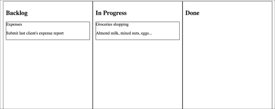

# 第七章。UI 作为函数

到目前为止，我们已经通过有效地处理和建模数据流来管理异步工作流，从而通过管理复杂性进行了一次旅行。特别是第四章，“core.async 简介”和第五章，“使用 core.async 创建自己的 CES 框架”探讨了提供**组合事件系统**原语和组合子的库所涉及的内容。我们还构建了一个简单的 ClojureScript 应用程序，该应用程序使用了我们的框架。

你可能已经注意到，到目前为止的示例都没有处理我们准备好向用户展示数据后会发生什么。作为应用程序开发者，我们需要回答的仍然是一个悬而未决的问题。

在本章中，我们将探讨一种在 Web 应用程序中使用 React（见[`facebook.github.io/react/`](http://facebook.github.io/react/)）处理反应式用户界面的方法，React 是由 Facebook 开发的一个现代 JavaScript 框架，以及：

+   学习 React 如何高效地渲染用户界面

+   了解 Om，它是 React 的 ClojureScript 接口

+   学习 Om 如何利用持久数据结构来提高性能

+   使用 Om 开发两个完全工作的 ClojureScript 应用程序，包括使用`core.async`进行组件间通信

# 复杂 Web UI 的问题

随着单页 Web 应用程序的兴起，能够管理 JavaScript 代码库的增长和复杂性变得至关重要。ClojureScript 也是如此。

为了管理这种复杂性，出现了大量的 JavaScript MVC 框架，例如 AngularJS、Backbone.js、Ember.js 和 KnockoutJS 等。

它们非常不同，但有一些共同的特点：

+   通过提供模型、视图、控制器、模板等来为单页应用程序提供更多结构

+   提供客户端路由

+   双向数据绑定

在本章中，我们将专注于最后一个目标。

如果我们要开发一个中等复杂程度的单页 Web 应用程序，双向数据绑定绝对是至关重要的。以下是它是如何工作的。

假设我们正在开发一个电话簿应用程序。更有可能的是，我们将有一个模型——或者实体、映射等——来表示联系人。联系人模型可能有姓名、电话号码和电子邮件地址等属性。

当然，如果用户无法更新联系信息，那么这个应用程序将不会很有用，因此我们需要一个表单来显示当前的联系详细信息，并允许您更新联系人的信息。

联系模型可能通过 AJAX 请求加载，然后可能使用显式的 DOM 操作代码来显示表单。这看起来可能像以下伪代码：

```java
function editContact(contactId) {
  contactService.get(contactId, function(data) {
    contactForm.setName(data.name);
    contactForm.setPhone(data.phone);
    contactForm.setEmail(data.email);
  })
}
```

但是，当用户更新某人的信息时会发生什么？我们需要以某种方式存储它。在点击保存时，以下函数可以解决问题，假设你正在使用 jQuery：

```java
$("save-button").click(function(){
  contactService.update(contactForm.serialize(), function(){
    flashMessage.set("Contact Updated.")
  })
```

这看似无害的代码带来了一个大问题。这个特定的人的联系模型现在过时了。如果我们还在使用旧的方式开发 Web 应用，即每次更新都重新加载页面，这不会是问题。然而，单页 Web 应用的全部要点是响应性，所以它在客户端保持大量状态，并且保持我们的模型与视图同步非常重要。

这就是双向数据绑定发挥作用的地方。以下是一个 AngularJS 的示例：

```java
// JS
// in the Controller
$scope.contact = {
  name: 'Leonardo Borges',
  phone '+61 xxx xxx xxx',
  email: 'leonardoborges.rj@gmail.com'
}

<!-- HTML -->
<!-- in the View -->
<form>
  <input type="text" name="contactName"  ng-model="contact.name"/>
  <input type="text" name="contactPhone" ng-model="contact.phone"/>
  <input type="text" name="contactEmail" ng-model="contact.email"/>
</form>
```

本章的目标不是 Angular，所以我就不深入细节了。我们只需要从这个例子中知道的是，`$scope`是我们告诉 Angular 使我们的联系模型对视图可用的方式。在视图中，自定义属性`ng-model`告诉 Angular 在作用域中查找该属性。这样建立了一种双向关系，当作用域中的模型数据发生变化时，Angular 刷新 UI。同样，如果用户编辑表单，Angular 更新模型，保持一切同步。

然而，这种方法的两个主要问题是：

+   这可能很慢。Angular 及其朋友实现双向数据绑定的方式，大致来说，是通过为视图中的自定义属性和模型属性附加事件处理程序和观察者。对于足够复杂的用户界面，你将开始注意到 UI 渲染速度变慢，从而降低了用户体验。

+   它严重依赖于突变。作为函数式程序员，我们努力将副作用限制到最小。

这种方法及其类似方法带来的缓慢有两方面：首先，AngularJS 及其朋友必须“观察”作用域中每个模型的每个属性以跟踪更新。一旦框架确定模型中的数据已更改，它就会查找依赖于该信息的 UI 部分——例如上面的使用`ng-model`的片段——然后重新渲染它们。

其次，DOM 是大多数单页 Web 应用中最慢的部分。如果我们稍微思考一下，这些框架正在触发数十或数百个 DOM 事件处理程序以保持数据同步，每个处理程序最终都会更新 DOM 中的节点——或多个节点。

但是，不要只听我的话。我运行了一个简单的基准测试来比较纯计算与定位 DOM 元素并更新其值为计算结果的差异。以下是结果——我使用了 JSPerf 来运行基准测试，这些结果是在 Chrome 37.0.2062.94 上 Mac OS X Mavericks 上获得的（见[`jsperf.com/purefunctions-vs-dom`](http://jsperf.com/purefunctions-vs-dom)）：

```java
document.getElementsByName("sum")[0].value = 1 + 2  
// Operations per second: 2,090,202

1 + 2  
// Operations per second: 780,538,120
```

更新 DOM 比执行简单的计算慢得多。从逻辑上讲，我们希望以尽可能高效的方式完成这项工作。

然而，如果我们不保持数据同步，我们就会回到起点。应该有一种方法可以大幅减少渲染量，同时保留双向数据绑定的便利性。我们能否既吃蛋糕又吃蛋糕？

# 进入 React.js

正如我们将在本章中看到的，对上一节提出的问题的答案是响亮的肯定，正如你可能已经猜到的，它涉及到 React.js。

但是什么让它变得特殊？

智慧的做法是从 React 不是什么开始。它不是一个 MVC 框架，因此它不是 AngularJS、Backbone.js 等类似框架的替代品。React 专注于 MVC 中的 V，并以一种令人耳目一新的方式来思考用户界面。我们必须稍微偏离一下，以便探索它是如何做到这一点的。

## 函数式编程的经验教训

作为函数式程序员，我们不需要被不可变性的好处所说服。我们很久以前就接受了这个前提。然而，如果我们不能有效地使用不可变性，它就不会在函数式编程语言中变得普遍。

我们应该感谢投入大量研究**纯函数数据结构**的巨大努力——首先是 Okasaki 在他的同名书中（见[`www.amazon.com/Purely-Functional-Structures-Chris-Okasaki/dp/0521663504/ref=sr_1_1?ie=UTF8&qid=1409550695&sr=8-1&keywords=purely+functional+data+structures`](http://www.amazon.com/Purely-Functional-Structures-Chris-Okasaki/dp/0521663504/ref=sr_1_1?ie=UTF8&qid=1409550695&sr=8-1&keywords=purely+functional+data+structures)），然后其他人对其进行了改进。

没有它，我们的程序在空间和运行时复杂度上都会膨胀。

通用思路是，给定一个数据结构，唯一更新它的方式是通过创建一个带有所需增量（delta）的它的副本：

```java
(conj [1 2 3] 4) ;; [1 2 3 4]
```


在前面的图像中，我们有一个关于`conj`如何操作的简单看法。在左边，我们有代表我们希望更新的向量的底层数据结构。在右边，我们有新创建的向量，正如我们所看到的，它与之前的向量共享一些结构，同时包含我们的新项目。

### 小贴士

事实上，底层数据结构是一个树，而表示是为了本书的目的而简化的。我强烈建议读者参考 Okasaki 的书，以了解更多关于纯函数数据结构如何工作的细节。

此外，这些函数被认为是纯函数。也就是说，它将每个输入关联到单个输出，并不做其他任何事情。实际上，这与 React 处理用户界面的方式非常相似。

如果我们将 UI 视为数据结构的视觉表示，它反映了我们应用程序的当前状态，那么我们可以毫不费力地认为 UI 更新是一个简单的函数，其输入是应用程序状态，输出是 DOM 表示。

你会注意到我没有说输出是渲染到 DOM 的——那样会使函数变得不纯，因为渲染显然是一个副作用。这也会使它和替代方案一样慢。

这种 DOM 表示基本上是一个 DOM 节点的树，它模拟了你的 UI 应该看起来是什么样子，没有其他内容。

React 将这种表示称为 **虚拟 DOM**，粗略地说，React 不是通过监视触发 DOM 重新渲染的应用程序状态的单个部分和片段，而是将你的 UI 转换为一个函数，你可以向它提供整个应用程序状态。

当你向这个函数提供新的更新状态时，React 将该状态渲染到虚拟 DOM。记住，虚拟 DOM 只是一个数据结构，所以渲染非常快。一旦完成，React 会做两件事之一：

+   如果这是第一次渲染，它会将虚拟 DOM 提交到实际 DOM。

+   否则，它会将新的虚拟 DOM 与从应用程序上一次渲染缓存的当前虚拟 DOM 进行比较。然后，它使用一个高效的差异算法来计算更新真实 DOM 所需的最小更改集。最后，它将这个差异提交到 DOM。

不深入 React 的细节，这基本上就是它的实现方式，也是它比其他替代方案更快的原因。从概念上讲，每当应用程序状态发生变化时，React 就会点击“刷新”按钮。

另一个巨大的好处是，通过将你的 UI 视为一个从应用程序状态到虚拟 DOM 的函数，我们恢复了一些在函数式语言中处理不可变数据结构时能够进行的推理。

在接下来的章节中，我们将了解为什么这对我们 Clojure 开发者来说是一个巨大的胜利。

# ClojureScript 和 Om

为什么我在 Clojure 书中花了六页的篇幅来谈论 JavaScript 和 React？我保证我不是在浪费你宝贵的时间；我们只是需要一些背景知识来理解接下来要讲的内容。

Om 是由 Cognitect 的多产且杰出的个人 David Nolen 开发的 ClojureScript 接口到 React.js。是的，他还开发了 `core.logic`、`core.match` 以及 ClojureScript 编译器。这就是他的多产。但我在这里跑题了。

当 Facebook 发布 React 时，David 立即看到了其潜力，更重要的是，如何利用我们在 Clojure 中编程时能够做出的假设，其中最重要的是数据结构不会改变。

React 提供了几个组件生命周期函数，允许开发者控制各种属性和行为。特别是 `shouldComponentUpdate`，它用于决定组件是否需要重新渲染。

React 在这里面临着一个巨大的挑战。JavaScript 本质上是可变的，所以在比较虚拟 DOM 树时，要高效地识别哪些节点已更改是非常困难的。React 采用了一些启发式方法来避免 *O(n* *3* *)* 最坏情况性能，并且大多数时候能够在 *O(n)* 内完成。由于启发式方法并不完美，我们可以选择提供自己的 `shouldComponentUpdate` 实现，并在渲染组件时利用我们所拥有的知识。

相反，ClojureScript 使用不可变数据结构。因此，Om 提供了最简单和最有效的 `shouldComponentUpdate` 实现：简单的引用等价性检查。

由于我们总是处理不可变的数据结构，为了知道两棵树是否相同，我们只需要比较它们的根是否相同。如果它们相同，我们就完成了。否则，向下递归并重复此过程。这保证了产生 *O(log n)* 的运行时间复杂度，并允许 Om 总是从根高效地渲染 UI。

当然，性能并不是 Om 的唯一优点——我们现在将探讨是什么让 Om 应用程序变得出色。

# 使用 Om 构建简单的联系人应用程序

到目前为止，这一章已经非常注重文本了。是我们动手构建一个简单的 Om 应用程序的时候了。既然我们之前已经讨论了联系人，那么我们就从联系人开始。

React 和 Om 的主要驱动因素是构建高度可重用、自包含组件的能力，因此，即使在简单的 *Contacts* 应用程序中，我们也将有多个组件协同工作以实现共同目标。

这是我们的用户应该在应用程序中能够做到的：

+   显示当前存储中的联系人列表

+   显示给定联系人的详细信息

+   编辑特定联系人的详细信息

一旦我们完成，它将看起来像以下这样：


## 联系人应用程序状态

如前所述，Om/React 最终将根据我们的应用程序状态渲染 DOM。我们将使用内存中的数据来简化示例。以下是我们的应用程序状态将看起来像这样：

```java
(def app-state
  (atom {:contacts {1 {:id    1
                       :name  "James Hetfield"
                       :email "james@metallica.com"
                       :phone "+1 XXX XXX XXX"}
                    2 {:id    2
                       :name  "Adam Darski"
                       :email "the.nergal@behemoth.pl"
                       :phone "+48 XXX XXX XXX"}}
         :selected-contact-id []
         :editing [false]}))
```

我们将状态保存在原子中的原因是因为 Om 使用它来重新渲染应用程序，如果我们进行 `swap!` 或 `reset!` 操作，例如，如果我们首次渲染应用程序后从服务器加载数据。

国家本身的数据应该大部分是自我解释的。我们有一个包含所有联系人的地图，一个表示当前是否有联系人被选中的键，以及一个表示我们是否正在编辑所选联系人的标志。可能看起来有些奇怪的是，`:selected-contact-id` 和 `:editing keys` 都指向一个向量。请稍等片刻；这个原因很快就会变得清晰。

现在我们已经有了我们的应用程序状态草稿，是时候考虑状态如何在我们的应用程序的不同组件中流动了。一图胜千言，所以下面的图展示了我们的数据将通过的高层架构：


在前面的图像中，每个函数都对应一个 Om 组件。至少，它们以一些数据作为它们的初始状态。在这张图中有趣的是，当我们深入到更专业的组件时，它们请求的状态比主组件`contacts-app`少。例如，`contacts-view`组件需要所有联系人以及选中联系人的 ID。另一方面，`details-panel-view`组件只需要当前选中的联系人，以及它是否正在被编辑。这是 Om 中的一种常见模式，我们通常希望避免过度共享应用程序状态。

在对高层架构有一个粗略的了解后，我们就可以开始构建我们的联系人应用程序了。

## 设置联系人项目

再次强调，我们将使用 Leiningen 模板来帮助我们开始。这次我们将使用`om-start`（见[`github.com/magomimmo/om-start-template`](https://github.com/magomimmo/om-start-template)），也是由 Mimmo Cosenza（见[`github.com/magomimmo`](https://github.com/magomimmo)）提供的。在终端中键入以下内容以使用此模板创建基础项目：

```java
lein new om-start contacts
cd contacts

```

接下来，让我们打开`project.clj`文件，确保我们有模板拉入的各种不同依赖项的相同版本。这样我们就不必担心不兼容的版本：

```java
...
  :dependencies [[org.clojure/clojure "1.6.0"]
                 [org.clojure/clojurescript "0.0-2277"]
                 [org.clojure/core.async "0.1.338.0-5c5012-alpha"]
                 [om "0.7.1"]
                 [com.facebook/react "0.11.1"]]
...
```

为了验证新的项目骨架，仍然在终端中，键入以下内容来自动编译你的 ClojureScript 源文件：

```java
lein cljsbuild auto
Compiling ClojureScript.
Compiling "dev-resources/public/js/contacts.js" from ("src/cljs" "dev-resources/tools/repl")...
Successfully compiled "dev-resources/public/js/contacts.js" in 9.563 seconds.

```

现在，如果我们打开浏览器中的`dev-resources/public/index.html`文件，我们应该能看到模板默认的“Hello World”页面。

## 应用程序组件

下一步，我们将打开`src/cljs/contacts/core.cljs`文件，这是我们的应用程序代码将放置的地方，并确保它看起来像以下内容，以便我们有适当的命名空间声明的一个干净的起点：

```java
(ns contacts.core
  (:require [om.core :as om :include-macros true]
            [om.dom :as dom :include-macros true]))

(enable-console-print!)

(def app-state
  (atom {:contacts {1 {:id    1
                       :name  "James Hetfield"
                       :email "james@metallica.com"
                       :phone "+1 XXX XXX XXX"}
                    2 {:id    2
                       :name  "Adam Darski"
                       :email "the.nergal@behemoth.pl"
                       :phone "+48 XXX XXX XXX"}}
         :selected-contact-id []
         :editing [false]}))

(om/root
  contacts-app
  app-state
  {:target (. js/document (getElementById "app"))})
```

每个 Om 应用程序都是以`om/root`函数创建的根组件开始的。它接受一个表示组件的函数——`contacts-app`——应用程序的初始状态——`app-state`——以及一个选项映射，其中我们唯一关心的是`:target`，它告诉 Om 在哪里将根组件挂载到 DOM 上。

在这种情况下，它将挂载到一个 ID 为`app`的 DOM 元素上。这个元素是由`om-start`模板给出的，位于`dev-resources/public/index.html`文件中。

当然，这段代码现在还不能编译，因为我们还没有`contacts-app`模板。让我们解决这个问题，并在前面的声明上方创建它——我们是自下而上实现组件的：

```java
(defn contacts-app [data owner]
  (reify
    om/IRender
    (render [this]
      (let [[selected-id :as selected-id-cursor] 
            (:selected-contact-id data)]
        (dom/div nil
                 (om/build contacts-view
                           {:contacts            (:contacts data)
                            :selected-id-cursor selected-id-cursor})
                 (om/build details-panel-view
                           {:contact        (get-in data [:contacts selected-id])
                            :editing-cursor (:editing data)}))))))
```

```java
When describing om/root, we saw that its first argument must be an Om component. The contact-app function creates one by reifying the om/IRender protocol. This protocol contains a single function—render—which gets called when the application state changes.
```

### 小贴士

Clojure 使用 reify 动态实现协议或 Java 接口，而不需要创建一个新的类型。你可以在 Clojure 文档的数据类型页面了解更多信息，请访问[`clojure.org/datatypes`](http://clojure.org/datatypes)。

`render`函数必须返回一个`Om/React`组件或 React 知道如何渲染的内容——例如组件的 DOM 表示。`contacts-app`的参数很简单：`data`是组件状态，`owner`是后端的 React 组件。

在源文件向下移动，在`render`的实现中，我们有以下内容：

```java
(let [[selected-id :as selected-id-cursor] 
      (:selected-contact-id data)]
  ...)
```

如果我们从应用程序状态中回忆起来，`:selected-contact-id`的值在这个阶段是一个空向量。因此，在这里，我们正在对这个向量进行解构并给它命名。你现在可能想知道为什么我们将向量绑定到一个名为`selected-id-cursor`的变量上。这是因为在这个组件生命周期的这个点上，`selected-id-cursor`不再是一个向量，而是一个光标。

## Om 光标

一旦`om/root`创建了我们的根组件，子组件就不再直接访问状态原子了。相反，组件接收一个从应用程序状态创建的光标。

光标是表示原始状态原子中位置的数结构。你可以使用光标来读取、删除、更新或创建一个值，而无需了解原始数据结构。让我们以`selected-id-cursor`光标为例：


在顶部，我们有原始的应用程序状态，Om 将其转换为光标。当我们从这个状态中请求`:selected-contact-id`键时，Om 给我们另一个光标，代表数据结构中的那个特定位置。碰巧的是，它的值是一个空向量。

这个光标有趣的地方在于，如果我们使用 Om 的状态转换函数（如`om/transact!`和`om/update!`）之一来更新它的值——我们很快就会解释这些函数——它知道如何将更改传播到树的上层，并最终回到应用程序状态原子。

这很重要，因为我们之前简要提到过，让我们的更专业化的组件依赖于其正确操作所需的应用程序状态的具体部分是一种常见的做法。

通过使用光标，我们可以轻松地传播变化，而无需了解应用程序状态的外观，从而避免访问全局状态的需求。

### 小贴士

你可以将光标想象成 zipper。从概念上讲，它们服务于类似的目的，但具有不同的 API。

## 填补空白

在`contacts-app`组件向下移动，我们现在有以下内容：

```java
(dom/div nil
                 (om/build contacts-view
                           {:contacts            (:contacts data)
                            :selected-id-cursor selected-id-cursor})
                 (om/build details-panel-view
                           {:contact        (get-in data [:contacts selected-id])
                            :editing-cursor (:editing data)}))
```

`dom` 命名空间包含 React DOM 类的薄包装。它本质上代表应用程序将呈现的数据结构。接下来，我们看到两个示例，说明我们如何在另一个 Om 组件内部创建 Om 组件。我们使用 `om/build` 函数来做这件事，并创建了 `contacts-view` 和 `details-panel-view` 组件。`om/build` 函数接受组件函数、组件状态以及可选的选项映射作为参数，这些选项在这个例子中并不重要。

到目前为止，我们已经通过创建子游标开始限制传递给子组件的状态。

根据源代码，我们应该查看的下一个组件是 `contacts-view`。下面是它的完整代码：

```java
(defn contacts-view [{:keys [contacts selected-id-cursor]} owner]
  (reify
    om/IRender
    (render [_]
      (dom/div #js {:style #js {:float "left"
                                            :width "50%"}}
               (apply dom/ul nil
                      (om/build-all contact-summary-view (vals contacts)
                                    {:shared {:selected-id-cursor selected-id-cursor}}))))))
```

希望现在这个组件的源代码看起来更熟悉一些。和之前一样，我们重新实现 `om/IRender` 以提供我们组件的 DOM 表示。它由一个单一的 `div` 元素组成。这次我们将一个表示 HTML 属性的哈希表作为 `dom/div` 的第二个参数。我们使用了一些内联样式，但理想情况下我们会使用外部样式表。

### 小贴士

如果你不太熟悉 `#js {…}` 语法，它只是一个扩展到 (`clj->js {…}`) 的读取宏，目的是将 ClojureScript 的哈希表转换为 JavaScript 对象。需要注意的是，它不是递归的，正如 `#js` 的嵌套使用所证明的那样。

`dom/div` 的第三个参数比我们之前看到的要稍微复杂一些：

```java
(apply dom/ul nil
                      (om/build-all contact-summary-view (vals contacts)
                                    {:shared {:selected-id-cursor selected-id-cursor}}))
```

每个联系人将由一个 `li`（列表项）HTML 节点表示，因此我们首先将结果包装到一个 `dom/ul` 元素中。然后，我们使用 `om/build-all` 来构建一个联系人 `summary-view` 组件的列表。Om 将依次调用 `om/build` 来处理 `vals contacts` 中的每个联系人。

最后，我们使用 `om/build-all` 的第三个参数——选项映射——来演示我们如何在组件之间共享状态而不使用全局状态。我们将在下一个组件 `contact-summary-view` 中看到它是如何使用的：

```java
  (defn contact-summary-view [{:keys [name phone] :as contact} owner]
  (reify
    om/IRender
    (render [_]
      (dom/li #js {:onClick #(select-contact! @contact
                                              (om/get-shared owner :selected-id-cursor))}
              (dom/span nil name)
              (dom/span nil phone)))))
```

如果我们将应用程序视为一个组件树，我们现在已经到达了其中的一片叶子。这个组件简单地返回一个包含联系人的姓名和电话的 `dom/li` 节点，并用 `dom/span` 节点包装。

它还安装了一个处理 `dom/li onClick` 事件的处理器，我们可以用它来更新状态游标。

我们使用 `om/get-shared` 来访问我们之前安装的共享状态，并将结果游标传递给 `select-contact!`。我们还传递了当前联系人，但如果你仔细看，我们必须首先 `deref` 它：

```java
@contact
```

原因是 Om 不允许我们在渲染阶段之外操作游标。通过解引用游标，我们得到其最新的底层值。现在 `select-contact`! 有它需要执行更新的所有内容：

```java
(defn select-contact! [contact selected-id-cursor]
  (om/update! selected-id-cursor 0 (:id contact)))
```

我们简单地使用 `om/update!` 将索引 `0` 处的 `selected-id-cursor` 游标值设置为联系人的 `id`。如前所述，游标负责传播更改。

### 小贴士

您可以将 `om/update!` 视为在原子中使用 `clojure.core/reset!` 的光标版本。相反，同样适用于 `om/transact!` 和 `clojure.core/swap!`。

我们正在以良好的速度前进。是时候看看下一个组件 `details-panel-view` 了：

```java
(defn details-panel-view [data owner]
  (reify
    om/IRender
    (render [_]
      (dom/div #js {:style #js {:float "right"
                                :width "50%"}}
               (om/build contact-details-view data)
               (om/build contact-details-form-view data)))))
```

这个组件现在看起来应该相当熟悉。它所做的只是构建两个其他组件，`contact-details-view` 和 `contact-details-form-view`：

```java
(defn contact-details-view [{{:keys [name phone email id] :as contact} :contact
                             editing :editing-cursor}
                            owner]
  (reify
    om/IRender
    (render [_]
      (dom/div #js {:style #js {:display (if (get editing 0) "none" "")}}
             (dom/h2 nil "Contact details")
             (if contact
               (dom/div nil
                        (dom/h3 #js {:style #js {:margin-bottom "0px"}} (:name contact))
                        (dom/span nil (:phone contact)) (dom/br nil)
                        (dom/span nil (:email contact)) (dom/br nil)
                        (dom/button #js {:onClick #(om/update! editing 0 true)}
                                    "Edit"))
               (dom/span nil "No contact selected"))))))
```

`contact-details-view` 组件接收两份数据状态：联系人和编辑标志。如果我们有一个联系人，我们只需渲染该组件。然而，我们使用编辑标志来隐藏它，如果我们正在编辑它。这样我们就可以在下一个组件中显示编辑表单。我们还为编辑按钮安装了一个 `onClick` 处理器，以便我们可以更新编辑光标。

`contact-details-form-view` 组件接收相同的参数，但渲染以下表单：

```java
(defn contact-details-form-view [{{:keys [name phone email id] :as contact} :contact
                                  editing :editing-cursor}
                                 owner]
  (reify
    om/IRender
    (render [_]
      (dom/div #js {:style #js {:display (if (get editing 0) "" "none")}}
               (dom/h2 nil "Contact details")
               (if contact
                 (dom/div nil
                          (dom/input #js {:type "text"
                                                   :value name
                                                   :onChange #(update-contact! % contact :name)})
                          (dom/input #js {:type "text"
                                                   :value phone
                                                   :onChange #(update-contact! % contact :phone)})
                          (dom/input #js {:type "text"
                                                   :value email
                                                   :onChange #(update-contact! % contact :email)})
                          (dom/button #js {:onClick #(om/update! editing 0 false)}
                                                    "Save"))
               (dom/div nil "No contact selected"))))))
```

这个组件负责根据表单更新联系人信息。它是通过调用 `update-contact!` 并传递 JavaScript 事件、联系人光标和表示要更新的属性的键来实现的：

```java
(defn update-contact! [e contact key]
  (om/update! contact key (.. e -target -value)))
```

如前所述，我们只是使用 `om/update!` 而不是 `om/transact!`，因为我们只是用触发事件的表单字段的当前值替换光标属性的值 `e`。

### 注意

如果您不熟悉 `..` 语法，它只是一个方便的宏，用于 Java 和 JavaScript 的互操作性。前面的例子展开为：

```java
(. (. e -target) -value)
```

这和其他互操作性操作符在 Clojure 网站的 Java Interop 页面上有描述（见 [`clojure.org/java_interop`](http://clojure.org/java_interop)）。

就这样。确保您的代码仍在编译——或者如果您还没有开始，请在终端中键入以下内容以启动自动编译：

```java
lein cljsbuild auto

```

然后，再次在您的浏览器中打开 `dev-resources/public/index.html`，并尝试我们的联系人应用程序！特别注意，当您编辑联系人属性时，应用程序状态始终处于同步状态。

如果在此阶段有任何问题，请确保 `src/cljs/contacts/core.cljs` 文件与本书的配套代码匹配。

# 组件间通信

在我们之前的例子中，我们构建的组件通过应用程序状态相互通信，无论是读取还是交易数据。虽然这种方法可行，但除了非常简单的用例外，它并不总是最佳选择。在本节中，我们将学习使用 `core.async` 通道执行这种通信的另一种方式。

我们将要构建的应用程序是一个非常简单的虚拟敏捷看板。如果您听说过，它类似于 Trello（见 [`trello.com/`](https://trello.com/)）。如果您没有听说过，不用担心，它本质上是一个任务管理网络应用程序，其中您有代表任务的卡片，并且您可以在例如 **待办事项**、**进行中** 和 **完成** 等列之间移动它们。

到本节结束时，应用程序将看起来如下：



我们将限制自己只实现一个功能：通过拖放卡片在列之间移动。让我们开始吧。

## 使用 Om 创建敏捷看板

我们已经熟悉了 `om-start`（见 [`github.com/magomimmo/om-start-template`](https://github.com/magomimmo/om-start-template)）的 leiningen 模板，并且没有理由去改变它，所以我们将使用它来创建我们的项目——我将其命名为 `om-pm` 以代表**Om 项目管理**：

```java
lein new om-start om-pm
cd om-pm

```

和之前一样，我们应该确保我们的 `project.clj` 文件中有正确的依赖项：

```java
  :dependencies [[org.clojure/clojure "1.6.0"]
                 [org.clojure/clojurescript "0.0-2511"]
                 [org.om/om "0.8.1"]
                 [org.clojure/core.async "0.1.346.0-17112a-alpha"]
                 [com.facebook/react "0.12.2"]]
```

现在确保项目正确编译，以验证我们处于良好状态：

```java
lein cljsbuild auto
Compiling ClojureScript.
Compiling "dev-resources/public/js/om_pm.js" from ("src/cljs" "dev-resources/tools/repl")...
Successfully compiled "dev-resources/public/js/om_pm.js" in 13.101 seconds.

```

接下来，打开 `src/cljs/om_pm/core.cljs` 文件，并添加我们将用于构建应用程序的命名空间：

```java
(ns om-pm.core
  (:require [om.core :as om :include-macros true]
            [om.dom :as dom :include-macros true]
            [cljs.core.async :refer [put! chan <!]]
            [om-pm.util :refer [set-transfer-data! get-transfer-data! move-card!]])
  (:require-macros [cljs.core.async.macros :refer [go go-loop]]))
```

这次的主要区别是我们正在要求 `core.async` 函数和宏。我们还没有 `om-pm.util` 命名空间，但我们会在这个结尾处解决这个问题。

## 桌板状态

是时候考虑我们的应用程序状态将是什么样子了。在这个应用程序中，我们的主要实体是**卡片**，它代表一个任务，并具有 `id`、`title` 和 `description` 属性。我们将首先定义几个卡片：

```java
(def cards [{:id 1
             :title "Groceries shopping"
             :description "Almond milk, mixed nuts, eggs..."}
            {:id 2
             :title "Expenses"
             :description "Submit last client's expense report"}])
```

这还不是我们的应用程序状态，而是它的一部分。另一个重要的状态部分是跟踪哪些卡片在哪些列上的方式。为了简化问题，我们将只处理三个列：**待办事项**、**进行中**和**完成**。默认情况下，所有卡片都从待办事项开始：

```java
(def app-state
  (atom {:cards cards
         :columns [{:title "Backlog"
                    :cards (mapv :id cards)}
                   {:title "In Progress"
                    :cards []}
                   {:title "Done"
                    :cards []}]}))
```

这就是我们所需要的所有状态。列具有 `:title` 和 `:cards` 属性，其中包含该列中所有卡片的所有 ID。

此外，我们还将有一个辅助函数来使查找卡片更加方便：

```java
(defn card-by-id [id]
  (first (filterv #(= id (:id %)) cards)))
```

### 小贴士

**小心懒序列**

你可能已经注意到了在检索卡片 ID 时使用 `mapv` 而不是 `map`。这是一个微妙但重要的区别：`map` 默认是懒的，但 Om 只能创建 maps 和 vectors 的 cursors。使用 `mapv` 给我们一个 vector，避免了懒加载。

如果我们没有做那件事，Om 会将 ID 列表视为一个普通值，我们就无法进行交易。

## 组件概述

将 Om 应用程序分割成组件的方法有很多，在本节中，我们将通过遍历每个组件的实现来展示一种方法。

我们将遵循的方法与我们之前的应用程序类似，即从这一点开始，我们将自下而上地展示组件。

在我们看到第一个组件之前，我们应从 Om 的自身 `root` 组件开始：

```java
(om/root project-view app-state
         {:target (. js/document (getElementById "app"))})
```

这为我们提供了关于下一个组件的线索，`project-view`：

```java
(defn project-view [app owner]
  (reify
    om/IInitState
    (init-state [_]
      {:transfer-chan (chan)})

    om/IWillMount
    (will-mount [_]
      (let [transfer-chan (om/get-state owner :transfer-chan)]
        (go-loop []
          (let [transfer-data (<! transfer-chan)]
            (om/transact! app :columns 
                          #(move-card! % transfer-data))
            (recur)))))

    om/IRenderState
    (render-state [this state]
      (dom/div nil
               (apply dom/ul nil
                      (om/build-all column-view (:columns app)
                                    {:shared     {:cards (:cards app)}
                                     :init-state state}))))))
```

## 生命周期和组件本地状态

之前的组件与我们之前看到的组件相当不同。更具体地说，它实现了两个新的协议：`om/IInitState` 和 `om/IWillMount`。此外，我们完全放弃了 `om/IRender`，转而使用 `om/IRenderState`。在我们解释这些新协议有什么好处之前，我们需要讨论我们的高级设计。

`project-view` 组件是应用程序的主要入口点，它将整个应用程序状态作为其第一个参数。正如我们早期的 *Contacts* 应用程序一样，然后它使用所需的数据实例化剩余的组件。

然而，与 *Contacts* 示例不同的是，它创建了一个 `core.async` 通道——`transfer-chan`——它作为一个消息总线工作。想法是，当我们从一个列拖动卡片并将其拖放到另一个列时，我们的一个组件将把一个传输事件放入这个通道，并让其他人——很可能是 `go` 块——执行实际的移动操作。

这是在之前显示的组件中取出的以下片段中完成的：

```java
    om/IInitState
    (init-state [_]
      {:transfer-chan (chan)})
```

这就创建了 Om 所说的组件本地状态。它使用不同的生命周期协议，`om/IInitState`，它保证只被调用一次。毕竟，我们需要为这个组件提供一个单独的通道。`init-state` 应该返回一个表示本地状态的映射。

现在我们有了通道，我们需要安装一个 `go-loop` 来处理发送给它的消息。为此，我们使用不同的协议：

```java
    om/IWillMount
    (will-mount [_]
      (let [transfer-chan (om/get-state owner :transfer-chan)]
        (go-loop []
          (let [transfer-data (<! transfer-chan)]
            (om/transact! app :columns #(move-card! % transfer-data))
            (recur)))))
```

与之前的协议一样，`om/IWillMount` 在组件生命周期中也会被调用一次。它在即将被挂载到 DOM 中的时候被调用，是安装 `go-loop` 到我们通道中的完美位置。

### 小贴士

在 Om 应用程序中创建 `core.async` 通道时，避免在多次被调用的生命周期函数内部创建它们非常重要。除了非确定性行为之外，这还是内存泄漏的来源。

我们使用 `om/get-state` 函数从组件本地状态中获取它。一旦我们收到消息，我们就进行状态交易。我们很快就会看到 `transfer-data` 的样子。

我们通过实现其渲染函数来完成组件：

```java
...
om/IRenderState
    (render-state [this state]
      (dom/div nil
               (apply dom/ul nil
                      (om/build-all column-view (:columns app)
                                    {:shared     {:cards (:cards app)}
                                     :init-state state}))))
...
```

`om/IRenderState` 函数与 `om/IRender` 具有相同的目的，即它应该返回组件应该看起来像的 DOM 表示。然而，它定义了一个不同的函数，`render-state`，它将组件本地状态作为其第二个参数。这个状态包含我们在 `init-state` 阶段创建的映射。

## 剩余组件

接下来，我们将构建多个 `column-view` 组件，每个列一个。它们接收来自应用程序状态中的卡片列表作为它们的共享状态。我们将使用它来从每个列中存储的 ID 中检索卡片详情。

我们还使用 `:init-state` 键用我们的通道初始化每个列视图的本地状态，因为所有列都需要对其有一个引用。以下是组件的外观：

```java
(defn column-view [{:keys [title cards]} owner]
  (reify
    om/IRenderState
    (render-state [this {:keys [transfer-chan]}]
      (dom/div #js {:style      #js {:border  "1px solid black"
                                     :float   "left"
                                     :height  "100%"
                                     :width   "320px"
                                     :padding "10px"}
                    :onDragOver #(.preventDefault %)
                    :onDrop     #(handle-drop % transfer-chan title)}
               (dom/h2 nil title)
               (apply dom/ul #js {:style #js {:list-style-type "none"
                                              :padding         "0px"}}
                      (om/build-all (partial card-view title)
                                    (mapv card-by-id cards)))))))
```

到目前为止，代码看起来相当熟悉。我们在示例中使用了内联 CSS 以保持简单，但在实际应用中，我们可能会使用外部样式表。

我们再次实现 `render-state` 以检索传输通道，该通道将在处理 `onDrop` JavaScript 事件时使用。当用户将可拖动的 DOM 元素拖放到此组件上时，浏览器将触发此事件。`handle-drop` 如此处理：

```java
(defn handle-drop [e transfer-chan column-title]
  (.preventDefault e)
  (let [data {:card-id            
              (js/parseInt (get-transfer-data! e "cardId"))
              :source-column      
              (get-transfer-data! e "sourceColumn")
              :destination-column 
              column-title}]
    (put! transfer-chan data)))
```

此函数创建传输数据——一个包含键 `:card-id`、`:source-column` 和 `:destination-column` 的映射，这是我们移动卡片在列之间所需的一切。最后，我们将它 `put!` 到传输通道中。

接下来，我们构建一个或多个 `card-view` 组件。如前所述，Om 不能从懒序列创建游标，所以我们使用 `filterv` 给每个 `card-view` 提供一个包含它们各自卡片的向量。让我们看看它的源代码：

```java
(defn card-view [column {:keys [id title description] :as card} owner]
  (reify
    om/IRender
    (render [this]
      (dom/li #js {:style #js {:border "1px solid black"}
                   :draggable true
                   :onDragStart (fn [e]
                                  (set-transfer-data! e "cardId" id)
                                  (set-transfer-data! e "sourceColumn" column))}
              (dom/span nil title)
              (dom/p nil description)))))
```

由于这个组件不需要任何本地状态，我们回归使用 `IRender` 协议。此外，我们使其可拖动，并在 `onDragStart` 事件上安装事件处理器，该事件将在用户开始拖动卡片时触发。

此事件处理器设置传输数据，我们从 `handle-drop` 中使用。

我们已经忽略了这些组件使用了一些实用函数的事实。没关系，因为我们现在将在新的命名空间中定义它们。

## 实用函数

在 `src/cljs/om_pm/` 下创建一个名为 `util.cljs` 的新文件，并添加以下命名空间声明：

```java
(ns om-pm.util)
```

为了保持一致性，我们将从 `move-card!` 函数开始，自下而上查看函数：

```java
(defn column-idx [title columns]
  (first (keep-indexed (fn [idx column]
                         (when  (= title (:title column))
                           idx))
                       columns)))

(defn move-card! [columns {:keys [card-id source-column destination-column]}]
  (let [from (column-idx source-column      columns)
        to   (column-idx destination-column columns)]
    (-> columns
        (update-in [from :cards] (fn [cards]
                                   (remove #{card-id} cards)))
        (update-in [to   :cards] (fn [cards]
                                   (conj cards card-id))))))
```

`move-card!` 函数接收我们应用程序状态中列的游标，并简单地移动 `card-id` 在源和目标之间。你会注意到我们不需要访问 `core.async` 或 Om 特定函数，这意味着这个函数是纯的，因此很容易测试。

接下来，我们有处理传输数据的函数：

```java
(defn set-transfer-data! [e key value]
  (.setData (-> e .-nativeEvent .-dataTransfer)
            key value))

(defn get-transfer-data! [e key]
  (-> (-> e .-nativeEvent .-dataTransfer)
      (.getData key)))
```

这些函数使用 JavaScript 互操作性来与 HTML 的 `DataTransfer`（见 [`developer.mozilla.org/en-US/docs/Web/API/DataTransfer`](https://developer.mozilla.org/en-US/docs/Web/API/DataTransfer)）对象交互。这是浏览器共享与拖放事件相关的数据的方式。

现在，让我们简单地保存文件并确保代码正确编译。我们最终可以在浏览器中打开 `dev-resources/public/index.html` 并对我们的工作成果进行尝试！

# 练习

在这个练习中，我们将修改上一节中创建的 `om-pm` 项目。目标是添加键盘快捷键，以便高级用户可以更高效地操作敏捷看板。

要支持的快捷键：

+   `上`、`下`、`左` 和 `右` 方向键：这些允许用户在卡片之间导航，突出显示当前卡片

+   `n` 和 `p` 键：这些用于将当前卡片移动到下一个（右）或上一个（左）列，分别

这里的关键洞察是创建一个新的`core.async`通道，该通道将包含按键事件。然后，这些事件将触发之前概述的操作。我们可以使用 Google closure 库来监听事件。只需将以下`require`添加到应用程序命名空间中：

```java
(:require [goog.events :as events])
```

然后，使用此函数从 DOM 事件创建通道：

```java
 (defn listen [el type]
  (let [c (chan)]
    (events/listen el type #(put! c %))
    c))
```

基于键盘快捷键移动卡片的具体逻辑可以通过多种方式实现，所以不要忘记将你的解决方案与本书配套代码中提供的答案进行比较。

# 摘要

在本章中，我们看到了 Om 和 React 处理响应式 Web 界面的不同方法。反过来，这些框架通过应用函数式编程原则，如不可变性和持久数据结构，使得这一过程变得可能且无痛苦。

我们还学会了以 Om 的方式思考，通过将应用程序结构化为一系列函数，这些函数接收状态并输出状态变化的 DOM 表示。

此外，我们还看到通过通过`core.async`通道来结构化应用程序状态转换，我们可以将展示逻辑与实际执行工作的代码分离，这使得我们的组件更加易于推理。

在下一章中，我们将转向创建响应式应用程序的一个经常被忽视但很有用的工具：**Futures**。
