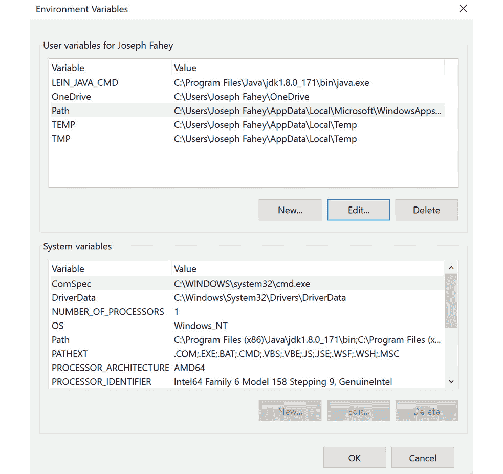
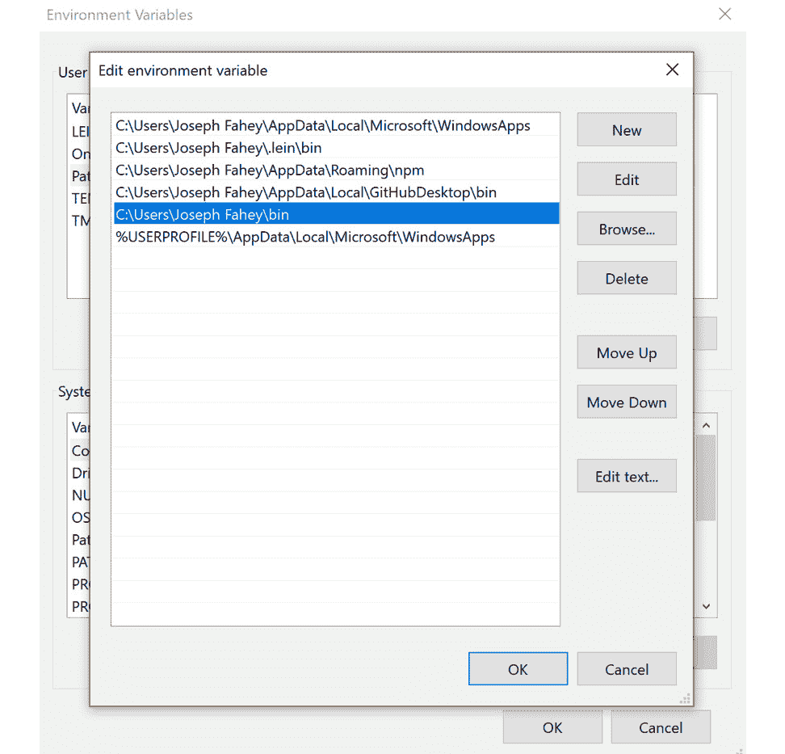
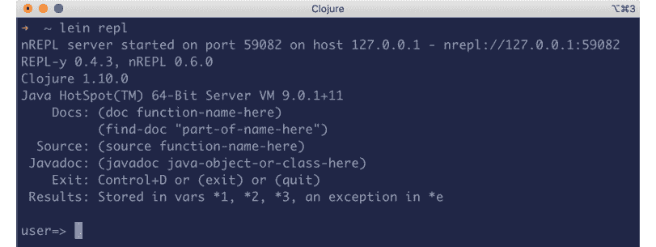

# 前言

## 关于

本节简要介绍了本书的涵盖范围，你开始学习所需的技术技能，以及完成所有包含的活动和练习所需的软件要求。

# 关于本书

你已经知道你想要学习 Clojure，而一种聪明的学习 Clojure 的方法是通过实践来学习。*Clojure Workshop* 专注于建立你的实际技能，这样你就可以用一种非常适合并发和与 Java 虚拟机互操作性的语言编写干净、表达力强的代码。你将从真实示例中学习，这些示例将带来真实的结果。

在整个 *Clojure Workshop* 过程中，你将采取引人入胜的逐步方法来理解 Clojure。你不必忍受任何不必要的理论。如果你时间紧迫，你可以每天跳入一个单独的练习，或者花一个周末的时间学习 Clojure 网络开发与 Ring。由你选择。按照你的方式学习，你将建立起并加强关键技能，这种方式会让人感到很有成就感。

每一本 *Clojure Workshop* 的实体印刷版都能解锁访问互动版。通过视频详细说明所有练习和活动，你将始终有一个指导性的解决方案。你还可以通过评估来衡量自己，跟踪进度，并接收内容更新。完成学习后，你甚至可以在线分享和验证一个安全的凭证。这是一项包含在印刷版中的高级学习体验。要兑换它，请遵循位于 Clojure 书籍开头的说明。

快速直接，*Clojure Workshop* 是 Clojure 初学者的理想选择。你将像软件开发者一样构建和迭代代码，在学习过程中不断进步。这个过程意味着你会发现你的新技能会持续存在，作为最佳实践的一部分——为未来的几年打下坚实的基础。

## 受众

*Clojure Workshop* 是 Clojure 初学者的理想教程。对 JavaScript 和 Java 有基本的了解会很理想，但并非必需。*Clojure Workshop* 将很好地引导你讨论这些技术的互操作性。

## 关于章节

*第一章*，*Hello REPL!*，让你立即开始编写代码。你将学习语言的基础，以及如何充分利用 Clojure 的交互式 REPL。

*第二章*，*数据类型和不可变性*，提供了更多的构建块，但这些是 Clojure 的构建块，它们让你接触到 Clojure 的一个关键特性：不可变性。

*第三章*，*深入函数*，深入探讨了 Clojure 区别于其他语言的一个领域：函数式编程范式。这些工具将帮助你完成本书的其余部分。

*第四章*，*映射和过滤*，是你探索 Clojure 集合的第一站。这里的所有模式和技巧都是关于学习如何解决问题的。map 和 filter 函数是 Clojure 最出色的工具之一。

*第五章*，*多对一：减少*，将真正开始让你以新的方式思考。本章中的数据塑形技术补充了上一章的内容。

*第六章*，*递归和循环*，将你的集合技术提升到下一个层次。本章将让你思考。到本章结束时，你将准备好使用高级函数式模式处理棘手的问题。

*第七章*，*递归 II：惰性序列*，通过查看 Clojure 的一个独特特性，完成了 Clojure 集合的全景。如果你能够编写处理复杂树结构的函数，你就准备好使用 Clojure 来解决大问题了。

*第八章*，*命名空间、库和 Leiningen*，提供了构建真实世界 Clojure 和 ClojureScript 应用程序所需工具的详细分析。你已经拥有了编写良好 Clojure 代码的技能；现在你需要了解如何组装你的应用程序。

*第九章*，*Java 和 JavaScript 与宿主平台互操作性*，让你了解 Clojure 的强大优势之一，但同时也可能令人望而生畏。作为一个托管语言，Clojure 让你能够访问底层平台。了解何时以及如何使用这种力量是 Clojure 的关键技能。

*第十章*，*测试*，是严肃、真实世界编程的重要一步。理解 Clojure 和 ClojureScript 测试故事是每位专业程序员都需要掌握的技能。

*第十一章*，*宏*，将帮助你理解 Lisp 语言家族的一个独特特性。宏允许丰富的抽象，但在表面之下，有许多重要的实用细节。

*第十二章*，*并发*，揭示了 Clojure 的另一个独特优势。本章将让你体验在 Java 虚拟机或事件驱动的 ClojureScript 单页应用程序上构建多线程应用程序。

*第十三章*，*数据库交互和应用层*，展示了如何利用 Clojure 的数据库库。许多实际应用都需要数据库，因此这些技能是必不可少的。

*第十四章*，*使用 Ring 的 HTTP*，展示了如何设置和运行一个由 Clojure 驱动的网络服务器。Ring 库是 Clojure 世界中应用最广泛的 HTTP 技术。

*第十五章*，*前端：ClojureScript UI*，帮助你整理你已经学到的关于 ClojureScript 的许多知识，这是 Clojure 网络堆栈的最后一层。

## 习惯用法

文本中的代码单词、数据库表名、文件夹名、文件名、文件扩展名、路径名、虚拟 URL、用户输入和 Twitter 昵称如下所示：“请注意，此函数位于`clojure.string`命名空间中，默认情况下并未引用。”

你在屏幕上看到的单词，例如在菜单或对话框中，也会以如下方式出现在文本中：“当你点击`获取图片`按钮时，图片会显示作者的名字。”

代码块设置如下：

```java
(defn remove-large-integers [ints]
  (remove #(and (integer? %) (> % 1000)) ints))
```

在输入和执行一些代码给出即时输出的情况下，这会以如下方式显示：

```java
user=> (sort [3 7 5 1 9])
(1 3 5 7 9)
```

在上面的例子中，输入的代码是`(sort [3 7 5 1 9])`，输出是`(1 3 5 7 9)`。

新术语和重要词汇会以如下方式显示：“欢迎使用 Clojure **读取求值打印循环**（**REPL**），这是一个我们可以用来与运行的 Clojure 程序交互的命令行界面。”

代码片段的关键部分会以如下方式突出显示：

```java
{:deps {compojure {:mvn/version "1.6.1"}
metosin/muuntaja {:mvn/version "0.6.4"}
        ring/ring-core {:mvn/version "1.7.1"}
        ring/ring-jetty-adapter {:mvn/version "1.7.1"}}
user=> (require '[muuntaja.middleware :as middleware])
=>nil
```

长代码片段将被截断，并在截断代码的顶部放置 GitHub 上相应代码文件的名称。整个代码的永久链接放置在代码片段下方。它应该看起来如下：

```java
kvitova_matches.clj
1  (def matches
2    [{:winner-name "Kvitova P.",
3      :loser-name "Ostapenko J.",
4      :tournament "US Open",
5      :location "New York",
6      :date "2016-08-29"}
7     {:winner-name "Kvitova P.",
8      :loser-name "Buyukakcay C.",
9      :tournament "US Open",
10     :location "New York",
11     :date "2016-08-31"}
The full code can be found at: https://packt.live/2GcudYj
```

## 在开始之前

每一段伟大的旅程都是从一小步开始的。我们即将在 Clojure 领域的冒险也不例外。在我们能够用数据做些酷的事情之前，我们需要准备好一个高效的环境。在本节中，我们将看到如何做到这一点。

## 安装 Java

在安装 Clojure 之前，你需要确保你的计算机上已安装了**Java 开发者工具包**（**JDK**）。对于 Mac 和 Linux 用户，预构建的二进制文件只需几步即可。在 Mac 上，对于 Homebrew 用户，你只需输入：

```java
$ brew install openjdk
```

在基于 Debian 的 Linux 发行版上，你可以通过输入以下内容来检查哪个版本可用：

```java
$ apt-get search openjdk
```

根据输出结果，你可以输入类似以下的内容：

```java
$ sudo apt-get install openjdk-11-jdk
```

Clojure 不需要特别新的 JDK 版本。

对于 Windows 用户，你可以从这里下载 OpenJDK 安装程序：[`packt.live/3aBu1Qg`](https://packt.live/3aBu1Qg)。一旦你有了安装程序，点击它以运行，然后按照说明操作。

## 安装 Clojure

一旦在你的系统上安装了有效的 JDK，使用 Leiningen 工具设置 Clojure 就变得简单了。

1.  从 Leiningen 主页复制适当的版本（Windows 或 Mac/Linux），这里：[`leiningen.org/`](https://leiningen.org/)。

1.  将 Leiningen 放置在系统`$PATH`的一部分目录中，并使其可执行。

1.  在 Mac 或 Linux 上，这意味着将其放在如`~/bin`这样的目录中，并调用`chmod`：

    ```java
    $ chmod +x ~/bin/lein
    ```

1.  在 Windows 上，要更改`$PATH`变量，请转到`控制面板` > `用户账户` > `用户账户`，然后点击`更改我的环境变量`。在显示你个人用户账户的用户变量的面板中，点击`Path`，然后选择`编辑`。

    图 0.1：用户账户

1.  点击`新建`以添加一行，然后输入你新`bin`目录的路径：

    图 0.2：在 bin 目录中添加路径

1.  现在 Leiningen 已安装并可用，从命令行，只需简单地输入：

    ```java
    $ lein
    ```

    Leiningen 将获取 Clojure 以及它需要管理的所有库。现在，只需简单地输入`lein repl`，您就会拥有您的第一个 Clojure REPL：



图 0.3：REPL 启动

## 编辑器和 IDE

虽然您当然可以在控制台中运行 REPL 做很多事情，但将 Clojure REPL 集成到您最喜欢的编辑器中会方便得多。几乎所有编辑器和环境都有插件，从 Vim 到 Emacs，从 IntelliJ 到 Electron 或 Visual Studio Code。

我们在这里无法涵盖所有可能的环境，但我们建议使用您已经熟悉的编码工具，并添加一个 Clojure 插件。最好的代码编辑器就是您喜欢使用的编辑器。只要它有 Clojure 插件，您应该很快就能开始使用。

## 安装代码包

从 GitHub 下载代码文件[`packt.live/2vbksal`](https://packt.live/2vbksal)。请参考这些代码文件以获取完整的代码包。

如果您在安装过程中有任何问题或疑问，请通过电子邮件联系我们的`workshops@packt.com`。

书中使用的优质彩色图像可以在[`packt.live/2O5EzNX`](https://packt.live/2O5EzNX)找到
