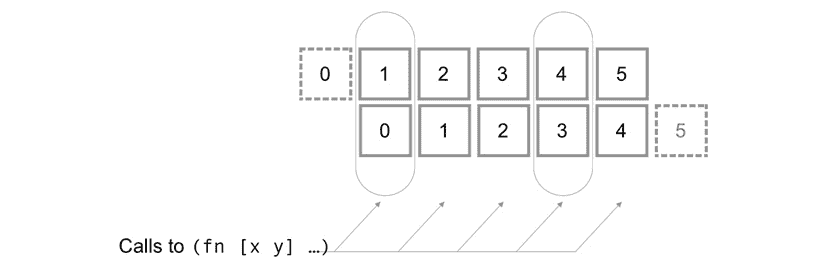
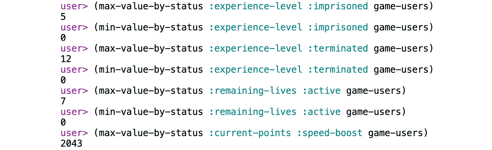
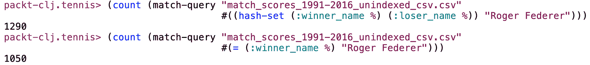
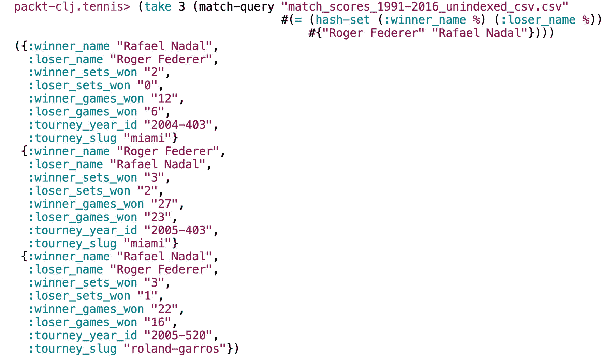
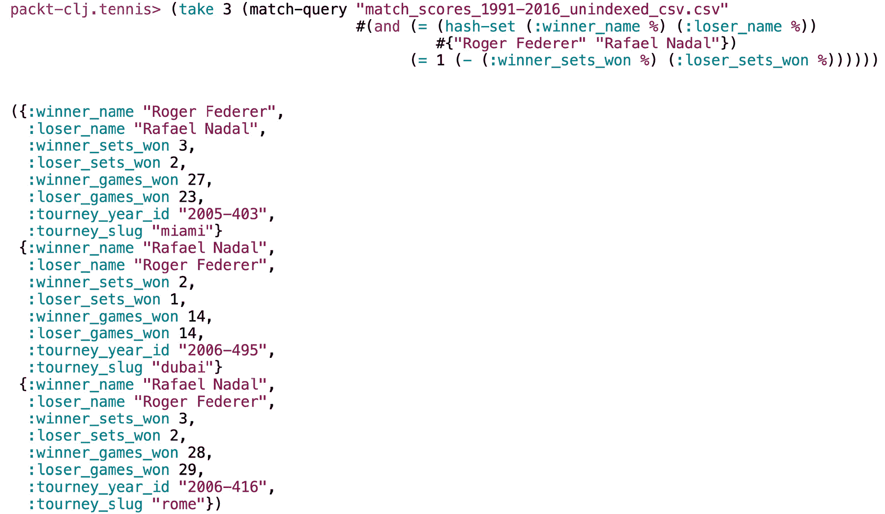

# 4. 映射和过滤

概述

在本章中，我们将通过查看两个最实用的模式：映射和过滤，开始探索如何在 Clojure 中使用顺序集合。我们将使用 map 和 filter 函数处理顺序数据，而不使用 for 循环。我们还将使用 Clojure 集合的常见模式和习惯用法，并利用惰性求值，同时避免陷阱。我们将从**逗号分隔值**（**CSV**）文件中加载数据并处理顺序数据集，从中提取和形塑数据。

在本章结束时，你将能够解析数据集并执行各种类型的转换以提取和总结数据。

# 简介

处理数据集合是编程中最常见且功能强大的部分之一。无论它们被称为列表、数组还是向量，顺序集合几乎存在于每个程序的核心。每种编程语言都提供了创建、访问和修改集合的工具，而且通常，你在一种语言中学到的知识也会适用于其他语言。然而，Clojure 却有所不同。我们习惯于设置一个变量，然后通过改变该变量的值来控制系统的其他部分。

这是在大多数过程式语言中的`for`循环中发生的情况。假设我们有一个迭代器`i`，我们通过调用`i++`来增加它的值。改变迭代器的值控制着循环的流程。通过执行`i = i + 3`，我们可以使循环跳过两个迭代。`i`的值就像循环的遥控器。如果我们正在遍历的数组只差一个元素就到末尾，而我们通过增加迭代器三个单位，会发生什么？遥控器并不能阻止我们用错它。

Clojure 有完全不同的方法。根据你之前做过什么样的编程，可能需要一些练习和一些经验才能习惯它。在 Clojure 中，将你编写的函数视为描述我们想要的数据形状的方法是有帮助的。通常，你需要分几个步骤重塑数据，才能使其达到所需的位置。而不是使用像我们之前提到过的迭代器这样的数据来跟踪程序的内部状态，Clojure 鼓励你编写将是你所拥有的数据和所希望的数据之间的桥梁的函数。这至少是一种思考方式。

从 30,000 英尺的高度来看，Clojure 程序的基本模式如下：

1.  获取数据。

1.  形塑数据。

1.  对数据做些处理。

传统的 `for` 循环往往将这三个阶段合并为一个。一个典型的例子是一个 `for` 循环，它从数据库或文件中读取一行数据（*获取数据*），进行一些计算（*处理数据*），然后将数据写回或发送到其他地方（*执行操作*），然后从头开始处理下一行。在 Clojure 中，良好的设计通常意味着将这些三个步骤分开，尽可能地将逻辑移动到中间，也就是数据处理步骤。

本章中我们将介绍的技巧将帮助您做到这一点。

注意

Clojure 确实有一个 `for` 宏，但它用于列表推导式，您可以将其视为本章中许多模式的替代语法。

这种编码方法使得 Clojure 成为一个在尽可能简单的情况下处理复杂事物的优秀语言。学习数据集合的函数式方法不仅适用于处理大型数据集。Clojure 程序通常倾向于以数据为中心，无论它们实际上处理多少数据。在 Clojure 程序中，大部分重要工作是通过处理数据（无论大小）来完成的。在本章中，您将学习的技巧和模式将帮助您编写任何类型的 Clojure 代码。

`map` 和 `filter` 函数在本质上非常简单，您很快就会看到。在本章中，我们将重点介绍如何使用它们来解决问题。同时，了解 `map` 和 `filter` 以及更一般地如何处理序列数据，意味着您将学习到关于 Clojure 生态系统的大量新知识——例如不可变性、惰性序列或函数式编程的基础。在本章的结尾，我们将开始使用我们在旅途中学到的技术来操作一个更大的数据集，这个数据集由多年专业网球比赛的结果组成。在随后的章节中，我们将继续在这个数据集上构建我们的经验，随着我们对 Clojure 了解得越来越多。

# map 和 filter

`map` 和 `filter` 函数是处理序列的更大函数组的关键部分。在该组中，`map` 是您将使用最多的一个，而 `filter` 则紧随其后。它们的作用是修改序列。

它们接受一个或多个序列作为输入，并返回一个序列：*输入序列*，*输出序列*：

![图 4.1：map 和 filter 一起工作的示意图

![图片 B14502_04_01.jpg]

图 4.1：map 和 filter 一起工作的示意图

在前面的图中，我们可以看到 `map` 和 `filter` 一起工作，其中 `filter` 从原始列表中删除项目，而 `map` 则改变它们。

解决涉及集合的问题时，首先要问的问题是：“我想要获得一个值的列表，还是一个单一值？” 如果答案是列表，那么 `map`、`filter` 或类似函数就是你需要的东西。如果你需要其他类型的值，解决方案可能是某种形式的归约，我们将在下一章讨论。但即使在这种情况下，当你分解问题，有很大可能性问题的一些组成部分将需要像 `map` 和 `filter` 这样的序列操作函数。例如，如果当前的问题涉及在一个销售物品列表中进行搜索，也许 `filter` 可以让你将搜索范围缩小到某个类别或价格范围。然后，你可以使用 `map` 为每个项目计算一个派生值——可能是项目的体积（以立方厘米为单位）或网站上的评论数量。然后，最后，你可以从这个转换后的列表中提取你正在寻找的单个项目，或者你需要的数据摘要。

要开始，让我们先单独看看 `map` 和 `filter`，然后再看看我们将如何一起使用它们。

## map

与 Clojure 的大多数序列处理函数一样，`map` 的第一个参数总是函数。我们提供的函数将应用于我们将要迭代的序列中的每个项目。以下是一个使用 Clojure 的 `inc` 函数将 1 加到输入序列中每个值上的非常简单的 `map` 使用示例：

```java
user> map inc [1 2 3])
(2 3 4)
```

每次调用 `inc` 函数的返回值都成为 `map` 返回的新序列中的一个值。

注意

`map` 函数可以接受更多的序列作为参数，我们很快就会看到。像许多序列处理函数一样，`map` 有一个单参数形式。当 `map` 只用一个参数调用时，即函数，它返回一个特殊函数，称为 `map`，Clojure 编译器不会因为参数不足而抱怨。相反，你会看到一个关于你记得没有写过的函数的奇怪错误。那个函数就是你错误产生的转换器。

## 练习 4.01：使用 map

让我们开始吧！在这个练习中，我们将使用 `map` 对一个整数列表进行操作，以获得不同类型的结果：

1.  在你的 REPL 中尝试以下操作：

    ```java
    user> (map (fn [i] (* i 10)) [1 2 3 4 5])
    ```

    输出如下：

    ```java
    (10 20 30 40 50)
    ```

    这个 `map` 调用简单地应用了名为 `(fn [i] (* i 10))` 的匿名函数到整数列表上，将每个数乘以 10。在这个过程中，我们最终得到一个新整数列表，每个整数对应于原始输入中的一个整数：

    

    图 4.2：将一个序列映射到另一个序列

    这种一对一的等价性很明显，但这也是 `map` 的一个关键特性。使用 `map`，结果的序列长度总是与输入序列完全相同，这样输入中的每个值都会映射到结果序列中的对应值，因此得名。

1.  让我们现在测量单词长度。当与序列一起工作时，Clojure 的 `count` 函数非常有价值。由于 Clojure 将字符串视为字符序列，因此 `count` 也可以用来查找字符串的长度：

    ```java
    user> (map count ["Let's" "measure" "word" "length" "now"])
    ```

    你应该看到每个单词的长度：

    ```java
    (5 7 4 6 3)
    ```

1.  为了使输出更容易阅读，我们可以添加单词及其长度：

    ```java
    user> (map (fn [w] (str w ": " (count w))) ["Let's" "measure" "word" "length" "now"]) 
    ```

    输出如下：

    ```java
    ("Let's: 5" "measure: 7" "word: 4" "length: 6" "now: 3")
    ```

当然，这个例子只是触及了 `map` 的不同应用表面。同时，它展示了映射概念的实际简单性：对于列表中的每个值，在新的列表中产生一个新的值。

## filter

与 `map` 不同，`filter` 可以，并且通常会产生比输入序列更短的序列结果。对 `filter` 的调用基本上类似于对 `map` 的调用：

```java
user> filter keyword? ["a" :b "c" :d "e" :f "g"])
(:b :d :f)
```

与 `map` 一样，传递给 `filter` 的第一个参数作为函数对序列中的每个项目进行调用。区别在于，在这种情况下，该函数被用作 `true` 或 `false`。当返回一个 **真值** 时，该项目将被包括在结果序列中。

与 `map` 的一个关键区别是，提供给 `filter` 的谓词仅用于决定给定的项目是否应该被包含。它不会以任何方式更改项目。`filter` 的结果集始终是输入集的子集。

## 练习 4.02：开始使用 filter

在这个练习中，我们将使用 `filter` 对整数列表进行操作以获得不同类型的结果。让我们开始吧：

1.  `odd?` 函数是一个谓词，如果数字是奇数则返回 `true`。在 REPL 中单独尝试它：

    ```java
    user> (odd? 5)
    ```

    输出如下：

    ```java
    true
    ```

1.  现在，尝试传递一个偶数作为输入：

    ```java
    user> (odd? 6)
    ```

    输出如下：

    ```java
    false
    ```

1.  现在，使用 `odd?` 与 `filter` 结合使用：

    ```java
    user> (filter odd? [1 2 3 4 5])
    ```

    输出如下：

    ```java
    (1 3 5)
    ```

1.  我们还可以使用过滤器的替代品 `remove`，它执行 `filter` 的相反操作。当谓词返回 `true` 时，项目将被移除：

    ```java
    user> (remove odd? [1 2 3 4 5])
    ```

    输出如下：

    ```java
    (2 4)
    ```

    下面是如何可视化 `filter` 的操作：

    ![图 4.3：过滤器函数使用谓词定义新的序列

    ![img/B14502_04_03.jpg]

    图 4.3：过滤器函数使用谓词定义新的序列

1.  使用 `filter`，我们正在限制原始序列，但结果始终是一个序列。考虑这两种极端情况，其中每个谓词始终返回单个值（Clojure 的 `constantly` 函数返回一个函数，该函数不做任何事情，只是返回一个值，无论传递给它多少参数）：

    ```java
    user> (filter (constantly true) [1 2 3 4 5])
    (1 2 3 4 5)
    user> (filter (constantly false) [1 2 3 4 5])
    ()
    ```

    无论我们保留一切还是什么都不保留，`filter` *总是* 返回一个序列。

与 `map` 一样，`filter` 在概念上非常简单：使用谓词，保留列表中的某些或所有项目。尽管这种简单性，或者正因为这种简单性，`filter` 是一个非常有用的函数，可以在无数情况下使用。

## 过滤器家族的其他成员 – take-while 和 drop-while

`take-while`和`drop-while`函数的逻辑与`filter`和`remove`相同——至少就它们使用谓词而言。区别在于它们只操作序列的起始位置，就像`take`和`drop`一样。`take`函数返回列表的前`n`个项，而`drop`返回原始列表减去前`n`个项：

```java
user> (take 3 [1 2 3 4 5])
(1 2 3)
user> (drop 3 [1 2 3 4 5])
(4 5)
```

类似地，`take-while`从列表的起始位置开始，只要满足谓词就返回所有项目，而`drop-while`则从序列的起始位置移除这些相同的项：

```java
User> (take-while #(> 10 %) [2 9 4 12 3 99 1])
(2 9 4)
user> (drop-while #(> 10 %) [2 9 4 12 3 99 1])
(12 3 99 1)
```

`take-while`和`drop-while`最明显的应用可能是对排序数据的细分。我们甚至可以将它们一起使用来找到序列中谓词停止返回`true`并开始返回`false`的确切点。

## 练习 4.03：使用`take-while`和`drop-while`对序列进行分区

我们有一个按顺序排列的学生列表，我们希望将其分为两组：在 2000 年之前出生的和在之后出生的。让我们开始吧：

1.  在你的 REPL 中定义一个`students`变量。你可以从这个课程的 GitHub 仓库复制列表：[`packt.live/2sQyVYz`](https://packt.live/2sQyVYz)：

    ```java
    (def students [{:name "Eliza" :year 1994}
                   {:name "Salma" :year 1995}
                   {:name "Jodie" :year 1997}
                   {:name "Kaitlyn" :year 2000}
                   {:name "Alice" :year 2001}
                   {:name "Pippa" :year 2002}
                   {:name "Fleur" :year 2002}])
    ```

1.  编写一个谓词来翻译“在 2000 年之前”的概念：

    ```java
    #(< (:year %) 2000)
    ```

    这个匿名函数从学生映射中提取`:year`值，并将其与`2000`进行比较。

1.  使用谓词与`take-while`一起查找在 2000 年之前出生的学生：

    ```java
    user> (take-while #(< (:year %) 2000) students)
    ({:name "Eliza", :year 1994}
     {:name "Salma", :year 1995}
     {:name "Jodie", :year 1997})
    ```

1.  使用相同的谓词与`drop-while`一起查找在 2000 年或之后出生的学生：

    ```java
    user> (drop-while #(< (:year %) 2000) students)
    ({:name "Kaitlyn", :year 2000}
     {:name "Alice", :year 2001}
     {:name "Pippa", :year 2002}
     {:name "Fleur", :year 2002})
    ```

你不会像使用`filter`本身那样经常使用`take-while`和`drop-while`函数，但它们在特定情况下可能非常有用。像`filter`一样，它们是塑造序列的有用工具。

## 使用 map 和 filter 一起使用

Clojure 序列函数的大部分功能都来自于它们的组合。让我们结合前面的例子。我们如何从 1, 2, 3, 4, 5 得到一个如 10, 30, 50 的序列？这只是一个关于按正确顺序应用我们的函数的问题。如果我们首先乘以 10，所有生成的整数都将为偶数。为了有意义地过滤掉奇数，我们必须先这样做。考虑以下示例：

```java
user> (map (fn [n] (* 10 n))
           (filter odd? [1 2 3 4 5]))
```

输出如下：

```java
(10 30 50)
```

这有点难以阅读，尤其是如果你不习惯阅读具有嵌套括号的 Lisp 代码。即使`map`在源代码中排在第一位，评估也是从对`filter`的调用开始的。然后结果传递给`map`（我们将在本章后面展示更好的写法）。不过，首先让我们看看发生了什么。

从概念上讲，计算看起来像这样：


图 4.4：结合两个操作 – 过滤后映射

可以将此视为数据通过管道流动。`map`和`filter`的功能参数是塑造数据在流动过程中的形状。

## 线程宏

我们可以以反映我们对数据进行操作逻辑的方式编写相同的表达式。如果我们用非常非习惯性的风格编写，使用`def`，它会稍微清晰一些：

```java
user> (def filtered (filter odd? [1 2 3 4 5]))
filtered
user> (map (fn [n] (* 10 n)) filtered)
(10 30 50)
```

或者，更习惯性地，我们可以使用 Clojure 的**线程宏**来使其更容易阅读：

```java
user> (->> [1 2 3 4 5]
        (filter odd?)
        (map (fn [n] (* 10 n))))
(10 30 50)
```

注意

宏是一种在执行之前转换代码的结构。在*第十一章*，*宏*中，我们将更深入地探讨宏。现在，你可以将 Clojure 的线程宏视为“语法糖”，它通过避免深层嵌套来允许我们编写更易于阅读的代码。

这就是我们将在本章中编写代码的方式。线程允许我们在不命名返回值的情况下保留执行的逻辑顺序。`->>`宏重写你的代码，使得每个表达式的结果都插入到下一个表达式的末尾。这样，我们可以编写以下内容：

```java
user> (->> [1 2 3 4 5]
        (filter odd?))
```

编译器实际上“看到”的是这个：

```java
user> (filter odd? [1 2 3 4 5])
```

这是一个极其常见的模式，在编写易于阅读的代码时非常有帮助，尤其是在对序列应用许多不同操作时。在 Clojure 中，当一个函数接受一个序列作为参数时，该参数通常是最后一个参数。这非常方便，或者更确切地说，是一个伟大的设计决策，因为它允许我们使用`->>`宏以直观的方式链接转换，这个宏恰好填充了表达式中的最后一个参数。一个复杂的转换可以被分解成更小、可组合的步骤，这使得编写、测试和理解都更容易。

# 使用惰性序列

在我们继续前进之前，重要的是要更仔细地看看 Clojure 中惰性序列的工作方式。当使用`map`和`filter`时，惰性评估通常是一个重要的考虑因素。在我们之前看到的例子中，我们已经使用了一个字面量向量作为输入：`[1 2 3 4 5]`。我们不必逐个输入每个数字，可以使用`range`函数并编写`(range 1 6)`。如果我们将其输入到 REPL 中，我们会得到基本上相同的结果：

```java
user> (range 1 6)
(1 2 3 4 5)
```

那么，这仅仅是一个避免输入大量整数的快捷方式吗？嗯，是的，但`range`还有一个有趣的特性：它是惰性的。

在我们继续前进之前，让我们回顾一下`(range 100)`是一个`100`：

```java
user> (def our-seq (range 100))
```

注意

REPL 会导致惰性序列被评估。有时这可能会让人困惑，如果你正在调试的问题是由一个没有完全评估的惰性序列引起的：“这段代码在 REPL 中运行得很好；为什么在我的代码中不能正确运行？”在 REPL 中调试时，如果你想避免强制评估一个惰性序列，可以将其分配给一个变量。

`range`函数通过多次调用`inc`来创建一个整数列表。很容易猜测`our-seq`中的最后一个整数将是`99`，但计算机不知道这一点，直到它完成了所有的算术。这意味着当我们查看第一个项目时，只有一个项目是已知的：

```java
user> (first our-seq)
0
```

但如果我们查看最后一个项目，所有中间的计算都将被执行：

```java
user> (last our-seq)
99
```

现在，整个序列已经被实现，从实际应用的角度来看，它不再与字面序列的整数有任何区别。

`map`、`filter`和`remove`等函数也是惰性的。这意味着当我们对惰性序列调用它们时，它们不会强制计算整个序列。本质上，惰性函数只是将新的计算添加到虚拟的后备计算队列中，当需要时才会实现序列。另一方面，`count`、`sort`或`last`等函数不是惰性的。显然，为了计算列表中的所有项目，我们首先需要整个列表。

## 练习 4.04：观察惰性求值

我们可以通过做一些在生产代码中永远不会做的事情来观察惰性求值的作用：引入副作用。让我们开始吧：

1.  在 REPL 中定义`range`的简单版本：

    ```java
    user> (defn our-range [limit]
            (take-while #(< % limit) (iterate inc 0)))
    ```

    这里，`iterate`函数通过在`0`上调用`inc`来创建一个惰性序列，然后在该结果上调用`inc`，然后在该结果上调用`inc`，依此类推。`take-while`将在匿名函数，即`#(< % limit)`停止返回`true`时停止消耗序列。这将停止`iterate`。

1.  在 REPL 中测试该函数：

    ```java
    user> (our-range 5)
    (0 1 2 3 4)
    ```

1.  使用`map`将每个整数乘以 10：

    ```java
    user> (map #(* 10 %) (our-range 5))
    (0 10 20 30 40)
    ```

1.  现在，我们将使用一个具有副作用的函数来打印每个整数乘法时的`.`：

    ```java
    user> (map (fn [i] (print ".") (* i 10)) (our-range 5)) 
    .(0\. 10\. 20\. 30\. 40)
    ```

    如预期的那样，每个整数都有一个`.`运算符。当你尝试这个时，点的确切位置可能不同：它们可能出现在整数列表之前或之后。它们不是结果序列的一部分；它们是在每次乘法执行之前同时打印的。每个整数都有一个点，因为整个序列已经被实现。

1.  这次，使用`def`来存储惰性序列，而不是在 REPL 中查看它：

    ```java
    user> (def by-ten (map (fn [i] (print ".") (* i 10)) (our-range 5)))
    #'user/by-ten
    ```

    REPL 返回`by-ten`变量，但没有打印任何点，因此我们知道还没有进行任何乘法运算。

1.  在 REPL 中评估变量：

    ```java
    user> by-ten
    .(0\. 10\. 20\. 30\. 40)   ;; this looks familiar!
    ```

    这里发生了什么？这与*步骤 4*中的输出相同。计算直到我们最终决定在 REPL 中消费惰性序列时才执行。这是 Clojure 中惰性的本质：延迟求值直到必要。

惰性求值在简化我们的程序和性能方面都有一些重要的好处。对序列的延迟计算意味着我们有时可以完全避免计算，至少在序列的一部分上。现在，重要的是要理解惰性求值如何改变我们编写和组织代码的方式。考虑这个表达式：

```java
(range)
```

没有参数时，`range` 返回从零到系统可以处理的最大整数的所有整数。如果你将这个表达式输入到你的 REPL 中，它将用数字填满整个屏幕。因为 REPL 在显示项目数量方面有一个内置的限制，所以它不会一直递增到无限大，或者直到你的 JVM 崩溃——哪个先到算哪个。现在，想象一下我们写点像这样东西：

```java
(->> (range)
     (map #(* 10 %))
     (take 5))
```

这个表达式告诉计算机将 1 到无限大的每个整数乘以 10，然后，当这个计算完成时，保留前五个值。如果没有懒加载，这将非常疯狂。它会在第一行失败。那么，当我们只对前五个值感兴趣时，为什么还要对一大堆数字进行计算呢？然而，在 Clojure 中，这是一种完全合理的写代码的方式。对`range`和`map`的调用是我们想要的数据的描述：正整数乘以 10。对`take`的调用允许我们在无限集合中选择我们实际需要的项目。懒加载意味着只需执行五个计算，因此前面的代码不仅优雅，而且效率极高。

当然，也存在危险。在这个例子中，如果我们用 `last` 替换 `(take 5)`，这意味着尝试评估整个序列，这将导致灾难性的后果，因为你的机器会尝试计算所有整数到无限大，并最终失败。懒加载非常有用，但了解它是如何工作的重要。

## 练习 4.05：创建我们自己的懒序列

有时，我们需要创建随机数的序列。这可能是为了模拟或编写测试。在像 JavaScript 这样的过程式语言中，我们可能会写点像这样东西：

```java
var ints = [];
for (var i = 0; i < 20; i++) {
  ints.push(Math.round(Math.random() * 100));
}
```

我们可以将这个功能封装在一个函数中，并参数化我们想要的数组长度。

我们如何在 Clojure 中没有使用 `for` 循环来做这件事？Clojure 有一个 `rand-int` 函数，它返回一个随机的单个整数。我们可以使用 `repeatedly` 函数，它返回一个由我们传递给它的函数的调用组成的懒序列。让我们开始吧：

1.  使用 `repeatedly` 和一个调用 `rand-int` 并带有固定参数的匿名函数来创建一个懒序列：

    ```java
    user> (def our-randoms (repeatedly (partial rand-int 100)))
    ```

    `parse-int` 函数只接受一个参数，该参数定义了要返回值的上限。在这种情况下使用 `partial` 是常见的，但我们可以同样简单地写一个字面匿名函数：`#(rand-int 100)`。

1.  使用 `take` 限制返回的整数数量：

    ```java
    user> (take 20 our-randoms) 
    ```

1.  将其封装成一个函数：

    ```java
    user> (defn some-random-integers [size]
        (take size (repeatedly (fn [] (rand-int 100)))))
    ```

1.  如此使用它：

    ```java
    user> (some-random-integers 12)
    ```

    输出如下：

    ```java
    (32 0 26 61 10 96 38 38 93 26 68 81)
    ```

当从过程式方法转向 Clojure 的函数式方法时，这种模式可能很有用。首先，描述你想要的数据，然后根据需要对其进行界定或转换。

懒惰序列一开始可能看起来没有必要地令人困惑：为什么要使用一个引入了是否已经计算过某物的不确定性的数据结构呢？确实有一些边缘情况可能会成为问题，我们将在本章后面看到其中之一。然而，大多数时候，通过编写不产生或依赖副作用的代码，可以避免这些问题。然后你将开始享受到懒惰序列的好处，它允许以声明性方式定义序列，这最终将简化你的代码。

## 常见惯用和模式

`map`和`filter`等函数是 Clojure 中用于提取、选择和转换数据的最强大的工具之一。有效使用它们的关键当然是知道与它们一起使用哪种类型的函数。Clojure 试图使编写函数变得容易，并为一些最常见的情况提供了许多快捷方式。这些技术将帮助你更快地编写代码，并且它们还将为你提供一些函数式编程的宝贵实践。

## 匿名函数

到目前为止，我们一直使用标准的`fn`形式或使用像`odd?`这样的命名函数来编写函数式参数作为匿名函数。由于 Clojure 中的序列处理函数通常使用作为参数传递的函数，因此编写（和阅读）匿名函数是一项极其常见的任务。这就是为什么了解编写它们的不同的快捷方式是很好的。

将函数传递给`map`或`filter`的最常见方式之一是使用所谓的`fn`形式。`fn`符号和参数列表消失，只留下函数的核心和开括号前的`#`运算符。

在*练习 4.01* *使用 map*中，我们本可以写成`#(* 10 %)`而不是`(fn [n] (* 10 n))`。前导的`#`运算符标识了其后的形式为一个函数。尽管如此，我们仍然没有参数列表，这在函数式语言中将是灾难性的遗漏！然而，我们得到了一个模式：与大多数函数中自由命名参数不同，函数字面量中的参数会自动按照一个简单的模式命名。第一个参数被命名为`%`，所有其他参数被命名为`%2`、`%3`、`%4`等等。

函数字面量的表现力有限。参数名称的模式不允许像解构或 Clojure 参数列表的其他有趣特性。当然，不能命名参数会使代码缺乏表现力。如果你有超过两个参数，可能该回到使用`fn`了。你今天早上写的复杂函数字面量中的`%4`可能看起来很明显，但一周后你可能会忘记。函数字面量应该是简短和简单的。

函数字面量的最终限制是它们不能嵌套。换句话说，如果你有一个调用`map`的函数字面量，那么提供给`map`的函数也不能是函数字面量。为什么嵌套不可能的原因非常简单。编译器如何知道哪个`%`与哪个函数相对应？

一旦函数字面量开始变得稍微复杂一些，就肯定到了切换到`fn`形式的时候了。函数字面量应该用作设置对现有函数调用的简单包装器，而不是编写复杂代码的地方。

随着你对 Clojure 中一些更高级的函数技术越来越熟悉，你将开始使用现在可供你使用的其他一些选项。对于乘以 10，我们也可以写成以下这样：

```java
(map (partial * 10) [1 2 3 4 5])
```

注意，这个表单前面没有`#`。在这里，`partial`函数返回一个新的匿名函数，即`*`，其第一个参数“预加载”。这在 REPL 中更容易理解：

```java
user> (def apart (partial * 10))
#'user/apart
user> (apart 5)
50
```

在这里，我们定义了`apart`，这是一个对`*`的部分评估调用。通过调用该函数，它表现得就像`*`一样，除了`*`的第一个参数已经填满。编写`(partial * 10)`本质上等同于编写`(fn [x] (* 10 x))`。

注意

任何使用`partial`创建的函数都可以总是重写为一个函数。函数如`partial`的力量在于它们能够以编程方式创建新的函数。这正是函数式编程的许多力量所在。

这实际上是我们一直在编写的完全相同的函数。目前，你不需要担心`partial`。像这样编写函数的其他方式是等效且足够的。

## 关键字作为函数

到目前为止，你已经熟悉了使用**关键字**在映射中获取值，如下所示：

```java
user> (:my-field {:my-field 42})
42
```

这之所以有效，是因为 Clojure 关键字可以用作函数，其参数是一个映射。当从映射列表中提取单个字段时，它也非常有用，正如我们将在下一个练习中看到的那样。

## 练习 4.06：从映射列表中提取数据

从更复杂的数据结构中提取信息是一个常见的任务。我们经常遇到一系列 Clojure 映射，其中每个映射都有多个关键字键。我们需要一个只包含一个键的值的序列，每个映射一个。假设我们有一个包含游戏玩家的向量。每个玩家可能由一个像这样的映射表示：

```java
{:id 9342
 :username "speedy"
 :current-points 45
 :remaining-lives 2
 :experience-level 5
 :status :active }
```

想象一下，游戏要求我们获取所有玩家的当前分数，可能用于计算平均值或找到最大和最小值。

将`game-users`向量从[`packt.live/36tHiI3`](https://packt.live/36tHiI3)复制到你的 REPL 中。它包含一个映射列表，每个映射包含有关用户的一些信息：

```java
{:id 9342
 :username "speedy"
 :current-points 45
 :remaining-lives 2s
 :experience-level 5
 :status :active}
```

让我们开始吧：

1.  使用`map`返回每个用户的`:current-points`向量。为此，我们可以写点像这样：

    ```java
    user> (map (fn [player] (:current-points player)) game-users)
    (45 67 33 59 12 0…)
    ```

1.  使用关键字重写这个表达式：

    ```java
    user> (map :current-points game-usersplayers)
    (45 67 33 59 12 0…)
    ```

能够用如此少的代码提取数据列表是 Clojure 关键字也可以作为函数的事实的一个好处。这样的快捷方式不仅方便或更快地输入：它们帮助我们编写表达性代码，确切地表达我们的意图。

## 集合作为谓词

另一个常见的任务是根据一个项目是否是集合的成员来过滤。Clojure 集合是模仿数学集合逻辑的另一种集合形式。作为编程工具，它们有两个重要的特性：

+   一个项目要么是集合的一部分，要么不是。这意味着集合中永远不会出现重复。将一个项目添加到集合中多次没有任何效果。

+   集合的主要任务是告诉你某物是否属于集合。这就是为什么集合可以用作函数，并且为什么当与`filter`结合使用时非常有用。

    在这里，我们使用`set`函数定义了一个集合，该函数接受一个列表作为参数。它可以用作一个函数，如果调用它并传入的值已经是集合的一部分，则返回`true`，否则返回`false`。在这个例子中，`(alpha-set :z)`返回`false`，因为`alpha-set`不包含`:z`：

    ```java
    user> (def alpha-set (set [:a :b :c]))
    #'user/alpha-set
    user> (alpha-set :z)
    nil
    user> (alpha-set :a)
    :a
    ```

`hash-set`也产生一个集合。与序列不同，`hash-set`接受零个或多个单独的项目作为其参数：

```java
(hash-set :a :b :c)
```

选择其中一个还是另一个将取决于你拥有的数据形式。生成的集合是相同的。

注意

`clojure.set`库是 Clojure 内置的。这个极其有用的库包含执行集合算术的函数，如交集。

假设我们有一个包含动物名称的字符串列表：

```java
user> (def animal-names ["turtle" "horse" "cat" "frog" "hawk" "worm"])
```

假设我们想要从列表中移除所有哺乳动物。一个解决方案是简单地测试不同的值：

```java
(remove (fn [animal-name]
             (or (= animal-name "horse")
                 (= animal-name "cat")))
         animal-names)             
```

这可以工作，但有很多重复的文本。让我们尝试使用一个集合：

```java
user> (remove #{"horse" "cat"} animal-names)
```

输出如下：

```java
("turtle" "frog" "hawk" "worm")
```

这非常简洁、清晰，读起来几乎像一句英文句子：从`animal-names`中移除`horse`、`cat`[的名称]。还有另一个优点。我们排除哺乳动物的列表相当有限。如果我们需要更新它怎么办？我们必须修改源代码以添加更多测试。另一方面，集合是数据，因此它可以在我们命名空间的最顶部定义一次，或者从程序可用的其他数据中在运行时计算。

## 使用 comp 和集合进行关键字过滤

组合函数意味着从一个或多个现有函数中创建一个新的函数。这就是`comp`所做的。像`partial`一样，它是一个高阶函数，返回一个新的函数。函数式的`comp`意味着在返回的函数中，提供给`comp`的每个函数都将调用前一个函数的结果。

假设我们想要通过以下两种方式规范化一个输入字符串：从字符串的两端去除空白字符，并将字符串转换为小写。`clojure.string`库提供了执行这两项任务的函数：`trim`和`lower-case`。当然，我们可以编写一个执行所需功能的函数：

```java
(require '[clojure.string :as string])
(defn normalize [s] (string/trim (string/lower-case s)))
```

注意

`clojure.string` 库是一个标准库，它提供了许多熟悉的字符串操作函数，例如 `split` 和 `join`。字符串的行为取决于底层平台中字符串的实现方式，因此 `clojure.string` 提供了一个统一的接口，这个接口对 Clojure 和 ClojureScript 都是相同的。

使用 `comp`，我们可以用更少的括号做同样的事情：

```java
user> (def normalizer (comp string/trim string/lower-case))
user> (normalizer "  Some Information ")
"some information"
```

`comp` 的函数参数是从右到左调用的。这可能会听起来有些令人困惑。这意味着函数的调用顺序与它们被写成正常函数调用时的顺序相同：

```java
(comp function-c function-b function-a)
```

之前的代码等同于以下代码：

```java
(fn [x] (function c (function-b (function-a x))))
```

在这两个函数中，`function-a` 将首先被调用，然后是 `function-b` 在该结果上，最后是 `function-c` 在那个结果上。

在需要即时定义函数的情况下，即时组合函数非常有用。使用 `filter`，我们可以使用 `comp` 快速构建一个谓词。假设我们需要从列表中移除任何存在于规范化形式集合中的字符串：

```java
user> (def remove-words #{"and" "an" "a" "the" "of" "is"}) 
#'user/remove-words
user> (remove (comp remove-words string/lower-case string/trim) ["February" " THE " "4th"])
("February" "4th")
```

使用 `comp`，我们能够构建一个结合三个单独步骤的函数。

## 练习 4.07：使用 comp 和集合对关键字进行过滤

让我们回到之前的练习中的 `game-users`。这次，我们需要缩小我们想要计算的用户的范围。在我们的想象游戏中，用户可以有几种状态之一：`:active`、`:imprisoned`、`:speed-boost`、`:pending` 或 `:terminated`。我们只想为具有 `:pending` 或 `:terminated` 状态的玩家计算分数。为此，我们将结合我们迄今为止使用的技术。

映射部分将保持不变：

```java
(map :current-score game-users)
```

让我们开始吧：

1.  与之前的练习一样，将 `game-users` 向量从 [`packt.live/36tHiI3`](https://packt.live/36tHiI3) 复制到你的 REPL 中。

1.  定义一个包含我们想要保留的状态的集合：

    ```java
    (def keep-statuses #{:active :imprisoned :speed-boost})
    ```

1.  编写一个函数来提取每个映射的 `:status` 字段并对它进行谓词调用。

    我们可以以几种方式来做这件事。我们首先想到的可能就是写点这样的东西：

    ```java
    (filter (fn [player] (keep-statuses (:status player))) game-users)
    ```

    与我们之前的例子相比，这里的困难在于我们需要同时做两件事：获取字段，然后对其进行测试。在这种情况下，我们也可以使用 `comp` 函数，它接受两个函数并返回一个新的函数，该函数是调用第二个函数的结果上的第一个函数的结果。因此，我们不需要写 `(fn [player] (statuses (:status player)))`，我们可以写以下内容：

    ```java
    (comp keep-statuses :status)
    ```

1.  使用 `->>` 连接宏将不同的部分重新组合起来：

    ```java
    user> (->> game-users
           (filter (comp #{:active :imprisoned :speed-boost} :status))
           (map :current-points))
    ```

    结果清晰易读。稍加想象，它几乎就像一个英文句子：从 `game-users` 开始，过滤掉那些 `:status` 不是 `:active`、`:imprisoned` 或 `:speed-boost` 的用户，然后返回这些用户的 `:current-points`。

## 使用 `mapcat` 返回比输入更长的列表

正如我们已经说过的，`map` 总是返回与原始输入序列相同数量的项目。有时，你可能需要创建一个包含更多项目的新列表，例如，如果可以从单个输入项中推导出多个项目。这就是 `mapcat` 的用途。

这里有一个简单的例子。假设我们有一个包含字母表字母的列表，全部都是小写：

```java
user> (def alpha-lc [ "a" "b" "c" "d" "e" "f" "g" "h" "i" "j"])
#'user/alpha-lc
```

我们将停止在 `"j"` 以节省空间，但你的想法应该很清楚。我们想要获得的新列表是每个小写字母后面跟着其对应的大写字母。`mapcat` 允许我们做到这一点：

```java
user> (mapcat (fn [letter] [letter (clojure.string/upper-case letter)]) alpha-lc)
("a" "A" "b" "B" "c" "C" "d" "D" "e" "E" "f" "F" "g" "G" "h" "H" "i" "I" "j" "J")
```

在这里，我们提供的函数返回一个包含两个元素的向量，例如 `["a" "A"]`。`mapcat` 简单地展开这些向量，最终你将得到一个单一的、扁平的列表。

注意

Clojure 有许多有趣、更专业的序列操作函数，你可能想探索。我们也可以用 `interleave` 解决这个问题。

在输入列表的每个项目与输出列表的项目之间存在一对一或多对多关系的情况下，你可能首先考虑使用 `mapcat`。在本书的后面部分，我们将使用 `mapcat` 在需要将包含单个项目和子列表混合的列表展平时。

## 基于多个输入的映射

在 Clojure 的序列函数中，`map` 是独一无二的，因为它可以接受多个序列作为输入。当你需要以某种方式拼接序列或推导某种类型的组合值时，这可能很有用。

当 `map` 有多个序列作为输入时，映射函数必须接受与序列数量相等的参数。基本模式如下：

```java
user> (map (fn [a b] (+ a b)) [5 8 3 1 2] [5 2 7 9 8])
(10 10 10 10 10)
```

Clojure 已经有一个 `zipmap` 函数，它接受两个序列并将它们组合成一个映射：

```java
user> (defn our-zipmap [xs ys]
          (->> (map (fn [x y] [x y]) xs ys)
               (into {})))
user> (our-zipmap [:a :b :c] [1 2 3])
{:a 1, :b 2, :c 3}
```

注意

当需要将数据从一个集合类型移动到另一个集合类型时，`into` 函数非常有用。它还可以将映射转换为键值对的向量，将任何序列转换为集合，或者反过来。

这里使用的映射函数 `(fn [x y] [x y])` 简单地将值对包裹在一个向量中，然后作为 `into` 函数工作，将两个元素的元组序列转换为 Clojure 映射。

注意

元组不是 Clojure 的特殊数据结构。通常作为短向量实现，元组是具有命名字段的映射的替代品。而不是写 `{:x 5 :y 9}`，有时简单地写 `[5 9]` 会更简单。当列表中项目的位置决定了它们的意义时，列表就是一个元组。理论上，元组可以是任何长度；在实践中，如果它们包含三个或四个以上的项目，就很难记住列表中每个位置的意义。

使用多个输入的另一个原因可能是如果我们需要知道当前正在处理的项目偏移量。比如说，我们有一个包含我们每日菜单字符串的列表：

```java
user> (def meals ["breakfast" "lunch" "dinner" "midnight snack"])
```

在向用户展示列表时，我们可能想在每个项目前添加一个数字。我们可以使用 `range` 来提供无限供应的整数以匹配每一项：

```java
user> (map (fn [idx meal] (str (inc idx) ". " meal)) (range) meals)
("1\. breakfast" "2\. lunch" "3\. dinner" "4\. midnight snack")
```

由`range`产生的懒序列从零开始，这在计算机内部是很好的，但人类更喜欢以`1`开始的列表，所以我们将写`(inc idx)`。这个模式实际上非常有用，因此已经有一个方便的`map-indexed`函数，它正好做同样的事情。最后，我们只需要写以下内容：

```java
(map-indexed (fn [idx meal] (str (inc idx) ". " meal)) meals)
```

在之前的例子中，提供给`map`或`filter`的函数一次只查看一个项目。即使在使用`map`和多个序列时，我们仍然分别查看每个项目。然而，使用传统的`for`循环，我们可以向前或向后查看。例如，如果我们有一个值数组（`ourValues`）和一个我们想要对每个值及其下一个值调用的函数，我们可能会在 JavaScript 中这样写：

```java
for (var i = 0; i++; i < ourValues.length) {
  if (ourValues[i + 1]) {
    myFunction(ourValues[i], ourValues[i + 1]);
  }
}
```

我们检查确保我们不在数组的最后一个值，然后调用`myFunction`。虽然我们可以在 Clojure 中写类似的东西（我们将在*第七章*，*递归 II：懒序列*中做一些循环），但有一种更优雅的方法来做这件事，那就是使用`map`和多个序列。

这里的技巧是使用相同的序列多次，但带有偏移量，使得映射函数中的第二个参数包含第一个参数之后的项：

```java
(map (fn [x next-x] (do-something x next-x))
     my-sequence
     (rest my-sequence))
```

这里的第二个序列当然与第一个序列相同，只是我们从第二个元素开始。匿名函数第一次被调用时，其参数将是`my-sequence`中的第一个和第二个项目；第二次调用时，参数将是第二个和第三个项目，依此类推。

以下图表表示了这一点。从`0`到`5`的列表以偏移量重复。每一对垂直对应于映射函数将接收的两个参数：



图 4.5：使用 map 的窗口或前瞻效果

当使用`map`与多个集合时，`map`在达到最短序列的末尾时停止迭代它们。这确保了映射函数将始终有足够的参数提供。根据上下文，当使用这种偏移量时，可能需要在缩短的函数的另一端附加数据，如果重要的话，确保序列的最后一个项目包含在结果中。

如果你解决的问题需要更远的前瞻，你可以添加更多的偏移序列，从而为映射函数提供更多的参数。各种创造性的可能性都是可用的。只需记住，最短的序列将限制映射的项目数量。

注意

如果你只需要将序列拆分成多个部分，然后对那些部分进行映射，你只需使用`partition`。`(partition 2 my-sequence)`将你的输入拆分成两项子列表。

## 练习 4.08：识别天气趋势

在这个练习中，我们将假装我们有一系列天数的户外温度列表。我们想要确定每一天是否比前一天温暖、寒冷还是相同。然后，可以使用这些信息向可视化添加上下箭头。让我们开始吧：

1.  在你的 REPL 中，定义一个变量，包含在 [`packt.live/2tBRrnK`](https://packt.live/2tBRrnK) 中找到的整数向量：

    ```java
    (def temperature-by-day
      [18 23 24 23 27 24 22 21 21 20 32 33 30 29 35 28 25 24 28 29 30])
    ```

1.  编写一个映射这个向量的表达式，从第二个项目 `23` 开始，输出 `:warmer`、`:colder` 或 `:unchanged`：

    ```java
    (map (fn [today yesterday] 
                   (cond (> today yesterday) :warmer
                         (< today yesterday) :colder
                         (= today yesterday) :unchanged))
                 (rest temperature-by-day)
                 temperature-by-day)
    ```

    这次我们不是向前看，而是真正地回顾，因此为了清晰起见，我们在匿名函数的参数中将 `(rest temperature-by-day)` 放在 `temperature-by-day` 和 `yesterday` 之前，将 `today` 放在 `yesterday` 之前。只要你能理解哪个序列对应哪个参数，顺序实际上并不重要。由于同一序列的两个版本之间的偏移，我们可以比较 `yesterday` 和 `today` 来定义趋势。

    表达式应该返回以下内容：

    ```java
    (:warmer :warmer :colder :warmer :colder :colder :colder :unchanged :colder :warmer :warmer :colder :colder :warmer :colder :colder :colder :warmer :warmer :warmer)
    ```

    记住，我们的第一天对应的是第二个温度。23 比较温暖，所以得到 `:warmer`。

通过将序列与其自身偏移创建的“窗口”可以比两个项目更宽：`map` 可以接受任何数量的列表。

窗口模式使 `map` 更加强大，因为它克服了其固有的限制之一。在其最简单形式中，`map` 限于输入列表和输出列表之间的一对一关系。有了窗口，列表中的更多项目可以参与每个计算。

## 使用 `apply` 消耗提取的数据

通常，当使用 `map` 和 `filter` 来针对和提取所需形式的数据时，下一步就是生成某种类型的摘要。在 *第七章*，*递归 II：懒序列* 中，我们将更深入地探讨这一点。然而，现在，我们可以通过调用单个函数（如 `min` 或 `max`）并使用 `apply` 在列表上构建一些简单的摘要数据。

函数如 `min`、`max` 和 `+` 可以接受无限数量的参数。另一方面，它们不接受列表。如果你有一系列数字并想找到最高值，你可能正在想：“如果我能把这些数字从列表中提取出来，直接插入到我的 `max` 调用中该多好！”好吧，有了 `apply`，你就可以做到这一点。

在其最简单形式中，对 `apply` 的调用接受一个函数和一个列表，并将函数应用于列表，就像它是一个简单的多参数函数调用一样：

```java
user> (apply max [3 9 6])
9
```

这将等同于以下内容：

```java
user> (max 3 9 6)
9
```

在许多情况下，这很有用，即使你知道你有多少个参数：

```java
user> (let [a 5
            b nil
            c 18]
        (+ a b c))
Execution error (NullPointerException) at user/eval12115 (REPL:46).
null
```

`+` 函数并不欣赏绑定到 `b` 的 `nil`。使用 `apply`，我们可以用 `filter` 移除任何不想要的参数：

```java
user> (let [a 5
            b nil
            c 18]
        (apply + (filter integer? [a b c])))
23
```

`apply` 函数是任何函数式编程工具箱的重要组成部分。当处理可以用 `map` 和 `filter` 进行塑形的顺序数据时，它尤其有用。

然而，这种技术有一个危险。许多接受多个参数的函数不接受零个参数。`+` 函数实际上可以在没有任何参数的情况下调用。如果你调用 `(+)`，它将返回 `0`。另一方面，如果我们把 `min` 和 `max` 应用到一个空列表上，它们将失败：

```java
(apply min [])
Execution error (ArityException) at chapterfive/eval13541 (REPL:103).
Wrong number of args (0) passed to: clojure.core/min
```

在这种情况下，确保空列表不可能发生是很重要的。做到这一点的一种方法是通过提供一个至少一个值。由于 `apply` 可以在列表参数之前接受非列表项，这使得这一点变得更容易。这样，对 `min` 的调用至少会有一个 `0` 的值：

```java
user> (apply min 0 [])
0
```

## 练习 4.09：寻找平均天气温度

使用与上一个练习相同的天气数据，我们将计算列表中列出的日期的平均温度。让我们开始吧：

1.  继续使用上一个练习中的 REPL 或启动一个新的 REPL，并从 [`packt.live/2tBRrnK`](https://packt.live/2tBRrnK) 复制数据：

    ```java
    user> (def temperature-by-day
      [18 23 24 23 27 24 22 21 21 20 32 33 30 29 35 28 25 24 28 29 30])
    #'user/temperature-by-day
    ```

1.  使用 `(apply +…)` 和 `count` 来计算温度的总和并计数，然后找出平均值：

    ```java
    user> (let [total (apply + temperature-by-day)
                c (count temperature-by-day)]
            (/ total c))
    26
    ```

## 活动 4.01：使用 map 和 filter 报告摘要信息

在我们的想象游戏中，我们想要创建一个仪表板，用户可以在相同情况下与其他用户进行比较：活跃用户应该只能看到其他活跃用户，等等。我们想要知道每种情况下的最大值和最小值，以便当前用户可以看到他们相对于极端情况的位置。

这意味着我们需要一个接受字段名称（我们想要显示的任何字段）、状态（当前用户的状态）和 `game-users` 列表的功能。

编写两个函数，分别报告 `game-users` 中所有用户以及每个状态类别的数值字段的最低值和最高值。我们希望能够询问：对于所有 `:active` 用户，`:current-points` 的最高值是多少？

函数应该接受三个参数：我们想要的字段、我们想要的状况和用户列表。它们应该这样调用：

```java
(max-value-by-status :current-points :active game-users)
(min-value-by-status :remaining-lives :imprisoned game-users)
```

函数的调用签名将看起来像这样：

```java
(defn max-value-by-status [field status users]
;; TODO: write code
)
```

为了简单起见，你可能应该以我们之前做过的相同方式来结构化你的代码，即使用线程宏 `->>`，它可以链式调用多个函数。

这些步骤将帮助你完成这项活动：

1.  使用 `filter` 筛选出具有我们寻找的状态的用户。

1.  使用 `map` 提取你想要的价值。

1.  使用 `min` 和 `max` 函数与 `apply` 一起找到最小值和最大值。确保你的代码即使在没有你寻找的状态的用户时也能正常工作。

以下是预期结果：



图 4.6：预期结果

注意

本活动的解决方案可以在第 689 页找到。

# 从 CSV 文件导入数据集

现在我们已经看到了一些处理数据的基本模式，是时候更有雄心壮志了！我们将开始使用一个数据集，我们将在构建 Clojure 知识的过程中在许多后续章节中使用它：ATP 世界巡回赛网球数据，这是一个 CSV 文件，包括从 1871 年开始的专业网球比赛信息。除了学习新的概念和技术，我们还将看到 Clojure 可以是探索和操作大型数据集的一个有趣选择。而且，自然地，我们可用的大多数数据集都是 CSV 文件。

注意

这个数据集是在 [`packt.live/2Fq30kk`](https://packt.live/2Fq30kk) 创建和维护的，并且可在 Creative Commons 4.0 国际许可下使用。我们在这里将使用的文件也可在 [`packt.live/37DCkZn`](https://packt.live/37DCkZn) 找到。

在本章的剩余部分，我们将从 CSV 文件中导入网球比赛数据，并使用我们的映射和过滤技术从中提取有趣的数据。

## 练习 4.10：从 CSV 文件导入数据

是时候想象你为一家专注于数据驱动的报道的体育新闻网站工作。你的角色是帮助记者分析数据并为网站制作有趣的视觉化。在你的新工作中，你需要能够导入通常以 CSV 格式发布的的大型数据集。让我们开始吧：

1.  在你的电脑上某个方便的地方创建一个文件夹。

1.  将 `match_scores_1991-2016_UNINDEXED.csv` 文件下载到您创建的文件夹中。

1.  在您的编辑器中，在同一文件夹内创建一个 `deps.edn` 文件，其内容如下：

    ```java
    {:deps
     {org.clojure/data.csv {:mvn/version "0.1.4"}
      semantic-csv {:mvn/version "0.2.1-alpha1"}}}
    ```

    这些是我们将广泛使用的两个库的引用。第一个库是 `clojure.data.csv`，这是一个低级工具，用于处理从 `.csv` 文件中获取数据的技术。另一方面，`semantic-csv` 是一个高级工具，它使得处理 `.csv` 数据变得更加容易。

    仍然在同一文件夹中，使用你的编辑器或 IDE，启动一个 Clojure REPL。

1.  通过在您的 REPL 中评估以下表达式来验证一切是否正常工作：

    ```java
    user> (require '[clojure.data.csv :as csv])
    nil
    user> (require '[clojure.java.io :as io])
    nil
    user> (with-open [r (io/reader "match_scores_1991-2016_unindexed_csv.csv")]
             (first (csv/read-csv r)))
    ["tourney_year_id"
     "tourney_order"
     "tourney_slug"
     "tourney_url_suffix"
     "tourney_round_name"
     "round_order"
     "match_order"
     "winner_name"
     "winner_player_id"
     "winner_slug"
     "loser_name"
     "loser_player_id"
     "loser_slug"
     "winner_seed"
     "loser_seed"
     "match_score_tiebreaks"
     "winner_sets_won"
     "loser_sets_won"
     "winner_games_won"
     "loser_games_won"
     "winner_tiebreaks_won"
     "loser_tiebreaks_won"
     "match_id"
     "match_stats_url_suffix"]
    ```

    `clojure.data.csv` 为文件中的每一行返回一个字符串向量。这是文件的第一行，当然，是列标题。

1.  在探索新的数据集时，了解数据的大小总是好的。我们可以在这里使用 `count` 来检查：

    ```java
    user> (with-open [r (io/reader "match_scores_1991-2016_unindexed_csv.csv")]
             (count (csv/read-csv r)))
    91957
    ```

这些是 Clojure 中打开和读取 CSV 文件的基本方法。我们将检查的所有其他数据分析技术都将使用这种相同的基本模式。但在我们继续之前，我们需要看看懒加载。

## 真实世界的懒加载

你注意到你在上一个练习中评估的代码相当快吗？数据文件相当长，看起来解析它需要很长时间。但 `parse-csv` 是懒加载的。因为我们只请求了第一个结果，所以评估在读取一行后停止。这很方便，因为它允许我们处理大文件而无需将其加载到内存中。

因为我们在处理文件，我们必须小心。记住，惰性求值意味着求值被延迟到需要的时候。这对于整数序列来说是没问题的，但是对于像文件读取器这样的外部资源，如果我们等待太久，资源可能已经不再可用。为了避免问题，我们将做两件事：

+   我们的大部分数据工作将发生在 `with-open` 宏的作用域内。

+   我们不会从 `with-open` 宏返回任何惰性序列。

换句话说，在 `with-open` 的作用域内，我们可以使用和组合我们喜欢的所有惰性求值技术。当我们返回序列时，我们将确保它们被完全实现，通常使用 `doall` 函数。立即调用 `doall` 以避免担心惰性求值可能很有诱惑力。虽然在某些情况下这可能合适，但最好尝试抵制这种诱惑。读取大型 CSV 文件是保留序列惰性重要性的一个很好的例子。过早地调用 `doall` 会强制将所有数据行加载到内存中，而可能我们只需要几行。

让我们看看实际的情况。

## 练习 4.11：使用文件避免惰性求值陷阱

在上一个练习中，你成功打开了一个 CSV 文件并开始对其进行一些操作。你说：“现在是时候看看一些真实的数据了。”进入的数据看起来是一个序列，因为我们可以在其上使用 `first` 和 `count`。让我们尝试提取更多数据：

1.  在之前的文件夹中，再次打开你的 REPL。

1.  如果需要，再次加载依赖项：

    ```java
    user> (require '[clojure.data.csv :as csv])
    nil
    user> (require '[clojure.java.io :as io])
    nil
    ```

1.  让我们尝试提取前五场比赛获胜者的名字。从 0 开始，`winner_name` 字段是第 7 个，所以我们要在最初的标题行之后的五行（每行）上调用 `#(nth % 7)`。也许这会起作用：

    ```java
    (with-open [r (io/reader "match_scores_1991-2016_unindexed_csv.csv")]
      (->> (csv/read-csv r)
           (map #(nth % 7))
           (take 6)))
    ```

    输出如下：

    ```java
    Error printing return value (IOException) at java.io.BufferedReader/ensureOpen (BufferedReader.java:122).
    Stream closed
    ```

    发生了什么？正如错误信息所暗示的，当 REPL 尝试打印结果时，文件流被关闭了。`map` 和 `take` 都是惰性的。但是为什么？我们在 `with-open` 的作用域内调用 `map` 和 `take`。文件应该还是打开的吗？问题在于，因为求值被延迟，在我们退出 `with-open` 宏的作用域时，求值还没有发生。在那个点上，我们只有未求值的序列。当 REPL 尝试求值 `take` 返回的惰性表达式时，文件读取器可用的作用域已经消失了。惰性序列只有在被消费时才会被求值，在这种情况下，序列是在你的 REPL 中被消费的。

1.  现在，再次尝试使用 `doall`：

    ```java
    user> (with-open [r (io/reader "match_scores_1991-2016_unindexed_csv.csv")]
        (->> (csv/read-csv r)
             (map #(nth % 7))
             (take 6)
             doall))
    ```

    这次，你应该看到如下内容：

    ```java
    ("winner_name"
     "Nicklas Kulti"
     "Michael Stich"
     "Nicklas Kulti"
     "Jim Courier"
     "Michael Stich")
    ```

    如你所见，`doall` 强制惰性序列的求值。关闭的流不再是问题。表达式返回一个简单的列表。

在处理这个数据集时，我们将多次使用这个基本模式，通常以`doall`结束。你还可以看到它如何重现一个熟悉的模式：获取信息（`csv/read-csv`）、塑造信息（`map, take`）和传递信息（`doall`）。在这个情况下，惰性评估与有限的资源（如文件 I/O）相结合确实增加了额外的挑战。在数据获取、数据操作和数据输出之间保持清晰的分离不仅是一种良好的设计或良好的实践——在这种情况下，它将真正帮助避免错误和错误。然而，即使在这种情况下，惰性评估也有一个优点：某些文件可能太大而无法放入内存。通过“惰性”评估文件输出，整个文件不需要同时加载到内存中。

你现在已经从`.csv`文件中提取了一些真实数据。

注意

Clojure 的`mapv`函数是`map`的替代品，有一个关键的区别：它返回一个向量而不是一个惰性序列。因为向量不是惰性的，这可以避免调用`doall`。然而，为了清晰起见，通常更倾向于显式使用`doall`。

## 方便的 CSV 解析

如前一个示例所示，`clojure.data.csv`返回一个向量序列，其中每个向量包含原始文件中单行 CSV 文件的各个字符串。然而，在我们真正使用这些数据之前，还有一些工作要做。因为`.csv`是一个如此常见的格式，所以有一些库可以使事情变得稍微方便一些。我们将使用`semantic-csv`，它已经包含在我们的`deps.edn`文件中。

我们将从`semantic-csv`中使用的最主要函数是`mappify`和`cast-with`。使用`mappify`，每一行都变成一个 Clojure 映射，其中键是 CSV 文件中的列名，而使用`cast-with`，我们可以将源文件中包含数值的字符串转换为正确的类型。

让我们看看这是如何工作的。之后，我们将准备好对`.csv`文件中的数据进行一些更有趣的操作。

## 练习 4.12：使用 semantic-csv 解析 CSV

在这个练习中，我们将首先将我们的工作保存到文件中，这样我们就可以稍后回来继续。让我们开始吧：

1.  在之前的文件夹中，使用你的文本编辑器创建一个新的文件，名为`tennis.clj`。

1.  设置你的命名空间并使用`:require`以便你可以访问必要的库：

    ```java
    (ns packt-clj.tennis
      (:require
       [clojure.data.csv :as csv]
       [clojure.java.io :as io]
       [semantic-csv.core :as sc]))
    ```

1.  编写一个返回数据第一行的函数：

    ```java
    (defn first-match [csv]
      (with-open [r (io/reader csv)]
        (->> (csv/read-csv r)
             sc/mappify
             first)))
    ```

1.  评估你的文件，移动到你的 REPL 中的`packt-clj.tennis`命名空间，并调用该函数：

    ```java
    (in-ns 'packt-clj.tennis)
    (first-match "match_scores_1991-2016_unindexed_csv.csv")
    ```

    你应该看到一个包含第一场比赛数据的映射：

    ```java
    {:tourney_slug "adelaide",
     :loser_slug "michael-stich",
     :winner_sets_won "2",
     :match_score_tiebreaks "63 16 62",
     :loser_sets_won "1",
     :loser_games_won "11",
     :tourney_year_id "1991-7308",
     :tourney_order "1",
     :winner_seed "",
     :loser_seed "6",
     :winner_slug "nicklas-kulti",
     :match_order "1",
     :loser_name "Michael Stich",
     :winner_player_id "k181",
     :match_stats_url_suffix "/en/scores/1991/7308/MS001/match-stats",
     :tourney_url_suffix "/en/scores/archive/adelaide/7308/1991/results",
     :loser_player_id "s351",
     :loser_tiebreaks_won "0",
     :round_order "1",
     :tourney_round_name "Finals",
     :match_id "1991-7308-k181-s351",
     :winner_name "Nicklas Kulti",
     :winner_games_won "13",
     :winner_tiebreaks_won "0"}
    ```

1.  这里有这么多信息。我们不需要所有这些字段，所以我们将对每个`map`调用`select-keys`来仅保留我们感兴趣的价值。这次，我们将保留前五行：

    ```java
    (defn five-matches [csv]
      (with-open [r (io/reader csv)]
        (->> (csv/read-csv r)
             sc/mappify
             (map #(select-keys % [:tourney_year_id
                                   :winner_name
                                   :loser_name
                                   :winner_sets_won
                                   :loser_sets_won]))
             (take 5)
             doall)))
    ```

    再次评估你的文件，然后在 REPL 中调用`five-matches`：

    ```java
    (five-matches "match_scores_1991-2016_unindexed_csv.csv")
    ```

    你应该看到一个映射列表：

    ```java
    ({:tourney_year_id "1991-7308",
      :winner_name "Nicklas Kulti",
      :loser_name "Michael Stich",
      :winner_sets_won "2",
      :loser_sets_won "1"}
     {:tourney_year_id "1991-7308",
      :winner_name "Michael Stich",
      :loser_name "Jim Courier",
      :winner_sets_won "2",
      :loser_sets_won "0"}
    ...etc.
    ```

1.  要在某种计算中使用 `:winner_sets_won` 和 `:loser_sets_won` 字段，我们首先需要将它们转换为整数。使用 `semantic-csv` 的 `cast-with` 函数：

    ```java
    (defn five-matches-int-sets [csv]
      (with-open [r (io/reader csv)]
        (->> (csv/read-csv r)
             sc/mappify
             (map #(select-keys % [:tourney_year_id
                                   :winner_name
                                   :loser_name
                                   :winner_sets_won
                                   :loser_sets_won]))
             (sc/cast-with {:winner_sets_won sc/->int
                         :loser_sets_won sc/->int})
             (take 5)
             doall)))
    ```

    这将返回与上一个函数相同的数据，但 `:winner_sets_won` 和 `:loser_sets_won` 的值将不再带有引号：

    ```java
    {:tourney_year_id "1991-7308",
      :winner_name "Nicklas Kulti",
      :loser_name "Michael Stich",
      :winner_sets_won 2, ;; <----- Real integer!
      :loser_sets_won 1}
    ```

现在，我们有了足够的工具来开始对我们数据集执行一些有趣的查询。有了 `map`、`filter` 和一些简单的工具，我们就可以编写简单而复杂的查询了。在下一节中，我们将探讨一些有用的技术，这些技术本身就有用，并帮助您思考如何使用函数来描述您想要的数据。

# 练习 4.13：使用 filter 查询数据

如果我们将此 CSV 数据视为数据库，那么编写查询就是编写和组合谓词的问题。在这个练习中，我们将使用 `filter` 将我们的数据集缩小到我们想要的精确信息。想象一下，您的团队中的记者正在从事一个专门针对著名网球对抗的新项目。作为第一步，他们要求您生成一个罗杰·费德勒赢得的所有网球比赛的列表。让我们开始吧：

1.  确保您的项目设置与之前的练习相同。

1.  创建一个名为 `federer-wins` 的函数，该函数提供我们之前使用的 CSV 处理步骤。添加对 `select-keys` 和 `doall` 的调用，这些调用将在数据被缩小后应用于数据：

    ```java
    (defn federer-wins [csv]
        (with-open [r (io/reader csv)]
        (->> (csv/read-csv r)
             sc/mappify
             ;; TODO: keep writing code
             (map #(select-keys % [:winner_name
                                   :loser_name
                                   :winner_sets_won
                                   :loser_sets_won
                                   :winner_games_won
                                   :loser_games_won
                                   :tourney_year_id
                                   :tourney_slug]))
             doall)))
    ```

1.  编写一个谓词，以决定罗杰·费德勒是否赢得了一场比赛。使用与之前示例相同的模式，我们只需要“插入”一个带有正确谓词的 `filter` 调用。

    谓词本身相当简单。这只是匹配每个映射中的一个字段的问题：

    ```java
    #(= "Roger Federer" (:winner_name %))
    ```

1.  在函数中使用 `filter` 谓词：

    ```java
    (defn federer-wins [csv]
        (with-open [r (io/reader csv)]
        (->> (csv/read-csv r)
             sc/mappify
             (filter #(= "Roger Federer" (:winner_name %)))
             (map #(select-keys % [:winner_name
                                   :loser_name
                                   :winner_sets_won
                                   :loser_sets_won
                                   :winner_games_won
                                   :loser_games_won
                                   :tourney_year_id
                                   :tourney_slug]))
             doall)))
    ```

    尝试调用 `federer-wins`。您将收到以下输出：

![图 4.7：打印详细信息]

![图片 B14502_04_07.jpg]

图 4.7：打印详细信息

这看起来似乎有效！

这个练习展示了编写查询就像编写一个新的谓词一样简单。您手头有 Clojure 语言的所有功能和灵活性，可以精确地描述您需要的 exactly what results。在下一个练习中，我们将使用高阶函数技术来编写一个专门的查询函数。

## 练习 4.14：编写专门的查询函数

您的团队对初始结果感到满意，现在他们一直在要求您运行新的查询。您厌倦了每次都编写相同的代码，因此您决定编写一个可以接受任何谓词的函数。让我们开始吧：

1.  使用与之前练习相同的相同环境。

1.  将 `federer-wins` 函数重写为 `match-query`，它接受第二个参数，即 `pred`：

    ```java
    (defn match-query [csv pred]
        (with-open [r (io/reader csv)]
        (->> (csv/read-csv r)
             sc/mappify
             (filter pred)
             (map #(select-keys % [:winner_name
                                   :loser_name
                                   :winner_sets_won
                                   :loser_sets_won
                                   :winner_games_won
                                   :loser_games_won
                                   :tourney_year_id
                                   :tourney_slug]))
             doall)))
    ```

1.  编写一个谓词以搜索费德勒的所有比赛、胜利和失利。

    一种可能性是简单地添加一个 `or` 操作符：

    ```java
    #(or (= "Roger Federer" (:winner_name %))
         (= "Roger Federer" (:loser_name %)))
    ```

    我们也可以像之前看到的那样使用集合作为谓词：

    ```java
    #((hash-set (:winner_name %) (:loser_name %)) "Roger Federer")
    ```

    首先，我们定义一个包含 `:winner_name` 和 `:loser_name` 字段集合，然后我们询问：罗杰·费德勒是这个集合的成员吗？

    注意

    我们在这里使用 `hash-set` 而不是使用字面符号 `#{…}`，以避免与匿名函数中的 `#(…)` 混淆。`hash-set` 和 `set` 做同样的事情，即它们创建 Clojure 集合，但 `set` 只接受一个集合作为参数，而 `hash-set` 可以接受任意数量的项目。

1.  通过使用上一个练习中的谓词来计算比赛的次数和赢得的比赛次数来测试这个谓词：



图 4.8：费德勒的比赛和赢得的比赛次数

现在，我们知道在我们的数据集中，费德勒打了 `1,290` 场比赛，赢得了 `1,050` 次！

将谓词作为参数提供使得编写此类查询非常方便。编写越来越复杂的查询变得更容易。在下一个练习中，我们将继续构建这个。

## 练习 4.15：使用过滤器查找网球对抗

随着你们团队截止日期的临近，记者们要求越来越多的特定查询。他们决定写一篇关于现代网球中最著名对抗之一的文章，即罗杰·费德勒和拉斐尔·纳达尔的对抗。他们希望你们编写两个查询：第一个应该返回两名选手之间的所有比赛，而第二个应该只返回比分非常接近的比赛。让我们开始吧：

1.  使用与之前练习相同的 环境。

1.  编写一个谓词以选择两名选手之间的所有匹配项。一个可能的方法是使用 `or`，如下所示：

    ```java
    #(and 
       (or (= (:winner_name %) "Roger Federer")
           (= (:winner_name %) "Rafael Nadal"))
       (or (= (:loser_name %) "Roger Federer")
           (= (:loser_name %) "Rafael Nadal")))
    ```

    这将有效，但你可以看到逻辑变得越来越复杂，因为我们必须考虑两种不同的可能性。这正是集合非常有用的地方：

    ```java
    #(= (hash-set (:winner_name %) (:loser_name %)) 
        #{"Roger Federer" "Rafael Nadal"})
    ```

    集合非常适合这类情况。我们不在乎顺序，或者，与选手本身不同，我们不在乎谁是赢家或输家。

    使用之前练习中的 `match-query` 函数测试这个谓词：

    

    图 4.9：测试谓词

    这似乎有效。现在，我们需要将结果缩小到最接近的比赛。

1.  更新 `match-query` 以便我们可以对字段进行算术运算。为了知道一场比赛是否接近，我们需要能够从 `:winner_sets_won` 减去 `:loser_sets_won`。然而，我们有一个问题：这里的值是字符串而不是整数，所以我们不能进行减法。为了解决这个问题，我们需要回到 `match-query` 并重新引入我们在之前的练习中使用的类型转换。这是 `match-query` 的新版本：

    ```java
    (defn match-query [csv pred]
        (with-open [r (io/reader csv)]
        (->> (csv/read-csv r)
             sc/mappify
             (sc/cast-with {:winner_sets_won sc/->int
                            :loser_sets_won sc/->int
                            :winner_games_won sc/->int
                            :loser_games_won sc/->int})
             (filter pred)
             (map #(select-keys % [:winner_name
                                   :loser_name
                                   :winner_sets_won
                                   :loser_sets_won
                                   :winner_games_won
                                   :loser_games_won
                                   :tourney_year_id
                                   :tourney_slug]))
             doall)))
    ```

1.  编写一个用于判断接近比赛的谓词。

    我们将使用 `and` 来结合费德勒-纳达尔谓词以及关于赢得的盘数的测试：

    ```java
    #(and (= (hash-set (:winner_name %) (:loser_name %)) 
          #{"Roger Federer" "Rafael Nadal"})
          (= 1 (- (:winner_sets_won %) (:loser_sets_won %))))
    ```

1.  让我们测试我们新的谓词：



图 4.10：打印结果

结果讲述了体育界一场伟大的竞争故事！

只要我们在寻找结果列表，`map`、`filter` 和一些精心设计的谓词就可以完成很多工作：`map` 准备数据，而 `filter` 则找到我们正在寻找的项目。

## 活动 4.02：任意网球竞争

你的数据咨询团队鼓励他们通过查看费德勒-纳达尔竞争数据所能学到的东西，他们希望能够扩展这种方法。他们要求你编写一个函数，该函数将找到任何两位玩家之间所有比赛的某些总结统计数据。他们还希望有一个玩家之间最具竞争力的比赛列表。

使用网球数据集，编写一个提供网球竞争信息的函数。调用签名应如下所示：

```java
(defn rivalry-data [csv player-1 player-2])
```

函数应该返回一个包含以下字段的映射：

```java
:first-victory-player-1 
:first-victory-player-2 
:total-matches
:total-victories-player-1 
:total-victories-player-2
:most-competitive-matches
```

`:total-*` 字段中的值应该是整数。其他字段应该是（可能为空）的匹配比赛列表。在显示结果中的比赛时，限制字段为之前示例中显示的字段，即 `:winner_name`、`:loser_name`、`:winner_sets_won`、`:loser_sets_won`、`:winner_games_won`、`:loser_games_won`、`:tourney_year_id` 和 `:tourney_slug`。

将你的函数保存在与 *Exercise 4.12*、*Parsing CSV with semantic-csv* 相同的文件中。

这些步骤将帮助你完成此活动：

1.  不要忘记使用相同的 `sc/mappify` 和 `sc/cast-with` 调用来使你的数据易于处理。

1.  在 `with-open` 宏的作用域内，使用 `let` 将两位玩家之间所有比赛的懒序列绑定到一个局部符号。当你需要匹配数据时，使用该绑定，而不是重新从 `.csv` 文件中读取。

1.  为了计算每个结果字段，你需要以不同的方式过滤比赛列表。

1.  对于 `:total-*` 字段，获取正确的序列，然后使用 `count`。

1.  对于显示匹配的字段，使用 `select-keys` 仅保留我们感兴趣的字段。

以下为预期结果：

对于任何两位实际对弈过的玩家，你的函数应该生成以下总结数据：

```java
packt-clj.tennis> (rivalry-data "/Users/joseph/Documents/Packt/data/atp-world-tour-tennis-data_zip/data/match_scores_1968-1990_unindexed_csv.csv" "Boris Becker" "Jimmy Connors"  )
{:first-victory-player-1
  {:winner_name "Boris Becker",
  :loser_name "Jimmy Connors",
  :winner_sets_won 2,
  :loser_sets_won 1,
  :winner_games_won 17,
  :loser_games_won 16,
  :tourney_year_id "1986-411",
  :tourney_slug "chicago"},
  :first-victory-player-2 nil,
  :total-matches 5,
  :total-victories-player-1 5,
  :total-victories-player-2 0,
  :most-competitive-matches
  ({:winner_name "Boris Becker",
  :loser_name "Jimmy Connors",
  :winner_sets_won 2,
  :loser_sets_won 1,
  :winner_games_won 17,
  :loser_games_won 16,
  :tourney_year_id "1986-411",
  :tourney_slug "chicago"}
  {:winner_name "Boris Becker",
  :loser_name "Jimmy Connors",
  :winner_sets_won 2,
  :loser_sets_won 1,
  :winner_games_won 15,
  :loser_games_won 15,
  :tourney_year_id "1986-428",
  :tourney_slug "bolton"}
  {:winner_name "Boris Becker",
  :loser_name "Jimmy Connors",
  :winner_sets_won 2,
  :loser_sets_won 1,
  :winner_games_won 18,
  :loser_games_won 14,
  :tourney_year_id "1987-311",
  :tourney_slug "london"}
  {:winner_name "Boris Becker",
  :loser_name "Jimmy Connors",
  :winner_sets_won 2,
  :loser_sets_won 1,
  :winner_games_won 15,
  :loser_games_won 14,
  :tourney_year_id "1987-605",
  :tourney_slug "nitto-atp-finals"})}
```

注意

本活动的解决方案可以在第 691 页找到。

# 总结

在本章中，我们探讨了如何使用 Clojure 中处理序列数据的最重要和最有用的两个函数。从实际的角度来看，你已经看到了如何使用 `map` 和 `filter`，以及一些用于完成常见任务和避免一些常见问题的模式和习惯用法。你开始构建用于处理集合的心理工具箱。

使用 `map` 和 `filter` 意味着我们正在处理懒序列，因此本章探讨了懒加载评估的一些细节，这是 Clojure 的基本构建块之一。

阅读和解析文件、提取、查询和操作数据的技术，在我们继续在下一章构建这些数据处理技术时，也将立即变得非常有用。
