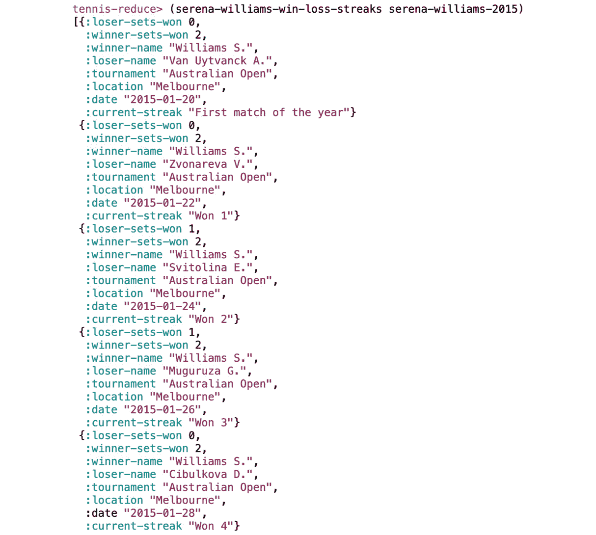

# 5. 多对一：减少

概述

在本章中，你将学习处理序列数据的新技术。你将学习如何使用`reduce`函数，以及其他提供更多灵活性的减少技术，以便从序列中转换或提取数据。我们将使用`reduce`的简单形式，使用带有初始化器和累加器的`reduce`，并解决需要序列可变长度“窗口”的问题。我们还将使用除`reduce`以外的函数来减少序列。

到本章结束时，你将能够使用具有复杂累加器的`reduce`。

# 简介

本章是关于使用 Clojure 的`reduce`函数，以及一般意义上的*减少*。通过这一点，我们是指从一个序列开始，将其*简化*为一个单一的事物。（“减少”也是一个烹饪术语，毕竟。）`map`和`filter`是关于将你拥有的序列转换为你想要的序列：*输入序列，输出序列*。但那并不总是我们想要的。即使是序列上的简单操作，如计算平均值、总和或最大值，也无法直接这样计算。这就是`reduce`以及更广泛的函数和模式发挥作用的地方：*输入序列，其他输出*。这是因为结果可能是一个数字、一个字符串、一个映射，甚至另一个序列。

在上一章中，我们看到了`map`和`filter`之类的函数一次只查看一个元素：我们应该如何转换这个项目？我们应该丢弃这个项目，还是保留它？这是一种强大的方法，因为它为我们的函数操作创建了一个清晰的范围，这有助于我们编写更简单的代码，并允许惰性求值。然而，当我们需要将序列作为一个整体查看，或者至少是查看比当前项目更多的内容时，这种方法是有局限性的。这就是为什么`map`和`filter`只是`for`循环的部分替代品。

在 Clojure 中，`reduce`函数并不是从整个序列生成结果的唯一方法。即使是简单的`count`函数，也是将序列减少到单个值的一种方式。一些核心函数实际上会使用`reduce`，这样我们就不必自己做了。我们将在下一章讨论的递归和循环技术也可以做到这一点。这里将要探讨的模式，在一般情况下，应该是你在决定`map`和`filter`不足以解决问题后首先考虑的。`reduce`和其他类似函数提供了一种清晰解决问题的方法，这也是为什么它们是你心智中的 Clojure 工具箱的重要组成部分。

## `reduce`的基本原理

要理解`reduce`是如何工作的，最好的起点是一个简单的例子。让我们尝试计算一个整数列表的总和。在像 JavaScript 这样的命令式语言中，我们可能会这样做：

```java
var integers = [8, 4000, 10, 300];
var sum = 0;
for (var i = 0; i < integers.length; i++) {
    sum = sum + integers[i];
}
console.log(sum);
```

这里的 `sum` 变量累积了循环前几次迭代中找到的信息。这正是 `reduce` 所做的。以下是一个 Clojure 版本的相同内容：

```java
user> (reduce (fn [sum-so-far item] (+ sum-so-far item)) [8 4000 10 300])
4318
```

注意

在第一次迭代中，`sum-so-far` 指的是 `0`，而 `item` 指的是 `8`。在后续的迭代中，`sum-so-far` 指的是使用集合中前一个元素评估函数的结果，而 `item` 指的是集合的当前元素。

这是如何工作的？这个表达式看起来很像前一章中 `map` 或 `filter` 的一些用法。s-表达式的布局现在应该非常熟悉了：

+   一个函数

+   一个匿名函数

+   一个整数向量

然而，你可能已经能看出这个表达式与使用 `map` 或 `filter` 的表达式相当不同。首先，只有一个序列被提供，但匿名函数接受两个参数，`sum-so-far` 和 `item`。当然，最大的惊喜是结果，它根本不是一个序列，而是一个单一的整数。这不再是 `map` 的领域了。

显然，这个表达式只是将序列中提供的整数相加。为了做到这一点，它遍历序列中的整数，看起来就像 `map` 会做的那样。关键的区别在于，使用 `reduce` 时，函数会“记住”评估前一次计算的结果。

让我们分析这里的操作。

第一次 `reduce` 调用我们提供的函数 `(fn [sum-so-far item] (+ sum-so-far item))` 时，参数是列表中的前两个元素：

![图 5.1：`sum-so-far` 和 `item` 是列表中的前两个元素（调用 1）

图 5.1：`sum-so-far` 和 `item` 是列表中的前两个元素（调用 1）

对于接下来的每次调用，`sum-so-far` 是前一次计算的结果，而 `item` 是列表中的下一个整数：


图 5.2：调用 2 和 3：每个调用都基于前一个调用的结果

我们可以通过用 Clojure 的 `+` 函数替换匿名函数来简化这个表达式：

```java
user> (reduce + [8 4000 10 300])
4318
```

我们甚至可以使用 `apply` 并完全避免使用 `reduce`：

```java
user> (apply + [8 4000 10 300])
4318
```

然而，使用 `(apply + …)`，我们并没有真正摆脱 `reduce`：内部，当 `+` 函数被调用时，如果参数超过两个，它将使用 `reduce` 的一个版本来遍历列表。

## 练习 5.01：寻找最高温度的日期

Clojure 的 `max` 函数在处理数字列表时很有用，但当你想比较的数字是更复杂的数据结构的一部分时，你该怎么办？假设我们有以下天气数据：

```java
(def weather-days
  [{:max 31
    :min 27
    :description :sunny
    :date "2019-09-24"}
   {:max 28
    :min 25
    :description :cloudy
    :date "2019-09-25"}
   {:max 22
    :min 18
    :description :rainy
    :date "2019-09-26"}
   {:max 23
    :min 16
    :description :stormy
    :date "2019-09-27"}
   {:max 35
    :min 19
    :description :sunny
    :date "2019-09-28"}])
```

我们需要能够编写返回最高温度日期的整个映射、最低温度等函数：

1.  启动一个 REPL 并将书 GitHub 存储库中的 `weather-days` 变量复制并粘贴到你的 REPL 中。你可以在以下位置找到文件：[`packt.live/2SXw372`](https://packt.live/2SXw372)。

1.  使用`map`和`max`找到最高温度：

    ```java
    user> (apply max (map :max weather-days))
    35
    ```

    这可能很有用，但它没有告诉我们哪一天有这个温度，或者那天是晴天还是多云，或者那天的最低温度是多少。

1.  使用`reduce`找到最高的`:max`温度：

    ```java
    user> (reduce (fn [max-day-so-far this-day]
                         (if (> (:max this-day) (:max max-day-so-far))
                           this-day
                           max-day-so-far))
                   weather-days)
    {:max 35, :min 19, :description :sunny, :date "2019-09-28"}
    ```

    如果某天的最高温度高于`max-day-so-far`，那么那一天就会取代`max-day-so-far`，直到有更高温度的一天将其推翻。

1.  找到具有最低最高温度的那一天：

    ```java
    user> (reduce (fn [min-max-day-so-far this-day]
                    (if (< (:max this-day) (:max min-max-day-so-far))
                      this-day
                      min-max-day-so-far))
                   weather-days)
    {:max 22, :min 18, :description :rainy, :date "2019-09-26"}
    ```

返回具有最大值的*项*，而不是返回最大值本身，当与复杂的数据结构一起工作时可能很有用。你可能永远不会遇到这个确切的问题。重要的是能够快速编写一个专门版本的`max`、`min`、比较器或任何其他适应你特定数据需要的函数。由于它的强大和灵活性，了解如何使用`reduce`在这些情况下可能非常有用。这也并非巧合，许多核心 Clojure 函数在内部也使用`reduce`。例如，`take-while`、`set`、`into`和`map`都是如此。

# 初始化 reduce

添加整数或查找最大值等任务有一个共同点：输入值和累积值是同一类型。当两个数字相加时，结果是数字；当在两个数字之间选择最大值或最小值时，结果仍然是数字。当我们使用`reduce`将数字相加时，累积总和就像所有其他输入一样是数字。在迄今为止的例子中，`reduce`第一次调用的函数取序列中的前两个项目。我们可以将`reduce`调用分解为其连续的函数调用：

```java
(reduce + [1 2 3 5 7])
(+ 1 2)
(+ 3 3)
(+ 6 5)
(+ 11 7)
```

实际上我们不需要在之前的例子中使用的匿名函数，因为`+`接受数字作为参数，并返回一个数字：


图 5.3：参数和返回值都是同一类型

在迄今为止的每个例子中，三件事都是同一类型的：

+   序列中的值

+   `+`的两个参数

+   `+`的返回值

在之前的练习中，我们返回了一个映射而不是单个数字。这是可能的，因为这三个地方都使用了相同类型的映射：我们迭代的映射以及我们正在比较的当前“最佳”映射。

然而，如果`reduce`只能做到这些，那么它的限制会相当大。并不是所有问题都可以用这种函数表达。通常，我们想要计算和累积其他类型的值。我们可能需要更复杂的汇总统计，或者以特定方式合并单个值，或者根据特殊标准将序列分成段。仅仅因为你有`matches`序列，以我们的网球例子来说，并不意味着你想要的结果也可以用网球`match`表达。也许我们想要遍历一个`matches`列表并累积其他类型的信息。实际上，在本书的结尾，我们将做这件事。在本章的开头，我们说`reduce`可以将序列转换为*任何其他东西*，但到目前为止，这并不完全正确。

这就是为什么存在第二种形式的`reduce`，它接受一个额外的参数。当存在额外参数时，它成为归约函数的第一个参数。在初始函数调用中，序列中的第一个元素是第二个参数。这是一个关键改进，因为归约函数的返回值不再必须是序列中相同类型的对象。

考虑以下代码片段，其中我们为归约提供一个空的映射作为初始值。随着它通过序列，当发现新值时，归约函数会更新`:maximum`和`:minimum`字段。表达式最终返回一个函数：

```java
user> (reduce (fn [{:keys [minimum maximum]} new-number]
          {:minimum (if (and minimum (> new-number minimum))
                      minimum
                      new-number)
           :maximum (if (and maximum (< new-number maximum))
                      maximum
                      new-number)})
        {}          ;; <---- The new argument!
        [5 23 5004 845 22])
{:minimum 5, :maximum 5004}
```

前面的表达式在一个序列中找到最小值和最大值。以这种方式调用`reduce`可能很有用，如果由于某种原因，很难对列表进行两次循环，如果列表非常非常长，或者可能有一个没有被保留的流。为了返回两个值，我们将它们放在一个映射中。如果没有`reduce`的初始化参数，这已经是不可能的了。这是一个“输入数字，输出数字”不足以应对的情况。

在这里，我们提供一个空的映射作为我们归约的初始值。随着它通过序列，当发现新值时，归约函数会更新`:maximum`和`:minimum`字段。表达式最终返回一个函数。

注意

在这种情况下，另一种常见的模式是返回一个包含两个元素的向量（一个元组），而不是映射：`[minimum maximum]`。

在归约函数的每次调用中，第一个参数始终是一个映射，第二个参数始终是序列中的一个整数。

这种差异使得`reduce`更加有用。现在，我们可以从序列中的每个元素中提取我们喜欢的数据，并将其作为后续迭代的上下文插入和传递。大多数时候，我们可以将这个上下文视为一个`acc`。稍后，当我们查看 Clojure 的其他循环结构时，显式上下文的概念将再次出现。

## 使用`reduce`进行分区

将序列分割成更小的序列是一个常见问题，有多种解决方法。当简单的解决方案不够用时，`reduce`可以是一个有用的替代方案。

首先，让我们看看其他一些可能性。如果需要固定长度的子序列，那么有`partition`或`partition-all`：

```java
user> (partition 3 [1 2 3 4 5 6 7 8 9 10])
((1 2 3) (4 5 6) (7 8 9))
user> (partition-all 3 [1 2 3 4 5 6 7 8 9 10])
((1 2 3) (4 5 6) (7 8 9) (10))
```

这两个函数的区别在于，`partition`在填满最后一个组时停止，而`partition-all`即使这意味着最终的子序列不会包含相同数量的项目也会继续。

此外，还有`partition-by`，它提供了更多的灵活性。除了要拆分的序列外，`partition-by`还接受一个将在每个项目上调用的函数。`partition-by`将在返回值改变时开始一个新的子序列。

在这里，我们根据整数是大于还是小于 10 来将序列分割成子序列：

```java
user> (partition-by #(> % 10) [5 33 18 0 23 2 9 4 3 99])
((5) (33 18) (0) (23) (2 9 4 3) (99))
```

由于`partition-by`允许你编写自己的分区函数，因此当创造性地使用时，这可以是一个相当有用的函数。

然而，就像`map`和`filter`本身一样，这些函数都不能一次查看超过一个项目。例如，如果我们想将整数序列分割成总和小于 20 的序列，该怎么办？为了解决这类问题，我们需要能够一次考虑多个项目。

当使用`reduce`进行此操作时，关键是使用映射作为初始化器和累加器，至少有两个不同的字段：一个用于累积的序列，一个用于当前序列。累加器可能如下所示，在减少过程中间，如果我们试图创建总和小于 20 的序列：

```java
{:current [5 10]
 :segments [[3 7 8]
            [17]
            [4 1 1 5 3 2]]}
```

`segments`中的向量是完整的：如果再添加一个项目，它们的总和将超过 20。当前的`:current`向量目前的总和是 15。如果主序列中的下一个项目是 4 或更多，我们就无法将它添加到这个向量中，并将`[5 10]`移动到`segments`中。

这就是它在实际中的工作方式：

```java
user> (reduce (fn [{:keys [segments current] :as accum} n]
                (let [current-with-n (conj current n)
                      total-with-n (apply + current-with-n)]
                  (if (> total-with-n 20)
                    (assoc accum 
                           :segments (conj segments current)
                           :current [n])
                    (assoc accum :current current-with-n))))
              {:segments [] :current []}
              [4 19 4 9 5 12 5 3 4 1 1 9 5 18])
{:segments [[4] [19] [4 9 5] [12 5 3] [4 1 1 9 5]], :current [18]}
```

让我们仔细看看。为了方便起见，我们首先从累加器中提取段和当前绑定。然后，我们设置几个有用的绑定：`current-with-n`是当前序列加上当前项目`n`。在这个时候，我们还不知道这是一个有效的序列。它的总和可能会超过 20 的限制。为了检查这一点，我们分配另一个绑定（为了清晰起见），`total-with-n`，并将其与 20 进行比较。

如果`current-with-n`的总和超过 20，这意味着`current`是一个有效的子序列。在这种情况下，我们将其（不带`n`）添加到我们累积的段列表中，并将`n`作为新`:current`向量的第一个项目。另一方面，如果`current-with-n`的总和还没有达到 20，我们只需将`n`追加到`current`中并继续进行。

你会注意到最终的结果并不完全符合我们的预期：最后一个元素`[18]`仍然卡在`:current`中。为了呈现一个干净的结果，我们可能需要将我们的`reduce`调用包裹在一个函数中，该函数将处理这个最后的清理工作：

```java
user> (defn segment-by-sum [limit ns]
        (let [result (reduce (fn [{:keys [segments current] :as accum} n]
                               (let [current-with-n (conj current n)
                                     total-with-n (apply + current-with-n)]
                                 (if (> total-with-n limit)
                                   (assoc accum 
                                          :segments (conj segments current)
                                          :current [n])
                                   (assoc accum :current current-with-n))))
                             {:segments [] :current []}
                             ns)]
          (conj (:segments result) (:current result))))
#'user/segment-by-sum
```

在这里，我们通过添加一个`limit`参数使我们的函数更加灵活，这样我们就可以选择除了 20 以外的其他值。我们还为`reduce`调用的结果创建了一个绑定，然后在函数的最后几行中使用它来将`:current`的最终值追加到累积段中。现在我们得到了我们想要的结果：

```java
user> (segment-by-sum 20 [4 19 4 9 5 12 5 3 4 1 1 9 5 18])
[[4] [19] [4 9 5] [12 5 3] [4 1 1 9 5] [18]]
```

这种常见的模式将允许你使用`reduce`做很多有趣的事情。在接下来的两个练习中，我们将使用它的变体来解决两种相当不同的问题。

## 回顾使用 reduce

正如我们在上一章中看到的，Clojure 的`map`函数非常有用且灵活。理解`map`的关键在于输入序列中的每个元素与输出序列中的每个元素之间的一对一*映射*（又是这个词！）的想法。有时，这并不是我们需要的。我们在*第四章*中使用的窗口模式是解决这个问题的一种方法，但它也有自己的局限性。通常，我们不知道窗口需要有多“宽”。它可能取决于数据本身，并且在我们通过输入序列移动时变化。

我们可以用`reduce`和一个保留一定数量项的累加器轻松解决这个问题。为了从一个简单的例子开始，让我们假设我们有一个整数列表：

```java
(def numbers [4 9 2 3 7 9 5 2 6 1 4 6 2 3 3 6 1])
```

对于列表中的每个整数，我们希望返回一个包含两个元素的元组：

+   整数本身

+   如果整数是奇数，则它之前连续奇数的和；如果是偶数，则它之前连续偶数的和

按照这个逻辑，列表中的第一个`9`应该被替换为`[9 0]`，因为它之前是一个偶数。另一方面，第二个`9`应该被替换为`[9 10]`，因为它之前是`3`和`7`。

这里有一个使用`reduce`解决这个问题的函数：

```java
(defn parity-totals [ns]
  (:ret 
   (reduce (fn [{:keys [current] :as acc} n]
             (if (and (seq current)
                      (or (and (odd? (last current)) (odd? n))
                          (and (even? (last current)) (even? n))))
               (-> acc
                   (update :ret conj [n (apply + current)])
                   (update :current conj n))
               (-> acc
                   (update :ret conj [n 0])
                   (assoc :current [n]))))
           {:current [] :ret []}
           ns)))
```

让我们仔细看看，从累加器开始，这是一个包含两个键的映射，这两个键引用空向量：`:current`，用于当前具有相同奇偶性的整数序列；`:ret`，用于将要返回的值列表。（整个`reduce`表达式被一个`(:ret…)`表达式包裹，以提取这个值。）

减少函数开始时进行一些解构，以便我们能够轻松访问`:current`；现在，`n`当然是我们列表中的当前整数。在函数内部，结构相当简单。`if`表达式有一组相当复杂的嵌套逻辑运算符。首先，我们使用`(seq current)`来检查`current`是否为空，这在第一次迭代时是这种情况。如果向量或列表为空，`seq`函数返回`false`。然后，由于我们知道`(last current)`将返回一个整数，我们可以测试`n`和列表中的前一个值是否都是奇数或都是偶数。

注意

由于我们在这里使用向量，`conj`将新项目追加到向量的末尾。要获取最新项目，我们使用`last`。如果我们使用列表而不是向量，`conj`将追加到列表的前面，并且我们必须使用`first`来获取最新项目。当使用`conj`时，重要的是要确保底层数据结构是您所认为的那样。否则，您的结果可能会很容易出错。

根据我们最终进入的`if`语句的哪个分支，我们更新`acc`的方式不同。在第一种情况下，当前整数与`current`的内容具有相同的奇偶性。我们通过两次调用`update`将`acc`传递下去。如您在*第二章*，*数据类型和不可变性*中记得的，`update`将其第二个参数（函数）作为其第二个参数，在这种情况下是`conj`，因为我们是在向向量中添加，它将应用于作为第一个值提供的键关联的值。我们添加一个额外的参数，`[n (apply + current)]`。这将作为`conj`的第二个参数。总的来说，这就像我们这样调用`conj`：`(conj (:ret acc) [n (apply + current)])`。第二次调用`update`将`n`添加到我们的整数运行列表中。

在另一种情况下，当我们处于列表的起始位置或由于奇数变为偶数或偶数变为奇数而发生变化时，我们知道当前总和为零。在这种情况下，我们可以使用`assoc`而不是`update`，因为我们正在从头开始使用一个全新的列表。

在我们的整数序列上运行该函数，我们得到以下结果：


图 5.4：原始输入后面跟着相同奇偶性的前一个连续整数的和

使用`map`是不可能的，因为与我们所使用的窗口技术不同，累加器中的`:current`向量可以包含所需数量的项目，这取决于输入。这也显示了使用累加器时`reduce`的灵活性。现在，我们可以练习在真实问题上使用它。

## 练习 5.02：在斜坡上测量高程差异

一个山地地区的自行车赛的组织者希望改善他们在路边放置的标志。目前，每个标志只是指示从比赛开始处的距离。比赛组织者希望添加两个额外的数字：

+   到达当前斜坡顶部或底部的距离，这取决于比赛场地的这部分是上升还是下降海拔

+   到达当前斜坡末尾之前剩余的海拔上升或下降

这里有一个例子：


图 5.5：赛马场标志，指示到达当前小山顶部的剩余距离和海拔

你拥有的数据是一个元组的列表：第一个值是比赛起点的距离，第二个值是该点的海拔。你可以从[`packt.live/38IcEvx`](https://packt.live/38IcEvx)复制数据：

```java
(def distance-elevation [[0 400] [12.5 457] [19 622] [21.5 592] [29 615] …)
```

我们将使用`reduce`和“回顾”模式来解决此问题。然而，我们首先需要解决一个困难。如果我们正在“回顾”，我们如何知道我们离下一个山峰或下一个山谷有多远？简单：我们将赛马场数据反转，这样当我们回顾时，我们实际上是在向前看！

在以下图中，当我们下坡时，我们可以“看到”前方，并将我们的当前位置与山峰进行比较：


图 5.6：下坡道

通过反转方向，我们遍历数据；当我们“回顾”时，我们在地理上是向前看的。

现在我们可以开始编写一些代码：

1.  在一个空目录中启动一个新的 REPL，并打开一个新文件，`bike_race.clj`。添加相应的命名空间声明：

    ```java
    (ns bike-race)
    ```

    注意

    Clojure 命名空间在单词之间使用连字符（有时称为“kebab case”），但由于 Clojure 的 Java 起源，相应的文件名使用下划线（或“snake case”）。这就是为什么`bike-race`命名空间在一个名为`bike_race.clj`的文件中。在*第八章*，*命名空间、库和 Leiningen*中，你将了解更多关于命名空间的信息。

1.  从书籍的 GitHub 仓库[`packt.live/38IcEvx`](https://packt.live/38IcEvx)复制`distance-elevation`变量。

1.  为此函数设置骨架：

    ```java
    (defn distances-elevation-to-next-peak-or-valley
      [data]
      (->
        (reduce
          (fn [{:keys [current] :as acc} [distance elevation :as this-position]]
            )
          {:current []
           :calculated []}
          (reverse data))
        :calculated
        reverse))
    ```

    与上面描述的基本“回顾”模式相比，只有几个显著的不同。首先，有更多的解构，以便轻松访问元组内的`distance`和`elevation`值。其次，整个`reduce`调用都被`->`线程宏包裹。这当然等同于`(reverse (:calculated (reduce…)))`，但优点是按照数据通过函数的方式组织代码。这是一个相当常见的累加器习语，当最终只返回一个字段时。

    否则，一般方法相同：`:current`字段将包含到达上一个（但在地理上下一个）山峰或山谷的所有路径点。`:calculated`字段将存储计算值，以便在最后返回。

1.  我们需要知道新的位置是否与存储在`current`中的位置处于同一斜坡上。我们还在上升，还是在下降，或者我们已经越过了山顶，或者穿过了山谷的最低点？为了简化我们的代码，我们将编写一个辅助函数，该函数接受`current`和新的海拔。这将返回`true`或`false`：

    ```java
    (defn same-slope-as-current? [current elevation]
      (or (= 1 (count current))
          (let [[[_ next-to-last] [_ the-last]] (take-last 2 current)]
            (or (>= next-to-last the-last elevation)
                (<= next-to-last the-last elevation)))))
    ```

    首先，我们检查`current`中是否只有一个值。如果是这样，我们就知道我们的问题的答案，因为只有两个点，我们知道我们处于同一斜坡上。这也保护了我们的下一个测试免受错误的影响，因为我们现在可以确信`current`中至少有两个项目。（我们仍然必须小心不要用空列表调用这个函数。）

    既然我们知道我们至少有两个项目，我们就可以进行一些解构。这种解构是双层嵌套的：首先，我们使用`take-last`函数取出`current`中的最后两个元素，然后我们提取并命名这些元组的第二部分。为了解构元组，我们使用下划线`_`作为占位符，表示我们对该第一个值不感兴趣。这里使用下划线的做法仅仅是 Clojure 的惯例，其含义基本上是“不要关注这个值。”

    注意

    我们将绑定命名为`the-last`而不是简单地命名为`last`。这是因为 Clojure 的`last`函数。由于我们在这个作用域中不使用`last`，我们可以没有问题地将绑定命名为`last`。然而，避免使用与标准 Clojure 函数重名的名称是一个好习惯。危险在于你的局部绑定可能会“遮蔽”一个核心 Clojure 函数，从而导致令人困惑的错误。

    现在我们有三个值，我们想知道它们是否都是递增的或者都是递减的。这实际上与 Clojure 的比较函数相当简单，这些函数可以接受超过两个参数。`(>= next-to-last the-last elevation)`如果`next-to-last`大于或等于`the-last`，并且如果`the-last`大于或等于`elevation`，则返回`true`。

1.  在 REPL 中，按照以下方式移动到`bike-race`命名空间：

    ```java
    (in-ns 'bike-race)
    ```

1.  测试`same-slope-as-current?`函数：

    图 5.7：测试程序

    它似乎按预期工作，包括当`current`中只有一个值时。

1.  函数的其余部分将围绕一个有三个分支的`cond`表达式来构建，以处理三种可能的情况：`current`为空的初始情况；当我们处于与`current`中相同的斜坡上时的持续情况；以及当我们越过一个山顶或山谷并需要重置`current`的斜坡变化情况。

    这里是减少函数：

    ```java
    bike_race.clj
    42 (fn [{:keys [current] :as acc} [distance elevation :as this-position]]
    43    (cond (empty? current)
    44          {:current [this-position]
    45           :calculated [{:race-position distance
    46                         :elevation elevation
    47                         :distance-to-next 0
    48                         :elevation-to-next 0}]}
    49          (same-slope-as-current? current elevation)
    50          (-> acc
    51              (update :current conj this-position)
    52              (update :calculated
    53                      conj
    54                      {:race-position distance
    55                       :elevation elevation
    56                       :distance-to-next (- (first (first current)) distance)
    57                       :elevation-to-next (- (second (first current)) elevation)}))
    The complete code for this step can be found at https://packt.live/2sTxk4m
    ```

    在我们上面提到的“持续情况”中，当我们处于一个延长`current`中斜率的位置时，我们只需从`current`中的第一个项目减去当前的高度和距离。而“斜率变化”的情况稍微复杂一些，因为我们必须重置`current`，并注意包括最新的“峰值或谷值”。一个图可能使这一点更清晰：

    ![图 5.8：新的当前值从上一个峰值开始]

    ![图片 B14502_05_08.jpg]

    ```java
    (assoc :current [peak-or-valley this-position])
    ```

    由于我们在`:current`中重新开始使用新的值，而不是`update`，所以我们使用`assoc`，它完全替换了旧值。

1.  使用以下命令测试函数：

    ```java
    (distances-elevation-tp-next-peak-or-valley distance-elevation)
    ```

    输出如下：

    ![图 5.9：结果的部分视图]

    ![图片 B14502_05_09.jpg]

图 5.9：结果的部分视图

在这个问题中，数据最重要的部分是项目之间的关系。这类问题需要一种方法，使我们能够一次“看到”多个项目。与我们在上一章中使用 map 的窗口技术不同，在这个问题中，我们事先不知道需要查看多远。这正是`reduce`能够大放异彩的地方，因为它允许我们根据问题的需求来调整累加器的形状。

## 练习 5.03：胜负连串

在这个练习中，我们将从一个向量开始，这个向量包含了塞雷娜·威廉姆斯在 2015 年所参加的所有比赛。每一场比赛都由一个映射表示：

```java
{:loser-sets-won 0,
 :winner-sets-won 2,
 :winner-name "Williams S.",
 :loser-name "Williams V.",
 :tournament "Wimbledon",
 :location "London",
 :date "2015-07-06"}
```

注意

你不需要这些数据来完成这个练习，但如果你想要玩一下这些数据，它在这里可用：[`packt.live/37HKOyC`](https://packt.live/37HKOyC)。

目标是为每一场比赛添加一个`:current_streak`字段，如果威廉姆斯表现不佳并且连续输了三场比赛，它会显示“Lost 3”，或者如果她赢了五场，它会显示“Won 5”：

1.  在一个方便的目录中，打开一个 REPL 和一个名为`tennis_reduce.clj`的文件，其中包含相应的命名空间定义：

    ```java
    (ns tennis-reduce)
    ```

    在 Clojure 中，当一个命名空间包含多个单词时，这些单词由连字符连接。然而，相应的文件必须使用下划线。

    注意

    我们将使用这个文件和命名空间来完成本章剩余的与网球相关的练习。

1.  从课程的 GitHub 仓库中，在[`packt.live/2sPo4hv`](https://packt.live/2sPo4hv)，将`serena-williams-2015`变量复制到你的文件中。

1.  基于对`reduce`的调用设置函数的骨架，并提供一个初始化映射：

    ```java
    (defn serena-williams-win-loss-streaks [matches]
      (reduce (fn [acc match]
                ;; TODO: solve problem
                )
              {:matches []
               :current-wins 0
               :current-losses 0}
              matches))
    ```

    我们在这里提供的映射作为初始值显示了我们需要为每次迭代的数据形式。当前胜利和当前失败的计数器是自解释的：我们只需根据每场连续比赛发生的情况更新这些值。`:matches` 可能一开始看起来很奇怪。它存在是因为我们希望返回整个匹配序列，并带有新的 `:current-streak` 字段。由于 Clojure 的不可变性，我们不能像通常那样“就地”修改匹配项。当我们遍历 `matches` 列表中的项时，我们为每个匹配项添加一些数据，然后将其放置在累加器中的 `:matches` 向量中。

1.  从对 `reduce` 的调用中提取匹配项：

    ```java
    (defn serena-williams-win-loss-streaks [matches]
      (:matches
        (reduce (fn [acc match]
                  ;; TODO: solve problem
                  )
                {:matches []
                 :current-wins 0
                 :current-losses 0}
                matches)))
    ```

    `:current-wins` 和 `:current-losses` 字段在函数外部没有用，所以我们只想返回新装饰的匹配项。

1.  编写一个辅助函数，用于格式化字符串以展示当前连胜：

    ```java
    (defn streak-string [current-wins current-losses]
      (cond (pos? current-wins) (str "Won " current-wins)
            (pos? current-losses) (str "Lost " current-losses)
            :otherwise "First match of the year"))
    ```

    有三种可能的情况：连胜（至少一场胜利，零场失败）、连败（至少一场失败，零场胜利）或尚未进行任何比赛（零场胜利，零场失败）。现在是使用 `cond` 的好时机，它允许我们拥有多个条件而不需要嵌套的 `if` 语句。最终通配条件测试可以是任何东西，除了 `false` 或 `nil`。我们使用 `:otherwise` 关键字因为它易于阅读。最后，`pos?` 是一个方便且常用的谓词，用于确定一个数字是否大于零，而不是编写 `(> current-wins 0)`。

    这种逻辑原本可以是主减少函数的一部分。将其拆分为一个独立的、非常简单的函数可以使代码更容易阅读。

1.  为减少函数编写一个骨架。像往常一样，它接受两个参数：累加器 `acc` 和当前匹配项。我们在这里所做的只是进行一些解构，以便在函数内部轻松访问此上下文。我们还保留了原始映射 `acc` 和 `match` 的引用，因为我们的函数最终将返回它们的修改版本：

    ```java
    (fn [{:keys [current-wins current-losses] :as acc} 
         {:keys [winner-name] :as match}]
      ;; TODO: do something
      )
    ```

1.  为当前匹配项引入一个 `let` 绑定并将其插入累加器中的 `:matches` 向量：

    ```java
    (fn [{:keys [current-wins current-losses] :as acc} 
         {:keys [winner-name] :as match}]
                 (let [this-match (assoc match :current-streak (streak-string current-wins current-losses))]
                   (update acc :matches #(conj % this-match))))
    ```

    尽管我们的函数还没有完成，但这是最重要的数据流部分。`match` 参数被 `streak-string` 辅助函数格式化的当前连胜信息“装饰”，然后插入到函数最终将返回的 `:matches` 向量中。我们还没有上下文信息，所以这是下一步。

1.  最后一步是生成上下文信息：我们需要更新累加器中的 `:current-wins` 和 `:current-losses`，以便我们为下一次迭代做好准备。这里的逻辑是，如果威廉姆斯赢得了当前比赛，那么我们需要将当前连胜数加 1 并将输球数重置为零。这些将用于计算下一场比赛的胜利和失败连败。相反，如果威廉姆斯输掉了上一场比赛，我们将当前胜利连败数设为零，并将输球连败数加 1。

    为了将这个逻辑转换为代码，我们首先添加另一个 `let` 绑定，`serena-victory?`，稍后我们将引用它：

    ```java
    serena-victory? (= winner-name "Williams S.")
    ```

    现在剩下的只是更新 `acc` 中的 `:current-wins` 和 `:current-losses`。我们将使用 `->` 连接宏，因为需要对累加器做一些事情：

    ```java
     (-> acc
         (update :matches #(conj % this-match))
         (assoc :current-wins (if serena-victory?
                                (inc current-wins)
                                0))
         (assoc :current-losses (if serena-victory?
                                  0
                                  (inc current-losses))))
    ```

    `assoc` 的调用只是应用了上面讨论的条件逻辑，增加计数器或将它们重置为零。以下是当我们把所有部分放在一起时的完整函数：

    ```java
    (defn serena-williams-win-loss-streaks [matches]
      (:matches
       (reduce (fn [{:keys [current-wins current-losses] :as acc} match]
                 (let [this-match (assoc match :current-streak (streak-string current-wins current-losses))
                       serena-victory? (= (:winner-name match) "Williams S.")]
                   (-> acc
                       (update :matches #(conj % this-match))
                       (assoc :current-wins (if serena-victory?
                                              (inc current-wins)
                                              0))
                       (assoc :current-losses (if serena-victory?
                                                0
                                                (inc current-losses))))))
               {:matches []
                :current-wins 0
                :current-losses 0}
               matches)))
    ```

    在数据上尝试这个函数。你应该会看到类似这样的结果：



图 5.10：在数据上使用函数

这个例子展示了使用 `reduce` 的几个有趣之处。首先，我们可以自由地创建任何类型的上下文，并将其传递给减少函数的每一次迭代。为了使事情简单起见，我们只是计算了胜利或失败的数量，但上下文可以像你需要的那样复杂。

第二点是指最终返回值也可以是我们需要的任何值。在这个例子中的函数实际上看起来像是你可以用 `map` 做的事情：它接受一个序列并返回一个长度相同的序列。然而，通过从之前对减少函数的调用中构建数据，它做了 `map` 无法做到的事情。

# 不使用 reduce 的减少

在我们继续之前，重要的是要指出，有时在将序列转换为非序列时，除了 `reduce` 之外，还有其他更好选择。这通常是因为 Clojure 提供了为我们做艰苦工作的函数。有时，巧妙地使用 Clojure 的“序列到序列”函数可以让你得到所需的数据。

作为一条一般规则，在转向 `reduce` 之前，通常最好尽可能多地使用可以处理惰性序列的函数。在某些情况下，这可能是因为性能原因，在几乎所有情况下，如果你的代码可以保持在序列的领域，你的代码将更容易编写，更重要的是，*更容易阅读*。尽管如此，大多数解决方案都需要两者都有一点。知道如何结合两者是一项重要的技能。

## zipmap

Clojure 的 `zipmap` 函数是一个从两个序列构建映射的工具。第一个序列成为新映射的键，第二个序列成为值。这通常用于构建查找表。当需要根据内容而不是列表中的位置重复访问序列中的数据时，查找表会非常方便。

可以想象一个这样的场景，这会很有用。也许在程序的一个步骤中，你有一个包含个人联系数据的映射列表。后来，你发现你经常需要电话号码并需要找到相应的用户。如果你有一个键为电话号码的查找表，你可以通过简单的 `(get users-by-phone "+44 011 1234 5678")` 找到用户。只要你有有意义且唯一的键，映射就可以提供方便的访问。

`zipmap` 的基本操作是对齐两个序列，一个用于键，一个用于值，`zipmap` 将它们“压缩”在一起：

```java
user> (zipmap [:a :b :c] [0 1 2])
{:a 0, :b 1, :c 2}
```

通常，你只有第二个列表，即值。你将从列表中推导出值并将它们用作键。只是要小心，键必须是唯一的，以避免冲突。

## 练习 5.04：使用 zipmap 创建查找表

映射是一种极其有用且灵活的方法，可以快速访问数据。然而，通常你拥有的数据是顺序的，你可能会发现你希望能够访问单个项目而不必遍历整个序列。如果你知道你将使用的查找所需项目的标准，从你的数据中构建查找表可以是一个有趣的解决方案。

在这个练习中，你有一些 Petra Kvitova 在 2014 年参加的匹配列表。假设你需要能够快速通过日期访问匹配项，可能需要将它们插入某种类型的日历或测试同一天有哪些选手在比赛。无论原因如何，你需要构建一个映射，其中键是日期，值是单个匹配项。因为同一个选手永远不会在同一天打两场比赛，我们可以确信日期键是唯一的。以下是构建查找表的方法：

1.  将以下变量从书的 GitHub 仓库复制到你的 REPL 中：[`packt.live/39Joc2H`](https://packt.live/39Joc2H)：

    ```java
    kvitova_matches.clj
    1  (def matches
    2    [{:winner-name "Kvitova P.",
    3      :loser-name "Ostapenko J.",
    4      :tournament "US Open",
    5      :location "New York",
    6      :date "2016-08-29"}
    7     {:winner-name "Kvitova P.",
    8      :loser-name "Buyukakcay C.",
    9      :tournament "US Open",
    10     :location "New York",
    11     :date "2016-08-31"}
    The complete code for this step can be found at https://packt.live/2Ggpsgs
    ```

1.  使用 `map` 创建一个包含每个匹配项日期的序列：

    ```java
    user> (map :date matches)
    ("2016-08-29"
     "2016-08-31"
     "2016-09-02"
     "2016-09-05"
     "2016-09-20"
     "2016-09-21")
    ```

1.  将两个序列合并成一个映射：

    ```java
    user> (def matches-by-date (zipmap (map :date matches) matches))
    #'user/matches-by-date
    ```

1.  使用映射通过日期查找匹配项：

    ```java
    user> (get matches-by-date "2016-09-20")
    {:winner-name "Kvitova P.",
     :loser-name "Brengle M.",
     :tournament "Toray Pan Pacific Open",
     :location "Tokyo",
     :date "2016-09-20"}
    ```

在一行代码中，你已经创建了一种快速找到给定日期匹配的方法。因为它非常简洁，这种模式可以很容易地集成到更复杂的函数中。

注意

建立这样的查找表在内存资源方面可能看起来是浪费的。我们不是在内存中加倍数据量吗？实际上，我们并没有。Clojure 的不可变数据结构有效地共享数据，这是在不冲突的情况下实现的，因为数据不能被修改。这意味着在这个例子中，原始序列和我们创建的查找表基本上是访问相同数据的方式。

## 映射到序列，再回到映射

我们在上一章中简要提到的一种最有用的技术是使用`into`从成对的项列表构建映射。这种模式非常灵活，值得仔细研究。

在其最简单形式中，这个模式看起来是这样的：

```java
user> (into {} [[:a 1] [:b 2]])
{:a 1, :b 2}
```

总的来说，映射实际上只是数据对，Clojure 知道如何在这两者之间进行转换。从映射中创建元组序列同样简单：

```java
user> (seq {:a 1 :b 2})
([:a 1] [:b 2])
```

当使用映射作为映射有意义时，请使用它，但不要犹豫，当使用它作为序列更容易时，就使用它。

当你需要“修改”一个映射（在 Clojure 中不是真正修改，而是创建一个新的映射，其中包含修改后的数据）时，你可能倾向于使用`keys`函数来遍历映射中的值：

```java
user> (def letters-and-numbers {:a 5 :b 18 :c 35})
#'user/letters-and-numbers
user> (reduce (fn [acc k]
                (assoc acc k (* 10 (get letters-and-numbers k))))
              {}
              (keys letters-and-numbers))
{:a 50, :b 180, :c 350}
```

在这里，我们使用`reduce`将每个值乘以 10。这可行，但它增加了问题的复杂性和心理负担，而这个问题可以更容易地解决：

```java
user> (into {} (map (fn [[k v]] [k (* v 10)]) letters-and-numbers))
{:a 50, :b 180, :c 350}
```

我们只是将映射`letters-and-numbers`解释为键值对的列表。在提供给`map`的函数中，我们使用了解构来将`k`和`v`分配给元组内的键和值，然后我们再次将其包装在两个元素的向量中。多亏了`into`，我们最终又得到了一个映射。

注意

为了方便，还有一个专门用于遍历映射中的键值对的`reduce`版本，称为`reduce-kv`。主要区别在于，使用`reduce-kv`时，你提供的减少函数接受三个参数，而不是两个：第一个与`reduce`相同，但下一个是映射中的键和相应的值。

## group-by

在 Clojure 中总结数据并不总是意味着直接调用`reduce`。该语言提供了构建在`reduce`之上的函数，有时这些函数更方便。`group-by`就是其中之一。

`group-by`函数接受一个序列，对每个项目调用一个函数，并使用函数调用返回的任何内容作为映射中的键。键的值将是返回相同键的所有项目的列表。

假设我们有一个映射列表，其中每个映射代表一道菜，有一个`:name`键用于菜名，还有一个`:course`字段告诉我们这道菜是在餐的哪个部分上提供的：

```java
(def dishes
  [{:name "Carrot Cake"
    :course :dessert}
   {:name "French Fries"
    :course :main}
   {:name "Celery"
    :course :appetizer}
   {:name "Salmon"
    :course :main}
   {:name "Rice"
    :course :main}
   {:name "Ice Cream"
    :course :dessert}])
```

使用`group-by`，我们可以按类别组织这个列表。我们对每个项目调用的函数只是`:course`关键字，以提取相应的值：

注意

对于我们的大部分示例，我们使用关键字作为映射键。这通常更易于阅读，并提供了使用关键字作为函数的便利性。然而，Clojure 允许我们使用任何值作为映射键。就像我们一直使用字符串作为网球运动员的名字一样，你也可以使用任何 Clojure 值作为映射键：整数、向量、映射，甚至是函数！

```java
user> (group-by :course dishes)
           {:dessert
             [{:name "Carrot Cake", :course :dessert}
               {:name "Ice Cream", :course :dessert}],
            :main
            [{:name "French Fries", :course :main}
              {:name "Salmon", :course :main}
              {:name "Rice", :course :main}],
            :appetizer
           [{:name "Celery", :course :appetizer}]}
```

通过*非常*少的编码，我们得到了一个组织良好的映射。`group-by`在底层使用`reduce`，实际上只是封装了一个相当简单的模式。我们可以像这样编写`group-by`的简化版本：

```java
user> (defn our-group-by [f xs]
        (reduce (fn [acc x]
                  (update acc (f x) (fn [sublist] (conj (or sublist []) x))))
                {}
                xs))
#'user/our-group-by
```

如果我们在菜肴列表上调用`our-group-by`，我们会得到相同的结果：

```java
user> (our-group-by :course dishes)
{:dessert
 [{:name "Carrot Cake", :course :dessert}
  {:name "Ice Cream", :course :dessert}],
 :main
 [{:name "French Fries", :course :main}
  {:name "Salmon", :course :main}
  {:name "Rice", :course :main}],
 :appetizer [{:name "Celery", :course :appetizer}]}
```

官方版本将具有更好的性能，但像`group-by`这样的函数真正的优势是它使我们从细节中解放出来。任何时候你有一个列表和一些类别，`group-by`都准备好帮助你。

## 练习 5.05：使用 group-by 进行快速汇总统计

在这个练习中，我们将使用`group-by`来快速统计我们网球比赛数据中不同锦标赛进行的比赛数量：

1.  在与*练习 5.03*，*赢和输的连败*相同的目录下创建一个`deps.edn`文件，内容如下：

    ```java
    {:deps
     {org.clojure/data.csv {:mvn/version "0.1.4"}
      semantic-csv {:mvn/version "0.2.1-alpha1"}}}
    ```

1.  将`tennis_reduce.clj`中的命名空间声明更改，使其引用这两个新库：

    ```java
    (ns packt-clj.tennis-reduce
      (:require
                [clojure.java.io :as io]
                [clojure.data.csv :as csv]
                [semantic-csv.core :as sc]))
    ```

1.  在与上一个练习相同的目录下启动一个 REPL，使用相同的`deps.edn`文件，然后打开并评估`tennis_reduce.clj`。

1.  在你的 REPL 中，移动到`packt-clj.tennis-reduce`命名空间，如下所示：

    ```java
    user> (in-ns 'packt-clj.tennis-reduce)
    ```

1.  确保你有一个`match_scores_1968-1990_unindexed_csv.csv`文件在相同的目录下。这是我们*第四章*，*映射和过滤*中使用的相同数据文件。你可以在这里找到它：[`packt.live/36k1o6X`](https://packt.live/36k1o6X)。

1.  设置现在熟悉的`with-open`宏，并给你的函数一个有表达力的名字：

    ```java
    (defn tennis-csv->tournament-match-counts [csv]
      (with-open [r (io/reader csv)]
        (->> (csv/read-csv r)
             sc/mappify
             ;;....
             )))
    ```

1.  编写一个调用`group-by`的代码，构建一个键为`:tourney_slug`实例，值为在该地进行的比赛列表的映射。为了使输出更易于管理，可以通过`select-keys`映射列表来临时移除比赛映射中的所有但少数键：

    ```java
    (defn tennis-csv->tournament-match-counts [csv]
      (with-open [r (io/reader csv)]
        (->> (csv/read-csv r)
             sc/mappify
             (map #(select-keys % [:tourney_slug :winner_name :loser_name]))
             (group-by :tourney_slug))))
    ```

1.  评估源文件，然后尝试调用此函数。定义一个变量，这样你的屏幕就不会充满网球比赛数据：

    ```java
    packt-clj.tennis-reduce> (def tournaments (tennis-csv->tournament-match-counts "match_scores_1991-2016_unindexed_bcsv.csv"))
    #'user/tournaments
    ```

1.  检查一些数据，首先使用`keys`函数，以查看所有锦标赛的名称：

    ```java
    packt-clj.tennis-reduce> (keys tournaments)
    ("chicago"
     "bologna"
     "munich"
     "marseille"
     "dubai"
     "milan"
     "buzios"
     "miami"
     "warsaw"
     "bucharest"
     "wimbledon"
     "umag"
     "besancon"
    ;; ....etc.
    )
    ```

1.  看一个单独的锦标赛。再次限制返回的数据，这次使用`take`：

    ```java
    packt-clj.tennis-reduce> (take 5 (get tournaments "chicago"))
    ({:tourney_slug "chicago",
      :winner_name "John McEnroe",
      :loser_name "Patrick McEnroe"}
     {:tourney_slug "chicago",
      :winner_name "John McEnroe",
      :loser_name "MaliVai Washington"}
     {:tourney_slug "chicago",
      :winner_name "Patrick McEnroe",
      :loser_name "Grant Connell"}
     {:tourney_slug "chicago",
      :winner_name "John McEnroe",
      :loser_name "Alexander Mronz"}
     {:tourney_slug "chicago",
      :winner_name "Patrick McEnroe",
      :loser_name "Richey Reneberg"})
    ```

1.  使用`count`来获取单个锦标赛进行的比赛数量：

    ```java
    packt-clj.tennis-reduce> (count (get tournaments "chicago"))
    31
    ```

1.  使用原始函数中的`count`计算每个锦标赛进行的总比赛数：

    ```java
    (defn tennis-csv->tournament-match-counts [csv]
      (with-open [r (io/reader csv)]
        (->> (csv/read-csv r)
             sc/mappify
             (group-by :tourney_slug)
             (map (fn [[k ms]] [k (count ms)]))
             (into {}))))
    ```

    注意到`select-keys`已经消失了。由于我们将比赛列表减少为一个单一整数，删除任何字段都没有意义。在这里，我们使用了一个你之前见过的模式：`map`的调用将 Clojure 映射视为键值对的序列。传递给`map`的函数然后返回一个包含关键字和新生成的总数的两项向量。最后，`into`将序列重新包装成一个映射。

1.  再次评估文件并再次调用`tennis-csv→tournament-match-counts`：

    ```java
    packt-clj.tennis-reduce> (def tournament-totals (tennis-csv->tournament-match-counts "match_scores_1991-2016_unindexed_csv.csv"))
    #'user/tournament-totals
    ```

1.  检查数据：

    ```java
    packt-clj.tennis-reduce> (get tournament-totals "chicago")
    31
    packt-clj.tennis-reduce> (get tournament-totals "wimbledon")
    4422
    packt-clj.tennis-reduce> (get tournament-totals "roland-garros")
    4422
    packt-clj.tennis-reduce> (get tournament-totals "australian-open")
    4422
    packt-clj.tennis-reduce> (get tournament-totals "us-open")
    4422
    ```

    在这里，我们可以看到大满贯赛事在同一时期内拥有相同数量的比赛，因为这些七轮赛事的结构是完全相同的。

在这个练习中，我们能够用几行简短的代码提取我们想要的数据。除了展示`group-by`的强大功能外，这也是映射和减少如何一起工作的一个好例子。我们使用`group-by`来结构我们的数据，然后使用`map`来进一步塑造它。如果我们想限制调查的范围为某些球员或某些赛事，例如，使用`filter`也很容易想象。

# 总结网球比分

在上一章中，我们能够使用`filter`从网球比分中生成一些总结数据。如果我们想知道特定球员赢得了多少场比赛，我们可以过滤掉该球员的胜利并调用`count`。虽然当我们的兴趣仅限于一个球员时这种方法效果很好，但如果我们需要更完整的数据，它就会变得繁琐。例如，如果我们需要知道数据集中每位球员参加或赢得的比赛数量，我们就必须为每个查询过滤所有比赛的整个历史。`map`和`filter`函数在许多情况下非常有用，但将大量集合减少为一个更紧凑的报告并不是它们最擅长的。

假设对于每位球员，我们需要知道他们所参加的比赛数量、赢得的比赛数量和输掉的比赛数量。我们将通过两种不同的方式在 Clojure 中解决这个问题，第一种是使用`reduce`，第二种是使用`group-by`，这是 Clojure 众多方便的基于`reduce`的功能之一。

在第一个练习中，我们将使用一种常见的减少模式，逐行从 CSV 文件构建我们的数据。当然，我们将使用带有映射作为累加器的三参数版本的`reduce`。

## 练习 5.06：使用 reduce 进行复杂累积

对于我们一直在使用的网球数据集中的每一行 CSV，我们需要完成的工作相当简单：计算胜利和失败的数量。在命令式语言中，最常见的方法是遍历结果，并对每一行执行类似以下操作：

```java
var matches = [{winner_slug: 'Player 1',
                loser_slug: 'Player 2'},
               {winner_slug: 'Player 2',
                loser_slug: 'Player 1'}];
var players = {}
for (var i = 0; i < matches.length; i++) {
  var winnerSlug = matches[i].winner_slug;
  var loserSlug = matches[i].loser_slug;
  if (!players[winnerSlug]) {
    players[winnerSlug] = {wins: 0, losses: 0};
  }
  players[winnerSlug].wins = players[winnerSlug].wins + 1;
  if (!players[loserSlug]){
    players[loserSlug] = {wins: 0, losses: 0};
  }
  players[loserSlug].losses = players[loserSlug].losses + 1;
}
console.log(players);
```

我们将在 Clojure 中做同样的事情，但这是在传递给`reduce`的函数的作用域内：

1.  打开 `tennis_reduce.clj`，启动你的 REPL，评估文件，然后移动到 `with-open` 模式中的 `packt-`Copy，并准备对 `reduce` 的调用框架。我们将把这个函数称为 `win-loss-by-player`：

    ```java
    (defn win-loss-by-player [csv]
      (with-open [r (io/reader csv)]
        (->> (csv/read-csv r)
             sc/mappify
             (reduce (fn [acc row]
                       )
                     {}                       ; an empty map as an accumulator
                     ))))
    ```

    这次我们不需要调用 `sc/cast-with`，因为我们只需要字符串值。而且我们也不需要调用 `doall`，因为 `reduce` 不是惰性的。

1.  编写传递给 `reduce` 的函数：

    ```java
    (fn [acc {:keys [winner_slug loser_slug]}]
      (-> acc
          (update-in [winner_slug :wins]
                     (fn [wins] (inc (or wins 0))))
          (update-in [loser_slug :losses]
                     (fn [losses] (inc (or losses 0))))))
    ```

    在这里，我们使用 `->` 来将累加器 `acc` 通过两次调用 `update-in`。这个函数，就像 `assoc-in` 一样，允许我们通过提供一个向量作为第二个参数来通过访问嵌套数据结构的内容。这个例子中的每个调用看起来会是这样：

    ```java
    (update-in acc ["roger-federer" :wins] (fn [wins] (inc (or wins 0))))
    ```

    通过在 `reduce` 遍历比赛列表时重复调用累加器，我们最终得到一个大型映射，将玩家 "slugs" 映射到包含 `:wins` 键和 `:losses` 键的小映射：

    ```java
    {
     ...
      "player" {:wins 10 :losses 5}
      "another-player" {:wins 132 :losses 28}
      ...
     }
    ```

1.  评估你的文件并尝试在 CSV 数据上运行该函数。将结果放入变量中，以避免在屏幕上填充所有数据：

    ```java
    packt-clj.tennis-reduce> (def w-l (win-loss-by-player "match_scores_1991-2016_unindexed_csv.csv"))
    #'user/w-l
    ```

1.  使用 "slug" 查找玩家：

    ```java
    packt-clj.tennis-reduce> (get w-l "roger-federer")
    {:losses 240, :wins 1050}
    ```

    注意

    我们在这里需要使用 `get`，因为我们的映射中的键是字符串。如果我们使用 `keyword` 函数在构建映射时转换玩家的 "slugs"，我们可以使用 `(:roger-federer w-l)` 来访问玩家的数据。

# Elo 介绍

在本章的其余部分以及接下来的几章中，我们将使用 Elo 评分系统来开发玩家评分并预测比赛结果。该算法本身相当简单，它将允许我们展示 Clojure 可以用作数据分析工具。由于我们将大量引用它，因此值得仔细看看它是如何工作的。Elo 评分系统是由 Arpad Elo 为棋手评分而开发的。美国棋艺联合会从 1960 年开始使用它。

Elo 评分通过为每个玩家建立一个分数来实现。这个分数用于计算比赛的预期结果。当比赛的真实结果已知时，玩家的评分会根据他们的表现相对于预期结果而上升或下降。换句话说，如果一个低评分的新手输给了高评分的玩家，新手的评分不会下降太多，因为这种结果是可以预见的。另一方面，如果他们击败了高评分的玩家，他们的评分将大幅上升，而高评分玩家的评分将相应地降低。

显然的问题当然是，我们最初是如何知道一个玩家的评分的？这需要查看他们的先前比赛，以及对手的评分，而这些对手的评分反过来又是由他们的对手的评分决定的，以此类推。如果这听起来像是递归的，那是因为它确实是。我们的策略将采取复杂简化的形式：从最早的比赛开始，我们将累积玩家的评分，然后我们将使用这些评分来计算每场后续比赛的分数：


图 5.11：从一场比赛到下一场比赛的评分降低：每次结果都会提高下一场比赛的评分

这看起来熟悉吗？可能是因为我们正在做与之前减少相同的事情：计算上下文，将其向前移动，并再次用于下一次计算。与这个项目不同的是，上下文要复杂得多。我们通过数据的方法在本质上是一样的。

在我们能够执行这个降低操作之前，我们需要构建 Elo 实现的一些关键部分。Elo 系统的核心是一个简单的公式，用于确定玩家赢得特定比赛的概率。它看起来是这样的：


图 5.12：计算给定比赛的结局概率

*P*1 和 *P*2 这里是玩家一和玩家二获胜的概率。*R*1 和 *R*2 是他们在比赛前的相应评分。

如果我们为一名评分为 700 的玩家和一名评分为 1,000 的更强玩家之间的匹配填充值，我们得到以下结果：


图 5.13：单场比赛的 Elo 计算示例

*P*1 值表示较弱玩家赢得比赛的概率为 15%，较强玩家赢得比赛的概率为 85%。这些百分比的可靠性当然取决于评分的质量。然而，在我们查看评分是如何计算之前，让我们将这些方程式转换为 Clojure 函数。

## 练习 5.07：计算单场比赛的概率

在这个练习中，我们将为我们的 Elo 系统实现设置一个构建块，即计算两名玩家在比赛中获胜概率的公式，基于他们当前的评分：

1.  在与之前练习相同的文件夹中，将 `math.numeric-tower`，这是 Clojure 的标准 `math` 库，添加到您的 `deps.edn` 文件中。现在它应该看起来像这样：

    ```java
    {:deps
     {org.clojure/data.csv {:mvn/version "0.1.4"}
      semantic-csv {:mvn/version "0.2.1-alpha1"}
      org.clojure/math.numeric-tower {:mvn/version "0.0.4"}}}
    ```

    在 `tennis_reduce.clj` 中更新命名空间声明：

    ```java
    (ns packt-clj.tennis-reduce
      (:require
                [clojure.java.io :as io]
                [clojure.data.csv :as csv]
                [semantic-csv.core :as sc]
                [clojure.math.numeric-tower :as math]))
    ```

1.  打开一个 REPL 会话，评估 `tennis_reduce.clj`，并移动到 `packt-clj.tennis-reduce` 命名空间。

1.  编写一个函数来实现计算玩家击败另一名玩家概率的公式：

    ```java
    packt-clj.tennis-reduce> (defn match-probability [player-1-rating player-2-rating]
            (/ 1
               (+ 1 
               (math/expt 10 (/ (- player-2-rating player-1-rating) 400)))))
    ```

1.  用不同强度的玩家尝试你的函数：

    ```java
    packt-clj.tennis-reduce> (match-probability 700 1000)
    0.15097955721132328
    packt-clj.tennis-reduce> (match-probability 1000 700)
    0.8490204427886767
    packt-clj.tennis-reduce> (match-probability 1000 1000)
    1/2
    packt-clj.tennis-reduce> (match-probability 400 2000)  ;; beginner vs. master
    1/10001
    ```

当比赛最终进行时，如果强手获胜，他们的评分将适度增加（而对手的评分将略有下降），因为结果并不令人惊讶。另一方面，如果弱手获胜，评分的变化将更加显著。

这个方程式显示了比赛后玩家分数是如何更新的：


图 5.14：计算选手得分的方程

选手的新评级（*R'*）基于他们的前一个评级（*R*），比赛得分（*S*），预期得分（*ES*）和*K*因子。

网球比赛的得分（*S*）要么为 0（输球），要么为 1（胜利）。如果一个选手预计以 0.75 的概率获胜，并且他们最终赢得了比赛，那么方程中的(*S* - *ES*)部分计算为 1 - 0.75 = 0.25。这个结果会被 Elo 系统称为"*K*因子"的乘数。*K*因子决定了比赛结果对选手整体评级的影响。高*K*因子意味着评级会有很大的波动；低*K*因子意味着它们会更稳定。如果我们使用*K*因子为 32，那么我们得到 32 * 0.25 = 8，所以在这个例子中，选手的评级将上升 8 分。如果选手输了，我们会得到 32 * (0 - 0.75) = -24。再次强调，意外结果对评级的影响要大得多。

## 练习 5.08：更新选手评级

在这个练习中，我们将更新选手评级：

1.  在与上一个练习相同的文件和 REPL 会话中，定义一个`k-factor`变量和一个封装更新选手评级方程的函数：

    ```java
    packt-clj.tennis-reduce> (def k-factor 32)
    #'packt-clj.tennis-reduce/k-factor
    packt-clj.tennis-reduce> (defn recalculate-rating [previous-rating expected-outcome real-outcome]
            (+ previous-rating (* k-factor (- real-outcome expected-outcome))))
    #'packt-clj.tennis-reduce/recalculate-rating
    ```

    现在，让我们用之前定义的`match-probability`函数的一些输出测试这个方程。

1.  评级为 1,500 分的选手输给了略弱一些的选手（1,400 分）：

    ```java
    packt-clj.tennis-reduce> (match-probability 1500 1400)
    0.6400649998028851
    packt-clj.tennis-reduce> (recalculate-rating 1500 0.64 0)
    1479.52
    ```

    选手的评级下降了近 21 分。

1.  评级较低的选手，400 分，击败了强大的选手（1,000 分）：

    ```java
    packt-clj.tennis-reduce> (match-probability 400 1000)
    0.030653430031715508
    packt-clj.tennis-reduce> (recalculate-rating 400 0.03 1)
    431.04
    ```

    在这个例子中，理论上较弱的选手获得了 31 分，这接近于当*K*为 32 时的每场比赛可能获得的最大分数。这显示了*K*如何决定单场比赛的重要性。

这两个方程就是我们所需要的所有数学。就是这样！Elo 系统的美妙之处在于实际的计算相当简单。现在，是时候开始使用我们编写的函数处理一些真实数据了。

## 活动 5.01：计算网球 Elo 评级

一家体育新闻网站要求你提供男子职业网球巡回赛的改进评级。他们想知道当前选手的相对实力，以及过去某一年特定选手的实力。最重要的是，记者们希望得到未来比赛的优质预测。

你的任务是构建这个新系统的原型。目前基于 REPL 的实现是可以的，但重要的是能够根据过去的比赛数据展示结果的准确性。

要做到这一点，你需要编写一个函数，使用`reduce`解析我们一直在使用的 CSV 文件。这个函数不仅会计算选手评级，还会跟踪其预测比赛结果的成功率。这将允许你向记者展示你的算法效果如何，在此之前，它将允许你调整代码以获得最佳可能的预测。

您的累加器映射需要构建以下信息：

+   **玩家评分**：这是最重要的部分：一个巨大的映射，将每个玩家与其评分相关联。该映射将更新为正在分析的比赛中的两位玩家的新评分。

+   **成功次数**：对于每一场比赛，其中两位选手中有一位有超过 50%的胜率，预期的赢家实际上是否获胜？通过计算成功次数，您将能够除以总的比赛预测次数，以确定您预测的精确度。

+   **总比赛次数**：已考虑的比赛总数。

+   **预测次数**：可以预测赢家（即预测不是 50-50 的比赛）的比赛数量。由于我们从成功次数中排除了这些比赛，因此我们也需要从预测次数中排除它们。

    这些步骤将帮助您完成活动：

1.  使用包含您将使用的 Clojure 库的必要引用的 `deps.edn` 文件设置您的项目，并包括来自 [`packt.live/37DCkZn`](https://packt.live/37DCkZn) 的网球数据文件。

1.  在新文件和命名空间中放置您的作品。包括来自前一个练习的 `recalculate-rating` 和 `match-probability` 函数。

1.  为新的函数编写骨架。它应该接受两个参数：CSV 文件的路径和 *K* 因子。

1.  根据之前活动和练习中使用的 `with-open` 模式调整，用于读取文件、映射每一行并将有用的字段转换为整数。

1.  准备一个 `reduce` 调用，它将包含您需要编写的剩余逻辑的大部分。

1.  设计一个初始化器/累加器映射，作为 `reduce` 的第二个参数，以便充分跟踪您需要从一个迭代传递到下一个迭代的所有信息。

1.  编写代码以在每个比赛后更新累加器。使用您已经拥有的函数来预测赢家并根据比赛的实际情况调整评分。

1.  在网球数据集上测试您的函数。

1.  在测试时，结果将会很大，所以请记住将它们分配给一个变量。通过查询结果映射来检查您的结果。

1.  您应该能够像这样查询您的结果：


图 5.15：预期的查询结果

您还应该能够检查比赛预测的正确率：


图 5.16：检查比赛预测

注意

本活动的解决方案可以在第 693 页找到。

# 摘要

通过本章，我们在探索 Clojure 的集合以及如何使用它们解决问题的过程中又迈出了重要的一步。涉及集合的技术将始终是您 Clojure 编程体验的核心：它们将指导您如何组织代码，以及您如何选择和设计数据结构。

在下一章中，我们将探讨在 Clojure 中灵活处理集合的方法。
