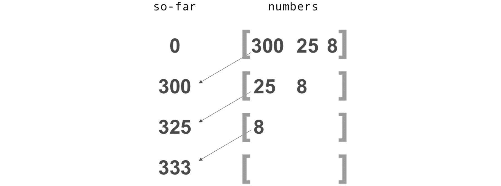
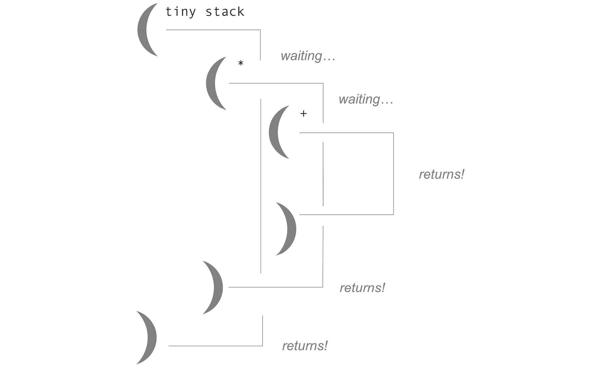
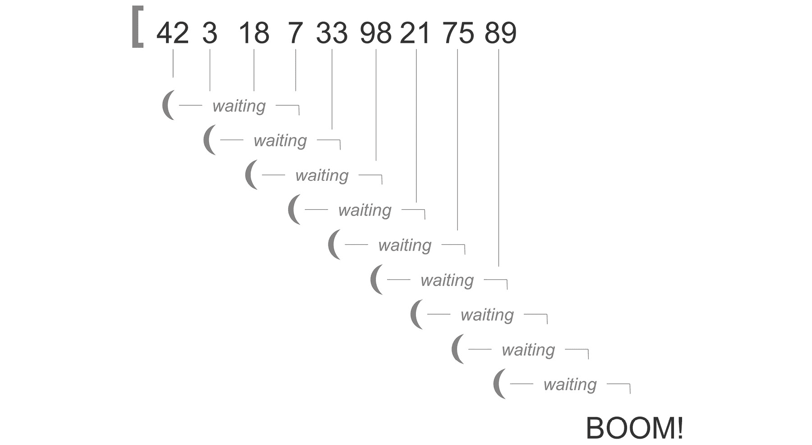
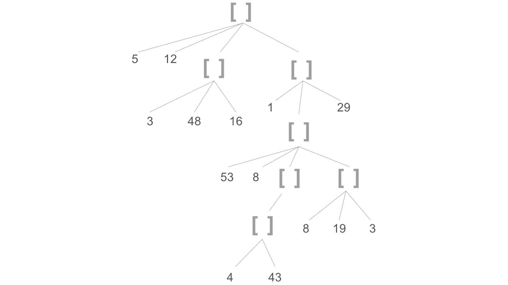
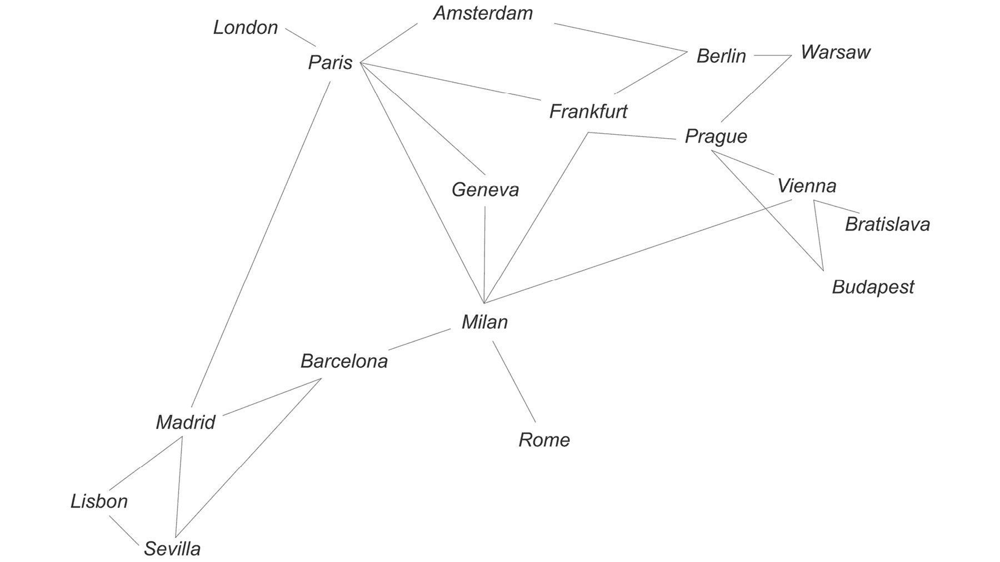
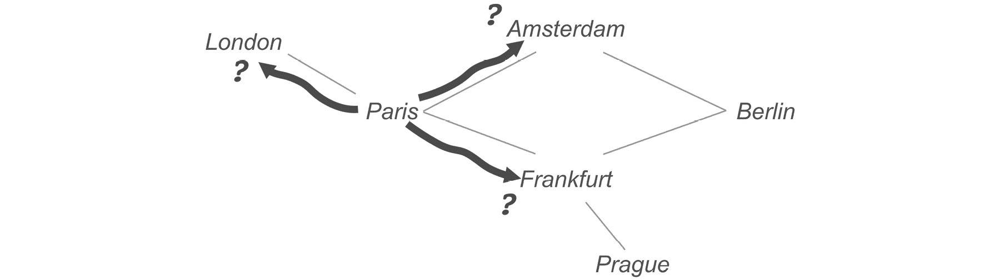
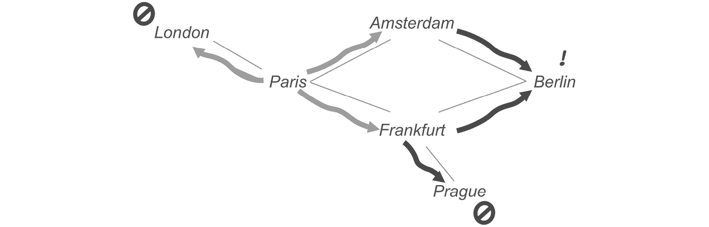
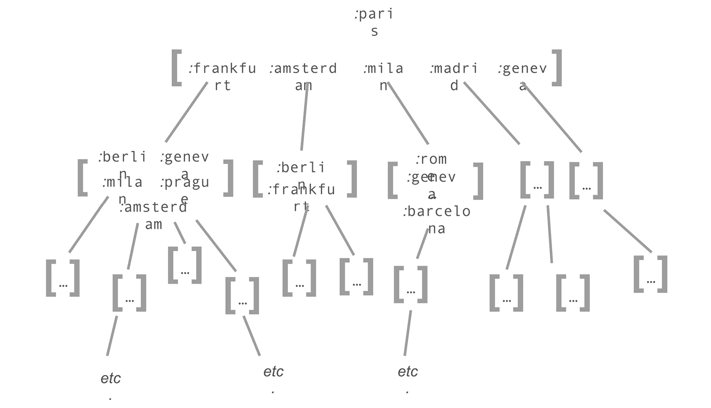
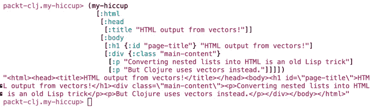

# 6. 递归与循环

概述

在本章中，你将学习更灵活的方式来处理集合。当你需要解决的问题不适合我们之前看到的模式时。我们还将使用 `doseq` 进行具有副作用循环，并了解如何通过使用专门的重复函数，如 `repeat` 和 `iterate`，来避免编写一些循环。你将使用 `recur` 进行递归循环，并确定何时这是可能的，使用 `loop` 宏来工作，并通过递归解决复杂问题。

在本章结束时，你将能够实现递归的不同方面，并了解它们如何取代传统的循环。

# 简介

我们程序中的数据并不总是以 `map` 或 `reduce` 等函数特别适应的整洁线性形式存在。我们在前两章中讨论的所有技术都无法用于遍历非线性结构，如树或图。虽然通过创意使用 `reduce` 可以做很多事情，但 `reduce` 提供的强大防护栏有时可能会妨碍编写表达性代码。有些情况需要程序员有更多控制权的工具。Clojure 为这类问题提供了其他资源，这就是我们将在本章中探讨的内容。

当诸如 `map` 和 `reduce` 等函数不再适应手头的任务时，递归扮演着重要的角色。递归思维是学习 Clojure 技能的一个重要方面。因为函数式编程语言往往强调递归，如果你的背景是更程序性的语言，这可能会显得有些不熟悉。大多数编程语言实际上都支持递归，所以这个概念并不一定那么陌生。此外，我们用 `reduce` 做的一些事情实际上是递归的，所以即使你之前很少使用递归，学习曲线也不应该那么陡峭。

话虽如此，如果你在函数式编程方面没有太多经验，递归的一些方面可能需要你以新的方式思考。与 `map` 和 `filter` 或甚至 `reduce` 相比，递归方法要灵活得多。而“灵活”意味着强大但容易出错。当我们试图让递归函数只做我们想要的事情时，我们会犯错误，最终陷入无限循环，耗尽调用栈（我们很快就会讨论这意味着什么）或遇到其他类型的错误，否则这些错误根本不可能发生。这就是为什么“循环”，无论是使用 `loop` 宏还是递归函数，都应该是在其他选项不起作用时你转向的选择。

# Clojure 最程序性的循环：doseq

在我们开始递归之前，让我们先看看 `doseq` 宏。它可以说是 Clojure 循环替代方案中最程序性的。至少，它看起来很像其他语言中找到的 `foreach` 循环。下面是 `doseq` 的一个非常简单的用法：

```java
user> (doseq [n (range 5)]
    (println (str "Line " n)))
Line 0
Line 1
Line 2
Line 3
Line 4
nil
```

如果将其翻译成英文，我们可能会说：“对于从 0 到 5 的每个整数，打印出一个包含单词 'Line' 和整数的字符串。”你可能会问：“*那里那个 nil 是做什么的？*”这是个好问题。`doseq` 总是返回 `nil`。换句话说，`doseq` 不收集任何东西。`doseq` 的唯一目的是执行副作用，比如打印到 REPL，这正是 `println` 在这里所做的。出现在你的 REPL 中的字符串——`Line 0`、`Line 1` 等等——不是返回值；它们是副作用。

注意

在 Clojure 中，就像在 Lisp 家族中的许多语言中一样，产生副作用的函数通常以感叹号结尾。虽然这不是一个严格的规则，但这种约定确实使代码更容易阅读，并有助于提醒我们注意副作用。Clojure 开发者经常使用感叹号来表示一个函数修改了一个可变的数据结构，写入文件或数据库，或执行任何在函数作用域之外产生持久影响的操作。

那么，为什么不直接使用 `map` 呢？好吧，有几个很好的理由。第一个是 `map` 并不保证整个序列都会被执行。`map` 函数是惰性的，而 `doseq` 不是。

通常情况下，在使用 `map`、`filter`、`reduce` 以及所有其他序列操作函数时，你应该始终尝试使用 `println` 语句，这可能会救命。（不过，记住，`println` 返回 `nil`，所以你必须小心不要将其放在函数的末尾，否则它会掩盖返回值）。对于某种类型的顺序数据，当你想要产生副作用时，使用 `doseq` 是很重要的，而且仅在此情况下。通过对此严格，你也会使你的代码更容易阅读和维护。`doseq` 是你源代码中的一个标志，表示：“小心，这里可能有副作用！”它也是一个明确的信号，表明我们并不关心返回值，因为 `doseq` 总是返回 `nil`。这种做法鼓励开发者将具有副作用的代码隔离在程序的具体部分。

但如果我们只想在前面例子中的奇数行打印某些内容怎么办？这里有我们可以这样做的一种方法：

```java
(doseq [n (range 5)]
 (when (odd? n)
  (println (str "Line " n))))
```

这段代码本身并没有问题。然而，作为一般规则，最好是从 `doseq` 的主体中移除尽可能多的逻辑，可能的做法如下：

```java
(doseq [n (filter odd? (range 5))]
    (println (str "Line " n)))
```

通过在数据形状的地方和消费数据的地方之间强制分离，我们不仅移除了条件语句，而且以一种方式组织了我们的代码，这为更好的实践打开了大门。也许在将来，我们可能需要选择不同的行来打印。如果发生这种情况，我们的代码已经处于正确的位置，用 Clojure 序列处理的清晰词汇编写，并且可能从惰性评估中受益。记住：塑造数据，然后使用数据。

## 循环快捷方式

通常，最好避免编写真正的循环。Clojure 提供了一些有趣的函数，可以在一些简单的情况下提供帮助，在这些情况下，你真正想要的只是某种形式的**重复**。与本章中的大多数技术不同，这些函数返回懒序列。我们在这里提到它们，因为很多时候，当一开始可能需要循环时，这些函数提供了一个更简单的解决方案。

最简单的例子是 `repeat` 函数，它如此简单，几乎不算是循环结构。然而，它有时仍然很有用。`repeat` 简单地重复它被调用的任何值，返回一个该值的懒序列。这是一个重复自己的简单方法：

```java
user> (take 5 (repeat "myself"))
("myself" "myself" "myself" "myself" "myself")
```

是的，就这么简单。尽管如此，如果你需要快速将默认值加载到映射中，它仍然可能很有用。想象一个游戏，其中每个玩家都由一个映射表示。你需要用各种计数器的默认值初始化玩家，其中大多数的默认值是 `0`。一种方法是用 `repeat`。由于 `repeat` 返回一个懒序列，它将提供你所需要的所有零：

```java
user> (zipmap [:score :hits :friends :level :energy :boost] (repeat 0))
{:score 0, :hits 0, :friends 0, :level 0, :energy 0, :boost 0}
```

`repeat` 函数之后的下一步是 `repeatedly` 函数。`repeatedly` 不是接受一个值，而是接受一个函数，并返回对该函数的懒序列调用。提供给 `repeatedly` 的函数不能接受任何参数，这限制了它在 `repeatedly` 中的用途，就像 `repeat` 会返回一个相同值的列表一样。

`repeatedly` 最常见的用途是生成随机值的序列。`rand-int` 的调用可能会每次都变化（除非，当然，你调用 `(rand-int 1)`，它只能返回 `0`。）这是一个生成从 0 到 100 的随机整数的列表的好方法，其中 `repeatedly` 简单地调用 `rand-int` 10 次。`rand-int` 的输出几乎每次都不同，因此生成的序列是一系列随机整数：

```java
user> (take 10 (repeatedly (partial rand-int 100)))
(21 52 38 59 86 73 53 53 60 90)
```

为了方便，`repeatedly` 可以接受一个整数参数，限制返回值的数量。我们可以不调用 `take` 就写出前面的表达式，如下所示：

```java
user> (repeatedly 10 (partial rand-int 100))
(55 0 65 34 64 19 21 63 25 94)
```

在下一个练习中，我们将尝试一个更复杂的场景，使用 `repeatedly` 生成随机测试数据。

`repeatedly` 之后的下一步是一个名为 `iterate` 的函数。像 `repeatedly` 一样，`iterate` 会反复调用一个函数，返回结果懒序列。然而，提供给 `iterate` 的函数接受参数，并且每次调用的结果会传递给下一次迭代。

假设我们有一个年利率为 1% 的银行账户，我们想要预测下一年每个月的余额。我们可以编写一个像这样的函数：

```java
user> (defn savings [principal yearly-rate]
    (let [monthly-rate (+ 1 (/ yearly-rate 12))]
     (iterate (fn [p] (* p monthly-rate)) principal)))
```

为了预测未来 12 个月的余额，我们将请求 13 个月的余额，因为返回的第一个值是起始余额：

```java
user> (take 13 (savings 1000 0.01))
(1000
 1000.8333333333333
 1001.667361111111
 1002.5020839120368
 1003.3375023152968
 1004.1736169005594
 1005.0104282479765
 1005.847936938183
 1006.6861435522981
 1007.5250486719249
 1008.3646528791514
 1009.2049567565506
 1010.045960887181)
```

通过每月复利，你已经比年利率多赚了几乎 5 分！

`repeatedly`和`iterate`这样的函数可以在非常具体的情况下使用，它们完美地匹配你的需求。然而，现实世界通常要复杂一点。有时，手头的任务将需要编写定制的数据遍历方式。现在是时候转向递归了。

## 练习 6.01：无限流杂货

您的雇主正在构建一个系统来自动处理从传送带下来的杂货。作为他们研究的一部分，他们希望您构建一个模拟器。目标是有一个无限流随机杂货。您的任务是编写一个函数来完成这项工作：

1.  在一个方便的地方创建一个新的目录；添加一个只包含一个空映射的`deps.edn`文件，并启动一个新的 REPL。

1.  以一个有表达力的名称，如`groceries.clj`，打开一个新文件，并包含相应的命名空间声明：

    ```java
    (ns groceries)
    ```

    在我们开始之前，我们需要构建我们的杂货店模拟器。第一步是定义所有可能的商品。（这个商店提供的选项不多，但至少它有无限供应。）将`grocery-articles`变量从[`packt.live/2tuSvd1`](https://packt.live/2tuSvd1)复制到你的 REPL 中并评估它：

    ```java
    grocery_store.clj
    3  (def grocery-articles [{:name "Flour"
    4               :weight 1000   ; grams
    5               :max-dimension 140 ; millimeters
    6              }
    7              {:name "Bread"
    8              :weight 350
    9              :max-dimension 250}
    10             {:name "Potatoes"
    11             :weight 2500
    12             :max-dimension 340}
    13             {:name "Pepper"
    14             :weight 85
    15             :max-dimension 90}
    The full file is available at https://packt.live/35r3Xng.
    ```

1.  定义一个函数，该函数将返回包含随机排序杂货文章的长列表：

    ```java
    (defn article-stream [n] 
     (repeatedly n #(rand-nth grocery-articles)))
    ```

    `rand-nth`每次被调用时都会从`grocery-articles`中返回一个随机选择的商品。`repeatedly`创建了一个对`rand-nth`的调用懒惰序列。`n`参数告诉`repeatedly`返回多少个随机商品。

1.  通过请求一些文章来测试函数：

    ```java
    groceries> (article-stream 12)
    ({:name "Olive oil", :weight 400, :max-dimension 280}
     {:name "Potatoes", :weight 2500, :max-dimension 340}
     {:name "Green beans", :weight 300, :max-dimension 120}
     {:name "Potatoes", :weight 2500, :max-dimension 340}
     {:name "Flour", :weight 1000, :max-dimension 140}
     {:name "Ice cream", :weight 450, :max-dimension 200}
     {:name "Potatoes", :weight 2500, :max-dimension 340}
     {:name "Green beans", :weight 300, :max-dimension 120}
     {:name "Potatoes", :weight 2500, :max-dimension 340}
     {:name "Ice cream", :weight 450, :max-dimension 200}
     {:name "Pepper", :weight 85, :max-dimension 90}
     {:name "Bread", :weight 350, :max-dimension 250})
    ```

1.  再次尝试以确保结果是随机的：

    ```java
    groceries> (article-stream 5)
    ({:name "Potatoes", :weight 2500, :max-dimension 340}
     {:name "Green beans", :weight 300, :max-dimension 120}
     {:name "Bread", :weight 350, :max-dimension 250}
     {:name "Olive oil", :weight 400, :max-dimension 280}
     {:name "Pepper", :weight 85, :max-dimension 90})
    ```

    它似乎工作得很好。这展示了在在其他语言中可能更自然地写`for`循环的情况下，函数是如何被组合的。在 JavaScript 中，我们可能再次编写一个像这样的函数（假设`groceryArticles`是一个对象数组）：

    ```java
    function randomArticles (groceryArticles, n) {
     var articles = [];
     for (var i = 0; i < n.length; i++) {
      articles.push(
      groceryArticles[Math.random(groceryArticles.length – 1)]
      );
     }
     return articles;
    }
    ```

    `repeatedly`这样的函数提供了一种简洁的方式来表达这一点，并节省了我们编写所有这些迭代逻辑的麻烦。

## 递归的简单应用

正如我们之前所说的，递归函数是一种在执行过程中会调用自身的函数。直观上，递归可以想象成你可能见过的那种图片，其中在主图片内部有一个原始图片的小版本。由于第二个图片与第一个图片相同，它也包含了一个非常小的第三个图片版本。之后，任何进一步的图片通常都很难表示成比一个微小的点更大的东西。然而，即使我们看不到它们，我们也可以想象这个过程基本上永远进行下去……或者至少达到分子水平。递归以类似的方式工作。而且，像图片中那样一直持续进行的递归过程的问题也是一个非常现实的问题。然而，在我们查看递归的陷阱之前，让我们先看看一些简单的例子。

首先，我们将做一件你已经知道如何做的事情：找到一组数字的总和。在现实生活中，你永远不会为此使用递归，但这个问题故意设计得简单，这样我们就可以指出一些递归的机制：

```java
(defn recursive-sum [so-far numbers]
 (if (first numbers)
  (recursive-sum
   (+ so-far (first numbers))
   (next numbers))
  so-far))
```

这个函数的调用看起来是这样的：

```java
user> (recursive-sum 0 [300 25 8])
333
```

这可能对你来说很熟悉，因为这与我们传递给`reduce`的函数非常相似。这并不令人惊讶。我们甚至可以将`reduce`视为“受控递归”或“有护栏的递归”的框架，这就是为什么在可能的情况下通常最好使用`reduce`，只有在必须时才使用递归。

虽然这里有一些重要的区别，所以让我们更仔细地看看这个函数是如何工作的。首先要注意的是有两个分支的条件语句：`(if (first numbers))`。当我们第一次调用这个函数时，`(first numbers)`返回 300。这是真值，所以我们继续进行，并且立即我们的函数再次调用`recursive-sum`（我们警告过你，递归中会有很多这种情况）。函数再次被调用，但参数不同：`(first numbers)`被加到我们的累加器`so-far`上，而不是再次使用`numbers`作为第二个参数，我们有了`(next numbers)`。

每次调用`recursive-sum`，从输入序列到输出整数的一个整数就会被移动：



图 6.1：递归地将输入序列中的项移动到输出整数

使用`reduce`，我们不需要考虑如何遍历序列。`reduce`函数本身负责迭代的机制：从一个项目移动到下一个项目，并在没有更多项目时停止。在递归函数中，我们必须确保每个函数调用都接收到正确的数据，并且在数据被消耗后函数停止。当你需要它时，递归非常强大，因为作为程序员，你完全控制迭代。你可以决定每个后续调用的参数是什么。你也可以决定递归如何以及何时停止。

那么，我们如何遍历序列呢？在每次调用`recursive-sum`时，输入序列被分成第一个项目和所有后续项目之间。`first`的调用给我们当前的项目，而`next`的调用帮助设置下一次函数调用的参数。重复这个分割动作使我们沿着序列向下移动。

然而，还有一个问题：我们何时停止？这就是我们的函数，就像绝大多数递归函数一样，围绕一个条件组织起来的原因。我们的条件很简单：停止添加还是继续？`next`函数在这里也很重要。当对一个空列表调用时，`next`返回`nil`：

```java
user> (next '())
nil
```

在这种情况下，`nil` 可靠地意味着是时候停止迭代并返回我们积累的值了。更复杂的情况将需要更复杂的分支，但基本思想通常保持不变。

## 练习 6.02：分割购物袋

在这个练习中，我们将回到上一个练习中的购物传送带模拟。现在我们能够模拟一个无限的文章流，我们需要能够在传送带末端到达时将食品项目放入购物袋。如果袋子太满，它就会破裂或开始溢出。我们需要知道何时停止，以免它太满。幸运的是，条形码阅读器可以告诉我们物品的重量和最长尺寸。如果这些中的任何一个超过了某个数值，袋子就会被移除，并用一个空袋子替换：

1.  使用与上一个练习相同的 环境。

1.  我们将购物袋建模为文章的列表。定义一个 `full-bag?` 断言，这样我们就会知道何时停止填充袋子：

    ```java
    (defn full-bag? [items]
     (let [weight (apply + (map :weight items))
        size (apply + (map :max-dimension items))]
      (or (> weight 3200)
        (> size 800))))
    ```

1.  使用不同长度的购物流输出测试 `full-bag?`：

    ```java
    groceries> (full-bag? (article-stream 10))
    true
    groceries> (full-bag? (article-stream 1))
    false
    groceries> (full-bag? (article-stream 1000))
    true
    groceries> (full-bag? '())
    false
    ```

1.  设置两个函数，`bag-sequences` 和它的递归辅助函数 `bag-sequences*`。首先定义 `bag-sequences*`，因为 `bag-sequences` 将调用它：

    ```java
    (defn bag-sequences* [{:keys [current-bag bags] :as acc} stream]
     ;; TODO: write code
    )
    (defn bag-sequences [stream]
     (bag-sequences* {:bags []
              :current-bag []} stream))
    ```

    如您从辅助函数的参数中看到的那样，我们定义了一个累加器，这次有两个字段：`:bags` 将保存所有完成的包的列表，而 `:current-bag` 将保存我们正在测试的项目。当 `:current-bag` 填满时，我们将它放入 `:bags`，并在 `:current-bag` 中开始一个新的空向量。

    第二个函数，没有星号，将是面向公众的函数。我们库的用户不必担心提供累加器；`bag-sequences*` 将是真正的递归函数，并完成所有工作。

1.  在 `bag-sequences*` 函数内部，我们将使用 `cond` 表达式来对到达的文章的状态做出反应。写出 `cond` 表达式的第一个，负条件：

    ```java
    (defn bag-sequences* [{:keys [current-bag bags] :as acc} stream]
     (cond
      (not stream)
      (conj bags current-bag)
      ;; TODO: the other cond branches
      ))
    ```

    在这里，我们决定如果 `stream` 中没有更多的文章会发生什么。如果没有东西可以放入包中，那么就是时候将 `current-bag` 添加到列表中，并返回到目前为止积累的所有内容。

    备注

    在递归函数中，尽早测试输入序列是否到达末尾是一种常见的做法。这个测试通常很简单，所以最好把它放在一边。更重要的是，如果我们知道输入序列不为空，我们就不必在后续的测试中防范 `nil` 值。这有助于消除后续测试子句中的一些可能错误，并允许我们编写更简单、更易读的代码。

1.  添加当前袋子满的条件：

    ```java
    (defn bag-sequences* [{:keys [current-bag bags] :as acc} stream]
     (cond
      (not stream)
      (conj bags current-bag)
      (full-bag? (conj current-bag (first stream)))
      (bag-sequences* (assoc acc
                  :current-bag [(first stream)]
                  :bags (conj bags current-bag))
              (next stream))
      ;; TODO: one more branch, for when the bag is not full yet
      ))
    ```

    多亏了方便的 `full-bag?` 函数，我们知道当前袋子已满。这意味着当我们下一次调用 `bag-sequences*` 时，我们需要在 `acc` 内部移动一些数据。`bag-sequences*` 的两个参数都需要更新。我们的 `assoc` 调用一开始看起来可能有些奇怪，但 `assoc` 可以接受多个键值对。

    `stream` 中最新的文章将成为新“袋”向量中的第一篇文章，因此我们将它分配给 `acc` 中的 `:current-bag` 键。此时，`current-bag` 绑定（来自函数参数中的解构）仍然指向我们决定已满的袋子。我们将把它添加到我们在 `acc` 中的 `:bags` 键维护的袋子列表中。

    由于我们希望继续前进到 `stream`，我们使用 `next` 来跳转到下一篇文章：（`next stream`）。

1.  编写最终的默认条件。如果我们已经通过了前两个条件，我们知道 `stream` 不为空，当前袋子也没有满。在这种情况下，我们只需要将当前文章添加到当前袋子中。有了这个条件，我们的函数就完成了：

    ```java
    (defn bag-sequences* [{:keys [current-bag bags] :as acc} stream]
     (cond
      (not stream)
      (conj bags current-bag)
      (full-bag? (conj current-bag (first stream)))
      (bag-sequences* (assoc acc
                  :current-bag [(first stream)]
                  :bags (conj bags current-bag))
              (next stream))
      :otherwise-bag-not-full
      (bag-sequences* (update acc :current-bag conj (first stream))
              (next stream))))
    ```

    这次，我们将使用 `update` 而不是 `assoc` 来“修改” `acc` 中的 `:current-bag` 键。这种形式的 `update` 函数将其第三个参数作为一个函数，该函数将被应用于与提供的键对应的值以及任何进一步的参数。这意味着在这种情况下，`conj` 将被调用，就像我们写了 `(conj (:current-bag acc) (first stream))` 一样。

1.  使用我们在上一项练习中编写的 `article-stream` 函数来测试该函数：

    ```java
    groceries> (bag-sequences (article-stream 12))
    [[{:name "Pepper", :weight 85, :max-dimension 90}
     {:name "Pepper", :weight 85, :max-dimension 90}
     {:name "Green beans", :weight 300, :max-dimension 120}
     {:name "Flour", :weight 1000, :max-dimension 140}
     {:name "Olive oil", :weight 400, :max-dimension 280}]
     [{:name "Bread", :weight 350, :max-dimension 250}
     {:name "Pepper", :weight 85, :max-dimension 90}
     {:name "Green beans", :weight 300, :max-dimension 120}
     {:name "Olive oil", :weight 400, :max-dimension 280}]
      [{:name "Potatoes", :weight 2500, :max-dimension 340}
     {:name "Bread", :weight 350, :max-dimension 250}]]
    ```

    这看起来似乎有效！每个袋子都表现为一个物品的向量。向量的长度取决于物品的大小和重量。

我们已经解决了我们在本章开头提到的问题之一：以不同长度的步骤遍历序列。在这个例子中，我们将输入序列分割成大小取决于底层数据属性的数据块。

## 何时使用 recur

现在，`bag-sequence` 对于相对较短的 `grocery-stream` 序列工作得很好，但当我们将其移入我们的多模式杂货超级平台的生产环境中时，整个系统迅速陷入停滞。这是出现在所有技术人员控制台上的消息：

```java
packt-clj.recursion> (def production-bags (bag-sequences (article-stream 10000)))
Execution error (StackOverflowError) at packt-clj.recursion/article-stream$fn (recursion.clj:34).
null
```

那么，发生了什么？什么是 `StackOverflowError`？

栈（**stack**）是 JVM 跟踪嵌套函数调用的一种方式。每次函数调用都需要进行一点簿记工作来维护一些上下文信息，例如局部变量的值。运行时还需要知道每个调用的结果应该放在哪里。当一个函数在另一个函数内部被调用时，外部函数会等待内部函数完成。如果内部函数也调用了其他函数，它也必须等待这些函数完成，依此类推。栈的工作是跟踪这些函数调用的链。

我们可以使用一个非常简单的函数来举例。这个函数接受两个整数并对它们执行两种不同的操作：

```java
user> (defn tiny-stack [a b]
    (* b (+ a b)))
#'user/tiny-stack
user> (tiny-stack 4 7)
77
```

这里是调用 `tiny-stack` 时发生情况的简化版本：

我们调用 `tiny-stack` 并产生一个初始的栈帧。它等待函数内容的评估。

在 `tiny-stack` 等待的同时，`*` 函数被调用。产生一个新的栈帧。`b` 绑定立即评估，但由于对 `+` 的调用，它还不能返回。

`+` 最终被调用，产生一个新的、短暂的栈帧。两个整数相加，返回值，然后擦除 `+` 的栈帧。

`*` 的调用现在可以完成。它将返回值传递回 `tiny-stack`，然后擦除其栈帧。

`tiny-stack` 返回 `77` 并擦除了其栈帧：




图 6.2：嵌套函数调用中栈帧的可视化

这就是栈帧应该工作的方式。大多数时候，我们根本不需要考虑它。然而，当我们使用递归遍历序列的长度时，我们实际上是通过嵌套使用栈来移动序列的。因为运行时可以处理的栈帧数量有限，如果我们有一个非常长的序列，我们最终会耗尽栈帧，我们的程序将会崩溃：




图 6.3：递归的表示

使用递归，输入向量的长度被转换为调用栈中的深度，直到它太深

到目前为止，你可能认为递归根本不是一个很好的模式。这实际上是由于 JVM 中内置的限制。其他基于 JVM 的 Lisp 没有这个限制，在这些语言中，前面的代码会正常工作。

然而，Clojure 中有一个解决方案，它被称为 `recur`。让我们再次看看我们在上一节中编写的 `recursive-sum` 函数：

```java
(defn recursive-sum [so-far numbers]
 (if (first numbers)
  (recursive-sum
   (+ so-far (first numbers))
   (next numbers))
  so-far))
```

首先，让我们看看在长输入序列上会发生什么爆炸：

```java
user> (recursive-sum 0 (range 10000))
Execution error (StackOverflowError) at user/recursive-sum (REPL:53).
null
```

要使用 `recur`，我们只需将原始方程中的 `recursive-sum` 调用替换为 `recur`：

```java
user> (defn safe-recursive-sum [so-far numbers]
    (if (first numbers)
     (recur
      (+ so-far (first numbers))
      (next numbers))
     so-far))
#'user/safe-recursive-sum
user> (safe-recursive-sum 0 (range 10000))
49995000
```

为什么这会起作用呢？好吧，使用 `recur`，一个函数变成了尾递归。**尾递归**意味着连续的调用不会增加调用栈。相反，运行时会将它们视为当前帧的重复。你可以将其视为保持在同一帧中，而不是等待所有嵌套调用解决。这样，循环可以继续而不会增加栈的大小。这允许我们处理大量数据而不会遇到可怕的栈溢出。

一个函数只有在其返回一个完整的自我调用且没有其他内容时才能是尾递归。一开始这可能有点难以理解，但随着我们通过一些示例进行工作，它应该会变得更加清晰。在下一个练习中，我们将查看在尾递归函数中直接使用 `recur` 的简单例子。

## 练习 6.03：使用 `recur` 进行大规模杂货分区

如我们之前提到的，我们之前对 `bag-sequences` 的实验在输入流变得过长时扩展性不好，因为我们遇到了栈溢出异常。也许我们可以通过使用 `recur` 来改进之前的设计：

1.  将环境设置成与上一个练习相同。

1.  将 `bag-sequences` 和 `bag-sequences*` 函数复制一份，并使用新名称，例如 `robust-bag-sequences` 和 `robust-bag-sequences*`。

1.  在 `robust-bag-sequences*` 中，使用 `recur` 而不是调用 `bag-sequences*`：

    ```java
    (defn robust-bag-sequences* [{:keys [current-bag bags] :as acc} stream]
     (cond
      (not stream)
      (conj bags current-bag)
      (full-bag? (conj current-bag (first stream)))
      (recur (assoc acc
             :current-bag [(first stream)]
             :bags (conj bags current-bag))
          (next stream))
      :otherwise-bag-not-full
      (recur (assoc acc :current-bag (conj current-bag (first stream)))
          (next stream))))
    ```

    与 `bag-sequences*` 的上一个版本相比，唯一的区别是我们已经将递归调用（我们写出的函数名，`bag-sequences*`）替换为 `recur`。这个函数是尾递归的。为什么？好吧，让我们看看与 `cond` 表达式的三个分支相对应的三个可能的输出。第一个分支只是返回数据，所以那里根本没有任何递归。其他两个返回 `recur` 的调用，这是函数中最后要评估的内容。这符合尾递归的定义，即函数必须返回一个对自身的调用 *并且没有其他内容*。

1.  在面向公众的 `robust-bag-sequences` 函数中，别忘了将 `bag-sequences*` 的调用更新为新函数名：

    ```java
    (defn robust-bag-sequences [stream]
     (robust-bag-sequences* {:bags []
                 :current-bag []} stream))
    ```

1.  评估你的命名空间，并在一个非常长的 `article-stream` 上测试新函数。别忘了将结果赋值给一个变量，否则它将充满你的 REPL！

    在这里，我们将一百万篇文章放入 343,091 个袋子中：

    ```java
    groceries> (def bags (robust-bag-sequences (article-stream 1000000)))
    #'packt-clj.recursion/bags
    groceries> (count bags)
    343091
    groceries> (first bags)
    [{:name "Olive oil", :weight 400, :max-dimension 280}
     {:name "Potatoes", :weight 2500, :max-dimension 340}]
    ```

    由于 `article-stream` 的内容是随机的，你的结果可能会有所不同。

    这个例子展示了使用 `recur` 来轻松提高递归函数性能的基本方法。`robust-bag-sequences*` 函数确实是尾递归的，因为它返回一个完整的自我调用且没有其他内容。

## 那么 `loop` 呢？

如你所知，Clojure 确实有一个 `loop` 宏。如果你听到这个，突然想到“太好了，我可以用 `loop` 来代替！”，你可能会感到失望。`loop` 宏确实是有用的，但 `loop` 的可怕秘密是它几乎与使用 `recur` 编写的递归函数相同。

`loop` 宏的优势在于它可以包含在函数内部。这消除了编写一个设置递归并可能在结果上做一些“后期制作”的公共函数以及一个执行实际递归的辅助函数的需要。当然，这种模式没有问题，但使用 `loop` 可以通过限制需要定义的函数数量来使命名空间更容易阅读。

注意

Clojure 提供了另一种避免公共函数的机制。使用`defn-`而不是`defn`定义的函数仅在其定义的命名空间内可用。

`loop`的基本逻辑和结构与使用`recur`的函数非常相似：`loop`的调用以一个或多个绑定开始，就像递归函数一样，由于`recur`而重新开始。就像递归函数一样，`recur`的参数必须在每次迭代中修改，以避免无限循环。并且`loop`的调用也必须是尾递归，就像使用`recur`的函数一样。

这里是一个使用`loop`对想象中的杂货店中的商品进行操作的函数的简单框架。假设`process`函数对每个商品执行一些重要操作，例如向不同的服务发送 API 调用。现在，我们将它定义为别名`identity`的存根函数，这是 Clojure 函数，它简单地返回它提供的任何参数：

```java
(def process identity)
(defn grocery-verification [input-items]
  (loop [remaining-items input-items
        processed-items []]
    (if (not (seq remaining-items))
      processed-items
      (recur (next remaining-items)
        (conj processed-items (process (first remaining-items)))))))
```

显然，基本模式与我们之前看过的递归函数非常相似：检测是否继续迭代的条件语句，以及在末尾的`recur`调用，开始变得非常熟悉。重要的是要记住，初始绑定只是那样：初始。就像函数的参数一样，它们在循环开始时分配，然后通过`recur`调用重新分配。确保迭代能够顺利且不会无限进行，取决于你。

## 练习 6.04：使用`loop`处理杂货

使用`loop`重写之前练习中的`robust-bag-sequences`函数：

1.  使用与之前练习相同的环境。

1.  为具有与`robust-bag-sequences`相同调用签名的函数编写大纲：

    ```java
    (defn looping-robust-bag-sequences [stream]
     )
    ```

1.  在函数内部设置一个循环，其参数与`robust-bag-sequences*`相同：

    ```java
    (defn looping-robust-bag-sequences [stream]
     (loop [remaining-stream stream
         acc {:current-bag []
           :bags []}]
        ;;TODO: the real work
      ))
    ```

    如你所见，我们的累加器的初始设置将在绑定中发生。

1.  通过重用之前练习中的`robust-bag-sequences*`代码，填写其余的逻辑：

    ```java
     (defn looping-robust-bag-sequences [stream]
     (loop [remaining-stream stream
         acc {:current-bag []
           :bags []}]
      (let [{:keys [current-bag bags]} acc]
       (cond (not remaining-stream)
          (conj bags current-bag)
          (full-bag? (conj current-bag (first remaining-stream)))
          (recur (next remaining-stream)
              (assoc acc
                 :current-bag [(first remaining-stream)]
                 :bags (conj bags current-bag)))
          :otherwise-bag-not-full
          (recur (next remaining-stream)
              (assoc acc :current-bag (conj current-bag (first remaining-stream)))))))) 
    ```

    这个版本几乎与原始版本相同。主要区别在于，由于变量的绑定方式，我们最终使用`let`绑定来解构累加器，以便有`current-bag`和`bags`绑定。除此之外，代码相同。

1.  测试函数的新版本：

    ```java
    groceries> (looping-robust-bag-sequences (article-stream 8))
    [[{:name "Bread", :weight 350, :max-dimension 250}
     {:name "Potatoes", :weight 2500, :max-dimension 340}]
     [{:name "Potatoes", :weight 2500, :max-dimension 340}]
     [{:name "Potatoes", :weight 2500, :max-dimension 340}
     {:name "Olive oil", :weight 400, :max-dimension 280}]
     [{:name "Flour", :weight 1000, :max-dimension 140}
     {:name "Green beans", :weight 300, :max-dimension 120}
     {:name "Pepper", :weight 85, :max-dimension 90}]]
    ```

    这段代码展示了`loop`和递归函数可以多么相似。选择哪种形式主要取决于哪种版本会使你的代码更容易理解。将`loop`视为一种递归形式也会使你更容易记住在循环内编写尾递归代码。

## 尾递归

如我们之前所说，`recur`告诉 JVM 期望函数是尾递归。但这究竟意味着什么呢？用`recur`替换函数名实际上并不足以使递归函数调用成为尾递归。

让我们从递归函数不是*尾递归*时会发生什么的例子开始。到目前为止，我们已经做了很多整数序列的添加。这里有一个新的变化：假设整数不是简单的序列，而是在嵌套序列中，可能像这样：

```java
(def nested [5 12 [3 48 16] [1 [53 8 [[4 43]] [8 19 3]] 29]])
```

嵌套向量如这种在 Clojure 中是表示树的一种常见方式。这些向量本身是分支节点，而在这个例子中，整数是叶子：



图 6.4：嵌套向量是表示树结构的一种常见方式

我们还没有遇到过这种问题。这恰好是递归可能是最佳或甚至是唯一解决方案的问题类型。它也是一个重要的类型：这些嵌套向量实际上定义了一个树结构。树当然是表示数据最有用的方式之一，所以这是一个相当重要的主题。

实际上，要解决这个问题，我们需要一个递归函数，当它看到数字时进行加法，当它看到列表时调用自身。这里是一个看起来很像我们之前写过的其他函数的起点：

```java
(defn naive-tree-sum [so-far x]
 (cond (not x) so-far
    (integer? (first x)) (recur (+ so-far (first x)) (next x))
    ; TODO: more code
    ))
```

`cond`形式中的第一个条件相当标准：如果我们到达输入的末尾，我们只需返回`so-far`（我们的累加器）中的内容。下一个条件现在也应该看起来相当直接：如果我们有一个数字，将其加到我们的运行总和中，然后通过在第一个项目和下一个项目之间拆分输入序列继续进行。

现在，让我们为当`(first x)`是一个向量时的情况写下最后一个条件。新的`recur`调用需要计算`(first x)`以便它可以是整数。这将是这样的：

```java
(defn naive-tree-sum [so-far x]
 (cond (not x) so-far
    (integer? (first x)) (recur (+ so-far (first x)) (next x))
    (or (seq? (first x)) (vector? (first x)))
    (recur (recur so-far (first x)) (next x)))) ;; Warning!!!
```

如果你将这段代码输入到你的 REPL 中并评估它，你会得到一个错误：

```java
1\. Caused by java.lang.UnsupportedOperationException
  Can only recur from tail position
```

发生了什么？为什么这不起作用？

表面上，我们只是在遵循既定的模式。嵌套的`recur`调用看起来有点奇怪。但如果`(first x)`是一个向量或列表，我们不能简单地将其添加到`so-far`中。我们的函数需要一个整数作为`so-far`参数。我们需要通过评估整个树的部分将`(first x)`中的向量转换成整数。当这完成时，我们有了简单、简单的整数而不是子树，我们最终可以继续处理序列的其余部分，使用`(next x)`。

然而，编译器拒绝编译我们的代码的原因是，由于最后一行，该函数不是尾递归的。在函数的最后一行，第一个`recur`必须等待第二个完成后再继续。这是对`recur`的尾位置要求的违反：禁止同时调用`recur`。正如我们之前所说的，要成为尾递归，一个函数必须只返回对自身的调用，不再有其他操作。但在这个情况下，一个`recur`正在等待另一个返回。

我们也可以从堆栈帧的角度来考虑这个问题。尾递归意味着当递归函数再次被调用（通过`recur`）时，不会产生新的帧：前一个函数调用被新的一个“忘记”或“擦除”。前一个调用的唯一痕迹是在对当前调用参数所做的更改中。这个函数的问题在于第一次调用`recur`不能被“忘记”。它正在等待第二次调用的结果。只有当第二次调用解决后，第一次调用才能继续。如果我们处于需要两个堆栈帧共存的情况，我们就不能使用`recur`。当处理线性数据时，这通常不是问题。另一方面，树结构通常不能以`recur`所需的线性方式处理。

让我们尝试不使用`recur`重写同一个函数：

```java
user> (defn less-naive-tree-sum [so-far x]
        (cond (not x) so-far
          (integer? (first x)) (less-naive-tree-sum (+ so-far (first x)) (next x))
          (or (seq? (first x)) (vector? (first x)))
          (less-naive-tree-sum (less-naive-tree-sum so-far (first x)) (next x))))
#'user/less-naive-tree-sum
user> (less-naive-tree-sum 0 nested)
252
```

这行得通！尽管我们可能遇到了新问题。没有`recur`，这个函数版本在运行包含太多项目的树时可能会使栈爆炸。这可能是也可能不是问题，这取决于需要处理的数据类型。如果我们有数千个项目或子向量，我们就需要找到另一种解决方案。为此，你需要等待下一章，我们将学习如何生成自己的**懒序列**，这将允许我们在大型、复杂的树上使用递归。

没有使用`recur`和懒序列的递归在很多情况下都可以正常工作。当输入数据不是成千上万或数百万项时，“正常”的非懒递归可能就足够了。现在，重要的是要理解`recur`的使用是有局限性的。幸运的是，许多你需要用递归完成的任务都可以很好地适应尾递归模式。而且不用担心：如果你忘记了，编译器总是在那里提醒你。

# 使用递归解决复杂问题

当我们谈论递归时，实际上有两种截然不同的用例类别。这在 Clojure 中尤其如此。一方面，递归是构建循环的主要、低级方式，在其他语言中会使用`for`、`foreach`或`with`。另一方面，像 Clojure 这样的函数式语言通常使程序员更容易找到优雅的递归解决方案来处理复杂问题。

尾递归和围绕`recur`构建的函数或循环适合处理数据、输入和输出基本上是线性的问题。因为尾递归函数一次只能返回一个调用，所以它们无法处理需要通过多个分支路径遍历数据的问题。Clojure 提供了你需要的工具。使用它们可能需要一些练习，以递归风格来处理问题。

为了帮助构建这项技能，本章剩余的练习将致力于解决一个复杂问题：在节点网络中找到最有效的路径。或者换句话说：如何在欧洲首都之间廉价旅行。这些练习将向你展示如何分解问题并递归地解决它。

## 练习 6.05：欧洲火车之旅

在这个练习中，我们需要找到旅行者从一个欧洲城市到另一个城市最经济的路线。我们拥有的只是一个城市到城市连接的列表和欧元金额。为了这个练习，我们将假装这些是唯一可用的路线，并且给定路线的火车票价格是恒定的。以下是我们的路线：

```java
train_routes.clj
1  (def routes
2   [[:paris :london 236]
3    [:paris :frankfurt 121]
4    [:paris :milan 129]
5    [:milan :rome 95]
6    [:milan :barcelona 258]
7    [:milan :vienna 79]
8    [:barcelona :madrid 141]
9    [:madrid :lisbon 127]
10   [:madrid :paris 314]
The full code for this step is available at https://packt.live/2FpIjVM
```

这里是它的可视化表示：



图 6.5：欧洲火车路线

注意

城市之间的路径列表和可视地图是表示图（在计算机科学中指节点系统）的两种方式。树是图中没有“循环”的一种类型：你不能从点 A 到点 B，再到点 C，然后再回到点 A。另一方面，欧洲铁路网络有很多循环。在图论中，每个城市都会被称为节点，城市之间的路径会被称为边。

目标是编写一个函数，它接受两个城市并返回表示最佳路线的城市列表。为了解决这个问题，我们将使用递归，以及上一章中介绍的大多数技术。

在这个练习中，我们将设置项目并将路线列表转换成一个我们可以查询的表格，以查看 1）城市 A 是否与城市 B 相连，如果是，2）城市 A 和 B 之间的旅行成本。

因此，表格看起来会是这样：

```java
{:paris {:london 236
     :frankfurt 121
     :milan 129
     ;;...etc...
     }
 :milan {:paris 129
     :vienna 79
     :rome 95
     ;;...etc...
     }}
```

我们还必须确保所有路线都在两个方向上表示。在初始列表中，我们有`[:paris :milan 129]`。我们还需要表示反向路线，即米兰到巴黎。在上面的例子中，`:milan`在`:paris`部分，以及`:paris`在`:milan`部分：

1.  创建一个新的项目目录，包含一个`deps.edn`文件，其中只包含一个空映射`{}`，并启动一个新的 REPL。

1.  以`train_routes.clj`为名创建一个新文件，其中只包含一个`(ns train-routes)`命名空间声明。

1.  将[`packt.live/39J0Fit`](https://packt.live/39J0Fit)中的`routes`变量复制到新的命名空间中。

1.  第一步是将所有路线按出发城市分组。使用`group-by`来完成这个操作。首先定义一个名为`grouped-routes`的函数：

    ```java
    (defn grouped-routes
     [routes]
     (->> routes
        (group-by first)))
    ```

1.  在路线列表上运行这个函数的早期版本，并查看单个城市的输出结果：

    ```java
    train-routes> (:paris (grouped-routes routes))
    [[:paris :london 236]
     [:paris :frankfurt 121]
     [:paris :milan 129]
     [:paris :amsterdam 139]]
    ```

    通过调用`group-by`，我们得到了所有`:paris`路线的列表。现在我们需要一种方法将这个子列表转换成一个映射。

1.  编写一个函数，它接受这些子列表之一并返回一个映射：

    ```java
    (defn route-list->distance-map [route-list]
     (->> route-list
        (map (fn [[_ city cost]] [city cost]))
        (into {})))
    ```

    此函数使用`map`-`into`模式创建一个包含两个元素向量元组的列表。我们不需要第一个元素，因为它与子列表关联的键相同，所以我们使用解构将`city`和`cost`放置在一个新的向量中。

1.  在 REPL 中使用一些样本数据测试`route-list->distance-map`：

    ```java
    train-routes> (route-list->distance-map [[:paris :milan 129]
                                            [:paris :frankfurt 121]])
    {:milan 129, :frankfurt 121}
    ```

1.  继续构建`grouped-routes`函数。再次使用`map-into`模式将`route-list->distance-map`应用于`group-by`调用返回的所有子列表：

    ```java
    (defn grouped-routes
     [routes]
     (->> routes
        (group-by first)
        (map (fn [[k v]] [k (route-list->distance-map v)]))
        (into {})))
    ```

    `map`调用将顶层映射的键值对视为一系列两个元素的向量，并对每个值运行`route-list->distance-map`。`into`调用将序列转换回映射。

1.  在 REPL 中测试这个版本的`grouped-routes`：

    ```java
    train-routes> (:paris (grouped-routes routes))
    {:london 236, :frankfurt 121, :milan 129, :amsterdam 139}
    ```

    完美！这种类型的地图将使查找从起点（`:paris`）到目的地（`:amsterdam`）之间的路线变得容易。

    我们仍然需要生成反向路线。我们将使用`mapcat`，在我们在*第四章*中提到的模式中，为每个输入路线生成两条路线。这可以在`group-by`调用之前进行：

    ```java
    (defn grouped-routes
     [routes]
     (->> routes
        (mapcat (fn [[origin-city dest-city cost :as r]]
             [r [dest-city origin-city cost]]))
        (group-by first)
        (map (fn [[k v]] [k (route-list->distance-map v)]))
        (into {})))
    ```

    在`mapcat`调用中的匿名函数返回一个包含两个子向量的向量。其中第一个是原始路线，第二个是将起点和终点城市颠倒的相同路线。多亏了`mapcat`，结果是一个元素数量是输入列表两倍的扁平化列表。

1.  再次在 REPL 中测试：

    ```java
    train-routes> (:paris (grouped-routes routes))
    {:london 236,
     :frankfurt 121,
     :milan 129,
     :madrid 314,
     :geneva 123,
     :amsterdam 139}
    ```

    现在，`[:madrid :paris 34]`路线也被包括为从`:paris`到`:madrid`的路线。

1.  定义一个带有查找表的`lookup`变量：

    ```java
    train-routes> (def lookup (grouped-routes routes))
    #'train-routes/lookup
    ```

    我们稍后会需要这个变量。

1.  测试查找表。首先，我们将请求从巴黎到马德里的路线：

    ```java
    train-routes> (get-in lookup [:paris :madrid])
    314
    ```

    我们能回到巴黎吗？

    ```java
    train-routes> (get-in lookup [:madrid :paris])
    314
    ```

    让我们尝试一条我们知道不存在的路线：

    ```java
    train-routes> (get-in lookup [:paris :bratislava])
    nil
    ```

    我们的查找表回答了两个重要的问题：城市 A 和城市 B 之间有路线吗？费用是多少？

现在我们有一个数据存储，当我们需要从欧洲铁路图中的任何给定点查找哪些城市可用时，我们可以咨询它。将数据重新排列成易于查询的形式，在处理像这样一个复杂问题时，可能是一个重要的步骤。由于对数据的这种便捷访问，接下来的步骤将会更容易。

## 寻路

如果我们所在的城镇与我们想要旅行的城镇没有直接连接，我们需要选择中间城镇。要从城市 A 到城市 F，我们可能首先会去城市 C；或者，我们可能需要先去城市 B，然后去城市 D，才能到达城市 F。为了找到最佳路径，我们首先需要找到所有可能的路径。

这就是为什么递归方法是一个很好的选择。基本策略是测试城市 A 和城市 F 是否相连。如果是这样，我们就已经找到了答案。如果不是，我们就查看从城市 A 可以直接到达的所有城市。我们对每个这样的城市都进行同样的过程，以此类推，直到最终找到一个直接连接到城市 F 的城市。这个过程是递归的，因为我们重复对每个节点进行同样的过程，直到我们找到我们正在寻找的东西。

让我们尝试用网络的一小部分来可视化这个过程。在这个例子中，我们将从巴黎开始，搜索柏林。第一步是测试从巴黎可以到达的城市。在伦敦、阿姆斯特丹和法兰克福，我们问：你是柏林吗？



图 6.6：从巴黎开始，查询所有可用的城市

由于我们寻找的城市都不是伦敦、阿姆斯特丹和法兰克福中的任何一个，所以我们从这三个城市重复这个过程：



图 6.7：从之前找到的城市再次搜索

从伦敦出发，我们无处可去。但从阿姆斯特丹和法兰克福出发，我们可以到达柏林。成功！我们不仅找到了柏林，还找到了两条到达那里的路径。

我们可以用 Clojure 向量来表示这些路径：

```java
 [:paris :london nil]
 [:paris :amsterdam :berlin]
 [:paris :frankfurt :berlin]
 [:paris :frankfurt :prague nil]
```

注意，经过布拉格和伦敦的路径以 `nil` 结尾。这就是我们将如何表示不导向我们目的地并必须从结果集中删除的路径。

我们还有一个尚未解决的问题。什么阻止我们从阿姆斯特丹回到巴黎？这将创建无限循环，其中我们从巴黎搜索，然后搜索阿姆斯特丹，然后再次搜索巴黎，以此类推。为了解决这个问题，我们需要“记住”我们去过的城市。

这是我们的一般方法。现在，让我们编写更多的代码！

## 练习 6.06：搜索函数

下一步是编写主搜索函数，一个我们将称之为 `find-path*` 的递归函数。`find-path` 函数将是公共接口，它将调用 `find-path*`：

1.  到目前为止，我们已经准备好编写主搜索函数。`find-path` 函数可以用作包装函数，作为公共接口。为了开始，让我们编写空函数：

    ```java
    (defn find-path* [route-lookup destination path]
     ;; TODO: write code
     )
    (defn find-path [route-lookup origin destination]
     ;; TODO: write code
     )
    ```

    我们首先编写了“私有”函数 `find-path*`，因为“公共”函数 `find-path` 将会引用它。

    函数参数中已经有一些设计决策了。这两个函数都接受`route-lookup`参数。这将是由`grouped-routes`生成的查找表。它们都接受目的地参数。由于我们想要构建一个城市列表，一个路径，私有函数`find-path*`不接收像`find-path`那样的起点参数。相反，它将接收当前的路径。由于它是一个递归函数，当前的“起点”将始终是路径中的最后一个城市。

    换句话说，如果我们正在测试一个路径，`path`的值可能是`[:paris :milan]`。这意味着在下一个迭代中，`find-path*`将尝试从`:milan`可到达的所有城市，使`:milan`成为临时的起点。以相同的方式测试下一个城市，并且路径在每次连续调用中增加一个城市。

1.  从`find-path`调用`find-path*`：

    ```java
    (defn find-path [route-lookup origin destination]
      (find-path* route-lookup destination [origin]))
    ```

    这很简单。我们将初始`origin`打包成一个向量，传递给`find-path*`。这样，我们就知道`path`参数中至少会有一个城市。

1.  设置递归函数的基本条件结构：

    ```java
    (defn find-path* [route-lookup destination path]
     (let [position (last path)]
      (cond
       (= position destination) path
       (get-in route-lookup [position destination])
       (conj path destination)
       ;; TODO: still not there
       )))
    ```

    这部分做了两件事。我们需要多次引用当前位置，所以立即创建一个`let`绑定是个好主意。正如我们之前提到的，我们的当前位置总是`path`参数中的最后一个项目。整个过程就是在这个列表的末尾添加城市。

    接下来，我们开始设置我们将要使用的一些不同检查。我们添加的两个条件都结束了递归并返回了一个值。这些都是“我们到了吗？”测试。第二个是我们将调用最多的一个，所以让我们先看看它。

    如果你记得我们的查找表是如何结构的，有一个顶层键集，每个键对应我们系统中的一个城市。每个键的值是一个可达城市的映射。这就是为什么我们可以在这里使用`get-in`。假设我们的查找表看起来像这样：

    ```java
    {:paris {:frankfurt 121
         :milan 129
         ;; etc.
         }
     ;; etc.
     }
    ```

    如果我们调用`(get-in routes-lookup [:paris :milan])`，我们将得到`129`。如果我们当前的位置是`:paris`，我们的目的地是`:milan`，那么这个调用将返回真值。在这种情况下，我们将`:milan`添加到当前路径中，并返回该路径。我们已经到达了。

    那么，为什么我们需要第一个条件呢？在什么情况下目的地城市已经在路径中了呢？只有一种可能发生这种情况，但我们确实需要处理它。总有一天，用户会调用你的函数，并询问从`:paris`到`:paris`的最佳路线，我们不希望在这样一个简单的请求上崩溃堆栈。

1.  测试简单情况。我们已经有足够的代码来处理两个情况，所以让我们看看我们的函数是否工作。首先尝试使用一个城市路径的`find-path*`：

    ```java
    train-routes> (find-path* lookup :sevilla [:sevilla])
    [:sevilla]
    ```

    现在，让我们用`find-path`尝试同样的事情：

    ```java
    train-routes> (find-path lookup :sevilla :sevilla)
    [:sevilla]
    ```

    如果目的地城市只比起点城市远一步，当前的代码也应该能工作：

    ```java
    train-routes> (find-path* lookup :madrid [:sevilla])
    [:sevilla :madrid]
    ```

    到目前为止，一切顺利。继续前进！

1.  开始构建递归逻辑以`find-path*`：

    ```java
    (defn find-path* [route-lookup destination path]
     (let [position (last path)]
      (cond
       (= position destination) path
       (get-in route-lookup [position destination])
       (conj path destination)
       :otherwise-we-search
       (let [path-set (set path)
          from-here (remove path-set (keys (get route-lookup position)))]
        (when-not (empty? from-here)
         (->> from-here
            (map (fn [pos] (find-path* route-lookup destination (conj path pos))))
            (remove empty?)))))))
    ```

    对于最终条件，我们使用一个表达式的 Clojure 关键字，如 `:otherwise-we-search` 作为条件，但任何不是 `false` 或 `nil` 的东西都可以。如果我们走到这一步，我们知道我们还没有到达目的地，所以我们必须继续搜索。

1.  让我们逐行查看这一行。我们首先定义 `path-set`，这将允许我们测试一个城市是否已经在我们的路径中。你可以在 REPL 中尝试构建和使用一个集合：

    ```java
    train-routes> (set [:amsterdam :paris :milan])
    #{:paris :milan :amsterdam}
    train-routes> ((set [:amsterdam :paris :milan]) :berlin)
    nil
    train-routes> ((set [:amsterdam :paris :milan]) :paris)
    :paris
    ```

    为什么这一点很重要，在下一行中变得明显。我们将 `from-here` 绑定到这个：

    ```java
    (remove path-set (keys (get route-lookup position)))
    ```

    我们不能像之前那样使用 `get-in`，因为这次我们不仅仅想要从 `position` 可达的一个城市，我们想要所有这些城市。所以，我们通过 `(get route-lookup position)` 获取当前城市的整个子图，然后提取一个关键词列表。现在，上一行的 `path-set` 绑定变得有用。我们使用它来移除我们已经访问过的任何城市。这就是我们避免在 `:paris` 和 `:amsterdam` 之间永远递归来回的方法。

    `from-here` 绑定现在包含我们仍然需要测试的所有城市。首先，我们使用 Clojure 中命名良好的 `empty?` 断言来检查 `from-here` 是否为空。假设我们的目的地是 `:berlin`，当前路径是 `[:paris :london]`。从 `:london` 出去的唯一方法是回到 `:paris`，但我们已经去过那里。这意味着现在是放弃的时候了，所以我们返回 `nil`。很快你就会看到，解析为 `nil` 的路径将被忽略。

1.  之后，我们开始将 `from-here` 通过一系列 s-expressions 穿插。第一个是实际递归将要发生的地方：

    ```java
    (map (fn [pos] (find-path* route-lookup destination (conj path pos))))
    ```

1.  我们正在映射从当前位置可达的城市。比如说，我们从 `:london` 到达了 `:paris`。在查找表中，`:paris` 的值如下：

    ```java
    train-routes> (:paris lookup)
    {:london 236,
     :frankfurt 121,
     :milan 129,
     :madrid 314,
     :geneva 123,
     :amsterdam 139}
    ```

1.  我们不能回到 `:london`，这意味着 `from-here` 是 `[:frankfurt :milan :madrid :geneva :amsterdam]`。提供给 `map` 的匿名函数将为每个这些城市作为 `pos` 被调用一次。因此，每个城市都将被追加到递归调用 `find-path*` 的路径参数中。以下值将作为 `path` 参数尝试 `find-path*`：

    ```java
     [:london :paris :frankfurt]
     [:london :paris :milan]
     [:london :paris :madrid]
     [:london :paris :geneva]
     [:london :paris :amsterdam]
    ```

    记住 `map` 返回一个列表。这里返回的列表将是调用 `find-path*` 的每个城市的调用结果。这些调用中的每一个都将产生一个列表，直到搜索找到目的地城市或没有更多地方可查找。

    现在，我们可以开始可视化路径搜索的递归结构：

    ![图 6.8：每个城市解析为一个新的城市列表，每个城市又解析为一个新的列表]

    

    图 6.8：每个城市解析为一个新的城市列表，每个城市又解析为一个新的列表

    最终，搜索要么找到目的地，要么用尽选项，此时所有列表都将被解析。如果没有更多选项并且目的地仍未找到，则返回`nil`。否则，返回一个解析路径的列表。这个简单的`map`调用最终会遍历整个城市图，直到找到所有可能的路线。

    在返回之前，对 map 的调用会通过最后一个 s 表达式进行线程化：（移除空？）。这就是我们过滤掉从未找到目的地的`nil`路径的方法。

1.  在一个短路径上测试当前函数的状态。

    为了使测试更容易，我们将使用一个较小的铁路网络。首先，为查找表定义一个新的变量：

    ```java
    train-routes> (def small-routes (grouped-routes [[:paris :milan 100][:paris :geneva 100][:geneva :rome 100][:milan :rome 100]]))
    #'train-routes/small-routes
    train-routes> small-routes
    {:paris {:milan 100, :geneva 100},
     :milan {:paris 100, :rome 100},
     :geneva {:paris 100, :rome 100},
     :rome {:geneva 100, :milan 100}}
    ```

    之间应该恰好有两条路径从`:paris`到`:rome`：

    ```java
    train-routes> (find-path* small-routes :rome [:paris])
    ([:paris :milan :rome] [:paris :geneva :rome])
    ```

1.  使用稍微大一点的网络测试当前函数的状态。我们将在`:paris`和`:milan`之间添加另一条路线：

    ```java
    train-routes> (def more-routes (grouped-routes [[:paris :milan 100]
                                                   [:paris :geneva 100]
                                                   [:paris :barcelona 100]
                                                   [:barcelona :milan 100]
                                                   [:geneva :rome 100]
                                                   [:milan :rome 100]]))
    #'train-routes/more-routes
    ```

1.  使用这组路线，我们的结果并不完全符合预期：

    ```java
    train-routes> (find-path* more-routes :rome [:paris])
    ([:paris :milan :rome]
     [:paris :geneva :rome]
     ([:paris :barcelona :milan :rome]))
    ```

1.  数据看起来很好，但那些额外的括号是从哪里来的？这是使用递归方式使用`map`的结果。`map`总是返回一个列表。`:barcelona`路线需要额外的递归级别，因为它比其他路线多一个项目。因此，它被包装在一个列表中。我们可以通过添加另一个可能的路线来验证这一点：

    ```java
    train-routes> (def even-more-routes (grouped-routes [[:paris :milan 100]
                                                        [:paris :geneva 100]
                                                         [:paris :barcelona 100]
                                                         [:barcelona :madrid 100]
                                                         [:madrid :milan 100]
                                                         [:barcelona :milan 100]
                                                         [:geneva :rome 100]
                                                         [:milan :rome 100]]))
    #'train-routes/even-more-routes
    train-routes> (find-path* even-more-routes :rome [:paris])
    ([:paris :milan :rome]
     [:paris :geneva :rome]
     (([:paris :barcelona :madrid :milan :rome])
     [:paris :barcelona :milan :rome]))
    ```

    如您所见，穿过`:madrid`的五城市路径被额外的一组括号包裹。

1.  展开嵌套列表。为了解决这个问题，使用`mapcat`来移除包含的列表。以下是`find-path*`的最终版本：

    ```java
    (defn find-path* [route-lookup destination path]
     (let [position (last path)]
      (cond
       (= position destination) path
       (get-in route-lookup [position destination])
       (conj path destination)
       :otherwise-we-search
       (let [path-set (set path)
          from-here (remove path-set (keys (get route-lookup position)))]
        (when-not (empty? from-here)
         (->> from-here
            (map (fn [pos] (find-path* route-lookup destination (conj path pos))))
            (remove empty?)
            (mapcat (fn [x] (if (keyword? (first x))
                     [x]
                     x)))))))))
    ```

    最后的添加是调用`mapcat`。一开始这可能看起来有些奇怪，但请记住：`mapcat`会从它返回的列表项中移除外层括号。这就是为什么我们有这个条件：如果`x`只是一个路径，比如`[:prague :bratislava]`，我们不希望它被直接连接，这就是为什么我们返回`[x]`而不是直接连接。当这些项连接在一起时，新的包装器会立即被移除，原始向量保持完整。在其他情况下，当底层向量被包装在列表中时，`mapcat`“移除”它。

1.  在小型和大型铁路网络上测试这个版本的函数。首先，我们将使用`even-more-routes`进行测试：

    ```java
    train-routes> (find-path* even-more-routes :rome [:paris])
    ([:paris :milan :rome]
     [:paris :geneva :rome]
     [:paris :barcelona :madrid :milan :rome]
     [:paris :barcelona :milan :rome])
    ```

    太好了！

1.  现在，使用完整的查找表尝试它。这里我们不会打印完整的输出，因为它们相当长：

    ```java
    train-routes> (find-path* lookup :rome [:paris])
    ([:paris :frankfurt :milan :rome]
     [:paris :frankfurt :berlin :warsaw :prague :vienna :milan :rome]
     [:paris :frankfurt :berlin :warsaw :prague :bratislava :vienna :milan :rome]
     [:paris :frankfurt :berlin :warsaw :prague :budapest :vienna :milan :rome]
     [:paris :frankfurt :geneva :milan :rome]
     [:paris :frankfurt :prague :vienna :milan :rome]
     [:paris :frankfurt :prague :bratislava :vienna :milan :rome]
     [:paris :frankfurt :prague :budapest :vienna :milan :rome]
     ;; etc. )
    ```

    现在，我们可以遍历整个网络。我们的`find-path`函数返回任何两个城市之间的所有可能路线。

再次强调，Clojure 帮助我们编写了一个简洁的解决方案来解决一个相当复杂的问题。这样的递归算法依赖于一个结合两个元素的设计。一方面，递归函数将每个新节点视为第一个节点。递归解决方案通常因为这一点而被认为是“优雅”的。通过解决一个项目的问题，它可以解决整个项目网络的问题。然而，要工作，这需要第二个设计元素：一种从节点到节点累积结果的方法。在这个例子中，我们通过向其中一个参数添加城市来积累我们的知识。在下一个练习中，我们将使用不同的技术来整合数据。

这个练习也展示了在 REPL 中使用小型样本输入的价值。交互式编程体验允许你快速尝试事情并验证你的假设。

## 练习 6.07：计算路线的成本

只有一个问题需要解决。在我们的原始问题描述中，我们没有要求所有可能的路线，而只是最便宜的路线！我们需要一种方法来评估所有路径的成本并选择一个。为了完成这个任务，我们将使用前两个练习中的查找表来计算`find-path*`返回的每个路径的成本。然后，我们可以使用来自*第五章*，*多到一：Reducing*的减少模式来找到成本最低的路径：

1.  编写一个`cost-of-route`函数。

    为了做到这一点，我们将使用来自*第四章*，*映射和过滤*中的模式`map`，使用两个输入列表。第一个将是路径，第二个将是偏移一个项目的路径，这样每次调用都可以评估从一个城市到下一个城市的成本。它应该看起来像这样：

    ```java
    (defn cost-of-route
     [route-lookup route]
     (apply +
         (map (fn [start end]
            (get-in route-lookup [start end]))
           route
           (next route))))
    ```

    到现在为止，这应该看起来很熟悉。`(next route)`提供了`route`的偏移版本。对于每一对城市，我们使用`get-in`的方式与之前相同。那次调用给出了路径中给定段落的成本。然后，我们使用`(apply +)`模式来找到总成本。

1.  测试新函数：

    ```java
    train-routes> (cost-of-route lookup [:london :paris :amsterdam :berlin :warsaw])
    603
    ```

    它甚至可以处理边缘情况：

    ```java
    train-routes> (cost-of-route lookup [:london])
    0
    ```

1.  编写一个`min-route`函数来找到最便宜的路线。

    现在，我们将利用另一个熟悉的模式，这次使用`reduce`。我们想要找到总成本最低的路线，我们需要一个像`min`这样的函数，但它将返回具有最低成本的*项目*，而不仅仅是最低成本本身：

    ```java
    (defn min-route [route-lookup routes]
     (reduce (fn [current-best route]
          (let [cost (cost-of-route route-lookup route)]
           (if (or (< cost (:cost current-best))
               (= 0 (:cost current-best)))
              {:cost cost :best route}
            current-best)))
         {:cost 0 :best [(ffirst routes)]}
         routes))
    ```

    这个函数唯一稍微棘手的地方是调用`reduce`时的初始化值：`{:cost 0 :best [(ffirst routes)]}`。我们从一个默认成本`0`开始。到目前为止一切顺利。默认的`:best`路线应该是对应于零距离的路线，这意味着我们不会去任何地方。这就是为什么我们使用`ffirst`，它不是一个打字错误，而是一个嵌套列表的便利函数。它是`(first (first my-list))`的快捷方式，因此它返回外层列表的第一个元素的第一个元素。

1.  现在，将所有这些放在一起。将 `min-route` 函数的调用添加到公共的 `find-path` 函数中：

    ```java
    (defn find-path [route-lookup origin destination]
      (min-route route-lookup (find-path* route-lookup destination [origin])))
    ```

1.  在几对城市上测试一下：

    ```java
    train-routes> (find-path lookup :paris :rome)
    {:cost 224, :best [:paris :milan :rome]}
    train-routes> (find-path lookup :paris :berlin)
    {:cost 291, :best [:paris :frankfurt :berlin]}
    train-routes> (find-path lookup :warsaw :sevilla)
    {:cost 720,
     :best [:warsaw :prague :vienna :milan :barcelona :sevilla]}
    ```

    通过这段代码的调试涉及了许多不同的步骤，但最终，这一切都是值得的。我们实际上用大约 50 行代码解决了一个相对困难的问题。最好的是，这个解决方案涉及了许多我们已经见过的技术，这再次表明，当它们一起使用时，它们是多么的重要和强大。

## HTML 简介

在这本书的许多剩余章节中，以及从本章末尾的活动开始，我们将以某种方式与 **超文本标记语言**（**HTML**）一起工作，它几乎包含了你见过的每一个网页。从数据生成 HTML 是一个极其常见的编程任务。几乎每种主流编程语言都有多个模板库用于生成网页。甚至在 Clojure 之前，Lisps 就已经使用嵌套的 s-expressions 来做这件事了。s-expressions 特别适合 HTML 文档，因为它们的结构类似于逻辑树。

如果你不太熟悉制作 HTML 的基本知识，简要回顾一下基础知识是值得的。HTML 是文本文件的内容，它为网页上其他类型的内容（即图像、音频和视频资源）提供结构。HTML 的基本单位被称为元素。以下是一个简单的段落元素，使用 `<p>` 标签：

```java
<p>A short paragraph.</p>
```

HTML 标准，其中包含几个版本，包含许多种类的元素。`<html>` 元素包含整个网页。反过来，它又包含 `<head>` 和 `<body>` 元素。前者包含用于显示页面的各种类型的元数据；后者包含将向用户展示的实际内容。《body>` 元素可以包含文本和更多元素。

我们在这里只使用一小部分元素：

+   `<div>`: 可能是所有元素中最广泛使用的元素，`<div>` 是一个通用的容器，可以容纳从段落大小到整个文档大小的任何内容。然而，它不能用于小于段落大小的内容，因为 `<div>` 的结束会导致文本流的断裂。

+   `<p>`: 段落元素。

+   `<ul>` 和 `<li>`: "UL" 代表 "unordered list"，即不带数字的列表。一个 `<ul>` 应该只包含 "list items"，即 `<li>` 元素。

+   `<span>`、`<em>` 和 `<strong>`: 这些元素是文本的一部分；它们用于包裹单个单词或单个字母。它们不会在文本流中引起中断。《span>` 是一个通用元素。《em>`（用于强调）通常产生斜体文本，而 `<strong>` 通常产生粗体文本。

+   `<a>`: 一个超文本链接元素。这也是一个文本级元素。《a>` 元素的 `href` 属性（我们将在下一节解释属性）告诉浏览器当你点击链接时应该去哪里。

+   ``: `` 标签通过其 `src` 属性引用插入图像。

+   `<h1>`、`<h2>` 和 `<h3>`：这些是标题元素，用于页面标题、部分标题、子部分标题等。

这些几个元素就足以开始生成网页内容。您可以通过查阅，例如，Mozilla 开发者网络（MDN）的网页文档来了解其他内容。

注意

可以参考 MDN 网页文档 [`packt.live/2s3M8go`](https://packt.live/2s3M8go)。

由于我们将生成 HTML，因此为了生成良好格式的 HTML，您只需要了解以下几点：

+   大多数 HTML 标签有三个部分：开始标签、结束标签和一些内容。

+   开始标签由一个用尖括号括起来的短字符串组成：`<h1>`。

+   结束标签类似，只是在标签名前有一个斜杠，例如 `</h1>`。

+   开启标签可以包含属性，属性是键值对，值用引号括起来：`<h1 class="example-title">Example</h1>`。

+   某些属性被称为“布尔属性”，不需要值。键的存在就足够了：

    ```java
    <input type="checkbox" checked>
    ```

+   一些标签没有任何内容。它们可以写成包含标签名后跟斜杠的单个元素：`<br/>`。

+   在 HTML 的某些方言中，某些无内容的标签可以不带斜杠书写：``。

+   如果一个元素开始于另一个元素内部，其结束标签必须出现在包含元素的结束之前。

最后一点很重要。这意味着像这样写是不正确的：

```java
<div>Soon a paragraph <p>will start</div>, then end too late.</p>
```

这里的 `<p>` 元素应该是 `<div>` 的子元素。子元素必须完全包含在其父元素内。这在操作 HTML 时是一个非常好的事情，因为它意味着正确形成的 HTML 总是树结构，有一个根节点，即包含其他节点的 `<html>` 元素，以此类推。正如您将看到的，这很好地与我们之前已经查看过的树结构相匹配。

现在，您已经知道足够多的知识来编写一个生成良好格式 HTML 的系统。（然而，要成为一名著名的网页设计师，您还需要学习一些其他知识。）

在 Clojure 中，向量通常用于表示 HTML 文档的结构。执行此操作的更受欢迎的库之一称为 `Hiccup`。使用 `Hiccup`，包含链接的简短段落看起来像这样：

```java
[:p "This paragraph is just an "
 [:a {:href "http://example.com"} "example"] "."]
```

输出如下：

```java
<p>This paragraph is just an <a href="http://example.com">example</a>.</p>
```

该语法相当简单。除了使用向量外，它还使用关键字来识别 HTML 标签，并使用映射来添加如 `href` 或 `class` 等属性。

一些标签，如 `<link>`、`<meta>`、`<br>`、`<input>` 和 ``，通常不关闭，因此它们应该得到特殊处理。所有其他标签即使没有内容也应该显式关闭。

注意

关于 Hiccup 的更多信息可以在 [`packt.live/36vXZ5U`](https://packt.live/36vXZ5U) 找到。

## 活动 6.01：从 Clojure 向量生成 HTML

你所在的公司正在开发一个新的网络应用程序。生成和提供 HTML 页面，从逻辑上讲，是运营的关键部分。你的团队被要求编写一个从 Clojure 数据生成 HTML 的库。

从数据生成 HTML 是一个极其常见的编程任务。几乎每种主流编程语言都有多个模板库用于生成网页。甚至在 Clojure 之前，Lisps 就已经使用嵌套 s-expressions 来做了。s-expressions 特别适合像逻辑树一样结构化的 HTML 文档。

**目标**

在这个活动中，你将编写自己的系统，从嵌套向量生成 HTML，使用这种格式。目标是能够处理任何使用这种语法编写的向量，包括任意数量的后代向量，并生成一个包含正确结构化 HTML 的单个字符串。

你的代码还应处理“布尔属性”。Clojure 映射不允许键没有值来执行此操作。你需要发明一种约定，以便你的库的用户可以将一些非字符串值分配给这些属性，并在输出字符串中获得布尔属性。

**步骤**

以下步骤将帮助你完成这个活动：

1.  设置一个新的项目目录，并包含一个空的`deps.edn`文件。这个活动不需要任何外部依赖。为这个新库创建一个有吸引力的命名空间。

1.  如果你决定使用`clojure.string`库，现在是时候在你的命名空间`:require`部分中引用它了。

1.  通常，先编写一些较小的函数是个好主意。例如，简单的函数可以接受一个关键字并输出一个包含开标签或闭标签的字符串，这将很方便。你需要`name`函数来将关键字转换为字符串。

    对于这个目标，一个好的选择是接受一个映射的函数，例如`{:class "my-css-class"}`，并返回一组格式正确的 HTML 属性：`class="my-css-class"`。别忘了处理布尔属性的情况。记住，Clojure 映射可以被读取为键值对的序列。别忘了在值周围加上引号。包含单个转义引号的字符串看起来是这样的：`"\""`。

    可能有一个谓词函数来确定向量的第二个元素是否是一个属性映射。

    当解析一个向量时，你会知道第一个元素是一个关键字。第二个元素可能是一个映射，如果存在属性的话，但也可能不是。使用`map?`谓词来测试这一点。

1.  有趣的部分将是编写递归函数。我们不会过多地谈论这一点，除了我们之前在“欧洲火车之旅”示例中使用的基本的树遍历模式应该为你提供一个大致的基础。你将无法使用`recur`，因为你需要处理一个真实的树。

    除了字符串内容外，您还需要处理许多不同种类的元素。在这种情况下，编写非常清晰的谓词通常是一个好主意，这些谓词将用于决定如何处理一个元素，例如`singleton-with-attrs?`，例如。这些在编写递归函数的条件部分时将非常有用。

完成活动后，您将能够使用您选择的输入来测试您的代码。您应该看到以下类似的输出：



图 6.9：预期输出

注意

本活动的解决方案可以在第 696 页找到。

# 摘要

在本章中，我们覆盖了很多内容。在 Clojure 中，递归，就像在许多函数式语言中一样，是一个核心概念。一方面，它对于一些相当简单的循环情况可能是必要的。在这些情况下，`recur`，无论是与`loop`一起使用还是在递归函数中，几乎可以看作是“Clojure 的循环语法。”理解尾递归对于避免错误很重要，但除此之外，它相对简单。另一方面，递归可以是一种解决复杂问题的极其强大的方法。如果它有时让您感到头晕，那很正常：递归不仅仅是一种技术。它是一种解决问题的思维方式。不过，别担心。在下一章中，您将能够进一步练习您的递归技能！

在下一章中，我们将继续探索递归技术，并重点关注懒计算。
