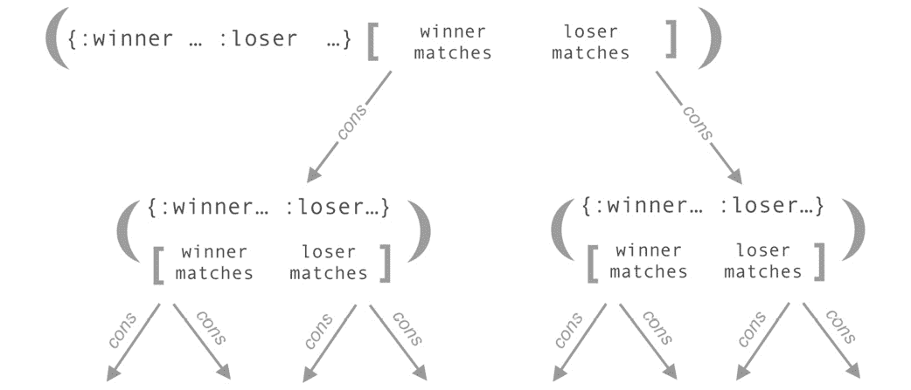
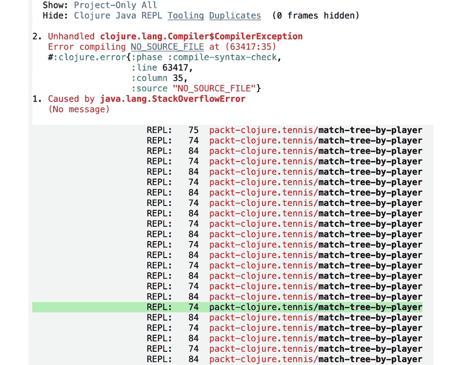
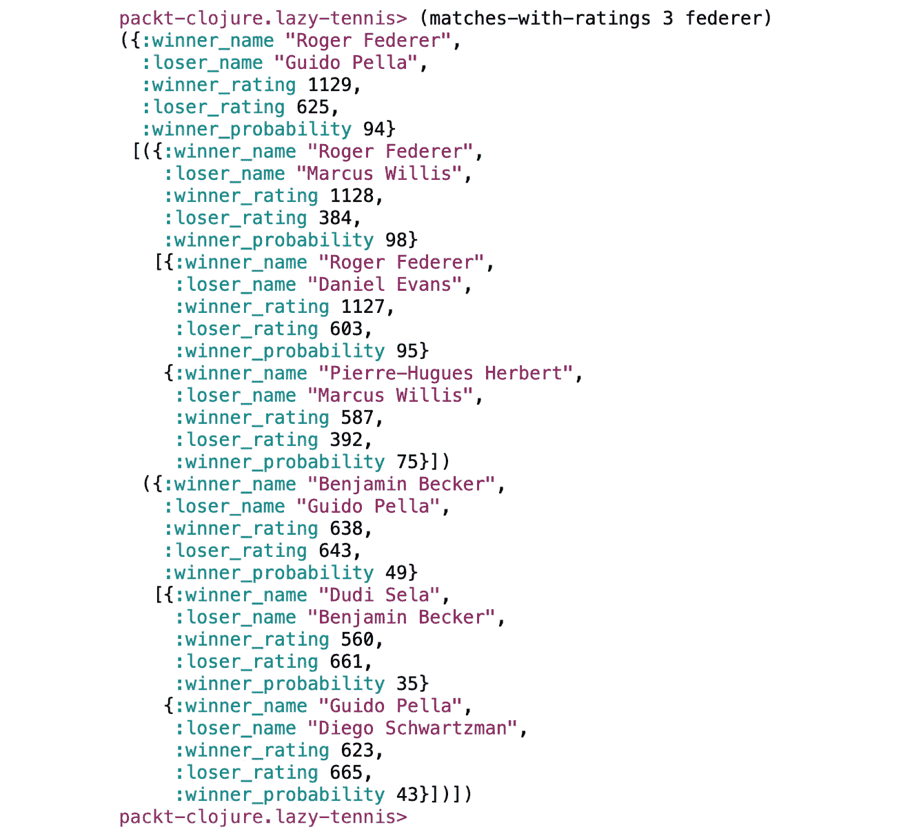
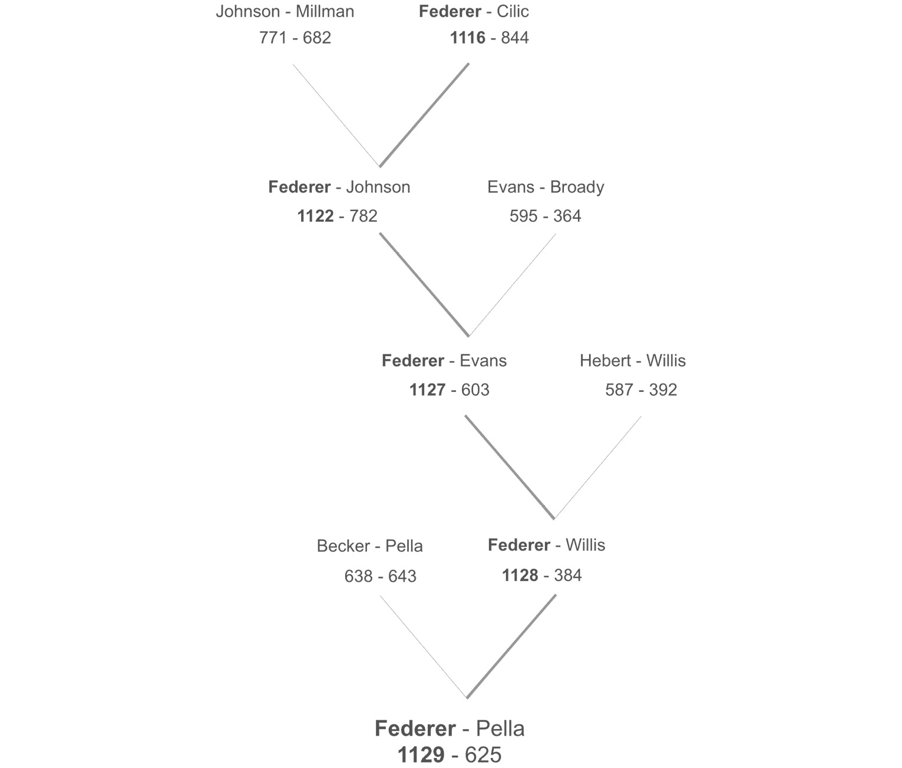

# 第七章：7. 递归 II：惰性序列

概述

在本章中，随着我们继续探索递归技术，我们将重点关注惰性评估。我们将编写能够安全地产生可能无限长的惰性序列的函数，使用惰性评估来消费线性数据，从线性数据中产生惰性评估的树结构，并编写消费树结构的函数。

到本章结束时，你将能够思考新的理解和解决问题的方法。

# 简介

在最简单的情况下，一个 **惰性序列** 是两件事物的混合体：

+   一个包含零个或多个项的 *列表*（不是向量！）

+   对列表可能未来项的 *引用*，这些项在必要时可以计算

换句话说，有一个实部和虚部。大多数时候，你不需要考虑这种区别。这正是惰性序列的全部意义：当你需要时，虚部才会变成实部。如果你可以避开边缘情况，你就不需要担心虚部，因为一旦需要，它就会变成实部。

在过去的几章中，我们已经以许多不同的方式使用了惰性序列。它们是 Clojure 的重要、独特特性，作为 Clojure 程序员，你每天都会用到它们。到现在为止，你已经看到它们是类似列表的结构，但有所区别：当你使用列表的第一个元素时，列表的其余部分在运行时可能不存在。记住，在惰性序列中，各个项只有在需要时才会被计算。或者，用 Clojure 的术语来说，它们只有在被消费时才会被实现。你可以定义一个可能无限的惰性序列，然后只使用和计算前三个项。

到目前为止，我们使用的惰性序列是由核心 Clojure 函数返回的，例如 `iterate`，我们在 *第六章*，*递归和循环* 中简要介绍了它，或者熟悉的功能，例如 `map` 和 `filter`，我们在 *第四章*，*映射和过滤* 中看到了它们。在这个路径上的下一步是学习编写自己的函数来产生惰性序列。

当在 Clojure 中工作时，惰性序列被频繁使用，正如你现在所看到的。编写函数来构建你自己的惰性序列是一个高级步骤，更容易出错。在处理序列时，它应该被视为最后的选项。以下是在决定解决序列相关问题时使用哪种技术的大致指南：

+   当处理顺序数据时，`map`、`filter` 和 `remove` 这些接受和返回序列的函数将是你所需要的所有。

+   `reduce`，因为你的计算需要考虑数据中项之间的关系，或者因为你需要产生一个汇总结果。

+   `recur`），或者因为你的数据是非线性的，例如 `树` 或 `图`。

+   **选项 4**：在选项 3 的某些子集情况下，输入数据极其庞大，或者你的计算产生了太多的分支。结果是调用栈溢出。在这种情况下，惰性序列是一个解决方案。

每向下移动一步列表，程序员的努力和代码复杂性都会增加。当你接近列表的起始位置时，Clojure 提供了更多的帮助和防止潜在错误的能力。当你进一步向下移动列表时，你必须更加注意你解决方案的实现方式。成为一名有效的 Clojure 开发者的一部分是知道如何在可能的情况下避免选项 3 和 4，并在真正需要时有效地使用它们。对于某些类型的问题，例如解析深层嵌套的数据结构，惰性序列是一个非常好的选择，可能是 Clojure 中唯一实用的解决方案。这就是为什么它是一项重要的技能。还有另一个好处。了解惰性序列是如何产生的，将使你对它们的工作原理有更深入的理解。

在本章中，我们将首先使用惰性序列来处理线性数据，然后再转向更复杂的树结构。

# 一个简单的惰性序列

首先，让我们考虑最简单的惰性序列生产者，即 `range` 函数，它简单地返回一个可能无限的一系列连续整数。编写它的最简单方法是使用 `iterate`：

```java
(defn iterate-range [] (iterate inc 0))
```

在这里，`iterate` 返回一个以初始化值零开始的序列，然后继续调用 `inc` 函数的结果，然后是那个结果，以此类推。每个中间值都成为返回的惰性序列中的一个项。它工作得很好：

```java
user> (take 5 (iterate-range))
(0 1 2 3 4)
```

`iterate` 函数正在做所有的工作。我们本可以在这里停止，但我们不会学到很多关于惰性序列是如何构建的。这是一个更底层的版本，执行相同的任务。它使用 `lazy-seq` 宏，这是所有惰性序列的基础：

```java
user> (defn our-range [n]
        (lazy-seq
          (cons n (our-range (inc n)))))
#'user/our-range
```

这个函数可能看起来对你来说很奇怪。我们将详细分解它。在我们这样做之前，让我们确保它工作正常：

```java
user> (take 5 (our-range 0))
(0 1 2 3 4)
```

这里有三点引人注目。

+   `lazy-seq` 的使用。这就是“魔法”发生的地方。注意，`lazy-seq` 包装了函数的整个主体。

+   `cons` 的使用。`cons` 函数的名字可以追溯到 Lisp，它比 Clojure 要古老得多。`cons` 是一个连接两个东西的函数。在大多数 Lisp 方言中，列表是通过使用 `cons` 将一个项目连接到列表的其余部分来构建的。在这里使用 `cons` 意味着我们在返回一个这样的列表。

+   递归的使用。没有 `lazy-seq`，这个递归调用将立即执行，并且持续执行，直到栈溢出。有了 `lazy-seq`，下一个调用不会发生；相反，返回了对那个未来调用的引用。

函数的结构反映了它产生的数据结构：

![图 7.1：函数结构

![图片 B14502_07_01.jpg]

图 7.1：函数结构

多亏了 `lazy-seq`，递归调用变成了引用。

在左侧，我们有实部；在右侧，有虚部。随着序列的消耗，越来越多的对 `our-range` 的虚拟调用变成了实际调用。对进一步虚拟调用的引用保持在列表的末尾，以便在需要更多整数时准备就绪。

注意

未来尚未实现的计算通常被称为 `thunk`。这个词听起来像已经思考过的事情，但实际上是尚未被 "`thunk`" 的事情。

这只是懒序列最简单可能的版本，但它足以提供一个基本模式的概念，我们将在此基础上继续扩展。

## 消耗序列

如 `our-range` 这样的迭代序列接受单个输入，并通过在输入上调用一个函数来构建序列，然后是第一个函数调用的结果，然后是那个调用的结果，依此类推。虽然这种计算有时可能很有用，但更常见的是我们的代码需要接受某种类型传入的数据。

实现这种模式的组合了懒序列的迭代风格和前一章中的递归函数。与其他形式的递归一样，这些函数将围绕条件构建，通常是 `if` 或 `cond`，并通过处理输入序列的第一个项目并在其余输入上再次调用自己来前进。并且像 `our-range` 一样，它们通常使用 `cons` 构建输出，将当前项目附加到一个指向未来可能计算的列表上。

## 练习 7.01：寻找拐点

在这个练习中，我们正在构建一个分析用户 GPS 手表数据的工具。跑步者和徒步旅行者想知道他们在上山或下山时花费了多少时间。传入的数据是一个可能无限长的元组序列，包含海拔（以米为单位）和时间戳，即用户开始锻炼以来的毫秒数。

每个元组看起来如下所示：

```java
[24.2 420031]
```

我们需要遍历输入序列，寻找局部峰值或谷值，即海拔高于前后点的点（峰值），或低于前后点的点（谷值）。我们本可以使用 `reduce` 来代替，就像我们在第五章 *多对一：归约* 中为自行车比赛问题所做的那样。然而，输入流可能非常非常长，所以我们不想强制评估，这就是使用 `reduce` 会发生的事情。

1.  定义一些符合要求格式的样本数据。您可以在[`packt.live/2Rhcbu6`](https://packt.live/2Rhcbu6)找到这个变量：

    ```java
    (def sample-data
      [[24.2 420031]
       [25.8 492657]
       [25.9 589014]
       [23.8 691995]
       [24.7 734902]
       [23.2 794243]
       [23.1 836204]
       [23.5 884120]])
    ```

1.  通过比较三个连续的项目可以检测到峰值或谷值。编写一个用于检测峰值或谷值的谓词。

    当我们遍历海拔-时间元组的列表时，我们将查看当前项和接下来的两个项目，以识别峰值和山谷。在三个项目的子序列中，如果中间项大于第一个和最后一个，它是一个峰值；如果它小于两者，它是一个山谷。在其他所有情况下，中间项既不是峰值也不是山谷。我们将编写两个函数，`local-max?`和`local-min?`，将这个逻辑转换为函数：

    ```java
    (defn local-max? [[a b c]]
      (and (< (first a) (first b)) (< (first c) (first b))))
    (defn local-min? [[a b c]]
      (and (> (first a) (first b)) (> (first c) (first b))))
    ```

    如果我们想要通过一些解构来清理我们的代码，我们可以避免所有那些`first`调用。函数将接受一个包含三个项目的单列表。每个项目是一个包含两个项目的元组。通过两层解构，我们可以提取所需的元素而不调用任何函数：

    ```java
    (defn local-max? [[[a _] [b _] [c _]]]
      (and (< a b) (< c b)))
    (defn local-min? [[[a _] [b _] [c _]]]
      (and (> a b) (> c b)))
    user> (local-max? (take 3 sample-data))
    false
    user> (local-min? (take 3 sample-data))
    false
    ```

    如果我们在`sample-data`中向前移动两个项目，我们会发现一个山谷。第三个、第四个和第五个项目是`[25.9 589014]`、`[23.8 691995]`和`[24.7 734902]`。中间的值小于第一个和最后一个：

    ```java
    user> (local-min? (take 3 (drop 2 sample-data)))
    true
    ```

1.  概述递归函数。正如我们讨论的那样，我们的函数将与迄今为止我们看到的大多数递归函数具有相同的基本形状。对于我们的条件，我们需要处理四种情况。在此之前，我们必须创建一个对`current-series`的局部绑定，它将是`data`中的前三个项目。

    由于我们只是在布局函数，所以我们目前将返回不同的关键字而不是真实值：

    ```java
    (defn inflection-points [data]
      (lazy-seq
        (let [current-series (take 3 data)]
          (cond (< (count current-series) 3)
                :no-more-data-so-stop
                (local-max? current-series)
                :peak
                (local-min? current-series)
                :valley
                :otherwise
                :neither-so-keep-moving))))
    ```

    在`cond`表达式的第一个测试中，我们检查是否已经没有数据了，这可以通过检查`current-series`的长度来完成。如果`current-series`不包含三个项目，那么我们知道我们永远不会找到峰值或山谷，所以是时候停止了。像往常一样，我们首先放置这个条件，这样在随后的测试中我们可以确保至少有一些数据。接下来的两个测试使用我们之前定义的谓词：`local-max?`和`local-min?`。在这些情况下，我们将当前值添加到累积的`data`中。最后一种可能性是当前项既不是最小值也不是最大值。在这种情况下，我们对那个特定的项不感兴趣，所以我们将继续而不将其放入累积数据中。

1.  现在，我们可以开始决定这四种情况中的每一种会发生什么。第一种情况，当我们没有数据时，是最简单的，但也许也是最令人惊讶的。在这里，我们只是返回一个空列表：

    ```java
    (< (count current-series) 3)
    '()
    ```

    基于`recur`递归，这样做是没有意义的：在输入数据结束时返回一个空列表意味着该函数总是返回…一个空列表。实际上并不太有用。

    然而，对于惰性序列，最后一个项目仅仅是将要返回的列表的结尾。在许多情况下，整个列表不会被消耗，输入序列的结尾也永远不会到达。如果我们把惰性序列看作是一系列指向潜在计算的指针，那么这里的空列表仅仅是最后一次潜在计算的结果。

    重要的是，这应该是一个空列表，而不是，例如，一个空向量。向量不支持惰性。

1.  下两个情况是当`local-max?`或`local-min?`决定`current-series`中的第二个项目确实是一个峰值或谷值时。当这种情况发生时，我们需要做两件事。首先，我们需要通过添加适当的关键字将元组标记为峰值或谷值；其次，我们需要确保这个元组成为输出序列的一部分。

    添加关键字很简单：

    ```java
    (conj (second current-series) :peak)
    ```

    由于每个项都是一个包含两个值的元组，`conj`会将其转换为包含三个值的元组：

    ```java
    [24.7 734902 :peak]
    ```

    注意

    当使用`conj`时，总是要小心你正在使用什么类型的序列。当对一个向量调用时，`conj`会将新项追加到向量的末尾。当对一个列表调用时，它将追加到开头。这可能会让人惊讶，但有一个原因：`conj`总是以最有效的方式添加新项，这取决于所使用的数据结构。对于向量来说，这意味着添加到末尾；对于列表来说，这意味着添加到开头。

1.  接下来，我们需要将这个新值纳入将要返回的序列中。而不是像使用`recur`时那样将其放置在某种累加器中，当前项变成了所有剩余待计算项的列表的头部。这正是`cons`函数所做的事情。而“所有剩余待计算项的列表”在这里是通过递归调用`inflection-points`来表示的：

    ```java
    (local-max? current-series)
    (cons
      (conj (second current-series) :peak)
      (inflection-points (rest data)))
    (local-min? current-series)
    (cons
      (conj (second current-series) :valley)
      (inflection-points (rest data)))
    ```

    这样想吧。在右边，你看到了所有剩余的项。`inflection-points`的调用最终会返回它们，至少是潜在地。正如我们所说的，当前项是这个列表的头部。在左边，是已经计算过的项。就在当前项左侧的那个，将成为一个列表的头部，其中第二个项是当前项。以此类推，直到列表的起始位置。一个项通过调用一个函数与右边链接，而与左边链接是因为对该项调用了函数。

    注意

    递归可能难以理解。不用担心！随着练习，它会变得更容易。

    当使用`recur`时，我们倾向于将结果放置在递归函数下一次调用的参数中。我们将对`current-series`参数这样做。因为这个函数将返回一个惰性序列，我们将使用`cons`并将当前项放在潜在的结果集的前面。每次函数调用都返回列表的一部分，父调用可以将这部分整合到它返回的内容中。

1.  最后一个条件是最不有趣的：忽略当前项并继续到下一个。我们以现在熟悉的方式在`inflection-points`的下一个递归调用中从数据中移除一个项来做这件事：

    ```java
     :otherwise
    (inflection-points (rest data))
    ```

    这里是完整的函数：

    ```java
     (defn inflection-points [data]
      (lazy-seq
        (let [current-series (take 3 data)]
          (cond (< (count current-series) 3)
                '()
                (local-max? current-series)
                (cons
                  (conj (second current-series) :peak)
                  (inflection-points (rest data)))
                (local-min? current-series)
                (cons
                  (conj (second current-series) :valley)
                  (inflection-points (rest data)))
                :otherwise
                (inflection-points (rest data))))))
    ```

1.  使用我们在开头定义的`sample-data`变量测试函数：

    ```java
    user> (inflection-points sample-data)
    ([25.9 589014 :peak]
     [23.8 691995 :valley]
     [24.7 734902 :peak]
     [23.1 836204 :valley])
    ```

1.  使用 Clojure 的`cycle`函数将`sample-data`转换成一个我们的慢跑者反复跑过的电路：

    ```java
    user> (take 15 (inflection-points (cycle sample-data)))
    ([25.9 589014 :peak]
     [23.8 691995 :valley]
     [24.7 734902 :peak]
     [23.1 836204 :valley]
     [25.9 589014 :peak]
     [23.8 691995 :valley]
     [24.7 734902 :peak]
     [23.1 836204 :valley]
     [25.9 589014 :peak]
     [23.8 691995 :valley]
     [24.7 734902 :peak]
     [23.1 836204 :valley]
     [25.9 589014 :peak]
     [23.8 691995 :valley]
     [24.7 734902 :peak])
    It just keeps going and going!
    ```

    `cycle`返回一个无限重复`seq`的惰性序列。

这个练习介绍了你将在大多数生成惰性序列的函数中找到的基本结构。通过使用`cons`将其添加到下一个递归调用中，使当前成为未来计算列表的头部，这就是惰性序列递归的精髓。随着我们向前推进，周围的代码可能会变得更加复杂，但这个操作将是所有我们将要编写的生成惰性序列函数的构建块。

## 练习 7.02：计算移动平均值

为了将此付诸实践，让我们想象一个与上一章中提到的杂货传送带类似的场景。不过这次，我们正在对我们超级商店接收到的土豆进行质量控制。土豆在通过一个门时被称重。只要平均值保持在一定的范围内，我们就可以继续接收土豆。即使有一些小的土豆或几个大的土豆，只要大多数土豆都在限制范围内就可以。如果平均值过高或过低，那么肯定出了问题，因此我们将停止接收土豆。

1.  启动一个新的 REPL。

1.  首先，我们需要模拟一个土豆来源。我们需要定义一个随机土豆生成函数。我们将使用与杂货店相同的技术来生成无限序列的随机值，使用`repeatedly`和`rand-int`。在这个版本中，我们添加了`10`，这将作为极端最小土豆尺寸。这样我们的生成器将产生`10`到`400`克的土豆：

    ```java
    user> (def endless-potatoes (repeatedly (fn [] (+ 10 (rand-int 390)))))
    #'user/endless-potatoes
    ```

1.  使用`take`测试这个惰性序列。你将自然得到不同的随机数：

    ```java
    user> (take 5 endless-potatoes)
    (205 349 97 250 18)
    user> (take 10 endless-potatoes)
    (205 349 97 250 18 219 68 186 196 68)
    ```

    注意到两次的前五个元素都是相同的。这些项目已经被实现。新的土豆生成只会在序列中更远的地方计算更多项目时发生。

    现在我们来到了第一个设计挑战。我们需要一种方式来表示列表中每个项目的当前平均值。除了当前土豆的重量外，我们还需要该点在序列中的土豆数量以及到目前为止的总重量。我们可以使用一个包含三个值的元组来保存这三个值。如果列表中的第五个土豆重量为`200`克，而前五个土豆的总重量为`784`克，那么这个土豆可以这样表示：

    ```java
    [200 5 784]
    ```

    由于我们有了项目数量和总数，这种设计使我们能够轻松地在序列中的任何一点计算平均值。

1.  要找到三个项目后的平均值，我们会从序列中取出三个项目，如果我们的函数返回如下所示：

    ```java
    ([59 1 59] [134 2 193] [358 3 551])
    ```

    将到目前为止的总重量`551`除以土豆数量`3`，将给出当前的平均值，在这个例子中是`179.33333`。

    我们已经有了设计，但还需要实现它。让我们来看看选择序列处理技术的选项。`map`在这里不可用，因为我们需要累积数据。《第四章》中提到的`map`窗口模式听起来可能可以完成这项工作，但它不能从序列的一端累积数据。“窗口”仅限于几个列表项。那么也许`reduce`是答案？不幸的是，`reduce`不是惰性的：整个序列会立即实现。在某些情况下这可能可以接受，但在这个情况下我们不知道输入会有多长。

    这就留下了递归。我们不能使用`recur`，原因和不能使用`reduce`一样：我们可能正在处理一个几乎无限的流。这也意味着没有`recur`的标准递归会在我们处理完第一吨土豆之前就崩溃。因此，我们将使用`lazy-seq`来产生不同的计算。

1.  从一个返回惰性序列的函数骨架开始，使用`lazy-seq`宏来包装递归函数的内容：

    ```java
    (defn average-potatoes [prev arrivals]
      (lazy-seq
        ))
    ```

    `prev`参数将开始为一个空向量。我们将使用它将当前总重量传递给下一次计算。

1.  使用上一章学到的模式填写递归函数的内容，从停止递归的条件开始，即当输入被耗尽时。与设计为无限继续的函数不同，例如`range`和`average-potatoes`，只有当它还有输入时才会继续，因此我们需要检查是否还有剩余的内容：

    ```java
    (defn average-potatoes [prev arrivals]
      (lazy-seq
        (if-not arrivals
          '()
          )))
    ```

    在这里，我们看到与上一个练习相同的模式。当我们到达列表的末尾时，我们返回一个空列表。

    注意

    这里也可以返回`nil`，因为`cons`在这里将`nil`视为空列表。试着在你的 REPL 中运行`(cons 5 nil)`。空列表在这里更好地告诉我们发生了什么。

1.  在执行递归之前计算当前项。在这里我们将使用`let`绑定，因为我们需要当前项两次：一次作为列表中的一个项，另一次作为`prev`参数，这将是我们计算下一个土豆总重量的基础：

    ```java
    (defn average-potatoes [prev arrivals]
      (lazy-seq
        (if-not arrivals
          '()
          (let [[_ n total] prev
                current [(first arrivals)
                          (inc (or n 0))
                          (+ (first arrivals) (or total 0))]]
            ;; TODO: the actual recursion
            ))))
    ```

    `let`绑定的第一部分使用了一些解构来从`prev`参数中获取当前的计数和到目前为止的总数。我们不需要前一个土豆的重量，因为它已经包含在运行总和中，这就是为什么我们为那个值使用了下划线。

    通过下一个绑定，我们构建实际的元组，它将成为序列中的一个项。这里的唯一复杂性是`n`和`total`可能为`nil`，因此我们必须检查这一点，并在它们为`nil`时提供`0`。元组的第一个项只是当前土豆的重量；第二个项是我们将用于计算平均值的计数；最后一个项是到目前为止所有土豆的总重量。

1.  添加递归逻辑：

    ```java
    (defn average-potatoes [prev arrivals]
      (lazy-seq
        (if-not arrivals
          '()
          (let [[_ n total] prev
                current [(first arrivals)
                         (inc (or n 0))
                         (+ (first arrivals) (or total 0))]]
            (cons
              current
              (average-potatoes
                current
                (next arrivals)))))))
    ```

    在最后一步中，我们只是将当前项目附加到由后续对 `average-potatoes` 的递归调用创建的列表中。我们将 `current` 作为 `prev` 参数传递给下一次调用。

    还要注意，我们使用 `next` 而不是 `rest`：这样，当我们到达序列的末尾时，到达将是 `nil`，这正是我们在函数开头使用 `if-not` 测试时所期望的。`next` 函数与我们在前一个例子中使用的 `rest` 非常相似。两个函数都接受一个列表，并返回该列表除了第一个项目之外的所有项目。当列表中没有更多项目时，这两个函数之间的区别是显而易见的。在这种情况下，`rest` 返回一个空列表，而 `next` 返回 `nil`。选择哪一个取决于情况。`next` 的优点是，它很容易测试真值，就像我们在这里做的那样，而不是像我们在上一个练习中使用 `rest` 那样调用 `empty?`。因为 `rest` 永远不会返回 `nil`，所以没有空指针异常的风险。

1.  测试您的新惰性函数。让我们先看看几个单独的项目：

    ```java
    user> (take 3 (average-potatoes '() endless-potatoes))
    ([321 1 321] [338 2 659] [318 3 977])
    ```

    每个元组的第三个元素正确地指示了累积的权重。这部分看起来是正确的。

    现在我们尝试处理大量项目。我们将从长长的土豆列表中取出最后一个元素：

    ```java
    user> (last (take 500000 (average-potatoes '() endless-potatoes)))
    [43 500000 102132749]
    ```

    在 `500,000` 个土豆的情况下，一切似乎仍然按预期工作。

在这个例子中，重要的是要注意使用 `rand-int` 和 `inc` 进行惰性评估的前一个例子之间的区别。使用 `rand-int` 时，每次调用都是相互独立的。惰性评估在这里之所以有用，是因为它允许有一个可能无限长的序列。使用 `inc` 时，当我们实现我们的 `range` 版本时，情况稍微复杂一些，因为每次调用以及序列中的每个项目都依赖于前一次调用的结果。这也适用于 `average-potatoes` 函数：每次调用都依赖于前一次调用中建立的总量和计数，并将此信息传递给下一次调用。同时，它还做了更多的事情，因为每次计算也会消耗输入序列中的一个项目。

核心的 `map` 和 `filter` 函数也这样做：它们的输出长度不超过它们的输入。这又增加了一个使用消耗和产生惰性序列的写函数的理由：它们可以与其他惰性函数一起链接，而无需强制评估。

## 惰性消耗数据

惰性评估是一个接口，它大多数时候都隐藏了用户是否已经执行了计算，或者即将执行计算。这就是我们说惰性序列包含可能延迟的计算的含义。“可能”是因为我们不知道，也不需要知道计算是否已经发生。

然而，要变得有用，延迟评估必须从一次函数调用传递到下一次。如果我们将一个延迟序列传递给函数 A，然后将结果传递给函数 B，依此类推，只有当 A 和 B 被设计为返回延迟序列时，评估才会保持延迟。

例如，假设我们有一个名为 `xs` 的延迟序列。如果它被传递给 `map`，然后是 `filter`，然后是 `take-while`，它将始终保持“延迟”状态。如果我们在这个函数调用链中插入一个 `reduce`，或者如果我们使用 `mapv` 而不是 `map`，延迟性就会消失。

最后，潜在的评估并不足够。你确实需要在某个时候得到一些实际数据！然而，通常在最后保留延迟性是有利的。这意味着避免像这样的事情：

```java
(->> xs
     (map some-func)
     (reduce some-reducing-func)
     (filter some-predicate?))
```

这里，我们取一个序列并使用 `map` 将一个函数应用于每个项。`map` 的调用是延迟的，但 `reduce` 的调用不是，所以整个序列被实现。然后，`filter` 会丢弃一些结果。根据函数执行的操作，这可能是有可能编写此代码的唯一方法。然而，理想情况下，我们会在调用 `reduce` 或任何其他不保留延迟性的函数之前，尽可能使用 `filter` 来缩小数据。

```java
(->> xs
     (map some-func)
     (filter some-predicate?)
     (take-while another-predicate?)
     (reduce +))
```

这种模式的第一个优点是代码变得更简单。`filter` 和 `take-while` 可能已经移除了一些 `reduce` 调用根本不需要处理的数据类型。通过等到最后一刻才强制序列完全实现，实际上可能需要做的计算工作更少。

为了了解这可能如何工作，让我们看看这个简单的表达式：

```java
(nth (filter even? (range)) 3)
```

评估从 `(range)` 开始，如果 `range` 不是延迟的，它将返回从零到无穷大的所有整数。换句话说，CPU 使用率会达到 100%，评估会在出现错误时停止。

尽管如此，我们可以想象 `(range)` 的返回值看起来像这样：


图 7.2：范围值的表示

一个未实现的延迟序列：一个起点和一个指向未来计算的指针。

这比从零计数到无穷大要少得多的工作。本质上是一个指向计算序列其余部分的指令的指针，如果需要的话。

然而，我们不需要所有的整数，只需要偶数：

```java
(filter even? (range))
```

通过这个 `filter` 调用，我们创建了一个基于第一个的第二个延迟序列：


图 7.3：创建第二个延迟序列

通过添加 `filter`，我们创建了一个新的延迟序列，它仍然只包含一个实际的数据项。

我们目前拥有的唯一具体数据仍然是零。我们所做的只是增加了获取序列其余部分的指令。到目前为止，一切都是虚拟的。

然后，最后，我们调用 `nth` 并请求序列中的第四个项：

```java
user> (nth (filter even? (range)) 3)
6
```

现在，一切都变了。我们需要前四个项的真实值。`nth` 导致 `filter` 序列的前四个项被评估。为此，`filter` 需要评估 `range` 序列的前七个项。突然，`(range)` 看起来像这样：


图 7.4：范围内的当前值

前七个项已经实现。序列的其余部分仍然是虚拟的。

And `(filter even? (range))` looks as follows:


图 7.5：从范围内过滤偶数

列表中的第四个值现在可以像任何其他值一样被消费。

这里要理解的重要事情是：在这些序列中的最后一个元素是指向进一步潜在计算的指针。`filter` 和 `range` 一起工作，只为 `nth` 提供足够的数据，不再更多。通过从函数到函数传递指针（或“未来计算的指令”），最终消费者可以向上发送信号，从指针到指针，以获取必要的数据。

注意

Clojure 中的懒序列实际上被实现为**分块序列**。这是一个实现细节：作为一个优化，Clojure 有时实现比实际需要的更多项。虽然这是值得了解的，但这不应该有任何影响。这只意味着你不能指望一个项*不*被实现。

The capacity to avoid performing certain calculations until the last millisecond, or to avoid them entirely, is an important feature of lazy computation. There is another aspect that can be equally important: the ability to "forget" some of the calculations that have already been performed.

Consider a non-lazy Clojure collection, such as a vector. Whatever size the vector is, the entire vector is available in memory at the same time. When the program no longer needs the vector, the platform on which the program is running, the JVM or a JavaScript engine, has a garbage collector that will free up the memory occupied by the vector. But if the program still needs even just one item from that vector, the garbage collector will keep waiting until it can safely reclaim that memory space.

懒序列的行为方式完全不同。它不是一个单一实体，而是一系列链接的实体，每个实体都指向下一个。正如我们所看到的，这就是懒序列甚至可以引用尚不存在或可能永远不会存在的项的方式。然而，方程式中的另一个重要部分是。如果不再需要序列的第一个部分，懒序列也会被垃圾回收。

在最后一个例子中，我们正在寻找范围内的第四个偶数。那么，如果我们正在寻找第七百万个偶数呢？

```java
user> (nth (filter even? (range)) 7000000)
14000000
```

在这种情况下，没有必要保留对由`(range)`产生的最初 13,999,999 个整数的引用。这意味着它们可以被安全地垃圾回收。

懒序列的这个特性意味着它们可以用来处理那些一次性无法全部装入计算机内存的数据集。通过“忘记”第一部分并且不立即计算最后一部分，Clojure 可以处理极其长的序列，同时只使用包含它们所需内存的一小部分。然而，这里有一个限制。

如果一个程序保持对序列开头的引用，那么它就不再可以被垃圾回收。通常情况下，这不会有什么影响，但面对非常长的序列时，这成为一个重要的考虑因素。在整个章节中，你可能注意到我们经常在函数内部重复使用像`(first my-seq)`这样的表达式，尽管使用局部的`let`绑定可能更有诱惑力。这是避免阻止序列被垃圾回收的引用的一种方法。

# 懒树

到目前为止，我们已经看到懒序列的“懒”特性是它们可以指向未来的计算，这些计算只有在必要时才会执行。还有一个同样重要的优点，我们现在将要探讨。记得在*第六章*，*递归和循环*中，Clojure 中的递归函数需要使用`recur`来避免栈溢出吗？还记得`recur`只与特定类型的递归一起工作，即尾递归，其中下一个对递归函数的调用可以完全替换上一个调用吗？问题，你可能会记得，是只有有限的栈帧可用。树根节点的函数调用需要等待所有对子节点、孙节点、曾孙节点等的调用都完成。栈帧是一种有限的资源，但我们需要操作的数据通常非常庞大。这种不匹配是一个问题。

这就是懒评估发挥作用的地方。使用懒评估，Clojure 本身处理下一个计算的链接，而不是调用栈。这样，当我们使用递归函数遍历整个树时，我们不再试图使用栈来映射树的结构。相反，懒序列本身完成所有跟踪哪些结果需要返回给哪些函数的工作。

## 练习 7.03：网球历史树

在这个练习中，我们回到了网球的世界。正如你所记得的，在*第五章*，*多对一：减少*中，我们基于历史数据建立了一个为网球运动员建立 Elo 评分的系统。这些预测在你工作的体育新闻网站上变得很受欢迎。一些读者询问了更多关于 Elo 预测的信息。为了回应你对预测引擎的新兴趣，你的雇主希望前端团队构建一个可视化，展示球员在最近几场比赛中的评分演变。你的任务就是提供必要的数据。

我们可以重用*第五章*，*多对一：减少*中我们所做的大部分工作，用于导入数据和生成评分。不过，需要做一项修改。在*第五章*，*多对一：减少*中，我们只对最终评分感兴趣。我们需要修改之前的代码，逐行追加每场比赛中玩家的当前评分。

1.  设置一个与*活动 5.01*，*计算网球 Elo 评分*中相同的工程，并将你为活动编写的函数复制到一个新文件中。你还需要`match-probability`，`recalculate-rating`和`elo-world-simple`。同时，将`match_scores_1968-1990_unindexed_csv.csv`从[`packt.live/36k1o6X`](https://packt.live/36k1o6X)复制到新项目中。`deps.edn`文件看起来是这样的：

    ```java
    {:paths ["src" "resources"]
     :deps
     {org.clojure/data.csv {:mvn/version "0.1.4"}
      semantic-csv {:mvn/version "0.2.1-alpha1"}
      org.clojure/math.numeric-tower {:mvn/version "0.0.4"}}}
    ```

    命名空间声明应如下所示：

    ```java
    (ns packt-clojure.lazy-tennis
      (:require [clojure.math.numeric-tower :as math]
                [clojure.java.io :as io]
                [clojure.data.csv :as csv]
                [semantic-csv.core :as sc]))
    ```

1.  修改`elo-world-simple`，使得每行（每个匹配）都被保留，并且记录下两位玩家的评分。

    添加存储每场比赛玩家评分的能力，在比赛时，相当简单。所有更改都发生在函数的末尾。从调用`reduce`的初始化映射开始。

    在`elo-world-simple`中，`reduce`函数的调用如下（为了简洁，省略了减少函数的内容）：

    ```java
    (reduce (fn [{:keys [players] :as acc} {:keys [winner_name winner_slug
                                                   loser_name loser_slug] :as match}]
              ;; TODO: content temporarily unavailable
              )
            {:players {}
             :match-count 0
             :predictable-match-count 0
             :correct-predictions 0})
    ```

1.  在新版本中，我们将用`:matches`字段替换`:match-count`字段，其初始值将是一个空向量：

    ```java
    (reduce (fn [{:keys [players] :as acc} {:keys [winner_name winner_slug
                                                   loser_name loser_slug] :as match}]
              ;; TODO: your content will be restored shortly
              )
            {:players {}
             :matches []})
    ```

1.  要计算`elo-world-simple`版本中的比赛数量，对于 CSV 文件中的每一行，我们只需在累加器中增加`:match-count field`，如下所示：

    ```java
    (-> acc
        ;; TODO: more missing code
        (update :match-count inc))
    ```

1.  在这个版本中，我们需要将当前比赛（带有已经计算出的`winner-rating`和`loser-rating`）附加到不断增长的比赛列表中。以下是修改`acc`的完整系列。新部分是提供给`update`的匿名函数：

    ```java
    (-> acc
        (assoc-in [:players winner_slug] (recalculate-rating k winner-rating winner-probability 1))
        (assoc-in [:players loser_slug] (recalculate-rating k loser-rating loser-probability 0))
        (update :matches (fn [ms]
                           (conj ms (assoc match
                                           :winner_rating winner-rating
                                           :loser_rating loser-rating)))))
    ```

1.  将函数重新组合起来。为了清晰起见，让我们将其重命名为`elo-db`。由于我们只关心比赛列表，我们可以删除所有专门用于计算正确预测数量的代码。最后，在调用`reduce`之后，我们将在`->`线程宏中添加两个额外的调用：

    ```java
    (->>
      ;; calls to reduce, etc.
      :matches
      reverse)
    ```

    `:matches`关键字作为一个函数，从`reduce`返回的映射中提取匹配列表。我们还需要`reverse`匹配的顺序，因为我们要运行的查询是从现在开始，向过去推进的。

    这给我们提供了函数的最终状态：

    ```java
    tennis_history.clj
    16 (defn elo-db
    17   ([csv k]
    18    (with-open [r (io/reader csv)]
    19      (->> (csv/read-csv r)
    20           sc/mappify
    21           (sc/cast-with {:winner_sets_won sc/->int
    22                          :loser_sets_won sc/->int
    23                          :winner_games_won sc/->int
    24                          :loser_games_won sc/->int}
    The full code for this step can be found at https://packt.live/2GffSKv
    ```

    在 REPL 中，运行此函数对 CSV 文件进行处理，并将匹配结果存储在一个变量中：

    ```java
    packt-clojure.lazy-tennis> (def ratings (elo-db "match_scores_1991-2016_unindexed_csv.csv" 35))
    #'packt-clojure.lazy-tennis/db
    ```

    我们可以验证评分是否可用：

    ```java
    packt-clojure.lazy-tennis> (map #(select-keys % [:winner_rating :loser_rating]) (take 5 ratings))
    ({:winner_rating 985.2418497337458, :loser_rating 927.9839328429639}
     {:winner_rating 1265.3903009991964, :loser_rating 875.8644912132612}
     {:winner_rating 1012.6267015729657, :loser_rating 969.5966741618663}
     {:winner_rating 1311.801159776237, :loser_rating 1002.1872608853402}
     {:winner_rating 853.6200747439426, :loser_rating 950.2283493122825})
    ```

    在有了这些数据之后，我们就可以编写搜索和提取信息的函数了。

1.  编写一个函数来测试玩家是否在给定的比赛中是赢家或输家。

    我们需要能够跳过我们不感兴趣的匹配，所以这是一个常见的测试。将其制作成一个自己的谓词函数会使我们的代码更容易阅读。你可能会从*第四章*，*映射和过滤*中认出这个模式，使用 Clojure 集合：

    ```java
    (defn player-in-match? [{:keys [winner_slug loser_slug]} player-slug]
      ((hash-set winner_slug loser_slug) player-slug))
    packt-clojure.lazy-tennis> (player-in-match? (first ratings) "gael-monfils")
    "gael-monfils"
    packt-clojure.lazy-tennis> (player-in-match? (first ratings) "boris-becker")
    nil
    ```

1.  现在我们已经准备好编写递归函数来搜索匹配列表。从一个简单的骨架开始：

    ```java
    (defn match-tree-by-player [m player-name]
      (lazy-seq
        (cond (empty? m)
              ;; No more matches
              (player-in-match? (first m) player-name)
              ;; Build the tree!
              ::otherwise
              ;; Keep walking through the tree
              )))
    ```

    就像所有消耗另一个序列的递归函数一样，这个函数的结构围绕一个条件。这里我们有测试而没有相应的代码。我们现在需要做的就是填补空白！

1.  从最后一个条件开始，即当前匹配不包含我们要找的玩家。

    在这种情况下，我们忽略当前记录，继续沿着输入列表移动，递归地对剩余项调用`match-tree-by-player`：

    ```java
     (match-tree-by-player (rest m) player-slug)
    ```

1.  再次强调，基本模式应该是相当熟悉的：`cons`会将当前项——当前匹配项——连接到稍后要计算的其余部分。然而，这次我们遇到了一个新的问题：我们需要继续搜索当前比赛中获胜者和失败者所打的匹配。这意味着有两个独立的搜索，也就是对`match-tree-by-player`进行两次独立的递归调用。由于我们有两个东西，我们需要将它们放入某个东西中。在这种情况下，向量通常是一个不错的选择。以下是代码：

    ```java
    (cons (first ms)
          (cons
            [(match-tree-by-player (rest ms) (:Winner (first ms)))
             (match-tree-by-player (rest ms) (:Loser (first ms)))]
            '()))
    ```

    对那个`cons`的第二次调用感到惊讶吗？它在那里是因为我们需要向输出添加不止一个项目。我们添加当前匹配，然后是包含两个新树头部的向量。在向量内部，只有当需要时才会执行对`match-tree-by-player`的两个调用。

    最后的`'()`是必要的，因为`cons`需要一个集合作为第二个参数。

1.  添加当`m`为空时的代码。

    就像上一个例子一样，我们提供一个空列表，以便懒序列最终有一个结束的地方。

    现在我们可以看到完整的函数：

    ```java
    (defn match-tree-by-player [m player-slug]
      (lazy-seq
        (cond (empty? m)
              '()
              (player-in-match?  (first m) player-slug)
              (cons (first m)
                    (cons
                      [(match-tree-by-player (rest m) (:winner_slug (first m)))
                       (match-tree-by-player (rest m) (:loser_slug (first m)))]
                      '()))
              ::otherwise
              (match-tree-by-player (rest m) player-slug))))
    ```

1.  测试这个函数。让我们从一个我们知道不在匹配记录中的玩家开始：

    ```java
    packt-clojure.tennis> (match-tree-by-player ratings "non-tennis-player")
    ()
    ```

    我们得到一个空列表，这正是我们想要的。

    现在让我们尝试从“数据库”中选取一个玩家（这是那些你真的希望将结果附加到变量上而不是试图将所有内容打印到 REPL 中的时刻之一）：

    ```java
    packt-clojure.tennis> (def federer (match-tree-by-player ratings "roger-federer"))
    #'packt-clojure.lazy-tennis/federer
    packt-clojure.lazy-tennis> (type federer)
    clojure.lang.LazySeq
    ```

    我们可以检查第一个项目以查看我们的数据是否真的在那里：

    ```java
    packt-clojure.lazy-tennis> (:winner_rating (first federer))
    1129.178155312036
    ```

    到目前为止，一切顺利！

让我们退后一步，思考一下我们在这里创造了什么。如果我们尝试查看列表中有多少项，我们会得到这个：

```java
packt-clojure.lazy-tennis> (count federer)
2
```

这看起来很奇怪。我们知道罗杰·费德勒（Roger Federer）比这打了很多场比赛。`count`函数在这里没有按预期工作，因为它不理解这个分层返回值的结构。`count`能看到的第一项是一个比赛，`cons`到一个向量上。所有其他结果都嵌套在这个向量中。层次结构中的每个项目都共享这种相同的结构。从概念上讲，它看起来像这样：




图 7.6：一个分层数据结构，其中包含在向量中的 cons 箭头是惰性的

在这个图中，惰性发生在向量内部。这两个惰性序列还没有实现。我们可以通过仔细钻入结构来检查这一点：

```java
packt-clojure.lazy-tennis> (realized? (first (second federer)))
false
```

这是一件好事，因为整个结构，如果实现，将会非常大。真的，非常大。隐藏在快速响应时间背后的是一棵树，如果完全实现，最终会在原始列表的数据上重复数千次。尝试从`match-tree-by-player`内部移除`lazy-seq`包装器。结果将类似于这样：




图 7.7：栈溢出——递归调用太多

让我们简要地看看这个错误信息。Clojure 的堆栈跟踪并不总是那么容易阅读，但这个确实包含了一些有趣的信息。大部分是"`Caused by java.lang.stackOverflowError`"这个语句。这就是导致编译器异常并停止我们的代码的原因。在这下面，重复出现的提到`match-tree-by-player`的行告诉我们`match-tree-by-player`一直在反复调用自己。这只是整个堆栈跟踪的一小部分，它会在几个屏幕上继续下去。早些时候，我们谈到了堆栈帧。在这里，每一行都是一个帧。每个函数的调用都在等待下一个函数解决。在某个点上，有太多的函数在相互等待，最终堆栈溢出。

再次强调，惰性评估使我们免于这种情况，并允许我们以复杂的方式遍历数据，并在几行代码中构建非常复杂的数据结构。

## 练习 7.04：自定义 take 函数

前面的练习给了我们一种从我们的线性数据集中提取树的方法。它仍然不允许你做雇主要求的事情，即显示一个有限的树，只显示层次结构中的几个级别。一旦我们有了这个，我们就能展示设计团队想要的任何级别的树。

我们真正需要的是 Clojure 的`take`函数的一个特殊版本，它理解我们的数据结构。我们希望能够编写`(take-matches 4 federer)`并得到一个四层树。

要做到这一点，我们需要解决两个问题。首先，我们需要能够遍历我们创建的树。其次，我们需要一种方法来计算我们遍历的层数。

1.  这个练习建立在之前的练习之上。使用来自 [`packt.live/38Dzp3H`](https://packt.live/38Dzp3H) 的 `tennis_history.clj` 文件或制作一个完整的副本。

1.  从一个只在其第一个参数为零时工作的函数版本开始：

    ```java
    (defn take-matches [limit tree]
      (cond (zero? limit)
            '()))
    ```

    检查它是否工作。为此，你需要上一个练习中的 `federer` 变量：

    ```java
    packt-clojure.lazy-tennis> (take-matches 0 federer)
    ()
    ```

1.  让我们添加请求零个或一个项目的可能性：

    ```java
    (defn take-matches [limit tree]
      (cond (zero? limit)
            '()
            (= 1 limit)
            (first tree)))
    ```

    这种行为重复了上一个练习中的测试。我们只是简单地返回延迟序列中的第一个匹配项。

    尽管如此，进行测试仍然是一个好主意。我们将使用 `select-keys` 来避免产生大量额外的输出数据：

    ```java
    packt-clojure.lazy-tennis> (select-keys (take-matches 1 federer) [:winner_slug :loser_slug])
    {:winner_slug "roger-federer", :loser_slug "guido-pella"}
    ```

1.  当 `limit` 大于一时，添加一个 `:otherwise` 条件：

    ```java
    (defn take-matches [limit tree]
      (cond (zero? limit)
            '()
            (= 1 limit)
            (first tree)
            :otherwise-continue
            (cons
              (first tree)
              (cons
                [(take-matches (dec limit) (first (second tree)))
                 (take-matches (dec limit) (second (second tree)))]
                '()))))
    ```

    这一部分应该看起来很熟悉，因为它与我们最初构建此结构的函数的结构相似，有两层 `cons`，其中第二层附加了一个包含两个更多 `take-matches` 调用的向量。

    通过每次说 `(dec limit)`，未来的 `take-matches` 调用最终会达到零并停止遍历树。

1.  测试完整的函数：

    ```java
    (take-matches 3 federer)
    ```

    由于每个匹配映射中包含的字段太多，结果太长无法在此打印。它们应该具有以下基本结构：

    ```java
    ({}
     [({}
       [{} {}])
      ({}
       [{} {}])])
    ```

    在下一个练习中，我们将使这些结果更容易看到。

## 知道何时使用延迟加载

你可能已经注意到这次我们没有使用 `lazy-seq`。我们应该使用吗？显然，用 `lazy-seq` 宏包装函数体是很容易的。我们是否这样做主要取决于 `take-matches` 函数在我们应用程序内部的使用方式和位置。如果 `take-matches` 是在将数据传递给前端之前的最后一步，那么让它变得延迟加载就没有意义了。我们确信数据大小合理，并且我们需要所有这些数据来生成我们要展示的视觉效果。在这种情况下，使函数变得急切（与延迟加载相反）似乎是一个不错的选择。

另一方面，如果 `take-matches` 将用于其他任务，那么使其延迟加载可能是有意义的。例如，如果我们想提取更多级别的数据，然后对结果执行某种其他类型的操作，延迟评估的好处可能很重要。

我们越来越接近满足雇主的要求。我们可以将树作为延迟序列检索，现在我们可以限制要包含的匹配历史级别的数量。我们唯一剩下的问题是结果难以可视化，即使在 REPL 中也是如此。我们需要能够格式化每个匹配映射。然而，由于树结构，我们不能只是使用 `map` 来转换每个匹配。这就是我们将在下一个练习中实现的内容。

## 练习 7.05：格式化匹配项

我们需要一种方法来访问树中的每一张地图。与其编写一个专门的`map`函数，我们将在`take-matches`函数中添加一个额外的参数，在返回每个匹配项之前调用它。这将使我们能够消除一些不需要向用户展示的数据键。同样，将评分显示为整数而不是浮点数会更好。我们还将添加一个功能：由于我们在比赛前就有每个玩家的评分，我们可以使用`match-probability`函数来显示 Elo 预测。

1.  在上一个练习相同的文件中（或项目的副本中），向`take-matches`函数添加一个函数参数，并在返回比赛之前调用它：

    ```java
    (defn take-matches [limit tree f]
      (cond (zero? limit)
            '()
            (= 1 limit)
            (f (first tree))
            :otherwise-continue
            (cons
              (f (first tree))
              (cons
                [(take-matches (dec limit) (first (second tree)) f)
                 (take-matches (dec limit) (second (second tree)) f)]
                '()))))
    ```

    这实际上非常简单。只需注意不要忘记在最后的两次递归调用中传递`f`参数。格式化函数在树的每一层都需要。

    现在我们可以使用`select-keys`或任何我们想要的格式化函数来调用这个函数。

    为了测试这个，我们将重用前两个练习中的`federer`变量。如果需要，可以像这样重建它，其中`matches`是`elo-db`的输出：

    ```java
    (def federer (match-tree-by-player matches "roger-federer"))
    ```

    让我们看看几个值：

    ```java
    packt-clojure.lazy-tennis> (take-matches 3 federer #(select-keys % [:winner_slug :loser_slug]))
    ({:winner_slug "roger-federer", :loser_slug "guido-pella"}
     [({:winner_slug "roger-federer", :loser_slug "marcus-willis"}
       [{:winner_slug "roger-federer", :loser_slug "daniel-evans"}
        {:winner_slug "pierre-hugues-herbert",
         :loser_slug "marcus-willis"}])
      ({:winner_slug "benjamin-becker", :loser_slug "guido-pella"}
       [{:winner_slug "dudi-sela", :loser_slug "benjamin-becker"}
        {:winner_slug "guido-pella", :loser_slug "diego-schwartzman"}])])
    ```

    我们的数据可视化可能需要一些润色，但即使以这种形式，我们不仅可以看到树的实际结构，还可以看到参与罗杰·费德勒最近比赛的玩家的胜负历史！

    注意

    如果我们想要使`f`参数可选，我们可以提供`identity`函数作为默认的格式化函数。`identity`函数简单地返回它被调用的任何参数，这使得它成为理想的占位符函数。

1.  编写一个`matches-with-ratings`函数，使用更复杂的格式化函数，将评分浮点数转换为整数，并只显示玩家的姓名和评分：

    ```java
    (defn matches-with-ratings [limit tree]
      (take-matches limit
                    tree
                    (fn [match]
                      (-> match
                          (update :winner_rating int)
                          (update :loser_rating int)
                          (select-keys [:winner_name :loser_name :winner_rating :loser_rating])
                          (assoc :winner_probability_percentage
                                 (->> (match-probability (:winner_rating match)
                                                         (:loser_rating match))
                                      (* 100)
                                      int))))))
    ```

    由于`match-probabilty`返回一个长小数，我们将其转换为百分比，使其更易于用户使用。

1.  测试新功能：

图 7.8：带有评分的比赛

现在我们的结果讲述了一个真实的故事！除了显示谁赢了谁输了，它们还显示了结果是否在预期之中，或者是一个惊喜。很容易看出哪些比赛是冷门，比如当 Dudi Sela 只有 35%的胜率时赢得比赛，以及哪些胜利几乎是不可避免的，比如罗杰·费德勒有 98%的胜率击败马库斯·威利斯。

这个练习也是使用函数作为参数的强大功能的良好示例。通过对我们`take-matches`函数的这种微小修改，它已经变成了一个类似于自定义`map`函数的工具，可以用于许多不同的目的。

## 活动七.01：历史、以玩家为中心的 Elo

体育新闻网站的数据可视化团队非常喜欢你的工作。读者们越来越好奇 Elo 分数是如何随时间演变的。邮件如潮水般涌入，要求提供更多信息。因此，记者们有一个新的可视化请求。他们发现，在单个网页上展示超过四个级别的网球历史是困难的。之后，分支太多，读者就不再阅读了。

在新的项目中，记者们希望展示单个球员在多场比赛中的演变过程。对于给定的一场比赛，他们希望展示他们关注的球员的相对较长的历史，而对于每个对手则展示更短的历史。

这是团队希望能够制作的那种图形：



图 7.9：关注球员有很长的历史，但对手的历史被截断显示

记者们还不知道历史需要有多长，因此两个长度都需要参数化。如果对手的历史超过一个级别，函数不应该只关注对手，而应该返回一个包含对手、对手的对手等等的完整子树。

你的任务是调整现有的代码以适应这个新用例。

1.  作为起点，你需要从*练习 7.03*，*网球历史树*中的代码中获取`match-probability`、`recalculate-rating`、`elo-world-db`和`match-tree-by-player`函数。你还需要在`deps.edn`文件中包含它们的依赖项。

1.  你将要编写的递归函数将是练习 7.04 中的`take-matches`函数的专用版本。它将操作`match-tree-by-player`的输出，而`match-tree-by-player`函数又使用`elo-world-db`的输出。

1.  新的函数将根据比赛是否涉及“关注球员”而具有不同的行为。你需要为这两种行为分别设置参数（例如，在`take-matches`中的`limit`参数）。

1.  和`take-matches`一样，你的新函数应该接受一个函数参数，该参数将在单个比赛中被调用。

    提示

    不要忘记，如果你需要，可以在你的新函数内部调用`take-matches`。

1.  你为不同类型的比赛提供两种不同的行为将影响你的函数如何递归地遍历树。

    注意

    这个活动的解决方案可以在第 701 页找到。

# 总结

惰性序列和递归可能相当具有挑战性。到现在为止，你应该知道如何安全地消耗惰性序列，如何生成它们，以及如何使用它们从线性数据源构建树结构，所有这些都不需要吹爆你的运行时栈。

正如我们之前所说的，只有当所有其他选项都不奏效时，才应该编写函数来生成基于递归的懒序列。从`map`和`filter`开始。如果还不够，尝试`reduce`。也许其他的递归形式会有效。如果这些都不能解决问题，那么你就有懒序列，这是一个极其强大且高效的工具。

懒序列和递归总是让我们思考。能够编写自己的懒序列也会让你成为一个更明智的懒序列消费者。在 Clojure 中，这一点非常有价值，因为懒序列无处不在。我们在这里探讨的技术也可以帮助你开始思考理解和解决问题的新的方法。

到现在为止，你已经走在能够有效地在 Clojure 中编码的道路上了。要成为一个有效的开发者，你还需要了解管理 Clojure 项目所需的工具。这正是我们将要探讨的。在下一章中，你将学习关于命名空间以及如何使用 Leiningen 来组织和运行你的项目。
