# 第九章：9. 使用 Java 和 JavaScript 实现宿主平台互操作性

概述

在本章中，我们将探讨 Clojure 与 Java 和 JavaScript 之间的互操作性。Clojure 运行在 Java 和 JavaScript 提供的平台之上。Clojure 被设计为使用 Java 或 JavaScript 提供的库。我们将学习如何在 Clojure 中访问 Java 和 JavaScript 对象和方法。我们还将学习如何在 Clojure 和 Java 或 JavaScript 之间转换数据。在学会如何从 Clojure 访问 Java 和 JavaScript 之后，我们将研究如何使用 Java 类执行输入输出（I/O）操作，如读取和写入文件。然后我们将学习如何处理代码中的错误和异常。

到本章结束时，你将能够使用适当的语法和语义从 Clojure 访问 Java 和 JavaScript 对象和方法，并处理 Java 异常和 JavaScript 错误。

# 简介

在上一章中，我们学习了如何创建 Leiningen 项目。项目为我们代码的组织提供了一个结构。我们围绕命名空间来构建我们的项目。我们创建了新的命名空间，并导入外部 Clojure 库以便在代码中使用它们。

现在你已经熟悉了使用命名空间和创建 Clojure 项目，是时候更加熟悉使用 Java 和 JavaScript 的项目工作了。

如我们在*第一章*，“Hello REPL!”中学到的，Clojure 编译成 Java 字节码并在**Java 虚拟机**（**JVM**）上运行。JVM 是一个宿主平台。任何编译成 Java 字节码的编程语言都可以在 JVM 上运行。因为 Clojure 编译成 Java 字节码并在 JVM 上运行，所以我们称它为宿主语言。Java 始于 20 世纪 90 年代，现在是最受欢迎的后端语言之一。我们可以利用现有的 Java 库，而不是自己编写大量代码。这有助于我们更快地交付新功能。

正如我们将要看到的，在 Clojure 中导入 Java 类与使用 Clojure 库有所不同。在本章中，我们将通过编写一个执行 I/O 操作（从文件中读取和写入）的应用程序来学习如何在 Clojure 中导入和调用 Java 类。

在本章的第二部分，我们将探讨 ClojureScript 和 JavaScript 的互操作性。JavaScript 是一种在浏览器中运行的脚本语言。它是目前最受欢迎的前端语言。ClojureScript 编译成 JavaScript。在 ClojureScript 中，我们可以使用 JavaScript 库。这使我们能够访问其他开发者编写的大量代码，极大地提高了我们的生产力。

# 在 Clojure 中使用 Java

开发者编写的任何代码都需要转换为机器能理解的代码。解释器使用开发者的代码并将其编译成机器码。每个操作系统都是不同的，因此需要特定平台的编译器和解释器。Java 之所以如此成功，其中一个原因就是它提供了 JVM，它将人类可理解的代码转换为机器码。开发者通常对 JVM 不感兴趣。他们可以专注于用 Java 编写代码，而不必与底层操作系统交互。这项工作由 JVM 完成。

Clojure 是一种托管语言。这意味着它使用 JVM 而不是创建一个新的运行时环境。Clojure 巧妙地重用了 JVM 提供的设施。这是一个非常强大的方法。垃圾回收、线程、并发、IO 操作（所有这些将在以下段落中解释）都是 JVM 经过实战检验的技术，Clojure 依赖这些技术。

Java 垃圾回收是 Java 程序执行自动内存管理的过程。Java 程序编译成可以在 JVM 上运行的字节码。当 Java 程序在 JVM 上运行时，对象会在堆上创建，堆是程序专用的内存部分。最终，一些对象将不再需要。垃圾收集器找到这些未使用的对象并将它们删除以释放内存。在我们的程序中，我们可能有一个包含用户名的向量。用户名是字符串。每个字符串都会在内存中占用一些空间。当我们在一个页面上显示用户列表时，我们需要这个列表。当我们点击一个用户并显示她的个人资料时，我们不需要其他用户的信息。我们可以从内存中删除这些信息，以便内存可用于其他数据。

在并发计算中，多个计算和操作在重叠的时间段内执行。这与顺序编程形成对比，在顺序编程中，一个操作必须完成，其他操作才能开始。在顺序计算中，将用户名向量首字母大写的操作必须完成，第二个仅查找管理员用户的操作才能开始。在并发计算中，两个操作的执行是重叠的。我们不需要等待一个完成，然后才能开始第二个。

线程是在 JVM 上的轻量级进程。当计算程序使用两个或更多线程时，它们会并发运行。程序的一部分是一个独立的线程。在我们的用户名示例中，一个线程将过滤管理员的用户名，而另一个线程将首字母大写名字。

IO 操作是处理从源读取（例如键盘）和写入目标（例如显示器）的过程。Java 提供了对多个源和目标的支持。我们可以从文本文件中读取并写入打印机。Java IO 将在本章中介绍。

作为 Clojure 开发者，我们有权访问 JVM 库生态系统。由于 Java 是最受欢迎的语言之一，通过针对 JVM，我们加入了一个庞大的社区。这使我们能够使用许多经过良好测试和优化的库。

为了使用现有的 Java 代码，我们需要将其导入到我们的项目中。Clojure 为我们提供了导入和操作 Java 的工具。

在接下来的几节中，我们将探讨以下任务：

+   导入 Java 类

+   创建 Java 类的新实例

我们将开始导入 Java 类。Clojure 提供了一个 `import` 函数来完成这项工作。这个函数可以导入单个类或多个类。

## 练习 9.01：在 Clojure 中导入单个 Java 类

如我们在上一章所学，Clojure 代码组织到命名空间中。Java 将其代码组织到包含类的包中。在这个练习中，我们将学习如何导入包和 Java 类。

我们将使用 REPL 探索 Java 互操作性。

1.  打开终端并添加以下命令以启动 REPL：

    ```java
    lein repl
    ```

    为了使用 Java 类，我们需要导入它。首先，我们将导入一个单个类。我们将从 `BigDecimal` 类开始，它允许我们存储非常大的十进制数。

1.  使用 `BigDecimal` 类调用 `import` 函数：

    ```java
    (import 'java.math.BigDecimal)
    ```

    这将让我们知道类已经被导入：

    ```java
    java.math.BigDecimal
    ```

    在 Java 中，我们使用 `new` 关键字构造类的实例：

    ```java
    BigDecimal big_number = new BigDecimal("100000");
    ```

    类似地，在 Clojure 中，我们可以从 `BigDecimal` 类构造一个对象。

1.  在 `BigDecimal` 类上调用 `new` 函数以创建其实例：

    ```java
    (new BigDecimal "100000")
    ```

    在 REPL 中执行前面的语句返回一个 `BigDecimal` 值：

    ```java
    100000M
    ```

1.  通常，我们希望多次使用一个值。将值存储在变量中是一个不错的选择：

    ```java
    (def big-num (new BigDecimal "100000"))
    ```

    在 REPL 中调用变量的实例将给出 `BigDecimal` 中存储的值：

    ![图 9.1：打印 BigDecimal 存储的值]

    ![img/B14502_09_01.jpg]

    图 9.1：打印 BigDecimal 存储的值

    Clojure 提供了一个特殊的简写符号，用于使用点 `.` 构造类实例。我们在类名后放置一个点。在这些情况下，Clojure 假设我们想要构造类的实例。

    前面的 `BigDecimal` 示例可以使用点符号编写。

1.  使用点符号构造 `BigDecimal` 实例：

    ```java
    (def big-num (BigDecimal. "100000"))
    ```

    注意 `BigDecimal` 类名后面的点：

    ![图 9.2：打印 BigDecimal 值]

    ![img/B14502_09_02.jpg]

图 9.2：打印 BigDecimal 值

我们已经看到了如何导入一个类并创建其实例。非常常见的情况是，你想要导入多个类。在下一个练习中，我们将研究如何导入多个 Java 类。

## Java 中的时间处理

Java 标准库提供了 `java.time` 和 `java.util` 包，其中包含用于处理时间的类。两个有用的类是：

+   `Locale`：表示特定地理区域的类，例如 `US`（美国）、`FR`（法国）。

+   `LocalTime`：表示当前区域设置的类。东欧的本地时间比世界时（伦敦）快两小时。

在本章中，我们将看到在 Java 和 Clojure 中操作时间的示例。

## 练习 9.02：在 Clojure 中导入多个 Java 类

导入多个类可以分为两个动作：

+   从同一包中导入类

+   从不同包中导入类

为了从同一 Java 包中导入多个类，我们将使用向量导入：

1.  使用向量调用 `import` 函数，包含两个类：

    ```java
    (import '[java.math BigDecimal BigInteger])
    ```

    一旦它们被导入，我们就可以像以前一样使用这两个类。

1.  创建 `BigInteger` 类的实例：

    ```java
    (BigInteger. "10000")
    ```

    我们将在 REPL 中看到一个新创建的 `BigInteger` 实例：

    ```java
    10000
    ```

1.  创建 `BigDecimal` 类的实例：

    ```java
    (BigDecimal. 100000.5)
    ```

    我们将在 REPL 中看到一个新创建的 `BigInteger` 实例：

    ```java
    100000.5M
    ```

    如果我们想要从不同的包中导入类，我们指定它们的完整名称，包括包名。

1.  从 `time` 包导入 `LocalTime` 类和从 `util` 包导入 `Locale` 类：

    ```java
    (import 'java.time.LocalTime 'java.util.Locale)
    ```

    一旦它们被导入，我们就可以像以前一样构造这些类。

1.  使用点表示法创建 `Locale` 类的实例：

    ```java
    (Locale. "pl")
    ```

    输出如下：

    ```java
    #object[java.util.Locale 0x50e7be4d "pl"]
    ```

    `LocalTime` 类提供了获取当前时间的静态方法。静态方法是一个类方法。我们调用它时，是在类上而不是在我们创建的类的实例上。在 Java 中，当我们想要使用静态方法时，我们调用类名后跟方法名。静态的 `now` 方法返回当前时间：

    ```java
    LocalTime time = LocalTime.now();
    System.out.println(time);
    ```

    在这里，静态的 `now` 方法是在 `LocalTime` 类上调用的。`now` 方法是 `LocalTime` 类中的静态方法。`now` 方法返回当前时间。时间格式为 `hour:minutes:seconds.miliseconds`。由于我们可以在任何时间运行代码，所以每次执行代码的输出都会不同：

    

    图 9.3：打印本地时间

    我们还可以在 Clojure 中访问 `LocalTime` 类的静态方法。这是通过声明类后跟一个斜杠和方法名来完成的。

1.  使用斜杠表示法从 `LocalTime` 类调用静态的 `now` 方法：

    ```java
    (LocalTime/now)
    ```

    输出类似于以下内容：

    ```java
    #object[java.time.LocalTime 0x355f5f59 "23:10:29.761"]
    ```

    一个 Java 类可以拥有静态字段——属于类而不是类的实例的字段。在 Java 中，我们使用点来访问类字段。`LocalTime` 类有与一天中的时间相对应的类字段：`NOON` 字段表示中午，12:00，而 `MIDNIGHT` 字段表示午夜，00:00。

    为了获取 `LocalTime` 的 `NOON` 字段，我们将编写以下内容：

    ```java
    LocalTime.NOON
    ```

    这将给我们以下结果

    

    图 9.4：打印 NOON 值

    当我们运行代码时，我们正在访问 `NOON` 字段。在输出中，我们看到中午是 `12:00`。在 Clojure 中，我们使用斜杠形式，就像我们访问静态 `now` 方法时看到的那样。

1.  使用斜杠符号从 `LocalTime` 类访问静态 `MIDNIGHT` 字段：

    ```java
    (LocalTime/MIDNIGHT)
    ```

    输出如下：

    ```java
    #object[java.time.LocalTime 0x2712e99d "00:00"]
    ```

    当我们运行代码时，我们正在访问 `MIDNIGHT` 字段。在输出中，我们看到午夜是 `00:00`。

    正如我们所看到的，使用斜杠访问静态字段和方法与点操作符使用相同的语法。

    如果我们想访问实例方法，我们使用点操作符和函数名。在以下示例中，我们将使用 `BigDecimal` 上的 `negate` 方法，该方法取反 `BigDecimal` 的值。

1.  在 `BigDecimal` 实例上调用 `negate` 函数：

    ```java
    (.negate big-num)
    ```

    输出如下：

    ```java
    -100000M
    ```

    这是一个调用不带任何参数的函数的例子。在以下示例中，我们将看到如何调用接受参数的实例方法。`BigDecimal` 类提供了一个指数方法 `pow`，该方法将基数提升到指定的幂。为了计算 `BigDecimal` 实例的指数乘积，我们将整数传递给幂方法。

    在 Java 中，我们使用 `pow` 方法，如下一步所示。

1.  首先，我们将创建一个 `BigDecimal` 实例：

    ```java
    BigDecimal big_num = new BigDecimal("100000");
    ```

1.  然后，我们将调用 `pow` 方法：

    ```java
    big_num.pow(2);
    ```

    如果我们打印 `pow` 方法的调用，我们会得到以下输出：

    ```java
    10000000000
    ```

    在 Clojure 中，我们也可以使用 `pow` 方法。

1.  在 `BigDecimal` 实例上调用 `pow` 方法：

    ```java
    (.pow big-num 2)
    ```

    这给我们以下结果：

    ```java
    10000000000M
    ```

在这个练习中，我们从 Java 包中导入了多个类。我们还看到了如何调用静态和实例方法。这使我们能够导入和使用我们可能需要的任何 Java 类。

在下一个练习中，我们将了解宏，这些宏帮助我们使用 Clojure 中的 Java 类。Clojure 的语法非常简洁。用 Clojure 编写的代码比用 Java 编写的代码短。Java 中的一种常见模式是在类实例上调用多个方法。这些方法被链接在一起，每个方法都作用于前一个方法调用的结果。Clojure 提供了简化这种方法链的宏。我们将在第十一章 *宏* 中了解更多关于宏的内容。为了本章和了解 Java 互操作性的目的，我们可以将宏视为类固醇上的函数。我们迄今为止使用得很多的宏之一是 `let`。使用 `let`，我们可以创建一个局部变量：

```java
(let [num 2]
  (+ 3 num))
```

在这个例子中，`let` 允许我们定义一个值为 `2` 的变量 `num`。加法函数将 `3` 添加到我们的变量中。`let` 和 `+` 都是它们列表中的第一个元素。我们可以看到，`let` 宏和加法函数的使用方式相似。

Clojure 宏帮助我们简化代码。我们将在第十一章 *宏* 中深入了解宏。在此期间，我们将看看我们可以使用哪些宏来简化 Java 互操作性。

## 练习 9.03：帮助我们使用 Clojure 中的 Java 的宏

在这个练习中，我们将找出我们的时区与目标时区伦敦（UTC）之间的秒级差异。为了做到这一点，我们将使用 `time` 包中的两个 Java 类。我们将链式调用方法以获取结果。

`ZonedDateTime` 类包含特定时区中的日期和时间信息。如果我们生活在印度，这个类允许我们获取印度的当前日期和时间，而不是伦敦（UTC）的当前时间。

1.  导入 `ZonedDateTime` 类：

    ```java
    (import 'java.time.ZonedDateTime)
    ```

1.  获取 `ZonedDateTime` 的实例：

    ```java
    (ZonedDateTime/now)
    ```

    输出如下：

    ```java
    #object[java.time.ZonedDateTime 0x1572c67a "2019-10-05T18:00:27.814+02:00[Europe/Warsaw]"]
    ```

    在这个例子中，时区位于华沙的中央欧洲。

1.  使用 `ZonedDateTime` 的 `getOffset` 方法。这将告诉我们我们的时区与 UTC 时区之间的时间差：

    ```java
    (. (ZonedDateTime/now) getOffset)
    ```

    输出如下：

    ```java
    #object[java.time.ZoneOffset 0x362c5bf1 "+02:00"]
    ```

    请注意，前面的陈述可以写成以下形式：

    ```java
    (.getOffset (ZonedDateTime/now))
    ```

    这些语句是等效的。这是一个关于使用哪个的问题。大多数 Clojure 代码使用 `.getOffset` 函数调用，尽管了解其他形式也是好的。中央欧洲和伦敦（UTC）之间的时间差是两小时（+2）。

1.  现在我们知道了时区之间的时间差，我们可以以秒为单位获取这个值：

    ```java
    (. (. (ZonedDateTime/now) getOffset) getTotalSeconds)
    ```

    输出如下：

    ```java
    7200
    ```

    在输出中，我们看到中央欧洲和伦敦之间的时间差是 7,200 秒。根据你所在的位置，输出可能会有所不同。重要的是，方法链看起来很冗长。我们有两个点操作符和一些括号。这已经看起来很混乱了，随着更多方法链的使用，它将变得更加混乱。幸运的是，Clojure 提供了一个方便的 `..`（点号点号）宏用于方法链。

    这个例子可以使用点号宏重写。

1.  使用点号宏从 `ZonedDateTime` 获取秒级的时间差：

    ```java
    (.. (ZonedDateTime/now) getOffset getTotalSeconds)
    ```

    输出如下：

    ```java
    7200
    ```

    输出是相同的。方法调用更易于阅读。每当您需要在 Java 对象上链式调用方法时，点号宏可以简化代码。

    这是一个在不同对象上调用方法的例子。Clojure 提供了一个 `doto` 宏，用于我们想在 Java 类的同一实例上调用方法的情况。

    在 Java 中，编写需要大量修改字符字符串的代码是很常见的。考虑一个我们在网站上有一个自动查找器的情况。每次我们输入一个新字符时，我们需要创建一个新的字符串。随着持续的输入，这意味着会创建许多字符串对象。这些对象会占用大量的内存空间。使用 `StringBuffer`，我们创建一个实例，并可以向这个实例添加字符。这比拥有字符串对象节省了大量的内存。

    在 Java 中，我们可以像以下这样使用 `StringBuffer`：

    ```java
    StringBuffer string = new StringBuffer("quick");
            string.append("brown");
            string.append("fox");
            string.append("jumped");
            string.append("over");
            string.append("the");
            string.append("lazy");
            string.append("dog");
    ```

1.  在 Clojure 中，可以通过在 `StringBuffer` 类上调用 append 方法来构建一个句子，如下所示：

    ```java
    (let [string (StringBuffer. "quick")]
         (.append string " brown")
         (.append string " fox")
         (.append string " jumped")
         (.append string " over")
         (.append string " the")
         (.append string " lazy")
         (.append string " dog")
         (.toString string))
    ```

    我们得到的输出是一个句子：

    ```java
    "quick brown fox jumped over the lazy dog"
    ```

    词语`string`有重复。`doto` 宏消除了这种重复。`doto` 宏会隐式调用我们指定的实例上的函数。前面的代码可以使用 `doto` 重新编写。

1.  使用 `StringBuffer` 和 `doto` 宏构造一个句子：

    ```java
     (let [string (StringBuffer. "quick")]
         (doto string
               (.append " brown")
               (.append " fox")
               (.append " jumped")
               (.append " over")
               (.append " the")
               (.append " lazy")
               (.append " dog"))
         (.toString string))
    ```

    输出如下句子：

    ```java
    "quick brown fox jumped over the lazy dog"
    ```

    在这个例子中，我们消除了代码重复。使用 `doto` 宏，我们在 `StringBuffer` 的实例上调用方法。一旦完成，我们将实例转换为字符串。

在这个练习中，我们查看了一些在需要与 Java 类一起工作时很有用的宏。我们经常调用很多方法。`doto` 和 `dot-dot` 宏允许我们简化具有多个方法调用的代码。

在下一个主题中，我们将使用我们在 Clojure 中调用 Java 类的新知识。我们将研究 Java IO 操作。然后，我们将创建一个咖啡订购应用程序，该应用程序执行文件操作。

# 使用 Java I/O

I/O 处理从源读取数据并将数据写入目的地。这些是程序执行的一些最常见的活动。源和目的地是非常广泛的概念。你可以从文件或键盘读取数据，并在监视器上显示数据。你也可以从数据库读取数据，并将数据写入提供数据的 API。Java 为许多读取和写入数据的源和目的地提供了类。

在这个主题中，我们将查看最常见的 I/O 情况：

+   从文件读取和写入

+   从键盘读取并写入监视器

我们已经在不知不觉中处理了 I/O。每次我们启动 REPL 并在键盘上输入时，我们都会执行写入操作。同样，REPL 中的所有函数调用都会打印到监视器上，执行输出操作。

I/O 是一个庞大且复杂的话题。即使是创建 Java 的人最初也没有完全搞对，正如我们可以从 I/O 的类和包的数量中看到的那样。我们有 `java.io` 包和 `java.nio`（新 IO）包。`java.io` 包包含用于在 Java 中处理输入和输出的类。这个包包含从键盘读取和向打印机或屏幕等目的地显示的方法。虽然 `java.io` 包包含许多有用的类，但它被认为是复杂的。为了编写 I/O 代码，我们必须使用许多类。较新的包 `java.nio`（新 I/O）引入了简化 Java 中输入和输出工作的新 I/O 类。

Java 有许多 I/O 类，因为使用输入和输出的场景有很多。我们将看到 `PushbackReader` 类的实际应用。这个类允许我们在确定如何解释当前字符之前，先读取几个字符来查看接下来是什么。这在我们需要考虑文件中的其他数据来读取和解释数据时非常有用。

幸运的是，Clojure 是一种非常实用的语言，并提供了处理 I/O 的工具。Clojure 有一个`with-open`宏，它帮助我们处理文件。打开文件，或者更准确地说，任何数据流，都会使用计算机资源，如 CPU 和 RAM。在完成从文件中读取后，我们希望释放这些资源，以便它们可用于其他任务。`with-open`宏关闭打开的流，从而释放资源。关闭资源是自动完成的，我们不需要自己考虑关闭资源。这可以防止我们的应用程序因为有许多未使用的打开资源而变慢或崩溃。

## Clojure 中的不可变性

在*第二章*，*数据类型和不可变性*中，我们学习了不可变性。Clojure 默认使用不可变性。我们不修改数据结构，而是基于现有数据创建新的结构。例如，存储在映射中的员工信息通过创建一个新的带有必要更改的员工映射来更新。如果需要，原始的员工映射保持完整并可用。正如我们所学的，这种方法可以防止我们在 Clojure 中从多个地方访问一个数据结构时出现许多错误。

然而，有时我们想要修改数据。我们希望默认运行应用程序，并在用户选择退出选项时停止它。Ref 是 Clojure 的并发原语之一。我们将在*第十二章*，*并发*中了解更多关于 Clojure 的并发知识。现在，我们只需要知道，使用`ref`我们可以更改数据的值。我们将使用 ref 来控制我们即将创建的应用程序的状态。

在接下来的两个练习中，我们将创建一个咖啡订购应用程序。在开发过程中，我们将有机会处理文件读写等 I/O 操作。我们将首先为应用程序的前端部分创建一个新的 Leiningen 项目。我们将显示咖啡菜单并处理用户选择。

## 练习 9.04：咖啡订购应用程序 – 显示菜单

在本章中，我们看到了如何在 Clojure 中使用 Java 类。这个练习的目的是扩展我们对 Clojure 和 Java 的知识。我们将创建一个咖啡订购应用程序。

该应用程序将具有以下功能：

+   显示咖啡菜单

+   能够订购咖啡（类型和数量）

+   显示订单确认

一旦我们完成应用程序，我们就能下订单并显示它们：

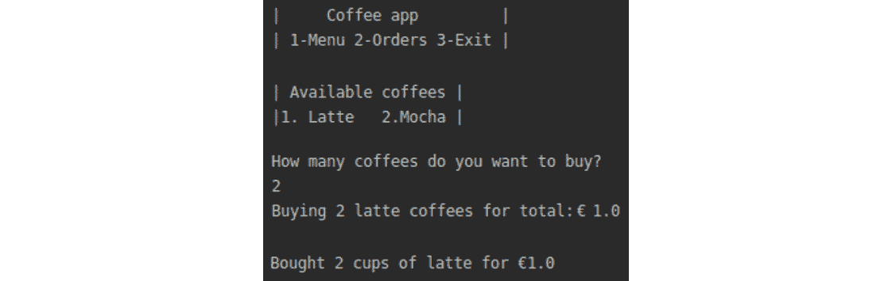

图 9.5：咖啡应用程序

1.  打开终端并创建一个新的 Leiningen 项目：

    ```java
    lein new app coffee-app
    ```

    这将创建一个与上一章中我们研究的项目相似的 Leiningen 项目。

    在这个应用程序中，我们将从键盘获取用户输入。为了帮助我们，我们将使用来自`java.util`包的名为`Scanner`的 Java 类。

1.  将命名空间导入到`core.clj`文件中：

    ```java
    (ns coffee-app.core
        (:require [coffee-app.utils :as utils])
        (:import [java.util Scanner])
        (:gen-class))
    ```

    我们已经导入了`Scanner`类。这个类允许我们从键盘获取输入。为了使用`Scanner`类的方法，我们需要创建这个类的实例。

    我们还导入了`coffee-app.utils`命名空间，其中我们将有实用函数。

1.  我们将菜单存储在哈希表中。哈希表是我们在*第一章*，*Hello REPL*中学习到的 Clojure 集合。在哈希表中，我们使用咖啡类型，例如`:latte`作为键。键的值是价格：

    ```java
    (def ^:const price-menu {:latte 0.5 :mocha 0.4})
    ```

    在价格菜单中，摩卡的价格是`0.4`。

1.  创建`Scanner`类的实例：

    ```java
    (def input (Scanner. System/in))
    ```

    当我们想要从用户那里获取输入时，我们将调用这个类实例的方法。`Scanner`类需要知道输入的来源。在我们的情况下，我们使用`System`类的默认输入源——键盘。当用户运行应用程序时，他们应该看到一个带有选项的菜单。这些选项是显示和订购咖啡、列出订单和退出应用程序：

    

    图 9.6：咖啡应用程序的选项

1.  添加显示菜单和处理用户选择的代码：

    ```java
    (defn- start-app []
           "Displaying main menu and processing user choices."
           (let [run-application (ref true)]
                (while (deref run-application)
                       (println "\n|     Coffee app         |")
                       (println "| 1-Menu 2-Orders 3-Exit |\n")
                       (let [choice (.nextInt input)]
                            (case choice
                                  1 (show-menu)
                                  2 (show-orders)
                                  3 (dosync (ref-set run-application false)))))))
    ```

1.  在`start-app`函数中，我们将应用程序设置为默认运行：

    ```java
    run-application (ref true)
    (while (deref run-application)
    ```

    并发原语是特殊的。为了获取它们存储的值，我们使用`deref`函数。

1.  在`while`块内部，应用程序将一直运行，直到用户选择退出选项。在这种情况下，我们将更新`ref`的值：

    ```java
    (dosync (ref-set run-application false))
    ```

    更新后，`ref`变为`false`。当`ref`的值为`false`时，`while`块将停止，我们的应用程序将退出。

1.  当我们的应用程序运行时，用户可以从菜单中选择选项：

    ```java
    (println "\n|     Coffee app         |")
    (println "| 1-Menu 2-Orders 3-Exit |\n")
    ```

    这将显示以下菜单：

    

    图 9.7：选择选项

    我们能够显示初始菜单。我们可以处理用户从菜单中的选择。

1.  为了获取用户响应，我们调用`Scanner`实例的`nextInt`方法：

    ```java
    choice (.nextInt input)
    ```

1.  最后，一旦我们获取了用户输入，我们检查菜单中的哪个选项应该被执行：

    ```java
    (case choice
            1 (show-menu)
            2 (show-orders))
    ```

    我们现在知道了当启动应用程序时主应用程序菜单中的逻辑。现在是时候深入了解并查看`show-menu`函数的代码。

1.  显示菜单：

    ```java
    (defn- show-menu []
           (println "| Available coffees |")
           (println "|1\. Latte   2.Mocha |")
           (let [choice (.nextInt input)]
                (case choice
                      1 (buy-coffee :latte)
                      2 (buy-coffee :mocha))))
    ```

1.  在`show-menu`函数中，我们让用户了解两种可用的咖啡，拿铁和摩卡：

    ```java
    (println "| Available coffees |")
    (println "|1\. Latte   2.Mocha |")
    ```

    这将显示咖啡菜单：

    

    图 9.8：显示咖啡菜单

    我们现在需要响应用户的咖啡选择。

1.  我们使用`Scanner`实例来获取用户输入：

    ```java
    choice (.nextInt input)
    ```

1.  最后，我们继续购买用户选择的咖啡：

    ```java
    (case choice
           1 (buy-coffee :latte)
           2 (buy-coffee :mocha))
    ```

    `show-menu`函数不是很长。它的目的是显示可用的咖啡并获取用户输入。一旦用户选择，我们就调用`buy-coffee`函数来处理购买所选咖啡。

1.  询问用户他们想要多少杯咖啡：

    ```java
    (defn- buy-coffee [type]
           (println "How many coffees do you want to buy?")
           (let [choice (.nextInt input)
                 price (utils/calculate-coffee-price price-menu type choice)]
                (utils/display-bought-coffee-message type choice price)))
    ```

    `buy-coffee` 函数询问用户想要购买多少杯咖啡。同样，我们使用 Scanner 类的实例 – `input` – 来获取用户的选择。接下来，该函数调用两个实用函数来处理购买。这些函数负责计算咖啡价格并向用户显示反馈消息。

    所有函数都将放置在 `utils.clj` 文件中。而不是将所有函数放在一个大的文件中，将函数拆分到不同的命名空间中是一种良好的实践。一个常见的命名空间名称是 `utils`。我们可以将任何有用的操作数据的函数保存在那里。

1.  创建 `utils` 命名空间：

    ```java
    (ns coffee-app.utils) 
    ```

    因为我们将放置在这个命名空间中的方法执行 I/O 操作，所以我们本可以将其命名为 `coffee-app.io`。在我们的情况下，命名空间名称 `utils` 和 `io` 都是有效的。在更大的应用程序中，将 `utils` 命名空间拆分为不同的命名空间是常见的做法。

1.  计算咖啡价格：

    ```java
    (defn calculate-coffee-price [coffees coffee-type number]
          (->
            (get coffees coffee-type)
            (* number)
            float))
    ```

    我们的第一个实用函数计算咖啡价格。它使用 get 函数检查传递的咖啡类型的 `coffees` 哈希。该哈希在核心命名空间中定义。然后，从哈希中获取的值乘以用户订购的咖啡杯数。最后，我们将数字转换为浮点数。这允许我们将 `1.2000000000000002` 这样的数字转换为 `1.2`。

    在处理购买咖啡时最后使用的实用函数是 `display-bought-coffee-message` 函数。

1.  在购买咖啡后向用户显示一条消息：

    ```java
    (ns coffee-app.utils)
    (defn display-bought-coffee-message [type number total]
          (println "Buying" number (name type) "coffees for total:€" total))
    ```

    `display-bought-coffee-message` 函数接受一个订单映射，并根据映射中的数据为用户构建一个字符串消息。用户被告知他们以指定价格购买了一定数量的咖啡杯。

    使用此函数，我们可以控制在完成订单后传递给用户的信息：

    ```java
    Buying 2 latte coffees for total:€ 1.0
    ```

    主菜单中的第二个选项允许我们查看已放置的订单：

    

    图 9.9：查看放置的订单的选项 2

    负责显示订单的函数是来自 `coffee-app.core` 命名空间的 `show-orders` 函数。

1.  显示放置的订单：

    ```java
    (ns coffee-app.core)
    (defn- show-orders []
           (println "\n")
           (println "Display orders here"))
    ```

    此函数显示已放置的咖啡订单。在本练习中，我们通知用户订单将在此处显示。在接下来的练习中，我们将实现保存和显示订单：

    ```java
    Display orders here
    ```

    当我们运行应用程序并购买两杯拿铁时，我们将看到以下输出：

    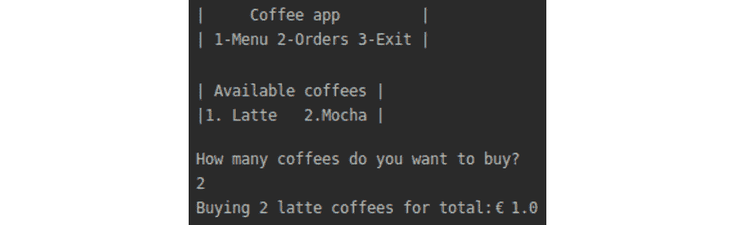

图 9.10：显示放置的订单输出

在这个练习中，我们学习了如何在 Clojure 中处理 I/O 和 Java。我们创建了一个允许我们查看咖啡菜单并订购咖啡的咖啡订购应用程序。

在下一个练习中，我们将扩展此应用程序并实现保存咖啡订单和检索订单。

## 练习 9.05：咖啡订购应用程序 – 保存和加载订单

本练习的目的是扩展我们的 I/O 知识。我们将学习如何保存和读取文件。我们将扩展咖啡订购应用程序，以便将数据保存到文件并从文件中读取数据。

应用程序将具有以下功能：

+   保存订单

+   检索订单

+   显示已保存的订单

一旦我们完成应用程序，我们就能显示订单：


图 9.11：已放置订单的输出

此应用程序的主要功能是保存和加载订单。我们将为此创建实用函数：

1.  为了与文件 I/O 一起工作，我们需要导入 I/O 命名空间：

    ```java
    (ns coffee-app.utils
        (:require [clojure.java.io :as io])
        (:import [java.io PushbackReader]))
    ```

    我们将使用`PushbackReader`Java 类来读取文件。我们还将使用 Clojure I/O 库中的实用工具。

1.  我们将实现的第一项功能是将数据保存到文件：

    ```java
    (defn save-to [location data]
          (spit location data :append true))
    ```

    `spit`函数是一个 Clojure I/O 函数，它将数据写入指定的文件位置。当`:append`关键字设置为 true 时，我们想要存储的数据将被追加到现有数据。否则，每次我们保存数据时，新数据将覆盖现有文件内容。保存文件后，我们希望从文件中检索数据。

1.  为了从文件中检索数据，我们需要确保文件存在：

    ```java
    (defn file-exists? [location]
          (.exists (io/as-file location)))
    ```

    `file-exists?`函数调用一个 I/O 函数`as-file`，该函数返回`java.io.File`。然后，我们调用`exists`函数来检查我们是否在请求的位置有一个文件。`file-exists`函数的返回值是一个布尔值。如果文件存在，我们得到`true`：

    

    图 9.12：file_exists?函数输出为 true

    如果文件不存在，我们得到`false`：

    

    图 9.13：file_exists?函数输出为 false

    一旦我们知道文件存在，我们就可以加载已保存的订单。

1.  我们将需要从文件中加载订单：

    ```java
     (defn load-orders
      "Reads a sequence of orders stored in file."
      [file]
      (if (file-exists? file)
        (with-open [r (PushbackReader. (io/reader file))]
                          (binding [*read-eval* false]
                           (doall (take-while #(not= ::EOF %) (repeatedly #(read-one-order r))))))
      []))
    ```

    `load-orders`函数接受一个文件名作为参数。我们调用`file-exists?`函数来检查我们是否在请求的位置有一个文件。`file-exists?`函数的返回值在`load-orders`函数中的`if`块中使用。如果没有文件，我们返回一个空向量。如果有文件，我们将读取其内容。

    我们使用`with-open`宏从文件中读取。宏将在我们完成读取后自动处理关闭文件。这将为我们释放计算机资源。我们使用`PushbackReader`类从文件中读取。此类允许我们在确定如何解释当前字符之前，先读取几个字符来查看接下来会发生什么。我们的计划是读取订单，直到我们到达文件末尾，由`::EOF`关键字标记。我们反复读取一个订单。

    我们已将`read-eval`的绑定更改为`false`。从我们不知道的文件中读取是不安全的。默认情况下，`read-eval`设置为`true`。这意味着我们读取的任何数据都可以被评估。用户数据或通过网络发送的文件永远不应该被信任。我们处理的数据可能包含恶意代码。当我们用 Clojure 操作数据时，数据应该始终以不评估数据内容的方式读取。

1.  我们将使用`clojure.java.io`命名空间中的`read`函数来读取订单文件中的每一行：

    ```java
     (defn read-one-order [r]
      (try
        (read r)
      (catch java.lang.RuntimeException e
        (if (= "EOF while reading" (.getMessage e))
          ::EOF
          (throw e)))))
    ```

    一旦我们到达文件末尾，就会抛出一个 Java 错误，我们会捕获这个错误。在捕获错误后，我们返回`::EOF`关键字，这指示我们的 while 循环停止从文件中读取。我们将在本章后面学习更多关于 Java 异常的内容。我们有自己的实用函数来保存和加载数据到文件。我们已经准备好使用这些函数。

1.  保存咖啡订单。使用`save-to`函数保存咖啡订单：

    ```java
     (defn save-coffee-order [orders-file type number price]
      (save-to orders-file {:type type :number number :price price}))
    ```

    `save-coffee-order`函数接受要保存数据的文件名、咖啡类型、咖啡杯数和订单价格作为参数。

    使用这些数据，我们构建一个映射，并将其传递给`save-to`函数。`save-to`函数将数据保存到我们指定的文件中。

    在实现保存咖啡订单的能力后，我们可以使用这个函数来处理购买咖啡。

1.  处理购买咖啡。`buy-coffee`函数将负责计算咖啡价格，保存咖啡订单，并向用户显示反馈信息：

    ```java
    (ns coffee-app.core)
    (defn buy-coffee [type]
           (println "How many coffees do you want to buy?")
           (let [choice (.nextInt input)
                 price (utils/calculate-coffee-price price-menu type choice)]
                (utils/save-coffee-order orders-file type choice price)
                (utils/display-bought-coffee-message type choice price)))
    ```

    在`buy-coffee`函数中，我们询问用户想要购买多少杯咖啡。我们使用 Scanner 类的实例`input`来获取用户的选择。接下来，函数调用三个实用函数来处理购买。

    在我们计算订单价格后，我们保存订单，并最终向用户显示有关已下订单的信息。在下单后，我们准备好加载订单以便在菜单中显示。

1.  我们将使用`show-orders`函数来显示订单：

    ```java
    (def ^:const orders-file "orders.edn")
    (defn show-orders []
           (println "\n")
           (doseq [order (utils/load-orders orders-file)]
                  (println (utils/display-order order))))
    ```

    在`show-orders`函数中，我们从订单文件中获取订单。我们使用`doseq`遍历一系列订单。使用`doseq`，对于每个订单，我们将调用`display-order`函数。

1.  显示订单的数据是从传递给`display-order`函数的订单参数中构建的：

    ```java
    (defn display-order [order]
          (str "Bought " (:number order) " cups of " (name (:type order)) " for €" (:price order)))
    ```

    `display-order`函数从一个订单映射中创建一个字符串。我们访问购买咖啡杯数、购买咖啡类型和订单价格的信息。

    购买两杯咖啡后，我们将得到以下输出：

    ![Figure 9.14: Output for the display-order function]

    ![img/B14502_09_14.jpg]

图 9.14：`display-order`函数的输出

在这个练习中，我们扩展了我们的咖啡订购应用程序。我们添加了将订单保存到文件和从文件加载数据的功能。在实现这些功能的过程中，我们学习了更多关于 Java I/O 的知识。这些功能提高了我们的咖啡订购应用程序。

## 处理 Java 数据类型

数据类型指的是数据是如何分类的。Java 中的任何变量或对象都有一个特定的类型。在这本书中，我们看到了如字符串("`巴黎`")、布尔值(`true`、`false`)、数字(`1`、`2`)和集合(`[:one :two :three]`)这样的类型。

Clojure 重用了 Java 中最常见的几种数据类型，例如字符串和数字。这是一个很好的方法，因为自从 90 年代 Java 被创建以来，许多开发者在他们的代码中测试了 Java 类型。这让我们在使用 Java 数据类型时有了信心。有一些类型在 Clojure 中并不直接存在。在这种情况下，我们使用 Clojure 中的 Java 互操作性来访问 Java 数据类型。

当在 Clojure 中编写应用程序时，我们可以使用本书中介绍的数据类型。如果我们知道 Java 中的数据类型，我们也可以使用它们。在前面的练习中，我们学习了如何使用 Java 类中的访问方法。现在我们知道如何处理类了。

在下一个练习中，我们将学习如何在 Clojure 中处理 Java 集合。Java 提供了如`ArrayList`和`HashMap`这样的集合：

+   `ArrayList`就像 Clojure 的向量。`ArrayList`中的元素按顺序存储。

+   `HashMap`就像 Clojure 的哈希表。`HashMap`中的元素以键/值对的形式存储。

## 练习 9.06：Java 数据类型

本练习的目的是学习如何在 Clojure 中处理 Java 数据类型。通常，当我们使用 Clojure 工作时，我们依赖于外部库。有许多 Java 库。了解如何使用 Java 数据类型将帮助我们有效地使用 Java 库。在这个练习中，我们将处理一个地理应用程序的一部分。该应用程序将国家、首都和河流等信息作为 Java 集合存储。我们将编写代码在 Java 和 Clojure 集合之间进行转换：

1.  使用以下命令启动 REPL：

    ```java
    lein repl
    ```

    它将如下开始：

    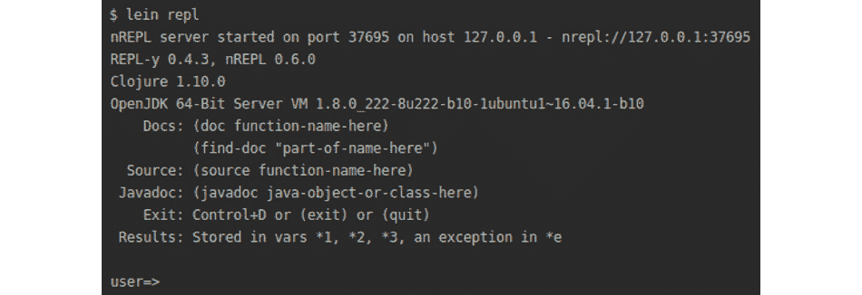

    图 9.15：REPL 的输出

1.  我们将创建一个包含一些首都的向量：

    ```java
    (def capitals ["Berlin" "Oslo" "Warszawa" "Belgrad"])
    ```

1.  检查`capitals`向量：

    ```java
    capitals
    ```

    输出如下：

    ```java
    ["Berlin" "Oslo" "Warszawa" "Belgrad"]
    ```

1.  我们可以检查我们的`capitals`向量的类：

    ```java
    (class capitals)
    ```

    输出如下：

    ```java
    clojure.lang.PersistentVector
    ```

    我们可以看到`capitals`是一个 Clojure 的`PersistentVector`。

1.  使用 Clojure 的向量，我们可以在 Java 中创建一个`ArrayList`：

    ```java
    (def destinations (java.util.ArrayList. capitals))
    ```

    我们从一个向量创建了一个`ArrayList`。我们可以这样检查它：

    ```java
    destinations
    ```

    输出如下：

    ```java
    ["Berlin" "Oslo" "Warszawa" "Belgrad"]
    ```

1.  我们可以检查我们的`destinations`数组的类：

    ```java
    (class destinations)
    ```

    输出如下：

    ```java
    java.util.ArrayList
    ```

    变量`destinations`具有 Java 的`ArrayList`类。我们刚刚从 Clojure 转换为 Java。我们将`capitals`向量转换为`destinations` `ArrayList`。

1.  我们也可以进行逆向转换。我们可以这样从 Java 转换为 Clojure：

    ```java
    (vec destinations)
    ```

    Clojure 核心库中的 `vec` 函数允许我们将 `ArrayList` 转换为向量。

1.  我们可以检查我们新转换的数据的类：

    ```java
    (class (vec destinations))
    ```

    输出如下：

    ```java
    clojure.lang.PersistentVector
    ```

    当我们将 `ArrayList` 转换为向量时，我们得到 Clojure 中的 `PersistentVector` 类。

1.  我们能够使用 ArrayList 和向量在 Java 和 Clojure 之间来回转换。Clojure 有另一种存储数据的集合类型。哈希以键/值对的形式存储数据：

    ```java
    (def fluss {"Germany" "Rhein" "Poland" "Vistula" })
    ```

1.  我们定义了一个包含国家和这些国家中的河流（在德语中为 fluss）的哈希。

    ```java
    fluss
    ```

    输出如下：

    ```java
    {"Germany" "Rhein" "Poland" "Vistula" }
    ```

1.  我们可以检查 `fluss` 变量的类：

    ```java
    (class fluss)
    ```

    输出如下：

    ```java
    clojure.lang.PersistentArrayMap
    ```

    `fluss` 变量是 Clojure 的 `PersistentArrayMap`。

1.  使用 Clojure 的哈希，我们可以使用 Java 创建一个 HashMap：

    ```java
    (def rivers (java.util.HashMap. fluss))
    ```

1.  我们使用 Clojure 的哈希从 Java 创建一个 HashMap。

    ```java
    rivers
    ```

    输出如下：

    ```java
    {"Poland" "Vistula" "Germany" "Rhein"}
    ```

    `rivers` 变量包含国家和这些国家中的河流。

1.  我们可以如下检查 `rivers` 变量的类：

    ```java
    (class rivers)
    ```

    输出如下：

    ```java
    java.util.HashMap
    ```

    我们可以看到 `rivers` 是一个 Java 的 HashMap。

1.  使用 Java 的 HashMap，我们可以创建一个 Clojure 中的哈希：

    ```java
    (into {} rivers)
    ```

    输出如下：

    ```java
    {"Poland" "Vistula" "Germany" "Rhein"}
    ```

    在前面的代码中，我们使用了 Clojure 核心库中的 `into` 函数。`into` 函数接受目标集合和源集合作为两个参数。

    我们的目标集合是 Clojure 中的一个哈希。记住，我们在 Clojure 中使用花括号 `{}` 定义哈希。我们将 Java 中的 `rivers` HashMap 的内容放入 Clojure 的哈希 `{}` 中。

1.  我们可以检查我们新转换的哈希的类：

    ```java
    (class (into {} rivers))
    ```

    输出如下：

    ```java
    clojure.lang.PersistentArrayMap
    ```

    我们转换后的数据类是 Clojure 的 `PersistentArrayMap`。

在这个练习中，我们扩展了我们对 Java 与 Clojure 互操作性的知识。我们学习了如何将数据从 Java 转换为 Clojure，然后再转换回来。在接下来的活动中，你将使用你对 Java 互操作性的知识来创建一个执行 I/O 操作的应用程序。

## 活动九.01：图书订购应用程序

在这个活动中，我们将应用我们对 I/O 和 Java 的新知识来创建一个图书订购应用程序。一家媒体公司决定创建一个允许用户订购图书的应用程序。用户可以从应用程序中的列表中选择年份和标题。一旦用户下单，我们应该能够按年份分组查看订单。

一旦完成活动，你应该会有以下类似的输出。

初始菜单：


图 9.16：菜单显示

列出年份：


图 9.17：按年份提供的书籍

一年中的书籍：


图 9.18：2019 年购买的书籍

询问用户想购买多少本书：


图 9.19：询问购买书籍的数量

订单确认信息：


图 9.20：订单确认信息

列出购买的书籍：

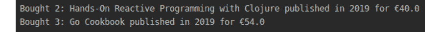

图 9.21：购买书籍列表

这些步骤将帮助你完成活动：

1.  创建一个新的项目。

1.  导入必要的命名空间。

1.  创建一个按年份存储书籍的映射。

1.  为存储订单的文件创建一个变量。

1.  创建一个初始菜单，包含订购书籍和列出订单的选项。

1.  创建一个按年份显示书籍的菜单。

1.  创建应用程序的`main`方法。

1.  创建一个将数据保存到文件的函数。

1.  创建一个保存订单的函数。

1.  创建一个计算`书籍价格`的函数。

1.  创建一个显示订单确认信息的函数。

1.  创建一个显示已购买订单的函数。

1.  创建一个读取单个订单的函数。

1.  创建一个检查文件是否存在的函数。

1.  创建一个从文件中加载订单的函数。

1.  创建一个用于订购书籍的下拉菜单。

1.  创建一个按年份购买书籍的函数。

1.  创建一个按年份显示订单的函数。

1.  创建一个用于列出订单的下拉菜单。

    备注

    此活动的解决方案可以在第 712 页找到。

# 在 ClojureScript 中使用 JavaScript

ClojureScript 允许我们使用 JavaScript 构造。我们可以在 ClojureScript 中像调用其他方法一样调用 JavaScript 方法和函数。当我们从 Clojure 调用 Java 时，我们使用了`.`点或`\`斜杠这样的运算符。在 ClojureScript 中使用 JavaScript 也将需要我们学习新的语法。

虽然 Java 大量操作类，但在 JavaScript 中我们操作对象。我们想在对象上使用的两个 JavaScript 构造是：

+   方法

+   字段

为了从 JavaScript 对象中访问一个方法，我们在方法名前放置一个点（`.`）。访问对象的字段与访问字段非常相似。我们在字段名前使用`.-`（一个点和短横线）。你可能想知道为什么访问函数的语法与访问字段略有不同。在 JavaScript 中，一个对象可以有一个与字段同名的函数和字段。在 ClojureScript 中，我们需要一种方法来区分函数调用和字段访问。

在 JavaScript 中，代码如下：

```java
var string = "JavaScript string"
var string_length = string.length;
var shout = string.toUpperCase();
```

在 ClojureScript 中，代码如下：

```java
(def string "JavaScript string")
(def string_length (.-length string))
(def shout (.toUpperCase string))
```

让我们花一分钟来欣赏 ClojureScript 的设计。我们在书的开始部分学习了 ClojureScript 函数及其调用方法。本质上，它与 Clojure 的语法相同。除非我们有一个序列，否则列表中的第一个位置被视为一个函数：

```java
(range 1 10)
```

调用`range`将返回从 1 到 10 的数字序列：


图 9.22：调用 range 的输出

在这里，`range` 处于第一个位置，ClojureScript 编译器正确地将 `range` 视为一个函数。我们刚刚看到了如何调用 JavaScript 方法和字段。通过添加一个点或连字符，语法没有任何变化。这种在 ClojureScript 中将方法调用放在第一个位置的统一性减轻了开发者的心理负担。我们不需要学习很多特殊的语法来实现 JavaScript 互操作性。

当我们比较使用 `range` 函数和检查字符串长度时，我们将看到这种一致性。

我们这样调用 `range` 函数：

```java
(range 1 10)
```

它将按以下方式工作：


图 9.23：调用 range 函数

检查字符串长度的方式如下：


图 9.24：检查字符串长度

`range` 函数和访问 JavaScript 字符串的长度字段都放在语句的第一个位置。

更令人惊讶的是，ClojureScript 在 JavaScript 之上进行了改进。在 JavaScript 中，没有命名空间的概念。当我们定义一个函数或变量时，它属于全局命名空间。当两个或多个库使用相同的变量或方法名称时，这会引发冲突并导致错误。库设计者使用 JavaScript 对象作为模块/命名空间，并将函数放在它们的对象中。然而，这只是一个权宜之计，而不是语言设计。在 ClojureScript 中，命名空间是语言中一等公民。

我们应该注意一个命名空间。ClojureScript 使用 `js` 命名空间来引用程序的全局作用域。在 ClojureScript 中，像 `Number`、`String` 和 `Date` 这样的核心 JavaScript 对象都通过 `js` 命名空间访问。在这个命名空间中，我们还会找到浏览器定义的对象，如 `window`。

为了构造一个 JavaScript 对象，我们使用对象的名称后跟一个点。这是我们之前在 Clojure 中构造 Java 类实例时使用的相同语法。

在 JavaScript 中，代码看起来如下：

```java
var num = new Number(123);
```

在 ClojureScript 中，代码看起来如下：

```java
(def num (js/Number. 123))
```

注意我们使用了 `js` 命名空间。正如本节所述，核心 JavaScript 对象如 Number 是通过这个命名空间访问的。

ClojureScript 利用 JavaScript 数据类型。ClojureScript 并不发明新的数据类型，而是重用现有的 JavaScript 数据类型。以下表格展示了 ClojureScript 数据类型及其 JavaScript 来源：


图 9.25：ClojureScript 数据类型及其来源

如我们所见，在 ClojureScript 中常用到的数据类型都是基于 JavaScript 数据类型的。

我们已经看到了如何在 ClojureScript 中访问 JavaScript。在下一个练习中，我们将学习如何在 ClojureScript 中处理 JavaScript 数据类型。

## 练习 9.07：使用 JavaScript 数据类型

本练习的目的是学习如何在 ClojureScript 中处理 JavaScript 数据类型。我们将学习如何将 ClojureScript 数据转换为 JavaScript 对象。稍后，我们将学习反向过程，即如何将 JavaScript 对象转换为 ClojureScript 数据：

1.  我们将为我们的代码创建一个新的项目：

    ```java
    lein new mies js-interop
    ```

    此命令创建了一个名为 `js-interop` 的基本 ClojureScript 项目。

1.  我们将使用以下命令启动 REPL。

    ```java
    scripts/repl
    ```

    输出如下：

    

    图 9.26：REPL 的输出

1.  ClojureScript 提供了 `js-obj` 函数，用于将 ClojureScript 数据创建为 JavaScript 对象：

    ```java
    (js-obj "Austria" "Donau")
    ```

    输出如下：

    ```java
    #js {:Austria "Donau"}
    ```

    调用 `js-obj` 函数创建了一个新的 JavaScript 对象。注意 REPL 中的 `#js`。这个符号在 REPL 中告诉我们，接下来的表达式是一个 JavaScript 对象。

1.  经常情况下，我们会使用嵌套结构，其中一个对象包含另一个对象：

    ```java
    (def rivers-map-js (js-obj "country" {"river" "Donau"}))
    ```

    输出如下：

    

    图 9.27：嵌套结构

    `rivers-map-js` 对象是一个嵌套结构。它包含一个国家键，其值是另一个包含一些河流详细信息的对象。

1.  我们可以访问 `rivers-map-js` 对象中的字段：

    ```java
    (.-country rivers-map-js)
    ```

    输出如下：

    ```java
    {"river" "Donau"}
    ```

1.  在访问国家后，我们得到了关于河流的嵌套数据。我们将尝试访问这些嵌套数据：

    ```java
    (.-river (.-country rivers-map-js))
    ```

    输出如下：

    ```java
    nil
    ```

    当我们尝试获取河流信息时，我们得到 `nil`。结果是，我们无法使用 JavaScript 互操作性来访问数据。原因是 `js-obj` 函数是浅层的。它不会将嵌套数据结构转换为 JavaScript 对象。如果我们想将嵌套的 ClojureScript 数据转换为 JavaScript 对象，我们需要使用其他方法。

1.  为了转换所有嵌套数据，我们需要使用 `clj->js` 函数：

    ```java
    (def rivers-map-js-converted (clj->js {"country" {"river" "Donau"}}))
    ```

    输出如下：

    ```java
    #cljs.user/rivers-map-js-converted
    ```

1.  使用 `clj->js` 函数，我们能够转换嵌套的 ClojureScript 数据：

    ```java
    rivers-map-js-converted
    ```

    输出如下：

    ```java
    #js {:country #js {:river "Donau"}}
    ```

    注意两个 `#js` 符号。每个符号都告诉我们我们有一个 JavaScript 对象。第一个对象包含一个国家的名称。在这个国家对象内部，我们还有一个名为河流的 JavaScript 对象。

1.  当我们拥有嵌套的 JavaScript 对象时，我们可以使用 JavaScript 互操作性从它们中访问数据：

    ```java
    (.-river (.-country rivers-map-js-converted))
    ```

    输出如下：

    ```java
    "Donau"
    ```

    我们能够使用 JavaScript 互操作性访问嵌套的 JavaScript 对象。

1.  到目前为止，我们已经从 ClojureScript 转换到了 JavaScript。也可以反过来转换，从 JavaScript 转换到 ClojureScript：

    ```java
    (js->clj #js {:river "Donau"})
    ```

    输出如下：

    ```java
    {"river" "Donau"}
    ```

    使用 `#js` 符号，我们将一个 JavaScript 对象转换为 ClojureScript 数据。

1.  将嵌套 JavaScript 对象转换为 ClojureScript 数据：

    ```java
    (js->clj #js {:country #js {:river "Donau"}})
    ```

    输出如下：

    ```java
    {"country" {"river" "Donau"}}
    ```

    使用`js->clj`函数，我们再次将 JavaScript 对象转换为 ClojureScript 数据。请注意，我们使用了`#js`符号两次。每次我们有一个 JavaScript 对象时，我们必须使用`#js`符号来标记它。这指示 ClojureScript 将以下数据视为 JavaScript 对象。

    在这个练习中，我们学习了如何将 ClojureScript 数据转换为 JavaScript 对象。然后我们看到了如何逆向操作，将 JavaScript 对象转换为 ClojureScript 数据。

我们已经准备好开始构建 ClojureScript 应用程序。在*第八章*，*命名空间、库和 Leiningen*中，我们学习了如何构建项目和如何使用 Leiningen 创建 Clojure 项目。我们也可以使用 Leiningen 创建 ClojureScript 项目。使用 Leiningen 模板创建 ClojureScript 应用程序将创建在 ClojureScript 中工作的必要配置。最常用的 ClojureScript 模板之一是 Figwheel 模板。我们将在下一主题中学习这个模板。

## Figwheel 模板

Figwheel 是一个编译 ClojureScript 代码的工具。Figwheel 的一个卖点是热代码重新加载。当我们对 ClojureScript 文件进行更改时，代码将被重新编译，浏览器中的一个页面将被更新。这有助于通过给程序员提供快速反馈来加快开发过程。

Figwheel 不仅重新加载我们的代码，而且在代码重新加载方面非常智能。当我们对代码进行更改导致代码错误时，Figwheel 会给我们编译错误。

如果我们尝试使用未声明的函数，Figwheel 会通知我们：

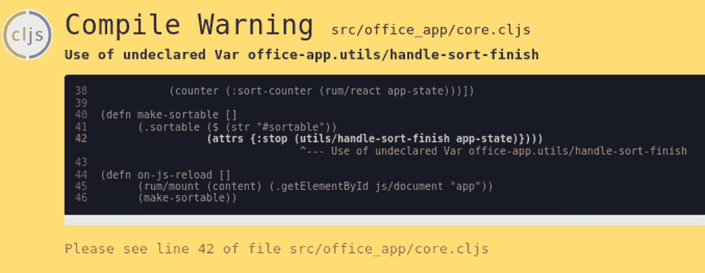

图 9.28：Figwheel 的消息

Figwheel 通知我们，在`core.cljs`文件的第 42 行，我们尝试调用一个未声明的`handle-sort-finish`函数。

通过 Figwheel 提供的这种简洁且高质量的反馈，我们可以比在堆栈跟踪中挖掘错误时更快地开发 ClojureScript 应用程序。或者更糟，我们的应用程序运行但给出意外的结果。

Figwheel 支持交互式编程风格。我们在代码库中做出的更改将被重新编译并在网页浏览器中显示。我们在*第一章*，*Hello REPL!*中学习了 Clojure 默认使用不可变数据结构。你可以整天重新加载函数定义。它们是无副作用的，并且与运行系统的本地状态无关。这意味着运行相同的函数多次不会改变应用程序的状态。因此，重新编译和重新加载是安全的。

Figwheel 鼓励使用 React 来开发应用程序。React 是一个允许我们在页面上操作元素的 Web 工具。React 允许你编写函数，这些函数表达的是给定当前应用程序状态，这些元素的当前状态应该是什么。

在下一节，我们将学习关于 Rum 的内容。Rum 是一个库，用于在页面上使用应用程序状态创建 HTML 元素。

# 使用 Rum 进行响应式 Web 编程

许多网站允许用户与网页交互。用户可以点击、拖动和排序元素。这些页面是动态的——它们会对用户操作做出响应。一个对用户交互做出反应的编程页面称为响应式编程。

HTML 提供了页面元素的结构。**文档对象模型**（**DOM**）是 JavaScript 中的 HTML 表示。JavaScript 允许我们在最终显示为网页 HTML 元素的 DOM 元素上操作。

使页面能够对用户操作做出反应的一种方法是通过重新渲染（显示）整个页面。渲染整个页面会消耗计算机资源。如果只有页面的一小部分需要重新渲染，我们就会浪费宝贵的资源重新渲染整个页面。幸运的是，我们有一个解决方案，它允许我们只重新渲染页面已更改的部分。

React.js 是一个支持响应式编程的 JavaScript 库。React.js 的基本块是组件。在 React.js 中，我们定义组件的外观和行为。使用 React.js，我们可以根据当前应用程序的状态创建组件。状态的变化会导致需要更改的组件重新渲染。React 内部检查应用程序状态哪些部分已更改，哪些组件依赖于这些状态部分。因此，React 只重新渲染那些使用了应用程序状态中已更改部分的部分。

Rum 是一个用于在网页上创建 HTML 元素的 Clojure 库。Rum 基于 React.js。我们通常在 ClojureScript 应用程序中有些状态。状态可能是一组用户。我们可以通过添加或删除用户来操作用户列表，并且基于我们的操作，网页应该更新。在 Rum 中，可以定义页面元素，如用户条目，它将根据用户列表的变化做出反应。添加新用户将导致页面显示更新后的用户列表。

在下一个练习中，我们将创建一个使用 Rum 的 Figwheel 项目，并探索 Figwheel 和 Rum 为开发者提供的优势。

## 练习 9.08：调查 Figwheel 和 Rum

本练习的目的是了解 Figwheel 和 Rum。Figwheel 将为我们创建 ClojureScript 项目结构。Rum 将允许我们构建对用户操作做出响应的 HTML 组件：

1.  创建 Figwheel 和 Rum 项目：

    ```java
    lein new figwheel-main hello-clojurescript.core -- --rum
    ```

    我们使用 Leiningen 调用 `fighwheel-main` 模板。此模板将创建一个名为 `hello-clojuresript.core` 的主命名空间的新 ClojureScript 项目。

    我们想使用 Rum，因此我们传递 `--rum` 命令行参数以将 Rum 支持添加到项目中：

    

    图 9.29：创建 Figwheel 和 Rum 项目

    Leiningen 下载模板并为我们创建 ClojureScript 项目。

1.  我们将移动到命令行中的项目：

    ```java
    cd hello-clojurescript.core/
    ```

    这将更改目录到 `hello-clojurescript.core`：

    

    图 9.30：更改目录

    我们已准备好运行我们的应用程序。为了运行我们的 ClojureScript 应用程序，我们需要构建它。

1.  Figwheel 提供了一个自动构建配置，允许我们运行新创建的 ClojureScript 应用程序：

    ```java
    lein fig:build
    ```

    调用此命令将构建一个 ClojureScript 应用程序。首先，Figwheel 将下载任何必要的依赖项：

    

    图 9.31：构建 ClojureScript 应用程序

    在这里，Figwheel 下载了三个依赖项：

    +   Rum

    +   `Figwheel-main`库

    +   ClojureScript

        其次，Figwheel 将检查我们的配置：

        

图 9.32：Figwheel 检查配置

由于我们没有更改默认配置，我们的项目配置没有问题。我们很快就会看到默认配置的样子。

第三，Figwheel 将编译我们的代码，并输出一个要运行的主文件：

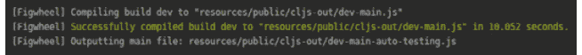

图 9.33：编译代码

1.  在 Figwheel 构建我们的应用程序后，它将启动一个服务器，该服务器将提供我们的应用程序：

    ```java
    [Figwheel] Watching paths: ("test" "src") to compile build – dev
    ```

    我们在源文件中做出的任何更改都将导致代码重新编译，并且我们的应用程序将在网页浏览器中更新。

    我们现在将研究核心源文件。

1.  Figwheel 将在`core.cjs`文件中为我们导入两个命名空间：

    ```java
    (ns ^:figwheel-hooks hello-clojurescript.core
      (:require [goog.dom :as gdom]
                    [rum.core :as rum]))
    ```

    第一个命名空间是 Google 的`dom`命名空间，它允许我们操作 DOM 元素。第二个命名空间是`rum`，因为我们设置了我们的应用程序使用 Rum。记住，当我们创建应用程序时，我们传递了`--rum`命令行参数。

    在命名空间中，我们定义了`^:figwheel-hooks`关键字。这是由 Figwheel 自动生成的，并指示 Figwheel 需要自动编译此文件。

1.  Google DOM 命名空间允许我们在页面上操作 DOM 元素：

    ```java
    (defn get-app-element []
      (gdom/getElement "app"))
    ```

    `getElement`函数将在页面中搜索具有`app` ID 的元素。默认情况下，Figwheel 将创建一个带有`div`的索引页面。这个`div`将具有`app` ID。

1.  Figwheel 在`resources/public`文件夹中创建一个默认的索引文件：

    ```java
    <!DOCTYPE html>
    <html>
      <head>
        <link href="css/style.css" rel="stylesheet" type="text/css">
      </head>
      <body>
        <div id="app"></div>
        <script src="img/dev-main.js" type="text/javascript"></script>
      </body>
    </html>
    ```

    在索引文件中，我们关注的主要事情是从`css/style.css`文件导入样式，创建一个带有应用程序`id`的`div`，我们将在这里挂载我们的应用程序，并将编译后的代码作为从`dev-main.js`文件的脚本添加。

1.  响应式应用程序需要管理状态以响应用户交互。状态被定义为原子：

    ```java
    (defonce app-state (atom {:text "Hello world!" :counter 0}))
    ```

    在当前状态下，我们存储一个带有`:text`键，其值为`"Hello world!"`和带有`:counter`键，其值为零的哈希。状态是通过`defonce`定义的。这是因为我们不希望在 Figwheel 重新加载代码时重新定义状态。这样，我们可以在页面重新加载期间保留应用程序状态。

1.  使用`defc`宏定义 Rum 组件：

    ```java
    (rum/defc hello-world []
      [:div
       [:h1 (:text (deref app-state))]
       [:h3 "Edit this in src/hello_clojurescript/core.cljs and watch it change!"]])
    ```

    `hello-world`组件构建一个 HTML `div`元素。在`div`内部，我们有一个`h1` HTML 元素和一个`h3` HTML 元素。

    `h1`元素将显示存储在应用程序状态中的文本。因为应用程序状态是一个原子，如果我们想访问值，我们需要对其进行解引用。解引用是一个返回原子中存储的值的操作。

    `h3`元素告诉我们我们可以编辑`core.cljs`文件，并在网页上看到更改。

    定义好的组件需要挂载到页面上。

1.  为了在页面上看到组件，我们需要将它们挂载：

    ```java
    (defn mount [el]
      (rum/mount (hello-world) el))
    (defn mount-app-element []
      (when-let [el (get-app-element)]
        (mount el)))
    ```

    `rum/mount`函数将`hello-world`组件挂载到 DOM 元素上。该元素是我们之前调查的`get-app-element`函数返回的。

    一旦组件挂载到 DOM 元素上，它就会在页面上显示：

    ![图 9.36：将组件挂载到 DOM 元素后的初始页面

    ![图片 B14502_09_36.jpg]

    图 9.36：将组件挂载到 DOM 元素后的初始页面

    我们的`hello-world`组件显示两个标题。首先是带有`Hello world!`的`h1`标题，然后是带有关于编辑`core.cljs`文件信息的`h3`标题。

1.  Rum 允许我们定义响应式组件。响应式组件是一种对应用程序状态变化做出反应的组件。当发生变化时，组件将在页面上以从应用程序状态中取出的新值重新渲染：

    ```java
    (rum/defc hello-world < rum/reactive []
              [:div {}
               (band "Metallica" (:counter (rum/react app-state)))])
    ```

    我们使用 Rum 的`< rum/reactive`语法标记组件为响应式。`<`符号告诉 Rum 组件是一个特殊类型。在我们的例子中，它是一个响应式组件。Rum 将对`app-state`的变化做出反应。

    `hello-world`组件将调用乐队组件，并将乐队名称与定义在应用程序状态中的`:counter`一起传递。

    每当`app-state`更新时，Rum 都会对变化做出反应并重新渲染乐队组件。

1.  在`hello-world`组件中，我们将显示一个乐队：

    ```java
    (rum/defc band [name likes]
              [:div {:class "band"
                     :on-click #(increment-likes)}
               (str name " is liked " likes " times")])
    ```

    `band`组件接受两个乐队名称和点赞数作为参数。

    组件将显示乐队名称和点赞数：

![图 9.37：在 hello-world 组件中显示乐队名称

![图片 B14502_09_37.jpg]

图 9.37：在 hello-world 组件中显示乐队名称

在组件内部，我们使用`:on-click` DOM 属性。

`on-click`属性允许我们在用户点击网页上的元素时附加一个函数：

```java
(defn increment-likes []
      (swap! app-state update-in [:counter] inc))
```

函数通过使用 Clojure 的`inc`函数增加计数器的值来更新`app-state`哈希中的`:counter`键：

![图 9.38：乐队名称的点赞数增加

![图片 B14502_09_38.jpg]

图 9.38：乐队名称的点赞数增加

在页面元素上点击三次将更新计数器。更新计数器将触发组件以新值重新渲染。

在这个练习中，我们更新了`hello-world`组件。在代码更改后，组件在浏览器中显示。我们不必重新编译代码。代码是由 Figwheel 重新编译的。当我们运行 Figwheel 时，它开始监视我们的文件以查找更改：

```java
[Figwheel] Watching paths: ("test" "src") to compile build - dev
```

多亏了 Figwheel，我们能够专注于编码，而不必担心重新编译我们的代码。这是由 Figwheel 自动完成的。

在本节中，我们学习了关于 Figwheel 的内容。它为 ClojureScript 项目创建了一个模板。Figwheel 的主要功能是热代码重新加载。我们源文件中的更改会自动重新编译并在浏览器中重新显示。

我们还学习了关于 Rum 的内容。Rum 是一个库，有助于创建响应式组件。这些组件会响应应用程序状态的变化，并在网页上重新显示。

在下一个主题中，我们将更深入地探讨 JavaScript 互操作性。

## 拖放

在网页中，最常见的使用场景之一就是使用拖放。它如此普遍，以至于我们如今很少注意到它。jQuery UI 库提供了用于编码拖放功能的函数。使用这个库，我们可以将 HTML 元素标记为可拖动和可放置。

该库提供了一些选项，允许我们改变拖放行为。我们可以：

+   将可拖动元素的移动限制在网页上的特定区域

+   指定元素在拖动后是否返回原始位置

+   指定元素是否自动对齐到其他元素

+   拖动时提供视觉辅助，例如透明度或动画

+   在页面区域中仅接受一个可放置元素

+   允许或禁止拖放后回滚

+   元素被放置后提供视觉反馈

使用 jQuery 的可拖动和可放置功能，我们可以创建一个真正交互式的页面。

我们已经看到了 JavaScript 互操作性的语法。现在是时候将我们的知识付诸实践了。在下一个练习中，我们将使用 JavaScript 互操作性创建一个拖放应用。该应用将基于 Figwheel 模板，并使用 Rum 实现响应式行为。

## 练习 9.09：使用拖放与 JavaScript 互操作

本练习的目的是让用户熟悉 ClojureScript 中的 JavaScript 互操作性。我们将创建一个前端应用，允许用户拖放元素。在编码拖放行为时，我们将使用 JavaScript 中的对象和函数。JavaScript 的 jQuery UI 库提供了拖放方法。我们将使用这个库的方法。

该应用将基于一个 Figwheel 模板，该模板有助于构建 ClojureScript 应用。其主要功能之一是热代码重新加载。任何对源文件的更改都会在浏览器中重新编译和更新。这有助于通过为程序员提供快速反馈来加快开发过程：

1.  基于 figwheel 模板创建一个新的 ClojureScript 应用：

    ```java
    lein new figwheel-main hello-drag-and-drop -- --rum
    ```

    REPL 将显示信息，说明已创建了一个基于`figwheel`模板的新项目：

    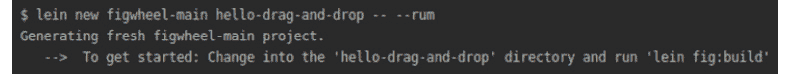

    图 9.39：REPL 输出

    在项目中，我们将使用`jayq`外部库。`jayq`是 jQuery 的 ClojureScript 包装器。

1.  在`project.clj`中添加外部 ClojureScript 依赖项。在`project.clj`中，在`:dependencies`部分添加`jayq`库：

    ```java
    [jayq "2.5.4"]
    ```

    `project.clj`中的`dependencies`部分应如下所示：

    

    图 9.40：依赖关系的输出

1.  现在我们已经在`project.clj`中配置了依赖项，我们可以在`hello-drag-and-drop.core`命名空间中导入它们：

    ```java
    (ns ^:figwheel-hooks hello-drag-and-drop.core
      (:require [jayq.core :as jayq :refer [$]]
                [goog.dom :as gdom]
                [rum.core :as rum]))
    ```

    这些库将帮助我们创建页面上的拖放元素。拖放实现将基于 jQuery UI 的一个组件。我们需要在`index.html`文件中导入这些 JavaScript 库。

1.  打开`resources/public/index.html`文件，并在`<head>`标签内添加 jQuery 和 jQuery UI 的导入：

    ```java
    <script src="img/jquery-3.4.1.min.js" integrity="sha256-CSXorXvZcTkaix6Yvo6HppcZGetbYMGWSFlBw8HfCJo=" crossorigin="anonymous"></script>
     <script src="img/jquery-ui.min.js" integrity="sha256-VazP97ZCwtekAsvgPBSUwPFKdrwD3unUfSGVYrahUqU=" crossorigin="anonymous"></script>
    ```

1.  在导入必要的库之后，我们将启动 Figwheel。在终端中，键入以下内容：

    ```java
    lein fig:build
    ```

    这将为我们启动 Figwheel：

    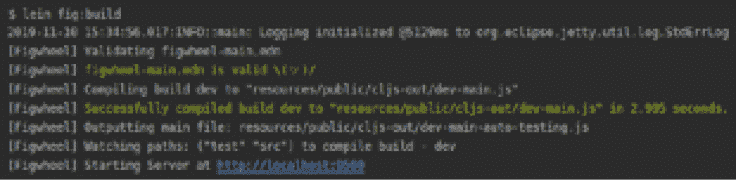

    图 9.41：启动 Figwheel

    Figwheel 将编译 ClojureScript 代码并为我们启动一个服务器。服务器将自动打开一个网页浏览器，显示`index.html`文件的内容：

    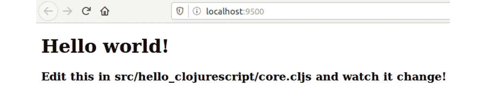

    图 9.42：index.html 的内容

    Figwheel 的一个卖点是可以代码重载。当我们对 ClojureScript 文件进行更改时，代码将被重新编译，浏览器中的页面将被更新。

    在我们的应用程序中，我们将实现拖放功能。我们将把可拖动的卡片移动到可放置的瓷砖中。我们首先定义一个瓷砖组件。

1.  在`hello-clojurescript.core`内部添加一个瓷砖的定义：

    ```java
    (rum/defc tile [text number]
      [:div {:class "tile" :id number} text])
    ```

    在这里，一个瓷砖是一个`rum`组件，基本上是一个 HTML 块。我们使用`rum`的`defc`方法定义一个组件。瓷砖接受两个参数：文本和一个数字。在其内部，一个允许我们设置元素数字参数属性的哈希用于设置瓷砖 div 的 ID。文本将在 div 元素内部显示。我们还为样式设置了"`tile`"类。

1.  在`resources/public/css/styles.css`内部添加一个 CSS 定义。CSS 代表层叠样式表。样式表允许我们为网页上的 HTML 元素设置样式。层叠意味着如果一个 HTML 元素有一些样式，那么这个元素内部的任何 HTML 元素都将继承相同的样式：

    ```java
    .tile {
        border: 1px solid green;
        display: inline-block;
        height: 100px;
        width: 200px;
    }
    ```

    在这里，我们定义了一个具有实心绿色边框的瓷砖组件的样式。边框的宽度应为 1 像素，高度应为 100 像素，宽度应为 200 像素，组件是内联显示的，这意味着它与其他元素在同一行上。当我们渲染瓷砖时，它们将看起来如下：

    

    图 9.43：定义瓷砖组件

    我们在同一行上有两个瓷砖。每个瓷砖都有一个绿色边框。

1.  这种样式将帮助我们清楚地看到每个瓦片。我们有一个实心的绿色线来区分瓦片。我们将创建一个包含瓦片的组件：

    ```java
    (rum/defc tiles []
      [:.tiles {}
        (tile "first" 1)
        (tile "second" 2)])
    ```

    我们创建了一个包含两个 `tile` 组件的 `div` 组件。我们将它们标记为第一和第二。请注意，我们没有直接写 `div` 标签。当我们省略 `div` 标签并提供一个类或 ID 时，Rum 会隐式创建一个 `div` 元素。在这里，我们使用了类的简写符号，并给组件类命名为 `tiles`。

1.  我们想通知用户一个元素已经被放下。我们将在一个 `atom` 中存储关于放下元素的信息：

    ```java
    (defonce is-element-dropped? (atom false))
    ```

    当应用程序启动时，我们将值设置为 `false`。我们不希望 Figwheel 在重新加载页面时重新定义原子，所以我们只定义一次。

1.  当一个元素被放下时，组件将显示信息：

    ```java
    (rum/defc dropped-message < rum/reactive []
              [:div {}
               (str "Was element dropped? " (rum/react is-element-dropped?))])
    ```

    我们使用来自 Rum 的 `reactive` 指令。这个指令指示 Rum，该组件将 `react` 到 `application state` 的变化。在我们的例子中，对 `is-element-dropped?` 原子的任何更改都会导致组件以新的值重新渲染。我们已经有三个组件了，但它们在网页浏览器中还未可见。我们需要编写代码将我们的组件挂载到页面上。我们将有一个顶层组件，它将包含我们应用程序的所有 HTML。

1.  我们将把所有我们的组件放入一个 `main` 组件中。这个 `main` 组件将包含我们可以拖拽的卡片和我们可以放下元素的瓦片：

    ```java
    (rum/defc content []
      [:div {}
        (tiles)
        (dropped-message)])
    ```

1.  在定义了我们的 `main` 组件之后，我们就准备好告诉 Rum 如何挂载这个组件：

    ```java
    (defn mount [el]
      (rum/mount (content) el))
    ```

    我们告诉 Rum，我们想要挂载一个名为 `content` 的组件。挂载点是具有 ID `app` 的元素。当我们检查网页浏览器时，我们可以看到应用的变化：

    ![图 9.44：瓦片组件的变化

    ![图片 B14502_09_44.jpg]

    ![图 9.44：瓦片组件的变化

    我们不必自己编译代码。所有这些都是由 Figwheel 完成的。在创建可拖拽元素之后，是时候创建我们可以拖拽的元素了。

1.  我们将创建一个新的 `rum` 组件——一个 `card`：

    ```java
     (rum/defc card [number]
      [:.card {:data-number number :id number}])
    ```

    卡片组件将接受一个参数，一个数字。这个参数在属性哈希中使用了两次。我们将使用这个数字为该组件设置一个 ID。我们还将设置一个带有数字的数据属性。

1.  一旦我们有了卡片组件，我们可以创建一个可以包含多个卡片的组件：

    ```java
    (rum/defc cards []
      [:.cards {}
        (card 1)
        (card 2)])
    ```

1.  在这个例子中，我们创建了两个卡片。最后，我们需要将我们的卡片放置在某个地方。一个好的地方是我们的 `main` 组件。现在它应该看起来像这样：

    ```java
    (rum/defc content []
      [:div {}
              (tiles)
              (cards)
              (dropped-message)])
    ```

1.  主要内容由卡片和瓦片组成。即使我们访问了网页浏览器，我们也看不到任何卡片。我们必须添加一些样式：

    ```java
    .card {
        border: 1px solid red;
        display: inline-block;
        height: 50px;
        width: 50px;
    }
    ```

    在为卡片添加样式后，网页浏览器将显示新的内容：

    ![图 9.45：样式化卡片

    ![图片 B14502_09_45.jpg]

    图 9.45：样式化卡片

    除了两个大绿色瓦片外，我们还有两个小红色卡片。可拖拽和可放下元素现在已放置。我们现在可以实施拖拽和放下行为。

1.  我们将为卡片添加拖动功能。我们将使用 jQuery UI 中的`draggable`函数。将拖动卡片的代码添加到`hello-clojurescript.core`：

    ```java
    (defn make-draggable []
      (.draggable ($ ".card") (attrs {:revert true :cursor "move"})))
    ```

1.  我们找到具有`card`类的 HTML 元素，并使用我们在本节开头导入的`jayq`库中的`$`函数。`$`函数将创建一个 jQuery 对象。我们在该对象上调用`draggable`方法，并传递属性。属性是通过一个新的函数`attrs`构建的：

    ```java
    (defn attrs [a]
      (clj->js (sablono.util/html-to-dom-attrs a)))
    ```

    `attrs`函数接受属性作为参数。我们使用`sablono`的`html-to-dom-attrs`函数将所有 HTML 属性转换为它们的 DOM 等效属性。我们从 HTML 属性转换为 DOM 属性，因为 jQuery 操作的是 DOM，而不是 HTML。

1.  我们需要将`sablono`库导入到`hello-drag-and-drop.core`命名空间中：

    ```java
    (ns ^:figwheel-hooks hello-drag-and-drop.core
      (:require [goog.dom :as gdom]
                [jayq.core :as jayq :refer [$]]
                [rum.core :as rum]
                [sablono.util]))
    ```

    `clj->js`函数将递归地将 ClojureScript 值转换为 JavaScript。集合/向量/列表变为数组，关键字和符号变为字符串，映射变为对象。我们可以在 ClojureScript 中编码，当我们需要使用 JavaScript 构造时，`clj->js`将必要的结构从 ClojureScript 转换为 JavaScript。

1.  最后一步是在`on-reload`函数中调用`make-draggable`：

    ```java
    (defn ^:after-load on-reload []
      (mount-app-element)
      (make-draggable))
    ```

    Figwheel 将在网页浏览器中编译和重新加载代码。现在我们可以拖动红色卡片了：

    

    图 9.46：拖动红色卡片

    我们应用程序的最后一部分是实现瓷砖的放置行为。一个`tile`应该接受一个被拖动的卡片。

1.  对于放置行为，我们将使用 jQuery UI 库中的`droppable`函数：

    ```java
    (defn make-droppable []
      (.droppable ($ (str ".tile"))
                         (attrs {:hoverClass "hovered-tile" :drop handle-drop :activate start-dragging})))
    ```

    与`make-draggable`函数类似，我们使用`$`函数使用`tile`CSS 类构建 jQuery 对象。接下来，我们调用 jQuery UI 库中的`droppable`函数，并将属性作为参数传递。

1.  我们设置了两个属性。第一个是`:hoverClass`，它的值是`hovered-tile`。这个属性允许我们在鼠标悬停时添加样式。在`styles.css`中添加以下声明：

    ```java
    .hovered-tile {
        background-color: cornflowerblue;
    }
    ```

    当我们在拖动过程中悬停在瓷砖上时，其背景颜色将变为蓝色。

1.  对于第二个属性`:drop`，我们分配`handle-drop`函数：

    ```java
    (defn handle-drop [event ui]
      (let [draggable-id (jayq/data (.-draggable ui) "number")]
        (println "Dropping element with id" draggable-id)
        (reset! is-element-dropped? true)
        (.draggable (.-draggable ui) "disable")
        (.droppable ($ (str "#" (.-id (.-target event)))) "disable")
        (.position (.-draggable ui) 
                        (attrs {:of ($ (str "#" (.-id (.-target event)))) :my "left top" :at "left top"}))))
    ```

    在`handle-drop`函数内部，我们指定元素被放置时的行为。在函数中有几个操作。我们使用 JavaScript 互操作性中的`.-`（点号和连字符）访问`ui`元素上的`draggable`字段。这个字段被传递给`jayq`库中的`data`函数以访问`data-number`HTML 属性。我们打印被拖动元素的 ID。我们重置原子，通知元素已被放置。我们禁用被拖动的元素。这将向元素添加`ui-draggable-disabled`CSS 类。我们禁用我们放置元素的元素，防止放置更多元素。最后，我们将放置元素的定位设置为可放置容器的左上角

    `handle-drop`函数是使用 JavaScript 互操作性的一个很好的例子。我们在 JavaScript 对象上调用函数，并访问这些对象中的字段。

1.  可拖动小部件允许我们添加一个当元素正在拖动时被调用的函数：

    ```java
    (defn start-dragging [event ui]
          (reset! is-element-dropped? false))
    ```

    在我们的实现中，我们将`is-element-dropped?`原子设置为`false`。

1.  我们需要为我们掉落的元素添加样式。在`styles.css`中添加以下声明：

    ```java
    .card.ui-draggable-disabled {
        background-color: yellow;
    }
    ```

    这将设置掉落元素的背景颜色为黄色。

1.  最后，我们将在`on-js-reload`上调用`make-droppable`函数。它应该看起来如下：

    ```java
    (defn ^:after-load on-reload []
      (mount-app-element)
      (make-draggable)
      (make-droppable))
    ```

    当我们在网页浏览器中掉落一个元素时，我们将看到以下结果：

    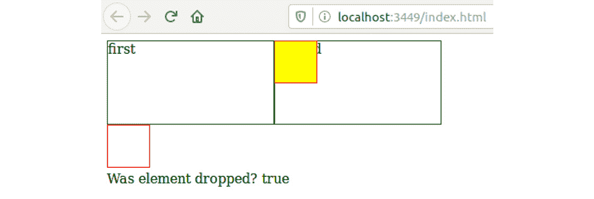

图 9.47：掉落元素

在这个练习中，我们创建了一个拖放应用程序。我们使用了 JavaScript 互操作性来访问函数、对象和字段。

在编码这个应用程序时我们没有遇到任何问题。有时我们的应用程序不会按预期运行。在下一节中，我们将探讨 Clojure 中的异常和错误处理。

# Clojure 中的异常和错误

在理想的世界里，每个程序都能在没有问题的情况下运行。在现实世界中，错误会发生，程序不会按计划运行。Java 和 Clojure 中的错误和异常是一种机制，用于在发生此类意外情况时通知开发者。

错误表示一个应用程序不应该尝试捕获或处理的严重问题。异常表示应用程序可能想要捕获的条件。换句话说，错误是应用程序无法从中恢复的情况。这些条件可能是磁盘空间或内存不足。如果一个应用程序在保存数据时耗尽磁盘空间，那么这个应用程序无法实现其目的。除非我们提供更多的磁盘空间，否则应用程序无法成功运行。异常是应用程序可以从中恢复的条件。这样的条件可能是尝试在建立数据库连接之前从数据库中访问列表，或者尝试在字符串上使用算术运算而不是数字。

错误和异常都是`Throwable`类的子类。这个类表示一个可以被抛出的 Java 对象。抛出意味着引发一个警告，如错误或异常。Java 提供了四种结构来处理错误和异常：

+   `throw`

+   `try`

+   `catch`

+   `finally`

`throw` 允许开发者抛出一个异常。我们可以有一个接受用户输入，例如他们的年龄的 Web 应用程序。在这个应用程序中，我们可以在显示受年龄限制的内容之前检查用户的年龄。当我们对输入执行算术运算时，我们期望从用户那里得到一个数字。如果用户输入了一个字符串，则应用程序无法执行此类计算。在这种情况下抛出错误将提醒应用程序输入不正确。一旦我们抛出一个异常或错误，我们就可以使用剩下的三个 Java 构造来处理它们。

`try` 是 Java 中的一个保留字，允许开发者编写一个可能产生 `Throwable` 对象的代码块。这段代码位于 `try` 块内，并受到错误的保护。回到我们的应用程序，年龄检查将被放置在 `try` 块内。当我们遇到错误或异常时，我们可以处理它。第三个构造将帮助我们做到这一点。

`catch` 是 Java 中的一个保留字，允许开发者处理和解决异常和错误。当遇到指定的异常或错误时，`catch` 块下的代码块将被执行。在我们的例子中，当我们尝试操作一个年龄字符串（如数字）时，会抛出一个异常，并执行 `catch` 块。在这个块中，我们可以向用户返回一个消息，告诉他们需要输入数字。

`finally` 是 Java 中处理异常和错误的最后一个保留字。在 `finally` 下的代码块总是被执行。有些情况下，我们希望在遇到异常与否的情况下都执行代码。一个例子是 I/O 操作。如果文件不存在，打开文件可能会引发错误。如果文件存在，则不会抛出错误。打开文件使用计算机资源，如 RAM，我们希望在完成读取文件后释放这些资源。在读取 `finally` 块后关闭文件是一种常见的做法。它如此常见，以至于 Clojure 提供了我们在本章 I/O 部分看到的 `with-open` 宏。

`try-catch-finally` 块最常见的一个例子是读取或写入文件。在 `try` 块内，我们有一个读取或写入文件的操作。`catch` 块将防止 I/O 异常，如文件不存在。在 `finally` 块中，我们将有代码来关闭文件。关闭文件释放了计算机资源，以便其他任务使用。

以下表格展示了 Java 中最常见的异常和错误：

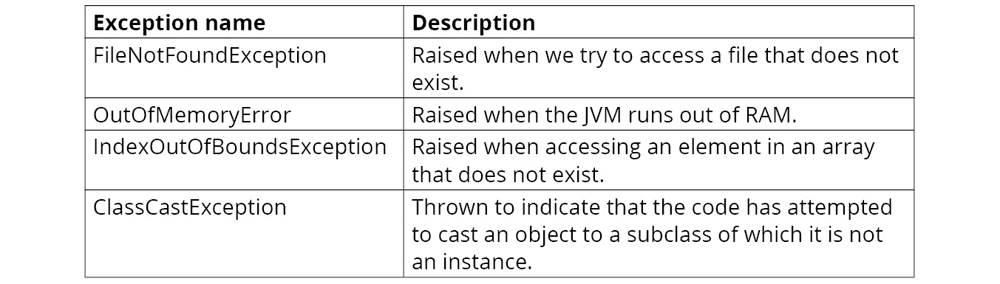

图 9.48：Java 中的常见异常和错误

在下一个练习中，我们将学习如何在 Clojure 中使用 `throw`、`try`、`catch` 和 `finally`。

## 练习 9.10：在 Clojure 中处理错误和异常

本练习的目的是学习如何在 Clojure 中处理异常和错误。在 Clojure 中，我们通常与 Java 的数据一起工作。在这个练习中，我们将创建一个函数，它接受一个 Java `ArrayList`实例和一个索引。`ArrayList`类类似于 Clojure 中的向量，我们在*第二章*，*数据类型和不可变性*中看到了它。`ArrayList`类存储数据。我们可以使用索引从`ArrayList`类中访问元素，就像我们在 Clojure 中的向量一样。从`ArrayList`中访问元素可能会引发异常。在设计我们的函数时，我们将处理抛出的异常：

1.  打开终端并启动 REPL：

    ```java
    lein repl
    ```

    在打开 REPL 后，我们将定义一个`ArrayList`实例。

1.  我们将创建一个包含三个数字的`ArrayList`：

    ```java
    (def three-numbers-array (java.util.ArrayList. [0 1 2]))
    ```

1.  我们有一个包含三个数字的数组，从 0 到 2：

    ```java
    three-numbers-array
    ```

    输出如下：

    ```java
    [0 1 2]
    ```

    我们将创建一个函数，使我们能够访问数组的元素。

1.  `array-list-getter`函数将使我们能够访问数组中的元素：

    ```java
    (defn array-list-getter [array index]
          (.get array index))
    ```

    `array-list-getter`函数接受两个参数：一个数组和一个索引。我们使用传递的索引从数组中访问一个元素。

1.  当我们访问数组中存在的元素时，我们会得到它：

    ```java
    (array-list-getter three-numbers-array 1)
    ```

    输出如下：

    ```java
    1
    ```

    我们想要获取索引为 1 的元素，并且成功获取到了。

1.  当我们尝试访问一个不存在的元素时，Clojure 会抱怨：

    ```java
    (array-list-getter three-numbers-array 5)
    ```

    输出如下：

    ```java
    IndexOutOfBoundsException Index: 5, Size: 3 java.util.Arraylist.rangeCheck (ArrayList.java:657)
    ```

    我们的数组只有三个元素。当我们尝试访问索引为`5`的元素时，Clojure 会引发`IndexOutOfBoundsException`。

1.  我们可以捕获代码抛出的错误：

    ```java
    (defn array-list-getter [array index]
          (try
            (.get array index)
            (catch IndexOutOfBoundsException ex
              (str "No element at index " index))))
    ```

1.  新的`array-list-getter`定义捕获了`IndexOutOfBoundsException`：

    ```java
    (array-list-getter three-numbers-array 5)
    ```

    输出如下：

    ```java
    "No element at index 5"
    ```

    在`catch`块中，我们指定要捕获的错误或异常以及如何处理它。在这里，我们返回信息表明数组在传递的索引处没有元素。

1.  如果我们的代码没有抛出异常，则`catch`块不会执行：

    ```java
    (array-list-getter three-numbers-array 1)
    ```

    输出如下：

    ```java
    1
    ```

    我们在索引`1`处有一个元素。`array-list-getter`函数为我们返回这个数字。没有抛出异常。

1.  `finally`块中的代码总是在`try`块完成之前执行。即使没有抛出异常，也会发生这种情况：

    ```java
    (defn array-list-getter [array index]
          (try
            (.get array index)
            (catch IndexOutOfBoundsException ex
              (str "No element at index " index))
            (finally (println "Login usage of array-list-getter"))))
    ```

1.  执行这段正确的代码会返回预期的结果，并打印出一条消息，表明此代码总是会被执行：

    ```java
    (array-list-getter three-numbers-array 1)
    ```

    输出如下：

    ```java
    Login usage of array-list-getter:
    1
    ```

    我们可以看到，当代码没有抛出任何错误或异常时，只有`finally`块被执行，而没有`catch`块。

1.  当我们的代码将引发错误情况时，`catch`和`finally`块将被执行：

    ```java
    (array-list-getter three-numbers-array 5)
    ```

    这次，我们尝试访问一个不存在的元素。这段代码将引发异常并执行`finally`块。在 REPL 中，我们看到两条消息。一条来自`catch`块，另一条来自`finally`块。

    在这个练习中，我们学习了错误和异常。Clojure 从 Java 中重新使用了这些构造。可以抛出错误或异常的代码由 `try` 块保护。当抛出异常时，`catch` 块中的代码将被执行。对于某些代码需要在不考虑抛出的异常的情况下运行的情况，使用 `finally` 块。

就像在 Java 中一样，错误在 JavaScript 中也会发生。在本章的最后部分，我们将学习 JavaScript 中的错误以及如何在 ClojureScript 中处理它们。

# JavaScript 中的错误

在上一节中，我们学习了 Java 中的错误和异常以及如何在 Clojure 中处理它们。在 JavaScript 应用程序中导致问题的意外情况也会发生。这导致需要处理错误。JavaScript 不区分错误和异常，因此任何导致应用程序无法按预期运行的代码情况都是错误。

就像在 Java 中一样，在 JavaScript 中，我们有处理错误的工具。JavaScript 提供了四个构造：

+   `throw`

+   `try`

+   `catch`

+   `finally`

它们与我们之前章节中看到的一样。JavaScript 重新使用了来自其他语言（如 Java）的错误处理概念。由于 JavaScript 不是 Java，我们在 ClojureScript 中处理错误的方式与 Clojure 中不完全相同。它非常接近，但直接从 Clojure 复制的代码在 ClojureScript 中不会立即工作。在下一个练习中，我们将看到如何在 ClojureScript 中处理 JavaScript 错误，并检查与 Clojure 中错误处理的微小语法差异。

## ClojureScript Leiningen 模板

我们已经使用 Leiningen 为我们创建了项目。当我们创建一个新项目时，我们使用项目模板。模板开发者可以在互联网上发布项目模板，其他开发者（就像我们一样）可以使用这些模板来创建项目。

到目前为止，我们已经使用 Figwheel 创建了 ClojureScript 项目。正如我们所学的，Figwheel 为我们提供了大量的默认配置。一个新的 Figwheel 项目带有热代码重新加载、REPL 和测试等功能。

有时候我们不需要 Figwheel 提供的所有这些美好的东西。我们想要一个简单的 ClojureScript 设置。对于这种情况，我们可以使用 `mies` 项目模板。`mies` 模板为 ClojureScript 创建了一个基本的项目结构。

再次强调，对于大多数我们想要开发网站应用程序的情况，我们会使用 Figwheel。在罕见的情况下，当我们想要一个最小的 ClojureScript 项目设置时，我们将使用 `mies`。

## 练习 9.11：在 ClojureScript 中处理错误

这个练习的目的是学习 ClojureScript 如何处理 JavaScript 错误。在这个练习中，我们将编写一个函数来缩写编程语言名称。当一个编程语言不受支持时，我们将抛出一个错误来通知用户该语言不受支持：

1.  创建项目：

    ```java
    lein new mies error-handling
    ```

    此命令将为我们创建一个新的项目。

1.  我们将从命令行运行 ClojureScript REPL：

    ```java
    scripts/repl
    ```

    这启动了 REPL。

    

    图 9.49：REPL 的输出

    当 REPL 启动时，我们可以调查 ClojureScript 中的错误处理。

1.  在我们的代码中，我们将支持以下语言：

    ```java
    (def languages {:Clojure "CLJ"
                              :ClojureScript "CLJS"
                              :JavaScript "JS"})
    ```

1.  我们将实现一个缩写编程语言名称的函数：

    ```java
    (defn language-abbreviator [language]
      (if-let [lang (get languages language)]
              lang
              (throw (js/Error. "Language not supported"))))
    ```

    函数将尝试从之前定义的语言哈希中获取语言的简短版本。

    如果找不到语言，我们将抛出一个错误。ClojureScript 中 `throw` 的语法与我们之前看到的 Clojure 语法非常相似。在这里，我们不是使用 Java 类，而是从 `js` 命名空间访问 `Error` 对象。

1.  当一个函数用一个有效的参数调用时，它返回编程语言的缩写名：

    ```java
    (language-abbreviator :JavaScript)
    ```

    输出如下：

    ```java
    "JS"
    ```

    我们看到 JavaScript 的简称是 `JS`。

1.  当我们用一个无效的参数调用函数时，它将抛出一个错误：

    ```java
    (language-abbreviator :Ruby)
    ```

    这将返回以下错误：

    ```java
    Execution error (Error) at (<cljs repl>:1)
    Language not supported
    ```

    我们看到 Ruby 不是一个受支持的语言，并且用 Ruby 作为参数调用 `language-abbreviator` 函数会抛出一个错误。我们知道如何在 ClojureScript 中抛出错误。现在我们将看到如何捕获它们。

1.  我们将创建一个返回“一周语言”的函数：

    ```java
    (defn get-language-of-the-week [languages]
          (let [lang-of-the-week (rand-nth languages)]
               (try
                 (str "The language of the week is: " (language-abbreviator lang-of-the-week))
                 (catch js/Error e
                   (str lang-of-the-week " is not a supported language")))))
    ```

    函数使用 Clojure 的 `rand-nth` 函数从序列中随机选择一个元素。使用这种语言，我们尝试获取语言的缩写版本。如果语言不受支持并且抛出错误，我们将捕获错误并通知用户该语言不受支持。

1.  使用不受支持的语言调用 `get-language-of-the-week` 函数将导致错误：

    ```java
    (get-language-of-the-week [:Ruby :Kotlin :Go])
    ```

    输出如下：

    ```java
    "Go is not a supported language"
    ```

    `Go` 语言被选为一周的语言。遗憾的是，我们没有 `Go` 的缩写名。`language-abbreviator` 函数抛出的错误被 `get-language-of-the-week` 函数中的 `catch` 块捕获。

1.  我们将使用支持的语言调用 `get-language-of-the-week` 函数：

    ```java
    (get-language-of-the-week [:Clojure :JavaScript :ClojureScript])
    ```

    输出如下：

    ```java
    "The language of the week is: CLJS"
    ```

    当我们使用支持的语言调用 `get-language-of-the-week` 函数时，我们得到所选语言的缩写名。

1.  我们将扩展我们的“一周语言”函数以包括 `finally` 块：

    ```java
    (defn get-language-of-the-week [languages]
          (let [lang-of-the-week (rand-nth languages)]
               (try
                 (str "The language of the week is: " (language-abbreviator lang-of-the-week))
                 (catch js/Error e
                   (str lang-of-the-week " is not a supported language"))
                 (finally (println lang-of-the-week "was chosen as the language of the week")))))
    ```

    使用 `finally` 块，我们可以执行我们想要运行的任何代码，无论我们的代码中抛出什么错误。

1.  我们将从支持的语言中选择一周的语言：

    ```java
    (get-language-of-the-week [:Clojure :JavaScript :ClojureScript])
    ```

    输出如下：

    ```java
    ClojureScript was chosen as the language of the week
    "The language of the week is: ClojureScript"
    ```

    ClojureScript 被选为一周的语言。`get-language-of-the-week` 函数返回所选语言的缩写名和 `finally` 块的消息。

1.  我们将从不受支持的语言中选择“一周语言”：

    ```java
    (get-language-of-the-week [:Ruby :Kotlin :Go])
    ```

    输出如下：

    ```java
    :Kotlin was chosen as the language of the week
    ":Kotlin is not a supported language"
    ```

    Kotlin 被选为一周的语言。`get-language-of-the-week` 函数返回了两条消息：`catch` 块中关于 Kotlin 不是受支持语言的提示和 `finally` 块中的消息。

我们刚刚看到了 ClojureScript 中 `try-catch-finally` 块的使用。使用这些结构将帮助我们编写能够处理许多意外情况的代码。

现在我们知道如何在 Clojure 和 ClojureScript 中处理异常。我们看到了如何使用 JavaScript 和 ClojureScript 之间的互操作性。是时候将我们的知识付诸实践了。我们将编写一个使用 JavaScript 互操作性的 ClojureScript 应用程序。

## 活动 9.02：创建支持台

本活动的目标是编写一个使用外部 JavaScript 库的 Web 应用程序。我们将创建一个支持台应用程序来管理在支持台中提出的问题。该应用程序允许我们对问题进行排序并在完成后解决它们。通过排序问题，我们可以提高单个问题的优先级。

应用程序将具有以下功能：

+   显示列表被排序的次数：

    低于三次：很少次数

    低于六次：中等次数

    超过六次：多次

+   通过优先级过滤问题列表，例如仅显示优先级高于 3 的问题。

+   对问题列表进行排序。

+   解决一个问题。

以下步骤将帮助您完成活动：

1.  创建一个新的项目。

1.  在 `project.clj` 中将 `jayq` 和 `cuerdas` 库作为依赖项添加。

1.  创建用于按优先级过滤问题列表的 `utils` 函数。

1.  创建用于获取排序后问题列表的 `utils` 函数。

1.  创建用于按问题计数获取排序后消息的 `utils` 函数。

1.  创建用于从列表中删除问题的 `utils` 函数。

1.  创建在排序完成后被调用的 `utils` 函数。

1.  在 `index.html` 中添加 jQuery 和 jQuery UI。

1.  将 `jayq`、`cuerdas` 和 `utils` 导入核心命名空间。

1.  定义优先级列表。

1.  定义应用程序状态。

1.  定义计数器 Rum 组件。

1.  在点击函数上创建问题。

1.  定义问题项 Rum 组件。

1.  定义反应性问题组件。

1.  定义反应性页面内容组件。

1.  使项目组件可排序。

1.  挂载页面组件。

1.  调用 `mount` 函数。

1.  调用可排序函数。

1.  运行应用程序。

初始问题列表将如下所示：

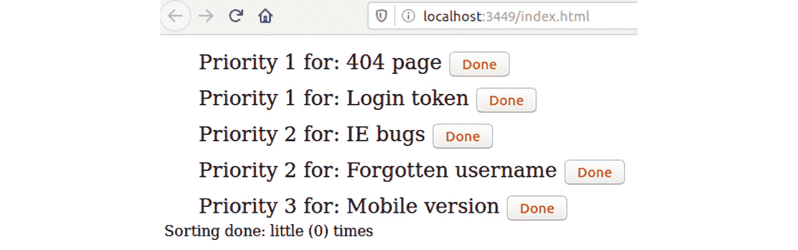

图 9.50：初始问题列表

排序后的问题列表将如下所示：

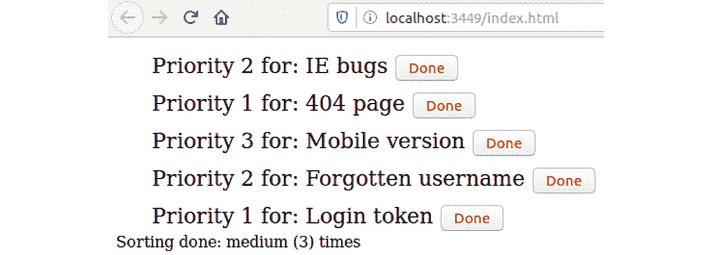

图 9.51：排序后的问题列表

解决三个问题后的问题列表将如下所示：

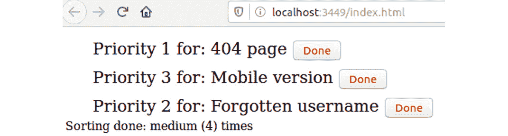

图 9.52：解决问题后的问题列表

注意

本活动的解决方案可在第 718 页找到。

# 摘要

在本章中，我们学习了 Clojure 和 Java 的互操作性。我们看到了如何在 Clojure 中导入 Java 类。我们构造了 Java 类的实例并在这些实例上调用方法。我们还学习了帮助我们在 Clojure 中使用 Java 的宏。

接下来，我们学习了 Java 中的输入/输出（I/O）操作。我们从磁盘访问文件，进行读取和写入内容。我们看到了如何使用键盘从用户那里获取输入，以及如何将信息显示回用户。

之后，我们学习了 ClojureScript 中的互操作性。我们创建了一个使用 JavaScript 库中的对象和方法进行拖放操作的应用程序。

最后，我们学习了 Clojure 和 ClojureScript 中的异常和错误。我们看到了错误是如何抛出的，以及如何使用 `try-catch` 块来防范错误。我们还研究了 `finally` 块及其使用时机。

我们通过开发一个帮助台应用程序来结束本章的学习，该应用程序允许用户按优先级排序项目列表。

在下一章中，我们将探讨 Clojure 和 ClojureScript 中的测试。我们将了解为什么测试很重要，这两种语言提供了哪些测试库，以及如何在 Clojure 和 ClojureScript 中使用测试库。
