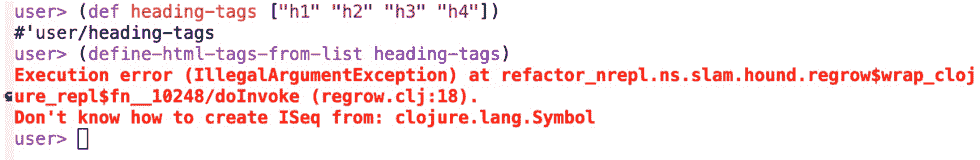
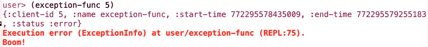
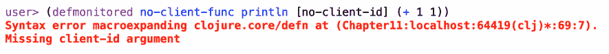
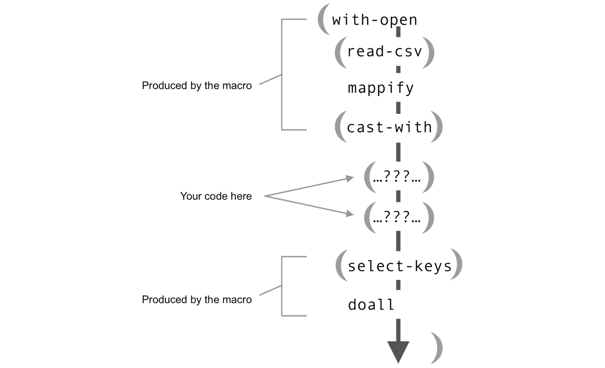

# 第十一章：11. 宏

学习目标

在本章中，你将学习 Clojure 宏的工作原理以及如何编写它们。宏是 Clojure 的一个非常强大的特性，在许多其他非 Lisp 语言中根本不存在。编写宏需要学习一些新的概念和一些新的技能。本章将带你了解基本概念：区分编译时和运行时执行、引用策略和宏卫生。

到本章结束时，你将能够自动生成函数并创建自定义环境以简化你的代码。

# 简介

**宏**是 Lisp 几十年来的一大特色。它们有时被描绘为 Lisp 世界的一种超级能力。虽然其他语言中也有宏，但几十年来，Lisp 拥有最完整的宏系统。为什么是这样？Lisp 家族的语言共享编写修改自身代码的能力。人们经常谈论“代码即数据”：Lisp 程序，其嵌套的括号称为**s 表达式**，实际上就是列表。作为语言，Lisp 擅长操作列表。Lisp 这个名字最初来自“LISt Processor”，当这种语言在 1958 年首次发明时。因此，Lisp 可以操作 Lisp 程序的代码。通常，这意味着程序修改了自己的代码。

注意

术语**同构性**通常应用于 Lisp 语言。虽然这个术语的确切含义取决于说话者是谁，但通常意味着 Lisp 是用它们可以自己操作的形式编写的，并且这些相同的结构在 Lisp 解释器或编译器内部或多或少是镜像的。

有时，这被称为**元编程**：编写一个将为你编写程序的程序。如果这听起来太好了而不真实，那是因为它确实如此。当然，宏不能为你做所有事情。不过，它们可以编写你的程序的一部分，通过移除一些样板代码和其他重复形式，或者通过变换语言的语法以更好地适应手头的任务，使你的代码更容易编写。

这是否曾经发生在你身上？你正在处理一个大项目，你发现自己一个接一个地编写函数和方法，它们几乎完全相同。你知道 DRY 原则：*不要重复自己*。“也许我这里缺少一个抽象，也许我可以简化这个，”你对自己想。“然而，当你尝试时，总是有*一个*需要不同且不能抽象掉的代码片段。这可能是每次都不同的条件逻辑。所以，你放弃了更干净的解决方案，继续敲击键盘。宏可能有所帮助。”

这里有一个稍微更具体的场景。你正在编写包含大量布尔逻辑的代码。几天后，你感觉你的代码库中的几乎每个函数都有几个这样的：

```java
(and
  (or (> x 23) (> y 55))
  (or (= c d) (= e f))
  (or (> a 55) (> b 55)))
```

每次逻辑都略有不同，因此你不能编写一个函数，然而每次逻辑都如此相似，以至于你感觉自己在不断地重复自己。如果你可以只写这个会怎么样呢？

```java
(and-ors (> x 23) (> y 55) | (= c d) (= e f) | (> a 55) (> b 55))
```

好吧，你可以。使用宏。

这消除了嵌套括号的一层，因此更容易输入。甚至可能更容易阅读。

有几个原因使得这在使用函数时变得不可能。最重要的原因是像`and-ors`这样的宏保留了`and`（它本身也是一个宏）的“短路”属性。一旦某个条件失败，评估就会停止，剩余的条件将被忽略，这可能会带来性能上的好处，或者避免可能的副作用。另一个原因是，我们能够在使用宏之前不需要定义`|`作为分隔符号。这就像能够定义我们自己的语言运算符一样。

这种“魔法”之所以可能，是因为宏是在你的代码编译之前执行的。它们的目的是在代码传递给编译器之前对其进行转换。如果这听起来复杂且令人困惑，那么，有时确实如此。然而，通过构建具体的例子，你很快就会意识到，尽管宏不是魔法的，但它们是有用的。而且，尽管它们可能非常复杂，但并不总是必须如此。了解它们的工作原理也将帮助你避免在不应该是最佳解决方案时使用它们。

Clojure 提供了一个基于——并改进了——Common Lisp 宏系统的现代宏系统，因此它是一个非常强大的工具。尽管如此，Clojure 程序员通常编写的宏比 Common Lisp、Scheme 或 Racket 程序员要少得多。原因可能多种多样。任何关于宏的书籍，在任何 Lisp 中，通常都会首先警告说，只有在你绝对确定一个函数不会工作的时候才应该使用宏。通常，Clojure 的函数式编程足够有用和强大，以至于编写宏实际上并不是必需的。

有时候，尽管如此，宏可能是解决问题的最佳解决方案，或者可以帮助简化原本可能复杂和/或重复的代码。学习编写宏也是任何自重的 Clojure 程序员必经的仪式。那么，让我们开始吧！

# 什么是宏？

宏是在你的代码编译之前执行的一段代码。宏调用中包含的代码被转换成不同的东西，然后传递给编译器。在 Clojure 中，宏是通过调用`defmacro`来定义的。对`defmacro`的调用看起来与对`defn`的调用相当相似：

```java
(defmacro my-macro
  "Macro for showing how to write macros"
  [param]
  ;;TODO: do something
  )
```

尽管表面上看起来相似，但宏和函数之间存在着巨大的差异。与函数不同，宏不是在运行时被调用的。当你的程序最终开始运行时，宏已经被调用。它们产生的代码已经包含在你的程序中，*就像你亲自输入一样*：

![图 11.1：将编译时与运行时分开是理解宏的关键

![img/B14502_11_01.jpg]

图 11.1：将编译时与运行时分开是理解宏的关键

当你思考和使用宏时，请记住这个想法：你代码中的任何宏原则上都可以被你自己输入的代码所替换。有些宏非常复杂，用手工代码替换它们会非常困难且耗时，但只要有足够的时间、耐心和专业知识，理论上是可以做到的。就像你在运行代码之前先写代码一样，宏在代码运行之前会被展开。

## 一个非常简单的宏

让我们从一个非常简单且不太有用的宏开始：

```java
(defmacro minimal-macro []
  '(println "I'm trapped inside a macro!"))
```

这看起来很像一个函数定义。我们也可以这样写：

```java
(defn minimal-function []
  (println "I'm trapped inside a function!"))
```

如果我们在 REPL 中运行这两个，结果也是相同的：

```java
user> (minimal-macro)
I'm trapped inside a macro!
nil
user> (minimal-function)
I'm trapped inside a function!
nil
```

这两个定义之间只有一个有意义的区别，而且这个区别非常小。你看到它了吗？是那个 `'`，它是 `quote` 特殊形式的缩写。尽管它很小，但它产生了巨大的影响。

当我们运行 `minimal-function` 时，Clojure 运行时只是简单地执行对 `println` 的调用。当我们运行 `minimal-macro` 时，宏实际上在 Clojure 运行时读取源代码之前，将 `(println "I'm trapped inside a macro!")` 语句插入到你的源代码中。更准确地说，我们说 Clojure **展开**了宏。

最好的方法是通过使用 Clojure 的 `macroexpand` 函数来欣赏 `minimal-macro` 和 `minimal-function` 之间的区别，这个函数将宏调用转换成实际的代码。

这里是调用 `macroexpand` 在 `minimal-function` 调用上的结果：

```java
user> (macroexpand '(minimal-function))
(minimal-function)
```

这看起来有点多余，而且有很好的理由：`(minimal-function)` 不是一个宏，所以它只会展开成它自己。

注意

当调用 `macroexpand` 时，引用你正在展开的表式非常重要。否则，`macroexpand` 将尝试展开对 `minimal-function` 的调用。因为 `println` 返回 `nil`，所以结果将是 `nil`，也就没有东西可以展开。每次当你从 `macroexpand` 得到令人惊讶的结果时，确保你没有忘记引用宏。

展开 `(minimal-macro)` 的过程相当不同：

```java
user> (macroexpand '(minimal-macro))
(println "I'm trapped inside a macro!")
```

当我们在 REPL 中输入 `(minimal-macro)` 时，它会被展开成 `println` 表达式，就像你亲自输入一样。注意，展开后的形式不再被引用。（正如你可能开始猜测的那样，引用是宏编写的一个重要部分。）

## 编译时与运行时

为了看到引用的重要性，让我们尝试编写一个不带开头的 `'` 的宏：

```java
(defmacro mistaken-macro []
  (println "I'm trapped... somewhere!"))
```

在 REPL 中调用这个宏会产生相同的结果：

```java
user> (mistaken-macro)
I'm trapped... somewhere!
nil
```

这有什么问题？`mistaken-macro` 似乎和其他宏一样好使……或者不是吗？让我们尝试展开它：

```java
user> (macroexpand '(mistaken-macro))
I'm trapped... somewhere!
nil
```

这很奇怪！输出与直接调用宏时的输出相同，但它与 `minimal-function`（它只是展开成自身）和 `minimal-macro`（它展开成 `println` 表达式）都完全不同。那么，这里到底发生了什么？为什么移除 `quote` 引号会有如此大的差异？

调用 `(mistaken-macro)` 产生与其它形式相同的输出几乎可以称为巧合。`println` 的调用发生了，但它发生在编译时。由于 `println` 返回 `nil`，`(mistaken-macro)` 展开成正好是 `nil`。这也是为什么我们在调用 `macroexpand` 时看到 `"I'm trapped…"` 消息的原因：那条消息是宏展开的副作用！

`minimal-macro` 和 `mistaken-macro` 之间的区别在于前者通过引用形式实际上返回了一个 `println` 符号和消息字符串。另一方面，`mistaken-macro` 展开成 `nil`，因为它在展开时立即调用 `println`。

在这里有几个重要的观点，我们将在本章的其余部分进行阐述：

+   宏展开时和代码运行时实际上会运行代码。这就是为什么 `mistaken-macro` 实际上会打印出一条消息。

+   理解编译时间和运行时间之间的区别是很重要的。

+   引用很重要，因为它是你作为程序员控制宏展开时执行哪些代码以及运行时运行哪些代码的方式之一。

记住：宏是编写代码的代码。让我们编写一个稍微复杂一点的宏，它将展开成任意数量的 `println` 调用。我们的目标是，如果我们提供 `3` 作为参数，宏将展开成这样：

```java
(do
  (println "Macro")
  (println "Macro")
  (println "Macro"))
```

注意

当与宏一起工作时，始终先思考宏要生成的代码，然后再考虑如何生成它是一个好主意。

与将其视为一系列执行步骤相比，最好将其视为包含一个符号（`do`）和一系列子列表的列表，每个子列表包含一个符号和一个字符串。将 `do` 和 `println` 视为符号而不是特殊形式和函数是一个好方法，因为在展开时，我们只想确保最终生成的形式具有正确的符号并按正确的顺序排列。如果引用了 `println`，那么宏展开代码也是这样看待它的。

要生成一个列表的列表，我们可以使用 `repeat`：

```java
user> (repeat 3 '(println "Macro"))
((println "Macro")
 (println "Macro")
 (println "Macro"))
```

那个单引号又出现了。如果我们省略它，我们会得到 `(nil nil nil nil nil)`。多亏了引用，那些 `println` 调用中没有一个被调用。我们正在接近我们的目标代码，甚至还没有调用 `defmacro`。

唯一缺少的是初始的 `do` 符号。只要我们引用它，向列表的头部添加一个值也是相当容易的：

```java
user> (cons 'do (repeat 3 '(println "Macro")))
(do
 (println "Macro")
 (println "Macro")
 (println "Macro"))
```

我们的代码！剩下要做的就是将其封装成一个宏：

```java
user> (defmacro multi-minimal [n-times]
        (cons 'do (repeat n-times '(println "Macro"))))
```

当我们直接调用宏时，它似乎可以工作：

```java
user> (multi-minimal 3)
Macro
Macro
Macro
nil
```

`macroexpand`确认了这一点：

```java
user> (macroexpand '(multi-minimal 3))
(do
 (println "Macro")
 (println "Macro")
 (println "Macro"))
```

这里的目的是表明宏是写代码的代码。`multi-minimal`的内容看起来并不像输出。我们甚至可以更进一步，将它们包装在一个函数中：

```java
user> (defn multi-min [n-times]
        (cons 'do (repeat n-times '(println "Macro"))))
#'user/multi-min
user> (defmacro multi-minimal-two [n-times]
        (multi-min n-times))
#'user/multi-minimal-two
user> (multi-minimal-two 3)
Macro
Macro
Macro
nil
```

正如我们稍后将要看到的，一些宏看起来有点像模板，但没有任何东西要求它们的定义与输出的代码相似。将代码构建代码分离到单独的函数中可以是一个有用的模式，特别是对于调试。

## 运行时参数

显然，我们无法期望这个特定的宏非常有用。然而，如果它能打印出除了“宏”之外的内容那就很好了。如果我们给它一个第二个参数——一个要传递给所有`println`调用的字符串呢？已经有一个参数了；添加第二个参数应该很容易……对吧？

让我们尝试只添加一个参数并将其传递给`println`：

```java
user> (defmacro parameterized-multi-minimal [n-times s]
        (cons 'do (repeat n-times '(println s))))
#'user/parameterized-multi-minimal
```

不幸的是，这不起作用：

```java
user> (parameterized-multi-minimal 3 "My own text.")
Syntax error compiling at (Chapter11:localhost:58838(clj)*:49:36).
Unable to resolve symbol: s in this context
```

问题出在哪里？像往常一样，当我们不理解宏的问题时，我们会求助于`macroexpand`：

```java
user> (macroexpand '(parameterized-multi-minimal 3 "My own text."))
(do (println s) (println s) (println s))
```

当宏展开完成后，`s`参数已经消失了。它去哪里了？与`defn`不同，`defmacro`不提供运行时变量绑定的上下文。在宏展开期间，原始的`n-times`参数是可用的，但在之后，宏本身已经被它产生的代码所取代。`n-times`或`s`都没有留下任何痕迹。

当然，肯定有绕过这个问题的方法，因为如果宏不接受参数，它们将变得相当无用。如果我们想要有一个上下文，我们只需要在运行时仍然存在的引用代码中显式地创建那个上下文。在这种情况下，最简单的解决方案是一个`let`绑定。我们需要将我们的目标代码更改为如下所示：

```java
(let [string-to-print "My own text."]
  (println string-to-print)
  (println string-to-print)
  (println string-to-print))
```

为什么`let`绑定被称为`string-to-print`而不是`s`？记住，当代码最终运行时，`s`和`n-times`不再作为符号存在。`n-times`以一种方式存在，因为它决定了有多少`println`调用最终出现在展开表达式中。从宏调用中来的`s`参数需要继续存在，不是作为`string-to-print`，而是作为绑定给`string-to-print`的字符串。换句话说，在先前的目标代码中，`s`是存在的：它是`"My own text"`。

我们可以通过使用 Clojure 的一些列表操作能力来仔细构建我们需要的精确代码，也就是说，一个包含`println`表达式子列表的`let`绑定：

```java
(defmacro parameterized-multi-minimal [n-times s]
  (concat (list 'let ['string-to-print s])
          (repeat n-times '(println string-to-print))))
```

我们将检查以确保它工作：

```java
user> (parameterized-multi-minimal 3 "My own text.")
My own text.
My own text.
My own text.
nil
```

这次，当我们将其绑定到`string-to-print`时，`s`没有被引用。当宏展开时，`s`的值将被插入到宏将要返回的列表中。像`let`和`string-to-print`这样的项被引用，因为我们不希望在宏展开中包含它们的值；我们希望它们以符号的形式出现。

为了实现这一点，我们不得不做一些巧妙的引号操作，对某些项应用单引号，而对其他项不应用。这就是为什么我们使用 `list` 而不是 `'()``。单引号是 `(quote...)` 的快捷方式。`quote` 是一个特殊形式，其效果是引号括号内的所有内容，包括子列表。有时，这正是我们想要的，比如 `'(println string-to-print)`。我们需要列表中的两个项都作为符号出现，而不是作为值。`list` 简单地返回一个列表。通过使用 `list`，我们可以选择哪些项应该被引号引用，哪些不应该。

这不是一个最优的引号解决方案。简而言之，我们将看到 Clojure 提供了另一种更复杂的语法，这使得这更加容易。然而，基本原理是相同的，所以了解引号的工作机制是很好的。

在这个宏版本的另一个值得注意（或者简单地说，奇怪）的事情是：为什么我们使用 `concat` 来连接列表和 `repeat` 调用的结果？之前，我们是在 `do` 表达式内部包裹所有的 `println` 调用。现在有了 `let` 块，这不再是必要的了。同时，我们仍然需要确保 `println` 调用没有被包裹在列表中。使用 `concat` 解决了眼前的问题，但这并不是一个优雅的解决方案。在下一段中，新的引号语法也会使这变得更加容易。

# 语法引号

编写宏的艺术中，很大一部分在于掌握扩展代码和输出代码之间的分离。对这种分离的控制很大程度上取决于在宏展开时决定什么被引号引用，什么没有被引号引用。之前的例子开始揭示了标准 `quote` 特殊形式的局限性。一旦列表被引号引用，它的所有符号和子列表也会被 `quote`。因此，`quote` 是一个相当直接的工具。

因此，Clojure，像许多 Lisps 一样，提供了一个更复杂的引号机制，称为 `'`，即反引号字符，而不是标准的单引号。当单独使用时，反引号的行为与 `quote` 大致相同：默认情况下，所有符号和子列表都会被引号引用。区别在于，语法引号允许我们标记某些形式、子列表或符号，这些不应该被引号引用。

使用语法引号，我们可以简化之前章节中的宏：

```java
(defmacro parameterized-with-syntax [n-times s]
        '(do ~@(repeat n-times '(println ~s))))
```

这是如何工作的？这里有三点新内容：

+   在 `do` 形式和 `println` 形式前面的 `syntax-quote` 反引号

+   在 `s` 符号前面的 `~`

+   在 `repeat` 形式前面的 `~@`

`syntax-quote` 反引号开始语法引用。然后，我们可以看到两种防止对子元素进行引用的不同方式。其中最简单的是 `'(println ~s)` 中的波浪号：`println` 符号，当宏展开时，列表本身将被引用，但 `~s` 将评估为 `s` 的值。波浪号被称为 `unquote`。多亏了 `unquote`，我们现在可以将 `s` 的值插入到每个 `println` 调用中，我们不再需要将整个表达式包裹在一个 `let` 表达式中。

`~@` 被称为 `unquote-splicing`，一次做两件事。像 `unquote` 一样，它防止对其附加的表达式进行引用。然而，与 `unquote` 不同的是，它只适用于列表，因为它的作用是将列表的内容拼接到包含列表中。在此之前，我们必须使用 `cons` 或 `concat` 来避免所有 `(println "String!")` 表达式都被包裹在一个列表中。

展开后，对新宏的调用看起来像这样：

```java
user> (macroexpand '(parameterized-with-syntax 3 "Syntax quoting!"))
(do
 (clojure.core/println "Syntax quoting!")
 (clojure.core/println "Syntax quoting!")
 (clojure.core/println "Syntax quoting!"))
```

你可能会注意到与之前的一些宏展开相比有细微的差别：`println` 符号被命名空间化了！这是编写健壮宏的一个重要特性，我们将在探讨宏卫生问题时进一步探讨。首先，让我们先练习使用我们新的宏技能。

## 练习 11.01：and-ors 宏

在本章开头，为了激发你对宏魔法的兴趣，我们向你展示了一个名为 `and-ors` 的宏。它的目的是在有许多表达式包含在顶层 `and` 表达式中时，使编写嵌套布尔逻辑更容易。

考虑这个函数（希望，真正的代码会有更具描述性的参数名！）：

```java
(defn validate-params
  [a b c d]
  (and
    (or (> a 5) (> a b))
    (or (= b a) (> b 5))
    (or (> a c) (> c 5) (= c b))
    (or (= a d) (> d 5))))
```

这样的逻辑本身很难阅读，尤其是在有很多条件的情况下。

假设你正在编写一个将包含大量重要业务逻辑的库，这些逻辑大多用一系列布尔运算符表达，就像前面的函数那样。我们可以做的任何使它更简单的事情都将有助于提高你的代码库的可读性。`and-ors` 宏将是一个受欢迎的改进。在前面函数中，你可以用以下方式代替嵌套的 `or` 表达式：

```java
(defn validate-params
  [a b c d]
  (and-ors
    (> a 5) (> a b) |
    (= b a) (> b 5) |
    (> a c) (> c 5) (= c b) |
    (= a d) (> d 5)))
```

这是一个诚实的微小改进，但它确实去除了一些括号，并且通常有助于将重点放在逻辑表达式本身上。现在，我们只需要弄清楚如何使这个工作：

1.  从 `defmacro` 的骨架开始：

    ```java
    (defmacro and-ors [& or-exps]
      ;; TODO: write a macro
      )
    ```

    就像函数一样，宏可以是可变参数的，可以接受未知数量的参数。这正是我们在这里需要的，因为我们不知道会有多少 `or` 表达式。

1.  编写逻辑，每次在 `or-exps` 列表中出现 `|` 符号时，将其分割：

    ```java
    (defmacro and-ors [& or-exps]
      (let [groups (remove (partial = '(|)) (partition-by (partial = '|) or-exps))]
        ;; TODO: do something finally
        ))
    ```

    将 `or-exps` 的参数列表拆分成子列表是一个简单的序列操作。有几种方法可以做到这一点，包括编写一个小的外部函数。在这里，我们选择使用 `partition-by`。记住，`partition-by` 接收一个函数，该函数用于决定在哪里拆分列表。每当函数返回不同的响应时，列表就会被拆分。我们只关心当前项是 `|` 还是其他东西，这正是 `(partial = '|)` 要做的。这里的唯一技巧是我们需要引用 `|` 符号，以确保我们谈论的是符号本身，而不是它的值。（这是好事，因为它没有值。）

    根据 `|` 符号进行拆分会将符号作为子列表留下。你可以在 REPL 中尝试这个，如果你在输入中引用了 `|` 符号：

    ```java
    user> (partition-by (partial = '|) [1 2 '| 3 4])
    ((1 2) (|) (3 4))

    ```

    我们需要从结果中移除 `(|)` 子列表。我们将使用 `remove` 来完成这个任务：

    ```java
    (remove #(= '(|) %) (partition-by (partial = '|) or-exps))
    ```

    注意

    `|` 符号现在已从我们的代码中消失。它将以任何方式都不会出现在编译后的代码中。这就是为什么我们不必担心它被定义或命名空间化。从编译后的代码的角度来看，它就像它从一开始就不在那里一样。

    现在，我们有 `groups` 绑定，它包含一个列表的列表。

1.  准备输出外部的 `and` 表达式。

    我们想要创建的结构是包含零个或多个表达式的 `and` 表达式。所以首先，我们需要 `and` 表达式：

    ```java
    (defmacro and-ors [& or-exps]
      (let [groups (remove (partial = '(|)) (partition-by (partial = '|) or-exps))]
        '(and
            ;; TODO: the ors
            )))
    ```

    在这里，重要的是引用。`(and…)` 前面的反引号开始语法引用。这首先确保 `(and…)` 形式将被输出，其次确保我们能够使用 `splice-insert` 来包含新的 `or` 表达式。

1.  将每个子列表转换为 `or` 表达式。

    这里是完整的宏：

    ```java
    (defmacro and-ors [& or-exps]
      (let [groups (remove (partial = '(|)) (partition-by (partial = '|) or-exps))]
        '(and
            ~@(map (fn [g] '(or ~@g)) groups))))
    ```

    `map` 的调用将返回一个列表。由于我们不想在 `(and…)` 表达式内部有额外的括号，所以我们在这里使用 `insert-splice`。在匿名映射函数内部，我们需要再次开始语法引用，因为前面的 `~@` 暂停了它。这就是为什么我们在 `(or…)` 前面放上了反引号。同样的过程在 `groups` 的每个元素中都会重复，因为每个元素都是一个要放在 `(or…)` 表达式内部的项列表。

1.  测试并宏展开你的新宏：

    ```java
    user> (and-ors (> 5 3) (= 6 6) | (> 6 3) | (= 5 5 5))
    true
    ```

    它似乎有效。让我们用嵌套的 `and-ors` 来试一试：

    ```java
    user> (and-ors 
            (and-ors (= 3 3) | (= 5 5) (= 6 8))
              | 
              (> 5 3) (= 6 6) 
              | 
              (> 6 3) 
              | 
              (= 5 5 5))
    true
    ```

    宏展开将告诉我们我们是否得到了我们最初想要的。为了避免展开 `and` 和 `or` 宏，我们在这里使用 `macroexpand` 的不同版本，称为 `macroexpand-1`。这两个之间的区别是，当一个宏展开包含其他宏时，`macroexpand` 将递归地继续展开所有嵌套的宏，而 `macroexpand-1` 将在第一个宏之后停止。在编写自己的宏时，`macroexpand-1` 通常更直观，因为它阻止我们看到内置宏的细节，例如 `let` 或，如本例中的 `and` 或 `or`：

    ```java
    user> (macroexpand-1 '(and-ors (> 5 3) (= 6 6) | (> 6 3) | (= 5 5 5)))
    (clojure.core/and
      (clojure.core/or (> 5 3) (= 6 6))
      (clojure.core/or (> 6 3))
      (clojure.core/or (= 5 5 5)))
    ```

    这个练习展示了即使是四行的宏也能让你引入可能是有用的语法改进。是否编写像`and-ors`这样的宏的决定将基于是否在代码库中编写所有那些重复的布尔值变得痛苦。

## 练习 11.02：自动 HTML 库

在这个练习中，你需要编写一个宏，给定一个项目列表，自动为每个项目创建一个函数。这在需要大量非常相似函数的情况下非常有用。

回到*第六章*，*递归和循环*，你构建了一个库，将 Clojure 向量转换为 HTML，使用关键字来识别 HTML 标签。在那个系统中，HTML 元素会写成这样：

```java
[:h1 "First things first"]
```

输出如下：

```java
<h1>First things first</h1>
```

最近，一位同事决定用函数而不是向量重写这个库。使用这种新方法，HTML 元素会写成函数的形式：

```java
(h1 {:class "intro"} "First things first")
```

函数可以嵌套，这样开发者就可以在源代码中编写整个 HTML 页面。

很不幸，你的同事在完成项目之前就离开了，现在你需要接手这个项目。

你可以在[`packt.live/2Gf4bn9`](https://packt.live/2Gf4bn9)查看新库的样子。

阅读代码时，你开始看到库是如何工作的，以及为什么它会被放弃。你意识到，就像你的前同事一样，你不想为 HTML 规范中的每个元素编写单独的函数！这将是一个漫长且容易出错的复制粘贴过程，难以维护。仔细观察后，你开始怀疑你的前同事也有同样的想法。最后一个函数`tag-fn`看起来像是对这种方法的一种尝试性概括。它还包括了类似于*第四章*中 wrap-unwrap 技术的`mapcat`的巧妙使用，以便将项目列表插入到包含列表中。不幸的是，文件就到这里结束了。

使用`tag-fn`为每个元素生成一个函数似乎是个好主意。这意味着仍然需要为每种 HTML 元素定义一个`var`。你的代码看起来会是这样：

```java
(def p (tag-fn "p"))
(def ul (tag-fn "ul"))
(def li (tag-fn "li"))
(def h1 (tag-fn "h1"))
(def h2 (tag-fn "h2"))
(def h3 (tag-fn "h3"))
(def h4 (tag-fn "h4"))
;; etc. etc. etc.
```

这样做比手动编写所有函数要好得多，但仍然显得过于重复。也许宏可以帮助解决这个问题？

使用正确的宏，我们只需从 HTML 规范中复制一个元素列表，将它们用引号括起来，然后在加载源文件时运行一次宏：

```java
(define-html-tags "p" "ul" "li" "h1" "h2" "h3" "h4")
```

输出将是一系列`def`表达式，就像我们在前面的代码中所看到的那样。让我们看看：

1.  设置一个新的项目目录，并创建一个空的`deps.edn`文件。从本书的 GitHub 仓库（[`packt.live/2Gf4bn9`](https://packt.live/2Gf4bn9)）复制`htmlgen.clj`文件。你将在文件的底部添加你的代码。

1.  首先，勾勒出你想要生成的代码。因为我们需要能够生成任意数量的函数，所以我们的宏将返回一个`def`形式的列表。将这些形式包含在`do`表达式中会更简单：

    ```java
    (do
      (def h1 (tag-fn "h1"))
      (def h2 (tag-fn "h2"))
      (def h3 (tag-fn "h3"))
      (def h4 (tag-fn "h4")))
    ```

1.  使用语法引用将`syntax-quote`应用于`do`表达式来编写宏的骨架：

    ```java
    (defmacro define-html-tags [& tags]
      '(do
          ;; TODO: macro code
          ))
    ```

    注意

    我们给宏一个`[& tags]`。我们稍后会回到这一点。

1.  对`tags`中的参数进行映射，以生成一系列`def`表达式：

    ```java
    (defmacro define-html-tags [& tags]
      '(do
          ~@(map (fn [tagname]
                  '(def ~(symbol tagname) (tag-fn ~tagname)))
                tags)))
    ```

    这里有几个需要注意的地方。仔细看看哪些是引用的，哪些不是：使用`unquote-splice`（`~@`）确保`map`返回的元素是`do`表达式的直接子元素。然后，使用`syntax-quote`（`'`），我们引用整个`def`表达式，除了将要成为我们定义的变量名称的部分，我们使用`unquote`（`~`）来保护它不被引用。最后，`tag-fn`表达式从`def`前的反引号继承其引用。我们仍然需要使用`unquote`，以便将`tagname`值（例如`"h1"`）插入，而不是仅仅插入`tagname`符号本身。

    这里需要`symbol`函数，因为输入是一个字符串。`tag-fn`接受一个字符串，但它的名称需要是一个符号。

1.  测试新的宏。评估宏定义，然后使用它来定义一些 HTML 元素函数：

    ```java
    (define-html-tags "h1" "h2" "h3" "h4" "h5" "p" "div" "span")
    ```

    通过复制官方的 HTML 标签列表，你可以快速实现整个标准。现在，你可以在`packt-clojure.htmlgen`命名空间内部使用你的新函数来生成 HTML 元素：

    ```java
    packt-clj.htmlgen> (div
                          (h1 "First things first")
                          (p {:class "intro"} "What's the best way to get started?"))
    "<div><h1>First things first</h1><p class=\"intro\">What's the best way to get started?</p></div>"
    ```

    它工作了。你已经满足了作业和管理的要求……至少目前是这样。

    自动生成大量函数是宏非常适合的任务。这样的宏不过是函数的一个模板。当然，宏可以做更多的事情，但有时，大量生成简单的函数正是你所需要的。

在这个练习中，我们编写的宏是可变参数的。它接受可变数量的参数，其参数列表如下：`[& tag]`。可能会有人想重写宏，使其接受标签名称的列表或向量。这样，我们就可以定义我们的列表，然后单独对它调用宏。这是我们的宏，重写为接受列表：

```java
(defmacro define-html-tags-from-list [tags]
  '(do
     ~@(map (fn [tagname]
              '(def ~(symbol tagname) (tag-fn ~tagname)))
            tags)))
```

不幸的是，这不起作用：

![图 11.2：在编译时，像 heading-tags 这样的符号只是一个符号，不是一个列表]



图 11.2：在编译时，像 heading-tags 这样的符号只是一个符号，不是一个列表

宏失败了，因为在编译时，`heading-tags`还不是列表。宏只能“看到”一个符号，就像错误信息所说的那样，它不知道如何从一个符号创建一个序列。练习中的宏代码需要在编译时访问实际的标签名称。

这就是为什么不能在宏上使用`apply`的原因：

```java
packt-clj.htmlgen> (apply define-html-tags ["br" "p" "a"])
Syntax error compiling at (Exercise01:localhost:52997(clj)*:116:24).
Can't take value of a macro: #'packt-clojure.htmlgen/define-html-tags
```

当 `apply` 调用发生时，代码已经运行，此时宏展开已经太晚了。同样，宏不能作为 `map` 或 `filter` 等函数的参数传递。虽然宏为语言带来了极大的灵活性，但使用宏而不是函数总是有代价的。

## 练习 11.03：扩展 HTML 库

你的团队对你的快速实现所有已知的 HTML 元素作为函数印象深刻，现在，HTML 生成库在你的组织中变得越来越受欢迎。正如成功的库经常发生的那样，使用它的开发者开始遇到问题。你的团队中最常见的挫败感之一是，在包含元素内部包裹元素列表很尴尬。

这里有一个常见用例的简单示例：通过映射字符串列表来创建无序列表（`<ul>`），将每个字符串转换为一个列表项（`<li>`）。多亏了原始 `tag-fn` 的编写方式，它能够处理序列以及字符串，因此从项目向量创建 HTML 列表的代码相当简单：

```java
(ul (map li ["item 1" "item2"]))
```

然而，这种模式在你的同事的代码中出现的频率如此之高，以至于他们开始抱怨你的库迫使他们重复。他们问道：“为什么不能更简单一些？我们知道当给 `ul` 一个列表时，将会产生一个 `(map li…)` 调用。这不能是自动的吗？”

“嗯，”你回答，“当然可以。”经过一番思考，你决定想让你的同事能够编写以下内容：

```java
(ul->li ["item 1" "item 2"])
```

这不仅适用于 `ul`。`ol->li` 也会非常有用。一些表格元素也可以使用相同的方法：`table->tr` 和 `tbody->tr` 对于表格行列表（`<tr>`）非常有用，同样，`tr->td` 对于包含表格单元格列表（`<td>`）的表格行（`<tr>`）也非常有用。你决定编写第二个、专门的宏 `define-html-list-tags`，它将接受标签名对并定义相应的函数：

1.  在上一个练习的同一文件中，定义一个辅助函数来构建新的函数。它将被命名为 `subtag-fn`，并且比 `tag-fn` 更简单，因为它不需要处理那么多不同的情况：

    ```java
    (defn subtag-fn [tagname subtag]
      (fn [content]
        (str
          (->opening-tag tagname nil)
          (apply str (map subtag content))
          (->end-tag tagname))))
    ```

    函数的内容看起来相对熟悉。这里唯一的新代码片段是 `(map subtag content)`。对于像 `ul→li` 这样的函数，`li` 函数（我们假设它已经定义好了——确保首先调用 `define-html-tags`！）将在 `content` 参数的每个项上被调用。

1.  测试辅助函数。辅助函数将在运行时被调用，因此很容易测试：

    ```java
    packt-clj.htmlgen> ((subtag-fn "ul" li) ["Item 1" "Item 2"])
    "<ul><li>Item 1</li><li>Item 2</li></ul>"
    ```

    再次注意，这是因为 `li` 函数已经定义好了。我们将其作为符号传递——`li`，不带引号——而不是像 `"ul"` 这样的字符串。`ul` 函数将在宏运行之后才会被定义。

    然而，这里有一个小问题：我们无法可选地传递一个属性映射。这破坏了我们为其他函数建立的接口，所以我们需要在继续之前修复它。

1.  将 `subtag-fn` 返回的匿名函数添加第二个参数：

    ```java
    (defn subtag-fn [tagname subtag]
      (fn subtag-function-builder
        ([content]
         (subtag-function-builder nil content))
        ([attrs content]
           (str
             (->opening-tag tagname attrs)
             (apply str (map subtag content))
             (->end-tag tagname)))))
    ```

    这段代码突出了匿名函数的两个有趣特性。首先，它们支持多个参数，这使得它们与 `defn` 定义的对应函数一样灵活。其次，尽管是匿名的，但它们可以有名字。这种特性存在于其他语言中，如 JavaScript，并且对于调试目的可能很有用。在阅读错误消息时，有一个函数名可以大有帮助。在 Clojure 中给匿名函数命名还有一个优点，即函数可以通过这种方式引用自己。因此，在前面的代码中，单个版本的函数可以用 `nil` 填充 `attrs` 参数，然后调用双参数版本。这样，我们就不必两次编写函数的逻辑。

1.  测试新的 `subtag-fn`：

    ```java
    packt-clj.htmlgen> ((subtag-fn "ul" li) {:class "my-class"} ["Item 1" "Item 2"])
    "<ul class=\"my-class\"><li>Item 1</li><li>Item 2</li></ul>"
    ```

    这有效。现在，让我们尝试单参数形式：

    ```java
    packt-clj.htmlgen> ((subtag-fn "ul" li) ["Item 1" "Item 2"])
    "<ul><li>Item 1</li><li>Item 2</li></ul>"
    ```

    它仍然有效！

1.  编写将定义如 `ul->li` 这样的函数的宏：

    设计宏的第一步通常是决定如何调用它。对这个宏的调用应该看起来像这样：

    ```java
    (define-html-list-tags ["ul" "li"] ["ol" "li"])
    (defmacro define-html-list-tags [& tags-with-subtags]
      '(do
         ~@(map (fn [[tagname subtag]]
                  '(do
                     (def ~(symbol tagname) (tag-fn ~tagname))
                     (def ~(symbol (str tagname "->" subtag)) (subtag-fn ~tagname ~(symbol subtag)))))
                tags-with-subtags)))
    ```

    要理解这里发生的事情，让我们从传递给 `map` 的匿名函数内部开始。第一行应该看起来很熟悉：

    ```java
    (def ~(symbol tagname) (tag-fn ~tagname))
    ```

    这与之前练习中的 `define-html-tags` 宏完全相同。即使我们要定义 `ul->li`，我们仍然需要定义 `ul` 函数。

    下一条是定义如 `ul->li` 这样的函数的地方：

    ```java
    (def ~(symbol (str tagname "->" subtag)) (subtag-fn ~tagname ~(symbol subtag)))
    ```

    这个定义与前面的代码遵循相同的模式，只是我们使用 `str` 来构建将成为函数名的符号，并将子标签字符串也转换成符号。

    这两个定义都被 `do` 表达式包裹，`map` 的输出反过来又被单个 `do` 表达式包裹。展开后，它看起来像这样：

    ```java
    packt-clj.htmlgen> (macroexpand '(define-html-list-tags ["ul" "li"] ["ol" "li"]))
    (do
     (do
      (def ul (packt-clj.htmlgen/tag-fn "ul"))
      (def ul->li (packt-clj.htmlgen/subtag-fn "ul" li)))
     (do
      (def ol (packt-clj.htmlgen/tag-fn "ol"))
      (def ol->li (packt-clj.htmlgen/subtag-fn "ol" li))))
    ```

1.  测试新的宏：

    ```java
    packt-clj.htmlgen> (define-html-list-tags ["ul" "li"] ["ol" "li"])
    #'packt-clj.htmlgen/ol->li
    packt-clj.htmlgen> (ol->li ["Item 1" "Item 2"])
    "<ol><li>Item 1</li><li>Item 2</li></ol>"
    packt-clj.htmlgen> (ol->li {:class "my-class"} ["Item 1" "Item 2"])
    "<ol class=\"my-class\"><li>Item 1</li><li>Item 2</li></ol>"
    ```

    它有效。

在之前的练习中，使用嵌套的 `do` 表达式可能看起来不够优雅。我们当然永远不会手动以这种方式编写代码！然而，对于由宏生成的代码，这真的不是问题。这并不意味着宏应该扩展成复杂的代码。简单总是更好。然而，大多数时候，没有人需要阅读这段代码。有人（可能是你）可能需要阅读和调试宏的代码，所以尽可能保持代码简单通常是值得的，即使是以牺牲一些额外的嵌套 `do` 表达式或其他重复代码怪癖为代价。

我们当然可以使用 `mapcat` 来创建一个扁平列表：

```java
(defmacro define-html-list-tags-with-mapcat [& tags-with-subtags]
  '(do
     ~@(mapcat (fn [[tagname subtag]]
                 ['(def ~(symbol tagname) (tag-fn ~tagname))
                  '(def ~(symbol (str tagname "->" subtag)) (subtag-fn ~tagname ~(symbol subtag)))])
            tags-with-subtags)))
```

这里有一个微妙的不同之处，即语法引用已经从包含的 `(do…)` 表达式移动到了 `(def…)` 表达式本身。在运行时，向量将不再存在，所以我们不想引用它。

此版本在展开时生成更美观的代码：

```java
packt-clj.htmlgen> (macroexpand '(define-html-list-tags-with-mapcat ["ul" "li"] ["ol" "li"]))
(do
 (def ul (packt-clj.htmlgen/tag-fn "ul"))
 (def ul->li (packt-clj.htmlgen/subtag-fn "ul" li))
 (def ol (packt-clj.htmlgen/tag-fn "ol"))
 (def ol->li (packt-clj.htmlgen/subtag-fn "ol" li)))
```

你的体验可能会有所不同，但一般来说，简化宏代码比生成优雅的展开更重要。宏是你要调试的代码。

在这个和上一个练习中，我们使用了`def`以及构建新函数的辅助函数。没有什么阻止你使用`defn`编写定义新函数的宏。

# ClojureScript 中的宏

在学习宏时，区分**编译时间**和**运行时间**可能是最重要的概念。在进一步探讨这一区别的后果之前，值得看看它如何影响 ClojureScript 中的宏，在 ClojureScript 中，编译和执行之间的关系比在 JVM Clojure 中要复杂一些。

ClojureScript 在 JavaScript 运行时中运行，如浏览器或 Node.js。这是可能的，因为 ClojureScript 代码首先由 ClojureScript 编译器编译，该编译器是一个用 Clojure 编写的程序，在 JVM 上运行。这意味着一旦 ClojureScript 程序编译并运行，就不再能访问编译阶段。

这对在 ClojureScript 中使用宏有几个后果，其中最重要的是 ClojureScript 宏不能定义在`.cljs`文件中

与其他 ClojureScript 代码并排。相反，它们是在单独的文件中定义的，这些文件具有`.clj`文件扩展名或跨编译的`.cljc`扩展名。

在本书配套的 GitHub 仓库中，有一个最小的`ClojureScript 项目`展示了这一点。它包含两个命名空间：`minmacros/core.cljs`和`minmacros/macros.cljc`。

`minmacros/core.cljs`命名空间使用特殊语法来引入`minmacros/macros.cljc`中的宏。以下是全部内容：

```java
(ns minmacros.core
  (:require-macros [minmacros.macros :as mm]))
(println "Hello from clojurescript")
(mm/minimal-macro)
```

这是在唯一需要指定`:require-macros`的情况。在 JVM Clojure 中不存在，只有 ClojureScript 中存在。如果`minmacros/macros.cljc`包含我们也想导入的函数，我们必须单独引入命名空间：

```java
(ns minmacros.core
  (:require-macros [minmacros.macros :as mm])
  (:require [minmacros.macros :as mm]))
```

注意，我们可以在两种情况下使用相同的命名空间别名。这是因为宏展开阶段与代码执行阶段是完全独立的。

要看到这些宏的实际效果，请从 GitHub 复制完整的`Chapter11/minmacros`目录（[`packt.live/2TQHTjQ`](https://packt.live/2TQHTjQ)）。在你的终端中，切换到`minmacros`目录。从那里，你可以从命令行运行以下命令：

```java
$ clj --main cljs.main --compile minmacros.core --repl
```

如果你使用的是 Windows，你需要从[`packt.live/36m0O8q`](https://packt.live/36m0O8q)下载一份`cljs.jar`。然后，假设`cljs.jar`在你的工作目录中，你可以运行以下命令：

```java
$ java -cp "cljs.jar;src" cljs.main --compile minmacros.core --repl
```

在你的终端中，`println`的输出应该出现在 REPL 提示符之前：


图 11.3：终端输出

其中第二个，`minmacros/macros.cljc`，就像任何其他 Clojure 命名空间一样编写。实际上，这是一个要求，因为它将在 JVM 上编译。即使这里的宏针对 JavaScript **运行时**，宏展开代码也不能包含任何 JavaScript 特定的代码。然而，展开后的代码可以包含 ClojureScript 特定的代码，因为它将在浏览器或 Node.js 等环境中运行。

例如，在宏定义中使用 JavaScript 的原生字符串函数是不行的。考虑以下（虽然有些人为）的例子，我们在宏展开代码中尝试使用名为 `includes` 的 JavaScript 字符串方法作为测试：

```java
(defmacro js-macro [symbol-name]
  '(def ~(symbol symbol-name)
     ~(if (.includes symbol-name "b")
       "Hello"
       "Goodbye")))
```

Java 字符串没有 `includes` 方法，所以当我们尝试在 REPL 中调用这个宏时，我们会得到一个错误：

```java
cljs.user=> (minmacros.macros/js-macro "hello")
Unexpected error (IllegalArgumentException) macroexpanding minmacros.macros/js-macro at (<cljs repl>:1:1).
No matching method includes found taking 1 args for class java.lang.String
```

基于 Java 的 ClojureScript 编译器不能使用 JavaScript 字符串方法；因此，宏展开失败。

虽然在宏展开期间使用 JavaScript 特定的代码是不可能的，但使用宏创建仅在 JavaScript 平台上运行的代码是完全可行的。这里有一个同样人为的宏，它正是这样做的：

```java
(defmacro runtime-includes [function-name character]
  '(defn ~(symbol function-name) []
     (if (.includes "Clojurescript macros" ~character)
       "Found it!"
       "Not here...")))
```

在 REPL 中，我们可以定义并调用一个函数，该函数返回 `"Found it!"` 或 `"Not here…"`：

```java
cljs.user=> (load-file "minmacros/core.cljs")
nil
cljs.user=> Hello from clojurescript
I'm trapped inside a Clojurescript macro!
cljs.user=> (minmacros.macros/runtime-includes "hello" "m")
#'cljs.user/hello
cljs.user=> (hello)
"Found it!"
cljs.user=> 
```

实际上，这类问题很少出现。宏展开代码需要底层平台帮助的情况极为罕见。如果你发现自己在这两个平台上都在这样做，那可能是一个迹象，表明你需要重新思考你试图通过宏实现的目标。这些例子的目的是帮助说明 ClojureScript 编译过程的细节在编写宏时是如何重要的。在编写宏时，始终非常重要地区分编译时间和运行时；在 ClojureScript 中，两者之间的距离要大得多。一旦考虑到这些问题，ClojureScript 中编写宏的实际过程与编写 Clojure 宏是相同的。

# 宏卫生

与大多数编程语言一样，Clojure 提供了许多资源来避免名称冲突。命名空间、`let` 绑定和词法作用域都有助于使选择错误名称覆盖变量变得相当困难。因为它们在不同的空间和不同的时间操作，宏有绕过一些安全栏的可能性。"**宏卫生**" 是编写避免 **变量捕获** 的宏的艺术。变量捕获发生在宏产生的符号与周围环境中的宏相同时。

注意

术语 **变量捕获** 来自 Lisp 家族的其他语言。与 Clojure 不同，大多数 Lisp 语言没有不可变的数据结构，所以“变量”这个词非常合适。尽管大多数 Clojure “变量”实际上并不是变量，我们仍将继续说“变量捕获”。

这里有一个快速示例。在本章的早期，我们尝试编写一个这样的宏：

```java
user> (defmacro parameterized-multi-minimal [n-times s]
        (cons 'do (repeat n-times '(println s))))
#'user/parameterized-multi-minimal
```

这个宏不起作用。它产生了这个错误：

```java
user> (parameterized-multi-minimal 5 "error?")
Syntax error compiling at (Exercise01:localhost:52997(clj)*:121:36).
Unable to resolve symbol: s in this context
```

原因是`s`参数在展开后消失了。结果，`(println s)`失败了，因为在运行时没有`s`。但是，如果`s`已经定义了呢？我们可以这样做：

```java
user> (let [s "Wrong"]
        (parameterized-multi-minimal 2 "Right"))
Wrong
Wrong
nil
```

尽管没有语法错误，但这实际上是非常错误的。根据上下文，这个宏的行为可能不会相同。真正的参数，“`Right`”，被环境中的变量“`Wrong`”所掩盖。很容易想象这样的代码可能会产生极其不可预测的结果。宏编写者对宏被调用时的环境中`s`可能绑定到什么没有任何了解或控制。

Clojure 宏系统提供了一些防止这类问题的保护措施。我们已经看到了其中之一。`syntax-quote`反引号将符号分配到宏定义的命名空间中：

```java
user> '(my-symbol 5)
(user/my-symbol 5)
```

这提供了一种对变量捕获的初步保护，因为命名空间中的符号不会与核心 Clojure 函数或局部`let`绑定混淆。实际上，`let`宏不允许使用命名空间符号作为绑定。

注意

当你在查看你正在工作的宏的展开时，如果你看到被分配给当前命名空间的符号，这可能是一个迹象，表明这些符号容易受到变量捕获的影响。

让我们尝试一个稍微更现实的例子。这是一个定义类似于`let`的环境的宏，其中`body`参数可以被评估。这是宏的常见结构，其中宏设置并可能拆除一个专门的环境。这个环境可能是一个数据库连接、一个打开的文件，或者像这个例子中一样，只是一系列绑定，这使得编写代码更容易。这个宏将接受一个整数和一个符号，然后提供一个环境，其中自动绑定整数为一个字符串、一个整数和一个 Java `double`。符号参数用于定义`-as-string`、`-as-int`和`-as-double`绑定，这些绑定可以在提供的`body`代码中使用：

```java
(defmacro let-number [[binding n] body]
  '(let [~(symbol (str binding "-as-string"))  (str ~n)
         ~(symbol (str binding "-as-int")) (int ~n)
         ~(symbol (str binding "-as-double")) (double ~n)]
     ~body))
```

在一个简单的情况下，`let-int`宏可以这样使用：

```java
user> (let-number [my-int 5]
        (type my-int-as-string))
java.lang.String
```

这个结果只是表明`my-int-as-string`确实被定义了，并且整数`5`已经被强制转换为字符串。

但是，当其中一个内部绑定已经定义并在宏参数中使用时，看看会发生什么：

```java
user> (let [my-int-as-int 1000]
        (let-number [my-int (/ my-int-as-int 2)]
        (str "The result is: " my-int-as-double)))
"The result is: 250.0"
```

即使在使用宏时，1000 除以 2 应该是 500，而不是 250！发生了什么？这里的问题是，在宏中，`(/ my-int-as-int 2)`参数在传递给宏之前没有被评估。宏“不知道”500 这个值。它“只看到”编译时存在的代码。这个宏调用展开的版本提供了更好的视角来了解正在发生的事情：

```java
user> (macroexpand-1 '(let-number [my-int (/ my-int-as-int 2)]
                      (str "The result is: " my-int-as-double)))
(clojure.core/let
 [my-int-as-string
  (clojure.core/str (/ my-int-as-int 2))
  my-int-as-int
  (clojure.core/int (/ my-int-as-int 2))
  my-int-as-double
  (clojure.core/double (/ my-int-as-int 2))]
 (str "The result is: " my-int-as-double))
```

首先要注意的是 `(/ my-int-as-int 2)` 出现了三次。当 `my-int-as-double` 被定义时，局部绑定 `my-int-as-int` 会覆盖原始绑定。如果原始绑定是 1,000，那么局部的 `my-int-as-int` 被定义为 500。当 `my-int-as-double` 被定义时，`my-int-as-int` 变为 500，然后再次除以二。

这是一个微妙的变量捕获错误，可能会产生灾难性的后果。大多数时候，一切都会正常工作。然后，偶尔，结果会变得无法解释地不正确。长时间盯着源代码看也不会有帮助，因为实际的错误只有在代码展开时才会显现。虽然这看起来像是一个奇怪的边缘情况，但这样的错误实际上在嵌套 `let-number` 宏中很容易发生。

## 使用自动 gensyms 避免变量捕获

幸运的是，对于像 `let-number` 这样的宏，有一个解决方案，即只评估一次参数，然后将结果存储在局部绑定中，这样就可以用于进一步的计算：

```java
(defmacro let-number [[binding n] body]
  '(let [result# ~n
         ~(symbol (str binding "-as-string"))  (str result#)
         ~(symbol (str binding "-as-int")) (int result#)
         ~(symbol (str binding "-as-double")) (double result#)]
     ~body))
```

在 `let` 绑定的第一行，由 `n` 表示的计算被执行并绑定到 `result#`。所有后续的绑定都使用 `result#` 来产生它们的特定版本：`string`、`integer`、`double`。在编写宏时养成避免重复计算的好习惯是非常好的。

首先，让我们确保这能正常工作：

```java
user> (let [my-int-as-int 1000.0]
        (let-number [my-int (/ my-int-as-int 2)]
          (str "The result is: " my-int-as-double)))
"The result is: 500.0"
```

这样更好。表达式 `(/ my-int-as-int 2)` 只被评估了一次，现在结果也是正确的。如果宏内部的重复代码有副作用，多次评估代码可能会产生其他未预料到的后果。

尽管如此，还有一个问题：为什么我们写 `result#` 而不是仅仅 `result`？这是一个 Clojure 宏系统帮助我们避免其他类型错误的例子。当在语法引用表达式中使用时，`result` 符号的后缀有一个特殊的意义。在这种情况下，Clojure 的语法引用会将 `result` 转换为所谓的 `let-number` 宏，你不会看到绑定到名为 `result` 或 `result#` 的符号。相反，会有类似 `result__15090__auto__` 的东西。这是一个生成的、唯一的符号。Gensyms 是 Clojure 宏系统的一个关键组件，因为当有效地使用时，它们可以防止宏产生的符号与环境中的符号或宏参数中的代码中的符号发生名称冲突。在 REPL 中，你可以生成自己的 gensyms：

```java
user> '(result#)
(result__15099__auto__)
user> '(result#)
(result__15103__auto__)
```

每次都会产生不同的符号，除非这些符号在同一个语法引用表达式中：

```java
user> '(= result# result#)
(clojure.core/= result__15111__auto__ result__15111__auto__)
```

这就是为什么 gensyms 可以用来引用同一事物。这也可能是一个限制，因为通常你需要在宏内部使用多个语法引用表达式。我们稍后会展示如何处理这些情况。

为了理解这一点的重要性，想象一下 `let-number` 的一个版本，其中 `n` 的结果被分配给 `result` 而没有 `#` 后缀。由于这个原因，`result` 绑定将可以在 `body` 参数内的代码中使用。大多数时候，这不会成为问题，只要 `body` 代码没有使用名为 `result` 的值。但如果发生冲突，直接后果将是非常棘手的错误。

在使用 `result` 而没有 `#` 后缀提供的保护时，请考虑这种宏的使用。为此，我们需要将字面结果符号插入到展开的代码中。这需要使用一点宏技巧，即先取消引用然后再次引用符号，如下所示 `~'result`。初始的取消引用暂停了语法引用，然后单引号应用了一个不使用命名空间的常规引用。

注意

通常应避免使用取消引用-引用模式，因为 gensyms 要安全得多。然而，在某些情况下，简单的引用符号可能很有用，特别是当符号在宏内部应该具有特殊的语法意义时，正如我们在 *练习 11.01*，*The and-ors Macro* 中看到的 `|` 一样。

我们得到以下宏代码：

```java
user> (defmacro bad-let-number [[binding n] body]
        '(let [~'result ~n
               ~(symbol (str binding "-as-string"))  (str ~'result)
               ~(symbol (str binding "-as-int")) (int ~'result)
               ~(symbol (str binding "-as-double")) (double ~'result)]
           ~body))
```

使用这个宏可能会有危险：

```java
(let [result 42]
  (bad-let-number [my-int 1000]
    (= result 1000)))  ;; Would return "true"
```

这会非常令人困惑。我们期望初始 `let` 绑定中的 `result` 与 `let-number` 绑定中的 `result` 相同。调试这个错误需要探索宏的内部工作原理，这可能会是一个漫长而痛苦的过程。Gensyms 可以防止这类问题，Clojure 也使得它们易于使用。

注意

并非所有的 Lisp 都有自动的 gensyms。在 Common Lisp 中，宏编写者必须显式调用 `gensym` 函数。Clojure 也有一个 `gensym` 函数，可以在语法引用环境之外创建 gensyms。我们稍后会使用 `gensym` 函数。

作为一般规则，任何不是暴露接口部分的宏绑定都应该使用 gensyms 定义。在 `let-number` 宏中，如 `my-int-as-string` 这样的绑定是接口的一部分，因此需要真实的符号名称。像 `result#` 这样的绑定仅在“幕后”使用（在编译时），应该使用 gensyms 进行保护。

## 练习 11.04：监控函数

在这个练习中，我们将编写一个创建函数的宏。这些函数将被包裹在添加了一些额外行为的逻辑中，而原本的函数是普通的。

这些天，你为一家向其他公司提供软件即服务（Software as a Service）的公司工作。管理层希望重新思考向客户收取的价格。他们想知道，在非常细粒度的层面上，哪些服务提供成本最高，哪些客户消耗了最多的资源。

你的任务是开发一个系统来记录代码库中一些重要、高级函数的计算时间。一开始，你以为你不得不遍历整个代码库，并在每次调用这些高级函数时添加计时和报告逻辑。然后，你想起了宏。你已经决定写一个概念验证宏来向你的老板展示。

你想要衡量的所有高级函数都有，包括其他参数，一个`client-id`参数。你将使用该参数向监控框架提供反馈。一个要求是，即使抛出异常，数据也将被发送。收集详细的错误统计信息将有助于监控和诊断。

在定义函数时，将调用宏而不是`defn`。除了`defn`的标准参数外，宏还将接受一个函数，该函数将被调用来向监控系统发送数据。让我们开始吧：

1.  在 REPL 中设置宏的概要：

    ```java
    (defmacro defmonitored
      [fn-name tx-fn args & body-elements]
      ;; TODO: everything
      )
    ```

    这意味着，当定义一个需要监控的函数时，我们将编写如下内容，假设`send-to-framework`是一个已经定义好的函数：

    ```java
    (defmonitored my-func send-to-framework
                  [an-arg another-arg client-id]...)
    ```

    调用该函数将与调用任何其他函数没有区别，只要有一个`client-id`参数：

    ```java
    (my-func an-arg another-arg 42)
    ```

1.  建立宏内部的基本布局。它将有两个部分：在外部，一些编译时的`let`绑定，在内部，一个语法引用的`(defn…)`表达式：

    ```java
    (defmacro defmonitored
      [fn-name tx-fn & args-and-body]
      (let [
            ;; TODO: compile time let bindings
            ]
        '(defn ~fn-name ~[]
           ;; TODO: the defn template
           )))
    ```

    外部的`let`绑定将设置一些将在更“模板”式的`defn`部分中使用的值。

    我们在`defn`调用中放置了未引用的`fn-name`和一个空参数列表。即使它目前还没有做任何事情，宏应该已经可以编译，你应该能够用它来定义一个函数：

    ```java
    user> (defmonitored my-func identity [])
    #'user/my-func
    user> (my-func)
    nil
    ```

1.  如你所知，Clojure 的`defn`宏允许我们为同一个函数定义多个参数数量。这实际上意味着函数定义可以有两种不同的结构。首先是我们大多数时候使用的单个参数数量：

    ```java
    (defn a-func [arg1 arg2]
      (+ arg1 arg2))
    ```

    多参数函数有几个“主体”。每个“主体”都是一个以参数列表开头的列表，该参数列表特定于该参数数量，然后包括相应的代码：

    ```java
    (defn b-func 
      ([arg1] arg1)
      ([arg1 arg2]
       (+ arg1 arg2))
      ([arg1 arg2 arg3]
        (* (+ arg1 arg2) arg3)))
    ```

    因为我们要让`defmonitored`充当`defn`的替代品，所以我们需要能够处理这两种不同的结构。

    我们现在将要做的许多事情都需要我们能够访问每个函数主体内部的代码，如果有多个参数数量。为了避免处理两个不同的案例，即单参数和多个参数，我们将检查我们有哪些类型。如果我们只有一个参数数量，我们将把参数列表和函数主体包裹在一个列表中，使其具有与多个参数数量相同的结构。

    这样的函数是正确的，即使它只有一个参数数量：

    ```java
    (defn a-func
      ([arg] (println arg)))
    ```

    要做到这一点，我们需要添加一个`vector?`检查：

    ```java
    (defmacro defmonitored
      [fn-name tx-fn & args-and-body]
      (let [pre-arg-list (take-while (complement sequential?) args-and-body)
            fn-content (drop-while (complement sequential?) args-and-body)
            fn-bodies (if (vector? (first fn-content))
                        '(~fn-content)
                        fn-content)]
        '(defn ~fn-name ~@pre-arg-list
           ;; TODO: more magic
           ~@fn-bodies)))
    ```

    当`fn-content`的第一个项目是一个参数列表时，我们使用语法引用，然后`unquote`来将函数体包含在一个列表中。

1.  为了处理多种参数数量，我们需要分别处理每个函数体。这似乎是编写一个可以应用于每个函数体的函数的好时机。

    我们将调用`wrap-fn-body`函数来处理这个问题。即使这是一个函数而不是宏，它也会在编译时被调用，所以我们的所有宏编写技巧在这里仍然适用。

    函数将重复宏的基本结构：外部的`let`绑定和内部的语法引用“模板”。这次，我们将从绑定开始：

    ```java
    (defn wrap-fn-body [fn-name tx-fn b]
      (let [arg-list (first b)
            client-id-arg (first (filter #(= 'client-id %) arg-list))
            fn-body (rest b)]
        ;; TODO: the body
        ))
    ```

    我们知道函数体中的第一个项目是参数列表。这很容易提取，就像`fn-body`一样，它是一切不是参数列表的东西。

1.  在参数列表中添加对`client-id`参数的检查。我们的目标是能够按客户端测量函数的使用情况，所以我们绝对需要一个`client-id`参数。如果它缺失，代码应该失败。为此，我们将简单地检查`arg-list`绑定：

    ```java
    (defn wrap-fn-body [fn-name tx-fn b]
      (let [arg-list (first b)
            client-id-arg (first (filter #(= 'client-id %) arg-list))
            fn-body (rest b)]
           (when-not (first (filter #(= % 'client-id) arg-list))
          (throw (ex-info "Missing client-id argument" {})))
        ;; TODO: the body
        ))
    ```

    我们可以安全地在这里使用“unquote/quote”模式在`client-id`符号上，而不是生成符号，因为我们知道`client-id`不会意外地从周围的代码中提取出来，正是因为它会在参数列表中。

1.  终于到了编写“模板”部分的时候了。这是一段较长的代码块，但实际上非常简单。我们稍后会回来解释这里的一些引用策略：

    ```java
    '(~arg-list
      (let [start-time# (System/nanoTime)]
        (try
          (let [result# (do  ~@fn-body)]
            (~tx-fn {:name ~(name fn-name)
                     :client-id ~'client-id
                     :status :complete
                     :start-time start-time#
                     :end-time (System/nanoTime)})
            result#)
          (catch Exception e#
            (~tx-fn {:name ~(name fn-name)
                     :client-id ~'client-id
                     :status :error
                     :start-time start-time#
                     :end-time (System/nanoTime)})
            (throw e#)))))
    ```

    整体模式相当简单。函数的核心在于内部的`let`绑定，在展开的代码中，我们将`result#`生成符号绑定到实际代码调用产生的输出，该代码仍然在`fn-body`中。

    一旦我们得到这个结果，我们就会通过使用`System/nanoTime`作为我们的`:end-time`来向`tx-fn`发送一些信息。这个函数的“核心”随后被两个东西包裹起来，第一个是一个`try`/`catch`形式。如果有异常，我们会通过`tx-fn`发送一个稍微不同的消息。最后，外部的`let`绑定是我们建立`start-time#`绑定的地方，这样我们也可以报告函数开始的时间。

    注意，我们被要求使用几个自动生成符号：`start-time#`、`end-time#`、`results#`，甚至还有`e#`，异常。

1.  将所有这些放在一起。

    这是完整的`wrap-fn-body`函数：

    ```java
    (defn wrap-fn-body [fn-name tx-fn b]
      (let [arg-list (first b)
            fn-body (rest b)]
        (when-not (first (filter #(= % 'client-id) arg-list))
          (throw (ex-info "Missing client-id argument" {})))
        '(~arg-list
          (let [start-time# (System/nanoTime)]
            (try
              (let [result# (do  ~@fn-body)]
                (~tx-fn {:name ~(name fn-name)
                        :client-id ~'client-id
                         :status :complete
                         :start-time start-time#
                        :end-time (System/nanoTime)})
                result#)
              (catch Exception e#
                (~tx-fn {:name ~(name fn-name)
                         :client-id ~'client-id
                         :status :error
                         :start-time start-time#
                         :end-time (System/nanoTime)})
                (throw e#)))))))
    ```

    现在，从最终的`defmonitored`宏中调用`wrap-fn-body`。你可以通过映射函数体列表来完成这个操作。自然地，`map`会将它们包裹在一个列表中，而我们不想这样，所以我们“unquote-splice”(`~@`)列表：

    ```java
    (defmacro defmonitored
      [fn-name tx-fn & args-and-body]
      (let [pre-arg-list (take-while (complement sequential?) args-and-body)
            fn-content (drop-while (complement sequential?) args-and-body)
            fn-bodies (if (vector? (first fn-content))
                        '(~fn-content)
                        fn-content)]
        '(defn ~fn-name ~@pre-arg-list
           ~@(map (partial wrap-fn-body fn-name tx-fn) fn-bodies))))
    ```

1.  测试这个宏，使用`println`作为报告函数。首先，定义一个简单的函数：

    ```java
    user> (defmonitored my-func println [client-id m]  (assoc m :client client-id))
    #'user/my-func
    ```

    `my-func`函数似乎工作正常：

    ```java
    user> (my-func 32 {:data 123})
    {:client-id 32, :name my-func, :start-time 770791427794572, :end-time 770791428448202, :status :complete}
    {:data 123, :client 32}
    ```

    让我们尝试一些有问题的案例。我们首先抛出一个异常：

    ```java
    user> (defmonitored exception-func println [client-id] (throw (ex-info "Boom!" {})))
    ```

    输出如下：



图 11.4：一个异常，计时、记录和报告

如果我们尝试定义一个没有 `client-id` 参数的函数会怎样呢？

```java
user> (defmonitored no-client-func println [no-client-id] (+ 1 1))
```

输出如下：



图 11.5：在宏展开期间抛出的异常表现为语法错误

`defmonitored` 宏展示了如何使用宏来修改 Clojure 本身。这种情况下需要一个具有额外功能的 `defn`，所以我们就是这样写的。当然，通过将函数包裹在一个“计时和报告”函数内部，也可以完成相同的事情。但这样做会比简单地用 `defmonitored` 替换 `defn` 要侵入性大得多。

## 何时使用手动 gensyms

当使用 Clojure 的自动 gensyms，如 `result#` 时，重要的是要记住它们是语法引用的一个特性。在语法引用表达式之外写入 `result#` 不会抛出异常，但不会有任何魔法发生：

```java
user> (macroexpand '(def my-number# 5))
(def my-number# 5)
```

另一方面，如果我们语法引用 `my-number#`，那种“魔法”就会回来：

```java
user> (macroexpand '(def 'my-number# 5))
(def 'my-number__14717__auto__ 5)
```

这通常不会成为问题。记住自动 gensyms 只在语法引用内部工作是很简单的。不过，还有另一件重要的事情需要记住：自动 gensym 只在它最初定义的语法引用表达式的范围内有效。这意味着，在嵌套的语法引用表达式中，外部表达式中的 `result#` 不会展开成与内部表达式中的 `result#` 相同的 gensym。让我们通过一个例子来试试。

考虑这个小程序：

```java
(defmacro fn-context [v & symbol-fn-pairs]
  '(let [v# ~v]
     ~@(map (fn [[sym f]]
              '(defn ~sym [x#]
                 (f v# x#))) (partition 2 symbol-fn-pairs))))
```

这个宏应该允许我们在 `let` 块内部定义多个函数，以便每个函数通过 **闭包** 引用相同的绑定。我们希望它生成的代码，至少在概念上，看起来大致如下：

```java
(let [common-value 5]
  (defn adder [n] (+ common-value 5))
  (defn subtractor [n] (- common-value 5))
  (defn multiplier [n] (* common-value 5)))
```

为了定义这些函数，我们会写出这个：

```java
(fn-context 5 adder + subtractor - multiplier *)
```

`symbol-fn-pairs` 参数预期是一个交替序列的符号，这些符号将成为函数的名称，其中一些也将成为函数。然后我们在宏的主体中使用 `partition-by` 来组织这个列表成对。（在生产代码中，我们可能希望检查 `symbol-fn-pairs` 是否包含偶数个项，就像 `let` 如果其绑定中有奇数个项会抱怨一样。）

让我们看看这个宏是否按预期工作：

```java
user> (fn-context 5 adder + subtractor - multiplier *)
Syntax error compiling at (Activity:localhost:52217(clj)*:246:15).
Unable to resolve symbol: v__14896__auto__ in this context
```

哦，不！发生了什么？

在我们使用 `macroexpand` 开始调试之前，我们可以确定问题与 `v#` 绑定有关，因为 `v__14896__auto__` gensym 前缀是 `v`。

宏展开很难阅读，尤其是在有很多 gensyms 的情况下，坦白说，当它们展开时，几乎算不上是美观的东西。首先尝试找到语法错误消息中提到的符号。在这里，我们将使用 `macroexpand-1` 来避免展开 `let` 和 `defn` 宏：

```java
user> (macroexpand-1 '(fn-context 5 adder + subtractor - multiplier *))
(clojure.core/let
 [v__14897__auto__ 5]
 (clojure.core/defn
  adder
  [x__14895__auto__]
  (+ v__14896__auto__ x__14895__auto__))
 (clojure.core/defn
  subtractor
  [x__14895__auto__]
  (- v__14896__auto__ x__14895__auto__))
 (clojure.core/defn
  multiplier
  [x__14895__auto__]
  (* v__14896__auto__ x__14895__auto__)))
```

这里的问题在于，在初始的`let`绑定中，`v#`变成了`v__14897__auto__`。后来，在函数定义的内部，我们想要使用那个绑定，但不幸的是，在每个函数中，`v#`已经被替换成了一个稍微不同的 gensym，即`v__14896__auto__`。突然，语法错误变得更有意义：在每个函数中，我们试图使用一个不存在的绑定。

为什么在这个情况下`v#`失败了？这里的问题是，我们有两个独立的语法引用表达式。第一个是顶级的`let`，其中`v#`最初被使用。然后，我们使用`unquote-splice`将函数列表拼接到`let`表达式中。在传递给`map`的匿名函数内部，我们再次使用语法引用的背单引号来返回`defn`形式。而且这就是我们遇到麻烦的地方。因为我们不再处于同一个语法引用表达式中，`v#`不会展开到相同的 gensym。结果，这两个符号被当作完全不同的值来处理，我们得到了一个语法错误。

这是我们不能使用自动 gensym 的时候。相反，我们将不得不以老式的方式来做这件事，并亲自使用`gensym`函数。下面是如何做的：

```java
(defmacro fn-context [v & symbol-fn-pairs]
  (let [common-val-gensym (gensym "common-val-")]
    '(let [~common-val-gensym ~v]
       ~@(map (fn [[sym f]]
                '(defn ~sym [x#]
                   (~f ~common-val-gensym x#))) (partition 2 symbol-fn-pairs)))))
```

在这里的主要区别在于，我们将宏的第一版本的主体包裹在一个单独的未引用的`let`表达式中。这意味着它将在编译时存在，但在展开的代码中将在运行时消失。在这个外部的`let`表达式中，我们调用`gensym`并将它的值赋给`common-val-gensym`。在编译时，我们将使用这个符号来引用 gensym。因为我们的`let`表达式包裹了整个宏的主体，所以`common-val-gensym`在整个宏中都将保持相同的值。

让我们测试一下：

```java
user> (fn-context 5 adder + subtractor - multiplier *)
#'user/multiplier
user> (adder 5)
10
user> (subtractor 12)
-7
user> (multiplier 10)
50
```

任何相对复杂的宏都可能包含多个语法引用表达式，因此知道何时手动创建和分配 gensym 可能很重要。这种知识可以帮助避免一些难以调试的情况，在这些情况下，你的代码看起来是正确的，但就是不起作用。

作为一条旁注，`fn-context`宏可以通过使用`partial`函数轻松地被功能解决方案所替代。记住，`partial`接受一个函数和一个或多个参数，并返回一个与原始函数相同的函数，除了第一个一个或多个参数已经被“填充”了。因此，而不是使用宏和`defn`形式，我们可以简单地使用`def`和`partial`来定义新的函数：

```java
user> (let [x 100]
        (def adder (partial + x))
        (def subtractor (partial - x))
        (def multiplier (partial * x)))
#'user/multiplier
user> (adder 5)
105
```

Clojure 函数式编程提供的可能性如此之大，以至于在日常编码中，几乎很少遇到只能用宏来表示的问题。库的作者倾向于在需要有一个非常清晰的代码接口时稍微更频繁地使用宏。Clojure 宏的最大优势可能是，大多数时候，我们不需要编写它们：要么库的作者已经这样做了，要么在函数式方面有一个解决方案。当然，如果我们真的必须编写一个宏，Clojure 提供了一些非常出色的工具来完成这项工作。

在本章中，我们仔细研究了宏编写中最常见的几个陷阱。通过考虑这些因素，你应该能够编写有效的宏。它们还应该作为提醒，为什么在方便的时候应该避免使用宏：编写和调试宏可能是一项困难且容易出错的任务。在适当的条件下，宏可以是一个非常强大的工具，用于从源代码中删除样板代码和其他重复形式。

## 活动 11.01：网球 CSV 宏

在一些早期的章节中，我们处理了包含在 CSV 文件中的网球数据。每次，我们都使用一个标准的 Clojure 宏 `with-open`，并且每次都遵循几乎相同的模式，其中文件的 内容通过 `->>` 宏传递给一系列转换：

1.  使用 `clojure.data.csv` 库的 `read-csv` 函数读取内容。

1.  使用 `semantic-csv` 库的 `mappify` 函数将输入文件的每一行转换成一个映射。

1.  使用 `semantic-csv` 的 `cast-with` 函数将一些字段转换为数值类型。

1.  通过使用 `map` 调用 `select-keys` 对数据集中的每个项目进行选择，删除一些不必要的字段。

1.  使用 `doall` 函数调用结束，以确保我们避免返回一个一旦文件关闭就无法完成的惰性序列。

这些步骤中的每一个都给你的代码添加了一些重复的样板。结果是，每次你想编写一个分析这些 CSV 文件之一的函数时，你都会重复相同的代码，这既繁琐又容易出错，而且难以阅读，因为你的代码中的重要逻辑被埋在样板代码中。

由于你工作的数据驱动体育新闻网站上网球数据的成功，你现在编写了很多具有这种相同模式的函数。你已经决定是时候通过一个名为 `with-tennis-csv` 的良好宏来简化你的生活，以清理这段代码。

你的目标是编写一个名为 `with-tennis-csv` 的宏，它将封装访问 CSV 数据的大部分或所有重复步骤。

## 接口设计

该宏应接受以下作为参数：

+   CSV 文件名（一个字符串）。

+   `cast-with` 的字段名到类型的映射（一个关键字到函数的映射）。

+   要保留的关键字列表。如果提供了空列表，则保留所有关键字。

+   任意数量的 Clojure 表达式。这些表达式必须接受并返回一个映射列表。

Clojure 表达式将被插入到 `->>` 表达式链的中间：



图 11.6：插入 Clojure 表达式

宏调用者将提供将被放置在转换链中的表单。

因为 Clojure 表达式将在双箭头串联宏内部使用，所以它们的最终参数必须省略。

以下 `blowout` 函数展示了你想要编写的宏的可能用途。该函数接收一个 CSV 文件路径和一个阈值，然后返回一个匹配列表，其中胜者通过超过 `threshold` 场比赛获胜。结果被缩小到三个字段：两位选手的姓名和胜者击败败者的比赛数：

```java
(defn blowouts [csv threshold]
  (with-tennis-csv csv
    {:winner_games_won sc/->int :loser_games_won sc/->int}
    [:winner_name :loser_name :games_diff]
    (map #(assoc % :games_diff (- (:winner_games_won %) (:loser_games_won %))))
    (filter #(> (:games_diff %) threshold))))
```

## 实现

这里的主要挑战是确保表单被正确地插入到 `->>` 串联宏中。

确保在宏内部没有对任何参数进行多次评估：

1.  首先，确定在先前的例子中 `with-tennis-csv` 的调用应该扩展成什么样子。

1.  使用 `deps.edn` 文件设置你的项目，并在 `tennis-macro` 命名空间中引入必要的库。

1.  确定你的宏的参数将是什么。别忘了它应该接受任意数量的要串联的表单。

1.  在你的宏中，作为一个语法引用的“模板”，插入目标代码中始终存在的所有部分，无论宏如何调用。

1.  插入要串联的表达式。

1.  找到一个方法，只有在提供了键并且可以选中时才应用 `select-keys`。

要测试你的宏，你可以使用我们一直在使用的 CSV 文件：[`packt.live/2Rn7PSx`](https://packt.live/2Rn7PSx)。

注意

本活动的解决方案可以在第 733 页找到。

# 摘要

在本章中，我们探讨了 Clojure 的宏系统，以及许多与宏相关的问题。到现在，你应该已经掌握了宏的基本概念，从编译时和运行时评估的区别开始，并有一个心理模型，这将允许你在必要时编写自己的宏，或者理解他人编写的宏。宏的卫生问题、变量捕获和双重评估是宏编写过程的核心。了解所有这些将帮助你编写宏、阅读宏，最重要的是，决定何时编写宏以及何时不编写。

无论你是否打算在 Clojure 中使用宏来编写自己的**领域特定语言**（**DSL**），你都将从 Clojure 宏中受益。它们提供的灵活性使得库作者能够以没有宏就无法实现的方式扩展 Clojure。许多常用的 Clojure 库，例如你将在第十四章“使用 Ring 的 HTTP”中学习的 Ring HTTP 服务器，都广泛地使用了宏来简化开发者的工作。

在下一章中，我们将探讨 Clojure 的另一个强项：处理并发。
