# 第十二章：12. 并发

概述

在本章中，我们将探索 Clojure 的并发特性。在 JVM 上，你将学习使用多个处理器线程进行编程的基础：启动新线程和使用结果。为了协调你的线程，我们将使用 Clojure 的创新引用类型。其中之一，原子，也可以在 JavaScript 环境中使用。

到本章结束时，你将能够构建简单的浏览器游戏，并使用原子管理它们的状态。

# 简介

自从 Clojure 语言首次推出以来，其并发模型一直是其主要卖点之一。在编程中，“并发”一词可以应用于许多不同的场景。首先给出一个简单的定义，任何你的程序或系统有多个同时的操作流程时，你就是在处理并发。在多线程的 Java 程序中，这意味着代码在独立的处理器线程中同时运行。每个处理器线程遵循其自身的内部逻辑，但为了正常工作，你的程序需要协调不同线程之间的通信。尽管 JavaScript 运行时是单线程的，但浏览器和 Node.js 环境都有自己处理同时逻辑流程的方法。虽然 Clojure 的并发根源肯定在 Java 中，但其中一些思想和工具在**ClojureScript**中也同样适用。

在本章中，你将学习并发编程的基础。Clojure 的一些特性，如**软件事务内存**（**STM**），主要适用于大型、复杂的系统。虽然我们无法在一个章节中模拟所有这种复杂性，但我们将探讨 Clojure 提供的基本概念和工具。为了展示这些技术和让你熟悉并发，我们将使用两个不同的环境。在 JVM 上，你将学习如何创建相互通信的线程。在浏览器上，你将学习如何协调发生在网页不同部分的事件。

# 一般的并发

现代计算机使用**线程**在多个处理器核心之间分配执行。这有很多原因，包括微芯片设计的物理特性以及需要用户环境在后台程序进行密集计算时仍然保持响应性的需求。每个人都希望能够在检查电子邮件、听音乐和运行 Clojure REPL 的同时进行操作！在程序内部，这种多任务处理也可以代表显著的性能提升。当一个线程正在等待来自磁盘驱动器的数据，另一个线程等待网络时，另外两个线程可以处理数据。当正确执行时，这可以代表性能和整体效率的显著提升。然而，这里的操作短语是“当正确执行时”。并发可能很棘手。

大多数计算机代码是以线性方式编写的：这样做，那样做，然后这样做。方法或函数的源代码是从上到下读取的。我们在编写代码时线性地思考代码。在多线程系统中，代码的执行方式并非如此。程序的一些部分将在一个线程中运行，而其他部分将在其他线程中同时运行。协调成为了一个新的问题。经验表明，多线程应用程序比单线程应用程序更难编写，并且更容易出错。最重要的是，它们对我们来说更难理解。因此，虽然存在更好的性能潜力，但也存在更大的复杂性潜力。就像编程的许多方面一样，这完全是关于权衡。

Clojure 最重要的并发特性实际上是从一开始你就一直在使用的：不可变性。Clojure 的不可变数据类型在整个系统中提供了一种特殊类型的保护。值一旦锁定就永远不变；如果另一个线程需要“修改”你的数据，它实际上会使用一个高效的副本，而不会干扰其他线程。而且因为这是 Clojure 语言的基本组成部分，你可以“免费”获得它：数据默认是不可变的，因此没有额外的程序来为并发做准备。

当创建一个新的线程时，我们说当前线程已经被分叉。父线程与其新线程共享其状态，但失去了对执行流程的控制。让我们看看当值是可变的时，事情可能会出错：

![图 12.1：在具有可变数据结构的语言中，共享状态可能导致问题]

![图片 B14502_12_01.jpg]

图 12.1：在具有可变数据结构的语言中，共享状态可能导致问题

在这个图表中，我们可以看到一个主线程创建了一个分叉。在原始线程中，变量`x`是一个数组：`[5, 3, 7]`。然后分叉修改了这个数组。因为它在两个线程之间是共享的，所以数组也在主线程中被修改。从主线程的角度来看，`x`的值似乎突然无原因地改变，就像被某种外部力量修改一样。当然，这是一个过于简化的说法，因为像 Java 这样的语言确实允许程序员保护自己免受这类问题的困扰。然而，共享的可变状态确实会带来这种类型问题的风险。

在 Clojure 中，不可变性在很大程度上解决了这个问题。下面是一个表示 Clojure 版本相同内容的相似图表：

![图 12.2：Clojure 的不可变数据结构永远不会被修改：更改会创建新的数据版本]

数据版本

![图片 B14502_12_02.jpg]

图 12.2：Clojure 的不可变数据结构永远不会被修改：更改会创建新的数据版本

## 使用 pmap 进行自动并行化

几乎所有类型的并发都会给程序员带来一些额外的复杂性。然而，这个规则有一个例外：Clojure 的 `pmap` 函数。这个名字是 `map` 的缩写，`pmap` 在列表中的每个项目上调用一个函数。区别在于每个函数调用都在一个单独的线程上运行，这样一些计算可以同时进行。

在这个图中，我们映射一个想象中的函数，`pfn`，到一个简单的向量上。对于每个项目，`pmap` 在一个新线程中调用 `pfn`：

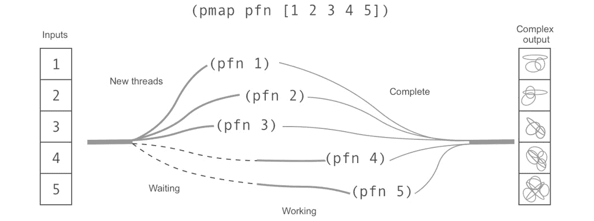

图 12.3：pmap 生成新线程以便同时进行计算

这可能听起来是个好消息。在某些情况下，可能确实如此。但如果你在想“我将一直使用 `pmap`，我的程序会运行得更快”，你大多数时候都会失望。问题是 `pmap` 必须进行大量的幕后工作来生成新线程。结果是，当计算特别耗时的时候，`pmap` 才比单线程的 `map` 函数更有效。我们可以通过一个微不足道的 `map` 操作来比较 `map` 和 `pmap` 的相对速度。我们将使用 Clojure 的 `time` 宏来比较执行时间。`time` 宏包装一个表达式，正常评估它，并打印出评估所需的时间：

```java
user> (time (doall (map inc (range 10))))
"Elapsed time: 0.081947 msecs"
(1 2 3 4 5 6 7 8 9 10)
user> (time (doall (pmap inc (range 10))))
"Elapsed time: 2.288832 msecs"
(1 2 3 4 5 6 7 8 9 10)
```

增加十个整数不是一个资源密集型任务。使用普通的 `map` 函数，它只需要不到十分之一微秒。使用 `pmap` 执行相同的操作需要几乎 30 倍的时间！为什么这么慢？创建线程消耗资源。显然，只有在额外开销值得的时候才应该使用 `pmap`。

注意

我们在这里需要使用 `doall`；否则，我们只是计时一个未实现的惰性序列的创建速度。

## 练习 12.01：测试随机性

回到你在数据新闻网站的工作岗位上，一位分析师担心你程序中使用的随机数生成器不够随机。她希望你通过生成一个非常长的随机整数序列并检查几个数字是否均匀分布来测试它。通过这样做，你将能够看到使用 `map` 或 `pmap` 哪个更快，这要归功于 Clojure 的 `time` 函数。

打开一个 `REPL`。这是一个一次性测试，所以不需要创建项目：

1.  生成一个介于 `0` 和 `1000` 之间的非常长的整数序列：

    ```java
    user> (def random-ints (doall (take 10000000 (repeatedly 
     (partial rand-int 1000)))))
    #'user/random-ints
    ```

    注意，我们使用 `doall` 来确保 `repeatedly` 返回的惰性序列被完全实现。

1.  定义一个函数，用于计算列表中整数的出现次数：

    ```java
    user> (defn int-count [i xs]
        (count (filter #(= % i) xs)))
    #'user/int-count
    ```

1.  使用 `map` 来计算 `random-ints` 中某些整数的出现次数：

    ```java
    user> (map #(int-count % random-ints) [0 1 2 45 788 500 999 ])
    (1034 1009 971 1094 968 1029 908)
    ```

1.  这似乎有效，但速度相当慢。为了发现它有多慢，我们可以使用 Clojure 的 `time` 函数提供一个快速的基准测试。别忘了将 `map` 的输出包裹在 `doall` 中。否则，你只是在计时一个未实现的惰性序列的创建：

    ```java
    (time (doall (map #(int-count % random-ints) [0 1 2 45 788 500 
     999])))
    "Elapsed time: 7307.28571 msecs"
    (9808 10027 9825 10090 9963 10096 9984)
    ```

    当然，你的时间可能会更长或更短。

1.  现在尝试使用 `pmap`：

    ```java
    user> (time (doall (pmap #(int-count % random-ints) [0 1 2 45 
     788 500 999])))
    "Elapsed time: 1602.424627 msecs"
    (9808 10027 9825 10090 9963 10096 9984)
    ```

    这要快得多！这对于分析师要求更大的样本量时很有用。

在这个例子中，`pmap` 出现并显著加快了速度。`pmap` 的美妙之处在于不需要额外的编码。写 `pmap` 而不是 `map` 已经足够简单。然而，像许多工具一样，最重要的是知道何时不要使用它。这个例子特别适合并行化，因为数据集很大。`pmap` 应该只在你知道计算通常会很慢的情况下使用。

# 期货

使用 `pmap`，Clojure 会为你处理所有的线程管理，这使得事情变得简单。然而，很多时候，你需要比 `pmap` 提供的更多线程控制。Clojure 的 **futures** 正是为此而设计的。它们是用于生成和等待新线程的机制。

考虑这样一种情况，需要两个昂贵的计算来执行第三个操作，例如将两个结果相加。在单线程环境中，我们只需这样写：

```java
(+ (expensive-calc-1 5) (expensive-calc-2 19))
```

以这种方式编写，`expensive-calc-1` 的调用需要在 `expensive-calc-2` 开始之前完成。如果这两个计算可以并行运行，我们可以在最佳情况下将执行时间缩短近一半。然而，并行运行这两个线程也会带来一些新问题。我们需要一种协调返回值的方法，尤其是当我们不知道 `expensive-calc-1` 或 `expensive-calc-2` 哪个会先完成时。我们需要一种在调用 `+` 之前等待两者的方法。

Futures 是为此类情况而设计的。`future` 宏会导致其包含的代码在单独的线程中运行。它立即返回一个占位符，这是一个对 *future* 结果的引用。当新线程中的代码完成时，占位符可以被 **解引用**。

在 Clojure 中，当值不是立即可用，只能通过额外一步来访问时，才会应用解引用。使用 var 或 let 绑定时，值是立即可用的。没有额外的步骤需要执行。我们只需使用它。使用 future 以及我们将在本章后面看到的引用类型时，我们不知道值是否已经可用。使用 future 的 `deref` 函数意味着我们愿意等待它完成。`deref` 是必要的，因为我们需要一种方式来指示这种特殊行为。为了使你的代码更容易阅读（和输入），你不必写 `(deref my-future)`，只需输入 `@my-future` 即可。这是一个读取宏的例子：Clojure 在读取你的代码时会立即将 `@my-future` 转换为 `(deref my-future)`。

考虑到这一点，我们可以重写前面的表达式。不过，首先，我们将使用 Java 的`Thread/sleep`方法定义一个人为地慢的函数：

```java
user> (defn expensive-calc-1 [i]
    (Thread/sleep (+ 500 (rand 1000)))
    (println "Calc 1")
    (+ i 5))
user> (defn expensive-calc-2 [i]
    (Thread/sleep (+ 500 (rand 1000)))
    (println "Calc 2")
    (+ i 5))
```

注意

`Thread/sleep`方法是 Java 互操作的一个方便的工具，用于模拟长时间运行的计算或耗时的输入/输出操作。虽然它对实验很有用，但在生产代码中你很少需要它。

使用这些函数，原始表达式会依次评估它们：

```java
user> (+ (expensive-calc-1 10) (expensive-calc-2 25))
Calc 1
Calc 2
45
```

无论这个函数运行多少次，`expensive-calc-1`总是会在`expensive-calc-2`之前返回。使用未来，这将会改变：

```java
user> (let [c1 (future (expensive-calc-1 10))
      c2 (future (expensive-calc-2 20))]
    (+ (deref c1) (deref c2)))
Calc 2
Calc 1
40
user> (let [c1 (future (expensive-calc-1 10))
      c2 (future (expensive-calc-2 20))]
    (+ (deref c1) (deref c2)))
Calc 1
Calc 2
40
```

首先，你可能注意到这个版本稍微快一些。有时`expensive-calc-1`先返回，有时`expensive-calc-2`赢得比赛。哪个更快不重要：最终加法只有在两者都完成时才会发生。这是`deref`函数的工作，它会阻塞评估直到由相应的`future`调用启动的计算返回。

`(deref c1)`或`(deref c2)`表达式可以用`@c1`或`@c2`替换，多亏了`@`读取宏。

## 练习 12.02：众包拼写检查器

你有没有在搜索引擎中输入一个单词，只是为了看看你是否拼对了？在这个练习中，我们将构建一个命令行工具，它改进了这种使用互联网来验证拼写的方法。

目标是能够写出一个命令，后面跟着一个单词的几个可能的拼写。拼写工具将查询维基百科，并返回得到最多点击的单词。我们将使用未来，以便不同的搜索查询可以并行运行。

1.  使用 Leiningen 创建一个新的项目，使用`app`模板。你可以叫它任何你想要的。在我们的例子中，我们将使用`packt-clj.crowdspell`：

    ```java
    lein new app packt-clj.crowdspell
    ```

1.  前往 Leiningen 创建的新目录，并修改`project.clj`文件中的依赖项。我们需要三个库：`org.clojure/tools.cli`用于接受用户输入，`clj-http`用于发起 HTTP 请求，以及`org.clojure/data.json`。

    `:dependencies`映射应该看起来像这样：

    ```java
    :dependencies [[org.clojure/clojure "1.10.1"]
                   [org.clojure/tools.cli "0.4.2"]
                   [clj-http "3.10.0"]
                   [org.clojure/data.json "0.2.6"]]
    ```

1.  在`src/packt_clj/`目录下，创建一个`crowdspell`目录。我们将使用这个目录来创建项目所需的任何命名空间。在那里创建一个名为`fetch.clj`的文件，并插入以下命名空间定义：

    ```java
    (ns packt-clj.crowdspell.fetch
      (:require [clj-http.client :as http]
                [clojure.data.json :as json]))
    ```

    所有的获取和解析结果都将在这个命名空间中发生。`clj-http`库将帮助我们向维基百科端点发起网络请求，而`clojure.data.json`将帮助我们解析我们得到的 JSON 数据。

1.  当你在那里时，为`get-best-word`创建一个空的函数定义。这将是应用程序的关键接口：给定一个单词列表，`get-best-word`将根据从维基百科检索到的数据返回最好的一个。目前我们所知道的是它需要一个语言代码和一个单词列表作为参数：

    ```java
    (defn get-best-word [language-code words])
    ```

    由于维基百科为每种语言使用不同的 URL，例如[`ja.wikipedia.org/`](https://ja.wikipedia.org/)或 https://en.wikipedia.org/，我们可以使用语言代码参数来国际化我们的应用程序。

1.  在`src/packt_clj/crowdspell.clj`中定义的`packt-clj/crowdspell`命名空间将是应用程序的入口点。那里应该已经有一个由`lein new`命令创建的`-main`函数。

    修改`-main`函数，使其调用`get-best-word`。这也需要更新命名空间声明，以便你可以访问`clojure.tools.cli`和`packt-clj.crowdspell.fetch`。

    命名空间声明现在应该看起来像这样：

    ```java
    (ns packt-clj.crowdspell
     (:require
      [clojure.tools.cli :as cli]
      [packt-clj.crowdspell.fetch :as fetch])
     (:gen-class))
    ```

    `-main`函数应该看起来像这样：

    ```java
    (defn -main
     [& args]
     (println (fetch/get-best-word "en" args)))
    ```

    目前，我们只是将英语作为语言代码硬编码。在这个阶段，应用程序理论上可以在命令行编译和运行，但不会做任何事情。

1.  在`src/packt_clj/crowdspell/fetch.clj`中，为`word-search`函数编写一个骨架。这个函数将搜索单个单词。`get-best-word`函数将使用 futures 协调多个并发 HTTP 请求。每个请求都将运行`word-search`：

    ```java
    (defn word-search [word language-code]
     (try
      ;; TODO: the HTTP request
      (catch Exception e
       {:status :error})))
    ```

    由于我们希望应用程序支持多语言，因此有一个`language-code`参数。我们将在稍后将其作为命令行参数添加。

    我们在这里使用`try`块，因为我们的请求可能会因为各种原因而失败。我们已经做出了设计决策：函数将返回一个包含，但不仅限于，`:status`代码的 map。

1.  现在是编写 HTTP 请求本身的时候了。`clj-http.client`库使得这个过程相对简单。我们只需确保使用正确的维基百科特定参数：`srsearch`是我们的搜索词，而`srlimit`告诉 API 我们只想得到一个项目。只需要一个项目，因为响应中的元数据包括一个字段，指示找到了多少个项目。由于我们只对计数感兴趣，这就足够了。如果你喜欢，可以先在 REPL 中尝试这个请求：

    ```java
    packt-clj.crowdspell.fetch> (http/get (str "https://en.wikipedia.org/w/api.php")
                    {:query-params {"action" "query"
                            "list" "search"
                            "srlimit" 1
                            "srsearch" "Clojure"
                            "format" "json"}
                     :accept :json
                     :cookie-policy :none})
    ```

    如果一切顺利，一个包含 HTTP 响应（包括所有头信息）的 map 应该会填充你的 REPL。你应该找到一个键，它说`:status 200`，这意味着请求是成功的。除了`200`之外的状态代码都意味着有问题：

    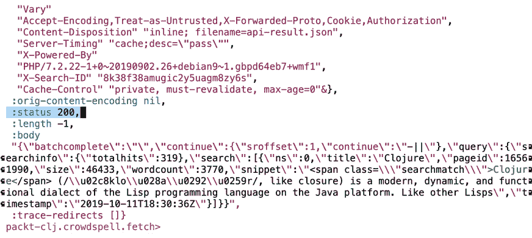

    图 12.4：成功 HTTP 请求的 REPL 输出

1.  让我们在`try`块内添加这个请求作为一个`let`绑定。唯一需要改变的是插入两个参数：我们要搜索的单词和语言。首先，从维基百科端点的 HTTP 请求结果创建一个`let`绑定。我们稍后需要整个请求：

    ```java
    (defn word-search [word language-code]
     (try
      (let [http-result (http/get (str "https://" language-code ".wikipedia.org/w/api.php")
                    {:query-params {"action" "query"
                            "list" "search"
                            "srlimit" 1
                            "srsearch" word
                            "format" "json"}
                     :accept :json
                     :cookie-policy :none})]
       ;; TODO: do something with the result
       {:status :ok :total-hits total-hits :word word})
      (catch Exception e
       {:status :error})))
    ```

1.  现在我们只需要解释 HTTP 请求的结果。实际上有两个步骤：首先，将原始 JSON 响应转换为 Clojure 映射，然后提取我们所需的数据。Wikipedia API 提供了一个`totalhits`字段，我们可以用它来决定哪个单词最受欢迎。我们可以将这两个步骤合并成一个简短的代码片段：

    ```java
    (-> (json/read-str (:body http-result) :key-fn keyword)
      (get-in [:query :searchinfo :totalhits]))
    ```

    `json/read-str`正是这样做的：它读取响应体并将其转换为映射。`:key-fn`选项允许我们提供一个函数，该函数将在所有键上被调用。在几乎所有情况下，这里都使用`keyword`函数，这样我们就可以享受到 Clojure 关键字的便利。

    剩下的就是抓取我们需要的唯一数据。结果映射是一个大型、多层嵌套的映射，这对于`get-in`来说不是问题。

1.  一旦我们有了出现次数，我们将所有我们稍后需要的所有数据都包装在一个映射中：状态、出现次数和单词本身：

    ```java
    {:status :ok :total-hits total-hits :word word}
    ```

    我们知道这个单词是从函数提供的原始参数中得到的。我们还知道状态是`:ok`：如果查询导致错误，我们就会在`catch`块中。

    最终的函数看起来像这样：

    ```java
    (defn word-search [word language-code]
     (try
      (let [http-result (http/get (str "https://" language-code ".wikipedia.org/w/api.php")
                    {:query-params {"action" "query"
                            "list" "search"
                            "srlimit" 1
                            "srsearch" word
                            "format" "json"}
                     :accept :json
                     :cookie-policy :none})
         total-hits (-> (json/read-str (:body http-result) :key-fn keyword)
                 (get-in [:query :searchinfo :totalhits]))]
       {:status :ok :total-hits total-hits :word word})
      (catch Exception e
       {:status :error})))
    ```

    如果你测试 REPL 中的`word-search`，你应该看到类似这样的内容：

    

    图 12.5：从 HTTP 请求中提取的重要数据

1.  现在我们转向`get-best-word`。它的任务是并行调用`word-search`。对于这个任务，futures 正是我们所需要的。由于单词是以列表形式提供的，第一步将是为每个单词在 future 中调用`word-search`。这非常直接：

    ```java
    (defn get-best-word
     [language-code words]
     (let [results (map (fn [a] [a (future (word-search a language-code))]) words)]
      ;; TODO: decide which word is the best
      ))
    ```

    HTTP 请求将同时运行，并且随着它们的完成，响应将变得可用。这个表达式将返回一个 future 列表。在我们能够使用它们之前，我们需要取消引用它们。除了这个区别之外，我们可以将`results`看作是一个普通值的列表。Clojure 的`future`和`deref`函数为我们管理异步性。

1.  此处的最后一步将是选择出现次数最多的单词。我们将使用我们在*第五章*中引入的模式`reduce`：

    ```java
    (reduce (fn [best-so-far [word result-future]]
         (let [{:keys [status total-hits] :as result} @result-future]
          (if (= status :ok)
           (if (> total-hits (:total-hits best-so-far))
            result
            best-so-far)
           best-so-far)))
        {:total-hits 0}
        results)
    ```

    显然，在这里取消引用`@result-future`是第一个非常重要的步骤。但是一旦值被取消引用，所有数据都可用，我们就可以忘记它的异步过去。

    `reduce`的其余调用遵循熟悉的模式：我们检查当前项是否有比`best-so-far`更好的分数，如果是，它就会替换`best-so-far`。

    为了制作一个非常精致的应用程序，我们希望在出现错误时提醒用户，但现在，简单地忽略失败的请求就足够了。

1.  一旦我们找到了最佳单词，剩下的就是从最佳单词中提取`:word`键。为此，我们将使用线程宏`->`和`:word`。总的来说，这给我们留下了这个函数：

    ```java
    (defn get-best-word
     [language-code words]
     (let [results (map (fn [a] [a (future (word-search a language-code))]) words)]
      (->
       (reduce (fn [best-so-far [word result-future]]
            (let [{:keys [status total-hits] :as result} @result-future]
             (if (= status :ok)
              (if (> total-hits (:total-hits best-so-far))
               result
               best-so-far)
              best-so-far)))
           {:total-hits 0}
           results)
       :word)))
    ```

1.  在 REPL 中测试`get-best-word`，使用一些“Clojure”拼写得非常糟糕的单词，以及正确的拼写：

    ```java
    packt-clj.crowdspell.fetch> (get-best-word "en" ["Fortran" "Pascal"])
    "Pascal"
    packt-clj.crowdspell.fetch> (get-best-word "en" ["Clojur" "Clojure" "Clojrre"])
    "Clojure"
    ```

    看起来一切正常！

1.  为了使这个功能成为一个有用的应用程序，我们仍然需要将这个行为打包成一个命令行工具。在`src/packt_clj/crowdspell.clj`中的`-main`函数几乎已经准备好了，只是语言代码参数仍然硬编码为`en`。

    `clojure.tools.cli` 库将使您能够在命令行中轻松地将语言代码作为可选参数添加。目标是能够将我们的代码编译成一个 uberjar，然后输入以下内容：

    ```java
    java -jar packt-clj.crowdspell-0.1.0-SNAPSHOT-standalone.jar --language en Clojur Clojure Clojrre
    ```

1.  `clojure.tools.cli/parse-opts`函数接受来自`-main`的`args`值和一个参数前缀描述符列表。理解这一点最好的方式是通过一个例子，比如我们的语言代码选项：

    ```java
    (cli/parse-opts
             args
             [["-l" "--language LANG" "Two-letter language code for search"
              :default "en"]])
    ```

    嵌套向量是`parse-opts`的配置参数。`"-l"`和`"--language LANG"`定义了命令行选项的简写和长写形式。请记住，选项的长写形式将以关键字形式用作`parse-opts`返回的嵌套`:options`映射中参数的名称。

    下一个字符串是一个文档字符串，如果出现错误（例如，未知选项前缀）时将显示出来。

    在这三个项目之后，可能会有额外的关键字标记参数。这里有很多可能性，我们不会一一探索。对于我们的目的来说，`:default`就足够了。如果用户没有提供`--language`选项（或较短的`-l`选项），他们将获得来自英语维基百科输出的结果。

1.  要测试命令行选项的配置，实际上并不需要使用命令行。`parse-opts`可以在`REPL`中运行，使用一个字符串列表伪装成命令行参数：

    ```java
    packt-clj.crowdspell> (cli/parse-opts ["--language" "fr" "Cloj" "Clojure"] [["-l" "--language LANG" "Language code for search"]])
    {:options {:language "fr"},
     :arguments ["Cloj" "Clojure"],
     :summary " -l, --language LANG Language code for search",
     :errors nil}
    ```

1.  这很有用，因为它显示了返回映射的结构。为了最终确定`-main`函数，我们只需要知道如何从映射中提取语言选项和参数：

    ```java
    (defn -main
     [& args]
     (let [parsed (cli/parse-opts
             args
             [["-l" "--language LANG" "Two-letter language code for search"
              :default "en"]])]
      (fetch/get-best-word (get-in parsed [:options :language])
                 (:arguments parsed))))
                 (System/exit))))
    ```

    对`System/exit`的调用确保我们的程序将立即退出。因为我们使用了`future`，否则程序将不会退出，直到由`future`创建的线程完全终止。

    这应该就是我们需要的所有代码了。

1.  在编译之前，我们可以在`REPL`中通过模拟命令行参数的列表来测试我们的代码：

    ```java
    packt-clj.crowdspell> (-main "-l" "en" "Klojure" "Cloojure" "Clojure")
    "Clojure"
    ```

1.  要编译，只需在项目的根目录中运行`lein uberjar`。现在我们终于可以测试整个应用程序了：

    ```java
    $ java -jar target/uberjar/packt-clj.crowdspell-0.1.0-SNAPSHOT-standalone.jar --language en Clojur Clojure Clojrre
    Clojure
    ```

好吧，它工作得很好。但是速度很慢。是的，Java 运行时需要几秒钟才能启动，这对于应该快速、易于使用的应用程序来说是个问题。最好将这个版本视为一个概念验证。基于 Node.js 的 ClojureScript 版本将具有更短的启动时间。或者这可以构建成一个网络服务。您将在第十四章“HTTP 与 Ring”中学习如何构建应用程序服务器。现在，最快、最简单的方法是直接在 REPL 中使用`fetch.clj`，尽管这个要求可能会限制潜在客户数量。

在这个练习中，我们学习了如何使用 Clojure futures 编写一个简单的多线程应用程序。Futures 特别适合将离散任务分配给单独的线程的情况。更重要的是，`future`结合`deref`提供了一种协调从单独线程返回的数据的方法。

# 协调

Futures 非常适合像`crowdspell`示例这样的情况。工作被分配给一个线程；线程独立执行其任务并返回结果给初始线程。协调发生在结果的收集：评估会阻塞，直到所有 future 都完成。由于不可变性，可以保证同时运行的线程不会相互干扰，因为没有共享的内容。

这个简单的模型之所以有效，正是因为它的简单。然而，有时需要更多的协调，尤其是在需要线程间通信时。

使用 future，我们进行分支，执行计算，并返回数据：


图 12.6：使用 future，当 future 被取消引用时发生协调

消息发送是线程之间通信的一种方式。现在，我们想象三个线程相互发送消息：

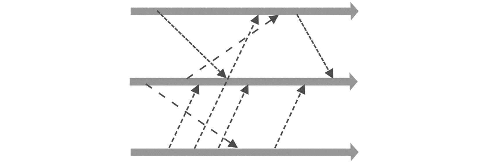

图 12.7：多个线程之间的复杂交互

在 Clojure 中实现此类通信模型，您还可以使用`core.async`库，这是一个用于在线程之间创建通道的复杂工具。`core.async`库被广泛使用，但需要单独的章节来正确介绍它：

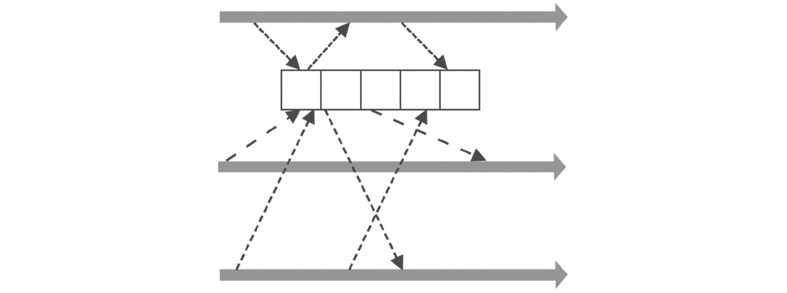

图 12.8：线程引用和修改共享数据

并发编程的基本挑战源于程序的时间线不再是线性的。相互通信的线程不知道何时会收到新数据，也不知道他们发送的数据何时会在接收端被处理。除非通信得到精心管理，否则会发生意外。如果两个线程在没有协调的情况下同时尝试更新相同的数据，结果将变得不可预测。一个更新会覆盖另一个。当一个值正在更新时，原始值被修改，更新突然变得过时。如果涉及更多的线程，交互（以及错误的可能性）会成倍增加。在`crowdspell`练习中，futures 协调了不同线程的返回值。而不是相互覆盖数据，结果被组装成一个连贯的列表，程序的其他部分可以使用。

Clojure 有几种`引用类型`：vars、atoms、agents 和 refs。在分别讨论每一种之前，先思考一下什么是*引用类型*可能是个好主意。首先，引用类型不是数据结构。实际上，你可以用 Clojure 的任何数据结构配合这些引用类型中的任何一种。相反，引用类型位于你的代码和数据之间，并提供了一种特定的方式来引用你的数据。

通过可视化这种关系可能会有所帮助。引用类型作为一个接口，允许你的代码对数据进行更改并检索数据的当前状态。记住，引用类型指向的值仍然是熟悉的 Clojure 数据类型：整数、字符串、向量、映射等等：


图 12.9：引用类型：一种引用和交互数据的方式

大多数时候，在 Clojure 中编码时，我们不会考虑事物名称和事物本身之间的区别。考虑这个简单的`let`绑定：

```java
(let [some-numbers [3 12 -1 55]]
 ;; TODO: do something
 )
```

`some-numbers`是什么？通常，我们只是说，或者想，“它是一个向量。”当然，它实际上是一个指向向量的符号。它在`let`绑定中的事实意味着`some-numbers`将只在该特定的`let`表达式中指向`[3 12 -1 55]`。换句话说，`let`定义了一种特定的指向方式。

现在考虑这个`let`绑定：

```java
(let [some-atomic-numbers (atom [3 12 -1 55])]
 ;; TODO: do something with an atom
 )
```

这次，`some-atomic-numbers`仍然只是一个符号。它指向一个原子（我们将在下一节解释这是什么意思），而原子指向向量：


图 12.10：原子上的绑定点，以及原子指向的值

不可变性意味着值不会改变。一个整数仍然是整数，一个向量保持等于自身。不可变性并不意味着符号总是指向同一个值。Clojure 的引用类型是管理某些类型变化的同时继续使用不可变数据的一种方式。

到现在为止，你已经非常熟悉一种引用类型：变量，它在其他角色中是 Clojure 识别函数的方式。到目前为止，我们将变量视为不可变的身份，这在很大程度上是准确的。一般来说，如果你在程序中看到`(def x 5)`，这意味着`x`的值不会改变。

然而，在 REPL 中，你很快会发现你可以通过再次调用`def`来简单地重新定义一个变量：

```java
user> (def x 5)
#'user/x
user> x
5
user> (def x 6)
#'user/x
user> x
6
```

虽然在用 REPL 进行实验时这样做是可以的，但在程序中这样覆盖一个变量会非常不寻常。话虽如此，变量引用类型确实提供了`alter-var-root`函数，这是一种更优雅地更新变量的方式。它接受一个函数并更新其值：

```java
user> (def the-var 55)
#'user/the-var
user> (alter-var-root #'the-var #(+ % 15))
70
```

如果你确实需要使用这个函数，可能是因为要改变你工作环境的一些功能。这里的目的是不是鼓励你开始修改变量，而是要展示即使是变量也有改变其值的语义。`Vars`碰巧是一种强烈反对改变但并不完全禁止改变的引用类型。

其他引用类型——原子、代理和引用——被设计成让你能够更精细地控制如何管理变化，它们通过控制它们指向的内容来实现这一点。在前面的图中，我们展示了`let`绑定`some-atomic-numbers`指向一个包含向量的原子。现在我们可以通过展示原子如何随着对它的不同函数调用而演变来完善这个图景：

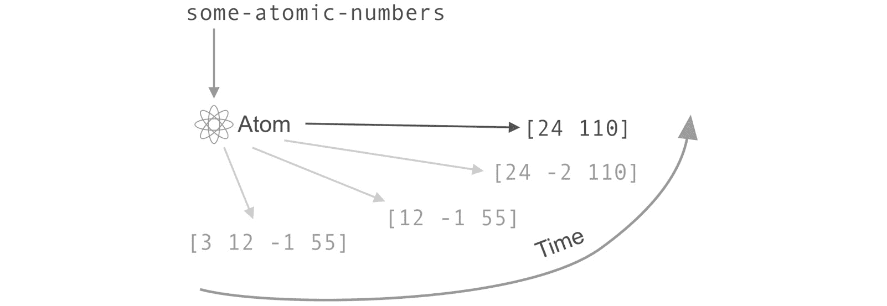


图 12.11：原子随时间指向不同的值

在这张图片中，数据（向量）仍然是不可变的。原子允许我们定义某种身份，这种身份在不同的时间可能有不同的值。正如我们将看到的，这在多线程程序中特别有用，其中一个或多个线程需要访问另一个线程中的稳定身份。

那么，原子、引用和代理是什么？让我们快速看一下这些引用类型中的每一个。

## 原子

原子是最简单且最常用的引用类型。它们也是目前在 ClojureScript 中唯一可用的引用类型，这主要是因为 JavaScript 运行时是单线程的。

原子的生命周期从使用`atom`函数对数据进行初始定义开始：

```java
user> (def integer-atom (atom 5))
#'user/integer-atom
```

就像`future`一样，可以使用`deref`（或`@`读取宏）访问底层数据：

```java
user> (deref integer-atom)
5
```

使用`swap!`来更改数据，它通过应用你提供的函数来更新原子指向的当前值：

```java
user> (swap! integer-atom inc)
6
user> (deref integer-atom)
6
```

`swap!`函数不会将值分配给原子。相反，它应用一个函数。这样，如果自上次我们解引用原子以来，原子的值已更改，则函数将简单地应用于新的值，无论它是什么。

让我们看看这个动作。以下是我们在 REPL 中将要执行的代码，再次使用`Thread/sleep`来模拟一些长时间运行的任务：

```java
user> (do
    (future (do (Thread/sleep 500) (swap! integer-atom + 500)))
    (future (swap! integer-atom * 1000))
    (deref integer-atom))
6000
```

这里发生了什么？第一个 future 在调用`swap!`之前等待半秒钟。第二个 future 立即执行，将原子的当前值`6`乘以`1000`。现在再次尝试解引用`integer-atom`：

```java
user> @integer-atom
6500
```

如果我们通过修改`Thread/sleep`调用的持续时间来改变时间，结果也会改变：

```java
user> (do
    (def integer-atom (atom 6))
    (future (swap! integer-atom + 500))
    (future (do (Thread/sleep 500) (swap! integer-atom * 1000)))
    (deref integer-atom))
506
user> @integer-atom
506000
```

当调用`swap!`时，你无法提前确定原子的值。但你知道你的函数将在那个时间点被调用，无论值是什么。

注意

此外，还有一个较少使用的`compare-and-set!`函数，它提供了更细粒度的控制。它接受一个额外的值，通常是原子的当前值，并且只有在它仍然匹配时才会修改原子。换句话说，如果另一个线程已经对你的原子做了某些操作，`compare-and-set!`将保持不变。

## 概念：重试

原子的更改不是瞬时的。记住，我们向原子发送了一个函数。根据正在执行的工作，某些函数可能需要更多时间来完成。在繁忙的环境中，这可能意味着几个线程同时尝试更改原子。

以下图显示了两个线程`Thread A`和`Thread B`对一个原子简单实现的修改。尽管它们只是将原子的值乘以 3 或 4，但让我们想象这个操作需要几毫秒：

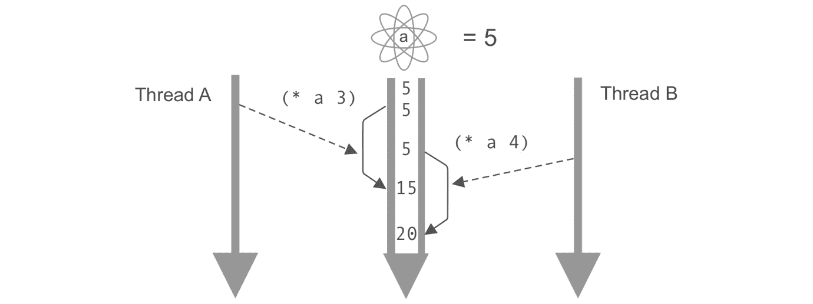

图 12.12：对 Clojure 原子简单实现的重叠更新

原子的初始值为 5。然后`Thread A`介入，将其乘以 3。当它开始执行其操作时，`Thread B`也开始。`Thread B`的函数输入仍然是`5`。`Thread A`的函数完成，原子的值设置为`15`。然后`Thread B`的函数完成其计算，而没有看到原子的新值。这个结果是基于“过时”的初始版本，但它覆盖了第一次计算的结果。最终，就像`Thread A`的更新从未发生一样。

Clojure 不希望这种情况发生在你身上！以下是一个真实 Clojure 原子的行为：

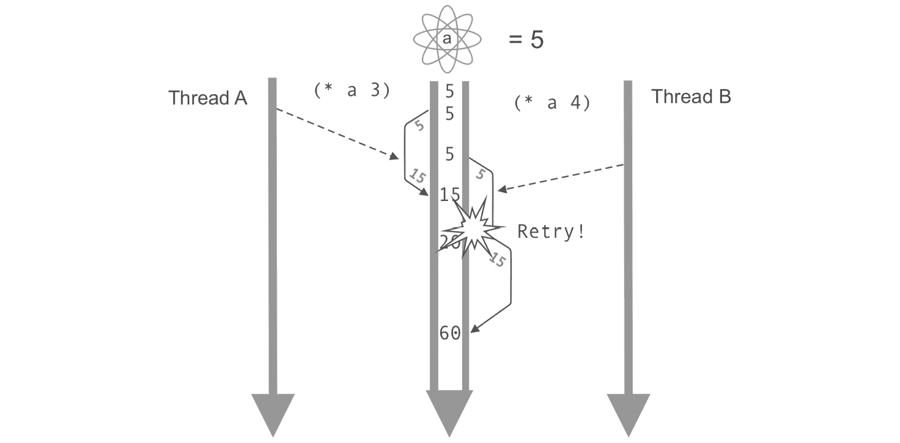

图 12.13：当发生冲突时，真实的 Clojure 原子会重试

这次，当原子尝试应用来自`Thread B`的更新时，它检测到基础值已更改，并重新应用函数以使用新值。

我们可以在 REPL（读取-评估-打印-循环）中观察到这一点，使用一个动作缓慢（长时间休眠）的函数和一个快速函数在两个不同的线程中：

```java
user> (do
    (def integer-atom (atom 5))
    (future (swap! integer-atom (fn [a] (Thread/sleep 2000)(* a 100))))
    (future (swap! integer-atom (fn [a] (Thread/sleep 500) (+ a 200))))
    @integer-atom)
5
user> @integer-atom
205
user> @integer-atom
20500
```

在这种情况下，我们可以认为对`swap!`的两次调用几乎同时执行，当时`integer-atom`的值仍然是 5。通过在`do`块结束时取消引用`integer-atom`，我们可以看到原子尚未被更新。然而，几秒钟后，结果显示两个函数都已应用，并且顺序正确。

## 参考和软件事务内存

参考是 Clojure 最复杂的引用类型。正是由于这些参考，Clojure 语言在首次推出时因其在并发管理方面的先进性而闻名，特别是 STM（软件事务内存）。STM 是一种抽象，它保证了可以以安全、协调的方式对多个*refs*进行更改。

在 STM（扫描隧道显微镜）背后，有一个基本概念：事务。如果你已经与数据库事务工作过，你对基本想法已经很熟悉了。一个数据库事务可能由几个相关操作组成。如果在事务过程中，任何单个操作失败，整个事务将“回滚”到初始状态，就像什么都没发生一样。事务是一种避免只执行部分动作的无效状态的方法。

注意

在第十三章“数据库交互和应用层”中，我们将更深入地探讨数据库事务。

解释数据库事务的经典例子也适用于此处：想象一个银行交易，其中资金从一个账户转移到另一个账户。为此，至少需要发生两个动作：从第一个账户中扣除一定金额，并将其添加到另一个账户。如果由于某种原因其中一个操作失败，我们不希望另一个操作成功。如果在第一个账户的资金扣除后第二个账户被删除，那么这些资金应该返回到原始账户；否则，它们将消失得无影无踪。在数据库事务中，如果第二步没有完成，第一步也会被取消。这样，系统会自动返回到一个已知、正确的状态。

Clojure 的软件事务内存在概念上与数据库事务相似，但它是与程序内部的数据一起工作的。Clojure 中的事务由`dosync`宏管理，它创建了一个空间，在这个空间中，对 refs 的操作将被协调。想象一下，前面提到的银行场景是使用 Clojure 引用类型而不是数据库来实现的。如果你从一个银行账户引用中提取资金并存入另一个账户，那么这两个操作都将成功，或者整个`dosync`块将重试。像数据库事务一样，refs 的目的确保你的系统保持一致状态。这是 refs 和 atoms 之间第一个主要区别之一：与 atoms 不同，refs 可以提供协调。当两个 atoms 被更新时，没有这样的保证。

引用实际上提供了更细粒度的控制，以修改它们。有几个函数可以更新引用，每个函数都有不同的语义。最常见的是 `alter` 和 `commute`。`alter` 是最限制性的：如果基础值在 `dosync` 块外部已更改，则整个事务将重试。当不需要此类保证时，可以使用 `commute` 函数。例如，在添加或从总数中减去时，操作顺序不影响结果，因此这些操作可以接受基础值的更改而不需要重试。并且当访问数据时，可以使用 `ensure` 函数代替 `deref`。在这种情况下，如果正在读取的引用已更改，将触发重试。

## 练习 12.03：股票交易

在这个练习中，我们将观察 REPL 中的引用以更好地了解其行为。

您当前的项目是一个股票交易应用的原型。您需要编写一个函数来模拟客户以给定价格购买一定数量的股票。为了使购买成功，必须发生以下四件事：

+   客户账户会因交易金额而被借记。

+   经纪人账户会因相同金额而被贷记。

+   经纪人的股票账户（针对该特定股票）被借记，也就是说，该账户现在有 *n* 少量股票。

+   客户的股票账户（针对该特定股票）被贷记：现在有 *n* 更多股票。

然而，如果在发生此操作期间股票价格发生变化，整个购买必须被无效化并重试。

此外，由于这是一个模拟，我们将使用 `Thread/sleep` 来减慢函数的执行速度：

1.  在 REPL 中，为我们将需要的五个不同值设置一些引用。前三个将具有整数值，代表使用任何货币的账户余额：

    ```java
    user> (def client-account (ref 2100))
    #'user/client-account
    user> (def broker-account (ref 10000))
    #'user/broker-account
    user> (def acme-corp-share-price (ref 22))
    #'user/acme-corp-share-price
    ```

1.  由于客户和经纪人可能会为不同的公司拥有股票，我们将使用映射来处理：

    ```java
    user> (def broker-stocks (ref {:acme-corp 50}))
    #'user/broker-stocks
    user> (def client-stocks (ref {:acme-corp 0}))
    #'user/client-stocks
    ```

    客户开始时拥有零 `Acme Corp` 股票和账户中的 `2100` 货币余额。经纪人拥有 `50` 股票和 `10000` 的余额。

1.  编写一个描述完整交易的函数：

    ```java
    user> (defn buy-acme-corp-shares [n]
        (dosync
         (let [purchase-price (* n @acme-corp-share-price)]
          (alter client-account #(- % purchase-price))
          (alter broker-account #(+ % purchase-price))
          (alter client-stocks update :acme-corp #(+ % n))
          (alter broker-stocks update :acme-corp #(- % n)))))
    ```

1.  我们在这里的所有代码都包含在 `dosync` 宏中。除此之外，代码相当简单。即使在 `dosync` 环境中，在访问其值时也需要解引用其他引用，这就是为什么我们写 `@acme-corp-share-price`。更新 `client-stocks` 和 `broker-stocks` 映射的语法可能看起来有点奇怪。`alter` 函数的第二个参数始终是一个函数，在这种情况下，它是我们之前用于更新映射的 `update` 函数。`alter` 函数的其他参数将简单地传递给 `update`，在初始参数之后，该参数将是包含在引用中的映射。总的来说，最终的 `update` 调用将如下所示：

    ```java
    (update {:acme-corp 0} :acme-corp #(+ % n))
    ```

1.  因为`update`的行为与`alter`相同，并将任何额外的参数传递给提供的函数，所以我们可以将我们对`alter`的调用重写如下：

    ```java
    (alter client-stocks update :acme-corp + n)
    (alter broker-stocks update :acme-corp - n)
    ```

1.  同样，前面的行也可以使用相同的语法：

    ```java
    (alter client-account - purchase-price)
    (alter broker-account + purchase-price)
    ```

    这些形式更简洁，可能对经验丰富的 Clojure 程序员来说更容易阅读。使用匿名函数的形式具有明确提醒我们我们正在提供函数的优点，并且清楚地展示了参数的顺序。

1.  让我们尝试我们的新函数：

    ```java
    user> (buy-acme-corp-shares 1)
    {:acme-corp 49}
    ```

    `dosync`块返回最后一个值，在这种情况下，是`broker-account`在交易中的值。这有时可能很有用，但我们真正感兴趣的数据在 refs 中：

    ```java
    user> @client-account
    2078
    user> @broker-account
    10022
    user> @broker-stocks
    {:acme-corp 49}
    user> @client-stocks
    {:acme-corp 1}
    ```

    在这里，我们可以看到两个账户的余额已经正确更新，并且一股股票已经从`broker-stocks`移动到`client-stocks`。

    这意味着我们的最佳情况场景是有效的：没有 refs 在当前线程之外被更改，并且交易是瞬时的。在这些条件下，原子会表现得一样好。现在是我们模拟一个更具挑战性的购买环境的时候了！

1.  修改`buy-acme-corp-shares`以使交易变慢并打印一些信息：

    ```java
    user> (defn buy-acme-corp-shares [n]
        (dosync
         (let [purchase-price (* n @acme-corp-share-price)]
          (println "Let's buy" n "stock(s) at" purchase-price "per stock")
          (Thread/sleep 1000)
          (alter client-account #(- % purchase-price))
          (alter broker-account #(+ % purchase-price))
          (alter client-stocks update :acme-corp #(+ % n))
          (alter broker-stocks update :acme-corp #(- % n)))))
    #'user/buy-acme-corp-shares
    ```

    使用`Thread/sleep`，交易现在将持续一秒钟。

1.  将所有账户重置为其初始值。为了使这更容易，让我们使用`ref-set`函数编写一个快速重置函数：

    ```java
    user> (defn reset-accounts []
        (dosync
         (ref-set acme-corp-share-price 22)
         (ref-set client-account 2100)
         (ref-set broker-account 10000)
         (ref-set client-stocks {:acme-corp 0})
         (ref-set broker-stocks {:acme-corp 50})))
    #'user/reset-accounts
    user> (reset-accounts)
    {:acme-corp 50}
    user> @acme-corp-share-price
    22
    ```

    所有账户和股价现在都应该回到它们的初始值。这将使观察函数的行为更容易。

1.  使用两个独立的线程在交易期间更改客户的账户。为此，我们将使用`future`并缩短线程的等待时间，通过更改`client-account`：

    ```java
    user> (do
        (reset-accounts)
        (future (buy-acme-corp-shares 1))
        (future (dosync
             (Thread/sleep 300)
             (alter client-account + 500))))
    Let's buy 1 stocks at 22 per stock
    #<Future@611d7261: :pending>Let's buy 1 stocks at 22 per stock
    ```

    注意到`println`消息出现了两次。发生了什么？让我们看看这些值：

    ```java
    user> @client-account
    2578
    ```

    两次交易都被正确记录：+500 和-22。发生了什么：首先，`buy-acme-corp-shares`试图完成交易，但在将新的账户余额写入`client-account`的时候，由于另一个线程的存款，基础值已经改变。如果没有这个，`buy-acme-corp-shares`就会覆盖账户余额，忽略最近的存款。客户不会高兴。

1.  模拟一个繁忙的经纪人账户。经纪人账户可能比客户的账户要繁忙得多。让我们添加更多交易：

    ```java
    user> (do
        (reset-accounts)
        (future (buy-acme-corp-shares 1))
        (future (dosync
             (Thread/sleep 300)
             (alter client-account + 500)))
        (future (dosync
             (Thread/sleep 350)
             (alter broker-account - 200)))
        (future (dosync
             (Thread/sleep 600)
             (alter broker-account + 1200))))
    Let's buy 1 stock(s) at 22 per stock
    #<Future@2ffabed2: :pending>Let's buy 1 stock(s) at 22 per stock
    Let's buy 1 stock(s) at 22 per stock
    ```

    解引用原子以查看它们的最终值：

    ```java
    user> @broker-account
    11022
    user> @client-account
    2578
    ```

    对 refs 的更多更改会导致更多的重启，这一点我们可以从“让我们以每股 22 美元的价格购买 1 股股票”的消息打印了三次中看出。每次对账户的修改都会导致整个交易被重试。这正是原子无法做到的：在`dosync`块内部，对任何 refs 的更改都会导致整个块重启。

这个练习展示了使用 refs 简化跨线程数据共享的基本方法。显然，现实生活中的应用通常会更加复杂，但即使在这个规模上，我们也能看到并发带来的困难以及 Clojure 如何提供处理这些困难的工具。

我们可以观察到的有几件事情。与原子一样，refs 使用的重试策略防止了几乎同时发生的操作相互干扰。但 refs 更进一步，确保即使一个 refs 导致重试，事务中的所有更新都将重试。这保证了数据一致性。这也意味着我们放弃了某些对 refs 更改时间的控制。作为程序员，我们习惯于非常线性地思考：“这样做，然后那样做。”多线程应用程序打破了这种思维方式。Clojure 的引用类型，尤其是 refs，可以帮助我们编写更好的代码，特别是如果我们学会更多地从操作的正确性和一致性而不是严格的操作顺序来思考。

## 与引用更多的凝聚力

在上一个例子中，STM 帮助我们确保更新是一致的：买家账户中的钱少了，但股票多了；卖家钱多了，但股票少了。如果这四个变化中的任何一个失败了，系统就会回到之前的有效状态。无论如何，每个人最终都会在他们的账户上得到正确的余额。然而，我们还没有考虑到一种可能性。如果在交易期间股票价格发生变化怎么办？让我们看看：

```java
user> (do
    (reset-accounts)
    (future (buy-acme-corp-shares 1))
    (future (dosync
         (Thread/sleep 300)
         (alter acme-corp-share-price + 10))))
Let's buy 1 stocks at 22 per stock
#<Future@11e639bf: :pending>
user> @client-account
2078
```

客户账户上的余额表明购买价格为 22。事件序列表明客户得到了一笔好交易。当`buy-acme-corp-shares`等待 1,000 毫秒时，在第二个未来，股票价格变更为 32。当购买最终完成时，价格不再是 22 而是 32。为什么引用没有保护我们免受这种情况的影响？

这里的问题是`buy-acme-corp-shares`函数查询了`acme-corp-share-price`原子的值，但没有对它做任何事情。因此，`dosync`没有跟踪对该引用所做的更改。在下一个练习中，我们将探索两种不同的解决方案：`ensure`函数和巧妙地使用`alter`。

## 练习 12.04：跟上股票价格

股票购买功能的初始原型似乎正在正常工作，但团队意识到它无法正确响应在交易完成期间发生的股票价格变动。你被要求提出一些解决方案。

1.  在你的 REPL 中，使用与上一个练习相同的环境。如果需要，重新创建相同的五个 refs，并确保`reset-accounts`函数已定义。

1.  在`buy-acme-corp-shares`中使用`ensure`来取消引用`acme-corps-stock-price`：

    ```java
    user> (defn buy-acme-corp-shares [n]
        (dosync
         (let [price (ensure acme-corp-share-price)]
          (println "Let's buy" n "stock(s) at" price "per stock")
          (Thread/sleep 1000)
          (alter client-account #(- % price))
          (alter broker-account #(+ % price))
          (alter client-stocks update :acme-corp #(+ % n))
          (alter broker-stocks update :acme-corp #(- % n)))))
    #'user/buy-acme-corp-shares
    ```

1.  运行与之前相同的交易。我们将添加一个额外的`println`语句来查看股票价格更新发生的时间：

    ```java
    user> (do
        (reset-accounts)
        (future (buy-acme-corp-shares 1))
        (future (dosync
             (Thread/sleep 300)
             (println "Raising share price to " (+ @acme-corp-share-price 10))
             (alter acme-corp-share-price + 10))))
    Let's buy 1 stock(s) at 22 per stock
    #<Future@5410594c: :pending>Raising share price to 32
    Raising share price to 32
    Raising share price to 32
    user> @client-account
    2078
    ```

    在这个输出中，有两点值得注意：`Raising share price…` 被打印了 3 次，而客户账户余额仍然只减少了 22。发生了什么？

    当在 `buy-acme-corp-shares` 中调用 `ensure` 时，`acme-corp-share-price` 的值被冻结，直到 `dosync` 块完成。第二个 `dosync` 宏会一直重试，直到第一个完成。当 `buy-acme-corp-shares` 终止后，`acme-corp-share-price` 最终可以提升。

    在 `buy-acme-corp-shares` 购买股票的瞬间，价格仍然是 22。因此，数据一致性得到了保持。然而，存在一个问题。在现实世界中，单个买家无法迫使整个股市等待一笔交易完成。这种解决方案在某种程度上是正确的，但在这个场景中它不会起作用。

1.  使用 `alter` 触发重试。这次，我们将回到 `deref` 来访问当前股价。我们还会在 `acme-corp-share-price` 上调用 `alter`，如果该引用已更改，则触发重试。你可能认为“我们无法更改股价！”当然，你是对的，但我们的 `alter` 调用实际上不会做任何事情，因为我们只会提供一个 `identity` 函数作为参数。我们调用 `alter`，但仅仅是为了说“保持原样”：

    ```java
    user> (defn buy-acme-corp-shares [n]
        (dosync
         (let [price @acme-corp-share-price]
          (println "Let's buy" n "stock(s) at" price "per stock")
          (Thread/sleep 1000)
          (alter acme-corp-share-price identity)
          (alter client-account #(- % price))
          (alter broker-account #(+ % price))
          (alter client-stocks update :acme-corp #(+ % n))
          (alter broker-stocks update :acme-corp #(- % n)))))
    #'user/buy-acme-corp-shares
    ```

    让我们看看会发生什么：

    ```java
    user> (do
        (reset-accounts)
        (future (buy-acme-corp-shares 1))
        (future (dosync
             (Thread/sleep 300)
             (println "Raising share price to " (+ @acme-corp-share-price 10))
             (alter acme-corp-share-price + 10))))
    Let's buy 1 stock(s) at 22 per stock
    #<Future@2b64a327: :pending>Raising share price to 32
    Let's buy 1 stock(s) at 32 per stock
    ```

    这次，`Let's buy 1 stock(s)…` 被打印了两次，价格不同。`Raising share price…` 只打印了一次。在第一次调用 `buy-acme-corp-shares` 时，股价发生了变化。由于变化，触发了重试，现在有了正确的股价。购买最终以正确的价格完成：

    ```java
    user> @client-account
    2068
    ```

这个练习展示了 Clojure 的 STM 的强大功能和微妙之处。根据你需要解决的问题和你工作的环境，你可能需要在不同的环境下进行重试。在这个例子中，很明显我们无法要求股市等待甚至 1 秒钟来完成我们的交易。引用（Refs）让你能够精确地定义所需的重试行为。（除了 `alter` 和 `ref-set`，还有 `commute`，它提供了一套更新引用的语义，当需要较少的控制时使用。）当然，这种程度上的控制也需要仔细思考引用之间的关系。

## 代理

代理与其他引用类型的主要区别在于，虽然原子和引用的更新是`同步`的，但代理的更新是`异步`的。对代理所做的更改被发送到一个队列，一个等待更改的列表，函数在另一个线程中运行。与引用和原子不同，调用线程在等待操作完成时不会被阻塞。因此，虽然代理在更新方面提供的控制比引用少得多，但它们不会因为重试而减慢操作。在原子和引用中，重试是解决同时性突变问题的必要手段；在代理中，通过放弃同时性，简单地按接收顺序执行传入的函数来解决这个问题。

我们可以通过进行需要几秒钟才能完成的更改来观察代理的异步特性，这要归功于`Thread/sleep`：

```java
user> (def integer-agent (agent 5))
#'user/integer-agent
user> (send integer-agent (fn [a] (Thread/sleep 5000) (inc a)))
#<Agent@3c221047: 5>
user> (send integer-agent (fn [a] (Thread/sleep 5000) (inc a)))
#<Agent@3c221047: 5>
user> @integer-agent
5
user> @integer-agent
6
user> @integer-agent
7
```

首先，我们定义代理，将其值设置为`5`。然后我们在 5 秒后发送两个相同的修改来增加代理的值。如果我们快速输入`@integer-agent`（或`(deref`（整数代理）`），但那需要更多时间），我们会看到值仍然是`5`。如果我们等待一段时间后再输入`@integer-agent`，我们会看到值已经增加到`6`。然后几秒钟后，它再次增加到`7`。

如果我们快速输入`@integer-agent`（或`(deref`（整数代理）`），但那需要更多时间），我们会看到值仍然是`5`。如果我们等待一段时间后再输入`@integer-agent`，我们会看到值已经增加到`6`。然后几秒钟后，它再次增加到`7`。

如果我们将前一个例子中的代理替换为原子（并使用`swap!`而不是`send`），最终结果相同，但我们被迫等待操作完成才能重新获得 REPL（读取-评估-打印-循环）的控制权：

```java
user> (def integer-atom (atom 5))
#'user/integer-atom
user> (swap! integer-atom (fn [a] (Thread/sleep 5000) (inc a)))
6
user> (swap! integer-atom (fn [a] (Thread/sleep 5000) (inc a)))
7
```

如果你尝试在你的 REPL 中这样做，你将看到每次调用`swap!`后，REPL 提示符都会被阻塞 5 秒钟。

由于它们不会阻塞，有些情况下代理比原子或引用更可取。例如，假设你的主应用程序将一个计算密集型任务分成几个部分，这些部分可以传递给不同的线程。当这些线程在工作时，你想要向用户展示一个进度条。当一个线程完成一项工作单元时，它会在代理中增加一个计数器。异步代理的优势在于这不会减慢工作线程的速度：控制权立即返回到线程，该线程可以立即开始工作，代理可以独立处理更新：

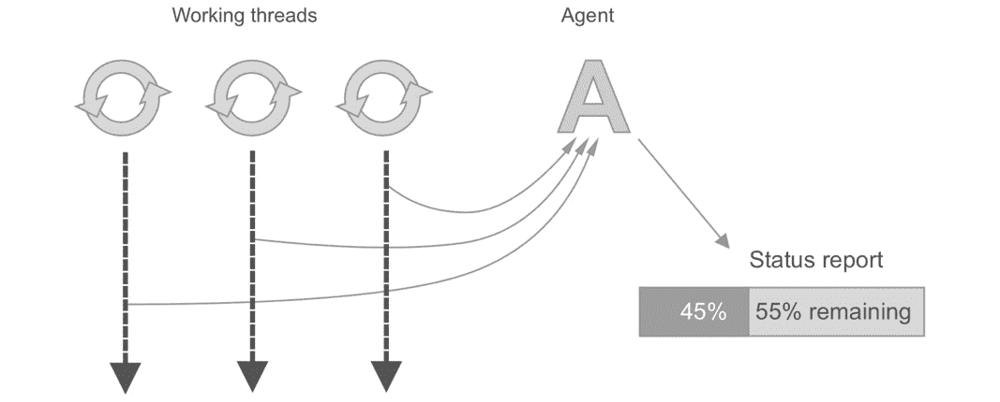


图 12.14：工作线程向代理发送进度更新

类似于引用和解除链接的原子，代理也受益于 STM（软件事务内存）。在一个`dosync`块内部，对多个代理所做的更改可以享受与引用相同的重试语义。因为代理的更新是异步的，所以在输出方面，它们不像引用那样提供那么多的控制，但它们在非常繁忙的系统中的无限重试导致的死锁倾向较小。

## ClojureScript 中的原子

变量和原子是 ClojureScript 中唯一可用的引用类型。尽管 JavaScript 运行时不是多线程的，但代码执行通常是线性的。在浏览器中，单页应用程序需要能够处理来自每个链接或输入的事件，或者来自滚动和悬停等操作的事件。应用程序状态需要由触发这些事件的代码共享，而原子被证明是一个非常不错的选择。（这是幸运的，因为它们是唯一的选择。）

本章的其余部分将专注于浏览器中的原子。你的 Clojure 并发第一次真正的生活体验可能不会是一个复杂的多线程 JVM 应用程序。你很可能在基于浏览器的 ClojureScript 程序中迈出你的第一个 Clojure 并发步骤。许多最著名的用于构建浏览器应用程序的 ClojureScript 框架，如 Reagent、Re-frame 和 Om，都使用原子来管理状态。

## 练习 12.05：剪刀石头布

在这个练习中，我们将使用 ClojureScript 实现著名的剪刀石头布游戏。真正的游戏是在两个人之间进行的，他们数到三然后同时做出手势，要么是“石头”、“剪刀”或“布”。这三个选择中的每一个都可以击败另外两个，并且可以被另一个击败。因此，“石头砸剪刀”，“剪刀剪布”，“布包石头”。如果两个玩家选择了相同的物品，那么就是平局，他们需要再次进行游戏。

1.  在命令行提示符下，使用以下 `Leiningen` 命令创建一个新的 `figwheel` 项目：

    ```java
    lein new figwheel packt-clj.rock-scissors-paper -- --rum
    ```

1.  切换到 `packt-clj.rock-scissors-paper/` 目录，并输入以下内容：

    ```java
    lein figwheel
    ```

    几秒钟后，你的浏览器应该会打开默认的 Figwheel 页面：

    

    图 12.15：一个等待你编写代码的全新 ClojureScript 项目

    打开 `packt-clj.rock-scissors-paper/src/packt_clj/rock_scissors_paper/core.cljs` 并准备编写一些代码。

1.  让我们先设计底层的数据。这是一个非常简单的游戏，所以不会占用太多时间。我们需要跟踪电脑的选择（石头、剪刀或布）和用户的选择。我们还需要有一个游戏状态，它将是三种状态之一：`:setup`（游戏尚未开始），`:waiting`（等待用户进行游戏），和`:complete`（我们将显示获胜者并提议再次进行游戏）。

    将提供的 `app-state` 定义替换为以下内容：

    ```java
    (defonce app-state (atom {:computer-choice nil
                 :game-state :setup
                 :user-choice nil}))
    ```

    我们还希望将其变成我们自己的应用程序，所以让我们更新一些函数名。例如，将 `hello-world` 组件重命名为 `rock-scissors-paper`。

1.  所有的游戏逻辑都将放在一个 `rock-paper-scissors` 组件中。目前，我们只需显示一些文本：

    ```java
    (rum/defc rock-paper-scissors []
     [:div
      [:h1 "Rock, Paper, Scissors"]])
    ```

    当我们在这里时，我们可以稍微改变文件末尾，以使用我们在*第九章*中使用的模式，*Java 和 JavaScript 与宿主平台的互操作性*：

    ```java
    (defn on-js-reload []
     (rum/mount (rock-paper-scissors)
           (. js/document (getElementById "app"))))
    (on-js-reload)
    ```

1.  现在我们将定义游戏逻辑本身。我们将尝试让这个程序的部分不依赖于 ClojureScript。第一个函数将确定电脑选择石头、纸或剪刀：

    ```java
    (defn computer-choice []
     (nth [:rock :scissors :paper] (rand-int 3)))
    ```

1.  唯一稍微复杂的问题是将“石头砸剪刀”规则转换成代码。当然，我们可以简单地写一个长的 `cond` 结构，但由于这是 Clojure，所以我们将使用数据结构：

    ```java
    (def resolutions
      {:rock {:paper :computer-wins
              :scissors :player-wins}
       :scissors {:rock :computer-wins
                  :paper :player-wins}
       :paper {:scissors :computer-wins
               :rock :player-wins}})
    ```

    在 `resolutions` 映射中，顶层键对应于人类玩家的选择。每个项目包含基于电脑可能做出的两个非平局选择的两种可能结果。

1.  这意味着如果玩家选择 `:rock` 而电脑选择 `:scissors`，我们可以得到如下结果：

    ```java
    packt-clj.rock-scissors-paper.core> (get-in resolutions [:rock :scissors])
    :player-wins
    ```

1.  这就是我们将如何编写我们的 `resolve-game` 函数。通过简单的相等检查来检查平局是容易的：

    ```java
    (defn resolve-game [player computer]
     (if (= player computer)
      :tie
      (get-in resolutions [player computer])))
    ```

1.  我们还希望通过提供像“石头砸剪刀”这样的消息来告诉用户他们赢或输的原因。这些消息不需要提到谁赢了，所以我们只需要将一对对象与一个消息关联起来。无论顺序如何，`:rock` 和 `:paper` 应该导致 `Paper wraps rock`。由于顺序不重要，`sets` 可能是一个不错的选择。我们可以使用集合作为映射键，如下所示：

    ```java
    (def object-sets->messages
     {#{:rock :scissors} "Rock crushes scissors."
      #{:scissors :paper} "Scissors cut paper."
      #{:paper :rock} "Paper wraps rock."})
    ```

    大多数时候我们使用关键词作为映射键，以至于有时我们会忘记更复杂的数据结构也可以使用。这样，我们写以下内容时就不重要了：

    ```java
    (get object-sets->messages #{:rock :scissors})
    ```

    我们也可以写出以下内容：

    ```java
    (get object-sets->messages #{:scissors :rock})
    ```

1.  让我们将这个逻辑封装成一个函数：

    ```java
    (defn result-messages [a b]
     (get object-sets->messages (hash-set a b)))
    ```

    这里，`hash-set` 构建了用于查找适当消息的集合。`a` 和 `b` 参数可以互换，是玩家的选择或电脑的选择。

1.  到目前为止，一个游戏可以通过两次函数调用来解决：一次是知道谁赢了，另一次是知道为什么。在这里，玩家选择了 `:scissors` 并击败了选择了 `:paper` 的电脑：

    ```java
    packt-clj.rock-scissors-paper.core> (resolve-game :scissors :paper)
    :player-wins
    packt-clj.rock-scissors-paper.core> (result-messages :scissors :paper)
    "Scissors cut paper."
    ```

1.  下一步是将我们的游戏玩法转换成视图。让我们将游戏视图拆分成它自己的组件，我们将称之为 `game-view`。游戏状态只有三种，所以我们可以通过 `case` 表达式来避免。我们将从占位符开始：

    ```java
    (rum/defc game-view < rum/reactive []
     (case (:game-state (rum/react app-state))
      :setup
      [:div "Ready to play?"
       [:div [:a {:href "#start"} "Start"]]]
      :waiting
      [:div "Choose one"
       [:div [:a {:href "#rock"} "Rock"]]
       [:div [:a {:href "#paper"} "Paper"]]
       [:div [:a {:href "#scissors"} "Scissors"]]]
      :complete
      [:div [:a {:href "#restart"} "Play again?"]]))
    ```

    要查看这个组件的输出，我们可以将其连接到我们之前定义的 `(rock-scissors-paper)` 函数：

    ```java
    (rum/defc rock-paper-scissors []
     [:div
      [:h1 "Rock, Paper, Scissors"]
      (game-view)])
    ```

    到目前为止，`game-view` 组件只是根据游戏状态显示一些不同的标记，因为游戏状态卡在 `:setup` 上，因为没有代码让任何事情发生。尽管如此，确保一切按预期工作仍然是一个好主意。这里的重点是 `app-state` 如何通过 `rum/react` 进行解引用。`rum` 库添加了许多超出只是解引用的内置行为。现在，我们可以将 `rum/react` 视为一个花哨的、特定于框架的 `deref` 版本：

    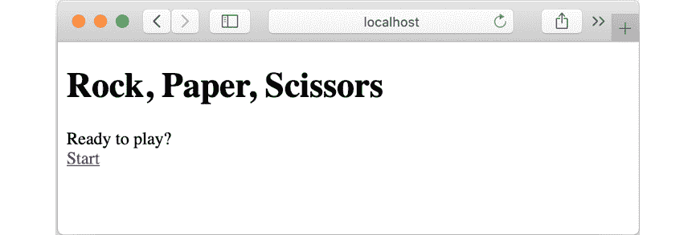

    图 12.16：我们有一个开始屏幕，但还没有游戏玩法

1.  要进入下一个游戏状态，当玩家点击“开始”时需要发生某些事情。我们需要一个启动游戏的函数。

    要开始新游戏，我们需要对`app-state`做两件事：将`:game-state`设置为`:waiting`，并将`:computer-choice`设置为`computer-choice`函数的输出。同样，清理`:player-choice`字段也可能是良好的实践，因为它不再有效。我们的`start-game`函数可以看起来像这样：

    ```java
    (defn start-game []
     (swap! app-state
         (fn [state]
          (assoc state
             :computer-choice (computer-choice)
             :game-state :waiting
             :player-choice nil))))
    ```

    注意，我们正在使用`swap!`。由于`app-state`是一个真正的原子，这就是我们必须通过提供函数与之交互的方式。如果我们想更简洁，我们的`swap!`调用可以重写如下：

    ```java
    (swap! app-state
        assoc
        :computer-choice (computer-choice)
        :game-state :waiting
        :player-choice nil)
    ```

1.  在`game-view`组件内部，我们现在可以在`:setup`和`:complete`阶段添加`start-game`作为点击处理程序：

    ```java
    (rum/defc game-view < rum/reactive []
     (case (:game-state (rum/react app-state))
      :setup
      [:div "Ready to play?"
       [:div [:a {:href "#start"
            :onClick start-game} "Start"]]]
      :waiting
      [:div "Choose one"
       [:div [:a {:href "#rock"} "Rock"]]
       [:div [:a {:href "#paper"} "Paper"]]
       [:div [:a {:href "#scissors"} "Scissors"]]]
      :complete
      [:div [:a {:href "#restart"
            :onClick start-game} "Play again?"]]))
    ```

    让我们检查这个新行为。如果你点击“开始”，你现在应该看到这个：

    

    图 12.17：启动石头、剪刀、布应用程序

1.  现在我们需要为每个选择编写处理程序。由于每个处理程序基本上都会做同样的事情，只是值不同，让我们编写一个返回函数的函数，我们将它称为`player-choice`：

    ```java
    (defn player-choice [choice]
     (fn []
      (swap! app-state
          (fn [state]
           (assoc state
              :player-choice choice
              :game-state :complete)))))
    ```

    这里对`app-state`所做的更改将`:game-state`移动到下一个阶段，并添加`choice`参数作为匿名函数的关闭手段。

1.  我们不需要编写三个单独的处理程序，我们可以在视图中调用这些函数。现在我们的`game-view`组件看起来像这样：

    ```java
    (rum/defc game-view < rum/reactive []
     (case (:game-state (rum/react app-state))
      :setup
      [:div "Ready to play?"
       [:div [:a {:href "#start"
            :onClick start-game} "Start"]]]
      :waiting
      [:div "Choose one"
       [:div [:a {:href "#rock"
            :onClick (player-choice :rock)} "Rock"]]
       [:div [:a {:href "#paper"
            :onClick (player-choice :paper)} "Paper"]]
       [:div [:a {:href "#scissors"
            :onClick (player-choice :scissors)} "Scissors"]]]
      :complete
      [:div [:a {:href "#restart"
                  :onClick start-game} "Play again?"]]))
    ```

    注意，使用`start-game`处理程序时，我们提供的是函数本身，不带括号。这是因为`start-game`本身是处理程序。对于`player-choice`，我们在定义视图时调用该函数；它不是处理程序，而是返回一个匿名处理程序，当用户点击链接时，实际上会调用这个处理程序。

1.  现在，当点击“石头”、“剪刀”或“布”时，你应该看到最终屏幕：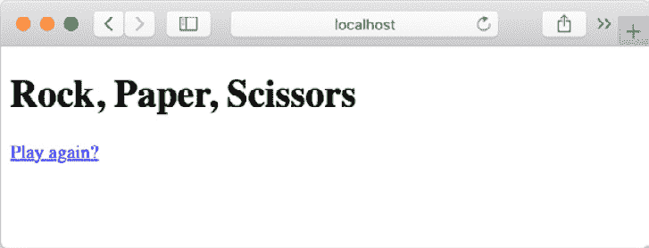

    图 12.18：石头、剪刀、布的最终屏幕

1.  最后一步是显示结果。由于这比其他视图更复杂，所以将其拆分为一个新的组件是值得的，我们将它称为`result-view`。让我们看看代码，然后我们将通过逻辑来分析：

    ```java
    (rum/defc result-view < rum/reactive []
     (let [player (:player-choice (rum/react app-state))
        computer (:computer-choice (rum/react app-state))
        result (resolve-game player computer)]
      [:div
        [:div "You played " [:strong (name player)]]
        [:div "The computer played " [:strong (name computer)]]
        (if (= result :tie)
         [:div "It was a tie!"]
         [:div
          [:div (result-messages player computer)]
          [:div (if (= result :player-wins) "You won!" "Oops. The computer won.")]])
        [:div [:a {:href "#start"
            :onClick start-game} "Play again?"]]]))
    ```

    我们从为玩家选择、电脑选择和结果（由两个选择推导而来）设置一些`let`绑定开始，结果。

    之后的所有内容都在单个`:div`元素中完成。这是必要的，因为在 React 中，以及在所有基于 React 的 ClojureScript 框架中，一个组件只能返回一个 HTML 元素。如果没有这个包装`:div`元素，我们会得到一个错误。

    在显示两个选项之后，使用`name`将关键字转换为字符串，我们就可以得到实际的结果。在出现平局的情况下，没有太多可以显示的，所以我们首先测试这一点。`result-messages`函数提供了一个关于发生了什么的良好总结，然后我们可以根据`result`的值最终告诉玩家他们赢了还是输了。最后，我们在`game-view`组件中放置了之前在其中的"`Play again?`"链接。

1.  现在我们只需要将`result-view`组件插入到`game-view`组件中：

    ```java
    (rum/defc game-view < rum/reactive []
     (case (:game-state (rum/react app-state))
      :setup
      [:div "Ready to play?"
       [:div [:a {:href "#start"
            :onClick start-game} "Start"]]]
      :waiting
      [:div "Choose one"
       [:div [:a {:href "#rock"
            :onClick (player-choice :rock)} "Rock"]]
       [:div [:a {:href "#paper"
            :onClick (player-choice :paper)} "Paper"]]
       [:div [:a {:href "#scissors"
            :onClick (player-choice :scissors)} "Scissors"]]]
      :complete
      (result-view)))
    ```

    注意

    本练习的完整代码可在本书的 GitHub 仓库中找到：[`packt.live/2uoDolF`](https://packt.live/2uoDolF)。

    现在你应该能够玩游戏了：

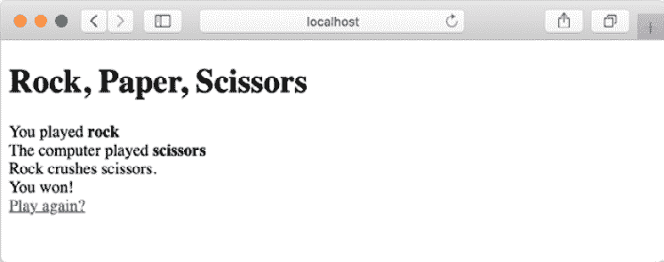

图 12.19：再次玩游戏的提示

你赢了！通过构建这个简单的游戏，你已经学会了使用 Clojure 的一种引用类型的基本模板，用于有状态的 ClojureScript 应用程序。尽管 JavaScript 运行时是单线程的，但原子在这里很有用，因为它们允许事件处理器以比简单覆盖数据更安全的方式与共享程序状态交互。

## 监视器

在之前的练习中，我们提到，当使用`Rum`库时，编写`(rum/react app-state)`基本上是取消引用`app-state`原子。然而，显然还有更多的事情在进行中，否则我们就会使用`deref`。在 Rum 等 ClojureScript 库中，原子通常作为应用程序的“单一事实来源”。Rum 和 Om 框架都使用普通的原子；Reagent 以及基于 Reagent 的流行库`Re-frame`，都使用一种特殊的`atom`实现，有时被称为“ratom”（来自**r/atom**，如果**r**是 Reagent 的命名空间别名）。你将在第十五章*前端：ClojureScript UI*中了解更多关于 Reagent 的内容。

为什么原子在 ClojureScript 库中如此受欢迎？首先，原子有助于管理并发更新。当存在单一事实来源时，这意味着当所有部分都尝试更新相同的数据源时，程序中的许多部分可能会相互干扰。正如我们之前所看到的，原子及其内置的重试逻辑有助于避免许多这些问题。

然而，除此之外，Clojure（以及 ClojureScript）的原子还具有另一个重要的特性，使它们在基于浏览器的应用程序中作为单一事实来源特别有用。现代 JavaScript 架构中的一种常见模式大致如下：

+   发生一个事件并由应用程序处理。在之前的练习中，这些是点击处理器。当然，还有许多其他可能发生的事件：滚动事件、超时、成功（或失败）的网络请求等等。

+   事件发生时，应用程序状态被修改。在剪刀石头布游戏中，玩家做出了选择，并通过`swap!`反映在`app-state`中。

+   应用程序的其他部分会对应用程序状态的变化做出反应。引用应用程序状态的视图会自动更新。在`app-state`中推进`:game-state`字段导致游戏的不同阶段被显示。一旦定义了适当的视图，框架似乎会确保视图被更新。

当应用程序的一部分更新应用程序状态时，其他部分会做出响应。原子通过接受在原子变化时被调用的“观察者”函数来帮助实现这一点。要“观察”一个原子，我们使用`add-watch`函数：

```java
user> (def observable-atom (atom 5))
#'user/observable-atom
user> (add-watch observable-atom :watcher-1
         (fn [k a old new]
          (println "The observable atom has gone from" old "to" new)))
#<Atom@14b35f8d: 5>
user> (swap! observable-atom inc)
The observable atom has gone from 5 to 6
6
```

我们提供了一个匿名函数，当原子发生变化时，它只是简单地打印出一条消息。当添加`watch`函数时，需要一个像`:watcher-1`这样的键，以便稍后可以通过`remove-watch`函数识别并移除特定的观察者。这个键随后作为观察者函数的第一个参数可用，在这个例子中是`k`。`a`参数是原子本身。通常，这两个参数不会被使用；在大多数情况下，你真正需要的是在`old`和`new`参数中。

在上一个练习中，我们使用`rum/reactive`混合物如下定义了我们的组件：

```java
(rum/defc game-view < rum/reactive []
 ;;
 )
```

`rum/reactive`随后根据需要添加观察者，以便组件知道何时更新。这样，多个组件可以引用`app-state`中的相同数据；当数据发生变化时，组件正在观察，并且可以相应地更新。这种模式恰好与 React.js 中使用的某些常见模式相匹配，这就是为什么它在 ClojureScript 库和应用程序中如此常见。通常，当使用这些框架时，你不需要定义自己的观察者。框架会为你处理这些。

验证器是原子的另一个特性，你可以在你的 ClojureScript 应用程序中使用它。像观察者一样，验证器是可以添加到 Clojure 引用类型的函数。例如，当原子即将通过调用`swap!`被修改时，如果原子上设置了任何验证器，它们将被调用。如果其中任何一个没有返回`true`，更新将失败，并抛出异常（或者在 JavaScript 运行时是错误）：

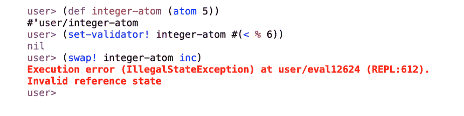

图 12.20：执行错误

当更新失败验证时，会抛出异常。

在这里，验证器对`integer-atom`强制执行“小于 6”的规则。`swap!`的调用试图将值增加到`6`，但相反抛出了异常。在下一个练习中，我们将结合一些验证。

## 练习 12.06：一、二、三…“Rock!”

你的网页版剪刀石头布游戏开始引起一些兴趣。你已经围绕它创建了一个初创公司，现在你的投资者想要一个更接近原始版本的游戏改进版。你的计划是在用户做出选择之前引入倒计时，就像游戏原始版本中两个玩家在揭示选择前协调他们的动作一样：“一、二、三……石头！”

要做到这一点，我们将使用 JavaScript 间隔来为倒计时提供一些时间。在浏览器中，间隔是 JavaScript 开发者可以导致函数在经过一定数量的毫秒后重复调用的方式。我们将使用间隔来模拟一个滴答作响的时钟，其中时钟的每一次滴答都将是一个应用程序需要响应的事件。这将展示如何使用应用程序状态来协调和响应事件。

注意

这个练习基于你之前练习中的代码。要么使用同一个项目，要么创建一个副本。

1.  在命令行提示符下，启动 ClojureScript REPL：

    ```java
    lein figwheel
    ```

    应该打开一个浏览器窗口，邀请你玩一个剪刀石头布的游戏。

1.  在`app-state`原子中添加一个`:countdown`字段：

    ```java
    (defonce app-state (atom {:computer-choice nil
                 :game-state :setup
                 :player-choice nil
                 :countdown 3}))
    ```

1.  向`app-state`添加一个验证器，以确保`:game-state`字段始终包含游戏阶段关键字，并且倒计时永远不会超过 3 或低于 0：

    ```java
    (set-validator! app-state #(and
                   (>= 3 (:countdown %) 0)
                   (#{:setup :waiting :complete} (:game-state %))))
    ```

    注意

    大于和小于函数族都接受超过两个参数。这是一种方便的测试一个值是否介于两个其他值之间的方法。

1.  我们想要做的绝大多数改进都将影响游戏的`:waiting`阶段。让我们创建一个专门的视图，我们将称之为`choices-view`函数。它将显示两个东西：倒计时和选择列表。

    作为第一步，设置与之前相同的选项列表视图：

    ```java
    (rum/defc choices-view < rum/reactive []
     [:div.choices-view
      [:div.choices
      [:div "Choose one"
       [:div [:a {:href "#rock"
            :onClick (player-choice :rock)} "Rock"]]
       [:div [:a {:href "#paper"
            :onClick (player-choice :paper)} "Paper"]]
       [:div [:a {:href "#scissors"
            :onClick (player-choice :scissors)} "Scissors"]]]]])
    ```

    同时，将这个新视图添加到`game-view`中，而不是之前与`:waiting`游戏状态对应的列表：

    ```java
    (rum/defc game-view < rum/reactive []
     (case (:game-state (rum/react app-state))
      :setup
      [:div "Ready to play?"
       [:div [:a {:href "#start"
            :onClick start-game} "Start"]]]
      :waiting
      (choices-view)
      :complete
      (result-view)))
    ```

    在这一点上，游戏应该仍然像以前一样工作。

1.  在倒计时达到零之前，选择列表中的链接应该处于非活动状态，以防止玩家过早点击。由于每个链接都需要处理两种不同的状态，因此将这种行为封装在组件中是有意义的，如下所示：

    ```java
    (rum/defc choice-link-view [kw label countdown]
     (if (zero? countdown)
      [:div [:a {:href (str "#" (name kw))
            :on-click (player-choice kw)}
          label]]
      [:div label]))
    ```

    注意

    记得在源文件中将`choice-link-view`放在`choices-view`之前。

    前两个参数简单地提供了构建链接所需的键和文本标签，就像以前一样。然而，`countdown`参数将允许我们确定应该显示什么。如果倒计时已达到零，我们显示链接。如果没有，我们只显示标签。

1.  我们还需要更新`choices-view`：

    ```java
    (rum/defc choices-view < rum/reactive []
     (let [ready? (= :waiting (:game-state (rum/react app-state)))
        countdown (:countdown (rum/react app-state))]
      [:div.choices-view
       [:div.choices
       [:h3 "Choose one"]
       (choice-link-view :rock "Rock" countdown)
       (choice-link-view :paper "Paper" countdown)
       (choice-link-view :scissors "Scissors" countdown)]]))
    ```

    当你尝试玩游戏时，如果你点击“开始”，你应该看到这个：

    

    图 12.21：点击“开始”可用的选项

1.  我们还希望在视图中也显示倒计时。让我们也为此创建一个新的组件，这样我们就可以添加一些显示逻辑：

    ```java
    (rum/defc countdown-view < rum/reactive [countdown]
     [:div.countdown
      [:div.countdown-message
      (if (> countdown 0)
       "Get ready to make your choice..."
       "Go!")]
      [:h1 countdown]])
    ```

    而这个视图也可以从`choices-view`中调用：

    ```java
    (rum/defc choices-view < rum/reactive []
     (let [countdown (:countdown (rum/react app-state))]
      [:div.player-choices-view
       (countdown-view countdown)
       [:div.choices
       [:h3 "Choose one"]
       (choice-link-view :rock "Rock" countdown)
       (choice-link-view :paper "Paper" countdown)
       (choice-link-view :scissors "Scissors" countdown)]]))
    ```

    如果你在这个时候尝试玩游戏，你应该会看到在非活动链接上方显示`3`：

    ![图 12.22：倒计时已经存在，但还没有开始移动]

    ![图片 B14502_12_22.jpg]

    图 12.22：倒计时已经存在，但还没有开始移动

1.  对于倒计时的计时，我们将使用`setInterval`，这意味着我们需要一些 JavaScript 互操作。这个函数将导致`:countdown`字段每秒递减：

    ```java
    (defn start-countdown []
     (js/setInterval #(swap! app-state update :countdown dec) 1000))
    ```

1.  `setInterval`函数返回一个标识符，我们稍后会需要它来取消间隔。每次新游戏开始时，我们需要启动间隔并记录其标识符。这些事情可以通过`start-game`函数来完成，我们将更新它。（因此，`start-countdown`需要放在你的源文件中的`start-game`函数之前。）

    ```java
    (defn start-game []
     (let [interval (start-countdown)]
      (swap! app-state
          (fn [state]
           (assoc state
              :computer-choice (computer-choice)
              :game-state :waiting
              :countdown 3
              :interval interval)))))
    ```

    `interval`将被放入 app-state 中以便稍后使用。

1.  我们知道我们不想让倒计时低于 0。我们也不想在游戏中不取消上一个间隔就启动一个新的间隔。经过几轮游戏后，我们会有许多间隔都在尝试更新`:countdown`字段。

    使用`clearInterval`函数停止间隔非常简单。但我们是怎样知道何时应该调用它的呢？一个解决方案是在`start-countdown`函数中传递给`setInterval`的函数中添加一个检查。然而，对于这个练习，我们将使用一个观察者：

    ```java
    (add-watch app-state :countdown-zero
          (fn [_k state old new]
           (when (and (= 1 (:countdown old)) (= 0 (:countdown new)))
            (js/clearInterval (:interval new)))))
    ```

    我们不会移除这个观察者，但我们仍然需要给它一个标识符，我们使用一个描述性的关键字。这个`add-watch`调用的有趣之处在于我们提供的匿名函数。这个函数将在`app-state`原子中的每次变化时被调用。大多数时候，这个函数将不会做任何事情。当然，例外的情况是当倒计时即将达到零时。在这种情况下，使用存储在原子中的间隔标识符调用`clearInterval`。

    现在倒计时应该按计划工作。当它达到零时，消息变为`Go!`，链接变为活动状态：

![图 12.23：成功的倒计时]

![图片 B14502_12_23.jpg]

图 12.23：成功的倒计时

这个练习向我们展示了观察者和验证者是如何工作的。记住，在 Clojure 中，它们可以用于所有不同类型的引用类型。

## 活动 12.01：一个 DOM Whack-a-mole 游戏

在你的 Rock, Paper, Scissors 浏览器游戏取得惊人的成功之后，你决定创建一个更加雄心勃勃的产品，基于经典的 Whack-a-mole 游戏。Whack-a-mole 是一款早期的街机游戏。老鼠从桌子上的几个洞中随机弹出。玩家拿着一根槌子，试图在老鼠出现时立即击打它们。被击中后，老鼠会消失回它的洞中，直到再次弹出。

你的 Whack-a-mole 版本将在网页浏览器中使用 DOM 元素。它可能看起来像这样（如果你懂一些 CSS，你可以自由地让它看起来更好一些）：

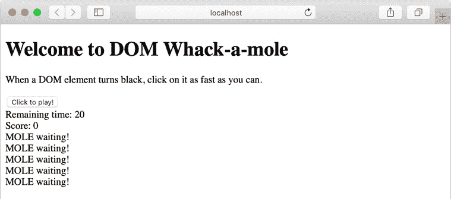


一旦玩家点击“点击开始！”按钮，时钟开始，实际上只是 HTML `<div>` 元素的地鼠开始随机激活：

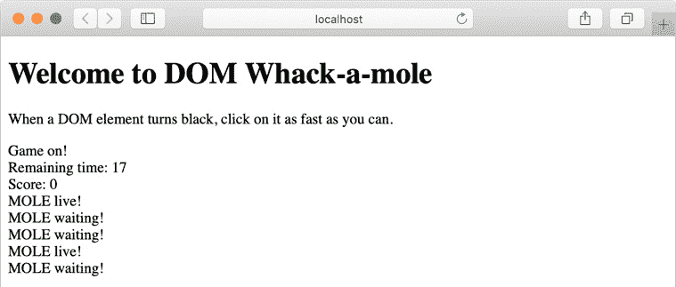


在这一点上，如果玩家点击地鼠，它将回到等待状态，并为玩家的得分加一分。游戏在固定秒数后停止，可能是 20 秒左右。

地鼠的行为遵循以下规则：一次只能看到两个地鼠。要显示的地鼠是随机选择的。地鼠在固定的时间内可见（可能是 2 或 3 秒），如果玩家在这段时间内没有点击它，它将恢复到隐藏状态。

要构建这个游戏，你应该采取以下基本步骤：

1.  使用在“剪刀石头布”练习中使用的相同的基本 ClojureScript 和 Rum 设置。

1.  如同上一个练习，使用 `setInterval` 来在游戏开始后倒计时秒数。为了更流畅，可能最好使用小于 1 秒的间隔。100 毫秒可能恰到好处。

1.  使用多个 atoms 来管理所需的各个计数器：倒计时时钟（间隔本身）、游戏中剩余的毫秒数、游戏状态（`:waiting` 或 `:playing`）和地鼠的向量。

1.  地鼠本身应该有两个值：它们的状态（`:waiting` 或 `:live`）以及如果它们处于 `:live` 状态，剩余的毫秒数。这些值可以包含在一个 map 或一个包含两个元素的向量元组中。

1.  为“开始”按钮和活动地鼠的点击编写事件处理器。

1.  如果你懂一些 CSS，请随意通过向 `resources/public/css/style.css` 添加一些定义来使游戏看起来更好。

    注意

    本活动的解决方案可以在第 738 页找到。

# 摘要

并发，由于其本质，是一个复杂的问题。虽然不可能涵盖你可能需要的所有技术，但希望这一章能为你提供开始所需的工具。我们介绍了 `pmap` 和 `future` 的用法来使用多线程。我们还看到了 Clojure 的引用类型：var、atoms、agents 和 refs。我们使用 atoms 在基于浏览器的 ClojureScript 应用程序中管理状态。

对于这些主题中的每一个，都有更多可以说的。你以后学到的东西将取决于你需要解决的问题的类型。并发是问题比几乎所有其他领域都更加多样化的领域之一。熟悉 Clojure 对这些问题的基本方法将帮助你找到解决方案的正确方向。

在下一章中，我们将迈出另一大步，通过学习如何与数据库交互，向现实世界的 Clojure 迈进。
