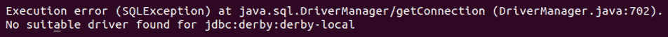
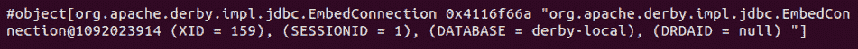
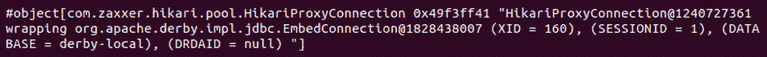
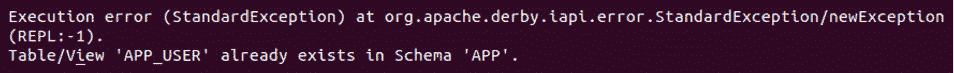
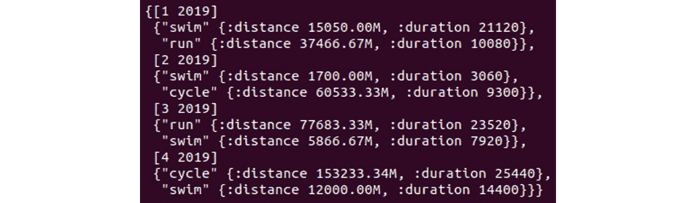

# 13. 数据库交互和应用层

概述

在本章中，我们将在您的本地机器上创建并连接到 Apache Derby 实例。我们还将创建并使用连接池以实现高效的数据库交互，创建并加载数据库模式。然后我们将使用 `clojure.java.jdbc` 创建、读取、更新和删除数据。

到本章结束时，您将能够实现一个位于数据库实例之上的应用层，从磁盘上的 CSV 文件中摄取数据，并通过应用层 API 将其写入数据库。

# 简介

到目前为止，我们一直在磁盘和内存中与 **逗号分隔值**（**CSV**）文件进行交互，但没有持久化。每次我们重启我们的 REPL，我们就会丢失之前所做的所有数据操作或 ELO 计算结果，必须从头开始。如果每次都能持久化这种状态，我们就可以从上次离开的地方继续。实际上，一旦我们建立了一种持久化存储的方法，我们就可以想象构建一个带有 Web 界面或 ClojureScript 前端的 ELO 计算应用程序，以便我们的进度可以从会话持续到会话。

当考虑持久化时，大多数应用程序会寻求一个关系型数据库实现（例如 MySQL、Oracle 或 PostgreSQL）。有许多实现可供选择，每个都有自己的优点和缺点。

我们将使用 Apache Derby 作为磁盘上的 `Driver` 表和 `Car` 表，并通过引用将它们链接起来。我们将在后面的 *创建数据库模式* 部分介绍描述这种关系的方法。

关于我们潜在的 ELO 计算应用程序，在考虑持久化时有许多主题需要考虑。我们需要确定我们想要存储哪些数据，然后确定最佳描述这些数据及其模型不同部分之间关系的模型。我们将不得不考虑一些约束；例如，我们将如何唯一标识我们正在持久化的实体？这将在我们的数据库模式中使用 **数据定义语言**（**DDL**）进行编码。

定义了模式后，我们需要一种插入、检索、更新和删除数据的方法。由于 Apache Derby 是基于 **结构化查询语言**（**SQL**）的 RDBMS，这是这些目的与数据库交互的最合适方式。我们将构建覆盖前面所有要求的 SQL 命令。这些命令将理解底层数据模型，关系的构建方式以及如何访问我们感兴趣的模型的相关部分。Apache Derby 将为我们执行 SQL 命令并返回结果。

在从 Clojure 与此数据库交互方面，我们将主要使用 `clojure.java.jdbc`，这是一个历史悠久、稳定、低级别的库，用于通过 **Java 数据库连接**（**JDBC**）与数据库通信。

应该注意的是，这个库的维护者已经创建了一个后继者，`next.jdbc`，它专注于简单性和性能。一个有趣的练习是将这里提供的示例重新工作，以符合 `next.jdbc` API。

# 连接到数据库

如前所述，我们将利用 JDBC 进行所有数据库交互。JDBC 允许 Java 客户端使用一个定义良好的 **应用程序编程接口**（**API**）连接到 RDBMS。这个 API 在我们（客户端）和我们的数据库（服务器）之间提供了一个清晰的合同。由于 Clojure 位于 **Java 虚拟机**（**JVM**）之上，因此 JDBC 是我们的自然选择。

对于熟悉 JDBC 的人来说，你可能会遇到（偶尔难以操作的）JDBC URL。这些 URL 根据不同的 RDBMS、数据库的位置以及如何进行安全保护等因素而有所不同。本质上，它们是一个数据库连接描述符。

幸运的是，`clojure.java.jdbc` 通过其 `db-spec`（数据库规范）概念抽象了这一点。`db-spec` 是一个简单的映射结构，包含我们想要建立的连接的相关细节。然后可以将这个 `db-spec` 结构传递给任何 `clojure.java.jdbc` API 调用，它将在幕后为我们建立连接。这个规范相当广泛，可以采取多种不同的形式。随着我们的进展，我们将讨论其中的一些。

一个重要的要点是，`clojure.java.jdbc` 预期在执行 API 调用之前，目标数据库的驱动程序必须存在于类路径上。驱动程序充当将基于 JDBC 的 API 调用转换为 RDBMS 理解的某种手段。因此，每个 RDBMS 都将有自己的特定驱动程序。如果没有这个，任何数据库操作都会抛出异常。

例如，如果我们定义一个只包含 `clojure.java.jdbc` 依赖项的 `deps.edn` 文件，然后尝试执行 `jdbc/query` 操作，这将得到以下结果：

```java
{:deps {org.clojure/java.jdbc {:mvn/version "0.7.9"}}}
(require '[clojure.java.jdbc :as jdbc])
```

在这里，我们遇到了第一个具体的 `db-spec` 定义。这是 `DriverManager` 形式的 `db-spec`，是 `clojure.java.jdbc` 的首选格式：

```java
(def db {:dbtype "derby" ;; the type of RDBMS
         :dbname "derby-local" ;; the DB as it will be stored on disk
         :create true       ;; essential on first interaction
         })
```

分析我们的 `db-spec` 定义，我们正在与 Apache Derby 数据库交互（这是我们正在寻找的驱动程序）。我们在当前工作目录中将数据库命名为 `derby-local`。`:create true` 标志将在数据库文件不存在时创建该文件：

```java
user=> (jdbc/get-connection db)
```

输出如下：



图 13.1：由于未添加驱动程序导致的错误

遇到这种情况通常表明你没有将驱动程序添加到你的 `deps.edn` 文件或等效文件中。

`clojure.java.jdbc` 的 GitHub 页面的 *发布和依赖* 部分包含了对流行 RDBMS 的驱动程序的链接。一旦找到适当的驱动程序版本，请将其添加到您的 `deps.edn` 文件中。以下是一个示例：

```java
{:deps {org.apache.derby/derby {:mvn/version "10.14.2.0"}}
```

如您所见，Apache Derby 提供了一个包含其数据库实现和嵌入式驱动程序的包，这意味着我们不需要在我们的项目中显式添加驱动程序依赖项。

## 练习 13.01：建立数据库连接

在这个练习中，我们将连接到本地磁盘数据库：

1.  我们将首先设置我们的依赖项。在你的当前工作目录中创建一个名为`deps.edn`的文件，并粘贴以下内容：

    ```java
    {:deps
     {org.apache.derby/derby {:mvn/version "10.14.2.0"}
      org.clojure/java.jdbc {:mvn/version "0.7.9"}}}
    ```

    应该注意的是，在撰写本文时，Apache Derby 版本 10.15.1.3 是可用的。**不应**与`clojure.java.jdbc` `0.7.9`一起使用！`clojure.java.jdbc`的维护者建议它未经 10.15.x 测试。

1.  需要`clojure.java.jdbc`并将其别名（一个临时名称）作为`jdbc`以便于使用：

    ```java
    user=> (require '[clojure.java.jdbc :as jdbc])
    nil
    ```

1.  在这里，我们使用前面介绍中的`db-spec`定义。引入一个具体的`db-spec`定义实例：

    ```java
    user=> (def db {:dbtype "derby" 
                    :dbname "derby-local" 
                    :create true})
    => #'user/db
    ```

1.  测试我们能否获取到这个数据库的连接：

    ```java
    user=> (jdbc/get-connection db)
    ```

    输出如下：

    

图 13.2：获取数据库连接

注意

上述输出是我们连接的`toString`表示形式。内容并无实际意义，因为我们不关心连接对象的内部表示。

太好了！我们有了在磁盘上创建 Apache Derby 实例的方法，并且已经成功建立了连接。因此，这个`db-spec`定义是有效的，可以在接受`db-spec`定义的任何地方使用。

注意

任何时候我们希望删除我们的本地数据库并重新开始，我们都可以通过删除当前工作目录中与我们的数据库名称匹配的目录来实现。

# 连接池简介

虽然`clojure.java.jdbc`为我们创建数据库连接很方便（它在每次 API 调用时都会这样做，当我们传递一个`db-spec`定义时），但由此产生的性能开销我们应该注意。这可能会变得很麻烦，因为建立连接（尤其是连接到远程机器）通常比我们的查询实际执行所需的时间长得多！因此，这是一个昂贵的操作，我们希望避免。连接池就是这样一种避免这种开销的方法。

当我们谈论连接池时，我们实际上是在谈论提前建立一个或多个连接，并在需要数据库连接时使它们可用给我们的应用程序。这样，我们在应用程序启动时一次性处理连接开销，并从那时起受益于连接重用。

`clojure.java.jdbc`本身不提供连接池实现，但它与包括`c3p0`和`hikari-cp`在内的多个连接池库很好地集成。我们将重点介绍`hikari-cp`，因为它是一个 Clojure 包装器，用于闪电般的`hikariCP`连接，具有超级简单的 API。

`hikari-cp` 提供了一个 API，允许我们构建一个连接池数据源；我们可以使用这个来构建一个替代的 `db-spec` 定义，以替代我们的基于 `DriverManager` 的 `db-spec`，无需进行其他更改。`hikari-cp` 将为我们管理连接池。

## 练习 13.02：创建连接池

在这个练习中，我们将创建一个替代的 `db-spec` 定义，它可以替代在 *练习 13.01* 的 *步骤 3* 中创建的数据库连接。好处是提高数据库交互的速度，因为不需要为每次交互重新建立连接：

1.  将 `hikari-cp` 依赖项添加到我们的应用程序中：

    ```java
    {:deps
     {hikari-cp {:mvn/version "2.8.0"}
      org.apache.derby/derby {:mvn/version "10.14.2.0"}
      org.clojure/java.jdbc {:mvn/version "0.7.9"}}}
    ```

1.  现在，根据我们精确的需求，我们有几种不同的方法来构建一个有效的数据源。当我们从头开始，并且需要创建数据库以及建立连接时，我们将需要找到合适的 JDBC URL。Apache Derby 的 URL 构建起来比其他数据库要简单，遵循以下简单的语法：

    ```java
    jdbc:derby:[subprotocol:][databaseName][;attribute=value]
    ```

    注意

    更多关于 Derby JDBC 数据库连接 URL 的详细信息可以在 [`packt.live/2Fnnx9f`](https://packt.live/2Fnnx9f) 找到。

1.  因此，我们可以像这样定义我们的 `db-spec` 定义（使用 `datasource` 格式）：

    ```java
    user=> (require '[clojure.java.jdbc :as jdbc]
                    '[hikari-cp.core :as hikari])
    nil
    user=> (def db {:datasource (hikari/make-datasource {:jdbc-url "jdbc:derby:derby-local;create=true"})})
    => #'user/db
    ```

    为了分解这个问题，我们正在连接到一个名为 `derby-local` 的 Apache Derby 实例。您会记得，`create=true` 指示数据库如果不存在则创建。

1.  或者，如果我们已经知道数据库已经存在，那么不需要 `create=true` 标志。我们可以修改 JDBC URL 或者允许 `hikari-cp` 为我们构建它：

    ```java
    (def db {:datasource 
      (hikari/make-datasource {:database-name "derby-local" 
                               :datasource-class-name "org.apache.derby.jdbc.EmbeddedDataSource"})})
    ```

    注意，在这里，我们需要指定 `datasource-class-name`，在这种情况下，是嵌入式版本，因为我们是在本地运行。

1.  无论我们使用什么方法构建我们的数据源，我们都可以将其传递给 `clojure.java.jdbc` 库作为替代的 `db-spec` 定义：

    ```java
    (jdbc/get-connection db)
    ```

    输出如下：

    

图 13.3：打印输出

我们现在已经成功定义并测试了两种不同的 `db-spec` 格式，展示了 `clojure.java.jdbc` 提供的灵活性。应该注意的是，相当多的替代方案也是可接受的，包括 `:connection-uri`（一个 JDBC URL）和 `:connection`（一个已经建立的连接，很少需要）。

注意

您可以参考 http://clojure.github.io/java.jdbc/#clojure.java.jdbc/get-connection 以获取支持的 `db-spec` 定义的全部详细信息。

总结一下，`clojure.java.jdbc` 在它所消费的内容上非常灵活。因此，当我们开始更认真地与我们的新创建的数据库交互时，我们将使用连接池数据源。

## 创建数据库模式

我们已经有了数据库连接。在我们开始持久化和查询数据之前，我们必须定义我们的数据库模型，或者更常见地称为“模式”。这将是以下形式：

+   表

+   表中的字段/列

+   表之间的关系

让我们考虑一个体育活动追踪器的例子，我们的网球超级巨星可能在他们的业余时间使用。我们希望存储应用程序用户和活动。让我们看看我们如何使用两个表来模拟这些。

`app_user`表将存储名字、姓氏、身高和体重。活动表将存储日期、活动类型、距离和持续时间。

## 主键

注意到我们存储的信息没有独特之处。当我们只有名字可以查询时，我们如何正确地加载用户的身高和体重？例如，可能有多个用户使用相同的名字创建，然后我们会遇到关于活动正确所有权的难题。

我们需要引入`insert`语句；然而，利用 Apache Derby 的一个特性是有用的，它可以代表我们分配一个唯一的 ID，然后在插入时将其传达给我们。

将`GENERATED ALWAYS AS IDENTITY`添加到列定义中，将指示 Apache Derby 在向我们的表中插入每一行新数据时自动分配一个单调递增的整数 ID。这消除了我们可能有的构建一个 ID 的开销，并保证了其唯一性。

## 外键

当考虑一个活动时，我们可以观察到，一个活动不能在没有`app_user`存在的情况下存在；也就是说，一个活动必须引用`app_user`表中的一个现有条目。这就是外键概念出现的地方。

外键是创建父表和子表之间关系的一种方式。我们可以在活动表中定义一个外键，它引用我们的`app_user`表的主键。当我们创建一个活动时，我们必须有`app_user`表的主键可用，这样我们才能将其添加到我们的活动中。有了这种链接/关系，我们就可以构建一个查询，查询属于某个用户的所有活动，例如。

简单外键的定义看起来像这样：

```java
<foreign key field name> <foreign key type> REFERENCES <parent table>
```

此外，我们通常还会添加`ON DELETE CASCADE`到这个定义中，表示当从父表中删除相应的条目时，子表中的条目也应该被删除。如果活动表中的条目不能作为一个独立的实体存在，这是很重要的；也就是说，它只有在与`app_user`关联的上下文中才有意义。

## 练习 13.03：定义和应用数据库模式

给定之前提到的表要求，我们现在将使用 DDL（即我们将使用以创建这些结构的实际 SQL 命令）来规范这些要求：

1.  在 DDL 中表示，我们将有如下内容：

    ```java
    (def create-app-user-ddl "CREATE TABLE app_user (
    id INT GENERATED ALWAYS AS IDENTITY CONSTRAINT USER_ID_PK PRIMARY KEY,
    first_name VARCHAR(32),
    surname VARCHAR(32),
    height SMALLINT,
    weight SMALLINT)")
    => #'user/create-app-user-ddl
    (def create-activity-ddl "CREATE TABLE activity (
      id INT PRIMARY KEY GENERATED ALWAYS AS IDENTITY,
      activity_type VARCHAR(32),
      distance DECIMAL(5,2),
      duration INT,
      user_id INT REFERENCES app_user ON DELETE CASCADE)")
    #'user/create-activity-ddl
    ```

    注意

    我们前面的每个符号都带有 `-ddl` 后缀。这是通常用于描述数据库架构的语法。

1.  `clojure.java.jdbc` 提供了一种辅助函数，可以为我们构造 DDL 语句。尽管如此，对于我们这个用例来说，唯一真正的优势是能够切换实体的格式（表名、列名和数据类型），以及使用关键字代替手动构造字符串的部分。生成 `create-app-user-ddl` 的等效函数执行如下：

    ```java
    (def create-app-user-ddl-2 (jdbc/create-table-ddl :app_user
      [[:id :int "GENERATED ALWAYS AS IDENTITY CONSTRAINT USER_ID_PK PRIMARY KEY"]
      [:first_name "varchar(32)"]
      [:surname "varchar(32)"]
      [:height :smallint]
      [:weight :smallint]]
      {:entities clojure.string/lower-case}))
    ```

1.  观察到 `clojure.java.jdbc` API，我们可能会直观地期望可以使用 `jdbc/execute!` 函数执行这些 DDL 语句。我们可以（这种方法适用于创建单个表），然而，如果我们希望创建多个表，则可以使用 `db-do-commands`，它接受一个或多个要在事务中执行的命令语句：

    ```java
    user=> (jdbc/db-do-commands db [create-app-user-ddl create-activity-ddl])
    => (0 0)
    ```

    注意

    重新运行前面的命令会导致错误，指示表已存在。

    输出如下：

    

图 13.4：执行错误

应该指出，通常使用 `CREATE TABLE IF NOT EXISTS` 就足够避免这种情况。然而，Apache Derby 不支持此语法。避免此错误将涉及编写自定义代码来完成以下操作：

+   在执行创建表之前，尝试从该表执行 `SELECT` 语句并检测到 `table does not exist` 错误。

+   尝试创建并优雅地处理 `table already exists` 错误消息。

+   利用迁移库，例如 `Migratus`，来跟踪我们到目前为止已应用的架构更新，并在引入新更改时自动应用这些更改。

总结来说，我们现在可以使用 DDL 定义我们的数据库架构，并将此架构应用到我们的数据库中，以便进行数据摄入。

## 管理我们的数据

在处理持久化存储以及与之交互的服务时，我们通常会遇到 `clojure.java.jdbc` 提供了一个直接映射到每个这些操作的 API，正如我们期望任何优秀的数据库库所做的那样。

以下命令描述了每个 CRUD 操作以及在使用 `clojure.java.jdbc` 时应使用的适当 API 调用。请注意，表、列和值是任意的，仅用于展示调用格式。

对于在 `example` 表中创建条目，我们将 `col1` 设置为数值 `42`，将 `col2` 设置为字符串值 `"123"`：

```java
(jdbc/insert! db-spec :example {:col1 42 :col2 "123"})
```

我们可以读取或提取示例表中 `id` 值为 `13` 的条目：

```java
(jdbc/query   db-spec ["SELECT * FROM example WHERE id = ?" 13])
```

要更新 ID 为 13 的行，我们将 `col1` 设置为数值 `77`，将 `col2` 设置为字符串值 `"456"`：

```java
(jdbc/update! db-spec :example {:col1 77 :col2 "456"} ["id = ?" 13])
```

从示例表中删除或移除 ID 为 `13` 的条目：

```java
(jdbc/delete! db-spec :example ["id = ?" 13])
```

应该指出，这些函数具有多种参数形式，其中可选的最后一个参数是一个 SQL 选项的映射。随着我们逐一介绍每个函数，我们将涵盖这些选项。

值得注意的是，三个 API 调用后面都有一个 `!` 后缀。这通常（但不总是！）用来表示函数本身将执行副作用。在函数式编程的世界里，这可以被认为足够重要，值得额外注意。

插入、更新和删除确实会导致副作用——以某种方式改变持久存储。相比之下，查询只是一个简单的读取函数，除了数据检索外不会有任何影响。

## 插入数据

我们首先来谈谈 **CRUD** 中的 **C**。确实，在我们数据库中填充了一些数据之前，我们无法对数据库进行任何有趣的操作。

回想一下我们两个数据库表，`app_user` 和 `activity`，以及它们之间的关系。我们的外键引用规定，一个活动不能在没有先存在一个 `app_user` 的情况下存在。因此，创建一个活动必须引用 `app_user` 中的一个实体。

## 插入单行

`jdbc/insert!` 运行在两种模式下，可以接受一个列值对的映射，或者接受一个列的向量和值的向量。让我们来探讨这两种模式之间的区别。

首先，使用映射模式，我们的 `insert` 命令及其相关的返回值结构将是：

```java
user=> (jdbc/insert!
         <db-spec>
         table name keyword>
         {<column_name> <column_value>
          ..})
({:1 1M})
```

向量模式中的等效操作如下：

```java
user=> (jdbc/insert! 
         <db-spec>
         <table name keyword>
         [<column name> ..] 
         [<column value> ..])
(1)
```

注意

有可能省略描述列名的向量。这将要求我们使用表创建时的列顺序来插入值。然而，当 Apache Derby 中有一个或多个列是自动生成的时候，这是不可能的。

尽管在数据库中创建的行在术语上完全等效，但你会注意到返回值是不同的。

在第一种情况下，我们返回一个包含一个映射的单元素序列。与 `:1` 关键字关联的值是我们刚刚插入的行中生成的并持久化的 ID。这很方便；我们可以用它来持久化任何需要此作为外键的表中的进一步行。如果没有自动返回生成的 ID，我们就需要提交一个单独的查询到数据库去检索它。

在第二种情况下，我们再次得到一个包含一个整数的单元素序列——这次包含一个整数。可能会诱使我们假设这个整数对应于一个生成的 ID；这是不正确的——这个整数实际上告诉我们受影响的行数。`jdbc/insert!` 只支持插入单行；这个整数始终是 1，因此几乎没有用处。

这里应该注意几个重要点。所谓的“生成 ID”或“生成键”格式是 RDBMS 特定的。如果我们换成 MySQL，我们会发现我们的返回值会是以下形式：

```java
({:generated_key 1})
```

因此，我们应该小心处理这些返回值，并意识到数据库的改变可能会导致代码损坏。

`({:1 1M})` 返回值看起来有点奇怪。关键字化的整数是完全有效的——只是不太常见。Apache Derby 显然没有 Clojure 关键字的概念；`clojure.java.jdbc`（很有帮助地）默认关键字化我们的返回键。

这很自然地引出了我们可以传递给任何 CRUD API 调用的选项，即：

+   `keywordize?`（布尔值，默认为 `true`）

+   标识符（函数，默认为 `identity`）

如果我们愿意接收原始的键，那么我们可以关闭关键字化：

```java
user=> (jdbc/insert! db :app_user {:first_name "Andre" :surname "Agassi" :height 180 :weight 80} {:keywordize? false})
({"1" 1M})
```

## 插入多行

`insert-multi!`（与 `insert!` 类似）在两种不同的模式下工作。它接受映射集合或向量集合。调用任一的结果总体上是相同的，但有一些关键的区别需要你注意。

我们已经讨论了“生成的 ID”（在处理映射时）与“影响的行数”（在处理向量时）的返回值。这在处理 `insert-multi!` 时同样适用。

此外，我们还应该意识到，在向量模式下进行多次插入将执行批处理事务。当进行大量插入时，这更高效。

以下代码演示了在映射和向量模式下的 `insert-multi!`：

```java
user=> (jdbc/insert-multi!
  <db-spec>
  <table name keyword>
  [{<column name> <column value> ..}
   {<column name> <column value> ..}])
({:1 1M} {:1 2M})
(jdbc/insert-multi!
  <db-spec>
  <table name keyword>
  [<column name> ..] 
  [[<column value> ..] [<column value> ..]])
=> (1 1)
```

再次提醒，注意返回值表明我们已经为插入的行分配了 ID `1` 和 `2`。

我们可以使用映射或向量模式插入部分记录。在映射模式下工作，我们只需省略任何不需要的键值对。在向量模式下，我们必须指定列名，然后根据需要插入 nil 值。

## 练习 13.04：数据插入

让我们从创建我们定义的每个表中的条目开始，确保我们尊重外键约束：

1.  使用以下任一函数调用将我们 1990 年代的最佳网球运动员作为 `app_user` 插入。我们建议选择其中之一，以避免数据中的虚假重复：

    ```java
    user=> (jdbc/insert!
             db
             :app_user
             {:first_name "Andre"
              :surname    "Agassi"
              :height     180
              :weight     80})
    ({:1 1M})
    user=> (jdbc/insert! 
             db
             :app_user 
             [:first_name :surname :height :weight] 
             ["Andre" "Agassi" 180 80])
    (1)
    ```

    注意

    当考虑数据库的现有状态时，我们生成的键的 `1M` 值可能会有所不同，因为它代表下一个唯一的整数值。

1.  我们已成功插入第一条记录。现在让我们创建几个活动并将它们与我们的 `app_user` Andre 关联。这将允许我们练习 `jdbc/insert-multi!` API 调用：

    ```java
    user=> (jdbc/insert-multi!
      db
      :activity
      [{:activity_type "run" :distance 8.67 :duration 2520 :user_id 1}
       {:activity_type "cycle" :distance 17.68 :duration 2703 :user_id 1}])
    ({:1 1M} {:1 2M})
    ```

在插入数据时，有几个考虑因素需要记住。如果插入单行，使用 `insert!`。如果插入多行，使用 `insert-multi!`。如果我们对生成的键感兴趣，那么我们应该优先考虑映射插入模式。另一方面，如果性能至关重要，我们可能更倾向于向量插入模式。当插入完整和部分行混合时，读者可以使用他们个人的映射与向量模式偏好。

## 查询数据

为了查看我们迄今为止在数据库中持久化的内容，我们将考虑 `db-spec` 定义以及包含 SQL 字符串的向量。

## 练习 13.05：查询我们的数据库

在这里，我们将介绍我们在查询之前练习中插入的数据所拥有的各种选项：

1.  要找到我们在`app_user`和活动表中的内容，以下就足够了：

    ```java
    user=> (jdbc/query db ["select * from app_user"])
    ({:id 1, :first_name "Andre", :surname "Agassi", :height 180, :weight 80})
    user=> (jdbc/query db ["select * from activity"])
    ({:id 1, :activity_type "run", :distance 8.67M, :duration 2520, :user_id 1} 
     {:id 2, :activity_type "cycle", :distance 17.68M, :duration 2703, :user_id 1})
    ```

    如在*管理我们的数据*介绍中所述，`jdbc/query`有一个 3 元组定义，接受一个选项映射。由于我们没有提供那个（我们在这里使用了 2 元组版本），所以我们接受了所有默认选项。现在我们将探索这些选项以及它们如何用于操作结果集。

    考虑到前面的返回值。默认情况下，我们返回一个由映射组成的序列，其中键是小写关键字。

    在支持的所有选项中，我们将首先介绍的前三个选项是微不足道的，允许我们控制返回键的格式，它们是`keywordize?`、`identifiers`和`qualifier`。

1.  将`keywordize?`设置为`false`会给我们字符串键。可以通过提供一个单参数函数来覆盖标识符，该函数将键转换为我们的选择格式。例如，使用这些选项（和`clojure.string`）可以检索键为上字符串的数据：

    ```java
    {:keywordize? false :identifiers str/upper-case}
    user=> (require '[clojure.string :as str])
    => nil
    user=> (jdbc/query db ["select * from app_user"] {:keywordize? false :identifiers str/upper-case})
    ({"ID" 1, "FIRST_NAME" "Andre", "SURNAME" "Agassi", "HEIGHT" 180, "WEIGHT" 80})
    ```

    `qualifier`仅在`keywordize?`为真（默认值）时才有效，并允许我们为我们的关键字指定一个命名空间。然后我们的键以以下形式返回：

    ```java
    :<qualifier>/<column name>
    user=> (jdbc/query db ["select * from app_user"] {:identifiers str/upper-case :qualifier "app_user"})
    (#:app_user{:ID 1, :FIRST_NAME "Andre", :SURNAME "Agassi", :HEIGHT 180, :WEIGHT 80})
    ```

1.  对于那些不熟悉前面格式的读者，这表示我们有一个地图，其中我们的关键字命名空间是同质的（每个键都有相同的`app_user`命名空间）。更具体地说，我们可以从那个查询中看到单个键：

    ```java
    user=> (-> (jdbc/query db ["select * from app_user"] {:identifiers str/upper-case :qualifier "app_user"})
        first
        keys)
    => (:app_user/ID :app_user/FIRST_NAME :app_user/SURNAME :app_user/HEIGHT :app_user/WEIGHT)
    ```

1.  同样，我们可以使用（映射的）序列或（向量的）序列插入数据。我们也可以在我们的查询中控制映射与向量结果格式。在前面的代码中，我们看到映射是默认的，可以通过传递以下选项映射来改变这一点：

    ```java
    {:as-arrays? true}
    ```

    输出如下：

    ```java
    user=> (jdbc/query db ["select * from activity"] {:as-arrays? true})
    [[:id :activity_type :distance :duration :user_id] 
     [1 "run" 8.67M 2520 1] 
     [2 "cycle" 17.68M 2703 1]]
    ```

回想一下我们第一次与 CSV 文件交互的章节，你可能认出这和用于从 CSV 文件读取或写入的数据结构相同；也就是说，一个向量的序列，其中第一个向量对应于文件的列，后续的向量是文件的数据条目。

## 操作查询返回值

除了操作返回值的格式之外，还有两个额外的选项，它们使我们能够完全控制查询返回的每一行，或者控制整个结果集。我们通过`:row-fn`或`:result-set-fn`选项提供这些；如果需要，它们可以组合使用。

`row-fn`选项应该是一个单参数函数，其中唯一的参数是当前行的映射表示。同样，`result-set-fn`选项也应该是一个单参数函数，其中唯一的参数是表示整个查询结果的映射序列。考虑以下示例。

```java
(defn custom-row-fn [row]
)
(defn custom-result-set-fn [result-set]
)
```

我们的功能可以做什么没有限制，除了返回一个与输入相同的数据结构中的值。

应该注意的是，你传递的`result-set-fn`选项不应该是惰性的；否则，在函数完成之前，连接可能会被关闭。"reduce"（或底层调用`reduce`的函数）在这里是一个不错的选择。

## 练习 13.06：使用自定义函数控制结果

`row-fn`适用的例子包括执行一些在原始 SQL 中难以实现的计算或聚合，格式化值，以及用计算值丰富每一行。

结合这三个用例，让我们考虑我们的活动表，特别是持续时间列。这是一个整数值，表示所讨论活动的秒数。为了显示或向用户报告，我们可能发现以小时、分钟和秒来引用它更友好：

1.  定义一个`row-fn`，其中唯一的参数是行的映射表示，一般来说，行应该被返回，并应用任何操作：

    ```java
    (defn add-user-friendly-duration
      [{:keys [duration] :as row}]
      (let [quot-rem (juxt quot rem) 
            [hours remainder] (quot-rem duration (* 60 60))
            [minutes seconds] (quot-rem remainder 60)]
        (assoc row :friendly-duration
                   (cond-> ""
                           (pos? hours) (str hours "h ")
                           (pos? minutes) (str minutes "m ")
                           (pos? seconds) (str seconds "s")
                           :always str/trim))))
    #'user/add-user-friendly-duration
    ```

1.  现在将其添加到我们的 SQL 选项映射中，并重新运行*练习 13.05*，*查询我们的数据库*：

    ```java
    user=> (jdbc/query db ["select * from activity"]
           {:row-fn add-user-friendly-duration})
    ({:id 1, :activity_type "run", :distance 8.67M, :duration 2520, :user_id 1, :friendly-duration "42m"}
     {:id 2, :activity_type "cycle", :distance 17.68M, :duration 2703, :user_id 1, :friendly-duration "45m 3s"})
    ```

1.  现在我们来计算数据库中所有活动所经过的总距离。这可以通过原始 SQL 轻易实现，但无论如何，这将给我们一个探索替代方案的机会。

    我们将定义我们的函数如下：

    ```java
    (fn [result-set]
      (reduce (fn [total-distance {:keys [distance]}]
                (+ total-distance distance))
              0
              result-set))
    ```

1.  当与我们的查询一起使用时，我们可以预测性地检索一个表示所有活动总距离的单个数字：

    ```java
    user=> (jdbc/query db ["select * from activity"]
                {:result-set-fn (fn [result-set]
                                  (reduce (fn [total-distance {:keys [distance]}]
                                            (+ total-distance distance))
                                          0
                                          result-set))})
    26.35M
    ```

1.  为了展示`row-fn`和`result-set-fn`如何协同工作，我们可以使用一个`row-fn`来提取距离，然后使用一个更简单的`result-set-fn`来汇总这些数字，如下所示：

    ```java
    (jdbc/query db ["select * from activity"]
                {:row-fn        :distance
                 :result-set-fn #(apply + %)})
    => 26.35M
    ```

通过这两个最后的练习，我们看到`clojure.java.jdbc`在 API 调用中直接给我们提供了对查询结果的完全控制。无论我们的要求如何，我们都可以利用`jdbc/query`函数的选项来实现我们想要的结果，并使用自定义格式。

## 更新和删除数据

最后，我们来到了 CRUD 中的**U**和**D**；更新和删除。这些操作比前两个简单，可以更简洁地描述。

当我们建模的世界状态发生变化时，我们希望在我们的持久化数据中反映这一点。在我们执行更新之前，我们确定以下内容：

+   受影响的表（s）

+   我们希望设置的新值

+   我们想要具有那些值的 数据子集

`jdbc/update!`的签名给我们提供了以下提示，如果我们还没有意识到的话：

```java
(update! db table set-map where-clause opts)
```

## 练习 13.07：更新和删除现有数据

假设我们发现安德烈·阿加西减重了 2 公斤。我们可以推断我们将更新`app_user`表，将体重设置为 78 公斤，其中名字和姓氏是`Andre`和`Agassi`（或者 ID 是`1`；我们可能从之前的查询中获得了这个信息）：

1.  构建以下`update!`函数调用：

    ```java
    user=> (jdbc/update! db :app_user {:weight 78} ["first_name = 'Andre' and surname = 'Agassi'"])
    => (1)
    ```

    注意

    更新（和删除）在成功时，只会返回受影响的行数。

1.  如果我们查询 `app_user` 表，我们预计这个新事实将被持久化：

    ```java
    user => (jdbc/query db ["select * from app_user"])
    => ({:id 1, :first_name "Andre", :surname "Agassi", :height 180, :weight 78})
    ```

1.  现在，我们可以想象一个情况，即 `Agassi` 从我们的活动跟踪服务中删除了他的账户并要求删除他的数据。我们有一个如下函数签名：

    ```java
    (delete! db table where-clause opts)
    ```

1.  我们可以构建一个函数调用，该调用将从我们的数据库中删除 `Agassi` 及其所有活动：

    ```java
    user=> (jdbc/delete! db :app_user ["first_name = 'Andre' and surname = 'Agassi'"])
    => [1]
    ```

    有趣的是，受影响的行数报告为 `1`。由于我们设置了 `ON DELETE CASCADE` 选项，我们预计安德烈的所有活动也将被删除。让我们验证这一点是否确实如此：

    ```java
    user=> (jdbc/query db ["select * from activity"])
    => ()
    ```

如我们所见，安德烈的活动已被删除。因此，我们可以得出结论，受影响的行将始终对应于从目标表中删除的行。

# 应用层的介绍

到目前为止，我们一直在创建临时函数，在 REPL 中测试它们，偶尔创建一个或两个命名空间将它们组合在一起。我们可以将应用层视为将所有这些命名空间和函数组合成一个具有相关 API 的工作、连贯的应用程序。本质上，我们在这个步骤中设计应用程序的后端。然后我们将学习如何在下一章中通过 REST 公开该 API；在设计我们的应用程序时牢记这一点将很有用。

在设计我们的应用层时，退一步考虑我们的需求是有意义的。如果我们考虑活动跟踪应用程序，我们可能现实地有以下高级需求：

+   创建一个新用户。

+   为指定用户创建一个活动。

+   查询用户和活动。

+   在单个用户（即按活动或时间段）上运行报告。

实现前面的要求将给我们一个功能性的（尽管有限）应用程序，用户可以开始与之交互以跟踪活动和衡量他们的健康。

由于我们已经在我们学习如何与数据库交互的过程中演示了大部分功能，我们可以利用我们已编写的大部分代码，随着我们的进行使其更加通用。

我们可以根据我们自己对逻辑分割的个人观点以多种不同的方式构建前面的应用程序，这种分割最有意义。我们可以在设计阶段花费数小时，在编写任何代码之前确定确切的项目结构；然而，我们更愿意提出一个起始结构，开始充实它，并采取敏捷/演化的方法来开发这个简单的应用程序。

## 练习 13.08：定义应用层

我们将在这里创建我们的后端/应用层；定义我们的命名空间并公开适当的 API。

看看我们的需求，我建议以下命名空间：

+   `schema`：我们的数据模型

+   `ingest`：单个用户和活动摄取

+   `query`：针对用户和活动的通用查询，以及更复杂的报告查询

再次记住，我们理想情况下会在其上叠加一个 REST 服务，想象一个顶层 `web` 或 `api` 命名空间，它将与前面的命名空间以及公共函数进行交互。

在进行此练习之前，请将以下内容添加到您的 `deps.edn` 文件或类似文件中：

```java
{:deps {..
        semantic-csv {:mvn/version "0.2.1-alpha1"}
        org.clojure/data.csv {:mvn/version "0.1.4"}}
```

从一个干净的数据库开始，我们将首先定义我们的 `ns` 模式，包含我们的 DDL 定义，我们将对其进行略微扩展以支持我们的报告需求。值得注意的是，我们向活动表添加了一个 `activity_date` 字段，使我们能够报告跨时间段的各项活动：

1.  定义我们的命名空间，包括我们的 `jdbc` 和 `hikari` 需求：

    ```java
    (ns packt-clj.fitness.schema
      (:refer-clojure :exclude [load])
      (:require
        [clojure.java.jdbc :as jdbc]
        [hikari-cp.core :as hikari]))
    ```

    注意前一段代码中使用了 `(:refer-clojure :exclude [load])`。这不是必需的，但将在我们定义自己的 `load` 函数时抑制一个警告，即我们正在替换 `clojure.core` 中的一个函数。如果没有这一行，我们会遇到以下警告：

    ```java
    WARNING: load already refers to: #'clojure.core/load in namespace: packt-clj.fitness.schema, being replaced by: #'packt-clj.fitness.schema/load
    ```

1.  现在，定义我们的 `jdbc-url` 参数并创建一个 `hikari` 连接池数据源。这个 `db` 变量将在整个练习中引用和使用，无论何时我们加载我们的模式、插入行或从我们的数据库查询行：

    ```java
    (def ^:private jdbc-url "jdbc:derby:derby-local;create=true")
    (def db {:datasource (hikari/make-datasource {:jdbc-url jdbc-url})})
    ```

1.  现在，我们将创建我们的 `app_user` 和 `activity` DDL：

    ```java
    (def ^:private create-app-user-ddl "CREATE TABLE app_user (
      id int GENERATED ALWAYS AS IDENTITY CONSTRAINT USER_ID_PK PRIMARY KEY,
      first_name varchar(32),
      surname varchar(32),
      height smallint,
      weight smallint)")
    (def ^:private create-activity-ddl "CREATE TABLE activity (
      id INT PRIMARY KEY GENERATED ALWAYS AS IDENTITY,
      activity_type VARCHAR(32),
      distance DECIMAL(7,2),
      duration INT,
      activity_date DATE,
      user_id INT REFERENCES app_user ON DELETE CASCADE)")
    ```

1.  最后，我们将所有这些内容整合到一个 `load` 函数中，该函数将我们的数据库模式（即我们的 DDL）应用到由我们的 JDBC URL 指定的数据库中，通过连接池实现：

    ```java
    (defn load
      []
      (jdbc/db-do-commands db [create-app-user-ddl create-activity-ddl]))
    ```

    注意，我们的一些变量被定义为私有的，这意味着在模式命名空间之外引用它们不是必需的（或允许的）。我们通过调用公共 `load` 函数间接引用它们。请注意，`schema/load` 是这个 `ns` 中构成我们的公共 API 的唯一函数。`db` 变量是公共的，我们预计在执行任何查询或摄取数据时都会引用它。

1.  现在是我们的摄取代码，我们将允许创建单个用户和活动：

    ```java
    (ns packt-clj.fitness.ingest
      (:require
        [clojure.java.jdbc :as jdbc]))
    (defn user
      [db app_user]
      (first (jdbc/insert! db :app_user app_user)))
    (defn activity
      [db activity]
      (first (jdbc/insert! db :activity activity)))
    ```

    注意

    `jdbc/insert!` 返回一个单元素序列。因此，我们可以对每个 `insert` 语句的结果调用 `first`，以节省调用者的工作量。

1.  这是我们的查询代码，我们将稍微扩展我们之前所写的：

    ```java
    (ns packt-clj.fitness.query
      (:require
        [clojure.java.jdbc :as jdbc]))
    (defn all-users
      [db]
      (jdbc/query db ["select * from app_user"]))
    (defn user
      [db user-id]
      (jdbc/query db [(str "select * from app_user where id = " user-id)]))
    ```

1.  如下扩展 `all-activities` 函数：

    ```java
    (defn all-activities
      [db]
      (jdbc/query db ["select * from activity"]))
    (defn activity
      [db activity-id]
      (jdbc/query db [(str "select * from activity where id = " activity-id)]))
    (defn activities-by-user
      [db user-id]
      (jdbc/query db [(str "select * from activity where user_id = " user-id)]))
    ```

1.  现在，让我们将更高级的查询定义添加到 `query` 命名空间中。我们将引入 `medley` 和 `java-time` 依赖项到我们的项目中，并在创建一个确定最活跃用户的函数之前在 `ns` 查询中引入它们：

    ```java
    {:deps {..
            clojure.java-time {:mvn/version "0.3.2"}
            medley {:mvn/version "1.2.0"}}
    (ns packt-clj.fitness.query
      (:require
        [clojure.java.jdbc :as jdbc]
        [java-time :as t]
        [medley.core :as medley]))
    ```

    `medley` 是一个第三方便利库，它提供了通常需要使用 `clojure.core` 组件构建的常用函数：

1.  `most-active-user` 函数看起来如下：

    ```java
    (defn most-active-user
      [db]
      (jdbc/query
        db
        ["select au.first_name, au.surname, a.duration from app_user au, activity a where au.id = a.user_id "]
        {:row-fn        (fn [{:keys [first_name surname duration]}] {:name     (str first_name " " surname)
    :duration duration})
         :result-set-fn (fn [rs]
                          (->> rs
                               (group-by :name)
                               (medley/map-vals #(apply + (map :duration %)))
                               (sort-by val)
                               last))}))
    ```

1.  最后，我们将创建一个函数，该函数将按月计算我们的单个用户活动报告：

    ```java
    query.clj
    41 (defn monthly-activity-by-user
    42   [db user-id]
    43   (jdbc/query
    44     db
    45     [(str "select au.first_name, au.surname, a.duration, a.activity_type, a.distance, a.activity_date from app_user au, activity a where au.id = a.user_id and a.user_id = " 1)]
    46     {:row-fn        (fn [row] (update row :activity_date t/local-date))
    47      :result-set-fn (fn [rs]
    48                       (reduce
    49                         (fn [acc {:keys [activity_date activity_type distance duration first_name surname] :as row}]
    50                           (let [month-year (t/as activity_date :month-of-year :year)]
    The complete code can be referred at: https://packt.live/37G4naC
    ```

1.  现在我们已经定义了应用程序层，我们可以开始与我们在每个命名空间中公开的函数进行交互。我们应该看到它们以直观的方式读取和返回结果。为了使用我们的 API，我们需要要求和别名每个命名空间：

    ```java
    (require '[packt-clj.fitness.ingest :as ingest]
             '[packt-clj.fitness.schema :as schema]
             '[packt-clj.fitness.query :as query])
    ```

1.  我们必须将我们的模式加载到我们的空数据库中，注意在删除其父表之前先删除任何子表：

    ```java
    user=> (jdbc/execute! schema/db ["drop table activity"])
    [0]
    user=> (jdbc/execute! schema/db ["drop table app_user"])
    [0]
    user=> (schema/load)
    (0 0)
    ```

1.  现在，让我们定义一些用户并将它们持久化到数据库中：

    ```java
    user=> (def users [{:first_name "Andre"
                :surname    "Agassi"
                :height     180
                :weight     80}
               {:first_name "Pete"
                :surname    "Sampras"
                height     185
                :weight     77
                }
                {:first_name "Steffi"
                surname    "Graff"
                :height     176
                :weight     64}])
    #'user/users
    user=> (doseq [user users]
      (ingest/user schema/db user))
    nil
    ```

    注意我们在前面的代码中使用`doseq`。`doseq`可以在我们不感兴趣于结果时（就像我们使用`map`时那样）用来遍历一个集合。由于我们纯粹是为了副作用而遍历一个集合，我们不能对这个操作过于懒惰，因为没有保证我们会持久化每个用户。

    熟悉`sample-activities.csv`文件，它包含了我们刚刚持久化的三个用户中的 20 个随机生成的活动。注意文件的结构并不完美地映射到我们的模式，并考虑我们可以用来将 CSV 文件解析成我们的`ingest/activity`函数支持的格式的潜在方法。

    一种方法是为键定义一个映射，这些键正好符合我们的模式要求。如果值是单参数函数，可以从给定行中提取相关数据，我们可以依次应用这些函数，生成一个符合我们模式的映射。

1.  按照以下方式定义访问器映射：

    ```java
    user=> (def accessors
      {:activity_type :type
       :distance :distance_metres
       :duration :duration_seconds
       :user_id :userid
       :activity_date (fn [{:keys [day month year]}] (str year "-" month "-" day))})
    user=> #'user/accessors
    ```

    注意除了`activity_date`访问器之外的所有访问器都在执行一个简单的重命名操作。`activity_date`执行的是一个（非常轻微的！）更复杂的操作，从一行中提取多个字段并将它们组合成一个。我们可以想象扩展这个功能以执行任意复杂的解析和数据提取。

1.  需要`apply-accessors`函数来实际取一个行、一个访问器映射，并返回一个符合模式的映射：

    ```java
    user=> (defn apply-accessors
      [row accessors]
      (reduce-kv
        (fn [acc target-key accessor]
          (assoc acc target-key (accessor row)))
        {}
        accessors))
    => #'user/apply-accessors
    ```

    `reduce-kv`可以用来遍历我们的访问器映射中的键值对。

1.  在定义了我们的访问器和`apply-accessors`函数之后，我们现在可以读取我们的 CSV 文件并将其解析成与我们的活动表模式相匹配的形式：

    ```java
    user=> (require '[semantic-csv.core :as sc]
                    '[clojure.data.csv :as csv]
                    '[clojure.java.io :as io])
    => nil
    user=> (def activities
      (->> (csv/read-csv (io/reader "resources/sample-activities.csv"))
           sc/mappify
           (map #(apply-accessors % accessors))))
    user=> #'user/activities
    ```

    检查我们的第一个条目，我们看到它确实看起来像我们预期的那样：

    ```java
    user=> (first activities)
    => {:activity_type "swim", :distance "5100.00", :duration "9180", :user_id "1", :activity_date "2019-01-22"}
    ```

1.  我们现在可以用与持久化用户相同的方式持久化这些活动：

    ```java
    user=> (doseq [activity activities]
      (ingest/activity schema/db activity))
    => nil
    ```

1.  最后，让我们依次练习我们的查询并验证结果：

    ```java
    user=> (count (query/all-users schema/db))
    => 3
    user=> (count (query/all-activities schema/db))
    => 60
    user=> (query/user schema/db 1)
    => ({:id 1, :first_name "Andre", :surname "Agassi", :height 180, :weight 80})
    user=> (query/activity schema/db 1)
    =>
    ({:id 1,
      :activity_type "swim",
      :distance 5100.00M,
      :duration 9180,
      :activity_date #inst"2019-01-22T00:00:00.000-00:00",
      :user_id 1})
    user=> (count (query/activities-by-user schema/db 1))
    => 20
    user=> (query/most-active-user schema/db)
    => ["Pete Sampras" 136680]
    user=> (clojure.pprint/pprint (query/monthly-activity-by-user schema/db 3))
    ```

    输出将如下所示：

    

图 13.5：验证结果时的输出

我们现在已经创建了应用程序的后端，逻辑上分离了应用程序包含的各种功能。我们创建了一个数据库，加载了我们的模式，然后摄取和检索了数据。这展示了典型的应用程序生命周期，并且我们希望我们能想象出一个 REST 服务或移动应用坐在这个我们构建的 API 之上。

## 活动第 13.01：持久化历史网球结果和 ELO 计算

基于你对历史网球结果和 ELO 计算的经验，你被网球分析有限公司雇佣。他们有一个难以处理的大的 CSV 文件；他们希望将竞争对手数据建模并持久化到数据库中。一旦导入，他们希望在整个数据集上执行 ELO 计算，同时保持完整的 ELO 历史记录。最终目标是找到历史数据集中 ELO 评分最高的竞争对手。

这些步骤将帮助你完成活动：

1.  将所需的依赖项添加到你的`deps.edn`文件或等效文件中。

1.  创建`packt-clj.tennis.database`、`packt-clj.tennis.elo`、`packt-clj.tennis.ingest`、`packt-clj.tennis.parse`和`packt-clj.tennis.query`命名空间。

1.  在`database`命名空间中，定义一个连接池，引用磁盘上的新`tennis`数据库，并将其存储在`db`变量中。

1.  使用 DDL 定义一个包含`id`（由 CSV 文件提供）和`full_name`字段的数据库`player`表。

1.  定义一个包含`id`（可以从 CSV 文件构建复合 ID）、`tournament_year`、`tournament`、`tournament_order`、`round_order`、`match_order`和`winner_id`（外键引用*步骤 4*中的球员 ID）字段的`tennis_match`表。

1.  定义一个包含`id`（可以自动生成）、`player_id`（外键引用*步骤 4*中的球员 ID）和`rating`字段的`elo`表。

1.  创建（并执行）一个`load`函数，该函数将应用*步骤 4-6*中的 DDL 到*步骤 3*中定义的数据库。

    在`parse`命名空间中，定义一个`historic`函数，该函数接受一个表示本地磁盘上文件路径的字符串。此函数应从磁盘读取 CSV 文件；将文件转换为映射序列；依次遍历每一行；提取与我们的`players`和`matches`数据结构相关的字段（字段可能不会完全按原样提取；也就是说，可能需要一些额外的解析或格式化）；并构建数据结构，最终返回以下形式的映射：

    ```java
    {:players [<player 1> ...]
     :matches [<match 1> ...]}
    ```

    在这里，`players`和`matches`是符合我们创建的模式的映射。

    应根据需要定义辅助函数。一些可能有助于实现的功能包括将行解析为`winning-player`、`losing-player`和`match`列，以及定义将`target-key`函数映射到前述结构中每个结构的`row-extraction`函数。

    注意

    我们应谨慎避免多次定义唯一的球员。我们还应意识到 CSV 文件中的`match_id`列*不是唯一的*！应构建一个适当的复合键。

1.  在 `ingest` 命名空间中，定义一个 `historic` 函数，该函数接受一个 `db-spec` 定义和一个表示本地磁盘上路径/文件名的字符串。此函数应将文件路径传递到第 8 步中定义的函数，解构玩家和比赛，然后依次对每个执行 `insert-multi!`。

    注意

    确保满足外键约束，必须在比赛之前摄取玩家。

1.  将 `match_scores_1991-2016_unindexed_csv.csv` CSV 文件复制到 `resources` 目录中，然后使用第 8 步中的 `historic` 函数从该文件摄取所有 `player` 和 `match` 数据。

    注意

    `match_scores_1991-2016_unindexed_csv.csv` CSV 文件可以在 GitHub 上找到：[`packt.live/30291NO`](https://packt.live/30291NO)。

1.  现在我们已经摄取了数据，我们希望计算所有历史比赛的 ELO 值，在计算过程中存储 ELO 评级。在 `query` 命名空间中，定义一个 `all-tennis-matches` 函数，该函数接受 `db-spec` 并返回 `tennis_match` 表的内容。应该按 `tournament_year`、`tournament_order`、`reverse round_order` 和 `match_order` 适当排序，以确保我们按时间顺序计算评级。

1.  现在，我们将利用我们在第五章“多对一：减少”中遇到的两个函数，即 `match-probability` 和 `recalculate-rating`。将这些引入到 `elo` 命名空间中。

1.  在 `elo` 命名空间中，定义一个新的 `calculate-all` 函数，该函数接受 `db-spec` 并使用 `query/all-tennis-matches` 检索所有网球比赛（按时间顺序排列，如第 10 步所述），然后遍历此数据集，计算每场比赛的 ELO 评级，返回一个符合 `elo` 表模式的 ELO 评级集合。

1.  定义一个简单的函数，该函数接受 `calculate-all` 函数调用的结果并将其持久化到 `elo` 表中。调用此函数以持久化我们的 ELO 计算。

1.  最后，在 `query` 命名空间中定义一个 `select-max-elo` 函数（我们感兴趣的是具有最高 ELO 评级的玩家），该函数返回以下形式的结果：

    ```java
    {:max-rating …
     :player-name …}
    ```

    执行此操作后，我们应该看到一个熟悉的名字！

    注意

    此活动的解决方案可以在第 745 页找到。

# 摘要

这一章介绍了 Apache Derby RDBMS，创建了一个具有最小设置的本地托管实例。然后我们探讨了数据模型以及如何使用 DDL 将其编码为模式。我们使用 `clojure.java.jdbc` 在调查 API 允许我们执行 CRUD 操作之前加载此模式，并花费时间了解如何控制查询执行的结果。

然后，我们为我们的 ELO 计算应用程序构建了一个应用层。在这个过程中，我们学习了哪些函数应该作为我们 API 的一部分公开，哪些是应用程序内部的，应该对用户保密。

在下一章中，我们将探讨我们应用层的公共 API，学习如何构建一个基于 REST 的 Web 服务，以便通过 HTTP 公开该 API。通过这种方式，我们可以从 REST 客户端发起调用，并通过网络与我们的应用程序交互，而不是通过本地托管的 REPL。

随后，我们将通过添加一个更高层次的 UI 层来改进这种 RESTful 交互，这样用户就可以通过网页浏览器与我们的服务进行交互。
