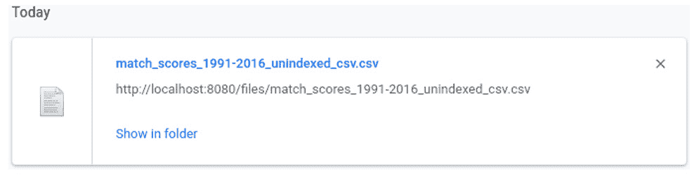
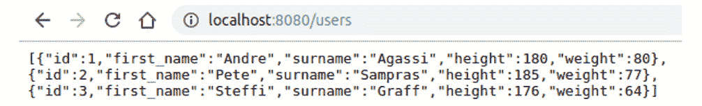
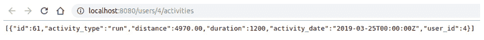

# 14. 使用 Ring 的 HTTP

概述

在本章中，我们将处理请求并生成响应，通过中间件路由传入的请求并操作请求。我们还将使用各种内容类型（包括 **JavaScript 对象表示法**（**JSON**）和 **可扩展数据表示法**（**EDN**））提供响应，使用 Ring 和 Compojure 创建一个网络应用程序，并通过 HTTP 提供静态资源。

到本章结束时，您将能够通过 HTTP 公开 CRUD 操作。

# 简介

在上一章中，我们构建了应用程序层并通过 REPL 与其交互。这对于单个用户执行临时交互来说足够好了，但它无法扩展。实际上，我们可以想象一个场景，第三方甚至我们自己的服务想要使用我们数据库中存储的数据，执行计算，并持久化更新。这种交互将是程序性的，因此从 **超文本传输协议**（**HTTP**）或类似协议公开将是有益的。

我们可以通过通过网络服务公开我们的应用程序层来实现这一点。网络服务允许通过网络（通常是互联网，尽管它也可以是私有应用程序的内部网络）与我们的应用程序层进行交互。

要构建我们的网络服务，我们需要一个网络应用程序库来构建我们的 API，一个网络服务器来通过 HTTP 提供它，以及一个路由库来将传入的请求路由到适当的处理程序。Clojure 有许多每种类型的实现；然而，对于本章，我们将专注于使用 `Compojure` 进行路由，并使用 Jetty 提供所有服务。

本章的扩展可以包括您使用提供的示例和练习，并使用替代的网页应用库，例如 `Pedestal` 来实现它们。

# HTTP、Web 服务器和 REST

在我们深入构建网络服务之前，让我们先了解基础知识。HTTP 是互联网通信的主要协议之一，尤其是在使用网页浏览器进行工作时。该协议为客户端（通常是网页浏览器）与服务器通信提供了一个合同。在这个例子中，浏览器将构建一个包含统一资源标识符（URI）的请求，并将其用于与服务器通信。服务器将解释请求，使用 URI 字符串来确定客户端感兴趣检索/操作的资源，然后构建一个包含指示请求已完成的响应信息或包含响应体形式的负载的响应。

通常，在构建网络服务时，我们希望遵循 **表征状态转移**（**REST**）架构。该架构规定了一系列我们可以选择对资源执行的操作，使我们能够将资源通过多个有效状态进行转换。

例如，假设我们正在与我们的最喜欢的在线零售商网站上的个人资料进行交互。首先，我们将检索我们的个人资料，然后可能会检索我们的当前地址。我们将更改此地址，然后保存更改。在 HTTP 上 REST 交互的术语中，这可能看起来如下：

+   GET [`packt.live/30NL9hm`](https://packt.live/30NL9hm)

+   GET [`packt.live/2U026Ur`](https://packt.live/2U026Ur)

+   PUT [`packt.live/2U026Ur`](https://packt.live/2U026Ur)

上一示例中的 `123` 是我们的唯一用户 ID。

在 URI 前面的 GET/PUT 方法被称为 HTTP 方法。GET 表示我们希望读取 URI 提供的资源相关的内容。PUT 方法有一个包含更新地址的关联体；我们指示服务器使用提供的地址创建/更新地址资源。

在 PUT 和 POST 之间需要区分的一个重要区别是，当更新现有资源或我们偶然知道我们正在创建的实体的唯一 ID 时，应使用 PUT。POST 仅用于资源的创建，并且不需要我们知道其唯一 ID。相反，此 ID 将由网络服务本身分配，并通过响应头传达给客户端。

支持的全部方法包括 GET、POST、PUT、DELETE、HEAD、PATCH、CONNECT、OPTIONS 和 TRACE。其中前四种是最常见的。

## 请求和响应

对于那些完全不了解构建网络服务的人来说，我们将介绍许多新概念。这些概念不一定复杂，但将提供足够的细节来理解每个构建块。如前所述，我们将使用 Ring（Clojure 最广泛使用的网络应用程序库）来构建我们的网络服务。一个 Ring 应用程序仅由四个组件组成：请求、处理器、响应和中间件。

我们理解请求和响应的概念；现在我们将详细讲解它们，包括如何解析前者以及如何构建后者，以及它们通常采取的形式。

用最简单的话说，我们网络服务的功能应该是接收一个表示为映射的传入请求，根据该映射的内容执行一些操作（例如，获取用户的个人资料或更新他们的地址），并生成一个适当的响应映射，以便浏览器渲染或客户端更广泛地解释。在 Ring 中，执行这种请求到响应转换的功能被称为处理器。

最基本操作将遵循以下流程：


图 14.1：请求-响应过程的表示

因此，Ring 处理器是一个单参数函数，接受一个 `request` 映射，并返回一个 `response` 映射：

```java
(defn handler [request]
  ..
<response-map>)
```

`request` 映射看起来像什么？至少，一个 `request` 映射将包含以下顶级键（包括示例值）：

```java
{:remote-addr "0:0:0:0:0:0:0:1",
 :headers {"user-agent" "Mozilla/5.0 (X11; Linux x86_64) AppleWebKit/537.36 (KHTML, like Gecko) Chrome/77.0.3865.90 Safari/537.36",
           "cookie" "phaseInterval=120000; previewCols=url%20status%20size%20timeline; stats=true",
           "connection" "keep-alive",
           "accept" "text/html,application/xhtml+xml"},
 :server-port 8080,
 :uri "/request-demo",
 :server-name "localhost",
 :query-string nil,
 :body #object[org.eclipse.jetty.server.HttpInputOverHTTP 0x4a7d22dd "HttpInputOverHTTP@4a7d22dd[c=0,q=0,[0]=null,s=STREAM]"],
 :scheme :http,
 :request-method :get}
```

下面是每个属性的含义：

+   `:remote-addr`: 调用客户端的 IP 地址

+   `:headers`: 随请求发送的附加信息，与安全、内容协商、cookie 等相关

+   `:server-port`: 请求服务器所服务的端口

+   `:uri`: 指向客户端希望与之交互的资源 URI（用于路由）

+   `:query-string`: 可以用来过滤返回的资源内容的字符串

+   `:body`: 包含一个可选的有效载荷的流（只能读取一次！）

+   `:request-method`: HTTP 请求方法（用于路由）

一个值得强调的重要点是，这个列表**并不全面**。第三方和自定义中间件经常可以添加他们自己的键，具有他们自己的特殊含义和用途。

在我们的处理程序被调用的点上，`request` 映射中只包含几个感兴趣的键：`query-string` 和 `body`。其余的键已经检查并用于将请求路由到适当的处理程序，例如。

`Response` 映射要简单得多，将只包含三个键：状态、标头和正文。`status` 键是一个三位数，表示请求的结果。这些有很多，分为五个不同的类别：

+   1xx：信息性

+   2xx：成功

+   3xx：重定向

+   4xx：客户端错误

+   5xx：服务器错误

通常，我们会遇到表示 `OK` 的 `200` 状态，或者可能是 `404` “未找到”或 `500` “内部服务器错误”的错误消息。

标头提供了有关生成响应的额外信息——最常见的是如何解释正文。正文（有时称为有效载荷）将包含任何对客户端感兴趣检索或生成的数据。

我们可以轻松手动构建这个响应映射，就像我们在 *练习 14.01*，*创建一个 Hello World 网络应用程序* 中将看到的那样。

我们现在已经遇到了 Ring 的四个组件中的三个（中间件更复杂，将在单独的部分中介绍）。

Jetty 是将我们的 Ring 应用程序提供到网络上的网络服务器。它是允许通过网络与我们的应用程序交互的软件，就像您的最喜欢的网站可以通过互联网提供一样。

## 练习 14.01：创建一个 Hello World 网络应用程序

这个练习将使我们使用 Ring 和 Jetty，我们将创建一个简单的网络应用程序，具有静态的 `Hello World` 响应：

1.  从 `deps.edn` 或类似的依赖项开始：

    ```java
    {:deps {ring/ring-core {:mvn/version "1.7.1"}
            ring/ring-jetty-adapter {:mvn/version "1.7.1"}}}
    ```

1.  现在定义我们的 Ring 处理器，记住它是一个单参数函数，接受一个 `request` 映射并返回一个 `response` 映射。我们的 `response` 映射包含一个 `ok` `200` 状态码和一个字符串响应在 `body` 中：

    ```java
    user=> (defn handler [request]
      {:status 200
       :body "Hello World"})
    =>#'user/handler
    ```

1.  现在我们将启动一个 Jetty 网络服务器，传递我们的处理程序和一些选项：

    ```java
    user=> (require '[ring.adapter.jetty :refer [run-jetty]])
    => nil
    user=> (def app (run-jetty handler {:port 8080
                          :join? false}))
    =>#'user/app
    ```

    默认情况下，Jetty 将在端口 80 上启动；我们已将其覆盖为使用`8080`。请注意，我们还传递了`:join? false`。这确保我们的 Web 服务器不会阻塞 REPL 正在运行的当前线程，这意味着我们可以在同时与之交互并执行其他基于 REPL 的操作。我们现在有一个正在运行的 Web 服务器，通过 HTTP 公开我们的单个处理器。

    注意

    我们可以使用 Java 互操作停止当前运行的服务器：

    `user=> (.stop app)`

    `=> nil`

    如果在任何时候遇到诸如`Address already in use`之类的错误，在启动新应用之前，务必停止现有应用。

    这将在我们修改应用程序并测试它们在浏览器中的效果时非常有用。如果您已停止应用，请确保在继续之前通过重新运行*步骤 3*来重新启动它。

1.  在浏览器中导航到 localhost:8080：

图 14.2：在浏览器中打印 Hello Word

成功！我们已经创建了我们的第一个处理器，我们的 Web 服务器仅用几行代码就启动并运行了。请确保停止我们的运行中的应用程序。

## 请求路由

在前面的示例中，请注意，run-jetty 只接受单个处理器。我们很可能希望我们的服务能够提供存储、查看以及操纵多个资源的能力。为此，我们需要支持任意数量的处理器来满足我们的每个资源，以及一种找到正确处理器来处理我们的请求的方法。这就是请求路由发挥作用的地方。

重新审视请求对象，我们发现它包含（包括其他内容）以下键：

+   URI

+   请求方法

我们可以增强处理器以检查传入的请求，提取这些键的内容，然后确定调用适当的函数来满足请求并生成响应。我们可能会称这个处理器为调度器或路由器。在考虑这种方法时，我们应该回忆起章节介绍中提到的 Compojure，它将自己定位为 Ring 的一个小型路由库，允许 Web 应用由小型、独立的组件组成。

这正是我们所寻找的。现在我们将学习如何使用`Compojure`来执行请求路由并进一步扩展我们的应用。

## 使用 Compojure

如果手动路由请求听起来相当繁琐，那么请松一口气，因为 Compojure 将所有压力都从请求路由中释放出来。我们定义了我们要匹配的 HTTP 方法和资源路径的配对，Compojure 会处理其余部分。

一个简单的路由方法定义如下，使用来自 compojure.core 命名空间的 GET 宏：

```java
(def route 
  (GET "/hello" request "Hello World"))
```

GET（以及所有其他 HTTP 方法宏）期望一个表示我们想要匹配的资源路径。在上面的示例中，我们匹配了位于 Web 服务根目录的 hello 路径。Compojure 给了我们很大的控制权，允许我们期望路径参数或使用正则表达式进行匹配，如果需要的话。

宏的下一个参数实际上是将传入的请求映射（或其部分）绑定到我们指定的本地符号。在前面的例子中，整个传入请求映射已经被绑定到 `request` 符号。如果我们愿意，可以选择解构映射的元素。

宏的最后一个参数是路由的主体。在这里，我们可以添加我们需要的任何逻辑，最终表达式作为响应返回。在这种情况下，我们简单地返回字符串 "Hello world"。Compojure 将普通字符串解释为隐式的 200 响应（即成功），这意味着我们不需要像在 *练习 14.01*，*创建一个 Hello World 网络应用程序* 中那样构建一个带有显式 :status 键的映射。

现在我们很可能会在我们的应用程序中有不止一个路由，但 Jetty 只接受一个处理器。我们现在可以求助于 Compojure 提供的 `routes` 函数或 `defroutes` 宏；这两个都可以用来将一个或多个路由组合成一个处理器。使用宏，我们将我们的路由组合在一起，将它们绑定到 `routes` 变量，然后我们可以将其传递给 Jetty：

```java
(defroutes routes
           <route-1>
           <route-2>
           ..)
```

如果用户导航到一个我们没有定义的路由，会怎样？当我们定义路由及其唯一路径时，我们是在要求路由库检查传入的请求，并依次尝试将其与我们的每个路由匹配。如果在找到匹配之前路由列表已经耗尽，则会抛出异常。在浏览器中，我们将收到以下（不是特别有用的！）错误消息：


图 14.3：页面工作错误

我们可以通过提供一个通配符路由来避免这种情况，确保这是定义的 *最后一个* 路由。Compojure 为我们提供了一个 `not-found` 路由，我们可以将其纳入我们的路由定义中。它允许我们优雅地处理无法找到匹配资源的请求。包含此 `not-found` 路由将如下所示：

```java
(require '[compojure.route :as route])
(defroutes routes
           <route-1>
           <route-2>
            (route/not-found "Not the route you are looking for"))
```

## 练习 14.02：使用 Compojure 引入路由

让我们从调整我们的 `Hello World` 应用程序开始，通过替换处理器为 Compojure 路由定义：

1.  添加 `compojure` 依赖项：

    ```java
    {:deps {compojure {:mvn/version "1.6.1"}
            ring/ring-core {:mvn/version "1.7.1"}
            ring/ring-jetty-adapter {:mvn/version "1.7.1"}}
    ```

1.  将我们的原始 `hello world` 处理器转换为 `compojure` 路由定义格式，使用 `compojure.core` 中的 `GET` 宏：

    ```java
    (defn handler [request]
      {:status 200
       :body "Hello World"})
    ```

    如果我们使用 Compojure，它将看起来如下：

    ```java
    (require '[compojure.core :refer [GET]])
    (def route 
      (GET "/" request "Hello World"))
    ```

1.  在我们的 `run-jetty` 调用中将 `handler` 替换为 `route`，启动应用程序（首先停止任何现有应用程序！），然后将您的浏览器指向 `localhost:8080`：

    ```java
    (require '[ring.adapter.jetty :refer [run-jetty]])
    (defn run
      []
      (run-jetty route
                 {:port  8080
                  :join? false}))
    (.stop app)
    (def app (run))
    ```

    输出如下：

    

    图 14.4：将输出打印到浏览器

    不会有任何实质性的变化；然而，我们已经为推出 Compojure 以及在我们的应用程序中支持任意数量的路由铺平了道路。

1.  让我们定义多个路由，将它们组合在一个处理器下以练习 Compojure 的路由能力：

    ```java
    (require '[compojure.core :refer [defroutes]])
    (defroutes routes
               (GET "/route-1" request "Hello from route-1")
               (GET "/route-2" request "Hello from route-2"))
    ```

1.  将这些路由传递给我们的 `run-jetty` 调用：

    ```java
    (defn run
      []
      (run-jetty routes {:port  8080
                      :join? false}))
    (.stop app)
    (def app (run))
    ```

    我们现在可以通过浏览器依次导航到我们的每个路由。浏览到我们的第一条路由，`http://localhost:8080/route-1`：

    ![图 14.5：浏览到第一条路由]

    ![图片 B14502_14_05.jpg]

    ![图 14.5：浏览到第一条路由]

    浏览到我们的第二条路由，`http://localhost:8080/route-2`：

    ![图 14.6：浏览到第二条路由]

    ![图片 B14502_14_06.jpg]

    ![图 14.6：浏览到第二条路由]

1.  当我们在这里时，让我们尝试导航到一个不存在的路由，`localhost:8080/nothing-to-see-here`。您的浏览器应该会通知您本地主机无法处理此请求，可能表明一个`500`错误：![图 14.7：浏览到一个不存在的路由]

    ![图片 B14502_14_07.jpg]

    ![图 14.7：浏览到一个不存在的路由]

1.  回顾我们对 Compojure 的 `not-found` 路由定义的讨论，让我们将其作为没有其他路由匹配我们的请求的情况下的后备方案：

    ```java
    user=> (require '[compojure.route :as route])
    nil
    user=> (defroutes routes
               (GET "/route-1" request "Hello from route-1")
               (GET "/route-2" request "Hello from route-2")
               (route/not-found "Not the route you are looking for"))
    => #'user/routes
    ```

1.  重新启动我们的网络服务器，并再次浏览到`http://localhost:8080/nothing-to-see-here`，我们现在收到一个更加友好的消息：![图 14.8：再次导航到 nothing-to-see-here]

    ![图片 B14502_14_08.jpg]

    ![图 14.8：再次导航到 nothing-to-see-here]

1.  最后，让我们（暂时地）将我们的`not-found`路由移动到路由定义的开头，重新启动应用程序，并浏览到`http://localhost:8080/route-1`：

    ```java
    (defroutes routes
               (route/not-found "Not the route you are looking for")
               (GET "/route-1" request "Hello from route-1")
               (GET "/route-2" request "Hello from route-2"))
    ```

    输出如下：

    ![图 14.9：导航到路由-1]

    ![图片 B14502_14_09.jpg]

![图 14.9：导航到路由-1]

这证明了在定义和组合多个路由时所需的谨慎。网络服务器将为其遇到的第一个匹配路由提供响应。我们可以将其视为一个简单的优先顺序，定义中较早的路由比后面的路由更受青睐。

很好——我们现在理解了如何使用 Compojure 定义路由，将其与其他 Compojure 路由定义结合，并在有人导航到不存在的资源时提供一个合理的未找到消息。

## ![响应格式和中间件]

前面的简单路由定义都返回了一个字符串作为响应体，这对于通过网络浏览器与我们的服务交互的人类来说是完全可以接受的。当我们开始有其他网络服务或前端与我们的服务交互时，我们很可能需要提供替代的响应格式。JavaScript 前端可能希望得到一个 JSON 响应，而 ClojureScript 前端可能更倾向于 EDN。EDN 是在 Clojure 生态系统中被青睐的数据格式；实际上，Clojure 本身就是用这种格式编写的，这意味着在这个阶段你已经熟悉它了！

客户可以通过在请求中提供接受头来指示它接受的格式。`accept`头是一个描述`application/json`和`application/edn`的字符串。服务器可以检查此头，并根据客户端接受的格式渲染响应。服务器将通过在响应中返回一个指示它已选择的格式的`content-type`头来协助客户端。

注意

客户没有义务以请求的格式返回数据，但如果可能的话，应该这样做。

直觉上，我们可能会倾向于在每个路由中手动检查`accept`头，并在返回之前对响应进行编码。虽然这会工作，但它会在我们的应用程序中引入大量重复的代码，并分散对路由本身核心工作的注意力。例如，我们可能有一个`render-response`函数，该函数根据`accept`头确定要渲染的格式。我们将被迫在所有路由中都包含这个调用。更可取的是，能够定义一次并在所有路由中应用它。

这就是中间件概念出现的地方。简单来说，中间件是一个包裹我们的路由的函数，它允许我们在生成响应之前和/或之后执行代码。

用于同步响应（即客户端将使用相同的连接等待响应）的中间件函数通常具有以下格式：

```java
(defn custom-middleware
  [handler]
  (fn [request]
    (->> request
         ;; manipulate request before
         handler
         ;; manipulate response after
         )))
```

从本质上讲，它是一个接受处理程序并返回一个新函数的函数，该新函数调用原始处理程序。除了这个要求之外，它可以在将请求传递给处理程序调用之前或之后操纵请求，或者操纵由调用处理程序生成的响应，或者两者都操纵。

现在应该很明显，我们可以定义一个中间件来处理响应渲染。在我们这样做之前，让我们看看`muuntaja`，它专门为此任务而编写。确实，它通过将我们的处理程序包裹在`muuntaja.middleware/wrap-format`的调用中，可以开箱即支持 JSON 和 EDN。例如，以下对`run`函数的调整将自动协商传入请求体和传出响应体的格式：

```java
(require '[muuntaja.middleware :as middleware])
(defn run
  []
  (run-jetty
    (middleware/wrap-format routes)
    {:port  8080
     :join? false}))
```

## 练习 14.03：使用 Muuntaja 进行响应渲染

在这个练习中，我们将介绍中间件以及如何通过考虑`accept`头来渲染响应。我们的目标是尊重调用者提供的`accept`头，以便我们可以根据需要返回 JSON、EDN 或纯字符串。我们还将探讨如何使用`curl`（一种流行的工具，用于向 Web 服务发出调用）与我们的路由进行交互。

通过利用`muuntaja 中间件`，我们的路由代码可以完全不受客户端请求的响应格式的影响：

1.  我们将首先介绍 muuntaja 依赖项并要求它：

    ```java
    {:deps {compojure {:mvn/version "1.6.1"}
    metosin/muuntaja {:mvn/version "0.6.4"}
            ring/ring-core {:mvn/version "1.7.1"}
            ring/ring-jetty-adapter {:mvn/version "1.7.1"}}
    user=> (require '[muuntaja.middleware :as middleware])
    =>nil
    ```

1.  现在让我们定义一组新的路由，其中之一返回一个字符串，另一个返回一个嵌套的数据结构，这取决于客户端传递的`accept`头值：

    ```java
    (defroutes routes
               (GET "/string" request "a simple string response")
               (GET "/data-structure" request
                 {:body {:a 1
                         :b #{2 3 4}
                         :c "nested data structure"}})
               (route/not-found "Not found"))
    ```

    注意

    默认情况下，Compojure 不知道如何渲染一个映射，无论是否指定了`accept`头。

    我们感兴趣的是中间件如何根据我们感兴趣的响应格式处理关键字和集合。

1.  记住，中间件封装了一个处理器；因此，引入 muuntaja 的`wrap-format`中间件就像这样修改我们的`run`函数一样简单：

    ```java
    (defn run
      []
      (run-jetty
        (middleware/wrap-format routes)
        {:port 8080
         :join? false}))
    ```

1.  现在重新启动我们的应用，通过表达对响应格式的无偏好，然后规定我们更喜欢`application/edn`来请求我们的`string`资源。这里我们使用`curl`，根据您的操作系统通过终端或命令提示符：

    ```java
    $ curl -i http://localhost:8080/string
    ```

    输出如下：

    ![图 14.10：打印 curl 命令的输出

    ![图片 B14502_14_10.jpg]

    ```java
    $ curl -i -H "accept: application/edn" http://localhost:8080/string
    ```

    输出如下：

    ![图 14.11：打印 curl 命令的输出

    ![图片 B14502_14_11.jpg]

    图 14.11：打印 curl 命令的输出

    注意，两种情况下的响应格式是相同的，这可以通过检查前面的`content-type`头来确认。这表明我们的服务器无法将响应渲染为`EDN`，并选择忽略`accept`头指令。

1.  我们的`data-structure`路由稍微有趣一些。让我们提交三个不同的请求并比较它们。这是第一个请求：

    ```java
    curl -i http://localhost:8080/data-structure
    ```

    输出如下：

    ![图 14.12：第一次请求的输出

    ![图片 B14502_14_12.jpg]

图 14.12：第一次请求的输出

这是第二个请求：

```java
curl -i -H "accept: application/json" http://localhost:8080/data-structure
```

输出如下：

![图 14.13：第二次请求的输出

![图片 B14502_14_13.jpg]

图 14.13：第二次请求的输出

这是第三个请求：

```java
curl -i -H "accept: application/edn" http://localhost:8080/data-structure
```

输出如下：

![图 14.14：第三次请求的输出

![图片 B14502_14_14.jpg]

图 14.14：第三次请求的输出

在这种情况下，省略`accept`头默认会给我们一个 JSON 响应。对 JSON 和 EDN 的请求会被尊重。

这展示了使用中间件进行内容协商是多么的简单（且强大）。

## 处理请求体

到目前为止，我们已经实现了一些简单的`GET`操作，提供静态响应。回想一下，我们的`GET`方法是如何读取数据的。在创建（`PUT`/`POST`）或更新（`PUT`）时，我们应该在请求中提供`body`。这个`body`是我们希望创建或更新的实体。

注意

可以在`GET`请求中提供`body`；然而，这并不常见，且`body`的内容不应对返回的值有任何实质性影响。

主体，尤其是存储实体时，通常采用映射的形式。因此，映射可以提供为 JSON 或 EDN，并且应相应地进行解析。我们作为路由部分编写的代码对传入的格式是无关紧要的，因为中间件将为我们处理格式化并提供一个我们可以工作的 EDN 表示。

## 练习 14.04：处理请求主体

在这个练习中，我们将学习 `wrap-formats` 中间件是如何应用于传入的请求主体，而不仅仅是输出的响应主体。我们还将学习请求的哪个部分将包含主体的内容，如何实现快速内存数据库，以及如何通过 `clj-http`（一个 Clojure HTTP 客户端库）而不是 `curl` 与路由交互。我们将使用这些知识在我们的内存数据库上执行基本的 CRUD 操作：

1.  让我们引入 `clj-http` 作为依赖项，以演示与我们的网络服务器交互的本地 Clojure 方法。我们还需要一种构造 JSON 有效负载的方法，因此包括了 `clojure.data.json`：

    ```java
    {:deps {clj-http {:mvn/version "3.10.0"}
            compojure {:mvn/version "1.6.1"}
            metosin/muuntaja {:mvn/version "0.6.4"}
            org.clojure/data.json {:mvn/version "0.2.6"}
            ring/ring-core {:mvn/version "1.7.1"}
            ring/ring-jetty-adapter {:mvn/version "1.7.1"}}
    ```

1.  我们将定义一个原子作为我们服务器的低成本内存数据库。我们的 `GET`、`PUT` 和 `DELETE` 路由将使用它作为存储来演示如何使用 `request` 主体：

    ```java
    (require '[compojure.core :refer [defroutes DELETE GET PUT]]
                  '[compojure.route :as route])
    (def db (atom {}))
    (defroutes routes
              (GET "/data-structure" request
                 (when-let [data-structure (@db :data)]
                   {:body data-structure}))
               (PUT "/data-structure" request
                 (swap! db assoc :data (:body-params request))
                 {:status 201})
               (DELETE "/data-structure" request
                 (swap! db dissoc :data))
               (route/not-found "Not found"))
    ```

    我们的 `GET` 方法将读取与 `:data` 键关联的值；我们的 `PUT` 方法将存储在传入请求中的 `:body-params` 键的内容，在原子中的 `:data` 键下，使我们能够往返数据结构。最后，我们的 `DELETE` 将删除我们存储的结构。

1.  我们的 `run` 函数保持不变，因为 `muuntaja` `wrap-format` 对传入的请求主体和输出的响应主体都有效：

    ```java
    (defn run
      []
      (run-jetty
        (middleware/wrap-format routes)
        {:port  8080
         :join? false}))
    ```

1.  在重启我们的服务器后，使用 `clj-http` 持久化一个 JSON 数据结构：

    ```java
    (require '[clj-http.client :as http]
             '[clojure.data.json :as json]
             '[clojure.edn :as edn])
    (-> (http/put "http://localhost:8080/data-structure"
                  {:content-type :application/json
                   :body         (json/write-str {:a 1
                                                  :b #{2 3 4}})})
        :status)
    => 201
    ```

    注意

    请求主体 *必须* 是一个字符串，因此我们对 Clojure 数据结构的 `json/write-str` 调用。我们还必须提供一个 `content-type` 标头，以帮助我们的网络服务正确格式化传入的数据。

1.  现在以 EDN 格式检索持久化的数据：

    ```java
    user=> (-> (http/get "http://localhost:8080/data-structure"
                  {:accept :application/edn})
        :body
        edn/read-string)
    => {:b [4 3 2], :a 1}
    ```

    注意，我们尝试将一个集合作为有效负载的一部分进行持久化；然而，它被返回为一个向量。这是一个需要注意的重要点：JSON 到 EDN 转换会导致数据丢失。这是由于 EDN 比 JSON 具有更多的内置类型支持（例如，集合和关键字）。

    如果我们有几个客户端与我们的服务交互，这尤其危险；一个持续/消费 JSON，另一个持续/消费 EDN。有一个解决方案，我们可以定义一个模式并强制转换传入的请求主体。

    注意

    `wrap-format` *确实* 将字符串键强制转换为关键字，正如我们在前面的步骤中看到的。

1.  现在，让我们确认我们的 EDN 持久性和检索是否按预期进行：

    ```java
    (-> (http/put "http://localhost:8080/data-structure"
                  {:content-type :application/edn
                  :body         (pr-str {:a 1
                                          :b #{2 3 4}})})
        :status)
    => 201
    (-> (http/get "http://localhost:8080/data-structure"
                  {:accept :application/edn})
        :body
        edn/read-string)
    => {:a 1, :b #{4 3 2}}
    ```

1.  我们现在完成了 `data-structure` 资源；让我们从服务器中删除它：

    ```java
    (-> (http/delete "http://localhost:8080/data-structure")
        :status)
    => 200
    ```

1.  前面的 `200` 状态表明删除成功；我们可以通过尝试再次检索来确认这一点：

    ```java
    (http/get "http://localhost:8080/data-structure"
              {:accept :application/edn})
    Execution error (ExceptionInfo) at slingshot.support/stack-trace (support.clj:201).
    clj-http: status 404
    ```

    我们收到了一个 `404` 异常，正如我们所预期的，因为资源是 `not found`。

太好了——我们已经了解到 `wrap-format` 中间件将帮助我们格式化 JSON 和 EDN 请求体以及响应体，正如我们之前提到的。我们知道请求体将被 `wrap-format` 中间件消费，并且 EDN 格式的结果将被放置在传入请求的 `body-params` 中。我们还获得了一些使用 `clj-http` 与 Clojure 服务交互的技巧。

# 静态文件

在互联网的早期，网络服务器被用来提供静态 HTML 页面和图像。尽管从那时起技术已经取得了很大的进步，但提供静态资源仍然是当今网络服务器的一个基本要求。

回想一下我们来自 *第五章* 的网球比赛 CSV 文件，*多对一：减少*，我们可能希望通过我们的网络服务提供这个文件的下载。

`compojure.route`，我们之前用它来提供 `not-found` 路由，同时也提供了一种从磁盘上的自定义位置轻松服务静态文件的方法。`compojure.route/files` 接受一个路径，其中文件将被公开，以及一个选项映射，我们可以用它来覆盖我们的文件从哪个目录提供服务。

以下代码将允许我们通过浏览我们的网络服务器的 `/files/<filename>` 路由来访问 `/home/<user>/packt-http/resources/` 目录下的任何文件：

```java
(route/files "/files/" {:root "/home/<user>/packt-http/resources/"}) 
```

## 练习 14.05：服务静态文件

在这个练习中，我们将通过我们的网络服务提供几个文件，观察文件类型如何决定网络浏览器的响应。我们将创建一个具有 `.txt` 文件扩展名的文本文件，并查看其内容在我们的浏览器中显示。然后我们将看到请求 CSV 文件是如何导致文件下载到我们的本地机器的：

1.  创建一个名为 `resources` 的子目录，包含一个名为 `sample.txt` 的文本文件，内容为 `This is only a sample`，以及我们从 [`packt.live/2NT96hM`](https://packt.live/2NT96hM) 熟悉的 `match_scores_1991-2016_unindexed_csv.csv` 文件。

1.  现在我们将使用 `compojure.route/files` 函数在 `files` 路由后面提供这些文件：

    ```java
    (defroutes routes
               (route/files "/files/" {:root "./resources/"})
               (route/not-found "Not found"))
    ```

    重新启动网络服务器，然后浏览到 `http://localhost:8080/files/sample.txt`，期望输出类似于以下内容：

    

    图 14.15：sample.txt 文件输出

1.  现在浏览到 `http://localhost:8080/files/match_scores_1991-2016_unindexed_csv.csv`，期望文件按以下方式下载：

图 14.16：下载 CSV 文件

注意

浏览器已经检查了响应头中的`content-type`头；在`sample.txt`的情况下，它报告为`text/plain`并在浏览器中渲染。在 CSV 的情况下，`content-type`头报告为`text/csv`，通常不会渲染，而是下载到磁盘。然而，根据您在浏览器中的默认应用程序启动设置，它可能由电子表格软件打开。

太棒了！我们已经看到通过我们的网络服务公开本地文件以供显示或下载是多么简单。

## 集成到应用层

回想一下第十三章中*活动 13.01*，*持久化历史网球结果和 ELO 计算*，以及它在*数据库交互和应用层*中提到的，我们可以设想一个位于应用层之上的网络服务。我们每个命名空间中的公共函数都是公开通过 HTTP 的候选者。

回想一下，我们在 REST 中公开的是读取或操作特定资源的访问。考虑到我们的`users`和`activities`作为资源，我们可能想要检索所有`users`资源，所有`activities`资源，通过 ID 的单个用户，或给定用户的全部活动。我们首先构建我们导航到每个预期资源的路径。

让我们考虑`users`资源。这是系统中所有用户的集合，并且合理地位于`/users`路径上。就我们创建的路由而言，我们的起点将是以下内容：

```java
(def route
  (GET "/users" [] (query/all-users db)))
```

现在，要访问该集合中的单个用户，我们需要一种方法来键入`users`资源。由于我们已经定义了一个与我们的`users`资源相关的`ID`字段，我们可以通过 ID 唯一地识别一个特定的用户。

因此，我们可以设想我们的`user-by-id`路由看起来与前面的路由非常相似，只是多了一个参数。我们的参数选项是路径参数或查询参数。两者之间的区别在于，`path`参数用于它们在集合中唯一标识资源时；`query`参数用于通过属性过滤资源。例如，我们可以有以下内容：

```java
"/users/123"
"/users?first-name=David"
```

在第一种情况下，我们请求 ID 为 123 的单个用户。在后一种情况下，我们过滤`users`集合，以包含那些名字为`David`的用户。

在了解这些知识的基础上，我们可以将我们的公共 API 映射到每个函数，将其映射到`path`参数，我们将在网络服务中公开它：

```java
ingest/user                      POST /users
ingest/activity                  POST /activities
query/all-users                  GET /users
query/user                       GET /users/:id
query/activities-by-user         GET /users/:id/activities
query/all-activities             GET /activities
query/activity                   GET /activities/:id
query/most-active-user           GET /reports?report-type=most-active-user
query/monthly-activity-by-user   GET /reports?report-type=monthly-activity-by-user
```

现在我们已经描述了每条路径，我们可以看到`用户`、`活动`和`报告`的自然分组。Compojure 通过使用`compojure.core/context`宏定义我们的路由时，为我们提供了一种反映这种分组的方法。例如，为了将`GET`和`POST` `/users`路由分组，我们可以这样做：

```java
(context "/users" []
  (GET "/" []
    ..
  (POST "/" request
    ..)
```

我们不仅为两个路由创建了一个共享的路径前缀，而且还有在上下文级别以及路由级别解构请求的能力。如果我们有一个共享的查询参数，我们可以在定义上下文时解构它，然后从该上下文中的任何路由引用它。

## 在 Compojure 中访问路径和查询参数

请求映射的结构使得 `path` 和 `query` 参数可以通过 `:params` 键访问。因此，我们可以解构我们感兴趣的参数如下：

```java
(def route
  (GET "/users/:id/activity" {:keys [id] :params} (query/all-users db))
```

然而，Compojure 提供了一些增强的解构能力，因为参数是访问传入请求中最常见的项目之一。使用 Compojure 的解构，我们可以将前面的路由重写如下：

```java
(def route
  (GET "/users/:id/activity" [id] (query/all-users db))
```

注意，我们只是提供了一个包含 `id` 符号的向量。Compojure 然后在传入请求映射的 `params` 键中查找 `id` 键，并将值提供给我们。向量中的任何内容都会自动从与 `:params` 键关联的值中提取出来，并在路由体中使用。

## 练习 14.06：与应用层集成

在这个练习中，我们将使用上一章中的 `packt-clj.fitness` 后端和健身数据库，将其扩展到可以通過 REST 网络服务摄取和查询用户和活动。我们将从表示为输入流的传入体中读取数据。在这种情况下，`slurp` 是理想的，因为它将在流上打开一个读取器，并将流内容作为字符串返回。`slurp` 也可以用于文件、URI 和 URL。

1.  在 `deps.edn` 文件中将以下依赖项添加到 `packt-clj.fitness` 中：

    ```java
    {:deps {..
            clj-http {:mvn/version "3.10.0"}
            compojure {:mvn/version "1.6.1"}
            metosin/muuntaja {:mvn/version "0.6.4"}
            org.clojure/data.json {:mvn/version "0.2.6"}
            ring/ring-core {:mvn/version "1.7.1"}
            ring/ring-jetty-adapter {:mvn/version "1.7.1"}}
    ```

1.  创建一个新的命名空间，`packt-clj.fitness.api`，并包含以下 `requires` 路由：

    ```java
    (ns packt-clj.fitness.api
      (:require
        [clojure.edn :as edn]
        [compojure.core :refer [context defroutes DELETE GET PUT POST]]
        [compojure.route :as route]
        [muuntaja.middleware :as middleware]
        [packt-clj.fitness.ingest :as ingest]
        [packt-clj.fitness.query :as query]
        [packt-clj.fitness.schema :as schema]
        [ring.adapter.jetty :refer [run-jetty]]
        [ring.middleware.params :as params]))
    ```

1.  定义我们查询和持久化用户的四个路由，记住我们可以使用 `context` 来分组具有相同路径前缀和/或引用相同 `query` 参数的路由：

    ```java
    (defroutes routes
               (context "/users" []
                 (GET "/" []
                   {:body (query/all-users schema/db)})
                 (POST "/" req
                   (let [ingest-result (ingest/user schema/db (edn/read-string (slurp (:body req))))]
                     {:status  201
                      :headers {"Link" (str "/users/" (:1 ingest-result))}}))
                 (GET "/:id" [id]
                   (when-first [user (query/user schema/db id)]
                     {:body user}))
                 (GET "/:id/activities" [id]
                   {:body (query/activities-by-user schema/db id)})))
    ```

1.  在前面的 `defroutes` 定义中定义三个与活动相关的路由：

    ```java
    (defroutes routes
              ..
              (context "/activities" []
                 (GET "/" []
                   {:body (query/all-activities schema/db)})
                 (POST "/" req
                   (let [ingest-result (ingest/activity schema/db (edn/read-string (slurp (:body req))))]
                     {:status  201
                      :headers {"Link" (str "/activities/" (:1 ingest-result))}}))
                 (GET "/:id" [id]
                   (when-first [activity (query/activity schema/db id)]
                     {:body activity})))
    ```

    注意

    重要的是要记住，我们的 `body` 被表示为一个流，这意味着它只能读取一次。任何后续尝试读取它都会发现它已经耗尽。在调试时，应特别注意不要在路由实际使用之前读取 `body`。在编写与 `body` 交互的中间件时也应考虑这一点。

1.  现在添加我们的报告路由以及我们的通配符 `not-found` 路由：

    ```java
    (defroutes routes
              ..
              (context "/reports" [report-type id]
                 (GET "/" []
                   {:body (case report-type
                            "most-active-user" (query/most-active-user schema/db)
                            "monthly-activity-by-user" (query/monthly-activity-by-user schema/db id)
                            nil)}))
               (route/not-found "Not found")
    ```

1.  创建我们的 `run` 函数，该函数将启动我们的 Jetty 服务器，提供我们定义的路由：

    ```java
    (defn run
      []
      (run-jetty
        (-> routes
            middleware/wrap-format
            params/wrap-params)
        {:port 8080
         :join? false}))
    ```

1.  现在让我们启动服务器并探索我们创建的一些端点。检索所有用户，然后验证我们是否可以检索单个用户资源：

    ```java
    (require '[packt-clj.fitness.api :as api])
    (def app (api/run))
    ```

    输出如下：

    

    图 14.17：检索所有用户

    这是检索单个用户的输出：

    

    图 14.18：检索单个用户

1.  添加一个新用户，一个相关联的活动，然后检索用户参与的活动列表：

    ```java
    (require '[clj-http.client :as http])
    (-> (http/post "http://localhost:8080/users"
                   {:body (pr-str {:first_name "Boris"
                                   :surname    "Becker"
                                   :height     191
                                   :weight     85})})
        :headers
        (get "Link"))
    user=> "/users/4"
    (-> (http/post "http://localhost:8080/activities"
                   {:body (pr-str {:user_id       4
                                   :activity_type "run"
                                   :activity_date "2019-03-25"
                                   :distance      4970
                                   :duration      1200})})
        :headers
        (get "Link"))
    user=> "/activities/61"
    ```

    浏览到 `http://localhost:8080/users/4/activities`，输出如下：

    

图 14.19：打印最终输出

注意

前面的用户和活动 ID (`4` 和 `61`) 是自动生成的，如果您在写入前两个记录之前持久化了任何其他数据，它们将会发生变化。

优秀。我们已经成功地将现有的应用层通过少量代码使其可通过网络浏览器或任何其他网络客户端访问。

## 活动 14.01：通过 REST 暴露历史网球结果和 ELO 计算

作为 `packt-clj.tennis` 的一部分提供的应用层，在 *第十三章*，*数据库交互和应用层* 中得到了良好的反响。现在您被要求通过 REST 网络服务使其更广泛地可用。最有兴趣的是浏览球员数据、网球比赛和随时间变化的 ELO。还请求了持久化新的网球比赛和重新计算 ELO 的能力。应假定历史数据已经存在于我们的数据库中。

考虑您应用层的公共 API，确定您想要公开的资源，然后构建您的网络服务，通过网络客户端（无论是浏览器还是其他 HTTP 客户端）公开这些资源。还需要额外的应用层函数来支持我们将创建的路由。

这些步骤将帮助您执行活动：

1.  将所需的依赖项添加到您的 `deps.edn` 文件或等效文件中。

1.  创建命名空间，`packt-clj.tennis.api`。

1.  定义我们的 `routes` 参数，添加一个包含路由的 `players` 上下文，这些路由公开了所有球员资源、使用其唯一 ID 的单个球员以及球员参加的所有网球比赛。将这些路由连接到 `query` 命名空间中适当的函数。

1.  创建一个 `run` 函数，该函数将在端口 `8080` 上启动 Jetty 服务器，公开我们的 `routes` 参数，确保我们使用中间件来帮助我们进行内容协商并合理化请求映射中参数的位置。

1.  在我们的 `players` 上下文中，添加一个路由以返回单个球员的 ELO。同样，构建适当的 `query` 函数以支持此提取。

1.  现在添加一个包含路由的 `tennis-matches` 上下文，该路由公开所有比赛以及通过其唯一 ID 的单个比赛。

1.  检索 `Pete Sampras`（ID：`s402`）和 `Novak Djokovic`（ID：`d643`）的当前 ELO。

1.  在 `tennis-matches` 上下文中，添加一个路由以使用现有球员创建一个新的比赛。新比赛的持久化应重新计算涉及球员的 ELO。

1.  构建并持久化一场虚构的比赛，由 `Sampras` 和 `Djokovic` 进行，其中 `Djokovic` 获胜：

    ```java
    {:id "2019-1-d643-s402-5"
    :tournament_year  2019,
    :tournament       "umag",
    :tournament_order 1,
    :round_order      5,
    :match_order      1,
    :winner_id        "d643",
    :loser_id         "s402"}
    ```

1.  获取`Sampras`（`s402`）和`Djokovic`（`d643`）的更新后的 ELO 值，预期`Sampras`的 ELO 值将下降，而`Djokovic`的 ELO 值将上升。

    这里是预期的输出：


图 14.20：打印 Sampras 的评级


图 14.21：打印 Djokovic 的评级

注意

本活动的解决方案可以在第 753 页找到。

# 摘要

本章介绍了 HTTP、Web 服务器以及 Web 服务器与客户端之间的请求-响应交互。介绍了多个客户端，包括最典型的（Web 浏览器）以及`curl`和`clj-http`。我们学习了 Web 服务器如何接收传入的请求，并根据传入请求映射的关键元素进行路由，然后构建响应映射，该映射随后呈现给请求的客户端。

我们了解了中间件及其如何拦截我们的请求和/或响应映射。然后我们使用`muuntaja`来格式化我们为客户端生成的内容，以及将来自客户端的数据格式化为 JSON 或 EDN。

在考虑我们数据库内容与相关资源组的关系时，我们学会了如何使用 REST 架构构建适当的路径来处理它们。这为我们现有的应用层与一个允许任何 Web 客户端通过 HTTP 与之交互的 Web 服务集成铺平了道路。

我们现在可以想象一个前端（用户界面）从我们的 Web 服务中提取资源，格式化它们，并将它们呈现给用户，然后用户能够操作这些资源。在这种情况下，ID（它们并不特别用户友好）可以由 UI 跟踪，并从用户那里隐藏。

我们将在下一章探讨如何通过 ClojureScript 与我们的新服务交互。
