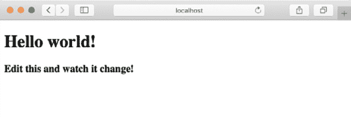
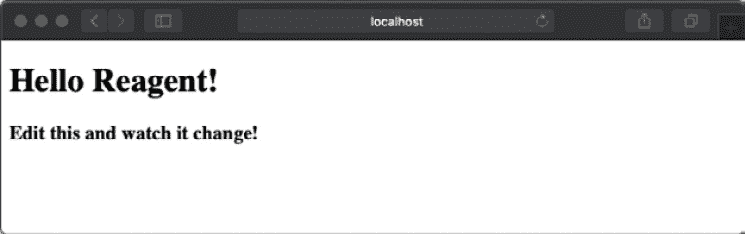
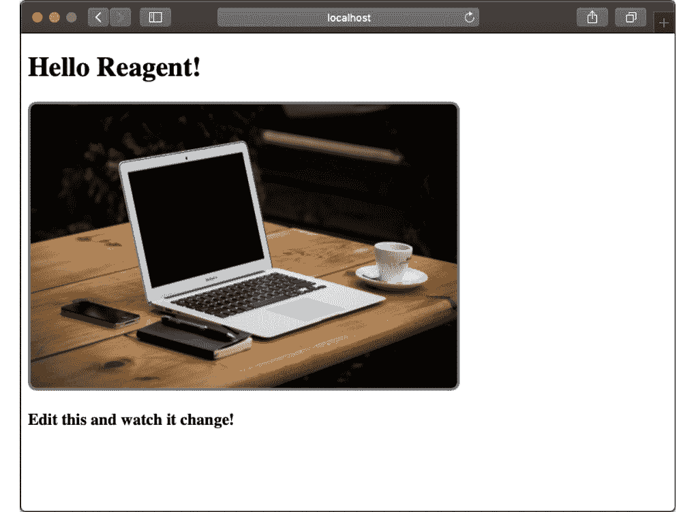
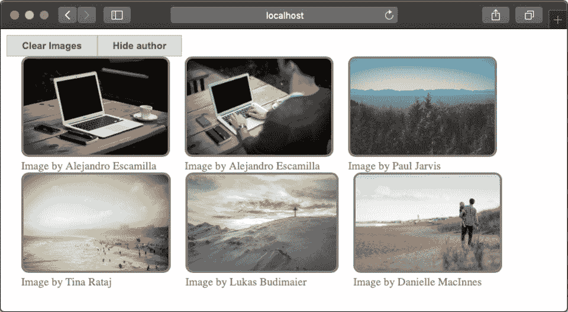
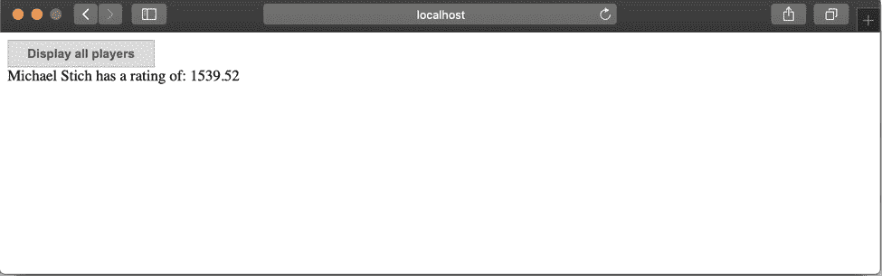

# 15. 前端：ClojureScript UI

概述

在本章中，我们将介绍 React 的虚拟 DOM 和生命周期的基本知识，然后提供构建前几章中概述的数据应用程序所需丰富用户界面的工具。我们将了解如何从 ClojureScript 中调用 JavaScript 代码以及如何在 JavaScript 和 ClojureScript 对象之间进行转换。

到本章结束时，你将能够为数据应用程序构建一个丰富的用户界面。

# 简介

Clojure 是一种托管语言，这意味着它在另一种语言之上运行。与 Clojure 在 JVM 之上运行的方式相同，ClojureScript 在 JavaScript 之上运行。更精确地说，一个 ClojureScript 程序被转换成一个可以在浏览器、服务器端以及任何支持 JavaScript 的环境中运行的 JavaScript 程序。例如，考虑 Node.js，这是一个开源的 JavaScript 服务器环境，它允许我们执行 JavaScript 程序。

在本章中，我们将学习 ClojureScript 的基础知识以及如何创建一个在浏览器中运行的 ClojureScript 程序。我们将在 Reagent 框架之上构建一个小型的前端应用程序，该应用程序连接到 HTTP 端点并显示用户可以与之交互的用户界面（UI）组件。我们将使用 Hiccup 作为 UI 组件的标记语言，并了解如何从 ClojureScript 中执行 JavaScript 代码。

我们将使用支持热代码重载的 Figwheel 构建一个应用程序。当你的应用程序运行时，你可以通过更改代码或评估 REPL 中的代码来修改它。你的应用程序将神奇地更新，而无需刷新页面。

我们将学习如何组织 Reagent 应用程序的不同组件：CSS、HTML 和`cljs`文件。我们将构建几个 Reagent 组件，这些组件可以访问和修改应用程序的状态，并从网络中获取数据。

# Hiccup 而不是 HTML

Hiccup 是一个用于在 Clojure 中表示 HTML 的库。在*活动 6.01*，*从 Clojure 向量生成 HTML*中，你实现了 Hiccup 的简化版本。正如你所记得的，Hiccup 使用：

+   向量表示元素

+   映射表示元素的属性（包括样式）

在 Hiccup 向量中，第一个元素是一个关键字，它指定了相应的 HTML 元素：

+   `:div`代表`<div>`标签

+   `:span`代表`<span>`标签

+   `:img`代表``标签

在 Hiccup 中，一个空的`<div>`由`[:div]`表示。

第二个元素是一个可选的映射，它表示元素的属性，其中属性的名称遵循 kebab-case 约定：我们用一个下划线字符分隔单词（`on-click`而不是`onClick`）。

例如，`[:div {:class "myDiv"}]`代表`<div class="myDiv"></div>`。

注意，在 HTML 中，`style`属性是一个字符串，而在 Hiccup 中它是一个遵循 kebab-case 约定的键值对映射。例如，考虑以下示例：

```java
[:div 
  {:style {:color "white"
           :background-color "blue" }}
   "Hello Hiccup"] 
```

这在 HTML 中表示如下：

```java
<div style="color: white; background-color: blue;">Hello Hiccup</div>
```

这里，`color: white`表示`Hello Hiccup`文本和`background-color`在`div`标签内的颜色将是蓝色。

在可选的属性映射之后，我们有子元素——我们想要的任意数量。例如，考虑以下内容：

```java
[:div "Hello " "my " "friends!"]
```

它代表了以下内容：

```java
<div>Hello my friends</div>
```

我们可以将 Hiccup 元素嵌套为 Hiccup 元素的子元素。例如，考虑以下内容：

```java
[:div 
 [:img {:src "https://picsum.photos/id/10/2500/1667"}]
   [:div "A beautiful image"]]
```

这代表了以下 HTML 代码：

```java
<div>
   </img>
  <div>A beautiful image </div>
</div>
```

在 Hiccup 中，我们可以以两种方式指定元素的类：

+   指定元素属性：

    ```java
    [:div {:class "myClass"} "Life is beautiful"]
    ```

+   使用 Hiccup 缩写，通过附加一个点和类的名称：

    ```java
    [:div.myClass "Life is beautiful"]
    ```

与 HTML 相比，Hiccup 更加紧凑且易于阅读。

此外，我们可以在 Hiccup 中将代码和数据混合在一起，以动态生成 UI 组件，而无需使用额外的模板语言，就像我们通常在 JavaScript 中做的那样。

例如，假设我们想要创建一个包含 10 个`todo`项的列表。我们通常会手动写下如下内容：

```java
[:ul
 [:li "todo 1"]
 [:li "todo 2"]
 [:li "todo 3"]
...]
```

然而，我们可以使用`map`和`into`生成完全相同的 Hiccup 元素：

```java
  (into [:ul] 
     (map (fn [num] [:li (str "todo " num)]) (range 10)))
```

## Reagent 入门

Reagent 是 React.js 的极简 ClojureScript 包装器。React.js 是一个用于构建 UI 的 JavaScript 库。

Reagent 组件与 Hiccup 组件类似，除了第一个元素可以是关键字或函数。当它是关键字时，它是一个 Hiccup 组件；当它是函数时，Reagent 会调用该函数以渲染组件，并将向函数传递向量中的剩余部分。

Reagent 应用程序由三部分组成：ClojureScript 代码、HTML 页面和 CSS 规则。

在 Reagent 中，就像在 React 中一样，HTML 页面是极简的：它主要是一个带有 ID 的`<div>`元素，通常是`<div id="app">`。

CSS 规则在 JavaScript 应用程序中工作方式相同。ClojureScript 代码通常从`core.cljs`文件开始，该文件渲染应用程序的主要组件。在本章的练习和活动中，应用程序将是一个单独的命名空间，但在生产应用程序中，应用程序被分割成几个命名空间，就像在 Clojure 中一样。

在 Reagent 中，应用程序的状态存储在一个 ratom（reagent/atom 的缩写）中，它具有与常规 Clojure 原子相同的接口。ratom 与 Clojure 原子的区别在于，当 ratom 发生变化时，UI 会重新渲染。

React.js 采用了函数式编程方法，并鼓励开发者从操作数据结构的组件构建他们的前端应用程序。React 以非常高效的方式在浏览器中的**文档对象模型**（**DOM**）中渲染数据结构。React 使开发者免于处理 DOM 的低级操作，从而让他们能够专注于业务逻辑。

Clojure 的数据驱动方法、不可变数据结构以及通过原子管理变化的方式，使得 React 和 ClojureScript 成为了一个强大的组合。

# 虚拟 DOM 和组件生命周期

当我们在 React.js 中构建应用程序时，我们并不直接与 DOM 打交道，DOM 是浏览器的渲染机制和对象模型。相反，React 向开发者提供了一个虚拟 DOM，并隐藏了实现细节。这就是 React 如此强大的原因。简而言之，当开发 React 应用程序时，开发者编写返回数据结构的 React 组件，React 框架会自动更新 DOM 并在 UI 上渲染组件。

此外，React 足够智能，可以计算出更新 UI 状态所需的最小 DOM 更改量，这使得 React 应用程序性能极高。

如果应用程序需要复杂组件的行为，例如组件挂载时或组件更新前执行特殊操作，React 提供了组件可以与之交互的生命周期方法。

## 练习 15.01：创建 Reagent 应用程序

在这个练习中，我们将创建一个非常简单的 Reagent 组件：一个带有几个 CSS 属性的图片。我们将在本章中使用以下 CSS 属性：

+   内边距：7px；// 内部填充

+   光标：指针；// 光标的类型

+   外边距左：10px；// 元素之间的水平间距

+   外边距下：10px；// 元素之间的垂直间距

+   边框：1px 实线灰色；// 1px 实线边框，颜色为灰色

+   边框半径：10px；// 角落的半径

+   颜色：灰色；// 文本颜色

+   字体大小：15px；// 字体的大小

+   浮动：左；水平对齐代替默认的垂直对齐

1.  在命令行提示符下，使用以下 Leiningen 命令创建一个新的 Figwheel 项目：

    ```java
    lein new figwheel packt-clj.reagent-sandbox -- --reagent
    ```

1.  将文件夹切换到`packt-clj.reagent-sandbox/`目录，并输入以下命令来启动应用程序：

    ```java
    lein figwheel
    ```

    几秒后，你的浏览器应该会打开默认的 Figwheel 页面：

    

    图 15.1：一个等待你编写代码的新 ClojureScript 项目

1.  在当前文件夹下，使用你喜欢的编辑器打开`src/packt_clj/reagent_sandbox/core.cljs`文件，查看以下表达式：

    ```java
    (reagent/render-component [hello-world]
                              (. js/document (getElementById "app")))
    ```

    此代码通过调用`reagent/render-component`函数并传入两个参数来渲染 UI。第一个参数是要渲染的 Reagent 组件`[hello-world]`，第二个参数是组件将要渲染的 HTML 元素 – 在我们的例子中，是 ID 为`app`的元素。

1.  让我们看看渲染应用程序主要组件的`hello-world`函数：

    ```java
    (defn hello-world []
      [:div
       [:h1 (:text @app-state)]
       [:h3 "Edit this and watch it change!"]])
    ```

    `hello-world`返回一个向量，一个类型为`:div`的 Hiccup 组件，有两个子组件。第一个子组件是`[:h1 (:text @app-state)]`，这是一个`:h1`组件，其文本来自对`app-state`原子解引用的`:text`值（参见*第十二章*，*并发*，关于原子的内容）。第二个子组件是`[:h3 "Edit this and watch it change!"]`，这是一个`:h3`组件，具有固定文本。让我们看看它是如何工作的！

1.  返回到你运行 lein figwheel 的终端窗口。你在一个 Figwheel REPL 中。你应该看到一个像这样的提示符：

    ```java
    dev:cljs.user =>
    ```

1.  现在，让我们通过在 REPL 中输入以下内容来切换到 packt-clj.reagent-sandbox.core 命名空间：

    ```java
    dev:packt-clj.reagent-sandbox.core=> (require 'packt-clj.reagent-sandbox.core)
    nil
    dev:packt-clj.reagent-sandbox.core=> (in-ns 'packt-clj.reagent-sandbox.core)
    dev:packt-clj.reagent-sandbox.core=> 
    ```

1.  现在，让我们检查我们应用的状态：

    ```java
    dev:packt-clj.reagent-sandbox.core!{:conn 2}=> app-state
    #<Atom: {:text "Hello world!"}>
    ```

1.  然后让我们修改 atom 中的`:text`值：

    ```java
    dev:packt-clj.reagent-sandbox.core=> (swap! app-state assoc-in [:text] "Hello Reagent!")
    {:text "Hello Reagent!"}
    ```

    应用程序立即更新为新的文本：

    

图 15.2：打印更新后的文本

正如我们之前提到的，`app-state`是一个 ratom；因此，当它发生变化时，Reagent 会重新渲染 UI。

## 练习 15.02：以样式显示图像

让我们使用几个 CSS 属性渲染一个图像：

1.  编辑`src/packt_clj/reagent_sandbox/core.cljs`：

    ```java
    (defn image [url]
      [:img {:src url
             :style {:width "500px" 
                     :border "solid gray 3px"
                     :border-radius "10px"}}])
    (defn hello-world []
      [:div
       [:h1 (:text @app-state)]
       [:div [image «https://picsum.photos/id/0/5616/3744»]]
       [:h3 "Edit this and watch it change!"]])
    ```

    第一部分创建了一个图像组件，第二部分将图像组件的实例作为应用主组件的一部分。当你保存文件时，你的应用应该看起来像这样：

    

图 15.3：渲染图像

这就是我们所说的热代码重新加载：你更改代码，应用会立即更新，而无需刷新页面。

## 管理组件状态

在 Reagent 中，组件的行为取决于组件的状态。状态存储在两个地方：

+   当组件实例化时传递给组件的参数

+   一个 ratom

传递给组件的参数不能被组件修改，但 ratom 可以被修改。当我们想要允许组件在用户交互（例如，点击）时更改其状态（或另一个组件的状态）时，这很有用。

要构建具有复杂应用状态的现实生活生产应用程序，我们在 Reagent 之上使用一个框架，例如，Reframe，这是一个在 Reagent 之上编写单页应用的流行框架。

## 练习 15.03：一个修改其文本的按钮

让我们创建一个初始文本为"ON"的切换按钮，当我们点击它时，它会将其文本更改为"OFF"：

1.  编辑`src/packt_clj/reagent_sandbox/core.cljs`。我们向`app-state` ratom 添加有关按钮是否开启的信息，通过包括一个初始值为`true`的`:button-on?`键：

    ```java
    (defonce app-state (atom {:text "Hello world!"
                              :button-on? true}))
    ```

1.  现在我们创建一个`button`组件，按钮的文本取决于`:button-on?`的值，点击处理程序切换`:button-on?`的值。注意，点击处理程序通过`:on-click`引用（而在纯 HTML 中，它是`onClick`）：

    ```java
    (defn button []
      (let [text (if (get-in @app-state [:button-on?]) "ON" "OFF")]
        [:button
         {:on-click #(swap! app-state update-in [:button-on?] not)}
         text]))
    ```

1.  最后，我们将按钮实例化为我们应用的一部分：

    ```java
    (defn hello-world []
      [:div
       [:h1 (:text @app-state)]
       [button]
       [:div [image "https://picsum.photos/id/0/5616/3744"]]
       [:h3 "Edit this and watch it change!"]])
    ```

    切换到你的浏览器窗口，**刷新页面**，点击按钮，看看文本是如何修改的。在这种情况下，我们必须刷新页面，因为我们已经改变了应用程序的初始状态。

1.  你也可以通过 REPL 更改按钮的状态：

    ```java
    dev:packt-clj.reagent-sandbox.core=> (swap! app-state assoc-in [:button-on?] true)
    {:text "Hello world!", :button-on? true}
    ```

    UI 立即更新。我们不需要刷新页面，因为热重载。点击按钮或交换 ratom 是更新应用程序状态的两种等效方式。

## 带有子组件的组件

正如我们在介绍 Hiccup 时所看到的，我们可以在 Reagent 组件内部程序化地生成子组件。例如，我们可以从一个图像 URL 数组开始，将每个 URL 转换为图像组件。这样，我们就能程序化地生成一个图像网格。

## 练习 15.04：创建图像网格

让我们创建一个组件，该组件以网格的形式渲染一系列图像：

1.  编辑 `src/packt_clj/reagent_sandbox/core.cljs`。首先，我们创建一个 `image-with-width` 组件，该组件接收图像宽度作为参数：

    ```java
    (defn image-with-width [url width]
      [:img {:src url
                  :style {:width width
                          :border "solid gray 3px"
                          :border-radius "10px"}}])
    ```

1.  按如下方式创建一个网格组件：

    ```java
    (defn image-grid [images]
      (into [:div]
            (map (fn [image-data] 
                   [:div {:style {:float "left" 
                                  :margin-left "20px"}}
                    [image-with-width image-data "50px"]])
                 images)))
    ```

1.  现在，我们创建一个图像 URL 向量：

    ```java
    (def my-images
      ["https://picsum.photos/id/0/5616/3744"
       "https://picsum.photos/id/1/5616/3744"
       "https://picsum.photos/id/10/2500/1667"
       "https://picsum.photos/id/100/2500/1656"
       "https://picsum.photos/id/1000/5626/3635"
       "https://picsum.photos/id/1001/5616/3744"
       "https://picsum.photos/id/1002/4312/2868"
       "https://picsum.photos/id/1003/1181/1772"
       "https://picsum.photos/id/1004/5616/3744"
       "https://picsum.photos/id/1005/5760/3840"])
    ```

1.  最后，我们使用 `my-images` 实例化图像网格：

    ```java
    (defn hello-world []
      [:div
        [:h1 (:text @app-state)]
        [image-grid my-images]])
    ```

    现在，当我们切换到浏览器窗口时，我们看到以下内容：

    ![图 15.4：图像网格

    ![img/B14502_15_04.jpg]

    图 15.4：图像网格

1.  为了更好地理解 `image-grid`，让我们检查在 REPL 中通过传递 `my-images` 的前三个元素给 `image-grid` 函数时返回的 `Hiccup` 向量：

    ```java
    dev:packt-clj.reagent-sandbox.core=> (image-grid (take 3 my-images))
    ```

    这将返回以下内容：

    ```java
    [:div
     [:div
      {:style {:float "left", :margin-left "20px"}}
      [#object[packt_clj$reagent_sandbox$core$image_with_width]
       «https://picsum.photos/id/0/5616/3744»
       «50px»]]
     [:div
      {:style {:float "left", :margin-left "20px"}}
      [#object[packt_clj$reagent_sandbox$core$image_with_width]
       «https://picsum.photos/id/1/5616/3744»
       «50px»]]
     [:div
      {:style {:float "left", :margin-left "20px"}}
      [#object[packt_clj$reagent_sandbox$core$image_with_width]
       «https://picsum.photos/id/10/2500/1667»
       «50px»]]]
    ```

这是一个具有三个子组件的 `:div` 组件，其中每个子组件都是一个具有 `style` 映射和嵌套 `image-with-width-component` 的 `:div` 元素。

## 热重载

你有没有注意到 `app-state` 是通过 `defonce` 而不是通过 `def` 定义的，就像我们通常在 Clojure 中定义变量一样？

`defonce` 和 `def` 之间的区别在于，当 `defonce` 被调用两次时，第二次调用没有效果。

让我们看看一个简单的例子：

```java
(defonce a 1)
(defonce a 2)
```

`a` 的值现在是 `1`。在热重载的上下文中，`defonce` 是至关重要的。原因是，在热代码重载的情况下，我们希望：

+   要重新加载的代码

+   `app` 的状态保持不变

这两个愿望似乎相互矛盾，因为 `app` 的初始状态是在代码中定义的。因此，重新加载代码似乎意味着重新初始化 `app` 的状态。在这里，`defonce` 来拯救我们。设置 `app` 初始状态的代码只调用一次！

如果你好奇，你可以在理解 `defonce` 和 `def` 之间的区别的目的是，在你的应用程序代码中将 `defonce` 替换为 `def`，并看看每次我们保存代码更改时应用程序如何回到其初始状态。

## JavaScript 互操作

现在是时候学习在 ClojureScript 中如何与底层 JavaScript 语言进行互操作了。通过互操作，我们主要指的是：

+   从 ClojureScript 访问窗口全局对象

+   从 ClojureScript 代码中调用 JavaScript 函数

+   在 JavaScript 和 ClojureScript 对象之间进行转换

为了访问窗口作用域，我们使用`js/`前缀。例如，`js/document`代表文档对象，`js/Math.abs`代表`Math`作用域中的`abs`函数。为了在 JavaScript 对象上调用方法，我们使用点符号，如下所示：

+   `(. js/Math abs -3)`等同于`Math.abs(3)`。

+   `(. js/document (getElementById "app"))`对应于`document.getElementById("app")`。

现在，你可以完全理解`src/packt_clj/reagent_sandbox/core.cljs`中的表达式，该表达式渲染 UI：

```java
(reagent/render-component [hello-world]
                          (. js/document (getElementById "app")))
```

当我们想要在 JavaScript 和 ClojureScript 对象之间进行转换时，我们使用`js->clj`和`clj->js`函数。

考虑以下示例：

```java
(clj->js {"total" 42}) 
```

这返回了 JavaScript 对象`{total: 42}`，在 REPL 中表示为`#js {:total 42}`。

注意 ClojureScript 关键词被转换为字符串：

```java
(clj->js {:total 42})
```

这返回了 JavaScript 对象`{total: 42}`。

`clj->js`是递归的，这意味着嵌套对象也被转换为 JavaScript 对象。考虑以下示例：

```java
(clj->js {"total" 42
                "days" ["monday" "tuesday"]})
```

这将返回以下内容：

```java
{total: 42, 
  days: ["monday" "tuesday"]}
```

你也可以使用`#js`表示法来生成 JavaScript 对象，但请注意它不是递归的。ClojureScript 中的`#js {:total 42}`在 JavaScript 中生成`{total: 42}`。

那么从 JavaScript 到 ClojureScript 的方向呢？你使用`js->clj`函数。`(js->clj #js {"total" 42})`返回 ClojureScript 对象`{"total" 42}`。

如果你想要将 JavaScript 字符串转换为 ClojureScript 关键词，你需要通过传递额外的参数到`js->clj`来对键进行关键词化：

```java
(js->clj #js {"total" 42} :keywordize-keys true)
```

这将返回 ClojureScript 对象`{:total 42}`。

## 练习 15.05：从 HTTP 端点获取数据

让我们使用我们的 JavaScript 互操作知识从返回 JSON 的 HTTP 端点获取数据，即[`packt.live/2RURzar`](https://packt.live/2RURzar)。此端点返回一个由三个对象组成的 JSON 数组，包含有关图片的数据：

1.  在 JavaScript 中，我们会使用 JavaScript 的`fetch`函数和两个承诺将服务器响应转换为 JSON 对象：

    ```java
    fetch("https://picsum.photos/v2/list?limit=3")
    .then((function (response){
      return response.json();
    }))
    .then((function (json){
      return console.log(json);
    }))
    ```

1.  在 ClojureScript 中，前面的代码翻译成以下内容：

    ```java
    (-> (js/fetch "https://picsum.photos/v2/list?limit=3")
        (.then (fn [response] (.json response)))
        (.then (fn [json] (println  (js->clj json :keywordize-keys true)))))
    ```

    它将三个 ClojureScript 对象打印到控制台上的 ClojureScript 向量中：

    ```java
    [{:id "0",
      :author "Alejandro Escamilla",
      :width 5616,
      :height 3744,
      :url "https://unsplash.com/photos/yC-Yzbqy7PY",
      :download_url "https://picsum.photos/id/0/5616/3744"}
     {:id "1",
      :author "Alejandro Escamilla",
      :width 5616,
      :height 3744,
      :url "https://unsplash.com/photos/LNRyGwIJr5c",
      :download_url "https://picsum.photos/id/1/5616/3744"}
     {:id "10",
      :author "Paul Jarvis",
      :width 2500,
      :height 1667,
      :url "https://unsplash.com/photos/6J--NXulQCs",
      :download_url "https://picsum.photos/id/10/2500/1667"}]
    ```

所有部件现在都已就绪，可以构建一个小的前端应用程序，该应用程序显示来自互联网的图像网格。

## 活动 15.01：从互联网显示图像网格

你被要求为一名自由职业图形编辑器编写一个前端应用程序，该应用程序显示来自互联网的六张图片和两个按钮：

+   一个清除图片的按钮

+   一个隐藏作者名字的按钮

此按钮可以被图形编辑器用来查看添加到图片中的作者名字。

这些步骤将帮助你完成活动：

1.  创建一个新的 Figwheel 项目。

1.  创建两个按钮；一个将清除图片，另一个将隐藏作者名字。

1.  添加图片。

完成活动后，你应该能看到类似以下的内容：



图 15.5：预期结果

注意

本活动的解决方案可以在第 758 页找到。

## 活动 15.02：排名的网球运动员

让我们通过结合从本章获得的知识和我们在*第十四章*中讨论的材料来结束本章。在第十四章的*使用 Ring 的 HTTP*活动中，我们构建了一个返回网球运动员数据的 HTTP API 服务器。在当前活动中，你被要求为这个 HTTP 服务器构建一个前端。

你必须构建一个 Web 应用，它：

+   显示所有网球运动员的名字

+   当用户点击他们的名字时，显示任何网球运动员的排名

在开始之前，你需要执行*第十四章*，*使用 Ring 的 HTTP*的活动，对服务器的代码进行轻微修改以支持我们将要构建的 Web 应用的 API 请求。当前活动将从该服务器请求数据。默认情况下，Web 服务器不允许来自另一个主机的请求。在我们的情况下，API 服务器运行在端口`8080`，而前端服务器运行在端口`3449`。为了允许前端应用发出的请求由 API 服务器提供服务，我们需要配置 API 服务器，使其允许**跨源资源共享**（**CORS**）。

在开始活动之前，你需要进行以下更改：

1.  打开包含*活动 14.01*，*通过 REST 公开历史网球结果和 ELO 计算*代码的文件夹。

1.  将以下依赖项添加到`deps.edn`文件中：

    ```java
    jumblerg/ring-cors {:mvn/version "2.0.0"}
    ```

1.  打开`packt-clj/src/packt_clj/tennis/api.clj`文件，并在文件顶部的`require`表达式中添加以下行：

    ```java
    [jumblerg.middleware.cors :refer [wrap-cors]]
    ```

1.  打开`packt-clj/src/packt_clj/tennis/api.clj`文件，并在文件末尾`run`函数的定义中添加以下两行：

    ```java
    (wrap-cors ".*")
    (wrap-cors identity)
    ```

    `run`函数现在应该看起来像这样：

    ```java
    (defn run
      []
      (run-jetty
        (-> routes
            middleware/wrap-format
            params/wrap-params
            (wrap-cors ".*")
            (wrap-cors identity))
        {:port  8080
         :join? false}))
    ```

1.  现在，按照*活动 14.01*，通过 REST 公开历史网球结果和 ELO 计算的解释来运行服务器。

按照以下步骤完成此活动：

1.  设置一个新的 Figwheel 项目，使用 Reagent。

1.  编写代码，从*第十四章*，使用 Ring 的 HTTP，从服务器获取网球运动员数据，并将其插入你新的 ClojureScript 应用的应用状态中。你还需要在应用状态中为所选的运动员提供一个当前运动员的字段。

1.  编写用于显示玩家列表和用于显示单个玩家及其数据的视图。

1.  集成处理选择要查看的运动员的链接和加载和清除玩家列表的按钮的处理程序。

    完成当前活动后，你应该在浏览器中看到如下内容：

    

图 15.6：玩家列表

当用户点击 Michael Stich 时，应用看起来像这样：



图 15.7：运动员的评级

注意

本活动的解决方案可以在第 762 页找到。

# 摘要

在本章中，您学习了如何使用 Reagent（React.js 的包装器）在 ClojureScript 中构建前端应用程序的基础知识。

我们使用 Hiccup 标记语言构建了几个 Reagent 组件，该语言使用 Clojure 集合来定义 HTML 结构和属性。应用程序的状态存储在一个 Reagent 原子中，您通过 REPL 与之交互。

我们看到了如何从 ClojureScript 调用 JavaScript 代码，以及如何在不同对象之间进行转换。您使用这些互操作功能从 HTTP 服务器获取图像数据，并将数据转换为 ClojureScript 对象。

我们已经到达了本书的结尾。从*第一章*的首页开始，您已经看到了很多新事物，*Hello REPL!*。除了语法基础之外，您还学到了很多关于函数式编程的知识，更重要的是，您学会了如何以函数式的方式思考。知道不可变性是什么是一回事，而知道如何使用不可变数据完成任务则是另一回事。通过专注于集合，我们能够向您展示 Clojure 的一些最独特特性，如惰性序列，同时构建您解决问题的思维模式库。Clojure 通常被认为是一种以数据为中心的语言，因此集合是其关键部分。编程不仅仅是掌握语言特性。

我们的另一个重点是使用 Clojure 完成任务，这意味着您需要了解如何在 Clojure 工具生态系统中进行导航。您已经学会了如何设置项目，如何为 Clojure 和 ClojureScript 项目使用 Leiningen，以及如何组织命名空间。平台和互操作性也是这幅画面的重要组成部分：您已经了解了如何在 Clojure(Script)中使用 Java 或 JavaScript 功能。测试对于任何真实世界的项目来说也是一项必要的技能。您现在也已经了解了这一点。您还看到了足够多的宏和 Clojure 的并发工具，以至于您将知道在需要解决复杂问题时从哪里开始。

最后，您已经处理过数据库和 Web 服务器。在几乎任何软件项目中，至少会有这两种技术中的之一存在。通常，两者都会存在。当然，这两个主题本身都非常广泛，但到目前为止，您已经了解了如何以 Clojure 的方式——正如您在本章中所做的那样——以及以 ClojureScript 的方式接近它们。而且，除了细节之外，我们希望您在 Clojure 中的第一步已经让您对编程的新思维方式有了认识。这样，您将能够学习未来需要的任何东西。
