# 附录

## 关于

本节包含在内，以帮助学生执行书中的活动。它包括学生要执行的详细步骤，以完成并实现书的目标。

# 1. 欢迎使用 REPL！

## 活动 1.01：执行基本操作

解答：

1.  打开 REPL。

1.  打印消息`"我不怕括号"`来激励自己：

    ```java
    user=> (println "I am not afraid of parentheses")
    I am not afraid of parentheses
    nil
    ```

1.  将 1、2 和 3 相加，然后将结果乘以 10 减 3，这对应于以下`infix`表示法：（1 + 2 + 3）*（10 - 3）：

    ```java
    user=> (* (+ 1 2 3) (- 10 3))
    42
    ```

1.  打印消息`"做得好!"`来祝贺自己：

    ```java
    user=> (println "Well done!")
    Well done!
    Nil
    ```

1.  通过按*Ctrl* + *D*或输入以下命令退出 REPL：

    ```java
    user=> (System/exit 0)
    ```

通过完成这个活动，你已经编写了打印标准输出的消息的代码。你还使用*prefix*表示法和嵌套表达式执行了一些数学运算。

## 活动 1.02：预测大气二氧化碳水平

解答：

1.  打开您最喜欢的编辑器和旁边的 REPL 窗口。

1.  在您的编辑器中，定义两个常量`base-co2`和`base-year`，分别具有值 382 和 2006：

    ```java
    (def base-co2 382)
    (def base-year 2006)
    ```

1.  在您的编辑器中，编写定义`co2-estimate`函数的代码，不要忘记使用`doc-string`参数对其进行文档化。

1.  你可能会想将函数体写在一行中，但嵌套大量的函数调用会降低代码的可读性。通过在`let`块中分解它们，也更容易推理每个步骤的过程。使用`let`来定义局部绑定`year-diff`，它是从`year`参数中减去 2006 的结果：

    ```java
    (defn co2-estimate
     "Returns a (conservative) year's estimate of carbon dioxide parts per million in the atmosphere"
     [year]
     (let [year-diff (- year base-year)]
      (+ base-co2 (* 2 year-diff))))
    ```

1.  通过评估`(co2-estimate 2050)`来测试您的函数。你应该得到`470`作为结果：

    ```java
    user=> (co2-estimate 2050)
    470
    ```

1.  使用`doc`查找您函数的文档，并确保它已被正确定义：

    ```java
    user=> (doc co2-estimate)
    -------------------------
    user/co2-estimate
    ([year])
      Returns a (conservative) year's estimate of carbon dioxide parts per million in the atmosphere
    nil
    ```

在这个活动中，我们计算了给定年份的二氧化碳百万分之一估计水平。

## 活动 1.03：meditate 函数 v2.0

解答：

1.  打开您最喜欢的编辑器和旁边的 REPL 窗口。

1.  在您的编辑器中，定义一个名为`meditate`的函数，它接受两个参数`calmness-level`和`s`，不要忘记编写其文档。

1.  在函数体中，首先编写一个打印字符串`"Clojure Meditate v2.0"`的表达式：

    ```java
    (defn meditate
      "Return a transformed version of the string 's' based on the 'calmness-level'"
      [s calmness-level]
      (println "Clojure Meditate v2.0"))
    ```

1.  根据规范，编写第一个条件来测试平静度是否严格低于 5。编写条件表达式的第一个分支（即"then"）。

1.  编写第二个条件，它应该嵌套在第一个条件的第二个分支中（即"else"）。

1.  编写第三个条件，它应该嵌套在第二个条件的第二个分支中。它将检查`calmness-level`是否正好是 10，并在这种情况下返回`s`字符串的反转：

    ```java
    (defn meditate
      "Return a transformed version of the string 's' based on the 'calmness-level'"
      [s calmness-level]
      (println "Clojure Meditate v2.0")
      (if (< calmness-level 4)
        (str (clojure.string/upper-case s) ", I TELL YA!")
        (if (<= 4 calmness-level 9)
            (clojure.string/capitalize s)
            (if (= 10 calmness-level)
              (clojure.string/reverse s)))))
    ```

1.  通过传递具有不同平静度的字符串来测试您的函数。输出应类似于以下内容：

    ```java
    user=> (meditate "what we do now echoes in eternity" 1)
    Clojure Meditate v2.0
    "WHAT WE DO NOW ECHOES IN ETERNITY, I TELL YA!"
    user=> (meditate "what we do now echoes in eternity" 6)
    Clojure Meditate v2.0
    "What we do now echoes in eternity"
    user=> (meditate "what we do now echoes in eternity" 10)
    Clojure Meditate v2.0
    "ytinrete ni seohce won od ew tahw"
    user=> (meditate "what we do now echoes in eternity" 50)
    Clojure Meditate v2.0
    nil
    ```

    如果你一直在使用`and`运算符来确定一个数字是否在两个其他数字之间，重写你的函数以移除它，并仅使用`<=`运算符。记住`<=`可以接受超过两个参数。

1.  在文档中查找`cond`运算符，并重写你的函数以用`cond`替换嵌套的条件：

    ```java
    user=> (doc cond)
    -------------------------
    clojure.core/cond
    ([& clauses])
    Macro
      Takes a set of test/expr pairs. It evaluates each test one at a
      time.  If a test returns logical true, cond evaluates and returns
      the value of the corresponding expr and doesn't evaluate any of the
      other tests or exprs. (cond) returns nil.
    nil
    user=> 
    (defn meditate
      "Return a transformed version of the string 's' based on the 'calmness-level'"
      [s calmness-level]
      (println "Clojure Meditate v2.0")
      (cond
        (< calmness-level 4)  (str (clojure.string/upper-case s) ", I TELL YA!")
        (<= 4 calmness-level 9) (clojure.string/capitalize s)
        (= 10 calmness-level) (clojure.string/reverse s)))
    ```

通过完成这个活动，你已经编写了一个文档化的函数，该函数接受多个参数，打印一条消息，并根据条件返回字符串的转换。

# 2. 数据类型和不可变性

## 活动 2.01：创建一个简单的内存数据库

解决方案：

1.  首先，创建辅助函数。你可以通过不带参数执行`read-db`函数来获取哈希表，并通过执行带有哈希表作为参数的`write-db`函数来写入数据库：

    ```java
    user=>
    (def memory-db (atom {}))
    #'user/memory-db
    (defn read-db [] @memory-db)
    #'user/read-db
    user=> (defn write-db [new-db] (reset! memory-db new-db))
    #'user/write-db
    ```

1.  首先，创建`create-table`函数。这个函数应该接受一个参数：表名。它应该在我们的哈希表数据库的根处添加一个新的键（表名），其值应该是一个包含两个条目的另一个哈希表——在`data`键处的空向量以及在`indexes`键处的空哈希表：

    ```java
    user=>
    (defn create-table
      [table-name]
      (let [db (read-db)]
        (write-db (assoc db table-name {:data [] :indexes {}}))))
    #'user/create-table
    ```

1.  测试你的`create-table`函数是否正常工作。输出应该如下所示：

    ```java
    user=> (create-table :clients)
    {:clients {:data [], :indexes {}}}
    user=> (create-table :fruits)
    {:clients {:data [], :indexes {}}, :fruits {:data [], :indexes {}}}
    ```

1.  让我们创建下一个函数：`drop-table`。该函数也应该接受一个参数：表名。它应该从我们的数据库中删除一个表，包括其所有数据和索引：

    ```java
    user=>
    (defn drop-table
      [table-name]
      (let [db (read-db)]
        (write-db (dissoc db table-name))))
    #'user/drop-table
    ```

1.  测试你的`drop-table`函数是否正常工作。输出应该如下所示：

    ```java
    user=> (create-table :clients)
    {:clients {:data [], :indexes {}}}
    user=> (create-table :fruits)
    {:clients {:data [], :indexes {}}, :fruits {:data [], :indexes {}}}
    user=> (drop-table :clients)
    {:fruits {:data [], :indexes {}}}
    ```

1.  让我们继续到`insert`函数。这个函数应该接受三个参数：`table`、`record`和`id-key`。`record`参数是一个哈希表，`id-key`对应于记录映射中的一个键，该键将用作唯一索引。例如，在`fruits`表中插入记录将看起来像这样：

    ```java
    user=> (insert :fruits {:name "Pear" :stock 3} :name)
    {:fruits {:data [{:name "Pear", :stock 3}], :indexes {:name {"Pear" 0}}}}
    ```

    目前，我们不会处理表不存在或索引键已存在于给定表中的情况。

    尝试使用`let`块将`insert`函数的工作分成多个步骤。

    在一个`let`语句中，为使用`read-db`检索的数据库值创建一个绑定：

    ```java
    (defn insert
      [table-name record id-key]
        (let [db (read-db)
    ```

    在同一个`let`语句中，为数据库的新值创建第二个绑定（在`data`向量中添加记录后）：

    ```java
    (defn insert
      [table-name record id-key]
        (let [db (read-db)
              new-db (update-in db [table-name :data] conj record)
    ```

    在同一个`let`语句中，通过计算`data`向量中的元素数量来检索记录插入的索引：

    ```java
    (defn insert
      [table-name record id-key]
        (let [db (read-db)
              new-db (update-in db [table-name :data] conj record)
              index (- (count (get-in new-db [table-name :data])) 1)]
    ```

    在`let`语句的主体中，更新`id-key`处的索引，并使用`write-db`将结果映射写入数据库：

    ```java
    user=>
    (defn insert
      [table-name record id-key]
        (let [db (read-db)
              new-db (update-in db [table-name :data] conj record)
              index (- (count (get-in new-db [table-name :data])) 1)]
          (write-db
            (update-in new-db [table-name :indexes id-key] assoc (id-key record) index))))
    #'user/insert
    ```

1.  为了验证你的`insert`函数是否正常工作，尝试多次使用它来插入新的记录。输出应该看起来像这样：

    ```java
    user=>  (insert :fruits {:name "Apricot" :stock 30} :name)
    {:fruits {:data [{:name "Pear", :stock 3} {:name "Apricot", :stock 30}], :indexes {:name {"Pear" 0, "Apricot" 1}}}}
    user=>  (insert :fruits {:name "Grapefruit" :stock 6} :name)
    {:fruits {:data [{:name "Pear", :stock 3} {:name "Apricot", :stock 30} {:name "Grapefruit", :stock 6}], :indexes {:name {"Pear" 0, "Apricot" 1, "Grapefruit" 2}}}}
    ```

1.  创建一个`select-*`函数，该函数将返回作为参数传递的表的全部记录。给定前面的三个记录，输出应该类似于以下内容：

    ```java
    user=> (select-* :fruits)
    [{:name "Pear", :stock 3} {:name "Apricot", :stock 30} {:name "Grapefruit", :stock 6}]
    user=>
    (defn select-*
      [table-name]
      (get-in (read-db) [table-name :data]))
    #'user/select-*
    ```

1.  创建一个`select-*-where`函数，它接受三个参数：`table-name`、`field`和`field-value`。该函数应使用索引映射来检索记录在数据向量中的索引，并返回该元素。给定前面的三个记录，输出应类似于以下内容：

    ```java
    user=> (select-*-where :fruits :name "Apricot")
    {:name "Apricot", :stock 30}
    user=>
    (defn select-*-where
      [table-name field field-value]
      (let [db (read-db)
            index (get-in db [table-name :indexes field field-value])
            data (get-in db [table-name :data])]
        (get data index)))
    #'user/select-*-where
    ```

1.  修改`insert`函数以拒绝任何索引重复。当`id-key`记录已存在于`indexes`映射中时，我们不应修改数据库，并向用户打印错误信息。输出应类似于以下内容：

    ```java
    user=>  (insert :fruits {:name "Pear" :stock 3} :name)
    Record with :name Pear already exists. Aborting
    user=> (select-* :fruits)
    [{:name "Pear", :stock 3} {:name "Apricot", :stock 30} {:name "Grapefruit", :stock 6}]
    user=>
    (defn insert
      [table-name record id-key]
      (if-let [existing-record (select-*-where table-name id-key (id-key record))]
        (println (str "Record with " id-key ": " (id-key record) " already exists.       Aborting"))
        (let [db (read-db)
              new-db (update-in db [table-name :data] conj record)
              index (- (count (get-in new-db [table-name :data])) 1)]
          (write-db
            (update-in new-db [table-name :indexes id-key] assoc (id-key record)           index)))))
    #'user/insert
    ```

    最终输出应类似于以下内容：

    ```java
    user=> (create-table :fruits)
    {:clients {:data [], :indexes {}}, :fruits {:data [], :indexes {}}}
    user=> (insert :fruits {:name "Pear" :stock 3} :name)
    Record with :name Pear already exists. Aborting
    user=> (select-* :fruits)
    [{:name "Pear", :stock 3} {:name "Apricot", :stock 30} {:name "Grapefruit", :stock 6}]
    user=> (select-*-where :fruits :name "Apricot")
    {:name "Apricot", :stock 30}
    ```

在这个活动中，我们利用了关于读取和更新简单和深层嵌套数据结构的新知识来实现一个简单的内存数据库。

# 3. 深入了解函数

## 活动三.01：构建距离和成本计算器

解决方案：

1.  首先定义`walking-speed`和`driving-speed`常量：

    ```java
     (def walking-speed 4)
    (def driving-speed 70)
    ```

1.  创建两个其他常量，代表具有坐标`:lat`和`:lon`的两个位置。您可以使用之前的巴黎和波尔多的示例，或者查找您自己的位置。您将使用它们来测试您的距离和行程函数：

    ```java
     (def paris {:lat 48.856483 :lon 2.352413})
    (def bordeaux {:lat 44.834999  :lon -0.575490})
    ```

1.  创建距离函数。它应接受两个参数，代表我们需要计算距离的两个位置。您可以在函数参数中直接使用顺序和关联解构来分解两个位置的纬度和经度。您可以将计算的步骤分解在`let`表达式中，并使用`Math/cos`函数来计算余弦和`Math/sqrt`来计算一个数的平方根：

    ```java
     (defn distance
      "Returns a rough estimate of the distance between two coordinate points, in     kilometers. Works better with smaller distance"
      [{lat1 :lat lon1 :lon} {lat2 :lat lon2 :lon}]
      (let [deglen 110.25
            x (- lat2 lat1)
            y (* (Math/cos lat2) (- lon2 lon1))]
        (* deglen (Math/sqrt (+ (* y y) (* x x))))))
    ```

1.  创建一个名为`itinerary`的多方法。它将提供未来添加更多类型交通的灵活性。它应使用`:transport`值作为调度*值*：

    ```java
     (defmulti itinerary
        "Calculate the distance of travel between two location, and the cost and       duration based on the type of transport"
        :transport)
    ```

1.  为`:walking`调度值创建行程函数。您可以在函数参数中使用关联解构来检索`HashMap`参数中的`:from`和`:to`键。您可以使用`let`表达式来分解距离和持续时间的计算。距离应简单地使用您之前创建的`distance`函数。为了计算持续时间，您应使用在*步骤 1*中定义的`walking-speed`常量：

    ```java
     (defmethod itinerary :walking
      [{:keys [:from :to]}]
      (let [walking-distance (distance from to)
        duration (/ (distance from to) walking-speed)]
        {:cost 0 :distance walking-distance :duration duration}))
    ```

1.  对于`:driving`行程函数，您可以使用包含与成本函数关联的车辆的*调度表*。创建一个`vehicle-cost-fns`调度表。它应该是一个`HashMap`，键是车辆类型，值是基于距离的成本计算函数：

    ```java
     (def vehicle-cost-fns
      {
        :sporche (partial * 0.12 1.3)
        :tayato (partial * 0.07 1.3)
        :sleta (partial * 0.2 0.1)
      })
    ```

1.  为 `:driving` 分派值创建行程函数。你可以在函数参数中使用关联解构来检索 `HashMap` 参数中的 `:from`、`:to` 和 `:vehicle` 键。驾驶距离和持续时间可以像步行距离和持续时间一样计算。成本可以通过使用 `:vehicle` 键从分派表中检索 `cost` 函数来计算：

    ```java
     (defmethod itinerary :driving
      [{:keys [:from :to :vehicle]}]
      (let [driving-distance (distance from to)
            cost ((vehicle vehicle-cost-fns) driving-distance)
            duration (/ driving-distance driving-speed)]
        {:cost cost :distance driving-distance :duration duration}))
    ```

    现在尝试以下操作：

    ```java
    user=> (def london {:lat 51.507351, :lon -0.127758})
    #'user/london
    user=> (def manchester {:lat 53.480759, :lon -2.242631})
    #'user/manchester
    user=> (itinerary {:from london :to manchester :transport :walking})
    {:cost 0, :distance 318.4448148814284, :duration 79.6112037203571}
    user=> (itinerary {:from manchester :to london :transport :driving :vehicle :sleta})
    {:cost 4.604730845743489, :distance 230.2365422871744, :duration 3.2890934612453484}
    ```

在这个活动中，我们通过构建两个位置之间的距离和成本计算器，将我们在本章中学到的解构和多重方法技术付诸实践。在未来，你可以想象将这段代码放在一个网络服务器后面，完成一个完整的行程计算应用的建设！

# 4. 映射和过滤

## 活动 4.01：使用映射和过滤来报告摘要信息

解决方案：

1.  首先，使用 `->>` 线程宏设置一个简单的框架：

    ```java
    (defn max-value-by-status [field status users]
                   (->> 
                     users
                     ;; code will go here
                     ))
    ```

    这定义了我们的函数的基本结构，我们可以总结如下：从 `users` 开始，将其发送通过一系列转换。

1.  这些转换中的第一个将是过滤掉所有没有我们正在寻找的状态的用户。我们将自然地使用 `filter` 来做这件事，并包括一个谓词，该谓词将每个用户的 `:status` 字段与函数中传入的 `status` 参数进行比较：（过滤 #(= (:status %) status)）。

    这样，我们的函数现在看起来是这样的：

    ```java
    (defn max-value-by-status [field status users]
                   (->> 
                     users
                      ;; step 1: use filter to only keep users who
                      ;; have the status we are looking for 
                     (filter #(= (:status %) status))
                      ;; More to come!
                     ))
    ```

    我们知道我们有了正确的用户集。现在，我们需要提取我们感兴趣的域。`field` 参数是一个关键字，因此我们可以将其用作一个函数来提取我们映射每个用户时所需的数据，如下所示：（映射 field）。

    现在，我们的函数看起来是这样的：

    ```java
    (defn max-value-by-status [field status users]
                   (->> 
                     users
                      ;; step 1: use filter to only keep users who
                      ;; have the status we are looking for 
                     (filter #(= (:status %) status))
                     ;; step 2: field is a keyword, so we can use it as 
                     ;; a function when calling map.
                     (map field)
                     ;; Watch this space!
                     ))
    ```

1.  在最后一步，我们使用 `(apply max)` 来在这堆干草中找到针：对应于 `field` 的最大值。

    完整的函数看起来像这样：

    ```java
    (defn max-value-by-status [field status users]
                   (->> 
                     users
                     (filter #(= (:status %) status))
                     (map field)
                     (apply max 0)))
    (defn min-value-by-status [field status users]
                   (->> 
                     users
                     (filter #(= (:status %) status))
                     (map field)
                     (apply min 0)))
    ```

## 活动 4.02：任意网球对抗

解决方案：

1.  第一步将是设置函数和 `with-open` 宏：

    ```java
    (defn rivalry-data [csv player-1 player-2]
      (with-open [r (io/reader csv)]
        ))
    ```

1.  在其中，设置一个 `let` 绑定。第一个绑定将是 `csv/read-csv` 返回的 `lazy-seq`：

    ```java
    (let [rivalry-seq (->> (csv/read-csv r)
                           sc/mappify
                           (sc/cast-with {:winner_sets_won sc/->int
                                          :loser_sets_won sc/->int
                                          :winner_games_won sc/->int
                                          :loser_games_won sc/->int}))]
      ;; more to come
      )
    ```

1.  在相同的 `->>` 链中，我们还想只保留我们的玩家实际上是对抗的匹配。像之前做的那样，我们将使用集合模式来查看“比赛中的胜者和败者”集合是否等于我们正在寻找的两个玩家的集合。我们还将使用 `map` 和 `select-keys` 来只保留我们想要的字段：

    ```java
    (filter #(= (hash-set (:winner_name %) (:loser_name %))
                                           #{player-1 player-2}))
                               (map #(select-keys % [:winner_name
                                                     :loser_name
                                                     :winner_sets_won
                                                     :loser_sets_won
                                                     :winner_games_won
                                                     :loser_games_won
                                                     :tourney_year_id
                                                     :tourney_slug]))
    ```

1.  我们可以开始收集一些数据，所以我们在同一个 `let` 语句中创建更多的绑定：

    ```java
    player-1-victories (filter #(= (:winner_name %) player-1) rivalry-seq)
              player-2-victories (filter #(= (:winner_name %) player-2) rivalry-            seq)
    ```

    这些是简单的过滤调用，给我们两个胜利列表。

1.  我们有了所有需要的绑定，现在是在 `let` 语句的作用域内使用它们的时候了。所有的事情都可以在我们将要返回的映射内部发生。现在我们已经有了我们的三个序列，即 `player-1-victories`、`player-2-victories` 和整体的 `rivalry-seq`，这使得通过调用 `count` 和 `first` 获取一些总结数据变得更容易。我们还将写一个额外的 `filter` 调用，检查竞争中的得分差异：

    ```java
          {:first-victory-player-1 (first player-1-victories)
           :first-victory-player-2 (first player-2-victories)
           :total-matches (count rivalry-seq)
           :total-victories-player-1 (count player-1-victories)
           :total-victories-player-2 (count player-2-victories)
           :most-competitive-matches (->> rivalry-seq
                                          (filter #(= 1 (- (:winner_sets_won %)                                         (:loser_sets_won %)))))}
    ```

    注意

    你可能会惊讶，我们在这个解决方案中不需要调用 `doall`。这是因为 `rivalry-seq` 是通过调用 `count` 完全实现的。最终的代码可以在[`packt.live/2Ri3904`](https://packt.live/2Ri3904)找到。

通过完成这个活动，我们已经为任何实际相互对抗的两个玩家产生了总结数据。

# 5. 多对一：减少

## 活动 5.01：计算网球 Elo 评级

解决方案：

1.  这里是你需要的最小 `deps.edn` 文件：

    ```java
    {:deps
     {org.clojure/data.csv {:mvn/version "0.1.4"}
      semantic-csv {:mvn/version "0.2.1-alpha1"}
      org.clojure/math.numeric-tower {:mvn/version "0.0.4"}}}
    ```

1.  这里是相应的命名空间声明：

    ```java
    (ns packt-clj.elo
      (:require [clojure.math.numeric-tower :as math]
                [clojure.java.io :as io]
                [clojure.data.csv :as csv]
                [semantic-csv.core :as sc])
    ```

1.  对于你函数的整体结构，我们将遵循迄今为止使用的相同模式：一个 `with-open` 宏和一些预处理代码：

    ```java
    (defn elo-world
      ([csv k]
       (with-open [r (io/reader csv)]
         (->> (csv/read-csv r)
              sc/mappify
              (sc/cast-with {:winner_sets_won sc/->int
                             :loser_sets_won sc/->int
                             :winner_games_won sc/->int
                             :loser_games_won sc/->int})
              ;; TODO: just getting started
              )))) 
    ```

1.  下一步是概述对 `reduce` 的调用。`:match-count`、`:predictable-match-count` 和 `:correct-predictions` 字段只是计数器，将根据每个匹配是否被正确预测而需要更新。`:players` 映射将包含每个玩家的键；值将是他们的 Elo 评级：

    ```java
    (defn elo-world
      ([csv k]
       (with-open [r (io/reader csv)]
         (->> (csv/read-csv r)
              sc/mappify
              (sc/cast-with {:winner_sets_won sc/->int
                             :loser_sets_won sc/->int
                             :winner_games_won sc/->int
                             :loser_games_won sc/->int})
              (reduce (fn [{:keys [players] :as acc} {:keys [:winner_name :winner_slug
                                                             :loser_name :loser_slug] :as match}]
                        ;; TODO: more code
                        )
                      {:players {}
                       :match-count 0
                       :predictable-match-count 0
                       :correct-predictions 0})))))
    ```

1.  从这里，它只是一个应用我们已开发的逻辑的问题。首先，我们提取和计算，然后更新累加器。减少函数的主体从一些 `let` 绑定开始：

    ```java
    (let [winner-rating (get players winner_slug 400)
           loser-rating (get players loser_slug 400)
           winner-probability (match-probability winner-rating loser-rating)
           loser-probability (- 1 winner-probability)
           predictable-match? (not= winner-rating loser-rating)
           prediction-correct? (> winner-rating loser-rating)
           correct-predictions (if (and predictable-match? prediction-correct?)
                                 (inc (:correct-predictions acc))
                                 (:correct-predictions acc))
           predictable-matches (if predictable-match?
                                 (inc (:predictable-match-count acc))
                                 (:predictable-match-count acc))]

       ;; TODO: update the accumulator
       )
    ```

    `winner-rating` 和 `loser-rating` 是从累加器中的 `:players` 映射中提取的。在通过调用 `match-probability` 对比赛胜者做出预测后，剩余的操作只是应用我们的预测是否正确的结果。

1.  现在，我们最终可以更新累加器了。以下代码将放在上面的 `let` 表达式内部。这就是减少函数将返回的内容。我们使用 `->` 宏将现有的 `acc` 通过一系列变化传递：

    ```java
    (-> acc
        (assoc :predictable-match-count predictable-matches)
        (assoc :correct-predictions correct-predictions)
        (assoc-in [:players winner_slug] (recalculate-rating k winner-rating winner-probability 1))
        (assoc-in [:players loser_slug] (recalculate-rating k loser-rating loser-probability 0))
        (update :match-count inc))
    ```

1.  这里是整个函数，当我们把所有东西放在一起时：

```java
tennis.clj
16  (defn elo-world-simple
17  ([csv k]
18   (with-open [r (io/reader csv)]
19     (->> (csv/read-csv r)
20          sc/mappify
21          (sc/cast-with {:winner_sets_won sc/->int
22                         :loser_sets_won sc/->int
23                         :winner_games_won sc/->int
24                         :loser_games_won sc/->int})
25          (reduce (fn [{:keys [players] :as acc} {:keys [:winner_name               :winner_slug
26                                                         :loser_name                                                              :loser_slug] :as match}]
The complete code for this snippet can be found at: https://packt.live/38wSCUn
```

尝试不同的`k`值以查看是否可以提高预测的精度可能很有趣。这就是为什么我们跟踪`:correction-predictions`和`:predictable-match-count`。还有许多其他类型的改进可以实施：修改函数以在多个 CSV 文件上运行（如果评分从数据集的起始点，即 1877 年开始，我们预计质量会提高）；也许根据两位选手的相对强度或基于当前的胜负连串来上下文调整`k`；或者给在特定地点赢得更多比赛的选手分配奖金。你现在有一个实验的框架。

# 6. 递归和循环

## 活动 6.01：从 Clojure 向量生成 HTML

解决方案：

1.  我们将在解决方案中使用`clojure.string`。这并不是严格必要的，但`clojure.string/join`是一个非常方便的函数。因为`clojure.string`是一个标准的 Clojure 命名空间，一个只包含空映射的`deps.edn`文件就足够用于这项活动：

    ```java
    (ns my-hiccup
     (:require [clojure.string :as string]))
    ```

1.  这里列出了我们将在主 HTML 生成函数中稍后使用的较小函数：

    ```java
    (defn attributes [m]
     (clojure.string/join " "
                (map (fn [[k v]]
                   (if (string? v)
                    (str (name k) "=\"" v "\"")
                    (name k)))
                  m)))
    ```

    第一个函数`attributes`接受`map`属性名称和值。我们将映射视为一个序列，并映射到`[key value]`对。键是 Clojure 关键字，因此需要使用名称函数将它们转换为字符串。键值对变成一个字符串，`key="value"`。然后，我们使用`clojure.string/join`将所有子字符串组合成一个字符串，确保每个属性与其他属性之间通过一些空格分隔。如果输入映射`m`为空，`clojure.string/join`将返回一个空字符串。

1.  下一个函数是用于构建不同类型标签的简单格式化工具：

    ```java
    (defn keyword->opening-tag [kw]
     (str "<" (name kw) ">"))
    (defn keyword-attributes->opening-tag [kw attrs]
     (str "<" (name kw) " " (attributes attrs) ">"))
    (defn keyword->closing-tag [kw]
     (str "</" (name kw) ">"))
    ```

    下一个辅助函数集是谓词，我们将在主递归函数遍历嵌套向量树时需要它们。它们都接受相同类型的参数：我们正在分析的树或子树。

1.  我们需要能够区分具有属性和不具有属性的输入向量。我们通过查看向量中第二个项的类型来实现这一点：

    ```java
    (defn has-attributes? [tree]
     (map? (second tree)))
    ```

1.  简单元素如`[:h1 "Hello world"]`的第二个项是一个字符串，所以`has-attributes?`将返回`nil`。如果第二个项是另一个向量，结果将相同。在`[:h1 {:class "title"} "Hello Universe"]`中，`has-attributes?`将返回`true`。因为`(map? nil)`返回`nil`，所以我们不需要为单元素向量设置特殊案例。`(has-attributes? [:br])`简单地返回`nil`：

    ```java
    (defn singleton? [tree]
     (and (vector? tree)
        (#{:img :meta :link :input :br} (first tree))))
    ```

1.  `singleton?` 函数用于测试一个元素是否属于一组不允许有闭合标签的 HTML 元素集合中的成员。自然地，我们使用 Clojure 集合来测试这一点。不过，首先我们要确保当前项是一个向量，因为有时当前项将是一个字符串（例如在`[:h1 "Hello world"]`中的第二个项）：

    ```java
    (defn singleton-with-attrs? [tree]
     (and (singleton? tree) (has-attributes? tree)))
    (defn element-with-attrs? [tree]
     (and (vector? tree) (has-attributes? tree)))
    ```

    这两个谓词遵循相同的基本逻辑，但建立在已经定义的函数之上。

1.  现在是时候编写主要递归函数了。像谓词一样，它将接受一个树作为参数，这当然可以是整个向量树或子树。像大多数递归函数一样，有一个 `cond` 包含多个分支。

    这里是基本结构：

    ```java
    (defn my-hiccup [tree]
     (cond
      ))
    ```

1.  在将所有条件合并之前，让我们逐一分析各种条件：

    ```java
      (not tree) tree
    ```

1.  如果 `tree` 不是真值，这意味着我们无法进行任何操作，所以我们只需返回 `nil`。对于其他输入，我们不必担心得到 `nil`：

    ```java
      (string? tree) tree
    ```

1.  如果 `tree` 是一个字符串，我们不想对其进行转换。它可以原样集成到输出字符串中：

    ```java
      (singleton-with-attrs? tree)
      (keyword-attributes->opening-tag (first tree) (second tree))
    ```

1.  这就是为什么我们需要 `singleton-with-attrs?` 谓词的原因。现在，我们只需要将单例树与相应的格式化函数匹配。因为单例元素没有任何内容，所以这里不可能进行递归：

    ```java
      (singleton? tree)
      (keyword->opening-tag (first tree))
    ```

1.  这是之前条件的简化版本：

    ```java
      (element-with-attrs? tree)
      (apply str
          (concat
           [(keyword-attributes->opening-tag (first tree) (second tree))]
           (map my-hiccup (next (next tree)))
           [(keyword->closing-tag (first tree))]))
    ```

1.  现在，我们终于可以做一些递归了！如果一个元素有属性，开始从列表中制作一个字符串。这就是 `(apply str…)` 的作用。我们将使用 `concat` 将开标签和属性（现在格式化为字符串）添加到由 `next` 调用生成的列表中，这些调用将在 `map` 调用中发生。在列表的末尾，我们有格式化的关闭标签。这是我们不能使用 `recur:` 的经典案例，因为 `(apply str (concat…))` 的调用无法完成，直到所有底层的 `my-hiccup` 调用都完成：

    ```java
      (vector? tree)
      (apply str
          (concat
           [(keyword->opening-tag (first tree))]
           (map my-hiccup (next tree))
           [(keyword->closing-tag (first tree))]))
    ```

1.  最后一个条件遵循与之前相同的模式。我们本可以将这个条件作为默认条件，而不是用 `vector?` 进行测试。如果我们的输入向量树格式不正确，没有匹配情况的错误应该能让我们找到调试的正确方向。在生产代码中，我们可以添加一个 `:otherwise` 条件，这将抛出一个异常。你将在第九章，*Java 和 JavaScript 的主机平台互操作性* 中学习关于异常的内容。

    如果我们重新组装 `my-hiccup`，它看起来是这样的：

    ```java
    (defn my-hiccup [tree]
     (cond
      (not tree) tree
      (string? tree) tree
      (singleton-with-attrs? tree)
      (keyword-attributes->opening-tag (first tree) (second tree))
      (singleton? tree)
      (keyword->opening-tag (first tree))
      (element-with-attrs? tree)
      (apply str
          (concat
           [(keyword-attributes->opening-tag (first tree) (second tree))]
           (map my-hiccup (next (next tree)))
           [(keyword->closing-tag (first tree))]))
      (vector? tree)
      (apply str
          (concat
           [(keyword->opening-tag (first tree))]
           (map my-hiccup (next tree))
           [(keyword->closing-tag (first tree))]))))
    ```

    如果你在 REPL 中尝试 `my-hiccup` 函数，你应该能够生成一个完整的 HTML 页面的字符串：

    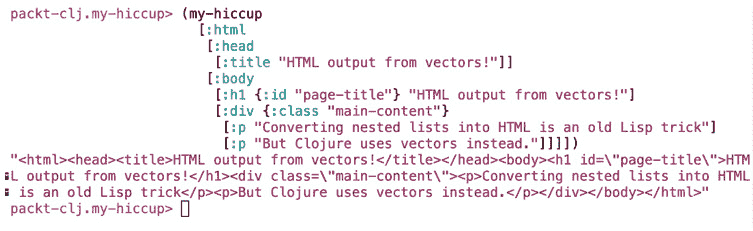

图 6.10：最终输出

注意

随意尝试不同的输入和页面结构。你甚至可以将输出字符串复制到文本文件中，然后加载到浏览器中。

通过完成这个活动，我们现在能够处理任何使用这种语法编写的向量，包括任意数量的后代向量，并生成一个包含正确结构化 HTML 的单个字符串。

# 7. 递归 II：懒序列

## 活动第 7.01 部分：历史，以玩家为中心的 Elo

解决方案：

1.  设置你的项目，该项目应基于本章最后练习中编写的代码。

1.  解决方案遵循与 `take-matches` 建立的模式。让我们从参数开始。我们需要为“焦点玩家”进行的比赛和其他玩家之间的比赛定义不同的行为。我们当然需要一种识别玩家的方法，所以我们将添加一个 `player-slug` 参数。在 `take-matches` 中这不是必要的，因为在那里我们对待所有比赛都是一样的，无论谁参与了比赛。

    在 `take-matches` 中，我们有一个 `limit` 参数来控制我们深入树的深度。在这种情况下，我们需要两个不同的参数，我们将它们称为 `focus-depth` 和 `opponent-depth`。结合起来，这为我们新的 `focus-history` 函数提供了以下参数：

    ```java
    (defn focus-history [tree player-slug focus-depth opponent-depth f]
    ;;...
    )
    ```

    `tree` 参数当然是 `match-tree-by-player` 调用的结果，就像之前一样。

    最后，`f` 参数将与 `take-matches` 中的方式相同。

1.  控制函数在树中的移动将是一项挑战。像往常一样，我们将设置一个 `cond` 形式，以确定函数如何对传入的数据做出反应。前两个条件相当简单，实际上几乎与 `take-matches` 中的代码相同：

    ```java
    (defn focus-history [tree player-slug focus-depth opponent-depth f]
        (cond
          (zero? focus-depth)
          '()
          (= 1 focus-depth)
          (f (first tree))))	
    ```

    与 `take-matches` 的唯一不同之处在于，现在我们使用 `focus-depth` 而不是 `limit`。在这里使用 `focus-depth` 的事实仍然很重要。我们只关心这个阶段的 `focus-depth`，而不是 `opponent-depth`，因为如果 `focus-depth` 为零或一，整个操作就会停止，在这种情况下我们就不再关心 `opponent-depth`。

1.  最终条件是，这个函数在行为上与 `take-matches` 不同。尽管可能没有你第一眼看到的那样复杂，但它确实更复杂。为了理解这一点，让我们看看 `take-matches` 的等效部分：

    ```java
    :otherwise-continue
            (cons
              (f (first tree))
              (cons
                [(take-matches (dec limit) (first (second tree)) f)
                 (take-matches (dec limit) (second (second tree)) f)]
                '()))
    ```

1.  在这一点上，我们将 `(f (first tree))` 放在当前惰性序列的头部。这样，我们就将其连接到序列的其余部分，其第一个元素将是一个包含两个更多分支惰性序列起始点的向量。

    在这里，为了引入两种可能情况的不同行为，我们只需要在两个元素的向量中替换对 `take-matches` 的调用。这两个匹配是当前匹配的“父”匹配；也就是说，它们是当前匹配之前赢家和输家所进行的匹配。我们需要先测试以找出哪些“父”匹配属于焦点玩家，哪些属于对手。对于焦点玩家的上一场比赛，我们调用 `focus-history`。对于对手的上一场比赛，我们调用 `take-matches`。换句话说，我们不再像上面那样只有两个对 `take-matches` 的调用，而是有两个分支条件：

    ```java
     :otherwise
     (cons
       (f (first tree))
       (cons [(if (player-in-match? (ffirst (second tree)) player-slug)
                (focus-history (first (second tree)) player-slug (dec focus-depth) opponent-depth f)
                (take-matches opponent-depth (first (second tree))  f))
              (if (player-in-match? (first (second (second tree))) player-slug)
                (focus-history (second (second tree)) player-slug (dec focus-depth) opponent-depth f)
                (take-matches opponent-depth (second (second tree)) f))]
             '()))
    ```

1.  在这两种情况下，无论我们调用`focus-history`还是`take-matches`，我们都要小心调整`tree`参数和`focus-depth`参数。记住`tree`始终相对于由一场比赛和两个元素的向量组成的当前两项序列，这就是为什么我们使用`(first (second tree))`和`(second (second tree))`，即向量中两个懒序列的第一个和第二个。虽然将这些分配给`let`绑定以避免重复`(second tree)`可能很有吸引力，但在这些情况下通常最好避免“保留头部”。

    这是完整的函数：

    ```java
    (defn focus-history [tree player-slug focus-depth opponent-depth f]
        (cond
          (zero? focus-depth)
          '()
          (= 1 focus-depth)
          (f (first tree))
          :otherwise
          (cons
            (f (first tree))
            (cons [(if (player-in-match? (ffirst (second tree)) player-slug)
                     (focus-history (first (second tree)) player-slug (dec focus-depth)                    opponent-depth f)
                     (take-matches opponent-depth (first (second tree))  f))
                   (if (player-in-match? (first (second (second tree))) player-slug)
                     (focus-history (second (second tree)) player-slug (dec focus-depth)                    opponent-depth f)
                     (take-matches opponent-depth (second (second tree)) f))]
                  '()))))
    ```

1.  值得注意的是，这个函数比`take-matches`稍微复杂一点。正如递归解决方案通常那样，代码本身相当简单。困难在于选择最佳策略。

    这里是函数从开始到结束的运行过程。首先，我们读取数据并生成评分：

    ```java
    packt-clojure.lazy-tennis> (def ratings (elo-db   "match_scores_1991-2016_unindexed_csv.csv" 35))
    ```

    然后我们为感兴趣的球员构建懒匹配树：

    ```java
    #'packt-clojure.lazy-tennis/ratings
    packt-clojure.lazy-tennis> (def federer (match-tree-by-player ratings   "roger-federer"))
    #'packt-clojure.lazy-tennis/federer
    ```

    现在调用我们的新函数：

    ```java
    packt-clojure.lazy-tennis> (focus-history federer 
                                              "roger-federer" 
                                              4 
                                              2 
                                              #(select-keys % [:winner_name :loser_name                                             :winner_rating :loser_rating]))
    ```

    结果中的缩进揭示了树结构：

    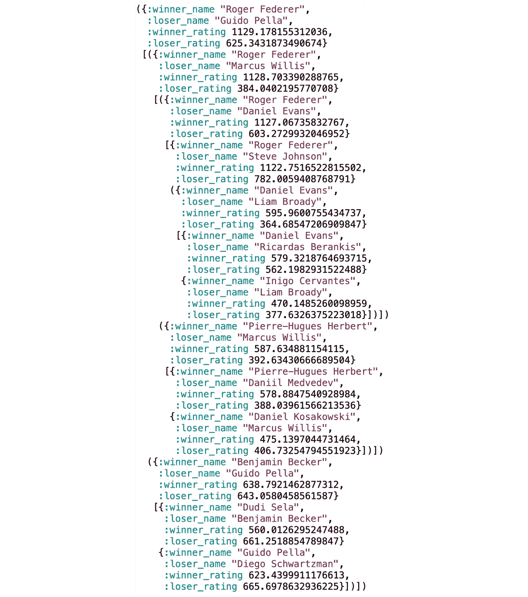

图 7.10：焦点历史的成果

费德勒打出的比赛包含更深层次的先前比赛的子树。数据已准备好传递给前端团队，他们将把它转换成漂亮的可视化。

# 8. 命名空间、库和 Leiningen

## 活动 8.01：在应用程序中更改用户列表

解决方案：

1.  使用`use`和`:rename`关键字导入`clojure.string`命名空间，为`replace`和`reverse`函数重命名：

    ```java
    (use '[clojure.string :rename {replace str-replace, reverse str-reverse}])
    ```

1.  创建一组用户：

    ```java
    (def users #{"mr_paul smith" "dr_john blake" "miss_katie hudson"})
    ```

1.  替换尊称和名字之间的下划线：

    ```java
    (map #(str-replace % #"_" " ") users)
    ```

    这将返回以下内容：

    ```java
    ("mr paul smith" "miss katie hudson" "dr john blake")
    ```

1.  使用`capitalize`函数将用户组中每个人的首字母大写：

    ```java
    (map #(capitalize %) users)
    ```

    这将返回以下内容：

    ```java
    ("Mr_paul smith" "Miss_katie hudson" "Dr_john blake")
    ```

1.  使用字符串的`replace`和`capitalize`函数更新用户列表：

    ```java
    (def updated-users (into #{}
                             (map #(join " "
                                         (map (fn [sub-str] (capitalize sub-str))
                                              (split (str-replace % #"_" " ") #" ")))
                                  users)))
    updated-users
    ```

    输出如下：

    ```java
    #{"Mr Paul Smith" "Dr John Blake" "Miss Katie Hudson"}
    ```

1.  仅从`clojure.pprint`命名空间导入`print-table`函数：

    ```java
    (use '[clojure.pprint :only (print-table)])
    ```

1.  打印用户表：

    ```java
    (print-table (map #(hash-map :user-name %) updated-users))
    ```

    输出如下：

    

    图 8.23：打印用户表

1.  导入`clojure.set`命名空间，排除`join`函数：

    ```java
    (use '[clojure.set :exclude (join)])
    ```

1.  创建并显示一组管理员：

    ```java
    (def admins #{"Mr Paul Smith" "Miss Katie Hudson" "Dr Mike Rose" "Mrs Tracy Ford"})
    ```

    输出如下：

    ```java
    #'user/admins
    ```

1.  现在执行以下操作：

    ```java
    admins
    ```

    输出如下：

    ```java
    #{"Mr Paul Smith" "Dr Mike Rose" "Miss Katie Hudson" "Mrs Tracy Ford"}
    ```

1.  在两个集合上调用`subset?`函数：

    ```java
    (subset? users admins)
    ```

    输出如下：

    ```java
    false
    ```

1.  要打印最终输出，执行以下操作：

    ```java
    (print-table (map #(hash-map :user-name %) updated-users))
    ```

    输出如下：


图 8.24：打印最终用户表

在这个活动中，我们处理了两个功能。第一个功能是将用户名大写。第二个功能是使用`Clojure.set`函数检查是否有任何用户也是管理员。

## 活动 8.02：求和数字

解决方案：

1.  创建一个 Leiningen 应用程序：

    ```java
    lein new app hello-leiningen
    ```

1.  将字符串参数转换为整数：

    ```java
    (map #(Integer/parseInt %) args)
    ```

1.  添加整数进行求和：

    ```java
    apply +
    ```

1.  按如下方式打印结果：

    ```java
    println
    ```

    输出将如下所示：

![图 8.25：打印求和结果]


图 8.25：打印求和结果

完整的解决方案应如下所示：

```java
(ns hello-leiningen.core)
(defn -main
  "Sum integers passed as arguments."
  [& args]
  (println (apply + (map #(Integer/parseInt %) args))))
```

在这个活动中，我们创建了一个新的 Leiningen 项目。这个应用程序可以从命令行接受参数。输入到命令行的数字会被求和，并将结果显示出来。

## 活动 8.03：构建格式转换应用程序

解决方案：

1.  在 `project.clj` 中添加 `cheshire` 依赖项：

    ```java
    (defproject json-parser "0.1.0-SNAPSHOT"
    ;;; code committed
       :dependencies [[org.clojure/clojure "1.10.0"]
                                [cheshire "3.0.0"]]
    ;;; code ommited
    )
    ```

1.  在核心命名空间中创建一个从哈希转换为 JSON 的函数：

    ```java
    (ns json-parser.core
        (:require [cheshire.core :as json])
        (:gen-class))
    (defn generate-json-from-hash [hash]
          (json/generate-string hash))
    ```

    在 REPL 中测试 `generate-json-from-hash` 函数应该给出以下结果：

    ![图 8.26：从哈希生成 JSON]

    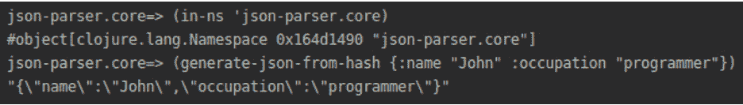

    图 8.26：从哈希生成 JSON

1.  创建一个从 JSON 转换为哈希的函数：

    ```java
    (defn generate-hash-from-json [json]
          (json/parse-string json))
    ```

    在 REPL 中测试 `generate-hash-from-json` 应该给出以下结果：

    ![图 8.27：从 JSON 生成哈希]

    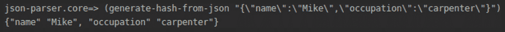

    图 8.27：从 JSON 生成哈希

1.  将 `expectations` 库添加到为项目定义的测试配置文件中。在 `project.clj` 中添加以下内容：

    ```java
    (defproject json-parser "0.1.0-SNAPSHOT"
     ;;; code ommited
      :profiles {:qa  {:dependencies [[expectations "2.1.10"]]}
    ;;; code ommited
    })
    ```

1.  为项目添加 `lein-expectations` 插件：

    ```java
    (defproject json-parser "0.1.0-SNAPSHOT"
     ;;; code ommited
      :profiles {:qa  {:plugins      [[lein-expectations "0.0.8"]]}
    ;;; code ommited
    })
    ```

1.  编写 JSON 函数的测试。在 `json-parser/test/json_parser/core_test.clj` 文件中添加以下内容：

    ```java
    (ns json-parser.core-test
      (:require [expectations :refer [expect]]
                [json-parser.core :refer :all]))
    (expect (generate-json-from-hash {:name "John" :occupation "programmer"})
            "{\"name\":\"John\",\"occupation\":\"programmer\"}")
    (expect (generate-hash-from-json "{\"name\":\"Mike\",\"occupation\":\"carpenter\"}")
            {"name" "Mike", "occupation" "carpenter"})
    ```

    使用 `qa` 配置文件调用测试应该给出以下结果：

    ![图 8.28：执行测试配置文件]

    

    图 8.28：执行测试配置文件

1.  将 `lein-ancient` 添加到用户全局配置文件中。在 `~/.lein/profiles.clj` 中添加以下内容：

    ```java
    {:user {:plugins [[lein-ancient "0.6.15"]]
            :dependencies [[clojure-humanize "0.2.2"]]}}
    ```

    检查过时依赖项应显示以下内容：

    ![图 8.29：检查过时依赖项]

    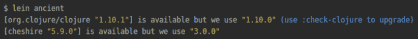

图 8.29：检查过时依赖项

在这个活动中，我们创建了一个应用程序，它能够将 JSON 格式转换为 Clojure 数据格式，并反向转换。为了确保我们的应用程序能够正确运行，我们创建了一个测试配置文件，其中包含了 `expectations` 库和插件的依赖。为了确保我们所有项目中的库都不会过时，我们在用户全局配置文件中包含了 `lein-ancient` 插件。

# 9. Java 和 JavaScript 的平台互操作性

## 活动 9.01：图书订购应用程序

解决方案：

1.  创建一个新的项目：

    ```java
    lein new app books-app
    ```

1.  导入必要的命名空间：

    ```java
    (ns books-app.core
      (:require [books-app.utils :as utils])
      (:import [java.util Scanner])
      (:gen-class))
    ```

1.  创建一个按年份存储书籍的映射：

    ```java
    (def ^:const books {:2019 {:clojure {:title "Hands-On Reactive Programming with Clojure" :price 20}
                               :go      {:title "Go Cookbook" :price 18}}
                        :2018 {:clojure {:title "Clojure Microservices" :price 15}
                               :go {:title "Advanced Go programming" :price 25}}})
    ```

1.  为存储订单的文件创建一个变量：

    ```java
    (def ^:const orders-file "orders.edn")
    ```

1.  创建一个初始菜单，包含订购书籍和列出订单的选项：

    ```java
    (def input (Scanner. System/in))
    (defn- start-app []
           "Displaying main menu and processing user choices."
           (let [run-application (ref true)]
                (while (deref run-application)
                       (println "\n|     Books app         |")
                       (println "| 1-Menu 2-Orders 3-Exit |\n")
                       (let [choice (.nextInt input)]
                            (case choice
                                  1 (show-menu)
                                  2 (show-orders)
                                  3 (dosync (alter run-application (fn [_]                                   false))))))))
    ```

    输出如下所示：

    ![图 9.53：初始菜单的输出]

    

    图 9.53：初始菜单的输出

1.  创建一个菜单来显示按年份排序的书籍：

    ```java
    (defn- show-menu []
           (println "| Available books by year |")
           (println "|1\. 2019   2\. 2018 |")
           (let [choice (.nextInt input)]
                (case choice
                      1 (show-year-menu :2019)
                      2 (show-year-menu :2018))))
    ```

    输出如下所示：

    ![图 9.54：按年份显示可用书籍的输出]

    

    图 9.54：按年份显示可用书籍的输出

1.  创建应用程序的 `main` 方法：

    ```java
    (defn -main
      "Main function to run the app."
      [& args]
      (start-app))
    ```

1.  创建一个将数据保存到文件的函数：

    ```java
    (ns books-app.utils
        (:require [clojure.java.io :as io])
        (:import [java.io PushbackReader]))
    (defn save-to [location data]
          (spit location data :append true))
    ```

1.  创建一个保存订单的函数：

    ```java
    (defn save-book-order [orders-file year prog-lang number price]
          (save-to orders-file {:year year :prog-lang prog-lang :number number :price price}))
    ```

1.  创建一个计算书籍价格的函数：

    ```java
    (defn calculate-book-price [books title number]
          (->
            (get books title)
            :price
            (* number)
            float))
    ```

1.  创建一个显示订单确认消息的函数：

    ```java
    (defn display-bought-book-message [title number total]
          (println "Buying" number title "for total:€" total))
    ```

    输出如下：

    

    图 9.55：订单确认消息

1.  创建一个显示已购买订单的函数：

    ```java
    (defn display-order [order books]
          (str "Bought " (:number order) ": " (:title (get (get books (:year order)) (:prog-lang order))) " published in " (name (:year order)) " for €" (:price order)))
    ```

    输出如下：

    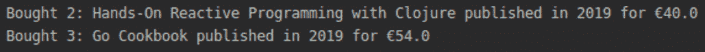

    图 9.56：显示已购买的订单

1.  创建一个读取单个订单的函数：

    ```java
    (defn read-one-order
          [r]
          (try
            (read r)
            (catch java.lang.RuntimeException e
              (if (= "EOF while reading" (.getMessage e))
                ::EOF
                (throw e)))))
    ```

1.  创建一个检查文件是否存在的函数：

    ```java
    (defn file-exists [location]
          (.exists (io/as-file location)))
    ```

1.  创建一个从文件中加载订单的函数：

    ```java
    (defn load-orders
          "Reads a sequence of orders in file at path."
          [file]
          (if (file-exists file)
            (with-open [r (PushbackReader. (io/reader file))]
                       (binding [*read-eval* false]
                                (doall (take-while #(not= ::EOF %) (repeatedly                               #(read-one-order r))))))
            []))
    ```

1.  创建一个子菜单来订购书籍：

    ```java
    (ns coffee-app.core)
    (defn- show-year-menu [year]
           (let [year-books (get books year)]
                (println "| Books in" (name year) "|")
                (println "| 1\. " (:title (:clojure year-books)) " 2\. " (:title                (:go year-books))  "|")
                (let [choice (.nextInt input)]
                     (case choice
                           1 (buy-book year :clojure)
                           2 (buy-book year :go)))))
    ```

    输出如下：

    

    图 9.57：书籍订购子菜单

1.  创建一个按年份购买书籍的函数：

    ```java
    (defn- buy-book [year prog-lang]
           (println "How many books do you want to buy?")
           (let [choice (.nextInt input)
                 price (utils/calculate-book-price (get books year) prog-lang                choice)]
                (utils/save-book-order orders-file year prog-lang choice price)
                (utils/display-bought-book-message (:title (get (get books year)               prog-lang)) choice price)))
    ```

    输出如下：

    

    图 9.58：按年份购买书籍的函数

1.  创建一个按年份显示订单的函数：

    ```java
    (defn- show-orders-by-year [year]
           (println "\n")
           (doseq [order (filter #(= year (:year %)) (utils/load-orders orders-         file))]
                  (println (utils/display-order order books))))
    ```

1.  创建一个子菜单来列出订单：

    ```java
    (defn show-orders []
          (println "| Books by publish year |")
          (println "|1\. 2019   2\. 2018 |")
          (let [choice (.nextInt input)]
               (case choice
                     1 (show-orders-by-year :2019)
                     2 (show-orders-by-year :2018)))) 
    ```

    输出如下：

    

图 9.59：创建子菜单

在这个活动中，我们创建了一个用于订购书籍和显示订单的应用程序。我们利用我们对 I/O 和 Java 的新知识来完成这个活动。

一旦完成活动，你应该得到类似以下输出。

初始菜单：


图 9.60：初始菜单

列出年份：


图 9.61：列出年份

一年的书籍：

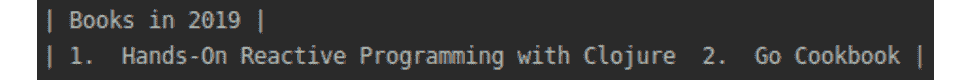

图 9.62：2019 年购买的书籍

询问购买多少本书：


图 9.63：询问购买书籍的数量

订单确认消息：


图 9.64：订单确认消息

列出已购买的书籍：

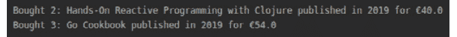

图 9.65：列出已购买的书籍

在本节中，我们利用我们对 Java 互操作性的知识创建了一个命令行应用程序。在下一节中，我们将学习如何在 ClojureScript 中使用 JavaScript。

## 活动九.02：创建支持台

解决方案：

1.  创建一个新的项目：

    ```java
    lein new figwheel-main support-desk
    ```

1.  在`project.clj`中将`jayq`和`cuerdas`库作为依赖项添加：

    ```java
    :dependencies [[org.clojure/clojure "1.9.0"]
                   [org.clojure/clojurescript "1.10.520"]
                   [funcool/cuerdas "2.2.0"]
                   [jayq "2.5.4"]
                   [rum "0.11.2"]]
    ```

1.  创建一个`utils`函数来按优先级过滤问题列表：

    ```java
    (ns support-desk.utils)
    (defn get-priorities-list [list priority]
          (filter #(<= (:priority %) priority) list))
    ```

1.  创建一个获取排序问题列表的`utils`函数：

    ```java
    (defn get-sorted-priorities-list [list]
          (sort-by :priority list))
    ```

1.  创建一个根据问题数量获取排序信息的`utils`函数：

    ```java
    (defn get-sort-message [items-count]
          (str (cond
                 (< items-count 3) "little"
                 (< items-count 6) "medium"
                 :else "many") " (" items-count ")"))
    ```

    对于`0`个问题，输出如下：

    ```java
    Sorting done: little (0) times
    ```

    对于`3`个问题，输出如下：

    ```java
    Sorting done: medium (3) times
    ```

1.  创建一个`utils`函数来从列表中删除问题：

    ```java
     (defn delete-item-from-list-by-title [title list]
          (remove #(= title (:title %)) list))
    ```

1.  创建一个在排序完成后调用的`utils`函数：

    ```java
    (defn handle-sort-finish [state]
          (fn [ev ui]
              (swap! state update-in [:sort-counter] inc)))
    ```

1.  将 jQuery 和 jQuery UI 添加到`index.html`：

    ```java
    <script src="img/jquery-3.4.1.min.js" integrity="sha256-CSXorXvZcTkaix6Yvo6HppcZGetbYMGWSFlBw8HfCJo=" crossorigin="anonymous"></script>
    <script src="img/code.jquery.com/ui/1.12.1/jquery-ui.min.js" integrity="sha256-VazP97ZCwtekAsvgPBSUwPFKdrwD3unUfSGVYrahUqU=" crossorigin="anonymous"></script>
    ```

1.  将`jayq`、`cuerdas`和`utils`导入到核心命名空间：

    ```java
    (ns ^:figwheel-hooks support-desk.core
      (:require [cuerdas.core :as str]
                [goog.dom :as gdom]
                [jayq.core :as jayq :refer [$]]
                [rum.core :as rum]
                [support-desk.utils :as utils]))
    ```

1.  如下定义优先级列表：

    ```java
    (def priorities-list [{:title "IE bugs" :priority 2} {:title "404 page" :priority 1} {:title "Forgotten username" :priority 2}
                          {:title "Login token" :priority 1} {:title "Mobile version" :priority 3} {:title "Load time" :priority 5}])
    ```

1.  如下定义`app-state`：

    ```java
    (defonce app-state (atom {:sort-counter 0
                              :items        (utils/get-sorted-priorities-list (utils/get-priorities-list priorities-list 3))}))
    ```

1.  定义`counter` Rum 组件：

    ```java
    (rum/defc counter [number]
              [:div
               (str/format "Sorting done: %s times" (utils/get-sort-message number))])
    ```

1.  创建`click`函数的问题：

    ```java
    (defn done-button-click [item]
          (swap! app-state update-in [:items] #(utils/delete-item-from-list-by-        title (:title item) %)))
    ```

1.  在 Rum 组件中定义问题项：

    ```java
    (rum/defc item [item]
              [:li.ui-state-default {:key (:title item)}
               (str/format "Priority %s for: %s " (:priority item) (:title               item))
               [:button.delete
                {:on-click #(done-button-click item)}
                "Done"]])
    ```

    输出如下：

    

    图 9.66：在 Rum 组件中定义问题项

1.  定义`reactive`问题项组件：

    ```java
    (rum/defc items < rum/reactive [num]
              [:ul#sortable (vec (for [n num]
                                      (item n)))])
    ```

1.  定义响应式页面`content`组件：

    ```java
    (rum/defc content < rum/reactive []
              [:div {}
               (items (:items (deref app-state)))
               (counter (:sort-counter (rum/react app-state)))])
    ```

1.  使项目组件可排序：

    ```java
    (defn attrs [a]
          (clj->js (sablono.util/html-to-dom-attrs a)))
    (defn make-sortable []
          (.sortable ($ (str "#sortable"))
                     (attrs {:stop (utils/handle-sort-finish app-state)})))
    ```

1.  挂载页面组件：

    ```java
    (defn mount [el]
      (rum/mount (content) el))
    (defn mount-app-element []
      (when-let [el (get-app-element)]
        (mount el)))
    ```

1.  调用`mount`函数：

    ```java
    (mount-app-element)
    ```

1.  调用`sortable`函数：

    ```java
    (make-sortable)
    ```

1.  运行应用程序：

    ```java
    lein fig:build
    ```

    初始问题列表将如下所示：

    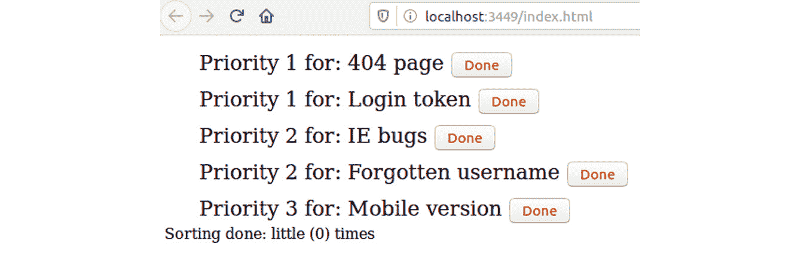

图 9.67：初始问题列表

排序后的问题列表将如下所示：

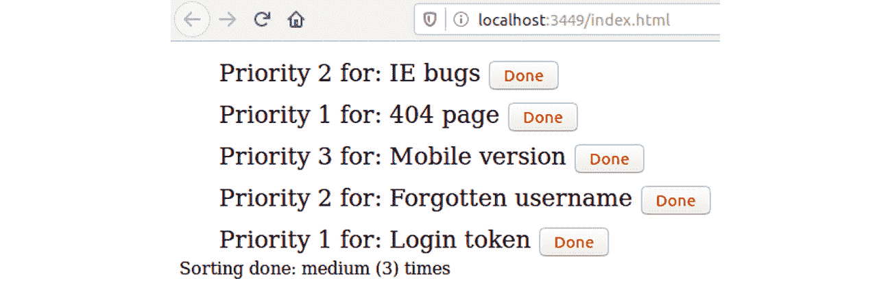

图 9.68：排序后的问题列表

解决三个问题后的问题列表将如下所示：

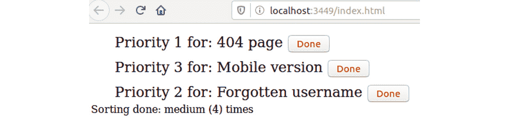

图 9.69：解决问题后的问题列表

在这个活动中，我们创建了一个支持台应用程序。该应用程序显示问题列表。问题可以排序和解决。我们使用了 JavaScript 互操作性来添加排序功能。

# 10. 测试

## 活动十.01：为咖啡订购应用程序编写测试

解决方案：

1.  导入测试命名空间：

    ```java
    (ns coffee-app.utils-test
        (:require [clojure.test :refer :all]
                  [coffee-app.core :refer [price-menu]]
                  [coffee-app.utils :refer :all]))
    ```

1.  使用`clojure.test`库创建测试以显示订单消息。

1.  使用`is`宏测试应用程序：

    ```java
    (deftest display-order-test
             (testing "Multiple tests with is macro"
                      (is (= (display-order {:number 4 :price 3.8 :type :latte}) "Bought 4 cups of latte for €3.8"))
                      (is (= (display-order {:number 7 :price 6.3 :type :espresso}) "Bought 7 cups of espresso for €6.3"))))
    ```

1.  使用`are`宏进行测试：

    ```java
    (deftest display-order-test
             (testing "Multiple tests with are macro"
                      (are [order result]
                           (= (display-order order) result)
                           {:number 2 :price 1.5 :type :latte} "Bought 2 cups of                          latte for €1.5"
                           {:number 3 :price 6.3 :type :mocca} "Bought 3 cups of                          mocca for €6.3"
                           {:number 8 :price 10 :type :espresso} "Bought 8 cups                          of espresso for €10")))
    ```

1.  使用`clojure.test`库检查文件是否存在。

    测试文件不存在的情况：

    ```java
    (deftest file-exists-test
       (testing "File does not exist"
                      (testing "Multiple tests with is macro"
                               (is (false? (file-exists "no-file")))
                               (is (false? (file-exists "missing-file"))))
                      (testing "Multiple tests with are macro"
                               (are [file] (false? (file-exists file))
                                    "eettcc"
                                    "tmp-tmp"
                                    "no-file-here"))))
    ```

    测试文件是否存在：

    ```java
    (deftest file-exists-test
             (testing "File does exist"
                      (testing "Multiple tests with is macro"
                               (is (file-exists "/etc"))
                               (is (file-exists "/lib")))
                      (testing "Multiple tests with are macro"
                               (are [file] (true? (file-exists file))
                                    "/etc"
                                    "/var"
                                    "/tmp"))))
    ```

1.  使用`clojure.test`库创建测试以保存和加载订单。

    保存订单：

    ```java
    (defn uuid [] (str (java.util.UUID/randomUUID)))
    (deftest saves-coffee-order
             (testing "Saves cofee order"
                      (let [test-file (str "/tmp/" (uuid) ".edn")
                            test-data {:type :latte, :number 2, :price 2.6}]
                           (save-coffee-order test-file :latte 2 2.6)
                           (is (= (list test-data) (load-orders test-file))))))
    ```

    加载空订单：

    ```java
    (deftest loads-empty-vector-from-not-existing-file
             (testing "saving and loading"
                      (let [test-file (str "/tmp/" (uuid) ".edn")]
                           (is (= [] (load-orders test-file))))))
    ```

    加载咖啡订单：

    ```java
    (deftest can-save-and-load-some-data
             (testing "saving and loading"
                      (let [test-file (str "/tmp/" (uuid) ".edn")
                            test-data {:number 1 :type :latte}]
                           (save-to test-file test-data)
                           (is (= (list test-data) (load-orders test-file))))))
    ```

    输出如下：

    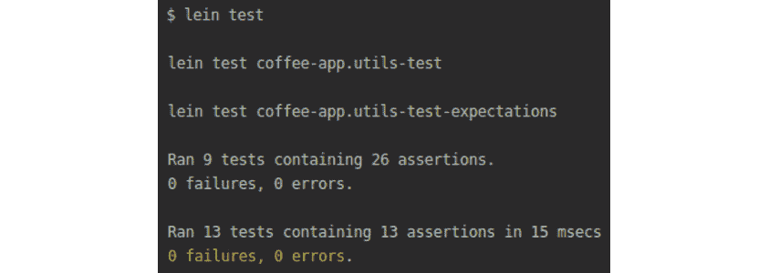

    图 10.57：保存和加载订单后的输出

1.  使用期望库创建测试以显示订单消息：

    ```java
    (ns coffee-app.utils-test-expectations
        (:require [coffee-app.utils :refer :all]
                  [expectations :refer [expect side-effects]]))
    (expect "Bought 4 cups of latte for €3.8" (display-order {:number 4 :price 3.8 :type :latte}))
    (expect "Bought 7 cups of espresso for €6.3" (display-order {:number 7 :price 6.3 :type :espresso}))
    (expect String (display-order {:number 7 :price 6.3 :type :espresso}))
    (expect #"Bought 7 cups" (display-order {:number 7 :price 6.3 :type :espresso}))
    (expect #"cups of espresso" (display-order {:number 7 :price 6.3 :type :espresso}))
    (expect #"for €6.3" (display-order {:number 7 :price 6.3 :type :espresso}))
    ```

1.  使用`Expectations`库检查文件是否存在：

    ```java
    (expect true (file-exists "/tmp"))
    (expect false (file-exists "no-file"))
    (expect Boolean (file-exists "etc"))
    ```

1.  使用`Expectations`库创建测试以保存和加载订单。

    将数据保存到文件中：

    ```java
    (expect [["/tmp/menu.edn" {:type :latte :number 1 :price 2.4} :append true]
             ["/tmp/menu.edn" {:type :latte :number 3 :price 4.7} :append true]]
            (side-effects [spit]
                          (save-to "/tmp/menu.edn" {:type :latte :number 1 :price 2.4})
                          (save-to "/tmp/menu.edn" {:type :latte :number 3 :price 4.7})))
    ```

    保存咖啡订单：

    ```java
    (expect [["/tmp/orders.edn" :latte 1 2.4]
             ["/tmp/orders.edn" :latte 2 3.9]]
            (side-effects [save-coffee-order]
                          (save-coffee-order "/tmp/orders.edn" :latte 1 2.4)
                          (save-coffee-order "/tmp/orders.edn" :latte 2 3.9)))
    ```

    保存咖啡数据：

    ```java
    (expect [["/tmp/coffees.edn" {:type :latte :number 1 :price 2.4}]
             ["/tmp/coffees.edn" {:type :latte :number 2 :price 3.9}]]
            (side-effects [save-to]
                          (save-coffee-order "/tmp/coffees.edn" :latte 1 2.4)
                          (save-coffee-order "/tmp/coffees.edn" :latte 2 3.9)))
    Load orders:
    (expect [] (load-orders "/tmp/data.edn"))
    ```

    输出如下：

    

    图 10.58：使用 Expectations 库进行测试

1.  使用`Midje`库显示订单消息：

    ```java
    (ns coffee-app.utils-test-midje
        (:require [coffee-app.utils :refer :all]
                  [midje.sweet :refer :all]))
    (facts "Passing an order should return display message"
           (fact (display-order {:number 4 :price 3.8 :type :latte}) => "Bought 4 cups of latte for €3.8")
           (fact (display-order {:number 7 :price 6.3 :type :espresso}) => "Bought 7 cups of espresso for €6.3"))
    (facts "Returned message should match regular expression"
           (fact (display-order {:number 7 :price 6.3 :type :espresso}) => #"Bought 7 cups")
           (fact (display-order {:number 7 :price 6.3 :type :espresso}) => #"cups of espresso")
           (fact (display-order {:number 7 :price 6.3 :type :espresso}) => #"for €6.3"))
    ```

1.  使用`Midje`库检查文件是否存在：

    ```java
    (facts "True should be returned when a file exists"
           (fact (file-exists "/tmp") => true)
           (fact (file-exists "/etc") => true))
    (facts "False should be returned when a file does not exist"
           (fact (file-exists "no-file") => false)
           (fact (file-exists "missing-file") => false))
    ```

1.  使用`Midje`库创建测试以加载订单：

    ```java
    (facts "Empty vector should be returned when there is no orders file"
           (fact (load-orders "/tmp/data.edn") => [])
           (fact (load-orders "/tmp/no-data.edn") => []))
    ```

    输出如下：

    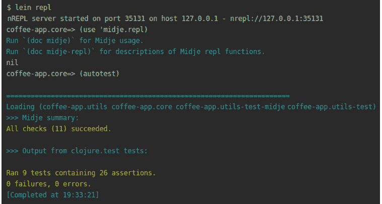

    图 10.59：使用 Midje 库加载订单的测试

1.  使用`test.check`创建测试以显示订单消息。导入`test.check`命名空间：

    ```java
     (ns coffee-app.utils-test-check
        (:require [coffee-app.utils :refer :all]
          [clojure.test.check :as tc]
          [clojure.test.check.generators :as gen]
          [clojure.test.check.properties :as prop]
          [clojure.test.check.clojure-test :refer [defspec]]))
    ```

1.  测试显示订单功能：

    ```java
    (defspec display-order-test-check 1000
             (prop/for-all [order (gen/fmap (fn [[number type price]]
                                                {:number number
                                                 :type type
                                                 :price price})
                                            (gen/tuple (gen/large-integer* {:min                                           0})
                                                       gen/keyword
                                                       (gen/double* {:min 0.1 :max 999 :infinite? false :NaN? false} )))]
                           (= (str "Bought " (:number order) " cups of " (name (:type order)) " for €" (:price order)) (display-order order))))
    ```

1.  使用`test.check`创建测试以检查文件是否存在：

    ```java
    (defspec file-exists-test-check 1000
             (prop/for-all [file gen/string-alphanumeric]
                           (false? (file-exists file))))
    ```

1.  使用`test.check`创建测试以加载订单：

    ```java
    (defspec load-orders-test-check 1000
             (prop/for-all [file gen/string-alphanumeric]
                           (vector? (load-orders file))))
    ```

    输出如下：

    ![图 10.60：使用 test.check 创建加载订单的测试]

    ![图 B14502_10_60.jpg]

![图 10.60：使用 test.check 创建加载订单的测试]

在这个活动中，我们为咖啡订购应用程序创建了一个测试套件。我们使用四个单元测试库编写了测试。我们首先使用 `clojure.test` 编写测试，然后是 `Expectations` 和 `Midje` 的测试。最后，我们使用 `test.check` 库编写了基于属性的测试。

## 活动 10.02：带测试的支持台应用程序

解决方案：

1.  将测试依赖项添加到 `project.clj` 文件中：

    ```java
    :dependencies [[org.clojure/test.check "0.10.0"]]
    ```

1.  将命名空间导入到 `core_test.cljs` 文件中：

    ```java
    (ns support-desk.core-test
      (:require
        [cljs.test :refer-macros [are deftest is testing use-fixtures]]
        [clojure.test.check.generators :as gen]
        [clojure.test.check.properties :refer-macros [for-all]]
        [clojure.test.check.clojure-test :refer-macros [defspec]]
        [cuerdas.core :as str]
        [support-desk.utils :refer [delete-item-from-list-by-title get-priorities-list get-sort-message get-sorted-priorities-list handle-sort-finish]]))
    ```

1.  在应用程序状态中创建带有问题的固定值：

    ```java
    (ns support-desk.core-test)
    (use-fixtures :each
                  {:before (fn [] (do
                                    (def priorities-list [{:title "IE bugs" :priority 2} {:title "404 page" :priority 1} {:title "Forgotten username" :priority 2}
                                                          {:title "Login token" :priority 1} {:title "Mobile version" :priority 3} {:title "Load time" :priority 5}])
                                    (def app-state (atom {:sort-counter 0}))))})
    ```

1.  使用 `cljs.test` 编写对排序消息函数的测试：

    ```java
    (deftest get-sort-message-test
             (testing "Using is macro"
                      (is (= "little (1)" (get-sort-message 1)))
                      (is (= "medium (4)" (get-sort-message 4)))
                      (is (= "many (8)" (get-sort-message 8))))
             (testing "Using are macro"
                      (are [result number] (= result (get-sort-message number))
                           "little (1)" 1
                           "little (2)" 2
                           "medium (3)" 3
                           "medium (4)" 4
                           "medium (5)" 5
                           "many (6)" 6)))
    ```

1.  使用 `test.check` 编写对排序消息函数的测试：

    ```java
    (defspec get-sort-message-test-check 10
             (for-all [count gen/nat]
                      (= (str/format "%s (%s)"
                                     (cond
                                       (< count 3) "little"
                                       (< count 6) "medium"
                                       :else "many")
                                     count)
                         (get-sort-message count))))
    ```

1.  使用 `cljs.test` 编写对按优先级过滤问题函数的测试：

    ```java
    (deftest get-priorities-list-test
             (testing "Testing filtering priorities based on priority number"
                      (is (= []
                             (get-priorities-list priorities-list 0)))
                      (is (= [{:title "404 page", :priority 1} {:title "Login token",                     :priority 1}]
                             (get-priorities-list priorities-list 1)))
                      (is (= [{:title "IE bugs", :priority 2}
                              {:title "404 page", :priority 1}
                              {:title "Forgotten username", :priority 2}
                              {:title "Login token", :priority 1}]
                             (get-priorities-list priorities-list 2)))
                      (is (=
                            [{:title "IE bugs", :priority 2}
                             {:title "404 page", :priority 1}
                             {:title "Forgotten username", :priority 2}
                             {:title "Login token", :priority 1}
                             {:title "Mobile version", :priority 3}]
                            (get-priorities-list priorities-list 3)))))
    ```

1.  使用 `cljs.test` 编写对排序问题列表的测试：

    ```java
    (deftest get-sorted-priorities-list-test
             (testing "Sorting priorities list"
                      (is (= [{:title "404 page", :priority 1}
                              {:title "Login token", :priority 1}
                              {:title "IE bugs", :priority 2}
                              {:title "Forgotten username", :priority 2}
                              {:title "Mobile version", :priority 3}
                              {:title "Load time", :priority 5}]
                             (get-sorted-priorities-list priorities-list)))))
    ```

1.  使用 `cljs.test` 编写从列表中删除问题的测试：

    ```java
    (deftest delete-item-from-list-by-title-test
             (testing "Passing empty list"
                      (is (= []
                             (delete-item-from-list-by-title "Login token" [])))
                      (is (= []
                            (delete-item-from-list-by-title "Login token" nil))))
             (testing "Passing valid list"
                      (is (= (delete-item-from-list-by-title "Login token"                     priorities-list)))))
    ```

1.  使用 `cljs.test` 编写对处理排序函数的测试：

    ```java
    (deftest handle-sort-finish-test
             (testing "Calling fn once"
                      (is (= {:sort-counter 1}
                             ((handle-sort-finish app-state) "event"                            "object"))))
             (testing "Calling fn twice"
                      (is (= {:sort-counter 2}
                            ((handle-sort-finish app-state) "event"                            "object")))))
    ```

1.  我们将使用命令行来运行测试：

    ```java
    lein fig:test
    ```

    当运行测试时，它们应该显示以下内容：

    ![图 10.61：运行测试后的输出]

    ![图 B14502_10_61.jpg]

![图 10.61：运行测试后的输出]

在这个活动中，我们向一个支持台应用程序添加了 ClojureScript 测试。我们使用 `cljs.test` 编写了单元测试，并使用 `test.check` 库编写了基于属性的测试。

# 11. 宏

## 活动 11.01：网球 CSV 宏

解决方案：

1.  下面是扩展代码的一个可能方案：

    ```java
    (with-open [reader (io/reader csv)]
      (->> (csv/read-csv reader)
           sc/mappify
           (sc/cast-with {:winner_games_won sc/->int
                          :loser_games_won sc/->int})
           (map #(assoc % :games_diff (- (:winner_games_won %) (:loser_games_won %))))
           (filter #(> (:games_diff %) threshold))
           (map #(select-keys % [:winner_name :loser_name :games_diff]))
           doall))
    ```

    这应该被视为最终输出的粗略草图。

1.  设置你的项目。`deps.edn` 文件应该看起来像这样：

    ```java
    {:deps
     {org.clojure/data.csv {:mvn/version "0.1.4"}
      semantic-csv {:mvn/version "0.2.1-alpha1"}
      org.clojure/math.numeric-tower {:mvn/version "0.0.4"}}}
    ```

    `tennis_macro.clj` 文件的命名空间声明应该像这样：

    ```java
    (ns packt-clj.tennis-macro
        (:require [clojure.java.io :as io]
                  [clojure.data.csv :as csv]
                  [semantic-csv.core :as sc]))
    ```

1.  宏的调用签名应该像这样：

    ```java
    (defmacro with-tennis-csv [csv casts fields & forms])
    ```

    因为这个宏需要能够处理可变数量的形式，所以我们使用 `& forms`，这将在宏体内部为我们提供一个形式列表。

1.  添加 `with-open` 和 `->>` 表达式，并添加那些永远不会改变的线程函数调用。别忘了为 `reader` 绑定使用 gensym：

    ```java
    (defmacro with-tennis-csv [csv casts fields & forms]
      '(with-open [reader# (io/reader ~csv)]
         (->> (csv/read-csv reader#)
              sc/mappify
              (sc/cast-with ~casts)
              ;; TODO: what goes here?
              doall)))
    ```

    结果表明，如果 `sc/cast-with` 传递了一个空的 `map`，即没有要更改的字段，它就简单地不改变任何东西。另一方面，`select-keys` 做的是相反的事情：如果没有要保留的键，它返回一个空的 `map`。这将需要一些额外的逻辑，以便在没有提供字段时，我们得到所有字段，而不是一个字段都没有。这就是为什么我们还没有包括它的原因。

1.  使用 unquote-splice (`~@`) 插入线程形式：

    ```java
    (defmacro with-tennis-csv [csv casts fields & forms]
      '(with-open [reader# (io/reader ~csv)]
         (->> (csv/read-csv reader#)
              sc/mappify
              (sc/cast-with ~casts)
              ~@forms
              ;; TODO: select-keys
              doall)))
    ```

1.  我们需要一种方法来有条件地应用 `select-keys`，取决于是否需要选择字段。有许多解决方法，但可能最简单的是定义 `select-keys` 的一个专用版本。我们将称之为 `maybe-select-keys`：

    ```java
    (defn maybe-select-keys [m maybe-keys]
      (if (seq maybe-keys)
        (select-keys m maybe-keys)
        m))
    ```

    这允许我们添加一个 `map` 调用，它可以相同，无论是否选择字段：

    ```java
     (defmacro with-tennis-csv [csv casts fields & forms]
      '(with-open [reader# (io/reader ~csv)]
         (->> (csv/read-csv reader#)
              sc/mappify
              (sc/cast-with ~casts)
              ~@forms
              (map #(maybe-select-keys % ~fields))
              doall)))
    ```

    许多其他针对这部分问题的解决方案可能涉及多次引用字段。在这些情况下，应该使用 gensym：

    ```java
      (let [fields# ~fields]
        )
    ```

1.  测试宏。让我们用`blowouts`函数试试（这假设 CSV 文件已经被复制到项目目录中）：

    ```java
    user> (blowouts "match_scores_1991-2016_unindexed_csv.csv" 16)
    ({:winner_name "Jean-Philippe Fleurian",
      :loser_name "Renzo Furlan",
      :games_diff 17}
     {:winner_name "Todd Witsken",
      :loser_name "Kelly Jones",
      :games_diff 17}
     {:winner_name "Nicklas Kulti",
      :loser_name "German Lopez",
      :games_diff 17}
     {:winner_name "Jim Courier",
      :loser_name "Gilad Bloom",
      :games_diff 16}
     {:winner_name "Andrei Medvedev",
      :loser_name "Lars Koslowski",
      :games_diff 17}
    ;;; etc.
    )
    ```

    这些是在数据集中最不平衡的胜利。我们的宏似乎有效。

    在这里，我们已经获得了一份从 1991 年到 2016 年击败罗杰·费德勒的所有球员名单：

    ```java
    user> (with-tennis-csv "match_scores_1991-2016_unindexed_csv.csv"
       {}
       [:winner_name]
       (filter #(= "Roger Federer" (:loser_name %))))
    ({:winner_name "Lucas Arnold Ker"}
     {:winner_name "Jan Siemerink"}
     {:winner_name "Andre Agassi"}
     {:winner_name "Arnaud Clement"}
     {:winner_name "Yevgeny Kafelnikov"}
     {:winner_name "Kenneth Carlsen"}
     {:winner_name "Vincent Spadea"}
     {:winner_name "Patrick Rafter"}
     {:winner_name "Byron Black"}
     ;; .... etc.
     )
    ```

在编写宏时，应该始终问一个问题：这能作为一个函数吗？这里的答案可能介于“是”和“可能”之间。

一种方法可能是编写一个简单的函数，从 CSV 文件中提取所有数据。在通过`doall`之后，任何类型的转换都是可能的。然而，使用这种解决方案，会失去懒加载评估的好处，这意味着整个 CSV 文件都需要加载到内存中。如果处理步骤之一涉及过滤掉一些比赛，宏解决方案将更有效，因为过滤会在读取整个文件之前发生。

另一种方法可能是使用函数组合。用户将提供一系列函数，这些函数将被包装在一个名为`with-open`宏内部的单个函数中。这种方法将保留懒加载评估的优势。然而，提供的函数必须以精确的方式编写，可能不会那么清晰。在这里，我们一直在编写以下内容：

```java
(filter #(> (:games_diff %) threshold))
```

相反，我们可能需要定义一个函数：

```java
(fn [ms] (filter #(> (:games_diff %)) threshold))
```

这可能不是决定性的问题。一切取决于预期的用途和预期的受众。宏可以提供非常灵活的接口，这可能是选择使用它们的一个重要因素。

当你发现自己因为某种原因重复编写无法轻易封装成函数的代码时，编写宏通常是一个解决方案。在这种情况下，正如*练习 11.04*中的*监控函数*，编写宏可能是简化代码最不引人注目的方式。编写宏始终是在增加复杂性的权衡：正如我们在本章开头所说的，宏代码难以调试，它也可能使你的其他代码更难调试。但是，正如常说的，你永远不会需要调试的代码是你不需要编写的代码。所以，如果一个可靠的宏可以帮助你避免编写许多行代码，那么它可能值得。

# 12. 并发

## 活动 12.01：一个 DOM Whack-a-mole 游戏

解决方案：

1.  使用`lein figwheel`创建一个项目：

    ```java
    lein new figwheel packt-clj.dom-whackamole -- --rum
    ```

1.  移动到新的`packt-clj.dom-whackamole`目录，并启动 ClojureScript REPL：

    ```java
    lein figwheel
    ```

    在你的浏览器中，在`localhost:3449/index.html`，你应该看到默认的 Figwheel 页面：

    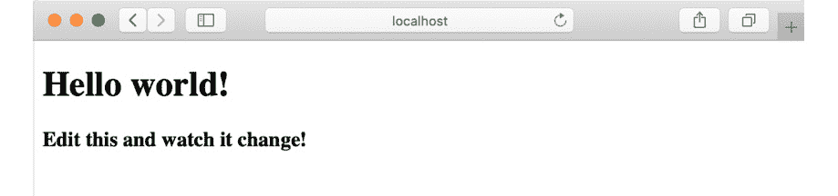

    

    图 12.26：默认 Figwheel 页面

1.  在你的编辑器或 IDE 中打开`dom-whackamole/src/packt-clj/dom-whackamole/core.cljs`。这就是你将编写所有剩余代码的地方。

1.  定义将决定游戏状态的原子：

    ```java
    (def game-length-in-seconds 20)
    (def millis-remaining (atom (* game-length-in-seconds 1000)))
    (def points (atom 0))
    (def game-state (atom :waiting))
    (def clock-interval (atom nil))
    (def moles (atom (into []
                (repeat 5 {:status :waiting
                     :remaining-millis 0}))))
    ```

    大多数这些都是相当直观的。当游戏开始时，`clock-interval` 原子将被设置为 JavaScript 间隔。定义 `game-length-in-seconds` 然后乘以 1,000 并不是必需的，但它有助于使我们的代码更易读。

    `moles` 原子将是一个包含 `:status` 和 `:remaining-millis` 字段的映射向量。为什么需要写出五个相同的映射，当 `repeat` 可以为我们完成这项工作呢？稍后，我们将使用向量中的索引更新地鼠，这就是为什么我们真的想要一个向量，而不是一个列表。`repeat` 本身会返回一个简单的列表。为了避免这种情况，我们使用 `(into [] …)` 来确保我们有一个真正的向量。

1.  另一种同样有效的方法是将所有这些项包裹在一个单一的原子中，其结构可以像这样：

    ```java
    (def app-state
     (atom
      {:points 0
       :millis-remaining (* game-length-in-seconds 1000)
       :game-state :waiting
       :clock-interval nil
       :moles (into []
             (repeat 5 {:status :waiting
                   :remaining-millis 0}))}))
    ```

    这种方法意味着更改涉及数据访问的大多数函数，但不会从根本上改变游戏的构建方式。

    注意

    通常，在更复杂的应用中，单一原子方法会更受欢迎。这种方法的缺点是，对原子的任何更改都会导致所有组件更新。如果原子包含的多级映射中只有一部分发生了变化，那么许多这些更新都是无用的。为了避免这种情况，基于 React 的 ClojureScript 框架都有一些方法来跟踪应用程序状态原子中仅一部分的变化。Rum、Om 和 Reagent 都将这些游标称为游标。游标允许组件监听原子状态的特定部分，从而在原子中不相关的部分发生变化时避免不必要的重新渲染。

1.  定义用于更改应用程序状态原子的函数：

    ```java
    (defn activate-mole [mole-idx]
     (swap! moles
         (fn [ms]
          (update ms mole-idx
              #(if (= :waiting (:status %))
               {:status :live :remaining-millis 3000}
               %)))))
    (defn deactivate-mole [mole-idx]
     (swap! moles
         (fn [ms]
          (assoc ms mole-idx
              {:status :waiting :remaining-millis 0}))))
    ```

1.  前两个函数相当直接。`activate-mole` 使用 `update` 而不是 `assoc` 来测试地鼠是否已经被激活。如果它已经是 `:live`，我们不想将剩余的毫秒数改回 3,000：

    ```java
    core.cljs
    43 (defn mole-countdown []
    44  (swap! moles
    45      (fn [ms]
    46       (into []
    47          (map (fn [m]
    48             (if (= (:status m) :live)
    49              (let [new-remaining (max (- (:remaining-millis m) 100)                   0)]
    50               (if (pos? new-remaining)
    51                (assoc m :remaining-millis new-remaining)
    52                {:status :waiting :remaining-millis 0}))
    53              m))
    54            ms)))))
    The full code for this step is available at https://packt.live/2Rmq8aq.
    ```

    这些函数是游戏逻辑的核心。

    第一个函数 `mole-countdown` 从任何活跃地鼠的 `:remaining-millis` 字段中减去 100。为此，它映射地鼠列表。如果一个地鼠不是 `:live`，它就会被忽略。（我们在这里不能使用 `filter`，因为我们不想消除非活跃的地鼠；我们只想忽略它们。）如果一个地鼠是 `:live`，我们就从剩余时间中减去 100。如果还有时间剩余，我们只需更新地鼠的剩余时间。如果我们达到了零，那么我们将状态改回 `:waiting`。这是玩家在 3 秒内没有点击地鼠的情况。

    下一个函数 `update-moles` 将在游戏时钟的每个 100 毫秒滴答时被调用。它调用 `mole-countdown` 然后检查列表中是否有足够的活跃地鼠。如果没有两个活跃的地鼠，则使用介于 0 和 4 之间的随机索引调用 `activate-mole`。

    你可能会惊讶我们没有检查我们正在激活的地鼠是否已经是 `:live`。因为这项检查将每 100 毫秒发生一次（而且 Whack-a-mole 的游戏玩法不需要极端的精度），我们可以避免这样做。如果我们尝试激活一个已经激活的地鼠，什么也不会发生（多亏了我们如何编写 `activate-mole`），我们可以在下一次时钟滴答声时再次尝试。

    当游戏时钟到达零时，将调用 `reset-moles` 函数。游戏结束后，所有地鼠都会隐藏。

    最后，`whack!` 函数实际上是点击处理程序。它通过索引查找地鼠，然后如果地鼠恰好是 `:live`，则调用 `deactivite-mole`，在这种情况下，它还会给玩家的分数加一分。

    这里需要注意的是，所有这些函数都是直接与原子交互的。它们都使用 `deref`（通过 `@` 读取宏）而不是 `rum/react`。到目前为止，所有这些逻辑都与 Rum 组件无关。

1.  编写游戏时钟函数：

    ```java
    (defn clock-tick []
     (if (= @millis-remaining 0)
      (do
       (reset! game-state :waiting)
       (reset-moles))
      (do
       (update-moles)
       (swap! millis-remaining #(- % 100)))))
    (defn start-clock []
     (when @clock-interval
      (js/clearInterval @clock-interval))
     (swap! clock-interval
         (fn [] (js/setInterval clock-tick 100))))
    ```

    `clock-tick` 函数确定每 100 毫秒发生什么。游戏要么结束（`millis-remaining` 达到零），要么仍在进行。如果游戏结束，我们将重置地鼠并更改游戏状态回 `:waiting`。如果没有，我们调用 `update-moles` 来推进它们的内部时间计数器，然后推进全局的 `millis-remaining` 原子。

    `start-clock` 函数正是如此。这里的第一个步骤是检查是否存在现有的间隔并将其停止。我们绝对不希望同时运行多个间隔。（如果你注意到时钟以非常快的速度运行，那可能就是原因。）

    我们的 `swap!` 调用实际上是一个带有 `clock-tick` 函数和 100 毫秒间隔的 `setInterval` 调用。

1.  现在我们准备编写 `start-game` 函数，该函数将在用户点击“开始”按钮时被调用：

    ```java
    (defn start-game []
     (start-clock)
     (reset! game-state :playing)
     (reset! points 0)
     (reset! millis-remaining (* game-length-in-seconds 1000)))
    ```

1.  让我们开始编写一些简单的 Rum 组件，它们只是显示当前状态：

    ```java
    (rum/defc clock < rum/reactive []
     [:div.clock
      [:span "Remaining time: "]
      [:span.time
      (Math/floor (/ (rum/react millis-remaining) 1000))]])
    (rum/defc score < rum/reactive []
     [:div.score
      [:span "Score: "]
      [:span (rum/react points)]])
    ```

    `clock` 和 `score` 视图简单地显示这些值。由于我们不想在时钟上实际显示毫秒数，所以我们将其除以 1,000。而且，我们不想显示像 5.034 这样的时间，所以我们使用 JavaScript `Math` 库中的 `floor` 方法向下取整。（如果你不知道这个 JavaScript 库也不要担心：在这个练习中显示毫秒数是可行的。）

1.  编写 `start-game` 按钮的组件：

    ```java
    (rum/defc start-game-button < rum/reactive []
     (if (= (rum/react game-state) :waiting)
      [:button
       {:onClick start-game}
       "Click to play!"]
      [:div "Game on!"]))
    ```

    `start-game-button` 视图会观察 `game-state` 原子，并显示一个“点击开始！”按钮或一条鼓励信息。

1.  编写地鼠视图：

    ```java
    (rum/defc single-mole-view [mole-idx {:keys [status remaining-millis]}]
     [:div {:class [(str "mole " (name status))]}
      [:a {:onClick (partial whack! mole-idx)}
      (str "MOLE " (name status) "!")]])
    (rum/defc moles-view < rum/reactive []
     (let [ms (rum/react moles)]
      [:div {:class "game moles"}
       (single-mole-view 0 (first ms))
       (single-mole-view 1 (second ms))
       (single-mole-view 2 (nth ms 2))
       (single-mole-view 3 (nth ms 3))
       (single-mole-view 4 (nth ms 4))]))
    ```

    许多重要的游戏逻辑与地鼠相关，因此我们将其拆分为一个单独的 `mole` 组件。请注意，`single-mole-view` 没有使用 `< rum/reactive` 混合。这些视图将从其父视图获取所有属性。因此，它们不需要直接对原子的变化做出反应；它们将通过参数接收变化。

    `single-mole-view` 显示地鼠的状态，`:waiting` 或 `:live`，并设置点击处理程序。我们已将 `whack!` 函数设置为在地鼠状态为 `:waiting` 时不做任何事情，因此我们在这里不需要添加任何关于这个状态的逻辑。

    `moles-view` 简单地在一个 `<div>` 元素中包装对 `single-mole-view` 的调用，并从 `moles` 原子提供适当的数据。

1.  编写基本视图：

    ```java
    (rum/defc app []
     [:div#main
      [:div.header
      [:h1 "Welcome to DOM Whack-a-mole"]
      [:p "When a MOLE goes goes 'live', click on it as fast as you can."]
      (start-game-button)
      (clock)
      (score)]
      (moles-view)])
    ```

    `app` 视图简单地将所有先前的视图重新组合在一起，同时提供一些额外的展示。

1.  确保你的 `app` 视图在文件末尾挂载：

    ```java
    (defn on-js-reload []
     (rum/mount (app) (.getElementById js/document "app")))
    (on-js-reload)
    ```

    调用 `on-js-reload` 确保在浏览器重新加载时再次读取你的代码。

    现在你可以玩游戏了！：

    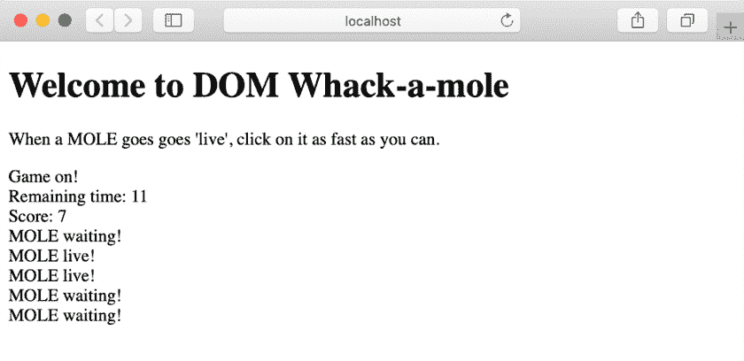

图 12.27：玩 DOM Whack-a-mole

# 13. 数据库交互和应用层

## 活动 13.01：持久化历史网球结果和 ELO 计算

解决方案：

1.  在一个新的项目中，从以下依赖项开始：

    ```java
    {:deps {clojure.java-time {:mvn/version "0.3.2"}
            hikari-cp {:mvn/version "2.8.0"}
            org.apache.derby/derby {:mvn/version "10.14.2.0"}
            org.clojure/data.csv {:mvn/version "0.1.4"}
            org.clojure/java.jdbc {:mvn/version "0.7.9"}
            semantic-csv {:mvn/version "0.2.1-alpha1"}}}
    ```

1.  在我们的 `src` 目录中，创建以下命名空间：

    ```java
    packt-clj.tennis.database
    packt-clj.tennis.elo
    packt-clj.tennis.ingest
    packt-clj.tennis.parse
    packt-clj.tennis.query
    ```

1.  在数据库命名空间中使用 `hikari` 创建我们的连接池非常简单：

    ```java
    (ns packt-clj.tennis.database
      (:require
        [hikari-cp.core :as hikari]))
    (def db {:datasource (hikari/make-datasource {:jdbc-url "jdbc:derby:tennis;create=true"})})
    ```

1.  我们的 DDL 应该看起来类似于以下内容。字段数据类型可能不同，尽管变化不大：

    ```java
    (def ^:private create-player-ddl "CREATE TABLE player (
      id varchar(4) CONSTRAINT PLAYER_ID_PK PRIMARY KEY,
      full_name varchar(128))")
    (def ^:private create-tennis-match-ddl "CREATE TABLE tennis_match (
      id varchar(32) CONSTRAINT MATCH_ID_PK PRIMARY KEY,
      tournament_year int,
      tournament varchar(32),
      tournament_order int,
      round_order int,
      match_order int,
      winner_id varchar(4) REFERENCES player(id) ON DELETE CASCADE,
      loser_id varchar(4) REFERENCES player(id) ON DELETE CASCADE)")
    (def ^:private create-elo-ddl "CREATE TABLE elo (
      id int GENERATED ALWAYS AS IDENTITY CONSTRAINT ELO_ID_PK PRIMARY KEY,
      player_id varchar(4) REFERENCES player(id) ON DELETE CASCADE,
      rating DECIMAL(6,2))")
    ```

1.  利用 `clojure.java.jdbc`，我们可以应用模式，注意排序：

    ```java
    (ns packt-clj.tennis.database
      (:require
        [clojure.java.jdbc :as jdbc]
        [hikari-cp.core :as hikari]))
    (defn load []
      (jdbc/db-do-commands db [create-player-ddl create-tennis-match-ddl create-elo-ddl]))
    (require '[packt-clj.tennis.database :as database])
    user=> (database/load)
    (0 0 0)
    ```

1.  这可能是这个活动的更具创造性的方面之一，这意味着有多种方法可以解决这个问题，以下只是其中之一。

    在 `parse` 命名空间中，我们首先定义了提取我们感兴趣的每个字段所需的访问器：

    ```java
    (ns packt-clj.tennis.parse
      (:require
        [clojure.string :as str]))
    (def ^:private winning-player-accessors
      {:id        :winner_player_id
       :full_name :winner_name})
    (def ^:private losing-player-accessors
      {:id        :loser_player_id
       :full_name :loser_name})
    (def ^:private match-accessors
      {:id               #(str (:match_id %) "-" (:round_order %))
       :tournament_year  (comp first #(str/split % #"-") :tourney_year_id)
       :tournament       :tourney_slug
       :tournament_order :tourney_order
       :round_order      :round_order
       :match_order      :match_order
       :winner_id        :winner_player_id
       :loser_id         :loser_player_id})
    ```

    每个先前的定义都是一个 `target-key`（即，我们想在数据结构中存储值的位置）到 `accessor`（即，一个单参数函数，给定一个行，将提取、格式化和聚合字段，如所需）的映射。

1.  然后，我们可以定义一个函数，该函数将对任何给定的行执行这些访问器的应用：

    ```java
    (defn apply-accessors
      [row accessors]
      (reduce-kv
        (fn [acc target-key accessor]
          (assoc acc target-key (accessor row)))
        {}
        accessors))
    ```

1.  可以定义一些命名良好的辅助函数来执行每个目标结构的提取，这些结构在简单的 `parse-row` 函数中组合：

    ```java
    (defn extract-winning-player
      [row]
      (apply-accessors row winning-player-accessors))
    (defn extract-losing-player
      [row]
      (apply-accessors row losing-player-accessors))
    (defn extract-match
      [row]
      (apply-accessors row match-accessors))
    (defn parse-row
      [row]
      {:winning-player (extract-winning-player row)
       :losing-player  (extract-losing-player row)
       :match          (extract-match row)})
    ```

1.  最后，我们可以将这些组合到我们的历史函数中，如下所示，添加相关的 `requires`：

    ```java
    (ns packt-clj.tennis.parse
      (:require
        [clojure.data.csv :as csv]
        [clojure.java.io :as io]
        [clojure.string :as str]
        [semantic-csv.core :as sc]))
    (defn new-player?
      [seen candidate]
      (not (seen (:id candidate))))
    (defn historic
      [file-path]
      (->> (io/reader file-path)
           (csv/read-csv)
           sc/mappify
           (reduce (fn
                     [{:keys [player-ids-seen] :as acc} row]
                     (let [{:keys [winning-player losing-player match]} (parse-row row)
                           new-players (filter #(new-player? player-ids-seen %) [winning-player losing-player])]
                       (-> acc
                           (update-in [:data :players] into new-players)
                           update-in [:data :matches] conj match)
                           (update :player-ids-seen into (map :id new-players)))))
                   {:player-ids-seen #{}
                    :data            {:players []
                                      :matches []}})
           :data))
    ```

    我们定义的 `reduce` 函数首先将传入的行解析为三个我们感兴趣的目标数据结构：玩家（`winning` 和 `losing`）以及比赛本身。然后我们检查确保我们只会在我们没有看到过玩家的情况下持久化玩家。我们通过使用命名适当的 `helper` 函数与 `player-ids-seen` 集合进行检查来完成此操作。

    最后，我们使用 thread-first 宏来维护我们的累加器，添加新的玩家/比赛，并维护我们已经处理过的玩家 ID 集合，在提取映射的 `:data` 部分之前。

1.  在`ingest`命名空间中，一个简单的`parse/historic`调用，以及在我们的`let`绑定中的解构，就足以提取我们将要插入到`db`变量中的玩家和比赛：

    ```java
    (ns packt-clj.tennis.ingest
      (:require
        [packt-clj.tennis.parse :as parse]
        [clojure.java.jdbc :as jdbc]))
    (defn historic
      [db file-path]
      (let [{:keys [players matches]} (parse/historic file-path)]
        (jdbc/insert-multi! db :player players)
        (jdbc/insert-multi! db :tennis_match matches)))
    ```

1.  在将`match_scores_1991-2016_unindexed_csv.csv`文件放入`resources`目录后，我们现在可以摄取我们的历史数据，并执行一些基本检查，以查看我们的`player`和`tennis_match`计数是否如下匹配：

    ```java
    (require '[packt-clj.tennis.ingest :as ingest]
             '[clojure.java.jdbc :as jdbc]
             '[clojure.java.io :as io]
               '[packt-clj.tennis.database :as database])
    user=> (ingest/historic database/db (io/file "packt-clj/resources/match_scores_1991-2016_unindexed_csv.csv"))
    user=> (jdbc/query database/db ["select count(*) from player"])
    => ({:1 3483})
    user=> (jdbc/query database/db ["select count(*) from tennis_match"])
    => ({:1 95359})
    ```

1.  在`query`命名空间中提取所有网球比赛的 SQL 相当简单；然而，应注意`round_order desc`。由于`round_order`随着比赛的进行而*减少*，我们必须将其排序为逆序：

    ```java
    (ns packt-clj.tennis.query
      (:require
        [clojure.java.jdbc :as jdbc]))
    (defn all-tennis-matches
      [db]
      (jdbc/query db ["select *
                   from tennis_match
                       order by tournament_year, tournament_order, round_order desc, match_order"]))
    ```

1.  利用我们的*第五章*中的函数*多对一：减少*，我们的`elo`命名空间开始如下：

    ```java
    (ns packt-clj.tennis.elo
      (:require
        [clojure.java.jdbc :as jdbc]
        [packt-clj.tennis.query :as query]))=
    (def k-factor 32)
    (defn match-probability [player-1-rating player-2-rating]
      (/ 1
         (+ 1 (Math/pow 10 (/ (- player-2-rating player-1-rating) 1000)))))
    (defn recalculate-rating [previous-rating expected-outcome real-outcome]
      (+ previous-rating (* k-factor (- real-outcome expected-outcome))))
    ```

1.  计算所有比赛的 ELO 评分可以如下实现。首先，我们可以定义两个辅助函数，第一个函数产生预期结果的元组。由于概率必须加起来为 1，我们可以计算一个概率，然后从 1 中减去以得到另一个概率：

    ```java
    (defn- expected-outcomes
      [winner-rating loser-rating]
      (let [winner-expected-outcome (match-probability winner-rating loser-rating)]
        [winner-expected-outcome (- 1 winner-expected-outcome)]))
    ```

1.  然后，我们在第二个辅助函数的主体中解构元组，这使得我们可以计算每个玩家的新的评分，并返回一个在`calculate-all`中解构的更新后的玩家数据结构：

    ```java
    (defn- calculate-new-ratings [current-player-ratings {:keys [winner_id loser_id]}]
      (let [winner-rating (get current-player-ratings winner_id 1000)
            loser-rating  (get current-player-ratings loser_id 1000)
            [winner-expected-outcome loser-expected-outcome] (expected-outcomes winner-rating loser-rating)]
        [{:player_id winner_id
          :rating    (recalculate-rating winner-rating winner-expected-outcome 1)}
         {:player_id loser_id
          :rating    (recalculate-rating loser-rating loser-expected-outcome 0)}]))
    ```

1.  最后，我们解构调用`calculate-new-ratings`的结果，提取`winner`和`loser` ID，以便我们可以更新下一次迭代的`current-player-ratings`数据结构：

    ```java
    (defn calculate-all
      [db]
      (->> (query/all-tennis-matches db)
           (reduce
             (fn [{:keys [current-player-ratings] :as acc} match]
               (let [[{winner-id :player_id :as new-winner-rating} {loser-id :player_id :as new-loser-rating}] (calculate-new-ratings current-player-ratings match)]
                 (-> acc
                     (update :elo-ratings into [new-winner-rating
                                                new-loser-rating])
                     (assoc-in [:current-player-ratings winner-id] (:rating new-winner-rating))
                     (assoc-in [:current-player-ratings loser-id] (:rating new-loser-rating)))))
             {:elo-ratings            []
              :current-player-ratings {}})
           :elo-ratings))
    ```

    使用当前比赛的`winner_id`和`loser_id`，如果它们在累加器（默认为`1000`）中找不到，我们可以查找它们现有的评分。接下来，我们使用之前描述的函数确定预期的结果。一旦我们有了这些，我们就可以将其插入到`recalculate-rating`函数中，并将更新的值存储在累加器中，以便下一次迭代。

    `current-player-rating`实际上是一个内存缓存；我们不想只为了再次查找而将评分持久化到数据库中。

1.  在`persist-all`函数中执行单个`jdbc/insert-multi!`调用比边持久化更高效：

    ```java
    (defn persist-all
      [db]
      (let [elo-ratings (calculate-all db)]
        (jdbc/insert-multi! db :elo elo-ratings)))
    user=>(require '[packt-clj.tennis.elo :as elo]
                   '[packt-clj.tennis.query :as query])
    nil
    user=> (elo/persist-all database/db)
    ```

1.  提取所有名称和评分所需的 SQL 相当简单。附加一个`result-set-fn`函数，该函数逐个遍历结果，直观且简单，尽管比原始 SQL 方法效率低：

    ```java
    (defn select-max-elo
      [db]
      (jdbc/query db ["select p.full_name, e.rating
                       from player p, elo e
                       where p.id = e.player_id"]
                  {:result-set-fn (fn [rs]
                                    (reduce (fn [{:keys [max-rating] :as acc} {:keys                                   [full_name rating]}]
                                              (cond-> acc
                                                      (< max-rating rating) (assoc                                                     :max-rating rating
                                                        :player-name full_name)))
                                            {:max-rating Integer/MIN_VALUE
                                             :player-name nil}
                                            rs))}))
    ```

    我们首先定义最大评分为最小的整数，保证它不会出现在我们的最终结果中！通过简单比较现有最高评分与候选评分，我们可以确定是否使用条件线程首先宏更新我们的累加器。

1.  最后，让我们确认具有最高 ELO 值的玩家是否符合预期：

    ```java
    user => (query/select-max-elo database/db)
    => {:max-rating 2974.61M, :player-name "Novak Djokovic"}
    ```

太棒了！我们已经成功构建了一个应用层，使我们能够摄取、查询和计算我们的大型网球结果 CSV 数据集。任何新加入应用的人应该能够仅从命名空间中理解其目的。在命名空间上下文中，每个单独函数的意图也应该清晰。

# 14. HTTP 与 Ring

## 活动十四点零一：通过 REST 公开历史网球结果和 ELO 计算

解决方案：

1.  在`packt-clj.tennis`的`deps.edn`文件中添加以下依赖项：

    ```java
    {:deps {..
            clj-http {:mvn/version "3.10.0"}
            compojure {:mvn/version "1.6.1"}
            metosin/muuntaja {:mvn/version "0.6.4"}
            org.clojure/data.json {:mvn/version "0.2.6"}
            ring/ring-core {:mvn/version "1.7.1"}
            ring/ring-jetty-adapter {:mvn/version "1.7.1"}}
    ```

1.  使用以下`require`路由创建我们的命名空间：

    ```java
    (ns packt-clj.tennis.api
      (:require
        [clojure.edn :as edn]
        [compojure.core :refer [context defroutes GET PUT]]
        [compojure.route :as route]
        [muuntaja.middleware :as middleware]
        [packt-clj.tennis.database :as database]
        [packt-clj.tennis.elo :as elo]
        [packt-clj.fitness.ingest :as ingest]
        [packt-clj.tennis.query :as query]
        [ring.adapter.jetty :refer [run-jetty]]
        [ring.middleware.params :as params]))
    ```

1.  用于公开我们的球员资源和他们参与的网球比赛的所需路由如下：

    ```java
    (defroutes routes
               (context "/players" []
                 (GET "/" []
                   {:body (query/all-players database/db)})
                 (GET "/:id" [id]
                   (when-first [user (query/player database/db id)]
                     {:body user}))
                 (GET "/:id/tennis-matches" [id]
                   {:body (query/tennis-matches-by-player database/db id)}))
               (route/not-found "Not found"))
    ```

1.  参考的`query`函数定义在`query`命名空间中，如下所示：

    ```java
    (defn all-players
      [db]
      (jdbc/query db ["select * from player"]))
    (defn player
      [db id]
      (jdbc/query db [(str "select * from player where id = '" id "'")]))
    (defn tennis-matches-by-player
      [db id]
      (jdbc/query db [(str "select * from tennis_match
                       where winner_id = '" id "' or loser_id = '" id "'")]))
    ```

1.  我们的`run`函数看起来与我们之前使用的相似，利用了`wrap-format`和`wrap-params`中间件：

    ```java
    (defn run
      []
      (run-jetty
        (-> routes
            middleware/wrap-format
            params/wrap-params)
        {:port  8080
         :join? false}))
    ```

1.  我们可以在`players`上下文中添加以下路由以检索 ELO，以及从我们的`query`命名空间中提取它的方法：

    ```java
    (GET "/:id/elo" [id]
                   (when-first [elo (query/player-elo database/db id)]
                     {:body elo}))
    (defn player-elo
      [db id]
      (jdbc/query db [(str "select e.rating, e.id
                            from elo e, player p
                            where e.player_id = p.id and
                            p.id = '" id "' and
                            e.id in (select max(e2.id)
                                     from elo e2
                                     where e2.player_id = '" id "')")]))
    ```

1.  定义一个新的`tennis-matches`上下文，以及新的`query/tennis-match`函数：

    ```java
    (context "/tennis-matches" []
                 (GET "/" []
                   {:body (query/all-tennis-matches database/db)})
                 (GET "/:id" [id]
                   (when-first [tennis-match (query/tennis-match database/db id)]
                     {:body tennis-match})))
    (defn tennis-match
      [db id]
      (jdbc/query db [(str "select * from tennis_match where id = '" id "'")]))
    ```

    可选地，如果我们从一个干净的数据库开始，我们可以使用以下方式填充相关数据：

    ```java
    (require '[packt-clj.tennis.database :as database]
             '[packt-clj.tennis.ingest :as ingest]
             '[packt-clj.tennis.elo :as elo])
    (database/load)
    (ingest/historic database/db "./resources/match_scores_1991-2016_unindexed_csv.csv")
    (elo/persist-all database/db) 
    ```

1.  启动 Web 服务器后，我们可以使用浏览器检索当前的 ELO 作为参考：

    ```java
    (require '[packt-clj.tennis.api :as api])
    (def app (api/run))
    ```

    输出如下：

    

    图 14.22：打印 Sampras 的当前评级

    打印`Djokovic`的当前评级：

    

    图 14.23：打印 Djokovic 的当前评级

1.  我们使用`PUT`定义我们的`tennis-match`创建路由，因为我们事先知道 ID。这被添加到`tennis-matches`上下文中。我们必须查询比赛中涉及的两个球员的 ELO，然后为每个球员创建一个新的记录，并更新他们的 ELO。这需要一个新的`ingest/tennis-match`和`elo/persist`函数，如下所示。注意，由于我们现在需要在`elo`命名空间外使用它，`elo/calculate-new-ratings`函数现在应标记为公共的（使用`defn`而不是`defn-`）：

    ```java
    (defn tennis-match
      [db tennis-match]
      (first (jdbc/insert! db :tennis_match tennis-match)))
    (defn persist
     [db elo-ratings]
     (jdbc/insert-multi! db :elo elo-ratings))
    (PUT "/:id" req
                   (let [id (-> req :params :id)
                         {:keys [winner_id loser_id] :as tennis-match} (assoc (edn/read-string (slurp (:body req)))
                                                                         :id id)
                         [{winner-elo :rating}] (query/player-elo database/db                        winner_id)
                         [{loser-elo :rating}] (query/player-elo database/db                        loser_id)
                         new-player-ratings (elo/clj-http to submit a PUT instruction to our web service as follows:

    ```

    (.stop app)

    (def app (api/run))

    (require '[clj-http.client :as http])

    (http/put "http://localhost:8080/tennis-matches/2019-1-d643-s403-5"

    {:body (pr-str {:tournament_year  2019,

    :tournament       "umag",

    :tournament_order 1,

    :round_order      5,

    :match_order      1,

    :winner_id        "d643",

    :loser_id         "s402"})})

    ```java

    ```

1.  由于 Sampras 在我们的虚构比赛中输了，我们看到他的 ELO 略有下降，而 Djokovic 的 ELO 有所上升：

图 14.24：打印 Sampras 的评级

以下是 Djokovic 的评级：


图 14.25：打印 Djokovic 的当前评级

因此，通过完成这个活动，我们已经通过 REST Web 服务使我们的应用层更广泛地可用。

# 15. 前端：ClojureScript UI

## 活动 15.01：从互联网显示图片网格

解决方案：

1.  在命令行提示符下，使用以下 Leiningen 命令创建一个新的 Figwheel 项目：

    ```java
    lein new figwheel packt-clj.images -- --reagent
    ```

1.  移动到`packt-clj.images/`目录并输入：

    ```java
    lein figwheel
    ```

    几秒钟后，你的浏览器应该会打开默认的 Figwheel 页面：

    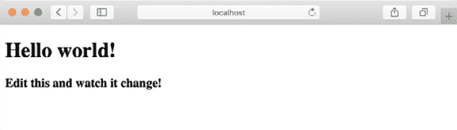

    图 15.8：一个等待你编写代码的新鲜 ClojureScript 项目

1.  在你喜欢的编辑器中打开`src/packt_clj/images/core.cljs`文件并修改代码：

    ```java
    (ns packt-clj.images.core
        (:require [reagent.core :as r]))
    ```

1.  Reagent 常用的别名是`r`而不是 Reagent：

    ```java
    (defonce app-state (r/atom {:images []
                                           :author-display true}))
    ```

    `app-state`由两部分数据组成：我们获取的图片向量，最初是一个空向量，以及是否显示作者姓名，最初为 true。

1.  让我们创建一个按钮，从 HTTP 端点获取图片并更新`app-state`中的`:images`值。我们需要两个处理器：`fetch-images`，它将图片向量更新到`app`状态中的`:images`，以及`clear-images`，它将空向量更新到`app-state`中的`:images`：

    ```java
    (defn fetch-images []
     (-> (js/fetch "https://picsum.photos/v2/list?limit=6")
           (. then (fn [response] (.json response)))
          (. then (fn [json] (swap! app-state assoc-in [:images] (js->clj json :keywordize-keys true))))))
    (defn clear-images []
         (swap! app-state assoc-in [:images] []))
    ```

1.  下面是`fetch-or-clear-button`组件的代码：

    ```java
    (defn fetch-or-clear-button []
      (let [handler (if (empty? (:images @app-state)) fetch-images clear-images)
               text    (if (empty? (:images @app-state)) "Fetch Images" "Clear Images")]
         [:button.btn {:on-click handler} text]))
    ```

1.  我们通过使用`:button.btn`简短的 Hiccup 语法将`btn`类应用到按钮上。`btn`类在`resources/public/css/style.css`中定义：

    ```java
    .btn {
      padding: 7px 20px;
      cursor: pointer;
      margin-left: 10px;
      margin-bottom: 10px;
      border: 1px solid gray;
    }
    ```

1.  让我们构建一个`image`组件和一个`image-grid`组件：

    ```java
    (defn image [{:keys [download_url author]}]
      [:div
       [:img {:src download_url
                   :height "130px"
                   :style {:border "solid gray 3px"
                               :border-radius "10px"}}]
       (when (:author-display @app-state)
          [:div {:style {:font-size "15px"
                                  :color "gray" }}
            (str "Image by ") author])])
    (defn image-grid [images]
       (if (empty? images)
          [:div "Click the button to fetch images"]
          (into [:div] (map (fn [image-data] [:div {:style {:float "left"
                                              :margin-left "20px"}}
     [image image-data]])
                                         images))))
    ```

1.  最后一个组件是一个按钮，可以隐藏或显示作者姓名：

    ```java
    (defn author-display-button []
      (let [text (if (:author-display @app-state)
                     "Hide author"
                     "Show author")]
      [:button.btn {:on-click #(swap! app-state update-in [:author-display] not)}
               text]))
    ```

1.  现在，我们将所有组件作为`main`组件的子组件添加。我们将`hello-world`函数重命名为`app`：

    ```java
    (defn app []
      [:div
       [fetch-or-clear-button]
       [author-display-button]
       [image-grid (:images @app-state)]])
    ```

1.  最后，我们渲染主组件（命名为`app`而不是`hello-world`）：

    ```java
    (r/render-component [app] (. js/document (getElementById "app")))
    ```

    如果一切顺利，你应该会看到一个像这样的屏幕：

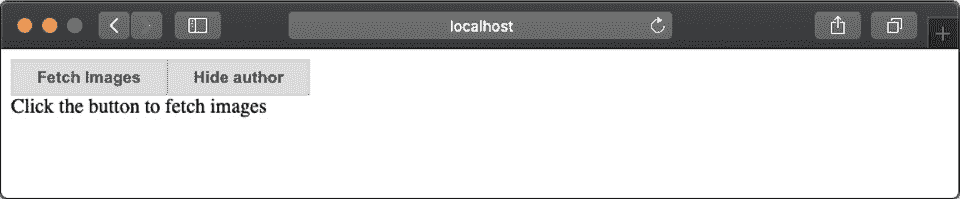

图 15.9：获取和清除图片的按钮

当你点击“获取图片”按钮时，图片会显示作者的姓名：


图 15.10：获取图片

最后，当你点击“隐藏作者”按钮时，作者姓名会消失：


图 15.11：隐藏作者信息

在这里，我们创建了一个单页应用程序，可以按需加载和清除图片和文本。

## 活动 15.02：带排名的网球运动员

解决方案：

1.  在命令行提示符下，使用以下 Leiningen 命令创建一个新的 Figwheel 项目：

    ```java
    lein new figwheel packt-clj.tennis -- --reagent
    ```

1.  移动到`packt-clj.tennis/`目录并输入以下命令：

    ```java
    lein figwheel
    ```

    几秒钟后，你的浏览器应该会打开默认的 Figwheel 页面：

    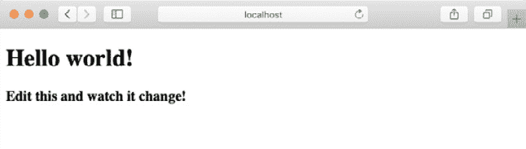

    图 15.12：一个等待你编写代码的新鲜 ClojureScript 项目

1.  在你喜欢的编辑器中打开`src/packt_clj/tennis/core.cljs`文件并修改代码：

    ```java
    (ns packt-clj.tennis.core
        (:require [reagent.core :as r]))
    ```

    `app-state`由玩家列表和当前选中玩家的详细信息组成。

1.  我们从一个空的玩家列表开始：

    ```java
    (defonce app-state (r/atom {:players []
                                :current-player nil}))
    ```

1.  这里是获取特定玩家服务器上排名数据的代码：

    ```java
    (defn fetch-player [id full_name]
      (-> (js/fetch (str "http://localhost:8080/players/" id "/elo"))
          (.then (fn [response] (.json response)))
          (.then (fn [json] (swap! app-state assoc-in [:current-player] (assoc (js->clj json :keywordize-keys true)
                                                                              :full_name full_name))))))
    ```

1.  这里是一个显示玩家名称和排名的玩家组件：

    ```java
    (defn player-alone [{:keys [rating full_name]}]
      [:div
       (str full_name " has a rating of: " rating)])
    ```

1.  让我们创建一个按钮，用于清除当前玩家并返回所有玩家的列表：

    ```java
    (defn player-list-button []
      [:button.btn {:on-click #(swap! app-state assoc-in [:current-player] nil)} "Display all players"])
    ```

1.  让我们编写玩家列表的代码。我们首先编写列表元素的组件。内容是玩家的名称。当我们点击它时，它会获取所选玩家的排名数据：

    ```java
    (defn player [{:keys [id full_name]}]
      [:div [:span
             [:a
              {:href "#"
               :on-click (partial fetch-player id full_name)}
              full_name]]])
    ```

1.  我们现在构建 `player-list` 组件。它接收一个玩家向量，并返回一个包含每个玩家组件的 `:div`：

    ```java
    (defn player-list [players]
      (if (empty? players)
        [:div "Click the button to fetch players"]
        (into [:div] (map player players))))
    ```

1.  这是获取玩家数据的函数代码：

    ```java
    (defn fetch-players []
      (-> (js/fetch "http://localhost:8080/players/")
          (.then (fn [response] (.json response)))
          (.then (fn [json] (swap! app-state assoc-in [:players] (js->clj json         :keywordize-keys true))))))
    ```

1.  我们还需要一个函数，通过修改 `app-state` 来清除玩家列表：

    ```java
    (defn clear-players []
      (swap! app-state assoc-in [:players] []))
    ```

1.  现在我们添加一个按钮，该按钮可以清除或填充玩家列表：

    ```java
    (defn fetch-or-clear-button []
      (let [handler (if (empty? (:players @app-state)) fetch-players clear-players)
            text    (if (empty? (:players @app-state)) "Fetch Players" "Clear Players")]
        [:button.btn {:on-click handler} text]))
    ```

1.  现在，我们编写 `main` 组件。当与 `:current-player` 关联的值不是 `nil` 时，我们显示当前选定的玩家。否则，我们显示玩家列表。这是主 `app` 组件的代码：

    ```java
    (defn app []
      (if (:current-player @app-state)
        [:div
         [player-list-button]
         [player-alone (:current-player @app-state)]]
        [:div
         [fetch-or-clear-button]
         [player-list (:players @app-state)]]))
    ```

1.  最后，我们渲染主组件：

    ```java
    (r/render-component [app] (. js/document (getElementById "app")))
    ```

通过完成这些活动，我们了解了如何组织试剂应用程序的不同组件：CSS、HTML 和 `cljs` 文件。能够迭代修改代码，并且网页能够立即更新而不需要刷新页面，这对我们来说非常有帮助，并且节省了时间。我们学习了如何在 ratom 中存储应用程序的状态，并访问 Reagent 组件的代码状态。
