# 第二章：动画

|   | *"没有欲望的学习会损害记忆，它所吸收的什么也保留不住。" |   |
| --- | --- | --- |
|   | --*莱昂纳多·达·芬奇* |

在 Greenfoot 场景中通过处理键盘或鼠标事件并适当地使用`setLocation()`方法来移动角色相对简单。然而，我们可以做得更好。通过进一步动画化我们的角色，我们可以赋予它们生命。我们可以给我们的玩家/用户一个充满活力、生机勃勃的世界的错觉。

从本质上讲，编程动画是一种幻觉艺术。通过在适当的时候添加微小的动作或图像变化，我们诱使用户相信我们的创作不仅仅是屏幕上的静态像素。在本章中，你将学习以下用于动画 Greenfoot 角色的技术：

+   图像交换和移动

+   定时和同步

+   缓动

Greenfoot 是一个创建交互性和吸引人的应用程序的绝佳平台，您可以在互联网上共享或用作桌面应用程序。正是您创建这些类型应用程序的愿望使您来到这里，根据达芬奇的看法，正是这种愿望将帮助您无限期地保留这本书中的信息。

# 重温避免者游戏

在本章中，我们将继续完善我们在第一章“让我们直接进入…”中创建的避免者游戏。如果您跳过了那一章，或者只是想从一份全新的副本开始，您可以从 Packt Publishing 网站上的本书产品页面下载这个游戏的代码：[`www.packtpub.com/support`](http://www.packtpub.com/support)。我在本章中略过的大部分概念很可能在前一章中已经详细讨论过；如有需要，请务必参考那一章。现在，打开 Greenfoot 中的`AvoiderGame`场景并继续阅读。

# 图像交换和移动

图像交换是古老的动画技术。也许在小时候，你在纸垫的角落画了一个棒状人物，并在每一页上稍作改变。当你快速翻阅页面时，你的棒状人物就活了起来。*图 2*展示了我尝试的这种动画。

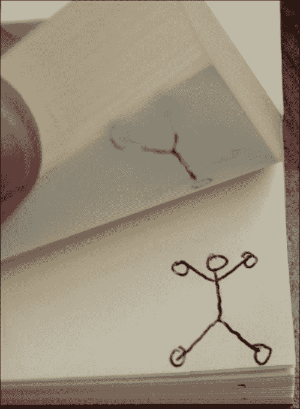

图 1：这展示了传统的棒状人物动画

在 Greenfoot 中，我们将通过快速切换图像来动画化角色，以达到*图 1*中显示的纸动画相同的效果。我们将学习如何使用 Greenfoot 的`setImage()`方法来实现这一点。

## 使用 setImage()

当我们通过从`Actor`类或我们的`Actor`子类之一派生新`Actor`时，Greenfoot 会提示我们输入新类的名称并为其选择一个图像。Greenfoot 还允许我们在场景运行时动态设置`Actor`对象的图像，使用 Greenfoot 的`Actor`类提供的`setImage()`方法。以下是从 Greenfoot 文档中摘录的内容：

```java
public void setImage(java.lang.String filename)
throws java.lang.IllegalArgumentException

Set an image for this actor from an image file. The file may be in jpeg, gif or png format. The file should be located in the project directory.

Parameters:
filename - The name of the image file.
```

如你所见，`setImage()`允许我们通过指定任何`JPEG`、`GIF`或`PNG`文件的路径来设置演员的图像。默认情况下，Greenfoot 会在你的 Greenfoot 项目中包含的`images`文件夹中查找。你应该将你将在场景中使用的所有图像放置在这个文件夹中。

让我们使用这种方法来为 Avoider 游戏中的敌人添加动画效果。

### 让敌人不那么开心

Avoider 游戏中的敌人太开心了。让我们让它们变得悲伤和失望，因为它们意识到我们的英雄将避开它们。

#### 查找资源

我们需要做的第一件事是找到一组合适的笑脸图像，我们可以将其切换到我们的场景中的`Enemy`演员。通常，你需要使用 Greenfoot 内置的图像编辑器或像 GIMP 或 Adobe Illustrator 这样的工具来创建自己的图像资源，或者你可以从互联网上下载图像；有很多免费图像可供选择。幸运的是，Greenfoot 的默认安装已经包含了我们需要的所有图像。在 OSX 上，图像位于以下文件夹中：

```java
/Applications/Greenfoot 2.3.0/Greenfoot.app/Contents /Resources/Java/greenfoot/imagelib/symbols
```

在 Windows 上，图像位于以下文件夹中：

```java
C:/Program Files/Greenfoot/lib/greenfoot/imagelib/symbols
```

为了方便起见，我已经将所有笑脸图像放在了这本书的文件存储库中，可以在 Packt Publishing 网站上找到，网址为[`www.packtpub.com/sites/default/files/downloads/0383OS_ColoredImages.pdf`](https://www.packtpub.com/sites/default/files/downloads/0383OS_ColoredImages.pdf)。

你需要将文件`smiley1.png`、`smiley3.png`、`smiley4.png`和`smiley5.png`放入你的`AvoiderGame`目录下的`images`文件夹中。完成此操作后，你的图像文件夹应包含*图 2*中显示的文件。


*图 2*：这是你的 AvoiderGame 项目中的图像文件夹内容。

现在我们已经有了可用的图像，我们可以开始编码了。

### 小贴士

注意，一旦你将演员的图像设置为 Greenfoot 在创建时提供的图像，例如*图 2*中的`skull.png`，Greenfoot 会自动将图像放置在你的`images`文件夹中。因此，你不必从磁盘上的位置复制笑脸图像，你可以创建一个新的演员，然后依次将这个演员的图像设置为每个笑脸。然后，你可以简单地删除这个新演员。你会发现你的图像文件夹看起来就像*图 2*中显示的那样。

#### 根据演员位置调用 setImage()

在 Greenfoot 主场景窗口的**演员类**部分双击`Enemy`演员以开始编辑`Enemy`代码。我们练习良好的功能分解，并在`Enemy`的`act()`方法中简单地添加对`changeDispositon()`的调用；我们很快就会编写这个方法。现在你的`act()`方法应该看起来像这样：

```java
public void act() {
  setLocation(getX(), getY() + speed);
  changeDisposition();
  checkRemove();
}
```

现在，我们将实现`changeDisposition()`方法。在这个方法中，我们想要改变敌人的状态，因为他们逐渐意识到他们不会得到英雄。让我们假设我们的敌人直到达到屏幕中间都保持乐观。之后，我们将逐渐让他们陷入绝望。

在`changeDisposition()`方法的实现中，我们将使用一个实例变量来跟踪我们需要显示的下一张图片。您需要在速度实例变量的声明下方添加这个变量**声明**和**初始化**（在类顶部任何方法之外）：

```java
private int timeToChange = 1;
```

在此基础上，我们现在可以查看`changeDisposition()`的实现。以下是我们的代码：

```java
private void changeDisposition() {
  int ypos = getY();
  int worldHeight = getWorld().getHeight();
  int marker1 = (int) (worldHeight * 0.5);
  int marker2 = (int) (worldHeight * 0.75);
  int marker3 = (int) (worldHeight * 0.90);
  if( timeToChange == 1 && ypos > marker1) {
    setImage("smiley4.png");
    timeToChange++;
  }
  else if( timeToChange == 2 && ypos > marker2) {
    setImage("smiley3.png");
    timeToChange++;
  }
  else if( timeToChange == 3 && ypos > marker3) {
    setImage("smiley5.png");
    timeToChange++;
  }
}
```

这段代码背后的逻辑很简单。我们想要在敌人下落的过程中选择特定的位置来更改图片。一个复杂的问题是敌人的速度可以通过`setSpeed()`方法来改变。我们在`AvoiderWorld`类中使用这个方法来增加敌人的速度，以增加游戏的难度。因此，我们不能简单地使用像`if( ypos == 300)`这样的代码来更改敌人的图片，因为演员可能永远不会有一个精确的**y**位置为`300`。例如，如果敌人的速度是 7，那么它下落时的**y**位置如下：7, 14, 21, …, 294, 301, 308，等等。

如我们所见，敌人永远不会有一个精确的**y**位置为 300。你可能接下来想要尝试像`if( ypos > 300 )`这样的代码；然而，这并不是最优的，因为这会导致图片在超过 300 的每个 y 位置上**持续**被设置。因此，我们应该采用`changeDisposition()`中展示的方法，并使用`timeToChange`来控制一次性的、顺序的图片更改。

现在我们已经理解了`changeDisposition()`背后的逻辑，让我们逐行分析。我们首先创建变量来保存我们想要更改敌人图片的位置。这些位置基于场景的高度；`marker1`位于高度的 50%，`marker2`位于高度的 75%，而`marker3`位于敌人从屏幕底部退出之前的一个稍微靠前的位置。`if`语句在更改演员图片之前测试两个条件。它检查是否使用`timeToChange`来更改特定图片，以及演员是否已经通过了一个给定的**y**位置。

### 小贴士

在之前的代码中，有一些行将十进制数字（类型为`double`）转换为整数（类型为`int`），例如这一行：

```java
int marker1 = (int) (worldHeight * 0.5)
```

关于将一个变量转换为另一个变量（也称为类型转换）的更多信息，请参阅以下链接：

[`docs.oracle.com/javase/specs/jls/se7/html/jls-5.html`](http://docs.oracle.com/javase/specs/jls/se7/html/jls-5.html)

编译你的 Greenfoot 场景并玩游戏。看看你是否能获得超过 250 分的分数！**完全坦白：在写下最后一句话后，我连续玩了四次游戏，得到了以下分数：52，33，28，254。哇！254！**

### 注意

**功能分解**

功能分解与自顶向下的设计密切相关，这是一个通过将问题重新定义为更小、更简单的子问题来反复定义问题的过程。当你为程序中的特定动作或功能编写代码时，尝试思考你可以编写的更小的方法，你可以将它们组合起来解决更大的问题。

通常，你希望编写少于 40 行代码的方法，并且只实现一个定义良好的任务。实际上，如果可能的话，我更喜欢做得更小。你会发现，如果你遵循这个实践，代码编写、调试和修改都会更容易。在这本书中，我使用了功能分解。你会发现，书中所有的 `act()` 方法主要包含对其他方法的调用序列。

## 使用 setLocation()

`setImage()` 方法是 Greenfoot 中用于动画角色的最有用的方法；然而，以某些方式移动角色也可以产生有趣的效果。我们已经使用 `setLocation()` 来移动敌人和我们的英雄；现在让我们用它来动画背景星系，使其看起来像我们在穿越太空。

### 创建星系

我们将提供各种大小、以不同速度在背景中移动的星星，以产生高速穿越太空的效果。创建星系非常简单，我们已经有非常相似的代码。想象一下，如果我们的敌人有一个小光点的图像，而不是笑脸，而我们有很多这样的敌人。哇！你就有了一个星系。

#### 一张白纸

如果我们要创建自己的动态星系，那么我们就不再需要与 `AvoiderWorld` 关联的当前背景图像。然而，如果我们把这个类改为没有与之关联的图像，那么我们将会得到一个白色背景——这不是外太空的一个很好的表现。

解决方案是创建一个新的纯黑色、600 x 400 像素的图像，然后将其作为 `AvoiderWorld` 类的背景图像。启动你最喜欢的图像编辑器或使用 Greenfoot 内置的编辑器，创建一个大黑矩形，将其保存为 PNG 文件到你的 **Avoider** 项目的 `images` 文件夹中，然后将 `AvoiderWorld` 设置为使用这个新图像作为背景。

#### 星类

对于我们的星星，我们将做一些不同的事情。我们不会将星星的图像设置为包含图形的文件，而是将动态绘制图像。由于光点并不复杂，这将很容易做到。

要创建我们的星星演员，在**Actor 类**部分右键单击`Actor`类，并选择**新建子类…**。在弹出的**新建类**窗口中，将**新类名称**输入为`Star`，并将**新类图像**选择为**无图像**。

### 小贴士

记住，我们在第一章中讲解了如何创建新的演员，*让我们直接进入…*。

打开一个新的代码编辑器窗口，为你的新`Star`类添加以下构造函数：

```java
public Star() {
  GreenfootImage img = new GreenfootImage(10,10);
  img.setColor(Color.white);
  img.fillOval(0,0,10,10);
  setImage(img);
}
```

这个构造函数动态创建了一个用于`Star`类图像的图像。首先，我们创建了一个宽度为`10`像素、高度为`10`像素的新图像。接下来，我们设置用于在这个图像中绘制任何内容的颜色。我们通过在类文件顶部添加以下`import`语句来获取对`Color`类的访问权限（有关更多信息，请参阅下面的信息框）：

```java
import java.awt.Color;
```

在设置颜色后，我们使用`fillOval()`方法绘制一个椭圆形。`fillOval()`的第一个两个参数指定了我们正在绘制的形状的左上角相对于我们图像左上角的偏移量。*图 3*显示了这种映射。`fillOval()`的下一个两个参数指定了包含我们的椭圆形的边界框的宽度和高度。由于我们的宽度和高度相同，`fillOval()`将绘制一个圆。最后，我们将演员的图像设置为刚刚创建的新图像。

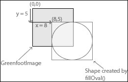

图 3：这显示了使用 fillOval()的第一个两个参数值为 8 和 5 的效果

### 注意

**处理颜色**

在`Star()`构造函数中，我们进行了一个涉及颜色的操作。计算机（以及基本上任何带有屏幕的东西）上有几种不同的方式来表示颜色，我们将使用 RGBA 颜色模型。如果你对此好奇，你可以在[`en.wikipedia.org/wiki/RGBA_color_space`](http://en.wikipedia.org/wiki/RGBA_color_space)上了解更多关于它的信息。

幸运的是，我们不需要了解太多关于理论的知识。Java 提供了一个名为`Color`的类，它为我们管理了大部分的复杂性。要将这个`Color`类引入到你的代码中，你需要在文件顶部添加一个`import`语句。这个`import`语句是`import java.awt.Color;`。如果你没有将这个添加到上面的代码中，你会得到编译错误。

要了解更多关于这个`Color`类的信息，请查看官方文档[`docs.oracle.com/javase/7/docs/api/java/awt/Color.html`](http://docs.oracle.com/javase/7/docs/api/java/awt/Color.html)。

我们接下来要为`Star`类添加的是`act()`方法。我们只需要慢慢将这个演员向下移动到屏幕底部，然后一旦它从屏幕底部移出就将其移除。我们使用`setLocation()`来完成前者，使用`checkRemove()`方法来完成后者。以下是`act()`和`checkRemove()`方法完成的代码：

```java
public void act() {
  setLocation(getX(), getY()+1);
  checkRemove();
}

private void checkRemove() {
  World w = getWorld();
  if( getY() > w.getHeight() + 30 ) {
    w.removeObject(this);
  }
}
```

`checkRemove()`方法与在`Enemy`类中使用并解释过的代码完全相同，请参阅第一章，“让我们直接进入…”。实际上，`Star`类和`Enemy`类之间有很多相似之处，以至于我认为我们应该提前将`Enemy`类中的`setSpeed()`方法添加到`Star`类中，因为在我们的移动星星场实现中，我们很可能需要它。将此方法添加到`Star`类中：

```java
public void setSpeed( int s) {
  speed = s;
}
```

正如我们在`Enemy`类中所做的那样，我们需要在类的顶部添加实例变量`speed`。以下是变量声明的代码：

```java
int speed = 1;
```

我们应该在`act()`方法中再进行一次修改，现在使用`speed`变量来移动`Star`对象。将`act()`方法中的`setLocation()`代码修改为如下：

```java
setLocation(getX(), getY() + speed);
```

`Star`类的完整代码在*图 4*中展示。

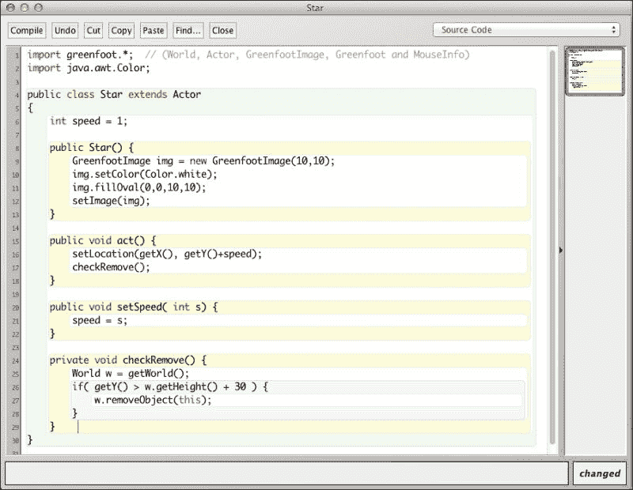

图 4：这显示了完成的`Star`类实现

这将是编译场景并确保你没有拼写错误的好时机。我们还没有在我们的游戏中添加星星，所以你不会注意到游戏中的任何区别。添加星星是我们接下来要做的。

#### 创建移动场

我们将在`AvoiderWorld`类中生成我们的星星。打开这个类的编辑器窗口，并在`act()`方法中添加一行代码来调用我们尚未编写的`generateStars()`方法，但很快就会编写。你的`act()`方法现在应该看起来像这样：

```java
public void act() {
  generateEnemies();
  generateStars();
  increaseLevel();
}
```

`generateStars()`方法以类似于`generateEnemies()`创建新敌人的方式创建新的星星。以下是`generateStars()`的代码：

```java
private void generateStars() {
  if( Greenfoot.getRandomNumber(1000) < 350) {
    Star s = new Star();
    addObject( s, Greenfoot.getRandomNumber(getWidth()-20)+10, -1);
  }
}
```

`if`语句决定了我们是否想在此时创建一个星星。有 35%的概率我们会创建一个星星，这最终会创建一个相当密集的星星场。在`if`语句内部，我们创建一个新的`Star`对象并将其添加到`World`中。添加此代码并编译运行游戏，看看你的想法。你喜欢星星吗？它们还可以，但看起来有点像在下雨的高尔夫球。我们可以做得更好。

#### 使用视差

视差是近处的物体似乎相对于远处的物体在观看角度上处于不同位置的效果。例如，如果你曾经从汽车窗户向外看，并观察树木移动，你会注意到靠近你的树木似乎比背景中的树木移动得更快。我们可以利用这种现象给我们的星星场带来深度感。

让我们将`generateStars()`方法修改为创建两种类型的星星。一些会靠近，一些会远离。靠近的星星会移动得更快，亮度也会比远离的星星高，但我们将会生成更多远离的星星。如果你将我们的屏幕想象成一个通向太空的窗口，我们将看到更远处的物体，而不是近处的物体。因此，我们需要更多的星星。*图 5*展示了这一点。

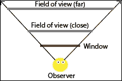

图 5：这表明，通过窗户看去，对于更远处的物体，你的视野更宽。

最后，我们希望添加一些随机的变化到星星中，这样生成的星星场就不会看起来太均匀。这是我们的视差增强的 `generateStars()` 方法：

```java
private void generateStars() {
  if( Greenfoot.getRandomNumber(1000) < 350) {
    Star s = new Star();
    GreenfootImage image = s.getImage();
    if( Greenfoot.getRandomNumber(1000) < 300) {
      // this is a close bright star
      s.setSpeed(3);
      image.setTransparency(
      Greenfoot.getRandomNumber(25) + 225);
      image.scale(4,4);
    } else {
      // this is a further dim star
      s.setSpeed(2);
      image.setTransparency(
      Greenfoot.getRandomNumber(50) + 100);
      image.scale(2,2);
    }
    s.setImage(image);
    addObject( s, Greenfoot.getRandomNumber(
    getWidth()-20)+10, -1);
  }
}
```

我们添加了访问当前星星图像、更改图像并将其设置为新的星星图像的功能。内部的 `if-else` 语句处理了附近和远处的星星的变化。有 30%的几率星星会是近处的。附近的星星速度更快（`setSpeed()`）、亮度更高（`setTransparency()`）和更大（`scale()`）。

`setTransparency()` 方法接受一个整数参数，用于指定图像的透明度。对于完全不透明的物体，你应输入值 `255`；对于完全透明的物体，输入 `0`。我们使远处的星星更透明，这样更多的黑色背景就会透过来，使其不那么明亮。`GreenfootImages` 上的 `scale()` 方法用于改变图像的大小，以便它适合由该方法的前两个参数定义的边界框。正如我们在代码中所看到的，附近的星星被缩放到一个 4 x 4 像素的图像中，而远处的星星被缩放到一个 2 x 2 像素的图像中。

我们离完成星星场已经非常接近了。编译并运行场景，看看你现在对这个场景的看法。

星空看起来很棒，但仍然有两个问题。首先，当游戏开始时，背景是完全黑色的，然后星星开始下落。为了真正保持你在太空中的错觉，我们需要游戏从星星场开始。其次，星星正在生成在敌人、我们的英雄和得分计数器上方；这真的破坏了它们远处的错觉。让我们来修复这个问题。

解决星星在屏幕上其他角色前面的问题只需要一行代码。这是你需要添加到 `AvoiderWorld` 构造函数中的代码行：

```java
setPaintOrder(Avatar.class, Enemy.class, Counter.class);
```

`setPaintOrder()` 方法定义在 `World` 类中，`AvoiderWorld` 是其子类。这个方法允许你设置屏幕上显示的类的顺序。因此，我们首先列出 `Avatar` 类（它将在所有东西的顶部），然后是 `Enemy` 类，最后是 `Counter` 类。按照这种顺序，例如，我们的敌人将显示在得分上方。任何未列出的类都将绘制在所有已列出的类之后；因此，我们的星星将位于屏幕上所有角色的后面。

如果我们对 `generateStars()` 方法进行小的修改，绘制初始的星星场就很容易了。目前，我们的星星由于这一行而硬编码为从 `-1` 的 *y* 坐标开始：

```java
addObject( s, Greenfoot.getRandomNumber(getWidth()-20)+10, -1);
```

如果我们将 `generateStars()` 修改为接受一个整数参数，该参数指定绘制星星的 *y* 值，那么我们可以使用这个方法来创建初始的星星场。看 `generateStars()` 的第一行：

```java
private void generateStars() {
```

改成这样：

```java
private void generateStars(int yLoc) {
```

取方法中的最后一行：

```java
addObject( s, Greenfoot.getRandomNumber(getWidth()-20)+10, -1);
```

改成这个：

```java
addObject( s, Greenfoot.getRandomNumber(getWidth()-20)+10, yLoc);
```

这两个行更改使我们能够为我们的星星指定任何起始*y*值。由于这个更改，我们需要在`act()`方法中将`generateStars()`的调用更改为以下代码行：

```java
generateStars(-1);
```

如果你编译并运行场景，你应该看到的唯一区别是星星现在真正在背景中。我们仍然需要添加一个简单的方法定义和调用来绘制初始星星场。方法定义如下：

```java
private void generateInitialStarField() {
  for( int i=0; i<getHeight(); i++ ) {
    generateStars(i);
  }
}
```

如果我们游戏的高度是四百，那么这种方法会调用`generateStars()`四百次。每次，它都会提供一个不同的*y*值来绘制星星。我们将通过在构造函数中添加这一行来用星星填满屏幕：

```java
generateInitialStarField();
```

我们对`AvoiderWorld`类的定义进行了很多更改，这使得你可能在错误的地方放置了代码的可能性越来越大。以下是你可以用来检查你的代码的`AvoiderWorld`类的完整列表：

```java
import greenfoot.*;

public class AvoiderWorld extends World {
  private GreenfootSound bkgMusic;
  private Counter scoreBoard;
  private int enemySpawnRate = 20;
  private int enemySpeed = 1;
  private int nextLevel = 100;

  public AvoiderWorld() {
    super(600, 400, 1, false);
    bkgMusic = new GreenfootSound("sounds/UFO_T-Balt.mp3")
    // Music Credit:
    //	http://www.newgrounds.com/audio/listen/504436 by T-balt
    bkgMusic.playLoop();
    setPaintOrder(Avatar.class, Enemy.class, Counter.class);
    prepare();
    generateInitialStarField();
  }

  public void act() {
    generateEnemies();
    generateStars(-1);
    increaseLevel();
  }

  private void generateEnemies() {
    if( Greenfoot.getRandomNumber(1000) < enemySpawnRate) {
      Enemy e = new Enemy();
      e.setSpeed(enemySpeed);
      addObject( e, Greenfoot.getRandomNumber(
      getWidth()-20)+10, -30);
      scoreBoard.setValue(scoreBoard.getValue() + 1);
    }
  }

  private void generateStars(int yLoc) {
    if( Greenfoot.getRandomNumber(1000) < 350) {
      Star s = new Star();
      GreenfootImage image = s.getImage();
      if( Greenfoot.getRandomNumber(1000) < 300) {
        // this is a close bright star
        s.setSpeed(3);
        image.setTransparency(
        Greenfoot.getRandomNumber(25) + 225);
        image.scale(4,4);
      } else {
        // this is a further dim star
        s.setSpeed(2);
        image.setTransparency(
        Greenfoot.getRandomNumber(50) + 100);
        image.scale(2,2);
      }
      s.setImage(image);
      addObject( s, Greenfoot.getRandomNumber(
      getWidth()-20)+10, yLoc);
    }
  }

  private void increaseLevel() {
    int score = scoreBoard.getValue();
    if( score > nextLevel ) {
      enemySpawnRate += 2;
      enemySpeed++;
      nextLevel += 100;
    }
  }

  public void endGame() {
    bkgMusic.stop();
    AvoiderGameOverWorld go = new AvoiderGameOverWorld();
    Greenfoot.setWorld(go);
  }

  private void prepare() {
    Avatar avatar = new Avatar();
    addObject(avatar, 287, 232);
    scoreBoard = new Counter("Score: ");
    addObject(scoreBoard, 70, 20);
  }

  private void generateInitialStarField() {
    int i = 0;
    for( i=0; i<getHeight(); i++ ) {
      generateStars(i);
    }
  }
}
```

编译并运行你的游戏。这已经很不错了。你的游戏应该看起来像*图 6A*中显示的截图。

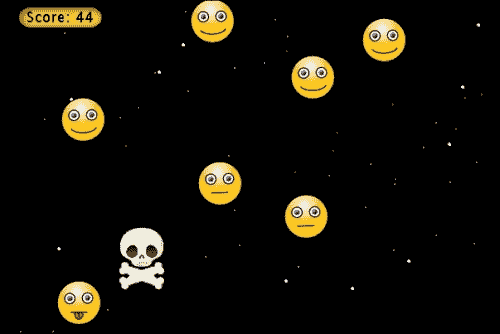

图 6A：这显示了到目前为止的游戏

#### 使用 GreenfootImage

等一下。我是怎么知道 Greenfoot 的`GreenfootImage`类以及它包含的`setColor()`和`fillOval()`方法的？答案是简单的，因为我阅读了文档。我了解到 Greenfoot 提供了`GreenfootImage`类来帮助处理和操作图像。一般来说，Greenfoot 提供了一套有用的类来帮助程序员创建交互式应用程序。我们在第一章中学习了`World`类和`Actor`类，*让我们直接进入…*。*图 6B*显示了 Greenfoot 提供的所有类。

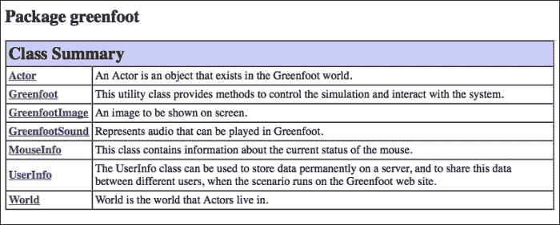

图 6B：这显示了 Greenfoot 提供的类，以帮助你编写应用程序。此截图直接来自 Greenfoot 的帮助文档。

你可以通过访问 Greenfoot 的网站来访问 Greenfoot 的文档，正如我在第一章中建议的那样，*让我们直接进入…*。如果你不在网上，你可以通过在 Greenfoot 的主菜单中选择**帮助**菜单选项，然后从下拉菜单中选择**Greenfoot 类文档**来访问文档。这将使用默认的网页浏览器打开 Greenfoot 的类文档。

### 小贴士

Greenfoot 的类文档非常简短和简洁。你应该花 20-30 分钟阅读 Greenfoot 提供的每个类以及这些类中包含的每个方法。这将是一个非常值得的时间投资。

# 时间和同步

在 Greenfoot 中创建逼真的动画时，时间安排非常重要。我们经常需要让演员对事件做出临时的动画反应。我们需要一种方式来允许（或阻止）某些事物持续一定的时间。使用 Greenfoot 提供的`SimpleTimer`类（你可以像在第一章中导入`Counter`类一样将其导入你的场景中），你可以等待特定的时间；然而，等待特定的时间很少是正确的选择。

为什么呢？好吧，Greenfoot 为玩家/用户提供了一种通过位于 Greenfoot 主场景窗口底部的**速度**滑块来加快或减慢场景的能力。如果你在代码中等待了 2 秒钟，然后玩家加快了游戏速度，那么相对于其他所有事物的速度，2 秒钟的等待时间在游戏中会持续更长；如果用户减慢了场景，则会产生相反的效果。我们希望使用一种在 Greenfoot 中“等待”的方法，该方法与游戏速度成比例。

我们将探讨在 Greenfoot 中计时事件的三种不同方法：延迟变量、随机动作和触发事件。

## 延迟变量

延迟变量与计时器的概念非常相似。然而，我们不会计算秒数（或毫秒数），而是计算调用`act()`方法的次数。这将与**速度**滑块精确成比例，因为该滑块控制`act()`方法调用之间的时间。接下来，我们将查看使用延迟变量的示例。

### 伤害头像

我们的游戏有点苛刻。如果你触碰到敌人一次，你就会死亡。让我们改变游戏，这样你每次被击中都会受到伤害，而杀死我们的英雄需要四次打击。我们需要做的第一件事是创建一个实例变量，该变量将跟踪我们英雄的健康状况。将此实例变量添加到`Avatar`类的顶部，任何方法之外：

```java
private int health = 3;
```

每当我们的英雄接触到敌人时，我们将从这个变量中减去一个。当这个变量为`0`时，我们将结束游戏。

当我们的英雄被敌人击中时，我们希望向玩家提供视觉反馈。我们可以通过在游戏顶部添加健康条或生命指示器来实现这一点；然而，让我们只是让我们的英雄看起来受伤。为此，我们需要创建`skull.png`图像的副本，该图像用于表示`Avatar`类的实例，并增强它们以看起来受损。你可以使用图像编辑器，如 GIMP、Adobe Illustrator 或其他编辑器来做出这些更改。*图 7*显示了受损的`skull.png`图像的版本。确保你将你的头骨图像命名为与我完全相同的方式。第一个图像`skull.png`已经在图像文件夹中；其他三个需要命名为`skull1.png`、`skull2.png`和`skull3.png`。为什么以这种方式命名如此重要，很快就会变得明显。

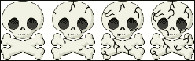

图 7：这是我的四个`skull.png`副本，显示了增加的伤害。它们分别命名为 skull.png、skull1.png、skull2.png 和 skull3.png。

目前，我们的`Avatar`类中的`act()`方法如下所示：

```java
public void act() {
  followMouse();
  checkForCollisions();
}
```

我们将修改`checkForCollisions()`函数的实现，以处理我们的英雄拥有生命并看起来受损的情况。目前的代码片段如下所示：

```java
private void checkForCollisions() {
  Actor enemy = getOneIntersectingObject(Enemy.class);
  if( enemy != null ) {
    getWorld().removeObject(this);
    Greenfoot.stop();
  }
}
```

我们需要将其更改为：

```java
private void checkForCollisions() {
  Actor enemy = getOneIntersectingObject(Enemy.class);
  if( hitDelay == 0 && enemy != null ) {
    if( health == 0 ) {
      AvoiderWorld world = (AvoiderWorld) getWorld();
      world.endGame();
    }
    else {
      health--;
      setImage("skull" + ++nextImage + ".png"););
      hitDelay = 50;
    }
  }
  if( hitDelay > 0 ) hitDelay--;
}
```

如我们所见，我们添加了相当多的代码。第一个`if`语句检查在受到敌人伤害之前需要满足的两个条件：首先，自上次我们受到敌人伤害以来已经过去了足够的时间，其次，我们现在正在接触`Enemy`类的一个实例。当英雄接触到敌人并受到伤害时，我们希望给我们的英雄一段短暂的不可伤害时间，以便移动，而不会在每次调用`act()`方法时继续受到伤害。如果我们不这样做，英雄会在你眨眼之前受到四次打击。我们使用`hitDelay`整型变量来计算等待时间。如果我们已经受到打击，我们将`hitDelay`设置为`50`，如内层`if-else`语句的`else`部分所示。函数中的最后一个`if`语句继续递减`hitDelay`。当`hitDelay`减到`0`时，我们可以被敌人击中，并且不再递减`hitDelay`。

### 注意

**Java 增量与递减运算符**

在最后一段代码中，我们大量使用了 Java 的增量（`++`）和递减（`--`）运算符。它们简单地分别从它们应用的变量中加一或减一。然而，在使用它们时有一些微妙之处需要你注意。看看以下代码：

```java
int x = 0, y=0, z=0;
y = ++x;
z = x++;
```

注意，增量运算符可以应用于变量之前（前缀）或之后（后缀）。在这段代码完成后，`x`是`2`，`y`是`1`，`z`是`1`。你可能惊讶`z`是`1`而不是`2`。原因是后缀增量运算符将在变量递增之前返回变量的值。有关更多信息，请参阅以下链接：

[`docs.oracle.com/javase/tutorial/java/nutsandbolts/op1.html`](http://docs.oracle.com/javase/tutorial/java/nutsandbolts/op1.html)

在内层`if-else`语句中，我们知道我们已经受到敌人的打击。我们检查我们的`health`是否为`0`；如果是，我们就死了，游戏就像以前一样结束。如果我们还有`health`，我们就减少我们的`health`，更改我们的图像，并设置`hitDelay`。

我们将图像更改为下一个更损坏的图像的方式是基于我们之前如何命名文件。我们通过将`skull`字符串与一个整数连接，然后再与`.png`字符串连接来构建文件名。这种方法为我们提供了一种简短且易于程序化的更改图像的方法。另一种选择是使用`switch`语句，根据`health`的值调用带有不同文件名的`setImage()`。在我们的新版本`checkForCollisions()`中，我们使用了两个新的实例变量；我们仍然需要声明和初始化这些变量。在添加本节开头添加的`health`变量下方添加这些行：

```java
private int hitDelay = 0;
private int nextImage = 0;
```

现在，编译你的场景并验证你的英雄需要受到四次攻击才能死亡。

### 小贴士

`hitDelay`变量是延迟变量的一个好例子。在本书的其余部分，我们将使用延迟变量来计时各种活动。在继续之前，请确保你理解我们如何使用`hitDelay`。

## 随机动作

随机动作是模拟简单智能或自然现象的最有效方法之一。它以不可预测的方式重复动作，并为游戏增添了悬念和挑战。我们已经在随机生成英雄需要躲避的敌人流。我们现在将使用它们来改进我们的星系动画。

### 闪烁

星星已经看起来很棒，并为游戏提供了真正的运动感。我们将通过让它们像真正的星星一样闪烁来增强它们。为此，我们使用`setTransparency()`方法使星星完全*透明*，并使用延迟变量等待一段时间后再将星星再次变得不透明。我们将使用 Greenfoot 的随机数生成器来确保星星的闪烁不频繁。首先，我们在`Star`类的`act()`方法中添加一个方法调用`checkTwinkle()`：

```java
public void act() {
  setLocation(getX(), getY()+speed);
  checkRemove();
  checkTwinkle();
}
```

我们需要在`speed`变量声明下添加以下延迟变量以及用于存储对象顶部当前透明度的变量：

```java
int twinkleTime = 0;
int currentTransparency = 0;
```

以下是对`checkTwinkle()`的实现：

```java
private void checkTwinkle() {
  GreenfootImage img = getImage();
  if( twinkleTime > 0 ) {
    if( twinkleTime == 1) {
      img.setTransparency(currentTransparency);
    }
    twinkleTime--;
  } else {
    if( Greenfoot.getRandomNumber(10000) < 10) {
      twinkleTime = 10;
      currentTransparency = img.getTransparency();
      img.setTransparency(0);
    }
  }
}
```

让我们看看外部`if-else`语句的`else`部分。以很小的随机概率，我们将`twinkleTime`（我们的延迟变量）设置为`10`，保存星星当前透明度以便稍后恢复，然后将透明度设置为`0`。

初始`if-else`语句的`if`部分，如果`twinkleTime`大于`0`，则递减`twinkleTime`，当`twinkleTime`等于`1`时恢复我们星星的透明度。因为`twinkleTime`只设置为`10`，所以星星将只在极短的时间内不可见。这种短暂的闪烁给人一种星星闪烁的错觉。

编译并运行场景，看看你是否能捕捉到星星的闪烁。如果你在验证这一点上有困难，请改变闪烁发生的频率并再次尝试。

## 触发事件

当某个事件发生时触发演员的变化是另一种动画方式。例如，你可能有一个敌人演员，只有当你进入一定范围内时，它才会追逐你。你也可能有一个演员对键盘事件或位置做出响应。

在本节中，我们将给我们的英雄添加眼睛。显然，我们的英雄非常关心附近的敌人，肯定想密切关注他们。

### 小贴士

给演员添加动画眼睛是赋予该演员个性的一种极好的方式。眼睛非常富有表情，可以轻松地表达兴奋、悲伤或恐惧。不要犹豫，添加动画眼睛。

### 添加眼睛

这可能看起来有点奇怪，但我们将创建一个单独的 `Eye` 角色演员。我们这样做有几个原因。首先，要让眼睛四处看需要相当多的代码。我们可以将这段代码封装在 `Eye` 类中，并使我们的 `Avatar` 类更加简洁。其次，将眼睛作为独立的实体意味着我们可以将它们添加到未来的演员中，即使我们改变了 `Avatar` 类的图像，它们仍然可以正常工作。

另一种选择是为我们想要看的每个方向创建一个带有眼睛的头骨图像。我们为英雄创建不同图像以显示不同等级的伤害的事实将进一步复杂化问题。因此，我们将创建一个单独的 `Eye` 角色演员。

创建一个新的 `Actor` 子类，命名为 `Eye`。不要将图像与这个 `Actor` 类关联。我们将动态绘制一个眼睛的图像，并在需要朝不同方向看时适当地重新绘制它。以下是 `Eye` 类的实现：

```java
import greenfoot.*; 
import java.awt.Color;
import java.util.List;

public class Eye extends Actor {

  public Eye() {
    drawEye(2,2);
  }

  public void act() {
    lookAtEnemies();
  }

  public void lookAtEnemies() {
    List<Enemy> eList = getObjectsInRange(120, Enemy.class);
    if( !eList.isEmpty() ) {
      Enemy e = eList.get(0);
      if( e.getX() < getX() ) {
        if( e.getY() < getY() ) {
          drawEye(1,1);
        } else {
          drawEye(1,3);
        }
      } else {
        if( e.getY() < getY() ) {
          drawEye(3,1);
        } else {
          drawEye(3,3);
        }
      }
    }
  }

  private void drawEye(int dx, int dy) {
    GreenfootImage img = new GreenfootImage(10,10);
    img.setColor(Color.white);
    img.fillOval(0,0,10,10);
    img.setColor(Color.black);
    img.fillOval(dx,dy,6,6);
    setImage(img);
  }
}
```

这个类的主要有两个方法：`drawEye()` 方法和 `lookAtEnemies()` 方法。`drawEye()` 图像使用与我们在 `Star` 类中绘制星星图像相同的方法来绘制眼睛。对于眼睛，我们只需要绘制一个额外的黑色圆圈作为瞳孔。`drawEye()` 方法接受两个整数参数，提供瞳孔在眼睛中的位置。`fillOval()` 的偏移部分在 *图 3* 中进行了演示。总结来说，第一个 `fillOval()` 命令绘制了眼睛较大的白色部分，第二个 `fillOval()` 命令在给定的偏移量处绘制了小的黑色瞳孔，以模拟朝某个方向注视。

`lookAtEnemies()` 方法会在眼睛给定距离内找到所有敌人，并使用 `drawEye()` 方法注视它找到的第一个敌人。通过使用 `if` 语句比较敌人的 *x* 和 *y* 位置与自己的位置，眼睛将敌人分类为四个象限之一：左上，左下，右上和右下。利用这些信息，`drawEye()` 方法分别使用整数参数 `(1,1)`，`(1,3)`，`(3,1)` 和 `(3,3)` 被调用。*图 8* 展示了敌人所在的象限与 `drawEye()` 调用之间的相关性。

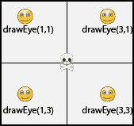

图 8：这显示了敌人位置与调用 `drawEye()` 的映射

在 `lookAtEnemies()` 中，我们使用了一种新的碰撞检测方法，称为 `getObjectsInRange()`。此方法与 `getOneIntersectingObject()` 有两种不同之处。首先，它不是使用调用 `Actor` 类的边界框来确定是否发生碰撞，而是在调用 `Actor` 类周围绘制一个半径由 `getObjectsInRange()` 的第一个参数定义的圆。此方法返回该圆中找到的所有敌人，而不仅仅是单个敌人。敌人以 Java `List` 数组的形式返回。在 `Eye` 类的顶部，我们需要包含 `import java.util.List;` 代码以使用 `List` 数据类型。我们一次只能盯着一个敌人，所以我们选择使用 `get()` 方法并传递整数值 `0` 来访问列表中的第一个敌人。以下是 Greenfoot 关于 `getObjectsInRange()` 的文档：

```java
protected java.util.List getObjectsInRange(int radius, java.lang.Class cls)
```

上一行代码返回围绕此对象半径为 `radius` 的所有对象。一个对象如果在范围内，意味着其中心与该对象中心的距离小于或等于 `radius`。

`getObjectsInRange()` 方法的参数描述如下：

+   `radius`：这是圆的半径（以单元格为单位）

+   `cls`：这是要查找的对象的类（传递 `null` 将查找所有对象）

### 给我们的英雄赋予视力

现在我们有一个名为 `Eye` 的 `Actor` 类，我们只需要对 `Avatar` 类进行一些修改，以便为我们的英雄添加眼睛。我们需要创建两个眼睛，将它们放在我们的英雄身上，然后我们需要确保每次我们的英雄移动时眼睛都保持在原位。我们首先向 `Avatar` 类添加实例变量：

```java
private Eye leftEye;
private Eye rightEye;
```

然后我们通过添加此方法在头骨图像上创建并放置这些眼睛：

```java
protected void addedToWorld(World w) {
  leftEye = new Eye();
  rightEye = new Eye();
  w.addObject(leftEye, getX()-10, getY()-8);
  w.addObject(rightEye, getX()+10, getY()-8);
}
```

初始时，你可能认为我们可以在 `Avatar` 类的构造方法中创建眼睛并添加它们。通常，这会是运行一次的代码的理想位置。问题是，在我们可以将眼睛添加到世界中之前，`Avatar` 类的实例需要存在于一个世界中。如果我们查看 `AvoiderWorld` 中的代码，添加我们的英雄，我们会看到这个：

```java
Avatar avatar = new Avatar();
addObject(avatar, 287, 232);
```

我们英雄的创建是一个两步的过程。首先，创建`Avatar`类的一个实例（第一行），然后我们将这个实例添加到世界中（第二行）。注意，构造函数在对象放置到世界中之前运行，所以我们不能通过`getWorld()`方法访问我们所在的世界实例。Greenfoot 的开发者意识到一些角色将需要访问它们所在的世界以完成初始化，因此他们在`Actor`类中添加了`addedToWorld()`方法。当初始化需要访问世界时，`Actor`类会重写此方法，并且每当一个角色被添加到世界中时，Greenfoot 都会调用它。我们在`Avatar`类中使用此方法来将眼睛放置在我们的英雄身上。

我们现在已经创建了眼睛并将它们添加到了我们的英雄身上。现在，我们只需要确保眼睛在英雄移动时始终伴随着它。为此，我们在`Avatar`类的`followMouse()`函数中添加以下几行代码：

```java
leftEye.setLocation(getX()-10, getY()-8);
rightEye.setLocation(getX()+10, getY()-8);
```

以下代码添加在以下代码行之后：

```java
setLocation(mi.getX(), mi.getY());
```

为什么`setLocation()`调用中的 10s 和 8s 会对应`leftEye`和`rightEye`？这些是正确放置眼睛在英雄眼窝中的值。我是通过试错法确定这些值的。*图 9*展示了详细信息。

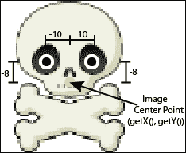

图 9：展示了眼睛位置是如何确定的

现在是时候享受乐趣了。编译并运行你的游戏，享受你的劳动成果。你的游戏应该看起来像*图 10*中所示的截图。

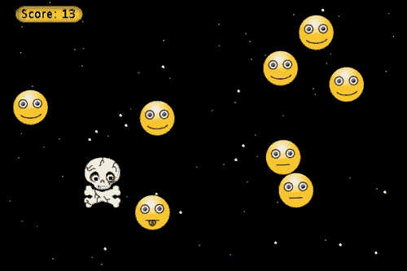

图 10：我们的游戏有动画敌人、移动的背景星系（带有闪烁）以及当被击中时视觉上会变化的英雄

# 缓动

在本章的最后一个大节中，我们将探讨使用缓动方程以有趣的方式移动我们的角色。缓动函数使用缓动方程来计算作为时间函数的位置。几乎你见过的每一个网页、移动设备或电影中的动画，在某个时间点都使用了缓动。我们将在游戏中添加三个新的角色，它们根据三种不同的缓动函数移动：线性、指数和正弦。

## 加速和减速

加速是添加新挑战和平衡玩家技能的绝佳方式。加速为玩家提供速度、力量、健康或其他与游戏相关的技能的短暂提升。它们通常随机出现，可能不在最方便的位置，因此需要玩家快速做出实时决策，权衡移动到加速器与它的有益效果之间的风险。

同样，我们可以创建随机出现的游戏对象，这些对象会负面影响玩家的表现。我称这些为*减弱效果*。它们也要求玩家做出快速、实时的决策，但现在他们需要在避开它们和保持当前轨迹并承受负面影响之间做出选择。

我们将在游戏中添加两个新的角色作为减弱效果，以及一个新角色作为增强效果。所有这三个角色都将使用缓动进行移动。我们首先介绍一个新的`Actor`类，它将包含所有关于缓动和作为增强或减弱效果的公共代码。我们的增强和减弱效果将从这个类继承。使用继承和多态来编写简洁、灵活和可维护的代码是良好的面向对象编程实践。

### 基类

为我们的增强效果创建一个经过深思熟虑的基类将提供轻松创建新增强效果和增强现有效果的途径。在我们讨论新类的代码之前，我们需要将一个新的 Greenfoot 提供的类导入到我们的项目中，就像我们在第一章中导入`Counter`类一样，*让我们直接进入…*。我们将导入的类是`SmoothMover`。我们需要这个类，因为它更准确地跟踪`Actor`的位置。以下是其文档的摘录：

```java
public abstract class SmoothMover extends greenfoot.Actor

A variation of an actor that maintains a precise location (using doubles for the co-ordinates instead of ints). This allows small precise movements (e.g. movements of 1 pixel or less) that do not lose precision.
```

要导入这个类，请点击 Greenfoot 主菜单中的**编辑**，然后在出现的下拉菜单中点击**导入类…**。在随后出现的**导入类**窗口中，在左侧选择`SmoothMover`，然后点击**导入**按钮。

现在我们已经在项目中有了`SmoothMover`，我们可以创建`PowerItems`类。右键点击`SmoothMover`并选择**新建子类…**。您不需要为此类关联图像，因此在**场景图像**部分选择**无图像**。

让我们来看看`PowerItems`（我们为增强和减弱效果而创建的新基类）的实现：

```java
import greenfoot.*;

public abstract class PowerItems extends SmoothMover
{
  protected double targetX, targetY, expireTime;
  protected double origX, origY;
  protected double duration;
  protected int counter;

  public PowerItems( int tX, int tY, int eT ) {
    targetX = tX;
    targetY = tY;
    expireTime = eT;
    counter = 0;
    duration = expireTime;
  }

  protected void addedToWorld(World w) {
    origX = getX();
    origY = getY();
  }

  public void act() {
    easing();
    checkHitAvatar();
    checkExpire();
  }

  protected abstract double curveX(double f);

  protected abstract double curveY(double f);

  protected abstract void checkHitAvatar();

  protected void easing() {
    double fX = ++counter/duration;
    double fY = counter/duration;
    fX = curveX(fX);
    fY = curveY(fY);
    setLocation((targetX * fX) + (origX * (1-fX)),
    (targetY * fY) + (origY * (1-fY)));
  }

  private void checkExpire() {
    if( expireTime-- < 0 ) {
      World w = getWorld();
      if( w != null ) w.removeObject(this);
    }
  }
}
```

我们首先需要讨论这个类的所有实例变量。共有七个。其中两个用于跟踪起始坐标（`origX`和`origY`），另外两个用于跟踪结束坐标（`targetX`和`targetY`）。实例变量`expireTime`指定这个演员在移除自己之前应该执行多少次`act()`方法的调用。换句话说，它指定了演员的生命周期。`duration`实例变量简单地保存`expireTime`的初始值。`expireTime`变量会不断递减，直到达到 0，但我们需要知道其原始值用于缓动方程。`counter`变量记录这个演员移动了多少次。*图 11*展示了这些变量的图形表示。

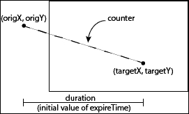

图 11：此图以图形方式展示了 PowerItems 中实例变量的含义

实例变量在构造函数中初始化，除了`origX`和`origY`，它们在`addedToWorld()`方法中初始化（该方法在本章前面已经讨论过），这样我们就可以将它们设置为 actor 当前的*x*和*y*位置。

由于我们明智地使用了功能分解，`act()`方法很容易理解。首先，它通过调用`easing()`来移动 actor。接下来，调用`checkHitAvatar()`来查看它是否与我们的英雄发生了碰撞。这个方法是`abstract`的，这意味着它的实现留给这个类的子类。这样做是因为每个子类都希望在它们发生碰撞时对我们的英雄应用其独特的效果。最后，它检查`act()`方法是否被调用`expireTime`次。如果是这样，`PowerItem`已经达到了其期望的生命周期，是时候移除它了。我们将在下一节讨论`easing()`、`checkHitAvatar()`和`checkExpire()`的具体实现。

`easing()`方法实际上是这个类的关键方法。它包含了一个缓动方程的通用形式，足够灵活，允许我们定义许多不同类型的有趣运动。该方法将 actor 移动到起点和终点之间的一定比例的位置。它首先计算在当前时间点，我们需要在*x*方向上从原始值到目标值之间移动的距离的百分比，以及*y*方向上的类似计算，并将这些值分别保存在局部变量`fX`和`fY`中。接下来，我们使用`curveX()`和`curveY()`函数来操纵这些百分比，然后我们使用这些百分比在调用`setLocation()`时。与`checkHitAvatar()`一样，`curveX()`和`curveY()`也是`abstract`的，因为它们的细节取决于从`PowerItems`派生的类。我们将在下一节讨论`abstract`方法`checkHitAvatar()`、`curveX()`和`curveY()`，并提供一个详细的示例。

在此之前，让我们快速看一下`PowerItems`的`act()`方法中的最后一个方法。最后一个方法`checkExpire()`，当`expireTime`达到 0 时，简单地移除 actor。

### 注意

**抽象类**

抽象类是共享几个相关类之间代码和实例变量的有效方式。在抽象类中，你可以实现尽可能多的代码，而不需要包含在子类（子类）中的特定知识。对我们来说，`PowerItems`类是一个抽象类，它包含了我们所有增强和减弱的通用代码。有关抽象类的更多信息，请访问[`docs.oracle.com/javase/tutorial/java/IandI/abstract.html`](http://docs.oracle.com/javase/tutorial/java/IandI/abstract.html)。

### 线性缓动

我们将要添加到游戏中的第一个减权是如果被触摸会暂时使我们的英雄昏迷。遵循我们游戏的主题，其中好事（笑脸）是坏事，我们将我们的新减权设计成一个蛋糕。要创建我们的新`Actor`，在 Greenfoot 主场景窗口的**Actor 类**部分右键点击`PowerItems`，并从出现的菜单中选择**新建子类…**。将类命名为`Cupcake`，并选择位于**食物**类别的松饼（对我来说它看起来像蛋糕！）图片。

在编辑器窗口中打开`Cupcake`类，使其看起来像这样：

```java
import greenfoot.*;

public class Cupcake extends PowerItems
{  
  public Cupcake( int tX, int tY, int eT) {
    super(tX, tY, eT);
  }

  protected double curveX(double f) {
    return f;
  }

  protected double curveY(double f) {
    return f;
  }

  protected void checkHitAvatar() {
    Avatar a = (Avatar) getOneIntersectingObject(Avatar.class);
    if( a != null ) {
      a.stun();
      getWorld().removeObject(this);
    }
  }
}
```

因为我们从`PowerItems`的代码中继承，`Cupcake`相当简短和简洁。这个类的构造函数仅仅将其参数传递给`PowerItems`中的构造函数。由于`PowerItems`是一个抽象类，我们需要在这里实现`PowerItems`中的抽象方法（`curveX()`、`curveY()`和`checkHitAvatar()`）。

`Cupcake`类将成为我们线性缓动的例子。它将从起始位置以恒定的线性步骤移动到结束位置。因为它线性，我们的`curveX()`和`curveY()`方法非常简单。它们根本不改变输入参数。

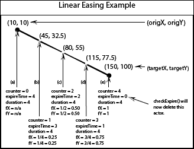

图 12：这是一个展示 Cupcake 类实例如何在屏幕上线性移动的例子

让我们看看*图 12*中展示的例子。在这个例子中，`Cupcake`被调用到目标位置**（150, 100**）并且设置了过期时间`4`，并被添加到位置**（10,10**）的世界中。位置**（a**）显示了对象的初始值。位置**（b**）、**（c**）、**（d**）和**（e**）分别显示了在`act()`方法调用一次、两次、三次和四次后与对象关联的值。正如我们所见，这个演员沿着直线移动。为了更好地理解线性缓动，让我们讨论一下为什么在位置**（b**）的值是这样的。在初始化（在位置**（a**）显示）之后，`act()`方法中的函数（从`PowerItems`继承而来）被调用。`easing()`方法将`counter`设置为 1，然后将`fX`和`fY`设置为 0.25，如以下代码所示：

```java
double fX = ++counter/duration; // counter is incremented to 1 
double fy= counter/duration;  // counter remains 1
```

`Cupcake`中的`curveX()`和`curveY()`方法不改变`fX`和`fY`。对于给定的值，`setLocation()`的第一个参数的第一个参数值为 45 *((150 * 0.25) + (10 * 0.75))*，第二个参数值为 32.5 *((100*0.25) + (10 * 0.75))*。

在`easing()`之后，`act()`方法中接下来调用的方法是`checkHitAvatar()`。这个方法简单地调用`Avatar`（我们的英雄）实例上的`stun()`方法，如果与之碰撞。`stun()`方法将在所有加权和减权讨论之后展示。此时，我们将展示对`Avatar`类所需的所有更改。

### 指数缓动

现在我们已经讨论了大多数关于能力提升和能力降低的理论，我们可以快速讨论剩下的。接下来我们要添加的是一种能力提升。它将从英雄承受的部分伤害中恢复。考虑到我们游戏的主题，这个有益的演员看起来必须很糟糕。我们将它做成一块石头。

要创建我们的新`Actor`类，在 Greenfoot 主场景窗口的**演员类**部分右键点击`PowerItems`，然后从出现的菜单中选择**新建子类…**。将类命名为`Rock`，并选择位于**自然**类别的`rock.png`图片。

在编辑器窗口中打开`Rock`类，并将其更改为如下所示：

```java
import greenfoot.*;

public class Rock extends PowerItems
{

  public Rock( int tX, int tY, int eT ) {
    super(tX, tY, eT);
  }

  protected double curveX(double f) {
    return f; 
}

  protected double curveY(double f) {
    return f * f * f; 
}

  protected void checkHitAvatar() {
    Avatar a = (Avatar) getOneIntersectingObject(Avatar.class);
    if( a != null ) {
      a.addHealth();
      getWorld().removeObject(this);
    }
  }
}
```

`Cupcake`类和`Rock`类之间的两个主要区别是`curveY()`的实现以及`checkHitAvatar()`调用`addHealth()`而不是`stun()`。我们将在稍后描述`addHealth()`，如前所述。`curveY()`的变化给这个演员一个曲线方向，通过立方它所给的值。这种效果在*图 13*的示例中得到了展示。比较每个位置的*y*位置的变化。*y*值呈指数增长。首先，它只移动 1.4 像素（从位置**(a**)到位置**(b**)），最后，大约跳过 52 像素（从位置**(d**)到位置**(e**)）。

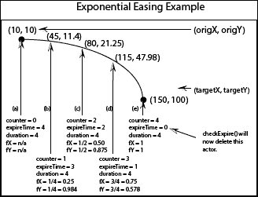

图 13：这是一个示例，展示了 Rock 类的实例如何在屏幕的 y 方向上以指数方式移动

### 正弦曲线

我们即将添加的最后一种能力是`Clover`。它将暂时减慢我们的英雄速度，并使用*正弦曲线*。要创建这个类，在 Greenfoot 主场景窗口的**演员类**部分右键点击`PowerItems`，然后从出现的菜单中选择**新建子类…**。将类命名为`Clover`，并选择位于**自然**类别的`shamrock`图片。在编辑器窗口中打开它，并将其更改为如下所示：

```java
import greenfoot.*;
import java.lang.Math;

public class Clover extends PowerItems
{
  public Clover(int tX, int tY, int eT) {
    super(tX, tY, eT);
  }

  protected double curveX(double f) {
    return f;
  }

  protected double curveY(double f) {
    return Math.sin(4*f);
  }

  protected void checkHitAvatar() {
    Avatar a = (Avatar)
    getOneIntersectingObject(Avatar.class);
    if( a != null ) {
      a.lagControls();
      getWorld().removeObject(this);
    }
  }
}
```

与`Rock`类一样，`Clover`类在其`curveY()`方法中执行一些独特的事情。它在类顶部导入 Java 的数学库，并在`curveY()`的实现中使用`Math.sin()`。这使得*y*运动像正弦波一样振荡。

在`Clover`中，`checkHitAvatar()`调用与`Avatar`类实例碰撞的`lagControls()`，而不是`stun()`或`addHealth()`。在下一节中，我们将实现`Avatar`类中的`stun()`、`addHealth()`和`lagControls()`。

### 对 Avatar 类的更改

为了适应我们新能力物品的效果，`Avatar`类需要实现一些方法并更改一些现有方法。这些方法是`stun()`、`addHealth()`和`lagControls()`。

### 小贴士

在继续本章之前，这里有一个额外的挑战。尝试自己实现这些方法。仔细思考每一个，并在纸上草拟它们。尝试这个的最坏情况是你会学到很多。

`stun()`和`lagControls()`的实现涉及添加延迟变量并使用它们来影响移动。在`Avatar`类中，所有移动都在`followMouse()`方法中处理。为了使我们的英雄昏迷，我们只需要暂时禁用`followMouse()`方法一小段时间。以下是修改此方法的步骤：

```java
private void followMouse() {
  MouseInfo mi = Greenfoot.getMouseInfo();
  if( stunDelay < 0 ) {
    if( mi != null ) {
      setLocation(mi.getX(), mi.getY());
      leftEye.setLocation(getX()-10, getY()-8);
      rightEye.setLocation(getX()+10, getY()-8);
    }
  } else {
    stunDelay--;
  }
}
```

我们还需要在类的顶部定义`stunDelay`实例变量：

```java
private int stunDelay = -1;
```

这遵循了我们在本章开头添加的实例变量`hitDelay`的使用模式。它是我们的延迟变量示例。现在，我们实现`stun()`：

```java
public void stun() {
  stunDelay = 50;
}
```

每次调用`stun()`时，`followMouse()`方法将无法工作 50 个周期（`act()`方法的调用次数）。

实现`lagControls()`的方式类似，除了我们需要暂时改变移动，而不是阻止它。再次，我们需要更改`followMouse()`方法：

```java
private void followMouse() {
  MouseInfo mi = Greenfoot.getMouseInfo();
  if( stunDelay < 0 ) {
    if( mi != null ) {
      if( lagDelay > 0 ) {
        int stepX = (mi.getX() - getX())/40;
        int stepY = (mi.getY() - getY())/40;
        setLocation(stepX + getX(), stepY + getY());
        --lagDelay;
      } else {
        setLocation(mi.getX(), mi.getY());
      }
      leftEye.setLocation(getX()-10, getY()-8);
      rightEye.setLocation(getX()+10, getY()-8);
    }
  } else {
    stunDelay--;
  }
}
```

让我们先添加实例变量`lagDelay`，然后讨论它在`followMouse()`中的使用。在类的顶部`stunDelay`下面添加此行：

```java
private int lagDelay = -1;
```

当`lagDelay`的值大于 0 时，它将实现延迟控制。在上面的方法内部`if-else`语句中，通过只将我们的英雄移动到鼠标位置的四分之一处来实现延迟。这使得我们的英雄缓慢地向鼠标位置爬行。延迟变量`lagDelay`递减，直到小于 0。它是如何变成大于 0 的？它是在`Clover`类调用的`lagControls()`方法中设置的。以下是该方法的代码：

```java
public void lagControls() {
  lagDelay = 150;
}
```

现在我们需要实现`addHealth()`方法。以下是代码：

```java
public void addHealth() {
  if( health < 3 ) {
    health++;
    if( --nextImage == 0 ) {
      setImage("skull.png");
    } else {
      setImage("skull" + nextImage + ".png");
    }
  }
}
```

此方法简单地撤销我们在击中敌人时发生的伤害。如果我们已经处于满血状态，则此方法不执行任何操作；否则，它增加`health`实例变量，减少`nextImage`，以便与我们要显示的图像保持同步，并将`Avatar`的图像设置为之前的、损坏较少的图像。非常酷！

我们对`Avatar`类进行了重大修改。以下是它的完整代码：

```java
import greenfoot.*;
public class Avatar extends Actor {
  private int health = 3;
  private int hitDelay = 0;
  private int stunDelay = -1;
  private int lagDelay = -1;
  private int nextImage = 0;
  private Eye leftEye;
  private Eye rightEye;

  protected void addedToWorld(World w) {
    leftEye = new Eye();
    rightEye = new Eye();
    w.addObject(leftEye, getX()-10, getY()-8);
    w.addObject(rightEye, getX()+10, getY()-8);
  }

  public void act() {
    followMouse();
    checkForCollisions();
  }

  public void addHealth() {
    if( health < 3 ) {
      health++;
      if( --nextImage == 0 ) {
        setImage("skull.png");
      } else {
        setImage("skull" + nextImage + ".png");
      }
    }
  }

  public void lagControls() {
    lagDelay = 150;
  }

  public void stun() {
    stunDelay = 50;
  }

  private void checkForCollisions() {
    Actor enemy = getOneIntersectingObject(Enemy.class);
    if( hitDelay == 0 && enemy != null ) {
      if( health == 0 ) {
        AvoiderWorld world = (AvoiderWorld) getWorld();
        world.endGame();
      }
      else {
        health--;
        setImage("skull" + ++nextImage + ".png");
        hitDelay = 50;
      }
    }
    if( hitDelay > 0 ) hitDelay--;
  }

  private void followMouse() {
    MouseInfo mi = Greenfoot.getMouseInfo();
    if( stunDelay < 0 ) {
      if( mi != null ) {
        if( lagDelay > 0 ) {
          int stepX = (mi.getX() - getX())/40;
          int stepY = (mi.getY() - getY())/40;
          setLocation(stepX + getX(), stepY + getY());
          --lagDelay;
        } else {
          setLocation(mi.getX(), mi.getY());
        }
        leftEye.setLocation(getX()-10, getY()-8);
        rightEye.setLocation(getX()+10, getY()-8);
      }
    } else {
      stunDelay--;
    }
  }
}
```

我们离尝试所有这些功能已经很近了。我们只需要在`AvoiderWorld`类中随机创建并添加能量提升和降低项。

### `AvoiderWorld`类的更改

我们需要在`AvoiderWorld`类的顶部创建三个新的实例变量，以指定我们用于生成我们的新能量物品的概率。在`nextLevel`的声明和初始化下面添加这些代码行：

```java
private int cupcakeFrequency = 10;
private int cloverFrequency = 10;
private int rockFrequency = 1;
```

初始时，这些物品的创建不会非常频繁，但我们将通过在`increaseLevel()`函数中增加它们来改变这一点。以下是代码：

```java
private void increaseLevel() {
  int score = scoreBoard.getValue();

  if( score > nextLevel ) {
    enemySpawnRate += 3;
    enemySpeed++;
    cupcakeFrequency += 3;
    cloverFrequency += 3;
    rockFrequency += 2;
    nextLevel += 50;
  }
}
```

在`act()`方法中，我们调用一个生成敌人的函数和另一个生成星星的函数。遵循这个模式，在`act()`方法中添加此行：

```java
generatePowerItems();
```

因为所有的能量物品类都继承自`PowerItems`，我们可以使用多态来编写一些相当简洁的代码。以下是`generatePowerItems()`的实现：

```java
private void generatePowerItems() {
  generatePowerItem(0, cupcakeFrequency); // new Cupcake
  generatePowerItem(1, cloverFrequency); // new Clover
  generatePowerItem(2, rockFrequency); // new Health
}
```

很好，我们可以使用一个方法来创建我们新的力量物品——`generatePowerItem()`。此方法接受一个整数，描述我们想要创建的力量物品类型，以及生成这些特定物品的频率。以下是实现：

```java
private void generatePowerItem(int type, int freq) {
  if( Greenfoot.getRandomNumber(1000) < freq ) {
    int targetX = Greenfoot.getRandomNumber(
    getWidth() -80) + 40;
    int targetY = Greenfoot.getRandomNumber(
    getHeight()/2) + 20;
    Actor a = createPowerItem(type, targetX, targetY, 100);
    if( Greenfoot.getRandomNumber(100) < 50) {
      addObject(a, getWidth() + 20,
      Greenfoot.getRandomNumber(getHeight()/2) + 30);
    } else {
      addObject(a, -20,
      Greenfoot.getRandomNumber(getHeight()/2) + 30);
    }
  }
}
```

此方法看起来很像我们其他生成演员的方法。它将在给定的随机速率下生成一个物品，并将这些物品放置在屏幕的左侧或右侧，向屏幕内部随机生成的位置移动。局部变量`targetX`将是屏幕上的任何有效*x*坐标，除了屏幕左右两侧的`40`像素宽的边界。我们只想确保它移动足够长，以便可以看到，并且对游戏有影响。变量`targetY`有稍微严格的约束。我们只想在屏幕上半部分生成*y*值，加上初始的`20`像素，以防止演员移动得太靠近屏幕顶部。内部的`if-else`语句只是简单地选择将对象放置在屏幕的左侧或右侧作为其初始位置。

与我们生成其他演员的方式相比，这里真正的区别在于对`createPowerItem()`的调用。由于我们使用此方法来生成三种任意一种力量物品，我们不能硬编码创建特定物品的过程，例如，`new Cupcake();`。我们使用`createPowerItem()`来创建与`generatePowerItems()`的类型参数匹配的正确对象。以下是`createPowerItem()`的实现：

```java
private Actor createPowerItem(int type, int targetX, int targetY, int expireTime) {
  switch(type) {
    case 0: return new Cupcake(targetX, targetY,
    expireTime);
    case 1: return new Clover(targetX, targetY,
    expireTime);
    case 2: return new Rock(targetX, targetY,
    expireTime);
  }
  return null;
}
```

此方法根据类型创建一个新的`Cupcake`、`Clover`或`Rock`力量物品。

我们真的为这个游戏添加了很多内容，现在是时候编译并测试它了。通常情况下，你不会在没有测试代码的小部分的情况下添加这么多代码。例如，我们本可以完全实现`Rock`力量提升并测试它，然后再添加其他力量物品。出于教学目的，我们继续这样做是有意义的。我希望你在编译代码时不会遇到太多的错误。通过有系统地检查你的代码与本章中的代码，并密切注意编译错误信息，你应该能够快速消除任何错误。

### 小贴士

如果你需要刷新一下 Java switch 语句的工作方式，请参考以下链接：

[`docs.oracle.com/javase/tutorial/java/nutsandbolts/switch.html`](http://docs.oracle.com/javase/tutorial/java/nutsandbolts/switch.html)

编译、调试和玩。这个游戏变得越来越好。查看我的*图 14*截图。

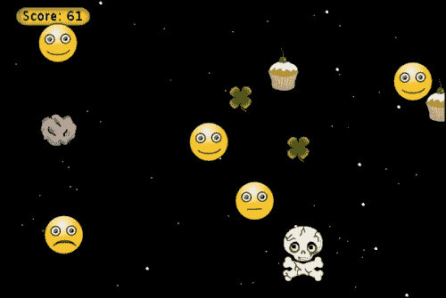

图 14：这是包含力量提升、力量降低和各种闪亮元素的完整避免者游戏

# 避免者游戏

我们的避免者游戏变得越来越完整，玩起来更有趣。在第五章《交互式应用设计理论》中，我们将探讨游戏设计理论，了解如何构建有趣且引人入胜的游戏。那时，我们将重新审视我们的游戏并提高其可玩性。

# 你的作业

当一个`Avatar`对象被击中时，它会在短时间内对再次被击中免疫。不幸的是，我们没有为玩家提供任何视觉反馈来指示这一事件的发生或何时结束。你的任务是让英雄在不能被击中时眨眼。查看`Star`类以获取如何使对象眨眼的提示。

# 摘要

在本章中，我们涵盖了大量的内容。你学习了几个重要的动画角色技术，包括图像交换、延迟变量、视差和缓动。我们的敌人、我们的英雄和背景都更加生动。你应该在创建游戏、模拟、动画镜头或教育应用时使用本章的所有技术。
