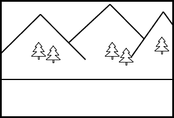
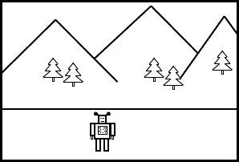
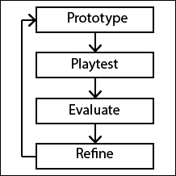
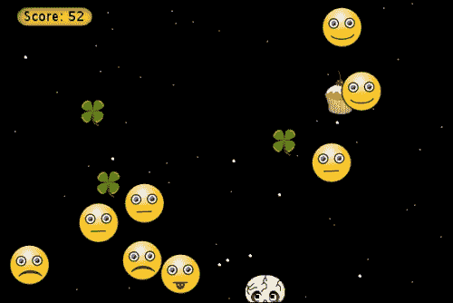
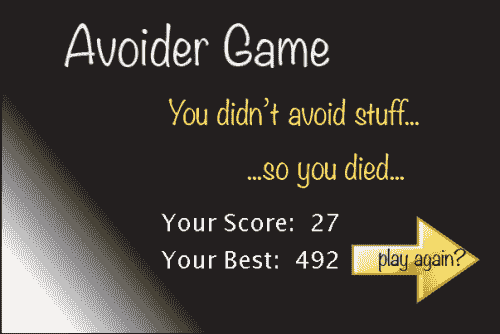
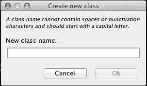
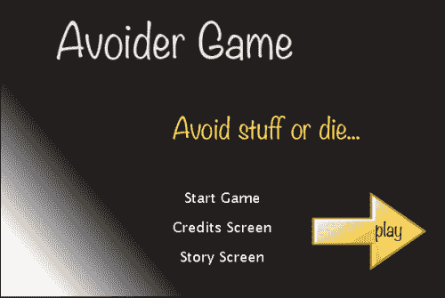
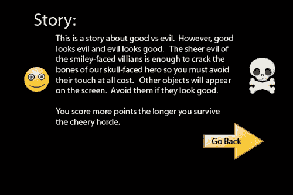
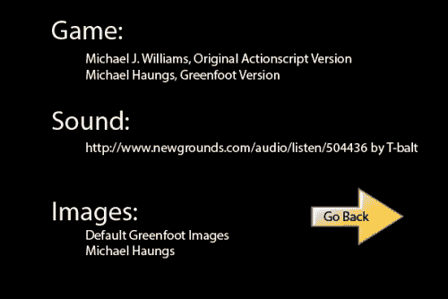
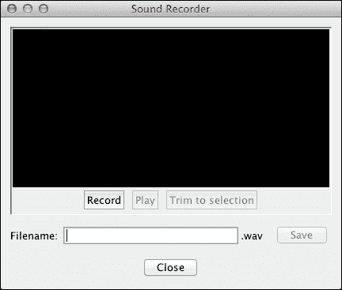

# 第五章。交互式应用程序设计与理论

|   | *"如果你从未做过，你应该。这些事情很有趣，有趣是好的。" |   |
| --- | --- | --- |
|   | --*苏斯博士* |

在 Greenfoot 中创建引人入胜和沉浸式的体验，远比将编程效果集合到一个应用程序中更具吸引力。在本章中，你将学习如何通过理解用户选择与结果之间的关系、对用户进行条件化以及将适当复杂度融入你的工作中来吸引用户。你将看到一个经过验证的迭代开发过程，这将帮助你将理论付诸实践。本章将涵盖以下主题：

+   有意义的游戏

    +   选择、行动和结果

    +   复杂度

    +   目标

+   用户条件化

+   讲故事

    +   虚拟世界

    +   叙事描述

+   交互娱乐迭代开发过程

当我们讨论本章的主题时，我们将参考我们在第一章，“让我们直接跳进去…”，以及第二章，“动画”中创建的 Avoider 游戏。我们将讨论游戏中已经实现的项目，以说明交互设计概念，并通过添加新功能来展示其他概念。在本章中，我们正在讨论创造乐趣的方法。这听起来可能有些奇怪，但创造乐趣是游戏和其他形式交互娱乐的设计师的主要目标。而且，正如苏斯博士如此优雅地所说，“这些事情很有趣，有趣是好的。”

# 有意义的游戏

学习创造对用户有意义的体验是交互应用程序开发者最需要的技能。正是这种交互的意义驱使玩家投入时间和精力来玩你的应用程序。我们希望唤起用户快乐、愤怒、自豪、放松、关心、惊讶、惊喜、兴奋或满足的感觉。为了做到这一点，*我们需要为用户做出的困难和行动提供即时和长期反馈*。

让我们看看一些可能发生在角色扮演游戏（RPG）中的澄清示例。想象一下，你是一位在森林覆盖的山脉中漫步的巫师，当你来到一个洞穴前。向洞穴里窥视，你在昏暗的光线中看到一条被宝藏包围的沉睡的龙。以下是一些可能发生的互动。我们将讨论每一个，并确定它是否创造了有意义的游戏。

**场景 1**:

+   **用户选择**：你翻阅你的咒语书，决定施展*火球*咒语。

+   **用户行动**：你对龙施展了咒语。

+   **系统反馈/结果**：火球击中了龙。之后没有发生任何事情。

啊？！？你的拼写失败了吗？游戏出故障了吗？龙有反魔法光环吗？你真的错过了吗？我们从这次交互中得不到任何意义。玩家感到困惑和脱节。让我们看看另一个场景。

**场景 2**:

+   **用户选择**：你翻阅你的咒语书，决定施放*火球*魔法。

+   **用户行为**：你对龙施放了魔法。

+   **系统反馈/结果**：火球击中了龙。龙痛苦地尖叫着，然后分解。

这里的意义非常明确。你对一个像龙这样强大的生物几乎无能为力，也没有机会。你可以选择和龙交谈，但他已经对你的存在表示极度的不满。你是要冒险还是逃跑？也许有一天，你会变得足够强大，回来从这条龙那里夺走宝藏。现在，你可能觉得自己很幸运，受到鼓舞想要变得更好，或者因为缺乏进展而感到害怕或沮丧。然而，你确实有所感受，这种互动确实是有意义的。

**情景 3**：

+   **用户选择**：你翻阅你的咒语书，决定施放*火球*魔法。

+   **用户行为**：你对龙施放了魔法。

+   **系统反馈/结果**：火球击中了龙。龙在痛苦中尖叫，然后分解。

啊，是时候收集你的战利品了。你对自己的至高无上力量感到惊叹。也许你应该给龙一次逃跑的机会？不，它可能不会为你这么做。这次互动再次证实了你的伟大。

创建引人入胜的应用程序的关键是时刻与用户产生有意义的互动。如果选择和行动没有有意义的后果，那么为什么还要让用户烦恼呢？*您交互式应用程序中的每一次互动都需要有意义*。这正是 Salen 和 Zimmerman 在他们所著的《游戏规则》一书中提到的*描述性有意义的游戏*。

您的应用程序中另一个非常重要的方面是用户行为的长期结果。例如，在情景 3 中，玩家可能会被称为游戏中的龙战士，之后在游戏中。用战利品购买的精美物品应该对游戏后期有用。*行为的结果需要在游戏中持续存在*。Salen 和 Zimmerman 将此称为*评估性有意义的游戏*。

有意义的游戏不仅适用于游戏。在设计任何应用程序时，都应该使用相同的思考过程。例如，如果用户点击了一个他们感兴趣想要购买的电子商务网站上的商品，应该立即有视觉反馈，比如购物车图标显示 1 而不是 0，或者更进一步，播放几秒钟欢呼的人群的声音。如果用户在文字处理文档中输入文字，文字处理应用程序应该突出显示保存图标，或者在文件名旁边放置星号，以表明有未保存的更改。如果一个人正在填写调查问卷，应该有一个进度条让他们知道他们还有多少问题需要回答。也许你可以在用户完成五个调查问题后提供一些鼓励的话语。

## 复杂性

有一个非常有趣的演示游戏，展示了当玩家的选择过于简单时，游戏会是什么样子。它被称为*超级 PSTW 动作 RPG*。在这个 RPG 中，你只有一个控制键——空格键。对于任何给定的情况，你只需简单地按空格键。如果你还没有猜到，标题中的 PSTW 代表**按空格键获胜**。

显然，这款游戏只是一个玩笑，但它也是游戏设计中的一个有趣实验。游戏中没有有意义的玩法，因为玩家必须做出的选择和行动都是微不足道的。动作和结果设计得很好，但这还不够。没有选择复杂性的话，就没有有意义的玩法。我们不必用这样一个极端的例子来证明这一点。你玩过“战争”牌戏吗？如果没有，你可以快速在这里回顾规则：[`en.wikipedia.org/wiki/War_(card_game)`](http://en.wikipedia.org/wiki/War_(card_game))。这款游戏也没有有意义的玩法。在整个游戏中，玩家要么翻一张牌，要么将三张牌面朝下放置，然后翻一张牌。当前的游戏状态完全告知玩家他们应该采取什么行动。没有需要考虑的权衡和风险分析。这完全是机械式的玩法。对于大多数 10 岁以上的玩家来说，井字棋也遭受了同样缺乏有意义的玩法的困扰。

为了存在有意义的玩法，玩家所做的决定应该需要足够的脑力劳动。玩家必须有几个选项可供选择，并且每个选项都应该涉及不同的权衡、风险和回报。例如，在我们的 RPG 场景中，玩家可能有以下选择：施放火球、施放闪电打击、施放魅惑怪物、交谈或逃跑。也许玩家在游戏中之前已经了解到，魅惑法术很少对龙有效，而且某些龙对火或闪电具有免疫力。玩家可以选择逃跑。这是一个低回报、低风险的选项。

当玩家做出非平凡的决定、采取行动并获得清晰的反馈时，游戏就变得有意义。在交互式应用程序或游戏中做出决策时，玩家需要知道互动的目标是什么。是要创建定制的音乐作品、成为最强大的巫师，还是在电子商务网站上获得最佳交易？设置用户目标是创建引人入胜的应用程序下一个最重要的方面。

## 目标

目标为玩家提供了评估他们在与你的应用程序的即时和长期互动中做出的决策的手段。每次互动后，用户可以问自己，“我的最后一个选择和行动是否让我更接近完成我的目标？”通过这种持续的评估，用户可以增强和优化他们的决策过程，以便更快地实现他们的目标。本质上，玩家使用目标作为指导，学习与你的应用程序互动的最佳方式。

在编写一个交互式应用程序时，你必须为你的用户设定清晰的目标和子目标。这就是为什么高分榜在许多游戏中如此受欢迎。仅仅拥有一个高分榜就为游戏提供了目标——尽可能多地得分。当人们玩你的游戏时，他们会不断判断他们上一次的行动或长期行动是否导致了最大数量的得分。这增强了游戏的趣味性。

在工业界，公司通常会尝试将他们的应用程序或服务游戏化。例如，航空业设立了赚取免费飞行里程的程序。因此，客户现在参与做出决策，以优化他们获得免费飞行里程的能力，以换取免费航班。在旅途中建立子目标以保持客户的投入往往是有意义的。如果需要一两年才能积累足够的免费飞行里程，那么消费者可能会感到沮丧。航空公司可能会决定提供中间目标，例如在达到一定数量的里程后，可以获得一个免费的旅行杯。子目标对于驱动短期行为非常重要，正如奖励一样。我们将在下一节进一步讨论用户条件化的方法。

# 用户条件化

在创建一个交互式应用程序或游戏时，我们希望用户体验尽可能好。在创造有意义的游戏时，我们为用户提供了一个丰富的选项集供他们选择，他们的游戏路径有许多可能的状态和结果。随着游戏状态的可能状态和转换增加，作为游戏设计师，确保每个游戏状态路径都导致积极的交互变得更加困难。我们需要使用用户条件化来帮助引导用户的行为，以可预测的方式与我们的应用程序互动。

条件化的效果在伊凡·巴甫洛夫的一个涉及狗和食物的实验中得到了清晰的展示。在这个实验中，巴甫洛夫每次喂狗时都会响铃。最终，他只需响铃就能让狗流口水。狗学会了将一个中性刺激，如铃声，与食物联系起来。虽然这样说我们想要像这样操纵我们的用户似乎很奇怪，但这将帮助我们引导用户进入与我们的应用程序最有利的交互。

我们将使用三种方法来条件化我们的用户：

+   **正强化**：当用户做出我们希望的行为时，给予用户奖励。

+   **负强化**：当用户做出期望的行为时，移除一些负面因素。

+   **惩罚**：当用户表现出错误行为时，移除一些正面因素或添加一些负面因素。

我们希望尊重我们的用户，并希望他们玩得开心；因此，积极的强化应该是我们最常用来训练用户的方式。我们希望奖励他们正确的表现。在游戏中，我们可能会给他们加分、额外生命、额外能力，或者进入游戏新区域的权限。无论是创建游戏还是交互式应用程序，你都应该为你的用户提供一套奖励计划。一些奖励可能会频繁发放，例如，通过消灭敌人获得积分，而其他奖励可能会更罕见，例如，给予角色飞行的能力。

给予奖励允许我们告诉玩家哪些行为在游戏中是被偏好的。如果我们希望用户尽可能快地通过一个区域，我们可以在 30 秒内完成时给予奖励。如果我们希望用户探索控制并找到战斗动作组合，我们可以在连续完成三次战斗组合时给予额外积分。如果我们希望用户采摘花朵，我们可以在每次采摘花朵时提供 0.001%的机会获得游戏中最强大的物品。如果我们希望顾客在商店更频繁地购买咖啡，我们可以每第十二杯饮料免费。奖励是一种强大的用户训练机制。

负面强化虽然使用较少，但仍然是一种强大的用户训练工具。在上一个段落中，我提到你可以通过给予玩家在 30 秒内通过某个区域的奖励来鼓励他们快速通过该区域。使用负面强化，我们可以驱动相同的行为。想象一下，你在一个非常大的房间里，天花板开始慢慢下降。你意识到如果你不快速离开，你将被压扁。通过快速移动到房间的另一边并离开，你就不再有这种快速移动的压力。这就是负面强化。负面强化的其他例子包括在一个区域中使灯光变暗并播放令人毛骨悚然的音乐，以鼓励玩家快速离开该区域（游戏《生化奇兵》在这方面做得很好），当玩家在不应出现的地方时发出警报，或者闪烁屏幕直到你的健康值回到可接受的水平。

最终，惩罚是游戏玩法的一个必要组成部分，尽管通常不包括在非游戏应用的游戏化中。最终必须对未能达到游戏目标的行为有硬性后果。这可能包括扣分、扣钱、失去生命，最终输掉游戏。惩罚是必要的，因为必须有一些风险与玩家所做的选择相关联，以便实现有意义的游戏体验。只是尽量不要对你的用户太苛刻。制作游戏的全部目的就是提供一个引人入胜、休闲的活动。

# 讲故事

从最早的时代起，讲述和欣赏故事就已经深深植根于我们的文化中。我们以许多不同的格式和媒介呈现故事。它们出现在口头传统、书面文字、戏剧、电影和游戏中。游戏是讲故事的新形式之一，但也许是因为一个简单的原因——你才是故事的主角。在传统的讲故事方法中，作者必须花费足够的时间构建一个受众关心的、可联系的角色。在游戏中，你无需付出任何代价就能得到这个角色。

## 虚构世界

在游戏中，故事除了纯粹的娱乐作用外，还有其他作用。故事为游戏玩家创造了一个虚构世界，有助于引导他们的体验。它为行动和实现目标提供背景和动机。为什么我们在游戏中要杀死这些外星人？好吧，鉴于他们刚刚摧毁了整个南美洲，正朝北方进发，我们知道如果世界要在这场入侵中生存下来，我们必须尽快阻止他们的前进。如果一个游戏发生在外太空，你期望看到宇宙飞船、激光和外星人。只要告诉玩家故事发生在老西部、水下或足球场上，就能向玩家提供大量信息。

对于任何游戏，你应该有一个丰富而完整的故事，涵盖游戏在玩家开始游戏之前、游戏过程中以及游戏之后发生的事情——即使用户永远不会体验到游戏之前和之后的事情。你的虚构世界和故事不仅为玩家提供背景和动机，还作为游戏设计师的指南。当你从游戏中添加或删除功能时，当你通过互动娱乐开发过程（在本节中描述）时，你需要确保你忠于这两者。 

## 叙述描述符

在你的游戏中，一切元素都为故事和你的虚构世界做出贡献——无论是游戏包装盒上的图形、说明书，还是游戏中的声音和图像。你希望通过提供适当且一致的叙述描述，让你的玩家想象出一个丰富而充满活力的世界。幸运的是，由于最小偏离原则，不需要太多提示就能让你的用户想象出一个复杂的世界。这个原则指出，人们会利用他们对世界的知识来填补他们在一个不完整的图像中看到的任何缺失。花几分钟时间看看*图 1*。你想象那些山里住着什么？这个世界有重力吗？你能对这个图中描绘的世界说些什么？无论你想到什么，你都是利用最小偏离原则做到的。



图 1：这是最小偏离原则的一个例子。

现在，请看看*图 2*。图片中添加了什么？这如何改变你对世界的看法？如果我在图片中添加一个穴居人而不是机器人会怎样？



图 2：这展示了单个叙事描述符如何完全改变虚构世界

就像在电影中一样，你游戏中或互动应用程序中出现的每一件事都应该延续故事。例如，如果你创建了一个中世纪时期的互动历史模拟，那么你应该使用符合该时期的字体，而不是使用 Courier New。如果你有一个发生在第一次世界大战的游戏，那么也许你可以在玩家受到更多伤害时，展示一个看起来更受伤的士兵图片，而不是展示一个普通的健康条。

### 注意

**迪士尼**

迪士尼提供了精彩的故事，并且是运用叙事描述符的大师。你有没有去过迪士尼乐园？我曾经有幸被迪士尼的想象工程师和艺术家带领参观迪士尼乐园。给我留下深刻印象的第一件事是，迪士尼的每位员工都背诵着同样的咒语，“故事，故事，故事”。我惊讶地发现，在参观过程中，我的导游不断地指出他们使用叙事描述符的方式。在不同的区域，他们会向我展示如何通过混凝土、植物、垃圾桶和照明等元素共同构建该区域的叙事。他们知道，任何一个位置不恰当的物品都可能会使顾客所想象的虚构世界变得混乱或被破坏。

# 互动娱乐迭代开发过程

本章迄今为止所讨论的所有设计原则都将帮助你创建有意义的、引人入胜的互动应用程序。然而，这些还不够。随着你继续设计和构建你的游戏，你会对游戏有更深入的了解，并失去作为无偏见评判者的能力。此外，你认为有趣和有意义的东西，可能对其他人来说会感到困惑。你必须意识到，如果你创建了一个具有足够复杂性的游戏，你将无法预测游戏玩法。

给你的应用程序提供最佳成功机会的唯一方法，就是使用*图 3*中所示的互动娱乐迭代开发方法进行开发。



图 3：这是互动娱乐迭代开发过程

接下来，我们将讨论为游戏构思一个初步想法以及你需要做的前期工作，以便制作一个有效的游戏提案。在游戏产业中，游戏开发者必须提出他们的游戏，并说服同行和管理层，这个游戏值得投资。如果你在一个小团队中工作，你仍然需要向希望招募加入你项目的开发者和艺术家提出游戏提案。在讨论前期工作之后，我们将依次讨论迭代设计过程的每个阶段。

## 游戏提案和初步设计

因此，你有一个想法，并且有建造游戏的愿望。接下来你应该做什么？你需要创建一个清晰简洁的方式来向他人描述你的游戏。你需要能够描述你正在创造的世界，这个世界的背景故事，游戏的主要目标，以及游戏规则的草稿。以下是创建这些信息的详细过程：

1.  用一段话描述你的游戏。尽量保持五句话或更少。要清晰、具体、简洁。随着你的游戏随着时间的推移而发展，确保更新这一段落。

1.  编写你游戏的剧情，包括游戏开始之前发生了什么，游戏过程中发生了什么，以及游戏结束后发生了什么。这将最终成为所有开发者、设计师和艺术家在考虑为游戏添加新功能和资产时参考的指南。同样，确保这份文档保持更新。

1.  用一句话说明游戏的目标。玩家试图实现什么？

1.  用一句话说明玩家如何知道他/她比另一个玩家更好。最好的玩家是得分最高的人吗？进度最远的人？用时最短的人？

1.  撰写游戏规则的草案。尽量提出至少五条主要规则。规则为你的游戏提供正式描述。每个游戏都有简洁的规则集。

1.  创建你游戏的分镜脚本。分镜脚本读起来像漫画书，描述了游戏的主要故事线和概念艺术。分镜是主要的设计工具，在游戏和电影行业中都得到广泛应用。

在创建这些信息后，确保将其保存在所有团队成员共享的中心位置，并在游戏发展过程中进行更新。当你不确定应该添加什么功能到游戏中，或者是否应该给故事增加一个转折时，查阅这些文档并确保一切保持一致。

## 原型

在这一步，你将实施在上一个迭代细化步骤中已经决定的一些游戏功能。如果你是第一次迭代，选择一些简单的事情来实现，比如主要角色、移动控制，也许还有一个敌人。这一步只包含编码，没有设计工作。那是在上一个迭代中完成的。

## 游戏测试

这种迭代开发过程鼓励基于游戏的设计。在基于游戏的设计中，你让志愿者测试你的游戏。他们评估它，不是基于你给出的描述，而是基于游戏的实际玩法。早期阶段将很简单，评估者可能只能评论控制是否自然或导航是否顺畅。随着游戏的发展，他们提供反馈的能力也会提高。

你的游戏测试会话应该定义明确且可重复。你想要确保每个测试者都有相同体验，以便你可以可靠地收集和比较他们的反馈。进行游戏测试时，你应该：

1.  准备一台可以玩到你游戏原型的电脑。

1.  向你的测试者简要解释游戏测试程序，然后简要描述你的游戏以及可供测试的功能。

1.  根据你想要在这一迭代中测试多少功能，让你的玩家玩 5-20 分钟。尽量不要打断你的测试者（即使你注意到他们做得非常不对），除非他们问你问题。提供简短的答案，但不要详细阐述。

1.  观察测试者的身体语言。他们看起来是否无聊？沮丧？投入？当他们告诉你他们的 10 分钟游戏时间结束时，他们是否在看着手表或感到惊讶？

1.  当你的测试者完成游戏后，给他们一份简短的调查问卷。询问他们关于游戏控制、规则、目标和故事的问题。询问他们是否觉得游戏的挑战性平衡。他们认为他们在每一刻都有足够的选项去考虑吗？游戏的外观和感觉是否一致？你选择的叙事描述符是否有效？他们是否曾经对下一步该做什么感到困惑？收集一些关于测试者的统计数据。他们多大年纪？他们是休闲玩家还是核心玩家？

1.  设定一个开放式的问答环节。他们是否有关于如何改进游戏的建议？有没有他们不喜欢的地方？

确保感谢你的测试者，并回顾你收集到的信息。这是你从测试者那里获取澄清的最后机会。完成所有这些后，你就可以进入下一阶段。

## 评估

评估阶段非常机械。在这个阶段，你只整理从所有测试者那里收到的结果。整理所有调查问卷的结果。是否对某些答案有共识？例如，80%的测试者觉得控制不灵活，或者 100%的玩家在杀死第一个敌人后不知道该做什么。在开放式的问答环节中，是否有多个测试者提出的建议？从身体语言观察中，是否大多数玩家在时间结束前就询问他们是否完成了测试？

## 精炼

真正的设计工作发生在这一阶段。挑选出在游戏测试过程中识别出的前两个或四个问题，并将它们记录下来。现在，头脑风暴一下你可以对游戏做出的改变、添加或删除，以解决这些问题。你的想法可能包括测试者给出的建议，也可能不包括。你并不一定要直接使用测试者给出的建议；然而，你应该给予它们特别的考虑。在头脑风暴的过程中，不要过滤你或你的队友的想法。在一张纸上，至少记录下你可以对游戏做出的二十种改变。

在头脑风暴了二十个想法之后，根据它们如何有效地解决你的测试玩家提出的前几个问题以及实现该想法所需的工作范围来优先排序。选择你前两个到五个想法，并在即将到来的原型阶段实现它们。这个过程再次开始。

## 优点

交互式娱乐迭代开发过程允许你以用户满意的方式逐步扩展你的游戏。通过快速迭代，你很快就能找到应该放弃的开发路径和应该开始的其他路径。虽然一开始可能看起来很耗时，但这个过程实际上会在长期内为你节省大量的开发时间，并大大增加你最终得到一个真正有趣的游戏的机会。

# 避免者游戏

在本书的前几章中，我们研究了避免者游戏，然后转向僵尸入侵模拟，接着是平台游戏。我们将回到避免者游戏，并使用它来展示本章前面讨论的概念。你可以从你自己的避免者游戏版本开始，或者下载这个版本：[`www.packtpub.com/support`](http://www.packtpub.com/support)

## 避免者游戏回顾

我们在第一章、“让我们直接进入…”和第二章、“动画”中创建的避免者游戏版本相当功能齐全。它有一个介绍屏幕、一个游戏结束屏幕、一个移动的星系背景、有趣的演员动画、得分、升级和降级。*图 4*显示了游戏的一个截图。



图 4：这是我们版本避免者游戏的一个快照

在接下来的几个部分中，我们将增强这个版本的避免者游戏。我们的改变将基于我们刚刚研究过的游戏设计原则。

## 高分排行榜

我们将要做的第一个改变是添加一个简单的机制来记录最高分。然后我们将把这个分数显示在游戏结束屏幕上，这样玩家就可以看到他们与其他玩家的相对位置。通过添加高分，我们清楚地确定了游戏的主要目标——得分最高。要添加高分，需要对`AvoiderGameOverWorld`类进行以下更改：

```java
import greenfoot.*;
import java.nio.*;
import java.nio.file.*;
import java.io.IOException;
import java.util.List;

public class AvoiderGameOverWorld extends World {
  public AvoiderGameOverWorld() {
    super(600, 400, 1);
  }

  public void act() {
    if( Greenfoot.mouseClicked(this) ) {
      AvoiderWorld world = new AvoiderWorld();
      Greenfoot.setWorld(world);
    }
  }

  public void setPlayerHighScore(String s) {
    Label scoreBoardMsg = new Label("Your Score: " + s, 35);
    Label highScoreMsg = new Label("Your Best: " + recordAndReturnHighScore(s), 35);
    addObject(scoreBoardMsg, getWidth()/2, getHeight()*2/3);
    addObject(highScoreMsg, getWidth()/2, (getHeight()*2/3)+45);
  }

  private String recordAndReturnHighScore(String s) {
    String hs = null;
    try {
      Path scoreFile = Paths.get("./scoreFile.txt");

      if( Files.exists(scoreFile) ) {
        byte[] bytes = Files.readAllBytes(scoreFile);
        hs = new String(bytes);

        if( Integer.parseInt(s) > Integer.parseInt(hs) ) {
          Files.write(scoreFile, s.getBytes());
          hs = s;
        }
      } else {
        Files.write(scoreFile, s.getBytes());
        hs = s;
      }

    } catch( IOException e ) {
      System.out.println("IOException");
    }

    return hs;
  }
}
```

构造函数和 `act()` 方法没有改变。我们添加了两个新的方法：`setPlayerHighScore()` 和 `recordAndReturnHighScore()`。`setPlayerHighScore()` 方法是公开的，将由 `AvoiderWorld` 调用，以 `String` 的形式传递当前玩家的分数到游戏结束屏幕。由于功能分解，这个方法相当简单。它创建了两个 `Label` 对象来显示玩家的分数和最高分，然后将这些对象添加到当前世界，即 `AvoiderGameOverWorld`。`Label` 类是新的，提供了一种轻松创建基于文本的图像的方法。我们很快就会查看它的代码。首先，我们将更仔细地查看 `recordAndReturnHighScore()` 方法，它包含检索和设置最高分的功能。

### 提示

`java.nio.file` 包要求您安装 Java 1.7 或更高版本。

`recordAndReturnHighScore()` 方法引入了文件 I/O。为了使最高分在您打开或关闭 Avoider Game 时都能持久保存，我们需要将最高分存储在文件中。文件提供持久存储。由于我们只存储或检索单个 `String`，我们可以使用一些非常简单的文件 I/O 操作。首先，我们调用 `Paths.get()` 静态函数。这提供了文件的位置。接下来，我们使用 `Files.exists()` 静态函数检查文件是否已存在。如果文件不存在，我们使用 `Files.write()` 创建并写入当前玩家的分数。

这个函数将创建文件并写入它，然后在返回之前关闭文件。如果文件确实存在，我们将使用 `Files.readAllBytes()` 读取其内容，这将打开文件，读取文件内容，关闭文件，然后返回它读取的数据。在这个方法中，我们需要做的最后一件事是查看当前玩家的分数是否高于当前最高分。如果是，我们将更新文件。`recordAndReturnHighScore()` 然后返回最高分，这将是读取自文件或当前玩家的分数。请注意我们添加的额外 `import` 语句，以便访问这些新的文件 I/O 类。

### 提示

Greenfoot 提供了另一种机制来存储和维护仅在您在 Greenfoot 网站上共享了您的游戏/应用程序后才能工作的最高分列表。要了解更多信息，请阅读 Greenfoot 在线文档中提供的 `UserInfo` 类。您可以在 [`www.greenfoot.org/files/javadoc/`](http://www.greenfoot.org/files/javadoc/) 访问该文档。要了解更多关于 Java 文件 I/O 的信息，请查看 [`docs.oracle.com/javase/tutorial/essential/io/index.html`](http://docs.oracle.com/javase/tutorial/essential/io/index.html) 上的教程。

现在，我们可以看看`Label`类的代码。`Label`类是我们将要创建的一个新类，用来帮助我们向游戏中添加文本。创建一个新的`Actor`子类，命名为`Label`。不要将图像与这个类关联。我们也会在本章的后面使用这个类。以下是代码：

```java
import greenfoot.*;
import java.awt.Color;

public class Label extends Actor
{
  GreenfootImage msg;

  public Label(String s, int size) {
    this(s, size, Color.white);
  }

  public Label(String s, int size, Color c) {
    msg = new GreenfootImage(s, size, c, null);
    setImage(msg);
  }
}
```

这个类很简单，只包含两个构造函数；第一个构造函数使用默认颜色白色调用第二个构造函数。在第二个构造函数中，提供的`String`被`GreenfootImage`转换成图像，然后这个图像被设置为`Label`实例的默认图像。

为了让所有这些功能正常工作，我们需要做的最后一个更改是在`AvoiderWorld`中添加代码，将玩家的当前分数传递给`AvoiderGameOverWorld`。我们只需要在`AvoiderWorld`中的`endGame()`方法中添加一行代码。以下是`endGame()`的完整实现：

```java
public void endGame() {
  bkgMusic.stop();
  AvoiderGameOverWorld go = new AvoiderGameOverWorld();
  go.setPlayerHighScore(Integer.toString(scoreBoard.getScore()));
  Greenfoot.setWorld(go);
}
```

在进行这些更改后，编译游戏以查找和修复在过程中发生的任何错误。玩玩看。你的最高分是多少？*图 5*展示了你的游戏结束屏幕现在应该看起来是什么样子。



图 5：添加了当前和最高分的游戏结束屏幕。

## 成就徽章

许多游戏和游戏化策略都使用了成就徽章的概念。这是你完成困难或非同寻常的事情后获得的徽章。在游戏和交互式应用程序中，它们是给玩家设定子目标以完成、调节他们的行为和增加选择复杂性的便捷且受欢迎的技术。我们将在我们的 Avoider 游戏版本中添加成就徽章来实现所有这些功能。

首先，我们需要想出一串成就列表。在实践中，想出正确的成就组合需要一些仔细的思考、时间和测试。以下是我想出的成就列表：

+   **神奇美味**：玩家必须击中 20 片三叶草。

    +   这个成就增加了玩家在每一刻可用的选择复杂性。他们敢冒险收集另一片三叶草并承受减速惩罚吗？

+   **火鸡**：玩家必须连续收集三个岩石。在这段时间内，用户不能触碰任何其他对象。

    +   这个成就条件使玩家即使在满血状态下也会去追击岩石。

+   **不可破坏**：玩家必须触摸敌人 10 次。

    +   这个成就增加了用户可用的选择复杂性，并在游戏的某些缓慢部分作为增加挑战的手段。在游戏中，你会遇到一些小段时间，你处于满血状态，没有立即被敌人击中的危险。在这些时期，玩家现在可以选择承受几次打击，以增加他们获得的**不可破坏**徽章数量。

+   **大师躲避者**：玩家在总共击中三个纸杯蛋糕之前完成游戏。

    +   这个成就强化了我们希望的行为。我们希望玩家不惜一切代价避免纸杯蛋糕。

这些成就也作为用户的潜在子目标。我们将在游戏结束屏幕上显示玩家获得的徽章，紧挨着主要目标——他们的分数。

在实现成就徽章时需要考虑的第一个问题是，确定是否获得徽章所需的数据。在我们的案例中，这些数据分布在`PowerItems`子类和`Avatar`之间。此外，`AvoiderGameOverWorld`类将需要知道哪些徽章被获得，以便它们可以在游戏结束屏幕上显示。我们希望有一个中心位置来收集这些信息。因为我们需要分布式访问单个类，我们将使用**单例**设计模式。

### 注意

**设计模式**

随着你对编程的熟练程度提高，你将在工作中认识到常见的编码模式。也许在你创建的下一个游戏中，你也会想要成就，并想，“我可以直接重用我在 Avoider 游戏版本中的成就设计。”本质上，你有一个非常小、个人的设计模式，你可以用它来创建可以随着时间的推移不断改进的成就。

自编程诞生以来，开发者们就创造了许多非常有用的设计模式，这些模式适用于许多不同类型的应用程序。设计模式提供了一种经过验证、测试的方法来编码某些功能，你可以轻松地将其适应自己的用途。

设计模式也非常有用去研究。通过研究它们，你可以看到一些最好的程序员如何使用抽象来解决复杂、重复的问题。它们还作为开发者之间有效沟通的简洁语言。说 Avoider 游戏中的`BadgeCenter`类实现了单例设计模式，比从头描述它要方便得多。

关于设计模式的书籍出版了很多，但最著名和最受欢迎的是由*Gamma 等人*撰写的《设计模式：可复用面向对象软件元素》。在你的开发生涯的某个阶段，你应该阅读这本书。

为了跟踪玩家的成就，我们将创建一个名为`BadgeCenter`的类，该类遵循单例设计模式。这个新类将不是`World`或`Actor`的子类。要创建它，请点击菜单栏中的**编辑**，然后选择**新建类**。你应该会看到*图 6*中显示的弹出窗口。输入`BadgeCenter`并按*Enter*键。我们现在准备好添加代码。



图 6：这是用于创建不是 Actor 或 World 子类的类的弹出窗口

这里是这个类的代码：

```java
import java.util.ArrayList;
import java.util.List;

public class BadgeCenter //Implemented as a Singleton
{
  private int clovers, rocks, enemies, cupcakes;
  int rockBadges;
  private String previous;
  private ArrayList<Badge> badges = new ArrayList<Badge>();
  private static final BadgeCenter INSTANCE = new BadgeCenter();

  private BadgeCenter() {
    clovers = rocks = enemies = cupcakes = 0;
    rockBadges = 0;
  }

  public static BadgeCenter getInstance() {
    return INSTANCE;
  }

  public void hitClover() {
    ++clovers;
    previous = "clover";
    if( clovers % 20 == 0 ) {
      if( clovers > 80 ) {
        awardBadge("Magically Delicious ");
      } else {
        awardBadge(clovers + " Clovers ");
      }
    }
  }

  public void hitRock() {
    if( previous != "rock" ) {
      rocks = 0;
    }
    ++rocks;
    previous = "rock";
    if( rocks > 2 ) {
      rockBadges++;
      rocks = 0;
    }
  }

  public void hitEnemy() {
    ++enemies;
    previous = "enemy";
    if( enemies % 10 == 0 ) {
      if( enemies > 60 ) {
        awardBadge( "Unbreakable " );
      } else {
        awardBadge("Hit " + enemies + " times ");
      }
    }
  }

  public void hitCupcake() {
    ++cupcakes; // Check if under 3 when return badges
    previous = "cupcake";
  }

  public List<Badge> getBadges() {
    if( cupcakes < 3 ) {
      awardBadge("Master Avoider ");
    }
    if( rockBadges > 0 ) {
      awardBadge("Turkey x " + rockBadges + " ");
    }
    cupcakes = 0;
    return badges;
  }

  private void awardBadge(String title) {
    badges.add(new Badge(title));
  }

}
```

按照单例设计模式，我们创建了一个`private`的构造函数，并提供了一个名为`getInstance()`的`static`方法来管理对这个类单例实例的访问。由于`getInstance()`是`static`的，所以我们的 Avoider Game 版本中的所有类都可以访问它。

### 小贴士

在实践中，您应该尽量减少使用关键字`static`。虽然它在许多情况下非常有用，但过度使用它可能导致设计不佳和难以维护的代码。

为了收集我们所需的所有数据，我们有四个方法：`hitClover()`、`hitRock()`、`hitEnemy()`和`hitCupcake()`。这些方法将由`Clover`、`Rock`、`Avatar`和`Cupcake`类分别调用，以报告碰撞。每个方法跟踪击中次数，设置`previous`变量，然后确定是否应该颁发徽章。例如，`hitClover()`首先增加变量`clovers`，然后将`previous`设置为`Clover`。该方法然后检查我们是否刚刚击中了另一个 20 个三叶草。如果是这样，我们使用`awardBadge()`方法颁发徽章。如果我们击中了 80 多个三叶草，我们将颁发大奖——一个*神奇美味*徽章。

`awardBadge()`方法用于记录徽章。它接受一个`String`，该字符串将用作成就的标题，创建一个新的`Badge`，然后将该徽章存储在数组中。稍后，`AvoiderGameOverWorld`将通过`getBadges()`方法访问这个数组。`getBadges()`方法除了返回到目前为止获得的徽章数组外，还有其他一些职责。它查看`hitCupcakes()`和`hitRock()`维护的值，并确定是否应该颁发额外的徽章。如果您不知道，术语*turkey*来自保龄球，意味着您连续击中了三次。

以下是我们需要添加到`AvoiderGameOverWorld`构造函数中的代码，以便在游戏结束屏幕上显示徽章：

```java
public AvoiderGameOverWorld() {
  super(600, 400, 1);

  List<Badge> badgeList = BadgeCenter.getInstance().getBadges();
  int yPos = 130;
  while(!badgeList.isEmpty()) {
    Badge nextBadge = badgeList.remove(0);
    addObject(nextBadge, 60, yPos);
    yPos += 70;
  }

}
```

在构造函数中，我们使用`BadgeCenter.getInstance()`来获取对`BadgeCenter`单例实例的访问，然后立即调用`getBadges()`。然后我们遍历`badgeList`（我们在第三章中讨论了`List`接口，*碰撞检测*）并将每个`Badge`添加到世界中。我们使用变量`yPos`来适当地分隔徽章。

由于我们使用了`List`接口，我们需要将以下`import`语句添加到`AvoiderGameOverWorld`中：

```java
import java.util.List;
```

最后，我们需要定义`Badge`类。这是一个简单的类，它将文本字符串添加到徽章的图像上。*图 7*显示了我为徽章创建的图像。我尽量让它看起来像一块墓碑。


图 7：这是与`Badge`类相关的图像。

创建一个新的`Actor`子类，命名为`Badge`。分配您为徽章创建的新图像或使用我的。将以下代码添加到其中：

```java
import greenfoot.*;
import java.awt.Color;

public class Badge extends Actor {
  GreenfootImage bkg;
  GreenfootImage msg;

  public Badge(String s) {
    bkg = getImage();
    msg = new GreenfootImage(s, 14, Color.white, null);
    bkg.drawImage(msg, 10, 20);
    setImage(bkg);
  }

}
```

我们已经在前面章节中讨论了`Color`和`GreenfootImage`类。构造函数使用`GreenfootImage`的`drawImage()`方法在另一个图像上绘制一个图像。通过这样做，我们有效地添加了文本。

编译代码，调试任何错误，并尝试运行。你获得了哪些徽章？

## 玩家条件

我想给你提供一个例子，其中我添加到游戏中的某些用户条件在游戏测试后必须被移除，因为我确定它导致了错误的行为。最初，我想将游戏改为每次击中三叶草得 10 分。这将有助于增加游戏的复杂性，因为玩家必须平衡获得更多分数与三叶草的减速惩罚。

然而，这个改变确实对玩家产生了影响。因为三叶草非常多，价值 10 分，所以收集三叶草作为一种获得高分的方式变得非常有价值。这改变了游戏的整体感觉，从鼓励避免转变为鼓励收集。因此，这个改变被移除了。

此外，给三叶草加分破坏了游戏的一些故事元素。在游戏中，看起来好的东西是坏的。但是，通过让一个好的物品为玩家提供直接的好处，我们破坏了游戏的主题。接下来，我们将讨论避免者游戏的主题和讲故事。

## 讲故事

为像我们这样的游戏构建一个深刻、有意义的故事是困难的。然而，玩家仍然会试图理解我们扔给他们的世界，我们需要尽我们所能帮助玩家构建一个有意义的世界。我们的故事应该激励我们为什么逃离笑脸和纸杯蛋糕，而欢迎岩石。

### 添加故事屏幕

为了帮助讲述我们游戏的故事，我们将创建一个玩家可以选择在玩游戏之前查看的故事屏幕。这个屏幕将提供我们游戏的背景和上下文，以及设定其主题。在此期间，我们还将添加一个信用屏幕。在代码中添加注释以感谢艺术家和开发者是一个好的开始，但最终您需要正式认可这些人。此外，您可以给在这款游戏上工作最努力的人以认可——那就是你！

首先，我们将在介绍屏幕上添加一些按钮，点击这些按钮将带您进入故事屏幕、信用屏幕或开始游戏。以下是我们需要对`AvoiderGameIntroScreen`进行的更改：

```java
import greenfoot.*; 

public class AvoiderGameIntroScreen extends World {
  Actor startButton, creditButton, storyButton;

  public AvoiderGameIntroScreen() {  
    super(600, 400, 1); 
    startButton = addButton("Start Game", getWidth()/2, getHeight()*2/3);
    creditButton = addButton("Credits Screen", getWidth()/2, (getHeight()*2/3)+40);
    storyButton = addButton("Story Screen", getWidth()/2, (getHeight()*2/3)+80);
  }

  public void act() {
    if( Greenfoot.mouseClicked(startButton) ) {
      AvoiderWorld world = new AvoiderWorld();
      Greenfoot.setWorld(world);
    } else if( Greenfoot.mouseClicked(creditButton) ) {
      AvoiderGameCreditScreen world = new AvoiderGameCreditScreen();
      Greenfoot.setWorld(world);
    } else if( Greenfoot.mouseClicked(storyButton) ) {
      AvoiderGameStoryScreen world = new AvoiderGameStoryScreen();
      Greenfoot.setWorld(world);
    }
  }

  private Actor addButton(String s, int x, int y) {
    Actor button = new Label(s, 24);
    addObject(button, x, y);
    return button;
  }
}
```

构造函数使用`addButton()`方法创建三个按钮。在`act()`方法中，我们只是监听鼠标点击这些按钮，并在收到点击时相应地切换世界。我们已经在第一章中涵盖了所有这些内容，*让我们直接进入…*，除了`addButton()`的实现。

`addButton()`方法创建一个新的`Label`并将其添加到屏幕上。我们在本章前面讨论了`Label`类。

运行此代码后，你的介绍屏幕将看起来像*图 8*中所示的那样。



图 8：这是我们版本 Avoider 游戏的修订版介绍屏幕

现在，我们只需要制作故事屏幕（`AvoiderGameStoryScreen`）和信用屏幕（`AvoiderGameCreditScreen`）。你已经学到了如何做这件事（参考第一章，*让我们直接进入…*），我只会向你展示我的屏幕在*图 9*和*图 10*中的样子。你可以自由使用我的或者自己制作。



图 9：这是我们故事屏幕的显示效果

这是信用屏幕的显示效果。



图 10：这是信用屏幕的显示效果

### 改变分数

在游戏中获得分数是好事；因此，我们的分数指示器应该看起来像坏事。目前，它是中性的，并不有助于游戏的故事或主题。让我们改变这个叙述描述符。

目前，我们正在使用导入的`Counter`类。为了使我们的分数看起来更定制化，我们需要创建自己的类，而不是依赖于`Counter`类。创建一个新的`Actor`子类，命名为`Score`。因为分数和徽章都是奖励的类型，我觉得将它们都做成墓碑是有意义的。*图 11*显示了用于新`Score`演员的图像。它是用于成就徽章的墓碑的小版本，将**成就徽章**文本替换为**R.I.P**。


图 11：这是我们新`Score`类的图像。

这是`Score`类的代码：

```java
import greenfoot.*;
import java.awt.Color;

public class Score extends Actor{
  Label msg;
  int counter = 0;

  public Score() {
    msg = new Label("0", 24, Color.black);
  }

  protected void addedToWorld(World w) {
    w.addObject(msg, getX(), getY() + 5);
  }

  public void addScore(int i) {
    counter = counter + i;
    updateImage();
  }

  public int getScore() {
    return counter;
  }

  private void updateImage() {
    getWorld().removeObject(msg);
    msg = new Label(Integer.toString(counter), 24, Color.black);
    getWorld().addObject(msg, getX(), getY() + 5);
  }

}
```

这个类将当前分数存储在`counter`整型变量中。你可以通过调用`addScore()`来增加分数，通过调用`getScore()`来获取当前分数。`Score`类通过在默认图像（墓碑）上添加包含当前分数的图像来工作。每当分数改变时，`counter`变量会增加，然后调用`updateImage()`。`updateImage()`方法会移除包含分数图像的旧对象，然后根据`counter`的当前值使用`Label`类（如前所述）创建一个新的图像。`addedToWorld()`方法用于显示初始分数 0。

我们已经做了几项更改。请确保编译并运行你的游戏，以确保一切正常工作。

### 添加音效

音效可以为玩家提供重要且有价值的反馈。它们还可以作为重要的叙述描述符。在本节中，我们将添加一些音效，以增强有意义的游戏玩法和游戏故事。

由于纸杯蛋糕、三叶草和石头具有随机和有限的寿命，知道你是否击中了一个或它就在你接触之前过期可能会很困惑。如果你已经处于满血状态，你根本不知道你是否击中了石头。如果你不动，你无法判断你是否真的击中了纸杯蛋糕或三叶草。我们将通过在每次你与任何`PowerItems`相撞时播放声音来解决这种歧义。这也有助于那些积极尝试获得成就徽章的玩家。

我们将选择适合我们游戏故事情节的声音。如果玩家与纸杯蛋糕或三叶草相撞，我们将播放你说“Woot!”的声音。如果你，玩家，与石头相撞，我们将播放你说“Ahhh!”的声音。这与游戏的主题相符。

你可以播放你在互联网上找到的任何声音效果（假设它适用于此类用途是免费的）或使用各种音频编辑程序创建自己的声音。幸运的是，Greenfoot 自带内置的音频录制和编辑工具。要访问它，请点击主菜单中的**控制**，然后选择**显示声音录制器**。你应该会看到*图 12*中显示的窗口。



图 12：这是 Greenfoot 中的声音录制器工具

使用 Greenfoot 的声音录制器，录下你说“ahhh”并保存为`ahhh.wav`。然后，录下你说“woot”并保存为`woot.wav`。为了使你的录音尽可能简洁，你可以使用**裁剪到选择**按钮来消除任何开始或结束的沉默或不必要的噪音。

我们将向`Avatar`类添加两种方法来播放这些声音。这是第一个方法：

```java
public void sayAhhh() {
  ahhh.play();
}
```

这是第二个方法：

```java
public void sayWoot() {
  woot.play();
}
```

我们在`Avatar`类的顶部创建了两个实例变量，`woot`和`ahhh`：

```java
private GreenfootSound woot;
private GreenfootSound ahhh;
```

在`AddedToWorld()`方法中初始化它们。以下是初始化代码：

```java
woot = new GreenfootSound("sounds/woot.wav");
ahhh = new GreenfootSound("sounds/ahhh.wav");
```

我们现在已经设置了`Avatar`来说出“ahhh”或“woot!”。我们只需要将`PowerItems`更改为调用我们刚刚添加到`Avatar`类中的两种方法之一。在`Cupcake`类中，将`checkHitAvatar()`更改为以下内容：

```java
protected void checkHitAvatar() {
  Avatar a = (Avatar) getOneIntersectingObject(Avatar.class);
  if( a != null ) {
    bc.hitCupcake();
    a.sayWoot();
    a.stun();
    getWorld().removeObject(this);
  }
}
```

在`Clover`类中，我们需要将`checkHitAvatar()`更改为以下内容：

```java
protected void checkHitAvatar() {
  Avatar a = (Avatar) getOneIntersectingObject(Avatar.class);
  if( a != null ) {
    bc.hitClover();
    a.sayWoot();
    a.lagControls();
    getWorld().removeObject(this);
  }
}
```

在`Health`类中，我们需要将`checkHitAvatar()`更改为以下内容：

```java
protected void checkHitAvatar() {
  Avatar a = (Avatar) getOneIntersectingObject(Avatar.class);
  if( a != null ) {
    bc.hitRock();
    a.sayAhhh();
    a.addHealth();
    getWorld().removeObject(this);
  }
}
```

编译你的游戏并播放。享受所有的*wooting*和*ahhhing*！

## 游戏测试

测试你的游戏，看看你是否认为游戏需要任何更改。玩了一段时间后，我决定将`AvoiderWorld`中的`increaseLevel()`方法改为以下内容：

```java
private void increaseLevel() {
  int score = scoreBoard.getScore();

  if( score > nextLevel ) {
    enemySpawnRate += 4;
    enemySpeed++;
    cupcakeFrequency += 3;
    cloverFrequency += 3;
    healthFrequency += 1;
    nextLevel += 50;
  }
}
```

我觉得屏幕上的敌人不够多，而且玩家提升了几级之后，`Health`增益物品出现的频率太高。为了解决这个问题，我将`enemySpawnRate`变量的变化率提高到`4`，并将`healthFrequency`变量的增加率降低到`1`。这些变化使得游戏体验感觉更好。你同意我的这些改动吗？你觉得哪些改动能改善游戏？当然，确定这些变量适当值的最有效方法是招募更多的测试玩家。

### 小贴士

查阅[`en.wikipedia.org/wiki/Balance_(game_design)`](http://en.wikipedia.org/wiki/Balance_(game_design))获取有关游戏平衡的更多信息。

# 挑战

我们在我们的 Avoider Game 版本中添加了一些不错的功能。当然，似乎有无数酷炫的事情我们可以尝试来实现以改善我们的游戏。作为一个编程挑战，让我们再尝试一个。改变游戏，使得玩家每获得一个成就徽章就能获得额外的分数。这个改动将进一步鼓励用户尝试成就。这也可能增强了长期的有意义的游戏体验。你打算为每个徽章分配多少分数？每个徽章的分数是否相同？这对游戏体验有何影响？你会保留这个改动吗？

让我们美化我们的介绍屏幕。添加背景音乐，当玩家点击菜单选项时播放一个*点击*声音。为玩家动作提供听觉反馈可以增强这些交互。

# 额外阅读

我的游戏设计哲学的大部分内容来自多年的游戏开发教学和两本关键教科书。第一本教科书是 Eric Zimmerman 和 Katie Salen 合著的《游戏规则》（Rules of Play），于 2003 年出版。这本书深入全面地涵盖了游戏、游戏历史和游戏设计。另一本对我影响很大的书是 Jesper Juul 的《半真实》（Half-real），于 2005 年出版。这本书对游戏设计进行了更简洁的研究。如果你对游戏设计有热情，我强烈推荐你阅读这两本书。

# 摘要

为游戏设计师来说，创造有意义的游戏体验是主要目标。在本章中，我们定义了有意义的游戏体验，并学习了多种增强有意义的游戏体验的游戏设计技巧。我们还学习了一个创建交互式应用程序的过程，这将指导你创建引人入胜的应用程序。随着你阅读本书的其余部分，并最终创建自己的应用程序，你应该回顾本章并应用所提供的技术。

在下一章中，你将学习为我们的游戏创建世界，这些世界将远远超出屏幕的边缘。
