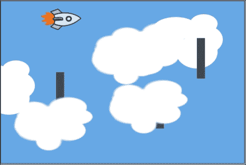
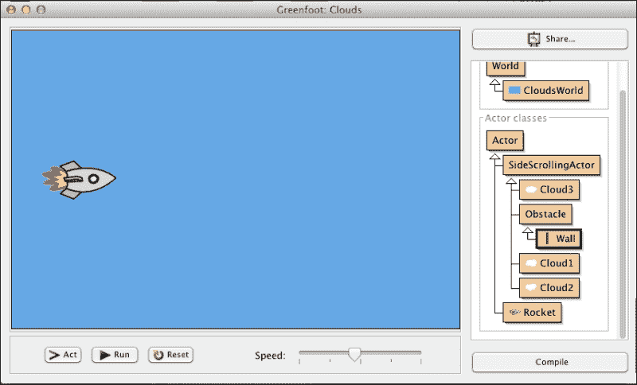
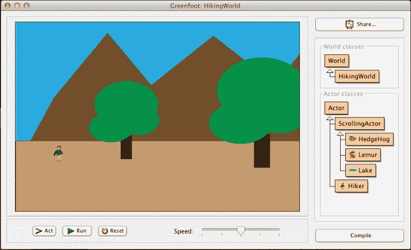
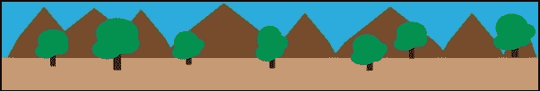
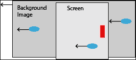
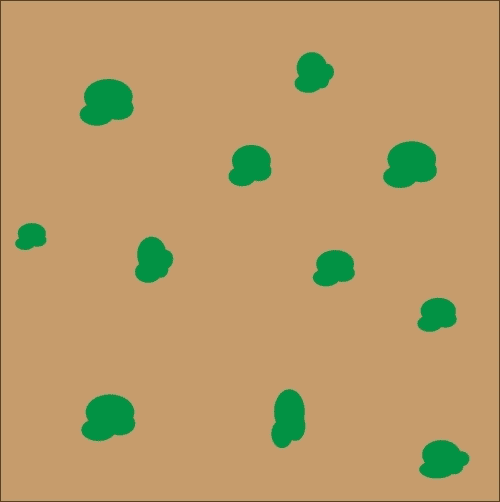
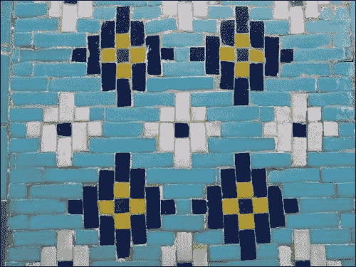
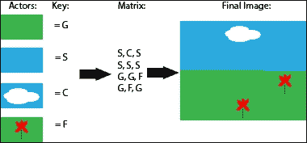
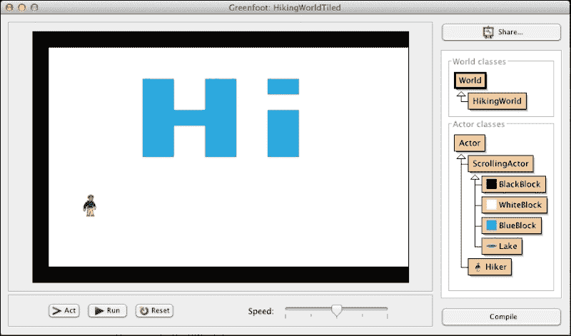

# 第六章。滚动和映射世界

|   | *"你已经知道你需要什么。"* |   |
| --- | --- | --- |
|   | --*尤达大师* |

在 Greenfoot 中，我们可以构建比单个屏幕范围更大的世界。通过滚动技术和动态演员生成，我们可以构建侧滚动游戏和看似无限的世界地图。当你将这些大型世界与上一章中学到的技术结合起来时，你将为你的观众创造一个真正吸引人和沉浸式的体验。

本章中你将学习的技术与你在第二章“动画”中学到的技术相似。我们将使用错觉。通过非常简单的技术，我们可以给人一种用户正在穿越广阔世界的错觉。在本章中，你将学习创建以下类型的世界：

+   动态生成

+   映射

+   基于瓦片

随着你对 Greenfoot 和 Java 编程了解的深入，你会注意到重复的模式和方法来完成特定的任务。虽然这里展示的内容值得拥有自己的章节，但它实际上是你已经学到的内容的精心混合。

# 章节场景示例

在本章中，我们将探讨四种不同的方法来创建用于模拟、游戏或动画的大型世界。我们只将展示完成这一目标所需的代码，而不会进一步展开。*你应该将在这里学到的方法与上一章中介绍的主题结合起来，以开发完整的应用程序*。此外，在我们的场景中，我们将使用非常简单的图形，并假设你会在艺术和故事（如第五章交互式应用程序设计和理论中所述）上花费更多时间。

# 动态生成世界

看起来，创建动态生成且可能无限的世界应该是本章的结论性话题，而不是入门话题。相反，动态创建一个世界是很容易的，我们已经看到了完成这一目标所需的所有代码。在第一章，“让我们直接进入…”，我们动态创建了从顶部流下来的敌人，后来，在第二章动画中，我们添加了一个动态生成的星系。我们将使用相同的技巧来创建一个看似无限的世界。想象一下，Avoider Game 中的敌人生成频率较低，看起来像行星。这会让人感觉我们正在穿越太空。想象一下，我们有一个绿色的背景，使用树木的图片作为敌人。这会让人感觉我们正在穿越森林。接下来，我们将创建一个 Greenfoot 场景，显示一个用户控制的火箭在多云的天空中飞行。

## 侧滚动

我们将创建*图 1*中描述的飞行游戏。在这个游戏中，用户控制火箭并试图避开墙壁。为什么是墙壁？好吧，它们很容易绘制并且足以说明概念。在你的场景中，你可以花些时间绘制外星飞船、鸟、气球或其他对你有意义的任何东西。



图 1：这是 Clouds Greenfoot 场景的截图。

首先创建一个新的 Greenfoot 场景，命名为`Clouds`，并将其保存到磁盘上。我们将接下来展示世界和角色的代码。

### Rocket 类

在这个示例场景中，用户控制一个火箭。你可以通过按箭头键来移动火箭。火箭的移动被限制在屏幕区域内。如果火箭撞到墙壁（我们很快会添加），则场景将停止。`Rocket`类中没有特定于生成动态世界的代码，所有代码都是我们在前几章中看到的。创建一个新的`Actor`子类，命名为`Rocket`，将其与 Greenfoot 提供的火箭图像关联起来，并在其类文件中输入以下代码：

```java
import greenfoot.*;

public class Rocket extends Actor {
  private int speedX = 1;
  private int speedY = 0;
  private static final int SPEED = 2;
  private static final int BOUNDARY = 20;

  public void act() {
    handleKeyPresses();
    boundedMove();
    checkForCrash();
  }

  private void handleKeyPresses() {
    handleArrowKey("down", 0, SPEED);
    handleArrowKey("up", 0, -SPEED);
    handleArrowKey("left", -SPEED, 0);
    handleArrowKey("right", SPEED, 0);
  }

  private void handleArrowKey(String k, int sX, int sY) {
    if( Greenfoot.isKeyDown(k) ) {
      speedX = sX;
      speedY = sY;
    }
  }

  private void boundedMove() {
    int newX = Math.max(BOUNDARY, speedX+getX());
    newX = Math.min(getWorld().getWidth()-BOUNDARY, newX);
    int newY = Math.max(BOUNDARY, speedY+getY());
    newY = Math.min(getWorld().getHeight()-BOUNDARY, newY);
    setLocation(newX,newY);
  }

  private void checkForCrash() {
    Actor w = getOneIntersectingObject(Obstacle.class);
    if( w != null ) {
      Greenfoot.stop();
    }
  }
}
```

你应该非常熟悉处理按键和移动角色的代码。我在这里增加的一个额外概念是*功能分解*，用于去除代码冗余。注意`handleArrowKey()`方法可以处理所有箭头键的移动。`checkForCrash()`方法的代码只是简单地实现了我们的标准模板来检测碰撞。我们很快将添加`Obstacle`角色。

在`boundedMove()`中，我们有一些代码，用于确保用户不会离开屏幕。如果没有这段代码，用户可以朝任何方向离开屏幕并消失在视野中。使用 Java 的`max()`和`min()`数学库函数，`boundedMove()`确保火箭的新*x*和*y*位置保持在屏幕范围内。`BOUNDARY`变量定义了火箭可以靠近边缘的距离。我们添加这个缓冲区以防止火箭的大部分图像隐藏在边缘之外。

### CloudsWorld 类

我们的世界类的主要责任是在屏幕上最初放置火箭，并随机生成云和墙壁。创建一个新的`World`子类，命名为`CloudsWorld`，并为其分配一个纯蓝色图像作为背景。你可以使用我们在第四章“Projectiles”中使用的蓝色渐变背景，或者使用你喜欢的绘图程序创建一个新的。与`Rocket`类一样，`CloudsWorld`的大多数代码应该是之前提供的代码的复习。以下是`CloudsWorld`的代码：

```java
import greenfoot.*;

public class CloudsWorld extends World {

  public CloudsWorld() {
    super(600, 400, 1, false);
    prepare();
  }

  public void act() {
    generateBackgroundClouds();
    generateWalls();
  }

  private void generateBackgroundClouds() {
    generateActor(5, new Cloud1());
    generateActor(4, new Cloud2());
    generateActor(3, new Cloud3());
  }

  private void generateWalls() {
    generateActor(5, new Wall());
  }

  private void generateActor(int chance, Actor a) {
    if( Greenfoot.getRandomNumber(1000) < chance) {
      int randY = Greenfoot.getRandomNumber(300) + 50;
      addObject(a, getWidth()+20, randY);
    }
  }

  private void prepare(){
    Rocket rocket = new Rocket();
    addObject(rocket, 90, 200);
  }
}
```

你还记得我们最新版本的 Avoider 游戏中的`act()`方法的样子吗？下面是这个样子：

```java
// NOTE: DO NOT PUT THIS CODE IN YOUR CLOUDSWORLD CLASS
public void act() {
  generateEnemies();
  generateStars(-1);
  generatePowerItems();
  increaseLevel();
}
```

它看起来不像是`CloudsWorld`的`act()`方法吗？我们将使用在 Avoider 游戏中生成敌人的相同技术来在 Clouds 应用程序中生成云。

让我们先看看`generateActor()`方法。该方法接受一个角色（类型`Actor`）和一个整数（类型`int`）作为参数。整数代表我们将提供的角色添加到世界中的概率。数字越高，角色出现在屏幕上的可能性就越大。使用此方法，我们可以轻松实现`generateBackgroundClouds()`方法和`generateWalls()`方法。在这些方法中，我们简单地调用`generateActor()`，提供角色出现在屏幕上的机会以及所需角色的一个新实例。

### 侧滚动角色

我们场景中的所有其他角色都将成为`SideScrollingActor`类的子类。通过从`Actor`类派生来创建它，但不要与它关联任何图像。使用以下代码，我们通过继承为一系列角色提供侧滚动行为：

```java
import greenfoot.*;

public abstract class SideScrollingActor extends Actor
{
  public int speed = -1; // Moves right to left
  private static final int BOUNDARY = 100;

  public void act()
  {
    move(speed);
    checkOffScreen();
  }

  private void checkOffScreen() {
    if( getX() < -BOUNDARY || getX() > getWorld().getWidth() + BOUNDARY) {
      getWorld().removeObject(this);
    }
  }
}
```

为了产生我们的火箭从左向右移动的错觉，我们让所有滚动角色从右向左移动。这就是为什么速度变量是负数的原因。在`act()`方法中，我们移动角色，然后调用`checkOffScreen()`来在角色移出屏幕后将其移除。因为我们从不打算直接使用`SideScrollingActor`类来实例化对象，所以我们将其设置为`abstract`。接下来，我们将讨论将要成为`SideScrollingActor`子类的角色。

#### 云朵

我们在我们的应用程序中使用三种不同的云朵图像，并将使它们以不同的随机速度移动。这将提供足够的多样性，使我们的飞行火箭看起来更真实。我使用的三个图像显示在*图 2*中。你可以绘制自己的或提供的那些，在[`www.packtpub.com/support`](http://www.packtpub.com/support)。


图 2：这些是云朵的图像

通过从`SideScrollingActor`派生，命名为`Cloud1`，并将你的云朵图像之一分配给它来创建一个云朵角色。在`Cloud1`的类文件中，放置以下代码：

```java
import greenfoot.*; 

public class Cloud1 extends SideScrollingActor {
  private static final int SPEEDRANGE = 3;
  public Cloud1() {
    speed = -(Greenfoot.getRandomNumber(SPEEDRANGE) + 1);
  }
}
```

在`Cloud1`中，我们给`speed`变量分配一个介于`1`和`3`之间的随机值。我们继承了`speed`变量来自`SideScrollingActor`父类。

要创建另外两个云朵角色，重复前面的步骤一次，将`Cloud1`替换为`Cloud2`，然后再将`Cloud1`替换为`Cloud3`。为了增加更多变化，你可以更改每个角色中的`SPEEDRANGE`常量。我建议将`Cloud1`的`SPEEDRANGE`设置为`3`（如图 2 所示），`Cloud2`为`2`，`Cloud3`为`5`。

#### 墙壁

我们需要添加的最后一件事情是墙壁障碍物。虽然在这个例子中我们只有一个障碍物，但我们将要编写的代码将使我们能够轻松地在未来添加更多的障碍物。我们将使用继承，但这次，我们使用它来分组相关类型，而不是共享代码。在`Rocket Actor`代码中，我们检查与`Obstacle`类的碰撞。现在我们将通过从`SideScrollingActor`派生来创建这个类，将新的子类命名为`Obstacle`，并且不关联任何图像。以下是`Obstacle`角色的代码：

```java
import greenfoot.*;

public class Obstacle extends SideScrollingActor{
}
```

再次强调，我们不是使用继承来重用代码，因此需要添加的代码非常少。

现在，为了创建`Wall`角色，我们创建了一个`Obstacle`的子类。我简单地为我墙壁创建了一个深灰色矩形图像。我相信你能想出更好的东西。以下是`Wall`类的代码：

```java
import greenfoot.*; 
public class Wall extends Obstacle {
}
```

由于`Obstacle`从`SideScrollingActor`继承，`Wall`角色将与`Cloud`角色具有相同的移动方式。然而，`Rocket`类现在可以检测与`Obstacle`类的碰撞。如果我们使用`SideScrollingActor`类进行碰撞检测，那么我们也会与云发生碰撞。

### 试一试

我们已经完成了为我们的 Greenfoot 场景创建世界和角色类。*图 3*展示了完成的 Greenfoot 场景。确保你的类层次结构完全相同。



图 3：这显示了完成的云场景

编译它，并注意你创建过程中的任何错误。花些时间运行场景，观察移动的云如何产生穿越广阔天空的错觉。即使知道它是如何实现的，也很难想象你的火箭实际上是屏幕上移动最少的演员。

# 映射世界

肯定有你想为你的游戏或模拟添加特定背景的时候。在这些情况下，仅仅随机生成演员来模拟移动背景是不够的。我们接下来要探索的方法包括创建一个比屏幕尺寸大得多的背景图像，并适当地移动它来模拟运动。此外，我们还将学习如何在这个更大的世界中放置演员。

## 侧滚动

我们的侧滚动示例是一个允许用户穿越山林，最终找到湖的场景。用户只能左右移动，不能上下移动。*图 4*展示了完成的应用。



图 4：这是 HikingWorld 的截图

要创建这个滚动世界，我们需要一张大图作为背景。在这个例子中，我创建了一张 2400 x 400 像素的图像，如图 5 所示。由于我们的场景的可视屏幕大小为 600 x 400，所以这张图像比我们的屏幕长六倍。您可以自由地创建自己的 2400 x 400 像素图像，或者使用提供的[`www.packtpub.com/support`](http://www.packtpub.com/support)上的图像。



图 5：这是 HikingWorld 的背景图像，长 2400 像素，高 400 像素。注意，这个图中的图像是原始大小的四分之一，以便适应页面

接下来，我们将描述世界和演员类的代码。

### HikingWorld 类

我们的世界类`HikingWorld`的主要责任是将世界中的所有内容相对于用户控制的`Hiker`类进行移动。我们将允许用户在屏幕的范围内正常移动，但当用户尝试移动到屏幕的左侧边界或右侧边界之外时，我们将分别将一切移动到右侧或左侧。图 6 演示了如果用户在屏幕的右侧边缘并尝试向右移动时，我们会做什么。



图 6：如果玩家在屏幕的右侧边缘向右移动，我们将一切向左移动

现在我们已经了解了`HikingWorld`类必须做什么，让我们看看代码。首先，从`World`类派生出一个子类，并将其命名为`HikingWorld`。不要将图像与这个新类关联；我们将在构造函数中做这件事。以下是`HikingWorld`类必须执行的代码：

```java
import greenfoot.*;
import java.util.List;

public class HikingWorld extends World {
  private int xOffset = 0;
  private final static int SWIDTH = 600;
  private final static int SHEIGHT = 400;
  private final static int WWIDTH = 2400;
  private GreenfootImage bimg;

  public HikingWorld() {
    super(SWIDTH, SHEIGHT, 1, false);
    bimg = new GreenfootImage("HikingWorldBackground.png");
    shiftWorld(0);
    prepare();
  }

  public void shiftWorld(int dx) {
    if( (xOffset + dx) <= 0 && (xOffset + dx) >= SWIDTH - WWIDTH) {
      xOffset = xOffset + dx;
      shiftWorldBackground(dx);
      shiftWorldActors(dx);
    }
  }

  private void shiftWorldBackground(int dx) {
    GreenfootImage bkgd = new GreenfootImage(SWIDTH, SHEIGHT);
    bkgd.drawImage(bimg, xOffset, 0);
    setBackground(bkgd);
  }

  private void shiftWorldActors(int dx) {
    List<ScrollingActor> saList =
    getObjects(ScrollingActor.class);
    for( ScrollingActor a : saList ) {
      a.setAbsoluteLocation(dx);
    }
  }

  private void prepare() {
    HedgeHog hh1 = new HedgeHog();
    addObject(hh1, 900, 250);
    Lemur l = new Lemur();
    addObject(l, 1200, 300);
    HedgeHog hh2 = new HedgeHog();
    addObject(hh2, 1500, 250);
    Lake lake = new Lake();
    addObject(lake, 2100, 300);
    Hiker hiker = new Hiker();
    addObject(hiker, 90, 275);
  }
}
```

在类开始时，我们创建了三个常量来存储屏幕的尺寸（`SWIDTH`和`SHEIGHT`）和背景图像的尺寸（`WWIDTH`）。由于图像高度和屏幕高度相同，我们不需要`WHEIGHT`常量。我们还声明了`xOffset`实例变量。我们使用这个变量来跟踪背景图像和演员当前移动的距离。最后，我们创建了一个实例变量`bimg`，指向背景图像。

在构造函数中，我们加载我们的背景图像，并使用偏移量`0`调用`shiftWorld()`，将一切放置在其起始位置。我们以标准方式使用`prepare()`方法——放置我们的初始演员。需要注意的一点是，我们使用大于屏幕大小的*y*位置。因此，一些我们的演员将被创建，但放置在屏幕之外。最终，它们将被移动到屏幕上，用户可以看到。使这个世界变大的真正工作是在`shiftWorld()`中完成的。

注意`shiftWorld()`方法中的第一个`if`语句。这个`if`语句防止我们将背景图像移动到我们看到它后面的空白白色空间的位置。

如果我们不在背景图像的边缘，那么我们将通过将当前的偏移量（`dx`）加到当前的偏移量（`xOffset`）上来记录新的偏移量。然后，我们使用`shiftWorldBackground()`方法移动背景图像，并使用`shiftWorldActors()`方法移动世界中的所有角色。`shiftWorldBackground()`方法相当简单。我们首先创建一个与屏幕大小相同的新图像。然后我们将背景图像绘制到其中，偏移量为`xOffset`（刚刚增加了`dx`），然后将这个新图像设置为背景图像。

`shiftWorldActors()`方法可能只有几行，但它做了很多工作。有一个名为`getObjects()`的`World`方法提供给我们，它将返回所提供类中的所有角色。对我们来说，我们调用`getObjects(ScrollingActor.class)`来获取所有应该移动的对象。用户控制的类`Hiker`不是`ScrollingActor`的子类；因此，在这个方法中它不会被移动。然后我们遍历返回的 Java `List`，并对每个`ScrollingActor`实例调用`setAbsoluteLocation()`。我们很快将查看`ScrollingActor`类和`setAbsoluteLocation()`方法的实现。

创建侧滚动世界的绝大部分工作都在`HikingWorld`中完成。在继续前进之前，请确保你理解这段代码。这个场景中剩余角色的代码相当直接。

### `Hiker`类

我们将有一个`Hiker`类的实例，用户将控制它。在这个场景中，我们只允许用户左右移动。这种程度的控制足以演示侧滚动场景。这个类的代码几乎与我们在本章开头创建的 Clouds 场景中的`Rocket`角色的代码相同。首先，看看代码，然后我们将讨论差异：

```java
import greenfoot.*;

public class Hiker extends Actor
{
  private int speedX = 1;
  private static final int SPEED = 2;
  private static final int BOUNDARY = 40;

  public void act() {
    handleKeyPresses();
    boundedMove();
    checkAtLake();
  }

  private void handleKeyPresses() {
    handleArrowKey("left", -SPEED);
    handleArrowKey("right", SPEED);
  }

  private void handleArrowKey(String k, int sX) {
    if( Greenfoot.isKeyDown(k) ) {
      speedX = sX;
    }
  }

  private void boundedMove() {
    if( speedX+getX() <= BOUNDARY ) {
      setLocation(BOUNDARY, getY());
      ((HikingWorld)getWorld()).shiftWorld(-speedX);
    } else if( speedX+getX() >= getWorld().getWidth()-BOUNDARY ) {
      setLocation(getWorld().getWidth()-BOUNDARY, getY());
      ((HikingWorld)getWorld()).shiftWorld(-speedX);
    } else {
      setLocation(getX()+speedX, getY());
    }
    speedX = 0;
  }

  private void checkAtLake() {
    // Do something cool if make it to the lake...
  }
}
```

主要区别发生在`boundedMove()`方法中。在前面提到的`Rocket`类中，我们有一个类似的方法，它将用户移动限制在比屏幕略小的矩形区域内。我们在这里对水平移动做同样的事情，但增加了一个功能。当我们检测到用户位于屏幕边缘（无论是左侧还是右侧）时，我们将调用`shiftWorld()`来使其看起来像角色正在继续移动。

我们还有一个没有实现的`checkAtLake()`方法。这是你可以在世界的尽头设置一个目标，用户必须到达的例子。在我们的案例中，我们将在徒步旅行的尽头放置一个湖。如果我们想在用户到达湖边后做些什么，我们会使用这个方法。

### `ScrollingActor`类

我们想要移动的所有角色都将继承自`ScrollingActor`类。它提供了一个方便的方式来分组这些角色，并允许我们在一个地方定义`setAbsoluteLocation()`方法。下面是如何实现的：

```java
import greenfoot.*;

public class ScrollingActor extends Actor {
  public void setAbsoluteLocation(int dx) {
    setLocation(getX()+dx, getY());
  }
}
```

在`HikingWorld`类中，我们对所有需要移动的演员调用了`setAbsoluteLocation()`方法。这个方法只是`setLocation()`的一个包装，通过`dx`值移动演员。

`HedgeHog`、`Lemur`和`Lake`演员的代码相同且非常简洁。这些类主要存在是为了允许将不同的图片与它们关联。刺猬和狐猴的图片包含在 Greenfoot 的默认安装中。我的湖是一个简单的蓝色椭圆形，在绘图程序中创建。这些演员在`HikingWorld`的`prepare()`方法中被放置到世界中。现在创建每个这些演员，并将以下代码添加到每个演员中（确保用适当的类名替换）：

```java
import greenfoot.*;

public class HedgeHog extends ScrollingActor {
}
```

### 尝试运行

恭喜！您已经创建了一个横向卷轴、已映射的世界。编译并尝试运行它。为了增加挑战，实现`Hiker`类中的`checkAtLake()`方法，以奖励徒步旅行者到达目的地。您还可以在[`www.packtpub.com/support`](http://www.packtpub.com/support)下载该场景的完整版本。

## 2D 滚动

创建一个允许用户在*x*（左右）和*y*（上下）方向上探索大地图的应用程序，是我们在刚刚创建的横向卷轴世界的一个简单扩展。代码将完全相同，除了我们还将处理上下移动的情况。我们还需要一个比我们场景的屏幕尺寸更长更宽的图片。我创建的图片是 1200 x 1200 像素，并在*图 7*中展示。您可以创建自己的图片或从[`www.packtpub.com/support`](http://www.packtpub.com/support)下载*图 7*中的图片。这张图片旨在表示一个带有树木的地形的俯视图。



图 7：HikingWorld2D 的背景图片，长宽均为 1200 像素。请注意，本图中的图片已被缩小以适应页面。

创建一个新的场景并命名为`HikingWorld2D`。由于此代码与我们在上一节中实现的`HikingWorld`场景非常相似，我们只需突出显示处理上下移动所需的代码。

### `HikingWorld2D`类

继承`World`类并命名新类为`HikingWorld2D`，但不要为其关联图片。我们将在该类的构造函数中添加*图 7*（或您创建的类似图片）。以下是完成所有这些任务的代码：

```java
import greenfoot.*;
import java.util.List;

public class HikingWorld extends World {
  private int xOffset = 0;
  private int yOffset = 0;
  private final static int SWIDTH = 600;
  private final static int SHEIGHT = 400;
  private final static int WWIDTH = 1200;
  private final static int WHEIGHT = 1200;
  private GreenfootImage bimg;

  public HikingWorld() {  
    super(SWIDTH, SHEIGHT, 1, false); 
    bimg = new GreenfootImage("HikingWorldBackground2D.png");
    shiftWorld(0,0);    
    prepare();
  }

  public void shiftWorld(int dx, int dy) {
    if( (xOffset + dx) <= 0 && (xOffset + dx) >= SWIDTH - WWIDTH) {
      xOffset = xOffset + dx;
      shiftWorldBackground(dx, 0);
      shiftWorldActors(dx, 0);
    }
    if( (yOffset + dy) <= 0 && (yOffset + dy) >= SHEIGHT - WHEIGHT) {
      yOffset = yOffset + dy;
      shiftWorldBackground(0, dy);
      shiftWorldActors(0, dy);
    }
  }

  private void shiftWorldBackground(int dx, int dy) {
      GreenfootImage bkgd = new GreenfootImage(SWIDTH, SHEIGHT);
      bkgd.drawImage(bimg, xOffset, yOffset);
      setBackground(bkgd);
  }

  private void shiftWorldActors(int dx, int dy) {
    List<ScrollingActor> saList = getObjects(ScrollingActor.class);
    for( ScrollingActor a : saList ) {
      a.setAbsoluteLocation(dx, dy);
    }
  }

  private void prepare() {
    HedgeHog hh1 = new HedgeHog();
    addObject(hh1, 600, 600);
    Lemur l = new Lemur();
    addObject(l, 300, 900);
    HedgeHog hh2 = new HedgeHog();
    addObject(hh2, 900, 300);
    Lake lake = new Lake();
    addObject(lake, 900, 1100);
    Hiker hiker = new Hiker();
    addObject(hiker, 90, 275);
  }
}
```

首先，我们将`WWIDTH`和`WHEIGHT`设置为背景图像的尺寸。之前，我们不需要`WHEIGHT`，因为它与`SHEIGHT`相同。这个类与`HikingWorld`类在`HikingWorld,`中的主要区别是，我们在`shiftWorld()`、`shiftWorldBackground()`和`shiftWorldActors()`中添加了一个额外的参数（`dy`），它提供了*y*方向上的变化。新`dy`参数的使用反映了`dx`参数的使用。我们最终通过`dx`和`dy`同时移动背景图像和其他演员。

### 漫步者类

创建一个新的`Actor`子类，命名为`Hiker`，并关联 Greenfoot 提供的默认人物图像之一。以下是这个新类的代码：

```java
import greenfoot.*;

public class Hiker extends Actor {
  private int speedX = 1;
  private int speedY = 1;
  private static final int SPEED = 2;
  private static final int BOUNDARY = 40;

  public void act() {
    handleKeyPresses();
    boundedMove();
    checkAtLake();
  }

  private void handleKeyPresses() {
    handleArrowKey("left", -SPEED, 0);
    handleArrowKey("right", SPEED, 0);
    handleArrowKey("up", 0, -SPEED);
    handleArrowKey("down", 0, SPEED);
  }

  private void handleArrowKey(String k, int sX, int sY) {
    if( Greenfoot.isKeyDown(k) ) {
      speedX = sX;
      speedY = sY;
    }
  }

  private void boundedMove() {

    if( speedX+getX() <= BOUNDARY ) {
      setLocation(BOUNDARY, getY());
      ((HikingWorld)getWorld()).shiftWorld(-speedX, 0);
    } else if( speedX+getX() >= getWorld().getWidth()-BOUNDARY ) {
      setLocation(getWorld().getWidth()-BOUNDARY, getY());
      ((HikingWorld)getWorld()).shiftWorld(-speedX, 0);
    } else {
      setLocation(getX()+speedX, getY());
    }

    if( speedY+getY() <= BOUNDARY ) {
      setLocation(getX(), BOUNDARY);
      ((HikingWorld)getWorld()).shiftWorld(0, -speedY);
    } else if( speedY+getY() >= getWorld().getHeight()-BOUNDARY ) {
      setLocation(getX(), getWorld().getHeight()-BOUNDARY);
      ((HikingWorld)getWorld()).shiftWorld(0, -speedY);
    } else {
      setLocation(getX(), getY()+speedY);
    }
    speedX = 0;
    speedY = 0;
  }

  private void checkAtLake() {
  }
}
```

这个类也被增强以处理*x*和*y*方向上的移动。在`handleKeyPresses()`中，我们添加了两个额外的`handleArrowKey()`调用，以处理上下箭头键被按下。在`boundedMove()`中，我们添加了检查以确保演员不会移动到屏幕的顶部或底部，并在适当的时候调用`shiftWorld()`。

### 滚动演员类

创建一个新的`Actor`子类，命名为`ScrollingActor`。你不需要为它关联一个图像。和之前一样，这个类仅仅提供了一个`setLocation()`方法的包装。现在，它还处理在*y*方向上的移动。以下是代码：

```java
import greenfoot.*;

public class ScrollingActor extends Actor {
  public void setAbsoluteLocation(int dx, int dy) {
    setLocation(getX()+dx, getY()+dy);
  }
}
```

`HedgeHog`、`Lemur`和`Lake`类与之前在`HikingWorld`场景中展示的完全相同。将它们添加到`HikingWorld2D`中。

### 尝试一下

只需几处改动，我们就创建了一个值得探索的世界，而我们所做的只是对已经完成的`HikingWorld`场景进行了一些扩展。现在，是时候编译并尝试你的场景了。处理任何拼写错误或错误，然后探索地图。你还可以在[`www.packtpub.com/support`](http://www.packtpub.com/support)下载场景的完整版本。

# 基于瓦片的宇宙

基于瓦片的宇宙是全动态创建的宇宙和那些使用大图像作为背景的宇宙的愉快结合。使用大图像，你可以创建一个非常详细且可预测的世界，但改变它非常困难。动态创建的宇宙容易生成，但通常太随机。基于瓦片的宇宙让你能够轻松创建详细、可预测的世界，同时易于更改或修改。

## 作为瓦片的演员

艺术家可以使用小块的瓦片或玻璃创造出惊人的图像。*图 8*展示了一个简单的瓦片马赛克。通过策略性地放置小块彩色瓦片，你可以生成许多不同类型的图像。



图 8：这是一个简单的马赛克，由 pixabay.com 提供，链接为 http://pixabay.com/en/uzbekistan-mosaic-pattern-artfully-196875/

我们将使用类似的技术在 Greenfoot 中创建世界，但我们将使用小演员而不是瓦片。*图 9*演示了我们将如何做到这一点。我们将创建一组演员，它们将作为我们的瓦片。然后，我们将指定如何使用一个字符串数组来组合这些演员，该数组使用字母来编码要放置的演员类型。例如，字母`C`对应于显示蓝色背景的云朵的演员，而字母`F`对应于显示绿色背景的花的演员。*图 9*显示了一个 4 x 3 的字母矩阵，用于指定创建最终图像的瓦片布局。在矩阵中，左上角的字母是`S`；因此，图像的左上角是纯蓝色。



图 9：此图显示了将单个演员映射以创建更大世界的过程

希望你现在对基于瓦片的世界创建的工作方式有了感觉。在接下来的代码片段中，我们将再次编写徒步世界场景的代码，但这次修改为使用基于瓦片的世界创建。大部分代码直接借鉴了我们上一节中构建的 2D 滚动徒步世界。

创建一个新的场景并将其命名为`HikingWorldTiled`。本节将描述此场景的世界和演员类。我们只突出与基于瓦片的世界创建相关的添加。*图 10*显示了完成场景的截图。我现在提供这个截图，以便您可以快速查看我们将要实现的全部类，并一瞥我们将要创建的图像的一部分。



图 10：这是完成后的 HikingWorldTiled 场景的截图

### `HikingWorld`类

通过继承`World`类创建`HikingWorld`。我们正在动态创建一个背景图像，因此你不想将图像与这个类关联；以下是实现此功能的代码：

```java
import greenfoot.*;
import java.util.List;

public class HikingWorld extends World {
  private int xOffset = 0;
  private final static int SWIDTH = 600;
  private final static int SHEIGHT = 400;
  private final static int WWIDTH = 1200;
  private final static int TWIDTH = 25;
  private final static int THEIGHT = 25;

  private final static String[] WORLD = {
    "BBBBBBBBBBBBBBBBBBBBBBBBBBBBBBBBBBBBBBBBBBBBBBBB",
    "BWWWWWWWWWWWWWWWWWWWWWWWWWWWWWWWWWWWWWWWWWWWWWWB",
    "BWWWWWWWWWWWWWWWWWWWWWWWWWWWWWWWWWWWWWWWWWWWWWWB",
    "BWWWWWWUUWWUUWWUUWWWWWWWWWWWWWWWWWWWWWWWWWWWWWWB",
    "BWWWWWWUUWWUUWWWWWWWWWWWWWWWWWWWWWWWWWWWWWWWWWWB",
    "BWWWWWWUUUUUUWWUUWWWWWWWWWWWWWWWWWWWWWWWWWWWWWWB",
    "BWWWWWWUUWWUUWWUUWWWWWWWWWWWWWWWWWWWWWWWWWWWWWWB",
    "BWWWWWWUUWWUUWWUUWWWWWWWWWWWWWWWWWWWWWWWWWWWWWWB",
    "BWWWWWWWWWWWWWWWWWWWWWWWWWWWWWWWWWWWWWWWWWWWWWWB",
    "BWWWWWWWWWWWWWWWWWWWWWWWWWWWWWWWWWWWWWWWWWWWWWWB",
    "BWWWWWWWWWWWWWWWWWWWWWWWWWWWWWWWWWWWWWWWWWWWWWWB",
    "BWWWWWWWWWWWWWWWWWWWWWWWWWWWWWWWWWWWWWWWWWWWWWWB",
    "BWWWWWWWWWWWWWWWWWWWWWWWWWWWWWWWWWWWWWWWWWWWWWWB",
    "BWWWWWWWWWWWWWWWWWWWWWWWWWWWWWWWWWWWWWWWWWWWWWWB",
    "BWWWWWWWWWWWWWWWWWWWWWWWWWWWWWWWWWWWWWWWWWWWWWWB",
    "BBBBBBBBBBBBBBBBBBBBBBBBBBBBBBBBBBBBBBBBBBBBBBBB"
  };

  public HikingWorld() {
    super(SWIDTH, SHEIGHT, 1, false);
    createWorldFromTiles();
    shiftWorld(0);
    prepare();
  }

  public void shiftWorld(int dx) {
    if( (xOffset + dx) <= 0 && (xOffset + dx) >= SWIDTH - WWIDTH) {
      xOffset = xOffset+dx;
      shiftWorldActors(dx);
    }
  }

  private void shiftWorldActors(int dx) {
    List<ScrollingActor> saList =
    getObjects(ScrollingActor.class);
    for( ScrollingActor a : saList ) {
      a.setAbsoluteLocation(dx);
    }
  }

  private void createWorldFromTiles() {
    for( int i=0; i < WORLD.length; i++ ) {
      for( int j=0; j < WWIDTH/TWIDTH; j++ ) {
        addActorAtTileLocation(WORLD[i].charAt(j), j, i);
      }
    }
  }

  private void addActorAtTileLocation(char c, int x, int y) {
    Actor tile = null;
    switch(c) {
      case 'W':
      tile = new WhiteBlock();
      break;
      case 'B':
      tile = new BlackBlock();
      break;
      case 'U':
      tile = new BlueBlock();
      break;
    }
    if( tile != null) 	addObject(tile, 12+x*TWIDTH, 12+y*THEIGHT);
  }

  private void prepare() {
    Lake lake = new Lake();
    addObject(lake, WWIDTH-300, 300);
    Hiker hiker = new Hiker();
    addObject(hiker, 90, 275);
  }
}
```

这个类的新部分是位于类顶部的字符串数组`WORLD`和`createWorldFromTiles()`方法，它使用`addActorAtTileLocation()`方法来帮助从现有演员构建世界。《WORLD》数组指定了我们将放置构成背景的每个演员的位置。我们将使用三个演员来创建我们的背景图像；它们是`BlackBlock`、`WhiteBlock`和`BlueBlock`。这些演员使用 25 x 25 像素的图像。这对于瓦片来说是一个合适的大小——任何更小，你的`WORLD`数组都会太大且难以管理，任何更大，你将失去创建细节的能力。

`WORLD` 数组中有十六个字符串，每个字符串包含四十八个字符，因此我们创建的图像大小为 1200（48 x 25）x 400（16 x 25）。字母 `B` 对应于 `BlackBlock` 演员字母，字母 `W` 对应于 `WhiteBlock` 演员字母，字母 `U` 对应于 `BlueBlock` 演员字母。这种映射在 `addActorAtTileLocation()` 方法中的 `switch` 语句中被捕获。了解映射后，你可以查看 `WORLD` 数组，并看到图像将有一个黑色边框和白色背景，并用蓝色拼写出单词 `Hi`。

好的，让我们来分析 `createWorldFromTilesMethod()`。此方法遍历 `WORLD` 中每个字符串的每个字符。对于每个字符，它调用 `addActorAtTileLocation()`，提供参数指定表示哪个瓦片应放置的字符以及该瓦片的位置。在 `addActorAtTileLocation()` 中，我们根据传递给它的字符创建一个新的演员，然后使用提供的 `x` 和 `y` 值将新演员放置在世界上。

### Hiker 类

这里的代码与我们在动态创建的世界中查看的 `Hiker` 类的代码相同。我在这里重新呈现它是为了方便，因为它相对较短：

```java
import greenfoot.*;

public class Hiker extends Actor {
  private int speedX = 1;
  private static final int SPEED = 2;
  private static final int BOUNDARY = 40;

  public void act() {
    handleKeyPresses();
    boundedMove();
    checkAtLake();
  }

  private void handleKeyPresses() {
    handleArrowKey("left", -SPEED);
    handleArrowKey("right", SPEED);
  }

  private void handleArrowKey(String k, int sX) {
    if( Greenfoot.isKeyDown(k) ) {
      speedX = sX;
    }
  }

  private void boundedMove() {
    if( speedX+getX() <= BOUNDARY ) {
      setLocation(BOUNDARY, getY());
      ((HikingWorld)getWorld()).shiftWorld(-speedX);
    } else if( speedX+getX() >= getWorld().getWidth()-BOUNDARY ) {
      setLocation(getWorld().getWidth()-BOUNDARY, getY());
      ((HikingWorld)getWorld()).shiftWorld(-speedX);
    } else {
      setLocation(getX()+speedX, getY());
    }
    speedX = 0;
  }

  private void checkAtLake() {
  }
}
```

### ScrollingActor 类

这段代码也与我们在本章中创建的第一个场景提供的代码相同。*在此需要注意的是，我们用来创建世界的演员也可能具有额外的功能，而不仅仅是被动背景图像*。例如，你可以有一个*火焰*瓦片，如果徒步旅行者与之碰撞，就会将其烧毁。以下是我们要讨论的代码：

```java
import greenfoot.*;

public class ScrollingActor extends Actor {
  public void setAbsoluteLocation(int dx) {
    setLocation(getX()+dx, getY());
  }
}
```

#### 瓦片

`BlackBlock`、`BlueBlock` 和 `WhiteBlock` 演员的代码几乎相同。唯一的不同之处在于类的名称和相关的图像。看看 `BlackBlock` 的代码：

```java
import greenfoot.*;

public class BlackBlock extends ScrollingActor {
}
```

确保这些演员的图像大小都相同，以便它们容易组合成更大的图像。在我们的例子中，图像是 25 像素 x 25 像素的有色方块。

#### Lake 类

`Lake` 类与第一个场景中的相同。需要注意的是，并非所有 `ScrollingActor` 的子类都必须作为背景图像的瓦片。`Lake` 演员代表我们的最终目的地。这是 `Lake` 类的使用方法：

```java
import greenfoot.*;

public class Lake extends ScrollingActor {
}
```

你可以直接复制它及其相关的图像从上一个场景。

#### 尝试一下

编译场景并运行它。它应该与我们在 Clouds 场景之后提供的侧滚动示例感觉相似，但现在很容易更改世界的图像。在背景中拼写 `Hi` 的地方，拼写你的名字。作为一个挑战，更改 `Hiker` 类，使其在接触蓝色方块时游戏结束。

## 其他游戏精灵

在我们的示例中，瓦片非常简单。基于瓦片的世界创建的真正优势在于拥有广泛的选择，可以创建一个有趣的世界。您可以创建自己的世界，从付费网站下载一些，例如[`cartoonsmartart.com`](http://cartoonsmartart.com)，或者从 100%免费的网站下载，例如[`opengameart.org`](http://opengameart.org)。*图 11*展示了来自[`opengameart.org`](http://opengameart.org)的免费瓦片集的一个示例。


图 11：这是来自 opengameart.org 并由 Kenny 在 http://opengameart.org/content/rpg-pack-base-set 提供的免费瓦片图集。

# 摘要

通过结合本章中介绍的大型世界创建技术，以及其他章节中介绍的概念和技术，您已经完全准备好使用 Greenfoot 创建无限形式的信息、娱乐和沉浸式体验。在下一章中，我们将探讨如何使您的应用程序中的演员智能行为，以进一步增强用户体验。
