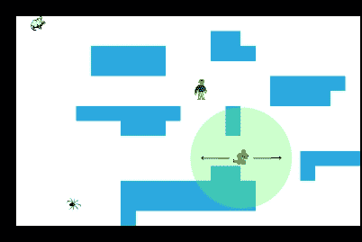
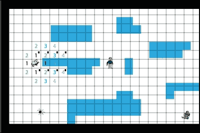

# 第七章。人工智能

|    | *"智慧始于惊奇。" |
| --- | --- |
|    | --*苏格拉底* |

我们在本章中已经探讨了如何移动、控制、检测 Greenfoot 演员之间的碰撞以及为这些演员添加动画。在本章中，我们将探讨如何让我们的演员展现出类似智能的行为。这样做将使我们能够讲述更好的故事并创造更具吸引力的用户交互。

现在，人工智能（AI）领域非常复杂，为我们的演员创建真正的智能行为超出了本书的范围。然而，我们可以使用一些简单的技术来模拟各种程度的智能行为，这些技术包括概率和启发式方法。然后我们将探讨一个流行的算法（在许多 AAA 游戏中使用），它将允许一个演员穿过一系列障碍物。具体来说，你将学习如何应用以下内容来模拟智能：

+   随机性

+   行为启发式

+   A*（发音为 A-star）路径查找

在整本书中，你一直在学习如何为你的应用程序、动画和游戏增添“哇”的元素。将简单的 AI 技术加入你的技能库将提升你创造力和创造力的能力。你对 Java 编程的了解越深，你就能为你的观众提供越多的惊奇。

# MazeWorld 场景

在上一章中，我们学习了如何创建基于瓦片的世界。我们将使用基于瓦片的方法增强我们创建的 Hiking World 场景，以创建一个新的场景，命名为`MazeWorld`。在这个场景中，我们的英雄需要绕过障碍物并避开三个智能演员，才能到达迷宫尽头的金子。*图 1*展示了完成后的场景截图。


图 1：这是 MazeWorld 的完成版本

与上一章的`HikingWorld`场景相比，本章我们将构建的新的`MazeWorld`场景有一些显著的不同。我们将快速解释冗余区域，然后放慢速度并详细解释创建智能演员所需的更改。如有需要，请查阅第六章，*滚动和映射世界*，以获取基于瓦片的世界创建的完整描述。

## MazeWorld 类

创建一个新的场景，命名为`MazeWorld`。在新场景中，创建一个名为`MazeWorld`的`World`类的子类。选择**无图像**作为此场景的图像。以下是`MazeWorld`类的实现：

```java
import greenfoot.*;
import java.util.List;
import java.util.Stack;

public class MazeWorld extends World {
  private int xOffset = 0;
  private Hiker hiker;
  private final static int SWIDTH = 600;
  private final static int SHEIGHT = 400;
  private final static int WWIDTH = 1200;
  private final static int TWIDTH = 25;
  private final static int THEIGHT = TWIDTH;
  private final static int TILEOFFSET = TWIDTH/2;
  private final static String validSpaces = "WG";

  private final static String[] WORLD = {
    "BBBBBBBBBBBBBBBBBBBBBBBBBBBBBBBBBBBBBBBBBBBBBBBB",
    "BWWWWWWWWWWWWWWWWWWWWWWWWWWWWWWWWWWWWWWWWWUWWWWB",
    "BWWWWWWWWWWWWWUUWWWWWWWWUUUUUUUWWWWWWWWWWWUWWWWB",
    "BWWWWWUUUUUWWWUUUWWWWWWWWWWWWWWWWWWWWWWWWWUWWWWB",
    "BWWWWWUUUUUWWWWWWWWWWWWWWWWWWWWWWWWWUWWWWUUUWWWB",
    "BWWWWWWWWWWWWWWWWWUUUUUWWWWWWWWUUUUUUWWWWWWWWWWB",
    "BWWWWWWWWWWWWWWWWWUUUUWWWWWWWWWUUUUUUUUWWWWWWWWB",
    "BWWWWUUUUUUUWWWUWWWWWWWWWWWWWWWUWWWWWWWWWWWWWWWB",
    "BWWWWWWWUUUWWWWUWWWWWWWWWWUWWWWUWWWWWWWWWWWWWWWB",
    "BWWWWWWWWWWWWWWWWWWWWWWWWWUWWWWWWWWWWWWWWWWWUWWB",
    "BWWWWWWWWWWWWWWWWWWWUUUUUUUWWWWWWWWWUUUUWWWWUWWB",
    "BWWWWWWWWWWWWWUUWWWWUWWWWWWWWWWWWWWWUUUUWWWWUWWB",
    "BWWWWWWWUUUUUUUUUWWWWWWWWWWWWWWWWWWWUUUUUUWWUWWB",
    "BWWWWWWWUUUUUUUUUWWWWWWWWWUUWWWWWWWWWWWWWWWWUWWB",
    "BWWWWWWWUWWWWWWWWWWWWWWWWWUUWWWWWWWWWWWWWWWWUWGB",
    "BBBBBBBBBBBBBBBBBBBBBBBBBBBBBBBBBBBBBBBBBBBBBBBB"
  };

  public MazeWorld() {  
    super(SWIDTH, SHEIGHT, 1, false); 
    createWorldFromTiles();
    shiftWorld(0);    
    prepare();
  }

  public void shiftWorld(int dx) {
    if( (xOffset + dx) <= 0 && (xOffset + dx) >= SWIDTH - WWIDTH) {
      xOffset = xOffset+dx;
      shiftWorldActors(dx);
    }
  }

private void shiftWorldActors(int dx) {
    List<ScrollingActor> saList = getObjects(ScrollingActor.class);
    for( ScrollingActor a : saList ) {
      a.setAbsoluteLocation(dx);
    }
  }

  private void createWorldFromTiles() {
    for( int i=0; i < WORLD.length; i++ ) {
      for( int j=0; j < WORLD[i].length(); j++ ) {
        addActorAtTileLocation(WORLD[i].charAt(j), j, i);
      }
    }
  }

  private void addActorAtTileLocation(char c, int x, int y) {
    Actor tile = null;
    switch(c) {
      case 'W':
        tile = new WhiteBlock();
        break;
      case 'B':
        tile = new BlackBlock();
        break;
      case 'U':
        tile = new BlueBlock();
        break;
      case 'G':
        tile = new GoldBlock();
        break;
    }
    if( tile != null) addObject(tile, TILEOFFSET+x*TWIDTH, TILEOFFSET+y*THEIGHT);

  }

 public int getTileWidth() {
    return TWIDTH;
  }

  public int getTileHeight() {
    return THEIGHT;
  }

  public int getTileOffset() {
    return TILEOFFSET;
  }

  public String[] getStringWorld() {
    return WORLD;
  }

  public int getXHiker() {
    return hiker.getX()-xOffset;
  }

  public int getYHiker() {
    return hiker.getY();
  }

  public String getValidSpaces() {
    return validSpaces;
  }

  private void prepare()
  {
    hiker = new Hiker();
    addObject(hiker, 80, 200);
    addObject(new Mouse(), 60,40);
    addObject(new Spider(), 1000,40);
    addObject(new Spider(), 120,340);
    addObject(new Spider(), 1050,250);
    addObject(new Snake(), 1050,250);
    addObject(new Mouse(), 1000,200);
    addObject(new Snake(), 400,260);
  }
}
```

我们首先声明这个类的所有实例变量。我们添加了`TILEOFFSET`常量（用于记录地砖宽度值的一半）和`String validspaces`（用于指示我们的英雄可以走上的地砖）。`WORLD`数组定义了地砖的类型和在我们世界中的位置。我们通过使用字母`U`创建各种静态障碍物并添加了通过字母`G`在右下角的目标目的地来增强`WORLD`数组。`W`字符表示可走动的背景区域，而`B`表示不可通过的区域。

`shiftWorld`、`shiftWorldActors`、`createWorldFromTiles`方法和构造函数与`HikingWorld`中的相同。`addActorAtTileLocation`方法只是在`switch`语句中添加了一个处理创建和放置金币地砖的情况。到达金币地砖是本场景的目标。

以下方法被添加以提供一种方便的方式来访问我们世界中包含的信息：`getTileWidth`、`getTileHeight`、`getTileOffset`、`getStringWorld`、`getXHiker`、`getYHiker`和`getValidSpaces`。我们将在本章定义的类中看到它们的使用。`MazeWorld`实现中提供的最后一个方法是`prepare()`，默认情况下用于将初始演员放置到我们的世界中。

## 漫步者类

我们的`Hiker`类与我们在上一章中在`HikingWorld`中看到的是一样的，只不过我们扩展了这个类的上下移动能力。二维移动在之前的章节中已经介绍过，我们将对此类进行总结性解释。以下是代码：

```java
import greenfoot.*;

public class Hiker extends Actor
{
  private static final int SPEED = 2;
  private static final int BOUNDARY = 40;
  private int speedX = SPEED;
  private int speedY = SPEED;

  public void act() {
    handleKeyPresses();
    handleCollisions();
    boundedMove();
  }

  private void handleKeyPresses() {
    handleArrowKey("left", -SPEED, 0);
    handleArrowKey("right", SPEED, 0);
    handleArrowKey("up", 0, -SPEED);
    handleArrowKey("down", 0, SPEED);
  }

  private void handleArrowKey(String k, int sX, int sY) {
    if( Greenfoot.isKeyDown(k) ) {
      speedX = sX;
      speedY = sY;
    }
  }

  private void handleCollisions() {
    if( isTouching(ScrollingEnemy.class) ) {
      Greenfoot.stop(); // Game Over
    }
  }

  private void boundedMove() {
    setLocation(getX()+speedX, getY()+speedY);
    if( isTouching(ScrollingObstacle.class) ) {
      setLocation(getX()-speedX, getY()-speedY);
    } else if( isTouching(GoldBlock.class) ) {
      Greenfoot.stop(); // Game over...you Win!!
    }else if( getX() > getWorld().getWidth() - BOUNDARY ) {
      ((MazeWorld)getWorld()).shiftWorld(-speedX);
      setLocation(getX()-speedX, getY()-speedY);
    } else if( getX() < BOUNDARY ) {
      ((MazeWorld)getWorld()).shiftWorld(-speedX);
      setLocation(getX()-speedX, getY()-speedY);
    }
    speedX = 0;
    speedY = 0;
  }
}
```

`Hiker`类的代码处理左右上下箭头键的按下，并确保演员不会穿过障碍物，并适当地调用`shiftWorld()`。它还检查与`ScrollingEnemy`演员之一的碰撞，并在发生碰撞时停止游戏。

处理上下移动的代码与处理左右移动的代码类似。`handleKeyPresses()`和`boundedMove()`方法通过简单地添加上下移动的情况进行了扩展。

## 滚动演员

`ScrollingActor`类与上一章中的相同，我们在此处重新呈现以保持完整性：

```java
import greenfoot.*;

public class ScrollingActor extends Actor {
  public void setAbsoluteLocation(int dx) {
    setLocation(getX()+dx, getY());
  }
}
```

有四个类继承自`ScrollingActor`。前两个是`GoldBlock`和`WhiteBlock`的实现。这两个演员是可走动的背景世界的一部分，因此不需要任何特殊处理。确保在创建它们时，分别关联金币块和白色块的图像。以下是两者的代码：

```java
import greenfoot.*;

public class GoldBlock extends ScrollingActor {
}
import greenfoot.*;

public class WhiteBlock extends ScrollingActor {
}
```

`ScrollingActor`的其他两个子类旨在被继承（注意它们没有与之关联的图像）并帮助我们将演员分为两类之一：障碍物或敌人。我们将在下一节讨论这两个子类。

### 滚动障碍物类

这个类没有添加任何额外的功能。它仅仅是一个方便的方式来分组`Hiker`类的实例无法穿过的砖块。这使得在`Hiker`类中执行碰撞检测变得更容易。以下是代码：

```java
import greenfoot.*;

public class ScrollingObstacle extends ScrollingActor {
}
```

我们只有两种障碍砖块：`BlackBlock`和`BlueBlock`。当你创建这些时，确保将适当的图像（就像我们在上一章中做的那样）与它们关联起来。以下是两者的代码：

```java
import greenfoot.*;

public class BlackBlock extends ScrollingObstacle {
}
import greenfoot.*;

public class BlueBlock extends ScrollingObstacle {
}
```

我们现在可以描述展示智能行为的类的实现。

# 智能行为演员

现在我们将向我们的`MazeWorld`场景添加实现不同智能行为模拟方法的敌人。我们将讨论的第一种方法是概率移动，第二种方法是简单启发式方法，最后一种方法使用**A*路径查找**算法来引导演员移动。在讨论每种方法之前，我们首先展示实现智能行为演员通用结构的`ScrollingEnemy`类。

## ScrollingEnemy 类

`ScrollingEnemy`类从`ScrollingActor`继承，因此它将被正确地放置在滚动世界中。然后，它设置了一个有利于智能移动演员的行为模式。模仿实际有感知的动物，`ScrollingEnemy`在其`act()`方法中提供了一个三阶段动作处理过程。首先，它调用一个要求演员感知其环境的方法，然后它调用一个基于感知结果选择行动方案的方法，最后它调用一个移动演员的方法。请注意，这个类是`abstract`的，不能直接实例化。

下面是`ScrollingEnemy`类的代码：

```java
import greenfoot.*;

abstract public class ScrollingEnemy extends ScrollingActor {
  protected static final int SPEED = 1;
  private static final int BOUNDARY = 40;
  protected int speedX = SPEED;
  protected int speedY = SPEED;

  protected void addedToWorld(World w) {
    MazeWorld mw = (MazeWorld) w;
    GreenfootImage img = getImage();
    img.scale(mw.getTileWidth(),mw.getTileHeight());
    setImage(img);
  }

  public void act() {
    sense();
    reaction();
    boundedMove();
  }

  protected void sense() {
    // No smarts
  }

  protected void reaction() {
    // No reaction
  }

  protected void boundedMove() {
    setLocation(getX()+speedX, getY()+speedY);
    if( isTouching(ScrollingObstacle.class) ) {
      setLocation(getX()-speedX, getY()-speedY);
    }
  }
}
```

`sense()`和`reaction()`方法为空，因为它们打算由实现我们智能移动策略之一的子类覆盖。这些方法的结果是它们将`speedX`和`speedY`变量的值改变以影响移动。最后一个方法`boundedMove()`完全实现，一旦`speedX`和`speedY`的值被设置，`ScrollingEnemy`的每个子类的移动都是相同的。

## 随机性

使用纯概率确定问题解决方案的算法出奇地有效，在计算机科学中并不罕见。虽然它们几乎从未是最好的答案，但它们与为内存管理或调度等事物开发的新算法进行了良好的比较。

对于游戏来说，一个随机移动的演员为玩家提供了独特的挑战，让他们避免或捕捉。我们将在我们的`MazeWorld`场景中添加一个随机移动的演员。

### Spider

让我们通过在`ScrollingEnemy`上右键单击，选择**新建子类…**，输入**Spider**作为新的类名，然后在动物类别中选择图像`spider.png`来创建一个新的演员。将以下代码添加到这个新类中：

```java
import greenfoot.*;

public class Spider extends ScrollingEnemy {
  private final static int SPEEDVARIATION = 3;
  private final static int SPEEDCHANGECHANCE = 20;

  protected void reaction() {
    speedX = Greenfoot.getRandomNumber(1000) < SPEEDCHANGECHANCE ? Greenfoot.getRandomNumber(SPEEDVARIATION)-1 : speedX;
    speedY = Greenfoot.getRandomNumber(1000) < 	SPEEDCHANGECHANCE ? Greenfoot.getRandomNumber(SPEEDVARIATION)-1 : speedY;
  }
}
```

首先要注意的是，我们没有为在`ScrollingEnemy`中定义的空`sense()`方法提供实现。由于我们是随机移动的，所以我们不需要对环境进行任何感知。`reaction()`方法随机地将`speedX`和`speedY`变量设置为`1`、`0`或`-1`。它只有 2%的时间改变这些变量的值，这样移动就不会太零散。

你现在可以测试这个场景了。首先，在`MazeWorld`的`prepare()`方法中注释掉`Mouse`和`Snake`对象的添加，然后编译并运行场景。观察蜘蛛对象的移动。你能绕过它们吗？在`Spider`类中调整值，看看它们如何影响蜘蛛对象的移动。

用一点代码，我们就构建了一个难以避免的敌人。

## 行为启发式

在这个方法中，我们提供了一些简单的移动规则，这些规则提供了相当不错的智能，而不需要复杂的编码。自然界中遵循简单行为启发式算法的动物的一个好例子是蚂蚁。蚂蚁遵循一些移动规则，这些规则提供了一种在环境中找到食物并返回巢穴的可靠方法。

这些简单启发式算法的例子包括：

+   如果你撞到障碍物，就向左转

+   跟随太阳

+   如果你靠近猎物，就朝它跑去

+   沿着圆形路径行走

让我们创建一个角色，如果徒步者太靠近，它就会攻击徒步者；否则，它就会来回踱步。

### 蛇类

创建一个名为`Snake`的类，就像我们之前创建的`Spider`类一样。当然，你需要选择蛇的图片`snake2.png`，而不是蜘蛛的图片。

下面是`Snake`类的代码：

```java
import greenfoot.*;
import java.util.List;

public class Snake extends ScrollingEnemy {
  private static final int PATHLENGTH = 200;
  private static final int INRANGE = 100;
  private int pathCounter = PATHLENGTH;
  private boolean pathing = false;
  private int rememberSpeedX = 0;
  private List<Hiker> lse;

  public Snake() {
    speedX = rememberSpeedX = SPEED;
    speedY = 0;
  }

  protected void sense() {
    // If near, move towards enemy
    lse = getObjectsInRange(INRANGE,Hiker.class);
    pathing = lse.isEmpty();
  }

  protected void reaction() {
    if( pathing ) {
      speedX = rememberSpeedX;
      speedY = 0;
      if( --pathCounter == 0 ) {
        pathCounter = PATHLENGTH;
        speedX = rememberSpeedX = -speedX;
      }
    } else {
      speedX = lse.get(0).getX() > getX() ? 1 : -1;
      speedY = lse.get(0).getY() > getY() ? 1 : -1;
    }
  }
}
```

`Snake`角色的`sense()`方法很简单。它使用`getObjectsInRange()`碰撞检测方法查看远处的徒步者是否在范围内。如果徒步者在范围内，那么`getObjectsInRange()`将返回一个包含对`Hiker`对象的引用的列表；否则，列表将为空。接下来，我们通过调用`isEmpty()`方法并保存结果到`pathing`变量来检查返回的列表是否为空。我们将使用`pathing`的值来确定蛇应该来回移动还是追逐徒步者。



图 2：这显示了蛇角色所做的移动决策。蛇来回移动，如箭头所示，除非徒步者在绿色圆圈内。在这种情况下，蛇将朝向徒步者移动。

在`reaction()`方法中，如果`pathing`为真，蛇会在两个方向上来回移动；否则，蛇会追逐徒步旅行者。*图 2*显示了这两种情况。为了来回移动，我们使用一个延迟变量`pathCounter`来定义蛇在每个方向上移动多长时间。当变量到期（值为`0`）时，我们让蛇改变方向并重置延迟变量。为了追逐徒步旅行者，我们只需使用简单的计算来设置`speedX`和`speedY`变量。如果徒步旅行者在蛇的右边，我们将`speedX`设置为`1`；否则，设置为`-1`。如果徒步旅行者在蛇的下方，那么我们将`speedY`设置为`1`；否则，设置为`-1`。

让我们测试这个场景。因为我们还没有实现`Mouse`类，所以你需要在`MazeWorld`类中存在的`prepare()`方法中注释掉添加`Mouse`对象的部分。编译并运行场景。观察`Snake`对象的移动。尝试靠近一个。是`Spider`对象还是`Snake`对象更难避开？

## A*路径查找

A*路径查找算法在起始位置和目标位置之间找到一个路径，该路径智能地避开障碍物。这个算法在游戏行业中得到了广泛的应用。*你是否曾经好奇过你在游戏中玩过的敌人是如何在避开障碍物的同时追逐你的？*他们的移动是通过使用这个算法来编程的。虽然这个算法相当复杂（我们很快就会看到），但理解它是相当直接的。*图 3*显示了 A*算法在确定鼠标演员和徒步旅行者之间的路径时考虑的不同区域。



图 3：第一轮比较是在包含红色“1”的区域进行的，第二轮是在包含绿色“2”的区域进行的，第三轮是在包含蓝色“3”的区域进行的，第四轮是在包含紫色“4”的区域进行的。竞争路径用右上角的黑方块表示。经过第四轮后，上方的路径继续前进，直到达到目标目的地

### 概述

在开始算法之前，您需要将世界划分为均匀大小的网格区域。每个直接围绕角色的单个区域定义了角色可能移动到的潜在位置。有了这个基础，我们就可以开始了。A*算法通过比较角色可能移动到的区域，使用一个近似剩余距离到目标位置的启发式方法（通常称为`H`值），并将其与迄今为止的距离（称为`G`值）相结合来工作。例如，在*图 3*中，鼠标最初可以移动到任何标记有红色`1`的方块。如果一个区域包含障碍物，则它不会用于比较。因此，我们计算鼠标上方、下方和左侧的方块的`H + G`（称为`F`）。`H`值通过仅计算我们离目标目的地有多远来近似，忽略任何障碍物。`G`值是通过计算回到鼠标起始位置的方块数量来确定的。了解这一点后，我们可以计算鼠标周围可通行方块的`F`值（`G+H`）。在我们的例子中，每个方块的`F`值是`10`（`H`=9，`G`=1）。然后算法将假装角色已经移动到最有利的位置（具有最低`F`值的位置），然后重复此过程。如果有最佳的`F`值相同的情况，算法将随机选择一个。*图 3*以图示方式展示了这一点以及算法的几个更多迭代。*我们的鼠标只能向上、向下、向左和向右移动——不能斜向移动*。然而，该算法对可以斜向移动的角色同样有效。

### 算法

既然我们现在对算法有了基本了解，我们可以更正式地陈述它。以下是步骤：

1.  将起始位置添加到`open`列表中。

1.  选择`open`列表中具有最小`F`值的节点。让我们称它为*n*。

1.  将*n*从`open`列表中移除并添加到`closed`列表中。

1.  对于*n*的每个不在`closed`列表中且不包含障碍物的邻居，执行以下步骤：

    1.  计算其`F`值，将其父节点设置为*n*。

    1.  如果它尚未在该列表中，则将其添加到`open`列表中。

    1.  如果它在开放列表中，更新其`F`值及其父节点。

1.  如果您尚未到达目的地，请返回步骤 2。

1.  如果您已到达目标节点，则通过回溯父链接来构建从起始位置到结束位置的路径。

在我们的算法中，`G`、`H`和`F`的定义如下：

+   `G`：这是从起始位置到达此节点需要穿越的位置数量。

+   `H`: 这大约是我们与目标节点的距离。这是通过将当前节点和目标节点在 *x* 位置上的差值的绝对值与当前节点和目标节点在 *y* 位置上的差值的绝对值相加来计算的。这被称为 *曼哈顿距离*。

+   `F`: 这是 `H` 和 `G` 的和。

现在，让我们看看这个算法在我们 `MazeWorld` 场景中的实现。

### 小贴士

要了解更多关于 A* 路径查找的信息，请参考以下资源：

+   [A* 演示教程](http://www.policyalmanac.org/games/aStarTutorial.htm)

+   [`theory.stanford.edu/~amitp/GameProgramming/`](http://theory.stanford.edu/~amitp/GameProgramming/)

+   [路径查找简介](http://www.raywenderlich.com/4946/introduction-to-a-pathfinding)

+   [路径查找](http://en.wikipedia.org/wiki/Pathfinding)

### 鼠标类

我们将创建一个 `Mouse` 角色来使用 A* 路径查找追踪徒步者。首先，在 `ScrollingEnemy` 上右键点击，选择 **New subclass…**，然后输入 `Mouse` 作为新的类名，接着在 **animals** 类别中选择 `mouse.png` 图片。为这个新类打开 Greenfoot 的编辑器并输入以下代码：

```java
import greenfoot.*;
import java.util.Stack;

public class Mouse extends ScrollingEnemy {
  private TiledWorldPathfinding twp;
  private Stack<Point> apath;
  private int walkDelay = -1;
  private final static int WALKDELAY = 40;
  private int searchDelay = -1;
  private final static int SEARCHDELAY = 130;
  private int prevRow = 0;
  private int prevCol = 0;

  /* initilization */
  protected void addedToWorld(World w) {
    MazeWorld mw = (MazeWorld) w;
    super.addedToWorld(w);
    twp = new TiledWorldPathfinding
    (mw.getStringWorld(),mw.getValidSpaces());
    prevRow = getY()/mw.getTileWidth();
    prevCol = getX()/mw.getTileWidth();
    setLocation(prevCol*mw.getTileWidth()+mw.getTileWidth()/2,
    prevRow*mw.getTileWidth()+mw.getTileWidth()/2);
  }

  protected void sense() {
    // A* pathfinding determines direction
    if( --searchDelay < 0) {
      MazeWorld w = (MazeWorld) getWorld();
      int hikerCol = w.getXHiker()/w.getTileWidth();
      int hikerRow = w.getYHiker()/w.getTileWidth();
      apath = twp.findShortestFeasiblePath(new
      Point(prevRow,prevCol), new Point(hikerRow,hikerCol));
      if( apath != null && !apath.isEmpty() ) apath.pop();
      searchDelay = SEARCHDELAY;
    }
  }

  protected void reaction() {
    // Move in direction chosen by A* pathfinding
    if( --walkDelay < 0 ) {
      walkDelay = WALKDELAY;
      if( apath != null && !apath.isEmpty() ) {
        Point p = apath.pop();
        MazeWorld w = (MazeWorld) getWorld();
        speedX = (p.col-prevCol) * w.getTileWidth();
        speedY = (p.row-prevRow) * w.getTileWidth();
        prevCol = p.col;
        prevRow = p.row;
      }
    } else {
      speedX = 0;
      speedY = 0;
    }
  }

}
```

在 `Mouse` 类的实现中，`sense()` 方法运行 A* 算法以找到通往徒步者的路径，而 `reaction()` 方法将 `speedX` 和 `speedY` 设置为沿着找到的路径移动 `Mouse` 对象。由于徒步者可以移动，`Mouse` 类需要定期更新其计算出的路径。

`Mouse` 类需要在 `addedToWorld()` 方法中一次性初始化 A* 路径查找算法代码。首先，执行对父类 `addedToWorld()` 方法的调用，以确保在该类中执行任何必要的初始化，例如，缩放角色的图像不会跳过。接下来，我们创建 `TiledWorldPathfinding` 类的新实例。这是实现 A* 路径查找的类，我们将在稍后详细讨论它。现在，我们只需假设它完美无缺地工作。要创建 `TiledWorldPathfinding` 的新实例，我们需要提供在 `MazeWorld` 类中定义的世界的字符串表示以及在此表示中可通行的空间集合，这些也在 `MazeWorld` 中定义。此方法完成的最后一件事是确保角色在所需的新网格视图中对齐，以便位于网格的中心。 

`sense()`方法运行 A*路径查找算法。它被延迟变量包装，以便降低我们重新运行算法的速率，使其更高效，因为在延迟期间徒步者实际上无法移动很远。当`searchDelay`小于零时，我们向我们的世界请求`Hiker`对象的位置，并确定徒步者所在的行和列。我们将我们的位置和徒步者的位置传递给`TiledWorldPathfinding`的`findShortestFeasiblePath()`方法。为了方便，我们选择将世界中的位置表示为由`Point`类定义的点。我们很快就会看到`Point`类的实现。然后，`findShortestFeasiblePath()`方法返回从鼠标位置到徒步者位置的最短可行路径。返回的路径包含我们的当前位置，因此我们从路径中移除它，然后重置`searchDelay`值。

在`reaction()`方法中，我们只是根据`sense()`方法中确定的路径移动`Mouse`对象。首先，我们检查`walkDelay`是否小于零。我们需要这个延迟变量，以便鼠标以合理的速度向徒步者移动。在`if`语句内部，我们从路径中弹出下一个位置到徒步者那里，然后将`speedX`和`speedY`设置为将鼠标正确移动到该位置的值。

`Mouse`类的实现实际上很简单。真正的重头戏是在`TiledWorldPathfinding`类中完成的——这个类实现了 A*路径查找。

`TiledWorldPathfinding`类不会成为`Actor`的子类。它是一个非图形类，将仅用于封装 A*路径查找的实现。要创建此类，请点击 Greenfoot 主菜单栏中的**编辑**，然后选择**新建类…**。在弹出的窗口中，键入`TiledWorldPathfinding`。您将在 Greenfoot 主场景窗口中所有`Actor`类下方看到新类。在本章的后面部分，您将以相同的方式创建`Point`类和`Tile`类。

下面是代码：

```java
import java.util.PriorityQueue;
import java.util.Queue;
import java.util.Stack;

public class TiledWorldPathfinding {
  private String []world;
  private String validSpaces;
  private int worldColumns;
  private int worldRows;
  private Tile[][] tiledWorld;

  public TiledWorldPathfinding(String []w, String vs) {
    world = w;
    worldColumns = w[0].length(); // number of columns
    worldRows = w.length; // number of rows
    tiledWorld = new Tile[worldRows][worldColumns];
    validSpaces = vs;
    resetWorld();
  }

  public void changeWorld( String []w ) {
    world = w;
    resetWorld();
  }

  public Stack<Point> findShortestFeasiblePath(Point start, Point end) {
    Queue<Tile> openList = new PriorityQueue<Tile>();
    Queue<Tile> closedList = new PriorityQueue<Tile>();
    Stack<Point> answer = new Stack<Point>();

    // Check for trivial case
    if( start.equals(end) ) {
      answer.push(start);
      return answer;
    }

    // Check that both start and end are walkable
    if( !tiledWorld[start.row][start.col].isWalkable() ) {
      return null;
    }
    if( !tiledWorld[end.row][end.col].isWalkable() ) {
      return null;
    }

    // Mark location of end point
    tiledWorld[end.row][end.col].setEndNode();

    // Add starting node to open list
    openList.add(tiledWorld[start.row][start.col]);

    // A* algorithm
    runAStar(openList, closedList, end);

    // derive the answer area from the marked up TileWorld
    if( tiledWorld[end.row][end.col].getParent() == null ) {
      resetWorld();
      return null;
    } else {
      deriveWaypoints(answer, end);
    }

    // Prepare for next time
    resetWorld();

    // return result
    return answer;
  }

  /* private methods */
  private void runAStar(Queue<Tile> openList,
  Queue<Tile> closedList, Point end) {
    boolean done = false;
    Tile t;

    while( !openList.isEmpty() && !done ) {
      t = openList.remove();
      done = done || processNeighbor(t, t.getUp(), openList, end);
      done = done || processNeighbor(t, t.getDown(), openList, end);
      done = done || processNeighbor(t, t.getLeft(), openList, end);
      done = done || processNeighbor(t, t.getRight(), openList, end);
      t.setDone();
      closedList.add(t);
    }
  }

  private boolean processNeighbor( Tile parent, Tile node, Queue<Tile> openList, Point end) {
    boolean retval = false;

    if( node != null && !node.isDone() && node.isWalkable()) {
      if( node.isEndNode() ) { // Are we done?
        node.setParent(parent);
        retval = true; // FOUND THE END NODE
      } else {
        node.setParent(parent);
        node.setG(1 + parent.getG());
        node.setH(calculateManhattenDistance(
        node.getPoint(), end));
        openList.add(node);
      }
    }
    return retval;
  }

  private int calculateManhattenDistance(Point start,Point end)
  {
    return Math.abs(start.row - end.row) + Math.abs(start.col - end.col);
  }

  private void deriveWaypoints(Stack<Point> a, Point end) {
    Tile tp = tiledWorld[end.row][end.col];

    while( tp != null ) {
      a.push(tp.getPoint());
      tp = tp.getParent();
    }
  }

  private void resetWorld() {
    for( int i = 0; i<worldRows; i++ ) {
      for(int j = 0; j<worldColumns; j++) {
        tiledWorld[i][j] = new Tile();
        tiledWorld[i][j].setPoint(i,j);
      }
    }
    for( int i = 0; i<worldRows; i++ ) {
      for(int j = 0; j<worldColumns; j++) {
        Tile t = tiledWorld[i][j];;
        if( validSpaces.indexOf(world[i].charAt(j)) == -1) {
          t.setNotWalkable();
        } else {
          if( i == 0 ) {
            t.setUp(null);
          } else {
            t.setUp(tiledWorld[i-1][j]);
          }
          if( i == worldRows-1 ) {
            t.setDown(null);
          } else {
            t.setDown(tiledWorld[i+1][j]);
          }
          if( j == 0 ) {
            t.setLeft(null);
          } else {
            t.setLeft(tiledWorld[i][j-1]);
          }
          if( j == worldColumns-1 ) {
            t.setRight(null);
          } else {
            t.setRight(tiledWorld[i][j+1]);
          }
        }
      }
    }
  }
}
```

本类的主要方法是 `findShortestFeasiblePath()`。类中的其他方法都支持这个方法，所以让我们首先看看它。方法 `findShortestFeasiblePath()` 接受两个以 `Point` 形式表示的位置。`Point` 类非常简单。它只是记录一个位置的行和列值。`findShortestFeasiblePath()` 方法首先通过使用在 `Point` 类中定义的 `equals()` 方法检查起始位置和结束位置是否相同。如果是这样，我们可以返回只包含起始节点的路径，然后我们就完成了。接下来，我们检查起始位置和结束位置是否可通行；如果不是，那么我们实际上无法运行算法，因为它忽略了不可通行的位置，所以我们返回 `null`。然后我们将结束节点设置为我们的目的地，将起始节点添加到开放列表 (`openList`) 中，然后运行 A* 算法。我们现在将探讨 `runAStar()` 的实现。

由于我们使用了良好的功能分解，`runAStar()` 的实现相当简洁。我们从 `openList` 中移除一个节点，处理所有有效的邻居，将节点设置为 `done`，并将其添加到 `closedList` 中。当我们处理邻居时，我们将新的节点添加到 `openList` 中。如果我们遇到结束节点，我们将 `done` 设置为 `true` 并跳出循环。这是我们之前讨论的 A* 寻路算法的直接实现。为了完成我们的讨论，我们需要看看 `processNeighbor()` 的实现。

在 `processNeighbor()` 中，我们检查两件事。如果节点无效（我们已处理它或它不可通行），我们跳过它。然后我们检查节点是否是我们的目标目的地。如果是这样，我们将我们刚刚到达的节点设置为父节点并返回 `true`。如果不是，我们计算 `G`、`H` 和 `F`，设置父节点，然后将此节点添加到 `openList` 中。

在 `runAStar()` 完成后，我们返回到 `findShortestFeasiblePath()` 方法。我们现在要么找到了通往目标位置的路，要么确定没有可行的路径。如果我们找到了有效的路径，我们使用 `deriveWaypoints()` 构建一个存储在 `Stack` 中的点的列表（见以下两段之后的信箱信息），重置这个类的状态以便我们可以再次调用它，并将答案返回给调用者。

`deriveWaypoints()` 方法很小。它通过从目的地沿着父指针回溯到起始点，从 `tiledWorld` 矩阵中推导出路径。在这个过程中，它将每个节点推入一个栈中。这就是为什么我们在 `processNeighbor()` 中设置父引用的原因。

我们在本类中讨论的最后一个方法是 `resetWorld()`。它负责初始化 `tiledWorld` 矩阵并确保它准确地表示游戏的当前状态（障碍物在哪里，目的地在哪里）。我们在 `tiledWorld` 上运行 A* 寻路算法，而不是游戏的实际屏幕。

### 注意

**栈和优先队列**

在编程中，你会使用许多不同类型的数据结构来存储你的数据。我们已经使用了数组列表（列表类首次在第三章中使用，*碰撞检测*）。有时，我们希望在存储数据时按某种特定方式排序，因为列表和数组是无序的。在 A*路径查找的实现中，我们使用了两种新的数据结构：栈和优先队列。栈按**后进先出**（**LIFO**）的顺序存储数据，而优先队列按排序顺序存储数据。要了解更多关于这两种数据结构的信息，请参阅以下链接：

+   [`docs.oracle.com/javase/7/docs/api/java/util/PriorityQueue.html`](http://docs.oracle.com/javase/7/docs/api/java/util/PriorityQueue.html)

+   [`docs.oracle.com/javase/7/docs/api/java/util/Stack.html`](http://docs.oracle.com/javase/7/docs/api/java/util/Stack.html)

+   [`www.oopweb.com/Java/Documents/ThinkCSJav/Volume/chap16.htm`](http://www.oopweb.com/Java/Documents/ThinkCSJav/Volume/chap16.htm)

+   [`www.tutorialspoint.com/java/java_stack_class.htm`](http://www.tutorialspoint.com/java/java_stack_class.htm)

我们有两个类，我们使用它们来支持 A*路径查找算法的运行：`Tile`和`Point`。让我们首先讨论`Tile`类。这个类用于表示屏幕上的一个区域，并存储在`tiledWorld`矩阵中。随着我们通过路径查找算法的进展，我们需要跟踪每个区域的信息。例如，我们需要存储该区域的`G`、`H`和`F`值；注意它是否是目标节点，以及它是否可通行并记录父信息。该类被设置为存储这些信息并允许轻松访问它们。代码如下：

```java
import java.util.Comparator;

public class Tile implements Comparable<Tile> {
  private int g = 0, h = 0;
  private Tile up, down, left, right, parent;
  private Point location;
  private boolean walkable = true;
  private boolean done = false;
  private boolean isEndNode = false;

  public Tile() {
    parent = up = down = left = right = null;
    location = new Point(0,0);
  }

  public Tile(Tile u, Tile d, Tile l, Tile r) {
    up = u;
    down = d;
    left = l;
    right = r;
    parent = null;
    location = new Point(0,0);
  }

  /* state methods */
  public boolean isWalkable() {
    return walkable;
  }

  public void setNotWalkable() {
    walkable = false;
  }

  public boolean isDone() {
    return done;
  }

  public void setDone() {
    done = true;
  }

  public boolean isEndNode() {
    return isEndNode;
  }

  public void setEndNode() {
    isEndNode = true;
  }

  /* neighbors */
  public void setParent(Tile t) {
    parent = t;
  }

  public Tile getParent() {
    return parent;
  }

  public void setUp(Tile t) {
    up = t;
  }

  public Tile getUp() {
    return up;
  }

  public void setDown(Tile t) {
    down = t;
  }

  public Tile getDown() {
    return down;
  }

  public void setRight(Tile t) {
    right = t;
  }

  public Tile getRight() {
    return right;
  }

  public void setLeft(Tile t) {
    left = t;
  }

  public Tile getLeft() {
    return left;
  }

  /* accessor methods */
  public void setPoint(int _row, int _col) {
    location.row = _row;
    location.col = _col;
  }

  public Point getPoint() {
    return location;
  }

  public void setG(int n) {
    g = n;
  }

  public int getG() {
    return g;
  }

  public void setH( int n) {
    h = n;
  }

  public int getH() {
    return h;
  }

  public int getF() {
    return g+h;
  }

  // needed for Comparable interface
  public int compareTo(Tile t) {
    return getF()-t.getF();
  }

}
```

### 注意

**Comparable 接口**

在第三章中，我们已经讨论了 Java 接口的一般情况。`Comparable`接口是一个要求实现类提供`compareTo()`方法的接口。然后，该方法将在`PriorityQueue`等类中使用，以帮助确定队列中的排序。

如前所述，`Point`类为我们提供了一个方便的方式来引用`tiledWorld`中的位置。它简洁地跟踪行和列的位置，并提供了一种比较点的简单方法（查看它们是否相等）。以下是完成此任务的代码：

```java
public class Point {
  public int row;
  public int col;

  public Point() {
    row = col = 0;
  }

  public Point( int _row, int _col) {
    row = _row;
    col = _col;
  } 

  public boolean equals(Point p) {
    return (p.row == row) && (p.col == col);
  }
}
```

我们现在已经完全实现了`Mouse`类。这需要相当多的编码工作！但现在，我们有一个能够有效追逐我们的徒步者的演员。编译场景并修复你沿途犯的任何错误。我们现在有一个非常有趣的场景。

## 进行测试

我们在这个场景上花费了很长时间。是时候玩耍了！

在`prepare()`方法中取消注释所有演员，编译场景，然后尝试运行。你能到达金色的方块吗？哪个敌人最难躲避？

# 摘要

我们在本章中确实覆盖了大量的内容。正如我们所看到的，为演员添加智能行为可以从非常简单到非常复杂。很多时候，使用随机性或启发式方法，或者两者的结合，可以创造出一些极具挑战性的敌人，这对于你创建的许多游戏/模拟来说已经足够了。然而，没有一个替代品能比得上一个知道如何通过 A*路径查找算法追踪你的敌人。我希望你能找到新的和创造性的方法，为你的演员的行为带来挑战、神秘和惊喜。

在本书的这个阶段，我们已经涵盖了大量的主题，帮助你创建一个有趣且引人入胜的交互式应用程序。接下来，我们将探讨如何创建用户界面，以便从我们的用户那里获取更多信息，并向他们提供更多的反馈。
