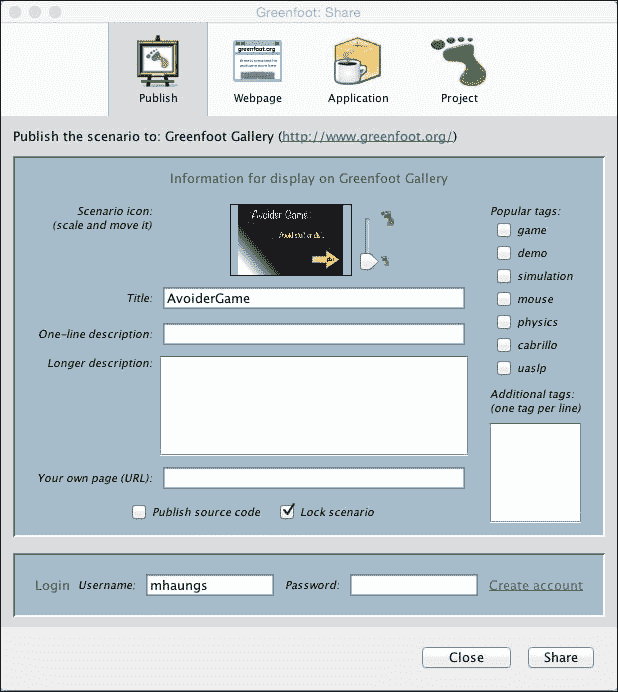
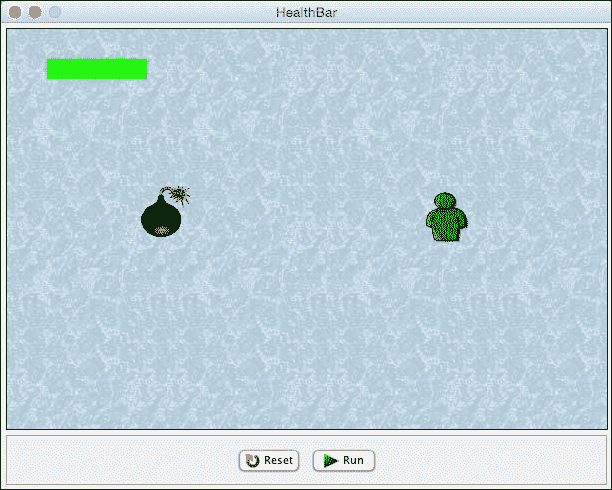

# 第十章。接下来要深入研究什么…

|   | *"悲伤的最佳良药，梅林回答，开始吹嘘，‘是学习。这是唯一不会失败的事情。你可能会在你的解剖结构中颤抖，你可能在夜晚醒来，听着你血管的混乱，你可能失去你唯一的爱情，你可能看到你周围的世界被邪恶的疯子摧毁，或者知道你的荣誉在卑鄙的心灵的下水道中被践踏。那时，唯一的事情就是学习。学习为什么世界摇摆，以及它摇摆什么。这是唯一的事情，心灵永远不会耗尽，永远不会疏远，永远不会被折磨，永远不会害怕或怀疑，永远不会梦想后悔。学习是你唯一的事情。看看有多少东西可以学习。"* |   |
| --- | --- | --- |
|   | --*T.H.怀特，《曾经和未来的国王》* |

无论你是作为新手程序员、经验丰富的程序员、艺术家、讲故事的人，还是只是一个极度好奇的人开始阅读这本书的，我敢肯定你在旅途中学到了很多。我们已经涵盖了在编写和开发交互式程序中遇到的许多常见问题的解决方案。编写交互式程序不仅需要技术专长，还需要清楚地了解如何吸引和娱乐用户。我们还涵盖了软件设计、代码组织、调试以及面向对象语言的软件开发接受流程。这些技能将转移到未来的编程项目中，即使你最终使用的是不同的编程语言。

在这本书中，我们涵盖了以下主题：

+   动画

+   碰撞检测

+   弹射物

+   交互式应用程序设计和理论

+   滚动和映射的世界

+   人工智能

+   用户界面

+   游戏手柄

无论你开始阅读这本书时的背景如何，你现在都拥有了一组令人印象深刻的创意技能。*让我们不要浪费它们！*向前看，我想挑战你锻炼和提高你的技能。在本章中，我们将探讨实现这一目标的行动方案。

# 建造更大的东西

虽然我们已经构建了一些规模的程序，但我们出于教学和实践的原因，保持了工作的范围较小。然而，你拥有创建大型、复杂娱乐形式的能力。为自己策划一个项目，你觉得这个项目可以通过学习或玩耍，让人保持超过一个小时的兴趣。在你的项目的设计、故事和内容上投入相当多的时间。在编码之前，创建一个故事板，这将作为你项目的提纲，以及你可以向用户（或玩家）展示以获得早期反馈的初始作品。

### 注意

**故事板**

分镜图板是探索电影、戏剧、书籍或任何形式互动娱乐设计的有效方式。对于游戏来说，它们尤其有用。简单来说，分镜图板非常类似于创作你讲述的故事的漫画书。通过分镜图板，漫画书的各个画面被放置在单独的纸张上，这使得重新排列它们的顺序或插入/删除特定场景变得容易。

分镜图板提供了一个快速理解作品顺序、内容和流程的媒介。由于它们可以轻松地钉在墙上以便观看，因此它们在帮助作家、程序员、音乐家和艺术家之间的合作中也非常有效。迪士尼是第一个在他们的流程中使用它们的公司（20 世纪 30 年代）来创造动画故事。

你需要回过头去复习第五章，*交互式应用设计理论*，并遵循那里讨论的想法和过程，仔细地发展你的项目，使其能够吸引用户/玩家。记住，这样的项目需要你通过用户/玩家反馈随着时间的推移扩展项目。

你是否有艺术技能，或者认识一两个擅长创作数字艺术的朋友？请他们帮忙，真正让你的项目看起来更加精致和专业。注意所有细节，并提升项目的各个方面，以改善整体体验。你是一位音乐家吗？或者认识一位？为你的项目添加原创音乐和音效，可以真正提升其影响力。

# 分享你的作品

Greenfoot 为你提供了几种与他人分享你的作品的方式。音乐老师通常会为他的学生安排音乐会，给他们真正的改进动力。同样，你应该始终计划与更广泛的受众分享你的作品。知道你的作品将被展出，这会给你额外的动力，让你在作品中更加细致和详细。更重要的是，分享你的作品提供了收集来自玩家、程序员和游戏设计师宝贵反馈的机会。来自这个受众群体的反馈对于完善你的技能至关重要。

## 在 Greenfoot.org 上发布

Greenfoot 允许你轻松地立即在线分享你的 Greenfoot 场景。在你的场景窗口右上角，你会看到一个**分享…**按钮。此按钮将允许你直接在 Greenfoot 的在线画廊中分享你的场景。通过画廊，任何互联网用户都可以访问、播放、下载并对你的作品发表评论。Greenfoot 在线社区庞大且非常支持人，可以为你提供丰富的反馈和信息。要分享你的作品，请执行以下步骤：

1.  点击**分享**按钮。

1.  点击**发布**标签。

1.  填写*图 1*所示的表格。

1.  点击**提交**。

如果一切顺利，您的项目将在您的网络浏览器中打开。请确保经常检查您的评论，并迅速回复。

图 1：这是 Greenfoot 的场景共享窗口。请注意，您需要 Greenfoot 账户才能在线分享您的作品

## 桌面应用程序

将 Greenfoot 场景导出为桌面应用程序甚至更容易。为此，请执行以下步骤：

1.  点击**分享…**按钮。

1.  点击**应用程序**选项卡。

1.  选择您想要创建可执行文件的位置。

1.  点击**导出**。

您现在可以双击创建的`.jar`文件，您的场景将运行。*图 2*显示了您的应用程序在此环境中的外观。请注意，您没有 Greenfoot 的代码编辑功能。

图 2：这是 Greenfoot 中将场景导出为应用程序的示例

## 导出为网页

通过前面提到的相同共享机制，您可以导出您的场景为网页。您只有在拥有自己的网络空间或托管服务，允许您上传自定义网页的情况下才需要使用此选项。

# 探索其他输入设备

我们在第九章*Greenfoot 中的游戏手柄*中花费了不少时间，讨论了游戏手柄及其如何增强用户体验。您还可以连接其他非常有趣的设备到您的 Greenfoot 场景中。例如，您可以将 Leap Motion 或 Microsoft Kinect 设备连接起来，提供一种非常独特且引人入胜的用户交互形式。此外，您还可以使用 Greenfoot 来控制 Finch 机器人等设备。

这为您提供了一个全新的途径来锻炼您的创造力。以下是可以咨询的资源，以了解更多关于连接这些设备的信息：

+   对于 Leap Motion，请参阅[`developer.leapmotion.com/getting-started`](https://developer.leapmotion.com/getting-started)

+   对于 Microsoft Kinect，请参阅[`www.greenfoot.org/doc/kinect`](http://www.greenfoot.org/doc/kinect)

+   对于 Finch 机器人，请参阅[`www.greenfoot.org/doc/finch`](http://www.greenfoot.org/doc/finch)

# 学习更多 Java

您已经学到了很多关于 Java 的知识。在本书的整个过程中，您已经使用了变量、方法、类、对象、继承和多态，但我们没有涵盖 Java 的一些关键领域，包括高级文件 I/O、网络、线程和 Swing（一个 GUI 小部件工具包）。Java 是一种工业级语言，用于从编程烤面包机到提供大型在线金融系统的一切。了解 Java 将使您能够创建游戏、移动应用程序、Web 应用程序以及更多更多。为了继续您的 Java 学习，您应该考虑阅读以下资源：

+   **Java 教程**：[`docs.oracle.com/javase/tutorial/`](http://docs.oracle.com/javase/tutorial/)

+   **Coursera**: [`www.coursera.org`](https://www.coursera.org)

+   **Lynda**: [`lynda.com`](http://lynda.com)

+   **Packt Publishing**: [`www.packtpub.com`](https://www.packtpub.com)

# 摘要

在撰写这本书的过程中，我试图想象你在阅读本书时的创造力、遇到的困难和成功。我希望为你提供一条既具有挑战性，又不会让你因与当前任务无关的事实和信息而负担过重的路径。现在，我意识到我将错过与你进行这次讨论的机会。我希望你在这本书中找到了一些有价值的内容，并从中获得了灵感去创造。这是我们讨论的结束，但却是你与 Greenfoot 一起进行创造性旅程的开始。
