# 第一章：领域驱动设计的理由

任何服从任何权威而不是理性的人都不能被称为理性或道德的。

——玛丽·沃斯通克拉夫特

根据 2020 年 2 月发布的**项目管理协会（PMI**）的《职业脉搏》报告，只有 77%的所有项目达到预期目标——即使在最成熟的组织中也是如此。对于不太成熟的组织，这个数字下降到仅为 56%；也就是说，大约每两个项目中就有一个没有达到预期目标。此外，大约每五个项目中就有一个被宣布为彻底失败。与此同时，我们似乎也在着手进行我们最雄心勃勃和最复杂的项目。

在本章中，我们将探讨项目失败的主要原因，并查看应用**领域驱动设计（DDD**）如何提供一套指南和技术，以提高我们成功的几率。虽然埃里克·埃文斯在 2003 年就写下了关于这个主题的经典书籍，但我们来看为什么这项工作在今天仍然极其相关。

在本章中，我们将涵盖以下主题：

+   理解软件项目失败的原因

+   现代系统的特征和应对复杂性

+   领域驱动设计简介

+   回顾为什么 DDD 今天仍然相关

到本章结束时，你将获得对 DDD 的基本理解，以及为什么在架构/实现现代软件应用时，你应该强烈考虑应用 DDD 的原则，特别是对于更复杂的应用。

# 为什么软件项目会失败？

失败仅仅是开始再次尝试的机会，这次更加明智。

——亨利·福特

根据 PMI 的《项目管理杂志》发布的项目成功报告，以下六个因素必须真实存在，一个项目才能被认为是成功的：

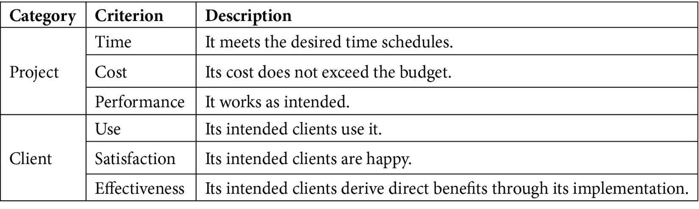

表 1.1 – 项目成功因素

在应用所有这些标准来评估项目成功的情况下，大量项目由于各种原因而失败。让我们更详细地考察一些主要原因。

## 不准确的需求

PMI 的《职业脉搏》报告（2017 年）强调了一个非常明显的事实——绝大多数项目失败是由于不准确或误解的需求。因此，如果建成了错误的东西，那么就不可能建成客户可以使用、满意并且使他们工作更有效率的东西——更不用说项目能否按时并在预算内完成。

IT 团队，尤其是在大型组织中，由单一技能角色组成，如 UX 设计师、开发者、测试员、架构师、业务分析师、项目经理、产品所有者和业务赞助人。在许多情况下，这些人属于不同的组织单位/部门——每个单位/部门都有自己的优先级和动机。更糟糕的是，这些人之间的地理分隔还在不断加大。为了降低成本和最近的 COVID-19 生态系统也不利于解决这个问题。

![Figure 1.1 – 隔离思维和信息保真度损失]

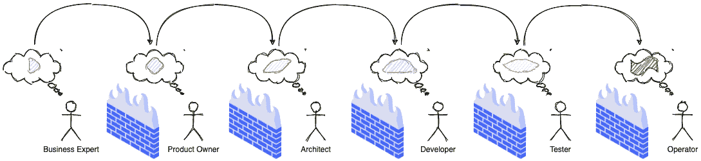

图 1.1 – 隔离思维和信息保真度损失

所有这些都导致在装配线每个阶段的信息保真度下降，进而导致误解、不准确、延误，最终失败！

## 过多的架构

编写复杂的软件是一项相当艰巨的任务。你不能只是坐下来开始敲代码——尽管这种方法在某些简单情况下可能有效。在将业务理念转化为可工作的软件之前，对当前问题的彻底理解是必要的。例如，如果不了解信用卡是如何工作的，就不可能（或者至少非常困难）构建信用卡软件。为了传达你对问题的理解，在编写代码之前创建软件模型来表示问题及其解决方案的架构是很常见的。

努力创建一个完美的问题模型——在非常广泛的背景下都是准确的——并不亚于传说中的圣杯之旅。负责产生架构的人可能会陷入分析瘫痪和/或前期大设计，产生出过于高级、充满幻想、镀金、口号驱动或脱离现实世界的工件——而未能解决任何真正的业务问题。这种锁定在项目早期阶段，当团队成员的知识水平还在上升时，可能会特别有害。不用说，采用这种方法的项目的成功往往难以持续。

小贴士

要获取建模反模式的更全面列表，请参考 Scott W. Ambler 的网站([`agilemodeling.com/essays/enterpriseModelingAntiPatterns.htm`](http://agilemodeling.com/essays/enterpriseModelingAntiPatterns.htm))和书籍，《敏捷建模：极限编程和统一过程的实用方法》，该书专门论述了这一主题。

## 架构过少

敏捷软件开发方法在 20 世纪 90 年代末和 21 世纪初显现出来，是对被称为“瀑布”的重量级流程的反应。这些流程似乎更倾向于前期的大规模设计和基于愿望、理想世界场景的抽象象牙塔思维。这是基于这样一个前提：提前深思熟虑可以避免在项目进展过程中出现严重的开发问题。

相比之下，敏捷方法似乎更倾向于一种更加灵活和迭代的软件开发方法，高度关注可工作的软件而不是其他工件，如文档。如今，大多数团队都声称在实践某种形式的迭代软件开发。然而，这种对声称符合特定敏捷方法论家族而不是基本原理的执着，导致许多团队误解了“足够的架构”与“没有明显架构”之间的区别。这导致了一种情况，即添加新功能或增强现有功能所需的时间比以前更长——这进而加速了解决方案的退化，变成了令人恐惧的“大泥球”（[`www.laputan.org/mud/mud.html#BigBallOfMud`](http://www.laputan.org/mud/mud.html#BigBallOfMud)）。

## 过度的偶然复杂性

迈克·科恩（Mike Cohn）普及了测试金字塔的概念，他在其中谈到，大量的单元测试应该构成一个健全测试策略的基础——随着你向上移动金字塔，数字会显著减少。这里的逻辑是，随着你向上移动金字塔，维护成本急剧上升，而执行速度却大幅下降。然而，在现实中，许多团队似乎采用了与此完全相反的策略——被称为测试冰淇淋锥形，如图所示：

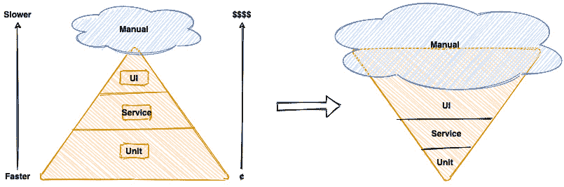

图 1.2 – 测试策略：期望与现实

测试冰淇淋锥形是弗雷德·布鲁克斯在其经典论文《没有银弹——软件工程中的本质与偶然》中提到的偶然复杂性的一个典型案例（[`worrydream.com/refs/Brooks-NoSilverBullet.pdf`](http://worrydream.com/refs/Brooks-NoSilverBullet.pdf)）。所有软件都有一定程度的本质复杂性，这是解决问题的固有属性。这在为非平凡问题创建解决方案时尤其如此。然而，偶然或意外的复杂性并不是直接归因于问题本身——而是由涉及人员的局限性、他们的技能水平、工具和/或使用的抽象造成的。不关注偶然复杂性会导致团队偏离关注真正的问题，解决这些问题可以提供最大的价值。因此，这样的团队成功的机会显著降低。

## 无法控制的债务

财务债务是指从外部借款以快速资助企业的运营——承诺及时偿还本金加上约定的利率。在适当的条件下，这可以显著加速企业的增长，同时允许所有者保留所有权、降低税收和较低的利率。另一方面，如果不能按时偿还这笔债务，可能会对信用评级产生不利影响，导致利率上升、现金流困难和其他限制。

技术债务是当开发团队采取可能不是最佳的行动来加速一组功能或项目的交付时产生的。在一段时间内，就像借款允许你比其他方式更快地做事一样，技术债务可以带来短期速度。然而，从长远来看，软件团队将不得不投入更多的时间和精力来简单地管理复杂性，而不是思考产生架构上合理的解决方案。这可能导致以下图中所示的恶性负面循环：

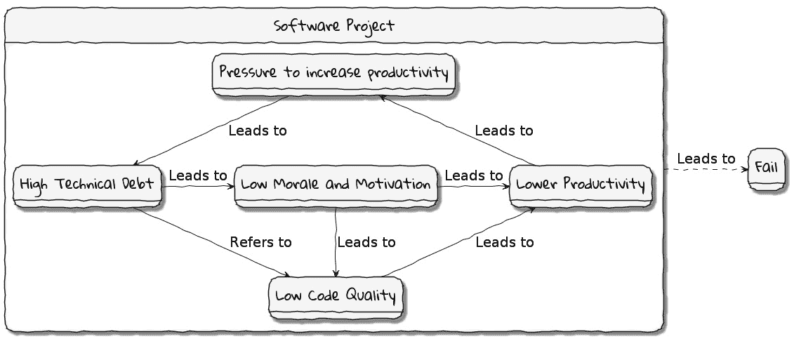

图 1.3 – 技术债务：影响

在最近麦肯锡公司对 CIOs 进行的一项调查（[`www.mckinsey.com/business-functions/mckinsey-digital/our-insights/tech-debt-reclaiming-tech-equity`](https://www.mckinsey.com/business-functions/mckinsey-digital/our-insights/tech-debt-reclaiming-tech-equity)）中，大约 60%的受访者表示，过去 3 年中技术债务的数量有所增加。与此同时，超过 90%的 CIOs 将不到五分之一的科技预算用于偿还债务。马丁·福勒探讨了([`martinfowler.com/articles/is-quality-worth-cost.html#WeAreUsedToATrade-offBetweenQualityAndCost`](https://martinfowler.com/articles/is-quality-worth-cost.html#WeAreUsedToATrade-offBetweenQualityAndCost))高软件质量（或缺乏质量）与增强软件的可预测性之间的深层相关性。虽然携带一定量的技术债务是不可避免的，也是商业活动的一部分，但没有计划系统地偿还这些债务可能会对团队生产力和交付价值的能力产生严重影响。

## 忽略非功能性需求

利益相关者通常希望软件开发团队将大部分（如果不是全部）时间用于开发提供增强功能的功能。考虑到这些功能提供了最高的投资回报率，这是可以理解的。这些功能被称为功能需求。

非功能性需求（有时也称为跨功能性需求），另一方面，是指那些不直接影响功能但会对使用和维护这些系统的人的效率产生深远影响的系统方面。有许多种类的 NFR。以下图中展示了常见 NFR 的部分列表：

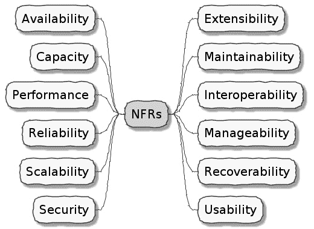

图 1.4 – 非功能性需求（NFRs）

用户很少会明确要求非功能性需求（NFRs），但他们几乎总是期望这些功能成为他们使用的任何系统的一部分。很多时候，系统可能在没有满足非功能性需求的情况下继续运行，但这会对用户体验的“质量”产生不利影响。例如，在低负载下加载时间不到 1 秒，而在高负载下加载时间超过 30 秒的网站主页，在压力时期可能无法使用。不用说，如果不以与显式、增值的功能特性相同的标准来对待非功能性需求，可能会导致无法使用的系统——进而导致失败。

在本节中，我们探讨了导致软件项目失败的一些常见原因。我们能否提高我们的胜算？在我们这样做之前，让我们看看现代软件系统的本质以及我们如何应对随之而来的复杂性。

# 现代系统和处理复杂性

我们不能用创造问题的同一层次的思维来解决我们的问题。

—— 阿尔伯特·爱因斯坦

正如我们在上一节中看到的，软件项目失败有几个原因。在本节中，我们将尝试理解软件是如何被构建的，目前存在的现实情况是什么，以及我们需要做出哪些调整来应对。

## 软件是如何被构建的

构建成功的软件是一个不断精炼知识和以模型形式表达的过程。我们试图在这里从高层次上捕捉这一过程的精髓：

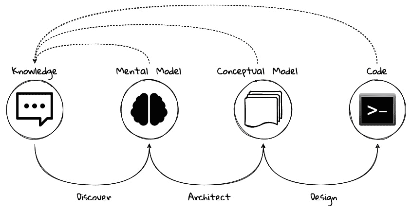

图 1.5 – 开发软件是一个持续的知识和模型精炼过程

在我们将解决方案以工作代码的形式表达出来之前，有必要理解问题所包含的“什么”，为什么这个问题需要解决，以及最后“如何”解决它。无论使用的方法论（瀑布、敏捷，以及两者之间的任何方法），构建软件的过程都是一个需要我们不断运用知识来精炼心理/概念模型，以便能够创造有价值的解决方案的过程。

## 复杂性是不可避免的

我们发现自己正处于第四次工业革命之中，世界正变得越来越数字化——技术成为企业价值的重要驱动力。正如摩尔定律所展示的，计算技术已经取得了指数级的进步：

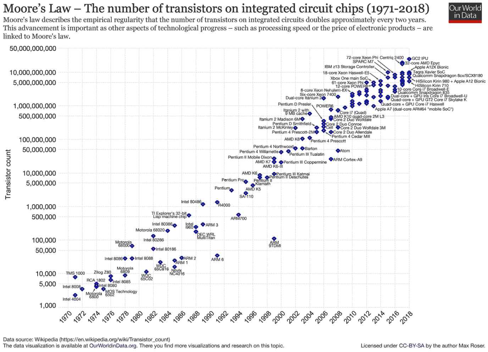

图 1.6 – 摩尔定律

这也与互联网的兴起相吻合。

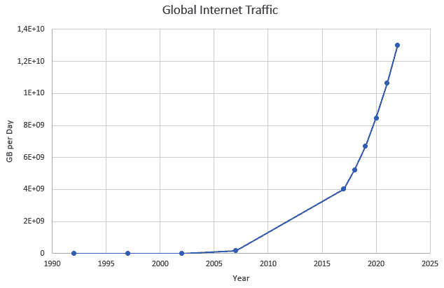

图 1.7 – 全球互联网流量

这意味着公司需要比以往任何时候都要更快地现代化他们的软件系统。伴随着所有这些，商品计算服务的出现，如公共云，导致了从昂贵的集中式计算系统转向更分散的计算生态系统。当我们试图构建最复杂的解决方案时，单体正在被分布式、协作的微服务环境所取代。现代哲学和实践，如自动化测试、架构适应性函数、持续集成、持续交付、DevOps、安全自动化和基础设施即代码等，正在颠覆我们交付软件解决方案的方式。

所有这些进步都引入了自己的复杂性。而不是试图控制复杂性的数量，我们需要接受并应对它。

## 优化反馈循环

随着我们进入遇到最复杂商业问题的时代，我们需要拥抱新的思维方式、发展哲学和一系列技术，以迭代地进化成熟的软件解决方案，这些解决方案将经受住时间的考验。我们需要更好的沟通方式、分析问题、达成共识、创建和建模抽象，然后实施和增强解决方案。

明白地说——我们都在用看似绝妙的商业理念一边构建软件，另一边则是我们不断要求苛刻的客户，正如这里所示：

![图 1.8 – 软件交付连续体

![图片/B16716_Figure_1.8.jpg]

图 1.8 – 软件交付连续体

在此过程中，我们需要跨越两个鸿沟——*交付管道*和*反馈管道*。交付管道使我们能够将软件交到客户手中，而反馈管道则允许我们调整和适应。正如我们所见，这是一个连续体。如果我们想要构建更好、更有价值的软件，这个连续体，这个可能无限循环的过程，必须得到优化！

为了优化这个循环，我们需要三个特征同时存在：我们需要快速、我们需要可靠，并且我们需要不断地重复这样做。换句话说，我们需要快速、可靠和可重复——同时！去掉任何一个，它都无法持续。

领域驱动设计（DDD）承诺以系统化的方式提供答案。在接下来的章节中，以及本书的其余部分，我们将探讨领域驱动设计（DDD）是什么，以及为什么在为当今大规模分布式团队和应用程序中的非平凡问题提供解决方案时，它是不可或缺的。

# 什么是领域驱动设计（DDD）？

生活其实很简单，但我们却坚持让它变得复杂。

—— 孔子

在上一节中，我们看到了众多原因以及系统复杂性是如何阻碍软件项目成功的。DDD（领域驱动设计）的概念，最初由埃里克·埃文斯在其 2003 年的著作中提出，是一种专注于以模型的形式表达软件解决方案的软件开发方法，该模型紧密体现了所解决问题的核心。它提供了一套原则和系统化的技术，以分析、设计和实现软件解决方案，从而提高成功的可能性。

虽然埃文斯的工作确实是开创性的、突破性的，并且远远领先于其时代，但它并不具有规范性。这实际上是一种优势，因为它使得 DDD 的演变超越了埃文斯当时所构想的。另一方面，这也使得定义 DDD 实际上包含的内容变得极其困难，使得实际应用成为一个挑战。在本节中，我们将探讨 DDD 背后的某些基础术语和概念。这些概念的详细阐述和实际应用将在本书的后续章节中展开。

当遇到复杂的企业问题时，DDD 建议采取以下措施：

+   **理解问题**：为了对问题有一个深入、共享的理解，商业和技术专家需要紧密合作。在这里，我们共同理解问题的本质以及为什么解决问题是有价值的。这被称为问题的**领域**。

+   **将问题分解为更易管理的部分**：为了保持复杂性在可管理的水平，将复杂问题分解为更小、可独立解决的组成部分。这些部分被称为**子领域**。如果子领域仍然过于复杂，可能还需要进一步分解子领域。为每个子领域分配明确的边界以限制其功能。这个边界被称为该子领域的**边界上下文**。也可能方便地将子领域视为对领域专家（在问题空间中）更有意义的概念，而边界上下文是对技术专家（在解决方案空间中）更有意义的概念。

+   对于这些边界上下文中的每一个，都要做以下事情：

    +   **达成共识的共享语言**：通过建立一个适用于子领域范围内的明确共享语言来正式化理解。这种共享语言被称为领域的通用语言。

    +   **在共享模型中表达理解**：为了生成可工作的软件，将通用语言以共享模型的形式表达出来。这个模型被称为**领域模型**。可能存在多个这种模型的变体，每个变体旨在阐明解决方案的特定方面，例如，流程模型、序列图、工作代码和部署拓扑。

    +   **拥抱问题的偶然复杂性**：需要注意的是，无法回避给定问题的本质复杂性。通过将问题分解为子域和边界上下文，我们试图将其（或多或少）均匀地分布在更易于管理的部分。

    +   **持续进化以获得更深入的洞察**：重要的是要理解，之前的步骤并不是一次性的活动。企业、技术、流程以及我们对这些的理解都在不断进化，因此，我们的共同理解需要通过持续的重构与这些模型保持同步。

这里展示了 DDD 本质的图示表示：

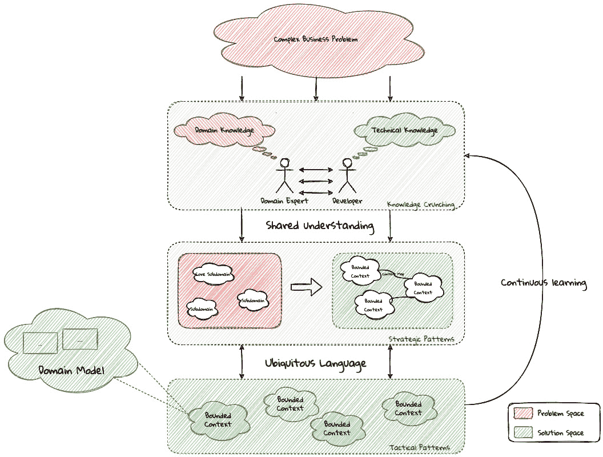

图 1.9 – DDD 的本质

我们认识到，这只是一个关于领域驱动设计（DDD）主题的快速介绍。

## 使用战略设计理解问题

在本节中，让我们揭开在使用 DDD 时一些常用概念和术语的神秘面纱。首先，我们需要理解我们所说的第一个 *D* —— **领域**。

### 什么是领域？

在使用领域驱动设计（DDD）时，基础概念是领域这一概念。但领域究竟是什么？这个词“领域”起源于 17 世纪，源自古老的法语单词 *domaine*（权力）和拉丁语单词 *dominium*（财产、所有权），是一个相当令人困惑的词。根据谁、何时、何地以及如何使用，它可以有不同的含义。

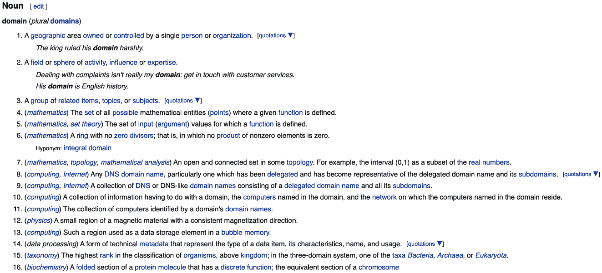

图 1.10 – 领域的含义随上下文而变化

然而，在商业的背景下，这个词“领域”涵盖了其主要活动的整体范围——它向客户提供的服务。这也被称为**问题域**。例如，特斯拉在电动汽车领域运营，Netflix 提供在线电影和电视节目，麦当劳提供快餐。一些公司，如亚马逊，在多个领域提供服务——在线零售和云计算等。一个企业的领域（至少是成功的那些）几乎总是包含相当复杂和抽象的概念。为了应对这种复杂性，通常将这些领域分解成更易于管理的部分，称为子域。接下来，让我们更详细地了解子域。

### 什么是子域？

在本质上，DDD 提供了解决复杂性的方法。工程师通过将复杂问题分解为更易于管理的子域来实现这一点。这有助于更好地理解，并使找到解决方案变得更加容易。例如，在线零售领域可以划分为如产品、库存、奖励、购物车、订单管理、支付和运输等子域，如下面的图所示：

图 1.11 – 零售中的子域

在某些商业活动中，子域本身可能变得非常复杂，可能需要进一步的分解。例如，在零售的例子中，可能需要将产品子域进一步分解成更基本的子域，如目录、搜索、推荐和评论，如图所示：

![图 1.12 – 产品子域中的子域

![图片 B16716_Figure_1.12.jpg]

图 1.12 – 产品子域中的子域

可能需要进一步分解子域，直到达到可管理的复杂度水平。领域分解是领域驱动设计（DDD）的一个重要方面。让我们看看子域的类型，以便更好地理解这一点。

重要提示

“域”和“子域”这两个术语往往被交替使用，这可能会让旁观者感到困惑。鉴于子域往往非常复杂且具有层次结构，一个子域本身就可以成为一个域。

#### 子域类型

将一个复杂的领域分解成更易于管理的子域是一件好事。然而，并非所有子域都是平等的。在任何一个商业活动中，你可能会遇到以下三种类型的子域：

+   **核心**：商业的主要关注领域。这是提供最大差异化和价值的地方。因此，自然地，人们会希望将最多的关注放在核心子域上。在零售的例子中，购物车和订单可能是最大的差异化因素——因此可能形成该商业冒险的核心子域。鉴于这是企业希望拥有最大控制权的地方，内部实施核心子域是明智的。在在线零售的例子中，企业可能希望专注于提供在线订单的丰富体验。这将使**在线订单**和**购物车**成为核心子域的一部分。

+   **支持性**：就像每部伟大的电影都需要一个坚实的配角阵容才能成为杰作一样，支持性或辅助性子域也是如此。支持性子域通常非常重要且非常必要，但可能不是运营业务的主要焦点。尽管这些支持性子域对于运营业务是必要的，但通常不会提供显著的竞争优势。因此，甚至可以完全外包这项工作或使用现成的解决方案，或者进行一些小的调整。以零售为例，假设在线订购是这个业务的主要焦点，目录管理可能就是一个支持性子域。

+   **通用**：在与商业应用打交道时，你需要提供一组与正在解决的问题**不直接相关**的能力。因此，仅仅使用现成的解决方案可能就足够了。以零售为例，身份验证、审计和活动跟踪子域可能就属于这一类别。

重要提示

重要的是要注意，核心、支持性或通用子领域这一概念非常具体。对一家企业来说是核心的，对另一家企业来说可能是支持性或通用性。识别和提炼核心领域需要深入了解和经验，了解正在尝试解决的问题。 

由于核心子领域建立了大部分业务差异化，因此明智的做法是将最多的精力投入到维护这种差异化上。这如图中的核心领域图所示：

![图 1.13 – 子领域的重要性

![图片 B16716_Figure_1.13.jpg]

图 1.13 – 子领域的重要性

随着时间的推移，竞争对手尝试模仿您的成功是自然而然的事情。新的、更高效的方法将会出现，降低涉及的复杂性并扰乱您的核心。这可能会导致目前核心的概念发生转变，成为支持性或通用能力，如图所示：

![图 1.14 – 核心领域侵蚀

![图片 B16716_Figure_1.14.jpg]

图 1.14 – 核心领域侵蚀

为了继续运营一个成功的业务，需要在核心上不断进行创新。例如，当 AWS 开始云计算业务时，它只提供简单的基础设施（IaaS）解决方案。然而，随着微软和谷歌等竞争对手开始迎头赶上，AWS 不得不提供几个额外的增值服务（例如，PaaS 和 SaaS）。

如所示，这不仅仅是一个工程问题。它需要深入了解潜在的业务。这就是领域专家可以发挥重要作用的地方。

### 领域和技术专家

任何现代软件团队都需要至少在两个领域拥有专业知识——领域的功能以及将其转化为高质量软件的艺术。在大多数组织中，这些至少存在为两个不同的群体：

+   **领域专家**：那些对领域有深入和亲密理解的人。领域专家是**领域专家**（SMEs），他们对业务有非常强的掌握。领域专家可能具有不同程度的专长。一些 SMEs 可能选择在特定子领域专业化，而其他人可能对整个业务如何运作有更广泛的理解。

+   **技术专家**：另一方面，喜欢解决具体、可量化的计算机科学问题。通常，技术专家并不觉得了解他们所在业务的环境值得他们投入精力。相反，他们似乎过于渴望只提升他们在学术界学习延续的技术技能。

当领域专家指定“为什么”和“是什么”时，技术专家（软件工程师）主要帮助实现“如何”。两组之间的强大合作和协同作用对于确保持续的高性能和成功至关重要。

### 来自语言的分歧

虽然这些团队之间的紧密合作是必要的，但重要的是要认识到，这些人似乎有截然不同的动机和思维方式。表面上，这似乎仅限于他们日常语言中的差异。然而，更深入的分析通常揭示出在目标、动机等方面存在更大的分歧。这一点在本图中有体现：

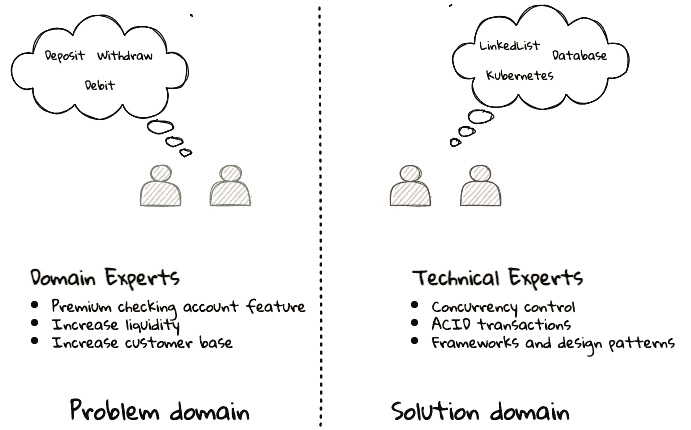

图 1.15 – 语言起源的划分

但这本书主要关注技术专家。我们的观点是，仅仅通过解决技术难题而不对基础商业环境有深入理解，是不可能取得成功的。

我们对组织的每一个决策，无论是需求、架构还是代码，都会产生商业和用户后果。为了有效地构思、设计、构建和演进软件，我们的决策需要帮助创造最佳的商业影响。正如之前提到的，这只能在我们对要解决的问题有清晰理解的情况下实现。这使我们认识到，在解决问题的解决方案中存在两个截然不同的*域*。

注意

在这个上下文中，使用“域”一词是抽象意义上的，不要与之前介绍的商业域概念混淆。

### 问题域

这是一个术语，用于捕捉仅定义问题而有意避免任何解决方案细节的信息。它包括诸如*为什么*我们试图解决问题、*我们试图实现什么*以及*如何解决*等细节。重要的是要注意，*为什么*、*是什么*和*如何*是从客户/利益相关者的角度出发，而不是从提供软件解决方案的工程师的角度出发。

考虑一个零售银行的例子，该银行已经为其客户提供支票账户功能。他们希望获得更多流动资金。他们需要鼓励客户保持更高的账户余额来实现这一点。他们正在寻求推出一个名为*高级支票账户*的新产品，该产品具有更高的利率、透支保护和免费 ATM 访问等附加功能。以下是以*为什么*、*是什么*和*如何*的形式表达的问题域：

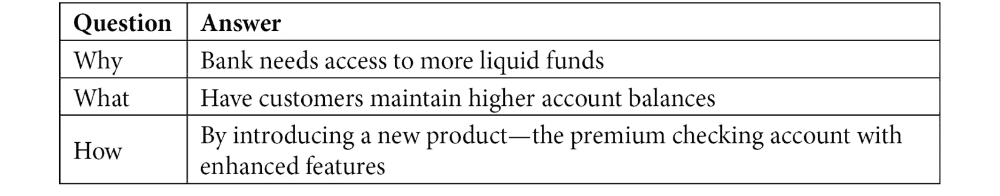

表 1.2 – 问题域：为什么、是什么以及如何

现在我们已经定义了问题和与之相关的动机，让我们来看看它如何能指导解决方案。

### 解决方案域

术语，用于描述解决方案开发的环境。换句话说，将需求转化为工作软件的过程（这包括设计、开发、测试和部署）。在这里，重点是如何从软件实现的角度解决被解决的问题。然而，如果没有对“为什么”和“是什么”的理解，很难找到解决方案。

建立在之前的优质支票账户示例之上，这个问题的代码级解决方案可能看起来像这样：

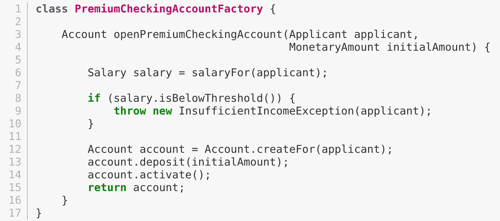

这可能看起来是从问题域描述到问题的一个重大飞跃，确实如此。在达到这样的解决方案之前，可能需要存在多个级别的问题细化。这个过程通常是混乱的，可能会导致对问题的理解不准确，从而导致一个可能很好（例如，从工程、软件架构的角度来看是合理的）但不是解决当前问题的解决方案。让我们看看我们如何通过缩小问题和解决方案域之间的差距来不断细化我们的理解。

## 使用通用语言促进共同理解

以前，我们看到了组织壁垒如何导致有价值的信息被稀释。在我曾经工作的一家信用卡公司，塑料、支付工具、账户、**PAN**（**主要账户号码**）、**BIN**（**银行识别号码**）和卡片这些词都被不同的团队成员用来指代同一个东西——**信用卡**——当他们在应用的同区域内工作时。另一方面，像*用户*这样的术语有时会被用来指代客户、关系经理或技术客户支持员工。更糟糕的是，很多这些混乱的术语也被应用到代码中。虽然这可能看起来是一件微不足道的事情，但它有着深远的影响。产品专家、架构师和开发者来了又去，每个人都逐渐增加了更多的混乱、混乱的设计、实施和技术债务，加速了走向令人恐惧的、难以维护的大泥球（[`www.laputan.org/mud/`](http://www.laputan.org/mud/)）的过程。

DDD 倡导打破这些人为的障碍，通过共同努力创建 DDD 所说的*通用语言*——一个共享的术语、单词和短语词汇，以不断增进整个团队的理解。这种说法随后被积极用于解决方案的各个方面：日常词汇、设计、代码——简而言之，由*每个人*和*每个地方*使用。一致地使用这种常见的通用语言有助于加强共同的理解，并产生更好地反映领域专家心智模型的解决方案。

### 领域模型和解决方案的演变

通用语言有助于在团队成员之间建立一致、尽管是非正式的术语。为了提高理解，这可以进一步细化为一套正式的抽象——一个*领域模型*，用于在软件中表示解决方案。当我们面临问题时，我们无意识地试图形成潜在解决方案的心理表征。此外，这些表征（模型）的类型和性质可能因我们的问题理解、背景和经验等因素而大相径庭。这意味着这些模型的不同是自然的。例如，同一问题可能由不同的团队成员以不同的方式思考，如下所示：

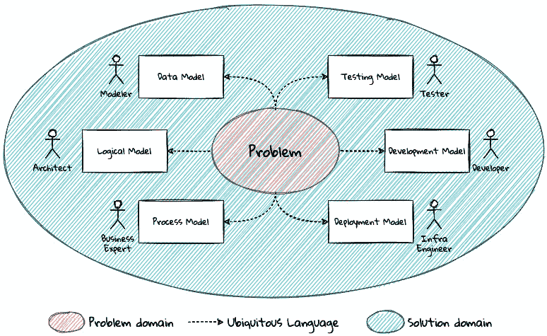

图 1.16 – 多个模型表示解决方案

如此所示，业务专家可能会考虑流程模型，而测试工程师可能会考虑异常和边界条件，以制定测试策略等。

备注

*图 1.16* 描述了多个模型的存在。可能还有其他视角，例如客户体验模型和信息安全模型，这些并未在图中展示。

应当始终注意专注于解决当前的业务问题。如果团队在建模业务逻辑和技术解决方案方面投入相同数量的努力，那么他们将得到更好的服务。为了控制偶然的复杂性，最好将解决方案的基础设施方面与该模型隔离开来。这些模型可以采取多种形式，包括对话、白板会议、文档、图表、测试以及其他形式的架构健康函数。还应注意，这**不是**一次性的活动。随着业务的演变，领域模型和解决方案需要保持同步。这只能通过领域专家和开发者之间的紧密合作来实现。

### 领域模型和边界上下文的范围

在创建领域模型时，一个常见的困境在于决定如何限制这些模型的范围。你可以尝试创建一个单一的领域模型，作为整个问题的解决方案。另一方面，我们可能选择创建极其细粒度的模型，这些模型在没有对其他模型有强烈依赖的情况下无法有意义地存在。每种方法都有其优缺点。无论情况如何，每个解决方案都有一个范围——它被限制在一定的边界内。这个边界被称为**边界上下文**。

在子域和有界上下文这两个术语之间似乎存在很多混淆。它们之间的区别是什么？结果是，子域是问题空间的概念，而有界上下文是解决方案空间的概念。这最好通过一个例子来解释。让我们考虑一个虚构的 Acme 银行，它提供两种产品：信用卡和零售银行。这可能分解为以下子域，如图所示：

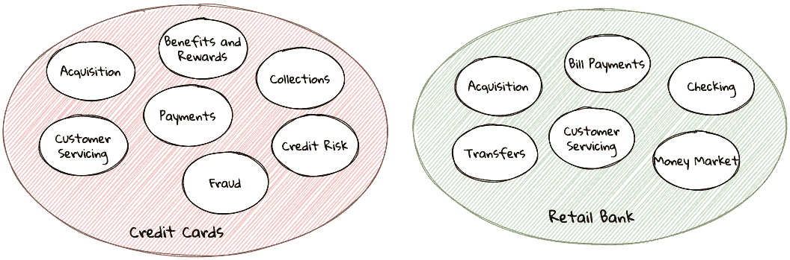

](img/B16716_Figure_1.17.jpg)

图 1.17 – Acme 银行的银行子域

在为问题创建解决方案时，存在许多可能的解决方案选项。我们在这里展示了一些选项：

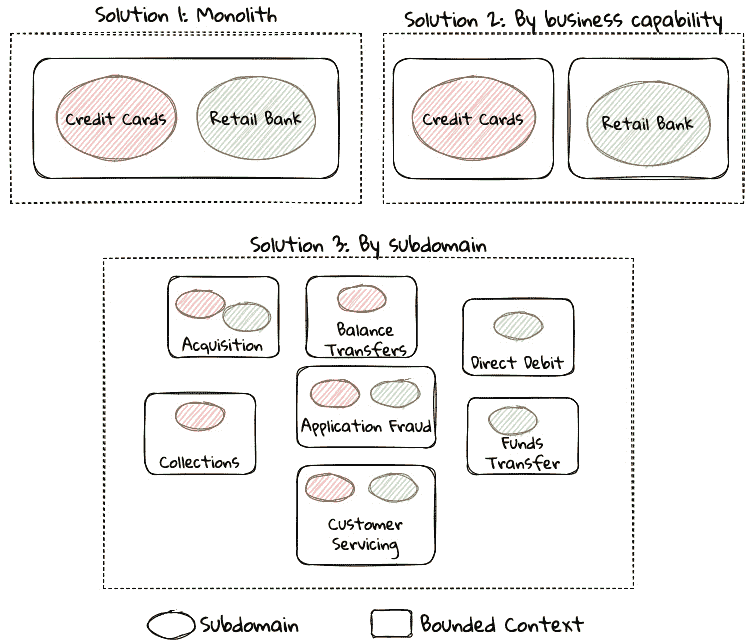

](img/B16716_Figure_1.18.jpg)

图 1.18 – Acme 银行的有界上下文选项

这些只是创建有界上下文的分解模式的几个示例。你可能会选择的特定模式集合可能因当前的现实情况而异，例如以下情况：

+   当前组织结构

+   领域专家的职责

+   关键活动和关键事件

+   现有应用程序

备注

**康威定律**断言，组织被限制在产生与其沟通结构相复制的应用设计。你当前的组织结构可能并不最优地与你的期望解决方案方法对齐。逆向康威机动可能被应用以达到与业务架构的同构。无论使用何种方法将问题分解为一系列有界上下文，都应小心确保它们之间的耦合尽可能低。

虽然有界上下文理想上需要尽可能独立，但它们仍然可能需要相互通信。当使用 DDD 时，整个系统可以表示为一组相互关联的有界上下文。这些关系定义了这些有界上下文如何相互集成，并被称为**上下文图**。这里展示了一个示例上下文图：

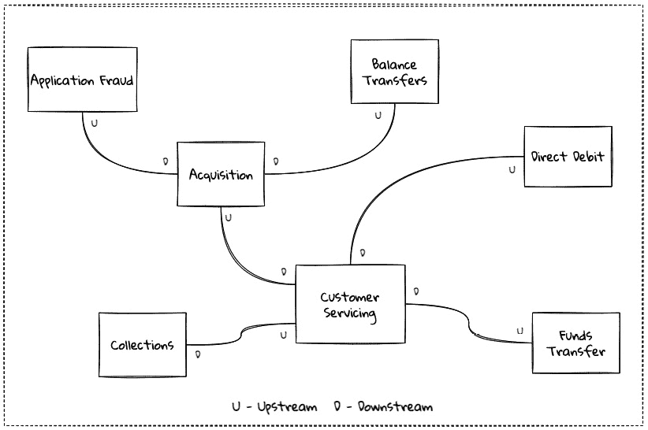

](img/B16716_Figure_1.19.jpg)

图 1.19 – Acme 银行的示例上下文图

上下文图显示了有界上下文及其之间的关系。这些关系可能比这里展示的更为复杂。我们将在第九章“与外部系统集成”中讨论上下文图和通信模式。

我们现在已经介绍了一系列对领域驱动设计（DDD）战略设计原则至关重要的概念。让我们看看一些可以帮助加速这一过程的工具。

在随后的章节中，我们将更详细地巩固这里介绍的所有概念。

在下一节中，我们将探讨为什么那些多年前引入的领域驱动设计（DDD）理念至今仍然非常相关。我们将看到，如果有什么不同的话，它们现在甚至比以往任何时候都更加相关。

## 使用战术设计实施解决方案

在上一节中，我们看到了如何使用战略设计工具达成对问题的共同理解。我们需要利用这种理解来创建解决方案。DDD 的战术设计方面、工具和技术帮助将这种理解转化为可工作的软件。让我们详细看看这些方面。在本书的*第二部分*中，我们将将其应用于解决一个现实世界的问题。

可以将战术设计方面考虑进去，如图所示：

![图 1.20 – DDD 战术设计的元素

![图片 B16716_Figure_1.20.jpg]

图 1.20 – DDD 战术设计的元素

让我们来看看这些元素的定义。

### 值对象

值对象是不可变对象，封装了一个或多个相关属性的*数据和行为*。可以方便地将值对象视为命名的原始数据类型。例如，考虑一个`MonetaryAmount`值对象。一个简单的实现可以包含两个属性——金额和货币代码。这允许封装行为，例如安全地添加两个`MonetaryAmount`对象，如下所示：

![图 1.21 – 简单的 MonetaryAmount 值对象

![图片 B16716_Figure_1.21.jpg]

图 1.21 – 简单的 MonetaryAmount 值对象

有效地使用值对象有助于防止对反模式的原始执着，同时增加清晰度。它还允许使用一个或多个值对象来组合更高层次的抽象。需要注意的是，值对象没有身份的概念。也就是说，具有相同值的两个值被视为相等。因此，两个具有相同金额和货币代码的`MonetaryAmount`对象将被视为相等。此外，重要的是要使值对象不可变。如果需要更改任何属性，应导致创建一个新的属性。

容易将值对象视为一种简单的工程技术，但（不）使用它们的后果可能非常深远。在`MonetaryAmount`示例中，金额和货币代码可以独立作为属性存在。然而，使用`MonetaryAmount`强制了*通用语言*的概念。因此，我们建议将值对象作为默认选项，而不是使用原始数据类型。

批评者可能会迅速指出诸如类爆炸和性能问题等问题。但根据我们的经验，好处通常大于成本。但如果出现问题，可能需要重新审视这种方法。

### 实体

实体是一个具有*唯一标识*的对象，并封装了其属性的*数据和行为*。可能将实体视为需要组合在一起的其它实体和值对象的集合。这里展示了一个非常简单的实体示例：

![图 1.22 – 交易实体的简单表示

![图片 B16716_Figure_1.22.jpg]

图 1.22 – 交易实体的简单表示

与值对象不同，实体具有唯一标识符的概念。这意味着两个具有相同基础值但不同**标识符**（**id**）值的`Transaction`实体将被视为不同。另一方面，具有相同标识符值的两个实体实例被视为相等。此外，与值对象不同，实体是可变的。也就是说，它们的属性可以并且会随时间变化。

值对象和实体的概念取决于它们被使用的上下文。在一个订单管理系统内，*地址*可能在*电子商务*边界上下文中实现为一个值对象，而在*订单履行*边界上下文中可能需要实现为一个实体。

重要提示

通常将实体和值对象统称为*领域对象*。

### 聚合

如前所述，实体是分层的，因为它们可以由一个或多个子实体组成。本质上，聚合具有以下特性：

+   实体通常由其他子实体和值对象组成

+   通过暴露行为（通常称为*命令*）来封装对子实体的访问

+   是一个用于一致性地强制执行业务不变性（规则）的边界

+   是在边界上下文中完成工作的入口点

考虑以下`CheckingAccount`聚合的例子：

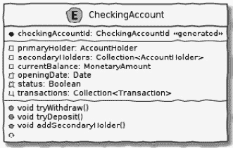

图 1.23 – CheckingAccount 聚合的简单表示

注意`CheckingAccount`是如何由`AccountHolder`和`Transaction`实体以及其他事物组成的。在这个例子中，让我们假设透支功能（保持负账户余额的能力）仅适用于`currentBalance`需要以唯一的`Transaction`形式出现——无论其结果如何。因此，`CheckingAccount`聚合使用`Transaction`实体。尽管`Transaction`具有作为其接口一部分的`approve`和`reject`方法，但只有聚合可以访问这些方法。通过这种方式，聚合强制执行业务不变性，同时保持高度的封装。`tryWithdraw`方法的一个潜在实现如下所示：

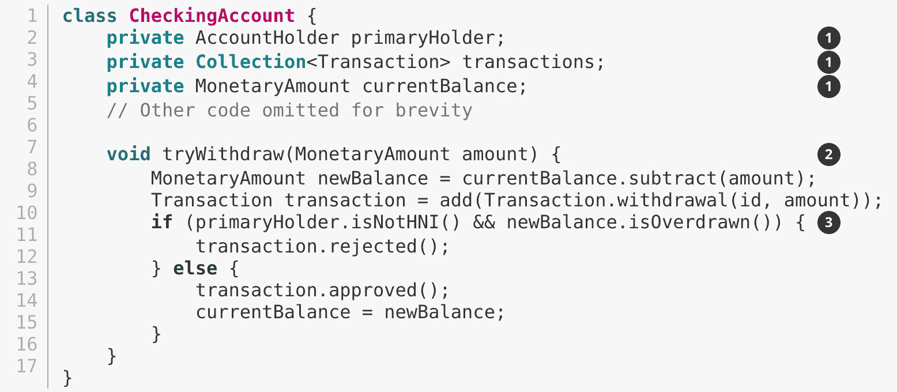

1.  `CheckingAccount`聚合由子实体和值对象组成。

1.  `tryWithdraw`方法充当操作的连续性边界。无论结果如何（批准或拒绝），系统都将保持一致状态。换句话说，`currentBalance`只能在`CheckingAccount`聚合的范围内变化。

1.  聚合强制执行适当的业务不变性（规则），仅允许 HNIs 透支。

重要提示

聚合也被称为聚合根，即实体层次结构中的根对象。在这本书中，我们使用这些术语同义。

### 领域事件

如前所述，聚合体决定了状态变化何时以及如何发生。系统的其他部分可能对了解对业务有重要意义的变更感兴趣，例如，下订单或收到付款。*领域事件*是传达对业务有重要意义的变更的手段。区分系统事件和领域事件很重要。例如，在零售银行的情况下，数据库中*行被保存*或*服务器磁盘空间不足*可能被归类为系统事件，而*存款到支票账户*和*交易中检测到欺诈活动*可能被归类为领域事件。换句话说，领域事件是*领域专家关心的事情*。

可能明智的做法是利用领域事件来减少边界上下文之间的耦合，使其成为领域驱动设计（DDD）的一个关键构建块。

### 仓储

大多数业务都需要数据的持久性。因此，聚合体的状态需要在需要时持久化和检索。仓储是使聚合体实例能够持久化和加载的对象。这在马丁·福勒的《企业应用架构模式》一书中作为*仓储*（[`martinfowler.com/eaaCatalog/repository.html`](https://martinfowler.com/eaaCatalog/repository.html)）模式的一部分有很好的记录。值得注意的是，我们在这里指的是聚合仓储，而不仅仅是任何实体仓储。这个仓储的单一目的是使用其标识符加载聚合体的*单个实例*。需要注意的是，这个仓储不支持使用任何其他方式查找聚合体实例。这是因为业务操作是作为在边界上下文中操作聚合体的单个实例的一部分发生的。

### 工厂

为了与聚合体和值对象一起工作，需要构建这些实例。在简单的情况下，可能只需要使用构造函数来做到这一点。然而，根据封装的状态量，聚合体和值对象实例可能会变得相当复杂。在这种情况下，考虑将对象构建责任委托给聚合体/值对象外部的*工厂*可能是明智的。我们在日常工作中非常常用静态工厂方法、构建器和依赖注入。约书亚·布洛奇在*第二章*，“DDD 适合在哪里以及如何？”中讨论了这种模式的几种变体。

### 服务

当在一个单一的有界上下文中工作时，聚合的公共接口（命令）提供了一个自然的 API。然而，更复杂的业务操作可能需要与多个有界上下文和聚合进行交互。换句话说，我们可能会发现自己处于某些业务操作与任何单个聚合都不自然匹配的情况。即使交互仅限于单一的有界上下文，也可能需要以实现无关的方式公开该功能。在这种情况下，您可以考虑使用称为*服务*的对象。服务至少有三种类型：

+   **领域服务**：为了协调多个聚合之间的操作——例如，在零售银行之间转账两个支票账户。

+   **基础设施服务**：为了与业务非核心的实用程序进行交互——例如，在零售银行进行日志记录和发送电子邮件。

+   **应用服务**：为了协调领域服务、基础设施服务和其它应用服务之间的操作——例如，在成功完成账户间转账后发送电子邮件通知。

服务也可以是有状态的或无状态的。最好让聚合管理状态，利用存储库，同时允许服务协调和/或编排业务流程。在复杂情况下，可能需要管理流程本身的状态。我们将在本书的*第二部分*中查看更多具体的例子。

可能会诱使人们几乎完全使用服务来实现业务逻辑——无意中导致贫血领域模型反模式（[`martinfowler.com/bliki/AnemicDomainModel.html`](https://martinfowler.com/bliki/AnemicDomainModel.html)）。努力将业务逻辑封装在聚合的范围内作为默认做法是值得的。

# 为什么 DDD 是相关的？为什么现在？

有一个为什么而活的人可以忍受几乎任何如何。

——弗里德里希·尼采

在很多方面，当埃里克·埃文斯在 2003 年引入这些概念和原则时，领域驱动设计（DDD）就已经远远领先于其时代。DDD 似乎一直都在不断壮大。在本节中，我们将探讨为什么 DDD 在埃里克·埃文斯在 2003 年撰写关于该主题的书籍时就已经非常相关，而现在更是如此。

## 开源软件的兴起

Eric Evans 在 2017 年探索 DDD 会议的开幕式上，哀叹他的书发布后，即使是实现最简单的概念，如值对象的不变性，也是多么困难。然而，如今，这仅仅是一个导入成熟、文档齐全、经过测试的库的问题，例如 Project Lombok（[`projectlombok.org`](https://projectlombok.org)）或 Immutables（[`immutables.github.io`](https://immutables.github.io)），以在几分钟内变得高效。说开源软件彻底改变了软件行业，这还是低估了它！在撰写本文时，公共 Maven 仓库（[`mvnrepository.com`](https://mvnrepository.com)）索引了令人震惊的**1830 万个工件**，涵盖了从数据库和语言运行时到测试框架等众多流行类别，如图所示：

![图 1.24 – 多年来开源 Java 的发展情况（来源：https://mvnrepository.com/)]

)]

图 1.24 – 多年来开源 Java 的发展情况（来源：[`mvnrepository.com`](https://mvnrepository.com/))

Java 的常青树，如 Spring 框架，以及更近期的创新，如 Spring Boot 和 Quarkus，使得在几分钟内就能创建出生产级别的应用程序变得易如反掌。此外，Axon 和 Lagom 等框架使得实现高级架构模式，如 CQRS 和事件溯源，变得相对简单，这对于实现基于 DDD 的解决方案非常有益。

## 技术进步

DDD 绝非仅仅是关于技术的；它不可能对当时可用的选择完全无动于衷。2003 年是重量级和仪式感重的框架的鼎盛时期，例如**Java 2 Enterprise Edition**（**J2EE**）、**Enterprise JavaBeans**（**EJB**）、SQL 数据库和**对象关系映射**（**ORMs**）——在公共领域，当涉及到构建复杂软件的企业工具和模式时，选择并不多。软件世界已经发展，并从那时起取得了很大的进步。事实上，现代的颠覆性技术，如 Ruby on Rails 和公共云，才刚刚发布。然而，相比之下，我们现在不缺少应用程序框架、NoSQL 数据库和用于创建基础设施组件的程序化 API，这些组件以单调的规律不断发布。

所有这些创新都允许快速实验、持续学习和快速迭代。这些改变游戏规则的技术进步也与互联网和电子商务作为成功开展业务的可行手段的指数级增长相吻合。事实上，互联网的影响如此广泛，以至于几乎无法想象没有数字组件作为核心组成部分来启动业务。最后，智能手机、物联网设备和社交媒体的消费者化和广泛渗透意味着数据的生产速度已经达到了十年前难以想象的程度。这意味着我们正在通过几个数量级来构建和解决最复杂的问题。

## 分布式计算的兴起

曾经有一段时间，构建大型单一实体是默认的做法。但计算技术的指数级增长、公共云（IaaS、PaaS、SaaS 和 FaaS）、大数据存储和处理量的增长，与继续创建更快 CPU 的能力的相对放缓相吻合，这意味着转向更多去中心化的解决问题方法。

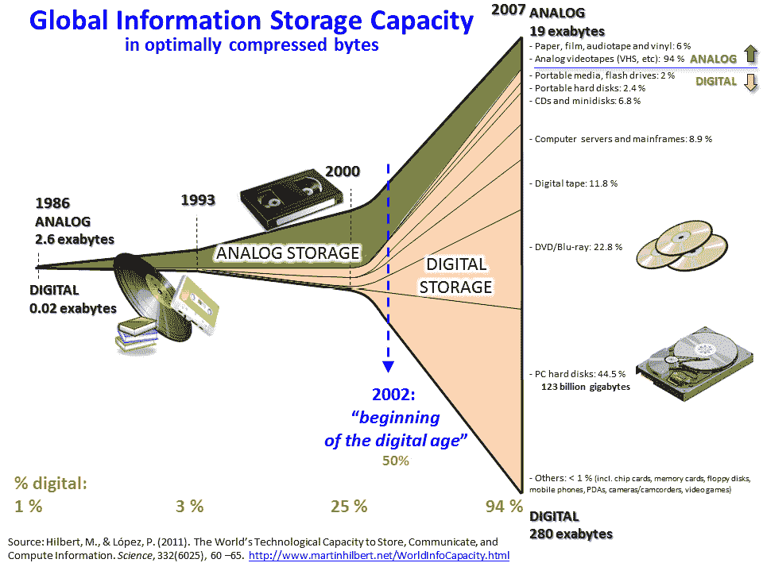

图 1.25 – 全球信息存储容量

DDD（领域驱动设计），通过将难以驾驭的单一实体分解为更易于管理的子域和边界上下文的形式来处理复杂性，自然地融入了这种编程风格。因此，当我们在构建现代解决方案时，对采用 DDD 原则和技术的兴趣重新焕发并不令人惊讶。正如埃里克·埃文斯所说，DDD 现在比最初构想时更加相关！

# 摘要

在本章中，我们探讨了软件项目失败的一些常见原因。我们看到了不准确或误解的需求、架构（或缺乏架构）以及过度的技术债务是如何阻碍实现商业目标和成功的。

我们探讨了 DDD 的基本构建块，如领域、子域、通用语言、领域模型、边界上下文和上下文图。我们还考察了为什么 DDD 的原则和技术在现代微服务和无服务器时代仍然非常相关。你现在应该能够欣赏 DDD 的基本术语，并理解为什么它在当今的背景下很重要。

在下一章中，我们将更深入地探讨 DDD 的实际运作机制。我们将深入研究 DDD 的战略和战术设计元素，并探讨如何使用这些元素来帮助形成更好的沟通和更稳健的设计基础。

# 进一步阅读

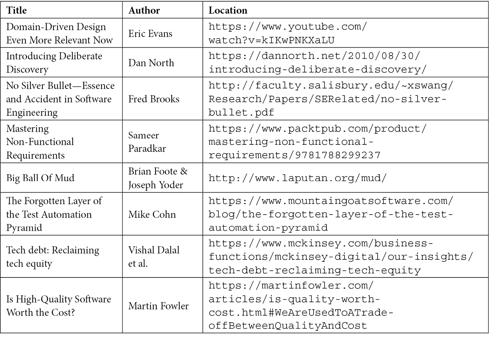
