# *第二章*：DDD 在哪里和如何适用？

“如果我们被目的所吸引，我们就不会被比较所分散。”

——鲍勃·戈夫

软件架构指的是软件系统的基本结构以及创建这些结构和系统的学科。多年来，我们积累了一系列架构风格和编程范式，以帮助我们处理系统复杂性。

在本章中，我们将探讨如何将**领域驱动设计（DDD**）应用于与这些架构风格和编程范式相辅相成的模式。我们还将探讨在构建软件解决方案时，它如何/在哪里融入整体方案。

在本章中，我们将涵盖以下主题：

+   架构风格

+   编程范式

+   应该选择哪种范式？

到本章结束时，你将能够欣赏到各种架构风格和编程范式的优点，以及在使用它们时需要注意的一些陷阱。你还将了解领域驱动设计（DDD）在增强这些架构中的作用。

# 架构风格

领域驱动设计以战略和战术设计元素的形式提供了一套架构原则。这使得你能够将大型、可能难以管理的业务子域分解成良好设计的、独立的边界上下文。

DDD 的一个巨大优势是它不要求使用任何特定的架构。然而，在过去几年中，软件行业已经使用了大量的架构风格。让我们看看 DDD 如何与一系列流行的架构风格结合使用，以得出更好的解决方案。

## 分层架构

**分层架构**是最常见的架构风格之一，解决方案通常组织为四个广泛的类别：**表示层**、**应用层**、**领域层**和**持久层**。每一层都为其代表的特定关注点提供了解决方案，如图所示：

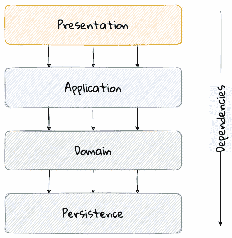

图 2.1 – 分层架构的本质

分层架构背后的主要思想是关注点的分离——层与层之间的依赖关系是单向的（从上到下）。例如，领域层可以依赖于持久层，但不能反过来。此外，任何给定的层通常只访问其下方的层，而不会绕过中间的层。例如，表示层可能只能通过应用层访问领域层。

这种结构使得层与层之间的耦合更加松散，并允许它们相互独立地发展。分层架构的理念与 DDD 的战略和战术设计元素非常契合，如图所示：

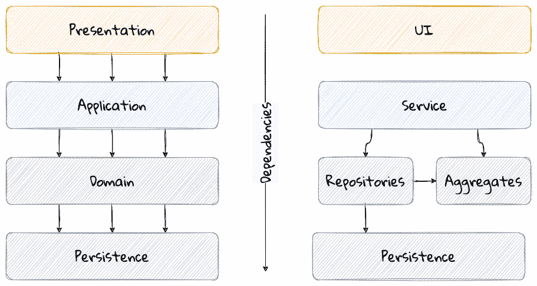

图 2.2 – 分层架构映射到 DDD 的战术设计元素

DDD 积极推广使用分层架构，主要是因为它使得可以独立于其他关注点（如信息如何显示、端到端流程如何管理以及数据如何存储和检索）专注于领域层。从这个角度来看，自然应用 DDD 的解决方案往往也是分层的。

### 显著的变体

分层架构的一种变体是由 Alistair Cockburn 发明的，他最初称之为六边形架构（[`alistair.cockburn.us/hexagonal-architecture/`](https://alistair.cockburn.us/hexagonal-architecture/)），也称为端口和适配器架构。这种风格背后的想法是避免层与层之间（在分层架构中可能会发生）的不自觉依赖，特别是系统核心与外围层之间的依赖。

这里的主要思想是在核心中仅使用接口（端口）来启用现代驱动程序，例如测试和松散耦合。这使得核心可以独立于非核心部分和外部依赖进行开发和演进。通过端口的具体实现（适配器）与数据库、文件系统、网络服务等现实世界组件的集成得以实现。在核心中使用接口使得在隔离系统其他部分的情况下对核心进行测试变得容易得多，可以使用模拟和存根。在端到端环境中与真实系统一起工作时，也常见使用依赖注入框架动态替换这些接口的实现。这里展示了六边形架构的视觉表示：

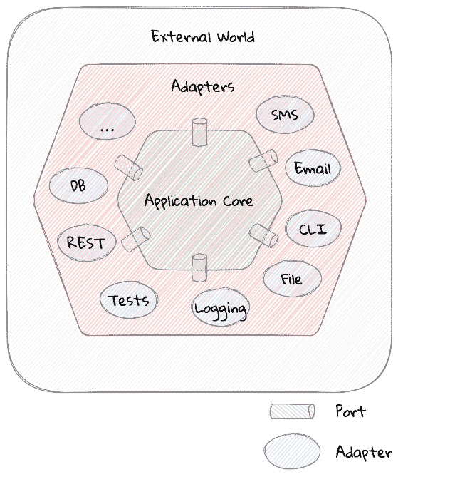

图 2.3 – 六边形架构

结果表明，在这个上下文中使用“六边形”一词纯粹是为了视觉目的——并不是要将系统限制为恰好六种类型的端口。

与六边形架构类似，洋葱架构（[`jeffreypalermo.com/2008/07/the-onion-architecture-part-1/`](https://jeffreypalermo.com/2008/07/the-onion-architecture-part-1/)），由 Jeffrey Palermo 构想，其基础是在核心中创建一个基于独立对象模型的应用程序，它可以独立于外部层进行编译和运行。这是通过在核心中定义接口（六边形架构中的端口）并在外部层实现它们（六边形架构中的适配器）来实现的。从我们的角度来看，六边形和洋葱架构风格没有我们能够识别的明显差异。

这里展示了洋葱架构的视觉表示：

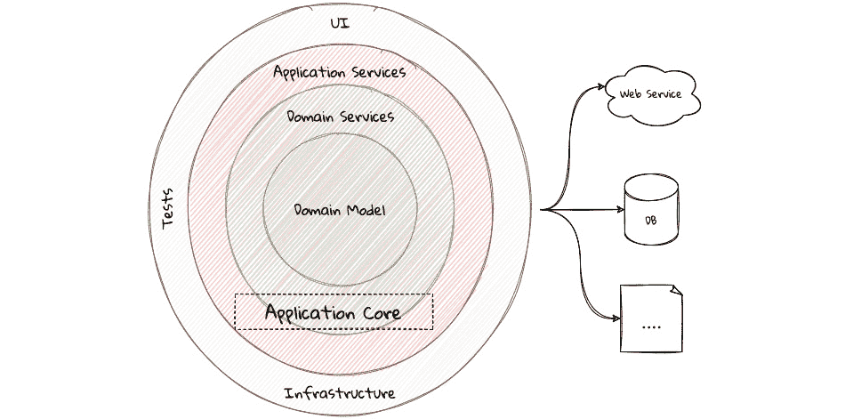

图 2.4 – 洋葱架构

另一种流行的分层架构变体，由罗伯特·C·马丁（亲切地称为 Uncle Bob）推广，是清洁架构。这是基于遵循 SOLID 原则（[`blog.cleancoder.com/uncle-bob/2020/10/18/Solid-Relevance.html`](https://blog.cleancoder.com/uncle-bob/2020/10/18/Solid-Relevance.html)），这也是他提出的。这里的基本信息（就像六边形和洋葱架构的情况一样）是避免核心（即包含业务逻辑的核心）与其他易变层（如框架、第三方库、UI 和数据库）之间的依赖关系。

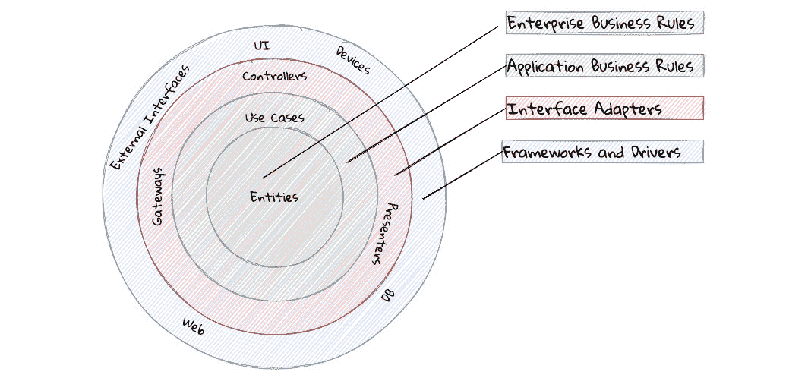

图 2.5 – 清洁架构

所有这些架构风格都与 DDD（领域驱动设计）为核心子域（以及由此扩展的边界上下文）独立于系统其余部分开发领域模型的想法相辅相成。

虽然每种架构风格都在如何构建分层架构方面提供了额外的指导，但我们选择的任何架构方法都伴随着其自身的权衡和限制，您需要对此有所认识。我们将在下一小节中讨论一些这些考虑因素。

### 层蛋糕反模式

坚持一组固定的层提供了一定程度的隔离，但在更简单的情况下，它可能证明是过度杀鸡用牛刀，除了遵守约定的架构指南外，没有增加任何可感知的好处。在层蛋糕反模式中，每个层只是代理对下层层的调用，而没有增加任何价值。以下示例说明了这种相当常见的场景：

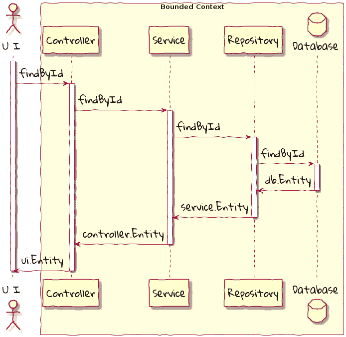

图 2.6 – 通过 ID 查找实体表示的层蛋糕反模式示例

在这里，`findById`方法在每个层都被复制，并简单地调用下一层中相同名称的方法，没有任何额外的逻辑。这给解决方案引入了意外复杂性。为了标准化目的，层中的某些冗余可能是不可避免的。如果代码库中“层蛋糕”出现明显，最好重新审视分层指南。

### 贫弱转换

我们常见的一种层蛋糕变体是，层拒绝在更高隔离和更松耦合的名义下共享输入和输出类型。这使得在每个层的边界执行转换成为必要。如果被转换的对象在结构上大致相同，我们就有了一个之前讨论过的`findById`示例。

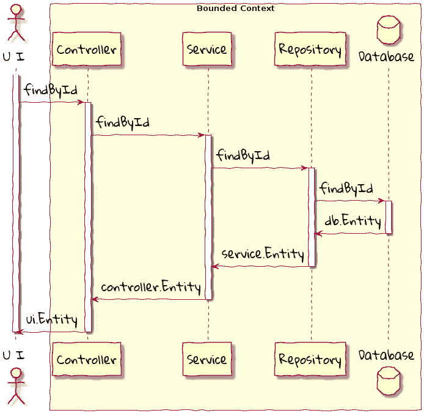

图 2.7 – 贫弱转换反模式示例

在这种情况下，每一层定义了自己的`实体`类型，需要在每一层之间进行类型转换。更糟糕的是，`实体`类型的结构可能会有看似微小的变化（例如，`lastName`被称为`surname`）。虽然这种转换在有限范围内可能是必要的，但团队应努力避免在单个有限范围内同一概念名称和结构的变化。有意使用*通用语言*有助于避免此类情况。

### 层绕过

当与分层架构一起工作时，从严格限制层只与直接下方的层交互开始是合理的。正如我们之前看到的，这种严格的执行可能导致无法容忍的意外复杂性，尤其是在将它们普遍应用于大量用例时。在这种情况下，有意识地允许一个或多个层被绕过可能是有价值的。

例如，`控制器`层可能被允许直接与`仓储`层工作而不使用`服务`层。在许多情况下，我们发现使用一套独立的规则来区分*命令*和*查询*作为起点是有用的。

这可能是一个滑稽的斜坡。为了继续维持一定的理智，团队应考虑使用轻量级的架构治理工具，如**ArchUnit** ([`www.archunit.org/`](https://www.archunit.org/))，以使协议明确并提供快速反馈。这里展示了如何使用 ArchUnit 实现此目的的简单示例：

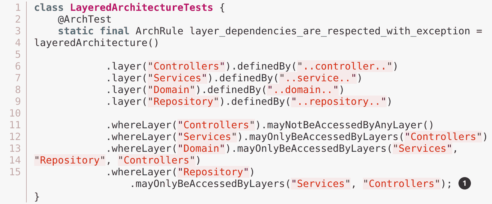

`仓储`层可以被服务和控制器层访问 – 有效地允许控制器绕过使用服务层。

## 垂直切片架构

分层架构及其变体为如何构建复杂应用程序提供了合理的指导。由 Jimmy Boggard 倡导的垂直切片架构认识到，在整个应用程序的所有用例中采用标准的分层策略可能过于僵化。

此外，值得注意的是，不能通过单独实现这些水平层来获得业务价值。这样做只会导致无法使用的库存和大量的不必要的上下文切换，直到所有这些层都连接起来。因此，垂直切片架构建议最小化切片之间的耦合，并最大化切片内的耦合 ([`jimmybogard.com/vertical-slice-architecture/`](https://jimmybogard.com/vertical-slice-architecture/))，如图所示：

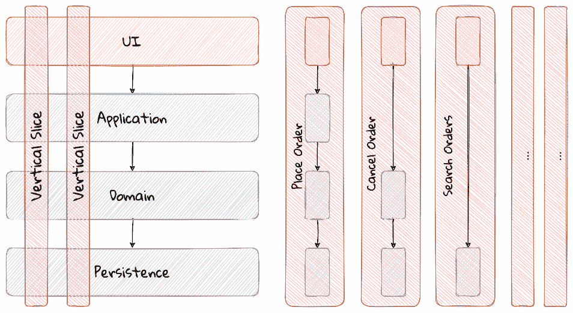

图 2.8 – 垂直切片架构

在此示例中，**下单**可能需要我们通过应用层与其他组件进行协调，并在 ACID 事务的范围内应用复杂业务不变性。同样，**取消订单**可能需要在 ACID 事务内应用业务不变性，而不需要任何额外的协调——在这种情况下，无需应用层。然而，**搜索订单**可能只需要我们从查询优化的视图中检索现有数据。这种风格利用了“按需分配”的方法来分层，这可能在实现纯分层架构时帮助缓解之前列出的某些反模式。

### 考虑事项

垂直切片架构在实现解决方案时提供了很大的灵活性——考虑到正在实施的使用案例的具体需求。然而，如果没有一定程度的治理，这可能会迅速演变成一团糟，分层决策似乎是基于个人偏好和经验（或缺乏经验）任意做出的。作为一个合理的默认选项，您可能希望考虑为命令和查询使用不同的分层策略。除此之外，非功能性需求可能规定了您可能需要如何偏离这里。例如，您可能需要绕过某些层以满足某些用例的性能服务级别协议（SLA）。

当实用地使用垂直切片架构时，它确实使您能够在每个或一组相关的垂直切片中非常有效地应用领域驱动设计（DDD）——允许它们被视为边界上下文。以下展示了使用下单和取消订单示例的两个可能性：

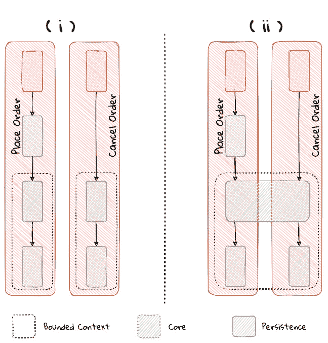

图 2.9 – 用于演进边界上下文的垂直切片

在前面图表中的 **(i)** 示例中，下单和取消订单各自使用不同的领域模型，而在 **(ii)** 示例中，这两个用例共享一个共同的领域模型，并且由此扩展，成为同一个边界上下文的一部分。这确实为在用例边界采用无服务器架构时切片功能铺平了道路。

## 面向服务架构（SOA）

**面向服务架构**（**SOA**）是一种架构风格，其中软件组件通过标准化的接口（例如 SOAP、REST 和 gRPC 等）暴露（可能）可重用的功能。使用标准化接口（如 SOAP、REST 和 gRPC 等）可以在集成异构解决方案时实现更简单的互操作性，如下所示：

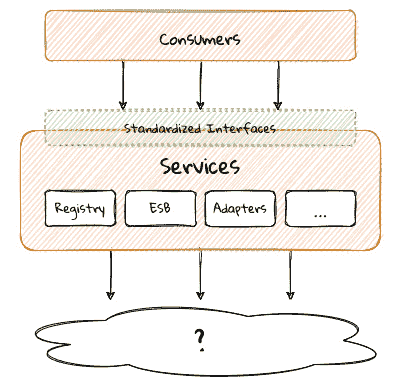

图 2.10 – SOA – 在标准接口上暴露可重用功能

以前，使用非标准、专有接口使得这种集成变得更加具有挑战性。例如，一家零售银行可能会以 SOAP Web 服务的形式公开账户间转账功能。虽然 SOA 规定通过标准化接口公开功能，但重点更多地在于集成异构应用程序，而不是实现它们。

### 考虑事项

在我们曾经工作的一家银行中，我们通过 SOAP 暴露了超过 500 个服务接口。在底层，我们使用 EJB 2.x（无状态会话豆和无状态消息驱动豆的组合）实现了这些服务，这些服务托管在商业 J2EE 应用服务器上，该服务器还充当了**企业服务总线**（**ESB**）。这些服务将大部分，如果不是全部，逻辑委托给单个单体 Oracle 数据库中的底层存储过程，使用整个企业的规范数据模型！对于外界来说，这些服务是*位置透明的*、无状态的、*可组合的*和*可发现的*。事实上，我们将这种实现宣传为 SOA 的例子，很难反驳这一点。

这套服务在多年中自然发展，没有明确的边界，组织各部分的概念和几代人的人们混合在一起，每个人都添加了自己对业务功能如何实现的理解。本质上，实现类似于令人讨厌的大泥球，这非常难以增强和维护。

SOA 背后的意图是崇高的。然而，由于缺乏关于组件粒度的具体实施指导，*重用*和*松耦合*的承诺在实践中很难实现。同样，SOA 对不同的人来说意味着很多不同的东西（[`martinfowler.com/bliki/ServiceOrientedAmbiguity.html`](https://martinfowler.com/bliki/ServiceOrientedAmbiguity.html)）。这种歧义导致大多数 SOA 实现变得复杂、难以维护的单体，围绕技术组件如服务总线、持久化存储或两者展开。这就是使用 DDD 通过将问题分解为子域和边界上下文来解决复杂问题的价值所在。

## 微服务架构

在过去十年左右的时间里，微服务获得了相当多的流行度，许多组织都希望采用这种架构风格。在许多方面，微服务是 SOA 的扩展 – 其中重点在于创建专注于执行有限数量事情并正确执行它们的组件。*《构建微服务》*一书的作者山姆·纽曼将微服务定义为*小型化*、独立部署的组件，它们维护自己的状态，并且*围绕业务领域建模*。这提供了采用针对特定解决方案的“按需定制”方法、限制爆炸半径、提高生产力和速度、自主跨职能团队等好处。

微服务通常作为一个整体存在，共同协作以实现预期的业务成果，如图所示：

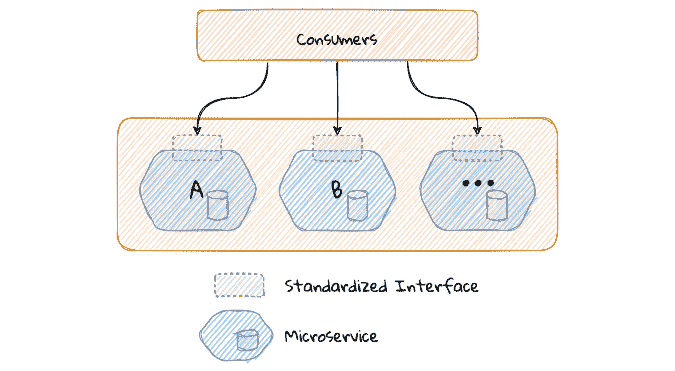

图 2.11 – 微服务生态系统

如我们所见，从消费者的角度来看，SOA 和微服务非常相似，因为它们通过一组标准化接口访问功能。微服务方法是 SOA 的演变，现在的重点是构建更小、自给自足、独立部署的组件，目的是避免单点故障（如企业数据库或服务总线），这在许多基于 SOA 的实现中相当普遍。

### 考虑事项

尽管微服务确实有所帮助，但在回答一个微服务应该有多大或多小的问题上，仍然存在相当多的模糊性（[`martinfowler.com/articles/microservices.html#HowBigIsAMicroservice`](https://martinfowler.com/articles/microservices.html#HowBigIsAMicroservice)）。实际上，许多团队似乎都难以找到这个平衡点，导致出现了分布式单体（[`www.infoq.com/news/2016/02/services-distributed-monolith/`](https://www.infoq.com/news/2016/02/services-distributed-monolith/)），这在很多方面可能比 SOA 时代的单进程单体还要糟糕。再次强调，应用 DDD 的战略设计概念可以帮助创建独立、松散耦合的组件，使其成为微服务架构风格的理想伴侣。

## 事件驱动架构（EDA）

不论组件的粒度（单体、微服务或介于两者之间），大多数非平凡解决方案都有一个边界，超出这个边界可能需要与外部系统（s）进行通信。这种通信通常是通过系统之间的消息交换来实现的，导致它们相互耦合。耦合有两种广泛的形式：*传入* – 依赖于你的人，和*传出* – 你所依赖的人。过量的传出耦合会使系统变得非常脆弱且难以操作。

事件驱动系统通过在达到某种状态时发出事件，而不关心谁消费这些事件，从而能够编写具有相对较低输出耦合的解决方案。在这方面，区分消息驱动系统和事件驱动系统非常重要，正如*反应宣言*中提到的：

“消息是发送到特定目的地的一项数据。事件是组件达到给定状态时发出的信号。在消息驱动系统中，可寻址的接收者等待消息的到来并对它们做出反应，否则处于休眠状态。在事件驱动系统中，通知监听器被附加到事件源上，以便在事件发出时被调用。这意味着事件驱动系统关注可寻址的事件源，而消息驱动系统则专注于可寻址的接收者。”

– 反应宣言

用更简单的术语来说，事件驱动系统并不关心下游消费者是谁，而在消息驱动系统中，这未必是真实的。当我们在这本书的上下文中提到事件驱动时，我们指的是前者。

通常，事件驱动系统通过使用中介基础设施组件（通常称为消息代理、事件总线等）来消除与最终消费者之间的点对点消息需求。这有效地将来自 *n* 个消费者的输出耦合减少到 1。事件驱动系统可以实现的变体有几个。在发布事件的上下文中，马丁·福勒在他的*“你说的‘事件驱动’是什么意思？”*文章中谈到了两种广泛风格（以及其他事项），即事件通知和事件携带状态传输（[`martinfowler.com/articles/201701-event-driven.html`](https://martinfowler.com/articles/201701-event-driven.html)）。

### 考虑事项

在构建事件驱动系统时，主要权衡之一是决定每个事件中应嵌入多少状态（有效载荷）。可能明智的做法是只嵌入足够的状态来指示由发出的事件引起的更改，以保持各种对立力量，如生产者扩展、封装、消费者复杂性和弹性。当我们讨论在*第五章* *实现领域逻辑*中实现事件的相关影响时，我们将更详细地讨论这些问题。

领域驱动设计（DDD）的全部内容是通过创建这些独立的边界上下文来控制复杂性。然而，“独立”并不意味着“隔离”。边界上下文可能仍然需要相互通信。实现这一目标的一种方法是通过使用 DDD 的基本构建块——领域事件。因此，事件驱动架构和 DDD 是相辅相成的。通常，利用事件驱动架构允许边界上下文进行通信，同时继续相互松散耦合。

## 命令查询责任分离（CQRS）

在传统应用程序中，单一领域的数据/持久化模型用于处理所有类型的操作。在 CQRS 中，我们创建不同的模型来处理更新（命令）和查询。这将在以下图中展示：

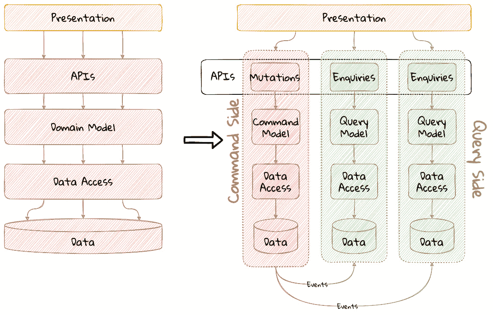

图 2.12 – 传统与 CQRS 架构对比

注意

我们在上一个图中展示了多个查询模型，因为根据需要支持的各种查询用例，创建多个查询模型是可能的（但不是必需的）。

为了使这个过程能够可预测地工作，查询模型（们）需要与写入模型保持同步（我们将在稍后详细探讨一些实现这一点的技术）。

### 考虑因素

传统的单一模型方法对于简单的 CRUD 风格的应用程序来说效果很好，但对于更复杂的场景开始变得难以控制。我们将在下一小节中讨论一些这些场景。

### 读写之间的量不平衡

在大多数系统中，读操作通常比写操作多出显著的数量级。例如，考虑交易员检查股票价格次数与实际交易（买卖股票交易）次数之间的差异。通常，写操作是创造企业收入的活动。在以读操作为主的系统中，使用单一模型进行读写可能会使系统超负荷，从而影响写性能。

### 需要多个读表示

在处理相对复杂系统时，需要同一数据的多个表示形式并不罕见。例如，在查看个人健康数据时，你可能想查看每日、每周或每月的视图。虽然这些视图可以从 *原始* 数据实时计算得出，但每次转换（聚合、总结等）都会增加系统上的认知负荷。通常，无法提前预测这些需求的具体性质。因此，设计一个能够满足所有这些需求的单一规范模型是不切实际的。创建专门针对一组特定需求设计的领域模型可能会容易得多。

### 不同的安全需求

当使用单一模型工作时，管理数据/API 的授权和访问需求可能会变得繁琐。例如，与余额查询相比，借记操作可能需要更高的安全级别。拥有不同的模型可以大大简化设计细粒度授权控制复杂性。

### 更均匀的复杂性分布

专门用于仅服务于命令端用例的模型意味着现在它们可以专注于解决单个问题。对于查询端用例，我们根据需要创建与命令端模型不同的模型。这有助于更均匀地将复杂性分散到更大的表面上——而不是增加用于服务所有用例的单个模型的复杂性。值得注意的是，DDD 的本质主要是有效地与复杂的软件系统协同工作，而 CQRS 与这一思路非常契合。

注意

当使用基于 CQRS 的架构工作时，为命令端选择持久化机制是一个关键决策。当与事件驱动架构结合使用时，你可以选择将聚合体作为一系列事件（按其发生顺序排序）进行持久化。这种持久化方式被称为事件溯源。我们将在*第五章*“实现领域逻辑”部分中更详细地介绍这一点。

## 无服务器架构

无服务器架构是一种软件设计方法，允许开发者在无需管理底层基础设施的情况下构建和运行服务。AWS Lambda 服务的推出使得这种架构风格变得流行，尽管在 Lambda 推出之前就已经存在了其他一些服务（例如用于持久化的 S3 和 DynamoDB、用于通知的 SNS 以及用于消息队列的 SQS）。虽然 AWS Lambda 以**函数即服务**（**FaaS**）的形式提供计算解决方案，但这些其他服务对于从无服务器范式中获益同样重要，甚至更为重要。

在传统的 DDD 中，边界上下文是通过围绕聚合体分组相关操作来形成的，这随后会告知解决方案作为单元的部署方式——通常是在单个进程的范围内。在无服务器范式中，每个操作（任务）都预期作为其自身的独立单元进行部署。这要求我们以不同的方式来考虑如何建模聚合体和边界上下文——现在是以单个任务或函数为中心，而不是以相关任务组为中心。

这是否意味着到达解决方案的 DDD 原则不再适用？虽然无服务器范式引入了必须将细粒度可部署单元视为建模过程中的第一公民的额外维度，但应用 DDD 的战略和战术设计的过程仍然适用。我们将在*第十一章*“分解为更细粒度的组件”中更详细地探讨这一点，届时我们将重构本书中构建的解决方案以采用无服务器方法。

## 大泥球

到目前为止，我们已经考察了一系列命名的架构风格及其陷阱，以及如何应用 DDD 来帮助缓解这些问题。在另一个极端，我们可能会遇到缺乏可感知架构的解决方案，这臭名昭著地被称为“大泥球”：

“一个‘大泥球’结构混乱，庞大，杂乱无章，像胶带和草绳一样， spaghetti 代码丛林。我们都见过。这些系统显示出不受控制的增长和不重复、应急修复的明显迹象。信息在系统遥远元素之间随意共享，常常达到几乎所有重要信息都变成全局或重复的程度。系统的整体结构可能从未得到很好的定义。如果曾经有，它可能已经侵蚀到无法辨认。具有一丝架构感的程序员会避开这些泥潭。只有那些对架构不关心的人，也许，对日常修补这些失败堤坝的惰性感到舒适的人，才会满足于在这样的系统上工作。”

– 布赖恩·福特和约瑟夫·约德

尽管福特和约德建议不惜一切代价避免这种架构风格，但类似于“大泥球”的软件系统仍然是我们很多人日常生活中的不可避免。领域驱动设计（DDD）的战略和战术设计元素提供了一套技术，帮助我们以实用主义的方式处理和恢复这些近乎绝望的情况，而无需可能地采用大爆炸方法。实际上，本书的重点是将这些原则应用于防止或至少推迟进一步退化成“大泥球”。

## 你应该使用哪种架构风格？

正如我们所见，在构建软件解决方案时，你可以依赖各种架构风格。其中许多架构风格共享一些共同的原则。遵循任何单一的架构风格都可能变得困难。领域驱动设计（DDD）通过强调将复杂业务问题分解为子域和边界上下文，使得在边界上下文中使用多种方法成为可能。我们特别提一下垂直切片架构，因为它强调将功能划分为特定的业务成果，因此更自然地遵循 DDD 的子域和边界上下文理念。实际上，你可能需要扩展甚至偏离架构风格的严格定义，以满足现实世界的需求。但当我们做出这样的妥协时，重要的是要故意为之，并明确说明我们做出这种决定的原因（最好使用一些轻量级机制，例如**ADRs** ([`www.thoughtworks.com/de-de/radar/techniques/lightweight-architecture-decision-records`](https://www.thoughtworks.com/de-de/radar/techniques/lightweight-architecture-decision-records))). 这很重要，因为当我们未来回顾时，可能很难向他人甚至我们自己解释这种决定。

在本节中，我们考察了流行的架构风格以及如何在使用 DDD 时增强其有效性。现在，让我们看看 DDD 如何补充现有编程范式的使用。

# 编程范式

DDD 的策略元素在解决问题时引入了特定的词汇（聚合、实体、值对象、存储库、服务、工厂、领域事件等）。最终，我们需要将这些概念转化为运行中的软件。多年来，我们已经采用了各种编程范式，包括过程式、面向对象、函数式和面向方面。将 DDD 与这些范式之一或多个结合使用是否可能？在本节中，我们将探讨一些常见的编程范式和技术如何帮助我们用代码表达策略设计元素。

## 面向对象编程

从表面上看，DDD 似乎只是复制了一套面向对象的术语，并赋予它们不同的名称。例如，战术 DDD 的核心概念，如聚合、实体和值对象，在面向对象术语中可以简单地称为对象。其他如服务可能没有直接的面向对象对应物。那么，如何在面向对象的世界中应用 DDD 呢？让我们看一个简单的例子：

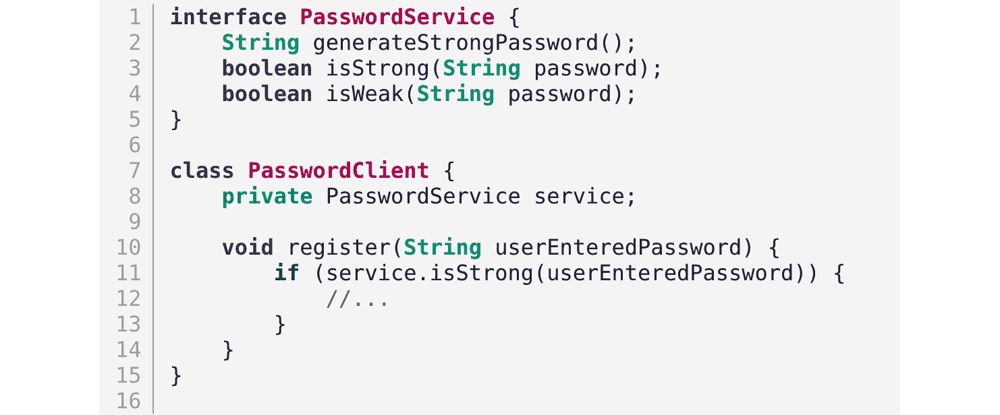

面向对象纯粹主义者会迅速指出`PasswordService`是过程式的，可能需要一个`Password`类来封装相关行为。同样，DDD 爱好者可能会指出这是一个贫血的领域模型实现。一个可能更好的面向对象版本可能看起来像以下这样：

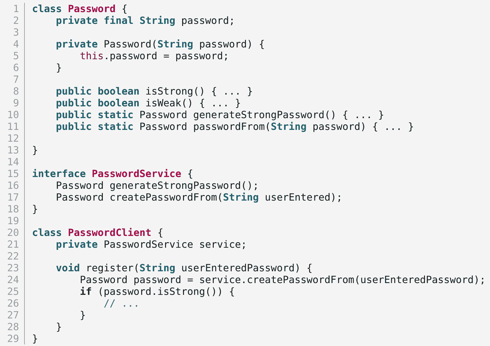

在这种情况下，`Password` 类停止暴露其内部结构，并以行为（`isStrong` 和 `isWeak` 方法）的形式暴露了强密码或弱密码的概念。从面向对象的角度来看，第二种实现可能更优越。如果是这样，我们是否应该始终使用面向对象的版本？实际上，答案是有细微差别的，这取决于消费者在特定情境下的需求以及普遍使用的语言。如果 `Password` 的概念在领域内广泛使用，那么在实现中引入这样的概念可能是合理的。如果不是，第一种解决方案可能就足够了，即使它似乎违反了面向对象的封装原则。

我们默认的立场是将良好的面向对象实践作为起点。然而，更重要的是要反映领域语言，而不是教条地应用面向对象。因此，如果在这种情况下这样做显得不自然，我们愿意在面向对象的纯粹性上做出妥协。如前所述，清楚地传达做出此类决策的理由可以走很长的路。

## 函数式编程

函数是代码组织的基本构建块，存在于所有高级编程语言中。函数式编程是一种编程范式，其中程序通过应用和组合函数来构建。这与使用语句来改变程序状态的命令式编程形成对比。最显著的区别源于函数式编程避免了命令式编程中常见的副作用。纯函数式编程完全防止副作用并强制不可变性。在设计领域模型时采用函数式风格，使其更具声明性，可以更清晰地表达意图，同时保持简洁。它还使我们能够通过使用更简单的概念来组合更复杂的概念，从而控制复杂性。函数式实现使我们能够使用更接近问题域的语言，同时也有简洁的附加好处。考虑一个简单的例子，我们需要使用函数式风格在所有仓库中找到库存最少的物品，如下所示：

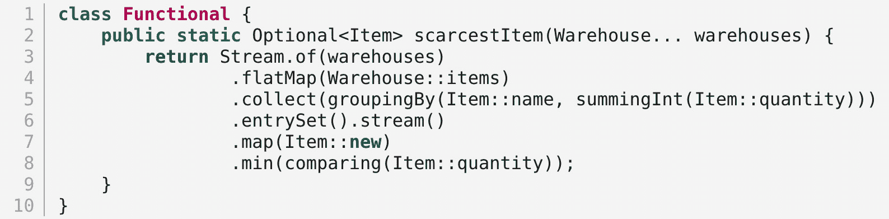

这里展示的命令式风格确实完成了工作，但可能更加冗长且难以理解，有时甚至对技术团队成员来说也是如此！

这里有一个命令式的例子：

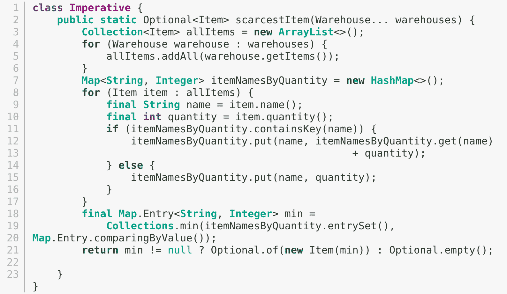

从领域驱动设计（DDD）的角度来看，这带来了一些好处：

+   **与领域专家的协作增加**，因为声明式风格允许更多地关注“是什么”，而不是“怎么做”。这使得无论是技术还是非技术利益相关者都能在持续合作中感到不那么令人畏惧。

+   **更好的可测试性**，因为纯函数（那些无副作用的函数）的使用使得创建数据驱动测试变得更容易。这也为我们提供了额外的优势，即减少模拟/存根的使用。这些特性使得测试更容易维护和合理化。这也有利于让技术团队成员在早期阶段就能可视化边缘情况。

## 你应该选择哪种范式？

DDD 简单地说，你应该围绕代表软件试图解决的实际问题的领域模型来构建你的软件。当遇到复杂的生活问题时，我们常常发现很难在整个范围内遵循任何单一范式。寻求一种一刀切的方法可能会对我们产生不利影响。我们的经验表明，我们需要利用各种技术来优雅地解决问题。Java 本质上是一种面向对象的编程语言，但随着 Java 8 的推出，它开始拥抱各种函数式构造。这使我们能够利用多种技术来创建优雅的解决方案。最重要的是，要就通用的语言达成一致，并允许它指导采取的方法。这也很大程度上取决于你拥有的才能和经验。使用大多数团队成员都不熟悉的风格可能会适得其反。尽管我们在这里的章节中没有涵盖过程范式，但在某些情况下，它可能是最佳解决方案。只要我们有意于偏离特定编程范式的公认规范，我们就应该处于一个相当好的位置。

# 摘要

在本章中，我们介绍了一系列常用的架构模式，以及我们在使用它们时如何实践 DDD。我们还探讨了在使用这些架构时可能需要留意的常见陷阱和问题。我们还探讨了流行的编程范式及其对 DDD 战术元素的影响。

此外，你应该欣赏在构思解决方案时需要采用的多种架构风格。此外，你应该了解 DDD 可以在你选择采用哪种架构风格时扮演的角色。

在下一节中，我们将把在本章和之前章节中学到的所有知识应用到现实世界的商业案例中。我们将应用 DDD 的战略和战术模式，将复杂的领域分解为子领域和边界上下文，并迭代地构建解决方案，使用基于 Java 编程语言的技术。
