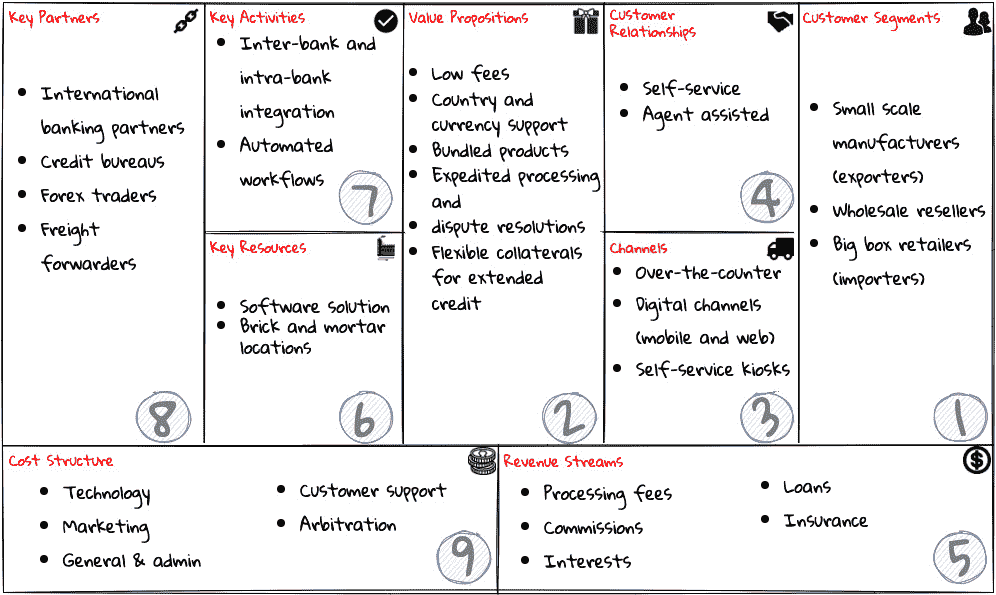
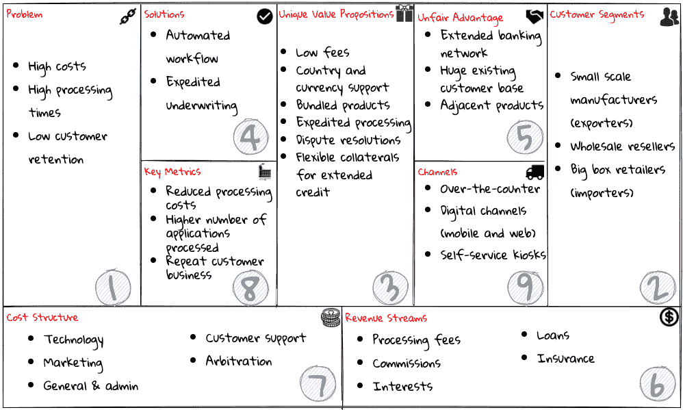
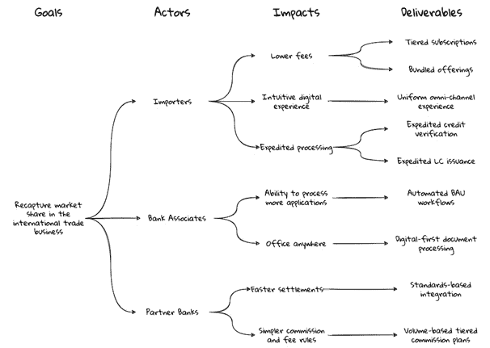
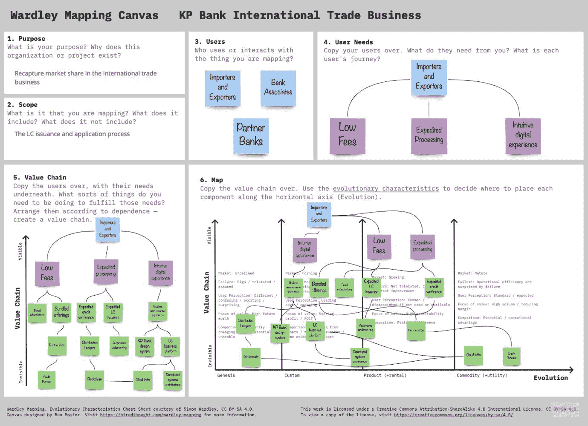
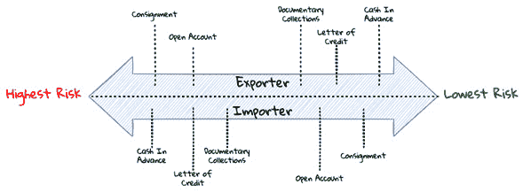

# *第三章*：理解领域

“勺子不知道汤的味道，学问浅薄的人不知道智慧的滋味。”

– 威尔士谚语

在本章中，我们将介绍一个名为**科索莫普瑞马**（**KP**）银行的虚构组织，该组织正寻求现代化其在国际贸易业务中的产品提供。为了建立一个能够使其在中长期内持续成功的商业战略，我们将采用一系列技术和实践来帮助其从战略到执行的路径加速。

在我们深入探讨之前，让我们先对 KP 银行的业务领域有一个高层次的理解。

在本章中，我们将涵盖以下主题：

+   国际贸易领域

+   KP 银行的国际贸易

+   理解 KP 银行的国际贸易战略

+   KP 银行的国际贸易产品和服务

在本章结束之际，你将学会如何运用商业价值画布和精益画布等技术，以建立对商业战略的深刻理解。此外，我们将探讨如何绘制影响图，使我们能够将业务成果与目标相关联。最后，沃德尔映射练习将确立我们的业务决策在我们竞争格局中的重要性。

# 国际贸易领域

在许多国家，国际贸易占国内生产总值（**GDP**）的很大一部分，使得在全球范围内进行资本、商品和服务的交换成为必要。虽然像世界贸易组织（**WTO**）这样的经济组织专门成立是为了简化这一过程，但经济政策、贸易法律和货币等方面的差异确保了进行国际贸易可能是一个复杂的过程，涉及多个国家的多个实体。信用证的存在就是为了简化这一过程。让我们看看它是如何工作的。

# KP 银行的国际贸易

KP 银行已经营业多年，一直专注于提供各种银行解决方案，如零售、企业、证券和其他产品。他们一直在稳步扩大到其他国家和大洲的业务。这使他们在过去十年中显著扩大了国际贸易业务。虽然他们一直是这一领域的领导者之一，但最近出现的新的数字原生竞争对手已经开始侵蚀他们的业务，并对其收入线产生不利影响。客户抱怨流程过于繁琐、耗时，最近还不可靠。此外，由于目前实施的非常低效的手动流程，KP 银行发现很难控制成本。仅在过去的 3 年里，他们不得不将交易处理成本增加约 50％！不出所料，这恰好与客户满意度急剧下降相吻合，这一点可以从客户服务数量在间隔时间内保持平稳的事实中得到证明。

CIO 已经认识到，有必要重新审视这个问题，并提出一种策略，使 KP 银行在未来几年内能够持续成功，并重新成为国际贸易领域的领导者之一。

# 了解 KP 银行的国际贸易战略

为了达到最佳解决方案，了解公司的商业目标和它们如何支持解决方案用户的需要非常重要。我们将介绍一套我们认为有用的工具和技术。

备注

有必要指出，这些工具是独立构思的，但当你与其他 DDD 技术结合使用时，它们可以增强整个过程和解决方案的有效性。使用这些工具应被视为您 DDD 旅程的补充。

让我们看看我们采用的一些最受欢迎的技术，这些技术可以帮助我们快速理解商业问题并提出解决方案。

## 商业模型画布

正如我们多次提到的，在尝试解决问题之前确保我们解决的是正确的问题非常重要。商业模型画布是由瑞士顾问亚历山大·奥斯特瓦尔德在其博士论文中构思的，它是一种快速且简单的方法，可以确保我们在一个单一的可视化中解决一个有价值的问题，这个可视化捕捉了您业务的九个要素：

+   **价值主张**：你做什么？

+   **关键活动**：你是如何做的？

+   **关键资源**：你需要什么？

+   **关键合作伙伴**：谁会帮助你？

+   **成本结构**：这会花费多少？

+   **收入来源**：你会赚多少钱？

+   **客户细分**：你为谁创造价值？

+   **客户关系**：你与谁互动？

+   **渠道**：你是如何接触你的客户的？

商业模式画布有助于在包括商业利益相关者、领域专家、产品所有者、架构师和开发者在内的不同群体中建立对整体图景的共同理解。我们发现，在开始绿地和棕地项目时，它非常有用。以下是我们为 KP 银行国际贸易业务创建商业模式画布的尝试：

图 3.1 – 商业模式画布

使用这个画布可以让我们了解我们打算在银行服务的客户，通过什么渠道提供什么价值主张，以及我们如何赚钱。在开发商业模式画布时，建议我们遵循上一幅图中显示的编号顺序，以便更好地理解以下内容：

+   商业的吸引力（我们的客户是谁以及他们想要什么）

+   商业的可行性（我们如何运营和交付它）

+   商业的经济可行性（我们如何识别成本和获取利润）

如果你还没有现有的产品，创建商业模式画布可能会很有挑战性，这在初创企业或现有企业拓展新业务领域时通常是真实的情况。在这种情况下，探索精益画布的变体形式是值得的。

## 精益画布

精益画布是 Ash Maurya 为精益初创企业构思的一种商业模式画布的变体。与商业模式画布相比，这里的重点首先是详细阐述需要解决的问题，并探索潜在解决方案。为了使画布具有可操作性，想法是捕捉最不确定和/或风险最大的项目。这对于在高不确定性下运营的企业（通常适用于初创企业）是相关的。类似于领域驱动设计（DDD），它鼓励你将问题作为建立企业的起点。

结构上，它与商业模式画布相似，但有以下不同之处：

+   **问题**而不是*关键合作伙伴*：企业常常因为误解他们正在解决的问题而失败。替换**关键合作伙伴**块的理由是，当你是一个寻求建立未经证实的产品的不知名实体时，追求关键合作伙伴可能为时尚早。

+   **解决方案**而不是*关键活动*：尝试多个解决方案并响应反馈是很重要的。**关键活动**被移除，因为它们通常是解决方案的副产品。

+   **关键指标**而非*关键资源*：了解我们是否朝着正确的方向前进非常重要。建议关注少数几个**关键指标**，以便在需要时能够快速调整。**关键资源**随着云的出现和成熟框架的可用性而变得相对容易（）。此外，它们可能出现在**不公平优势**框中，我们将在下一节讨论。

+   **不公平优势**而非*客户关系*：这明确地确立了我们的差异化优势，这些优势难以复制。这与我们在*第一章*，“领域驱动设计的理由”中讨论的核心子域概念紧密相关，并为我们提供了一个清晰的画面，说明我们在一开始需要集中精力关注什么。

我们为 KP 银行举办的精益画布工作坊的结果如下所示：

图 3.2 – 国际贸易业务的精益画布

填写精益画布的确切顺序可能有所不同。在他的博客上，Ash Maurya 建议可能没有规定性的执行顺序来做这个练习（[`blog.leanstack.com/what-is-the-right-fill-order-for-a-lean-canvas/`](https://blog.leanstack.com/what-is-the-right-fill-order-for-a-lean-canvas/))。就个人而言，我们喜欢先详细阐述问题，然后再转向画布的其他方面。商业模式画布和精益画布都提供了对商业模式、高优先级问题和潜在解决方案的高级视图。接下来，让我们看看影响图，这是一种基于思维导图的轻量级规划技术，旨在制定以结果为导向的计划。

## 影响图

影响图是一种可视化和战略规划工具，它使您能够理解范围和潜在假设。它是由高级技术和业务人员通过考虑以下四个方面共同创建的，以思维导图的形式：

+   **目标**：*为什么*我们要做这件事？

+   **参与者**：*我们的产品消费者或用户是谁？换句话说，谁会受到它的影响？*

+   **影响**：*消费者行为的变化如何帮助我们实现目标？换句话说，就是我们试图创造的影响？*

+   **交付成果**：作为组织或交付团队，我们能做什么来支持所需的影响？换句话说，作为解决方案的一部分需要实现哪些软件功能或流程变更？

图 3.3 – 一个简单的影响图

影响图提供了一种易于理解的视觉表示，展示了目标、用户和交付成果之间的影响关系。接下来，让我们来探讨沃德利图，它使我们能够更深入地了解我们的目的，并确定哪些业务部分提供了最大的价值。

## 沃德利图

商业模式画布和精益画布可以帮助在较高层次上建立目的的清晰性。沃德利图是另一个帮助构建商业策略和建立目的的工具。它提供了一个系统为谁而建的草图，然后是系统为他们提供的利益，以及提供这些利益所需的需求链（称为**价值链**）。接下来，价值链沿着一个进化轴进行绘制，该轴的范围从未探索和不确定到高度标准化。构建沃德利图可以通过六个步骤完成：

1.  **目的**：你的目的是什么？为什么组织或项目存在？

1.  **范围**：地图（范围）包括什么（以及不包括什么）？

1.  **用户**：谁使用或与你所绘制的物品互动？

1.  **用户需求**：你的用户需要从你所绘制的物品中获得什么？

1.  **价值链**：为了满足之前捕获的需求，我们需要做什么？这些需求根据其依赖关系排列，从而创建了一个价值链，将用户需求映射到一系列按用户可见性顺序排列的活动（从最明显到最不明显）。

1.  **绘制地图**：最后，使用进化特征绘制地图，以决定将每个组件放置在水平轴的哪个位置。

我们在 KP 银行进行了沃德利图绘制练习，以展示他们的国际贸易业务，如下所示：

图 3.4 – KP 银行国际贸易业务的沃德利图

注意

在这个画布上，我们为了简洁起见，只详细阐述了某一类用户（进口商和出口商）的需求。在现实世界的场景中，我们不得不为所有类型的用户重复*步骤 4、5 和 6*。

沃德利图使得理解我们解决方案提供的功能、它们的依赖关系以及价值是如何产生的变得容易。它还帮助描绘了这些功能与竞争对手提供的功能相比的表现，使你能够适当地优先考虑关注点并做出构建或购买的决定。

我们已经检查了多种轻量级和协作技术，以快速了解问题空间以及我们对我们用户和业务可能产生的影响。这些技术中的每一种都相当轻量，可以在几个小时内完成。每一种都能让我们专注于最有影响力的业务领域，并最大化投资回报率。根据我们的经验，尝试这些练习中的多个（甚至所有）都是值得的，因为每个练习都可以突出业务/用户需求的不同方面。

# 国际贸易产品和服务的

国际贸易充满风险，这导致卖方（出口商）和买方（进口商）之间支付时间的确定性程度较高，尤其是在涉及各方之间缺乏信任的情况下。对于出口商来说，在收到付款之前，所有销售都是礼物。因此，出口商更喜欢在订单下单后或至少在货物发货前收到付款。对于进口商来说，在收到货物之前，所有为购买支付的款项都是捐赠。因此，进口商更喜欢尽快收到货物，并推迟付款，直到货物转售以筹集足够的资金来支付卖方。

这种情况为可信赖的中间机构（如 KP 银行）提供了一个机会，在安全的方式下在国际贸易交易中发挥重要作用。KP 银行提供了一系列产品来促进国际贸易支付，如下所示：

+   信用证（LC）

+   跟单托收（DC）

+   赊账

+   预付款

+   寄售

下面的图表显示了从出口商和进口商的角度来看，这些支付方式各自的风险特征：

图 3.5 – 国际贸易支付方式的风险特征

如此明显，直流和交流产品在提供解决方案时，从双方的角度来看都提供了相对安全的选择。需要涉及一个可信赖的中间机构，如 KP 银行，来参与履行过程，这使得这些支付方式对双方来说风险较低。从银行的角度来看，将这些产品的流程简化作为优先事项，与其他产品相比，也提供了更大的商业机会。在这两者中，信用证产品满足大多数标准，这些标准是在我们之前详细阐述的最近结束的商业策略会议中针对用户需求制定的。因此，KP 银行的利益相关者决定一开始就大力投资信用证产品。

在下一章以及本书的其余部分，我们将详细阐述如何通过利用与 DDD 原则紧密一致的原则来改进信用证的应用、发行和相关流程。

# 摘要

在本章中，我们探讨了各种技术，这些技术有助于确定特定问题是否是正确的问题需要解决。具体来说，我们研究了商业价值画布和精益画布，以阐明初创企业和成熟企业两者的商业策略。然后，我们探讨了影响图，它使您能够明确地将业务目标与用户影响以及创造这些影响所需的交付成果相关联。最后，我们研究了沃德利图，以进一步深入关注重要领域，包括建立构建与购买决策、与竞争对手相关的商业策略的重要性，以及进入未知领域时涉及的相关风险。

在下一章中，我们将探讨进一步深入挖掘的技术和实践，以便我们了解 LC 业务，从而开始构建领域模型（s），使我们能够得出适当的解决方案。

# 进一步阅读

在[`blog.leanstack.com/what-is-the-right-fill-order-for-a-lean-canvas/`](https://blog.leanstack.com/what-is-the-right-fill-order-for-a-lean-canvas/)了解更多关于精益画布的信息。
