# 第四章：领域分析和建模

“问问题的人五分钟内还是傻瓜。不问的人永远都是傻瓜。”

– 中国谚语

正如我们在上一章所看到的，误解的需求可能导致相当一部分软件项目失败。达成共识并创建有用的领域模型需要领域专家之间高度的合作。在本章中，我们将介绍本书中将要使用的示例应用程序，并探讨建模技术，如领域故事讲述和事件风暴，以可靠和结构化的方式增强我们对问题的集体理解。

本章将涵盖以下主题：

+   介绍示例应用程序（信用证）

+   增强共识

+   领域故事讲述

+   事件风暴

本章将帮助开发人员和架构师学习如何在现实生活中的场景中应用这些技术，以产生优雅的软件解决方案，这些解决方案反映了需要解决的领域问题。同样，非技术领域的专家将了解如何传达他们的想法，并有效地与技术团队成员合作，以加速达成共识的过程。

# 技术要求

本章没有具体的技术要求。然而，鉴于可能需要远程协作而不是在同一房间内使用白板，以下资源将非常有用：

+   数字白板（例如[`www.mural.co/`](https://www.mural.co/) 或 [`miro.com/`](http://miro.com/)）

+   在线领域故事讲述模型器（例如[`www.wps.de/modeler/`](https://www.wps.de/modeler/)）

# 理解信用证

信用证**（LC**）是银行作为进口商（或买方）和出口商（或卖方）之间的合同而发行的一种金融工具。该合同规定了交易的条件和条款，根据这些条件，进口商承诺支付出口商提供的商品或服务。信用证交易通常涉及多个当事人。以下是对涉及当事人的简化总结：

+   **进口商**：商品或服务的买方。

+   **出口商**：商品或服务的卖方。

+   **货运代理人**：代表出口商处理货物运输的代理机构。这仅适用于涉及实物商品交换的情况。

+   **开证行**：进口商请求发行信用证申请的银行。通常，进口商与该银行有既定的关系。

+   **通知行**：通知出口商关于信用证发行情况的银行。这通常是在出口商所在国的本地银行。

+   **议付行**：出口商提交货物运输或提供服务所需文件的银行，通常出口商与该银行已有预存关系。

+   **偿付行**：在开证行的要求下，向议付行支付资金的银行。

备注

在一项特定的交易中，一家银行可以扮演多个角色。在最复杂的情况下，可能有四个不同的银行参与交易（有时甚至更多，但为了简洁起见，我们将跳过这些情况）。

# 一份信用证发行申请

如前一章所述，Kosmo Primo Bank 需要我们关注简化信用证申请和发行流程。在本章以及本书的其余部分，我们将努力理解、演进、设计和构建一个软件解决方案，通过用更简化的流程取代大量手动且易出错的流程，以使流程更加高效。

我们理解，除非你是处理国际贸易的专家，否则你不太可能对诸如信用证（LCs）等概念有深入了解。在接下来的章节中，我们将探讨如何揭开信用证的神秘面纱以及如何与之合作。

# 增强共识

当处理一个领域概念不明确的问题时，需要在关键团队成员（既有好主意的人——业务/产品人员，也有将这些想法转化为工作软件的人——软件开发人员）之间达成共识。为了使这个过程有效，我们倾向于寻找以下方法：

+   快速、非正式且有效

+   协作性 – 对于非技术性和技术性团队成员来说都易于学习和采用

+   图形化，因为一张图片可能胜过千言万语

+   适用于粗粒度和细粒度场景

有几种方法可以达到这种共识。以下是一些常用的方法：

+   UML

+   BPMN

+   用例

+   用户故事映射

+   CRC 模型

+   数据流图

这些建模技术试图将知识形式化，并以图表或文本的形式表达出来，以帮助将业务需求作为软件产品交付。然而，这种尝试并没有缩小而是扩大了业务与软件系统之间的差距。虽然这些方法对于技术受众来说往往效果良好，但它们通常对非技术用户不太有吸引力。

为了恢复平衡并推广对双方都适用的技术，我们将使用**领域叙事**和**事件风暴法**作为我们的手段，从领域专家那里捕捉业务知识，供开发人员、业务分析师等使用。

# 领域叙事

科学研究现在已经证明，使用视听辅助工具的学习方法能够非常有效地帮助教师和学生保留和内化概念。此外，教授我们所学的知识有助于加强想法并激发新想法的形成。

领域故事是一种协作建模技术，它结合了图形语言、现实世界示例和工作坊格式，作为一种非常简单、快捷且有效的技术在团队成员之间分享知识的方法。领域故事是一种由斯蒂芬·霍弗和亨宁·施文特纳发明并普及的技术，基于汉堡大学进行的一些相关研究，称为*合作图*。

该技术的图形符号在以下图表中展示：

![图 4.1 – 领域故事概述]

![图片 B16716_04_01.jpg]

图 4.1 – 领域故事概述

领域故事是通过以下属性传达的：

+   **参与者**：故事是从一个参与者的角度（名词）进行传达的——例如，发行银行，在特定故事情境中扮演着积极角色。使用特定领域的通用语言是一种良好的实践。

+   **工作对象**：参与者对某些对象进行操作——例如，申请信用证。同样，这将是领域内常用的一个术语（名词）。

+   **活动**：参与者对一个工作对象执行的动作（动词）。通过一个连接参与者和工作对象的带标签的箭头来表示。

+   **注释**：用于捕捉故事中的额外信息，通常以几句话的形式表示。

+   **序列号**：通常，故事是一句接一句地讲述的。序列号有助于捕捉故事中活动的顺序。

+   **组别**：用于表示相关概念的集合的概要，范围从重复/可选活动到子领域/组织边界。

## 使用 DST 进行信用证申请

KP 银行有一个允许处理信用证的过程。然而，这个过程非常陈旧，基于纸张，且手工操作密集。银行中很少有人完全理解整个过程，自然损耗意味着这个过程过于复杂，而没有任何合理的理由。因此，他们正在寻求数字化和简化这个过程。DST 本身只是一种可以独立完成的图形符号。然而，通常不会单独进行，而是采用工作坊风格，让领域专家和软件专家共同协作。

在本节中，我们将使用 DST 工作坊来捕捉当前的业务流程。以下是一个这样的对话摘录，对话双方是*凯蒂*，*领域专家*，和*帕特里克*，*软件开发者*：

**帕特里克**：*你能给我一个典型的信用证流程的概述吗？*

**凯蒂**：*当然，一切始于进口商和出口商签订购买商品或服务的合同。*

**帕特里克**：*这份合同的形式是什么？是正式文件条款吗？还是这只是个对话？*

**凯蒂**：*这只是一个对话。*

**帕特里克**：*哦，明白了。对话涵盖了什么内容？*

**凯蒂**：*有几个方面——商品的性质和数量、定价细节、付款条款、运输成本和时间表、保险和保修等。这些细节可以包含在采购订单中——这是一个简单的文件条款，详细说明了上述内容。*

此时，帕特里克绘制了进口商和出口商之间的互动部分。这个图形在以下图表中展示：

图 4.2 – 进口商和出口商之间的互动

**帕特里克**：*这似乎很简单，那么银行在其中的作用是什么？*

**凯蒂**：*这是一项国际贸易，进口商和出口商都需要减轻这种商业交易中涉及到的财务风险。因此，他们需要一家银行作为可信赖的中介。*

**帕特里克**：*这是什么类型的银行？*

**凯蒂**：*通常涉及多个银行。但一切始于一个* **开证行** *。

**帕特里克**：*开证行是什么？*

**凯蒂**：*任何被授权调解国际贸易交易的银行。这必须是进口国的一家银行。*

**帕特里克**：*进口商需要与这家银行有现有关系吗？*

**凯蒂**：*不一定。进口商可能与其他银行有关系——这些银行反过来会代表进口商与开证行联络。但为了简单起见，让我们假设进口商与开证行有现有关系——在这种情况下，就是我们的银行。*

**帕特里克**：*进口商需要向开证行提供采购订单的详情以开始吗？*

**凯蒂**：*是的。进口商通过提交* **信用证申请** *来提供交易详情。*

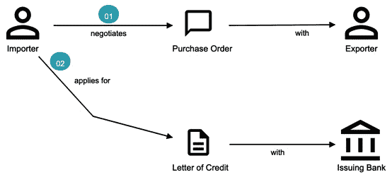

图 4.3 – 介绍信用证和开证行

**帕特里克**：*开证行在收到这份信用证申请时会做什么？*

**凯蒂**：*主要有两点——核实进口商的财务状况和进口货物的合法性。*

**帕特里克**：*好的。如果一切都检查无误，会发生什么？*

**凯蒂**：*开证行批准信用证并通知进口商。*

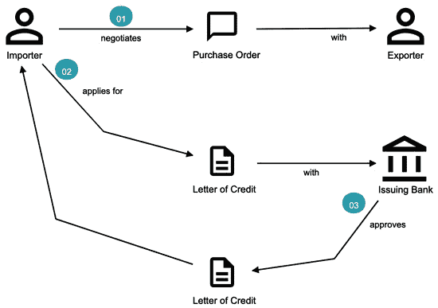

图 4.4 – 通知进口商信用证批准

**帕特里克**：*接下来会发生什么？开证行现在会联系出口商吗？*

**凯蒂**：*还没有。这并不简单。开证行只能与出口国的一家对应银行交易。这家银行被称为* **通知行** *。*

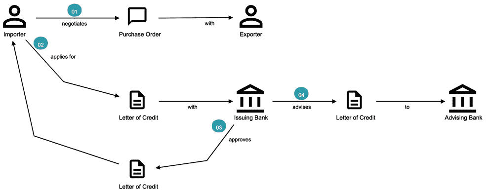

图 4.5 – 介绍通知行

**帕特里克**：*通知行做了什么？*

**凯蒂**：*通知行通知出口商关于信用证的信息。*

**帕特里克**：*进口商不需要知道信用证已通知吗？*

**凯蒂**：*是的。开证行通知进口商，信用证已通知出口商。*

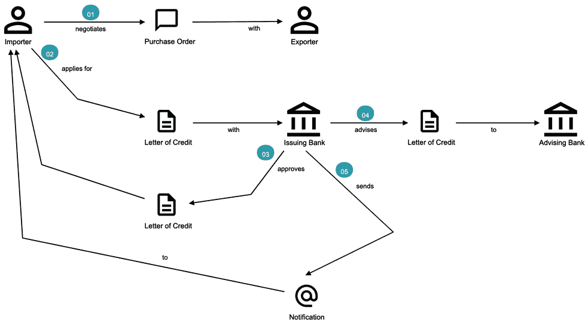

图 4.6 – 建议通知给进口商

**帕特里克**：*出口商如何知道如何进行操作？*

**凯蒂**：*通过通知行——他们通知出口商信用证已发行。*

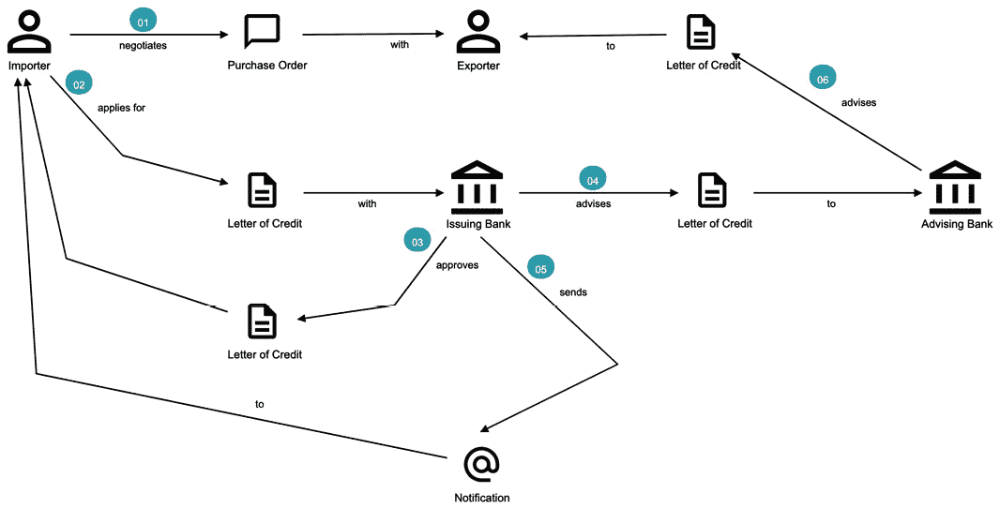

图 4.7 – 将建议发送给出口商

**帕特里克**：*出口商现在就开始发货，他们如何收款？*

**凯蒂**：*通过通知行——他们通知出口商信用证已发行，这触发了流程中的下一步——这个过程称为*结算*。但让我们现在专注于发行。我们将在稍后讨论结算。*

我们现在已经查看了一个典型的 DST 工作坊的摘录。它提供了一个相当好的对高级业务流程的理解。请注意，在过程中我们没有引用任何技术工件。

为了细化这个流程并将其转换为可用于设计软件解决方案的形式，我们需要进一步改进这个视图。在下一节中，我们将使用**EventStorming**作为一种结构化的方法来实现这一点。

# EventStorming

“驳斥胡说八道的能量比产生它的能量大一个数量级。”

– 阿尔贝托·布兰多利尼

## 介绍 EventStorming

在上一节中，我们获得了对信用证发行流程的高级理解。为了能够构建一个现实世界的应用，使用一种深入到下一级细节的方法是有帮助的。EventStorming，最初由阿尔贝托·布兰多利尼构想，就是这样一种用于协作探索复杂领域的方法。

在这种方法中，你只需从墙上或白板上按大致时间顺序列出对业务领域有重要意义的所有事件，使用一堆彩色便利贴。每种便签类型（用不同颜色表示）都有特定的用途，如下所述：

+   **领域事件**：对业务流程有重要意义的事件——用过去时态表达。

+   **命令**：可能引起一个或多个领域事件发生的动作或活动。这是由用户发起或系统发起的，作为对领域事件的响应。

+   **用户**：执行业务动作/活动的人。

+   **策略**：一组需要遵守的业务不变量（规则），以便成功执行动作/活动。

+   **查询/读取模型**：执行动作/活动所需的信息。

+   **外部系统**：对业务流程有重要意义但在当前上下文中不在范围内的系统。

+   **热点**：系统内部的一个争议点，可能对团队的小部分人来说既令人困惑又令人费解。

+   **聚合**：一个状态变化一致且原子化的对象图。这与我们在*第二章*中看到的*聚合*定义一致，*DDD 如何适应？*。

这里展示了我们的事件风暴研讨会中贴纸的描绘：

图 4.8 – 事件风暴图例

为什么是领域事件？

当试图理解一个业务流程时，解释该背景下的重要事实或事物是很方便的。这种做法也可以是非正式的，并且对未经介绍的人群来说很容易理解。这提供了一个易于消化的领域复杂性的视觉表示。

## 使用事件风暴法处理 LC 发行申请

现在我们已经通过领域讲故事研讨会对当前业务流程有了高级理解，让我们看看我们如何使用事件风暴法深入挖掘。以下是从同一应用程序的事件风暴研讨会阶段摘录的内容：

1.  **概述事件时间线**：在这个练习中，我们回忆系统中的重要**领域事件**（使用橙色贴纸），并将它们贴在白板上，如图所示。我们确保事件贴纸按发生的大致时间顺序粘贴。由于时间线的实施，业务流程将开始显现：

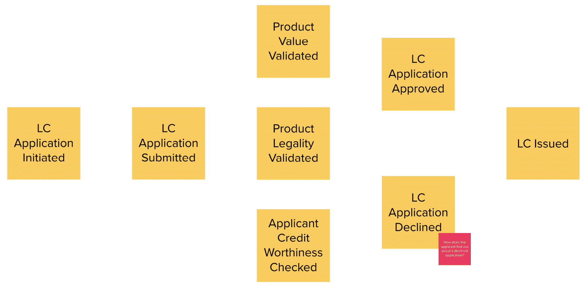

图 4.10 – 处理被拒绝申请的新事件

1.  **识别触发活动和外部系统**：在达到对事件时间线的高级理解之后，下一步是使用蓝色贴纸添加导致这些事件发生的活动/动作，以及与*外部系统*的交互（使用粉色贴纸）：

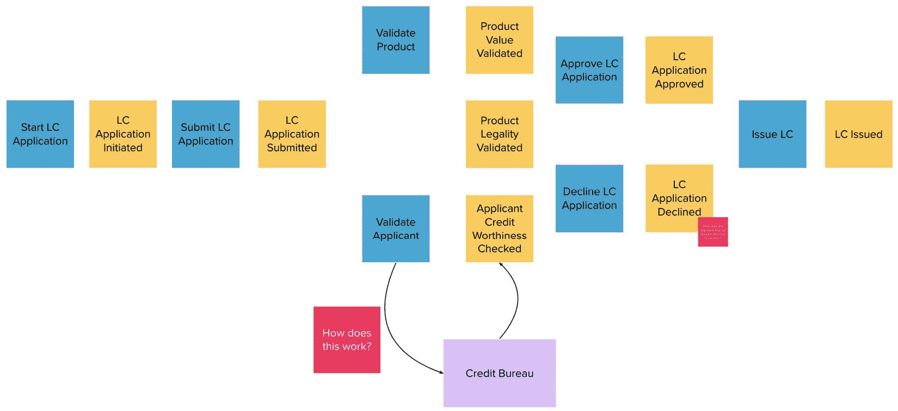

图 4.11 – 活动和外部系统

1.  **捕获用户、上下文和政策**：下一步是捕获执行这些活动的*用户*以及他们的功能*上下文*（使用黄色贴纸）和*政策*（使用紫色贴纸）。

为了解决这个问题，我们添加了一个新的领域事件，明确表示申请已被拒绝，如图所示：

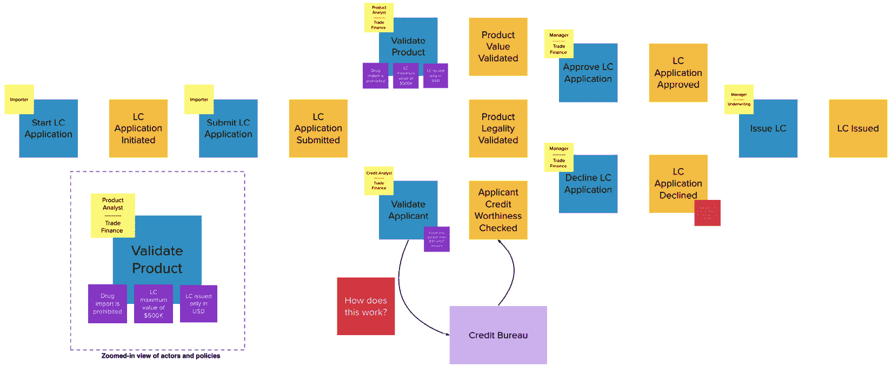

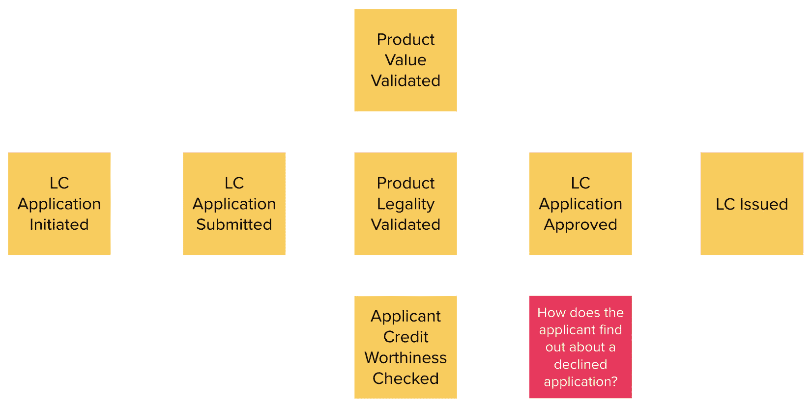

1.  **概述查询模型**：每个活动都需要一组数据。用户需要查看他们需要采取行动的带外数据，并看到他们行动的结果。这些数据集以 *查询模型*（使用绿色便签）表示：

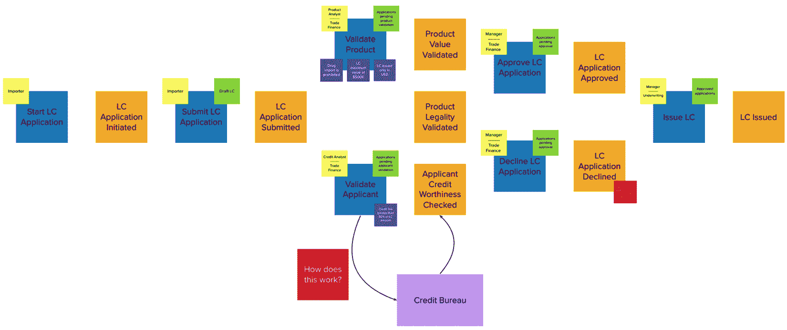

图 4.13 – 一个大型的 EventStorming 实作工作板

重要提示

对于领域故事讲述和 EventStorming 实作，当有大约六到八人参与，并且有合适的领域和技术专家混合时，效果最佳。

这标志着 EventStorming 实作结束，以获得对 LC 应用和发行流程的合理详细理解。这意味着我们已经结束了领域需求收集过程吗？绝非如此——虽然我们在理解领域方面取得了重大进展，但仍有一段很长的路要走。阐述领域需求的过程是持续的。我们在这一连续体中处于什么位置？以下图表试图阐明：

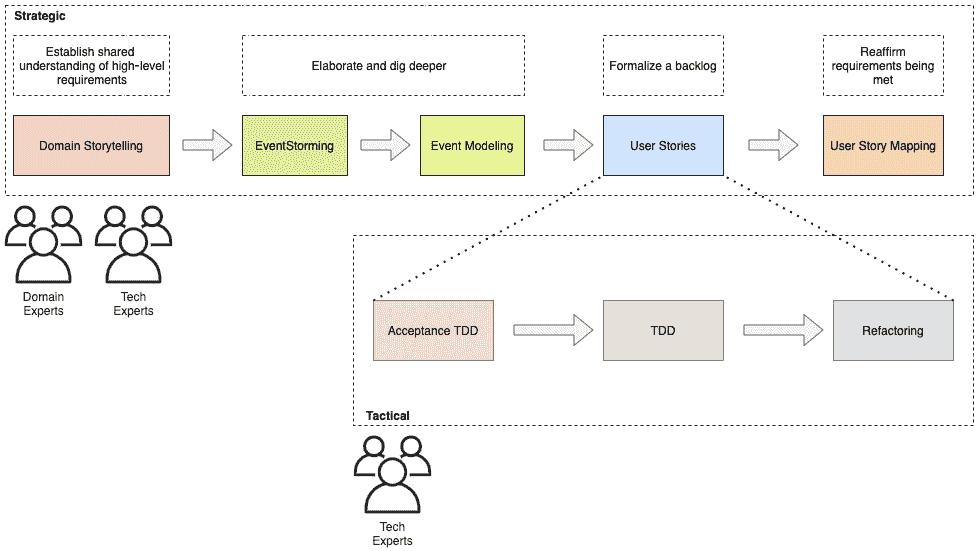

图 4.14 – 阐述领域需求连续体

在随后的章节中，我们将更详细地探讨其他技术。

# 摘要

在本章中，我们探讨了两种使用轻量级建模技术——领域故事讲述和 EventStorming——来增强我们对问题领域集体理解的方法。

领域故事讲述使用简单的图形符号在领域专家和技术团队成员之间共享业务知识。另一方面，EventStorming 使用业务流程中发生的领域事件的时序顺序来获得相同的共享理解。

领域故事讲述可以用作一种入门技术，以建立对问题空间的高级理解，而 EventStorming 可以用来指导解决方案空间详细设计决策。

带着这些知识，我们应该能够深入到解决方案实施的技术细节。在下一章中，我们将开始实施业务逻辑，并建模我们的聚合，包括命令和领域事件。

# 进一步阅读

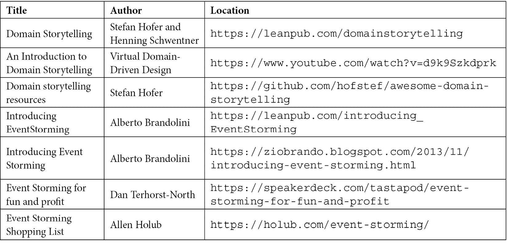
