# *第六章*：基于任务的用户界面实现

要完成一项艰巨的任务，首先必须使其变得简单。

– 马蒂·鲁宾

**领域驱动设计**（DDD）的精髓在于捕捉业务流程和用户意图。在前一章中，我们设计了一套 API，并没有过多关注这些 API 最终用户将如何使用它们。在这一章中，我们将使用 JavaFX 框架为 LC 应用程序设计 GUI。作为其中的一部分，我们将检查这种独立设计 API 的方法如何导致生产者和消费者之间的阻抗不匹配。我们将检查这种阻抗不匹配的后果以及基于任务的 UI 如何帮助应对这种不匹配。

在本章中，我们将涵盖以下主题：

+   API 样式

+   启动 UI

+   实现 UI

到本章结束时，你将了解如何运用 DDD 原则来帮助你构建简单直观的健壮用户体验。你还将了解为什么从消费者的角度设计你的后端接口（API）可能是明智的。

# 技术要求

你将需要访问以下内容：

+   JDK 1.8+（我们使用了 Java 16 来编译示例源代码）

+   JavaFX SDK 16 和 Scene Builder

+   Maven 3.x

+   Spring Boot 2.4.x

+   mvvmFX 1.8 ([`sialcasa.github.io/mvvmFX/`](https://sialcasa.github.io/mvvmFX/))

+   JUnit 5.7.x（包含在 Spring Boot 中）

+   TestFX（用于 UI 测试）

+   OpenJFX Monocle（用于无头 UI 测试）

+   Project Lombok（用于减少冗余）

在我们深入构建 GUI 解决方案之前，让我们快速回顾一下我们之前留下的 API 状态。

# API 样式

如果你还记得第五章中的*实现领域逻辑*，我们创建了以下命令：

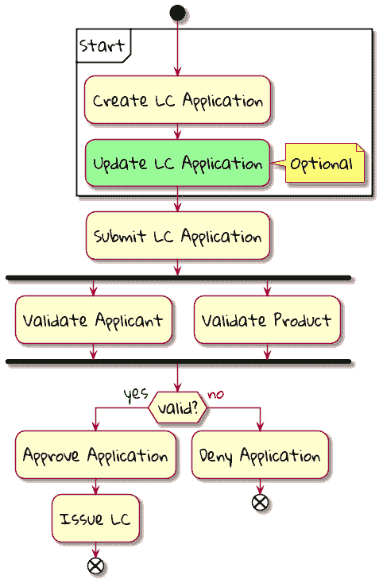

图 6.1 – 事件风暴会议中的命令

如果你仔细观察，似乎有两个粒度的命令。**创建 LC 应用程序**和**更新 LC 应用程序**是粗粒度的，而其他的则更专注于它们的意图。粗粒度命令的可能分解方式如下所示：

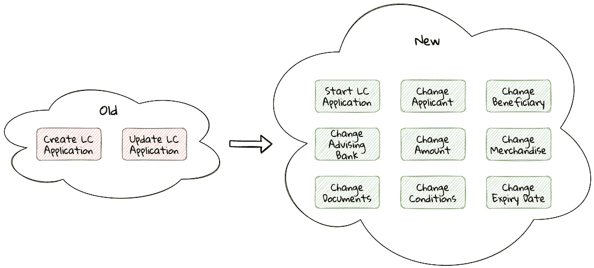

图 6.2 – 分解的命令

除了比前一个迭代的命令更细粒度之外，修订后的命令似乎更好地捕捉了用户的意图。这可能感觉像是一个微小的语义变化，但可能会对我们解决方案的最终用户使用方式产生巨大影响。那么问题来了，我们是否应该*始终*偏好细粒度 API 而不是粗粒度 API。答案可能更加复杂。在设计 API 和体验时，我们看到两种主要风格被采用：

+   基于 CRUD

+   基于任务

让我们更详细地看看这些。

## 基于 CRUD 的 API

`Insert`、`Select`、`Update` 和 `Delete`。同样，HTTP 协议有 `POST`、`GET`、`PUT` 和 `DELETE` 作为动词来表示这些 CRUD 操作。这种方法已经扩展到我们 API 的设计中。这导致了基于 CRUD 的 API 和用户体验的激增。看看来自 *第五章* 的 `CreateLCApplicationCommand`，*实现领域逻辑*：

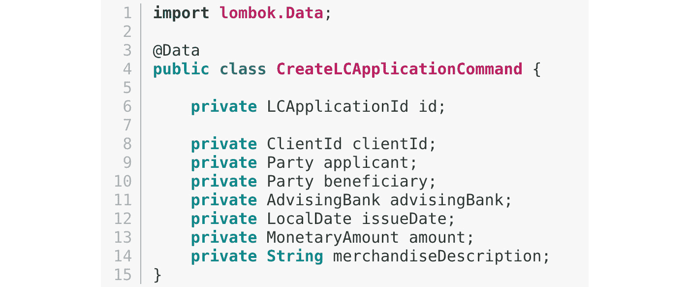

沿着类似的思路，创建相应的 `UpdateLCApplicationCommand` 并不罕见，如下所示：

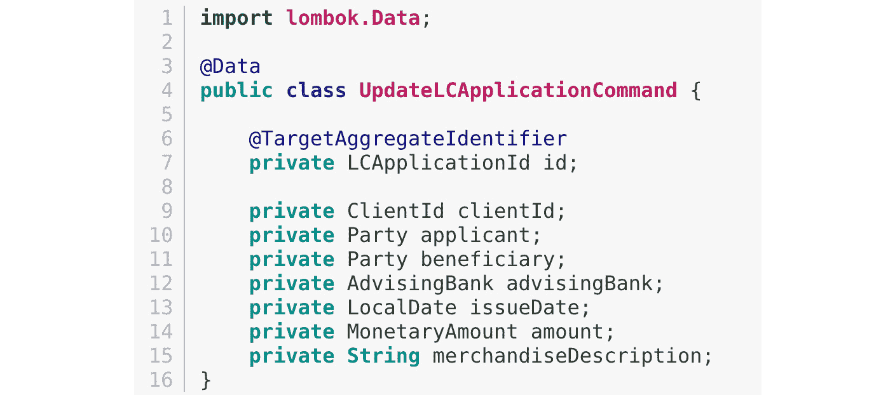

虽然这非常常见且很容易理解，但并非没有问题。以下是一些采取这种方法会引发的问题：

+   我们是否允许更改 `update` 命令中列出的所有内容？

+   假设一切都可以改变，它们是否同时改变？

+   我们如何知道确切发生了什么变化？我们应该进行差异比较吗？

+   如果上述所有属性都没有包含在 `update` 命令中怎么办？

+   如果未来需要添加属性怎么办？

+   用户想要完成的事务的业务意图是否被捕捉到了？

在一个简单的系统中，这些问题的答案可能并不那么重要。然而，随着系统复杂性的增加，这种方法是否仍然能够适应变化？我们认为，有必要考虑另一种方法，即基于任务的 API，以便能够回答这些问题。

## 基于任务的 API

在一个典型的组织中，个人执行与其专业相关的任务。组织越大，专业化的程度越高。根据个人专业来隔离任务的方法是有道理的，因为它减少了相互干扰的可能性，尤其是在完成复杂工作的时候。例如，在 LC 申请流程中，需要确定产品的价值/合法性，同时也要确定申请人的信用度。这些任务通常由不同部门的个人执行是有意义的，这也意味着这些任务可以独立于其他任务执行。

在业务流程方面，如果我们有一个名为 `CreateLCApplicationCommand` 的命令先于这些操作，那么两个部门的个人首先必须等待整个申请表填写完毕，然后才能开始他们的工作。其次，如果通过单个 `UpdateLCApplicationCommand` 命令更新任何信息，那么不清楚具体发生了什么变化。这种流程中的不明确性可能导致至少一个部门收到虚假通知。

由于大部分工作都是以特定任务的形式进行的，如果我们的流程和 API 能够反映这些行为，这将对我们有利。

考虑到这一点，让我们重新审视我们修订后的 LC 申请流程 API：

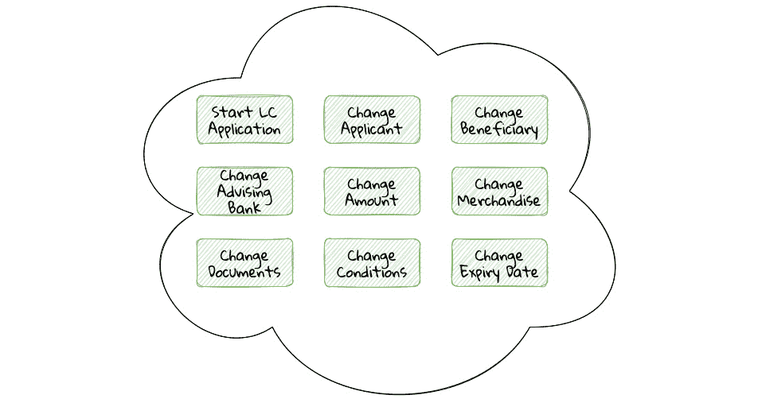

图 6.3 – 修订后的命令

虽然之前可能看起来我们只是将粗粒度的 API 转换为更细粒度，但实际上，这更好地代表了用户意图要执行的任务。因此，本质上，基于任务的 API 是以与用户意图更紧密对齐的方式对工作进行分解。使用我们新的 API，产品验证可以在`ChangeMerchandise`发生时立即开始。此外，用户的行为以及对此行为需要做出何种反应都变得明确无误。这随即引发了一个问题：我们是否应该始终使用基于任务的 API。让我们更详细地看看其影响。

## 基于任务还是基于 CRUD？

基于 CRUD 的 API 似乎在聚合级别上运行。在我们的例子中，我们有 LC 聚合。在最简单的情况下，这本质上等同于与每个 CRUD 动词对齐的四个操作。然而，正如我们所看到的，即使在我们的简化版本中，LC 正成为一个相当复杂的概念。在 LC 级别上仅需要处理四个操作，从认知上来说是复杂的。随着需求的增加，这种复杂性只会继续增加。例如，考虑一种情况，业务表达了对捕获更多关于“商品”信息的需要，而今天，这仅仅以自由文本的形式被捕获。这里展示了商品信息的更详细版本：

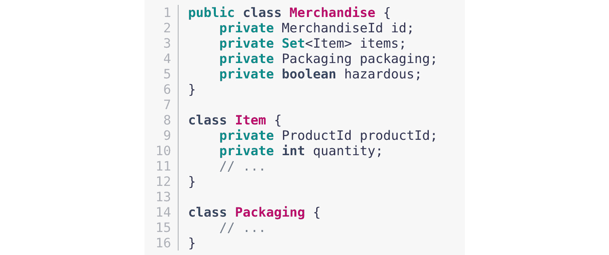

在我们当前的设计中，这种变化的含义对提供者和消费者（们）都产生了深远的影响。让我们更详细地看看一些后果：

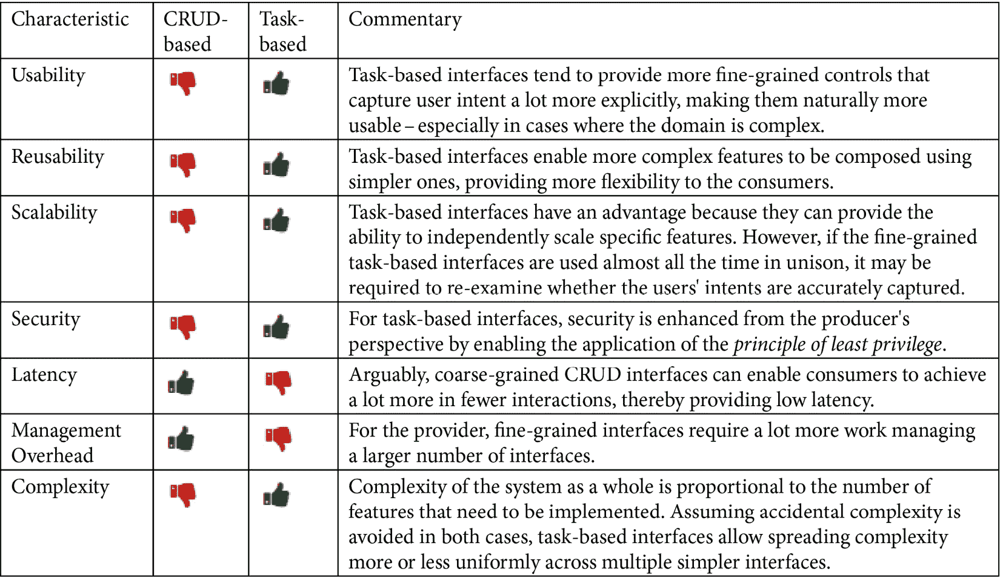

在我们当前的设计中，这种变化的含义对提供者和消费者（们）都产生了深远的影响。让我们更详细地看看一些后果。

如我们所见，基于 CRUD 和基于任务的接口之间的选择是微妙的。我们并不是建议你应该选择其中之一。你使用哪种风格将取决于你的具体需求和上下文。根据我们的经验，基于任务的接口将用户意图视为一等公民，并以非常优雅的方式延续了 DDD 的通用语言精神。我们更倾向于尽可能地将接口设计为基于任务的，因为它们会产生更直观的界面，更好地表达问题域。

随着系统的演变，它们开始支持更丰富的用户体验和多个渠道，基于 CRUD 的接口似乎需要额外的翻译层来满足用户体验需求。下面的图示描绘了一个支持多用户体验渠道的解决方案的典型分层架构：

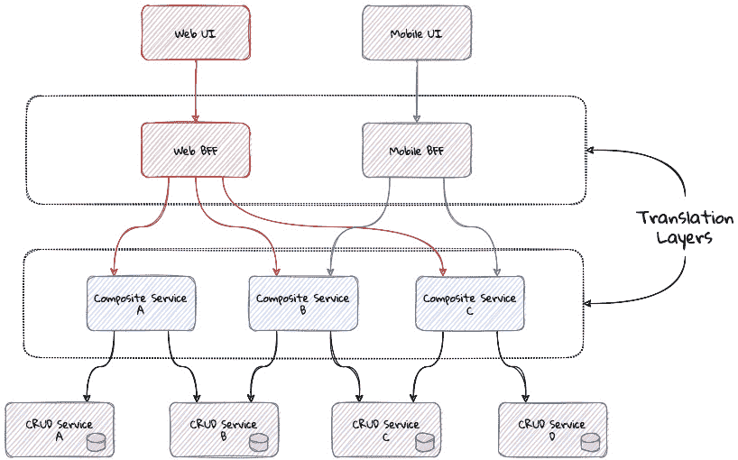

图 6.4 – 支持多用户体验渠道的分层架构

这种设置通常由以下内容组成：

+   由基于 CRUD 的服务组成的领域层，这些服务简单地映射到数据库实体

+   由跨越多个核心服务的企业能力组成的复合层

+   由特定通道 API 组成的**前端后端**（**BFF**）层

注意，复合层和 BFF 层主要作为将后端能力映射到用户意图的手段。在一个理想的世界里，如果后端 API 紧密反映用户意图，那么翻译的需求应该是最小的（如果有的话）。我们的经验表明，这种设置会导致业务逻辑被推向用户通道，而不是封装在精心设计的业务服务中。此外，这些层会导致同一功能在不同通道上产生不一致的体验，因为现代团队是按照层边界结构化的。

重要提示

我们并不反对使用分层架构。我们认识到分层架构可以带来模块化、关注点分离和其他相关好处。然而，我们反对仅仅为了补偿核心领域 API 设计不当而创建额外的层级。

一个精心设计的 API 层可以对构建出色的用户体验产生深远的影响。然而，这是一章关于实现用户界面的内容。让我们回到为 LC 应用程序创建用户界面的任务。

# 启动 UI

我们将简单地为我们创建的 LC 应用程序构建 UI，该应用程序在*第五章*中实现，*实现领域逻辑*。有关详细说明，请参阅*启动应用程序*部分。此外，我们还需要将以下依赖项添加到项目根目录下的 Maven `pom.xml`文件的`dependencies`部分：

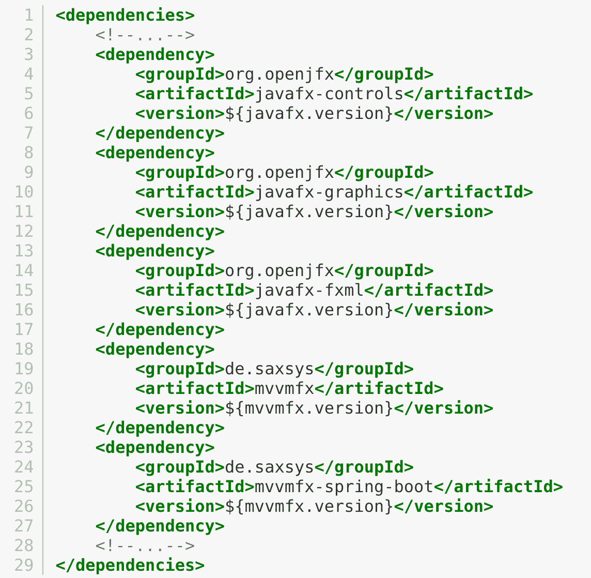

要运行 UI 测试，你需要添加以下依赖项：

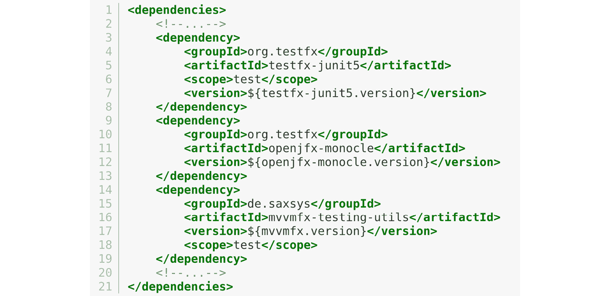

要能够从命令行运行应用程序，你需要在`pom.xml`文件的`plugins`部分添加`javafx-maven-plugin`，如下所示：

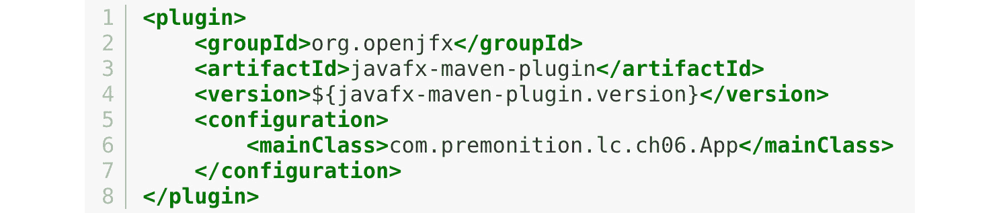

要从命令行运行应用程序，请使用以下命令：

```java
mvn javafx:run
```

重要提示

如果你使用的是版本大于 1.8 的 JDK，JavaFX 库可能不会与 JDK 本身捆绑。当你从你的 IDE 运行应用程序时，你可能会需要添加以下内容：

`--module-path=<path-to-javafx-sdk>/lib/ \`

`--add-modules=javafx.controls,javafx.graphics,`

`javafx.fxml,javafx.media`

我们正在使用 mvvmFX 框架来组装 UI。为了与 Spring Boot 兼容，应用程序启动器看起来如下所示：

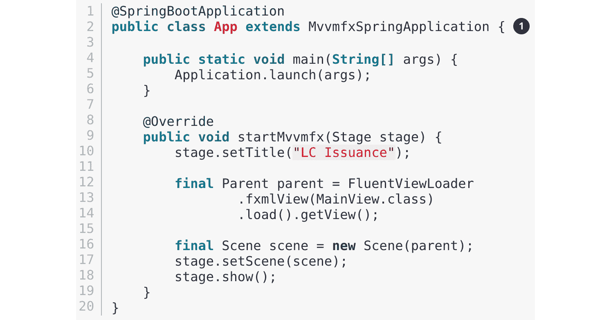

重要提示

我们需要从`MvvmfxSpringApplication` mvvmFX 框架类扩展。

请参考附带源代码仓库中的`ch06`目录以获取完整示例。

# 实现 UI

当与用户界面一起工作时，使用以下这些表示模式是相当常见的：

+   **模型-视图-控制器**（**MVC**）

+   **模型-视图-演示者**（**MVP**）

+   **模型-视图-视图模型**（**MVVM**）

MVC 模式存在时间最长。在协作的模型、视图和控制器对象之间分离关注点的想法是合理的。然而，在实际实现中，这些对象的定义似乎有很大的差异——在许多情况下，控制器变得过于复杂。相比之下，MVP 和 MVVM，虽然都是 MVC 的衍生品，但似乎在协作对象之间带来了更好的关注点分离。特别是当与数据绑定构造结合使用时，MVVM 使得代码更加易于阅读、维护和测试。在这本书中，我们使用 MVVM，因为它使我们能够进行测试驱动开发，这是我们强烈偏好的。让我们快速了解一下 MVVM 入门，如 mvvmFX 框架中实现的那样。

## MVVM 入门

现代 UI 框架开始采用声明性风格来表示视图。MVVM 旨在通过使用绑定表达式从视图中移除所有 GUI 代码（代码后置），从而实现风格与编程关注点之间的更清晰分离。这里展示了如何实现此模式的视觉高级概述：


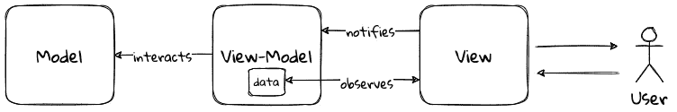

图 6.5 – MVVM 设计模式

该模式包含以下组件：

+   **模型**：负责容纳业务逻辑和管理应用程序的状态。

+   **视图**：负责向用户展示数据，并通过视图代理通知视图模型关于用户交互。

+   **视图代理**：负责在用户或视图模型进行更改时保持视图和视图模型同步。它还负责将视图上执行的操作传输到视图模型。

+   **视图模型**：负责代表视图处理用户交互。视图模型使用观察者模式（通常是一向或双向数据绑定，使其更方便）与视图交互。视图模型与模型交互以进行更新和读取操作。

## 创建新的 LC

让我们考虑创建新的 LC 的例子。要开始创建新的 LC，我们只需要申请人提供一个友好的客户端引用。这是一个容易记住的文本字符串。这里展示了这个 UI 的简单版本：


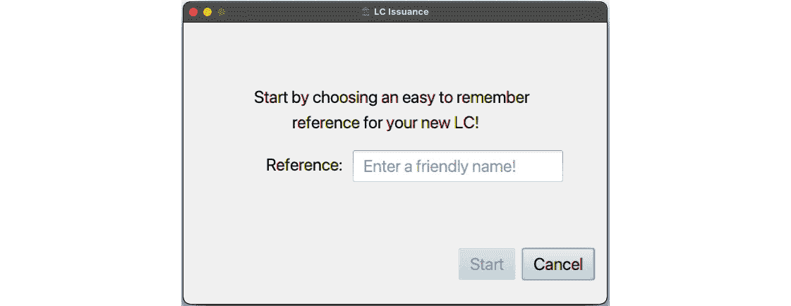

图 6.7 – 开始 LC 创建屏幕

让我们更详细地检查每个组件的实现和目的。

## 声明性视图

当使用 JavaFX 时，视图可以使用 FXML 格式的声明性风格进行渲染。以下是从`StartLCView.fxml`文件中提取的重要片段，用于开始创建新的 LC：

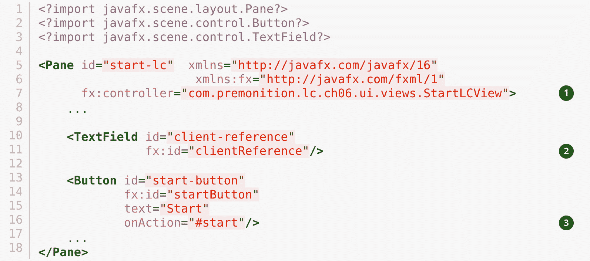

1.  `StartLCView`类作为 FXML 视图的视图代理，并使用根元素（在这种情况下为`javafx.scene.layout.Pane`）的`fx:controller`属性进行分配。

1.  为了在视图代理中引用`client-reference`输入字段，我们使用`fx:id`注解（在这种情况下为`clientReference`）。

1.  同样，在视图代理中使用`"`fx:id=startButton"`来引用启动按钮。此外，视图代理中的`start`方法被分配来处理默认操作（`javafx.scene.control.Button`的按钮按下事件）。

## 视图代理

接下来，让我们看看`com.premonition.lc.issuance.ui.views.StartLCView`视图代理的结构：

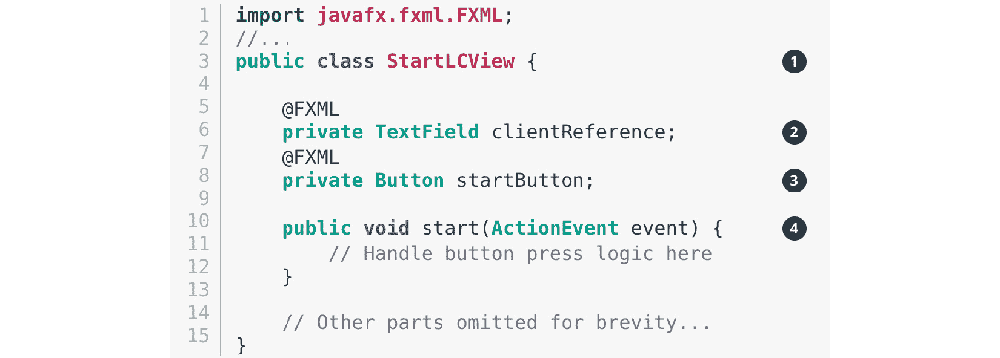

1.  这是`StartLCView.fxml`视图的视图代理类。

1.  这是视图中的`clientReference`文本框的 Java 绑定。成员的名称需要与视图中的`fx:id`属性值完全匹配。此外，它需要使用`@javafx.fxml.FXML`注解进行注解。如果视图代理中的成员是公共的并且与视图中的名称匹配，则使用`@FXML`注解是可选的。

1.  同样，`startButton`被绑定到视图中的相应按钮小部件。

1.  这是当按下`startButton`时的动作处理方法。

## 视图模型

这是`StartLCView`的`StartLCViewModel`视图模型类：

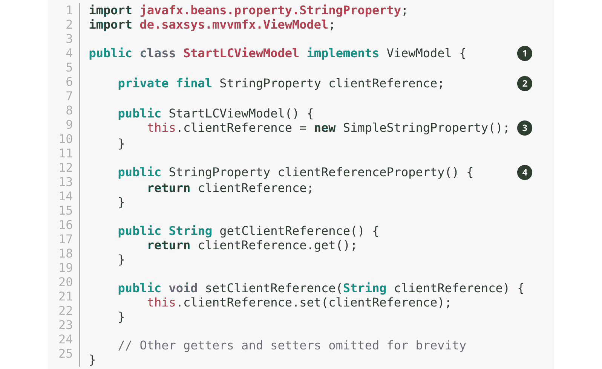

1.  这是`StartLCView`的视图模型类。请注意，我们必须实现 mvvmFX 框架提供的`de.saxsys.mvvmfx.ViewModel`接口。

1.  我们正在使用 JavaFX 提供的`SimpleStringProperty`初始化`clientReference`属性。还有其他几个属性类可以定义更复杂的数据类型。请参阅 JavaFX 文档以获取更多详细信息。

1.  这是视图模型中`clientReference`的值。我们很快将看看如何将其与视图中的`clientReference`文本框的值关联起来。请注意，我们正在使用 JavaFX 提供的`StringProperty`，它提供了对客户端引用底层字符串值的访问。

1.  除了为底层值的标准获取器和设置器之外，JavaFX beans 还需要创建一个特殊的访问器来处理该属性本身。

### 将视图绑定到视图模型

接下来，让我们看看如何将视图与视图模型关联起来：

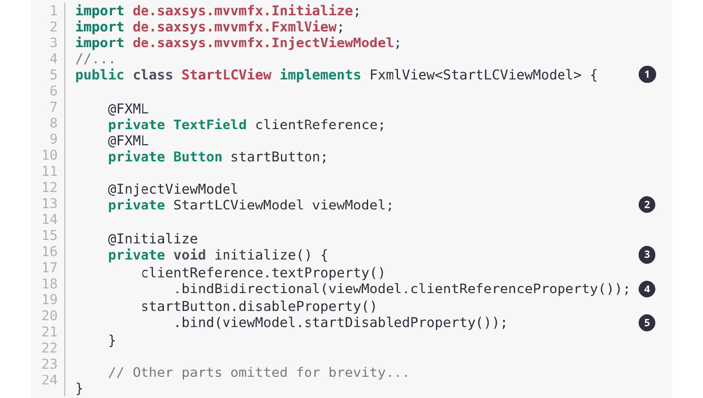

1.  `mvvmFX`框架要求`view delegate`实现`FXMLView<? extends ViewModelType>`。在这种情况下，视图模型类型是`StartLCViewModel`。`mvvmFX`框架还支持其他视图类型。请参阅框架文档以获取更多详细信息。

1.  框架提供了一个`@de.saxsys.mvvmfx.InjectViewModel`注解，允许依赖注入，将视图模型注入到视图代理中。

1.  框架将在初始化过程中调用所有带有`@de.saxsys.mvvmfx.Initialize`注解的方法。如果方法名为`initialize`且声明为 public，则可以省略此注解。请参阅框架文档以获取更多详细信息。

1.  现在，我们已经将视图代理中`clientReference`文本框的文本属性绑定到视图模型中的相应属性。请注意，这是一个双向绑定，这意味着如果任一端发生变化，视图和视图模型中的值都将保持同步。

1.  这是绑定操作的另一种变体，我们在这里使用的是单向绑定。在这里，我们将启动按钮的禁用属性绑定到视图模型上的相应属性。我们很快就会看到为什么我们需要这样做。

### 在 UI 中强制执行业务验证

我们有一个业务验证，即 LC 的客户端引用长度至少需要四个字符。这将在后端强制执行。然而，为了提供更丰富的用户体验，我们也将在这个 UI 上强制执行此验证。

重要提示

这可能与我们集中业务验证在后端的概念相悖。虽然这可能是一个崇高的尝试来实施**不要重复自己**（**DRY**）原则，但在现实中，它带来了许多实际的问题。分布式系统专家 Udi Dahan 对为什么这可能不是一个值得追求的善举有非常有趣的看法。Ted Neward 也在他的博客中谈到了这一点，标题为*企业计算的谬误*。

使用 MVVM 的优势在于，这个逻辑可以很容易地在视图模型的简单单元测试中进行测试。现在让我们看看它是如何工作的：

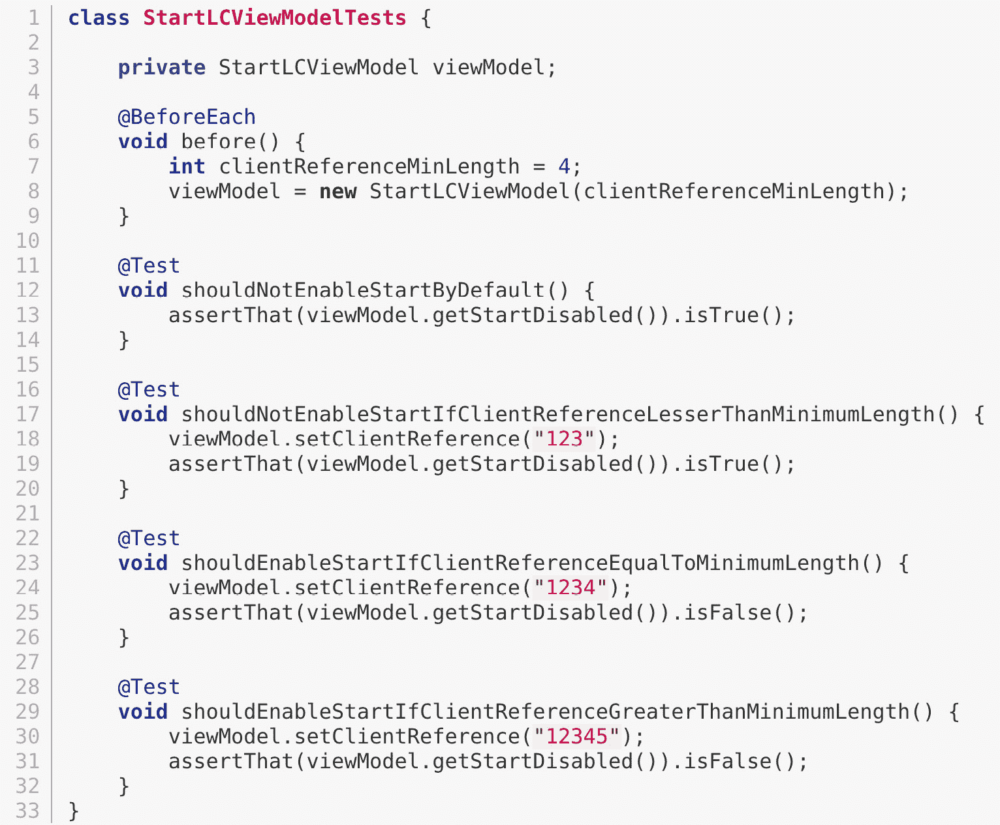

现在，让我们看看视图模型中这个功能的实现：

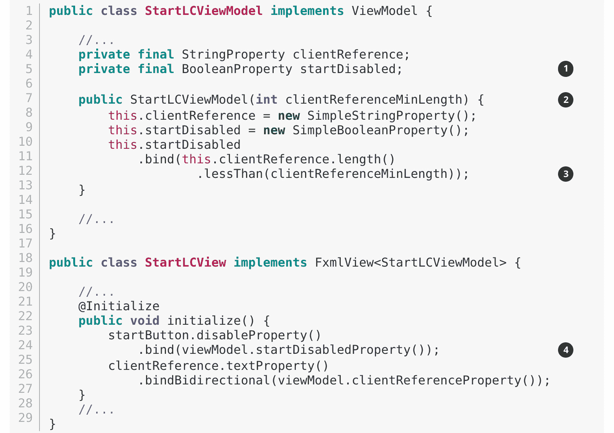

1.  我们在视图模型中声明了一个`startDisabled`属性来管理何时应禁用启动按钮。

1.  有效客户端引用的最小长度被注入到视图模型中。可以想象，这个值可能是作为外部配置的一部分提供的，或者可能来自后端。

1.  我们创建了一个绑定表达式来匹配业务要求。

1.  我们将视图模型属性绑定到视图代理中启动按钮的禁用属性。

让我们再看看如何编写一个端到端、无头 UI 测试，如下所示：

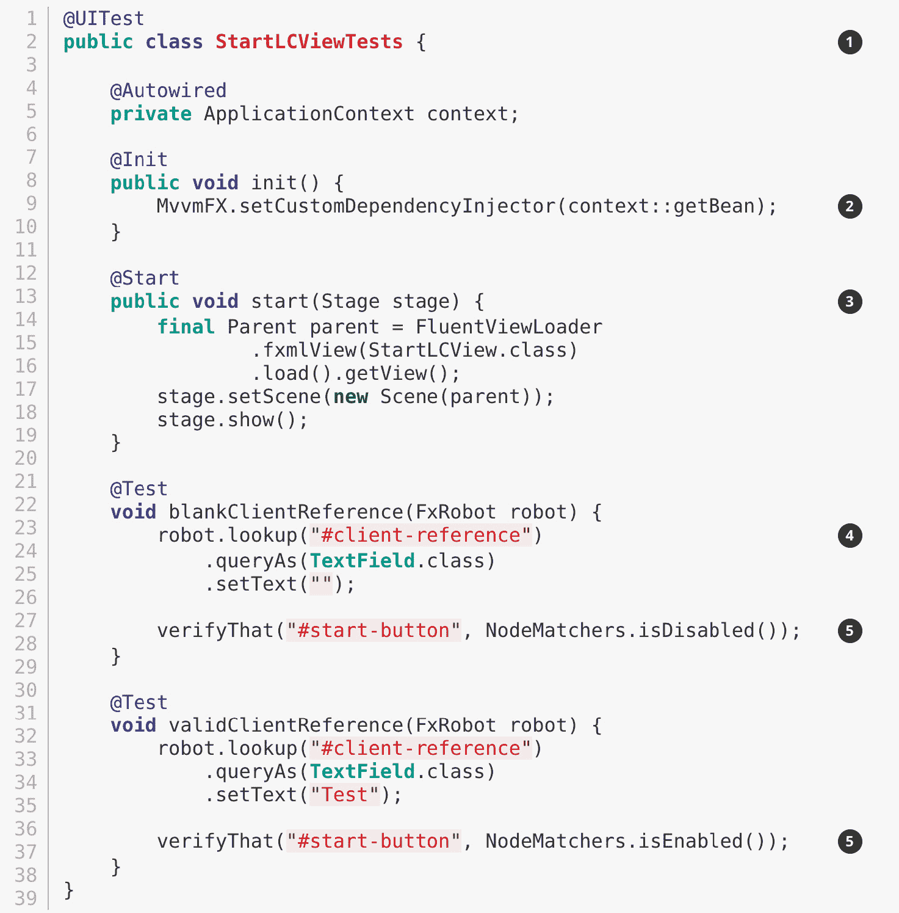

1.  我们编写了一个方便的`@UITest`扩展，用于结合 Spring 框架和 TestFX 测试。请参阅书中附带的源代码以获取更多详细信息。

1.  我们设置了 Spring 上下文，使其作为 mvvmFX 框架及其注入注解（例如，`@InjectViewModel`）的依赖注入提供者。

1.  我们正在使用 TestFX 框架提供的`@Start`注解来启动 UI。

1.  TestFX 框架注入了一个 FxRobot UI 辅助实例，我们可以使用它来访问 UI 元素。

1.  我们使用 TestFX 框架提供的便利匹配器进行测试断言。

现在，当我们运行应用程序时，我们可以看到在输入有效的客户端引用时启动按钮是启用的：

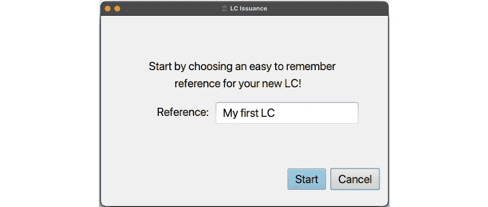

图 6.8 – 使用有效的客户端引用启用启动按钮

现在我们已经正确地启用了启动按钮，让我们实现 LC 本身的实际创建，通过调用后端 API。

### 集成后端

LC 创建是一个复杂的过程，需要各种物品的信息，正如我们在分解 LC 创建过程时所证明的那样。在本节中，我们将集成 UI 与启动新 LC 创建的命令。这发生在我们按下`StartNewLCApplicationCommand`时，如下所示：

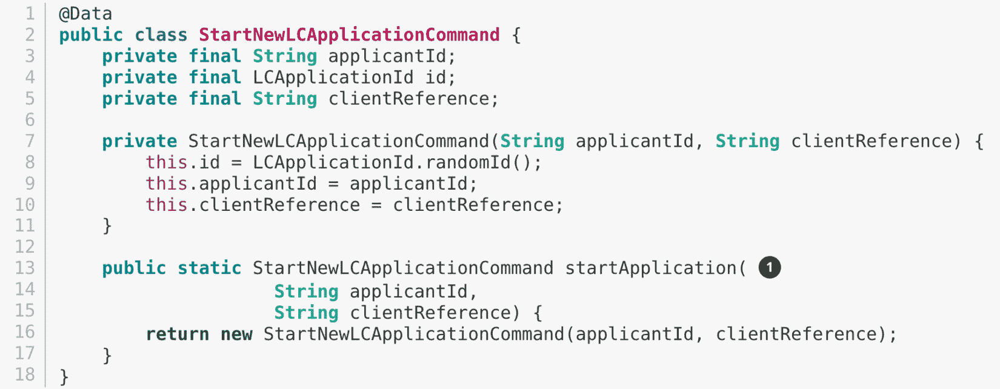

1.  要启动一个新的 LC 应用程序，我们需要`applicantId`和`clientReference`。

由于我们使用 MVVM 模式，调用后端服务的代码是视图模型的一部分。让我们驱动测试这个功能：

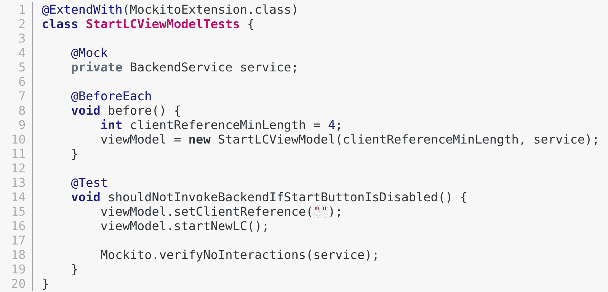

视图模型相应增强以注入`BackendService`的实例，如下所示：

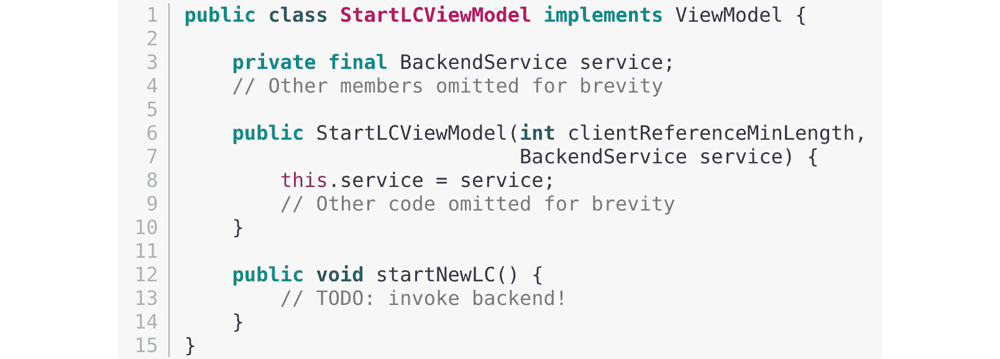

现在，让我们测试以确保只有在输入有效的客户端引用时才调用后端：

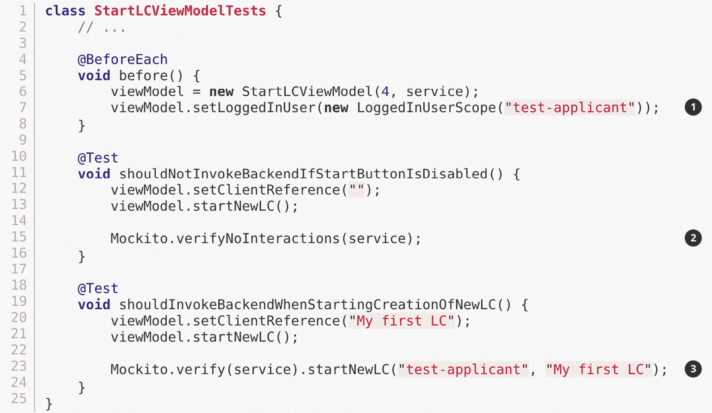

1.  我们设置已登录用户。

1.  当客户端引用为空时，不应与后端服务有任何交互。

1.  当输入有效的客户端引用值时，后端应该使用输入的值进行调用。

使此测试通过的实现看起来像这样：

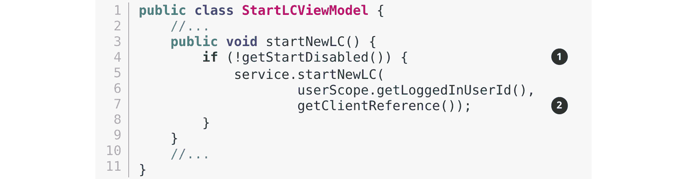

1.  我们在调用后端之前检查启动按钮是否启用。

1.  这些是实际的带有适当值的后端调用。

现在，让我们看看如何从视图中集成后端调用。我们在 UI 测试中进行了此测试，如下所示：

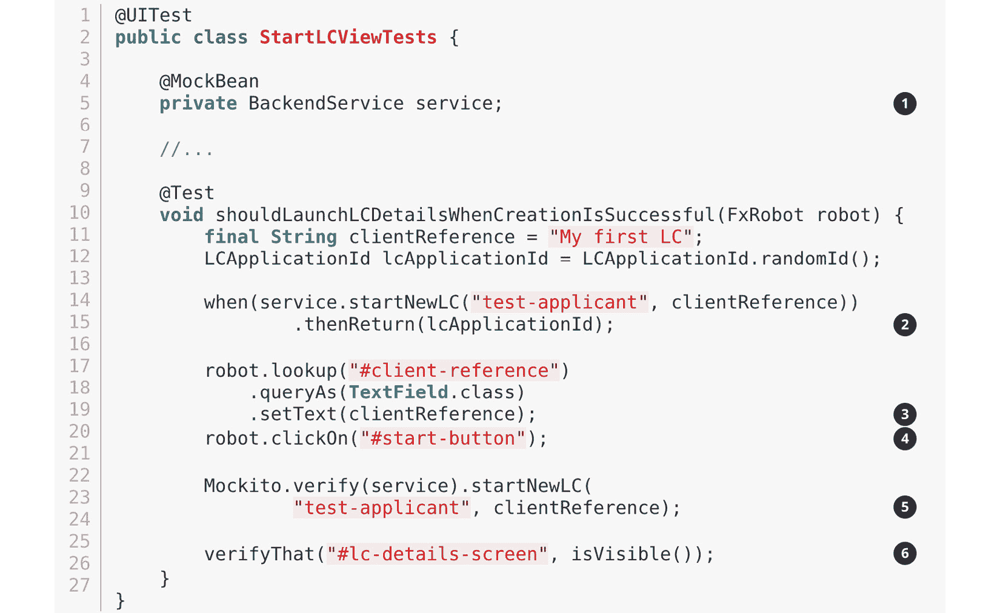

1.  我们注入后端服务的模拟实例。

1.  我们模拟后端调用以成功返回。

1.  我们输入有效的客户端引用值。

1.  我们点击**启动**按钮。

1.  我们验证服务确实使用正确的参数进行了调用。

1.  我们验证我们已经移动到 UI 中的下一个屏幕（LC 详细信息屏幕）。

让我们看看当服务调用在另一个测试中失败时会发生什么：

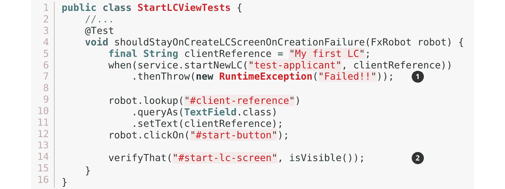

1.  我们模拟后端服务调用失败并抛出异常。

1.  我们验证我们继续停留在`start-lc-screen`。

此功能的视图实现如下所示：

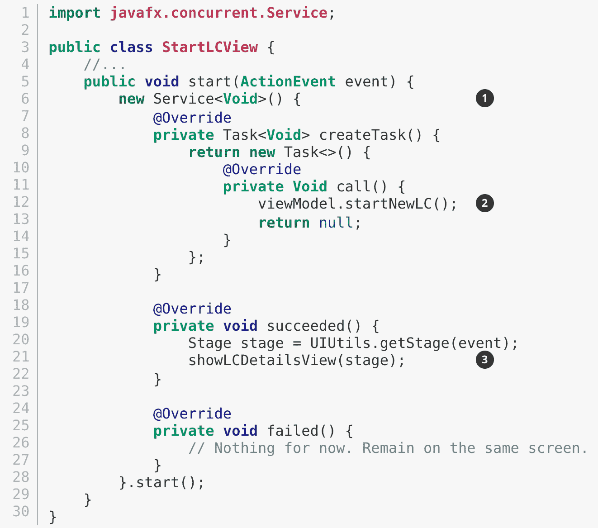

1.  JavaFX，像大多数前端框架一样，是单线程的，并且要求长时间运行的任务不要在 UI 线程上调用。为此，它提供了`javafx.concurrent.Service`抽象，以在后台线程中优雅地处理此类交互。

1.  通过视图模型实际调用后端发生在这里。

1.  我们在这里显示下一个屏幕以输入更多的 LC 详细信息。

最后，服务实现本身如下所示：

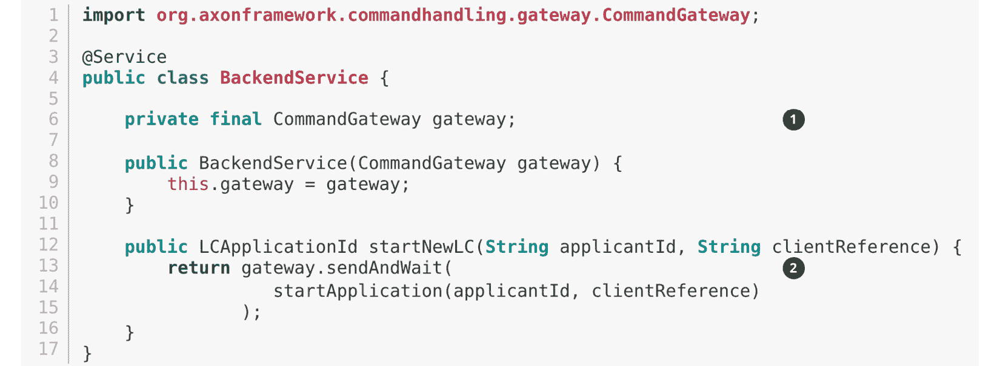

1.  我们注入由 Axon 框架提供的 `org.axonframework.commandhandling.gateway.CommandGateway` 来调用命令。

1.  实际上，使用 `sendAndWait` 方法调用后端发生在这里。在这种情况下，我们会阻塞，直到后端调用完成。还有其他不需要这种阻塞的变体。请参阅 Axon 框架文档以获取更多详细信息。

我们现在已经看到了一个完整的示例，展示了如何实现 UI 和调用后端 API。

# 摘要

在本章中，我们探讨了 API 风格的细微差别，并阐明了设计能够紧密捕捉用户意图的 API 非常重要的原因。我们比较了基于 CRUD 和基于任务的 API 的区别。最后，我们利用 MVVM 设计模式实现了 UI，并展示了它是如何帮助测试驱动前端功能的。

现在我们已经实现了创建新的 LC，为了实现后续的命令，我们需要访问现有的 LC。在下一章中，我们将探讨如何实现查询端以及如何使其与命令端保持同步。

# 进一步阅读

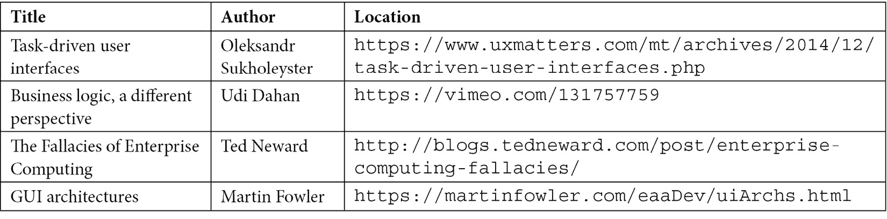
