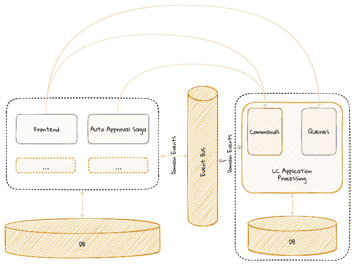
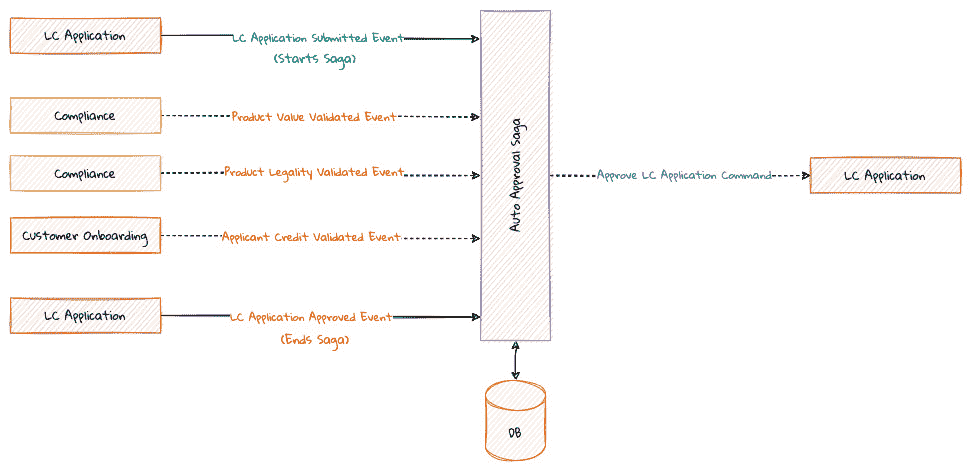
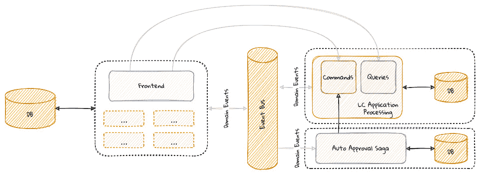
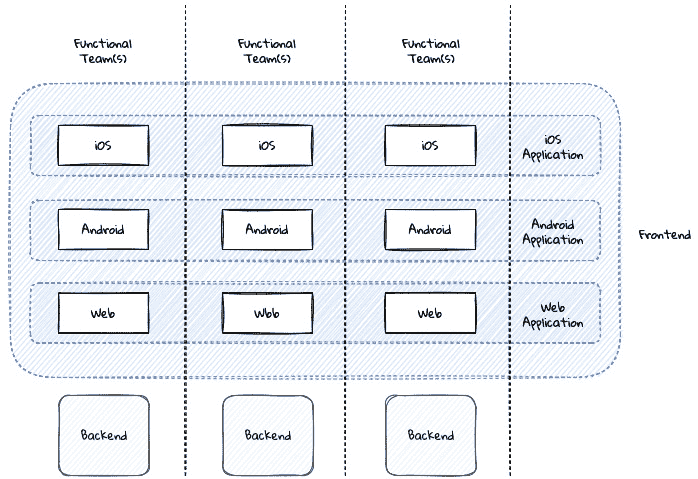
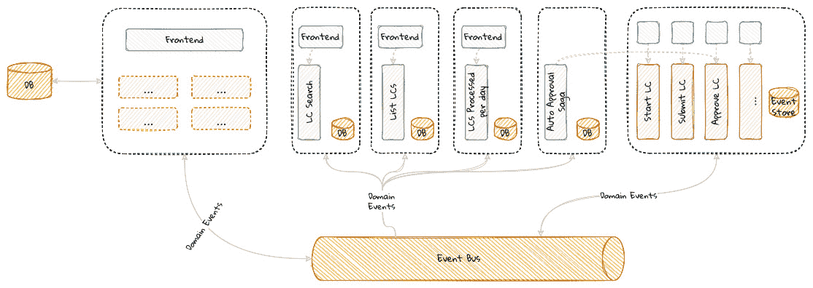
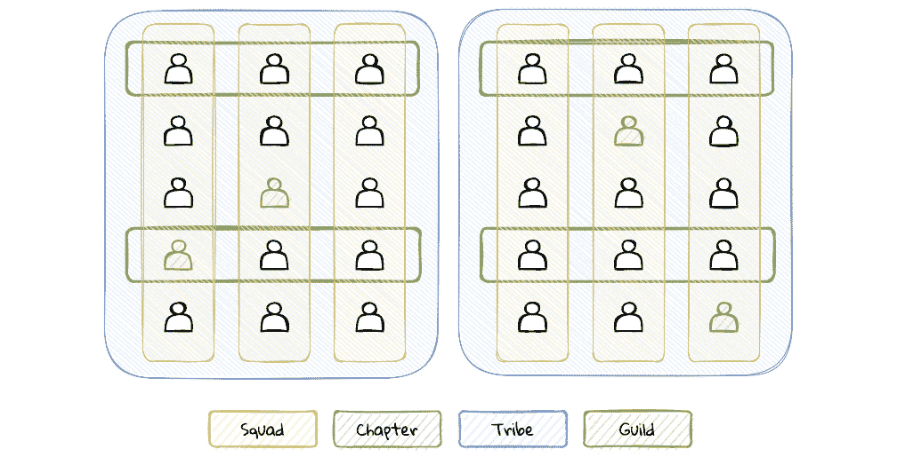
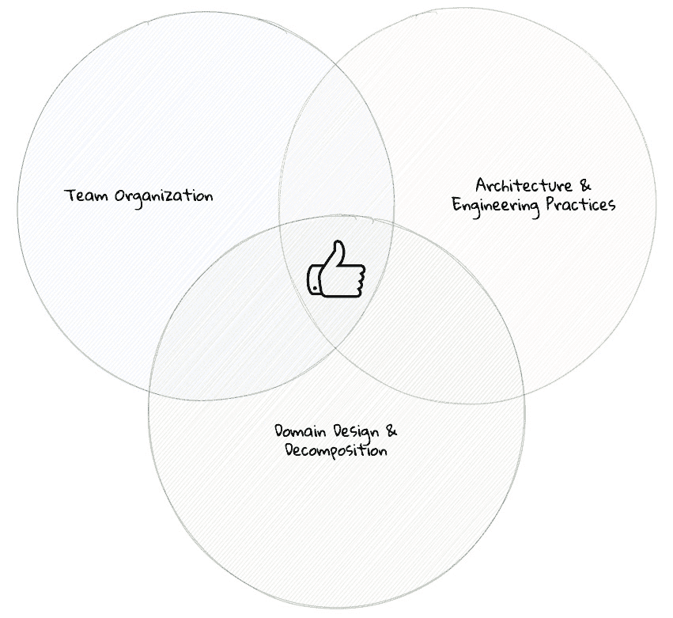
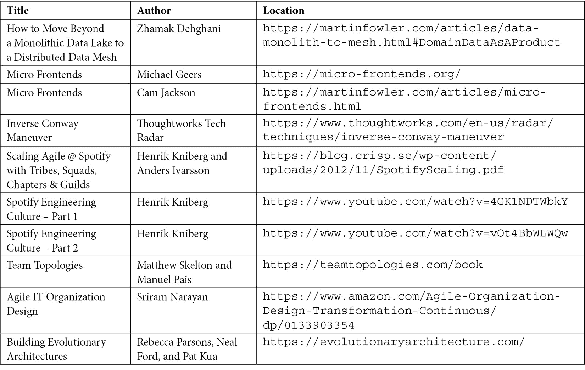

# 第十一章：分解为更细粒度的组件

在上一章中，我们将 *LC 应用处理* 功能从单体应用中分解出来。在本章中，我们将进一步将这些组件分解为更细粒度的组件。此外，我们还将探讨何时以及是否应该进行这种分解。

本章将涵盖以下主题：

+   继续我们的设计之旅

+   更细粒度的分解

+   前端的分解

+   哪里应该划线

在本章结束时，你将能够欣赏到在决定如何分解这些组件时，技术因素和非技术因素所起的作用。

# 继续我们的设计之旅

目前，我们的应用类似于这里展示的图示：

![图 11.1 – 独立数据持久化]

图 11.1 – 独立数据持久化

*LC 应用处理* 功能作为一个独立的组件存在于整个应用之外。它通过事件总线交换领域事件与单体应用进行通信。它使用自己的持久化存储，并暴露了前端消费的基于 HTTP 的 API。让我们来探讨是否可以将应用进一步分解为更细粒度的组件。当前的 `AutoApprovalSaga` 组件生活在单体应用的范围内，但这主要是我们之前设计的一个副产品，而不是一个有意的设计选择。接下来，让我们看看如何将其提取为它自己的组件。

## Saga 作为独立组件

目前，`AutoApprovalSaga` 组件（在第 *第八章* “实现长期运行的工作流程”中详细讨论）通过监听领域事件来工作，如图所示：

![图 11.2 – AutoApprovalSaga 功能分解]

图 11.2 – AutoApprovalSaga 功能分解

由于这些事件是由不同的有界上下文发布到事件总线上的，因此不需要 `AutoApprovalSaga` 嵌入到单体应用中。这意味着它可以安全地与其私有数据存储一起提取为它自己的可部署单元。这意味着我们的系统现在看起来像这里展示的图示：

![图 11.3 – AutoApprovalSaga 提取为独立组件]

图 11.3 – 将 AutoApprovalSaga 提取为独立组件

Saga 组件可以被描述为一系列有状态的监听器，它们监听来自多个聚合体的事件，并且可以向多个聚合体发出命令。我们之前看到，我们沿着聚合体的边界形成了边界上下文。鉴于 sagas 往往需要与多个聚合体交互，它们可能不会局限于这些边界上下文之内。在许多方面，sagas 可以被视为它们自己的边界上下文。这使得 sagas 作为独立组件工作变得自然而合理，这些组件在逻辑和物理层面上都与其他解决方案的部分明显区分开来。

如您所见，在*LC 应用处理*组件中，命令和查询继续使用一个共同的数据存储。让我们看看将它们隔离到自己的数据存储中涉及的内容。

## 作为独立组件的命令和查询

正如我们在第二章*“哪里和如何适用 DDD？”*中“CQRS 模式”部分所看到的，我们从中获得的主要好处是能够独立于彼此地演进和扩展这些组件。这一点很重要，因为命令和查询具有完全不同的使用模式，因此需要使用不同的领域模型。这使得我们沿着这些边界进一步分割边界上下文变得相当自然。到目前为止，这种隔离是逻辑上的。物理分离将使我们能够真正独立地扩展这些组件，如下所示：

图 11.4 – 命令和查询作为独立组件

有必要指出，现在命令处理组件现在被显示为可以访问两个不同的数据存储：

+   **聚合存储**，它存储聚合状态的基于事件源或状态存储的表示。

+   **查找存储**，在处理命令时执行业务验证时可以用来存储查找数据。这适用于我们需要访问作为聚合状态的一部分存储的数据/不能存储的数据。

我们提出这一点的原因是，我们可能需要继续对仍然存在于单体中的数据进行查找。为了实现完全的独立性，这些查找数据也必须使用诸如历史事件回放（如在第七章*“实现查询”*中讨论）或其他传统数据迁移技术（如在第十章*“开始分解之旅”*中讨论）进行迁移。

## 分布独立的查询组件

到目前为止，我们已经实现了命令和查询边界的隔离。但我们不需要就此停止。我们服务的每个查询不一定必须保持为单个组件。让我们考虑一个例子，其中我们需要为 UI 实现模糊 LC 搜索功能，并为分析用例提供 LC 事实视图。可以想象，这些需求可能由不同的团队实现，从而需要不同的组件。即使这些不是不同的团队，使用模式的差异也可能需要使用不同的持久化存储和 API，这又要求我们至少将这些中的某些作为独立的组件来实现，如图所示：

![图 11.5 – 查询分解为单个组件

![图片/B16716_Figure_11.5.jpg]

图 11.5 – 查询分解为单个组件

拥有域的团队应努力创建表现出良好域数据产品特征的查询 API。这些特征包括可发现性、可信度、自身价值以及自我描述。更多详细信息，请参阅关于从单体数据湖迁移到分布式数据网格的文章：[`martinfowler.com/articles/data-monolith-to-mesh.html#DomainDataAsAProduct`](https://martinfowler.com/articles/data-monolith-to-mesh.html#DomainDataAsAProduct)。

# 更加细粒度的分解

在这个阶段，是否还需要进一步分解且可行？如今，无论是正确还是错误，无服务器架构（特别是*函数即服务*）可能正变得非常流行。正如我们在*第二章*中指出的，“DDD 如何适应？”，这意味着我们可能能够以这种方式分解我们的命令端，即每个命令都成为其独立可部署的单位（因此是边界上下文）。换句话说，`LCApplicationSubmitCommand`和`LCApplicationCancelCommand`可以独立部署。

但仅仅因为技术上可行，我们就应该这样做吗？虽然很容易将其视为一时的风尚，但沿着命令边界拆分应用程序可能有很好的理由：

+   **风险概况**：当进行更改时，某些功能组件的风险更高。例如，提交 LC 申请可能被认为比取消申请的能力更为关键。然而，这并不意味着*取消*不重要。与*提交*解耦使得*取消*更改可以以较少的审查进行。这可能会使快速创新并带有更多实验性功能变得更容易，同时最小化造成大规模中断的恐惧。

+   **可扩展性需求**：系统中的各种命令的可扩展性需求可能会有很大差异。例如，*提交* 可能需要比 *取消* 扩展得更多。然而，耦合将迫使我们将它们视为同等，这可能是低效的。

+   **成本归属**：拥有细粒度的组件使我们能够更准确地衡量每个单独命令所投入的努力和产生的回报率。这可以使我们更容易将精力集中在最关键的功能（“核心”的核心）上，并最大限度地减少浪费。

## 对领域模型的影响

这些更细粒度的组件正引导我们走向一个点，似乎部署模型开始对设计产生重大影响。现在能够独立部署单个“任务”的事实要求我们重新审视我们如何到达边界上下文。例如，我们最初从工作在 *LC 应用处理* 边界上下文开始，我们的总体设计基于所有包含在应用处理范围内的功能。现在，我们的总体设计可以更加细粒度。这意味着我们可以有一个专门针对 *启动* 功能的总体设计，另一个针对 *取消*，如图所示：

![Figure 11.6 – 细粒度边界上下文示例

![img/B16716_Figure_11.6.jpg]

图 11.6 – 细粒度边界上下文示例

最细粒度的分解可能会引导我们为每个命令创建一个边界上下文，但这并不一定意味着我们必须以这种方式分解系统。在先前的例子中，我们选择为 *提交* 和 *批准* 命令创建一个单独的边界上下文。然而，*启动* 和 *取消* 有它们自己的边界上下文。你自己在生态系统中所做的实际决策将取决于在重用、耦合、事务一致性以及其他我们之前讨论过的考虑因素之间保持平衡。重要的是要注意，标记为 `LCApplication` 的聚合，尽管名称相同，但在各自的边界上下文中从领域模型的角度来看是不同的。它们唯一需要共享的属性是 **共同标识符**。如果我们选择将系统分解为每个命令一个边界上下文，我们的整体解决方案将类似于以下所示图：

![Figure 11.7 – 按命令分解

![img/B16716_Figure_11.7.jpg]

图 11.7 – 按命令分解

有必要指出，*命令*功能仍然共享一个单独的事件存储，尽管它们可能使用它们自己的单独查找存储。我们理解这种分解可能感觉是不必要的和强制的。然而，这确实允许我们集中精力在*核心的核心*上。例如，LC 应用程序处理可能是我们的业务差异化。然而，更仔细的检查可能会揭示，我们真正区别于业务的能力是我们在接近实时的情况下对 LC 的*决策*能力。这意味着可能明智地将该功能从系统其他部分隔离出来。实际上，这样做可能使我们能够优化我们的业务流程，而不会增加整体解决方案的风险。虽然以这种方式分解系统并非严格必要以获得这些见解，但细粒度的分解可能使我们能够细化对我们业务最重要的概念。需要共享持久存储可能会成为实现完全独立的一个难题。因此，最终的分解可能看起来像以下这样：

![Figure 11.8 – 具有个体事件存储的命令组件

![img/B16716_Figure_11.8.jpg]

图 11.8 – 具有个体事件存储的命令组件

显然，没有免费的午餐！这种细粒度的分解可能需要在这些组件之间进行额外的协调和数据复制 – 到一个可能不再具有吸引力的程度。然而，我们认为重要的是要展示可能的技艺。

# 分解前端

到目前为止，我们一直专注于分解和分配后端组件，同时保持前端作为现有单体系统的一部分保持不变。值得考虑将前端分解，使其更紧密地与功能边界对齐。例如，微前端（[`micro-frontends.org/`](https://micro-frontends.org/)，[`martinfowler.com/articles/micro-frontends.html`](https://martinfowler.com/articles/micro-frontends.html)）将微服务概念扩展到前端。微前端促进团队结构以支持一组功能的端到端所有权。可以想象，一个跨职能、多语言团队既拥有体验（前端）又拥有业务逻辑（后端）功能，从而大大减少沟通成本（类似于垂直切片架构的讨论，如在第*2 章*中所述，“DDD 如何适应？”）。即使在前端和后端由一个团队组成的团队组织在你的当前生态系统中不可行，这种方法仍然具有许多优点，例如以下内容：

+   **增强端到端协作**：创建端到端工作的解决方案最终提供了价值。将后端服务与其各自客户体验隔离开来只会导致我们积累未使用的库存。为了减少失败的可能性，后端能力与前端体验团队之间的协作越紧密，我们减少由于需求不匹配造成的浪费的机会就越大。将客户体验作为垂直切片的一部分，使我们能够在整个堆栈中应用通用语言。

+   **统一的跨渠道体验**：如今，在多个体验渠道中展示相同的功能非常普遍。跨渠道体验不一致可能会导致客户不满和/或不良的商业后果。沿着功能边界（在同一个 *泳道* 内）紧密对齐团队可以促进在展示业务功能时的高协作和一致性。考虑这里显示的例子。在一个垂直切片中，忠诚度是对正在开发的功能，尽管可能需要使用不同的技术来构建每个渠道（iOS、Android、Web 等）。在一个垂直切片中，图中显示的每个框都可以作为一个团队独立运行，同时与同一泳道内的功能团队保持强烈的凝聚力，如这里所示：

图 11.9 – 沿着功能边界对齐的团队

虽然采用这种方法有很多优点，但与其他任何事情一样，它也带来了一些需要注意的问题：

+   **端到端测试复杂性**：虽然这在很多分布式架构中都是真的，但由于用户体验是一个视觉媒介，这个问题在用户体验的情况下更为严重。特别是如果真实组件在周期接近结束时才合并，那么在所有视觉元素都就位之前，可能很难可视化端到端的流程。这也可能与最终用户如何整体交互系统相冲突。这可能会使端到端测试变得复杂，因为它需要来自多个团队在周期接近结束时共同参与。

+   **部署复杂性**：在前面的例子中，我们已经根据功能边界拆分了应用程序。然而，在部署时，它们必须作为一个单一的项目合并在一起（这在移动应用程序的情况下尤其如此）。当完整的应用程序组装时，这可能会增加相当多的部署复杂性。了解团队之间的关系模式（如第 *第九章*，*与外部系统集成*）对于解决难题非常重要。

+   **依赖管理**：鉴于团队可能最终需要将应用程序作为一个单元部署，管理各个模块之间的依赖可能变得繁琐。这可能表现为依赖版本冲突，导致不可预测和低效的运行时行为和性能。例如，两个团队可能使用同一前端库的不同版本，这可能会增加下载到浏览器的总体负载。除了浪费之外，这也可能导致不可预测、难以诊断的错误，并最终导致糟糕的客户体验。

+   **不一致的用户体验**：尽管我们可能以看似合理的方式拆分了应用程序，但如果我们没有以对最终用户透明的方式去做，这可能会导致令人困惑且可能令人沮丧的体验。为了减轻这种情况，可能需要构建共同的资产、小部件等，这可能会进一步增加交付最终产品时的整体复杂性和协调需求。

如果我们继续按照之前建议的方式继续分解我们的应用程序，我们的应用程序最终会看起来像这里所示的图表：

图 11.10 – 命令和查询前端分解为单个函数

正如我们所见，有多种方法可以将应用程序分解成更细粒度的组件。尽管这样做是可能的，但这并不意味着我们应该这样做。让我们看看何时分解开始变得过于昂贵而无法维持生产力。

# 何时划线

通常情况下，我们的边界上下文越小，管理复杂性的难度就越低。这意味着我们应该尽可能地将系统分解成更细粒度的组件吗？另一方面，拥有极其细粒度的组件可能会增加它们之间的耦合度，以至于管理操作复杂性变得非常困难。因此，将系统分解成结构良好、协作的组件可能有点棘手，看起来更像是一门艺术而不是一门精确的科学。这里没有对或错的答案。一般来说，如果事情感觉和变得痛苦，你很可能做错了而不是做对了。以下是一些可能有助于指导这一过程的非技术启发式方法：

+   **现有的组织边界**：寻求与当前的组织结构保持一致。确定你的业务单元/部门/团队已经拥有的哪些应用程序，并按最小化干扰的方式分配责任。

+   **最终用户角色和责任**：你的最终用户执行哪些工作？什么使他们能够以尽可能少的摩擦完成工作？如果太多人需要参与才能完成一项工作，这可能表明当前的分解可能不是最优的。另一方面，如果很难将一项任务分配给特定的用户，这也可能表明分解不正确。

+   **术语变化**：寻找对常用术语（*通用语言*）使用的微妙变化。是否有人用不同的名字称呼在物理世界中相同或感觉相同的事物？例如，信用卡可以被不同的人或同一个人在不同情境下称为“塑料”、“支付工具”和“账户”。术语发生变化的时候，可能是分割功能的时候了。

+   **现有（模块化/单体/分布式）应用**：你的当前应用是如何在逻辑上隔离的？它们是如何在物理上隔离的？这可能会提供一些灵感。

# 团队组织

所有的上述技术都从现有结构中汲取灵感。然而，如果上述一个或多个是错误的/繁琐的/次优的，我们的作为开发者/架构师的工作就会更加复杂。

也有必要指出，出错确定领域边界并不罕见。提出一个看似更有道理的初始分解，并应用一系列的“如果...怎么办”问题来评估适用性，可能会有所帮助。如果推理能够经得起领域专家、架构师和其他利益相关者的审查，那么你可能已经处于一个不错的位置。如果你确实选择走这条路，调整现有的组织结构以匹配你提出的架构可能是一个明智的选择。这将有助于减少摩擦（换句话说，应用所谓的*康威逆操作*([`www.thoughtworks.com/en-us/radar/techniques/inverse-conway-maneuver`](https://www.thoughtworks.com/en-us/radar/techniques/inverse-conway-maneuver))）。

这种团队组织方式可能相当复杂。Spotify 的人普及了多学科、主要自主的团队结构，这种结构紧密地沿着功能边界（称为*squad*）对齐，如下所示：

图 11.11 – Spotify 团队组织模型

团队结构还包括其他组成部分，如章节、部落和行会，这些部分有助于更好地流动变化、明确团队责任、促进团队内和团队间的更好协作等。您可以在以下帖子中了解更多信息：[`blog.crisp.se/wp-content/uploads/2012/11/SpotifyScaling.pdf`](https://blog.crisp.se/wp-content/uploads/2012/11/SpotifyScaling.pdf)。然而，没有一种适合所有情况的解决方案，在考虑采用这种风格之前，您需要考虑自己的组织结构和现实情况。要了解更多关于*Spotify 模型的局限性*([`www.youtube.com/watch?v=4GK1NDTWbkY`](https://www.youtube.com/watch?v=4GK1NDTWbkY))以及如何找到一个更适合您自己需求的团队组织，您可能想看看 Matthew Skelton 和 Manuel Pais 在他们流行的书籍 *Team Topologies* ([`teamtopologies.com/book`](https://teamtopologies.com/book)) 中所做的工作。在相关方面，查看 Sriram Narayan 在其书籍 *Agile IT Organization Design* ([`www.amazon.com/Agile-Organization-Design-Transformation-Continuous/dp/0133903354`](https://www.amazon.com/Agile-Organization-Design-Transformation-Continuous/dp/0133903354)) 中的团队设计章节也可能有所帮助，他在书中讨论了以结果为导向的团队与以活动为导向的团队。

尽管我们尽职尽责和有崇高的意图，但仍然有可能出错这些边界，或者业务优先级或竞争对手的提供可能使当时看似完全有效的决策变得不正确。与其寻求达到完美的分解，不如接受变化，投资于构建灵活的设计，同时准备迭代地演进和重构架构。这本书关于构建演进式架构提供了一些很好的建议，如何做到这一点：[`evolutionaryarchitecture.com/`](https://evolutionaryarchitecture.com/)。

为了达到合理的成功水平，需要在如何对领域进行建模、团队组织是什么以及如何架构应用程序之间保持微妙的平衡。当所有这些都达成一致时，您很可能接近实现高水平的成功，如下面的图表所示：

图 11.12 – 影响组件分解的力

作为一般性指南，当需求和/或我们的理解可能仍然不清楚时，从粗粒度分解开始是有帮助的，将更细粒度的分解留到我们的理解提高的时候。

# 摘要

在本章中，我们学习了如何将已经细粒度的应用程序进一步分解到个体功能层面，每个功能都可以作为一个独立的单元部署。我们探讨了保持端到端功能（一个薄垂直切片）作为一个统一单元的好处，这包括从前端体验到后端的所有组件。

此外，我们探讨了康威定律如何在我们的架构演变中发挥重要作用。我们还探讨了如何通过应用逆康威机动来纠正笨拙的组织结构。最后，我们简要介绍了在设计自己的组织结构时可以从中获得灵感的流行团队组织方法。

在下一章中，我们将探讨各种非功能性特征，这些特征在我们如何分解和分配应用程序方面发挥着重要作用。

# 进一步阅读

