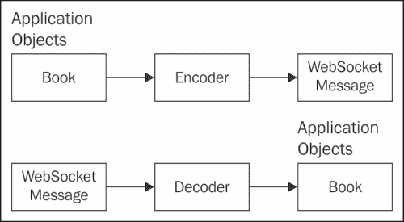
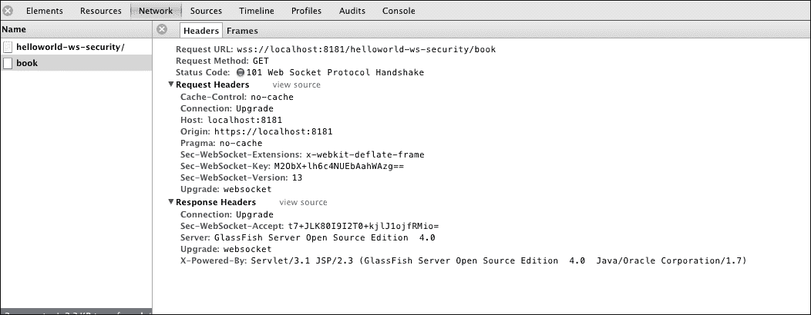
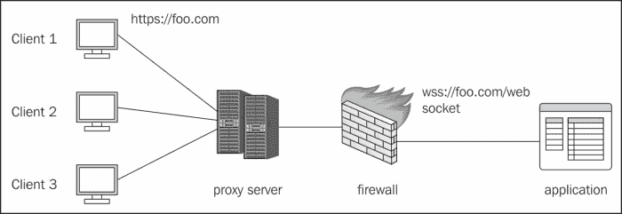

# 第三章。详细理解 WebSocket 和服务器发送事件

WebSocket 是 HTML5 提供的最有前途的特性之一。正如在第二章中所述，*WebSocket 和服务器发送事件*，传统的请求-响应模型由于 HTTP 头部而产生了开销。使用 WebSocket，一旦完成初始握手，客户端和服务器或对等方可以直接通信，无需使用头部。这减少了网络延迟，并减少了 HTTP 头部流量。

第二章，*WebSocket 和服务器发送事件*，还介绍了服务器发送事件，并提供了 SSE 和 WebSocket 的比较。

服务器发送事件定义了一个 API，其中服务器在事件发生时与客户端通信并推送事件。这是一种从服务器到客户端的单向通信，与传统轮询和长轮询技术相比，具有更多优势。

本章涵盖了 WebSocket 和服务器发送事件的先进概念，并涵盖了以下部分：

+   Java API 中 WebSocket 的编码器和解码器

+   Java WebSocket 客户端 API

+   使用 Java API for WebSockets 发送不同类型的数据，如 Blob 和 Binary

+   WebSocket 的安全性和最佳实践

+   基于 WebSocket 的应用程序的最佳实践

+   使用 Jersey API 开发服务器发送事件客户端

+   服务器发送事件的最佳实践

# Java API 中 WebSocket 的编码器和解码器

如前一章所示，类级别的注解 `@ServerEndpoint` 表示在运行时 Java 类是一个 WebSocket 端点。value 属性用于指定端点的 URI 映射。此外，用户还可以添加编码器和解码器属性，将应用程序对象编码为 WebSocket 消息，并将 WebSocket 消息解码为应用程序对象。

以下表格总结了 `@ServerEndpoint` 注解及其属性：

| 注解 | 属性 | 描述 |
| --- | --- | --- |
| `@ServerEndpoint` |   | 这个类级别注解表示 Java 类是一个 WebSocket 服务器端点。 |
|   | `value` | 该值是带有前缀 `'/.'` 的 URI |
|   | `encoders` | 包含作为端点编码器的 Java 类列表。这些类必须实现 Encoder 接口。 |
|   | `decoders` | 包含作为端点解码器的 Java 类列表。这些类必须实现 Decoder 接口。 |
|   | `configurator` | configurator 属性允许开发者插入他们的 `ServerEndpoint.Configurator` 实现，该实现用于配置服务器端点。 |
|   | `subprotocols` | 子协议属性包含端点可以支持的子协议列表。 |

在本节中，我们将探讨为我们的 WebSocket 端点提供编码器和解码器实现。



前面的图示显示了编码器如何将应用程序对象转换为 WebSocket 消息。解码器将 WebSocket 消息转换为应用程序对象。以下是一个简单的示例，其中客户端向一个被注解为`@ServerEndpoint`并装饰有编码器和解码器类的 WebSocket java 端点发送 WebSocket 消息。解码器将解码 WebSocket 消息并将相同的信息发送回客户端。编码器将消息转换为 WebSocket 消息。此示例也包含在书籍的代码包中。

下面是定义具有编码器和解码器值的`ServerEndpoint`的代码：

```java
@ServerEndpoint(value="/book", encoders={MyEncoder.class}, decoders = {MyDecoder.class} )
public class BookCollection {
    @OnMessage
    public void onMessage(Book book,Session session) {

        try {
session.getBasicRemote().sendObject(book);
        } catch (Exception ex) {
            ex.printStackTrace();
        }
    }

    @OnOpen
       public void onOpen(Session session) {
           System.out.println("Opening socket" +session.getBasicRemote() );
       }

       @OnClose
       public void onClose(Session session) {
           System.out.println("Closing socket" + session.getBasicRemote());
       }
} 
```

在前面的代码片段中，你可以看到类`BookCollection`被注解为`@ServerEndpoint`。`value=/book`属性为端点提供了 URI 映射。`@ServerEndpoint`还指定了在 WebSocket 传输期间要使用的编码器和解码器。一旦建立了 WebSocket 连接，就会创建一个会话，并调用注解为`@OnOpen`的方法。当 WebSocket 端点接收到消息时，将调用注解为`@OnMessage`的方法。在我们的示例中，该方法简单地使用`Session.getBasicRemote()`发送书籍对象，这将获取对`RemoteEndpoint`的引用并同步发送消息。

编码器可以用于将自定义用户定义的对象转换为文本消息、`TextStream`、`BinaryStream`或`BinaryMessage`格式。

文本消息的编码器类的实现如下：

```java
public class MyEncoder implements Encoder.Text<Book> {
    @Override
 public String encode(Book book) throws EncodeException {
            return book.getJson().toString();
        }
}
```

如前所述的代码所示，编码器类实现了`Encoder.Text<Book>`。有一个被重写的编码方法，它将书籍转换为 JSON 字符串并发送。（关于 JSON API 的更多内容将在下一章详细讨论）

解码器可以用于在自定义用户定义的对象中解码 WebSocket 消息。它们可以以文本、`TextStream`、二进制或`BinaryStream`格式进行解码。

下面是解码器类的代码：

```java
public class MyDecoder implements Decoder.Text<Book> {
    @Override
   public Book decode(String string) throws DecodeException {
           javax.json.JsonObject jsonObject = javax.json.Json.createReader(new StringReader(string)).readObject();
        return new Book(jsonObject);
    }
    @Override
    public boolean willDecode(String string) {
        try {
            javax.json.Json.createReader(new StringReader(string)).readObject();
            return true;
        } catch (Exception ex) { }
        return false;
        }
```

在前面的代码片段中，`Decoder.Text`需要重写两个方法。`willDecode()`方法检查它是否可以处理此对象并对其进行解码。`decode()`方法使用 JSON-P API `javax.json.Json.createReader()`将字符串解码为类型为`Book`的对象。

下面的代码片段显示了用户定义的类`Book`：

```java
public class Book {
    public Book() {}
    JsonObject jsonObject;
    public Book(JsonObject json) {
        this.jsonObject = json;
    }
    public JsonObject getJson() {
        return jsonObject;
    }
    public void setJson(JsonObject json) {
        this.jsonObject = json;
    }

    public Book(String message) {
        jsonObject = Json.createReader(new StringReader(message)).readObject();
    }
    public String toString () {
        StringWriter writer = new StringWriter();
        Json.createWriter(writer).write(jsonObject);
        return writer.toString();
    }
}
```

`Book`类是一个用户定义的类，它接收客户端发送的 JSON 对象。以下是如何从 JavaScript 将 JSON 细节发送到 WebSocket 端点的示例。

```java
var json = JSON.stringify({
                    "name": "Java 7 JAX-WS Web Services",
                "author":"Deepak Vohra",
                "isbn": "123456789"
                });
function addBook() {
                websocket.send(json);
            }
```

客户端使用`websocket.send()`发送消息，这将导致`BookCollection.java`的`onMessage()`被调用。`BookCollection.java`将向客户端返回相同的书籍。在这个过程中，当接收到 WebSocket 消息时，解码器将对其进行解码。为了发送回相同的`Book`对象，首先编码器将`Book`对象编码为 WebSocket 消息并发送给客户端。

# 这是 Java WebSocket 客户端 API

第二章，*WebSocket 和服务器发送事件*，介绍了 Java WebSocket 客户端 API。任何 POJO 都可以通过使用`@ClientEndpoint`注解转换为 WebSocket 客户端。

此外，用户还可以向`@ClientEndpoint`注解添加编码器和解码器属性，以将应用程序对象编码为 WebSocket 消息，并将 WebSocket 消息解码为应用程序对象。

以下表格显示了`@ClientEndpoint`注解及其属性：

| 注解 | 属性 | 描述 |
| --- | --- | --- |
| `@ClientEndpoint` |   | 此类级别注解表示 Java 类是一个 WebSocket 客户端，它将连接到 WebSocket 服务器端点。 |
|   | `value` | 值是带有前缀`/`的 URI。 |
|   | `encoders` | 包含一个 Java 类列表，这些类作为端点的编码器。这些类必须实现编码器接口。 |
|   | `decoders` | 包含一个 Java 类列表，这些类作为端点的解码器。这些类必须实现解码器接口。 |
|   | `configurator` | 配置器属性允许开发者插入他们自己的`ClientEndpoint.Configurator`实现，该实现用于配置客户端端点。 |
|   | `subprotocols` | 子协议属性包含端点可以支持的一组子协议列表。 |

# 发送不同类型的消息数据：blob/二进制

使用 JavaScript，我们传统上以字符串的形式发送 JSON 或 XML。然而，HTML5 允许应用程序处理二进制数据以改善性能。WebSocket 支持两种类型的二进制数据

+   二进制大对象（`blob`）

+   `arraybuffer`

WebSocket 在任何给定时间只能与一种格式一起工作。

使用 WebSocket 的`binaryType`属性，您可以在使用 blob 或`arraybuffer`之间切换：

```java
websocket.binaryType = "blob";
// receive some blob data

websocket.binaryType = "arraybuffer";
// now receive ArrayBuffer data
```

以下代码片段展示了如何使用 WebSocket 显示服务器发送的图像。

这里有一个使用 WebSocket 发送二进制数据的代码片段：

```java
websocket.binaryType = 'arraybuffer';
```

上述代码片段将`websocket`的`binaryType`属性设置为`arraybuffer`。

```java
websocket.onmessage = function(msg) {
        var arrayBuffer = msg.data;
        var bytes = new Uint8Array(arrayBuffer);

        var image = document.getElementById('image');
        image.src = 'data:image/png;base64,'+encode(bytes);
    }
```

当调用`onmessage`时，`arrayBuffer`被初始化为`message.data`。`Uint8Array`类型表示一个 8 位无符号整数数组。`image.src`值使用数据 URI 方案直接嵌入。

# 安全性和 WebSocket

WebSocket 使用 Web 容器安全模型进行安全保护。WebSocket 开发者可以声明是否需要认证访问 WebSocket 服务器端点，谁可以访问它，或者是否需要加密连接。

映射到`ws://` URI 的 WebSocket 端点在部署描述符中受到与具有相同`hostname,port`路径的`http:// URI`的保护，因为初始握手来自 HTTP 连接。因此，WebSocket 开发者可以为任何 WebSocket 端点分配认证方案、用户角色和传输保证。

我们将使用与第二章中相同的示例，*WebSocket 和服务器发送事件*，并将其制作成一个安全的 WebSocket 应用程序。

这是安全 WebSocket 端点的`web.xml`：

```java
<web-app version="3.0"  
         xsi:schemaLocation="http://java.sun.com/xml/ns/javaee http://java.sun.com/xml/ns/javaee/web-app_3_0.xsd">

    <security-constraint>
        <web-resource-collection>
            <web-resource-name>BookCollection</web-resource-name>
            <url-pattern>/index.jsp</url-pattern>
            <http-method>PUT</http-method>
            <http-method>POST</http-method>
            <http-method>DELETE</http-method>
            <http-method>GET</http-method>
        </web-resource-collection>
            <user-data-constraint>
            <description>SSL</description>
            <transport-guarantee>CONFIDENTIAL</transport-guarantee>
        </user-data-constraint>
    </security-constraint>
</web-app>
```

如前一个片段所示，我们使用了`<transport-guarantee>CONFIDENTIAL</transport-guarantee>`。

Java EE 规范以及应用程序服务器为客户端与应用服务器之间的通信提供了不同级别的传输保证。这三个级别是：

+   **数据机密性（CONFIDENTIAL）**：我们使用此级别来确保客户端和服务器之间的所有通信都通过 SSL 层进行，并且不会接受非安全通道上的连接。

+   **数据完整性（INTEGRAL）**：当不需要完整加密但希望以这种方式将数据从客户端传输到客户端时，我们可以使用此级别，如果有人更改了数据，我们可以检测到更改。

+   **任何类型的连接（NONE）**：我们可以使用此级别来强制容器接受 HTTP 和 HTTPS 上的连接。

在设置 SSL 并运行我们的示例以展示在 Glassfish 中部署的安全 WebSocket 应用程序时，应遵循以下步骤：

1.  生成服务器证书：

    ```java
    keytool -genkey -alias server-alias -keyalg RSA -keypass changeit --storepass changeit -keystore keystore.jks
    ```

1.  将生成的服务器证书从`keystore.jks`导出到文件`server.cer`：

    ```java
    keytool -export -alias server-alias -storepass changeit -file server.cer -keystore keystore.jks
    ```

1.  创建信任存储文件`cacerts.jks`并将服务器证书添加到信任存储：

    ```java
    keytool -import -v -trustcacerts -alias server-alias -file server.cer  -keystore cacerts.jks -keypass changeit -storepass changeit
    ```

1.  更改以下 JVM 选项，以便它们指向新的密钥库的位置和名称。在`domain.xml`下的`java-config`中添加此内容：

    ```java
    <jvm-options>-Djavax.net.ssl.keyStore=${com.sun.aas.instanceRoot}/config/keystore.jks</jvm-options>
            <jvm-options>-Djavax.net.ssl.trustStore=${com.sun.aas.instanceRoot}/config/cacerts.jks</jvm-options>
    ```

1.  重新启动 GlassFish。如果您访问`https://localhost:8181/helloworld-ws/`，您可以看到安全的 WebSocket 应用程序。

1.  这是 Chrome 开发者工具下的头部信息看起来如何：

1.  打开 Chrome 浏览器，点击**查看**然后点击**开发者工具**。

1.  点击**网络**。

1.  在元素名称下选择**book**，然后点击**Frames**。

如前一个截图所示，由于应用程序使用 SSL 进行加密，WebSocket URI 也包含`wss://`，这意味着 WebSocket 通过 SSL。

到目前为止，我们已经看到了 WebSocket 消息的编码器和解码器。我们还介绍了如何使用 WebSocket 发送二进制数据。此外，我们还演示了如何安全地基于 WebSocket 的应用程序。现在，我们将介绍 WebSocket 应用程序的最佳实践。

# 基于 WebSocket 的应用程序的最佳实践

本节将介绍基于 WebSocket 的应用程序的最佳实践。以下主题将涵盖：

+   限制发送数据的速率

+   控制消息的最大大小

+   与代理服务器和 WebSocket 一起工作

## 限制发送数据的速率

在 WebSocket 连接打开后，可以使用发送函数发送消息。

WebSockets 有一个 `bufferedAmount` 属性，可以用来控制发送数据的速率。使用 `bufferedAmount` 属性，您可以检查已排队但尚未发送到服务器的字节数。

这里有一个用于测试 WebSocket 的 `bufferedAmount` 属性的代码片段。

```java
// This snippet checks for amount of data buffered but not sent yet 
// in case it is less than a predefined THRESHOLD the webSocket 
// can send the data

if (webSocket.bufferedAmount < THRESHOLD)
     webSocket.send(someData);
};
```

这可以通过使用 `setInterval` 函数定期完成。正如您所看到的，开发者可以定期检查 `bufferedAmount` 属性，以查看要发送到服务器的队列中的字节数是否超过了某个阈值。在这种情况下，应该延迟发送消息。一旦缓冲区大小小于阈值，就应该发送更多消息。

检查 `bufferedAmount` 然后发送数据是一个好习惯。

## 控制消息的最大大小

在使用 `@ServerEndpoint` 或 `@ClientEndpoint` 注解的 Java 类中，`@OnMessage` 注解上的 `maxMessageSize` 属性允许开发者指定 `ClientEndpoint` 或 `ServerEndpoint` 可以处理的字节数的最大消息大小。

如果传入的消息超过最大大小，则连接将被关闭。这是一个好习惯，可以控制消息的最大大小，这样客户端在尝试处理一个它无法处理的消息时，不会耗尽其资源。

## 与代理服务器和 WebSockets 一起工作

第二章，*WebSockets 和服务器发送事件*，介绍了 WebSocket 升级握手的过程。并非所有代理服务器都支持 WebSockets；因此，代理服务器可能不允许未加密的 WebSocket 流量通过。客户端使用一个 `CONNECT` 调用，这是绝对不允许的。正确的方法是将请求通过 https 发送到标准端口 `443`。以下是一个浏览器客户端向 `foo.com` 端口 `443` 发送的 HTTP Connect 请求的示例。

```java
CONNECT: foo.com:443
Host: foo.com
```

由于流量是加密的，因此有更大的机会通过代理服务器。然后 `CONNECT` 语句将工作，并且将有一个端到端的加密隧道用于 WebSockets。

以下图表显示了客户端如何发送 HTTPS 请求，这些请求可以绕过代理服务器和防火墙；WebSocket 安全方案将工作：



使用基于 WebSocket 的应用程序与 SSL 一起使用是一个好习惯，这样代理服务器就不会阻碍 WebSocket 通信。

# 服务器发送事件

我们在第二章中介绍了服务器发送事件，*WebSockets 和服务器发送事件*，并比较了客户端/服务器轮询替代方案以及 WebSockets。在本章中，我们将介绍更高级的主题，例如使用 Jersey API 开发服务器发送事件客户端以及服务器发送事件的最佳实践。

## 使用 Jersey API 开发服务器发送事件客户端

第二章，*WebSockets 和服务器发送事件*，简要介绍了服务器发送事件和 JavaScript API。在本章中，我们将介绍由 Jersey 提供的服务器发送事件的 Java 客户端 API。除了 JAX-RS 2.0 规范的功能外，Jersey 还提供了对服务器发送事件的支持。

`EventSource`是用于读取`InboundEvents`的类：

以下代码片段展示了如何使用`EventSource` API：

```java
   WebTarget webTarget = client.target(new URI(TARGET_URI));
EventSource eventSource = new EventSource(webTarget) {
@Override
public void onEvent(InboundEvent inboundEvent) {
    System.out.println("Data " + inboundEvent.getData(String.class);

}
```

`EventSource`对象是通过`WebTarget`创建的。我们在第一章，*使用 JAX-RS 构建 RESTful Web 服务*中介绍了`WebTarget`。

当客户端接收到服务器发送事件时，`EventSource`的`onEvent()`方法将被调用。`InboundEvent`具有`getData()`方法，该方法接受`String.class`作为消息数据的类型。您可以在其中添加任何自定义定义的类。JAX-RS 的`MessagebodyReader`将用于读取消息的类型。因此，您可以在使用 JavaScript API 和使用 Jersey 客户端 API 之间的代码中看到相似之处。第五章，*通过示例构建 RESTful Web 服务*，将展示使用服务器发送事件 Jersey 客户端 API 的完整示例。

# 基于服务器发送事件的应用的最佳实践

以下章节将介绍基于服务器发送事件的应用的最佳实践。以下主题将被涵盖：

+   检查事件源的来源是否符合预期

+   与代理服务器和服务器发送事件一起工作

+   处理服务器发送事件的容错性

## 检查事件源的来源是否符合预期

以下代码片段展示了如何检查事件源的来源，以确保它与应用程序的来源相匹配。

```java
if (e.origin != 'http://foo.com') {
alert('Origin was not http://foo.com');
return;
```

来自与消费事件流内容来源不同的来源的事件流可能导致信息泄露。当从服务器获取事件时，检查事件的发起者是否符合预期是一种良好的做法。

## 与代理服务器和服务器发送事件一起工作

代理服务器可以在短时间超时后断开 HTTP 连接。为了避免这种断开连接的情况，定期发送注释可能是个好主意。

这就是使用服务器发送事件发送注释的方法。

```java
: this is a comment

OutboundEvent event =  new OutboundEvent.Builder().comment("this is a comment").build();
```

`Outboundevent.Builder` API 将向客户端发送注释。

该注释不会触发任何操作，但会确保客户端和服务器之间的连接不会断开。

## 处理服务器发送事件的容错性

第二章，*WebSockets 和服务器发送事件*，介绍了如何将 ID 与事件关联。服务器可以通过以下代码片段使用事件 ID 发送事件：

```java
   id: 123\n
   data : This is an event stream \n\n
```

客户端保持连接活跃，并在连接断开时尝试重新连接。设置一个 ID 让浏览器跟踪最后触发的事件，因此当客户端与服务器之间的连接断开时，客户端在重新连接到服务器时将**最后事件 ID**发送回服务器。这确保了客户端不会错过任何消息。然后服务器可以发送在最后事件 ID 之后发生的事件。

服务器可能需要一个消息队列来跟踪连接的不同客户端，检查重新连接，并根据最后事件 ID 发送消息。

# 摘要

在本章中，我们探讨了 WebSocket 和服务器发送事件的先进主题。我们通过代码片段展示了如何使用编码器和解码器，以及如何使用 WebSocket 接收不同类型的数据。我们还演示了一个示例，展示了 WebSocket 如何与 SSL 一起工作，以便在与代理服务器一起工作时，通信是加密的。

我们还讨论了实现服务器发送事件和 WebSocket 的最佳实践。我们学习了如何通过将 ID 与事件关联来确保服务器发送事件中的消息不会丢失。我们还介绍了用于服务器发送事件的 Jersey 客户端 API。

在下一章中，我们将涵盖更多高级主题，例如 Java EE 中的 JSON API 和异步编程的方面，以提高与各种 Java EE 规范（如 JAX-RS 2.0、EJB 和 Servlets）相关的可伸缩性。
