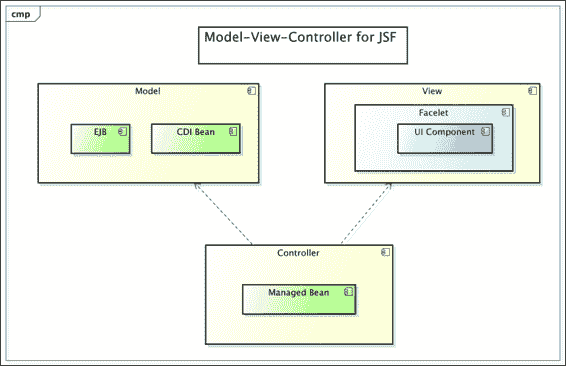
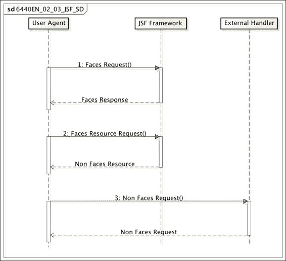
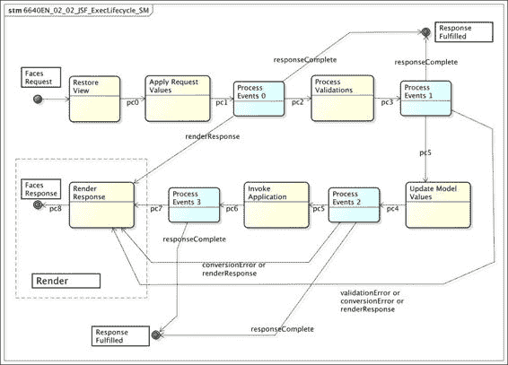
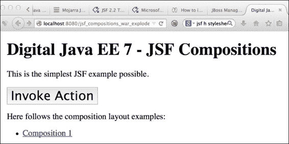
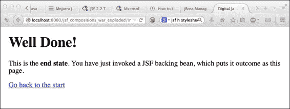

# 第二章. JavaServer Faces 生命周期

|    | *"世界上没有两个人是完全相同的，在音乐中也是如此，如果不是这样，那就不是音乐"* |    |
| --- | --- | --- |
|    | --*比莉·假日* |

Java 在服务器端已经取得了长期的成功：自 2000 年以来。企业一直信任 JVM、Java 编程语言以及丰富的框架作为他们选择的企业软件平台。那么，我们继续信任 JVM 作为数字 Web 工程师是否正确？我认为这个问题的答案，以及因为你正在阅读这本书，答案是肯定的！

本章是对 **JavaServer Faces**（**JSF**）概念的全面概述。我们将从 JSF 的历史和目的开始，以及它如何与基本设计模式：**模型-视图-控制器**（**MVC**）相关联。我们将探讨 JSF 中的生命周期概念，这是将其与其他 Java Web 应用程序框架区分开来的关键概念之一。此外，我们将检查一些 JSF 代码，包括管理 Bean 的邪恶概念。我们还将介绍 JSF 应用程序如何在 POJO 和页面之间导航。为了使内容更加丰富，我们将探讨页面作者强大的表达式语言。当我们完成本章时，我们将建立起坚实的知识基础。

# JSF 简介

JSF 是一个用于从组件模型构建 Web 用户界面的规范。它包含 MVC 和模板框架。JSF 是 Java EE 平台的标准库。**Java 社区进程**（**JCP**）控制规范，当前版本是 JSF 2.2，由 **Java 规范请求**（**JSR**）334 定义（[`www.jcp.org/en/jsr/detail?id=344`](https://www.jcp.org/en/jsr/detail?id=344)）。

最初，JSF 背后的承诺是将快速用户界面开发带到服务器端 Java。当 JSF 首次构想时，这个说法是正确的；但当然，如果你不想写很多 JavaScript 代码和手工制作的样板代码来处理 HTTP 请求到 Java 调用以及返回页面的响应，这个说法仍然是有用的。自 2004 年 JSF 1.0 被构想以来，Web 技术和，特别是数字开发已经从网页上飞跃。当时，JavaScript 并没有被当作一种编程语言那样认真对待；没有响应式 Web 设计，对移动 Web 编程的需求也肯定较少。如今，看到“移动优先”或“默认为数字”这样的术语是很常见的。这意味着网站会考虑各种屏幕尺寸和设备，并认识到人们可以在智能手机或平板电脑上查看内容。有些人（你的目标客户）无法访问台式电脑或笔记本电脑。

### 小贴士

请参阅 Cameron Moll 的开创性——但现在已经有些过时的——关于移动网页设计的电子书（[`mobilewebbook.com/`](http://mobilewebbook.com/)）。英国政府非常重视“数字优先”（[`www.gov.uk/service-manual/digital-by-default`](https://www.gov.uk/service-manual/digital-by-default)）这一术语，而美国数字服务则提出了“默认为开放”的广泛概念（[`playbook.cio.gov/`](https://playbook.cio.gov/)）。

JSF 被构想为一种用户界面技术，它甚至可以让 Java 工程师以与 JavaFX（或 Swing）应用相同的方式构建前端。这个想法是让开发者（而不是设计师）使用自定义编辑器组装 HTML 页面。JSF 应用程序被设计为可主题化的。框架的意图是允许渲染工具产生不同形式的输出。一个渲染工具可能生成 PDF 输出，另一种类型可能生成 HTML 输出，还有一种类型会以 **无线应用协议**（**WAP**）的形式生成特定的移动内容（WAP 是在 2007 年苹果公司推出第一代 iPhone 之前受到广泛关注的技术）。技术已经取得了飞跃性的进步！

虽然对 JSF 作为产生严肃应用程序的 Web 技术有很多批评，但它得到了 Java EE 平台的支持。Facelets 是一个有用的模板框架，用于构建可共享的组件和网页的部分内容。JSF 具有生命周期模型，可以集成到 POJO 中，这意味着它与 Context 和依赖注入（CDI）豆无缝工作。此外，JSF 还与数字领域的变化保持同步。JSF 2.2 支持 HTML5 友好的标记。它支持 AJAX 事件，并允许事件排队。它允许为 HTML5 内容的所有元素使用 W3C 授权的 ID 属性。JSF 2.2 引入了 Faces Flow，它增加了引导用户通过一系列屏幕、工作流程和向导的能力。最重要的是，JSF 2.2（JSR 334）代表了持续支持 Java EE 平台标准组件化框架的承诺。

### 小贴士

**Mojarra 2.2**

为了使 JSF 成为 Java EE 平台的标准，它需要一个 JSR 和参考实现。对于 JSF，参考实现项目被称为 Mojarra。该软件是开源的，并由甲骨文公司（[`javaserverfaces.java.net/`](https://javaserverfaces.java.net/)）支持。参考实现是 GlassFish 4 应用服务器的一部分。

## JSF 1.0 和 2.0 历史简介

JSF 的概念最早在 2001 年左右被讨论。它是 Sun Microsystems 项目 Project Rave 的一部分，后来宣布为 JSR 127。尽管这项技术在当时基于动作请求的框架（如 Apache Struts）之上有所改进，但在 2003 年和 2004 年却遭到了冷淡的欢迎。2004 年发布了一个维护版本 1.1，但直到 2006 年，JSF 1.2 规范才成为 Java EE 5 的官方规范的一部分。

然而，到了这个时候，开发者的市场份额已经演变成了 AJAX 技术、部分应用程序以及 Ruby 和 Ruby on Rails 等非 JVM 软件等。JSF 1.2 被平台默认的模板技术 JavaServer Pages 所拖累。JSP 证明不适合 JSF，因为请求拦截和响应生成的生命周期本质上是不兼容的。寻找替代方案导致了 Facelets 的创建，它被设计成与 JSF 显式协同工作。

在 2009 年，Facelets 成为 JSF 2.0（JSR 314）的默认模板解决方案，JSF 2.0 也是 Java EE 6 的一部分。JSF 2.0 添加了验证和转换的注解。JSF 2.0 定义了标准的 AJAX 组件生命周期，并增加了对图形编辑器的改进。JSF 2.0 引入了一个用于网络内容的资源处理程序，包括图像、JavaScript 和 CSS 文件。

## Key JSF 2.2 features

JSF 2.2 规范的主要特性如下：

+   它提供了对 HTML5 友好标记的支持，这对网页设计师和界面开发者来说是一个福音。

+   资源库合同是 JSF 中的一个新系统，通过捆绑 Facelet 视图、组件、样式表和其他资源（包括国际化）来构建可重用的主题。

+   它提供了与 Java EE 7 规范一致的新的 URI 定位器。Oracle 公司在 2010 年收购了 Sun Microsystems，因此，旧形式的 URI [`java.sun.com/jsf/core`](http://java.sun.com/jsf/core) 被转换为 [`xmlns.jcp.org/jsf/core`](http://xmlns.jcp.org/jsf/core)，反映了 JCP 网络域的命名空间。

+   Faces Flows 允许将应用程序建模为页面和视图的定向图。使用 Faces Flows，我们可以从用户界面的角度构建工作流应用程序的基础。作为数字工程师，我们可以将应用程序的子集组装成更大的整体。这类工作流程非常适合 CDI 容器的对话范围。你将在第六章 JSF Flows and Finesse 中详细了解流程。

+   无状态视图允许开发者构建没有服务器端状态的组件。通常，JSF 组件会在服务器或客户端上保存用户界面组件的状态，但有时视图不需要这种额外的资源，因此，拥有无状态视图可以提供在服务器上扩展 Web 应用的可伸缩性。

+   它提供了从客户端窗口（标签、浏览器窗口、弹出对话框或模态对话框）正确处理浏览器内容的能力。

JSF 2.2 与 Faces 2.1 和 2.0 兼容。针对 Faces 2.0 或 2.1 构建的应用程序不需要更改即可在 Faces 2.2 中运行；然而，在相反方向使用特定的 2.2 功能在这些较旧的环境中无法运行。

JSF 基于以下 Java API 规范：

+   JavaServer Pages 2.2 和 JavaServer Pages 标签库 (JSTL) 1.2

+   Java Servlet 3.0

+   Java SE 7

+   Java EE 7

+   Java Beans 1.01

## 为什么选择 JSF 而不是其他替代品？

到目前为止，JSF 是唯一一个被认证为 JCP 标准的 Java Web 应用框架。当然，有替代品；实际上，可能有 100 多种不同的 Java Web 框架，其中大多数将是开源的。然而，它们将根据愿景、实现、代码库的年龄以及谁实际上维护它作为存储库而有所不同。如果你的应用程序所依赖的 Web 框架是用昨天的技术构建的，因为 Web 正在不断发展，这对业务来说是没有好处的。同样，Web 框架必须与时俱进，否则最终会变得无关紧要。企业相信 JSF 是一个有保证的标准，即这项技术将得到长期支持。

### 小贴士

事实上，MVC (JSR 371) 将成为 Java EE 8 的另一个标准 Web 应用框架。你将在第九章*Java EE MVC 框架*中学习 MVC。

对于一个应用架构师可能希望根据业务需求选择 JSF 以外的 Web 框架，这是完全可以理解的。Apache Struts 2、Spring MVC 和 Apache Wicket 是我顺便提到的几个。Apache Struts 2 和 Spring MVC 通常被认为是面向请求的框架。Apache Wicket 是一个面向组件的框架，并且是 JSF 的直接竞争对手。Apache Struts 是 2000 年代初最著名的 Web 应用框架之一，并且是第一个打破传统框架的。

Web 框架的世界并不局限于 Java。大多数开发者都会听说过 Ruby on Rails，这是一种非 JVM 技术。一些工程师会了解 Play 框架，它适用于 Java 和 Scala 开发者，然后还有基于 Groovy 语言的解决方案，如 Grails。

无论你选择哪个框架来构建 Web 应用，本质上都会决定你的开发者的 Java 前端架构。无论你做什么，我强烈建议不要发明自己的 Web 应用框架。开源的优势在于拥有来自数千家不同公司、项目和文化的开发者社区。

如果你选择 JSF，那么作为客户，你很可能希望维护你在 Java 平台上的投资。你的 JSF 企业应用的核心优势是丰富的组件，你依赖模型来添加默认的好处，例如更简单的验证、类型转换和 HTTP 请求参数到 Bean 属性的映射。许多经验丰富的 Java EE 工程师都将有在 JSF 框架中的经验，所以你将身处一群人中。

# MVC 设计模式

MVC 设计描述了一组旨在将用户界面与应用逻辑（它们在语义上绑定）的关注点分离的设计模式。模型描述业务逻辑。视图表示展示——用户感知和与之交互的抽象表面。控制器表示处理模型和视图之间交互的组件。MVC 的原始想法源于 Trygve Reenskaug，他在 20 世纪 70 年代在 Smalltalk 编程语言中引入了这个概念。该模式随后在 Smalltalk-80 中实现并普及，之后被更广泛的软件工程社区采用。MVC 因其关于组件劳动分工和责任分离的想法而闻名。

我们称之为 MVC 模式，因为复数术语描述了一组与经典模式相关的相关衍生模式，作为组模式。

MVC 模式随后演变，产生了如**分层模型-视图-控制器**（**HMVC**）、**模型-视图-表示器**（**MVP**）、**模型视图 ViewModel**（**MVVM**）等变体，它们将 MVC 适应到不同的上下文中。

## JSF 中的 MVC

MVC 如何映射到 JSF？以下是一些回答：

+   **模型**: 在 JSF 和 Java EE 中，模型是处理业务数据和逻辑的组件或组件集。模型可以是 CDI Bean、EJB 或与 Web 容器和 JSF 框架的生命周期兼容的其他组件。

+   **控制器**: 在经典设计模式中，控制器逻辑的大部分责任由框架承担。在 JSF 中，可以将控制器的开始视为 FacesServlet，它负责将传入的 HTTP 请求分发到正确的管理 Bean。

+   **视图**: 在 JSF 中，视图是包含 UI 组件及其相应 Bean 的渲染组。通常，视图是用页面描述语言描述的，对于 JSF 2.0 来说，就是 Facelets。JSF 的渲染套件将 UI 组件和 Bean 组合成整个页面。

以下图示从 JSF 框架的角度说明了 MVC 模式：



在 JSF 框架中，模型视图控制器模式被称为

# Facelets

JSF 规范定义了一种**视图声明语言**（**VDL**）来渲染页面的输出。在 JSF 1.0 中，这是 JavaServer Pages；但在 JSF 2.0 中，VDL 默认改为 Facelets。Facelets 是 JSF 2.0 的默认视图处理器，定义为 XHTML 文件。

Facelets 可以在模板化场景中使用。一个 Facelets 文件可以作为组合引用主模板，视图可以提供看起来像模具提供给模板的内容。利用引用模板的 Facelet 被称为模板客户端。模板客户端中的占位符内容将覆盖主模板中的默认内容。这样，Facelets 可以重用以共享内容。模板客户端可能成为主模板，从而派生出视图的层次结构。

Facelets 还通过自定义标签提供重用。工程师可以通过 XHTML 文件和元数据编写自己的自定义标签。设计师和开发者将通过标签库描述文件提供内容。

Facelets 提供的最后一个模板化选项是复合组件组合。这种机制允许组合在其他 Facelet 视图中重用，使它们看起来像一等组件。然而，模板文件必须创建在一个特殊目录中，以便允许内部组合处理器成功。

# 请求处理生命周期

JSF 有一个基于 HTTP 协议的请求-响应处理生命周期。JSF 建立在 Java Servlet 规范之上，负责将请求用户代理（在大多数情况下是网络浏览器）转换为已知的端点。对于 JSF 来说，第一个端口是`javax.faces.webapp.FacesServlet`。这个 servlet 将简单地转发传入的请求到控制器，并且这个组件可以选择生成响应或将输出委托给内部 JSF 控制器实现。

在请求处理生命周期中，JSF 有三种情况。第一种是带有 Faces 请求调用 JSF 控制器，这最终生成一个 Faces 响应。

第二种请求是检索资源，如 CSS 或 JavaScript 文件、图片或其他媒体文件。然而，不需要执行逻辑的 Faces 资源请求，会导致 JSF 框架提供输出作为 Faces 资源响应。

最后一个是页面请求，用于检索与 JSF 无关的内容，这被称为非 Faces 请求，随后产生非 Faces 响应。向 JAX-RS 服务端点发出的 HTTP 请求就是一个非 Faces 请求和响应的例子。让我们看一下以下图示：



JSF 请求和响应处理

JSF 框架首先确定传入的请求是否为资源。如果是，则框架提供资源并发送字节、内容类型和数据到用户代理。

当传入的请求被处理为 Face 请求时，有趣的工作发生了；JSF 框架以线性工作流程处理此处理。这个过程被称为执行和渲染生命周期。

## 执行和渲染生命周期

以下图表显示了 JSF 生命周期以处理 Faces 请求：



JSF 框架内部的执行和渲染生命周期阶段

标准请求处理生命周期从 Faces 请求刺激到**恢复视图**阶段开始。JSF 维护一个`javax.faces.context.FacesContext`实例以处理生命周期。此对象实例包含与单个 Faces 请求相关联的所有信息。FacesContext 被传递到各个阶段。

### 恢复视图

恢复视图是生命周期的一个阶段，其中 JSF 框架确保组件树及其状态与视图最初在响应中生成时匹配。换句话说，JSF 必须在开始插入更改并应用从 Faces 请求中获取的表单属性值之前，准确重建视图。此阶段存在的原因是整体输入的状态可以在请求之间动态更改。以下是对技术深度的描述。

恢复视图根据算法确定请求是回发还是初始请求。JSF 中的每个视图都有一个唯一的标识符，即`viewId`，这通常在框架的实现内部存储在映射集合中。框架在关联的视图的`javax.faces.application.ViewHandler`实例上调用`initView()`方法，以便构建或检索视图以显示给用户代理。

如果视图已经存在，则请求是回发。JSF 将使用之前保存的状态恢复带有`viewId`的视图。状态可以存储在服务器或客户端。此行为是从应用程序的 Web XML 部署行为中配置的。

对于全新的视图，JSF 创建一个`javax.faces.component.UIViewRoot`类型的新实例，该实例最初为空，并设置其关联的属性，如区域设置和字符集。然后 JSF 以树形数据结构填充视图中的 UI 组件。

### 应用请求值

在组件树恢复后，JSF 将请求信息参数映射到组件属性。框架遍历树中的组件对象。每个组件从请求对象中检索数据，这些数据通常是请求参数，但也可以是 cookie、会话属性，甚至是头部参数。因此，新值被存储在 UI 组件本地。值从请求信息中提取，在这个阶段，值仍然是字符串。这个阶段被称为应用请求值阶段。

在这个阶段，JSF 将尝试在适当的位置对组件属性进行转换。如果转换或验证失败，则错误信息将被排队在 FacesContext 中。

应用请求值阶段在命令按钮或链接被点击时向内部 JSF 事件队列添加事件。JSF 存在某些特殊条件，在这些条件下，事件处理器允许打破处理流程的线性流程并跳转到最终阶段：渲染响应。

### 处理验证

处理验证阶段是提交的字符串值（这些值与组件一起存储）被转换为本地值的阶段。这些本地值可以是任何类型的 Java 对象。在这个阶段，与组件关联的验证器可以验证本地值的值。如果验证通过并且所有必需的验证器都成功调用，则 JSF 生命周期继续到下一个阶段。如果验证失败或前一个生命周期阶段（应用请求值阶段）中存在转换错误，则 JSF 框架直接跳转到渲染响应阶段。然后，网络用户有机会在 HTML 输入表单中输入正确数据。

作为 JSF 开发者，将验证器附加到具有输入的 UI 组件是你的责任，这些输入非常重要。

### 更新模型值

在转换和验证阶段之后，JSF 进入更新模型值阶段。在这个时候，本地值被认为是安全的，以便更新模型。记住，在 JSF 与 MVC 术语中，模型很可能是你的管理后端 bean、CDI bean 或 EJB 或聚合对象。JSF 更新由组件引用的 bean。

### 调用应用

在生命周期中，我们到达了模型已更新，转换和验证已应用的阶段。JSF 称这个阶段为调用应用阶段，在这里，最终调用业务逻辑。JSF 调用由命令按钮或链接组件的动作方法命名的函数。调用应用阶段是用户提交 HTML 表单或调用导航锚链接的结果，因此 JSF 框架执行后端 bean 的相应方法。

该方法可以选择返回一个简单的结果字符串。自从 JSF 2.0 以来，方法被允许返回一个简单的字符串，该字符串通过名称引用视图。或者，方法可以使用 FacesContext 实例程序化构建自己的响应，或者返回传递给导航处理器的导航视图 ID，该处理器随后查找下一页。

### 渲染响应

生命周期中的最后一个阶段是渲染响应阶段。这一阶段需要编码 Faces 响应，JSF 框架将此输出发送到请求的用户代理，这通常是网络浏览器。一旦数据通过网络发送到客户端，请求和响应的生命周期就结束了。在下一个请求上，一个新的生命周期开始。

### 事件处理

在某些阶段之间，你可能已经注意到了进程事件阶段。JSF 允许监听器注册到框架中，以便观察事件。这些被称为阶段监听器。它们之所以特殊，是因为它们可以在行为中保持活跃，导致生命周期跳过，或者它们可以保持被动，仅监控对应用程序有趣的用户界面的某些方面。这些小型扩展点对于应用程序构建者非常有用且强大，因此是 JSF 与其他 Web 框架之间的重要区别。

# 一个基本的 JSF 示例

我们已经对 JSF 框架的理论进行了足够的介绍。我认为是时候让我的读者看看一些代码了。第一段代码是用于在网站上显示基本网页的 XHTML 文件。源代码可在作者公共 GitHub 账户的书籍网站上找到，网址为 [`github.com/peter_pilgrim/digital_javaee7`](http://github.com/peter_pilgrim/digital_javaee7)。

这里是初始 Facelets 视图的 XHTML 源代码，文件名为 `index.xhtml`：

```java
<?xml version="1.0" encoding="UTF-8"?>
<!DOCTYPE html PUBLIC "-//W3C//DTD XHTML 1.0 Transitional//EN" "http://www.w3.org/TR/xhtml1/DTD/xhtml1-transitional.dtd">
<html 

      >

  <h:head>
    <title>Digital Java EE 7 - Sample JSF</title>
  </h:head>
  <h:body>
    This is the simplest JSF example possible.

    <h:form>
      <h:commandButton action="#{basicFlow.serveResponse}" value="Invoke Action" />
    </h:form>

    <h:link outcome="composition1.xhtml">
      Composition 1
    </h:link>
  </h:body>
</html>
```

值得提醒的是，此文件不是 HTML5 文档；尽管 JSF 2.2 可以处理文档语法，但我们必须先学会走路，然后才能奔跑。XHTML 是一种使用 XML 架构命名空间添加额外标签的 HTML 格式。因此，存在针对 HTML、UI 和 F 的 JSF 特定命名空间。请参阅以下内容，了解这些命名空间的描述。

`<h:head>`、`<h:body>` 和 `<h:form>` 自定义标签类似于大家在网上开发中都知道的标准 HTML 元素标签。这是因为它们被设计成故意反映这一目的。实际上，这些是添加功能并在最后渲染等效 HTML 元素输出的 JSF 自定义标签。

你可能想知道 `<h:link>` 元素是什么。这仅仅是 JSF 渲染 HTML 锚点标签的方式。结果标签属性直接引用另一个 XHTML，而在 JSF 2.0 之后，开发人员被允许在代码中这样写。

`<h:commandButton>` 标签是 JSF 表单按钮的一个示例，它最终渲染一个 HTML 提交元素标签。此标签接受一个 action 属性，该属性引用一个特殊字符串。该字符串是表达式语言的示例；它引用了一个实例的方法名。

这是 JSF 管理实例 `BasicFlow` 的代码：

```java
package uk.co.xenonique.digital.javaee.jsfcomps;

import javax.enterprise.context.RequestScoped;
import javax.inject.Named;

@Named
@RequestScoped
public class BasicFlow {
    public String serveResponse() {
        return "endState.xhtml";
    }
}
```

`BasicFlow` 是一个具有请求作用域生命周期的 CDI 实例，由 `@javax.enterprise.context.RequestScoped` 注解声明。该实例在 servlet 请求生命周期开始时由 CDI 框架创建，一旦 servlet 响应完成，则完成并留给垃圾回收。

在 JSF 2.2 中，我们将使用 `@javax.inject.Named` 注解来指定对 JSF 框架可用的实例。我们可以明确写出注解为 `@Named("basicFlow")`，但默认情况下是简单类名的驼峰标识符。我们建议数字开发者不要使用旧的 `@javax.faces.bean.ManagedBean` 注解，因为它现在在未来的 JSF 规范中已被标记为弃用。

### 小贴士

确保您的 POJO 实际上是 CDI 实例。如果您为 JSF 使用了错误的导入，可能会出现混淆。在部署时，您将无法在 `#{basicFlow.serveResponse}` 这样的表达式注入或找到后端实例。请检查您是否导入了 `javax.enterprise.context.RequestScoped` 而不是过时的 `javax.faces.bean.RequestScoped` 注解。

`#{basicFlow.serveResponse}` 字符串是 **表达式语言**（**EL**）的一个示例，这是一种页面内容与后端实例通信的机制，同时保持关注点的分离。第一个 `BasicFlow` 元素引用后端实例，第二个 `serverResponse` 元素引用 `serveResponse()` 方法。因此，这是一个引用后端实例方法的 EL 表达式。我们将在本章后面学习更多关于表达式语言的内容。

您可以看到响应是一个简单的字符串，这是下一个 VDL 文件：`endstate.xhtml`。严格来说，可以省略后缀，JSF 框架将确定正确的视图。

`endState.xhtml` Facelet 视图文件如下所示：

```java
<html 
      >
  <h:head>
    <title>Digital Java EE 7 - End State</title>
  </h:head>
  <h:body>
    <p>
      This is the <strong>end state</strong>.
    </p>
    <h:link outcome="index.xhtml">
      Go back to the start
    </h:link>
  </h:body>
</html>
```

这是一个 JSF 视图，允许用户通过 `<h:link>` 元素返回起始视图。

## 网络部署描述符

为了充分利用 JSF 框架，我们建议配置网络应用程序部署描述符。此文件是一个特殊的 XML 文档，声明性地描述了入口 servlet 端点、servlet 映射和其他环境资源。XML 文件的代码如下：

```java
<?xml version="1.0" encoding="UTF-8"?>
<web-app 

     xsi:schemaLocation="http://xmlns.jcp.org/xml/ns/javaee 
     http://xmlns.jcp.org/xml/ns/javaee/web-app_3_1.xsd"
     version="3.1" metadata-complete="false">

  <display-name>
    jsf-compositions-1.0-SNAPSHOT
  </display-name>

  <servlet>
    <servlet-name>Faces Servlet</servlet-name>
    <servlet-class>
      javax.faces.webapp.FacesServlet
    </servlet-class>
    <load-on-startup>1</load-on-startup>
  </servlet>

  <servlet-mapping>
    <servlet-name>Faces Servlet</servlet-name>
    <url-pattern>*.xhtml</url-pattern>
  </servlet-mapping>

  <context-param>
    <param-name>javax.faces.PROJECT_STAGE</param-name>
    <param-value>Development</param-value>
  </context-param>

  <welcome-file-list>
    <welcome-file>index.xhtml</welcome-file>
  </welcome-file-list>
</web-app>
```

前面的文件具有 `WEB-INF/web.xml` 路径。为了激活 JSF 框架，部署描述符声明了具有完全限定类名的 servlet；`javax.faces.webapp.FacesServlet`。请注意，servlet 被映射以服务 `*.xhtml` 文件。

我们将使用上下文参数 `javax.faces.PROJECT_STAGE` 和一个适当的值来定义当前项目的活动阶段。在前面的例子中，阶段设置为 `Development`，但在应用程序上线后，我们可能希望将值切换到 `Production`。切换到 `Production` 可以提高性能并禁用一些调试输出。

你可以在本书的源代码中找到部署描述符，它是项目 `ch02/jsf-compositions` 的一部分。一旦将项目添加到 IDE 中——比如说，IntelliJ、Eclipse 或 NetBeans——你就可以在 URL `http://localhost:8080/jsf-compositions-1.0-SNAPSHOT/` 上查看应用程序服务器的输出。

## JSF XML 命名空间

下面是一个描述常见 JSF 及相关命名空间的表格：

| 命名空间 | 描述 |
| --- | --- |
| `h` | [`xmlns.jcp.org/jsf/html`](http://xmlns.jcp.org/jsf/html) 这定义了标准的 JSF 标签库，用于 HTML 渲染器和组件，如 `h:link`、`h:commandButton` 等。 |
| `f` | [`xmlns.jcp.org/jsf/core`](http://xmlns.jcp.org/jsf/core) 这定义了标准的 JSF 标签库，用于独立于任何渲染套件的核心理念。这个库包括处理验证和转换的标签。 |
| `ui` | [`xmlns.jcp.org/jsf/facelet`](http://xmlns.jcp.org/jsf/facelet) 这定义了标准的 JSF 标签库，用于模板化支持，包括视图的组合。 |
| `cc` | [`xmlns.jcp.org/jsf/composite`](http://xmlns.jcp.org/jsf/composite) 这定义了用于构建组合组件的标准 `tag` 库。 |
| `jsf` | [`xmlns.jcp.org/jsf`](http://xmlns.jcp.org/jsf) 这定义了支持 HTML5 友好输出的标签。 |
| `p` | [`xmlns.jcp.org/jsf/passthrough`](http://xmlns.jcp.org/jsf/passthrough) 这定义了支持通过 `tag` 属性输出 HTML5 友好输出的标签。 |
| `c` | [`xmlns.jcp.org/jsp/jstl/core`](http://xmlns.jcp.org/jsp/jstl/core) 这定义了用于 JSP 核心行为的 JSTL 1.2 标签库。这些标签包括 `<c:forEach>`, `<c:if>`, `<c:choose>`, 和 `<c:catch>`。 |
| `fn` | [`xmlns.jcp.org/jsp/jstl/ficmtion`](http://xmlns.jcp.org/jsp/jstl/ficmtion) 这定义了用于 JSP 函数的 JSTL 1.2 标签库。这些标签包括 `<fn:upperCase>`, `<fn:length>`, 和 `<fn:contains>`。 |

必须将一个缩写名称，如 `fn`，添加到根 XML 文档元素中，在大多数情况下这是一个 HTML 元素。

# 一个组合示例

在我们结束这一章之前，让我们深入一些代码来演示 JSF 组合。我们将从一个简单的 JSF 模板开始，该模板在两个区域中布局一个网页：一个顶部区域和主要区域。

这个 `template-top.xhtml` 文件是执行以下操作的 JSF 视图：

```java
<?xml version="1.0" encoding="UTF-8"?>
<!DOCTYPE html PUBLIC "-//W3C//DTD XHTML 1.0 Transitional//EN"
        "http://www.w3.org/TR/xhtml1/DTD/xhtml1-transitional.dtd">
<html 

      >

  <h:head>
    <title>Digital Java EE 7 - Sample JSF</title>
    <meta name="viewport" content="width=device-width, initial-scale=1.0"/>
    <meta name="description" content="XeNoNiQUE"/>
    <meta name="author" content="Peter Pilgrim"/>

      <h:outputStylesheet library="styles" name="main.css" rel="stylesheet"/>
      <h:outputStylesheet name="/styles/top.css" rel="stylesheet"/>
  </h:head>

  <h:body>
    <div id="content">
      <div id="top" class="topContent">
        <ui:insert name="top">
          Reserved for Top Content
        </ui:insert>
      </div>

      <div id="main" class="mainContent">
        <ui:insert name="content">
          Reserved for Main Content
        </ui:insert>
      </div>
    </div>
  </h:body>
</html>
```

上述代码是模板母版。到目前为止一切顺利。这类似于一个标准的网页，带有 HTML 元素，我们可以看到页面使用了嵌套的 DIV 元素来结构化内容。我将把你的注意力引向`<h:outputStylesheet>`标签，它表示我们应该包含几个层叠样式表作为资源。

`ui:insert`标签是表示模板中将被客户端模板中的占位符替换的区域的组合 JSF 标签。插入占位符必须有一个名称，在这个例子中我们有两个，即 top 和 content。请注意，`ui:insert`标签被插入到 HTML `div`元素的 body 内容中。

这里是客户端模板的代码，作为`composition1.xhtml`：

```java
<?xml version="1.0" encoding="UTF-8"?>
<!DOCTYPE html PUBLIC "-//W3C//DTD XHTML 1.0 Transitional//EN"
        "http://www.w3.org/TR/xhtml1/DTD/xhtml1-transitional.dtd">
<html 

      >
  <ui:composition template="/template-top.xhtml">
    <ui:define name="top">
      <h1>layout composition 1</h1>
    </ui:define>

    <ui:define name="content">
      The is the main content
      <h:form>
        <h:commandButton action="#{basicFlow.serveResponse}" value="Invoke Action" />
      </h:form>
    </ui:define>
  </ui:composition>
</html>
```

### 小贴士

**下载示例代码**

你可以从你购买的所有 Packt 书籍的账户中下载示例代码文件。[`www.packtpub.com`](http://www.packtpub.com)。如果你在其他地方购买了这本书，你可以访问[`www.packtpub.com/support`](http://www.packtpub.com/support)并注册，以便将文件直接通过电子邮件发送给你。

这个文件中的关键注释是`<ui:composition>` JSF 自定义标签，它引用了正在使用的母版模板。模板属性指向文件的路径。

两个`<ui:define>`标签定义了具有替换母版模板中默认内容的名称占位符。在这个例子中，占位符是 top 和 content。

这里是这个过程的截图。第一张截图是初始的 Facelets 视图，`index.xhtml`：



第二个是第二个 Facelets 视图，`endState.xhtml`：



## JSF 服务资源

JSF 期望我们的 Web 资源默认放置在`resources`文件夹中。快速查看以下文件目录将有助于你理解：

`jsf-composition`

`jsf-composition/src/main/webapp`

`jsf-composition/src/main/webapp/resources`

`jsf-composition/src/main/webapp/resources/images`

`jsf-composition/src/main/webapp/resources/javascripts`

`jsf-composition/src/main/webapp/resources/styles`

`jsf-composition/src/main/webapp/WEB-INF`

`jsf-composition/src/main/webapp/WEB-INF/classes`

`jsf-composition/src/main/webapp/WEB-INF/lib`

在这个 Gradle 项目的简化视图中，我们可以看到放置在`resource`文件夹下的文件夹、图像、JavaScript 和 CSS 文件。让我们再次提醒自己 JSF 视图代码，如下所示：

```java
<h:outputStylesheet library="styles" name="main.css" rel="stylesheet"/>
<h:outputStylesheet name="/styles/top.css" rel="stylesheet"/>
```

这些标签本质上指的是两个文件：`resources/style/top.css` 和 `resources/style/main.css`。

为了使这些标签正常工作，资源必须放置在`resources`文件夹下，或者它可以放置在随 Web 应用程序部署的 Web 应用程序 JAR 文件的`META-INF/resources`文件夹中。规范列出了以下两个选项：

```java
<ROOT>/resources/<RES-ID>
```

否则，你可以使用这个：

```java
<ROOT>/WEB-INF/lib/<DEPENDANT-JAR>/META-INF/resources/<RES-ID>
```

这里，`<ROOT>`是项目 Web 根目录，`<DEPENDANT-JAR>`是第三方依赖 JAR，`<RES-ID>`是资源标识符。

`<RES-ID>`可以进一步细分为正式部分，如下所示：

```java
<RES-ID> ::=
   [ <LOCALE-PREFIX> / ] + 
   [ <LIBRARY-NAME> / ] [ <LIBRARY-VERSION> / ] +
   <RESOURCE-NAME> [ / <RESOURCE-VERSION> ]
```

`[]`内的术语部分是可选的，除了资源名称。因此，可以有一个完全国际化、版本化和模块化的库中的资源标识符。也许你的项目可能会使用以下资源：

```java
/en_us/sportsBulletin/v1_2_3/top_masters_golfer/2015_may.png
```

如果你想逆势而行，更改 JSF 2.2 中资源的默认位置，该怎么办？可以在`web.xml`部署描述符文件中配置一个替代文件夹。你可以设置一个上下文参数变量：`javax.faces.WEBAPP_RESOURCES_DIRECTORY`。

这里是定义资源文件夹为资产的描述符摘录：

```java
  <context-param>
    <param-name>
    javax.faces.WEBAPP_RESOURCES_DIRECTORY</param-name>
    <param-value>assets</param-value>
  </context-param>
```

我们将涵盖 JSF 自定义标签的全面内容以及如何在第三章*构建 JSF 表单*和第四章*JSF 验证和 AJAX*中提交 HTML 表单。

# 表达式语言

```java
<h:inputText id="firstName" value="${employee.firstName}"/>
```

这将作为一个只读值工作。然而，由于表达式在任何生命周期状态都没有被评估，因此无法使用 JSF 将值应用到 employee bean 上。

如果我们将表达式从立即形式更改为延迟形式，那么我们将看到以下行为：

```java
<h:inputText id="firstName" value="#{employee.firstName}"/>
```

随着这一变化，在生命周期的渲染响应阶段，EL（表达式语言）立即被评估。JSF 实现执行评估并从名为 employee 的 bean 中检索`firstName`属性的值。

当表单作为 Faces 请求发送回服务器时，顺便说一下，这也被称为`postback`事件，JSF 实现有机会在延迟时间检索值。在这些后续的生命周期状态——应用请求值、处理验证和更新模型中，值表达式被评估，并且从 Faces 请求中的值被注入到目标 bean 属性中。

## 值表达式

值表达式是返回单个结果的表达式。值从管理 Java 实例集合的实现中的对象图中检索。对于 Java EE，这可以是 JSF 或 JSP 提供者，对于应用程序服务器，它是一个上下文和依赖注入提供者。CDI 内部维护一组`@javax.inject.Named` bean 的集合。（请等待对命名 bean 的解释，或者直接查看第三章*构建 JSF 表单*。）特别是，JSF 传统上保留有注解了`@javax.faces.bean.ManagedBean`的托管 bean 的记录。

JSP 将在页面作用域、请求作用域、会话作用域以及最后在 servlet 容器的应用程序作用域中搜索命名对象。在幕后，有一个抽象类 `javax.el.ELResolver` 的子类，它负责评估。这个类有有用的方法，例如 `getValue()`、`setValue()`、`isReadOnly()` 和 `invoke()`，开发者可以使用这些方法以编程方式将评估添加到自己的应用程序中。

在任何情况下，值表达式的首要目标是具有识别名称的对象实例。这被称为初始项。之后，评估逻辑可以通过使用点符号（`.`）通过命名属性遍历对象图。评估将继续通过表达式中的后续项。让我们暂时坚持 JSF，并考虑 `#{employee.firstName}` 表达式将评估在作用域中延迟搜索名为 employee 的对象。然后，EL 解析器将在名为 `firstName` 的 bean 中查找属性，这反过来将调用 `getFirstName()` 方法。任务将完成，EL 解析器返回属性的值。

EL 也可以与 Java 集合一起使用。特别是，`java.util.Map` 集合被特别处理。标准的 EL 假设集合有一个字符串类型的键，我们可以将其视为 `Map<String,Object>`。Map 中的条目可以使用点符号或方括号符号 `[]` 访问。

下面的值表达式表将使更复杂的表达式方案更加清晰：

| 表达式 | 含义 |
| --- | --- |
| `Employee` | 这将找到与名称 `employee` 关联的初始项 |
| `employee.firstName` | 这解析了命名实例并调用 `getFirstName()` |
| `employee.department.name` | 这解析了对象，调用 `getFirstName()`，检索下一个对象，并在该对象上调用 `getName()` |
| `employee["firstName"]` | 这与点符号 `employee.firstName` 等价 |
| `employee['firstName']` | 这与点符号 `employee.firstName` 等价 |
| `capitalCities['Brazil']` | 这将找到名称实例，并且假设 `capitalCities` 是 `java.util.Map` 类型，通过键 `Brazil` 获取值 |
| `capitalCities["Brazil"]` | 这与前面的映射表达式等价 |

方括号符号 `[]` 在包含破折号和/或点字符的字符串中非常有用。这种符号在您想从资源包中提取消息以进行国际化时很有帮助。您可以编写一个值表达式，如下所示：`appMessages["registeredTraveller.applicant.firstName.required"]`。

方括号符号允许我们编写特殊表达式。我们可以编写以下值表达式：

```java
${employee['class'].simpleName}
```

这翻译成以下等效的 Java 代码：

```java
employee.getClass().getSimpleName()
```

### 映射表达式

EL 使用方括号符号 `[]` 无缝地处理 Map 对象。如果表达式评估为一个引用，该引用访问或读取右侧 Map 键（一个 `rvalue`）关联的值，那么 EL 解析器将其转换为 `Map.get("key")` 调用。以下为读取值的表达式：

```java
${capitalCitiesMap['France']}   
  // translates to capitalCitiesMap.get("France")
#{capitialCitesMap['France']}  // ditto, but deferred
```

如果表达式绑定到左侧（一个 `lvalue`），那么 EL 解析器将其转换为 `Map.put("key", newValue)`。

### 列表表达式

EL 可以使用方括号符号从索引数组中检索对象。它的工作方式与 Map 表达式完全相同，只是键必须评估为一个字面量整数。在 EL 中，数组索引数从零开始，这是预期的。

因此，以下值表达式在 `departmentList` 是 `java.util.List` 类型且 `departmentArray` 是原始数组时是有效的：

```java
${departmentList[0].name}
${departmentArray[0].name}
```

这些是等效的伪 Java 语句：

```java
List<Department> department = resolve(...)
departmentList.get(0).getName()

Department departmentArray[] = resolve(...)
departmentArray[0].getName()
```

### 解析初始项

EL 依赖于从 servlet 容器、JSF 管理 Bean 列表和 CDI 作用域中查找初始项的能力。本质上，你可以给 JSF Bean 任何你想要的名字，但你应该避免预定义对象。初始项是表达式的一部分。

在 servlet 容器中，你可以引用几个预定义对象。例如，`requestScope` 是页面上的所有请求作用域属性的 Map 集合。请求也是 EL 中的一个预定义对象，它代表传递给 JSF 视图的 `javax.servlet.http.HttpServletRequest` 实例。我们可以使用它在一个 `lvalue` 表达式中检索 Web 应用程序上下文路径，如下所示：

```java
<link href="#{request.contextPath}/resources/styles/main.css" rel="stylesheet"/>
```

上述代码对于确保在 JSF 应用程序中找到资源非常有用。它用于创建可靠的相对 URL。我们将在 第四章 中进一步解释，*JSF 验证和 AJAX*。

初始项的解析从检查表达式中的初始项是否为预定义对象开始。如果是预定义对象，则解析器继续此对象。如果不是，则 JSF 实现将按照以下顺序在 servlet 容器作用域中搜索对象名称：`requestScope`、`sessionScope` 或 `applicationScope`。

如果按名称找不到对象，JSF 2.2 框架将委托给 `ELResolver`，该解析器将搜索实例的等效 CDI 作用域，然后查看已注册或注解的管理 Bean。

以下表格列出了表达式语言中的预定义对象实例：

| 预定义名称 | 描述 |
| --- | --- |
| `applicationScope` | 这是一个包含应用程序作用域属性（`javax.servlet.ServletContext.getAttributes()`）的 Map 集合 |
| `application` | 这指的是 `ServletContext` 实例 |
| `cookie` | 这是一个包含 cookie 名称和值的 Map 集合 |
| `facesContext` | 这是页面的 `javax.faces.context.FacesContext` 实例及其生命周期 |
| `header` | 这是一个 Map 集合，包含 HTTP 标头参数，只产生多个值中的第一个元素 |
| `headerValues` | 这是一个 Map 集合，包含 HTTP 标头参数，并产生一个 `String[]` 值数组 |
| `initParam` | 这是 Web 应用程序初始化参数的 Map 集合 |
| `param` | 这是一个 Map 集合，包含 HTTP 请求参数，只包含任何值数组中的第一个元素 |
| `paramValue` | 这是一个 Map 集合，包含 HTTP 请求参数，并产生一个 `String[]` 值数组 |
| `requestScope` | 这是一个 Map 集合，包含请求作用域属性（`HttpServletRequest.getAttributes()`） |
| `request` | 这指的是 `HttpServletRequest` 实例 |
| `sessionScope` | 这是一个 Map 集合，包含会话作用域属性（`HttpSession.getAttributes()`） |
| `session` | 这指的是 `HttpSession` 实例 |
| `View` | 这是页面的 `javax.faces.component.UIViewRoot` 实例 |

让我们继续到方法表达式。

## 方法表达式

EL 还允许将方法绑定关联到对象实例上的方法。这种类型的引用称为方法绑定表达式。JSF 框架允许方法表达式引用动作方法、验证器、转换器和阶段监听器。方法表达式在命名对象实例上调用方法，并返回结果（如果有）。

一个方法表达式的良好例子是在一个托管 Bean 上的动作处理器，这在本章的基本 JSF 示例中你已经见识过了。

```java
<h:commandButton action="#{basicFlow.serveResponse}" value="Invoke Action" />
```

`#{basicFlow.serverResponse}` 表达式是一个方法绑定，它指向控制器、名为 `BasicFlow` 的 CDI 实例以及 `serveResponse()` 方法。

### 参数化方法表达式

EL 还支持带有参数的方法调用。参数可以是字面常量，也可以是页面作用域中术语的名称。这提供了一种非常强大的方式来构建使用列表集合和其他复杂数据结构的应用程序。

下面是一个使用方法参数代码的表达式示例：

```java
<h:inputText action="#{complexFlow.process('SALE',productLine)}" value="Purchase Products/>
```

`process()` 方法在通过 `complexFlow` 初始术语解析的对象实例上调用。第一个参数是一个字面字符串。第二个参数是 `subterm`，`productLine` 的值，我们假设它对 EL 解析器是可用的。

由于这是一个无参数调用，因此也可以通过定义来获取集合的大小。此表达式看起来像 `#{genericSearchResult.size()}`，假设初始术语引用的是 `java.util.Collection` 或 `java.util.Map` 类型。

## 算术表达式

我们可以在表达式中使用算术运算符进行计算。表达式还可以包含关系和逻辑运算符。

在 EL 中，以下是一些保留运算符：

+   算术操作符：`+` `-` `*` `/` `div` `%` `mod`

+   关系操作符：`==` 或 `eq`，`!=` 或 `ne`，`<` 或 `lt`，`>` 或 `gt`，`<=` 或 `le`，`>=` 或 `ge`

+   逻辑操作符：`&&` 和，`||` 或，`!` `not`

+   空操作符：空

这里是一些这些算术表达式在应用中的示例：

```java
<p> The expression \#{1+5*2-3/4} evaluates to: #{1+5*2-3/4} </p>
<p> The expression \#{(2014 div 4) mod 3} evaluates to: #{(2014 div 4) mod 3} </p>
<p> The expression \#{2018 lt 2022} evaluates to: #{2018 lt 2022} </p>
<p> The expression \#{0.75 == 3/4} evaluates to: #{0.75 == 3/4} </p>
```

注意到使用了转义字符——反斜杠（`\`），它可以防止 JSF 视图解释表达式。我们也可以在页面上直接渲染表达式，而不需要 `<h:outputText/>` 自定义标签。这对页面作者来说是个不错的待遇。

### 小贴士

**保留 MVC 模型**

将业务逻辑放在控制器 bean 中，而不是用复杂条件填充页面会更好。

# 页面导航

在 JSF 2 之后，在控制器中提供导航变得非常容易。在早期的 JSF 示例中的 `BasicFlow` 控制器中，我们依赖于隐式页面导航。开发者可以通过简单地返回一个字符串来指定要渲染的下一页。

这里再次展示了控制器类：

```java
@Named @RequestScoped
public class BasicFlow {
    public String serveResponse() {
        return "endState.xhtml";
    }
}
```

在 JSF 1 中，页面导航在 Faces 配置 XML 文件中明确确定：`/WEB-INF/faces-config.xml`，这使得开发变得更难，因为强制认知间接性。`faces-config.xml` 的目的是定义 JSF 网络应用程序的配置。开发者可以定义导航规则，注入 bean 属性，定义属性文件，并声明资源包和区域设置。他们可以注册转换器、验证器和渲染组件。

显式页面导航对于定义的信息架构路径很有用。编写页面导航在团队中更容易分享。为业务利益相关者制作原型可以非常快。然而，如果你的控制器和渲染页面直接映射为一对一关系，显式导航可能就是多余的。

## 导航规则

JSF 还支持在 Faces 配置 XML 文件中显式导航规则。我应该提醒你，这是 JSF 1.*x* 中的旧式方法，用于明确描述页面之间的导航。在 JSF 2.*x* 中，导航规则不再需要，如果你想更好地描述页面导航，记得学习关于 Faces Flows（见第六章 JSF Flows and Finesse）。然而，在你的专业工作中，你很可能遇到旧的 JSF 应用程序，因此，你需要学习 JSF 导航规则是如何设计的。

考虑到这一点，以下是导航如何显式工作的示例。假设我们有一个简单的页面，我们可以从一组页面中选择水果和蔬菜的集合。我们还可以选择取消选择。

这里是这些规则在标准 Faces 配置文件 `faces-config.xml` 中的表示。这个文件通常位于 Maven 和 Gradle 项目的 `src/main/webapp/WEB-INF` 目录下：

```java
<?xml version="1.0" encoding="UTF-8"?>
<faces-config 

  xsi:schemaLocation="http://xmlns.jcp.org/xml/ns/javaee 
   http://xmlns.jcp.org/xml/ns/javaee/web-facesconfig_2_2.xsd"
  version="2.2">
  <navigaton-rule>
    <from-view-id>/order-start.xhtml</from-view-id>
    <navigation-case>
      <from-outcome>cancel</from-outcome>
      <to-view-id>/cancel.xhtml</to-view-id>
    </navigation-case>
  <navigation-case>
      <from-outcome>fruit</from-outcome>
      <to-view-id>/fruit.xhtml</to-view-id>
    </navigation-case>
  <navigation-case>
      <from-outcome>vegetable</from-outcome>
      <to-view-id>/vegetable.xhtml</to-view-id>
    </navigation-case>
  </navigation-case>
</faces-config>
```

显式导航由 JSF 框架应用的一组规则确定。开发者将在 `<navigation-rule>` 标签中编写一系列复合元素。规则的上下文由 `<from-view-id>` 元素确定，它引用一个特定的视图页面，`/order-start.xhtml`，或者它可以是应用于多个导航情况的通配符规则（星号 `*`）。每个导航规则都有一个 `<navigation-case>` 元素的集合。每个情况都需要一个 `<from-outcome>` 和 `<to-view-id>` 元素。结果标识了由控制器方法返回的文本字符串，视图 ID 是目标视图。因此，在取消情况下，由取消标识的结果字符串将导航到 `/cancel.xhtml` 视图。

将结果映射到视图页面的间接映射的优势是显而易见的。控制器中的结果代码保持不变，但目标视图可以更改。

我们可以编写一个处理这些导航规则的 JSF 控制器。这是 `ProductTypeController` 类的一个摘录：

```java
@Named @ViewScoped
public class ProductTypeController {
  public String productType;
  /* ... getter and setter omitted */

  public String cancel() { return "cancel";}
  public String navigate() {
    if ("fruit".equalsIgnoreCase(productType)) {
      return "fruit";
    }
    else {
      return "vegetable";
    }
  }
}
```

`cancel()` 方法简单地返回取消结果，JSF 将其映射到 `/cancel.xhtml` 页面，因为导航情况与结果匹配。`navigate()` 方法根据 `productType` 属性设置结果。在 `fruit` 和 `vegetable` 方法中只能有两个结果，导航情况确保 `fruit.xhtml` 和 `vegetable.xhtml` 页面分别渲染。

## 通配符

导航规则也可以有通配符视图。通配符导航规则出现在 `<from-view-id>` 元素中的 URI 路径前缀为星号 (`*`) 的情况下。

假设我们有一个网站，其中受保护的页面除非用户以注册用户登录，否则不应显示。我们可以编写一个适用于受保护区域下所有页面的共享导航规则。让我们说我们想要保护任何位于 URI `/secured` 下的 Web 页面：

```java
<faces-config ...>
  <navigaton-rule>
    <from-view-id>/secured/*</from-view-id>
    <navigation-case>
      <from-outcome>login</from-outcome>
      <to-view-id>/login.xhtml</to-view-id>
    </navigation-case>
    <navigation-case>
      <from-outcome>register</from-outcome>
      <to-view-id>/register.xhtml</to-view-id>
    </navigation-case>
  </navigation-case>
  ... more rules ...
</faces-config>
```

通配符 `from-view-id /secured/*` 识别所有以 `/secured/` 前缀开始的页面。在 URI 路径中，你只能有一个通配符。

在结果中使用通配符引发优先级问题。何时通配符 `视图 ID` 覆盖直接结果？以下是设置源页面视图的 Faces 配置 XML 中的导航情况摘录：

```java
<from-view-id>stocks.xhtml</from-view-id>
// Has higher precedure than 
<from-view-id>*</from-view-id>
```

直接 `视图 ID` 总是比等效的通配符视图有更高的优先级。JSF 选择直接视图的导航情况，`stocks.xhtml`，而不是通配符视图，如下所示：

```java
<from-view-id>/secured/portfolio/*</from-view-id>
// Has higher precedure than 
<from-view-id>/secured/*</from-view-id>
```

如果存在多个通配符视图在竞争匹配，那么将选择最长的匹配。JSF 在最长匹配的视图中选择导航情况，如图所示 `/secured/portfolio/*`。

## 条件导航

JSF 显式页面导航也支持在 Faces 配置文件中实现条件导航的概念。这允许开发者根据应用程序的动态状态声明式地设置导航规则。条件导航是通过使用`<if>`元素标签实现的，如下一个示例所示：

```java
<faces-config>
  <navigaton-rule>
    <from-view-id>/shopping-cart.xhtml</from-view-id>
    <navigation-case>
      <from-outcome>nextPage</from-outcome>
      <if>#{user.registered}</if>
      <to-view-id>/existing-customer.xhtml</to-view-id>
    </navigation-case>
    <navigation-case>
      <from-outcome>nextPage</from-outcome>
      <if>#{!user.registered}</if>
      <to-view-id>/new-customer.xhtml</to-view-id>
    </navigation-case>
  </navigation-case>
</faces-config>
```

`<if>`标签的正文内容是一个延迟值表达式，它在 JSF 生命周期中评估，并应返回一个布尔值。在代码中，`#{user.registered}`表达式被评估为当前登录用户配置文件 bean 及其名为 registered 的属性。`#{!user.registered}`表达式评估否定——注意运算符使用了感叹号。

## 静态导航

为了完成关于页面导航的数字开发者故事，现在是时候看看 JSF 的静态导航了。静态导航允许我们从一个 JSF 页面导航到另一个页面，而不需要调用管理 bean 控制器。这对于不需要服务器端 Java 代码或没有 HTML 输入元素的页面视图非常有用。静态导航是通过 Facelets 视图上的标记组合和显式导航规则实现的。

在早期的`Basic JSF`示例中，我们有一个带有`<h:link>`的页面视图。让我们将其更改为`<h:commandButton>`：

```java
<h:form>
  ...
  <h:commandButton action="your-next-view">
      Composition 1
  </h:commandButton>
</h:form>
```

动作属性指定要导航的结果名称。我们将用`<h:commandButton>` JSF 标签替换旧元素。动作属性指定值表达式。JSF 将在几个上下文中查找初始项，但它也会搜索 Faces 配置以匹配导航规则。为了使此遍历工作，我们还需要在 Faces 配置中有一个导航规则：

```java
<navigation-case>
  <from-outcome>your-next-view</from-outcome>
  <to-view-id>/shopping-cart.xhtml</to-view-id>
</navigation-case>
```

导航规则与 Facelets 视图中的`your-next-view`结果匹配，因此 JSF 可以导航到目标页面。

我认为关于页面导航的话题我们就到这里吧。我们将继续我们的开发者数字之旅，在第四章中继续页面导航，*JSF 验证和 AJAX*。

# 摘要

本章在 JSF 的世界里是一次稳健的冒险。你应该能够理解框架是如何构建的理论。我们涵盖了 JSF 的关键特性，如 HTML5 友好的标记和模板引擎。JSF 是 Java EE 平台的一部分，可在许多应用程序服务器和 servlet 容器上使用。我们学习了 JSF 框架如何与模型-视图-控制器设计模式相关联。

你应该能够理解 JSF 在执行和渲染生命周期中的请求和响应处理生命周期以及阶段变化状态模型。

在中间章节，我们检查了 JSF 基本页面、自定义标签库、Facelets 视图和简单的后端 bean。我们还观察了包含主模板和客户端模板的复合布局。

我们还详细介绍了强大的 EL 框架，它是 Java EE 7 和 JSF 2.2 的一部分。EL 是服务器端 Java 应用程序的一个重要设施，特别是如果它们针对 Faces 构建。为了完成这次旅程，我们探讨了隐式和显式页面导航。

我们现在有足够的知识来构成 JSF 基础。在下一章中，我们将通过 HTML 表单增强我们的 JSF 知识，并开始验证。在随后的章节中，我们肯定会放弃 XHTML 文档并添加 HTML5，以便我们可以开发更现代的网站。

# 练习

这里是本章的问题：

1.  在计算机科学的哪个其他领域可以找到模型-视图-控制器设计模式？

1.  你认为为什么热衷于计算机科学的科学家和建筑师想要将业务逻辑与展示视图代码分离？

1.  考虑一种情况，你被市政政府委托负责一个地方区域。

1.  你被要求编写一个用于选民注册的选举名单网络应用程序，以取代传统的纸质记录。而不是向公民发送官方信件并等待收到填写好的表格，公民将能够在线注册选举名单。在这个应用程序中，模型-视图-控制器（Model-View-Controller）由什么构成？

1.  JSF 生命周期的哪些部分映射到模型-视图-控制器模式？

1.  描述框架何时何地会遇到恢复视图阶段。

1.  描述 HTML 表单提交的过程。在 JSF 中，将 HTML 表单的内容传输到 Java POJOS 时会发生什么？

1.  当客户在表单中输入无效值时，描述 JSF 生命周期中处理 Faces 请求的阶段。你认为在 Faces 响应中添加了什么？为什么？

1.  JSF 规范编写者为什么明确设计了特殊的渲染响应阶段？

1.  JSF 在后端 Bean（或动作控制器）中明确地将评估与业务逻辑的调用分离。其他 Web 框架在后端 Bean 中有验证代码。概述这两种方法的优缺点。

1.  下载第二章的代码，研究 Web 应用程序的布局。如果你感到勇敢，可以修改项目示例之一。向后端 Bean 添加另一个字符串属性，然后添加一个 JSF 表单文本字段（提示：`<f:inputText>`）。会发生什么？如果你的更改出错，你总是可以撤销更改。
