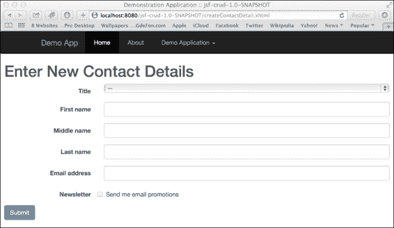
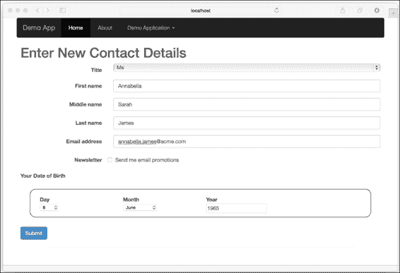
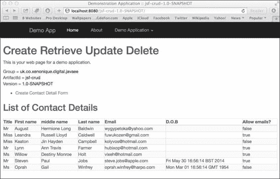
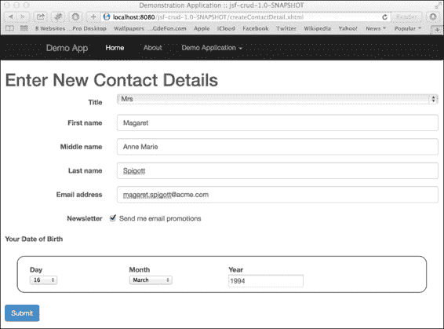
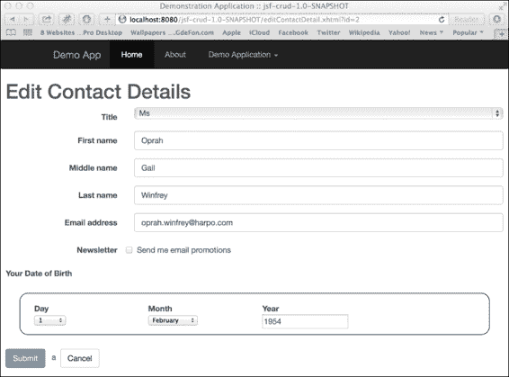
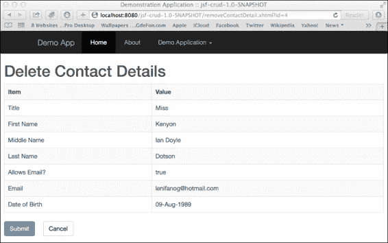

# 第三章。构建 JSF 表单

|   | *"这是全部。某物实际上在许多不同层面上是如何工作的。最终，当然，设计定义了我们经历的大部分内容。" |   |
| --- | --- | --- |
|   | --*苹果美国设计高级副总裁乔尼·艾夫* |

JavaServer Faces 是一个面向组件的 Web 应用程序框架的例子，与 Java EE 8 MVC（见第九章，*Java EE MVC 框架*）、WebWork 或 Apache Struts 相对，后者被称为请求导向的 Web 应用程序框架。

请求导向的框架是指信息流从网络请求到响应。这样的框架为你提供了在`javax.servlet.http.HttpServletRequest`和`javax.servlet.http.HttpServletResponse`对象之上的能力和结构，但没有特殊用户界面组件。因此，应用程序用户必须编写将参数和属性映射到数据实体模型的程序。因此，开发者必须编写解析逻辑。

理解这一点很重要，即面向组件的框架，如 JSF，也有其批评者。代码的快速检查类似于在 Java Swing 或 JavaFX 等独立客户端中找到的组件，但同样的`HttpServletRequest`和`HttpServletResponse`隐藏在幕后。因此，一个合格的 JSF 开发者必须了解 Servlet API 和底层的 servlet 作用域。这在 2004 年是一个有效的批评，在数字营销时代，数字开发者不仅要了解 Servlet，我们还可以假设他们愿意学习其他技术，如 JavaScript。基于从第二章中获得的知识，我们将学习如何构建 JSF 表单。

# 创建、检索、更新和删除

在本章中，我们将使用 JSF 解决一个日常问题。Java EE 框架和企业应用程序主要是为了解决数据录入问题。与使用不同架构和非功能性需求（如可伸缩性、性能、无状态和最终一致性）构建的社交网络软件不同，Java EE 应用程序是为有状态的工作流程设计的，如下面的截图所示：



页面视图截图以创建联系详情

上述截图是 JSF 应用程序`jsf-crud`，显示了创建联系详情表单。

作为提醒，你可以通过本书的源代码找到这个应用程序的完整代码。

通常，企业应用程序从网络用户那里捕获信息，将其存储在数据存储中，并允许检索和编辑这些信息。通常有一个选项可以删除用户信息。在软件工程中，我们称这种习语为创建、检索、更新和删除（CRUD）。

### 注意

构成实际删除用户和客户数据的是影响业务所有者的一个最终问题，他们面临着遵守定义隐私和数据保护的本地和国际法律的压力。

## 基本的创建实体 JSF 表单

让我们创建一个基本的表单，用于捕获用户的姓名、电子邮件地址和出生日期。我们将使用 HTML5 编写此代码，并利用 Bootstrap 的现代 CSS 和 JavaScript。请参阅 [`getbootstrap.com/getting-started/`](http://getbootstrap.com/getting-started/)。

以下是 JSF Facelet 视图，`createContact.xhtml`：

```java
<!DOCTYPE html>
<html 

      >
    <h:head>
        <meta charset="utf-8"/>
        <title>Demonstration Application </title>
        <link href="#{request.contextPath}/resources/styles/bootstrap.css" rel="stylesheet"/>
        <link href="#{request.contextPath}/resources/styles/main.css" rel="stylesheet"/>
    </h:head>

    <h:body>
        <div class="main-container">
            <div class="header-content">
                <div class="navbar navbar-inverse"
                role="navigation">
                  ...
                </div>
            </div><!-- headerContent -->

            <div class="mainContent">
                <h1> Enter New Contact Details </h1>

                <h:form id="createContactDetail"
                    styleClass="form-horizontal"
                    p:role="form">
                    ...
                </h:form>

            </div><!-- main-content -->

            <div class="footer-content">

            </div> <!-- footer-content -->
        </div> <!-- main-container -->
    </h:body>
    <script src="img/jquery-1.11.0.js"></script>
    <script src="img/bootstrap.js"></script>
    <script src="img/main.js">
    </script>
</html>
```

你应该已经认识 `<h:head>` 和 `<h:body>` JSF 自定义标签了。由于类型是 Facelet 视图（`*.xhtml`），文档实际上必须像 XML 文档一样具有良好的格式。你应该已经注意到某些 HTML5 元素标签，如 `<meta>`，已经被关闭并完成；XHTML 文档在 JSF 中必须具有良好的格式。

### 小贴士

**始终关闭 XHTML 元素**

典型的电子商务应用程序具有带有标准 HTML 的网页，包括 `<meta>`、`<link>` 和 `<br>` 标签。在 XHTML 和 Facelet 视图中，这些标签，通常是网页设计师留下开放和悬空的，必须关闭。**可扩展标记语言**（**XML**）不太宽容，而由 XML 衍生的 XHTML 必须具有良好的格式。

新的 `<h:form>` 标签是 JSF 自定义标签，对应于 HTML 表单元素。JSF 表单元素与 HTML 对应元素共享许多属性。你可以看到 `id` 属性是一样的。然而，在 JSF 中，我们使用 `styleClass` 属性而不是 `class` 属性，因为在 Java 中，`java.lang.Object.getClass()` 方法是保留的，因此不能被重写。

### 小贴士

**JSF 请求上下文路径表达式是什么？**

围绕样式表、JavaScript 和其他资源的链接周围的标记是表达式语言：`#{request.contextPath}`。表达式引用确保将 Web 应用程序路径添加到 JSF 资源的 URL 中。Bootstrap CSS 本身依赖于特定文件夹中的字体图标。JSF 图像、JavaScript 模块文件和 CSS 文件应放置在 Web 根目录的资源文件夹中。

`p:role` 属性是 JSF `passthrough` 属性的一个例子，它通知 JSF 渲染器将键和值发送到渲染输出。`passthrough` 属性是 JSF 2.2 的一个重要新增功能，它是 Java EE 7 的一部分。它们允许 JSF 与最近的 HTML5 框架（如 Bootstrap 和 Foundation）良好地协同工作（[`foundation.zurb.com/`](http://foundation.zurb.com/)）。

下面是渲染的 HTML 源代码的摘录：

```java
<h1> Enter New Contact Details </h1>
<form id="createContactDetail" name="createContactDetail" method="post" action="/jsf-crud-1.0-SNAPSHOT/createContactDetail.xhtml" class="form-horizontal" enctype="application/x-www-form-urlencoded" role="form">
<input type="hidden" name="createContactDetail" value="createContactDetail" />
```

JSF 是在 Twitter 创建 Bootstrap 之前实现的。JSF 设计者如何将框架改造以兼容最近的 HTML5、CSS3 和 JavaScript 创新？这就是`passthrough`属性发挥作用的地方。通过在 XHTML 中声明 XML 命名空间 URI [`xmlns.jcp.org/jsf/passthrough`](http://xmlns.jcp.org/jsf/passthrough)，我们可以为页面视图启用该功能。正如你所见，属性名称和值`role="form"`简单地传递到输出中。`passthrough`属性允许 JSF 轻松处理 HTML5 功能，如文本输入字段中的占位符，我们将从现在开始利用这些功能。

### 小贴士

如果你刚开始接触 Web 开发，你可能会对看起来过于复杂的标记感到害怕。有很多很多由页面设计师和界面开发者创建的 DIV HTML 元素。这是历史效应，也是 HTML 和 Web 随时间演变的方式。2002 年的做法与 2016 年无关。我建议你阅读附录 C，*敏捷性能 – 在数字团队中工作*。

让我们更深入地看看`<h:form>`并填补缺失的细节。以下是提取的代码：

```java
<h:form id="createContactDetail"
  styleClass="form-horizontal"
  p:role="form">
  <div class="form-group">
    <h:outputLabel for="title" class="col-sm-3 control-label">
        Title</h:outputLabel>
    <div class="col-sm-9">
      <h:selectOneMenu class="form-control"
         id="title"
         value="#{contactDetailController.contactDetail.title}">
        <f:selectItem itemLabel="--" itemValue="" />
        <f:selectItem itemValue="Mr" />
        <f:selectItem itemValue="Mrs" />
        <f:selectItem itemValue="Miss" />
        <f:selectItem itemValue="Ms" />
        <f:selectItem itemValue="Dr" />
      </h:selectOneMenu>
    </div>
  </div>
  <div class="form-group">
    <h:outputLabel for="firstName" class="col-sm-3 control-label">
      First name</h:outputLabel>
    <div class="col-sm-9">
      <h:inputText class="form-control"
       value="#{contactDetailController.contactDetail.firstName}"
       id="firstName" placeholder="First name"/>
    </div>
  </div>
  ... Rinse and Repeat for middleName and lastName ...
  <div class="form-group">
    <h:outputLabel for="email" class="col-sm-3 control-label">
    Email address </h:outputLabel>
    <div class="col-sm-9">
      <h:inputText type="email"
       class="form-control" id="email"
       value="#{contactDetailController.contactDetail.email}"
       placeholder="Enter email"/>
    </div>
  </div>
  <div class="form-group">
    <h:outputLabel class="col-sm-3 control-label">
       Newsletter
    </h:outputLabel>
    <div class="col-sm-9 checkbox">
      <h:selectBooleanCheckbox id="allowEmails"
    value="#{contactDetailController.contactDetail.allowEmails}">
          Send me email promotions
      </h:selectBooleanCheckbox>
    </div>
  </div>
  <h:commandButton styleClass="btn btn-primary"
    action="#{contactDetailController.createContact()}"
    value="Submit" />
</h:form>
```

此表单使用 Bootstrap CSS 样式构建，但我们将忽略无关的细节，纯粹关注 JSF 自定义标签。

`<h:selectOneMenu>`标签是 JSF 自定义标签，对应于 HTML 表单选择元素。《f:selectItem>`标签对应于 HTML 表单选择选项元素。《h:inputText>`标签对应于 HTML 表单输入元素。《h:selectBooleanCheckbox>`标签是一个特殊自定义标签，用于表示只有一个复选框元素的 HTML 选择。《h:commandButton>`代表 HTML 表单提交元素。

### JSF HTML 输出标签

`<h:outputLabel>`标签以以下方式渲染 HTML 表单标签元素：

```java
<h:outputLabel for="firstName" class="col-sm-3 control-label"> First name</h:outputLabel>
```

开发者应该优先选择此标签与其他相关 JSF 表单输入标签一起使用，因为特殊的`for`属性针对的是元素的正确糖化标识符。

这是渲染的输出：

```java
<label for="createContactDetail:firstName" class="col-sm-3 control-label"> First name</label>
```

我们可以使用 value 属性来编写标签，如下所示：

```java
<h:outputLabel for="firstName" class="col-sm-3 control-label" value="firstName" />
```

在这一点上，也可以利用国际化；所以为了说明，我们可以将页面内容重写如下：

```java
<h:outputLabel for="firstName" class="col-sm-3 control-label" value="${myapplication.contactForm.firstName}" />
```

关于 JSF 中国际化和资源包的更多信息，请参阅附录 A，*JSF 与 HTML5、资源和 Faces 流*。让我们继续到输入字段。

### JSF HTML 输入文本

`<h:inputText>`标签允许以文本等形式在表单中输入数据，如下面的代码所示：

```java
<h:inputText class="form-control" value="#{contactDetailController.contactDetail.firstName}" id="firstName" placeholder="First name"/>
```

值属性代表一个 JSF 表达式语言，线索是评估字符串以哈希字符开头。表达式语言值引用具有 `contactDetailController` 名称的具有作用域的后端 Bean `ContactDetailController.java`。在 JSF 2.2 中，现在有便利属性来支持 HTML5 支持，以便标准的 `id`、`class` 和 `placeholder` 属性按预期工作。

渲染输出如下所示：

```java
<input id="createContactDetail:firstName" type="text" name="createContactDetail:firstName" class="form-control" />
```

注意，简化的 `createContactDetails:firstName` 标识符与 `<h:outputLabel>` 标签的输出相匹配。

### JSF HTML 选择单菜单

`<h:selectOneMenu>` 标签生成一个单选下拉列表。实际上，它是选择类型自定义标签家族的一部分。参见下一节中的 *JSF HTML 选择布尔复选框*。

在代码中，我们有以下代码：

```java
<h:selectOneMenu class="form-control"
         id="title"
         value="#{contactDetailController.contactDetail.title}">
     <f:selectItem itemLabel="--" itemValue="" />
     <f:selectItem itemValue="Mr" />
     <f:selectItem itemValue="Mrs" />
     <f:selectItem itemValue="Miss" />
     <f:selectItem itemValue="Ms" />
     <f:selectItem itemValue="Dr" />
</h:selectOneMenu>
```

`<h:selectOneMenu>` 标签对应于 HTML 表单选择标签。`value` 属性再次是一个 JSF 表达式语言字符串。

在 JSF 中，我们可以使用另一个新的自定义标签 `<f:selectItem>`，它将一个 javax.faces.component.UISelectItem 子组件添加到最近的父 UI 组件。`<f:selectItem>` 标签接受 `itemLabel` 和 `itemValue` 属性。如果你设置了 `itemValue` 而没有指定 `itemLabel`，则值成为标签。因此，对于第一个选项，选项设置为 `--`，但提交给表单的值是一个空字符串，因为我们想提示用户应该选择一个值。

渲染的 HTML 输出如下所示：

```java
<select id="createContactDetail:title" size="1"
  name="createContactDetail:title" class="form-control">  
  <option value="" selected="selected">--</option>
  <option value="Mr">Mr</option>
  <option value="Mrs">Mrs</option>
  <option value="Miss">Miss</option>
  <option value="Ms">Ms</option>
  <option value="Dr">Dr</option>
</select>
```

### JSF HTML 选择布尔复选框

`<h:selectBooleanCheckbox>` 自定义标签是选择中的一个特殊情况，用户只能选择一个项目。通常，在 Web 应用程序中，你会在最终条款和条件表单或通常在电子商务应用程序的市场营销电子邮件部分找到这样的元素。

在目标管理 Bean 中，唯一的值必须是布尔类型，如下所示：

```java
<h:selectBooleanCheckbox for="allowEmails" value="#{contactDetailController.contactDetail.allowEmails}"> Send me email promotions
</h:selectBooleanCheckbox>
```

此自定义标签的渲染输出如下所示：

```java
<input id="createContactDetail:allowEmails" type="checkbox" name="createContactDetail:allowEmails" />
```

### JSF HTML 命令按钮

`<h:commandButton>` 自定义标签对应于 HTML 表单提交元素。它们接受 JSF 中的 action 属性，该属性指向后端 Bean 中的方法。语法再次使用 JSF 表达式语言：

```java
<h:commandButton styleClass="btn btn-primary" action="#{contactDetailController.createContact()}" value="Submit" />
```

当用户按下此 **提交** 按钮时，JSF 框架将找到对应于 `contactDetailController` 的命名管理 Bean，然后调用无参数方法：`createContact()`。

### 注意

在表达式语言中，重要的是要注意不需要括号，因为解释器或 Facelet 会自动检查其含义是动作（`MethodExpression`）还是值定义（`ValueExpression`）。请注意，现实世界中的大多数示例都不添加括号作为快捷方式。

`value` 属性表示表单 **提交** 按钮的文本。我们可以以另一种方式编写标签并达到相同的结果，如下所示：

```java
<h:commandButton styleClass="btn btn-primary"
    action="#{contactDetailController.createContact()}" >
    Submit
</h:commandButton>
```

值是从自定义标签的正文内容中获取的。标签的渲染输出如下所示：

```java
<input type="submit" name="createContactDetail:j_idt45" value="Submit" class="btn btn-primary" />
<input type="hidden" name="javax.faces.ViewState" id="j_id1:javax.faces.ViewState:0" value="-3512045671223885154:3950316419280637340" autocomplete="off" />
```

以下代码展示了 Mojarra 实现（[`javaserverfaces.java.net/`](https://javaserverfaces.java.net/)）中 JSF 渲染器的输出，Mojarra 是参考实现。你可以清楚地看到渲染器在输出中写入了一个 HTML 提交和隐藏元素。隐藏元素捕获有关视图状态的信息，这些信息被发送回 JSF 框架（postback），从而允许它恢复视图。

最后，这是联系方式表单的截图：



带有额外出生日期字段（DOB）的联系方式输入 JSF 表单

还有更多 JSF 自定义标签需要考虑，你将在本章后面找到所有标签的完整表格列表。现在，让我们检查后端 Bean，它也被称为控制器。

## 后端 Bean 控制器

对于我们的简单 POJO 表单，我们需要一个后端 Bean，或者用现代 JSF 开发者的术语来说，就是一个管理 Bean 控制器。

以下是对 `ContactDetailController` 的完整代码：

```java
package uk.co.xenonique.digital;
import javax.ejb.EJB;
import javax.inject.Named;
import javax.faces.view.ViewScoped;
import java.util.List;

@Named("contactDetailController")
@ViewScoped
public class ContactDetailController {
  @EJB ContactDetailService contactDetailService;

  private ContactDetail contactDetail =
    new ContactDetail();

  public ContactDetail getContactDetail() {
      return contactDetail;
  }

  public void setContactDetail(
    ContactDetail contactDetail) {
      this.contactDetail = contactDetail;
  }

  public String createContact() {
      contactDetailService.add(contactDetail);
      contactDetail = new ContactDetail();
      return "index.xhtml";
  }

  public List<ContactDetail> retrieveAllContacts() {
      return contactDetailService.findAll();
  }
}
```

对于这个管理 Bean，让我们介绍几个新的注解。第一个注解是 `@javax.inject.Named`，它声明这个 POJO 是一个 CDI 管理的 Bean，同时也声明了一个 JSF 控制器。在这里，我们将显式声明管理 Bean 的名称值为 `contactDetailController`。这实际上是管理 Bean 的默认名称，因此我们可以省略它。

我们也可以写一个替代名称，如下所示：

```java
@Named("wizard")
@ViewScoped
public class ContactDetailController { /* .. . */ }
```

然后，JSF 会给我们一个名为 `wizard` 的 Bean。管理 Bean 的名称有助于表达式语言语法。

### 提示

当我们谈论 JSF 时，我们可以自由地互换使用“后端 Bean”和“管理 Bean”这两个术语。许多专业的 Java 网络开发者都明白这两个术语意味着同一件事！

`@javax.faces.view.ViewScoped` 注解表示控制器已经将视图的生命周期进行了范围限定。范围限定的视图是为了满足一种情况，即应用程序数据仅保留在一个页面中，直到用户导航到另一个页面。一旦用户导航到另一个页面，JSF 就会销毁该 Bean。JSF 会从其内部数据结构中移除对视图范围 Bean 的引用，该对象随后留给垃圾回收器处理。

`@ViewScoped` 注解是 Java EE 7 和 JSF 2.2 中新引入的，它修复了 Faces 和 CDI 规范之间的一个错误。这是因为 CDI 和 JSF 是独立开发的。通过查看 Javadoc，你会找到一个旧的注解：`@javax.faces.bean.ViewScoped`，它来自 JSF 2.0，并且不是 CDI 规范的一部分。

目前，如果你选择编写带有 `@ViewScoped` 注解的控制器，你可能应该使用 `@ManagedBean`。我们将在本章后面解释 `@ViewScoped` Bean。

`ContactDetailController`还依赖于一个**企业 JavaBean**（**EJB**）服务端点：`ContactDetailService`，并且最重要的是，有一个名为`ContactDetail`的 bean 属性。注意`getter`和`setter`方法，我们还将确保在构造时实例化该属性。

我们现在将注意力转向方法，如下所示：

```java
  public String createContact() {
    contactDetailService.add(contactDetail);
    contactDetail = new ContactDetail();
    return "index.xhtml";
  }

  public List<ContactDetail> retrieveAllContacts() {
    return contactDetailService.findAll();
  }
```

`createContact()`方法使用 EJB 创建一个新的联系详情。它返回一个字符串，这是下一个 Facelet 视图：`index.xhtml`。此方法由`<h:commandButton>`引用。

`retrieveAllContacts()`方法调用数据服务以获取实体的列表集合。此方法将被另一页引用。

## 数据服务

控制器依赖于一个实体 bean：`ContactDetail`。以下是此 bean 的代码，它已经被简化：

```java
package uk.co.xenonique.digital;
import javax.persistence.*;
import java.util.Date;

@Entity
@Table(name="CONTACT")
@NamedQueries({
  @NamedQuery(name="ContactDetail.findAll",
    query = "select c from ContactDetail c " +
            "order by c.lastName, c.middleName, c.firstName")
})
public class ContactDetail {
  @Id
  @GeneratedValue(strategy = GenerationType.AUTO)
  @Column(name="CONTACT_ID", nullable = false,
          insertable = true, updatable = true,
          table = "CONTACT")
  private long id;

  private String title="";
  private String firstName;
  private String middleName;
  private String lastName;
  private String email;

  @Temporal(TemporalType.DATE)
  private Date dob;

  private Boolean allowEmails;

  public long getId() { return id; }
  public void setId(long id) { this.id = id; }

  public String getTitle() { return title; }
  public void setTitle(String title) { this.title = title; }

  // Other getters and setters omitted

  // equals, hashCode, toString omitted
}
```

它使用**Java 持久化 API**（**JPA**）注解将 Java 属性映射到关系数据库。

有一组注解是针对实体本身声明的。`@Entity`注解将此 POJO 标记为持久化能力对象。`@Table`注解覆盖了实体的默认数据库表名——而不是`CONTACT_DETAIL`，它变成了`CONTACT`。`@NameQueries`和`@NameQuery`注解定义了**Java 持久化查询语言**（**JPQL**）中的名称查询。

剩余的注解声明与数据库表列关联的元数据。`@Id`注解指定将成为主键的属性，即`id`字段。`@GenerationValue`注解声明主键是自动生成的。如果存在`0`或 null 值，JPA 提供商会生成一个唯一值。此属性上的其他注解`@Column`将默认数据库表列名从`ID`重命名为`CONTACT_ID`并设置某些约束。

最后，JPA 必须使用`@Temporal`注解指定字段的日期时间类型。注解值可以是`Temporal.DATE`、`Temporal.TIME`或`Temporal.TIMESTAMP`。

你可以在我的书中了解 JPA，即《Java EE 7 开发者手册》，其中有几个关于该主题的简洁和专门的章节。然而，这本书关注的是 Web 应用程序开发。

现在应该很明显，实体 bean 可以直接在 JSF 表单中使用。你还记得表单属性的 JSF 表达式语言吗？看看以下的名字字段：

```java
<h:inputText class="form-control" value="#{contactDetailController.contactDetail.firstName}" id="firstName" placeholder="First name"/>
```

由于 JSF 框架通过名称知道`contactDetailController`，其类类型为`ContactDetailController`，它可以遍历对象图并确定属性。控制器有一个名为`contactDetail`的属性，其类型为`ContactDetail`，它有一个字符串类型的`firstName`属性。

控制器的关键要求是在表单提交时以及从表单检索`remembered`值时，实体应该被实例化。让我们看看以下代码：

```java
private ContactDetail contactDetail = new ContactDetail();
```

开发者可以针对大型对象层次结构使用多种可能性。延迟加载和延迟创建数据结构可以帮助在这些情况下。

让我们来看看企业服务豆`ContactDataService`：

```java
package uk.co.xenonique.digital;
import javax.ejb.Stateful;
import javax.persistence.*;
import java.util.List;

@Stateful
public class ContactDetailService {
  @PersistenceContext(unitName = "applicationDB",
      type = PersistenceContextType.EXTENDED)
  private EntityManager entityManager;

  public void add(ContactDetail contactDetail) {
    entityManager.persist(contactDetail);
  }

  public void update(ContactDetail contactDetail) {
    ContactDetail contactDetailUpdated
         = entityManager.merge(contactDetail);
    entityManager.persist(contactDetailUpdated);
  }

  public void delete(ContactDetail contactDetail) {
    entityManager.remove(contactDetail);
  }

  public List<ContactDetail> findAll() {
    Query query = entityManager.createNamedQuery(
            "ContactDetail.findAll");
    return query.getResultList();
  }
}
```

这个类是一个有状态会话 EJB 的例子，它本质上是一个具有会话状态的应用服务器中的可池化远程服务端点。有状态会话豆与调用客户端相关联。

`ContactDetailService`依赖于一个 JPA 提供者，正如我们通过`@PersistenceContext`注解注入实体管理器所看到的那样。请注意，我们使用持久化上下文的扩展版本，因为会话可以持续多个请求-响应周期。

在非扩展持久化会话中，EntityManager 将仅存在于 JTA 事务期间。一旦 Java EE 模型中的事务完成，所有持久化对象都会从`EntityManager`中分离，并变为未管理状态。

扩展持久化会话是指 EntityManager 可以超出**Java 事务 API（JTA**）事务的作用域。实际上，它可以在多个事务中存活。在这种情况下，持久化对象不会从 EntityManager 中分离；数据仅在显式刷新或通过应用服务器为有状态会话豆提供的特殊状态标记时保存到数据库中。因此，扩展持久化上下文只能用于有状态会话豆。

有关权限和有状态会话豆的更多信息，请参阅我的姐妹书籍《Java EE 7 开发者手册》。

目前，我们只需关注`ContactDataService`中的方法。`add()`方法在数据库中插入一条新记录。`update()`方法修改现有记录，`delete()`方法删除记录。`findAll()`方法从底层数据库检索所有`ContactDetail`记录。它使用命名的 JPQL 查询：`Contact.findAll`。

你可能想知道用户界面中的 JSF 字段在哪里设置`Date of Birth (DOB)`属性，就像在`ContactDetail`实体豆中看到的那样。我们稍后会添加这些字段。

# JSF 自定义标签

正如你所见，JSF 自带丰富的自定义标签库。为了充分利用框架，数字开发者应该了解它们及其功能。标签可以按照我们之前看到的命名空间进行划分。

## HTML 渲染工具自定义标签

JSF 2.2 中的第一组标签与 HTML 元素的渲染相关。它们位于命名空间：[`xmlns.jcp.org/jsf/html`](http://xmlns.jcp.org/jsf/html)。JSF 框架中渲染工具的默认实现包含`javax.faces.component.UIComponent`的组件标签。

这里是 HTML 渲染工具标签的表格：

| JSF 自定义标签 | 描述 |
| --- | --- |
| `<h:column>` | 这将渲染一个`javax.faces.component.UIColumn`实例，代表父 UIData 组件中的单个数据列。此自定义标签用于`<h:dataTable>`中。 |
| `<h:commandButton>` | 这将渲染一个具有提交或重置类型的 HTML 输入元素。 |
| `<h:commandLink>` | 这将渲染一个类似于提交按钮的 HTML 锚元素，因此，该标签必须添加在`<h:form>`标签中。 |
| `<h:dataTable>` | 这将渲染一个具有行和列的 HTML 表格，包括表头和表列单元格。 |
| `<h:form>` | 这将渲染一个 HTML 表单元素。 |
| `<h:graphicImage>` | 这将渲染一个 HTML 图像元素。 |
| `<h:inputFile>` | 这将渲染一个具有文件类型的 HTML 表单输入元素，并允许应用程序从客户端操作系统上传文件。 |
| `<h:inputHidden>` | 这将渲染一个具有隐藏类型的 HTML 表单输入元素。 |
| `<h:inputSecret>` | 这将渲染一个具有密码类型的 HTML 表单输入元素。 |
| `<h:inputText>` | 这将渲染一个具有文本类型的 HTML 表单输入元素。 |
| `<h:inputTextarea>` | 这将渲染一个 HTML 表单文本区域元素。 |
| `<h:link>` | 这将渲染一个 HTML 锚元素，执行对应用的 HTTP GET 请求。 |
| `<h:outputFormat>` | 此标签以格式化参数渲染参数化文本。 |
| `<h:outputLabel>` | 这将渲染一个 HTML 标签元素。 |
| `<h:outputLink>` | 这将渲染一个 HTML 锚元素，通常用于非 JSF 应用的链接。 |
| `<h:outputText>` | 此标签将输出渲染到视图中。 |
| `<h:message>` | 这将为特定组件向页面渲染一条消息。该标签通过资源包允许国际化。 |
| `<h:messages>` | 这将从 Faces 上下文向页面渲染一系列消息。 |
| `<h:panelGrid>` | 此自定义标签将组件渲染到网格中。默认的 JSF 实现使用 HTML 表格元素。 |
| `<h:panelGroup>` | 此自定义标签将嵌套的 JSF 标签组织到定义的组中，其中布局生成并生成单个实体。 |
| `<h:selectBooleanCheckbox>` | 这将渲染一个具有复选框类型的 HTML 输入元素，并设计用于布尔属性。 |
| `<h:selectManyCheckbox>` | 这将渲染具有复选框类型的 HTML 输入元素列表。 |
| `<h:selectManyListbox>` | 这将渲染 HTML 选择选项元素的列表。 |
| `<h:selectManyMenu>` | 这将渲染 HTML 选择选项元素的列表。 |
| `<h:selectOneListbox>` | 这将渲染 HTML 选择选项元素的列表。 |
| `<h:selectOneMenu>` | 这将渲染 HTML 选择选项元素的列表。 |
| `<h:selectOneRadio>` | 这将渲染一个具有单选类型的 HTML 输入元素列表。 |

JSF HTML 标签被分为不同的类型，例如命令、输入、输出和类型，以便处理项目的选择。还有额外的标签来处理特殊案例，例如`<h:graphicImage>`用于渲染``标签和`<h:dataTable>`用于渲染`<table>`信息。

## 核心 JSF 自定义标签

核心 JSF 自定义标签添加了独立于 HTML 渲染标签的功能。这些标签的命名空间是[`xmlns.jcp.org/jsf/core`](http://xmlns.jcp.org/jsf/core)。JSF 框架是可扩展的。如果您想使用替代渲染套件，那么您只需添加它。核心 JSF 自定义标签仍然会工作。

这里是 JSF 核心标签的表格：

| JSF 自定义标签 | 描述 |
| --- | --- |
| `<f:actionListener>` | 这注册一个`ActionListener`实例。 |
| `<f:attribute>` | 这向`UIComponent`添加一个属性，并使用最近的父`UIComponent`执行操作。 |
| `<f:convertDateTime>` | 这将`DateTimeConverter`注册到`UIComponent`。 |
| `<f:convertNumber>` | 这将`NumberConverter`注册到`UIComponent`。 |
| `<f:converter>` | 这渲染一个类似于提交按钮的 HTML 锚点元素，因此，该标签必须添加到`<h:form>`中。 |
| `<f:facet>` | 这向组件添加一个面。 |
| `<f:loadBundle>` | 这加载一个为当前视图的 Locale 本地化的资源包，并将属性存储为`java.util.Map`。 |
| `<f:metadata>` | 这声明此视图的元数据面。 |
| `<f:param>` | 这向`UIComponent`添加一个参数。 |
| `<f:phaseListener>` | 这将`PhaseListener`实例注册到页面中。 |
| `<f:selectItem>` | 这指定了一个单选或多选组件的项目。 |
| `<f:selectItems>` | 这指定单选或多选组件的项目。 |
| `<f:setProperty-ActionListener>` | 这将`ActionListener`注册到组件的特定属性。 |
| `<f:subview>` | 这创建另一个 JSF 命名上下文（参见`<f:view>`）。 |
| `<f:validateDoubleRange>` | 这将`DoubleRangeValidator`注册到组件中。 |
| `<f:validateLength>` | 这将`LengthValidator`注册到组件中。 |
| `<f:validateLongRange>` | 这将`LongRangeValidator`注册到组件中。 |
| `<f:validateRegex>` | 这将正则表达式验证器注册到组件中。如果整个模式匹配，则它是有效的。 |
| `<f:validateRequired>` | 这确保在表单提交时组件中的值存在。 |
| `<f:validator>` | 这将命名的 Validator 实例注册到组件中。 |
| `<f:valueChangeListener>` | 这将`ValueChangeListener`注册到组件中。 |
| `<f:verbatim>` | 这向 JSF 页面添加标记，并允许主体内容直接传递到渲染输出。 |
| `<f:view>` | 这为页面的 JSF 当前命名上下文设置参数。使用此标签可以覆盖区域设置、编码或内容类型。 |
| `<f:viewParam>` | 这将一个视图参数添加到分面的元数据中，以便页面可以访问在 GET 请求中查询参数。此标签只能在`<f:metadata>`中使用。 |

许多核心 JSF 标签的目的是增强和配置一个`UIComponent`实例。您已经在之前的代码示例`createContact.xhtml`中的`<h:selectOneMenu>`的`<f:selectItem>`标签中看到了这个示例的使用。（见*基本 JSF 表单*部分）。

在大多数情况下，开发者可以使用核心 JSF 标签向组件添加属性、监听器、转换器、分面、参数和选择。

## 模板组合自定义标签

模板 JSF 自定义标签库为您提供了使用其他页面内容组合页面的能力。模板允许内容在整个 JSF 应用程序中重用和共享。最好的是，可以通过指定参数来适应模板，从而在混合中具有适应性和灵活性。这些标签的命名空间是[`xmlns.jcp.org/jsf/facelets`](http://xmlns.jcp.org/jsf/facelets)，这强调了 Facelet 视图背后的技术。

这里是 JSF 2.2 中的模板标签列表：

| JSF 自定义标签 | 描述 |
| --- | --- |
| `<ui:component>` | 这定义了一个模板组件并指定了组件的文件名。 |
| `<ui:composition>` | 这定义了一个页面组合，它封装了可选使用模板的 JSF 内容。 |
| `<ui:debug>` | 这将在当前页面创建并添加一个特殊组件，允许显示调试输出。 |
| `<ui:define>` | 这定义了由组合模板插入到页面中的 JSF 内容。 |
| `<ui:decorate>` | 这定义了装饰 JSF 页面特定区域的内联内容。 |
| `<ui:fragment>` | 以类似于`<ui:composition>`标签的方式定义模板片段，不同之处在于此标签保留正文外的内容，而不是丢弃它。 |
| `<ui:include>` | 这将另一个 JSF 页面插入到当前页面中。 |
| `<ui:insert>` | 这将一个命名的内联定义插入到当前页面中。此标签与`<ui:define>`一起使用。 |
| `<ui:param>` | 这将参数传递给由`<ui:include>`或模板引用（如`<ui:composition>`或`<ui:include>`）指定的包含文件。 |
| `<ui:repeat>` | 这遍历来自 bean 属性或方法的列表集合。此标签是循环遍历集合的替代方法，类似于`<h:dataTable>`或`<c:forEach>`。 |
| `<ui:remove>` | 这从页面中删除特定的标记内容。 |

我们已经在第二章中看到了`<ui:composition>`、`<ui:define>`和`<ui:insert>`的操作，*JavaServer Faces 生命周期*。我们肯定会使用模板 JSF 标签来处理本书中关于 JSF 的剩余部分。

## 常见属性

JSF 标准标签共享许多共同属性。以下表格是一个参考，其中一些属性适用于大多数 HTML 渲染标签：

| 属性名称 | 描述 |
| --- | --- |
| `id` | 这指定了 HTML 元素标识符。JSF 开发者应该每次都使用此属性。 |
| `binding` | 这将一个标签绑定到一个管理 Bean 中的组件实例。JSF 框架将组件树中的组件引用绑定到一个作用域变量。 |
| `Immediate` | 这指定了一个布尔值，如果设置为`true`，则导致 JSF 框架在 JSF 生命周期中的“应用请求值”阶段之后跳过验证、转换和事件的处理。 |
| `rendered` | 这指定了一个布尔值，通常默认为 true，表示组件是否应该被渲染。 |
| `required` | 这指定了该输入元素是否为输入验证所必需的布尔值。 |
| `styleClass` | 这指定了渲染标签的 HTML 类属性。 |
| `stylestyle` | 这指定了渲染标签的 HTML 样式属性。 |
| `valuevalue` | 这指定了一个字符串值或表达式语言引用。 |

现在我们已经看到了 JSF 标签，我们将回到我们的 CRUD 示例。

# 显示对象列表集合

对于 CRUD 示例，我们经常面临在应用程序中以用户可理解的有意义的方式显示数据的实际问题。最容易的方法之一就是简单地打印出项目的列表，对于相对简单的数据。另一种方法是显示数据的表格视图。如果你的数据是树结构或图，还有其他值得考虑的解决方案。

对于我们的情况，我们将选择第二条路径，并在表格中显示联系详情列表。在 JSF 中，我们可以使用`<h:dataTable>`HTML 组件。这个自定义标签遍历列表中的每个对象并显示指定的值。《h:dataTable》组件是一个非常强大且灵活的标签，因为 Java 网络工程师可以配置它以在多种布局中渲染自定义样式。

让我们来看看`jsf-crud`项目中的另一个 JSF Facelet 视图，`index.html`。作为提醒，我们正在使用 Bootstrap CSS 进行样式设计。现在，以下是提取的代码，如下所示：

```java
<div class="main-content">
  ...
  <h2> List of Contact Details </h2>

  <h:dataTable id="contactTable"
    value="#{contactDetailController.retrieveAllContacts()}"
    styleClass="table-striped table-bordered user-table"
    var="contact">
    <h:column>
      <f:facet name="header">
        <h:outputText value="Title" />
      </f:facet>
        <h:outputText value="#{contact.title}"/>
    </h:column>
    <h:column>
        <f:facet name="header">
            <h:outputText value="First name" />
        </f:facet>
        <h:outputText value="#{contact.firstName}"/>
    </h:column>

    ... (repeat for Middle name and Last Name) ...

    <h:column>
      <f:facet name="header">
        <h:outputText value="Email" />
      </f:facet>
        <h:outputText value="#{contact.email}"/>
    </h:column>
    <h:column>
      <f:facet name="header">
        <h:outputText value="D.O.B" />
      </f:facet>
        <h:outputText value="#{contact.dob}"/>
    </h:column>
    <h:column>
      <f:facet name="header">
        <h:outputText value="Allow emails?" />
      </f:facet>
        <h:outputText value="#{contact.allowEmails}"/>
    </h:column>
  </h:dataTable>

  <hr class="subfeaturette-divider" />
</div><!-- main-content -->
```

你首先会注意到`<h:dataTable>`标签接受一个值属性，这是 JSF 表达式语言对控制器`retrieveAllContacts()`方法的引用。`ContactDetailController`将此请求委派给我们在前面看到的`ContactDetailService`，即有状态的会话 EJB。

`var`属性指定了 JSF 作用域变量的名称，这是每次组件遍历列表集合时创建的元素。视图中的元素类型是实体 bean：`ContactDetail`。

`styleClass`属性添加了来自 Bootstrap 框架的特定 CSS 样式，当然，每个组件都可以有一个`id`属性。

`<h:dataTable>`组件需要嵌套的描述表格列数据的`<h:column>`标签。

如果您想为表格添加标题行，那么您必须在`<h:column>`标签中放置并添加一个核心 JSF 标签`<f:facet>`。此标签名必须有一个特殊的名称属性，其值为`header`。如果您问我：为什么我必须使用不同的 XML 命名空间来编写标签？那么我的回答将是，这是 JSF 设计者预见核心标签可以重复用于其他渲染套件的方式。因此，标签名是`<f:facet>`而不是类似`<h:headerColumn>`的东西。

为了向用户显示每行的信息，我们使用`<h:outputText>`元素。此标签接受另一个表达式语言语句，即实体 Bean 中属性的引用，例如`#{contact.firstName}`。

这里是`index.html`列表视图的截图：



CRUD 应用程序的列表视图截图

## 增强的日期时间输入

如果您注意到，我们忽略了添加 JSF 控件，以便用户可以将他的或她的出生日期添加到联系详细信息表单中。让我们假设我们敏捷团队中的 UX 人员有一个指令，并且输入必须以两个下拉列表的形式出现。业务希望有两个下拉元素，分别用于月份的天数和年份的月份。他们还希望有一个文本输入用于年份。

在我们的 JSF 之旅中，我们已经介绍了一些 HTML 选择自定义标签，例如`<h:selectOneMenu>`和`<h:selectBooleanCheckbox>`。现在，我们将学习如何从我们的管理 Bean 中程序化地生成这些标签的数据。如果我们能帮助的话——我们当然可以——我们真的不想在 JSF 视图中重复编写`<f:selectItem>` 31 次。

我们需要在`ContactDetailController`中添加额外的逻辑。这些增强是为了 JSF 管理 Bean，它提供了通过表达式语言可访问的方法，如下所述：

```java
@ManagedBean(name = "contactDetailController")
@ViewScoped
public class ContactDetailController {
  // ... same as before

  public String createContact() {
      Calendar cal = Calendar.getInstance();
      cal.set(Calendar.DAY_OF_MONTH, dobDay);
      cal.set(Calendar.MONTH, dobMonth-1 );
      int year = Integer.parseInt(dobYear);
      cal.set(Calendar.YEAR, year);
      contactDetail.setDob(cal.getTime());
      contactDetailService.add(contactDetail);  
      contactDetail = new ContactDetail();
      return "index.xhtml";
  }

  // ...

  private int dobDay;
  private int dobMonth;
  private String dobYear;

  public int getDobDay() { return dobDay; }
  public void setDobDay(int dobDay) {
      this.dobDay = dobDay; }
  // ... getter and setter for dobMonth and dobYear

  private static List<Integer> daysOfTheMonth
    = new ArrayList<>();
  private static Map<String,Integer> monthsOfTheYear
    = new LinkedHashMap<>();

  static {
    for (int d=1; d<=31; ++d) {
        daysOfTheMonth.add(d);
    }

    DateFormatSymbols symbols =
            new DateFormatSymbols(Locale.getDefault());
    for (int m=1; m<=12; ++m) {
        monthsOfTheYear.put(symbols.getMonths()[m-1], m );
    }
  }

  public List<Integer> getDaysOfTheMonth() {
      return daysOfTheMonth;
  }
  public Map<String,Integer> getMonthsOfTheYear() {
      return monthsOfTheYear;
  }
}
```

我们将在控制器中添加三个新的 Bean 属性：`dobDay`、`dobMonth`和`dobYear`。请注意，`dobYear`是一个字符串，而其他两个是整数，因为年份字段是一个文本字段。当使用整数时，前端显示的默认值是`0`，这会减损并混淆用户。我们希望用户看到一个空白的文本字段。这些新属性有 getter 和 setter。

我们增强了`createContact()`方法，以便考虑来自三个单独字段的出生日期，并使用`java.util.Calendar`实例将它们转换为 DOB 值。在将实体 Bean 保存到数据库之前，我们将设置一个具有`java.util.Date`类型计算值的属性。

有两个属性方法，`getDaysOfTheMonth()` 和 `getMonthsOfTheYear()`，它们将返回由类静态初始化器构建的静态集合。`daysOfTheMonth` 字段是一个从 1 到 31 的整数列表集合，而 `monthsOfTheYear` 字段是一个与整数关联的条目和字符串的映射集合，代表一年的月份。

我们使用 JDK 的 `DateFormatSymbols` 类来检索设置为应用程序默认区域设置的月份的长名称。

通过这些后端更改，我们可以调整 JSF 视图，以便添加设置申请人的出生日期的能力。

这里是 JSF 视图 `createContactDetails.xhtml` 的更新更改：

```java
<label class="control-label"> Your Date of Birth</label>
<div class="row  my-group-border">
  <div class="col-sm-3">
    <label class="control-label" for="dobDay">Day</label>
    <div class="controls">
      <h:selectOneMenu id="dobDay"
          value="#{contactDetailController.dobDay}"
          label="Registration Day">
        <f:selectItem itemLabel="----"  itemValue=""/>
        <f:selectItems
           value="#{contactDetailController.daysOfTheMonth}"
           var="day"
            itemLabel="#{day}" itemValue="#{day}" />
        <f:validateRequired/>
      </h:selectOneMenu>
      <h:message for="dobDay" styleClass="form-error"/>
    </div>
  </div>
  <div class="col-sm-3">
    <label class="control-label" for="dobMonth">Month</label>
    <div class="controls">
      <h:selectOneMenu id="dobMonth"
          value="#{contactDetailController.dobMonth}"
          label="Registration Month">
        <f:selectItem itemLabel="----"  itemValue=""/>
        <f:selectItems
          value="#{contactDetailController.monthsOfTheYear}" />
        <f:validateRequired/>
      </h:selectOneMenu>
      <h:message for="dobMonth" styleClass="form-error"/>
    </div>
  </div>
  <div class="col-sm-3">
    <label class="control-label" for="dobYear">Year</label>
    <div class="controls">
      <h:inputText id="dobYear"
          value="#{contactDetailController.dobYear}"
          label="Registration Year">
        <f:validateRequired/>
      </h:inputText>
      <h:message for="dobYear" styleClass="form-error"/>
    </div>
  </div>
</div>
<h:commandButton styleClass="btn btn-primary" action="#{contactDetailController.createContact()}" value="Submit" />
```

嗯，希望我没有吓到你，让你跑上坡路！我们在这里使用 Bootstrap CSS v3.11，这就是为什么你在 HTML 中看到很多带有特定命名的 CSS 选择器的 `<div>` 元素，如 `control-label`、`col-sm-6` 和 `row`。Bootstrap 是一个流行的 HTML5、CSS 和 JavaScript 框架，它帮助设计师和开发者构建响应式网站。

作为组件框架，JSF 提供了封装 `<div>` 层、CSS 和 JavaScript 的基础。有一些方法可以帮助实现这一点。首先，团队可以开发自己的自定义组件；其次，他们可以利用具有所需功能和定制的第三方组件系统；最后，团队可以作为库编写者，因此创建他们自己的定制 HTML 渲染工具包。自定义组件编程起来要容易得多，我们将在第五章 Conversations and Journeys 中讨论，*对话和旅程*。

如果您的团队对组件库感兴趣，那么您可能想查看供应商解决方案，例如 Rich Faces ([`richfaces.jboss.org/`](http://richfaces.jboss.org/)) 和特别是 Prime Faces ([`primefaces.org/`](http://primefaces.org/))。

让我们集中讨论 `<h:selectOneMenu>` 标签。这个来自 JSF 命名空间的 HTML 自定义标签指定了一个下拉选择列表，用户只能选择一个项目。`value` 属性引用控制器 bean 中的一个属性。因此，第一个字段的表达式语言是 `#{contactDetailController.dobDay}`。

在父标签中，您可以看到 `<f:selectItem>` 和 `<f:selectItems>` 自定义标签。`<f:selectItem>` 标签定义了一个菜单项。它接受 `itemLabel` 和 `itemValue` 属性。我们可以用它来定义一个默认的空选项。

`<f:selectItems>` 标签定义了许多菜单项，并接受另一个值属性，即表达式语言 `#{contactDetailController.daysOfTheMonth}`。这个表达式引用控制器获取方法 `getDaysOfTheMonth()`，它返回 `List<Integer>`。我们将使用 `var`、`itemLabel` 和 `itemValue` 来配置如何渲染每个菜单选项，如下所示。

```java
<f:selectItems  value="#{contactDetailController.daysOfTheMonth}" var="day" itemLabel="#{day}" itemValue="#{day}" />
```

正如 `<h:dataTable>` 标签一样，我们可以使用 `var` 属性定义 JSF 范围变量，并有效地遍历集合。

在 `<f:selectMenu>` 中，年份下拉菜单的标记略有不同。由于 `getMonthsOfTheYear()` 已经返回了一个 `Map<String,Integer>` 集合，因此不需要提供标签和值的配置。自定义标签已经知道它必须渲染地图集合。

DOB 年份的最后字段是 `<h:inputText>`，到现在为止，你已经知道这些标签是如何工作的。你可能已经注意到了一些惊喜。

`<f:validateRequired>` 标签是一个验证自定义标签，它指定了在表单提交时必须定义 bean 属性。`<h:message>` 标签指定了一个区域，在 HTML 中我们希望特定的验证错误显示如下：

```java
<h:message for="dobYear" styleClass="form-error"/>
```

`<h:message>` 标签接受一个必填的 `for` 属性，该属性引用 JSF HTML 表单属性。我们可以使用 `styleClass` 属性设置 CSS 样式，这是一个来自 Bootstrap 的表单错误。在下一章中，我们将详细探讨验证。

这里是新的表单的截图：



联系数据应用程序创建页面视图的截图

# 编辑数据

现在，让我们再添加一个 JSF `index.xhtml`，以便用户可以编辑和删除联系详情。在我们能够编辑联系详情之前，我们必须向列表视图添加一些 JSF 链接，以便用户可以导航到编辑和删除页面。

让我们修改 `index.xhtml` 视图中的 `<h:dataTable>` 部分，并添加一个额外的列。代码如下：

```java
<h:dataTable id="contactTable"
  ... other columns as before ...
  <h:column>
    <f:facet name="header">
      <h:outputText value="Action" />
    </f:facet>
    <h:link styleClass="btn"
      outcome="editContactDetail.xhtml?id=#{contact.id}">
      <f:param name="id" value="#{contact.id}" />
      <span class="glyphicon glyphicon-edit"></span>
    </h:link>
    <h:link styleClass="btn"
      outcome="removeContactDetail.xhtml?id=#{contact.id}">
      <f:param name="id" value="#{contact.id}" />
      <span class="glyphicon glyphicon-trash"></span>
    </h:link>
  </h:column>

</h:dataTable>
```

我们有两个 `<h:link>` 标签，它们生成两个 HTML 锚点元素链接到两个新页面：`editContactDetail.xhtml` 和 `removeContactDetail.xhtml`。

`<h:link>` 自定义标签有一个 `outcome` 属性，用于使用 JSF 导航规则生成 URL。`value` 属性指定链接上的文本或你可以指定正文文本。这个标签足够聪明，如果链接不存在，它将生成一个 `<span>` 元素。这是一个有用的功能，用于原型设计。

这里是 `<h:link>` 的渲染输出的一部分：

```java
<td>
  <a href="/jsf-crud-1.0-SNAPSHOT/editContactDetail.xhtml?id=5" class="btn">
    <span class="glyphicon glyphicon-edit"></span></a>
  <a href="/jsf-crud-1.0-SNAPSHOT/deleteContactDetail.xhtml?id=5" class="btn">
    <span class="glyphicon glyphicon-trash"></span></a>
</td>
```

`glyphicon`、`glyphicon-edit` 和 `glyph-trash` 类是 Bootstrap 的标记，用于显示图标按钮。

在设置好链接之后，我们现在必须在服务器端允许编辑合同详情。我们将通过添加新的属性和方法来适配 `ContactDetailController`。我们将引入的第一个属性是 `id`，这样我们就可以跟踪数据库中联系 ID 的主键。我们还将需要为 JSF 框架提供 getter 和 setter。

重新考虑一下，允许用户取消任务会更好。因此，我们将在控制器中引入一个 `cancel()` 方法。我们还将添加几个方法：`findByContactId()` 和 `editContact()`。

这是 `ContactDetailController` 的以下代码，现在如下所示：

```java
import javax.faces.application.FacesMessage;
import javax.faces.context.FacesContext;

public class ContactDetailController {
  // ... as before ...
  private int id;

  public int getId() { return id; }
  public void setId(int id) { this.id = id; }

  public String cancel() {
      return "index.xhtml";
  }

  public void findContactById() {
    if (id <= 0) {
      String message =
        "Bad request. Please use a link from within the system.";
      FacesContext.getCurrentInstance().addMessage(null,
        new FacesMessage(
          FacesMessage.SEVERITY_ERROR, message, null));
      return;
    }

    ContactDetail item = contactDetailService.findById(id).get(0);
    if (item == null) {
      String message =
        "Bad request. Unknown contact detail id.";
      FacesContext.getCurrentInstance().addMessage(null,
        new FacesMessage(
          FacesMessage.SEVERITY_ERROR, message, null));
    }
    contactDetail = item;
    Calendar cal = Calendar.getInstance();
    cal.setTime(contactDetail.getDob());
    dobDay = cal.get(Calendar.DAY_OF_MONTH);
    dobMonth = cal.get(Calendar.MONTH)+1;
    dobYear = Integer.toString(cal.get(Calendar.YEAR));
  }

  public String editContact() {
      Calendar cal = Calendar.getInstance();
      cal.set(Calendar.DAY_OF_MONTH, dobDay);
      cal.set(Calendar.MONTH, dobMonth-1);
      int year = Integer.parseInt(dobYear);
      cal.set(Calendar.YEAR, year);
      contactDetail.setDob(cal.getTime());
      contactDetail.setId(id)
      contactDetailService.update(contactDetail);
      contactDetail = new ContactDetail();
      return "index.xhtml";
  }

  // ...
}
```

`cancel()` 方法简单地返回下一个视图：`index.xhtml`。它什么都不做，这并不是代码中的错误，而实际上是目的：返回到开始。

`findContactById()` 方法使用 `id` 属性通过 `ContactDataService` EJB 查找联系详细信息。此方法使用 `Calendar` 实例从 `ContactDetail` 实体中提取 `dob` 属性，并将其分解为 `dobDay`、`dobMonth` 和 `dobYear` 属性。

`javax.faces.context.FacesContext` 类型是一个聚合对象，用于存储当前请求和响应信息。`FacesContext` 只能通过工厂方法获取。在示例中，我们将向 Faces 响应添加错误消息，该消息可以在视图中显示。`javax.faces.application.FacesMessage` 类型是错误验证的表示，或者可以定义为来自外部资源包的消息资源。参见 附录 A，*JSF with HTML5, Resources, and Faces Flows*。

`editContact()` 方法几乎与 `createContect()` 相同，因为它在实体中重建了 `dob` 属性。不同之处在于实体中的 `id` 属性是从控制器属性 `id` 中设置的：设置正确的主键至关重要，因为用户不希望看到重复条目。现在 `editContect()` 方法使用 `update()` 而不是 `create()` 调用数据库。

我们现在将使用新的命名查询来适配 `ContactDetail` 实体。以下是修改内容：

```java
@Entity
@Table(name="CONTACT")
@NamedQueries({
  @NamedQuery(name="ContactDetail.findAll", query = "select c from ContactDetail c " + "order by c.lastName, c.middleName, c.firstName"), @NamedQuery(name="ContactDetail.findById", query = "select c from ContactDetail c where c.id = :id"),
})
public class ContactDetail { /* ... as before ... */ }
```

命名的 `ContactDetail.findById` 查询使用带有键参数的 JPQL 语句，该参数在字符串中表示为 `:id`。我们现在将向 EJB 添加一个额外的方法。

这里是附加的 `ContactDetailService` 方法，以下是其代码：

```java
@Stateful
public class ContactDetailService {
  // ... as before ...

  public List<ContactDetail> findById(Integer id) {
    Query query = entityManager.createNamedQuery("ContactDetail.findById").setParameter("id", id);
    return query.getResultList();
  }
}
```

`findById()` 方法使用命名查询并调用 JPA 查询以检索 `ContactDetail` 元素的列表集合。根据定义，集合中应该只有一个元素，因为我们是通过主键进行查询的。

在后端进行这些更改后，我们只需要在页面视图中进行一些更改，这几乎与 `createContactDetail.xhtml` 相同。

这里是 Facelet 视图的摘录，`editContactDetail.xhtml`:

```java
<h:body>
  <f:metadata>
    <f:viewParam name="id" value="#{contactDetailController.id}" />
    <f:event type="preRenderView" listener="#{contactDetailController.findContactById()}"/>
  </f:metadata>

  ...

  <div class="main-content">
    <h1> Edit Contact Details </h1>
    <h:form id="editContactDetail"
      styleClass="form-horizontal"
      p:role="form">
        <h:inputHidden value="${contactDetailController.id}" />

        <div class="form-group">
          ...
        </div>

        <h:commandButton styleClass="btn btn-primary"
          action="#{contactDetailController.editContact()}"
          value="Submit" />
        &#160;
        &#160;
        <h:commandButton styleClass="btn btn-default"
          action="#{contactDetailController.cancel()}"
          immediate="true" value="Cancel"/>
    </h:form>

    <hr class="subfeaturette-divider" />

  </div><!--  "main-content" -->
  ...
</h:body>
```

这里使用了 JSF 自定义标签。`<f:metadata>` 标签是一个容器标签，用于声明当前页面的元数据面。

`<f:viewParam>` 标签将页面作为当前视图的元数据附加一个 GET 请求参数。我们将使用它将查询参数附加到控制器属性。`name` 属性指定查询参数名称。`value` 属性指定 JSF 表达式语言引用。提供一个 URL 请求，如 `/jsf-crud-1.0-SNAPSHOT/editContactDetail.xhtml?id=4`，将导致框架在 `ContactDetailController` 中的 `id` 属性中填充 `4` 的值。这个调用发生在 JSF 生命周期的 Restore View 阶段。

### 小贴士

由于 `<f:metadata>` 标签声明了单个页面视图的元数据，它必须放置在页面根元素视图附近。如果 `<f:metadata>` 标签用于 JSF 模板组合，则必须放置在 `<ui:define>` 中。在示例中，该标签位于 `<h:body>` 之后。

`<f:event>` 自定义标签将 JSF Faces 事件与组件关联。官方文档描述此标签时说，它在页面上的目标组件上安装了一个 `ComponentSystemEventListener` 实例。在这里，我们可以简单地说，该标签将预渲染事件与控制器中的 `findByContactId()` 方法关联。换句话说，`<f:event>` 预填充表单以包含底层数据库中的数据。

在 `<h:form>` 内容中，我们将使用 `<h:hidden>` 自定义标签来存储联系详情的当前 ID。值属性是一个表达式引用。这样，当用户提交表单时，标识符就会传播回控制器。

最后，有两个 `<h:submit>` 按钮，它们分别引用控制器中的 `editContact()` 和 `cancel()` 方法。第二个 `<h:submit>` 按钮中的中间属性指定 JSF 生命周期应跳过 Process Validation 状态。因此，当表单提交时，JSF 不应用验证。相反，生命周期从 Apply Request Values 直接移动到 Render Response 状态。

### 小贴士

**在 XHTML 中添加 HTML 实体字符**

Facelets 只支持五个预定义的 XML 实体字符：`&lt`、`&gt`、`&amp`、`&quot` 和 `&apos`。添加 HTML 元素的唯一方法是通过十六进制或八进制表示法。`&#160` 实体表示 Unicode 字符 `&nbsp`（空格）。

这里是 `editContactDetail.xhtml` 视图的截图：



联系详情应用程序编辑页面视图的截图

# 删除数据

我们的用户能够创建联系详情，现在她可以更新条目。为了完成我们客户的旅程，我们应该允许她作为良好的网络公民删除条目。为什么现在有那么多公司想要通过设置危险或额外的麻烦来阻止用户删除数据的访问，使得这样一个简单的任务变得如此困难，这让我感到困惑！然而，我们可以为我们联系详情应用程序做这件事，现在它变得非常直接，因为我们已经有了构建块。

我们将在 `ContactDetailController` 中添加一个 `removeDetail()` 方法。以下是额外的方法：

```java
public class ContactDetailController {
  // ... as before ...
  public String removeContact() {
    contactDetail = contactDetailService.findById(id).get(0);
    contactDetailService.delete(contactDetail);
    contactDetail = new ContactDetail();
    return "index.xhtml";
  }
}
```

此方法通过新的 `id` 搜索 `contactDetail`。`id` 字段是控制器的属性，它在隐藏的表单字段中设置。通过在表单提交时调用数据服务的 `findById()` 方法，我们将确保从持久化上下文中检索最新信息。也许用户去吃午饭然后回来提交了表单。找到实体后，我们可以调用数据服务来删除它。

这是 `removeContactDetail.xhtml` 视图的摘录：

```java
<div class="main-content">
  <h1> Delete Contact Details </h1>
  <table class="table table-striped table-bordered">
    <tr>
      <th> Item</th> <th> Value</th>
    </tr>
    <tr>
      <td> Title </td>
      <td>
      #{contactDetailController.contactDetail.title} </td>
    </tr>
    <tr>
      <td> First Name </td>
      <td>
      #{contactDetailController.contactDetail.firstName} </td>
    </tr>
    <tr>
      <td> Middle Name </td>
      <td>
      #{contactDetailController.contactDetail.middleName} </td>
    </tr>
    <tr>
      <td> Last Name </td>
      <td>
      #{contactDetailController.contactDetail.lastName} </td>
    </tr>
    <tr>
      <td> Allows Email? </td>
      <td>
      #{contactDetailController.contactDetail.allowEmails} </td>
    </tr>
    <tr>
      <td> Email </td>
      <td> #{contactDetailController.contactDetail.email} </td>
    </tr>
    <tr>
      <td> Date of Birth </td>
      <td>
        <h:outputText
          value="#{contactDetailController.contactDetail.dob}" >
          <f:convertDateTime type="date" pattern="dd-MMM-yyyy"/>
        </h:outputText>
      </td>
    </tr>
  </table>

  <h:form id="editContactDetail"
    styleClass="form-horizontal"
    p:role="form">
    <h:inputHidden value="${contactDetailController.id}" />

      <h:commandButton styleClass="btn btn-primary"
        action="#{contactDetailController.removeContact()}"
        value="Submit" />
      &#160;
      &#160;
      <h:commandButton styleClass="btn btn-default"
        action="#{contactDetailController.cancel()}"
        immediate="true" value="Cancel"/>
  </h:form>
</div>
```

如果你仔细观察，你会看到显示 `ContactDetail` 实体属性的 `<table>` 元素；但是等等，那些 `<h:outputText>` 元素去哪了？嗯，在 JSF 2 中，你不再需要写 `<h:outputText>`，只需为 JSF 管理的 Bean 输出内容，你就可以立即直接写入表达式。

因此，人们只需这样写：

```java
<td> #{contactDetailController.contactDetail.title} </td>
```

而不是：

```java
<td>
  <h:outputText
    value="#{contactDetailController.contactDetail.title}"/>
</td>
```

你更喜欢使用以下哪种 preceding authoring contents 进行编程？

然而，日期出生（DOB）是我们将使用 `<h:outputText>` 元素的领域。`<f:convertDateTime>` 标签将 `java.util.Date` 类型格式化为可读格式。模式属性指定日期格式模式。此标签依赖于 `java.text.SimpleDateFormat` 类。

`<h:form>` 标签仍然需要，以便允许用户提交表单。它包围了两个 `<h:commandButton>` 标签。当表单提交时，JSF 将在控制器中调用 `removeContact()` 方法。

最后，页面还需要之前在章节的 *编辑数据* 部分提到的 `<f:metadata>` 标签，以便在页面渲染之前获取联系详情。

使用这个基本的默认为数字的 JSF 示例，我们已经完成了客户的旅程。我们可以使用网页表单创建、检索、更新和删除数据库中的联系详情。这真的很简单。我们还利用了 HTML5 框架，如 Bootstrap，因此我们可以快速将我们的应用程序适应响应式网页设计。

这是 `deleteContent.xhtml` 视图的截图：



联系详情应用的删除页面视图

在我们关闭这一章之前，我们将简要介绍 JSF 和 CDI 范围。

# JSF 和 CDI 范围

在 Java EE 7 之前，关于哪些注解是声明管理 Bean 的正确注解存在一些混淆。问题是 JavaServer Faces 规范早于 CDI 的后续标准，以及范围重叠的事实。范围的历史来自原始设计和对 servlet 容器的定义，以及为应用程序开发者提供便利。范围简单地说是一个名称/值对的映射集合。有助于将它们视为 `java.util.Map` 类型的哈希映射集合。范围在它们的生存周期上有所不同。

对于 CDI，包名是 `javax.enterprise.context`，对于 JSF 管理豆子，包名是 `javax.faces.bean`。

## 豆子作用域

`@RequestScoped` 注解表示一个控制器，其生命周期与 Faces 请求和响应的持续时间相同。请求作用域是短暂的。它从网络客户端提交 HTTP 请求开始，然后由 Servlet 容器处理。作用域在将响应发送回客户端时结束。

`@SessionScoped` 注解表示许多请求和响应的生命周期。会话作用域是为了绕过 HTTP 的无状态协议而设计的。Servlet 容器通过能够存储和检索比一个请求和响应周期更长时间的对象来增强 HTTP 协议。因此，会话作用域是长期存在的。会话作用域可以在超时后过期，或者如果服务重启，可能会变得无效。

`@ApplicationScoped` 注解表示一个生命周期，只要 web 应用程序运行并可用，它就存在。更重要的，应用程序作用域是跨所有请求、会话、会话和自定义作用域共享的。这个作用域从 web 应用程序启动时开始。它结束于 web 应用程序关闭时。

请求、会话和应用程序作用域是作用域模型的经典版本。JSF 和 CDI 还具有额外的作用域。

`@javax.enterprise.context.ConversationScoped` 注解表示一个生命周期，其持续时间大于一个或多个请求和响应周期，但短于会话作用域。CDI 定义了一个称为会话作用域的范围。它是请求和会话作用域之间的范围，同时也与它所封装的豆子具有上下文关联。我们将在后面的章节中讨论会话作用域。

JSF 2.0 定义了一个名为 `@javax.faces.bean.ViewScoped` 的作用域，它与会话作用域相似，因为它也有比请求作用域更长的生命周期。视图作用域从客户端提交 HTTP 请求时开始。它持续存在，直到用户导航到另一个页面。这使得 `@ViewScoped` 豆子比 `@RequestScoped` 类型更适合作为管理豆子控制器。`@ViewScoped` 注解适合管理一个用户故事，正如我们在 CRUD 示例中所看到的。

### 小贴士

`@ViewScoped` 注解对于 CDI 豆子不可用。如果你使用的是 JSF 2.2 之前的版本和 Java EE 7，那么这个注解将无法与 `@javax.inject.Named` 注解的豆子一起使用。你必须使用 `@javax.faces.bean.ManagedBean` 代替。

在 JSF 2.2 中，有一个`@javax.faces.flow.FlowScoped`注解，这是一个 CDI 授权的扩展。流程作用域也与会话作用域类似，其生命周期大于请求作用域但小于会话作用域；然而，它是为工作流管理操作设计的。流程作用域允许开发者创建一组具有明确入口和出口点的页面。可以将这个作用域视为适合向导数据输入应用程序。

最后，让我们了解剩下的两个作用域。有一个 POJO 注解，`@javax.faces.beanCustomScoped`，它允许管理 Bean 在运行时评估值。对于自定义作用域，JSF 实现将委托给实现，因此，任何 EL 表达式都可以根据基于代码的值进行自定义。`@javax.faces.bean.NoneScoped`注解是一个特殊的作用域，意味着管理 Bean 没有任何作用域。每次引用这些类型的无作用域管理 Bean 时，JSF 都会实例化它们。你可能想知道为什么 JSF 应该允许这种类型的 Bean？在安全上下文或你不想让 Bean 保持状态的情况下，无作用域 Bean 可能很有用。

### 小贴士

**其他 HTML 标签在哪里？**

互联网上有许多关于 JSF 旧版本的例子。你可能想知道为什么我们没有看到像`h:panel`和`h:panelGrid`这样的标签。这些标签用于布局内容，特别是在 JSF 1.*x*版本中。这些标签的默认 HTML 实现使用 HTML 表格元素生成内容。现代数字工程师知道使用无处不在的表格元素来构建网站是不推荐的。因此，我选择不使用这些标签来构建我的示例。

# 摘要

在本章关于 JSF 表单的讨论中，我们探讨了 HTML 和核心 JSF 自定义标签，以构建互联网上最被寻求的答案之一：作为一个数字开发者，我究竟如何编写一个 CRUD 应用程序？这个简单想法被认为编程起来很困难。

我们构建了一个数字 JSF 表单，最初创建了一个联系详情。我们看到了 Facelet 视图、管理 Bean 控制器、有状态的会话 EJB 和实体。我们之所以现代，是因为我们利用了最近的 HTML5 进步，如 Bootstrap CSS 框架。我们使用`<h:dataTable>`标签显示对象列表集合，这是一个强大且灵活的组件。然后我们添加了编辑和从应用程序中删除联系详情的能力。

在下一章中，我们将详细探讨表单验证，并在 JSF 中混合使用 AJAX 通信。我们已经——某种程度上——在验证领域进行了探索，使用了`<f:validateRequired>`、`<h:messages>`和`<h:message>`。

# 练习

这些是第三章的问题：

1.  HTML5 渲染套件和 JSF 核心自定义标签之间有什么区别？

1.  JSF 自定义标签之间有哪些常见的属性是共享的？

1.  商业网络应用通常有两种类型：数据提交和案例处理。数据提交只是捕获数据并有一些有限的验证。另一种模式提供你完全控制以输入新记录、修改它们以及通常删除数据。你认为这两种类型的原因是什么？

1.  对于面向电子商务应用的商业来说，**创建、读取、更新、删除**（**CRUD**）是必不可少的。你在哪里遇到过这些应用？这些应用是否仅限于网络？如果给你第二次机会，你将如何改进这些应用的现状？更好的数字化转型如何帮助这些企业和更重要的是，他们的客户？

1.  编写一个简单的 JSF 应用，基本使用 HTML 表单元素`<h:form>`和一个命令按钮`<h:commandButton>`。你的任务是编写一个为热衷于小说的本地爱好读书俱乐部的注册应用。你的参与者必须在线注册后才能参加。从后端 bean（管理控制器）开始。考虑你需要记录的属性。（你的`Registration.java` POJO 将需要联系详情，如姓名、年龄和电子邮件。）在这个阶段，你不需要将任何信息持久化到数据库中，但如果你创建一个图书数据记录（`Book.java`），其中包含属性`title`（字符串）、`author`（字符串）、`genre`（字符串）、`publisher`（字符串）和`publication year`（整数）将会很有帮助。使用 MVC 设计模式编写一个设计规范。

1.  在与一个假想的利益相关者的第一次迭代中，你只需要编写一个简单的 JSF 表单。创建一个后端 bean 来捕获书名和作者。你需要`<h:outputLabel>`和`<h:inputText>`。在书的源网站上，你会找到一个空的项目目录，其中包含空的 JSF 占位符页面和 Bootstrap CSS 和 JavaScript 库，如 jQuery 已经设置好。你可以复制并重命名这个文件夹以更快地开始。

1.  为了在 JSF 中使用 Bootstrap CSS，我们可以将几乎所有的 JSF HTML 组件应用到`styleClass`属性上。其他常见的属性有哪些？

1.  将爱好读书俱乐部应用添加一些其他组件，例如下拉列表`<h:selectManyMenu>`。你需要在后端 bean 中添加属性。（这可能包括书籍的类型，如犯罪、科幻、惊悚或浪漫。）你需要一个 POJO 作为注册者的数据记录（可能`Registrant.java`类名将很好地为我们服务）。

1.  如果你发现一本难以归类于某一类别的罕见图书，会发生什么？你将如何建模这个属性 bean，以及你会使用哪些 JSF HTML 自定义标签？

1.  修改你的爱好应用程序，以便使用 JSF HTML 自定义标签的其他元素，例如`<h:selectBooleanCheckbox>`。你可能会给一个属性添加一个布尔值，以捕获当小组中的某个人已经审阅了书籍时的状态。

1.  `<h:selectOneMenu>`和`<h:selectManyCheckbox>`之间有什么区别？解释一下当客户面对`<h:selectOneListbox>`和`<h:selectManyListbox>`时会看到什么？

1.  在现代数字网页设计中，为什么我们应该避免使用`<h:panelGroup>`元素来构建网页用户界面？

1.  为了完成爱好书籍应用程序，我们可能允许注册用户向他们的申请表添加评论。他们想要表达他们的特定专长是什么，这可能是从未来的赛博朋克《博士谁》到古希腊和罗马的历史海军战争。`<h:inputText>`和`<h:inputTextArea>`之间有什么区别？你能用现代 CSS 框架优化这个控件吗？

1.  当两个客户想要在网页数据库中编辑相同的联系详情记录时会发生什么？你认为应用程序应该如何表现？你会添加哪些功能？你认为客户会对你的想法有何感受？
