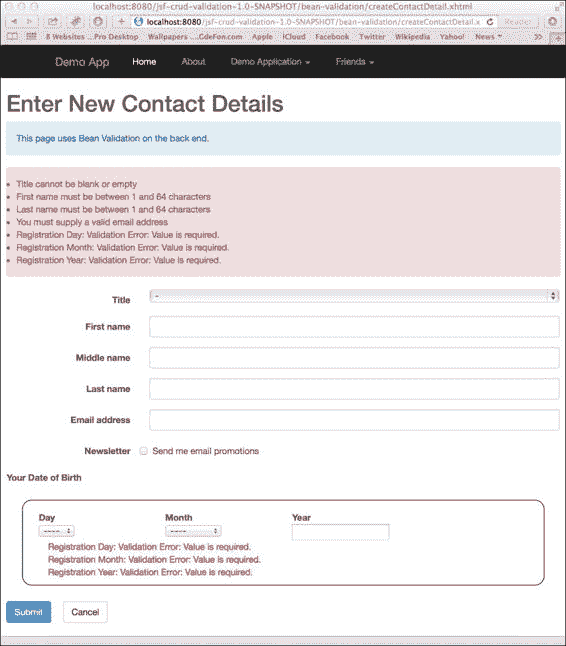
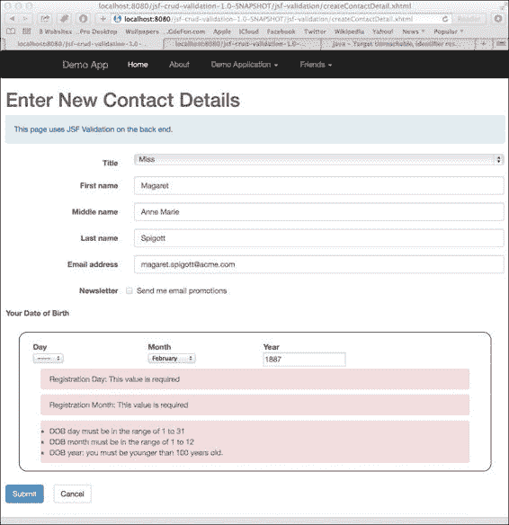
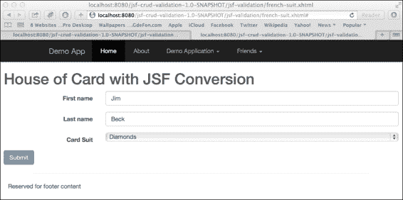
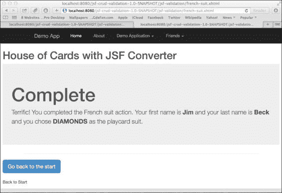
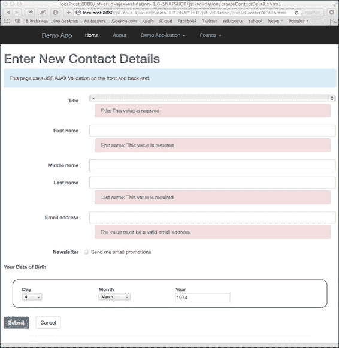
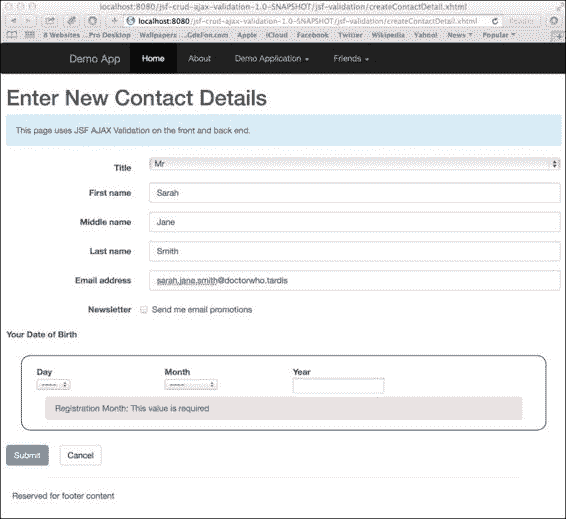
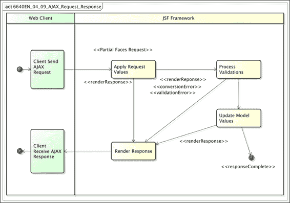
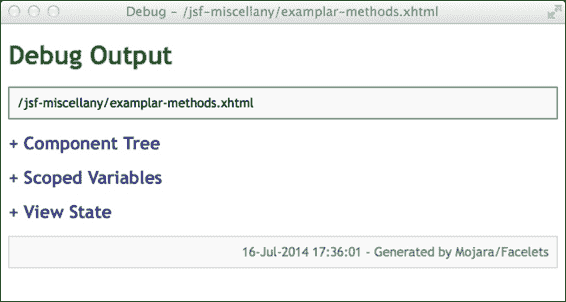

# 第四章. JSF 验证和 AJAX

|   | *"直到完成，这似乎总是不可能的。" |   |
| --- | --- | --- |
|   | --*纳尔逊·曼德拉* |

到目前为止，我们已经创建了一个数字客户旅程，实现了常见的创建、检索、更新和删除，即著名的 CRUD 需求。这些结果对利益相关者和产品所有者都有吸引力，但我们的团队成员的用户对表单不满意，因为它缺乏验证公众成员数据输入的能力。

当我们思考时，验证对用户很重要，因为是他们正在输入网络应用程序中的数据。它节省了用户的时间和挫败感，因为他们知道他们在输入数据时输入是错误的。它避免了数据库管理员因错误提交数据而产生的成本。验证提高了在互联网上 24/7 工作的网络应用程序的效率。随着我们日常生活中的更多活动依赖于传统服务的数字化，电子商务现在成为了一种必需品；我们有必要在正确的时间向公众提供正确的信息，即在销售点或捕获点。

# 验证方法

在本章中，以基本的 JSF 表单为基础，我们将学习如何在服务器端和客户端应用验证。这两种策略都有一定的优势；我们将了解这两种方法的优缺点。

## 服务器端验证

在 Java EE 应用程序中，可以在运行在应用服务器或 servlet 容器上的服务器端实现表单验证。信息以正常 HTTP 表单提交的形式从 Web 浏览器发送到 Web 应用程序。在这种模式下，表单作为传统的 HTML 表单元素提交。在这种情况下，Java EE 框架验证输入并向客户端发送响应。如果表单验证失败，包含 Web 表单的页面将被重新显示，并显示错误消息。

服务器端快速验证在安全方面是可靠的，因为它即使在 Web 浏览器中禁用或不可用时也会保护数据库。另一方面，这种验证需要客户端到服务器端的往返。用户在提交表单之前不会得到关于表单数据的反馈。

规则似乎总有例外。如果使用 AJAX 提交服务器端表单验证，那么我们可以绕过缓慢的响应。AJAX 验证是一个很好的折衷方案，因为表单可以在用户在表单上输入数据时进行验证。另一方面，AJAX 需要在 Web 浏览器中启用 JavaScript。

## 客户端验证

我们团队中的用户体验人员真的很喜欢客户端验证，但这种验证类型需要在浏览器（或等效的动态脚本技术）中存在 JavaScript。客户端验证提供了更响应和丰富的用户与表单的交互。

客户端验证确保在用户被允许提交表单之前，表单始终是正确的。由于 JavaScript 是一种渐进式语言，有许多方法可以通知用户如何更好地与表单提交过程交互。例如 jQuery 这样的技术允许程序员在用户输入数据时实时添加提示和验证错误消息。

在某些情况下，JavaScript 在浏览器中可能被禁用或不可用。我可以想到政府安全部门或专业中心，这些地方沙盒是严格控制的。当用户或设备管理员关闭 JavaScript 时，客户端验证肯定会失败，用户能够绕过验证。

### 小贴士

**结合客户端和服务器端验证**

在面向企业的专业应用中，我强烈建议您结合两种验证方法，以获得两者的最佳效果。客户端验证提供了更快、更丰富的体验，而服务器端验证则保护您的数据和数据库免受不良数据和黑客攻击。

在我们讨论验证的技术主题之前，我们必须了解消息在 JSF 中的表示方式。

# Faces 消息

JSF 提供了两个自定义标签来显示错误消息。`<h:message>`标签显示绑定到特定组件的消息。`<h:messages>`标签显示未绑定到特定组件的消息。

我们在第三章中看到了`<h:message>`的第一个使用，*构建 JSF 表单*。该标签通常与表单控件相关联。我们可以使用以下方式向我们的 JSF 页面添加消息：

```java
<h:messages globalOnly="false" styleClass="alert alert-danger" />
```

标签被添加到内容顶部。属性`globalStyle`是一个布尔值，它指定标签是否应显示与组件无关的消息。在这里，我们再次使用 Bootstrap CSS 选择器。

以下是一个表格，列出了 JSF 标签`<h:messages>`和`<h:message>`之间共享的属性：

| 属性 | 描述 |
| --- | --- |
| `Id` | 指定唯一标识符 |
| `errorClass` | 指定错误消息的 CSS 类选择器 |
| `errorStyle` | 指定错误消息的样式 |
| `infoClass` | 指定信息消息的 CSS 类选择器 |
| `infoStyle` | 指定信息消息的 CSS 样式 |
| `for` | 指定与消息关联的组件 |
| `rendered` | 设置一个布尔值以指定标签是否渲染到页面 |
| `style` | 定义所有消息类型的 CSS 选择器 |
| `styleClass` | 定义所有消息类型的 CSS 样式 |

在幕后，这些标签分别渲染了`javax.faces(HtmlMessages)`和`javax.faces(HtmlMessages)`组件的内容，而这些组件又依赖于`javax.faces.application.FacesMessage`元素的列表集合。作为一个 JSF 数字开发者，我们不必太担心日常的`HtmlMessage`和`HtmlMessages`组件，因为它们位于引擎盖下。如果我们从事编写新的 JSF 渲染器或扩展的工作，那么我们就必须查看 Javadoc 和 JSF 规范。

在第三章中，*构建 JSF 表单*，你被介绍到`FacesMessage`应用程序，用于创建 JSF CRUD 风格表单。在控制器中，我们可以创建一个与表单中任何`UIComponent`无关的验证错误消息。因此，这个验证错误只能通过全局错误消息访问。以下是一个生成此类验证错误的代码示例：

```java
  public void findContactById() {
    if (id <= 0) {
      String message = "Bad request. Please use a link from within the system.";
      FacesContext.getCurrentInstance().addMessage(null, new FacesMessage(FacesMessage.SEVERITY_ERROR, message, null));
      return;
    }
    /* ... */
  }
```

`FacesMessage`对象代表一个具有严重级别的验证消息。我们将其添加到`FacesContext`对象中。`FacesMessage`构造函数的形式如下：

```java
public FacesMessage(Severity severity, String summary, String detail)
```

严重性可以是`FaceMessages`类中定义的四个静态常量之一，这些常量分别是`SEVERITY_INFO`、`SEVERITY_WARNING`、`SEVERITY_ERROR`和`SEVERITY_FATAL`。这些值实际上是私有内部类`Severity`的实例化，不幸的是，这个类在封装类外部不可访问，因此我们可以发明我们自己的严重性级别。

Faces 消息还需要消息摘要，以及可选的无效消息的详细信息。

`javax.faces.context.FacesContext`是当前传入请求和潜在响应的聚合持有者。对象实例在初始 JSF 传入请求（Faces 请求）时实例化，并且它将一直存活，直到后续的 JSF `release()`方法被触发，这通常在框架的深处。`FacesContext`是添加`FacesMessage`的地方，也是检索消息列表集合的地方。

`FacesContext`有几个有趣的方法，包括`isValidationFailed()`，这个方法在 JSF 生命周期早期检测任何验证失败非常有用。我们将在稍后的 Bean Validation 示例中看到这个调用的例子。还有其他方法，例如使用`getViewRoot()`获取视图根，`getCurrentPhaseId()`获取 JSF 生命周期中的当前阶段，以及`getRenderKit()`检索渲染套件。使用`isPostback()`方法，我们可以找出请求是否是 HTML 表单，以及 JSF 框架是否即将将数据发送回同一表单。上下文对象还有很多其他功能。

将 faces 消息添加到上下文的方法如下：

```java
public abstract void addMessage(String clientId, FacesMessage message);
```

如果`clientId`属性为 null，则消息是全局可用的消息，并且与任何视图组件无关。

现在我们已经了解了如何生成 JSF 特定的消息，让我们深入了解 JSF 应用程序的验证。

# 验证

在服务器端实现验证主要有两种方式。一种途径是遵循 Java EE 7 规范中 Bean Validation 1.1 版本的使用，另一种传统途径是通过 JSF 验证。

## 使用 Bean Validation 限制表单内容

Bean Validation 是一种规范，允许开发者对 POJOs 和实体豆进行注解，然后调用自定义验证器实例来验证属性。验证框架与 Java 注解一起工作，因此数字工程师可以明确地说一个属性或甚至一个方法是如何被验证的。

我在 *Java EE 7 开发者手册* 中专门用了一章来介绍 Bean Validation；尽管如此，我仍将在本数字网络应用程序书中与您一起简要介绍基础知识。Bean Validation 1.1 标准中有几个注解您可以直接使用。然而，如果您的平台允许或您决定添加 Hibernate Validator，那么还有更多有用的验证注解可供使用。开发者还可以创建自定义验证。 

让我们再次使用 `ContactDetail` 实体，但这次我们在属性中添加了 Bean Validation 注解，如下所示：

```java
package uk.co.xenonique.digital;
import javax.persistence.*;
import javax.validation.constraints.*;
import java.util.Date;

@Entity @Table(name="CONTACT")
/* ... */
public class ContactDetail {
  @Id /* ... */ private long id;

  @NotNull(message = "{contactDetail.title.notNull}")
  private String title;

  @Size(min = 1, max = 64,
        message = "{contactDetail.firstName.size}")
  private String firstName;

  private String middleName;

  @Size(min = 1, max = 64,
        message = "{contactDetail.lastName.size}")
  private String lastName;

  @Pattern(regexp =
      "^[_A-Za-z0-9-\\+]+(\\.[_A-Za-z0-9-]+)*@"
      + "[A-Za-z0-9-]+(\\.[A-Za-z0-9]+)*(\\.[A-Za-z]{2,})$",
      message = "{contactDetail.email.pattern}")
  private String email;

  @NotNull( message = "{contactDetail.dob.notNull}")
  @Temporal(TemporalType.DATE)
  @Past( message="{contactDetail.dob.past}" )
  private Date dob;

  /* ... as before ... */
}
```

我们向 `ContactDetail` 实体的属性中添加了 `@Pattern`、`@Past`、`@NotNull` 和 `@Size` 注解。这些注解可以在 Java 包 `javax.validation.constraints` 中找到，为 Bean Validation 保留。

以下是一个重要的 Bean Validation 注解表：

| 约束名称 | 描述 | 允许类型 |
| --- | --- | --- |
| `@Null` | 指定元素必须是一个 null 引用指针。 | 任何 |
| `@NotNull` | 指定元素必须不是一个 null 引用指针。 | 任何 |
| `@Min` | 指定元素必须是一个数值，该数值大于或等于提供的最小值。由于浮点数四舍五入错误，不支持 float 和 double。 | `BigDecimal, BigInteger, byte, short, int, 和 long` |
| `@Max` | 指定元素必须是一个数值，该数值小于或等于提供的最小值。由于浮点数四舍五入错误，不支持 float 和 double。 | `BigDecimal, BigInteger, byte, short, int, 和 long` |
| `@DecimalMin` | 与 `@Min` 类似，但增加了将值设置为字符串参数的能力。数值必须大于或等于提供的值。FP 限制也适用于此处。 | `BigDecimal, BigInteger,` `CharSequence, byte, short, int, 和 long` |
| `@DecimalMax` | 与 `@Max` 类似，但增加了将值设置为字符串参数的能力。数值必须小于或等于提供的值。FP 限制也适用于此处。 | `BigDecimal, BigInteger,` `CharSequence, byte, short, int, 和 long` |
| `@Size` | 元素的大小必须在提供的包含边界限制内。 | `CharSequence, Collection, Map 和原始数组` |
| `@Past` | 元素必须是 Java 虚拟机当前时间的过去日期。 | `java.util.Date 和 java.util.Calendar` |
| `@Future` | 元素必须是 Java 虚拟机当前时间的未来日期。 | `java.util.Date 和 java.util.Calendar` |
| `@Pattern` | 元素必须匹配一个符合 Java 习惯的提供的正则表达式模式。 | `CharSequence` |

Bean Validation 注解通常接受一个消息属性，这是用户的验证消息，或者它可以是括号中的值，这是验证框架从 `java.util.ResourceBundle` 中搜索消息的触发器。某些注解如 `@Min`、`@Max`、`@DecimalMin` 和 `@DecimalMax` 有额外的属性如 `min` 和 `max` 来指定明显的边界。

我们可以在具有验证消息的属性上定义一个 `@NotNull` 约束，如下所示：

```java
@NotNull( message = "The office reference must not be null")
private String officeReference;
```

这是一种好的方法，可能适用于原型设计一个网站；但正如我们从软件考古学知识中了解的那样，这可能会成为一个维护噩梦，因为我们正在将数字副本直接写入 Java 代码中。将文本副本写入属性文件中，该文件可以被标准 `ResourceBundle` 捕获，这对于 Bean Validation 来说是更好的选择。我们的驻场数字策略师和文案专家珍妮会感谢我们发送给她属性文件而不是 Java 源代码。

因此，让我们将此属性上的约束重写如下：

```java
@NotNull( message = "{mydataform.officeReference.notNull}")
private String officeReference;
```

通过将消息放置在特定位置，Bean Validation 可以与 JSF 集成。程序员只需在 `WEB-INF/classes` 文件夹中创建一个 `ValidationMessages.properties` 文件。

以下是为 `ContactDetail` 实体消息属性文件的摘录：

```java
contactDetail.title.notNull = Title cannot be blank or empty
contactDetail.firstName.size = First name must be between {min} and {max} characters
contactDetail.middleName.size = Middle name must be between {min} and {max} characters
contactDetail.lastName.size = Last name must be between {min} and {max} characters
contactDetail.email.pattern = You must supply a valid email address
contactDetail.dob.past=Your Date of Birth must be in the past
```

使用 Bean Validation，我们可以添加用花括号表示的占位符，以丰富用户将看到的消息。占位符是特定的，如 `{min}` 和 `{max}`。属性文件的另一个优点是 JDK 中的 `ResourceBundle` 已经处理了不同区域设置的国际化难题。

仅依赖 JSF 的 Bean Validation 存在很大的缺点。它对于保护数据库免受错误输入数据的影响非常出色，并且由于数字开发者几乎免费获得的 Java EE 7 应用服务器，验证在每条记录之前都会添加或修改到数据库中。然而，Bean Validation 与 JSF 前端没有任何关联。框架与页面作者的內容没有任何关联。在当今的软件工程中，我们也不希望表现层和模型层之间存在这种依赖关系。面向对象编程的最佳实践之一是 SOLID 原则。我们当然希望各层只为一个目的负责；易于扩展，但封闭于修改，最重要的是，防止随着时间的推移导致软件技术债务的抽象泄漏。

仅依赖 Bean Validation 的另一个缺点是，数据的验证完全依赖于 Java 数字工程师的技能。这意味着页面作者或设计师无法创新、编辑或删除验证，以实现更好的以用户为中心的体验。

Bean Validation 对于在应用程序逻辑中添加验证非常出色。如果您有业务需求，可以确保联系详情的标题永远不会为空。可以实现对属性进行复杂和分组验证。有关更多详细信息，请参阅我的书籍《Java EE 7 开发者手册》。

以下截图显示了来自书籍源代码的 `bean-validation`/`createContactDetail.xhtml` 的实际应用。截图显示了当用户仅提交未填写的表单时会发生什么：



联系详情应用程序上的 Bean Validation 捕获图

具有设置 `globalStyle=true` 的 `<h:messages>` 标签显示了框架在 `ContactDetail` 实体中发现的验证消息输出。

## 使用 JSF 验证用户输入

JSF 自 2004 年推出以来就始终拥有一个验证框架。这是将 JSF 与当时没有内置验证支持的 Apache Struts 实际上使用的 Web 框架区分开来的特性。

记住，转换和验证发生在 JavaServer Faces 生命周期的不同阶段（请参阅第二章中的图表，“JavaServer Faces 生命周期”，“执行和渲染生命周期”部分）。作为提醒，JSF 将在“应用请求值”阶段设置组件中的值，然后根据需要使用各种转换将输入字符串值转换为目标对象。验证发生在“处理验证”阶段，并且这个生命周期是按设计顺序进行的。为了将 HTML 请求中的输入数据转换为输入数据，JSF 尝试并检查是否可以在后端 bean 中设置参数。更新模型值阶段跟在早期阶段之后。如果在生命周期中发生验证或转换错误，则它实际上会被缩短。JSF 直接进入“渲染响应”阶段，并将后端 bean 中的属性转换为字符串，以便 Web 客户端可以显示它们。

JSF 提供了一组预构建的验证器标签，您可以将它们应用于标记页面，第三章中给出了核心 JSF 自定义标签表，*构建 JSF 表单*。以下是一些示例：`<f:validateDoubleRange>`，`<f:validateLength>`，`<f:validateLongRange>`，`<f:validateRegex>` 和 `<f:validateRequired>`。

我们可以将这些标签应用于联系详情 CRUD 示例。因此，让我们从 `createContact.xhtml` 页面开始。以下是页面上的一个简短摘录：

```java
<h:form id="createContactDetail"
  styleClass="form-horizontal" p:role="form">
  <div class="form-group">
    <h:outputLabel for="title" class="col-sm-3 control-label">
      Title</h:outputLabel>
    <div class="col-sm-9">
      <h:selectOneMenu class="form-control"
         label="Title" id="title"
         value="#{contactDetailControllerBV.contactDetail.title}">
        <f:selectItem itemLabel="-" itemValue="" />
        <f:selectItem itemValue="Mr" />
        <f:selectItem itemValue="Mrs" />
        <f:selectItem itemValue="Miss" />
        <f:selectItem itemValue="Ms" />
        <f:selectItem itemValue="Dr" />
        <f:validateRequired/>
      </h:selectOneMenu>
      <h:message for="title" styleClass="alert validation-error"/>
    </div>
  </div>
  <div class="form-group">
    <h:outputLabel for="firstName" class="col-sm-3 control-label">
      First name</h:outputLabel>
    <div class="col-sm-9">
      <h:inputText class="form-control" label="First name"
       value="#{contactDetailControllerBV.contactDetail.firstName}"
       id="firstName" placeholder="First name">
          <f:validateRequired/>
          <f:validateLength maximum="64" />
      </h:inputText>
      <h:message for="firstName" styleClass="alert validation-error"/>
    </div>
  </div>
  <!-- . . . -->
  <div class="form-group">
    <h:outputLabel for="email" class="col-sm-3 control-label">Email address
    </h:outputLabel>
    <div class="col-sm-9">
      <h:inputText type="email"
       label="Email" class="form-control" id="email"
       value="#{contactDetailControllerBV.contactDetail.email}"
       placeholder="Enter email">
          <f:validateRequired/>
          <f:validateLength maximum="64" />
      </h:inputText>
      <h:message for="email" styleClass="alert validation-error"/>
    </div>
  </div>
  <!-- . . . -->

  <label class="control-label"> Your Date of Birth</label>
  <!-- . . . -->
  <div class="row  my-group-border">
    <div class="col-sm-12">
      <h:message for="dobDay" styleClass="alert validation-error"/>
    </div>
    <div class="col-sm-12">
      <h:message for="dobMonth" styleClass="alert validation-error"/>
    </div>
    <div class="col-sm-12">
      <h:message for="dobYear" styleClass="alert validation-error"/>
    </div>
  </div>
</h:form>
```

我们将 `<f:validateRequired>`，`<f:validateLength>` 和 `<f:validateLongRange>` 标签放置在 JSF HTML 渲染标签（如 `<h:inputText>` 和 `<h:selectOneMenu>`）的正文内容中。`validateLength` 标签验证字符串属性的长度。该标签接受一个最大参数，但也可以接受一个最小属性。

我们还在其相应的 HTML 输入字段附近添加了 `<h:message>` 标签。`styleClass` 属性指定了一个自定义 CSS 选择器，该选择器将验证消息强制显示在单独的新行上。此 CSS 看起来如下所示：

```java
.validation-error {
    display: block;
    margin: 5px 15px 5px 15px;
    padding: 8px 15px 8px 15px;
    color: #a94442;
    background-color: #f2dede;
    border-color: #ebccd1;
}
```

为了避免将 JSF 糖化名称（如 `<jsf_form>:<form_property_name>`）添加到验证错误消息中，这会导致结果如“contactDetail:title -验证错误：值是必需的”，我们为每个 HTML 渲染标签指定了标签属性。标题输入字段有一个设置 `label="Title"` 的属性。

`<f:validateLongRange>` 标签检查字符串的实际内容是否在最小和最大属性之间是一个数值。我们在 `出生日期` 字段中使用此标签。

以下是从 DOB 组中天字段的编写摘录：

```java
  <h:selectOneMenu id="dobDay"
    value="#{contactDetailControllerBV.dobDay}"
      label="Registration Day">
      <f:selectItem itemLabel="----"  itemValue=""/>
      <f:selectItems
        value="#{contactDetailControllerBV.daysOfTheMonth}"
        var="day"
       itemLabel="#{day}" itemValue="#{day}" />
      <f:validateRequired/>
      <f:validateLongRange minimum="1" maximum="31" />
  </h:selectOneMenu>
```

前面的代码演示了 `<f:validateLongRange>` 标签如何强制在表单中执行月份字段。我们对其他出生日期字段重复此操作。

`<f:validateRegex>` 标签将输入属性字符串与正则表达式匹配。我们使用这个标签来验证 `email` 属性。以下是对这个验证检查的代码：

```java
  <div class="col-sm-9">
    <h:inputText type="email"
     label="Email" class="form-control" id="email"
     value="#{contactDetailControllerBV.contactDetail.email}"
     placeholder="Enter email">
      <f:validateRequired/>
      <f:validateLength maximum="64" />
      <f:validateRegex pattern="^[_A-Za-z0-9-\+]+(\.[_A-Za-z0-9-]+)*@[A-Za-z0-9-]+(\.[A-Za-z0-9]+)*(\.[A-Za-z]{2,})$" />
    </h:inputText>
    <h:message for="email" styleClass="alert validation-error"/>
  </div>
```

值得注意的是，强制模式属性值，正则表达式，几乎与 Bean Validation `@Pattern`中的完全相同。我们不得不将双反斜杠字符转换为单反斜杠，因为在正常的正则表达式中我们不需要转义字面量，在 Java 代码中也没有设置。

以下是对页面 `jsf-validation`/`createContactDetail.xhtml` 的截图：


展示 JSF 内置验证规则的截图

### 自定义 JSF 验证

如果你玩过源代码并运行了示例，我敢打赌你会注意到 JSF 验证中的一些明显问题。例如，当 `email` 字段有一个不是有效电子邮件地址的值时，你会看到一个像这样的验证消息：

```java
Regex pattern of '^[_A-Za-z0-9-\\+]+(\\.[_A-Za-z0-9-]+)*@[A-Za-z0-9-]+(\\.[A-Za-z0-9]+)*(\\.[A-Za-z]{2,})$' not matched
```

显然，这个非常详细的应用程序消息违反了以用户为中心的设计和清晰的语言。我们能用 JSF 做些什么来避免这些消息？

可以应用于输入字段（如 `<h:inputText>` 和 `<h:selectOneMenu>`）的 HTML 渲染标签有三个属性。以下表格显示了可以帮助自定义 JSF 验证消息的属性：

| 属性 | 描述 |
| --- | --- |
| `requiredMessage` | 定义了一个基于值的表达式，如果字段是必需的，它将被用作消息文本。 |
| `validatorMessage` | 定义了一个基于值的表达式，如果字段和属性验证失败，它将被用作验证文本。 |
| `conversionMessage` | 定义了一个基于值的表达式，如果字段可以转换为目标类型，它将被用作消息。 |

根据这些信息，我们可以通过将 `requiredMessage` 属性应用于我们的字段来轻松解决消息问题：

```java
<h:inputText type="email"
   label="Email" class="form-control" id="email"
   value="#{contactDetailControllerBV.contactDetail.email}"
   validatorMessage="Value must be in the format of an email address"
   converterMessage="Value should be in the format in an email address"
   placeholder="Enter email">
  <f:validateRequired/>
  <f:validateLength maximum="64" />
  <f:validateRegex pattern=". . ." />
</h:inputText>
```

`requiredMessage`、`validatorMessage` 和 `conversionMessage` 会覆盖服务器端 JSF 验证器设置的任何消息。请注意，这些属性可以接受值表达式。这对页面作者来说是一个很好的方法来指定方法。然而，在另一边，我们的电子邮件地址字段有两个验证约束，一个是正则表达式检查，另一个是字段长度约束。对于 `validateLength`，这个消息并不合适。所以如果我们使用这种方法来使用多个类型的验证器，我们就会遇到问题。

我们还可以采取另一种方法。在 JSF 框架中全局覆盖验证消息怎么样？我们可以配置我们自己的 JSF 验证器消息版本。为了实现这个目标，首先，我们使用有关加载这些消息的位置的信息来配置框架。我们在 `WEB-INF/faces-config.xml` 文件中设置了一个消息包，如下所示：

```java
<?xml version="1.0" encoding="UTF-8"?>
<faces-config 

    xsi:schemaLocation="http://xmlns.jcp.org/xml/ns/javaee
    http://xmlns.jcp.org/xml/ns/javaee/web-facesconfig_2_2.xsd"
    version="2.2">
  <application>
      <message-bundle>
          uk.co.xenonique.digital.JSFVMessages
      </message-bundle>
  </application>
</faces-config>
```

此配置文件定义了应用程序的 Faces 资源，在这里我们可以配置一个引用属性文件的消息包。属性文件的路径实际上是 `uk/co/xenonique/digital/JSFVMessages.properties`，您可以在项目资源 `ch04/jsf-crud-validation/src/main/resources` 中找到。

其次，我们提供自己的消息包文件。此属性文件 `JSFVMessages.properties` 的内容仅仅是以下属性定义：

```java
javax.faces.validator.RegexValidator.NOT_MATCHED = Input value does not conform to according expected format.
javax.faces.validator.RegexValidator.PATTERN_NOT_SET = A pattern must be set for validate.
javax.faces.validator.RegexValidator.MATCH_EXCEPTION = The pattern is not a valid regular expression.
javax.faces.validator.LengthValidator.MAXIMUM = {1}: This field can accept up to ''{0}'' characters long.
javax.faces.validator.LengthValidator.MINIMUM = {1}: This field must have at least ''{0}'' characters long.

javax.faces.validator.LongRangeValidator.MAXIMUM = {1}: This value must be less than or equal to ''{0}''
javax.faces.validator.LongRangeValidator.MINIMUM = {1}: This value must be greater than or equal to ''{0}''
javax.faces.validator.LongRangeValidator.NOT_IN_RANGE = {2}: This value must be between of {0} and {1} inclusive.
javax.faces.validator.LongRangeValidator.TYPE = {0}: Unable to convert this value to a decimal number.

javax.faces.component.UIInput.REQUIRED = {0}: This value is required

```

如您所见，我们已覆盖属性 `RegexValidator.NOT_MATCHED` 以提供新的消息。原始定义位于应用程序服务器或捆绑包中的 JAR 文件中，作为您的 servlet 容器中的第三方 JAR。这些定义可以在 JAR 包（`jsf-api-2.2.jar`）的 `javax/faces/Messages.properties` 文件中找到。

正则表达式验证器的原始定义如下所示：

```java
javax.faces.validator.RegexValidator.NOT_MATCHED = {1}: Validation Error: Value not according to pattern ''{0}''
javax.faces.validator.RegexValidator.PATTERN_NOT_SET = A pattern must be set for validate.
javax.faces.validator.RegexValidator.MATCH_EXCEPTION = The pattern is not a valid regular expression.
javax.faces.validator.LengthValidator.MAXIMUM = {1}: Validation Error: Length is greater than allowable maximum of ''{0}''
javax.faces.validator.LengthValidator.MINIMUM = {1}: Validation Error: Length is less than allowable minimum of ''{0}''

javax.faces.validator.LongRangeValidator.MAXIMUM = {1}: Validation Error: Value is greater than allowable maximum of ''{0}''
javax.faces.validator.LongRangeValidator.MINIMUM = {1}: Validation Error: Value is less than allowable minimum of ''{0}''
javax.faces.validator.LongRangeValidator.NOT_IN_RANGE = {2}: Validation Error: Specified attribute is not between the expected values of {0} and {1}.
javax.faces.validator.LongRangeValidator.TYPE = {0}: Validation Error: Value is not of the correct type.

```

您可以在源代码中检查此文件，地址为 [`svn.apache.org/repos/asf/myfaces/core/branches/2.0.x/api/src/main/resources/javax/faces/Messages.properties`](http://svn.apache.org/repos/asf/myfaces/core/branches/2.0.x/api/src/main/resources/javax/faces/Messages.properties)。如您所见，它们相当技术性且对用户不友好。消息包中的许多属性定义都接受参数的占位符。`NOT_MATCHED` 接受两个参数：第一个参数 `{0}` 是模式，第二个参数 `{1}` 是输入字段的标签。

### 注意

在 Java EE 7 中，JSF 验证中参数化的占位符与 Bean Validation 框架中的不同。JSF 使用整数索引，而 Bean Validation 可以使用命名占位符。

在编写本文时，JSF 验证器的参考实现中存在一个错误，这阻止了开发人员在使用消息属性中的某些占位符时使用。我们本希望有一个这样的属性定义：

```java
javax.faces.validator.RegexValidator.NOT_MATCHED = Input value {1} does not conform to according expected format.
```

可惜，当前 Mojarra 中的错误阻止我们将此代码作为生产代码编写。

有一种替代策略可以自定义 JSF 验证。我们可以定义自己的验证器来扩展框架的功能。

### 自定义验证方法

JSF 允许数字工程师在管理器控制器中配置一个方法，该方法将在验证字段时被调用。将属性验证器添加到 HTML 渲染标签中实现了这一策略，并且它是一个值表达式。

以下是将自定义验证方法添加到联系详情表单的 `emailAddress` 属性的方法：

```java
  <h:inputText type="email"
   label="Email" class="form-control" id="email"
   value="#{contactDetailControllerBV.contactDetail.email}"
   validator="#{contactDetailControllerJV.validateEmailAddress}"
   placeholder="Enter email">
      <f:validateRequired/>
  </h:inputText>
```

属性验证器引用修改后的 `ContactDetailControllerJV` 实例中的 `validateEmailAddress()` 方法。此方法如下所示：

```java
public void validateEmailAddress(
    FacesContext context, UIComponent component, Object value) {
    String text = value.toString();
    if ( text.length() > 64 ) {
      throw new ValidatorException(
        new FacesMessage(
          FacesMessage.SEVERITY_ERROR,
          "The value must be less than 64 chars long.", null));
    }
    final String REGEX =
        "^[_A-Za-z0-9-\\+]+(\\.[_A-Za-z0-9-]+)*@"
        + "[A-Za-z0-9-]+(\\.[A-Za-z0-9]+)*(\\.[A-Za-z]{2,})$";
    Pattern pattern = Pattern.compile(REGEX);
    Matcher matcher = pattern.matcher(text);
    if ( !matcher.matches() ) {
      throw new ValidatorException(
        new FacesMessage(
          FacesMessage.SEVERITY_ERROR,
          "The value must be a valid email address.", null));
    }
}
```

在前面的方法 `validateEmailAddress()` 中，传入的参数是 `FacesContext`，正在验证的组件类型为 UIComponent，待检查的待定值类型为 Object。此方法验证两个约束：检查字段长度不要太长，并且该字段是电子邮件地址。我们使用 JDK 标准库 `javax.regex` 包来完成此操作。为了断言验证错误（如果有），我们创建 `FacesMessage` 对象并将它们添加到当前的 `FacesContext` 实例中。

### 定义自定义验证器

在控制器或 CDI 命名 bean 中编写验证器是一种有用的策略。然而，缺点是您始终需要在您的应用程序中有一个间接的 POJO。还有一种策略，JSF 允许我们定义集成在框架内的自定义验证器。开发者可以选择编写一个使用 `javax.faces.validator.FacesValidator` 注解声明的 POJO。该 POJO 必须实现 `javax.faces.validator.Validator` 接口。

让我们把电子邮件地址检查代码移入一个自定义验证器。`FacesEmailAddressValidator` 的代码如下：

```java
package uk.co.xenonique.digital;
import javax.faces.application.FacesMessage;
import javax.faces.component.UIComponent;
import javax.faces.context.FacesContext;
import javax.faces.validator.*;
import java.util.regex.*;

@FacesValidator("emailValidator")
public class FacesEmailAddressValidator implements Validator {
  public static final String EMAIL_REGEX =
    "^[_A-Za-z0-9-\\+]+(\\.[_A-Za-z0-9-]+)*@"
  + "[A-Za-z0-9-]+(\\.[A-Za-z0-9]+)*(\\.[A-Za-z]{2,})$";

  @Override
  public void validate(FacesContext context,
    UIComponent component, Object value)
    throws ValidatorException
  {
    String text = value.toString();
    Pattern pattern = Pattern.compile(EMAIL_REGEX);
    Matcher matcher = pattern.matcher(text);
    if ( !matcher.matches() ) {
      throw new ValidatorException(
        new FacesMessage(
          FacesMessage.SEVERITY_ERROR,        
          "The value must be a valid email address.", null));
    }
  }
}
```

此类使用 `@FacesValidator` 注解，单个参数标识页面视图中验证器的名称。`validate()` 方法实现了验证器接口中的设计约束。JSF 传入 `FacesContext`、与输入值关联的组件以及值本身。

我们将输入值作为文本字符串检索。验证电子邮件地址的正则表达式代码几乎与之前相同，只是消息键不同。错误键是 `{application.emailAddress.pattern}`。

在我们的 POJO 自定义验证器就绪后，我们可以重写页面视图上的 HTML 以使用它。以下是从 `login.xhtml` 的提取视图：

```java
<div class="form-group">
  <h:outputLabel for="email" class="col-sm-3 control-label">
    Email</h:outputLabel>
  <div class="col-sm-6">
    <h:inputText class="form-control" label="Email"
       value="#{loginControllerJV.email}"
       id="email" placeholder="Password"
       validator="emailValidator">
        <f:validateRequired/>
    </h:inputText>
    <h:message for="email" styleClass="alert validation-error"/>
  </div>
</div>
```

唯一的区别是 `<h:inputText>` 元素中的验证器属性。此属性通过名称指定自定义验证器为 `emailValidator`。正如我们所见，我们可以将自定义验证器与默认标准验证器结合使用。仍然有一个 `<f:validateRequired>` 元素。

以下截图显示了 `LoginControllerJV` 的渲染输出：


前端页面视图演示两因素安全登录和验证

### 验证属性组

现在我们已经了解了 JSF 自定义验证器，我们可以编写一个自定义验证器来验证日期出生输入字段组。我们可以实现这个目标，因为 `FacesContext` 已经传入。可以单独查找 UI 组件，与上下文分开。

我们将使用页面视图中的 JSF 绑定技术。绑定有效地在 JSF 值中发布了`javax.faces.component.UIInput`的实例，并在页面的其他地方使其可用。HTML 渲染 JSF 标签上的属性绑定将组件树中的组件引用绑定到作用域变量。以下是与`jsf-validation/createContact.xhtml`代码提取中 JSF 隐藏输入元素相关的 JSF 代码。特别是，请注意代码提取开始处的 JSF 隐藏输入元素。

```java
<label class="control-label"> Your Date of Birth</label>
<h:inputHidden id="aggregateDobHidden"
               label="hiddenField1" value="true">
  <f:validator validatorId="dateOfBirthValidator" />
  <f:attribute name="dob_dotm" value="#{dob_dotm}" />
  <f:attribute name="dob_moty" value="#{dob_moty}" />
  <f:attribute name="dob_year" value="#{dob_year}" />
</h:inputHidden>

<div class="row  my-group-border">
  <div class="col-sm-3">
    <label class="control-label"
      for="dobDay">Day</label>
    <div class="controls">
      <h:selectOneMenu id="dobDay"
         value="#{contactDetailControllerJV.dobDay}"
         binding="#{dob_dotm}"
         label="Registration Day">
        <f:selectItem itemLabel="----"  itemValue=""/>
        <f:selectItems
          value="#{contactDetailControllerJV.daysOfTheMonth}" var="day"
         itemLabel="#{day}" itemValue="#{day}" />
        <f:validateRequired/>
        <f:validateLongRange
          minimum="1" maximum="31" />
      </h:selectOneMenu>
    </div>
  </div>
  <div class="col-sm-3">
    ...
        <h:selectOneMenu id="dobMonth"
          value="#{contactDetailControllerJV.dobMonth}"
           binding="#{dob_moty}"
           label="Registration Month">
          ...
        </h:selectOneMenu>
  </div>
  <div class="col-sm-3">
    ...
        <h:inputText id="dobYear"
          value="#{contactDetailControllerJV.dobYear}"
             binding="#{dob_year}"
             label="Registration Year">
          ...
        </h:inputText>
    </div>
  </div>
  ...
  <div class="col-sm-12">
    <h:message for="aggregateDobHidden"
      styleClass="alert validation-error"/>
  </div>
</div>
```

我们利用一个标识为`aggregateDobHidden`的隐藏字段，具有一个虚拟的表单参数名称`hiddenField1`。它始终发送一个 true 值。`<f:attribute>`元素向这个 UI 组件附加额外的绑定信息。我们需要三个具有名称`dob_dotm`（月份中的日）、`dob_moty`（年份中的月）和`dob_year`的属性。这些属性是相应命名的页面作用域变量`#{dob_dotm}`、`#{dob_moty}`和`#{dob_year}`的值表达式。

我们为每个 JSF 选择组件添加一个绑定属性。再次看看以下第一个字段：

```java
<h:selectOneMenu id="dobDay"
    value="#{contactDetailControllerJV.dobDay}"
   binding="#{dob_dotm}"
```

属性绑定将组件与视图关联，并使其在由字面字符串定义的页面作用域变量`#{dob_dotm}`中可用。这是一个`javax.faces.component.UIInput`类的实例，它有一个`getSubmittedValue()`方法来获取提交的值。我们重复添加其他两个属性的绑定。在表单提交期间，`hiddenField1`记录了每个单独属性的绑定值。这个属性与单独的日、月和年属性不同。

这个绑定技巧允许我们将属性组合在一起进行表单验证。以下源代码显示了服务器端的验证：

```java
package uk.co.xenonique.digital;
import javax.faces.component.*;
import javax.faces.context.FacesContext;
import javax.faces.validator.*;
import java.util.*;

@FacesValidator("dateOfBirthValidator")
public class FacesDateOfBirthValidator implements Validator {
  @Override
  public void validate(FacesContext context,
  UIComponent component, Object value)
  throws ValidatorException {
    UIInput dayComp   = (UIInput)
      component.getAttributes().get("dob_dotm");
    UIInput monthComp = (UIInput)
      component.getAttributes().get("dob_moty");
    UIInput yearComp  = (UIInput)
      component.getAttributes().get("dob_year");

    List<FacesMessage> errors = new ArrayList<>();
    int day = parsePositiveInteger(
      dayComp.getSubmittedValue());
    if ( day < 1 || day > 31 ) {
      errors.add(new FacesMessage(
        FacesMessage.SEVERITY_ERROR,
        "DOB day must be in the range of 1 to 31 ", null));
    }
    int month = parsePositiveInteger(
      monthComp.getSubmittedValue());
    if ( month < 1 || month > 12 ) {
      errors.add(new FacesMessage(
        FacesMessage.SEVERITY_ERROR,
        "DOB month must be in the range of 1 to 12 ", null));
    }

    Calendar cal = Calendar.getInstance();

    cal.setTime(new Date());
    cal.add(Calendar.YEAR, -18);
    Date eighteenBirthday = cal.getTime();

    cal.setTime(new Date());
    cal.add(Calendar.YEAR, -100);
    Date hundredthBirthday = cal.getTime();

    int year = parsePositiveInteger(
      yearComp.getSubmittedValue());
    cal.set(year,month,day);
    Date targetDate = cal.getTime();
    if (targetDate.after(eighteenBirthday) ) {
      errors.add(new FacesMessage(
        FacesMessage.SEVERITY_ERROR,
        "DOB year: you must be 18 years old.", null));
    }
    if ( targetDate.before(hundredthBirthday)) {
      errors.add(new FacesMessage(
        FacesMessage.SEVERITY_ERROR,
        "DOB: you must be younger than 100 years old.", null ));
    }
    if ( !errors.isEmpty()) {
      throw new ValidatorException(errors);
    }
  }

  public int parsePositiveInteger( Object value ) { /*...*/ }
}
```

POJO `FacesDateOfBirthValidator` 验证三个出生日期属性。它使用 JSF 页面视图中的一个技术，称为绑定，我们将在下一分钟看到。绑定允许 JSF 输入属性传播到另一个命名作用域变量，可以在页面的其他地方使用。至于验证器，我们使用 HTML 隐藏元素作为检索这些绑定值的载体。这就是将组件转换为`javax.faces.component.UIInput`并提取值的目的。

```java
UIInput dayComp   = (UIInput)
      component.getAttributes().get("dob_dotm");
int day = parsePositiveInteger(
      dayComp.getSubmittedValue());
```

我们有一个辅助方法`parsePositiveInteger()`，用于将文本值转换为整数。在此之前，我们创建一个列表集合来存储任何错误消息。然后我们验证月份的边界从 1 到 31。对于月份属性，逻辑几乎相同。

对于年份属性，我们采取不同的步骤。使用 JDK Calendar 和 Date 类，我们构建两个 Date 实例：一个代表 100 年前确切的当前日期，另一个代表 18 年前的当前日期。然后我们可以比较用户的输入日期是否落在这两个生日限制之间。

如果在`validate()`方法的末尾有任何错误，则它将引发一个带有错误集合的`ValidatorException`异常。请注意，我们选择使用替代构造函数。

为了完成验证器，辅助方法`parsePositiveInteger()`可以编写如下：

```java
  public int parsePositiveInteger( Object value ) {
    if ( value == null ) return -1;
    try {
        return Integer.parseInt( value.toString().trim());
    }
    catch (NumberFormatException nfe) {
        return -1;
    }
  }
```

以下是一个截图，展示了正在使用的群组验证器的联系详细信息：



生日验证器的截图

## 转换器

标准的 JSF 验证器允许数字开发者实现很多功能。在某些情况下，需求会超出默认行为。转换器是 JSF 类，用于在字符串和对象之间进行转换。类似于注解定义自定义验证器的方式，JSF 允许注册自定义转换器。转换器与一个 JSF 组件相关联。

注解`@java.faces.convert.FacesConverter`表示一个 POJO 是一个自定义 JSF 转换器。此类型必须实现`javax.faces.convert.Converter`接口，该接口具有以下方法：

```java
public Object getAsObject( FacesContext context,
  UIComponent component, String newValue);

public String getAsString( FacesContext context,
  UIComponent component, Object value);
```

`getAsObject()`方法将客户端的字符串表示转换为目标对象。另一个方法`getAsString()`将对象转换为字符串表示，该表示在客户端浏览器中渲染。

我们将用一个将字符串转换为扑克牌花色的自定义 JSF 转换器来举例。我们可以使用简单的 Java 枚举类来编写这个转换器：

```java
public enum FrenchSuit {
    HEARTS, DIAMONDS, CLUBS, SPADES
}
```

以下是为自定义转换器`FrenchSuitConverter`类提供的完整列表：

```java
package uk.co.xenonique.digital;
import javax.faces.application.FacesMessage;
import javax.faces.component.*;
import javax.faces.context.FacesContext;
import javax.faces.convert.*;
import static uk.co.xenonique.digital.FrenchSuit.*;

@FacesConverter("frenchSuitConverter")
public class FrenchSuitConverter implements Converter {
  @Override
  public Object getAsObject(FacesContext context,
    UIComponent component, String value) {
    String text = value.trim();
    if ( text.length() == 0 ) {
      text = ((UIInput)component).getSubmittedValue().toString();
    }
    text = text.toUpperCase();
    switch (text) {
      case "HEARTS": return HEARTS;
      case "DIAMONDS": return DIAMONDS;
      case "CLUBS": return CLUBS;
      case "SPADES": return SPADES;
      default:
        throw new ConverterException(
          new FacesMessage(
            FacesMessage.SEVERITY_ERROR,
            "Unable to convert object to string", null));
    }
  }

  @Override
  public String getAsString(FacesContext context,
    UIComponent component, Object value) {
    if ( value instanceof String ) {
      return value.toString();
    }
    else if ( !(value instanceof FrenchSuit)) {
      throw new ConverterException(
        new FacesMessage(
          FacesMessage.SEVERITY_ERROR,
          "Unable to convert object to string", null));
    }
    switch ((FrenchSuit)value) {
      case HEARTS: return "Hearts";
      case DIAMONDS: return "Diamonds";
      case CLUBS: return "Clubs";
      case SPADES: return "Spades";
    }
    throw new IllegalStateException(
        "PC should never reach here!");
  }
}
```

POJO 是注解了`@FacesConverter`的，其值成为页面视图中的标识符。

JSF 使用文本表示调用`getAsObject()`方法，该文本表示被修剪并转换为大写，以便于比较。在方法开始时，新值可能是空字符串。如果是这样，那么我们从已提交的值中检索文本表示。对于这个特定的转换器，空值的用例是可能的，因此我们添加了保护措施。如果过程中出现任何问题，该方法将引发异常，`javax.faces.convert.ConverterException`。

JSF 调用`getAsString()`方法将对象表示转换为字符串。根据对象类型，该方法针对不同类型的输入进行防御。输入值可能只是一个字符串，或者它可能是`FrenchSuit`枚举的一个实例。如果输入值不是这些之一，该方法将引发`ConverterException`。

在现实世界中，我们知道一副扑克牌中始终有四种花色，因此我们可以相当有信心地保证枚举的可维护性。作为一个数字开发者，你可能不会有这样的奢侈，因此，在转换器和验证器中应用防御性编程原则可以大大有助于追踪错误。

以下是从页面`/jsf-validation/french-suit.xhtml`中摘录的代码，它练习了自定义转换器：

```java
<h:form id="cardForm"
        styleClass="form-horizontal"
        p:role="form">
  ...
  <div class="form-group">
    <h:outputLabel for="suit" class="col-sm-3 control-label">
        Card Suit</h:outputLabel>
    <div class="col-sm-9">
      <h:selectOneMenu class="form-control"
           label="Suit" id="suit"
           value="#{frenchSuitController.suit}" >
        <f:converter converterId="frenchSuitConverter" />
        <f:selectItem itemLabel="-" itemValue="" />
        <f:selectItem itemValue="#{frenchSuitController.suitEnumValue('HEARTS')}" />
        <f:selectItem itemValue="#{frenchSuitController.suitEnumValue('CLUBS')}" />
        <f:selectItem itemValue="#{frenchSuitController.suitEnumValue('DIAMONDS')}" />
        <f:selectItem itemValue="#{frenchSuitController.suitEnumValue('SPADES')}" />
        <f:validateRequired/>
      </h:selectOneMenu>
      <h:message for="suit" styleClass="alert validation-error"/>
    </div>
  </div>

  <h:commandButton styleClass="btn btn-primary"
     action="#{frenchSuitController.doAction()}"
     value="Submit" />
  ...
</h:form>
```

在前面的视图中，我们使用了一个下拉菜单`<h:selectOneMenu>`，允许用户选择一张牌的花色。现在代码应该对你来说非常熟悉了。区别在于每个牌的花色的值表达式，它们都是带有字符串字面量参数的方法调用。表达式语言允许你带有参数调用方法。因此，表达式`#{frenchSuitController.suitEnumValue('HEARTS')}`等价于对控制器的一个方法调用。

在`<h:selectOneMenu>`的体内容中，我们通过一个标识符显式引用自定义转换器，并通过以下方式将其与 UI 组件关联：

```java
<f:converter converterId="frenchSuitConverter" />
```

然后，JSF 调用自定义转换器，将页面视图中的单个`FrenchSuit`枚举转换为字符串。这听起来像是一种绕弯子展示值列表的方法，但这个例子展示了`FrenchSuitConverter`中的`getAsString()`方法被调用。此外，它还说明了如何在页面视图和控制器中以健壮的方式引用 Java 枚举。

现在我们来检查控制器：

```java
package uk.co.xenonique.digital;
import javax.faces.context.Flash;
import javax.faces.context.FacesContext;
import javax.faces.view.ViewScoped;
import javax.inject.Named;

@Named("frenchSuitController")
@ViewScoped
public class FrenchSuitController {
    private String firstName;
    private String lastName;
    private FrenchSuit suit;

    public String doAction() {
        Flash flash = FacesContext.getCurrentInstance().
                getExternalContext().getFlash();
        flash.put("firstName",firstName);
        flash.put("lastName",lastName);
        flash.put("suit", suit);
        return "/jsf-validation/french-suit-complete?redirect=true";
    }

    public String cancel() {
        return "/index.xhtml?redirect=true";
    }

    public FrenchSuit  suitEnumValue( String name ) {
        return FrenchSuit.valueOf(name);
    }

    // Getters and setters omitted
}
```

在这段代码中，我们对`FrenchSuitController`进行了稍微的跳进。首先，让我将你的注意力引到`suitEnumValue()`方法上，它将一个字符串字面量转换为枚举类型`FrenchSuit`。这是一个在页面视图中获取枚举的好用技巧，因为表达式语言不允许直接访问 Java 枚举。它特别适用于随不同项目版本更新而改变的枚举。

`doAction()`和`cancel()`方法返回带有特殊查询参数`redirect=true`的 URI。这是对 JSF 返回可书签 URL 的指令；我们将在本章的后面部分详细讨论这个主题。

在`doAction()`方法中，我们首次使用了 JSF 中的 Flash 作用域。Flash 作用域是一个临时上下文，允许控制器将数据传递给下一个导航视图。请记住，视图作用域仅对导航到同一页面视图的当前控制器有效。当`FacesContext`移动到下一个页面视图时，`@ViewScoped`管理 Bean 将超出作用域。这些方法在`javax.faces.context.Flash`实例中设置键值关联。

最后一个拼图展示了我们如何在页面视图中使用 Flash 作用域。这段代码可以在文件`/jsf-validation/french-suit-complete.xhtml`中找到。以下代码是同一文件的摘录：

```java
<ui:define name="mainContent">
  <h1> House of Card with JSF Validation</h1>
  ...
  <div class="jumbotron">
    <h1> Complete </h1>
    <p>
      Terrific! You completed the French suit action.
      Your first name is <b>#{flash['firstName']}</b> and
      your last name is <b>#{flash['lastName']}</b> and
      you chose <b>#{flash['suit']}</b> as the playcard suit.
    </p>
  </div>
  ...
</ui:define>
```

在此页面视图中，我们使用映射表达式从 Flash 作用域中检索值。表达式`#{flash['suit']}`是用户所选的牌型。读者还被指引查看默认 JSF 转换器`javax.faces.convert.EnumConverter`的文档。在同一个包中，还有其他标准转换器，例如`BigDecimalConverter`、`BigIntegerConverter`、`DateTimeConverter`、`ByteConverter`、`LongConverter`和`DoubleConverter`。

我将把`french-suit.xhtml`表单视图的截图留给你：



JSF 转换器的卡片套件截图

以下是一个截图，显示了`french-suit-complete.xhtml`的最终状态。标记显示从 Bootstrap 的 CSS jumbotron 风格中获得的良好视觉效果。



卡片屋示例提交和验证后的第二屏

我们已经介绍了在服务器端发生的许多验证。现在让我们继续讨论 AJAX 验证。

## 使用 AJAX 立即验证

**异步 JavaScript 和 XML**（**AJAX**）是一组技术，它们共同解决了检索网页部分更新的限制，并提供了一个丰富的交互式用户体验。AJAX 的关键是术语*异步*，它基于一个**万维网联盟**（**W3C**）标准，即`XmlHttpRequest`对象。它在 2006 年的 Internet Explorer 中引入，现在所有现代网络浏览器都支持这个对象。异步模式允许浏览器在单独的连接上向服务器发送数据传输请求；企业后端响应以数据结果响应，通常是 JSON 或 XML。与每次重新加载整个页面相比，这些 AJAX 数据传输通常要小得多。

JSF 内置了对 AJAX 请求和响应的支持；开发者不需要了解`XmlHttpRequest`和 JavaScript 编程的细节，就可以获得即时响应的好处。数字开发者可以从执行 AJAX 交互的默认 JavaScript 库开始。

使用`<f:ajax>`标签在 JSF 中开始 AJAX 非常简单。这个核心 JSF 标签将 AJAX 行为与 UI 组件注册，并用于对字段进行验证。开发者只需将标签放置在代表需要验证的组件的 HTML JSF 标签的正文内容中即可。

以下代码展示了如何在与联系详情应用程序一起使用此标签：

```java
<f:ajax event="blur" render="firstNameError"/>
```

`tag` 属性的事件确定框架何时调用 AJAX 验证。blur 值表示当用户从该组件字段移动到下一个输入字段时发生。因此，当用户在台式计算机上按下 *Tab* 键或在手机或平板电脑上导航 UI 时，验证会立即发生，因为 JavaScript 会向服务器发送 AJAX 请求。第二个属性，render，通知框架如果有的话，将错误消息渲染到特定的 UI 组件中。JSF 接收到 AJAX 响应，如果有错误，它知道要更新验证消息的 HTML 组件 ID。

让我们看看项目 `ch04/jsf-crud-ajax-validation`，这是页面视图 `jsf-validation/createContactDetail.xhtml` 的完整提取：

```java
<h:form id="createContactDetail"
  styleClass="form-horizontal"
  p:role="form">
  <div class="form-group">
    <h:outputLabel for="title" class="col-sm-3 control-label">
        Title</h:outputLabel>
    <div class="col-sm-9">
      <h:selectOneMenu class="form-control"
           label="Title" id="title"
         value="#{contactDetailControllerJV.contactDetail.title}">
        <f:selectItem itemLabel="-" itemValue="" />
        <f:selectItem itemValue="Mr" />
        <f:selectItem itemValue="Mrs" />
        <f:selectItem itemValue="Miss" />
        <f:selectItem itemValue="Ms" />
        <f:selectItem itemValue="Dr" />
        <f:validateRequired/>
        <f:ajax event="blur" render="titleError"/>
      </h:selectOneMenu>
      <h:message id="titleError"
                 for="title" styleClass="alert validation-error"/>
    </div>
  </div>
  <div class="form-group">
    <h:outputLabel for="firstName" class="col-sm-3 control-label">
        First name</h:outputLabel>
    <div class="col-sm-9">
      <h:inputText class="form-control" label="First name"
     value="#{contactDetailControllerJV.contactDetail.firstName}"
       id="firstName" placeholder="First name">
          <f:validateRequired/>
          <f:validateLength maximum="64" />
          <f:ajax event="blur" render="firstNameError"/>
      </h:inputText>
      <h:message id="firstNameError"
          for="firstName" styleClass="alert validation-error"/>
    </div>
  </div>
  <div class="form-group">
    <h:outputLabel for="middleName" class="col-sm-3 control-label">
        Middle name</h:outputLabel>
      ...
  </div>
  <div class="form-group">
    <h:outputLabel for="lastName" class="col-sm-3 control-label">
        Last name</h:outputLabel>
    <div class="col-sm-9">
      <h:inputText class="form-control"
   value="#{contactDetailControllerJV.contactDetail.lastName}"
       label="Last name"
       id="lastName" placeholder="Last name">
          <f:validateRequired/>
          <f:validateLength maximum="64" />
          <f:ajax event="blur" render="lastNameError"/>
      </h:inputText>
      <h:message id="lastNameError"
         for="lastName" styleClass="alert validation-error"/>
    </div>
  </div>
  ...
</h:form>
```

此页面视图表明在 JSF 中向页面添加 AJAX 验证非常简单。`<f:ajax>` 核心 JSF 标签嵌入到相应的 HTML JSF 标签中，如您在姓名和姓氏字段中看到的那样。非 AJAX 和 AJAX 页面之间的另一个区别是为 `<h:message>` 标签添加了标识符，例如 `firstNameError` 和 `lastNameError`。我们需要添加 HTML 标识符元素，以便 JavaScript 可以从浏览器中的 **文档对象模型** (**DOM**) 通过 ID 查找 HTML 元素。

页面除了中间名和新闻通讯 HTML 复选框字段外，所有属性都添加了 AJAX 验证。AJAX 验证也适用于自定义验证器和转换器。

以下截图展示了单属性 AJAX 验证的示例：



展示每个输入字段单独验证的截图

## 验证输入字段组

到目前为止，我们已经看到了 JSF AJAX 验证在单个输入字段实例上的应用。`<f:ajax>` 标签也可以与组件组的验证一起使用。我们可以将标签包围在一个或多个 JSF 输入字段周围，然后 `<f:ajax>` 标签成为 UI 组件的父级。这导致 JSF 将 AJAX 验证应用于多个组件。

让我们在联系详情表单的出生日期字段中添加以下页面视图的组验证：

```java
<h:inputHidden id="aggregateDobHidden"
             label="hiddenField1" value="true">
  <f:validator validatorId="dateOfBirthValidator" />
  <f:attribute name="dob_dotm" value="#{dob_dotm}" />
  <f:attribute name="dob_moty" value="#{dob_moty}" />
  <f:attribute name="dob_year" value="#{dob_year}" />
</h:inputHidden>

<f:ajax event="blur" render="dobDayError dobMonthError dobYearError">
  <div class="row  my-group-border">
    <div class="col-sm-3">
      <label class="control-label" for="dobDay">Day</label>
      <div class="controls">
        <h:selectOneMenu id="dobDay" value="#{contactDetailControllerJV.dobDay}"
                         binding="#{dob_dotm}"
                         label="Registration Day">
          ...                        
        </h:selectOneMenu>
      </div>
    </div>
    <div class="col-sm-3">
      <label class="control-label" for="dobMonth">Month</label>
      <div class="controls">
        <h:selectOneMenu id="dobMonth" value="#{contactDetailControllerJV.dobMonth}"
                         binding="#{dob_moty}"
                         label="Registration Month">
          ...                        
        </h:selectOneMenu>
      </div>
    </div>
    <div class="col-sm-3">
      <label class="control-label" for="dobYear">Year</label>
      <div class="controls">
          ...
      </div>
    </div>
    <div class="col-sm-12">
      <h:message id="dobDayError"
       for="dobDay" styleClass="alert validation-error"/>
    </div>
    <div class="col-sm-12">
      <h:message id="dobMonthError"
       for="dobMonth" styleClass="alert validation-error"/>
    </div>
    <div class="col-sm-12">
      <h:message id="dobYearError"
       for="dobYear" styleClass="alert validation-error"/>
    </div>
    <div class="col-sm-12">
      <h:messages for="aggregateDobHidden"
        styleClass="alert validation-error"/>
    </div>
  </div>
</f:ajax>
```

如您所见，我们用包含的 `<f:ajax>` 标签包围了 DOB 输入字段。事件属性仍然设置为 `blur`。渲染属性设置为特定验证消息的 HTML 元素 ID 列表，即 `dobDayError`、`dobMonthError` 和 `dobYearError`。

`aggregationDobHidden` HTML 隐藏元素与非 AJAX 示例中保持一致，以便说明验证不会干扰自定义验证。

总结一下，使用 `<f:ajaxTag>` 并将其嵌入任何 JSF 组件内部。要验证多个组件组，请将组件用 `<f:ajaxTag>` 包围起来。

以下截图展示了围绕出生日期字段的多个组件 AJAX 验证。年份组件最后获得了浏览器的焦点，因此相应的验证消息描述了 `onblur` DOM JavaScript 事件。同样，在一系列字段之间按 Tab 键会逐个显示错误消息。



以下是出生日期输入字段的分组验证截图

## AJAX 自定义标签深入探讨

了解可以应用于此 Core JSF 自定义标签的属性很有用。以下表格描述了 `<f:ajax>` 的属性。

| 属性 | 描述 |
| --- | --- |
| `delay` | 指定在向服务器发送多个 AJAX 请求之间的延迟（以毫秒为单位）。请求由 JSF 实现排队。将值设置为 none 禁用此功能。 |
| `disabled` | 指定一个布尔值以指示标签状态。如果设置为 true，则 AJAX 行为不会渲染。默认值是 false。 |
| `event` | 定义一个表示 AJAX 动作事件类型的字符串枚举。默认情况下，JSF 确定组件的事件名称。 |
| `execute` | 列出代表在服务器上执行的组件的空格分隔名称集合。值可以是字符串或值表达式。默认值是 `@this`，表示 AJAX 行为的父组件。 |
| `immediate` | 声明一个布尔值，指示输入值是否在 JSF 生命周期早期处理。 |
| `listener` | 指示在广播事件期间将被调用的监听器方法的名称，即 `AjaxBehaviorEvent`。 |
| `onerror` | 指定一个 JavaScript 函数的名称，该函数将接受错误。 |
| `onevent` | 指定一个 JavaScript 函数的名称，该函数将处理 UI 事件。 |
| `render` | 列出在 AJAX 行为完成后将在客户端渲染的 UI 组件集合。此值可以是组件标识符的空格分隔集合，也可以是值表达式。默认值是 `@none`，表示不渲染任何组件。 |

从前面的表中，您会注意到执行和渲染属性可能指示额外的有意义的值。执行属性规定要在服务器上执行的组件。渲染属性确定在 AJAX 行为完成后受影响的 UI 组件。以下表格列出了属性值：

| 值 | 描述 |
| --- | --- |
| `@all` | 指定在视图中执行或渲染所有组件。 |
| `@form` | 指定仅执行或渲染表单的子组件。 |
| `@none` | 指定不执行或渲染任何组件。 |
| `@this` | 指定仅执行或渲染触发 AJAX 请求的当前组件。 |
| `组件标识列表` | 列出了显式执行或作为 AJAX 请求渲染的 UI 组件的标识符。 |
| `表达式语言` | 指定一个值表达式，该表达式最终返回一个字符串集合，表示执行或作为 AJAX 请求-响应渲染的 UI 组件。 |

# 一个部分 JSF 生命周期

JSF 生命周期实际上适用于所有 Faces 请求和响应，包括来自启用 AJAX 的组件产生的请求和响应。在幕后，JSF 为 AJAX 请求和响应实例化一个特殊对象，`javax.faces.context.PartialViewContext`，并将其加入到处理生命周期中。此上下文对象包含允许 JSF 在服务器端更新组件模型的信息。基于部分上下文，JSF 决定是否完成所选 UI 组件的部分处理和/或 UI 组件的部分渲染。部分处理对应于生命周期的 Apply-Requests-Values、Process-Validations 和 Update-Model-Values 阶段。部分渲染指的是 Render-Response 阶段。



部分请求-响应生命周期用于 AJAX 提交

上述图表封装了我们对于 JSF 生命周期中 AJAX 请求和响应的部分上下文的理解。

# 处理视图

在本章中，我们主要检查了使用 JSF 验证用户输入。我们简要地提到了一些关于导航的杂项概念。现在让我们来谈谈处理视图和导航。

## 调用控制器方法

有几种方法可以从页面视图调用控制器并传递参数。在许多数字电子商务应用的情况中，开发者需要检索特定的数据记录、触发服务器端操作或在后端从客户端保存某种状态。

### 参数化方法调用

JSF 允许开发者使用表达式语言将参数传递到页面视图中的方法。在 第三章 中给出的第一个特性，*构建 JSF 表单* 被称为方法表达式调用，它在 JSF 2.0 中引入。

下面的内容是从页面视图 `/jsf-miscellany/examplar-methods.xhtml` 的摘录：

```java
<h:form id="methodExampler"
        styleClass="form-horizontal"
        p:role="form">
  ...
  <div class="form-group">
    <div class="col-sm-9">
    <p>
        Invoke JSF controller with 3 literal arguments
    </p>
    <p class="monospace">
        \#{examplarController.methodThreeArgs(
          'Obiwan','Ben','Kenobi')}
    </p>
    <h:commandButton styleClass="btn btn-primary"
       action="#{examplarController.methodThreeArgs(
         'Obiwan','Ben','Kenobi')}"
       value="Invoke" />
    </div>
  </div>
  ...

</h:form> 
```

上述代码描述了具有操作值表达式的 `<h:commandButton>` 标签，该表达式是 `#{examplarController.methodThreeArgs('Obiwan','Ben','Kenobi')}`。这是一个带有三个字面字符串参数的方法调用。

参数也可以是其他 JSF 范围实例的引用。以下是一个只有两个参数的另一个调用示例，展示了这一点：

```java
  <h:commandButton
    styleClass="btn btn-primary"
    action="#{examplarController.methodTwoArgs(
          examplarController.city, examplarController.country)}"
       value="Invoke" />
```

参数是从控制器 bean 属性动态设置的。现在让我们看看控制器 `ExamplarController`：

```java
@Named("examplarController") @ViewScoped
public class ExamplarController {
  private String city = "London";
  private String country="United Kingdom";

  public String methodOneArg( String alpha ) {
    Flash flash = FacesContext.getCurrentInstance().
      getExternalContext().getFlash();
    flash.put("result",
      String.format("executed methodOneArg(\"%s\")",
        alpha ));
    return "examplar-methods-complete?redirect=true";
  }

  public String methodTwoArgs(
    String alpha, String beta ) {
    Flash flash = FacesContext.getCurrentInstance().
      getExternalContext().getFlash();
    flash.put("result",
      String.format("executed methodTwoArgs(\"%s\", \"%s\")",
      alpha, beta ));
    return "examplar-methods-complete?redirect=true";
  }

  public String methodThreeArgs(
    String alpha, String beta, String gamma ) {
    Flash flash = FacesContext.getCurrentInstance().
      getExternalContext().getFlash();
    flash.put("result",
      String.format("executed methodThreeArgs(\"%s\", \"%s\", \"%s\")",
      alpha, beta, gamma ));
    return "examplar-methods-complete?redirect=true";
  }

  ...
  // Getters and setters omitted
}
```

有三种方法被调用，分别是`methodOneArg()`、`methodTwoArgs()`和`methodThreeArgs()`。这些名称对于可以传递的参数数量是自解释的；每个方法在移动到下一个页面视图`/jsf-miscellany/examplar-methods-complete.xhtml`之前，都会在 JSF Flash 作用域中保存一个输出结果。

以下是从最终状态 Facelet 视图中提取的内容，`exemplar-methods-complete.xhtml`：

```java
<ui:composition template="/basic_layout.xhtml">
  <ui:define name="title">
    <title> JSF Method Invocation Example </title>
  </ui:define>

  <ui:define name="mainContent">
    <h1> Method Invocations Complete</h1>
    <h:messages globalOnly="true"
                styleClass="alert alert-danger" />
    <div class="jumbotron">
      <h1> Complete </h1>
      <p>
        Terrific! You completed the action.
        The result message was <b>#{flash['result']}</b>.
      </p>
    </div>
    ... 
  </ui:define> <!--name="mainContent" -->
</ui:composition>
```

### 向控制器传递参数

在 JSF 2.0 规范创建之前，可以通过在`<h:commandLink>`、`<h:commandButton>`或`<h:link>`标签的体内容中使用`<f:param>`标签将参数发送到后端 bean 控制器。尽管这种技术在 JSF 2.0 中被方法调用表达式所取代，但它仍然是一种向控制器发送超出范围通信的有用技术。

以下代码显示了配方，我们在`<h:commandButton>`自定义标签中嵌入两个`<f:param>`元素：

```java
<div class="form-group">
  <div class="col-sm-9">
    <p>
        Invoke JSF controller method with parameters
    </p>
    <p class="monospace">
      \#{examplarController.methodPassingAttribute()
      <br/>
          name="callToActionText" value="FindNearestDealer"
      <br/>
      name="customerType" value="Motorbikes"
    </p>
    <h:commandButton styleClass="btn btn-primary"
       action="#{examplarController.methodPassingParameters()}"
       value="Invoke" >
      <f:param name="callToActionText"
              value="FindNearestDealer"/>
      <f:param name="customerType"
              value="Motorbikes"/>
    </h:commandButton>
  </div>
</div>
```

此页面视图上的编写调用控制器的不带参数方法`methodPassingParameters()`。JSF 通过带有键名`callToActionText`和`customerType`的 Faces 请求将两个参数传递给目标方法。

让我们看看处理此调用的控制器方法：

```java
  public String methodPassingParameters() {
    Map<String,String> params = FacesContext.getCurrentInstance()
        .getExternalContext().getRequestParameterMap();
    String ctaText = params.get("callToActionText");
    String custType = params.get("customerType");
    Flash flash = FacesContext.getCurrentInstance().
        getExternalContext().getFlash();
    flash.put("result",
      String.format("executed methodPassingParameters() " +
        "ctaText=\"%s\", custType=%s", ctaText, custType ));
    return "examplar-methods-complete?redirect=true";
  }
```

在`methodPassingParameters()`方法内部，我们通过嵌套调用`getRequestParameterMap()`从`FacesContext`实例中检索参数。然后，从类型为`Map<String,String>`的映射集合中访问参数变得非常直接。值得注意的是，参数只能是字符串，并且这种技术可以与 JSF 2.0 及以后版本中的方法参数调用相结合。

以下截图显示了页面，以演示本节中描述的方法调用技术：


方法调用 JSF 示例的截图

### 调用动作事件监听器

处理视图的最终技术是在控制器中调用动作监听器。任何接受单个`javax.faces.event.ActionEvent`参数的实例方法都可以是动作事件监听器。动作监听器与页面标记中的 UI 组件相关联。JSF 在调用动作之前调用动作监听器，因此这种技术有助于挂钩业务逻辑并为动作调用设置数据。

以下是从实现此技术的调用方法页面中提取的内容。在此代码中，我们将省略 Bootstrap CSS 标记：

```java
<h:commandButton styleClass="btn btn-primary"
   action="#{examplarController.performAction}"
   actionListener="#{examplarController.attributeListener}"
   value="Invoke">
  <f:attribute name="contactName" value="Roy Keane" />
</h:commandButton>
```

`<h:commandButton>`标签有一个额外的`actionListener`属性，设置为引用动作监听器方法的表达式，即`attributeListener()`。该标签还嵌入了一个`<f:attribute>`来定义传递的属性。动作属性引用`performAction()`方法。

让我们检查我们的`ExamplarController`后端 bean 以查看代码：

```java
  private String contactName;

  public void attributeListener(ActionEvent event){
    contactName = (String) event.getComponent()
      .getAttributes().get("contactName");
  }

  public String performAction() {
    Flash flash = FacesContext.getCurrentInstance()
      .getExternalContext().getFlash();
    flash.put("result",
      String.format("executed performAction()
        contactName=\"%s\" ", contactName ));
    return "examplar-methods-complete?redirect=true";
  }
```

在提交命令按钮后，JSF 首先使用一个`ActionEvent`实例调用`attributeListener()`方法。我们可以找到负责调用的组件，并检索其上存储的属性。在这种情况下，我们检索键入为`contactName`的属性值。这个值存储在控制器的实例变量中。（如果我们把后端 bean 的作用域设置为`@RequestScope`或`@ViewScope`以外的范围，我们必须小心使用这种技术，因为实例变量将在多个请求之间共享！）

动作监听器返回后，JSF 最终会调用`performAction()`动作方法。实例变量`contactName`可用，并具有页面上的当前值。该方法继续到下一页视图。

## 重定向页面

如果你一直在跟随本章中的示例，你一定注意到了页面视图后面都附加了一个查询参数`redirect=true`（或根据官方 JSF 规范为`faces-redirect=true`）。这是对 JSF 的一个指令，要求它发送 HTTP 响应回网络客户端以重定向到 URL。为什么需要这个后缀？它允许用户将页面视图添加到书签，因为 JSF 框架通过仅渲染输出实际上有效地隐藏了当前页面视图。主要问题是内部页面转发，这使得使用数字应用程序的客户难以记住或添加书签。如果客户有一个深层嵌套的信息架构网站，提供页面重定向的能力是关键。次要问题是，如果你的网络应用程序以线性方式执行流程，那么网络浏览器的 URL 会更新，但总是显示流程中的上一页。

重定向在控制器方法`examplar-methods-complete?redirect=true`中起作用，这会导致 JSF 向浏览器发送 HTTP 响应重定向。网络浏览器将重定向解释为对 URL（如`http://localhost:8080/jsf-crud-ajax-validation-1.0-SNAPSHOT/jsf-miscellany/examplar-methods.xhtml`）的另一个 HTTP GET 请求。重定向的结果是，每个页面导航或动作至少发生两个请求-响应事件。如果你还记得，`@ViewScoped`或`@RequestScoped`bean 的作用域仅可用很短的时间。当 JSF 处理重定向指令的 HTTP GET 时，原始 bean 已经消失。这就是为什么示例使用 Flow 作用域的原因；该作用域保证了控制器业务逻辑中的数据能够持续到下一个页面视图显示。

指定页面重定向的另一种方式是通过`faces-config.xml`针对特定的导航情况。我们可以定义一个案例如下：

```java
<navigation-rule>
  <from-view-id>epayment.xhtml</from-view-id>
  <navigation-case>
    <from-outcome>payment-delivery</from-outcome>
    <to-view-id>payment-deliver.xhtml</to-view-id>
    <redirect />
  </navigation-case>
  <navigation-case>
    <from-outcome>payment-creditcard</from-outcome>
    <to-view-id>payment-credit.xhtml</to-view-id>
    <redirect />
  </navigation-case>
</navigation-rule>
```

这种配置风格在设置第三方 JSF 包时可能很有用。当然，它也为库编写者提供了灵活性，并且不会污染 Java 管理的 bean 重定向字符串。我想这是一个因材施教的情况，因此取决于项目的目的。

最后，开发者可以通过提交链接和按钮直接将重定向设置到页面视图。以下代码展示了这种技术：

```java
<h:commandButton style="btn bth-primary"
  action="epayments.xhtml?faces-redirect=true"
  value="Proceed to Paymemt" />
```

## 调试 JSF 内容

也许我应该早点介绍 JSF 的这个特性，因为对于初学者来说，学习使用 JSF 进行开发可能会感到困惑。如果你在模板视图之一中包含`<ui:debug/>`自定义标签元素，就可以在 JSF 应用程序中获得可调试的输出。实际上，框架的 Facelet 视图渲染器负责这个特性。

在`<ui:insert>`标签内嵌入单个`<ui:debug>`会导致 JSF 向 UI 层次结构树添加一个特殊的 UI 组件。这个调试组件捕获 Facelet 视图信息和 UI 层次结构的状态，包括应用程序中的任何作用域变量。信息是在渲染时捕获的。如果用户按下*Ctrl* + *Shift* + *D*键，JSF 将打开一个单独的浏览器窗口，显示可调试的信息，这在困难情况下非常有用。应用程序的主要模板是添加`<ui:debug>`标签的最佳位置。

`<ui:debug>`标签接受以下属性：

| 名称 | 类型 | 描述 |
| --- | --- | --- |
| `hotkey` | `String` | 定义了触发可调试窗口打开的热键的单个字符。默认为`d`。 |
| `rendered` | `ValueExpression` | 指定调试组件是否渲染。它必须是一个值表达式或一个评估为`true`或`false`的字符串字面量。 |

以下截图显示了示例方法调用：



点击加号（**+**）符号可以展开内容，以便开发者动态地看到更多信息。

# 摘要

本章重点介绍了 JSF 验证的不同形式，因为对于用户来说，知道数据是否正确输入非常重要。我们研究了两种验证方法：客户端和服务器端。我们查看了`FacesMessage`实例，并学习了如何创建它们。之后，我们继续介绍从服务器端进行的验证，特别是 Java EE 7 中的 Bean Validation 框架。然后，我们进行了 JSF 验证的深入开发者之旅。我们学习了如何创建自定义验证器和转换器。我们还学习了如何使用 AJAX 进行即时模式验证，并理解了部分上下文生命周期。最后，我们花了大量时间处理视图，并将信息从页面视图传递到控制器。在这个过程中，我们解决了 JSF 流程作用域和页面重定向的问题。

在下一章中，我们将把注意力转向对话作用域，并开始组装有用的流程应用程序。在这个时候，我们给我们的新兴数字 JSF 应用程序增添优雅和复杂性。我会让你看到这一点。

# 练习

1.  `<h:outputLink>` 和 `<h:commandButton>` 元素之间的基本区别是什么？你如何使用像 Bootstrap 这样的 CSS 框架来适当地设置控件样式？

1.  在上一章中，有一些围绕为注册新成员到当地爱好读书俱乐部开发网络应用程序的练习。你是否偶然在单独的页面上编写了内容而没有重用？

1.  将 UI 模板组合应用于你的爱好读书俱乐部项目。将其版本称为二，并将第一个版本保存为参考。在这个阶段，仅使用 `<ui:define>`、`<ui:composition>` 和 `<ui:insert>` 模板组合标签。

1.  向模板页面添加 `<ui:debug>` 自定义标签以掌握它。这个特殊标签对开发者有什么作用？

1.  一位烦恼的业务利益相关者来到你的办公室，告诉你他们与伪造数据有关的问题。似乎有一些不怀好意的人在互联网上伪造数据输入，这给案件工作人员带来了更多负担。作为一名 JSF 咨询师，解释你是如何通过验证来保护后端数据库中的数据的。只有服务器端验证有效吗？只有客户端验证有效吗？

1.  参考先前的爱好读书俱乐部应用程序，现在让我们向你创建的 JSF 表单元素添加验证。

1.  将 Bean Validation 添加到注册者类（`Registrant.java`——你可能在你的项目中将此类命名为不同的名称）。你的用户会对验证输出满意吗？

1.  当你只向应用程序添加服务器端验证时，会发生什么？

1.  Bean Validation 和 JSF 验证之间有什么区别？

1.  Bean Validation 和 JSF 验证之间有哪些相似之处？

1.  根据用户，Bean Validation 和 JSF 验证的错误消息有多合适？

1.  从创建页面开始。对注册者的姓名进行验证。你可以在页面视图中直接使用 `<f:validateRequired>` 和 `<f:validateLength>` 进行验证。向页面视图添加适当的 `<h:messages>`。

1.  一些注册者使用 Facebook、Twitter 和 Instagram 等社交网络。向注册者 POJO 添加一些属性。添加一个 URL 验证器来验证社交网络属性是否正确。使用正则表达式验证器来验证 Twitter 账户语法，或者也许你可以编写自己的自定义验证器。

1.  下载本书的源代码示例并运行第四章的示例代码。研究从服务器端发生验证的方式。

1.  由于你使用服务器端验证开发了你的项目，你必须将 Hobby Book Club 网络应用程序提升到一个新的水平。为控制元素添加带有 AJAX 的客户端验证。你需要在你的 JSF 表单控制元素中添加适当的 `<f:ajax>` 元素。别忘了每个控制都需要一个区域来渲染特定的错误消息；因此，你不会在页面上添加一个相应的 `<h:message>` 元素，并且与控制元素紧密相邻。

1.  下载 Chrome 开发者网络工具或类似的网页检查开发工具，并检查 JSF 应用的 HTML 内容。你观察和注意到各种 HTML 元素的命名情况如何，尤其是表单的命名？

1.  休息一下，并为 Hobby Book Club 应用程序添加现代 CSS 样式。请同事或朋友评估你应用程序的用户体验并收集反馈。根据反馈采取行动；更改内容。

1.  在你的 CRUD 应用程序中添加取消操作；你需要确保 JSF 不验证输入？
