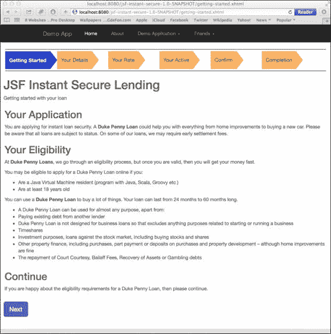

# 第五章. 对话和旅程

|    | *"成功就是喜欢自己，喜欢你所做的事情，以及喜欢你做事的方式。" |
| --- | --- |
|    | --*玛雅·安吉洛* |

在本章中，我们专注于 JSF 对话作用域。此作用域定义了跨越请求和会话作用域的管理后端 Bean 的生命周期。这使得表单中的数据能够在请求作用域和会话作用域之间的生命周期中存活。对话作用域也被认为是上下文相关的。这个术语是从**上下文和依赖注入**（**CDI**）规范中借用的，它的意思是被标记为对话作用域的 Bean 的生命周期被视为上下文的一部分。你可以将这视为 CDI 容器在对象实例周围绘制的点状标记，以将它们定义为私有组，这表示一个生命周期。CDI 容器通过将一个对象 Bean 与对另一个 Bean 的依赖关联起来来完成这项将对象实例聚集在一起的工作。

在 CDI 中，上下文表示 CDI 容器将一组具有状态的组件对象实例绑定到定义良好且可扩展的生命周期中的能力。

在 CDI 中，依赖注入表示 CDI 容器将组件注入到应用程序中的能力，同时考虑到类型安全。CDI 容器在运行时选择要注入的 Java 接口的实现。

JavaServer Faces 集成到标准 CDI 作用域中，包括对话作用域。对话的例子包括多种当代数字客户旅程。你可能自己在在线申请新工作时见过，或者在电子商务网站的发货和配送流程中，或者在设置政府资源或功能（如税务评估或退税）时见过。在本章中，我们将探讨一个客户旅程的例子，其中开发人员或用户正在申请即时安全贷款。你可能已经见过这些，或者实际上已经幸运地或不幸地浏览过现金贷款设施。

对话作用域与客户端保持状态。标记为对话作用域的控制器或 POJO 及其组件实例成为其状态的一部分。

下图概述了我们将在本章中研究的受管理 Bean 控制器周围的对话作用域：


几个具有不同 CDI 作用域的 Bean 实例的插图

上一张图展示了两个不同的客户，他们已经登录到企业应用程序中。从左到右，我们有**UserProfile**实例，它们捕获客户的登录信息，并存储在 CDI 会话作用域中。这些豆子只与特定的客户共享，该客户与`javax.servlet.http.HttpSession`对象相关联。

向右移动，我们有一个豆实例的对象图，**LendingController**、**ContactDetail**和**BankDetails**，它们存储在对话范围内。

在图例底部，在应用范围内，我们有豆实例，**Utility**和**DataHelperController**。所有 Web 应用用户共享这些豆。对话豆能够访问当前会话范围和应用程序范围内的共享信息。

### 小贴士

想了解更多关于 CDI 的信息，请阅读姊妹书籍，*Java EE 7 开发者手册*，*Packt Publishing*。

# 数字电子商务应用

Java EE 应用非常适合维护状态的数字站点。如果网站在用户的客户旅程中维护任何与用户相关的状态，那么用户通常都会参与对话。用户体验测试表明，对于许多发生大量交互的企业网站，存在多个对话。换句话说，Java Champion，Java EE 7 专家组成员 Antonio Gonclaves 曾经说过，如果你的目的是构建数字 Web 应用，那么它必须能够处理复杂的流程管理。

瞬时贷款并不完全属于快速启动公司和企业家为解决全球经济信用危机提供的最终解决方案的产品行列。随着这些新敏捷初创企业的竞争加剧，许多发达国家的国内家庭银行不得不迅速组建一个瞬时贷款设施产品。在本章中，我们将开发一个瞬时安全贷款设施。我们的产品不是一个完整的解决方案，但它展示了为数字客户交付初始原型的途径。我们不会与金融服务集成，而商业解决方案则需要管理信息报告以及与商业银行基础设施的集成。

让我们更深入地探讨对话范围。

# 对话范围

对话范围由跨越多个对服务器 HTTP 请求的生命周期定义。开发者决定范围何时开始和结束，最重要的是，它与用户相关联。关键注解由一个名为`@javax.enterprise.context.ConversationScoped`的 CDI 规范定义。当你将此注解应用于控制器或 POJO 时，请记住确保你实现了标记接口，`java.io.Serializable`。

CDI 还定义了一个接口，`javax.enterprise.context.Conversation`，它代表对话接口。对话可以存在两种不同的状态：短暂的和长期运行的。短暂状态意味着对话是一个临时状态。当你用`@ConversationScoped`注解一个豆时，它将默认处于短暂状态。

开发者控制会话何时从瞬态状态切换到长时间运行状态。然后，会话变得活跃，并保持 HTTP 用户连接的持有状态，这通常与特定的网络浏览器标签相关联。本质上，会话是一个工作单元。会话被启动，最终结束。

以下是对 `javax.enterprise.context.Conversation` 接口的定义：

```java
public interface Conversation {
  void begin();
  void begin(String id);
  void end();
  String getId();
  long getTimeout();
  void setTimeout(long milliseconds);
  boolean isTransient();
}
```

方法 `begin()` 启动一个会话。CDI 容器通过标记会话作用域 POJO 以便进行长时间运行存储。会话有一个标识符；另一个方法 `begin(String id)` 允许开发者提供一个显式的标识符。

方法 `end()` 终止会话，CDI 容器有效地丢弃与 POJO 相关的上下文信息，状态返回瞬态。为了找出会话是否为瞬态，使用 `isTransient()` 调用。

以下图表展示了 CDI 会话作用域 Bean 的生命周期：


## 会话超时和序列化

如我们之前讨论的，会话作用域的生命周期超出了请求作用域，但不能在会话作用域之外存活。CDI 容器可以超时会话作用域并终止上下文信息，以保留或恢复资源。这也是为什么带有 `@ConversationScoped` 注解的 Bean 必须是 `Serializable` 的部分原因。一个智能的 CDI 容器和 Servlet 容器可能会将一个会话转移到磁盘，甚至转移到另一个正在运行的 JVM 实例，但如果没有序列化，它们永远不会尝试这样做。

应用程序开发者可以通过 `getTimeout()` 和 `setTimeout()` 方法检索和设置超时时间。

因此，我们现在知道了 `@ConversationScoped` 和 `Conversation` 是什么。让我们在我们的即时安全贷款应用程序中好好利用它们。

# 会话作用域控制器

我们数字客户旅程的核心是一个名为 `LendingController` 的管理 Bean。随着我们通过本章的进展，我们将将其分解成更易于理解的几个部分。

初始实现看起来是这样的：

```java
package uk.co.xenonique.digital.instant.control;
import uk.co.xenonique.digital.instant.boundary.ApplicantService;
import uk.co.xenonique.digital.instant.entity.Address;
import uk.co.xenonique.digital.instant.entity.Applicant;
import uk.co.xenonique.digital.instant.entity.ContactDetail;
import uk.co.xenonique.digital.instant.util.Utility;
// imports elided

@Named("lendingController")
@ConversationScoped
public class LendingController implements Serializable {
  @EJB ApplicantService applicantService;
  @Inject Conversation conversation;
  @Inject Utility utility;

  public final static int DEFAULT_LOAN_TERM = 24;
  public final static BigDecimal DEFAULT_LOAN_AMOUNT = new BigDecimal("7000");
  public final static BigDecimal DEFAULT_LOAN_RATE = new BigDecimal("5.50");

  private int dobDay;
  private int dobMonth;
  private String dobYear;
  private BigDecimal minimumLoanAmount = new BigDecimal("3000");
  private BigDecimal maximumLoanAmount = new BigDecimal("25000");
  private BigDecimal minimumLoanRate   = new BigDecimal("3.0");
  private BigDecimal maximumLoanRate   = new BigDecimal("12.0");

  private String currencySymbol = "£";

  private BigDecimal paymentMonthlyAmount = BigDecimal.ZERO;
  private BigDecimal totalPayable = BigDecimal.ZERO;
  private Applicant applicant;

  public LendingController() {
    applicant = new Applicant();
    applicant.setLoanAmount( DEFAULT_LOAN_AMOUNT);
    applicant.setLoanRate( DEFAULT_LOAN_RATE );
    applicant.setLoanTermMonths( DEFAULT_LOAN_TERM );
    applicant.setAddress(new Address());
    applicant.setContactDetail(new ContactDetail());
  }

  public void checkAndStart() {
    if ( conversation.isTransient()) {
        conversation.begin();
    }
    recalculatePMT();
  }

  public void checkAndEnd() {
    if (!conversation.isTransient()) {
        conversation.end();
    }
  }
  /* ... */
}
```

初看这可能是一个复杂的控制器，然而，这里有两个重要的事项。首先，我们使用 `@ConversationScoped` 注解 `LendingController`，其次，我们要求 CDI 将 `Conversation` 实例注入到这个 Bean 中。我们还实现了 `Serializable` 标记接口，以便让 Servlet 容器有自由选择在需要时以及在实现支持此功能的情况下，即时持久化和重新加载 Bean。

特别注意辅助方法 `checkAndStart()` 和 `checkAndEnd()`。`checkAndStart()` 方法在当前状态为瞬时时启动一个新的长时间运行会话。`checkAndEnd()` 方法在当前会话实例处于运行状态时终止长时间运行会话。

你可以看到，前一个联系详情应用程序的一些元素已经进入了我们的即时贷款应用程序。这是经过深思熟虑的设计。

`LendingController`豆包含一个`Applicant`实例成员，这是领域主详细记录。它是一个 JPA 实体豆，用于存储申请人的数据。你已经看到了出生日期字段。控制器还包括与月供金额和贷款总额相关的成员。它还包含贷款金额和利率的下限和上限，这些作为 getter 和 setter 公开。

最后，CDI 将一个实用实例注入到`LendingController`中。这是一个应用程序范围的 POJO，它让我们可以避免编写静态单例。我们将在稍后看到实用类的细节，但首先我们必须绕到一个设计模式。

## 实体-控制-边界设计模式

这个即时贷款应用程序利用了一种特定的设计模式，称为实体-控制-边界。这是一个将应用程序中一组对象的责任和关注点分离的模式。线索在于导入的`LendingController`包名。

简单来说，实体的概念代表软件应用中的数据模型。控制元素是管理信息流的软件应用组件。边界元素属于应用程序系统，但位于系统的外围。

你在假设这个模式类似于模型-视图-控制器时是正确的，除了 ECB 适用于整个软件系统，控制元素比控制器和用户界面更有责任。

在这个应用程序中，我将`LendingController`放在控制包中，因为源代码显示它包含大部分业务逻辑。也许，对于一个合适的生产应用程序，我们可以将我们的逻辑委托给另一个 CDI 豆或 EJB。正如一位顾问曾经对他的客户说的那样，*这取决于情况*。

在实体包内部，没有争议；我添加了`Applicant`、`ContactDetail`和`Address`类。这些是持久化对象。你已经看到了在第四章中的`ContactDetail`实体豆，*JSF 验证和 AJAX*。

我将`ApplicantService` EJB 放在边界包中，因为它位于外围，并且负责数据访问。

## 客户旅程

让我们再次深入探讨`LendingController`并揭示我们的客户旅程。我们假设我们已经与创意设计师和用户体验团队会面，并提出了一个设计方案。该应用程序基于一系列线性网页，组织成一个向导。为了这个基本示例，我们只允许消费者在成功输入当前页面的有效信息后，才能进入下一页。

以下是为每个页面设定的标题：

| 步骤 | 页面 | 描述 |
| --- | --- | --- |
| 1 | 开始 | 向客户提供关于资格标准的详细信息 |
| 2 | 您的详细信息 | 客户输入他们的个人联系详情和出生日期 |
| 3 | 您的利率 | 客户选择贷款金额和期限 |
| 4 | 您的地址 | 客户输入他们的完整家庭地址和电话号码 |
| 5 | 确认 | 消费者同意服务条款并查看摘要 |
| 6 | 完成 | 消费者看到他们申请表提交的确认 |

这现在在控制器中实现起来相当简单，以下是一个示例：

```java
@Named("lendingController")
@ConversationScoped
public class LendingController implements Serializable {
  /* ... */

  public String cancel() {
      checkAndEnd();
      return "index?faces-redirect=true";
  }

  public String jumpGettingStarted() {
      return "getting-started?faces-redirect=true";
  }

  public String doGettingStarted() {
      checkAndStart();
      return "your-details?faces-redirect=true";
  }

  public String doYourDetails() {
      checkAndStart();
      Calendar cal = Calendar.getInstance();
      cal.set(Calendar.DAY_OF_MONTH, dobDay);
      cal.set(Calendar.MONTH, dobMonth-1);
      int year = Integer.parseInt(dobYear);
      cal.set(Calendar.YEAR, year);
      applicant.getContactDetail().setDob(cal.getTime());
      return "your-rate?faces-redirect=true";
  }

  public String doYourRate() {
      checkAndStart();
      return "your-address?faces-redirect=true";
  }

  public String doYourAddress() {
      checkAndStart();
      return "confirm?faces-redirect=true";
  }

  public String doConfirm() {
      /* ... */
      return "completion?faces-redirect=true";
  }

  public String doCompletion() {
      /* ... */
      return "index?faces-redirect=true";
  }

  /* ... */
}
```

`LendingController` 面豆有多个与用户需求相对应的操作方法，即 `doGettingStarted()`、`doYourDetails()`、`doYourRate()`、`doYourAddress()`、`doConfirm()` 和 `doCompletion()`。这些操作方法通过简单地返回名称来推进客户到下一个页面视图。对于这些方法中的大多数，除了 `doCompletion()` 之外，我们通过调用 `checkAndStart()` 确保会话处于长时间运行状态。在 `doCompletion()` 和 `cancel()` 方法中，我们调用 `checkAndEnd()` 确保会话回到短暂状态。`doCompletion()` 方法利用 `ApplicationService` 将数据、`Applicant` 实例保存到底层数据库。

### 小贴士

在示例代码中，我们在每个操作方法的开头应用 `checkAndStart()` 是一种欺骗行为。对于生产代码，我们通常应该确保如果用户跳转到应该有会话的标记 URL，那么它将是一个错误或重定向。

让我们检查实体并填写更多的空白。

## 实体类

实体 `Applicant` 是一个主从记录。这被称为核心域对象。它存储了客户对即时保障贷款的申请数据。我们捕获客户的贷款信息，例如联系详情（`ContactDetail`）、地址（`Address`）、电话号码（家庭、工作和手机），最重要的是，财务详情。

`Applicant` 实体如下所示：

```java
package uk.co.xenonique.digital.instant.entity;
import javax.persistence.*;
import java.math.BigDecimal;
import java.util.Date;

@Entity
@Table(name="APPLICANT")
@NamedQueries({
  @NamedQuery(name="Applicant.findAll",
          query = "select a from Applicant a " +
                  "order by a.submitDate"),
  @NamedQuery(name="Applicant.findById",
          query = "select a from Applicant a where a.id = :id"),
})
public class Applicant {
  @Id
  @GeneratedValue(strategy = GenerationType.AUTO)
  private long id;

  @OneToOne(cascade = CascadeType.ALL)
  private ContactDetail  contactDetail;
  @OneToOne(cascade = CascadeType.ALL)
  private Address  address;

  private String workPhone;
  private String homePhone;
  private String mobileNumber;

  private BigDecimal loanAmount;
  private BigDecimal loanRate;
  private int loanTermMonths;
  private boolean termsAgreed;

  @Temporal(TemporalType.TIMESTAMP)
  private Date submitDate;

  public Applicant() { }

  // Getters and setters omitted ...
  // hashCode(), equals(), toString() elided
}
```

`Applicant` 实体存储贷款金额、利率、期限，以及提交日期。它还包含家庭、工作和手机电话号码。申请人与 `ContactDetail` 和 `Address` 实体都存在一对一的单向关系。

对于像 `loanRate` 和 `loanAmount` 这样的财务属性，请注意，我们更喜欢在计算时使用 `BigDecimal` 而不是原始的浮点类型，以确保货币计算的准确性。

向利益相关者解释领域对象的方式是：客户有一个贷款利率，一个贷款期限，并且必须电子方式同意法律条件。有了这些信息，系统可以计算贷款以及客户每月需要偿还的金额，并在申请贷款时显示出来。

您已经看到了`ContactDetail`实体。它与之前完全相同，只是包名已被重构为实体。以下是`Address`实体 bean 的提取代码：

```java
package uk.co.xenonique.digital.instant.entity;
import javax.persistence.*;

@Entity
@Table(name="ADDRESS")
@NamedQueries({
  @NamedQuery(name="Address.findAll",
    query = "select a from Address a "),
  @NamedQuery(name="Address.findById",
    query = "select a from Address a where a.id = :id"),
})
public class Address {
    @Id
    @GeneratedValue(strategy = GenerationType.AUTO)
    @Column(name="ADDRESS", nullable = false,
            insertable = true, updatable = true,
            table = "ADDRESS")
    private long id;

    String houseOrFlatNumber;
    String street1;
    String street2;
    String townOrCity;
    String region;
    String areaCode;
    String country;

    // toString(), hashCode(), equalsTo() elided
    /* ... */
}
```

实体`Address`代表申请人的通信和法律个人地址。这里没有什么特别之处。它是一个标准的实体 bean，你将在电子商务应用程序中看到。

请允许我提醒您，示例的源代码是在线的，并且是本书的一部分，供您参考。

## 数据服务

我们如何将客户的输入保存到持久存储中？我们的应用程序使用有状态的会话 EJB，并提供保存和检索`Applicant`实体记录的方法。

`ApplicantService`类如下：

```java
package uk.co.xenonique.digital.instant.boundary;
import uk.co.xenonique.digital.instant.entity.Applicant;
import javax.ejb.Stateful;
import javax.persistence.*;
import java.util.List;

@Stateful
public class ApplicantService {
  @PersistenceContext(unitName = "instantLendingDB",
    type = PersistenceContextType.EXTENDED)
  private EntityManager entityManager;

  public void add(Applicant applicant) {
    entityManager.persist(applicant);
  }

  /* ... */

  public List<Applicant> findAll() {
    Query query = entityManager.createNamedQuery(
        "Applicant.findAll");
    return query.getResultList();
  }

  public List<Applicant> findById(Integer id) {
    Query query = entityManager.createNamedQuery(
        "Applicant.findById").setParameter("id", id);
    return query.getResultList();
  }
}
```

`add()`方法将新申请人插入到数据库中。`findAll()`和`findById()`在即时贷款示例中未使用。这些查询方法仅用于说明目的。假设，在完整应用程序的另一个部分需要访问申请人数据。

我们已经涵盖了应用程序的实体、控制和边界。现在是时候检查页面视图了。

# 页面视图

视图的控件流程由客户旅程定义。每个页面视图代表业务利益相关者希望看到的特定要求。索引页面视图是一个要求，因为贷款人希望客户看到着陆页。它也是国家政府当局要求的合规法律义务。您还会注意到客户旅程映射为线性流程，但并非所有旅程都是如此。

### 注意

短期贷款方案必须遵循合规要求。请参阅英国金融服务管理局（[`goo.gl/NfbFbK`](https://goo.gl/NfbFbK)）和美国消费者金融保护局（[`goo.gl/3V9fxk`](http://goo.gl/3V9fxk)）的网站。

以下表格概述了控制器操作与视图页面之间的关系：

| 查看源代码 | 查看目标 | 操作方法 |
| --- | --- | --- |
| `index` | `getting-started` | `jumpGettingStarted()` |
| `getting-started` | `your-detail` | `doGettingStarted()` |
| `your-details` | `your-rate` | `doYourDetails()` |
| `your-rate` | `your-address` | `doYourRate()` |
| `your-address` | `confirm` | `doYourAddress()` |
| `confirm` | `completion` | `doConfirm()` |
| `completion` | `index` | `doCompletion()` |

在前面的表中，所有视图页面都带有扩展名 `xthml`。很明显，在对话中正在发生线性工作流程。对话范围理想地开始于客户通过 `jumpGettingStarted()` 动作方法进入开始视图时。

## 一个初始页面视图

让我们看看初始的 `index.xhtml` 页面视图。这是贷款申请的着陆页。以下是我们贷款申请和着陆页的截图：


这个页面的视图 `index.xhtml` 非常简单直接。它包含一个基本的链接按钮组件，并使用 Bootstrap 滚动图：

```java
<!DOCTYPE html>
<html ...>
    <ui:composition template="/basic_layout.xhtml">
      ...
      <ui:define name="mainContent">
        <h1> JSF Instant Secure Lending</h1>
        <p>
            Welcome to Duke Penny Loan where developers,
            designers and architect can secure
            an instant loan. <em>You move. We move.</em>
        </p>

        <div class="content-wrapper   center-block">
          <div id="carousel-example-generic" class="carousel slide"
                data-ride="carousel"  data-interval="10000">
            <!-- Indicators -->
            <ol class="carousel-indicators">
                <li data-target="#carousel-example-generic" data-slide-to="0" class="active"></li>
                <li data-target="#carousel-example-generic" data-slide-to="1"></li>
                <li data-target="#carousel-example-generic" data-slide-to="2"></li>
                <li data-target="#carousel-example-generic" data-slide-to="3"></li>
            </ol>
            ...
          </div>
        </div><!-- content-wrapper  -->

        <div class="content-wrapper">
          <h:link styleClass="btn btn-primary btn-lg"
                  outcome="#{lendingController.jumpGettingStarted()}">
              Apply Now!
          </h:link>
        </div>

...
    </ui:define> <!--name="mainContent" -->
  </ui:composition>
</html>
```

`<h:link>` 元素是这个视图最重要的功能。这个自定义标签的输出引用了控制器中的 `jumpGettingStarted()` 方法，这开始了一个长时间运行的对话。

即使在这个阶段，在对话开始之前，我们也可以向客户传递信息。因此，在页面视图的进一步部分，我们使用表达式语言告诉客户最低和最高贷款金额以及利率。

以下代码，也是页面视图 `index.xhtml` 的一部分：

```java
  <div class="content-wrapper">
    <p>
      Apply for a Dukes Dollar loan. You borrow from
      <b>
        <h:outputText value="#{lendingController.minimumLoanAmount}" >
          <f:convertNumber currencyCode="GBP" type="currency" />
        </h:outputText>
      </b>
        to
      <b>
        <h:outputText value="#{lendingController.maximumLoanAmount}" >
          <f:convertNumber currencyCode="GBP" type="currency" />
        </h:outputText>
      </b>
        on a rate from
      <b>
        <h:outputText value="#{lendingController.minimumLoanRate}" >
          <f:convertNumber pattern="0.00" />
        </h:outputText>&#37;
      </b>
        to
      <b>
        <h:outputText value="#{lendingController.maximumLoanRate}" >
          <f:convertNumber pattern="0.00" />
        </h:outputText>&#37;
      </b>.
    </p>
  </div>
```

这个页面使用了 JSF 核心标签 `<f:convertNumber>` 将浮点数格式化为货币格式。HTML 实体字符 `&#37;` 代表百分号字符 (`%`)。记住，视图技术是严格使用 Facelets 而不是 HTML5。

## 开始页面视图

开始视图甚至更简单。我们向客户展示他们申请贷款的资格信息。客户必须年满 18 岁；我们重复说明他们可以借多少钱以及借款期限。

这个视图被命名为 `getting-started.xhtml`，如下截图所示：



有一个单独的 JSF 表单，有一个按钮可以将客户移动到下一个页面视图 `your-details.xhtml`。没有必要查看这个视图的完整源代码，因为它主要是标记 HTML。然而，我们还有一个命令链接：

```java
<h:link styleClass="btn btn-primary btn-lg" outcome="#{lendingController.doGettingStarted()}">
  Next</h:link>
```

## 联系详情页面视图

下一个视图是熟悉的联系详情屏幕。我们将它从前面的章节中纳入即时安全贷款示例。我们还重新使用了 JSF 表达式语言来引用控制器和嵌套属性。

首名字段页面编写代码如下：

```java
<h:inputText class="form-control" label="First name"
   value="#{lendingController.applicant.contactDetail.firstName}"
   id="firstName" placeholder="First name">
    <f:validateRequired/>
    <f:validateLength maximum="64" />
    <f:ajax event="blur" render="firstNameError"/>
</h:inputText>
```

EL `#{lendingController.applicant.contactDetail.firstName}` 引用了相关的嵌套实体属性。我们还保留了来自 第四章 的 AJAX JSF 验证功能，*JSF 验证和 AJAX*，以提供丰富的客户旅程。

对于这个视图，我们使用 JSF 命令按钮提交表单：

```java
<h:commandButton styleClass="btn btn-primary"
                 action="#{lendingController.doYourDetails()}"
                 value="Submit" />
&#160;
&#160;
<h:commandButton styleClass="btn btn-default"
                 action="#{lendingController.cancel()}"
                 immediate="true" value="Cancel"/>
```

我们还提供了必要的取消操作，以防客户当天不再想申请贷款。

以下是对 `your-details.xhtml` 视图的截图，允许客户输入他们的联系信息：


现在是时候做一些新的事情了。何不向老牌的 JavaServer Faces 中添加一些 HTML5 的好处？

## 您的评分页面视图

贷款金额和利率页面视图依赖于 HTML5 范围控件元素，在大多数符合标准浏览器中，它被渲染为一个水平滑块。JSF 没有内置对范围控件的支持；因此，对于此视图，我们利用了 JSF HTML5 友好支持功能。JSF 规范允许我们编写看起来像标准 HTML 组件的标记，但如果我们提供一个特殊属性，JSF 就将其视为 UI 组件。透传功能仅适用于类似于现有 JSF 核心控件标记。

一图胜千言，让我们看看以下 `your-rate.xhtml` 的截图：


该视图使用 AJAX 部分更新和 HTML5 友好的标记功能。让我向您展示表单的代码：

```java
<h:form id="yourRateForm"
  styleClass="form-horizontal"
    p:role="form">
  <div class="form-group">
    <h:outputLabel for="loanAmount"
      class="col-sm-3 control-label">
        Loan Amount</h:outputLabel>
    <div class="col-sm-9">
      <input class="form-control" jsf:label="Loan Amount"
        jsf:value="#{lendingController.applicant.loanAmount}"
          type="range"
        min="#{lendingController.minimumLoanAmount}"
        max="#{lendingController.maximumLoanAmount}"
        step="250"
        id="loanAmount" >
      <f:validateRequired/>
        <f:ajax event="blur" render="loanAmountError"/>
        <f:ajax event="valueChange"
                listener="#{lendingController.recalculatePMT()}"
                render="paymentMonthlyOutput loanRateOutput  totalPayableOutput" />
      </input>
      <h:message id="loanAmountError"
                 for="loanAmount" styleClass="alert validation-error"/>
    </div>
  </div>
```

与所有 JSF 表单一样，我们首先声明一个名为 `yourRateForm` 的表单，并使用 Bootstrap CSS 进行样式设计。专注于控件元素，您会注意到它被编写为 `<input>` 而不是 `<h:inputText>`。这是因为 JSF 的 `<h:inputText>` 不支持新的 HTML5 范围元素。通常，无法访问更丰富的 UI 组件会对即时安全贷款造成问题。

HTML5 范围输入元素接受最小值、最大值和当前值。它还接受步长大小。

### HTML5 友好支持

JSF 2.2 允许使用新的标签库 URI 和 XML 命名空间 ``. 通过属性 `jsf:id`、`jsf:label` 和 `jsf:attribute`，HTML5 标签在 JSF 框架中具有可见性。`

```your-rate.xhtml` 的完整 XML 命名空间如下所示：`

```java
<!DOCTYPE html>
<html 

      >
```

`我们将在本章后面讨论组合组件。HTML5 友好的标签库向 JSF 生命周期公开了标准的 HTML 输入组件。对于不熟悉 JSF 或 Java 的创意人员来说，理解页面视图也更简单。我们不再需要担心 JSF 对视图 ID 应用特殊名称混淆的问题；这意味着组件 ID 对 HTML 和 JavaScript 都是有用的。`

### `使用 AJAX 进行部分更新`

``在 第四章 中，我们学习了如何使用 Ajax 验证表单属性。JSF 允许开发者使用 `<f:ajax>` 自定义标签执行部分页面更新。```

`为了启用丰富的用户示例，每当客户更改贷款金额滑块时，我们都会调用服务器端来重新计算月付款金额。我们通过附加一个事件监听器来跟踪值的变化来实现这一点。相应的代码如下：`

```java
<f:ajax event="valueChange"
   listener="#{lendingController.recalculatePMT()}"
   render="paymentMonthlyOutput  loanRateOutput   
           totalPayableOutput" />
```

`代码的新增功能是渲染属性，它指定了在 AJAX 响应中将被重新渲染的 JSF UI 组件的唯一 ID。换句话说，我们声明性地指定了在 AJAX 行为完成时 JSF 上要重新渲染的组件，从而获得部分更新。`

### `绑定组件`

`让我们看看 HTML5 Range 元素（在本例中为贷款金额）与之绑定的其他组件。`

`看看下面的代码：`

```java
<c:set var="loanAmountWidth" value="#{100.0 * (lendingController.applicant.loanAmount - lendingController.minimumLoanAmount) / (lendingController.maximumLoanAmount - lendingController.minimumLoanAmount)}" />

  <div class="progress">
      <div id="loanAmountProgress" class="progress-bar  progress-bar-success  progress-bar-striped"
           role="progressbar" aria-valuenow="#{lendingController.applicant.loanAmount}"
           aria-valuemin="#{lendingController.minimumLoanAmount}"
           aria-valuemax="#{lendingController.maximumLoanAmount}"
           style="width: ${loanAmountWidth}%;">
          #{lendingController.applicant.loanAmount}
      </div>
  </div>

  <div class="content-wrapper">
    <p id="loanAmountText" class="monetary-text">
        You would like to borrow
        <b> #{lendingController.currencySymbol}
        <h:outputText value="#{lendingController.applicant.loanAmount}" >
            <f:convertNumber pattern="#0,000" />
        </h:outputText> </b>
    </p>
  </div>
```

`进度标记直接复制自 Bootstrap CSS 组件示例。我们插入了值表达式，从`LendingController`和`Applicant`实例中提取信息。`

`在前面代码摘录的顶部，我们使用 JSTL 核心标签`<c:set>`设置了进度条的初始值。`

```java
<c:set var="loanAmountWidth" value="#{100.0 *  (lendingController.applicant.loanAmount - lendingController.minimumLoanAmount) / (lendingController.maximumLoanAmount - lendingController.minimumLoanAmount)}" />
```

`这表明 EL 3.0 中的统一表达式语言具有检索 JSF 中后期绑定的值以计算结果的能力。结果被设置在名为`loanAmountWide`的页面作用域变量中。稍后，使用`$(loanAmountWidth)`访问该变量，并设置 Bootstrap CSS 进度条组件的初始位置值。`

`HTML5 标准没有内置支持来显示 HTML5 Range 元素在所有顶级浏览器中的值。在撰写本文时，这个特性缺失，W3C 或 WHATWG 可能在不久的将来加强 HTML5 规范中的这一弱点。在此之前，我们将使用 jQuery 和 JavaScript 来填补这一空白。`

`如果你注意到了，前面的代码中，文本被标识为`loanAmountText`，进度组件被表示为`loanAmountProgress`。将 HTML5 Range 元素绑定到这些字段上的 jQuery 代码是微不足道的。`

`我们需要一个 JavaScript 模块来实现绑定。完整的代码位于`/resources/app/main.js`中，如下所示：`

```java
var instantLending = instantLending || {};

instantLending.Main = function()
{
  var init = function()
  {
    $(document).ready( function() {
      associateRangeToText(
        '#loanAmount', '#loanAmountProgress', '#loanAmountText',
        3000.0, 25000.0,
        function(value) {
            var valueNumber = parseFloat(value);
            return "You would like to borrow <b>£" +
                valueNumber.formatMoney(2, '.', ',') + "</b>";
        });
    });
  };

  var associateRangeToText = function( rangeElementId,
    rangeProgressId, rangeTextId, minimumValue,
    maximumValue, convertor) {
    var valueElem = $(rangeElementId);
    var progressElem = $(rangeProgressId);
    var textElem = $(rangeTextId);
    valueElem.change( function() {
      var value = valueElem.val();
      progressElem.html(value);
      progressElem.attr("aria-valuenow", value);

      var percentage = 100.0 * ( value - minimumValue) /
        ( maximumValue - minimumValue );
      progressElem.css("width", percentage+"%");

      var monetaryText = convertor( value )
      textElem.html( monetaryText );
    });
  }

  var oPublic =
  {
    init: init,
    associateRangeToText: associateRangeToText
  };

  return oPublic;
}(jQuery);

instantLending.Main.init();
```

`模块`instantLending.Main`定义了一个 HTML Range 元素与两个其他组件的绑定：一个进度条和一个标签文本区域。为了快速复习 JavaScript 模块，请参阅第一章，*数字 Java EE 7*。`

`该模块有一个`init()`函数，它使用 jQuery 文档加载机制设置绑定。它调用一个名为`associateRangeToText()`的函数，该函数计算进度条的百分比并将其值写入文本元素区域。该函数接受相关组件的文档 ID：范围、进度和文本标签组件。它将一个匿名函数附加到范围元素上；当用户更改组件时，它更新相关组件。`

`模块`main.js`还定义了一个添加到 JavaScript 数字类型中的有用原型方法。以下代码显示了它是如何工作的：`

```java
// See http://stackoverflow.com/questions/149055/how-can-i-format-numbers-as-money-in-javascript
Number.prototype.formatMoney = function(c, d, t){
  var n = this,
      c = isNaN(c = Math.abs(c)) ? 2 : c,
      d = d == undefined ? "." : d,
      t = t == undefined ? "," : t,
      s = n < 0 ? "-" : "",
      i = parseInt(n = Math.abs(+n || 0).toFixed(c)) + "",
      j = (j = i.length) > 3 ? j % 3 : 0;
  return s + (j ? i.substr(0, j) + t : "") +
      i.substr(j).replace(/(\d{3})(?=\d)/g, "$1" + t) +
      (c ? d + Math.abs(n - i).toFixed(c).slice(2) : "");
};
```

```formatMoney()`方法将浮点数值类型格式化为货币输出作为字符串。此代码由 Patrick Desjardins 贡献给 Stack Overflow。以下代码说明了如何调用此函数：`

```java
var p = 128500.99
console.log(p.formatMoney(2, '.', ',') ) // 128,500.99
```

`第一个参数是固定分数大小，第二个参数确定小数符号，第三个指定千位字符。`

`使用此模块，我们将 HTML5 Range 元素绑定到页面上的其他元素，从而展示了 JSF 对 HTML5 的友好支持。`

### `使用 AJAX 局部更新更新区域`

``JSF 如何使用 AJAX 响应更新页面上的区域？开发者指定了由`<f:ajax>`标签的 render 属性更新的 UI 组件。在现代网页设计中，哪个组件可以被视为标准 JSF 渲染套件内的 HTML 层元素`<div>`？这个答案是通过使用`<h:panelGroup>` JSF 自定义标签。我们可以为这个 UI 组件提供一个唯一标识符，当 AJAX 行为完成时，JSF 渲染此组件。`

``以下是为即时贷款利率的代码摘录，其中 div 元素通过`loanRateOutput`标识：`

```java
<c:set var="loanRateWidth" value="#{100.0 * (lendingController.applicant.loanRate - lendingController.minimumLoanRate) / (lendingController.maximumLoanRate - lendingController.minimumLoanRate)}" />

<h:panelGroup layout="block" id="loanRateOutput">
  <div class="progress">
    <div id="loanRateProgress" class="progress-bar  progress-bar-info progress-bar-striped"
      role="progressbar" aria-valuenow="#{lendingController.recalculateLoanRate()}"
         aria-valuemin="#{lendingController.minimumLoanRate}"
         aria-valuemax="#{lendingController.maximumLoanRate}"
         style="width: ${loanRateWidth}%;">
      #{lendingController.applicant.loanRate}
    </div>
  </div>
  <div class="content-wrapper">
    <p id="loanRateText" class="monetary-text">
      The tax rate will be
      <b> <h:outputText value="#{lendingController.applicant.loanRate}" >
        <f:convertNumber pattern="0.000" />
      </h:outputText>&#37;</b>
    </p>
  </div>
</h:panelGroup>
```

```<h:panelGroup>`默认渲染一个 div 层，因此包含进度条组件和文本输出内容。该 div 在`LendingController`中调用`recalculatePMT()`方法之后渲染。请参考前面的章节以提醒此代码。`

``函数`recalclulatePMT()`和`recalculateLoanRate()`如下所示：`

```java
public BigDecimal recalculatePMT() {
  recalculateLoanRate();
  paymentMonthlyAmount = new BigDecimal(utility.calculateMonthlyPayment(
      applicant.getLoanAmount().doubleValue(),
      applicant.getLoanRate().doubleValue(),
      applicant.getLoanTermMonths()));

  totalPayable = paymentMonthlyAmount.multiply(
    new BigDecimal( applicant.getLoanTermMonths()));
  return paymentMonthlyAmount;
}

public BigDecimal recalculateLoanRate() {
  applicant.setLoanRate(
    utility.getTaxRate(applicant.getLoanAmount()));
  return applicant.getLoanRate();
}
```

``函数`recalculatePMT()`使用经典的数学公式根据本金金额、期限长度以及当然的利率来评估贷款的月付款金额。`

``函数`recalculateLoanRate()`使用一个实用工具，一个应用范围的 CDI 豆，根据贷款账户的利率限制表来计算利率。`

``让我们回顾一下。JavaScript 模块`instantLending::Main`在客户端更新。当客户更改贷款金额时，此模块会更改进度条组件和文本内容。同时，JSF 向服务器端发起 AJAX 请求并调用动作事件监听器`recalculatePMT()`。框架最终接收到 AJAX 响应，然后重新渲染贷款利率、期限控件和摘要区域。`

``为了完成 XHTML，让我们检查这个页面视图上剩余的内容，你的`rate.xhtml`。以下是为贷款期限的内容，它是一个下拉组件：`

```java
<div class="form-group">
  <h:outputLabel for="loanTerm" class="col-sm-3 control-label">
    Loan Term (Months)</h:outputLabel>
  <div class="col-sm-9">
    <h:selectOneMenu class="form-control"
      label="Title" id="loanTerm"
         value="#{lendingController.applicant.loanTermMonths}">
      <f:selectItem itemLabel="12 months" itemValue="12" />
      <f:selectItem itemLabel="24 months" itemValue="24" />
      <f:selectItem itemLabel="36 months" itemValue="36" />
      <f:selectItem itemLabel="48 months" itemValue="48" />
      <f:selectItem itemLabel="60 months" itemValue="60" />
      <f:validateRequired/>
      <f:ajax event="blur" render="loanTermError"/>
      <f:ajax event="valueChange"
        listener="#{lendingController.recalculatePMT()}"
        render="paymentMonthlyOutput loanRateOutput 
          monthTermsOutput  totalPayableOutput" />
    </h:selectOneMenu>
    <h:message id="loanTermError"
      for="loanTerm" styleClass="alert validation-error"/>
  </div>
</div>
```

``该组件还包含一个`<f:ajax>`自定义标签，用于调用重新计算事件监听器。因此，如果客户选择不同的贷款期限，由于 AJAX 局部更新，`loanRateOutput`和`paymentMonthlyOutput`也会随着摘要一起改变。`

`最后，让我们看看摘要区域的内容：`

```java
<div class="content-wrapper" >
  <div class="row">
    <div class="col-md-12">
      <p class="monetary-text-large">
        Your monthly payment is <b>
        #{lendingController.currencySymbol}<h:outputText
          id="paymentMonthlyOutput"
          value="#{lendingController.recalculatePMT()}">
          <f:convertNumber pattern="#0.00" />
        </h:outputText></b>
      </p>
    </div>
  </div>
  <div class="row">
    <div class="col-md-6">
      <p class="monetary-text">
        Loan term
        <h:outputText id="monthTermsOutput"
        value="#{lendingController.applicant.loanTermMonths}"/>
         months
      </p>
    </div>
    <div class="col-md-6">
      <p class="monetary-text">
        Total payable
        #{lendingController.currencySymbol}<h:outputText
          id="totalPayableOutput"
          value="#{lendingController.totalPayable}">
            <f:convertNumber pattern="#0,000" />
        </h:outputText>
      </p>
    </div>
  </div>
</div>
```

``在先前的代码摘录中，我们使用`<h:outputText>`而不是`<h:panelGroup>`来仅使用部分 AJAX 更新更新内容的一部分。JSF 输出文本元素是一个 JSF UI 组件，它通过请求 AJAX 行为重新渲染来工作。``

## `地址页面视图`

`地址页面视图捕获客户的住宅主要地址。这个页面还具备客户端的 AJAX 验证。`

``这段代码与联系详情表单如此相似，所以我们在这里省略代码摘录和树形结构。我将在下面的代码中只展示第一个`houseOrFlatNumber`字段：``

```java
<h:form id="yourAddressForm"
        styleClass="form-horizontal"
        p:role="form">
  <div class="form-group">
    <h:outputLabel for="houseOrFlatNumber"
      class="col-sm-3 control-label">
        House number</h:outputLabel>
    <div class="col-sm-9">
      <h:inputText class="form-control"
        label="House or Flat Number"
          value="#{lendingController.applicant.address.houseOrFlatNumber}"
         id="houseOrFlatNumber" placeholder="First name">
        <f:validateLength maximum="16" />
        <f:ajax event="blur" render="houseOrFlatNumberError"/>
      </h:inputText>
      <h:message id="houseOrFlatNumberError"
         for="houseOrFlatNumber"
         styleClass="alert validation-error"/>
    </div>
  </div>
  ...
</h:form>
```

``以下是对`your-address.xhtml`页面视图的截图。``

``

## `确认页面视图`

``确认页面视图是客户看到他们即时贷款所有详情的地方。在这个视图中，他们有机会阅读合同的条款和条件。客户必须选择复选框以接受协议，或者他们可以点击取消按钮来终止对话。取消按钮会在`LendingController`中调用`cancel()`方法，然后反过来调用`checkAndEnd()`。``

`这里唯一相关的代码是关于协议复选框的。代码摘录如下：`

```java
<h:form id="yourConfirmForm"
  styleClass="form-horizontal" p:role="form"> ...
  <div class="form-group">
    <h:outputLabel for="tocAgreed" class="col-sm-6 control-label">
      Do you agree with the <em>Terms of Conditions</em>?
    </h:outputLabel>
    <div class="col-sm-6">
      <h:selectBooleanCheckbox class="form-control"
         label="TOC Agreement" id="tocAgreed"
         value="#{lendingController.applicant.termsAgreed}"
      validator="#{lendingController.validateTermsOrConditions}" >
          <f:ajax event="blur" render="tocAgreedError"/>
      </h:selectBooleanCheckbox>
      <h:message id="tocAgreedError"
         for="tocAgreed" styleClass="alert validation-error"/>
    </div>
  </div>
  ...
</h:form>
```

``我们使用`<h:selectBooleanCheckBox>`在 blur 事件上执行即时 AJAX 验证。这确保了布尔属性在服务器端被设置为 true。然而，我们仍然必须在表单提交时进行验证，正如我们在动作控制器方法中看到的那样：``

```java
 public String doConfirm() {
    if ( applicant.isTermsAgreed()) {
      throw new IllegalStateException(
        "terms of agreements not set to true");
    }
    recalculatePMT();
    applicant.setSubmitDate(new Date());
    applicantService.add(applicant);
    return "completion?faces-redirect=true";
  }
```

``在`doConfirm()`方法内部，我们重新计算月供期限以确保无误。我们检查申请人的数据值是否没有改变，设置提交日期，然后调用`ApplicationService`将一条新记录插入到数据库中。在这个方法之后，客户被认为是成功申请了。``

``我们在`isTermsAgreed()`上包含了一个手动检查，因为这是合同中客户接受条款和条件的法律要求。在这里引发一个应用程序错误`IllegalStateException`可能是有争议的。更有可能的是，开发者会向错误日志打印一条消息，并引发异常。Servlet 规范允许捕获不同的异常并将它们发送到特定的错误页面。因此，如果我们创建了一个自定义运行时异常，例如`LegalTermsAgreementException`，我们就可以负责任地处理这些情况。``

`在生产系统中，这个序列的结束可能会触发一个额外的业务流程。例如，工作消息可能会通过消息总线 JMS 发送到另一个工作区域。在现代数字应用中，客户应该期待收到带有确认和贷款合同详情的电子邮件。当然，这是读者需要额外完成的任务。`

``以下是对确认视图的截图，`confirm.xhtml`：``

``

`让我们转到完成的最终页面视图。`''

## `完成页面视图`

``完成阶段很简单。客户已提交申请，所以我们只需通知他或她这一点，然后对话结束。以下是`LendingController`中`doCompletion()`方法的完整代码：`''

```java
 public String doCompletion() {
    checkAndEnd();
    return "index?faces-redirect=true";
  }
```

``此方法仅结束对话范围，因为到那时用户的数字客户旅程已经完成。`''

``现在我们有一个完整的流程，一个数字客户旅程。还缺少什么？我们应该添加接受有效银行账户、银行分类代码、IBAN 号码以及与国家银行基础设施集成的步骤！当然，我们还需要一定水平的金融资本，足够的资金来满足监管机构；在英国，这将是由金融行为管理局([`www.fca.org.uk/`](http://www.fca.org.uk/))。`''

``本页面的截图，`completion.xhtml`，如下所示：`''

``

## `实用类`

``通常在应用程序中，我们将常见的方法和属性重构到单独的实用类中，这些功能如此普遍，以至于它们在任何特定的包域中都没有意义。我们通常将这些概念放在单例的静态方法中。使用 Java EE，我们可以做得更好。由于 CDI 支持应用范围，我们可以简单地将我们的公共方法移动到一个 POJO 中，并让 CDI 将 Bean 注入到依赖对象中。这是处理数据、时间和月付款期限计算的`LendingController`示例中的智能方式。`''

``应用范围 Bean `DateTimeController`充当页面作者视图的辅助工具：`''

```java
package uk.co.xenonique.digital.instant.control;
import javax.annotation.PostConstruct;
import javax.enterprise.context.ApplicationScoped;
import javax.inject.Named;
import java.io.Serializable;
import java.text.DateFormatSymbols;
import java.util.*;

@Named("dateHelperController")
@ApplicationScoped
public class DateHelperController implements Serializable {
  private List<Integer> daysOfTheMonth = new ArrayList<>();
  private Map<String,Integer> monthsOfTheYear
    = new LinkedHashMap<>();

  @PostConstruct
  public void init() {
    for (int d=1; d<=31; ++d) { daysOfTheMonth.add(d); }
    DateFormatSymbols symbols = new DateFormatSymbols(Locale.getDefault());
    for (int m=1; m<=12; ++m) {
        monthsOfTheYear.put(symbols.getMonths()[m-1], m );
    }
  }

  public List<Integer> getDaysOfTheMonth() {
    return daysOfTheMonth;
  }
  public Map<String,Integer> getMonthsOfTheYear() {
    return monthsOfTheYear;
  }
}
```

```DateHelperController`方法用于`your-details.view`，并为出生日期字段的下拉日和月生成数据。此代码最初是第四章中`ContactDetailsController`方法的组成部分，*JSF 验证和 AJAX*。它已被重构以供重用。`''

`存在另一个具有应用范围的 POJO，它被称为 Utility。`''

```java
package uk.co.xenonique.digital.instant.util;
import javax.enterprise.context.ApplicationScoped;
import java.io.Serializable;
import java.math.BigDecimal;
import java.util.*;

@ApplicationScoped
public class Utility implements Serializable {
  protected List<LoanRateBounds> bounds = Arrays.asList(
      new LoanRateBounds("0.0",       "4500.0",   "22.50"),
      new LoanRateBounds("4500.0",    "6000.0",   "9.79"),
      new LoanRateBounds("6000.0",    "9000.0",   "7.49"),
      new LoanRateBounds("9000.0",    "11500.0",  "4.49"),
      new LoanRateBounds("11500.0",   "15000.0",  "4.29"),
      new LoanRateBounds("15000.0",   "20000.0",  "5.79"),
      new LoanRateBounds("20000.0",   "25000.0",  "6.29"),
      new LoanRateBounds("30000.0",   "50000.0",  "6.99")
      );

  public BigDecimal getTaxRate( BigDecimal amount ) {
    for ( LoanRateBounds bound : bounds ) {
      if ( bound.getLower().compareTo(amount) <= 0 &&
            bound.getUpper().compareTo(amount) > 0 ) {
        return  bound.getRate();
      }
    }
    throw new IllegalArgumentException("no tax rate found in bounds");
  }

  public double calculateMonthlyPayment( double pv, double apr, int np ) {
    double ir = apr / 100 / 12;
    return (pv * ir) / (1 - Math.pow(1+ir, -np));
  }
}
```

``在上述代码中，方法`calculateMonthlyPayment()`计算月付款金额。参数是`pv`（指定本金值）、`apr`（指定年百分比率）和`np`，代表以月为单位的提前通知期。`''

``方法`getTaxRate()`根据本金值查找适当的税率，即客户想要的贷款金额。`LoanRateBounds`类是一个简单的 POJO，如下面的代码所示：`''

```java
package uk.co.xenonique.digital.instant.util;
import java.math.BigDecimal;

public class LoanRateBounds {
  private final BigDecimal lower;
  private final BigDecimal upper;
  private final BigDecimal rate;

  public LoanRateBounds(String lower, String upper, String rate) {
    this(new BigDecimal(lower), new BigDecimal(upper),
        new BigDecimal(rate));
  }

  public LoanRateBounds(final BigDecimal lower,
    final BigDecimal upper, final BigDecimal rate) {
      this.lower = lower;
      this.upper = upper;
      this.rate = rate;
  }

  // toString(), hashCode(), equals() and getters omitted
}
```

``这个`LoanRateBounds` POJO 是一个不可变对象，并且是线程安全的。''

```java`# Composite custom components    JSF also features custom components that you, the developer, can write. In fact, the instant secure lending example uses one: the top header of each page view in the conversation. It is a hint that informs the customer where he or she is in the flow. I've called it the `WorkerBannerComponent`.    In JSF, a custom component describes a reusable piece of page content that may insert into a Facelet view many times over. A custom component may or may not have a backing bean, and it may or may not group together a set of properties into a form. As mentioned in Chapter 2, *JavaServer Faces Lifecycle*, we can use custom components to build repeated page content that takes advantage of the latest HTML frameworks such as Bootstrap and that abstracts away the deeper details. Businesses can use custom components to establish a common structure for the page content and markup.    ## Components with XHTML    The `WorkerBannerComponent` is a backing bean for the logic of the display header, which identifies the section of the flow that the customer is active in. The code for the custom component is as follows:    ``` 包含 uk.co.xenonique.digital.instant.control; 导入 javax.faces.component.*; 导入 javax.faces.context.FacesContext; 导入 java.io.IOException;  @FacesComponent("workerBannerComponent") public class WorkerBannerComponent extends UINamingContainer {   private String gettingStartedActive;   private String yourDetailsActive;   private String yourRateActive;   private String yourAddressActive;   private String confirmActive;   private String completedActive;    @Override   public void encodeAll(FacesContext context) throws IOException {     if (context == null) {         throw new NullPointerException("no faces context supplied");     }     String sectionName = (String)getAttributes().get("sectionName");     gettingStartedActive = yourDetailsActive = yourRateActive = yourAddressActive = confirmActive = completedActive = "";      if ( "gettingStarted".equalsIgnoreCase(sectionName)) {         gettingStartedActive = "active";     }     else if ( "yourDetails".equalsIgnoreCase(sectionName)) {         yourDetailsActive = "active";     }     else if ( "yourRate".equalsIgnoreCase(sectionName)) {         yourRateActive = "active";     }     else if ( "yourAddress".equalsIgnoreCase(sectionName)) {         yourAddressActive = "active";     }     else if ( "confirm".equalsIgnoreCase(sectionName)) {         confirmActive = "active";     }     else if ( "completed".equalsIgnoreCase(sectionName)) {         completedActive = "active";     }     super.encodeAll(context);   }    // Getters and setters omitted } ```java    We apply the annotation `@javax.faces.component.FacesComponent` to the POJO `WorkerBannerComponent`. This annotation declares to the JSF that we have a custom component with the name `workerBannerComponent`. The `@FacesComponent` is expanded in JSF 2.2, so that we can write all the code for generating the output HTML in Java. Fortunately, we do not require the ability to create a custom component that also registers its own custom tag, because it is quite handy to control the markup in a lightweight editor like Sublime or VIM.    Our `WorkerBannerComponent` extends `javax.faces.component.UINamingContainer`, which is a custom component supplied by JSF with the ability to add a unique identifier. In the JSF parlance, a naming container is a bucket for a component that has a unique name and which can also store the child components with the same characteristics.    The overridden method `encodeAll()` is usually the place to render the output of a custom tag that provides its own markup. Here, we second the intent with the logic that decides which worker tab is active and which is not. Similar to the custom event handling in the previous chapter (Chapter 4, *JSF Validation and AJAX*, *Invoking an action event listener* section), we can interrogate the attributes in order to retrieve the parameters that are passed to our component from the page content.    Let's examine the page content for this component. The name of the file is `worker-banner.xhtml`, and the extracted page content looks like the following:    ``` <!DOCTYPE html> <html                       >   <cc:interface componentType="workerBannerComponent">     <cc:attribute name="sectionName" required="true"/>   </cc:interface>    <cc:implementation>     <div class="workflow-wrapper">       <div class="workflow-column">         <div class="workflow-title  #{cc.gettingStartedActive} pull-left" >             Getting Started         </div>         <div class="workflow-arrow-right #{cc.gettingStartedActive}  pull-left"></div>       </div>        <div class="workflow-column">         <div class="workflow-title  #{cc.yourDetailsActive} pull-left" >             Your Details         </div>         <div class="workflow-arrow-right  #{cc.yourDetailsActive} pull-left"></div>       </div>        <div class="workflow-column">         <div class="workflow-title  #{cc.yourRateActive} pull-left" >             Your Rate         </div>         <div class="workflow-arrow-right  #{cc.yourRateActive} pull-left"></div>       </div>        <div class="workflow-column">         <div class="workflow-title  #{cc.yourAddressActive} pull-left" >             Your Address         </div>         <div class="workflow-arrow-right  #{cc.yourAddressActive} pull-left"></div>       </div>        ...        </div>     </div>   </cc:implementation> </html> ```java    In JSF, the custom composite component content must be placed into the special directory, `/resources`. The full path for this content is `/resources/components/workflow-banner.xhtml`. The composite components are registered under an XML namespace, namely [`xmlns.jcp.org/jsf/composite`](http://xmlns.jcp.org/jsf/composite). A custom component requires an interface and an implementation. Facelets define two tags `<cc:interfaces>` and `<cc:implementation>`.    The library tag `<cc:interface>` declares a composite component, and the attribute `componentType` references the name with the Java component. Here, it refers to the `WorkerBannerComponent`. The outer tag also encompasses a set of `<cc:attribute>` tags that declare the attributes that a component accepts. In our component, we only accept a `sectionName` attribute, which allows the page author to state where the customer is in their journey.    The tag `<cc:implementation>` declares the actual implementation, which is the rendered output. The tag also places a specially named variable called `cc`, which stands for composite component, into the JSF page scope. We can use it to access the properties in the custom composite component, and this special variable is only accessible inside the body content of the `<cc:implementation>` tag. Therefore, the value expression `#{cc.gettingStartedActive}` accesses the property called `gettingStartedActive` in `WorkerBannerComponent`. The logic ensures that only the named section will be highlighted as active through CSS. The logic is placed in a bean, because we need it to execute in the Render-Response phase of the JSF lifecycle rather than in the build time. JSF also adds another special variable into the page scope called component. This variable refers to the actual component being processed during the rendering phase.    ### Tip    **Why does JSTL not work?**    You might have thought that we could have dispensed with the server-side component and solved our banner problem with the good old **JavaServer Pages Tag Library** (**JSTL**). Unfortunately, this will fail to work, because JSF operates with lifecycles and therefore, the later binding of the frameworks makes working with the core JSTL tags such as `<c:if>`, `<c:choose>`, and `<c:set>` unworkable. Besides, good software engineers know that best practice means separating the presentation mark-up from business logic.    Although not shown in this section, it is possible to access the supplied attributes on the custom component inside the `<cc:implementation>` body content. The value expression `cc.attrs` provides such access. So if we wanted to write a component to access the input attributes, then we could have retrieved the section name in the markup using `#{cc.attrs.sectionName}`.    That is all there is to writing a composite component. In order to use it, we need to add an XML namespace, which is associated with the tag to the page that uses it. Let's see how to use it from the page content for `your-rate.xhtml` from our instant secure loan application, as shown in the following code:    ``` <html                                    >    <ui:composition template="/basic_layout.xhtml">     <ui:define name="mainContent">       <xen:workflow-banner sectionName="yourRate"/>       ...                 </html> ```java    The namespace is [`xmlns.jcp.org/jsf/composite/components`](http://xmlns.jcp.org/jsf/composite/components), and it is identified by the name **xen**. The special directory `/resources/components` is significant, because JSF searches for the custom components at this location by default.    Now we can directly use the component by the element name `<xen:workflow-banner>`. Under the counter, JSF knows that it has to look up a custom component definition called `workflow-banner.xhtml`; it then associates the component type, `WorkerBannerComponent`.    To recap, a composite component allows the JSF developers to create reusable dynamic content. A custom component uses an XHTML Facelet view and, usually, a backing bean or another action controller. A composite component may include other template views. There are no restrictions on the sort of markup as long as it is well formed and valid XHTML Facelets. The page author can use this composite component in many pages. Best of all, these composite components have the full support of the JSF action listeners, validators, and convertors.    ## Composite components and custom components    As mentioned in the preceding section, the JSF custom components make a distinction between the composite parent and the component in the render phase. Inside `<cc:implementation>`, one can access the composite parent with the variable `cc` and the actual processed component with the variable component.    An example of the distinction will make it abundantly clear. Let's create a custom composite component with just an XHTML markup. The path of the file, under the web root, is `/resources/components/component-report.xhtml`.    ``` <!DOCTYPE html> <html        >    <cc:interface/>
      <cc:implementation>     <div class="alert alert-info">       <h:outputText value="Own ID: #{component.id}, parent composite ID: #{cc.id}" />       <br/>       <h:outputText value="Own ID: #{component.id}, parent composite ID: #{cc.id}" />       <br/>       <h:outputText value="Own ID: #{component.id}, parent composite ID: #{cc.id}" />     </div>   </cc:implementation> </html> ```java    By default, JSF references the XHTML with the basename, component-report. This component just dumps the component and the composite ids to the page . The component is one of the three `<h:outputText>` tags. The parent of these is the composite component itself. In fact, the component can be derived programmatically by invoking the static helper method, `getCompositeComponentParent()`, on the abstract class, `javax.faces.component.UIComponent`.    Let's inspect the page view that uses the composite component, `/composite-demo.xhtml`:    ``` <!DOCTYPE html> <html             >    <ui:composition template="/basic_layout.xhtml">     <ui:define name="mainContent">       <h1> Custom Composite Demonstations</h1>        <xen:workflow-banner sectionName="gettingStarted"/>       <pro:infoSec message="The definition of digital transformation" />       <xen:component-report/>        <a class="btn btn-primary btn-lg"         href="#{request.contextPath}/index.xhtml"> Home </a>      </ui:define> <!--name="mainContent" -->   </ui:composition> </html> ```java    The XHTML element `<xen:component-report>` represents the custom component. It is defined with the namespace [`xmlns.jcp.org/jsf/composite/components`](http://xmlns.jcp.org/jsf/composite/components), the same one as before.    The following is a screenshot of the page view illustrating the identifiers for the composite and component tags:    You can see the component ID changes per processing.    ## Composite component with self-generating tag    In JSF 2.2, `@FacesComponent` has the ability to generate the custom tag without specifying any XML declaration. This feature is in contrast to the previous versions of the specification, where it was a lot harder to write maintainable and reusable custom components. JSF 2.2 adds three additional attributes, including the attribute `createTag`.    The following table outlines the attributes for the `@FacesComponent` annotation:     | Attribute | Type | Description | | --- | --- | --- | | `value` | `String` | The value of this expression is the name of the custom component. By default, it is the camel case of the POJO class with the first character in lowercase, like any Java identifier. | | `createTag` | `Boolean` | If true, then JSF creates a custom tag for this component. | | `tagName` | `String` | Specifies the tag name for the custom component. | | `namespace` | `String` | Specifies the namespace for the custom component. If none is given, the default is [`xmlns.jcp.org/jsf/component`](http://xmlns.jcp.org/jsf/component). |    By way of example, we will write a basic security information custom tag, which is a custom component.    The following is the complete code for a custom component called **InfoSecurityComponent**:    ``` 包含 uk.co.xenonique.digital.instant.control; 导入 javax.faces.component.FacesComponent; 导入 javax.faces.component.UINamingContainer; 导入 javax.faces.context.FacesContext; 导入 javax.faces.context.ResponseWriter; 导入 java.io.IOException; 导入 java.security.Principal;  @FacesComponent(   value="informationSecurity",   namespace = "http:/www.xenonique.co.uk/jsf/instant/lending",   tagName = "infoSec", createTag = true) public class InfoSecurityComponent extends UINamingContainer {   private String message;    @Override   public String getFamily() {     return "instant.lending.custom.component";   }    @Override   public Object saveState(FacesContext context) {     Object values[] = new Object[2];     values[0] = super.saveState(context);     values[1] = message;     return ((Object) (values));   }    @Override   public void restoreState(FacesContext context, Object state) {     Object values[] = (Object[]) state;     super.restoreState(context, values[0]);     message = (String) values[1];   }    public void encodeBegin(FacesContext context)         throws IOException {     ResponseWriter writer = context.getResponseWriter();     writer.startElement("div", this);     writer.writeAttribute("role", "alert", null );     Principal principal = FacesContext.getCurrentInstance()         .getExternalContext().getUserPrincipal();     String name;     if ( principal !=null ) {       writer.writeAttribute("class","alert  alert-success",null);       name = principal.getName();     }     else {       writer.writeAttribute("class","alert  alert-danger",null);       name = "unknown";     }     writer.write(       String.format("[USER: <strong>%s</strong>] - %s",       name, message));   }    public void encodeEnd(FacesContext context)           throws IOException {     ResponseWriter writer = context.getResponseWriter();     writer.endElement("div");     writer.flush();   }   // Getter and setter omitted } ```java    Once again, our `InfoSecurityComponent` component extends the class `UINamingContainer`, because this handles many useful JSF interfaces such as `NamingContainer`, `UniqueIdVendor`, `StateHolder`, and `FacesListener`. We annotate with `@FacesComponent`, and this time, we supply the namespace, `createTag`, and value tag.    The `getFamily()` method specifies the collection that this component belongs to. It is helpful if you are creating a reusable library of components for distribution, and effectively aids the third-party programming tools.    The `saveState()` and `restoreState()` methods demonstrate how we persist the state of a component over multiple HTTP requests. The reason for the existence of `StateHelpert` is the impedance between the JSF lifecycle and the stateless nature of HTTP. As you already know by now, JSF builds a dynamic graph of the component tree for a page. The state of this tree changes during the transition between the JSF phases. Saving the states allows JSF to preserve the information from the web form, when the user submitted the page. If there is a failure during conversion or validation, JSF can restore the state of the view.    In the `saveState()` method, we create an `Object[]` array of the necessary size and fill it with values. The first element of the array must be the saved context.    On the other hand, JSF invokes the `loadState()` method with the object state, which is also an `Object[]` array. We ignore the first element, because this is an irrelevant and, probably, a stale context from the previous request. We reassign the properties from the remaining elements of the array.    The methods `encodeBegin()` and `encodeEnd()` are where the real fun happens. These methods are designed for rendering the markup of the custom component, the tag's output. Because the custom component may embed other components, it is a good idea to split the rendered output. Here, we are using `javax.faces.context.ResponseWriter` to build up the HTML output. The abstract class has methods called `startElement()` and `endElement()` to render the content at the beginning and at the end of the markup element respectively. The method `writeAttribute()` handles the markup attributes of the element.    So `InfoSecurityComponent` renders a div layer element with the Bootstrap CSS alert classes. It attempts to retrieve the name of the current Java EE security principal, if one has been defined, and displays that information to the customer.    When given the XHTML page view:    ``` <html      ...          >  ...     <pro:infoSec message="Hello world component" /> ```java    The output HTML should look like this:    ``` <div class="alert alert-success" role="alert">   [USER: <strong>unknown</strong>] - Hello world component </div> ```java    Note that the namespace in the XHTML matches the custom tag's annotation.    Take a look at the following screenshot of the view of `your-rate.xhtml` running on an iOS Simulator. It demonstrates the responsive web design features of the application:    # Summary    We made tremendous strides in this chapter towards a working application by examining a popular and contemporary business model. We looked at how conversational scope could help drive an instant secure lending application. Conversation scope allows us to easily write the customer journey and the wizard form that takes the user gradually through a process. Conversation scope ensures that data is stored over a lifecycle between the request and the session scopes.    We talked very briefly about a useful design pattern called Entity-Control-Boundary. It was revealed how this pattern is similar to the MVC pattern.    Along the way, we saw a JavaScript module that linked an HTML5 range component together with a Bootstrap CSS Progress element. We studied how JSF provides AJAX with partial updates of a view. We also learnt that we could replace static singleton classes with the CDI application-scoped POJOs.    Finally, we took a deep dive into custom composite components. We now know how to write a section banner component and even provide information about the Java EE security principal to a page view. JSF 2.2 is definitely a fun standard to play with. I think by now you agree that it fits the modern web architecture very well.    In the next chapter, we will look at Faces Flow.    # Exercises    1.  Describe, in simple steps, the digital customer journey for change of address for your local bank. You might start with the identification step first. Don't be tempted to drill down deep into banking security; instead remain at the altitude of 30,000 features, and list or tabulate steps on what you might expect to see. 2.  At this stage of the study, you need to know how to persist data to a backing store. If you haven't done so already, revise your favorite persistence layer, be it JPA, Hibernate, Mongo DB, or something else. Do you know how to retrieve, save, amend, and remove entities from your persistence store? 3.  Copy and rename the blank application, and write a simple conversational scope bean that captures web comments like a guest book. 4.  Ensure that your backing bean uses `@ConversationScoped`. What happens to the guest book before a conversation starts? Is the information retained? (A guest book in the early digital stage was a very simple web application that allowed an Internet user to write a comment on a web page. The list of comments would grow and grow until the machine restarted or crashed. Nowadays nobody would write such a professional application and deploy it on a website.) 5.  Open another browser and point it to the same guest book application. Do you see the same guest entries as before or afterwards? 6.  Let's return to the Hobby Book Club application that you have been building through the previous chapters. We will add to it now by allowing books to be reviewed as a conversation. We'll keep it simple with user stories:          *   As a reviewer, I want to be able to add my book reviews to the club's website     *   As a reviewer, I want to see other people's reviews of the books including my own     *   As a reviewer, I want to edit any reviews     *   As a reviewer, I want to delete any reviews           7.  Write a `@ConversationScoped` backing bean that handles the customer journey of adding a book review, amending, and removing it. To break this task down to easier milestones, you might prefer to first store the data records using the basic Java collection, without persistence into memory. After building the functionality, you can use a real database. 8.  The Conversation scope is ideal for data-capture applications, especially where the user is entering information across several complex sections. Consider a business website that captures résumés (curriculum vitaes): CV Entry Application. Write the output of the customer journey, given the following sections:          *   Personal information (full name, qualification)     *   Address (home address, e-mail, and phone numbers)     *   Skills matrix (professional industry skills)     *   Work experience (places of employment)     *   Achievements (awards)     *   Education (education)           9.  Map out the customer journey for the CV Entry Application. Build a website project using `@ConversationScoped` that captures this information. Apply the KISS (Keep It Simple Stupid) principle. You only need to demonstrate the conversation state across multiple pages and not build a complete professional application. 10.  In the CV Entry Application, have you taken care of tracking the user journey in the page views? How does the user know where he or she is in the process? Write a custom component that enables this UX feature. 11.  What is the difference between a custom component and a composite component? Do any of these component types require backing beans? 12.  In the CV Entry Application, there are probably other areas where content reuse can be applied. Write a composite component that captures the skill set entry. You probably require a collection: `Collection<SkillSet>`, where the SkillSet entity has the properties: `title (String)`, `description (String)`, and `years or months of experience (Integer)`. How did you organize the data structure so that the order of the skills presented remain exactly the same as the user entered them? Is this an embellishment for an advanced skill-set a CRUD by itself?```
