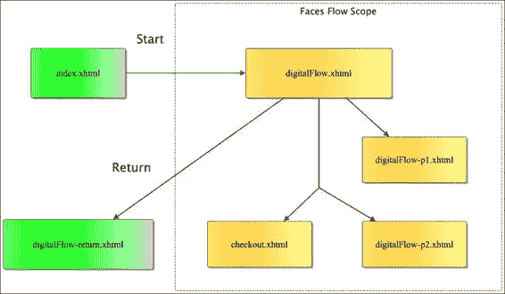
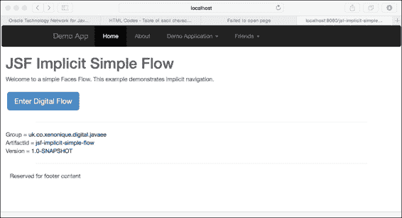
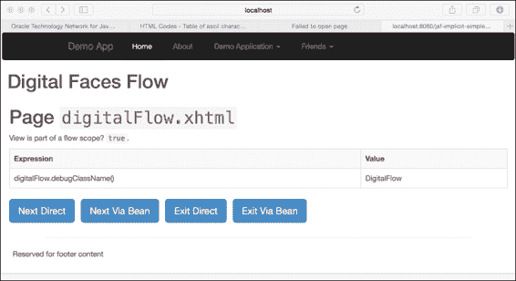
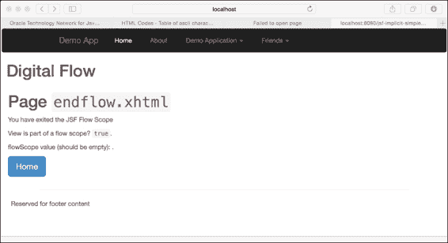
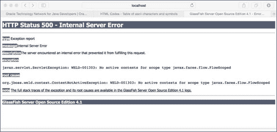
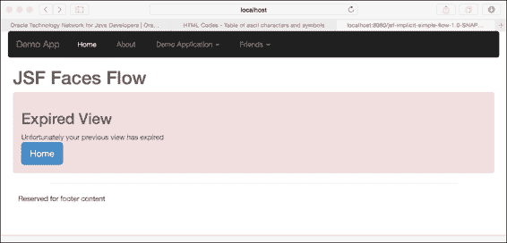
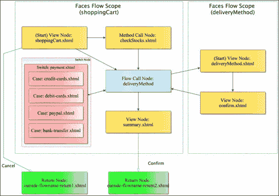
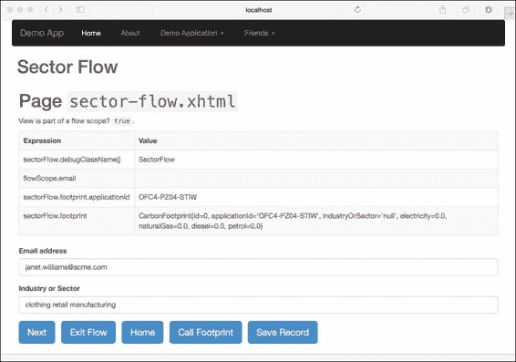
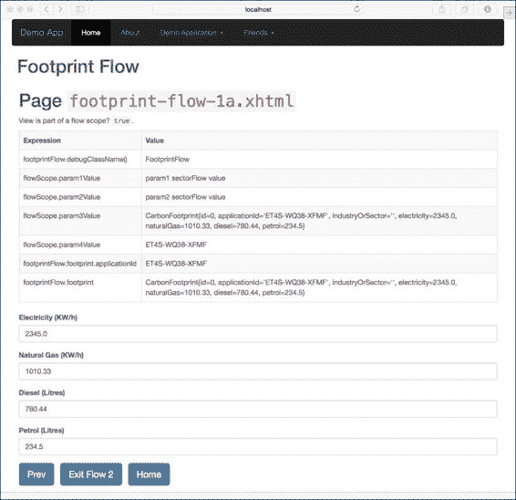
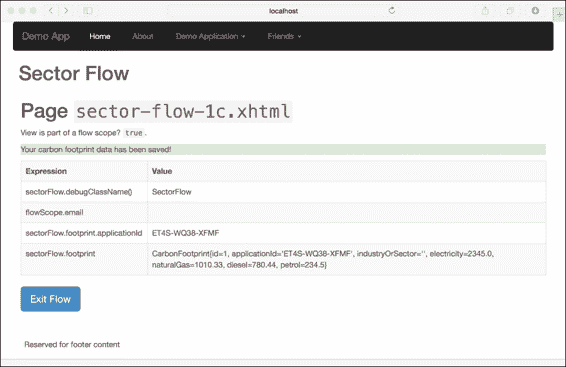

# 第六章. JSF 流程与优雅

|   | *"我有机缘驾驶过很多不同的飞机，但那次航天飞机的体验完全不同。"* |   |
| --- | --- | --- |
|   | --*指挥官克里斯·哈德菲尔德* |

本章介绍 JSF 2.2 中的新特性 Faces Flow。流程的概念源于工作流程和业务流程管理的概念。工作流程通常是一系列有序且可重复的业务活动，旨在高效地完成一个可实现的单位工作。这项工作可能涉及状态转换、数据处理以及/或提供服务或信息。

在许多网络电子商务应用中，结账流程是工作流程的一个很好的例子，它对用户来说是可见的。当你从亚马逊购买产品时，网站会带你到一个网站上的单独区域输入详细信息。在幕后，亚马逊会优雅地将你从负责处理电子和摄影部分产品的微服务，移动到结账工作流程的第一步微服务。你登录你的账户或创建一个新的账户，然后你决定送货地址。接下来，你用信用卡或借记卡支付，亚马逊会要求你提供一个发票地址。最后，你可以选择你希望产品如何交付。你可以选择将项目分组，也可以选择快递或普通配送。亚马逊的复杂工作流程难以复制；然而，JSF 允许数字开发者从基本的简单流程构建起来。

工作流程也出现在面向丰富用户客户端的应用程序中，尤其是政府及金融服务行业。你可能见证过类似工作流程的应用程序，它们是案例工作系统、交易系统和仓库系统。其基本思想是相同的，即引导员工从业务流程的开始到结束，通过不同的步骤。

在 JSF 2.2 中，Faces Flow 提供了创建类似于通用应用程序工作流程的行为和用户体验的基本编程 API。Apache MyFaces CODI（编排模块）、Spring Web Flow 和专有的 Oracle **应用程序开发框架**（**ADF**）等开源框架启发了 Faces Flow 的设计。

# 什么是 Faces Flow？

Faces Flow 是将具有特殊作用域的后台 bean 及其相关页面封装到一个模块中。一个 Faces Flow 是一个具有单个、明确定义的入口点和一到多个出口点的模块。应用程序开发者决定 Faces Flow 的组成方式和其功能。换句话说，Faces Flow 是一个低级 API，而其他框架，特别是具有 BPM 的框架，具有高级配置和宏观流程功能。

+   JSF Faces Flow 在执行上是模块化的；一个流程可以以嵌套的方式调用另一个流程。

+   Faces Flow 可以将参数传递给另一个嵌套流程，嵌套流程也可以通过一个称为 Flow Scope 的特殊映射属性返回数据。

+   应用程序开发者可以将流程与相应的页面打包到一个模块中，该模块可以分发给第三方开发者。

+   有一个全新的作用域称为 `FlowScoped`，它表示一个 POJO 是否是 flow-scoped 实例。这个注解是 `@javax.faces.flow.FlowScoped`。flow-scoped 实例与 CDI 兼容；因此，你可以使用熟悉的 Java EE 注解，并按顺序注入其他实例和 EJB 元素。

+   你可以像使用 `@RequestScoped`、`@ConversationScoped`、`@SessionScoped` 和 `@ApplicationScoped` 实例一样，编写 action-controller 方法并在 flow-scoped 实例中处理逻辑。

# 流程定义和生命周期

Faces Flows 使用 `@FlowScoped` 实例，用户可以进入一个单页，这被称为起始页。进入流程后，用户可以导航与流程关联的页面。用户可以在预定义的点上退出流程。一个流程可以调用嵌套流程。

`@FlowScoped` 实例的生命周期长于 `@ViewScoped` 实例，但短于 `@SessionScoped` 实例。因此，我们可以将 flow-scoped 实例与它们的对话兄弟进行比较。一个 `@ConversationalScoped` 实例维护浏览器中所有视图和网页标签的状态。像它们的对话伙伴一样，`@FlowScoped` 实例可以存活多个请求；实际上，它们甚至更好，因为它们在会话中有多个窗口的不同实例。flow-scoped 实例不会在浏览器标签之间共享。

当用户进入和离开应用程序中的流程时，Faces Flows 有一个专门的 CDI 作用域，JSF 框架实现使用它来激活和钝化实份数据。

当用户离开一个流程时，该实例就会受到 JVM 的垃圾回收。因此，与 `@SessionScoped` 和 `@ConversationalScoped` 实例相比，流程通常有较低的内存需求。

下图说明了 Faces Flow 的作用域。



# 简单隐式 Faces Flow

使用文件夹名称、一个空的 XML 配置和一些 Facelet 页面创建隐式 Faces Flow 是相对直接的。`flow` 是你 web 应用程序中的一个文件夹名称，最好在根目录下。我们从同一名称的目录中的基本流程 `digitalFlow` 开始。你的流程必须与文件夹名称匹配。

为了定义隐式流程，我们创建一个具有通用基本名称和后缀的空 XML 文件：`digitalFlow/digitalFlow-flow.xhtml`。

我们现在在具有通用基本名称的文件夹中创建一个起始页。这个文件是一个 Facelet 视图页面，称为 `digitalFlow/digitalFlow.xhtml`。

我们可以在文件夹内创建其他页面，并且它们可以有任何我们喜欢的名称。我们可能有 `digitalFlow/digitalFlow1.xhtml`、`digitalFlow/checkout.xhtml` 或 `digitalFlow/song.xhtml`。只有定义的流程 `digitalFlow` 可以访问这些页面。如果外部调用尝试访问这些页面中的任何一个，JSF 实现将报告错误。

为了退出隐式流程，我们必须在 Web 应用的根目录中提供一个特殊的页面 `/digitalFlow-return.xhtml`，这意味着该文件位于文件夹之外。

## 隐式导航

让我们将这些知识运用到我们的第一个 Faces Flow 导航示例中。在源代码中，项目被命名为 `jsf-implicit-simple-flow`。检查这个项目的文件布局是有帮助的，布局如下：

`src/main/java`

`src/main/webapp`

`src/main/webapp/WEB-INF/classes/META-INF`

`src/main/webapp/index.xhtml`

`src/main/webapp/assets/`

`src/main/webapp/resources/`

`src/main/webapp/basic-layout.xhtml`

`src/main/webapp/view-expired.xhtml`

`src/main/webapp/digitalFlow/`

`src/main/webapp/digitalFlow/digitalFlow.xml`

`src/main/webapp/digitalFlow/digitalFlow.xhtml`

`src/main/webapp/digitalFlow/digitalFlow-p2.xthml`

`src/main/webapp/digitalFlow/digitalFlow-p2.xthml`

`src/main/webapp/digitalFlow/digitalFlow-p4.xthml`

`src/main/webapp/digitalFlow-return.xhtml`

在研究前面的布局时，你会注意到项目有一个标准的首页 `index.xhtml`，正如我们所期望的那样。它有一个 `digitalFlow` 文件夹，这是网站专门为这个 Faces Flow 设定的特殊区域。在这个目录中，有一系列 Facelet 文件和一个配置。起始页面被称为 `digitalFlow.xhtml`，还有一个空的 XML 文件用于流程定义，`digitalFlow.xml`。

到现在为止，你已经知道了资产和资源文件夹的目的，但我们将很快回到 `view-expired.xhtml` 文件。我们如何确保我们的文件夹结构被当作 Faces Flow 处理？

## 流程作用域的 bean

使用注解 `@javax.faces.flow.FlowScoped`，我们将一个 POJO 定义为一个流程作用域的 bean。以下是我们第一个 Faces Flow 的代码，它是一个后端 bean：

```java
package uk.co.xenonique.digital.flows.control;
import javax.faces.flow.FlowScoped;
import javax.inject.Named;
import java.io.Serializable;

@Named
@FlowScoped("digitalFlow")
public class DigitalFlow implements Serializable {
    public String debugClassName() {
        return this.getClass().getSimpleName();
    }

    public String gotoPage1() {
        return "digitalFlow.xhtml";
    }

    public String gotoPage2() {
        return "digitalFlow-p2.xhtml";
    }

    public String gotoPage3() {
        return "digitalFlow-p3.xhtml";
    }

    public String gotoPage4() {
        return "digitalFlow-p4.xhtml";
    }

    public String gotoEndFlow() {
        return "/digitalFlow-return.xhtml";
    }
}
```

简单控制器类 `DigitalFlow` 有 `gotoPage1()` 和 `gotoPage2()` 等动作方法，用于将用户移动到流程中的适当页面。`gotoEndFlow()` 方法导航到 JSF 检测到的返回 Facelet 视图，以便退出流程。

`@FlowScoped` 注解需要一个单个的 String 值参数，在这个情况下与文件夹名称 `digitalFlow` 匹配。我们现在将转到视图。

## Facelet 视图

我们在 Facelet 视图中使用流程作用域的 bean，就像我们使用任何其他 CDI 作用域的 bean 一样。以下是从首页 `index.xhtml` 的摘录：

```java
<!DOCTYPE html>
<html 

       >

  <ui:composition template="/basic_layout.xhtml">
    <ui:define name="mainContent">
      <h1> JSF Implicit Simple Flow</h1>

      <p>
        Welcome to a simple Faces Flow...
      </p>

      <div class="content-wrapper">
        <h:form>
          <h:commandButton styleClass="btn btn-primary btn-lg"
            action="digitalFlow" value="Enter Digital Flow" />
        </h:form>
      </div>

      <!-- ... -->

    </ui:define> <!--name="mainContent" -->
  </ui:composition>
</html>
```

在前面的视图中，`<h:commandButton>`定义了一个名为流程的名称的动作，`digitalFlow`。调用此动作会导致 JSF 进入 Faces Flow，与后端 bean 的相应注解名称匹配。

JSF 认识到流程具有隐式导航，因为 XML 流程定义文件`digitalFlow.xml`为空。此文件必须存在；否则，实现会报告错误。文件内也不需要开始或结束标签。

当用户调用按钮时，JSF 在将其转发到起始页面之前实例化一个流程作用域 bean。以下是从流程`digitalFlow.xhtml`起始页面的摘录：

```java
<html  ...>
<ui:composition template="/basic_layout.xhtml>
  <ui:define name="mainContent">
    <!-- ... -->
    <div class="content-wrapper">
      <h1>Page <code>digitalFlow.xhtml</code></h1>
      <p>View is part of a flow scope? <code>
      #{null != facesContext.application.flowHandler.currentFlow}
      </code>.</p>

      <table class="table table-bordered table-striped">
          <tr>
              <th>Expression</th>
              <th>Value</th>
          </tr>
          <tr>
              <td>digitalFlow.debugClassName()</td>
              <td>#{digitalFlow.debugClassName()}</td>
          </tr>
      </table>

      <h:form prependId="false">
        <h:commandButton id="nextBtn1"
          styleClass="btn btn-primary btn-lg"
          value="Next Direct" action="digitalFlow-2" />
        &#160;
        <h:commandButton id="nextBtn2"
          styleClass="btn btn-primary btn-lg"
          value="Next Via Bean" action="#{digitalFlow.gotoPage2()}" />
        &#160;
        <h:commandButton id="exitFlowBtn1"
          styleClass="btn btn-primary btn-lg"
          value="Exit Direct" action="/digitalFlow-return" />
        &#160;
        <h:commandButton id="exitFlowBtn2"
          styleClass="btn btn-primary btn-lg"
          value="Exit Via Bean" action="#{digitalFlow.gotoEndFlow()}" />
        &#160;
      </h:form>
    </div>

  </ui:define> <!--name="mainContent" -->
</ui:composition>
</html>
```

该视图展示了使用熟悉的表达式语言调用流程作用域 bean 以及直接页面间导航的调用。为了允许用户移动到流程中的第二页，我们有两个命令按钮。具有属性 action 和值`digitalFlow-2`的命令按钮是页面导航直接，无需验证任何表单输入。具有属性 action 和表达式语言值`#{digitalFlow.gotoPage2()}`的命令按钮是对流程作用域 bean 方法的调用，这意味着执行整个 JSF 生命周期。

### 提示

如果您忘记了生命周期中的不同阶段，请参阅第二章，*JavaServer Faces 生命周期*。

在此视图中，我们还生成了输出`#{digitalFlow.debugClassName()}`，以说明我们可以在流程作用域 bean 中调用任意方法。

让我也提醒您注意以下实际内容中建立视图是否为流程一部分的表达式语言：

```java
#{null != facesContext.application.flowHandler.currentFlow}
```

这在功能上等同于以下 Java 语句：

```java
null == FacesContext.getCurrentInstance().getApplication()
   .getFlowHandler().getCurrentFlow()
```

其他页面，`digitalFlow-p2.xhtml`和`digitalFlow-p3.xhtml`，非常相似，因为它们只是添加了命令按钮以导航回前一个视图。您可以在书籍源代码分布中看到完整的代码。

### 提示

在数字工作中，我们经常为某些 HTML 元素提供众所周知的标识符（ID），尤其是表单控件。当我们编写用于网络自动化测试的测试脚本时，这非常有帮助，尤其是在使用 Selenium Web Driver 框架([`www.seleniumhq.org/`](http://www.seleniumhq.org/))时。

我们将跳转到最终视图，`digitalFlow-p4.xhtml`，并仅提取表单元素进行研究：

```java
<h:form prependId="false">
  <h:commandButton id="prevBtn1"
  styleClass="btn btn-primary btn-lg"
  value="Prev Direct" action="digitalFlow-p3" />
  &#160;
  <h:commandButton id="prevBtn2"
  styleClass="btn btn-primary btn-lg"
  value="Prev Via Bean" action="#{digitalFlow.gotoPage3()}" />
  &#160;
  <h:commandButton id="exitFlowBtn1"
  styleClass="btn btn-primary btn-lg"
  value="Exit Direct" action="/digitalFlow-return" />
  &#160;
  <h:commandButton id="exitFlowBtn2"
  styleClass="btn btn-primary btn-lg"
  value="Exit Via Bean" action="#{digitalFlow.gotoEndFlow()}" />
  &#160;
</h:form>
```

如我们所见，前面的内容说明了如何直接通过`DigitalFlow`后端 bean 进行导航。为了在隐式导航中退出流程，用户必须触发一个事件，将 JSF 框架带到`/digitalFlow-return.xhtml`视图，这将导致流程结束。直接导航到返回模式会跳过验证，并且表单输入元素中的任何数据都会丢失。如果我们想将表单输入元素作为表单请求进行验证，我们必须在动作控制器、后端 bean 中调用一个方法。

这就是 JSF Faces Flow 中的隐式导航。

真的是这么简单，所以让我们看看这个简单流程的截图，从主页`/index.html`开始：



`DigitalFlow`的起始页面`digital-flow.xhtml`看起来如下截图所示：



退出流程后，用户看到视图`/digitalFlow-return.xhtml`。以下是这个视图的截图：



如果我们在进入流程之前尝试通过已知的 URI `/digitalFlow/digitalFlow.xhtml` 直接访问 Facelet 视图，视图将类似于以下截图：



使用 GlassFish 4.1，我们收到一个 500 的 HTTP 响应码，这是一个内部服务器错误。此外，CDI 容器抛出一个异常，表示没有活动的流程作用域。

# 处理视图过期

我承诺过，我们会给我们的数字应用增加一些精致。如果你已经使用 JSF 了一段时间，你可能有一份相当多的带有`javax.faces.application.ViewExpiredException`作为根本原因的堆栈跟踪。这是最臭名昭著的异常之一。你可以增加 HTTP 会话的生存时间来补偿过时的请求，但一个普通人离开电脑有多长时间呢？同时，对象会持续存在于内存中。有一种更好的方法，那就是使用 Web XML 部署描述符。

在应用的`web.xml`文件中，我们需要触发一个重定向到更令人愉悦的错误页面。以下是从 XML 文件中提取的内容：

```java
<?xml version="1.0" encoding="UTF-8"?>
<web-app  ...>
  <!-- ... -->
  <error-page>
    <exception-type>
    javax.faces.application.ViewExpiredException
    </exception-type>
    <location>/view-expired.xhtml</location>
  </error-page>
  <!-- ... -->
</web-app>
```

`<error-page>`元素指定了异常类型和页面视图之间的关联。每当 JSF 遇到异常类型`ViewExpiredException`时，它将响应动作推进到页面视图`/view-expired.xhtml`。此行为的情况在以下截图中有说明：



我相信你们会同意，我们的公开客户会喜欢这个改进的专用页面视图，而不是对堆栈跟踪感到困惑。

### 提示

流程范围内的 Bean 依赖于 CDI，因此它们需要一个 Java EE 7 环境，这决定了 CDI 1.1 容器，例如 JBoss Weld。您还必须使用`@Named`而不是较旧的`@ManagedBean`注解。如果您不使用 WildFly 8 或 GlassFish 4，那么在深入代码之前，请检查您容器的实现是否支持最新的 JSF 和 CDI 规范。

## 与对话范围 Bean 的比较

如果您还记得，在使用`@ConversationScoped` Bean 时，我们必须显式地标记对话的状态。我们注入了`Conversation`实例，并在数字客户旅程的特定点上调用`begin()`和`end()`方法。使用`@FlowScoped` CDI Bean，作用域将在定义的点自动开始和结束。

## 捕获流程范围 Bean 的生命周期

由于 CDI 容器管理流程范围 Bean，它们可以正常参与上下文生命周期。我们可以使用`@PostConstruct`注解来初始化 Bean，获取数据库资源或计算可缓存的缓存数据。同样，当流程超出作用域时，我们可以使用`@PreDestroy`注解方法。

# 声明性和嵌套流程

到目前为止，我们已经看到了隐式流程的实际应用。对于最简单的流程，隐式流程非常直接，它就像一个基本的网页向导，用户可以线性地导航，向前和向后移动。它还可以使用随机访问来导航到页面。

如果我们想要进一步扩展 Faces Flow，那么我们必须深入研究 XML 流程定义，但首先让我们定义一些术语。

## 流程节点术语

受工作流和 BPM 启发的根本技术，Faces Flow 规范声明了以下表格中给出的不同类型的节点：

| 节点类型名称 | 描述 |
| --- | --- |
| **视图** | 表示任何类型的 JSF 应用视图 |
| **方法调用** | 表示通过**表达式语言**（**EL**）在流程图中进行方法调用 |
| **流程调用** | 表示调用另一个流程，带有出站（调用）和入站（返回）参数 |
| **流程返回** | 表示返回到调用流程 |
| **切换** | 表示通过 EL（表达式语言）确定的逻辑进行导航选择 |

以下是一个说明两个流程的示例，这两个流程代表了一个购物车业务流程。外部流程调用嵌套流程，该流程处理配送方式。



## XML 流程定义描述文件

由于 `<<Flowname>>` 是 web 应用程序中的一个文件夹名称，流程描述文件名与该模式匹配，即 `<<Flowname>>/<<Flowname>>.xml`。此描述文件的内容声明了 JSF 流的某些特性。它可以定义一个替代起始页，定义一组返回结果，并将某些结果映射到特定的页面。描述符还可以定义将结果映射到特定页面的条件布尔逻辑。

以下是一个 XML 流定义文件的示例：

```java
<?xml version='1.0' encoding='UTF-8'?>
<faces-config version="2.2"

  xsi:schemaLocation="
  http://xmlns.jcp.org/xml/ns/javaee
  http://xmlns.jcp.org/xml/ns/javaee/web-facesconfig_2_2.xsd">
  <flow-definition id="flow-id">

    <start-node>startPage</start-node>
    <view id="startPage">
      <vdl-document>/flowname/start.xhtml</vdl-document>
    </view>

    <view id="inside-flow-id-1"> <vdl-document>
      /flowname/inside-flow-id-1.xhtml </vdl-document>
    </view>
    <view id="inside-flow-id-2"> <vdl-document>
      /flowname/inside-flow-id-2.xhtml </vdl-document>
    </view>

    <flow-return id="return-from-flow-id-1">
      <from-outcome>/outside-page-1</from-outcome>
    </flow-return>
    <flow-return id="return-from-flow-id-2">
      <from-outcome>/outside-page-21</from-outcome>
    </flow-return>

  </flow-definition>
</faces-config>
```

根元素必须是带有适当 XML 命名空间的 `<faces-config>` 标签。您可能会对这种根元素的选择感到惊讶。这是因为流程定义可以在整个应用程序范围内全局定义，通过在 `/WEB-INF/faces-config.xml` 文件中设置流程定义来实现。然而，这种做法是一个高级用例，不建议用于模块化开发。

### 流定义标签

`<flow-definition>` 元素通过定义的流程 ID 建立 Faces 流。标识符的值必须与 `@FlowScoped` 实例的值匹配。此元素包含一系列标签，用于建立起始页、视图、流程返回或条件切换语句。

### 必要的流程返回标签

Faces 流必须至少有一个返回结果。`<flow-return>` 元素通过 ID 建立一个流程返回节点。它必须包含一个 `<flow-outcome>` 元素，其主体内容指定了 Facelet 视图。

### 视图页面标签

流可以可选地定义一组视图节点（页面），这些节点对于在范围内从一视图直接导航到另一视图是有用的。`<view>` 标签通过 `<vdl-document>` 元素建立视图描述语言节点。视图需要一个标识符。此标签的主体内容简单地引用了一个 Facelet 视图。因此，视图 ID 不一定必须与 Facelet 视图同名。

### 可选的起始页标签

开发者可以覆盖默认起始页的名称并提供一个替代视图。元素 `<start-node>` 的主体内容指定了视图 ID，因此引用了一个适当的流程，即视图节点。

### 切换、条件和案例标签

流定义通过一个名为 `<switch>` 的元素标签为开发者提供了定义条件逻辑的能力。这是 XML 中低级功能中的最高级。`<switch>` 标签指定了一个切换节点，这与在 `/WEB-INF/faces-config.xml` 文件中的 `<navigation-case>` 内使用 `<if>` 标签非常相似，显然是为了非流程导航。切换允许在流程中通过评估带有条件逻辑的 EL 表达式来映射多个 Facelet 视图。

以下是一个扩展的 XML 流定义示例文件：

```java
<faces-config version="2.2" ...>
  <flow-definition id="flow-id">
    ...
    <switch id="customerPaymentTab">
      <case>
        <if>
          #{controller.paymentType == 'CreditCard'}
        </if>
        <from-outcome>creditcard</from-outcome>
      </case>
      <case>
        <if>
          #{controller.paymentType == 'DebitCard'}
        </if>
        <from-outcome>debitcard</from-outcome>
      </case>
      <case>
        <if>
          #{controller.paymentType == 'PayPal'}
        </if>
        <from-outcome>PayPal</from-outcome>
      </case>
      <default-outcome>bacs-direct</default-outcome>
    </switch>
    ...
  </flow-definition>
</faces-config>
```

`<switch>`标签包含多个`<case>`元素和一个单独的`<default-outcome>`元素。每个`<case>`元素包含一个`<if>`和`<from-outcome>`元素。`<if>`的正文内容定义了一个条件逻辑 EL。`<from-outcome>`映射到最终的 Facelet 视图或引用视图节点的标识符。为 Switch 节点设置一个默认结果是很好的主意。当所有 case 条件都不为真时，`<default-outcome>`的正文内容确定这个结果。

在这个例子中，我们有一个在电子商务网站结账过程中使用的虚拟支付控制器。当流程遇到`customerPaymentTab`结果，这是 Switch 节点的标识符时，JSF 按顺序处理每个 case 条件逻辑。如果这些条件测试中的任何一个评估为真，那么 JSF 就选择该结果作为 switch 的结果。比如说`#{controller.paymentType == 'DebitCard' }`为真，那么借记卡就是选择视图。如果没有测试评估为真，那么结果视图是`bacs-direct`。

### 提示

但是，所有的逻辑不都应该在控制器中定义而不是在 Switch 节点中吗？无论哪种方式，答案都是具有争议性的，并且取决于具体情况。如果你作为一个库开发者构建一个具有复杂 Faces Flow 图的复杂应用程序，那么可以争论这种灵活性对于外部配置器是有益的。如果你在构建简单应用程序，那么遵循 YAGNI（You Aren't Going to Need it）的实践可能有助于最小可行产品。

这涵盖了我们需要了解的所有关于基本流程定义文件的内容。现在让我们继续看嵌套声明性流程。

## 这是一个嵌套流程的例子

是时候看看嵌套声明性流程定义的 Faces Flow 的实际例子了。我们的应用程序很简单。它允许客户记录碳足迹数据。所以首先让我们定义一个数据记录：

```java
package uk.co.xenonique.digital.flows.entity;
import javax.persistence.*;
import java.io.Serializable;

@Entity
@Table(name = "CARBON_FOOTPRINT")
@NamedQueries({
  @NamedQuery(name="CarbonFootprint.findAll",
    query = "select c from CarbonFootprint c "),
  @NamedQuery(name="CarbonFootprint.findById",
    query = "select c from CarbonFootprint c where c.id = :id"),
})
public class CarbonFootprint implements Serializable {
  @Id
  @GeneratedValue(strategy = GenerationType.AUTO)
  private long id;

  private String applicationId;
  private String industryOrSector;
  // KWh (main source)
  private double electricity;
  // KWh (main source)
  private double naturalGas;
  // Litres (travel commute costs)
  private double diesel;
  // Litres (travel commute costs)
  private double petrol;

  public CarbonFootprint() { }

  // hashCode(), equals() and toString()
  // Getters and setters omited
}
```

`CarbonFootprint`是一个 JPA 实体 bean，它声明了一组属性来存储客户的碳足迹数据。用户可以提供他们的行业或部门，以及他们在一段时间内消耗的电力、天然气、柴油和汽油的数量。记录还有一个`applicationId`值，我们将利用它。

让我们查看这个项目的文件布局：

`src/main/java`

`src/main/webapp`

`src/main/webapp/WEB-INF/classes/META-INF`

`src/main/webapp/index.xhtml`

`src/main/webapp/assets/`

`src/main/webapp/resources/`

`src/main/webapp/basic-layout.xhtml`

`src/main/webapp/view-expired.xhtml`

`src/main/webapp/section-flow/`

`src/main/webapp/section-flow/section-flow.xml`

`src/main/webapp/section-flow/section-flow.xhtml`

`src/main/webapp/section-flow/section-flow-1a.xthml`

`src/main/webapp/section-flow/section-flow-1b.xthml`

`src/main/webapp/section-flow/section-flow-1c.xthml`

`src/main/webapp/footprint-flow/`

`src/main/webapp/footprint-flow/footprint-flow.xml`

`src/main/webapp/footprint-flow/footprint-flow.xhtml`

`src/main/webapp/footprint-flow/footprint-flow-1a.xml`

`src/main/webapp/endflow.xhtml`

该项目名为 `jsf-declarative-flows`，并作为书籍源代码的一部分提供。该项目包含两个流程：`section-flow` 和 `digital-flow`。章节流程捕捉了这个虚构示例中的行业信息。足迹流程捕捉能源消耗数据。这两个流程共享一个客户详细信息记录，即 `CarbonFootprint` 实体对象，您将在后面的 backing beans 中看到。

### XML 流程定义

以下是对应于行业流程的 XML 流程定义，`sector-flow/sector-flow.xhtml`：

```java
<faces-config version="2.2" ...>
  <flow-definition id="sector-flow">
    <flow-return id="goHome">
      <from-outcome>/index</from-outcome>
    </flow-return>
    <flow-return id="endFlow">
      <from-outcome>#{sectorFlow.gotoEndFlow()}</from-outcome>
    </flow-return>

    <flow-call id="callFootprintFlow">
      <flow-reference>
        <flow-id>footprint-flow</flow-id>
      </flow-reference>
      <outbound-parameter>
        <name>param1FromSectorFlow</name>
        <value>param1 sectorFlow value</value>
      </outbound-parameter>
      <outbound-parameter>
        <name>param2FromSectorFlow</name>
        <value>param2 sectorFlow value</value>
      </outbound-parameter>
      <outbound-parameter>
        <name>param3FromSectorFlow</name>
        <value>#{sectorFlow.footprint}</value>
      </outbound-parameter>
      <outbound-parameter>
        <name>param4FromSectorFlow</name>
        <value>#{sectorFlow.footprint.applicationId}</value>
      </outbound-parameter>
    </flow-call>
  </flow-definition>
</faces-config>
```

此流程的标识符为 `sector-flow`，与文件夹名称匹配。它还建立了 backing bean、动作控制器上的 `@FlowScoped` 值，正如我们稍后将要看到的。

有两个流程返回节点，即 `goHome` 和 `endFlow`。`goHome` 具有直接导航到主页的功能，而 `endFlow` 通过 EL 值 `#{sectorFlow.gotoEndFlow()}` 在 bean 上调用操作。这种技术特别有用，可以确保在允许客户完成他们的数字旅程之前，他们已经输入了正确并经过验证的数据。

新节点 `callFootprintFlow` 代表嵌套流程调用。元素 `<flow-call>` 定义了一个流程调用节点。它必须有一个 `<flow-reference>` 标签元素，其中嵌套 `<flow-id>` 标签。后者的主体内容定义了目标流程的标识符。

`<outbound-parameter>` 元素指定了如何将参数和值对传递到目标流程。每个参数都需要一个 `<name>` 和一个 `<value>` 元素。调用流程中传出参数的名称必须与被调用流程中传入参数的名称匹配。

`param1FromSectorFlow` 和 `param2FromSectorFlow` 展示了如何从一个流程传递字面字符串值到另一个流程。如果您传递的是数值，那么您必须在目标流程中自行编码和解码这些值。参数 `param3FromSectorFlow` 和 `param4FromSectorFlow` 也说明了如何使用 EL。注意我们如何轻松地将实体记录 `#{sectorFlow.footprint}` 从行业流程传递到足迹流程。我们还可以像在最后一个参数中那样传递单个属性：`#{sectorFlow.footprint.applicationId}`。

以下是对应于足迹流程的 XML 流程定义，`footprint-flow/footprint-flow.xml`：

```java
<faces-config version="2.2" ...>
  <flow-definition id="footprint-flow">
    <flow-return id="goHome">
      <from-outcome>/index</from-outcome>
    </flow-return>
    <flow-return id="exitFromFootprintFlow">
      <from-outcome>#{footprintFlow.exitFromFootprintFlow}</from-outcome>
    </flow-return>
    <flow-return id="exitToSectionFlow">
      <from-outcome>/section-flow</from-outcome>
    </flow-return>

    <inbound-parameter>
      <name>param1FromSectorFlow</name>
      <value>#{flowScope.param1Value}</value>
    </inbound-parameter>
    <inbound-parameter>
      <name>param2FromSectorFlow</name>
      <value>#{flowScope.param2Value}</value>
    </inbound-parameter>
    <inbound-parameter>
      <name>param3FromSectorFlow</name>
      <value>#{flowScope.param3Value}</value>
    </inbound-parameter>
    <inbound-parameter>
      <name>param4FromSectorFlow</name>
      <value>#{flowScope.param4Value}</value>
    </inbound-parameter>

  </flow-definition>
</faces-config>
```

此流程通过名称 `footprint-flow.xml` 进行标识。它有一组返回流程节点。`goHome` 节点实际上会退出流程到调用主页，尽管视图文档值为 `/index`。您可能会认为这种行为很奇怪。然而，JSF 是正确的，因为当前的流程足迹是一个嵌套流程，它将流程指针驱动到调用流程 `sector` 的状态。节点 `exitFromFootprintFlow` 和 `exitToSectionFlow` 代表不同的导航策略，分别是间接和直接。

`<inbound-parameter>` 元素的集合指定了流向流程的传入参数。参数的名称非常重要，因为它们必须与调用流程中相应的 `<outbound-parameter>` 元素中的名称匹配。值定义了 EL 对象引用，它说明了这些值被写入的位置。换句话说，在 Faces Flow 中的参数传递行为类似于映射属性名称传输。

让我们分析 `sector-flow.xml` 的第三个参数。它将实体记录实例 `CarbonFootprint` 的值发送到嵌套的 Footprint 流程：

```java
<outbound-parameter>
  <name>param3FromSectorFlow</name>
  <value>#{sectorFlow.footprint}</value>
</outbound-parameter>
```

在 `footprint-flow.xml` 中，传入参数名称与传入参数名称匹配：

```java
<inbound-parameter>
  <name>param3FromSectorFlow</name>
  <value>#{flowScope.param3Value}</value>
</inbound-parameter>
```

EL 指定了 JSF 设置参数值到对象属性的位置。在这种情况下，`flowScope` 映射集合有一个键和一个值设置。我们可以使用任何具有生命周期大于或等于流程生命周期的现有对象。我们倾向于使用 `flowScope`，因为它旨在在 Face Flows 之间传递参数。因为我们可以在对象中引用属性，所以我们也有从嵌套流程返回信息的能力。调用流程可以在嵌套流程结束后检索值。

现在我们已经从 XML 视角理解了嵌套流程，我们可以查看 Java 源代码。

### 流程 Bean

`sector-flow` 后备 Bean 的外观如下：

```java
package uk.co.xenonique.digital.flows.control;
import uk.co.xenonique.digital.flows.boundary.*;
import uk.co.xenonique.digital.flows.entity.*;
import uk.co.xenonique.digital.flows.utils.UtilityHelper;
// ...
@Named
@FlowScoped("sector-flow")
public class SectorFlow implements Serializable {
  @Inject UtilityHelper utilityHelper;
  @Inject CarbonFootprintService service;

  private CarbonFootprint footprint
   = new CarbonFootprint();

  public SectorFlow() {}

  @PostConstruct
  public void initialize() {
    footprint.setApplicationId(
      utilityHelper.getNextApplicationId());
  }

  public String gotoEndFlow() {
    return "/endflow.xhtml";
  }

  public String debugClassName() {
    return this.getClass().getSimpleName();
  }

  public String saveFootprintRecord() {
    service.add(footprint);
    return "sector-flow-1c.xhtml";
  }

  // Getters and setters ...
}
```

`SectorFlow` 类用 `@FlowScoped` 注解，其值与流程定义 XML 文件匹配。我们用 `@PostConstruct` 注解一个 `initialize()` 方法，以便在实体记录中设置随机应用程序 ID。请注意，我们无法在这里将此逻辑放入正常的 Java 构造函数中，因为我们的 Bean 是通过 CDI 容器赋予生命的。

我们向 `SectorFlow` 注入几个实例。`UtilityHelper` 是一个 `@ApplicationScoped` CDI POJO 类，用于生成随机应用程序标识符。有一个有状态的 EJB `CarbonFootprintService` 负责处理 JPA 持久化。

`gotoEndflow()` 方法是一个导航结束，用于退出流程。该方法 `saveFootprintRecord()` 使用数据服务将 `CarbonFootprint` 实体存储到数据库中。

这就完成了内部流程，即 `SectorFlow`；嵌套后备 Bean `FootprintFlow` 的代码如下：

```java
@Named
@FlowScoped("footprint-flow")
public class FootprintFlow implements Serializable {
  private CarbonFootprint footprint;
  public FootprintFlow() { }

  @PostConstruct
  public void initialize() {}
    Map<Object,Object> flowMap =
      FacesContext.getCurrentInstance()
        .getApplication().getFlowHandler()
        .getCurrentFlowScope();
    footprint = (CarbonFootprint) flowMap.get("param3Value");
  }

  public String exitFromFootprintFlow() {
    return "/endflow.xhtml";
  }

  public String gotoPage1() {
    return "footprint-flow";
  }

  public String gotoPage2() {
    return "footprint-flow-1a";
  }

  public String debugClassName() {
    return this.getClass().getSimpleName();
  }

  // Getters and setters ...
}
```

我们重复之前的技巧；我们用 `@PostConstruct` 注解 `FootprintFlow` 类。在 `initialize()` 方法中，我们通过 `FacesContext` 实例程序性地从流程作用域中检索对象。请注意，参数名称 `param3Value` 必须与 XML 定义中的值一致。流程作用域中的值恰好是 `CarbonFootprint` 实体。

你可能想知道为什么我们要费心从一个作用域中检索一个实体并将其设置为 bean 属性？这只是一个例子，允许页面内容设计者在页面中使用一致的标记。EL `#{footprintFlow.footprint.diesel}` 比起 `#{flowScope.param3Value.diesel}` 更易于理解。

我们现在将转向标记。

### 页面视图

我们现在已经熟悉了页面视图的内容标记。让我们研究一下 `sector-flow/sector-flow.xhtml`：

```java
<h1>Page <code>sector-flow.xhtml</code></h1>
...
<table class="table table-bordered table-striped">
  <tr>
    <th>Expression</th>
    <th>Value</th>
  </tr>
  ...
  <tr>
    <td>sectorFlow.footprint.applicationId</td>
    <td>#{sectorFlow.footprint.applicationId}</td>
  </tr>
  <tr>
    <td>sectorFlow.footprint</td>
    <td>#{sectorFlow.footprint}</td>
  </tr>
</table>

<h:form prependId="false">
  <div class="form-group">
    <label jsf:for="exampleInputEmail1">
    Email address</label>
    <input type="email" class="form-control"
      jsf:id="exampleInputEmail1" placeholder="Enter email"
      jsf:value="#{flowScope.email}"/>
  </div>
  <div class="form-group">
    <h:outputLabel for="industryOrSector">Industry or Sector</h:outputLabel>
    <h:inputText type="text" class="form-control" id="industryOrSector"
       placeholder="Your industry sector"
       value="#{sectorFlow.footprint.industryOrSector}"/>
  </div>

  <h:commandButton id="nextBtn" styleClass="btn btn-primary btn-lg" value="Next" action="sector-flow-1a" />
  &#160;
  <h:commandButton id="exitFlowBtn" styleClass="btn btn-primary btn-lg" value="Exit Flow" action="endFlow" />
  &#160;
  <h:commandButton id="homeBtn" styleClass="btn btn-primary btn-lg" value="Home" action="goHome" />
  &#160;
  <h:commandButton id="callFootPrintFlowBtn" styleClass="btn btn-primary btn-lg" value="Call Footprint" action="callFootprintFlow" />
  &#160;
  <h:commandButton id="saveBtn" styleClass="btn btn-primary btn-lg" value="Save Record" action="#{sectorFlow.saveFootprintRecord()}" />
  &#160;
</h:form>
```

视图使用 HTML5 友好的标记和标准 JSF 标签的混合。输入文本字段 `exampleInputEmail1` 及其关联的标签提醒我们关于 HTML5 友好的标记。此输入控件与流程作用域映射集合相关联，即 `#{flowScope.email}`。答案是肯定的，我们被允许这样做，但我们最好在应用程序的某个地方存储数据值！

输入元素 `industryOrSector` 显示了 JSF 标准标签，并且它直接关联到 `CarbonFootprint` 实体记录。

让我提醒大家注意那个调用后端 bean 中 `saveFootprintRecord()` 动作方法的命令按钮 `saveBtn`。最后，有一个专门的命令按钮，其标识为 `callFootPrintFlowBtn`，它调用嵌套流程。`callFootprintFlow` 动作与 `sector-flow.xml` 流定义文件中的节点完全匹配。

有一个 `nextBtn` 命令按钮，可以直接导航到流程中的下一个视图。`homeBtn` 命令按钮退出流程并返回主页。

视图的其余部分以 HTML Bootstrap 风格的表格显示可调试的输出。JSF `<h:form>` 元素上的 `prependId=false` 通知 JSF 避免对控件属性 HTML 标识符进行糖化。

### 注意

JSF 表单 `prependId` 指定在 `clientId` 生成过程中 `<h:form>` 是否应该将其 ID 预先附加到其子代 ID 上。当在外部表单中导入或插入复合组件（这些组件是表单）时，该标志变得相关。此值默认为 true。

以下是一个起始页面 `sector-flow/sector-flow.xhtml` 的截图：



在源代码中，我们使用 EL 输出了一系列可调试的值。在本书的源代码中，项目被命名为 `jsf-declarative-form`。你将找到一个没有调试输出的专业版本，被称为 `jsf-declarative-form-pro`。

以下是一个嵌套流程的截图，`footprint-flow-1a.xhtml`。在导航到起始页面后，我们点击了 **下一步** 按钮，在表单中输入了一些数据，并将其保存。



回到 `SectorFlow`，当我们调用 `SaveBtn` 命令按钮时，JSF 会调用 `saveFootprintRecord()` 方法。记录将被保存到数据库中，并且会显示视图 `sector-flow-1c.xthml`，如下截图所示：



剩下的只有注入的 POJO 的源代码`UtilityHelper`和 EJB`CarbonFootprintService`。不幸的是，我们无法在这个书中展示所有列表。

# 一个现实世界的例子

为了总结 Faces Flows，让我们看看如何向我们的应用程序添加功能。我们希望我们的 JSF 应用程序具有质量和优雅。在本书的源代码中，你可以在`jsf-product-flow`和`jsf-product-flow-s2`项目下找到这些示例。第一个项目演示了概念的原型设计。第二个项目展示了改进和清理后的数字设计，具有足够的质量向业务利益相关者展示。

## 确保应用程序填充数据库

通常，我们开发的应用程序针对 UAT 数据库进行测试。我们编写代码将测试信息填充到数据库中，这些信息不会进入生产环境。在许多情况下，我们只想启动应用程序以检查是否已引入了正确的模式。

我们的第一想法是创建一个带有`@PostConstruct`注解的`@ApplicationScoped` POJO，这将解决我们的启动问题。我们可以编写一个`DataPopulator`类，其唯一目的是在开发应用程序中创建数据。尽管我们有全公司的应用程序实例，但我们不能保证我们的 bean 在 Web 应用程序启动后被调用。

使用 Java EE，我们可以使用`@javax.ejb.Startup`和`@javax.ejb.Singleton`来启动 EJB。`@Startup`注解确保在应用程序部署后，EJB 容器初始化 bean。`@Singleton`注解表示会话 bean，它保证在应用程序中最多只有一个实例。

以下是为`DataPopulator`对象编写的代码：

```java
package uk.co.xenonique.digital.product.utils;
import javax.annotation.PostConstruct;
import javax.ejb.Singleton;
import javax.ejb.Startup;
import javax.inject.Inject;

@Singleton
@Startup
public class DataPopulator {
  @Inject ExtendedPersistenceLoaderBean loaderBean;

  @PostConstruct
  public void populate() {
    loaderBean.loadData();
  }
}
```

因此，为了用数据填充应用程序，我们委托另一个 bean。`ExtendedPersistenceLoaderBean`是一个具有新 CDI 1.1 事务范围的 CDI bean。以下是这个委托的代码：

```java
package uk.co.xenonique.digital.product.utils;
import uk.co.xenonique.digital.product.boundary.*;
import uk.co.xenonique.digital.product.entity.*;
import uk.co.xenonique.digital.product.entity.*;
import javax.annotation.*;
import javax.ejb.*;
import javax.inject.Inject;
import java.io.Serializable;
import java.util.*;

@TransactionAttribute(TransactionAttributeType.REQUIRES_NEW)
@javax.transaction.TransactionScoped
public class ExtendedPersistenceLoaderBean implements Serializable {
  public static final String DEFAULT = "digital";

  @Inject
  UserProfileService service;

  @PostConstruct
  public void init() { /* ... */ }

  @PreDestroy
  public void destroy() { /* ... */ }

  public void loadData() {
    UserRole userRole = new UserRole("user");
    UserRole managerRole = new UserRole("manager");

    List<UserProfile> users = Arrays.asList(
      new UserProfile("user@products.com", DEFAULT, userRole),
      new UserProfile("test@products.com", DEFAULT, userRole),
      new UserProfile("admin@products.com", DEFAULT, managerRole),
    );

    for (UserProfile user: users) {
      service.add(user);
    }
  }
}
```

我们使用`@TransactionScoped`注解来标注`DataPopulator`对象。每当我们在`@TransactionScoped`对象上调用方法时，方法、CDI 容器将激活一个事务或创建一个事务。单个事务将在同一对象上的多个方法之间共享，或者在不同可能被调用的`@TransactionScoped`对象之间共享。换句话说，事务上下文在参与组件之间传递，而不需要开发者添加显式的方法参数来传递`javax.transaction.TransactionContext`实例。

回顾一下，我们在`DataPopulator`对象上添加了另一个特殊注解。

一旦在这个 Bean 上调用任何方法，线程上下文就会与一个新的事务关联，因为我们用`@TransactionAttribute`注解了这个类，并传递了一个属性值`TranscationAttributeType.NEW`。这强制容器创建一个新的事务，无论是否已经存在一个。事务作用域的生命周期是调用`loadData()`的持续时间。该方法只是在数据库中创建几个`UserRole`实体，然后为使用`UserProfile`实体进行登录创建用户账户。

最后，`init()`和`destroy()`方法只是将调试信息打印到控制台，详细内容在摘录中未显示。

### 提示

尽管 CDI 1.1 为 CDI Bean 定义了`@javax.inject.Singleton`注解，但这个 CDI Bean 的确切启动在规范中并没有定义，因为`@javax.inject.Startup`中缺少这个规范。因此，我们必须依赖于 EJB 单例启动 Bean。我们可能不得不等到 CDI 2.0 和 Java EE 8 才能看到这个注解。

现在我们有了用户配置文件和角色，我们如何确保 JSF 应用程序的安全性？

## 保护页面视图和流程

如果你想要继续使用标准的 Java EE 库，那么规范中就有容器管理认证功能。为了利用这个功能，你需要扩展 web 部署描述符文件`web.xml`，并为你的应用程序添加一个安全约束。

以下是一个`web.xml`文件中安全约束的示例：

```java
<security-constraint>
  <web-resource-collection>
    <web-resource-name>public</web-resource-name>
    <url-pattern>/products/*</url-pattern>
    <url-pattern>/cart/*</url-pattern>
    <url-pattern>/checkout/*</url-pattern>
    <url-pattern>/promotions/*</url-pattern>
  </web-resource-collection>
  <auth-constraint>
    <role-name>*</role-name>
  </auth-constraint>
  <user-data-constraint>
    <transport-guarantee>NONE</transport-guarantee>
  </user-data-constraint>
</security-constraint>

<security-constraint>
  <web-resource-collection>
    <web-resource-name>admin</web-resource-name>
    <url-pattern>/admin/*</url-pattern>
  </web-resource-collection>
  <auth-constraint>
    <role-name>admin</role-name>
  </auth-constraint>
  <user-data-constraint>
    <transport-guarantee>CONFIDENTIAL</transport-guarantee>
  </user-data-constraint>
</security-constraint>
```

第一个安全约束将这个网站的产品、购物车、结账和促销页面限制为任何用户。注意给出的通配符作为角色名称。第二个安全约束将这个网站的 admin 页面仅限制为具有管理员角色的用户。

`<user-data-constraint>`元素声明页面视图是否可以通过 HTTP 或 HTTPS 访问。它指定了所需的安全级别。可接受的值是`NONE`、`INTEGRAL`和`CONFIDENTIAL`。将传输保证设置为`CONFIDENTIAL`通知应用程序服务器，这些页面和资源只能通过 SSL 访问。`INTEGRAL`值在客户端或服务器发送的数据不应以任何方式更改的通信中很重要。

### 提示

提示：Java EE 8 安全性——关于未来的 TODO（供我检查更新和进展的笔记。见[`javaee8.zeef.com/arjan.tijms`](https://javaee8.zeef.com/arjan.tijms)）。对于标准的 Java EE 安全性来说，替代方案并不多。其他选择有 Apache Shiro ([`shiro.apache.org/`](http://shiro.apache.org/)) 或 Spring Security（以前称为 Acegi）。希望 Java EE 8 将包括一个全新的概念，也许是一个单独的规范。

虽然标准机制快速且易于添加，但它特定于应用服务器。该机制仅适用于粗粒度资源，并且没有可以应用于 CDI Bean 的注解。Java EE 安全需要配置安全领域，它定义了用户组的角色。为了使用细粒度权限来保护网站，我们必须添加多个角色，这可能导致高度复杂性。

我们可以为 JSF 和 Web 应用程序定义自己的自定义安全。这种方法的优点是我们有细粒度控制，并且它可以在容器之间工作。另一方面，如果我们忽略了 Java EE 安全标准特性，那么任何自制的安全实现可能都没有在野外得到充分的验证，以确保其安全性。这样的组件将无法通过基本的渗透测试。在最理想的情况下，如果要求简单且对复杂权限的要求不多，自定义安全才能正常工作。

为了创建自定义安全，我们应定义一个独特的`javax.servlet.ServletFilter`，以保护我们网站某些区域的访问。`LoginAuthenticationFilter`定义如下：

```java
package uk.co.xenonique.digital.product.security;
import uk.co.xenonique.digital.product.control.LoginController;

import javax.servlet.*;
import javax.servlet.annotation.WebFilter;
import javax.servlet.http.*;
import java.io.IOException;

@WebFilter(urlPatterns={"/protected/*", "/simple/*"})
public class LoginAuthenticationFilter implements Filter {
  private FilterConfig config;

  public void doFilter(ServletRequest req,
    ServletResponse resp, FilterChain chain)
    throws IOException, ServletException
  {
    final HttpServletRequest request =
      (HttpServletRequest)req;
    final HttpServletResponse response =
      (HttpServletResponse)resp;
    if (request.getSession().getAttribute(
      LoginController.LOGIN_KEY) == null) {
      response.sendRedirect(
      request.getContextPath()+LoginController.LOGIN_VIEW);
    } else {
      chain.doFilter(req, resp);
    }
  }

  public void init(FilterConfig config)
  throws ServletException {
    this.config = config;
  }

  public void destroy() {
      config = null;
  }
}
```

我们使用`@WebFilter`注解来标记我们想要保护的 URL 资源。如果用户尝试访问`/protected/*`和`/simple/*`文件夹下的页面，那么`LoginAuthenticationFilter`过滤器将被触发。Servlet 容器调用`doFilter()`方法，我们检查是否存在 HTTP 会话属性。如果存在键`LoginController.LOGIN_KEY`，则用户已登录到网站，否则，用户将被重定向到登录页面视图。

让我们转到后台 Bean `LoginController`，它允许用户登录到网站：

```java
package uk.co.xenonique.digital.product.control;
// imports elided...

@Named("loginController") @RequestScoped
public class LoginController {
  public final static String LOGIN_KEY="LOGIN_USERNAME";
  public final static String LOGIN_VIEW="/login.xhtml";

  private String username;
  private String password;

  @Inject UserProfileService userProfileService;

  public boolean isLoggedIn() {
    return FacesContext.getCurrentInstance()
      .getExternalContext().getSessionMap()
      .get(LOGIN_KEY) != null;
  }

  public String login() {
      List<UserProfile> users =
        userProfileService.findById(username);
      if ( users.isEmpty()) {
        throw new IllegalArgumentException("unknown user");
      }
      if ( !users.get(0).getPassword().equals(password)) {
        throw new IllegalArgumentException("invalid password");
      }

      FacesContext.getCurrentInstance().getExternalContext()
        .getSessionMap().put(LOGIN_KEY, username);
      return "/protected/index?faces-redirect=true";
  }

  public String logout() {
    FacesContext.getCurrentInstance().getExternalContext()
      .getSessionMap().remove(LOGIN_KEY);
    return "/index?faces-redirect=true";
  }

  // Getters and setter omitted ...
}
```

`LoginController`后台 Bean 接受两个基于表单的参数：用户名和密码。它依赖于注入的`UserProfileService`通过用户名查找`UserProfile`记录。在`login()`方法内部，如果密码参数与实体记录匹配，则允许用户登录。该方法将用户名添加到 HTTP 会话中，键为`LOGIN_KEY`。

有几个有用的方法。`logout()`方法从 HTTP 会话中移除登录键。`isLoggedIn()`方法检查用户是否已登录。

Servlet 过滤器仅处理直接导航资源、servlet、过滤器和路径。我们需要另一个保护器来保护 JSF 视图，因为`LoginAuthenticationFilter`不足以做到这一点。

以下是一个名为`LoginViewAuthenticator`的后台 Bean 控制器的代码：

```java
package uk.co.xenonique.digital.product.security;
import javax.faces.application.NavigationHandler;
// other imports elided...

@Named("loginViewAuthenticator") @ApplicationScoped
public class LoginViewAuthenticator {
  // ...

  public void check() {
    FacesContext facesContext = FacesContext.getCurrentInstance();
    HttpSession session = (HttpSession)
      facesContext.getExternalContext().getSession(true);
    String currentUser = (String)session.getAttribute(
      LoginController.LOGIN_KEY);
    if (currentUser == null || currentUser.length() == 0) {
      NavigationHandler navigationHandler =
        facesContext.getApplication().getNavigationHandler();
      navigationHandler.handleNavigation(
        facesContext, null, LoginController.LOGIN_VIEW);
    }
  }
}
```

`LoginViewAuthenticator` 类的 `check()` 方法执行检查。我们从 HTTP 会话中检索已知的密钥 `LOGIN_KEY`。请注意，我们可以通过在 `FacesContext` 上调用 `getExternalContext()` 方法的链式调用，访问 Java Servlet API 的一部分。我们检索 `HttpSession` 实例或创建一个，然后检查关联的值。如果用户未登录，则我们更改当前 `NavigationHandler` 的目标。JSF 中的导航处理程序是一个实现定义的类型，它在 Faces 请求-响应交互期间携带目标结果字符串。

我们在页面视图中使用 `LoginViewAuthenticator` 来限制访问：

```java
<ui:composition template="/basic_layout.xhtml">
  <ui:define name="mainContent">
    <f:metadata>
      <f:event type="preRenderView"
       listener="#{loginViewAuthenticator.check}" />
    </f:metadata>

    <div class="login-username-box  pull-right">
      <b>#{sessionScope['LOGIN_USERNAME']}</b>
    </div>
    <h1> JSF Protected View </h1>

    <!-- ... -->
</ui:composition>
```

对于页面 `view /protected/index.html`，我们在 `<f:metadata>` 部分插入了一个预渲染视图事件。`<f:event>` 元素调用了 `LoginViewAuthenticator` 实例的 `check()` 方法。

在项目中，我们还通过向页面视图 `/simple.xhtml` 添加相同的 stanza 来保护 Faces 流。这个视图是起始页面，因此在这里添加预渲染视图事件实际上限制了访问流。`LoginViewAuthenticator` 实例确保未知网站用户被重定向到 `/login.xhtml` 视图。

# 资源库合约

JSF 2.2 作为 Java EE 7 的一部分，引入了在称为资源库合约的设施下主题化和样式化网站的能力。合约的想法是关于在运行时动态重用 Facelets。现在，通过合约可以在不重新部署应用程序的情况下在资源之间切换。合约也可以为匹配 URL 模式的页面静态声明。

规范保留了一个名为 `/contracts` 的特殊命名文件夹作为资源库合约的父文件夹。这个文件夹是默认的。如果你已经有一个名为此视图的文件夹，那么你将不得不按名称重构，遗憾的是。

在类路径上还有一个默认位置，`META-INF/contracts`，用于 JAR 文件。这个位置允许资源库合约被打包成 JAR 文件，以便分发给第三方客户。

在 `/contracts` 文件夹内，开发者可以定义命名的合约（或主题）。你只能在位置文件夹 `/contract` 或 (`/META-INF/contracts`) 内创建文件夹，并且每个文件夹代表一个命名的合约。在规范中，合约有一个声明的模板。每个合约都可以定义资源，如图像、CSS、JavaScript 文件和其他内容文件。

在书籍的源分发中有一个名为 `jsf-resource-library-contracts` 的项目，在那里你可以看到以下文件布局：

```java
/src/main/webapp/contracts/
/src/main/webapp/contracts/default/
/src/main/webapp/contracts/default/template.xhtml
/src/main/webapp/contracts/default/styles/app.css
/src/main/webapp/contracts/default/images/
/src/main/webapp/contracts/victoria/
/src/main/webapp/contracts/victoria/template.xhtml
/src/main/webapp/contracts/victoria/styles/app.css
/src/main/webapp/contracts/victoria/images/
```

有两个资源库合约：`default` 和 `victoria`。这两个文件夹共享相同的资源，尽管它们不必这样做。两个 `template.xhtml` 文件是 UI 组成文件，用于布局页面视图。两个 `app.css` 文件是 CSS。

资源合同必须至少有一个 UI 组合模板，在规范中称为声明模板。在每个合同文件夹中，文件 `template.xhtml` 是一个声明模板。在规范提到的每个模板文件中，任何 `<ui:insert>` 标签都称为声明插入点。声明资源是指图像、CSS、JavaScript 以及其他资源的集合。

在 `default/template.xhtml` 文件内部，我们有一个重要的链接到参考样式表：

```java
<h:head>
  <!-- ...-->
  <link href="#{request.contextPath}/contracts/default/
    styles/app.css" rel="stylesheet"/>
</h:head>
```

同样地，在 `victoria/template.xhtml` 中，我们有一个链接到备选样式表：

```java
<link href="#{request.contextPath}/contracts/victoria/
    styles/app.css" rel="stylesheet"/>
```

在每个资源合同中，我们可以通过 CSS 文件中的共享 CSS 选择器的属性来变化，以产生不同的主题。以下是一个 `default/styles/app.css` 的摘录：

```java
.fashion-headline {
    color: #ff4227;
    font-family: Consolas;
    font-style: italic;
    font-size: 22pt;
    margin: 30px 10px;
    padding: 15px 25px;
    border: 2px solid #8b200c;
    border-radius: 15px;
}
```

这与 `victoria/styles/app.css` 类似：

```java
.fashion-headline {
    color: #22ff1e;
    font-family: Verdana, sans-serif;
    font-weight: bold;
    font-size: 20pt;
    margin: 30px 10px;
    padding: 15px 25px;
    border: 2px solid #31238b;
    border-radius: 15px;
}
```

存在着颜色、字体家族、大小和样式的差异。

为了从匹配的 URL 模式配置静态使用的资源合同，我们在 Faces 配置文件 `faces-config.xml` 中声明标题。JSF 2.2 引入了一个新的 `<resource-library-contracts>` 元素。每个合同都与一个名称和一个或多个 URL 模式相关联。

## 静态资源库合同引用

在我们的示例项目中，我们应该有一个包含以下代码的 Faces 配置文件：

```java
<?xml version="1.0" encoding="UTF-8"?>
<faces-config ... version="2.2">
  <application>
    <resource-library-contracts>
      <contract-mapping>
        <url-pattern>/corporate/*</url-pattern>
        <contracts>victoria</contracts>
      </contract-mapping>

      <contract-mapping>
        <url-pattern>*</url-pattern>
        <contracts>default</contracts>
      </contract-mapping>
    </resource-library-contracts>
  </application>
</faces-config>
```

`<contract-mapping>` 元素定义了两个合同：`default` 和 `victoria`。合同的顺序对于处理很重要。对于整个网站，`default` 合同是激活的，而 `victoria` 合同仅在 `/corporate/` URL 下的页面视图中激活。合同映射可以包含多个 URL 模式。

我们可以编写一个页面视图来触发这个静态合同。以下是一个页面视图的摘录，`/corporate/index.xhtml`：

```java
<!DOCTYPE html>
<html... >
  <f:view >
    <ui:composition template="/template.xhtml">
      <ui:define name="mainContent">
        <!-- ... -->
        <p>This is <code>/corporate/index.xhtml</code></p>

        <p class="fashion-headline">
        This is a fashion statement!</p>

        <a class="btn btn-info"
          href="#{request.contextPath}/index.xhtml">Go Home</a>
        <!-- ... -->
      </ui:define> <!--name="mainContent" -->
    </ui:composition>
  </f:view>
</html>
```

根据 `faces-config.xml` 中的先前资源库合同定义，具有 CSS 类 fashion-headline 的段落应该是绿色的。注意 JSF 如何搜索并找到位于企业文件夹中的 `/template.xhtml` 引用。因此，定义可以静态切换的资源库合同是一个很好的特性，但如果我们想动态更改合同呢？我们可以实现这个目标，我们将在下一节中学习如何做到这一点。

## 动态资源库合同引用

如果你用 `f:view` 元素将 UI 组合静态引用包围起来，就像我们在页面视图中做的那样，那么我们可以添加另一个新属性，称为 contracts。该属性接受一个字符串表达式，通过名称引用资源合同。

以下是这个主页视图 `/index.xhtml` 的摘录：

```java
<!DOCTYPE html>
<html ...>
  <f:view contracts="#{fashionSelector.theme}">
    <ui:composition template="/template.xhtml">
      <ui:define name="mainContent">
        <!-- ... -->
        <p> This is <code>/index.xhtml</code>. </p>

        <p class="fashion-headline">
          This is a fashion statement!</p>

        <!-- ... -->
        <div class="content-wrapper">
          <h:form>
            <div class="form-group">
              <label for="theme">Disabled select menu</label>
              <h:selectOneRadio id="theme"
                value="#{fashionSelector.theme}"
                styleClass="form-control peter-radio-box"
                required="true" layout="lineDirection">
              <f:selectItem itemValue="default" itemLabel="Default"/>
              <f:selectItem itemValue="victoria" itemLabel="Victoria"/>
              </h:selectOneRadio>
            </div>
            <h:commandButton styleClass="btn btn-primary"
              action="#{fashionSelector.changeTheme()}"
              value="Change Theme" />
          </h:form>
        </div>
      </ui:define> <!--name="mainContent" -->
    </ui:composition>
  </f:view>
</html>
```

`#{fashionSelector.theme}` 控制器引用了一个支撑 Bean 的 getter，我们将在稍后看到。表达式的值设置了所选的资源库合同。我们利用 CSS 段落来直观地看到合同模板的效果。为了更改合同，我们使用了一个带有单选选择元素的表单。`<f:selectItem>` 标签定义了合同名称。

我们的支撑 Bean `FashionSelector` 是一个只有一个操作方法的控制器：

```java
package uk.co.xenonique.digital.flows.control;
import javax.enterprise.context.SessionScoped;
import javax.inject.Named;
import java.io.Serializable;

@Named
@SessionScoped
public class FashionSelector implements Serializable {
  private String theme = "default";

  public String changeTheme() {
    return "/index?faces-redirect=true";
  }

  // Getters and setters omitted
}
```

我们将控制器注释为 `@SessionScoped` Bean，以便在许多请求-响应周期中保持合同更改。

资源库合同也愉快地与 Faces Flows 一起工作。使用静态 URL 模式或模板的动态选择器来等于流程的技术。在本书的源代码中，你会找到更多的演示和源代码。实际上，页面视图 `/digitalFlow/digitalFlow.xhtml` 看起来如下所示：

```java
<html ...>
  <f:view contracts="#{fashionSelector.theme}">
    <ui:composition template="/template.xhtml">
    ... </u:compoition>
  </f:view>
</html>
```

如你所见，原则上没有任何区别。

# 流程建议

Faces Flows 是 JSF 2.2 中一个非常实用的功能，因为它们允许开发者和设计师组合成实现客户（或以用户为中心）目标的组件。它们还允许架构师将一组页面视图和控制者定义成特定的业务定义组件。如果设计师小心操作，它们可以有效地链接在一起，并从有意义的策略中解耦。在使用 Faces Flows 时，应牢记以下要点：

+   **从小处着手**：设计一个实现单一责任和单一目标的 Faces Flow。不要试图在一个流程中构建整个流程。

+   **传递实体和意义类型**：实现接受数据实体和传输对象的 Faces Flows。

+   **组合流程**：将实现类似目标的常见流程组合在一起。在结账过程中，你可能有一个专门处理送货地址的流程和一个负责支付的流程。这两个流程可以通过处理整个流程的主流程来调用。

+   **封装流程**：尽可能封装你的流程，使其自给自足。

+   **持久化用户数据**：当客户完成一项任务时，确保在确定的退出点保存用户数据。

抵制构建完美工作流的诱惑。相反，我建议你在设计 Faces Flow 时，将变化放在心中。

在现代数字团队中，构建网站和应用程序时，最重要的人是用户体验设计师。通常，经过几轮以用户为中心的测试后，你可能会发现网站的页面设计和信息架构在几周甚至几个月内不断变化和反复调整。通过构建小型、目标导向的 Faces Flow 组件，你将保护开发团队免受用户体验设计团队驱动的持续变化的困扰。设计你的流程时，不要为了重用，而是为了替换。

# 摘要

在本章中，我们研究了 JSF 2.2 版本的宠儿：Faces 流程。我们了解了流程定义和生命周期。我们介绍了隐式导航，并使用 `@FlowScoped` 范围创建了 POJO。我们深入研究了流程过程的术语，并研究了声明性和嵌套流程。我们看到了如何通过调用从一个流程传递参数到另一个流程。

我们还学习了如何通过处理过期视图来为我们的数字应用增添优雅。然后我们在页面视图和资源库合同中添加了安全性，并扩展了我们的新能力。我们理解了合同如何允许开发者向我们的 JSF 应用程序添加主题和样式。我们还学到的是，资源库合同可能由静态声明驱动或由后端豆控制。

在下一章中，我们将从 JSF 脱身，深入探讨 JavaScript 编程和库框架。

# 练习

1.  验证在多个网络浏览器和标签帧中，流程范围内的豆是唯一的。修改第一个流程类 `DigitalFlow` 中的 `debugClassName()` 方法，报告 `java.lang.System.identityHashCode()` 的值以及类名。结果是什么？

1.  每个人实际上都知道如何制作简单的煎蛋早餐；写下制作步骤。你需要哪些流程？你需要哪些输入？我们知道任务的结果；还有其他输出吗？

1.  开发一个简单的 Faces 流程应用，从用户那里获取联系详情。想想你需要多少个属性。你需要所有这些吗？（提示：姓名、地址、电子邮件和电话号码目前就足够了。）

1.  从上一个问题中的联系详情 Faces 流程应用中获取联系详情，并将其实体记录数据持久化到数据库中。

1.  现在将联系详情单流程应用拆分为单独的流程。将地址部分设置为嵌套流程。（提示：您可以将实体记录从一个流程传递到另一个流程。）

1.  在联系详情应用中，我们如何允许客户检索实体？开发 Faces 应用程序，以便他或她可以暂时保存数据。（提示：也许客户需要一个临时应用程序 ID，所以将其添加到联系详情实体中。）

1.  在这一点上，我们将联系应用复制到一个新项目中。我们将重新命名项目为 `welcome-new-bank-customer`。在零售银行业务中，这个业务流程被称为 `on-boarding`。你需要一个或两个嵌套流程。一个流程接受个人的工作状态：他们的薪水、他们的职位，以及显然的，职业。如果你很有信心，也许你可以添加一个工作地址作为另一个流程，如果你感觉更强，可以添加国家保险号码和税务记录。对于更复杂的项目，考虑如果可以重新排序流程会发生什么？你的设计封装得有多好？开发者能否轻松地重新排列流程以适应 UX 挑战？

1.  根据到目前为止的联系方式/银行开户申请，你应该拥有许多联系人的数据库记录。在同一个网络应用程序中编写另一个 Faces Flow，允许信任的员工，如案件工作者，修改和删除客户记录。在真实业务中，这样的员工坐在系统后面，逐个批准每个开户申请请求。你需要编写用于安全的 HTTP 登录表单，并保护非公开页面视图。
