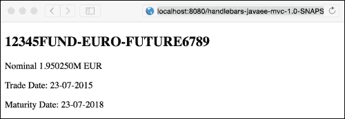
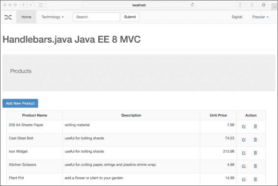
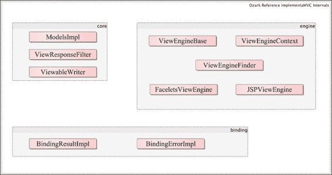

# 第九章. Java EE MVC 框架

|    | *"与电话或电视的开发相比，Web 发展得非常快。" |
| --- | --- |
|    | --*蒂姆·伯纳斯-李爵士，万维网的发明者* |

在过去几章中，我们从客户端的角度回顾了 Web 应用程序服务。在本章的最后，我们将回到主要在服务器端编写的数字应用程序。我们将检查 Java EE 下的一个全新的规范。它被称为**模型-视图-控制器**（**MVC**），属于 Java EE 8 版本（2017 年 3 月）下的 JSR 371（[`jcp.org/en/jsr/detail?id=371`](https://jcp.org/en/jsr/detail?id=371)）。在撰写本书时，Java EE MVC 的早期草案版本已经发布，展示了参考实现 Ozark（[`ozark.java.net/index.html`](https://ozark.java.net/index.html)）的工作原理。

MVC 框架基于在 Smalltalk 编程语言和环境中所发明的设计模式，这在早期的用户界面应用程序中尤为常见。其理念是，模型指的是存储应用程序数据（如值对象或数据传输对象）的组件。视图是负责将应用程序数据的表示渲染或交付给用户的组件，控制器是包含处理前两个组件（视图和模型）之间输入和输出逻辑的组件。这种设计模式之所以非常流行，是因为它拥抱了关注点的分离，这是良好实用主义面向对象设计中的一个关键概念。

在 2014 年，甲骨文公司对更广泛的 Java EE 社区发布了一项公开的问卷调查，并收集了结果（[`java.net/downloads/javaee-spec/JavaEE8_Community_Survey_Results.pdf`](https://java.net/downloads/javaee-spec/JavaEE8_Community_Survey_Results.pdf)）。数千名技术人员对此调查做出了回应。调查中的一个关键问题是，“Java EE 是否应该提供对 MVC 和 JSF 的支持？”投票结果显示，60.8%的人支持，20%的人反对，19.2%的人不确定。这足以批准 MVC 1.0 规范成为 Java EE 8 的一部分。

# Java EE 8 MVC

在我们继续编程之前，我应该提醒您，这里的信息可能会发生变化，因为 MVC 正在我们眼前不断发展。作为一名热心的读者，您应该至少验证 API 是否与当前或最终规范一致。

如此一来，MVC 框架无疑——即使在这个早期阶段——将成为未来许多年数字 Web 开发框架的领先规范，而不仅仅是因为它现在是 Java EE 伞下驱动系统的一部分。MVC 利用了 JAX-RS（Java for RESTful Services）API，并目前与其他 Java EE 技术集成，包括 CDI 和 Bean Validation。

专家小组决定在 JAX-RS 而不是较旧的 Java servlet API 之上分层，因为 JAX-RS 适合现代编程实践，以使用 HTTP 映射能力的完整语义。他们还认为采用 servlet 会将开发者暴露于 JAX-RS 规范中已经重复的低级编程接口。

从数字开发者和现代网络实践的角度来看，在 JAX-RS 之上分层 MVC 确实是一个很好的采用。Servlet 规范受到了像 Play 框架和其他人的严厉批评，因为它是一个宽而厚的上下文映射抽象（埃里克·埃文斯的领域驱动设计）并且是阻止网络和 HTTP 自然设计的障碍。

我们将使用 Java EE 8 MVC 参考实现 Ozark。在撰写本文时，Ozark 仍在开发中。然而，里程碑版本包含 MVC 应用程序的必要组件和接口。

# MVC 控制器

在`javax.mvc`下为 MVC 保留了一个新的包结构。`@javac.mvc.Controller`注解声明一个类类型或方法作为控制器组件。以下是在方法中使用它的一个示例：

```java
@Controller
public String greet()
{
  return "Greetings, Earthling";
}
```

此控制器方法缺少 HTTP 语义，这正是 JAX-RS 注解帮助的地方。从 MVC 的角度来看，它也是无用的，因为与模型或视图组件有关联。

因此，首先让我们将方法转换为合适的 RESTful 资源，从模型对象开始：

```java
package uk.co.xenonique.basic.mvc;
import javax.enterprise.context.RequestScoped;
import javax.inject.Named;
@Named(value="user")
@RequestScoped
public class User {
  private String name;
  public User() {}
  public String getName() {return name; }
  public void setName(String name) {this.name = name; }
}
```

用户组件充当我们的模型组件。它有一个属性：我们礼貌问候的人的名字。因此，我们可以编写一个 MVC 资源端点，并将此模型实例注入其中。

这里是我们控制器的初始版本：

```java
package uk.co.xenonique.basic.mvc;
/* ... */
import javax.mvc.Controller;
import javax.mvc.Viewable;
import javax.ws.rs.*;

@Path("/hello")
@Stateless
public class AlienGreetings {
  @Inject User user;

  @GET
  @Controller
  @Path("simple1")
  @Produces("text/html")
  public String simple1( @QueryParam("name") String name )
  {
    user.setName(name);
    return "/hello.jsp";
  }
}
```

我们将使用 JAX RS 的`@Path`注解注解我们的`AlienGreetings`类，以声明它是一个资源端点。尽管我们的类型定义为 EJB 无状态会话豆，但 MVC 预计将与 CDI 作用域一起工作，如`@ApplicationScoped`和`@SessionScoped`。参考实现正在我编写时发生变化。

我们将使用 MVC 的`@Controller`注解来注解`simple1()`方法。此方法接受一个名为`@QueryParam`的参数。我们将添加其他 JAX-RS 注解，以定义 HTTP 方法协议`@GET`、相对 URI`@Path`和 MIME 内容类型`@Produces`。该方法在`User`实例中设置名称属性，并返回一个引用字符串，即视图的名称：`/hello.jsp`。

MVC 控制器方法可以返回一个字符串，这意味着 Servlet 容器接管了最终视图的渲染。然而，由于可扩展的实现，MVC 也可以渲染不同的视图。我们将在稍后看到更多关于这一点的内容。在幕后，MVC 将字符串转换为视图类型。Java 接口`javax.mvc.Viewable`代表视图技术的抽象。Viewable 是`javax.mvc.ViewEngine`和`javax.mvc.Models`之间的关联。

抽象类类型`javax.mvc.Engine`负责将模型渲染到技术选择。工程师可以开发或添加此引擎以渲染视图。目前，Ozark 支持从 Apache Velocity 到 AsciiDoc 的许多渲染样式。

Java 接口`javax.mvc.Models`代表一个从视图传递到渲染引擎的关键值存储。模型类型是请求作用域的映射集合。

因此，让我们扩展`AlienGreeting`控制器并添加一些更多的方法。下面的`simple2()`方法返回一个`Viewable`实例：

```java
  @GET
  @Controller
  @Path("simple2")
  @Produces("text/html")
  public Viewable simple2( @QueryParam("name") String name )
  {
    user.setName(name);
    return new Viewable("/hello.jsp");
  }
```

如您所见，`simple2()`方法是对`simple1()`的变体，MVC 相当灵活。它甚至支持不返回类型的 void 方法。我们将使用`@javax.mvc.View`注解后续的`simple3()`方法，以声明下一个视图：

```java
  @GET
  @Controller
  @Path("simple3")
  @Produces("text/html")
  @View("/hello.jsp")
  public void simple3( @QueryParam("name") String name )
  {
    user.setName(name);
  }
```

到目前为止，所有三个方法都是 HTTP GET 请求。由于 MVC 建立在 JAX-RS 之上，我们还可以利用其他协议方法。编写处理 HTTP POST 请求的 HTML 表单处理程序很简单。

这里是`helloWebForm()`方法的代码片段：

```java
  @POST
  @Controller
  @Path("webform")
  @Produces("text/html")
  public Viewable helloWebForm( @FormParam("name") String name )
  {
    user.setName(name);
    return new Viewable("/hello.jsp");
  }
```

前面的控制器方法`helloWebForm()`接受一个名为参数的 HTML 表单。它设置模型对象并返回一个视图实例。在 HTML5 标准中，表单元素正式支持 HTTP GET 和 POST 请求。流行的网络浏览器通常只能通过 JavaScript 访问 HTTP PUT 和 DELETE 协议请求。然而，这种限制并不会阻止 MVC 控制器被注解为`@PUT`或`@DELETE`。

MVC 控制器可以访问 JAX-RS 端点可用的完整 URI 空间。以下示例说明了路径参数：

```java
  @GET
  @Controller
  @Path("view/{name}")
  @Produces("text/html")
  public Viewable helloWebPath( @PathParam("name") String name )
  {
    user.setName(name);
    return new Viewable("/hello.jsp");
  }
```

前面的控制器方法`helloWebPath()`接受一个路径参数作为用户的名称。`@PathParam`注解建立了在相对 URI 中使用的参数标记。URI 由`@Path`注解定义。完整的 URL 将是`http://localhost:8080/javaee-basic-mvc/rest/hello/view/Curtis`。

## MVC 页面视图和模板

根据 MVC 规范，一个`view`实例可以被视为模板技术参考。到目前为止，我们只看到了 JavaServer Page 视图。只要有一个相应的`ViewEngine`实例知道如何从关联的模型和其他控制器结果中处理（渲染）视图，视图可以是开发者能想到的任何东西。

让我们看看这本书（`ch09/basic-javaee-mvc`）示例源代码项目中的第一个基本 JSP 视图，`index.jsp`：

```java
<%@ page import="uk.co.xenonique.basic.mvc.AlienGreetings" %>
<!DOCTYPE html>
<html>
<head> ...
  <link href="${pageContext.request.contextPath}/styles/bootstrap.css" rel="stylesheet">
  <link href="${pageContext.request.contextPath}/styles/main.css" rel="stylesheet">
</head>
<body>
  <div class="main-content"> ...
    <div class="other-content">
      <h2>Simple MVC Controller</h2>
      <p>
        HTTP GET Request with query parameter and invocation of 
        <code><%= AlienGreetings.class.getSimpleName() %>
        </code> with HTML Form:<br>
        <a href="${pageContext.request.contextPath}
          /rest/hello/simple1?name=James" 
          class="btn btn-primary"> Person called James
        </a>
      </p>
      <p>...
        <a href="${pageContext.request.contextPath}
          /rest/hello/simple2?name=Patricia" 
          class="btn btn-primary"> Person called Patricia
        </a>
      </p>
      <p>...
        <a href="${pageContext.request.contextPath}
          /rest/hello/simple3?name=Aliiyah" 
          class="btn btn-primary"> Person called Aliiyah
        </a>
      </p>
      <p>      
        <form action="${pageContext.request.contextPath}
          /rest/hello/webform"method="POST" >
          <div class="form-group">
            <label for="elementName">Name</label>
            <input type="text" class="form-control" 
              id="elementName" name="name" placeholder="Jane Doe">
          </div>
        </form>
      </p>
      ...
    </div>
  </body>
</html>
```

在这个 JSP 视图中，我们将利用表达式语言（EL）生成带有 Web 应用程序上下文路径的 URL，即 `pageContext.request.contextPath`。有三个 HTML 锚元素调用 `AlienGreeting` 控制器方法：`simple1()`、`simple2()` 和 `simple3()`。HTML 表单调用 `helloWebForm()` 方法。

被称为 `hello.jsp` 的页面提取 JSP 视图如下所示：

```java
<div class="main-content">
  <div class="page-header">
    <h1> Java EE 8 MVC - Hello</h1>
    <p> Model View Controller </p>
  </div>
  <div class="other-content">
    <div class="jumbotron">
      <p> Hello ${user.name} </p>
    </div>
    <p> How are you?</p>
  </div>
</div>
```

视图模板非常简单；我们将使用请求作用域的用户实例来提供名称。

在撰写本文时，Ozark 支持以下视图呈现技术，如以下表格所示：

| 模板名称 | 描述 |
| --- | --- |
| AsciiDoc | 这是一个用于编写笔记、文档、文章、书籍、电子书、幻灯片、手册页和博客的文本文档格式。[`github.com/asciidoctor/asciidoctorj`](https://github.com/asciidoctor/asciidoctorj) |
| Freemarker | 这是一个 Java 模板引擎，可以生成 HTML、RTF 和源代码。[`freemarker.org/`](http://freemarker.org/) |
| Handlebars | 这是一个针对原始 Mustache 模板规范的多种语言和平台扩展，包含有用的实用工具标记。JavaScript 版本：[`handlebarsjs.com/`](http://handlebarsjs.com/) 和 Java 版本：[`github.com/jknack/handlebars.java/`](https://github.com/jknack/handlebars.java/) |
| JSR 223 | 这是 MVC 框架的一个扩展，支持 JSR 223 动态脚本语言，如 Groovy 和 Jython。[`www.jcp.org/en/jsr/detail?id=223`](https://www.jcp.org/en/jsr/detail?id=223) |
| Mustache | 这是一个简单的网络模板语言，将表示与业务视图逻辑分离。它在多个平台和语言上可用。[`github.com/spullara/mustache.java`](https://github.com/spullara/mustache.java) |
| Thymeleaf | 这是一个基于 Java 的 HTML5 模板库，适用于 Web 和非 Web 环境。它与字符串框架紧密相关。[`www.thymeleaf.org/`](http://www.thymeleaf.org/) |
| Velocity | Apache Velocity 是一套模板工具集。Velocity 引擎是提供模板功能的组件库。它是为服务器端 Java 编写的第一个网络模板框架之一。[`velocity.apache.org/`](http://velocity.apache.org/) |

### 小贴士

MVC 是一个服务器端模板解决方案。不要将客户端模板的世界与后端版本混淆。

## MVC 模型

MVC 规范支持两种模型形式。第一种是基于`javax.mvc.Models`实例，第二种形式利用 CDI 的`@Named` beans。`Models`接口类型将键名映射到映射集合中的值。所有视图引擎都必须强制支持`Models`。视图引擎可以可选地支持 CDI。规范建议视图引擎实现者提供 CDI beans 支持。

`Models`接口的默认实现是一个请求作用域的 bean：`com.oracle.ozark.core.ModelsImpl`。此类委托给`java.util.Map`集合。开发者通常永远不会实例化此类，而是更喜欢注入`Models`类型。正如你稍后将会看到的，有时需要为特定的视图引擎创建一个实例。

让我们在控制器类的第二个版本中演示`Models`接口的实际应用：

```java
@Path("/hello2")
@Stateless
public class PhobosGreetings {
  @Inject
  Models models;

  @GET
  @Controller
  @Path("simple2")
  @Produces("text/html")
  public Viewable simple1(  @QueryParam("name") String name )
  {
    models.put("users", new User(name));
    return new Viewable("/hello2.jsp");
  }
}
```

在`PhobosGreetings`中，我们将用`Models`实例替换`User`类型的 CDI 注入。我们将创建一个`User`实例，并将其存储在属性键`user`下。方法返回后，框架将检索`Models`实例中的所有属性并将它们放置在`HttpServletResponse`的属性集合中。因此，JSP 模板视图可以通过 EL 或内联脚本访问数据。

## 响应和重定向

MVC 还支持返回 JAX RS 响应类型实例的控制器。这对于将渲染工作推到客户端的网站特别有用。一个高度可扩展的 Web 应用程序可能会选择发送兆字节的 JSON 响应，而不是通过模板在服务器上渲染。

现在我们将检查另一个名为`RedirectController`的 MVC 控制器：

```java
@Path("redirect")
@Stateless
@Controller
public class RedirectController {
  @GET
  @Path("string")
  public String getString() {
      return "redirect:redirect/here";
  }

  @GET
  @Path("response1")
  public Response getResponse1() {
    return Response.seeOther(
      URI.create("redirect/here")).build();
  }

  @GET
  @Path("deliberateError1")
  public Response getErrorResponse1() {
    return Response.status(Response.Status.BAD_REQUEST)
      .entity("/error.jsp").build();
  }

  @GET
  @Path("here")
  @Produces("text/html")
  public String getRedirectedView() {
    return "redirected.jsp";
  }
}
```

我们将使用 JAX-RS 的`@Path`注解`RedirectController`，我们必须特别注意基本值`redirect`。

`getString()`方法使用特殊的重定向操作符`redirect`执行 URI 重定向。此方法具有唯一的相对 URI `redirect/string`。MVC 内部检测到前缀并构建一个 JAX-RS 响应作为重定向请求。返回的 URI 是`getRedirectedView()`控制器的引用，其相对路径 URI 为`redirect/here`。

我们可以直接构建响应，就像在`getResponse()`方法中看到的那样。使用 URI 调用静态`Response.seeOther()`方法等同于实现 HTTP 重定向响应。此方法有其独特的相对 URI `redirect/response1`。

`getRedirectedView()`方法简单地导航到视图模板`redirected.jsp`。此控制器方法是其他控制器方法（`getString()`和`getResponse()`）的最终目标。

### 小贴士

在撰写本文时，MVC 规范正在设计 HTTP 重定向方法。有一个问题关于为 MVC 应用提供 Flash 作用域或 JSF 视图作用域豆的等效物，以便在多个请求作用域之间保存数据。我强烈建议你检查规范更新。

最后，MVC 控制器还可以返回 HTTP 错误响应。`getErrorResponse()`方法有一个相对 URI `redirect/deliberateError1`，并返回一个带有 HTTP 错误请求错误代码（401）的 Response 实例。控制器还通知 MVC 框架在视图 ID `error.jsp`下提供视图模板。`RedirectController`代表了 MVC 控制器最简单的形式。我们可以通过注入`Models`或其他 CDI 豆来丰富它。我们还可以在响应构建器中将可视化实例用作实体，而不是使用愚蠢的字符串。

让我们继续介绍不同的模板技术，这也是 MVC 到目前为止的独特卖点。

### 重新配置视图根

在工作的 MVC 早期草案版本中，视图根默认设置为`WEB-INF/views`。在程序上，这可以在`ViewEngine.DEFAULT_VIEW_ENGINE`的静态属性中找到。

这可能对具有相对 URI 的数字工程师来说不方便，尤其是在页面视图的重定向中。幸运的是，Ozark 实现可以从 web XML 描述符（`web.xml`）中进行重新配置，如下所示：

```java
<?xml version="1.0" encoding="UTF-8"?>
<web-app  ...>
  ...
  <servlet>
    <servlet-name>javax.ws.rs.core.Application</servlet-name>
    <init-param>
      <param-name>javax.mvc.engine.ViewEngine.viewFolder</param-name>
      <param-value>/</param-value>
    </init-param>
    <load-on-startup>1</load-on-startup>
    <async-supported>true</async-supported>
  </servlet>...
</web-app>
```

我们将覆盖`javax.mvc.engine.ViewEngine.viewFolder`属性，在网页根目录中实现我们想要的行为。

# Handlebars Java

Handlebars 框架是一个用于开发 Web 应用的模板库。在其 JavaScript 版本([`handlebarsjs.com/`](http://handlebarsjs.com/))中，你可能已经听到了数字界面开发者对其赞不绝口。在本章的其余部分，我们将使用 Handlebars Java 版本。

Handlebars 框架允许开发者和设计师编写语义模板。它基于一个稍微老旧一些的模板框架，称为 Mustache([`mustache.github.io/`](https://mustache.github.io/))。这两个都指的是如果你眯起眼睛看一个旋转 90 度的花括号，可以看到的男性面部毛发。

模板框架强调关注点的分离，尽可能减少在渲染的页面视图中混合业务逻辑。Handlebars 框架从 Mustache 借用了双大括号符号。对于我们的男性读者来说，这是一种故意的文字游戏和计算机编程的怪癖。Handlebars 框架在利用服务器端和客户端相同的模板引擎方面具有明显优势。

## 一个编译内联模板 servlet

我们将从 Servlet 示例开始介绍。我们将创建一个只有一个依赖项的 Java Servlet，这个依赖项是 Handlebars Java 实现。我们目前不考虑 MVC 框架。我们的 Servlet 将实例化模板框架，调用内联模板脚本，然后直接返回输出。

这里是我们的 Servlet：

```java
package uk.co.xenonique.basic.mvc;
import com.github.jknack.handlebars.*;
import javax.servlet.*;
/* ... other imports omitted */

@WebServlet("/compiled")
public class CompileInlineServlet extends HttpServlet {
  @Override
  protected void doGet(HttpServletRequest request, HttpServletResponse response)
    throws ServletException, IOException
  {
    final Handlebars handlebars = new Handlebars();
    final Template template = handlebars.compileInline(
         "Hello {{this}}!");
    final String text = template.apply("Handlebars.java");
    response.setContentType("text/plain");
    response.getOutputStream().println(text);
  }
}
```

`CompileInlineServlet` 类展示了如何在 Java 代码中编译一个基本的 Handlers 模板示例。我们将实例化一个 Handlebars 引擎模板，然后按以下文本所示内联编译模板：

```java
Hello {{this}}!
```

编译后，我们将获得一个包含内容的 `Template` 实例。然后我们将调用 `apply()` 方法，并使用一个简单的字符串作为模板的上下文。`{{this}}` 占位符指的是上下文对象。然后我们将检索文本表示并回送给网络浏览器。我们将看到以下纯文本输出：

```java
Hello Handlebars.java!
```

在 Handlebars Java 中没有依赖项将框架绑定到 Java EE。因此，它也可以在 Java SE 中作为一个独立的 Java 可执行文件使用。

## Handlebars 中的模板表达式

这里是另一个具有不同上下文的 Handlebars 模板示例：

```java
<div class="trade-entry">
  <h1>{{title}}</h1>
  <div class="trade-detail">
    {{detail}}
  </div>
</div>
```

模板在 DIV 层中渲染，带有嵌入表达式的占位符名称替换。一个表达式在双大括号之间保留和激活。它为交易系统的域渲染输出。在 Handlebars 和 Mustache 语法中，围绕变量名的双大括号表示一个占位符条目。模板中的占位符条目意味着它可以被动态内容替换。因此，在模板渲染过程中，`{{title}}` 占位符被替换为交易条目的标题，而 `{{detail}}` 被替换为交易详情。表达式值可以是字面量字符串，也可以是嵌入的 HTML5 标记。

让我们再写一个 Java Servlet，使用 Handlebars 框架渲染这个视图：

```java
package uk.co.xenonique.basic.mvc;
import com.github.jknack.handlebars.*;
import com.github.jknack.handlebars.io.*;
/* ... imports omitted */

@WebServlet("/tradeinfo")
public class TradeInfoServlet extends HttpServlet {
  @Override
  protected void doGet(HttpServletRequest request,
     HttpServletResponse response)
      throws ServletException, IOException
  {
    final TemplateLoader loader = 
      new ServletContextTemplateLoader(
         request.getServletContext());
    final Handlebars handlebars = new Handlebars(loader);
    final Template template = handlebars.compile("trade");
    final Map<String,String> context = 
        new HashMap<String,String>() {{
      put("title", "12345FUND-EURO-FUTURE6789");
      put("detail", "Nominal 1.950250M EUR");
      put("trade-date", "23-07-2015");
      put("maturity-date", "23-07-2018");
    }};
    final String text = template.apply(context);
    response.setContentType("text/html");
    response.getOutputStream().println(text);
  }
}
```

这个 `TradeInfoServlet` Servlet 几乎与之前的 `CompileInlineServlet` 相同；但这次，我们将利用 `ServletContextTemplateLoader` 类。这是一个从 Java EE 网络上下文中通过 Servlet 引擎检索视图模板的加载器类。我们将创建加载器，并在构建 Handlebar 实例时将其作为参数传递。然后，我们将使用参考名称 trade 编译一个模板。框架调用加载器检索视图模板，默认情况下模板后缀为 `trade.hbs`。

我们构建了一个键和值的字面量映射集合。它们将作为我们的视图中的占位符集合，并将它们应用到模板中。通过 `http://localhost:8080/handlebars-javaee-mvc-1.0-SNAPSHOT/tradeinfo` 访问网络浏览器应该显示以下截图：



TradeInfoServlet 的截图

除了直接的替换之外，Handlebars 支持使用 `Block`、`Partials` 和 `Helper` 表达式。Handlebars 框架提供了标准的构建块；然而，工程师可以注册自定义助手。在 JavaScript 实现中，开发者通常会在页面中定义编译后的脚本模板以便重用内容。`Handlebars.js` 通常与 RequireJS 或 EmberJS 等一个或多个 JavaScript 框架一起使用，以便提供可重用的内容。

我们将继续使用 Handlebars Java 编写一个 CRUD 示例。我们的应用程序将允许用户操作一个基本的产品目录。我们需要一个欢迎页面，所以让我们使用模板框架来创建它。

## 欢迎控制器

在 Java 版本中，我们不需要注册或编译模板，因为页面内容是从服务器端提供的。这个项目被称为 `handlebars-javaee-mvc`。首先要做的是在一个初始的 JSP 中引发一个 HTTP 重定向，如下所示：

```java
<%@ page contentType="text/html;charset=UTF-8" language="java" %>
<html>
<body>
<meta http-equiv="refresh" content="0; 
  url=${pageContext.request.contextPath}/rest/welcome" />
</body>
</html>
```

上述代码将立即将网络浏览器重定向到发送一个 HTTP GET 请求到 URI，`handler-javeee-mvc-1.0/rest/welcome`。在这个 URI 路径中，我们已经有一个 MVC 控制器等待这个调用：

```java
@Path("/welcome")
@Stateless
public class WelcomeController {
  @Inject Models models;

  @GET
  @Controller
  @Produces("text/html")
  public Viewable welcome()
  {
    models.put("pageTitle", "Handlebars.java Java EE 8 MVC" );
    models.put("title", "Welcome");
    return new Viewable("/welcome.hbs");
  }
}
```

在模型实例中填充了几个属性之后，`WelcomeController` 将响应推进到 Handlebars Java 模板 `/welcomee.hbs`。带有正斜杠字符的绝对 URI 确保 MVC 框架从 Web 上下文根目录中搜索页面模板。后缀扩展 `*.hbs` 通常在客户端和服务器版本中都保留用于 Handlebars 视图模板。

让我们看看以下 Handlebars 模板 (`welcome.hbs`)：

```java
<!DOCTYPE html>
<html>
{{> header }}
<body>
  {{> navbar }}

  <div class="main-content">
    ...
  </div>

  {{> footer}}
</body>
{{> bottom }}
</html>
```

Handlebars 支持部分的概念。部分是用于另一个模板的模板。它们对于页面组成非常有用。语法以 `{{> NAME }}` 开始，其中 `NAME` 指的是另一个模板。在 JavaScript 堆栈中，部分必须在之前注册；然而，Java 版本知道如何通过从 servlet 容器中加载它们来找到部分模板。因此，部分模板引用 `{{> header }}` 指示 Handlebars 加载 `header.hbs` 视图。

在 `welcome.hbs` 视图中，有四个部分模板：`header.hbs`、`navbar.hbs`、`footer.hbs` 和 `bottom.hbs`。您可以在本书的代码分发中查看这些模板的源代码。

## 自定义视图引擎

Handlebars Java 随带几个模板视图引擎。不幸的是，默认扩展视图引擎并没有提供我们希望使用的所有功能。例如，Handlebars 并不直接渲染十进制数字，因此我们必须注册自己的函数。幸运的是，使用 CDI 编写视图引擎扩展是合理的，如下所示：

```java
package uk.co.xenonique.basic.mvc;
import com.github.jknack.handlebars.*;
import com.github.jknack.handlebars.io.*;
import com.oracle.ozark.engine.ViewEngineBase;
// ... other imports ommitted

@ApplicationScoped
public class MyHandlebarsViewEngine extends ViewEngineBase {
  @Inject private ServletContext servletContext;

  @Override
  public boolean supports(String view) {
    return view.endsWith(".hbs") || view.endsWith(".handlebars");
  }

  @Override
  public void processView(ViewEngineContext context) throws ViewEngineException {
    final Models models = context.getModels();
    final String viewName = context.getView();

    try (PrintWriter writer = context.getResponse().getWriter();
         InputStream resourceAsStream = 
         servletContext.getResourceAsStream(resolveView(context));
         InputStreamReader in = 
            new InputStreamReader(resourceAsStream, "UTF-8");
       BufferedReader buffer = new BufferedReader(in);) {
      final String viewContent = buffer.lines()
        .collect(Collectors.joining());
      final TemplateLoader loader = 
        new ServletContextTemplateLoader(servletContext);
      final Handlebars handlebars = new Handlebars(loader);
      models.put("webContextPath", 
         context.getRequest().getContextPath());
      models.put("page", context.getRequest().getRequestURI());
      models.put("viewName", viewName);
      models.put("request", context.getRequest());
      models.put("response", context.getResponse());
      handlebars.registerHelper("formatDecimal", new Helper<BigDecimal>() {
          @Override
          public CharSequence apply(BigDecimal number, Options options) throws IOException {
            final DecimalFormat formatter = 
               new DecimalFormat("###0.##");
            return formatter.format(number.doubleValue());
          }
      });
      Template template = handlebars.compileInline(viewContent);
      template.apply(models, writer);
    } catch (IOException e) {
        throw new ViewEngineException(e);
    }
  }
}
```

我们将 `MyHandlebarsViewEngine` 类注释为应用程序范围的 bean，并确保它从 Ozark 继承 `ViewEngineBase`。我们将向这个类注入 `ServletContext`，因为我们需要从中检索某些属性，例如网络上下文路径。

我们将重写 `supports()` 方法以建立对 Handlebars 文件的支持。MVC 视图类型作为单个参数传递。

真正的工作发生在 `processView()` 方法中，我们完全负责渲染 Handlebars 视图模板。MVC 框架提供了 `javax.mvc.engine.ViewEngineContext`，它提供了对当前 `View` 和 `Models` 实例的访问。我们可以确定需要检索的视图模板的名称。从现在开始，我们可以创建 `ServletContextTemplateLoader` 和 `Handlebars` 实例来加载视图，就像我们在早期的 `TradeInfoServlet` 类中看到的那样。然后，我们需要通过在缓冲区中读取当前视图的内容来稍微处理一些棘手的问题。`ViewEngineBase` 提供了一个 `resolve()` 方法，它极大地帮助我们并返回 `InputStream`。顺便说一句，Java 7 的 acquire/resource 语法简化了 try-catch 语句的样板代码。在方法结束时，由于我们在缓冲区中有内容，我们可以直接编译视图。

我们将在 `MyHandlebarsViewEngine` 中添加一些有用的功能。首先，我们将向 `Models` 实例添加额外的属性。我们将添加网络上下文路径以及请求和响应对象到 `Models` 实例中。其次，我们将注册一个 Handlebars 辅助函数，以便更好地渲染 BigDecimal 类型。

当我们的应用程序部署时，Ozark 依赖于 CDI 来查找 `ViewEngineBase` 类型。Ozark 扫描 JAR 文件和类的类路径以查找 `ViewEengineBase` 对象的类型。它构建一个可用的渲染内部列表。`MyHandlebarsViewEngine` 是目前可以在渲染阶段添加额外辅助函数和实用工具的地方。请关注 MVC 规范，看看是否有这些接口以有意义的公共可访问 API 的形式暴露出来。

我们将转到我们的控制器和产品列表视图。

## 产品控制器

我们的领域对象是谦逊的 `Product` 实体，其结构类似于以下形式：

```java
@Entity
@NamedQueries({
  @NamedQuery(name="Product.findAll",
    query = "select p from Product p order by p.name"),
  @NamedQuery(name="Product.findById",
    query = "select p from Product p where p.id = :id"),
})
public class Product {
  @Id
  @GeneratedValue(strategy = GenerationType.AUTO)
  private Integer id;
  @NotEmpty @Size(max=64) private String name;
  @NotEmpty @Size(max=256) private String description;
  @NotNull @DecimalMin("0.010") private BigDecimal price;

  public Product() { this(null, null, null); }

  public Product(String name, String description, BigDecimal price) {
    this.name = name;
    this.description = description;
    this.price = price;
  }
  /* ... */
}
```

注意，`Product` 充分利用了 Bean Validation 注解。特别是，它使用 BigDecimal 类型来精确价格，而 `@DecimalMin` 注解防止在边界上下文中存储负数和零价格。

给定我们的实体对象，我们需要 `ProductController` 来将领域与表示视图接口：

```java
@Path("/products")
@Stateless
public class ProductController {
  @Inject Models models;
  @Inject ValidatorFactory validatorFactory;
  @Inject FormErrorMessage formError;
  @EJB ProductService productService;

  private void defineCommonModelProperties(String title ) {
    models.put("pageTitle", "Handlebars.java Java EE 8 MVC" );
    models.put("title", title);
  }

  private void retrieveAll() {
    final List<Product> products = productService.findAll();
    models.put("products", products );
    models.put("title", "Products");
  }

  @GET
  @Controller
  @Path("list")
  @Produces("text/html")
  public Viewable listProducts()
  {
    retrieveAll();
    defineCommonModelProperties("Products");
    return new Viewable("/products.hbs");
  }
  /* ... */
}
```

如同往常，我们将使用 JAX-RS 注解注释 `ProductController` 以引入 RESTful 服务空间。我们将使用 Bean Validation 验证输入对象的状态，因此我们将从 Java EE 容器注入 `ValidatorFactory`。我们将注入 `Models` 实例以进行 MVC 操作。我们还有一个自定义的 `FormErrorBean` POJO 用于捕获错误消息，最后还有一个 EJB，`ProductService`，用于将记录持久化到数据库中。

`listProducts()` 控制器方法委托给共享方法：`retrieveAll()` 和 `defineCommonModelProperties()`。`retrieveAll()` 方法使用 EJB 从数据库中检索所有产品。它将列表集合保存在 `Models` 下的一个已知属性键中。`defineCommonModelProperties()` 方法将标题作为一个键保存在同一个 `Models` 实例中。结果证明，许多控制器方法需要相同的功能，因此我们进行了重构。我们将检索到的产品集合放置在名为 `products` 的 `Models` 键属性中。最后，`listProducts()` 将其转发到 Handlebars Java 视图模板 `product.hbs`。在我们的控制器方法返回后，Ozark 最终将委托给我们的自定义视图引擎：`MyHandlebarsViewEngine`。

### 块表达式

我们可以查看视图并了解有用的块表达式。以下是从视图模板 `/products.hbs` 的摘录：

```java
<div class="other-content">
  <div class="jumbotron">
      <p> {{title}} </p>
  </div>

  <p>
    <a href="{{webContextPath}}/rest/products/preview-create" 
      class="btn-primary btn">Add New Product</a>
  </p>

  <table class="product-container-table table table-bordered table-responsive table-striped">
    <tr>
      <th> Product Name </th>
      <th> Description </th>
      <th> Unit Price </th>
      <th> Action </th>
    </tr>

    {{#each products}}
      <tr>
        <td> {{this.name}} </td>
        <td> {{this.description}} </td>
        <td> {{formatDecimal this.price}} </td>
        <td>
          <a class="btn" href="{{webContextPath}}/rest/products/view/{{this.id}}" ><i class="glyphicon glyphicon-edit"></i></a>
          <a class="btn" href="{{webContextPath}}/rest/products/preview-delete/{{this.id}}" ><i class="glyphicon glyphicon-trash"></i></a>
        </td>
      </tr>
    {{/each}}
  </table>
</div>
```

如您所见，我们实际上在这个视图模板中使用了 `{{title}}` 表达式，该表达式是在 `defineCommonModelProperties()` 方法中设置的。`{{webContextPath}}` 占位符的值是在我们的扩展类 `MyHandlebarsViewEngine` 中设置的。

有两个新的表达式：`{{#each}}` 和 `{{/each}}`。这些是内置的块表达式，允许我们遍历上下文元素。在这种情况下，我们将遍历产品。循环核心的产品元素可以在 `{{this}}` 占位符下访问。

为了正确打印 BigDecimal 价格，我们将调用在自定义视图引擎中定义的 `{{formatDecimal}}` 辅助函数。辅助函数可以接受多个参数。结果是渲染的产品表，包括它们的名称、描述和价格，以及编辑或删除项目的锚点链接。

这里是视图模板 `products.jsp` 的截图：



由 Handlebars 渲染的产品列表视图模板

### 检索和编辑操作

一旦客户选择了一个产品进行编辑，我们就需要从数据库中检索数据并将它们推送到不同的视图模板。这就是控制器中预览编辑方法的目的，如下所示：

```java
  @GET
  @Controller
  @Path("view/{id}")
  @Produces("text/html")
  public Viewable retrieveProduct( @PathParam("id") int id )
  {
      final List<Product> products = productService.findById(id);
      models.put("product", products.get(0) );
      defineCommonModelProperties("Product");
      return new Viewable("/edit-product.hbs");
  }
```

我们将使用`@PathParam`注释这个控制器方法`retrieveProduct()`，以便检索产品 ID。有了标识符，我们只需查找`Product`实体并将结果放入请求作用域的`Models`属性中。显然，对于生产应用程序，我们可能会非常谨慎地检查标识符是否有效。方法将响应的最终交付推进到视图模板`/edit-products.hbs`。视图模板的源代码包含在这本书的源代码分发中。

当用户在这个页面视图模板上提交 HTML 表单时，我们将继续到下一部分。如果客户提交表单，那么他们的旅程将调用`ProductController`中的下一个控制器方法，该方法称为`editProduct()`：

```java
@POST
@Controller
@Path("edit/{id}")
@Produces("text/html")
public Response editProduct( 
  @PathParam("id") int id,
  @FormParam("action") String action,
  @FormParam("name") String name,
  @FormParam("description") String description,
  @FormParam("price") BigDecimal price)
{
  defineCommonModelProperties("Edit Product");
  if ("Save".equalsIgnoreCase(action)) {
    final List<Product> products = 
      productService.findById(id);
    final Product product2 = new Product(
      name, description, price );
    final Set<ConstraintViolation<Product>> set = 
      validatorFactory.getValidator().validate(product2);
    if (!set.isEmpty()) {
      final ConstraintViolation<?> cv = set.iterator().next();
      final String property = cv.getPropertyPath().toString();
      formError.setProperty(
        property.substring(property.lastIndexOf('.') + 1));
      formError.setValue(cv.getInvalidValue());
      formError.setMessage(cv.getMessage());
      models.put("formError",formError);
      return Response.status(BAD_REQUEST).
         entity("error.hbs").build();
    }
    final Product product = products.get(0);
    product.setName(name);
    product.setDescription(description);
    product.setPrice(price);
    productService.saveProduct(product);
    models.put("product", product);
  }
  retrieveAll();
  return Response.status(OK).entity("/products.hbs").build();
}
```

我们的控制方法在 HTML 表单提交时被调用，因此我们将使用必要的`@PathParam`和`@FormParam`声明来注释它，以便接收产品 ID 和属性。我们的控制器期望一个带有`name`和`action`的表单参数。客户可以取消操作，如果这样做，则操作不匹配`Save`操作。因此，不会发生任何事情，方法将响应推进到产品列表视图。

在`Save`操作中，我们的方法将利用注入的`ValidatorFactory`实例来手动验证表单参数。因为实体产品有验证注解，所以我们将使用表单参数构建一个临时实例，然后创建一个验证器来检查它。在这个阶段，我们不会直接更改持久化实体，因为数据可能无效。如果是这种情况，那么 Java EE 容器将在控制器方法退出后引发`javax.persistence.RollbackException`，因为控制线程通过了事务屏障。在验证临时实例后，将返回一个`ConstraintViolation`元素的集合。

假设表单数据无效。我们将从第一条违规信息中检索信息，并在请求作用域的`FormErrorMessage` bean 中填充详细信息。表单错误可以通过视图模板中的属性键`formError`访问。然后，控制器方法构建一个带有 HTTP Bad Request 错误代码的响应，并将其转发到一个视图模板`/error.hbs`。

另一方面，如果表单根据 Bean Validation 检查有效，那么我们将通过产品 ID 从数据库中检索`Product`实体。我们将从表单属性更新`Product`实体，然后将其保存到数据库中。因为我们已经手动检查了数据，所以在保存数据时不应该出现错误。我们将构建一个 HTTP OK 响应并将其转发到视图模板`/products.hbs`。

### 提示

在撰写本文时，MVC 规范领导仍在开发 MVC 早期草案发布后的验证和参数绑定。值得注意的是，如果控制器注入了`javax.mvc.BindingResult`实例，那么就可以在精确和狭窄的用户故事中处理表单验证，而不是像直接 JAX-RS API 那样全局处理。

为了完整地展示，以下是`FormErrorMessage`bean 的紧凑版本：

```java
@Named("error")
@RequestScoped
public class FormErrorMessage {
  private String property;
  private Object value;
  private String message;

  /* ... getters and setters omitted */
}
```

这是一个请求作用域的 bean，我们将使用 Handlebars 视图模板`error.hbs`来显示信息：

```java
<div class="page-header">
  <h1> {{pageTitle}} </h1>
</div>
<div class="other-content"> ...
  <div class="main-content" >
    <table class="table table-stripped table-bordered table-responsive">
      <tr>
        <th>Name</th><th>Value</th>
      </tr>
      <tr>
        <td>Property</td> <td>{{formError.property}}</td>
      </tr>
      <tr>
        <td>Message</td> <td>{{formError.message}}</td>
      </tr>
      <tr>
        <td>Value</td> <td>{{formError.value}}</td>
      </tr>
    </table>
  </div> ...
</div>
```

这个视图在`FormErrorMessage`bean 中显示错误消息。你可能想知道为什么我们将表单验证错误发送到单独的视图。答案很简单：逐步进行。在一个专业的数字应用中，我们会在客户端利用 AJAX 验证和 JavaScript 框架，如 jQuery。我们的客户端 JavaScript 模块将调用一个 HTTP POST 请求到 MVC 控制器方法以验证属性信息。这个方法，比如说`validateCheck()`，会在一个临时实例上检查，并通过包含约束违规的 JSON 响应报告。也许 JSR-371 专家组的成员会简化 Digital 的开发部分。

### JAX-RS 全局验证

`editProduct()`方法的问题在于我们被迫使用手动验证步骤。目前唯一的替代方案是回退到 JAX-RS 验证。

那么，让我们检查一下控制器方法的新版本，称为`altEditProduct()`：

```java
@POST
@Controller
@Path("alt-edit/{id}")
@Produces("text/html")
public Response altEditProduct( 
  @PathParam("id") int id,
  @FormParam("action") String action,
  @NotNull @NotEmpty @FormParam("name") String name,
  @NotNull @NotEmpty @FormParam("description") String description,
  @NotNull @DecimalMin("0.0") @FormParam("price") BigDecimal price )
{
  defineCommonModelProperties("Edit Product");
  if ("Save".equalsIgnoreCase(action)) {
    final List<Product> products = productService.findById(id);
    final Product product = products.get(0);
    product.setName(name);
    product.setDescription(description);
    product.setPrice(price);
    productService.saveProduct(product);
    models.put("product", product);
  }
  retrieveAll();
  return Response.status(OK).entity("/products.hbs").build();
}
```

这次，我们将直接在控制器方法`altEditProduct()`上编写 Bean Validation 注解。你可能担心这会造成重复，因为注解已经在实体 bean 上存在。你的担忧是正确的，但让我们继续。`altEditMethod()`方法更短，这很好。现在，这种方法的缺点在于验证被全局委托给了 JAX-RS。如果客户向`altEditMethod()`提交 HTML 表单，那么他们将会收到一个 HTTP Bad Request 错误响应和一个直接从应用服务器发出的用户不友好的错误消息。显然，用户体验团队会非常不满！我们该怎么办？

JAX-RS 规范允许应用程序提供一个错误响应的处理程序。实现这一目标的方法是通过 CDI 配置一个提供者，如下所示：

```java
package uk.co.xenonique.basic.mvc;
import javax.annotation.Priority;
import javax.mvc.*;
import javax.ws.rs.*;
/* ... other import omitted ... */
import static javax.ws.rs.core.Response.Status.*;

@Provider
@Priority(Priorities.USER)
public class ConstraintViolationExceptionMapper
  implements ExceptionMapper<ConstraintViolationException> {
  @Context HttpServletRequest request;

  @Override
  public Response toResponse(
    final ConstraintViolationException exception) {
    final Models models = new com.oracle.ozark.core.ModelsImpl();
    final ConstraintViolation<?> cv = 
      exception.getConstraintViolations().iterator().next();
    final String property = cv.getPropertyPath().toString();
    final FormErrorMessage formError = new FormErrorMessage();
    formError.setProperty(
      property.substring(property.lastIndexOf('.') + 1));
    formError.setValue(cv.getInvalidValue());
    formError.setMessage(cv.getMessage());
    models.put("formError",formError);
    request.setAttribute("formError", formError);
    final Viewable viewable = new Viewable("error.hbs", models);
    return Response.status(BAD_REQUEST).entity(viewable).build();
  }
}
```

这个`ConstraintViolationExceptionMapper`类是一个 JAX-RS 提供者，因为我们用`@javax.ws.rs.ext.Provider`注解了它。这个类泛型类型化为`ConstraintViolationException`，因此它处理了 Web 应用程序中的所有失败！这里没有余地。我们将注入到`HttpServletRequest` POJO 中，以便访问 Web 上下文。`toResponse()`方法将约束违规转换为新的响应。我们需要`Models`实例的实现，所以我们将在这个 Ozark 框架中实例化这个类。我们将直接构建一个`FormErrorMessage` POJO，并从`javax.validation.ConstraintViolation`类型的第一个实例中填充它。我们将在`Models`实例和 servlet 请求范围内设置一个键属性。从这里，我们将创建一个带有视图模板引用`error.hbs`和`Models`实例的`Viewable`实例，然后构建并返回一个响应。

值得一看的是参考实现 Ozark 的一些内部细节。我们一直看到`ViewEngineBase`和`ViewEngineContext`。以下是某些重要内部类及其包的图示：



## MVC 绑定结果验证

MVC 规范有一个用于细粒度验证的 API，这个 API 仍在决定中。在`javax.mvc.binding`包中有两种接口类型——`BindingResult`和`BindingError`。

`BindingResult`在尝试验证带有`@FormParam`注解的 MVC 控制器方法的输入参数时捕获约束违规。规范描述了绑定这个术语，以反映表单参数与正在验证的属性的实际情况之间的关联以及可能发生的约束违规。因此，如果 HTML 表单参数（它是一个字符串）不能以有意义的方式转换为数字，则整数属性不能被绑定。`BindingResult`的接口如下：

```java
package javax.mvc.binding;
public interface BindingResult {
  boolean isFailed();
  List<String> getAllMessages();
  Set<BindingError> getAllBindingErrors();
  BindingError getBindingError(String param);
  Set<ConstraintViolation<?>> getViolations(String param);
  ConstraintViolation<?> getViolation(String param);
}
```

`BindingResult`的有趣成员有`isFailed()`、`getAllViolations()`和`getAllBindingErrors()`。

`BindingError`类型是为了表示在将参数绑定到控制器方法时发生的单个错误而设计的。以下是该类型的简化接口 API：

```java
package javax.mvc.binding;
public interface BindingError {
  String getMessage();
  String getMessageTemplate();
  String getParamName();
}
```

`BindingError`类型与 Bean Validation 规范中的插值消息类似。因此，它对国际化很有帮助，因为消息可以从`java.util.ResourceBundle`检索。

对于我们的最终示例，我们将使用`BindingResult`来验证我们的新`editMethod()`方法：

```java
@Path("/products")
@Stateless
public class ProductController {
  @Inject BindingResult br;

  /* ... */

  @POST
  @Controller
  @Path("edit/{id}")
  @Produces("text/html")
  @ValidateOnExecution(type = ExecutableType.NONE)
  public Response editProduct( 
    @PathParam("id") int id,
    @FormParam("action") String action,
    @Valid @BeanParam Product incomingProduct)
  {
    defineCommonModelProperties("Edit Product");
    if ("Save".equalsIgnoreCase(action)) {
      Set<ConstraintViolation<?>> set = vr.getAllViolations();
      if (!set.isEmpty()) {
        final ConstraintViolation<?> cv = set.iterator().next();
        final String property = cv.getPropertyPath().toString();
        formError.setProperty(
            property.substring(property.lastIndexOf('.') + 1));
        formError.setValue(cv.getInvalidValue());
        formError.setMessage(cv.getMessage());
        models.put("formError",formError);
        return Response.status(BAD_REQUEST).
          entity("error.hbs").build();
      }
      final List<Product> products = productService.findById(id);
      final Product product = products.get(0);
      product.setName(incomingProduct.getName());
      product.setDescription(incomingProduct.getDescription());
      product.setPrice(incomingProduct.getPrice());
      productService.saveProduct(product);
      models.put("product", product);
    }
    retrieveAll();
    return Response.status(OK).entity("/products.hbs").build();
  }
}
```

为了获得细粒度验证的好处，我们将`@BindingResult`注入作为属性到`ProductController`中。我们将更改`editProduct()`方法周围的注解。为了确保 JAX-RS 执行验证而 CDI 和 Bean Validation 不会终止进程，我们将注解`@ValidateOnExecution`并将类型参数设置为`ExecutableType.NONE`。根据 Bean Validation 规范，`@ValidateOnExecution`注解用于选择性地启用和禁用违规。关闭验证允许 JAX RS 接管我们的控制器方法，`editProduct()`。我们还将使用`@Valid`和`@BeanParam`来指示 MVC 提供者验证`Product`实体 bean。

当 MVC 注意到控制器类已注入`BindingResult`实例或有一个接受`BindingResult`的 JavaBean 设置方法时，它将接管验证。在`editProduct()`方法中，我们将通过调用`isFailed()`方法检查验证的布尔状态。如果输入验证失败，我们将从`BindResult`结果中获取第一个约束违规，然后像以前一样填充`FormErrorMessage`bean。然后我们将发送一个带有 Bad Request 错误代码的 HTTP 响应，该响应转发到`error.hbs`视图模板。

注意，我们将使用一个单独的命名变量参数`incomingProduct`来编写`editProduct()`方法，以便保持 HTML 表单数据的临时持有者。我们将复制此变量的属性到从数据库检索的产品实体，并保存它。当我们到达控制器方法末尾时，实体 bean 必须有效。我们将检索产品列表并返回一个 OK 响应。使用`BindingResult`，开发人员可以清楚地看到这种验证更容易编程。需要深思熟虑的代码更少。

# 设计考虑

MVC 是一个非常有前途的规范，目前，视图技术解决方案对于数字开发者来说是常见的。关于处理 HTTP 重定向响应的故事仍然有待开发，特别是关于保持表单状态的方法。许多数字 Web 开发者已经熟悉设计模式 HTTP POST– REDIRECT–GET ([`en.wikipedia.org/wiki/Post/Redirect/Get`](https://en.wikipedia.org/wiki/Post/Redirect/Get))，因此，他们会在 MVC 规范中寻找一个等效且安全的选项。

在等式的另一边，是关于 HTML 表单验证的问题；然而，在这个方面可能会有突破性的新闻。关于表单验证的故事与 HTTP 重定向请求有很多共同点。开发者想要利用实体上的 Bean Validation，但他们也希望在控制器中无缝调用验证并检查验证结果。事实上，JAX-RS 允许通过全局提供者进行验证。然而，这种方法不提供细粒度的验证处理，并且无法将约束违规实例映射到单个 HTML 表单输入元素。尽管如此，Early Draft Release 快照在这一点上已经显示出早期的希望。

正如我们在 Handlebars Java 代码示例中所看到的，许多数字架构师在设计上有一个考虑和权衡：多少展示逻辑位于客户端与服务器端之间？

## 大多数服务器端模板

考虑到主要在服务器端模板化的选项，为什么技术架构师会选择这种模式？这种方法的理由有很多。其中一个原因可能是团队对 JavaScript 编程有些畏惧，希望最小化依赖和上市时间。这是一个技能、培训和维护的权衡。另一个原因可能是最终端客户设备性能不足，例如物联网设备。一个数字恒温器不太可能需要渲染视网膜版图像。另一个原因可能是为了使非常旧的遗留应用程序更容易迁移以使其更新：这是数字化转型。MVC 可以通过广泛的支持视图模板来帮助这里。

## 大多数客户端模板

这个设计选择意味着客户端在设备上渲染了大部分内容。据说，具有 JavaScript 和 HTML5 的智能手机在计算能力上比将人类送上月球的那艘火箭船计算机要强大许多个数量级。一个技术架构师可能想要将负载委托给客户端的原因之一是减少服务器应用程序的负载。这是服务器可扩展性上的一个权衡。Handlebars.js 是一个 JavaScript 视图模板实现，在众多互联网上的竞争 JavaScript 框架中，它完全满足这一需求。在这种模式下，MVC 控制器变成了真正将视图绑定到模型上的薄层架构。如果您的团队拥有非常强大的界面设计师和开发者，或者他们缺乏现代 Java EE 开发经验，这种模式可能也是合适的。在 UI 方面，可能存在一个合理的理由，让客户旅程映射到逐页导航。因此，该架构避免了单页应用程序，这可能会排除 AngularJS 等框架。

## 共享模板

最终的设计选择是将客户端和服务器端模板相结合，并共享展示视图的责任。这可能是在跨职能团队工作的数字技术架构师所青睐的策略。如果有一个强大的接口开发团队和服务器端 Java EE 团队，并且他们沟通良好，那么这是一个合理的方案。除了敏捷团队中的人力资源考虑之外，这种方案在技术上倾向于一个共享模板和愿景来组织数字资产。假设架构是在服务器端使用 Handlebars Java，在客户端使用 Handlebars.js；团队立即面临的是视图模板的组织。哪些模板在 JavaScript 前端编译，哪些模板在服务器端重要？对这个设计选择的解决将导致在服务器端构建 MVC 控制器。

让我给你们留下关于这三个设计考虑的一个警告。如果你真的称得上是行家里手，你会考虑 UX 变化和突如其来的惊喜的影响。因此，数字技术架构师必须将设计变化的影响纳入其计算之中。

# 摘要

在这本书的最后一章中，我们从底层开始介绍了新兴的 MVC 规范。我们涵盖了模型、视图和控制器的基本元素。我们看到 MVC 是在 JAX-RS 之上构建的，并且重用了相同的注解，包括`@GET`、`@FormParam`、`@Path`、`@FormParam`和`@POST`。

为了将一个方法作为 MVC 控制器，我们用`@Controller`注解了它们。我们编写了生成响应实例的控制器，或者如果它们返回了 void 类型，我们会用`@View`注解该方法。

你了解了 MVC 参考规范 Ozark 支持的多种视图技术。我们使用了 Handlebars Java 视图模板来构建 CRUD 示例的元素。我们也了解到 MVC 规范可能会在重定向和验证 API 方面发生变化。

# 练习

这里是本章的问题和练习：

1.  Java EE MVC 框架的组成部分是什么？MVC 试图解决什么问题？

1.  `@Controller`、`@Model`和`@View`之间的区别是什么？

1.  响应类型和可视化类型之间有什么区别？

1.  由于标准的 HTML 表单元素不支持发送 HTTP PUT 或 DELETE 请求，那么在 MVC 架构中，我们该如何处理从数据库中删除记录的操作呢？这对已经拥有完整 RESTful 接口的企业意味着什么呢？

1.  到这本书出版的时候，MVC 框架将会有进一步的发展，很可能会出现许多里程碑式的版本。更新你的知识。有什么变化？特别是关注重定向和验证。

1.  从书籍的源代码仓库下载 `handlebars-javaee-mvc-validation` 项目，并调整产品实例以包括 `description`（字符串）、`manufacturer`（字符串）和 `manufacturedDate`（java.util.Date）属性。为了正确显示格式化的日期（例如，MMM-dd-yyyy 或 dd-MMM-yyyy），需要发生什么？

1.  从上一个练习开始，确保使用 MVC 模式正确地实施验证技术。你将如何验证用户输入？

1.  如果你合理地熟悉 JavaScript 编程，编写一个模块来通过 AJAX 调用验证。（提示：你可能需要理解 JQuery REST 请求和响应。）

1.  在这个练习中，以 `Product` 实体和 `ProductController` 控制器类为基础，使用它们来实验另一个视图模板技术，例如 Ozark 的参考实现。有很多选择。将新的模板框架适应到产品 CRUD 应用程序中——尝试 Thymeleaf 或甚至 AsciiDoc。模板选择之间的区别是什么？有什么好处？有什么缺点？

1.  写一篇简短的论文，向你的当前团队提出使用 MVC 框架进行特定项目的建议。MVC 方法的设计考虑因素是什么？你的目标受众适合单页导航、逐页导航还是两者的混合？（提示：角色可能很有用；你可以写一个旨在说服你团队中的技术领导或你可能是技术领导，旨在说服团队成员的提案。）
