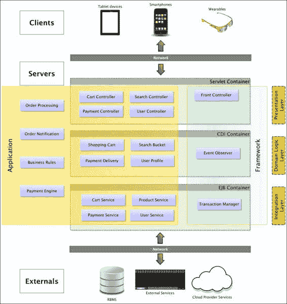
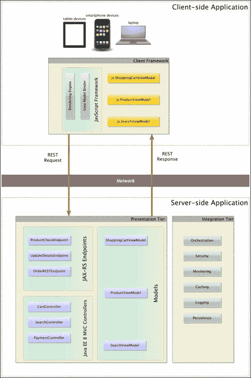
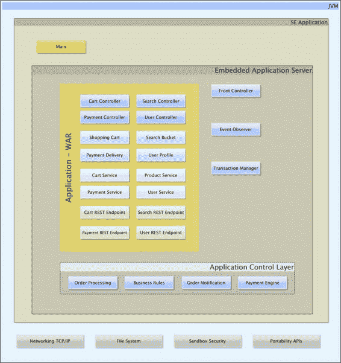
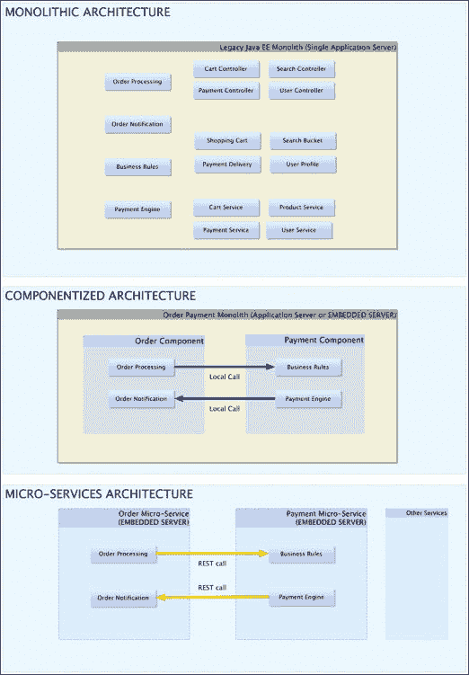

# 附录 B. 从请求到响应

在软件开发者角色的职位面试中，许多人经常被要求描述网络背后实际是如何工作的。一个能够向面试官很好地解释软件应用程序架构层的候选人可能会给人留下所谓的全栈开发者的印象。然而，令人惊讶的是，有多少候选人对此主题只有合理的了解，尤其是如果他们声称在数字领域专业工作的话。本附录提供了一个简洁且权威的现代问题描述。数字开发者应该能够绘制并有效地记录他们当前的工作架构。那么，让我们从 HTTP 开始。 

# HTTP

HTTP 是一个基本的无状态协议，旨在在服务器和客户端之间传输超媒体。HTTP 1.1 支持资源的细粒度缓存和保留持久连接以及分块传输编码的能力。HTTP 1.1 是在 1999 年创建的（参考已取代的 RFC [`tools.ietf.org/html/rfc2068`](https://tools.ietf.org/html/rfc2068)）。为了应对现代需求和用法模式，HTTP 现在支持 WebSocket 握手和升级请求（[`tools.ietf.org/html/rfc6455`](https://tools.ietf.org/html/rfc6455)）。下一个 HTTP 2.0 标准将为单个客户端服务器通道提供流的多路复用。对于 Java EE 8（预计 2017 年 5/6 月发布）和 Java Servlet 4.0 规范中的 HTTP 2.0 支持，这提供了令人兴奋的可能性。有关更多详细信息，请参阅 RFC 7540 ([`www.rfc-editor.org/rfc/rfc7540.txt`](http://www.rfc-editor.org/rfc/rfc7540.txt))和 JSR 369 ([`www.jcp.org/en/jsr/detail?id=369`](https://www.jcp.org/en/jsr/detail?id=369))。

## 一个 HTTP 请求

一个 HTTP 请求由一个带有头部和正文内容的有效载荷组成。头部信息包含 URI 请求、HTTP 方法、代理信息、请求参数和 cookies。对于 POST 和 PUT 请求，它还可能包含带有名称和值的表单编码属性。

每个数字工程师都应该了解的四个基本 HTTP 方法分别是 GET、POST、PUT 和 DELETE。它们在以下列表中描述：

+   **GET**：这个请求获取与给定 URL 关联的资源内容

+   **POST**：这会创建一个新的资源，其有效载荷（正文内容）指定了新资源的数据

+   **PUT**：这通过指定被替换的一些或全部数据来更新现有资源

+   **DELETE**：这是一个请求，用于删除与 URL 关联的指定资源关联

以下是一些在特殊情况下也使用的罕见 HTTP 方法：

+   **HEAD**：这个请求通过仅检索头部来确认与给定 URL 关联的资源。这个请求与 GET 请求类似，但没有正文内容。

+   **OPTION**：此操作检索应用服务器功能或 Web 容器能力。

+   **TRACE**：此请求允许基础设施找出客户端和服务器之间的网络跳数，从而验证延迟、可用性和性能。

## HTTP 响应

HTTP 响应由头部信息和有效载荷数据（即主体内容）组成。头部包含 HTTP 状态码、MIME 类型、数据长度、最后修改日期、字符集编码、cookie 参数和资源的缓存信息。头部还可能包含认证数据。主体内容是返回给客户端请求的数据。

HTTP 状态码由 W3C 定义。这些是具有范围的整数代码。通常，状态码 100-199 是信息性消息，200-299 表示成功的结果，300-399 表示重定向请求，400-499 是服务器端错误，500-599 状态码表示认证失败。因此，HTTP OK 200 和 404 NOT FOUND 状态码对于数字领域外的开发者来说是众所周知的。您可以在 RFC 中找到所有这些状态码的列表：[`www.w3.org/Protocols/rfc2616/rfc2616-sec10.html`](http://www.w3.org/Protocols/rfc2616/rfc2616-sec10.html)。

# Java 企业架构

数字领域的应用在多个工业领域架构上具有共同的主线。显然，它们共享并依赖于 Java EE 7 标准平台和 JVM，以便在开发、各种非功能性属性和企业应用基础设施上“搭便车”。在构建应用方面存在细微的差异。

## 标准 Java EE Web 架构

标准 Java EE Web 架构源于 20 世纪 90 年代的客户端-服务器模型。应用服务器是关键组件，因为它负责 Java EE 7 完整规范中的三个容器：Servlet、CDI 和 EJB。通常，我们将这些容器映射到单体 Web 应用的层架构。这种架构的目的是从坚实的软件工程角度提升最佳实践。我们希望保持层之间的关注点分离，以避免层之间的刚性耦合，并在层之间保持强大的内聚性。以下是三个层：

+   表示层与依赖于 Servlet 容器的代码紧密相关。FacesServlet 作为 JSF 的一部分提供。替代的 Web 应用框架也有前端控制器（Front Controller）的概念，它将请求分发给单独的控制器。表示层还包含控制器和视图模板。

+   领域层与包含业务逻辑和持久化对象投影的代码相关联。它包含应用程序规则、业务逻辑和业务流程管理。领域对象可能是也可能不是依赖注入的一部分。在大多数现代 Web 应用程序中，几乎所有的领域层组件和对象都是依赖注入容器的一部分。因此，领域层与 CDI 容器相关联。

+   集成层与从应用程序到系统的持久化或服务区域的传输数据相关联。这一层映射到一个 EJB 容器的一部分的 POJO。通常，这些对象处理来自应用程序的服务调用。作为 EJB，它们是事务性的，但不一定是上下文相关的，这就是为什么它们不是 CDI 容器的一部分。这些对象通过 JPA 和/或 JDBC 异步与外部系统（如数据库）通信，通过 JMS 消息与其他系统异步通信；它们也可以通过 REST 或 SOAP 调用同步（或异步）调用远程 Web 服务端点。

以下图示说明了架构：

标准 Java EE Web 架构

## 扩展架构

从标准的 Java Web 架构来看，存在几种适配方式。组织可以选择优化其架构以适应特定的权衡。一种权衡可能是性能与可扩展性之间的权衡，这可能意味着为了使用特定的关系型数据库管理系统（RDMS）解决方案而重构集成层以使用 NoSQL 数据库。

在本节中，我们将检查特定客户的可用性与性能。可用性是系统可访问的程度。如果系统关闭，则不可用。性能是系统在目标时间内执行所需功能的能力。因此，这位客户真正关心的是系统的正常运行时间，因为停机时间将造成经济损失，但他们也希望有一个固定的吞吐量量。

哪些项目会降低性能？如果应用程序代码中有太多的合理性检查（检查点），那么它将降低性能。如果性能降低，那么它也可能减少可用性。然而，如果您没有对足够的参数进行合理性检查，那么系统将因错误而受到指责。如果黑客发现您的安全漏洞，或者您的案件工作人员频繁输入错误数据，那么您的可用性将受到损害，因为您的业务将因修复问题而遭受停机时间。

一种解决方案是将架构分为两个计算堡垒。我们可以利用智能手机、平板电脑和桌面电脑的现代计算能力在客户端渲染内容。因此，这种架构适合具有足够 GPU 能力的富客户端和其他合适的设备。

经过合理性检查和渲染的代码在很大程度上从服务器端移除。根据架构的不同，我们可以使用依赖于**模型视图视图模型**（**MVVM**）的 JavaScript 框架技术，该技术由 AngularJS 支持。根据技术选择，我们可以使用 JSF 的替代品，如即将推出的 Java EE 8 MVC 或直接使用 JAX-RS 端点。我们必须确保客户端和服务器端都进行正确的验证。我们还必须设计安全的、安全的和幂等的 REST API 或其他客户端与服务器之间的远程调用。请注意，我们仍然在服务器端拥有 CDI、EJB、JMS 和 JPA 等特性。

在这种扩展的 Java EE 7 架构中，有一些好处有助于在性能与可伸缩性之间的权衡。如果我们引入数据缓存层，我们将获得返回大多数来自静态引用或很少变化或最常请求的数据的能力。从智能客户端缓存请求的关键好处是响应时间最小化。

在 2013 年 Java EE 7 发布之后，JCache 临时缓存 1.0 最终 JSR 107 ([`jcp.org/en/jsr/detail?id=107`](https://jcp.org/en/jsr/detail?id=107)) 也随之发布，现在它得到了 HazelCast 和 Terracota 等品牌的支持。

这种架构适合一种混合形式，它扩展了 Java EE，并超越了规格的框框。Java EE 7 的规范并没有指定服务器的编排、服务或系统的监控、深度授权和云配置。让我们看看下面的图示：

一种扩展的混合 Java EE 架构，用于解决性能与可用性之间的平衡问题

## 无容器系统

另一种架构在那些偏好持续部署和游击式工程的前沿企业中很受欢迎。这被称为无容器应用程序，实际上这是一个误称。如果我们仔细思考，每个实体系统都包含在从最高级容器到硬件 CPU 的某个抽象组件中。操作系统受 CPU 的限制，JVM 进程受操作系统的限制，而应用程序服务器包含部署的 Java EE 应用程序。

技术架构师总是在进行权衡。他们可能会考虑敏捷性如上市时间与成本、创新与可负担性之间的对比，在政治上，则是将遗留系统与新技术的集成，例如无容器系统。无容器应用程序的正确名称应该是嵌入式应用程序控制服务器，这准确地描述了架构。有几个 Java EE 应用程序服务器提供商允许从`static void main()`入口点启动一个完全嵌入的服务器。例如，JBoss 的 WildFly、Tomitribe 的 Tom EE，以及当然，Oracle 的 GlassFish 都提供了非标准的嵌入式执行 API。一些专有供应商解决方案甚至允许在嵌入式服务器的运行时模块化选择 Java EE 功能。因此，架构师可以选择和选择 JAX-RS、JSF、CDI、EJB 和 JMS 模块的提供。一个平衡且熟练的开发团队能够绕过变更管理。该团队通过编写无容器解决方案来“隐秘操作”，而不是第 100 次被告知他们不允许升级 IBM WebSphere 7 应用程序服务器。

因此，嵌入式服务器在构建跨多个关注点的微服务架构的初期非常受欢迎。允许应用程序控制嵌入式服务器的启动和停止意味着这些原型与现代 DevOps 运动（开发者/运维团队）以及自动配置管理控制的概念相得益彰。

无容器解决方案的明显缺点是，为传统 WAR 部署构建的开发工具不理解这种模式。因此，数字工程师可能会失去使用 Java EE 解决方案进行增量工程的交互性和快速迭代。然而，这可能是一个短期问题，因为 Java IDE 制造商在捕捉工程趋势方面相当出色。我们可以希望 Java EE 技术领导者、架构师和更广泛的社区表达他们对包括无容器 API 的规范的支持。

使用嵌入式服务器，工程团队有责任确保基础设施正确设置。技术架构师通过精确控制外部集成点获得好处，这对于安全性、授权和身份验证、监控和日志记录以及持久访问很有用。然而，从请求到响应的过程与标准 Java Web 架构完全相同。让我们看看下面的截图：

无容器 Java EE 架构图

尽管在嵌入式服务器应用架构方面 Java EE 8 没有标准化，但其他开发者至少已经推动了一些创新，以便将社区引导到这个方向。有 Apache Delta Spike CDI 容器控制（[`deltaspike.apache.org/documentation/container-control.html`](https://deltaspike.apache.org/documentation/container-control.html)），它目前提供了一个跨服务器库，可以在独立的 Java SE 环境中启动和停止 CDI 容器。Delta Spike 是一个获奖的开源项目，它有专门针对 Bean Validation、CDI、数据、安全和 Servlets 以及容器管理的模块。值得密切关注这个项目，因为其中一些创新已经成为了 Java EE 8 标准的一部分。允许 CDI 管理豆参与容器管理事务（Java EE 7 和 JTA 1.2）的`@javax.transactional.Transational`注解最初是在 Delta Spike 项目中提出和开发的。

## 微服务

嵌入式应用控制的服务器是 Java 微服务架构的入口。这些微服务是一种设计企业架构的风格，其中每个组件解决和操作整个系统的一个需求。这些关键驱动因素是非功能性需求，可以是可用性、灵活性、可维护性、网络性、性能、鲁棒性和可伸缩性的任何组合。在这些中，企业选择这种风格而不是传统单体架构的原始需求是可用性和可伸缩性。

架构师在微服务中看到了某些优势：这些组件遵循 UNIX 架构原则“只做一件事，做好一件事”以及随意切割和更换组件的能力。微服务风格使得语言无关的通信成为可能；因此，实施者有自由选择在 Java、Groovy 或 Scala 中编写组件，甚至可以在非 JVM 语言如 C++中编写。这种架构强烈倾向于 JSON 或 XML 而不是 REST；然而，没有任何阻止软件店使用 SOAP 和 XML。从技术上讲，微服务是目前地球上一些最激动人心的数字项目之一；由于这些投资，一些企业已经获得了明显的商业优势。

微服务的成本是网络复杂性，包括有效载荷大小、监控（心跳）、日志记录和容错，以及冗余管理和服务路由。还有一些额外的成本，商业经理和利益相关者应该注意，即市场时间、培训、信息孤岛，当然还有变革文化。

与许多运动一样，也存在一个关于努力、能力和可行性的范围。一个企业可能并不一定完全放弃单体架构，尤其是当可扩展性和高可用性不是首要任务时。对于大多数数字业务来说，组件化服务架构确实是一条可行的路线，它吸取了单体架构的最佳部分——事务、持久性和配置——并且尽可能多地采用了微服务风格。因此，专门用于订单管理的嵌入式服务器不应该包含与支付处理相关的代码。相反，订单管理组件应该在外部调用支付处理组件。让我们看看下面的图示：

Java EE 单体架构向微服务架构的演变

上述插图显示了标准 Java EE Web 架构分解为混合组件架构，然后演变为完整的微服务架构。

从请求到响应的路径有很多种。除了作为一个团队我们应该如何到达那里之外，我们还必须问自己关键问题：我们如何到达那里？我们为什么想要到达那里？

# 是否要成为全栈开发者

被称为全栈开发者是否重要？顾问的典型回答是这总是取决于上下文。一些愤世嫉俗者可能会说“全栈”是一个充满营销意味的术语，但同样这些人也可能认为数字也是如此。显然，这个术语的含义远不止于一些糟糕的招聘顾问脑海中反复出现的想法。对于声称并宣传他们只想招聘全栈开发者的大型组织来说，还有很多需要改进的地方。他们是走捷径吗？还是他们真正对获得最好的编程人才感兴趣？

话虽如此，从本附录的讨论中可以看出，了解项目的架构在一定程度上是很重要的。几十年来，在软件行业中成为万事通已经不可能了，因此，工程师将专门从事某个环境、领域、角色或系统。不再可能完全隐藏在地下的小隔间中，坚决地说：“我只想知道服务器端的 Java，因为这是我唯一关心的技能，而且它将永远如此”。合格的专业工程师必须对其他团队成员表示同情，包括前端开发者、后端开发者、界面和 UX 设计师、测试人员、利益相关者和管理层。每个人都有最终的利益相关者，因此他们与利益相关者共享最终责任并承担相应的责任。这到底是全栈还是不是，很大程度上取决于你对工作生活的态度，以及你对周围现代 Web 架构的了解和尊重。
