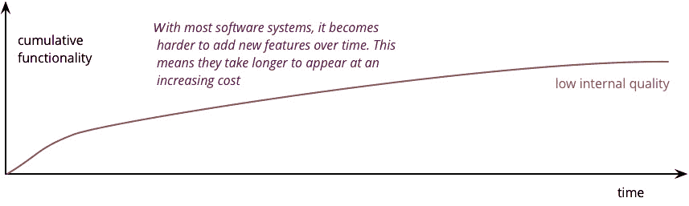
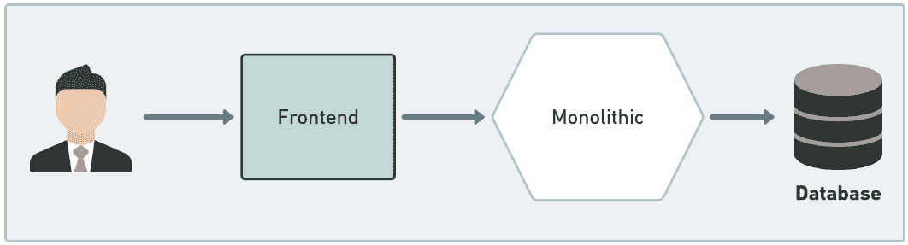
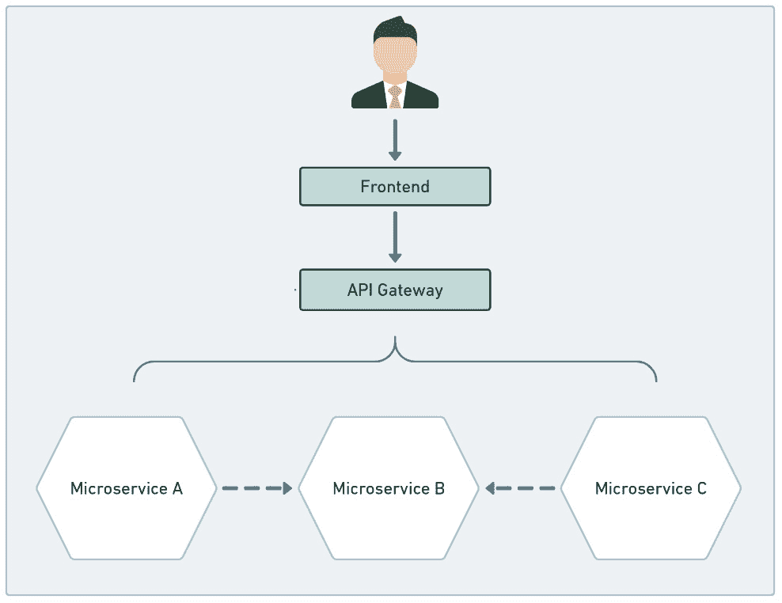
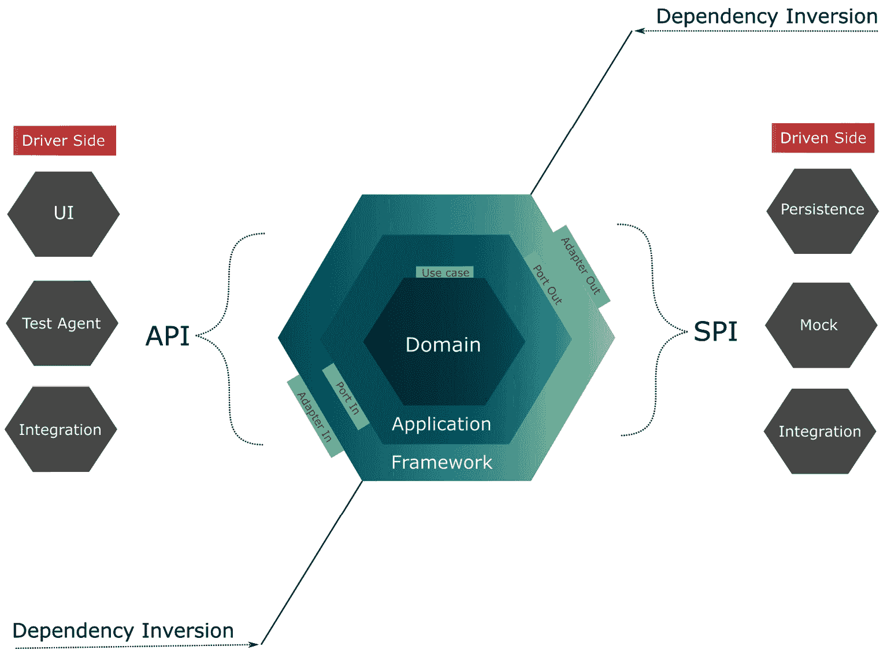
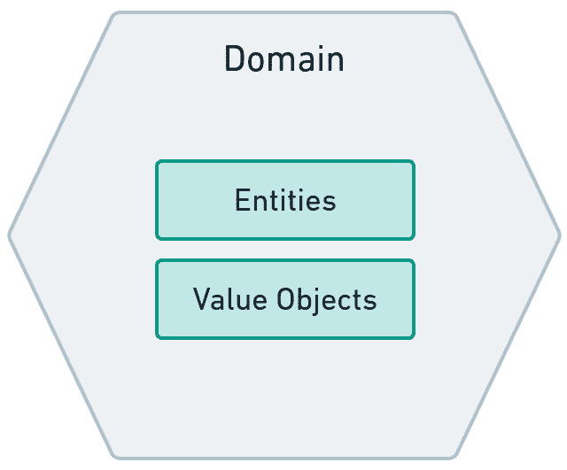
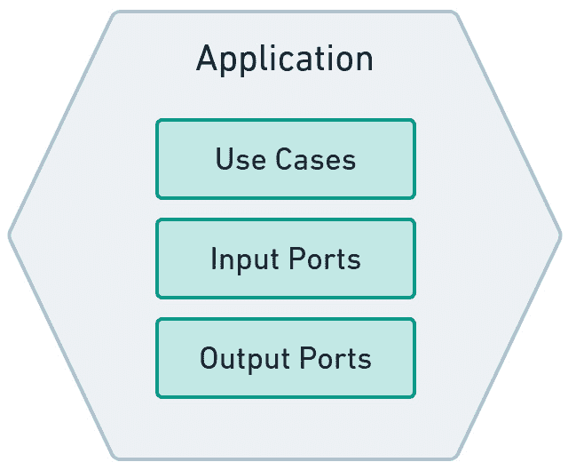
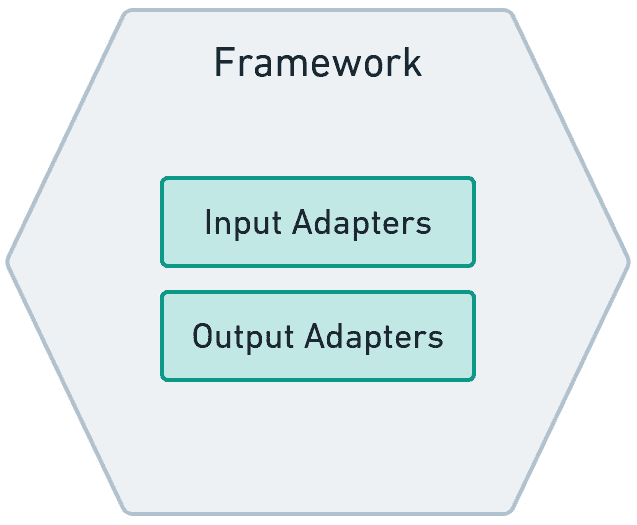
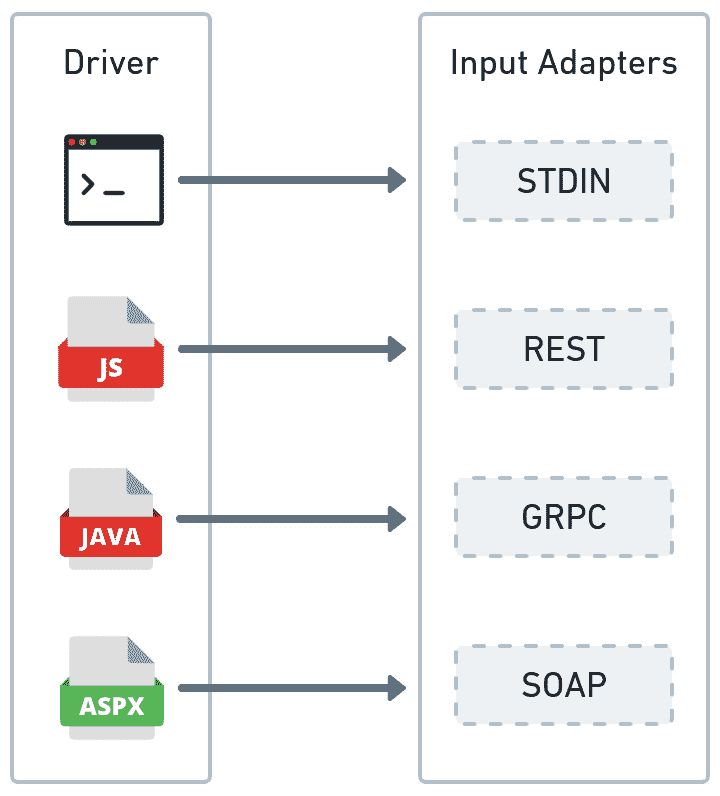
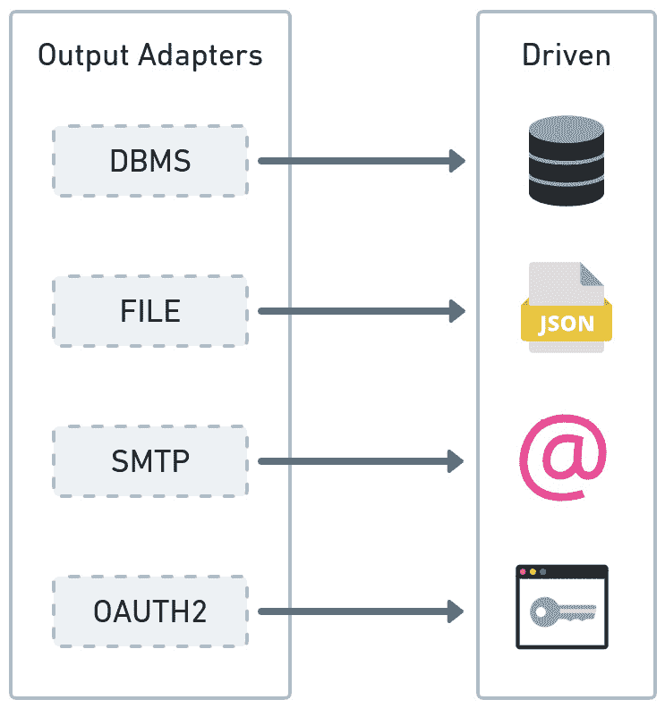

# 第一章：为什么选择六边形架构？

软件如果没有良好的组织结构和缺乏合理的软件架构原则，可能一开始运行良好，但会随着时间的推移积累技术债务。随着新功能的添加，软件可能变得更加难以维护，因为没有共同的基础来指导代码更改。基于这个问题，本章解释了六边形架构如何帮助构建能够适应意外需求的软件，通过这样做，我们可以提高软件的可维护性，并保持技术债务在可控范围内。

我们解决由于采取捷径来克服由于软件架构不灵活而引起的引入更改的困难而产生的技术债务问题。我们将看到六边形架构如何通过提供将业务逻辑（应纯粹表示业务问题的代码）与技术代码（将系统与数据库、消息队列和外部 API 等不同技术集成以支持业务逻辑的代码）解耦的原则，帮助我们提高可维护性。

我见过一些系统，其业务逻辑与技术代码紧密相关。这些系统中的某些很少改变，因此业务逻辑与技术代码之间的耦合永远不会成为问题。然而，对于经常和大量改变要求的其他系统，则需要重大的重构。那是因为业务逻辑与技术代码耦合得太紧密，以至于重写业务逻辑是唯一可行的解决方案。

使用六边形架构可能有助于你节省时间和精力，因为这种场景下经常和显著地改变要求会导致软件重写。

在本章中，我们将涵盖以下主题：

+   审查软件架构

+   理解六边形架构

到本章结束时，你将了解六边形架构的主要概念：实体、用例、端口和适配器。此外，你还将了解如何将六边形原则应用到你的项目中的基本技巧。

# 技术要求

要编译和运行本章中展示的代码示例，你需要在你的计算机上安装最新的 Java SE 开发工具包和 Maven 3.8。它们都适用于 Linux、macOS 和 Windows 操作系统。

你可以在 GitHub 上找到本章的代码文件，地址为[`github.com/PacktPublishing/-Designing-Hexagonal-Architecture-with-Java---Second-Edition/tree/main/Chapter01`](https://github.com/PacktPublishing/-Designing-Hexagonal-Architecture-with-Java---Second-Edition/tree/main/Chapter01)。

# 审查软件架构

“架构”这个词很古老。它的起源可以追溯到人们使用原始工具建造东西的时代，通常是他们自己的手。然而，每一代人都会反复克服他们那个时代的限制，建造出至今仍屹立不倒的壮丽建筑。看看佛罗伦萨大教堂及其由菲利波·布鲁内莱斯基设计的圆顶——这是建筑的一个多么出色的例子！

架构师不仅仅是那些不假思索就建造事物的普通建造者。恰恰相反；他们是那些最关心美学、基础结构和设计原则的人。有时，他们通过推动利用现有资源的极限来扮演根本性的角色。正如已经提到的，佛罗伦萨大教堂证明了这一点。

我不会过分强调这个类比，因为软件不像一座物理建筑。尽管建筑和软件架构师之间存在一些相似之处，但后者由于软件工艺的活性和演变性质而存在相当大的差异。但我们都可以同意，他们有着相同的目标：正确地建造事物。

这个目标帮助我们理解什么是软件架构。如果我们旨在建造不仅能够工作而且易于维护和结构良好的软件，那么由于我们在建造过程中所投入的细致入微的关怀和注意力，它甚至可以在一定程度上被视为一件艺术品。因此，我们可以将建造易于维护和结构良好的软件的活动视为软件架构的高尚定义。

同样重要的是要指出，软件架构师的角色不应仅限于决定如何制造事物。正如佛罗伦萨大教堂的例子中，菲利波·布鲁内莱斯基本人帮助将砖块固定到建筑上以证明他的想法是合理的，软件架构师同样应该亲自动手以证明他们的架构是优秀的。

软件架构不应该是单个人思维的产物。尽管有些人通过提供指导和建立基础来敦促他人追求技术卓越的道路，但对于一个架构的演进和成熟来说，利用所有参与提高软件质量的人的合作和经验是必要的。

以下是我们可能在我们创建和演进软件架构以帮助我们应对混乱和不可战胜的复杂性的旅程中遇到的技术和组织挑战的讨论。

## 做出决策

所有关于软件架构关注点的讨论都是相关的，因为我们可能会削弱我们在长期内维护和演进软件的能力，如果我们忽视了这些关注点。当然，有些情况下，我们并不那么雄心勃勃地想要我们的软件有多么复杂、易于维护和功能丰富。对于这种情况，可能不值得花那么多时间和精力以正确的方式构建东西，因为需要的是尽可能快地交付可工作的软件。最终，这是一个优先级的问题。但我们应谨慎，不要陷入可以事后修复的陷阱。有时我们可能有足够的资金去做，但有时可能没有。项目开始时的不良决策可能会在未来给我们带来高昂的代价。

我们关于代码结构和软件架构所做的决策引导我们走向所谓的内部质量。软件代码组织得有多好、维护性有多强，与内部质量相对应。另一方面，从用户的角度来看，软件的价值感知，即软件有多有价值、有多好，与外部质量相对应。内部质量和外部质量并不直接相关。要找到代码库混乱的有用软件并不困难。

在内部质量上花费的精力应被视为一种投资，其回报不是立即且对用户可见的。投资回报随着软件的演进而到来。价值是通过不断向软件添加变化来感知的，而不会增加添加这些变化所需的时间和金钱，如下面的伪图所示：



图 1.1 – 显示变化影响的伪图

但我们如何做出正确的决定？这是一个狡猾的问题，因为我们通常没有足够的信息来协助做出将导致最佳满足业务需求的软件架构的决策。有时，即使是用户也不知道他们完全想要什么，随着项目的演变，可能会导致新的或变化的需求。我们通过使用一种软件架构来应对这种不可预测性，这种架构可以帮助我们以可持续的方式添加变化，确保代码库增长而不增加复杂性并降低可维护性。

快速引入变化的能力是软件设计中的一个主要关注点，但我们应谨慎考虑我们在思考它上花费的时间。如果我们花太多时间设计，我们最终可能会得到一个过度工程化和可能过度昂贵的解决方案。另一方面，如果我们忽视或对设计关注点没有足够的反思，我们最终可能会得到一个复杂且难以维护的解决方案。正如《极限编程解释：拥抱变化》所指出的，在设计努力上投入的资源应与系统处理变化的速度和成本相匹配。

最后，我们希望在保持复杂性可控的同时，能够灵活地添加新功能。本着这个想法，本书关注的是软件架构思想，使我们能够处理软件设计决策以满足不断变化的业务需求。六边形架构帮助我们构建能够适应这些需求的容错系统。

## 不可见的事物

软件开发不是一项简单活动。要成为任何编程语言的熟练使用者需要相当大的努力，而使用这种技能来构建能产生利润的软件则需要更大的努力。令人惊讶的是，有时仅仅制作出盈利的软件可能还不够。

当我们谈论盈利的软件时，我们是在谈论解决现实世界问题的软件。或者，在大型企业的背景下，更精确地说，我们是指满足业务需求的软件。任何在大型企业工作过的人都知道，客户通常并不想知道软件是如何构建的。他们感兴趣的是他们能看到的东西：满足业务预期的运行软件。毕竟，这是最终支付账单的东西。

但客户看不到的事物也具有一定的意义。这些事物被称为非功能性需求。它们是与安全性、可维护性、可操作性、可扩展性、可靠性和其他能力相关的事物。如果不对这些客户视角中不可见的事物给予足够的关注，可能会损害软件的整体目的。这种妥协可能会微妙且逐渐地发生，导致出现包括技术债务在内的几个问题。

我之前提到过，软件架构是关于做正确的事情。所以，这意味着在其关注点中，我们应该包括未见和可见的事物。对于客户可见的事物，深入理解问题域是至关重要的。这就是诸如领域驱动设计等技术能帮助我们以结构化的方式处理问题的地方，这种结构化不仅对程序员有意义，对参与问题域的每个人也是如此。领域驱动设计还在塑造不可见部分中扮演着关键角色，通过紧密定义底层结构，这些结构将使我们能够解决客户需求，并以结构化和可维护的方式进行。

## 技术债务

由沃德·坎宁安提出的“技术债务”是一个术语，用来描述软件代码中存在多少不必要的复杂性。这种不必要的复杂性也可以称为冗余——也就是说，当前代码与理想状态之间的差异。我们将在下一节中看到技术债务如何在软件项目中出现。

开发仅仅能正常工作的软件是一回事。你以你认为足够满足业务需求的方式组装代码，然后将其打包并部署到生产环境中。在生产环境中，你的软件满足了客户的需求，所以一切正常，生活继续。过了一段时间，另一位开发者进入来为这个你创建的软件添加新功能。就像你一样，这位开发者以他们认为足够满足业务需求的方式组装代码，但你的代码中有些东西这位开发者并不清楚。因此，他们以与你略有不同的方式向软件中添加元素。软件最终进入生产环境，客户满意。因此，这个循环重复进行。

在之前的场景中，我们可以清楚地看到软件按预期工作。但我们无法如此清楚地看到的是，缺乏一个共同的基础来定义如何添加或修改功能，这留下了一个缺口，每当开发者不知道如何处理这些变化时，他们都会试图填补这个缺口。这个缺口为诸如技术债务之类的东西的增长留出了空间。

现实往往迫使我们陷入无法避免技术债务的情况。紧凑的时间表、糟糕的计划、缺乏技能的人员，当然，缺乏软件架构都是可能导致技术债务产生的因素。不用说，我们不应该相信强制执行软件架构会神奇地解决我们所有的技术债务问题。远非如此；在这里，我们只是在解决问题的一个方面。所有其他的技术债务因素将仍然存在，并且实际上可能会削弱我们构建可维护软件的努力。

## 恶性循环

财务债务往往会持续增长，无论你是否偿还。此外，如果你不及时偿还这些债务，银行和当局都可能追讨你的债务以及你的资产。与财务债务相反，技术债务如果不偿还，并不一定会增长。然而，决定其增长的是软件变化的速率和性质。基于这一点，我们可以假设频繁和复杂的变化有更高的潜力增加技术债务。

你始终有权利不偿还技术债务——有时这可能是根据情况下的最佳选择——但这样你会降低改变软件的能力。随着技术债务率的提高，代码变得越来越难以管理，导致开发者要么完全避免接触代码，要么找到尴尬的解决方案来解决问题。

我相信我们大多数人至少有过一次维护脆弱、极其复杂的系统的痛苦经历。在这种情况下，我们不是花时间在软件有价值的事情上，而是花更多的时间与技术债务作斗争，以腾出空间引入新功能。如果我们不控制技术债务，总有一天，向技术债务过载的系统添加新功能将不再值得。这就是人们决定放弃应用程序，开始一个新的，并重复这个周期的时候。因此，解决技术债务所需的努力应该被认为是值得的，以打破这个周期。

## 这并非适用于每个人

从任何严肃的架构工作中产生的对质量和正确性的热情并不总是存在的。有些情况下，公司中最能带来利润的软件就是一个绝对的大泥球。这是一种在没有任何秩序感的情况下成长起来的软件，难以理解和维护。敢于应对这种系统复杂性的开发者就像是在与九头蛇作战的战士。在这种复杂性中强加任何秩序所需的重构努力有时并不值得。

大泥球问题并非唯一的问题。还有文化和组织因素可能会破坏任何软件架构的努力。我常常遇到一些队友，他们根本不关心架构原则。在他们心中，将代码交付生产的最低努力路径是应该遵循的规范。在开发者周转率高的项目中，这种类型的人并不难找。由于在质量和高标准方面没有所有权感，因此没有动力去生产高质量的代码。

推动遵守软件架构的纪律是困难的。技术团队和管理层应该在遵守这种纪律的优势和影响上达成一致。重要的是要理解，在处理那些在客户功能方面价值不大的技术方面投入更多时间，可能会在长期内带来回报。所有的努力都会以更易于维护的软件得到回报，减轻了不再需要与九头蛇作斗争的开发者，以及现在能更好地满足业务截止日期的管理者。

在尝试推广，更不用说强制执行任何软件架构原则之前，最好评估情况，确保没有文化和组织因素在反对少数试图达到或提高标准以构建更完善系统的人的态度。

## 单体或分布式

在软件社区中，关于系统组件和责任的组织经常进行讨论。在过去，当昂贵的计算资源和网络带宽是影响软件架构的问题时，开发者倾向于将大量责任组合在一个软件单元中，以优化资源使用并避免在分布式环境中出现的网络开销。但是，一个可维护且紧密的单一架构与一个纠缠且难以维护的架构之间有一条微妙的界限。

越过这样一条线是一个红旗，表明系统已经积累了如此多的责任，变得如此复杂以至于任何改变都可能导致整个软件崩溃。我并不是说每个不断增长的单一架构都会变得混乱。我试图传达的是，当这样的责任聚合没有得到妥善处理时，责任积累会在单一架构系统中引起严重问题。除了这个问题之外，确保软件易于开发、测试和部署同样重要。如果软件太大，开发者可能难以在本地运行和测试它。它也可能对持续集成管道产生严重影响，影响这些管道的编译、测试和部署阶段，最终损害在 DevOps 环境中至关重要的反馈循环。

另一方面，如果我们知道系统积累了足够多的责任，我们可以重新思考整体软件架构，将大型单一架构分解成更小、更易于管理、有时是自主的软件组件，这些组件通常在其自己的运行时环境中隔离。这种方法在**面向服务的架构**（**SOA**）中得到强烈采用，然后是它的演变：**微服务架构**。SOA 和微服务都可以被认为是分布式系统的不同风味。特别是微服务架构，主要是因为计算和网络资源不像以前那样昂贵，带来了许多与强解耦和更快软件交付相关的利益。然而，这也带来了成本，因为以前我们只需要在一个地方处理复杂性，而现在挑战在于处理网络中分散在多个服务周围的复杂性。

本书提出了可以应用于单一架构和分布式系统的六边形架构思想。对于单一架构，应用程序可能被前端消费，同时从数据库或其他数据源中获取数据。六边形方法可以帮助我们开发出更具变化容忍度的单一架构系统，即使没有前端和数据库也可以进行测试。以下图表展示了常见的单一架构系统：



图 1.2 – 带有单体系统的六边形架构

在分布式系统中，我们可能会处理许多不同的技术。六边形架构在这些场景中表现出色，因为它的端口和适配器允许软件处理不断的技术变化。以下图表展示了一个典型的微服务架构，其中我们可以应用六边形原则：



图 1.3 – 带有微服务系统的六边形架构

微服务架构的一个巨大优势是我们可以使用不同的技术和编程语言来构建整个系统。我们可以使用 JavaScript 开发前端应用程序，用 Java 编写一些 API，以及用 Python 开发数据处理应用程序。六边形架构可以帮助我们在这种异构技术场景中。

既然我们已经意识到一些与软件架构相关的问题，我们就更有能力探索可能的解决方案来减轻这些问题。为了帮助我们在这方面取得进展，让我们首先研究六边形架构的基本原理。

# 理解六边形架构

“*创建你的应用程序，使其在没有 UI 或数据库的情况下也能工作，这样你就可以对应用程序进行自动回归测试，当数据库不可用时也能工作，并且可以在没有任何* *用户参与* *的情况下将应用程序连接在一起。*”

– 阿利斯泰尔·科克本。

这段话为理解六边形架构奠定了基础。我们可以进一步发展科克本的想法，使我们的应用程序在没有任何技术的情况下也能工作，而不仅仅是 UI 或数据库相关的技术。

六边形架构的主要思想之一是将业务代码与技术代码分离。不仅如此，我们还必须确保技术方面依赖于业务方面，这样后者就可以在没有关于用于实现业务目标的技术方面的担忧的情况下进行演变。使业务逻辑独立于任何技术细节，给系统带来了在不会破坏其业务逻辑的情况下更改技术的灵活性。从这个意义上说，业务逻辑代表了应用程序开发的基础，以及所有其他系统组件将从中派生出来的基础。

我们必须能够更改技术代码，而不会对其业务对应物造成损害。为了实现这一点，我们必须确定业务代码将存在的地方，它将独立并受到任何技术问题的保护。这将引发我们第一个六边形的创建：领域六边形。

在领域六边形中，我们组装了描述我们希望软件解决的核心问题的元素。实体和价值对象是领域六边形中使用的主体元素。实体代表我们可以赋予其身份的事物，而价值对象是我们可以用以组合实体的不可变组件。本书对实体和价值对象的使用意义来源于领域驱动设计原则。

我们还需要方法来使用、处理和编排来自领域六边形的业务规则。这正是应用六边形的作用所在。它位于业务和技术两边之间，作为中间人，与两部分进行交互。应用六边形利用端口和用例来执行其功能。我们将在下一节中更详细地探讨这些内容。

框架六边形提供了外部世界的接口。这就是我们有机会确定如何暴露应用功能的地方——这就是我们定义 REST 或 gRPC 端点的地方。为了从外部来源消费内容，我们使用框架六边形来指定从数据库、消息代理或任何其他系统获取数据的机制。在六边形架构中，我们通过适配器实现技术决策。以下图表提供了一个架构的高级视图：



图 1.4 – 六边形架构

接下来，我们将更深入地探讨每个六边形的组件、角色和结构。

## 领域六边形

领域六边形代表了一种理解和建模现实世界问题的努力。假设你正在从事一个需要为电信公司创建网络和拓扑清单的项目。这个清单的主要目的是提供一个全面视图，展示构成网络的全部资源。在这些资源中，我们有路由器、交换机、机架、货架和其他设备类型。我们的目标是利用领域六边形将识别、分类和关联这些网络和拓扑元素所需的知识建模成代码，并提供一个清晰有序的所需清单视图。这种知识应尽可能以技术无关的形式表示。

这个任务并非微不足道。参与此类项目的开发者可能对电信业务知之甚少，更不用说这个清单了。正如《领域驱动设计：解决软件核心的复杂性》所建议的，应咨询领域专家或其他已经了解问题域的开发者。如果没有人可用，你应该通过在书籍或其他教授问题域的材料中搜索来填补知识空白。

在领域六边形内部，我们有与关键业务数据和规则对应的实体。它们之所以关键，是因为它们代表了一个真实问题的模型。该模型可能需要一些时间来演变并始终如一地反映问题域。这通常是新软件项目的情况，在早期阶段，开发人员和领域专家都没有对系统目的的明确愿景。在这种情况下，尤其是在初创环境中，拥有一个初始的尴尬领域模型是很正常和可预测的，该模型只随着业务想法的演变和用户及领域专家的验证而演变。这是一个有趣的情况，即领域模型甚至对所谓的领域专家来说都是未知的。

另一方面，在问题域存在且在领域专家心中清晰的情况下，如果我们未能掌握该问题域及其如何转化为实体和其他领域模型元素（如价值对象），我们就有风险基于弱或不正确的假设来构建我们的软件。

弱假设可能是软件开始时简单，但随着代码库增长，积累技术债务并变得难以维护的原因之一。这些弱假设可能导致脆弱且难以表达的计算，虽然最初可以解决业务问题，但无法以连贯的方式适应变化。请记住，领域六边形由您认为有助于表示问题域的任何类型的对象类别组成。以下是基于实体和价值对象的表示：



图 1.5 – 领域六边形

让我们谈谈组成这个六边形的组件。

### 实体

实体帮助我们构建更具表达力的代码。实体所具有的特征是其连续性和身份感，正如《领域驱动设计：软件核心的复杂性处理》一书中所描述的。这种连续性与对象的生命周期和可变特性相关。例如，在我们的网络和拓扑库存场景中，我们提到了路由器的存在。对于一个路由器，我们可以定义其状态是启用还是禁用。

此外，我们还可以分配一些描述路由器与其他路由器和网络设备之间关系的属性。所有这些属性都可能随时间变化，因此我们可以看到路由器不是一个静态的东西，其问题域内的特性可以改变。正因为如此，我们可以断言路由器有一个生命周期。除此之外，每个路由器在库存中应该是唯一的，因此它必须有一个身份。因此，连续性和身份是决定实体的元素。

以下代码展示了由`RouterType`和价值对象`RouterId`组成的`Router`实体类：

```java
//Router entity class
public class Router {
    private final Type type;
    private final RouterId id;
    public Router(Type type, RouterId id) {
        this.type = type;
        this.id = id;
    }
    public static List<Router> checkRouter(
    Type type, List<Router> routers) {
    var routersList = new ArrayList<Router>();
        routers.forEach(router -> {
        if(router.type == type ){
            routersList.add(router);
        }
    });
    return routersList;
    }
}
```

### 价值对象

当不需要唯一标识某物，或者我们更关注对象的属性而不是其标识时，值对象可以补充我们代码的表达性。我们可以使用值对象来组合实体对象，因此我们必须使它们不可变，以避免在领域内出现意外的不一致。在前面提到的路由器示例中，我们可以将 `Type` 路由器表示为 `Router` 实体的值对象属性：

```java
public enum Type {
       EDGE,
    CORE;
}
```

## 应用六边形

到目前为止，我们一直在讨论如何通过实体和价值对象封装业务规则，使领域六边形得以实现。但有些情况下，软件不需要在领域级别直接操作。*《整洁架构：软件结构和设计的工匠指南》* 中提到，某些操作仅存在是为了允许软件提供的自动化。这些操作——尽管它们支持业务规则——在软件之外的环境中并不存在。我们谈论的是特定于应用的操作。

应用六边形是我们抽象处理特定于应用的任务的地方。我的意思是抽象，因为我们还没有直接处理技术问题。这个六边形基于领域六边形的业务规则表达了软件的用户意图和特性。

基于前面描述的相同拓扑和库存网络场景，假设你需要一种查询相同类型路由器的方法。这将需要一些数据处理来生成这样的结果。你的软件需要捕获一些用户输入以查询路由器类型。你可能想使用特定的业务规则来验证用户输入，并使用另一个业务规则来验证从外部来源获取的数据。如果没有违反任何约束，你的软件随后提供显示相同类型路由器列表的数据。我们可以将这些不同的任务分组在一个用例中。以下图展示了基于用例、输入端口和输出端口的 Application 六边形的高级结构：



图 1.6 – 应用六边形

下文将讨论这个六边形的组成部分。

## 用例

用例通过软件领域内存在的特定于应用的操作来表示系统的行为，这些操作支持领域的约束。用例可以直接与实体和其他用例交互，使它们成为相当灵活的组件。在 Java 中，我们通过接口表示用例的抽象，这些接口表达了软件能做什么。以下示例展示了一个提供获取过滤后的路由器列表操作的用例：

```java
public interface RouterViewUseCase {
    List<Router> getRouters(Predicate<Router> filter);
}
```

注意到 `Predicate` 过滤器。我们将使用它来过滤在实现具有输入端口的该用例时的路由器列表。

### 输入端口

如果用例只是描述软件做什么的接口，我们仍然需要实现用例接口。这就是输入端口的作用。通过作为一个直接附加到用例的组件，在*应用*级别，输入端口允许我们以域术语实现软件意图。以下是一个提供实现以满足用例中声明的软件意图的输入端口：

```java
public class RouterViewInputPort implements RouterViewUse
  Case {
    private RouterViewOutputPort routerListOutputPort;
    public RouterViewInput
      Port(RouterViewOutputPort  routerViewOutputPort) {
        this.routerListOutputPort = routerViewOutputPort;
    }
    @Override
    public List<Router> getRouters(Predicate<Router> fil
       ter) {
        var routers = routerListOutput
             Port.fetchRouters();
        return Router.retrieveRouter(routers, filter);
    }
}
```

这个例子向我们展示了我们如何可以使用域约束来确保我们正在过滤我们想要检索的路由器。从输入端口的实现中，我们也可以从应用程序外部获取东西。我们可以使用输出端口做到这一点。

## 输出端口

有时候，一个用例需要从外部资源获取数据以实现其目标。这就是输出端口的作用，它被表示为接口，以技术无关的方式描述用例或输入端口需要从外部获取什么类型的数据以执行其操作。我说无关是因为输出端口不在乎数据来自特定的关系型数据库技术或文件系统，例如。我们将这个责任分配给输出适配器，我们将在稍后讨论：

```java
public interface RouterViewOutputPort {
    List<Router> fetchRouters();
}
```

现在，让我们讨论最后一种六边形。

## 框架六边形

在我们的关键业务规则被限制在域六边形内，随后是应用六边形通过用例、输入端口和输出端口处理一些特定应用操作的情况下，事情看起来组织得很好。现在是我们需要决定哪些技术应该允许与我们的软件进行通信的时候了。这种通信可以有两种形式，一种被称为驱动，另一种被称为被驱动。对于驱动端，我们使用输入适配器，而对于被驱动端，我们使用输出适配器，如下面的图所示：



图 1.7 – 框架六边形

让我们更详细地看看这个问题。

### 驱动操作和输入适配器

驱动操作是请求软件执行操作的那些操作。这可能是一个具有命令行客户端的用户或代表用户的客户端应用程序。可能有某些测试套件检查你软件暴露的事物的正确性。或者，它可能是大型生态系统中的其他应用程序需要与某些暴露的软件功能进行交互。这种通信通过建立在输入适配器之上的**应用程序编程接口（API）**进行。

这个 API 定义了外部实体如何与你的系统交互，并将它们的请求转换为你的域应用程序。术语*驱动*是因为那些外部实体正在驱动系统的行为。输入适配器可以定义应用程序支持的通信协议，如下所示：



图 1.8 – 驱动操作和输入适配器

假设你需要向仅使用 HTTP/1.1 上的 SOAP 的旧应用程序公开一些软件功能，同时还需要将这些相同的功能提供给可以利用 HTTP/2 优势的新客户端。使用六边形架构，你可以为这两种场景创建一个输入适配器，每个适配器连接到相同的输入端口，该端口将请求向下转换为领域术语。以下是一个使用用例引用调用输入端口操作的输入适配器示例：

```java
public class RouterViewCLIAdapter {
    private RouterViewUseCase routerViewUseCase;
    public RouterViewCLIAdapter(){
        setAdapters();
    }
    public List<Router> obtainRelatedRouters(String type) {
        RelatedRoutersCommand relatedRoutersCommand =
           new RelatedRoutersCommand(type);
        return routerViewUseCase.getRelatedRouters
             (relatedRoutersCommand);
    }
    private void setAdapters(){
        this.routerViewUseCase = new  RouterViewInputPort
          (RouterViewFileAdapter.getInstance());
    }
}
```

此示例说明了创建一个从 STDIN 获取数据的输入适配器的过程。注意使用输入端口通过其用例接口。在这里，我们传递了封装在应用程序六边形上使用的输入数据的命令，以处理领域六边形的约束。如果我们想在我们的系统中启用其他通信形式，例如 REST，我们只需创建一个新的 REST 适配器，其中包含暴露 REST 通信端点的依赖项。我们将在以下章节中这样做，因为我们向我们的六边形应用程序添加更多功能。

### 驱动操作和输出适配器

在另一方面，我们有驱动操作。这些操作是从你的应用程序触发的，进入外部世界以获取数据以满足软件的需求。驱动操作通常是对某个驱动操作的响应。正如你可以猜到的，我们通过输出适配器定义驱动方面。这些适配器必须通过实现它们来符合我们的输出端口。记住，输出端口告诉系统它需要什么类型的数据来执行某些特定任务。输出适配器负责描述它将如何获取数据。以下是输出适配器和驱动操作的图示：



图 1.9 – 驱动操作和输出适配器

假设你的应用程序最初使用的是 Oracle 关系数据库，过了一段时间后，你决定改变技术，转向 NoSQL 方法，选择 MongoDB 作为你的数据源。一开始，你只有一个输出适配器，用于与 Oracle 数据库进行持久化。为了与 MongoDB 进行通信，你需要在框架六边形上创建一个输出适配器，同时保持应用程序和，最重要的是，领域六边形不受影响。因为输入和输出适配器都指向六边形内部，所以我们让它们依赖于应用程序和领域六边形，从而反转了依赖关系。

使用“驱动”这个术语是因为这些操作是由六边形应用程序本身驱动和控制的，触发在其他外部系统中的动作。注意，在以下示例中，输出适配器是如何实现输出端口接口来指定应用程序将如何获取外部数据的：

```java
public class RouterViewFileAdapter implements Router
  ViewOutputPort {
    @Override
    public List<Router> fetchRouters() {
        return readFileAsString();
    }
    private static List<Router> readFileAsString() {
        List<Router> routers = new ArrayList<>();
        try (Stream<String> stream = new BufferedReader(
                new InputStreamReader(
                  Objects.requireNonNull(
                  RouterViewFileAdapter.class
                    .getClassLoader().
                  getResourceAsStream
                    ("routers.txt")))).lines()) {
            stream.forEach(line ->{
            String[] routerEntry = line.split(";");
            var id = routerEntry[0];
            var type = routerEntry[1];
            Router router = new Router
                   (RouterType.valueOf(type)
                      ,RouterId.of(id));
                routers.add(router);
            });
        } catch (Exception e){
           e.printStackTrace();
        }
        return routers;
    }
}
```

输出端口说明应用程序需要从外部获取哪些数据。上一个示例中的输出适配器提供了一种通过本地文件获取该数据的具体方式。

在讨论了该架构中的各种六边形之后，我们现在将探讨这种方法带来的优势。

## 六边形方法的优点

如果你正在寻找一种模式来帮助你标准化公司或个人项目中软件的开发方式，六边形架构可以作为创建这种标准化的基础，通过影响类、包和整体代码结构的组织方式来实现。

在我参与多个供应商的大型项目并带来许多新开发者共同贡献同一代码库的经验中，六边形架构帮助组织建立软件结构的基础原则。每当开发者切换项目时，他们理解软件结构的学习曲线都很浅，因为他们已经熟悉了在先前项目中学习的六边形原则。这个因素特别与具有轻微技术债务的软件的长期利益直接相关。

具有高度可维护性且易于更改和测试的应用程序总是受欢迎的。接下来，让我们看看六边形架构如何帮助我们获得这些优势。

### 适应变化

技术变革正在迅速发生。新的编程语言和无数复杂的工具每天都在涌现。为了击败竞争，仅仅坚持既定和经过时间考验的技术往往是不够的。使用尖端技术不再是一个选择，而是一种必要性，如果软件没有准备好适应这种变化，公司可能会因为软件架构不适应变化而损失金钱和时间。

因此，六边形架构的端口和适配器特性通过提供创建能够以较低摩擦度融入技术变化的架构原则，给我们带来了强大的优势。

### 可维护性

如果需要更改某些业务规则，我们知道唯一需要更改的是领域六边形。另一方面，如果我们需要允许现有功能被使用特定技术或协议（该协议尚未被应用程序支持）的客户端触发，我们只需创建一个新的适配器，仅在框架六边形上执行此更改。

这种关注点的分离看起来很简单，但当它作为架构原则被强制执行时，它赋予了一定程度的可预测性，足以减少在深入研究其复杂性之前掌握基本软件结构的心理负担。时间始终是一种稀缺资源，如果有机会通过一种能够消除一些心理障碍的架构方法来节省时间，我认为我们至少应该尝试一下。

### 可测试性

六边形架构的最终目标之一是允许开发者在外部依赖项（如 UI 和数据库）不存在的情况下测试应用程序，正如 Alistair Cockburn 所说。但这并不意味着这种架构忽略了集成测试。恰恰相反——它通过提供所需的灵活性来允许更松散的耦合方法，即使在没有数据库等依赖项的情况下，也能测试代码的最关键部分。

通过评估组成六边形架构的每个元素，并意识到这种架构可以为我们的项目带来的优势，我们现在具备了开发六边形应用程序的基础。

# 摘要

在本章中，我们学习了软件架构在建立开发稳健和高品质应用程序的基础中的重要性。我们探讨了技术债务的恶劣性质以及我们如何通过合理的软件架构来应对它。最后，我们概述了六边形架构的核心组件以及它们如何使我们能够开发出更具容错性、可维护性和可测试性的软件。

借助这些知识，我们现在能够将这些六边形原则应用于基于提议的领域、应用程序和框架六边形的构建应用程序，这将帮助我们建立业务代码和技术代码之间的边界，为完整六边形系统的开发奠定基础。

在下一章中，我们将通过查看其最重要的部分：领域六边形，来探讨如何开始开发六边形应用程序。

# 问题

1.  构成六边形架构的三个六边形是什么？

1.  领域六边形的作用是什么？

1.  我们应该在什么时候利用用例？

1.  输入和输出适配器存在于哪个六边形中？

1.  驾驶和驱动操作有什么区别？

# 进一步阅读

+   *在干净的架构中动手实践*（Hombergs，2019）

# 答案

1.  领域、应用程序和框架。

1.  它以实体、值对象和任何其他有助于建模问题域的对象类别（如）的形式提供业务规则和数据。它不依赖于其上的任何其他六边形。

1.  当我们想要通过特定于应用程序的操作来表示一个系统的行为时。

1.  框架六边形。

1.  驱动操作是指从软件请求动作的操作。被驱动操作是由六边形应用程序本身启动的。这些操作超出六边形应用程序的范围，从外部来源获取数据。
