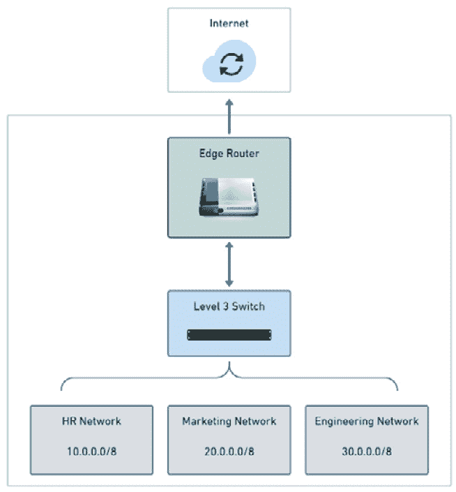
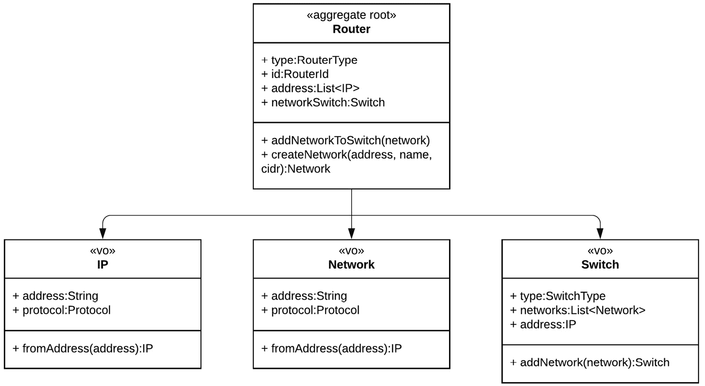

# 第二章：在领域六边形内封装业务规则

在上一章中，我们学习了领域作为六边形架构中的第一个六边形。由于是内层六边形，领域不依赖于应用和框架六边形中的任何代码。我们还让所有其他六边形都依赖于领域来执行它们的操作。这种安排使领域六边形具有比其他六边形更高的责任和相关性。我们采用这种安排是因为在领域中，我们汇集了所有代表我们试图解决的问题的最具代表性的业务规则和数据。

在建模问题域的技术中，**领域驱动设计**（**DDD**）在强调将软件代码作为传达业务知识媒介的项目中被广泛采用。一个持续的担忧是区分构成核心问题域的内容和次要内容，这使得 DDD 成为支持六边形架构目标——将技术代码与业务代码分离——的合适方法。

本章中我们将看到的原理和技术将作为构建领域六边形的基石。

本章我们将涵盖以下主题：

+   使用实体建模问题域

+   使用值对象增强描述性

+   确保聚合的一致性

+   与领域服务一起工作

+   使用策略和规范模式处理业务规则

+   将业务规则定义为**普通 Java 对象**（**POJOs**）

到本章结束时，你将学会 DDD 的基本构建块，并能够将所介绍的概念应用于六边形应用的开发。

# 技术需求

要编译和运行本章中提供的代码示例，你需要在你的计算机上安装最新的**Java 标准版**（**SE**）开发工具包和**Maven 3.8**。它们都适用于 Linux、Mac 和 Windows 操作系统。

你可以在 GitHub 上找到本章的代码文件，链接为 [`github.com/PacktPublishing/-Designing-Hexagonal-Architecture-with-Java---Second-Edition/tree/main/Chapter02`](https://github.com/PacktPublishing/-Designing-Hexagonal-Architecture-with-Java---Second-Edition/tree/main/Chapter02)。

# 使用实体建模问题域

在 DDD 中，在编写任何代码之前，开发者和领域专家之间必须进行大量的讨论——这些人对其业务有深刻的理解，可能包括其他开发者。这些讨论提供了宝贵的信息，这些信息是通过知识压缩过程获得的，该过程基于开发者和领域专家之间的头脑风暴。然后，这种知识被纳入**通用语言**。这种语言在所有参与项目的人之间作为**通用语言**使用，存在于文档、日常对话中——当然，也在代码中。

当我们处理实体时，我们必须始终注意仅通过阅读代码就能了解多少关于业务的信息。尽管仅仅阅读代码可能还不够。这时，像知识压缩这样的技术就变得至关重要，我们通过与领域专家交谈来了解更多关于业务的信息，这有助于我们不断演进通用语言并将业务知识转化为工作代码。这是真正捕捉相关行为并不仅仅是数据对象的丰富实体的基础。

要使一个实体被视为实体，它必须有一个身份；因此，我们将看到如何以与六边形架构目标一致的方式分配身份，以在业务和技术代码之间分离关注点。

## 领域实体的纯粹性

当我们建模问题域时，主要重点是尽可能精确地用代码捕捉现实生活中的场景。这个场景通常由几个协同工作的流程组成，以支持组织的目标，满足客户期望。满足客户需求的能力最终将决定组织的盈利能力。因此，问题域建模的努力对于确定任何依赖其软件赚钱的组织总体成功至关重要。未能理解和将业务需求转化为代码显然会导致客户期望得不到满足。

那个问题域建模工作的核心是实体的创建。由于实体与业务需求之间的邻近性，我们应该努力保护这些实体免受技术需求的影响。我们这样做是为了防止与业务相关的代码与技术相关的代码混淆。在这里，我指的是那些仅在软件上下文中存在并具有意义的那些事物。

如果我们只考虑业务需求而不考虑软件，那些相同的技术担忧就不再有意义。我们还得认识到，问题域可能并不总是指纯业务需求。问题域可能完全是技术性的，例如创建一个新的开发框架。我认为在这些情况下，六边形架构并不是最佳方法，因为它的重点在于试图解决传统业务问题的项目。

领域实体应该纯粹地处理业务关注点。对于特定于技术的事情，我们有选择使用端口、用例和适配器的选项，正如我们将在以下章节中看到的。

## 相关实体

一个相关的实体由两个要素的存在来表征——业务规则和业务数据。看到实体类几乎像数据库实体对象建模，只表达数据部分而忽略了通过实体类方法提供的行为所代表的业务规则，这是很常见的。这些业务规则可能最终出现在域六边形之外的代码部分。

这种泄露，即业务规则最终出现在领域六边形之外，可能是有害的，因为它可能使理解领域实体做什么变得困难。这种情况发生在业务规则在领域六边形之外定义，并依赖于例如处理数据库实体的代码时，这些数据库实体不是领域模型的一部分，而是支持领域模型的技术细节。这种现象在所谓的 **贫血领域模型** 中很普遍。来自贫血领域模型的实体对象通常有数据，但缺乏行为。通过不将数据与行为耦合，贫血领域模型违反了 **面向对象编程** （**OOP**） 的本质。当领域对象中没有行为时，我们必须去其他地方才能完全理解实体应该做什么，从而产生一种随着代码库增长而迅速变成沉重负担的心理负担。

相反，我们不应该在实体类中添加与实体本身无关的逻辑。这并非易事，因为一开始我们可能认为某个操作是实体的一部分，但后来发现它并不是。

对于被认为不是实体行为固有属性的事物，我们有使用领域服务的选项。通过服务，我们可以容纳那些不适合平滑地集成到实体类中的操作。

在上一章中，我们创建了一个 `retrieveRouter` 方法来过滤和列出 `Router` 类中的路由器，如下代码片段所示：

```java
public static List<Router> retrieveRouter(List<Router>
  routers, Predicate<Router> predicate){
     return routers.stream()
        .filter(predicate)
        .collect(Collectors.<Router>toList());
}
```

*我们能否将这个列表路由器的行为视为现实世界中路由器的固有特征？* 如果我们的问题域表示相反，那么我们应该从实体类中移除这种行为。*那么，在我们将路由器添加到列表之前用于检查路由器类型的约束又如何呢？* 如果我们认为这种验证是路由器固有的行为，我们有以下选项：

+   将此约束直接嵌入到实体类中

+   创建一个规范来断言约束

规范是我们将在本章后面讨论的主题，但到目前为止，你可以将规范视为谓词机制，以确保我们与正确的对象一起工作。以下代码片段提供了一个示例，展示了具有直接嵌入的 `routerTypeCheck` 约束的 `Router` 实体类：

```java
public class Router {
/** Code omitted **/
     public static Predicate<Router> filterRouterByType
       (RouterType routerType){
          return routerType.equals(RouterType.CORE)
                ? Router.isCore() :
                Router.isEdge();
     }
     private static Predicate<Router> isCore(){
          return p -> p.getRouterType() == RouterType.CORE;
     }
     private static Predicate<Router> isEdge(){
          return p -> p.getRouterType() == RouterType.EDGE;
     }
/** Code omitted **/
}
```

为了适应领域服务方法，我们首先需要创建一个名为 `RouterSearch` 的领域服务类，并将 `Router` 类中的 `retrieveRouter` 方法移动到该类中，如下所示：

```java
public class RouterSearch {
    public static List<Router> retrieveRouter(List<Router>
      routers, Predicate<Router> predicate){
          return routers.stream()
                .filter(predicate)
                .collect(Collectors.<Router>toList());
    }
}
```

`isCore`、`isEdge` 和 `filterRouterByType` 约束方法继续存在于 `Router` 实体类中。我们只是将 `retrieveRouter` 方法从 `Router` 移动到 `RouterSearch`。现在，`retrieveRouter` 方法可以作为服务被领域中的其他对象和其他六边形消费。在本章的后续部分，在 *与领域服务一起工作* 部分中，我们将更详细地探讨领域服务。

可能会出现的疑问是领域模型方法应该有多复杂，尤其是那些属于领域实体的方法。我的看法是，复杂性将由我们对问题域的了解以及我们将它转化为领域实体的能力所决定，通过适当的方法定义，仅捕获根据问题域提出的条件所必需的行为，以改变实体状态。薄弱的问题域知识可能导致不必要的复杂性。因此，随着我们对问题域的了解增加，我们也增加了为定义的领域实体提供正确复杂性的能力。

实体的一个基本特征是它们有一个唯一标识它们的身份。拥有一个身份机制对于确保我们的实体在整个系统中是唯一的至关重要。提供这种身份的一种方式是通过使用 UUID，我们将在本节中探讨这个主题。

## 使用 UUID 定义身份

你可能熟悉**标识符**（**ID**）生成技术，这些技术依赖于数据库序列机制来生成和避免 ID 的重复。虽然将这项责任委托给数据库很方便，但这样做会将我们软件的一个关键方面与外部系统耦合起来。

假设我们旨在开发一个六边形应用，使我们能够以尽可能少的科技依赖性来演进业务代码。在这种情况下，我们需要找到一种方法将这种身份生成转化为一个独立的过程。

建立不依赖于中央权威的身份的常见方法是通过**通用唯一标识符**（**UUID**）。这是一个广泛用于确保计算机系统普遍唯一性的 128 位数字。有四种不同的方法可以生成 UUID - 基于时间的、**分布式计算机环境**（**DCE**）安全、基于名称和随机生成。以下代码片段显示了如何创建基于名称和随机生成的 UUID：

```java
     // Name-based UUID
     var bytes = new byte[20];
     new Random().nextBytes(bytes);
     var nameBasedUUID = UUID.nameUUIDFromBytes(bytes);
     // Randomly generated UUID
     var randomUUID = UUID.randomUUID();
```

小心 UUID，如果你的数据源是关系型数据库，你可能会遇到性能问题。因为 UUID 是字符串，它们比关系型数据库提供的自动生成的 ID 消耗更多的内存。UUID 的使用可能会对数据库的大小和索引管理产生相当大的影响。没有免费的午餐。计算机资源是这种无差别的 ID 生成解决方案的代价。这取决于你决定这种方法的优点是否超过了缺点。

一旦定义，实体 ID 就不应该改变，因此它成为一个不可变的属性。这种不可变的特性使得实体 ID 属性成为建模为价值对象的合适候选。基于我们在上一章中处理过的拓扑和网络库存示例，以下代码片段展示了创建一个表示我们的 `Router` 实体 ID 的价值对象类的一个简单方法：

```java
public class RouterId {
     private final UUID id;
     private RouterId(UUID id){
          this.id = id;
     }
     public static RouterId withId(String id){
          return new RouterId(UUID.fromString(id));
     }
     public static RouterId withoutId(){
          return new RouterId(UUID.randomUUID());
     }
}
```

`withId` 工厂方法允许我们在拥有 ID 的情况下重新构成 `Router` 实体。`withoutId` 工厂方法使我们能够为新的 `Router` 实体生成新的 ID。

`withId` 和 `withoutId` 方法都是静态工厂模式的运用，这种模式允许我们封装对象创建。这些方法属于领域模型，因为它们通过 ID 在新的或现有的路由实体上提供身份验证。

实体是六边形架构中的第一类公民。它们是其他软件组件从中派生的基础元素。然而，仅凭它们本身不足以创建丰富的领域模型，因为领域中的并非所有事物都具有身份。我们需要某种东西来表达不需要唯一标识的对象。我们通过价值对象来满足这一需求，这是一种旨在帮助我们增加问题域描述性的对象类型。

# 使用价值对象增强描述性

在《实现领域驱动设计》这本书中，作者 Vernon Vaughn 指出，我们应该使用价值对象来衡量、量化或描述我们的问题域中的事物。例如，你可以用一个价值对象来描述 ID 属性，而不是用长或整数值。你可以将双精度或大十进制属性包装在一个特定的价值对象中，以更清晰地表达量化。

我们对仅仅使用内置语言类型来建模问题域并不完全满意。为了使系统更明确其性质和目的，我们将这些内置语言数据类型——甚至我们自己的创建类型——封装在定义良好的价值对象中。

这种传达意义的努力基于价值对象以下两个基本特征：

+   它们是不可变的

+   它们没有身份

假设你画了一幅画。想象一下，如果你完成作品后，出于某种原因，画中的部分神秘地改变了颜色，那会多么奇怪。在这个类比中，颜色就像我们用来创建画面的价值对象，每种颜色都可以是一个不同的价值对象。因此，为了确保我们的颜料持久，一旦使用，颜色就不能改变，一旦使用就必须是不可变的。我关于价值对象的论点基于这样一个观点：某些特征必须永远不变，因为它们是我们用来描述问题域的原始材料。

纯粹的原料本身既不表达很多意义，也没有多少价值。真正的价值在于当我们将原料结合并与之合作，形成相关且可辨识的事物时。因为值对象本身就像原料一样，我们不会费心去替换它们或丢弃它们。*而且如果它们并不那么重要，我们为什么还要赋予它们一个身份，并像对待实体一样给予同样的关注呢？*

最终，值对象应该是可丢弃的且易于替换的对象，我们使用它们来组合实体或其他类型的对象。

## 使用值对象来组合实体

当对实体类进行建模时，例如，我们有两种选择——在实体属性上使用或不使用值对象。以下是一个第二种方法的例子：

```java
public class Event implements Comparable<Event> {
     private EventId id;
     private OffsetDateTime timestamp;
     private String protocol;
     private String activity;
     ...
}
```

考虑以下日志摘录作为我们想要解析到`Event`对象中的数据条目：

```java
00:44:06.906367 100430035020260940012015 IPV6 casanova.58183 > menuvivofibra.br.domain: 64865+ PTR? 1.0.0.224.in-addr.arpa. (40)
00:44:06.912775 100430035020260940012016 IPV4 menuvivofibra.br.domain > casanova.58183: 64865 1/0/0 PTR all-systems.mcast.net. (75)
```

经过适当的解析后，我们会得到具有网络流量活动字符串字段的`Event`对象，如下所示：

**casanova.58183 >** **menuvivofibra.br.domain**

在大于号之前，我们有源主机，之后是目标主机。为了这个例子，让我们把它看作是一个表示数据包源和目标的活动。作为一个字符串，它给想要从其中检索源或目标主机的客户端留下了负担，如下所示：

```java
var srcHost = event.getActivity().split(">")[0]
  //casanova.58183
```

让我们用一个`Activity`值对象来尝试，如下所示：

```java
public class Activity {
     private final String description;
     private final String srcHost;
     private final String dstHost;
     public Activity (String description, String srcHost,
       String dstHost){
          this.description = description;
          this.srcHost = description.split(">")[0];
          this.dstHost = description.split(">")[1];
     }
     public String getSrcHost(){
          return this.srcHost;
     }
}
```

然后，我们更新`Event`实体类，如下所示：

```java
public class Event implements Comparable<Event> {
     private EventId id;
     private OffsetDateTime timestamp;
     private String protocol;
     private Activity activity;
     ...
}
```

客户端代码变得更加清晰和表达性强，正如我们可以在以下代码片段中看到。此外，客户端不需要自己处理数据来检索源和目标主机：

```java
var srcHost = event.getActivity().retrieveSrcHost()
//casanova.58183
```

使用值对象，我们对自己的数据有更多的灵活性和控制力，使我们能够以更一致的方式表达领域模型。

# 确保聚合的一致性

到目前为止，我们已经看到实体在表示问题域中的事物方面是多么有价值。我们还看到了值对象是如何对我们使用的模型的可描述性至关重要的。*然而，当我们有一组相关的实体和值对象，当它们组合在一起时表达了一个整体概念时，我们该如何进行呢？*对于这种情况，我们应该使用**聚合**。其理念是聚合内的对象以一致和隔离的方式操作。为了实现这种一致性，我们必须确保任何对任何聚合对象的更改都是基于该聚合施加的变体条件。

聚合体就像一个指挥者，它在其控制的对象上编排数据和行为。为了使这种方法有效，我们需要定义一个入口点来与聚合体领域交互。这个入口点也被称为聚合体根，它保留了对聚合体中实体和值对象的引用。有了聚合体提供的边界，我们更有能力确保在该边界内对象操作的一致性。通过正式建立概念边界以确保基于我们的问题域的活动的一致性，我们将更容易采用诸如乐观或悲观锁定等技术，以及诸如**Java 事务 API**（**Java JTA**）等技术来支持一致的事务操作。有了结构良好的聚合体，我们有更好的条件来应用我们认为好的任何方法，以使我们的系统能够进行事务处理。

从性能和可扩展性的角度来看，我们应该始终努力使我们的聚合体尽可能小。原因很简单——大的聚合体对象消耗更多的内存。同时实例化太多的聚合体对象可能会损害整体**Java 虚拟机**（**JVM**）的性能。这条规则适用于 OOP 世界中的任何事物，但我们强调聚合体，因为它们能够集成对象。

一个小的聚合体通常只包含一个实体，该实体作为聚合体的根，以及其他值对象。使两个不同的聚合体相互交互的方式是通过它们的聚合体根，它恰好是一个具有唯一 ID 的实体根。聚合体根也用于持久化目的。因此，您将通过聚合体根对聚合体子对象进行更改，当您的更改完成后，您将使用相同的聚合体根将那些更改提交到您的持久化系统中。

相反，如果您不认为性能和可扩展性这样的非功能性需求是至关重要的，我认为，只要适当关注，聚合体可以增长到包含多个实体。

## 模型化一个聚合体

为了说明我们如何模型化一个聚合体，让我们回到我们的网络和拓扑库存场景。一个业务需求是对连接到特定**边缘路由器**的设备和网络进行编目。在下面的**三层交换机**下面，我们有一个负责为不同网络创建**虚拟局域网**（**VLANs**）的**三层交换机**。结构可能像下面这样：



图 2.1 – 网络组件

设备、网络和关系的目录被基础设施部门用来帮助他们计划和实施整体网络的变更。一个路由器或交换机单独并不能告诉我们太多关于网络的信息。真正的价值在于当我们聚合所有网络组件及其互连时。

这类信息将使基础设施部门有更多的可见性，并做出基于事实的决策。我们聚合的核心是边缘路由器实体，它恰好是我们的聚合根。交换机也是一个实体。我们将其 VLAN 网络建模为值对象。这里的上下文很清晰——一个由 HR、市场和工程 VLAN 网络组成的网络连接到一个交换机，而该交换机反过来又连接到边缘路由器。互联网或其他网络可以在不同的上下文中考虑。以下是一个类似于**统一建模语言**（**UML**）的聚合根表示：



图 2.2 – 将所有网络组件聚集在一起

从最底层开始，我们有`Network`作为一个值对象，如下面的代码片段所示：

```java
public record Network(IP address, String name, int cidr) {
    public Network {
        if (cidr < 1 || cidr > 32) {
            throw new IllegalArgumentException("Invalid
              CIDR
            value");
        }
    }
}
```

注意，**互联网协议**（**IP**）地址属性也是一个值对象，如下面的代码片段所示：

```java
public class IP {
     private final String address;
     private final Protocol protocol;
     public IP(String address) {
          if(address == null)
          throw new IllegalArgumentException("Null IP
            address");
          if(address.length()<=15) {
               this.protocol = Protocol.IPV4;
          } else {
               this.protocol = Protocol.IPV6;
          }
          this.address = address;
     }
}
```

你可能已经在`IP`和`Network`值对象类的构造函数中注意到了一些验证规则。这些验证规则作为守护者，用于防止值对象被错误地构建。将这些守护者在实例创建中放置是一种让客户端摆脱验证值对象负担的方法。这正是`Network`类所发生的事情，我们只是验证了`cidr`属性，因为`IP`已经预先进行了验证。

此外，还有一个用于组合`IP`值对象的`Protocol`枚举值对象，如下面的代码片段所示：

```java
public enum Protocol {
     IPV4,
     IPV6
}
```

在对`IP`、`Network`和`Protocol`值对象进行建模之后，我们现在有了建模`Switch`实体类的必要对象，如下所示：

```java
public class Switch {
     private final SwitchType type;
     private final SwitchId switchId;
     private final List<Network> networkList;
     private final IP address;
    public Switch (SwitchType switchType, SwitchId
      switchId, List<Network> networks, IP address) {
        this.switchType = switchType;
        this.switchId = switchId;
        this.networks = networks;
        this.address = address;
    }
   public Switch addNetwork(Network network, Router rout
     er)
   {
      List<Network> newNetworks =
      new ArrayList<>(router.retrieveNetworks());
    newNetworks.add(network);
    return new Switch(
        this.switchType,
        this.switchId,
        newNetworks,
        this.address);
   }
    public List<Network> getNetworks() {
        return networks;
    }
}
```

因为网络直接连接到交换机，我们创建了一个`addNetwork`方法来支持向交换机添加更多网络的能力。此方法首先从路由器检索现有网络，将它们添加到列表中。然后，它将新网络添加到现有网络的列表中。请注意，`addNetwork`不会更改当前的`Switch`对象，而是创建一个新的`Switch`实例，其中包含我们添加的网络。

在我们迄今为止创建的所有值对象和`Switch`实体之上，我们需要与一个聚合根正式化一个边界。这就是我们的`Router`实体类的作用，如下面的代码片段所示：

```java
public class Router {
    private final RouterType routerType;
    private final RouterId routerid;
    private Switch networkSwitch;
    public Router(RouterType, RouterId routerid) {
        this.routerType = routerType;
        this.routerid = routerid;
    }
    public static Predicate<Router>
      filterRouterByType(RouterType routerType) {
        return routerType.equals(RouterType.CORE)
                ? Router.isCore() :
                Router.isEdge();
    }
    public static Predicate<Router> isCore() {
        return p -> p.getRouterType() == RouterType.CORE;
   }
    public static Predicate<Router> isEdge() {
        return p -> p.getRouterType() == RouterType.EDGE;
   }
    public void addNetworkToSwitch(Network network) {
        this.networkSwitch =
          networkSwitch.addNetwork(network, this);
    }
    public Network createNetwork(IP address, String name,
      int cidr) {
        return new Network(address, name, cidr);
    }
    public List<Network> retrieveNetworks() {
        return networkSwitch.getNetworks();
    }
    public RouterType getRouterType() {
        return routerType;
    }
    @Override
    public String toString() {
        return "Router{" +
                "type=" + routerType +
                ", id=" + routerid +
          '}';
    }
}
```

除了`RouterType`和`RouterId`值对象之外，还有一个代表交换机的实体。`networkSwitch`实体表示直接连接到该路由器的交换机。然后，我们添加了两个方法，一个用于创建新的网络，另一个用于将现有网络连接到交换机。

通过将这些方法放在聚合根上，我们将处理其上下文中所有对象的职责委托给它，从而在处理这种对象聚合时增强了一致性。此外，这也是防止贫血领域模型方法的一种努力，其中实体只是没有任何行为的数据对象。

接下来，我们将看到如何使用领域服务来调用聚合体中包含的操作。

# 与领域服务一起工作

当对问题域进行建模时，我们肯定会遇到手头的任务不适合领域六边形中我们迄今为止看到的任何对象类别的情况——实体、值对象和聚合体。在本章的早期，我们遇到了从`Router`实体中移除一个负责检索路由器列表的方法的情况。这个方法似乎位置不正确，因为在我们拓扑和网络库存场景中，路由器通常不会列出其他路由器。为了处理这种繁琐的情况，我们已经将路由器列表方法重构为一个单独的对象。埃里克·埃文斯称这样的对象为**领域服务**。

我认为区分领域服务与其他任何类型的服务非常重要。例如，在**模型-视图-控制器**（**MVC**）架构中，服务通常被视为连接应用程序不同方面的桥梁，处理数据和协调系统内外部的调用。它们的用法通常与软件开发框架相关联，例如 Spring，甚至有服务注解。然而，无论在何种情境下，我认为不同服务类型之间的主要区别不在于意义，而在于范围。

*什么是服务？* 它是执行某些有价值工作的能力。这种特性在任何服务中都是固有的，无论是在现实世界还是在计算机中。然而，在后一种情况下，我们应该关注**关注点分离**（**SoC**）、模块化、解耦和其他与良好架构相关的内容。这些关注点是我们在领域六边形中将领域服务放入其中的基础。它们执行有价值的工作——就像任何其他服务一样——但仅限于我们的问题域的约束范围内。这意味着领域服务不应调用在应用程序或框架六边形中操作的服务或其他对象。相反，来自这些六边形的对象是客户端，它们调用领域服务。

在上一节中，我们在我们的`Router`实体类中创建了以下两个方法，它也是聚合根：

```java
public void addNetworkToSwitch(Network network) {
    this.networkSwitch = networkSwitch.addNetwork(network,
      this);
}
public Network createNetwork(IP address, String name, long
  cidr) {
    return new Network(address, name, cidr);
}
```

在下面的代码片段中，我们有一个服务类操作这两个`Router`实体方法：

```java
public class NetworkOperation {
     final private int MINIMUM_ALLOWED_CIDR = 8;
     public void createNewNetwork(Router router, IP
       address, String name, int cidr) {
     if(cidr < MINIMUM_ALLOWED_CIDR)
     throw new IllegalArgumentException("CIDR is
       below      "+MINIMUM_ALLOWED_CIDR);
     if(isNetworkAvailable(router, address))
     throw new IllegalArgumentException("Address already
       exist");
     Network =
       router.createNetwork(address,name,cidr);
     router.addNetworkToSwitch(network);
     }
     private boolean isNetworkAvailable(Router router, IP
       address){
          var availability = true;
          for (Network network : router.retrieveNetworks()) {
               if(network.getAddress().equals(address) &&
                 network.getCidr() == cidr)
                    availability = false;
                    break;
          }
          return availability;
     }
}
```

我们有一个名为`createNewNetwork`的方法，它负责创建一个新的网络对象并将其添加到与我们的路由器相连的交换机。为了能够创建一个网络，我们必须满足两个约束。第一个，简单的一个是检查是否没有违反最小**无类别域间路由**（**CIDR**）。第二个约束稍微复杂一些。它验证网络地址是否在整个网络上已被使用。

采用这种方法，我们将处理那些不适合整齐地放入实体或值对象中的任务的职责委托给`NetworkOperation`域服务类。这也是防止实体和值对象类变得过于庞大、具有比问题域所需更多的特性的好方法。

到目前为止，我们一直在实体、值对象或服务类上直接处理不变量。接下来，我们将看到一种更有序、更组织化的方法来适应这些不变量。

# 使用策略和规范处理业务规则

一个系统拥有的最有价值的东西之一就是其编码的业务规则。这些规则代表了理解现实世界问题并将这种理解转化为工作软件的重要努力。这绝对不是一项微不足道的工作。在领域驱动设计中，我们了解到与领域专家紧密合作来正确地建模我们的问题域是多么关键。如果领域专家不可用，我们应该寻找了解业务的开发者。如果他们都不可用，我们就别无选择，只能通过书籍和其他任何可以帮助我们掌握问题域内部运作的资源开始知识寻求之旅。

一旦我们获得了业务知识，并且我们对问题域的步骤和过程有了足够的相关信息，我们就可以开始将那些知识转化为代码的冒险之旅。乍一看，这个过程似乎很简单，即理解业务需求并将它们转化为软件。然而，这实际上是经过非常好的辩论的结果，产生了各种方法论，甚至产生了一个重要的宣言，即**敏捷宣言**。在这里，我的目标不是讨论理解业务需求的最佳方法。相反，这里的想法是展示我们可以用来将业务知识转化为工作软件的一些技术。

我们总有选择以自己的方式做事，有时会忽略来自我们之前经验的知识。在处理业务规则时，这绝对没有不同。在先前的例子中，我们就是这样做的，不加思考地将业务规则散布在代码中。我们现在有机会修正这种方法，并利用我们之前的人的知识。

策略模式和规范模式是两种可以帮助我们更好地组织代码业务规则的模式。

**策略**，也称为策略模式，是一种封装问题域一部分的代码模式。对于那些熟悉策略模式（*四人帮*）的人来说，可以使用术语*算法*来描述封装的代码块。策略的主要特征是它在提供的数据上执行某些操作或处理。策略故意与实体和值对象保持分离，以避免耦合。这种解耦提供了众所周知的优点，即在不直接影响或产生副作用的情况下，可以独立地演进某个部分。

相反，**规范**就像用于确保对象属性的条件或谓词。然而，定义规范的是它以比简单的逻辑运算符更表达性的方式封装这些谓词。一旦封装，这些规范就可以被重用，甚至可以组合起来更好地表达问题域。

当政策和规范一起使用时，它们是提高我们业务规则在代码中鲁棒性和一致性的有效技术。规范确保只有合适的对象被我们的策略处理。我们有一系列不同且易于更改的算法可供策略使用。

为了更好地说明规范和策略的工作原理，我们现在将探讨如何实现它们。

## 创建规范

让我们先看看如何重构我们的`NetworkOperation`服务类以使用规范。我们将从创建一个`Specification`接口开始，如下所示：

```java
public interface Specification<T> {
          boolean isSatisfiedBy(T t);
     Specification<T> and(Specification<T> specification);
}
```

通过`isSatisfiedBy`的实现，我们将定义我们的谓词。在接口之后，我们需要创建一个抽象类来实现`and`方法，以便我们可以组合规范，如下代码片段所示：

```java
public abstract class AbstractSpecification<T> implements
  Specification<T> {
     public abstract boolean isSatisfiedBy(T t);
     public Specification<T> and(final Specification<T>
       specification) {
          return new AndSpecification<T>(this,
            specification);
     }
}
```

在这里，只有`AND`运算符的方法，因为我们不处理其他运算符，如`OR`和`NOT`，尽管实现这些运算符的方法很常见。为了完成我们基础类型的创建，我们实现了`AndSpecification`类，如下所示：

```java
public class AndSpecification<T> extends AbstractSpecifica
  tion<T> {
     private final Specification<T> spec1;
     private final Specification<T> spec2;
     public AndSpecification(final Specification<T> spec1,
       final Specification<T> spec2) {
          this.spec1 = spec1;
          this.spec2 = spec2;
     }
     public boolean isSatisfiedBy(final T t) {
          return spec1.isSatisfiedBy(t) &&
            spec2.isSatisfiedBy(t);
     }
}
```

现在我们已经准备好创建我们自己的规范了。第一个是关于限制创建新网络所允许的最小 CIDR 的业务规则。代码如下所示：

```java
if(cidr < MINIMUM_ALLOWED_CIDR)
     throw new IllegalArgumentException("CIDR is
       below "+MINIMUM_ALLOWED_CIDR);
```

相应的规范将如下所示：

```java
public class CIDRSpecification extends AbstractSpecifica
  tion<Integer> {
     final static public int MINIMUM_ALLOWED_CIDR = 8;
     @Override
     public boolean isSatisfiedBy(Integer cidr) {
          return cidr > MINIMUM_ALLOWED_CIDR;
     }
}
```

接下来，我们将处理检查网络地址是否已被使用的业务规则，如下所示：

```java
if(isNetworkAvailable(router, address))
  throw new IllegalArgumentException("Address already ex
    ist");
private boolean isNetworkAvailable(Router router, IP ad
  dress) {
     var availability = true;
     for (Network network : router.retrieveNetworks()) {
          if(network.getAddress().equals(address) &&
            network.getCidr() == cidr)
                    availability = false;
                    break;
          }
          return availability;
     }
```

之前代码的重构基本上是将`isNetworkAvailable`方法从实体移动到规范类中，如下代码片段所示：

```java
public class NetworkAvailabilitySpecification extends Ab
  stractSpecification<Router> {
     private final IP address;
     private final String name;
     private final int cidr;
     public NetworkAvailabilitySpecification(IP address,
       String name, int cidr) {
          this.address = address;
          this.name = name;
          this.cidr = cidr;
     }
     @Override
     public boolean isSatisfiedBy(Router router) {
          return router!=null &&
            isNetworkAvailable(router);
     }
     private boolean isNetworkAvailable(Router router) {
          return router.retrieveNetworks().stream()
             .noneMatch(
             network -> network.address().equals(address)
               &&
             network.name().equals(name) &&
             network.cidr() == cidr);
     }
}
```

为了说明如何使用`and`方法组合两个规范，我们将创建另外两个规范。第一个是确定允许的最大网络数量，如下代码片段所示：

```java
public class NetworkAmountSpecification extends Ab
  stractSpecification<Router> {
     final static public int MAXIMUM_ALLOWED_NETWORKS = 6;
     @Override
     public boolean isSatisfiedBy(Router router) {
          return router.retrieveNetworks().size()
            <=MAXIMUM_ALLOWED_NETWORKS;
     }
}
```

第二个规范是确保我们只处理边缘或核心路由器。这在上面的代码片段中显示：

```java
public class RouterTypeSpecification extends AbstractSpeci
  fication<Router> {
     @Override
     public boolean isSatisfiedBy(Router router) {
          return
          router.getRouterType().equals(RouterType.EDGE) ||
            router.getRouterType().equals(RouterType.CORE);
     }
}
```

现在我们已经定义了我们的规范，我们可以使用 Java 15 首次作为预览引入并随后在 Java 17 中作为最终版本引入的功能，允许我们约束哪些类被允许实现一个接口或类。我们称之为 *密封类/接口*。正如其名所示，这个特性密封了类/接口，因此除非实现类/接口的名称在密封类或接口上明确声明，否则它不能被实现。让我们看看这个特性如何与刚刚创建的规范一起工作。

我们希望限制谁可以实现 `Specification` 接口和 `AbstractSpecification` 抽象类。在下面的代码片段中，我们可以看到我们如何将其应用于 `Specification` 接口：

```java
public sealed interface Specification<T> permits Ab
  stractSpecification {
/** Code omitted **/
}
```

注意，我们通过使用 `permits` 子句来限制哪些类可以实现该接口。让我们密封 `AbstractSpecification` 抽象类：

```java
public abstract sealed class AbstractSpecification<T> im
  plements Specification<T> permits
        AndSpecification,
        CIDRSpecification,
        NetworkAmountSpecification,
        NetworkAvailabilitySpecification,
        RouterTypeSpecification
{
/** Code omitted **/
}
```

允许子句现在包括了所有实现 `AbstractSpecification` 的其他类。我们仍然需要确保实现这些类的 `final` 状态。因此，我们需要在每个这些类上添加 `final` 子句，如下例所示：

```java
public final class NetworkAmountSpecification extends Ab
  stractSpecification<Router> {
/** Code omitted **/
}
```

一旦我们完成了对实现规范类的 `final` 关键字的调整，我们就有一个定义良好的密封类/接口集合，描述了哪些规范类可以用来定义系统的业务规则。

现在我们已经准备好重构我们的领域服务，该服务负责创建新的网络以使用这些规范，如下所示：

```java
public class NetworkOperation {
     public void createNewNetwork(Router router, IP
       address, String name, int cidr) {
          var availabilitySpec = new
            NetworkAvailabilitySpecification(address, name,
              cidr);
          var cidrSpec = new CIDRSpecification();
          var routerTypeSpec = new
            RouterTypeSpecification();
          var amountSpec = new
            NetworkAmountSpecification();
          if(cidrSpec.isSatisfiedBy(cidr))
               throw new IllegalArgumentException("CIDR is
                 below
                 "+CIDRSpecification.MINIMUM_ALLOWED_CIDR);
          if(availabilitySpec.isSatisfiedBy(router))
               throw new IllegalArgumentException("Address
                 already exist");
          if(amountSpec.and(routerTypeSpec).isSatisfiedBy
            (router)) {
               Network network =
                 router.createNetwork(address, name, cidr);
               router.addNetworkToSwitch(network);
          }
     }
}
```

现在我们已经探讨了如何实现规范，让我们看看我们如何创建策略。

## 创建策略

为了理解策略是如何工作的，我们将创建一个服务类来帮助我们根据特定的算法检索基于原始事件数据的网络事件列表。这个解析算法可能或可能不被认为是问题域的一部分；通常情况下不是，但为了这个示例，让我们假设它是。

我们将创建两个策略——第一个是将字符串日志条目解析为 `Event` 对象，使用基于纯 **正则表达式**（**regex**）的算法，我们明确地告知正则表达式模式，而第二个将使用基于分割的算法，仅使用空格作为分隔符来完成相同的事情。这两种策略之间的选择可以基于性能和定制解析机制的能力，以及其他因素。

首先，我们将创建一个 `EventParser` 接口，如下所示：

```java
public interface EventParser {
     DateTimeFormatter formatter =
       DateTimeFormatter.ofPattern("yyyy-MM-dd
         HH:mm:ss.SSS").withZone(ZoneId.of("UTC"));
     Event parseEvent(String event);
}
```

我们将在两个事件解析实现类中使用 `formatter` 属性。

让我们开始实现正则表达式解析策略，如下所示：

```java
public class RegexEventParser implements EventParser {
     @Override
     public Event parseEvent(String event) {
          final String regex = "(\\\"[^\\\"]+\\\")|\\S+";
          final Pattern pattern = Pattern.compile(regex,
            Pattern.MULTILINE);
          final Matcher matcher = pattern.matcher(event);
          var fields = new ArrayList<>();
          while (matcher.find()) {
               fields.add(matcher.group(0));
          }
          var timestamp =
            LocalDateTime.parse(matcher.group(0),
              formatter).atOffset(ZoneOffset.UTC);
          var id = EventId.of(matcher.group(1));
          var protocol =
            Protocol.valueOf(matcher.group(2));
          var activity = new Activity(matcher.group(3),
            matcher.group(5));
          return new Event(timestamp, id, protocol,
            activity);
     }
}
```

分割解析策略看起来更简单，如下所示：

```java
public class SplitEventParser implements EventParser{
          @Override
     public Event parseEvent(String event) {
          var fields = Arrays.asList(event.split(" "));
          var timestamp =
            LocalDateTime.parse(fields.get(0),
              formatter).atOffset(ZoneOffset.UTC);
          var id = EventId.of(fields.get(1));
          var protocol = Protocol.valueOf(fields.get(2));
          var activity = new Activity(fields.get(3),
            fields.get(5));
          return new Event(timestamp,id, protocol,
            activity);
     }
}
```

就像我们之前处理规范一样，`EventParser` 接口可以被转换为一个密封接口：

```java
public sealed interface EventParser permits RegexEvent
  Parser, SplitEventParser {
/** Code omitted **/
}
```

不要忘记在`RegexEventParser`和`SplitEventParser`类中包含`final`关键字。

现在，回到解析策略实现，请注意`Event`构造函数是用解析后的属性调用的。我们需要更新我们的`Event`实体类，使其能够与我们的策略一起工作。我们可以通过以下代码来实现：

```java
public class Event implements Comparable<Event> {
     private final OffsetDateTime timestamp;
     private final EventId id;
     private final Protocol protocol;
     private final Activity activity;
     public Event(OffsetDateTime timestamp, EventId id,
       Protocol protocol, Activity activity) {
          this.timestamp = timestamp;
          this.id = id;
          this.protocol = protocol;
          this.activity = activity;
     }
     public static Event parsedEvent(String
       unparsedEvent, ParsePolicyType policy) {
          switch (policy){
            case REGEX -> new
            RegexEventParser().parseEvent(unparsedEvent);
            case SPLIT -> new
            SplitEventParser().parseEvent(unparsedEvent);
          }
     }
...
}
```

允许我们在策略之间进行选择的开关依赖于以下枚举：

```java
public enum ParsePolicyType {
    REGEX,
    SPLIT
}
```

我们现在准备好创建一个具有检索网络事件方法的`EventSearch`服务类。这个领域服务将允许我们在检索事件时选择使用哪种解析算法。以下是实现此功能所需的代码：

```java
public class EventSearch {
     public List<Event> retrieveEvents(List<String>
       unparsedEvents, ParsePolicyType policyType){
          var parsedEvents = new ArrayList<Event>();
          unparsedEvents.forEach(event →{
               parsedEvents.add(Event.parsedEvent(event,
          policyType));
          });
          return parsedEvents;
     }
}
```

现在我们已经熟悉了策略和规范模式，让我们看看将我们的业务规则建模在 POJOs 上的好处。

# 将业务规则定义为 POJOs

在那个时代，当企业开发强烈受到 Java 2 Platform, **Enterprise Edition** (**J2EE**)（今天被称为**Jakarta EE**）的影响时，有一种称为**Enterprise JavaBeans** (**EJBs**)的技术，负责从开发者手中接管所有管理软件开发管道活动（涉及事务管理、安全和对象生命周期）的重型工作。EJB 的承诺是开发者可以集中精力开发业务功能，而 J2EE 容器将负责所有基础设施细节。EJBs 实现了这一承诺，但并非没有代价。在第一版中创建和维护 EJB 既耗时又无聊。有许多事情要做，涉及各种**可扩展标记语言** (**XML**)配置和部署描述符，而且更糟糕的是，由于有太多的样板代码，几乎没有空间重用这些 EJB 对象。它们不像 POJOs 那样——简单且可重用。

第一版 EJB（特别是版本 2）的问题帮助我们激发了创建改进解决方案的动机，这些解决方案可以利用 POJOs 的简单性。在这些解决方案中，我们可以提到 EJB 3 以及从 Spring 和 Quarkus 等框架派生出来的技术。然而，所有这些技术共同的特点是激励和灵活性，以便与 POJOs 一起工作。

POJOs 很有吸引力，因为它们不过就是普通的 Java 对象。理解 POJO 很简单，因为我们只处理 Java 标准**应用程序编程接口** (**APIs**)，而不是自定义库和框架。这就是 POJOs 成为一类开发者友好对象的原因，它们更容易理解和在不同的应用程序部分之间重用。如果我们旨在开发容错性高的应用程序，那么使用 POJOs 总是推荐的做法，以减少与特定技术的耦合，允许应用程序在不同技术或框架之间切换而不会产生太多摩擦。

这种由 POJO 提供的灵活性允许它们在需要时同时参与不同的系统部门。例如，没有人阻止某人在事务性、持久性和用户展示上下文中使用相同的 POJO。我们还可以使用 POJO 来表示业务规则——本章中展示的实体、政策和规范对象是我们在 POJO 中体现业务规则的优秀例子。

通过使用 POJO 来建模业务规则，我们利用了与可重用性和简单性相关的所有好处。它们也与保持领域对象免受任何技术细节影响的重要目标相一致，这最终将有助于支持更灵活和清醒的设计的必要 SoC（分离关注点）努力。

# 摘要

本章中我们讨论的 DDD 主题对于开发六边形应用至关重要，因为正是通过使用 DDD 技术，我们才能塑造出一个解耦的、一致的、面向业务领域的六边形，这将成为应用和框架六边形的基础。

理解基础知识始终是至关重要的。通过更深入地研究主要的 DDD 概念，我们发现了一些基本技术，这些技术有助于我们开发领域六边形。我们讨论了如何创建纯净且相关的实体以及如何为它们分配身份。通过值对象，我们理解了它们在传达意义和增强问题域描述性方面的重要性。聚合体向我们展示了如何将相关的实体和值对象分组，以描述我们问题域中的整体操作。此外，我们还看到了聚合体如何确保与事务的一致性。

在学习聚合体之后，我们了解到领域服务让我们能够表达不适合放入实体或值对象中的行为，为了更好地组织业务规则，我们学习了策略和规范模式。最后，我们评估了 POJO 在定义业务规则时提供的可重用性和简单性的好处。通过本章探讨的思想和技术，我们现在可以构建一个领域六边形，它能够捕捉并正确地将影响整个应用行为的业务规则编码到代码中。

现在，我们已经准备好在阶梯上迈出更高的一步，进入应用六边形的领域，我们将看到如何通过用例和端口结合和编排业务规则来创建软件功能。

# 问题

1.  实体与值对象相比，主要属性是什么？

1.  值对象是否可以是可变的？

1.  每个聚合体都必须有一个入口点对象，以便与其他由聚合体控制的对象进行通信。这个入口点对象的名称是什么？

1.  领域服务是否允许调用其他六边形上的对象？

1.  政策和规范之间有什么区别？

1.  将业务规则定义为 POJO 有什么好处？

# 进一步阅读

+   《实现领域驱动设计》（Vernon，2016 年）

+   《领域驱动设计：软件核心的复杂性处理》（Evans，2003 年）

+   《极限编程之道：拥抱变化》（Beck，1999 年）

# 答案

1.  与值对象相反，实体具有一个身份。

1.  不。值对象最重要的属性是其不可变性。

1.  任何聚合的入口点对象被称为聚合根。

1.  不，但来自其他领域和其他六边形的对象可以调用领域服务。

1.  政策是一种模式，它将部分问题领域知识封装在代码块或算法中。规范是一种与谓词一起工作的模式，用于断言对象属性的合法性。

1.  因为 POJO 不依赖于外部技术细节，例如外部库或框架提供的功能。相反，POJO 仅依赖于标准的 Java API，这使得 POJO 成为简单且易于重用的对象。POJO 对于创建不受技术细节模糊的业务规则对象很有帮助。
