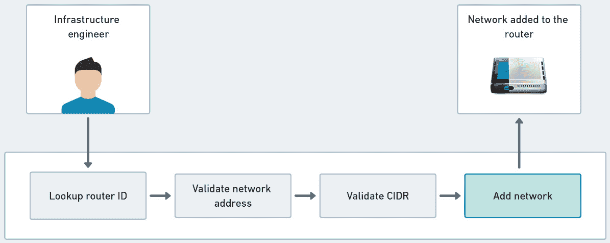
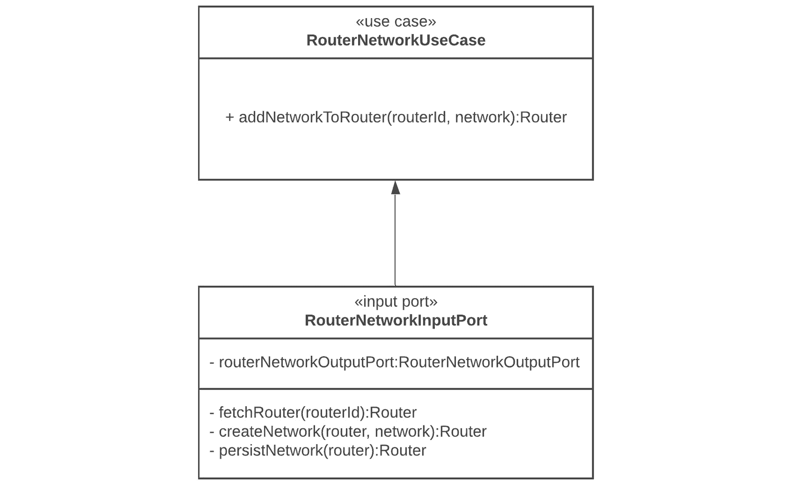
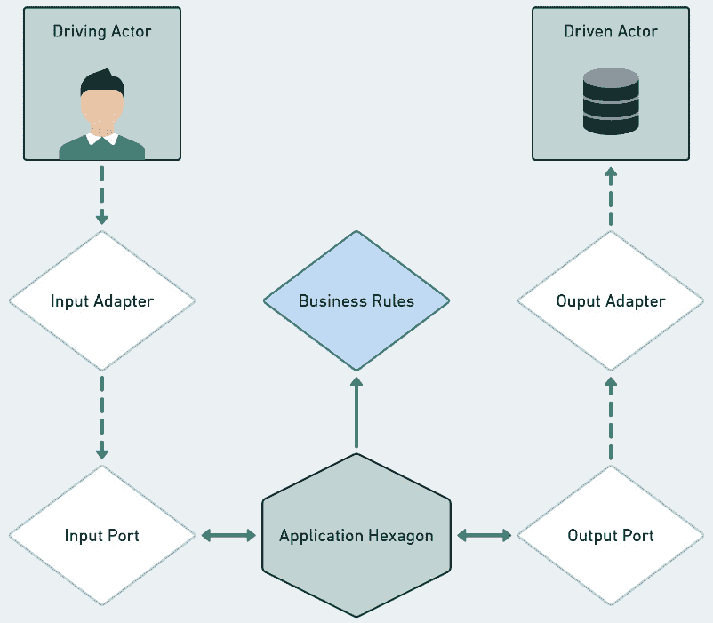
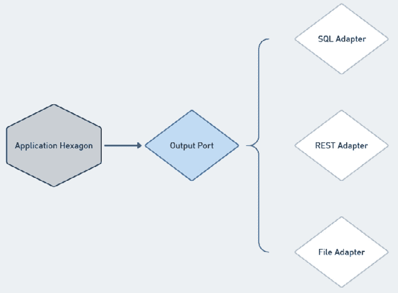

# 3

# 使用端口和用例处理行为

一旦我们在领域六边形中定义了业务规则，我们就可以开始考虑如何使用这些规则来创建软件功能，同时考虑系统将如何处理来自用户和其他应用程序的数据。端口和用例在六边形架构中解决了这些问题，我们需要协调系统数据和业务规则以提供有用的软件功能。

在本章中，我们将探讨如何使用用例来定义软件支持的行为。通过将输入和输出端口与用例相结合，我们将了解这些端口在建立六边形系统内部通信流程中的作用。

我们将涵盖以下主题：

+   使用用例表达软件行为

+   使用输入端口实现用例

+   使用输出端口处理外部数据

+   使用应用六边形自动化行为

“在本章结束时，您将能够使用端口和用例来协调六边形系统必须执行的所有操作以满足用户需求。”一旦您掌握了端口和用例的基本原理，您就可以利用它们将领域和应用六边形中的元素结合起来，构建强大的功能。

# 技术要求

要编译和运行本章中提供的代码示例，您需要在您的计算机上安装最新的**Java SE 开发工具包**和**Maven 3.8**。它们都适用于 Linux、Mac 和 Windows 操作系统。

您可以在 GitHub 上找到本章的代码文件，链接为[`github.com/PacktPublishing/Designing-Hexagonal-Architecture-with-Java/tree/main/Chapter03`](https://github.com/PacktPublishing/Designing-Hexagonal-Architecture-with-Java/tree/main/Chapter03)。

# 使用用例表达软件行为

**软件系统**不过是一组协同工作以实现用户或甚至其他软件系统定义的目标的行为。软件行为反过来又是一个值得的行动，单独或与其他软件行为结合，有助于实现一个值得的软件目标。这些目标与感兴趣的用户或系统表达出的愿望密切相关。

我们可以将那些感兴趣的各方归类为利益相关者或参与者，我们将从他们那里最终推导出将转化为目标的真实世界需求。这些参与者的目标将通过**讨论的系统**（**SuD**）或简单地说是您正在开发的软件来实现。

从六边形架构的角度来看，我们可以将这些参与者与我们之前在*第一章*中看到的联系起来，即*为什么选择六边形架构？*，当时讨论了驱动和被驱动操作。同样，我们可以对 SuD 参与者进行分类：**驱动参与者**是一个触发 SuD 行为的人或系统，而**被驱动参与者**是 SuD 消耗的外部系统。

为了在功能和非功能术语中表达系统应该做什么，像 Ivar Jacobson 和 Alistair Cockburn 这样的人以及敏捷社区普遍做出了贡献，他们开发了有用的技术，将业务需求转化为有意义的书面描述，说明系统应该如何表现。在这些技术中，最突出的是用例技术。

与 UML 不同，UML 通过图之间的关系展示系统的高级视图，而用例通过提供对 SuD 行为的详细书面描述进行更深入的挖掘。**用例**是一种宝贵的技巧，用于设定 SuD 目标、实现这些目标的方法或行为、可能出现的失败场景以及出现时应该采取的措施。当与 DDD 技术结合使用时，用例在弥合处理特定于应用程序的活动方面的差距方面发挥着重要作用——这些活动对 SuD——以及应用程序六边形——比领域六边形中的问题域及其业务规则更为重要。通过从用例的角度思考，我们朝着在六边形架构中提高关注点分离迈出了重要的一步。

我们可以通过简单地写下关于它们的描述来创建用例，但也可以通过代码来表达它们。接下来，我们将学习如何以书面和代码的形式创建用例。

## 如何创建用例

有一些创建书面用例的详细方法，您可以指定有关输入数据、可能的行为和用例结果的详细和标准化信息。Cockburn 将这些详细用例归类为全装用例。全装用例在新团队中可能很有帮助，因为人们不习惯一起工作。全装方法强制执行的规范有助于提供一条清晰的路径，说明如何构建用例。它有助于防止出现一个人可能考虑某些用例方面，而这些方面在其他人的用例中并不存在的情况。以下是一个全装用例的例子：

+   **参与者**：基础设施工程师

+   **目标**：向边缘路由器添加新的网络

+   **范围**：基础设施部门

+   **触发器**：一个特定的原因，通过不同的网络隔离网络访问

+   **输入数据**：路由器 ID、网络名称、地址和 CIDR

+   **操作**：

    1.  查找路由器 ID。

    1.  验证网络地址尚未存在。

    1.  验证 CIDR 是否不低于最低允许值。

    1.  如果前面的验证没有问题，将网络添加到已通知的路由器。

相反，我们还有不那么正式和随意的用例类型。非正式用例的主要特点是它们不遵循关于如何记录信息的标准。它们试图在一个或两个段落中传达尽可能多的意义，如下面的例子所述。

基础设施工程师向应用程序发送包含路由器 ID、网络名称、地址和 CIDR 的请求。应用程序在路由器 ID 中进行查找，然后验证网络尚未存在，接着验证 CIDR 值是否不低于最低允许值。如果所有验证都正常，则系统继续将网络添加到指定的路由器。

除了正式和非正式的书面技巧之外，还可以通过自动化测试直接在代码中表达用户意图。这种方法依赖于与发现、制定和自动化相关的**行为驱动设计**（**BDD**）原则。在这种方法中，你开始与商业人士交谈，试图发现他们的需求。这个发现过程的输出包含描述业务需求的情况和行为示例。然后，你进入制定阶段，根据这些示例创建结构化文档。最后，自动化阶段是创建和执行测试以验证先前阶段中描述和结构化的行为。

在软件开发早期采用 BDD（行为驱动开发），我们有根据创建的示例和测试迭代创建用例的机会，以验证业务想法。

在 Cucumber 等工具的帮助下，我们可以在我们的六边形应用中采用 BDD 方法。为了将我们之前构建的书面用例转换为 Cucumber 功能文件，我们需要创建一个 Cucumber 功能文件：

```java
@addNetworkToRouter
Feature: Add network to a router
I want to be able to add a network to an existent router
Scenario: Adding a network to an existent router
Given I provide a router ID and the network details
When I found the router
And The network address is valid and doesn't already exist
And The CIDR is valid
Given, When, And, and Then terms from the feature files, we need to create a test class to automate the validation of our use case steps:

```

public class AddNetworkStepsTest {

private RouterId routerId;

private Router router;

private RouterNetworkFileAdapter routerNetworkFileAdapter

= RouterNetworkFileAdapter.getInstance();

Network network = new Network(new IP("20.0.0.0"),

"营销", 8);

/** 代码省略 **/

}

```java

 First, we have to declare the types and initialize the objects we will use to perform our tests. In the preceding code, we declared the `RouterId` and `Router` types. Then, we initialized the `RouterNetworkFileAdapter` and `Network` instances.
After preparing the resources we need to test, we can start by implementing the first step of our test:

```

@Given("我提供一个路由器 ID 和网络详情")

public void obtain_routerId() {

this.routerId = RouterId.withId(

"ca23800e-9b5a-11eb-a8b3-0242ac130003");

}

```java

 The `@Given` annotation describes the retrieval of `RouterId`. We can use this ID to fetch a router:

```

@When("我找到了路由器")

public void lookup_router() {

router =

routerNetworkFileAdapter.fetchRouterById(routerId);

}

```java

 By using `RouterNetworkFileAdapter` and `RouterId`, we retrieve a `Router` object. Next, we can check whether the `Network` object meets the desired requirements before adding it to the router:

```

@And(

"网络地址有效且尚未存在")

public void check_address_validity_and_existence() {

var availabilitySpec =

new NetworkAvailabilitySpecification(

network.getAddress(), network.getName(),

network.getCidr());

if(!availabilitySpec.isSatisfiedBy(router))

throw new IllegalArgumentException("地址已存在

exist");

}

```java

 To ensure the network is valid, we must apply the rules from `NetworkAvailabilitySpecification`. Next, we must check the network CIDR:

```

@Given("CIDR 有效")

public void check_cidr() {

var cidrSpec = new CIDRSpecification();

if(cidrSpec.isSatisfiedBy(network.getCidr()))

throw new IllegalArgumentException(

"CIDR 低于"+CIDRSpecification.

MINIMUM_ALLOWED_CIDR);

}

```java

 As the last verification step, we must apply the rules from `CIDRSpecification`. If everything is fine, then we can add the network to the router:

```

@Then("将网络添加到路由器")

public void add_network() {

router.addNetworkToSwitch(network);

}

```java

 By calling the `addNetworkToSwitch` method from `Router`, we have added the network to the router.
The following is a visual representation of the formal, casual, and BDD-based types of use cases:


Figure 3.1 – A use case for the topology and inventory network system
Fully dressed, casual, and BDD-based use cases express the same thing. The main difference lies not in the *what* but rather in *how* the three techniques achieve the same objective to describe system behavior. As we may expect, the best choice is conditioned to money, time, and organization constraints.
We could bypass this use case creation/process and go straight on to code the use case. Although I don’t consider the formal use case structuring part a required step, I certainly consider it a recommended one. By writing down and structuring the use case’s expected behaviors, we’re engaging in a valuable additional step to help us clarify and better organize our ideas regarding the use case’s arrangement. Once the structuring effort is made, we only need to translate that into its code counterpart.
What I propose in developing hexagonal applications is to design use cases as abstractions rather than implementations. I am using interfaces in these examples, but there is no problem using abstract classes. The following code shows a use case interface based on its written form:

```

public interface RouterNetworkUseCase {

路由器添加网络到路由器（RouterId routerId, 网络

network);

}

```java

 We define use cases as interfaces for three reasons:

*   To provide different ways of fulfilling the use cases’ goals
*   To allow dependency on abstraction rather than implementation
*   For governance of APIs

The role of use cases in the hexagonal architecture is that they allow us to implement input ports. It’s through input ports that we construct the logic that will, for example, call Domain hexagon services, other use cases, and external resources through output ports. The UML representation of the use case and its input port is as follows:


Figure 3.2 – A use case for the topology and inventory network system
Now that we know how to create use cases, both in written and code form, let’s explore the ways to implement use cases with input ports.
Implementing use cases with input ports
In the hexagonal architecture, there is this idea about driving and driven operations. We’ve seen that such classification is also valid to determine which actors interact with the hexagon system. Driving actors are the ones who send requests to the application, while the driven actors represent the external components accessed by the application. We use **input ports** – also known as **primary ports** – to allow the communication flow between driving actors and the driving operations exposed by a hexagonal system. Use cases tell us what behaviors the application will support, while input ports tell us how such behaviors will be performed.
Input ports play an integrating role because they are like pipes that allow the data to flow from driving actors when they hit the hexagonal system through one of its adapters on the Framework hexagon. In the same vein, input ports provide the pipes for communication with business rules from the Domain hexagon. Through input ports, we also orchestrate communication with external systems through output ports and adapters.
Input ports are at the crossroads of a hexagonal system, helping translate what comes from the outside and goes in the direction of the Domain and Application hexagons. Input ports are also essential in orchestrating communication with external systems. In the following diagram, we can see how **Application Hexagon** is the integration point between **Driving Actor** and **Driven Actor** and their respective input and output ports and adapters:


Figure 3.3 – The various ports and the Application hexagon
In the previous section, we defined a use case interface describing an operation that allowed us to add a network to a router. Let’s learn how to create an input port by implementing that use case:

```

public class RouterNetworkInputPort implements RouterNet

workUseCase {

private final RouterNetworkOutputPort

routerNetworkOutputPort;

public RouterNetworkInputPort(RouterNetworkOutputPort

routerNetworkOutputPort){

this.routerNetworkOutputPort =

routerNetworkOutputPort;

}

@Override

public Router addNetworkToRouter(RouterId routerId, Network

network) {

var router = fetchRouter(routerId);

return createNetwork(router, network);

}

private Router fetchRouter(RouterId routerId) {

return

routerNetworkOutputPort.fetchRouterById(routerId);

}

private Router createNetwork(Router router, Network net

work) {

var newRouter =

NetworkOperation.createNewNetwork(router, network);

return persistNetwork(router) ? newRouter : router;

}

private boolean persistNetwork(Router router) {

return routerNetworkOutputPort.persistRouter(router);

}

}

```java

 With this input port implementation, we have a clear view of what actions the software must perform to fulfill the use case’s goal of adding a network to the router. Before we look closer at the input port methods, let’s consider the `RouterNetworkOutputPort` interface’s declaration:

```

public interface RouterNetworkOutputPort {

Router fetchRouterById(RouterId routerId);

boolean persistRouter(Router router);

}

```java

 This output port states that the application intends to obtain and persist data from external sources. The hexagon system is not aware of whether the external source is a database, a flat file, or another system. Here, we only state the intention to get data from outside.
The `addNetworkToRouter` method, which returns a `Router` object, is the only public method that’s exposed by the input port. We make all other methods private because they are not supposed to be used outside the context of this input port. The input port starts its job by using `RouterId` to retrieve a `Router` object; then, it creates a new `Network` object on that `Router` object. Remember, the `Network` object comprises the address, name, and CIDR attributes, as expressed in the use case’s written form. The `fetchRouter` method will try to obtain a `Router` object by passing a `RouterId` ID to the output port’s `fetchRouterById` method. That’s when the input port will need to coordinate an external call that will be carried out by an output adapter that implements the output port.
If everything goes well, the input port will receive the desired `Router` object and will be able to create a network object and add it to the informed router. At this point, the input port is interacting with a Domain service called `createNewNetwork`. This service works under the constraints imposed by business rules from the Domain hexagon. Finally, the input port coordinates the persistence of the whole operation through the `persistRouter` method from the output port.
This input port does not contain anything specific to the problem domain. Its primary concern is to handle data by orchestrating internal calls with Domain services and external calls with output ports. The input port sets the operation’s execution order and provides the Domain hexagon with data in a format it understands.
External calls are interactions that are performed by the hexagonal application to get data from or persist data to external systems. This is the subject of the next section, where we’ll learn how to use output ports to deal with things living outside the application.
Using output ports to deal with external data
**Output ports**, also known as **secondary ports**, represent the application’s intent to deal with external data. It’s through output ports that we prepare the system to communicate with the outside world. By allowing this communication, we can associate output ports with driven actors and operations. Remember, driven actors are external systems, while driven operations are used to communicate with such systems.
I say that we’re preparing the hexagonal application to communicate with the outside world because, at the Application hexagon level, we don’t know how that communication will occur yet. This approach is based on Uncle Bob’s wise advice to postpone, as much as possible, any decisions concerned about which technologies will be used to fulfill the application’s needs. By doing that, we’re putting more emphasis on the problem domain than on technological details. I’m not saying that the persistence or messaging mechanisms, for example, are not relevant enough to influence the application’s design. Instead, the idea is to not let external technologies dictate how the application is designed.
In the early stages of a software project, it’s not uncommon to see people discussing whether to use PostgreSQL or Oracle databases for persistence, Kafka or Redis for pub-sub activities, and so on. Those types of discussions exert a strong influence on how the software solves business problems. Sometimes, it’s hard to imagine such software solving the same business problems but with different technologies. On certain occasions, it’s even inconceivable to consider such a thing because the whole application architecture is centered on specific technologies.
As people who work with technology, we’re always eager to use the hottest development framework or a modern programming language. That is a good attitude, and I think we should continuously pursue better techniques and sophisticated ways to solve problems. But prudence is advised to properly balance our focus between the technology and problem domain aspects of a system.
It’s not only about repositories
You may be used to using terms such as repository or **data access object** (**DAO**) to describe application behaviors related to persistence in a database. In hexagonal applications, we replace repositories with output ports.
Repositories are often associated with database operations, a fact that, by the way, is also enforced by some development frameworks that formalize this association through persistence features offered by the framework. A recurring example of this approach is similar to the following code:

```

public interface PasswordResetTokenRepository extends

JpaRepository<PasswordResetToken, Long> {

PasswordResetToken findByToken(String token);

PasswordResetToken findByUser(User user);

Stream<PasswordResetToken>

findAllByExpiryDateLessThan(Date now);

void deleteByExpiryDateLessThan(Date now);

@Modifying

@Query(«delete from PasswordResetToken t where

t.expiryDate <= ?1")

void deleteAllExpiredSince(Date now);

}

```java

 The usage of the `JpaRepository` interface and the `@Query` annotation from the Spring framework reinforces the notion that the password data will come from a relational database. This situation could also be seen as a leaking abstraction condition because our `PasswordResetTokenRepository` interface would also contain all the methods inherited from the `JpaRepository` class that may not be relevant or provide behaviors that don’t suit the system’s needs.
The underlying idea about output ports is that we’re not inferring that persistence or any kind of external communication will occur with a database system. Instead, the output port’s scope is broader. Its concern is with communicating with any system, be it a database, a messaging system, or a local or network filesystem, for example.
A more hexagonal approach to the password reset interface shown previously would look something like the following code:

```

public interface PasswordResetTokenOutputPort {

PasswordResetToken findByToken(String token);

PasswordResetToken findByUser(User user);

Stream<PasswordResetToken>

findAllByExpiryDateLessThan(Date now);

void deleteByExpiryDateLessThan(Date now);

void deleteAllExpiredSince(Date now);

}

```java

 By not extending types from a specific framework and avoiding the usage of annotations such as `@Query`, we’re turning the output port into a POJO. The usage of annotations per se is not a problem. The issue lies more in the purpose of their usage. If the aim is to use annotations to implement features that only exist in a particular framework, we are then coupling the software to that framework. Instead, if the purpose is to use annotations to implement features based on Java standard specifications, we are making a valuable effort to make the software more tolerant to change.
The data that’s obtained from an output port today may come directly from a relational database. Tomorrow, this same data can be obtained from the REST API of some application. Those details are not necessary from the Application hexagon’s perspective because the components in this hexagon are not concerned with how the data is obtained.
Their main concern is in expressing what kind of data they need to conduct their activities. The way those Application hexagon components define what data they need is based on the entity and value objects from the Domain hexagon. With this arrangement, where an output port states what type of data it needs, we can plug multiple adapters into the same output port. So, these adapters carry out the necessary tasks to obtain the data, as expressed by the output port. This flow is shown in the following diagram:


Figure 3.4 – The output port and its adapters
The output port’s main goal is to state what kind of data it needs without specifying how it will get that data. That’s the reason why we define them as interfaces and not implementations. The implementation part is reserved for output adapters, an essential hexagonal architecture component that we’ll look at in the next chapter. To conclude our analysis of output ports, let’s explore where they should be used.
Where to use output ports
At the beginning of this chapter, we learned how use cases establish the necessary actions to accomplish something useful in the application. Among these actions, there may be situations that require us to interact with external systems.
So, the reason to create and utilize output ports will be derived from the activities performed by use cases. In code, the reference for an output port will not appear in the use case’s interface declaration. The usage of output ports is made explicit when we implement the use case with an input port. That’s what we did when we implemented `RouterNetworkUseCase` and declared a `RouterNetworkOutputPort` attribute at the beginning of `RouterNetworkInputPort`:

```

public class RouterNetworkInputPort implements RouterNet

workUseCase {

private final RouterNetworkOutputPort

routerNetworkOutputPort;

public RouterNetworkInputPort(RouterNetworkOutputPort

routerNetworkOutputPort){

this.routerNetworkOutputPort =

routerNetworkOutputPort;

}

private Router fetchRouter(RouterId routerId) {

return routerNetworkOutputPort.fetchRouterById

(routerId);

}

private boolean persistNetwork(Router router) {

return routerNetworkOutputPort.persistRouter

(router);

}

}

```java

 You may be wondering when and how the instance for an output port is created. The previous example shows one approach, where the input port constructor receives a reference for an output port object. This object will be an implementation provided by an output adapter.
Among the operations defined by a use case and implemented by an input port, some operations are responsible for getting data from or persisting data to external sources. That’s where output ports come in: to provide the data required to fulfill the use case’s goal.
In the same way that a use case goal is used to represent a piece of software’s intent, without saying how this intent will be realized, output ports do the same thing by representing what kind of data the application needs, without needing to know how that data will be obtained. Output ports, along with input ports and use cases, are the hexagonal architecture components that support the automation effort that characterizes the Application hexagon. We’ll examine this in the next section.
Automating behavior with the Application hexagon
**Automation** is one of the most valuable things software can do. The advent of computation brought radical changes to how people solve their problems. An interesting scenario is that of the credit card industry in its early years. When banks started to offer credit cards to their customers, most of the back-office activities were done manually. If you wanted to pay for something with a credit card, the person in the store would need to call their bank, who, in turn, would need to contact your card issuer to confirm you had credit. As the technology evolved, computer systems were able to automate this credit verification process.
If we decided to use the hexagonal architecture to build a credit card verification system, those required steps to confirm the cardholder’s credit could be expressed using a use case. With an input port, we could handle business rules and all the data necessary to achieve the use case goal, consuming, if necessary, external systems through an output port. When we put all those activities together, the fundamental role of the Application hexagon in automating those activities to fulfill the system’s intent becomes more apparent. Here’s a code example to illustrate how the credit verification process would look in the Application hexagon:

1.  We start by creating a `CreditCard` entity class:

    ```

    public class CreditCard {

    /** 代码省略 **/

    double availableCredit;

    public boolean

    isAvailableCreditGreaterOrEqualThan(

    double transactionAmount) {

    return  availableCredit>=transactionAmount;

    }

    }

    ```java

    The preceding code only emphasizes the credit availability aspect. So, we have the `availableCredit` attribute and the `isAvailableCreditGreaterOrEqualThan` method to check that there’s enough credit for a given transaction.

     2.  Then, we declare the `CreditCheckUseCase` interface:

    ```

    public interface CreditCheckUseCase {

    boolean hasEnoughCredit(String cardId, double

    transactionAmount);

    }

    ```java

    The goal is to check whether the credit card has enough credit for the transaction amount. To do so, we expect the `cardId` and `transactionAmount` attributes. We intend to use `cardId` to get credit card data from somewhere. So, having an output port is required to get data from other places.

     3.  Here, we declare `CreditCheckOutputPort`:

    ```

    public interface CreditCheckOutputPort {

    CreditCard getCreditCard(String cardId);

    }

    ```java

    This is a straightforward output port where we pass the `cardId` attribute and expect the `CreditCard` object to contain, among other things, how much credit is available.

     4.  Suppose credit card data is stored in a MySQL database. We would need an output adapter that implements the previously defined output port:

    ```

    public class CreditCheckMySQLOutputAdapter implements

    CreditCheckOutputPort {

    @Override

    public CreditCard getCreditCard(String cardId) {

    /** 代码省略 **/

    return creditCard;

    }

    }

    ```java

    Inside the `getCreditCard` method, we would probably have some sort of mapping mechanism to convert the data that’s retrieved from the database into the domain entity object – that is, `CreditCard`.

     5.  Finally, we can create the input port by implementing the `CreditCheckUseCase` interface:

    ```

    public class CreditCheckInputPort implements

    CreditCheckUseCase {

    CreditCheckOutputPort creditCheckOutputPort;

    @Override

    public boolean hasEnoughCredit(

    String cardId, double transactionAmount) {

    return

    getCreditCard(cardId)

    .isAvailableCreditGreaterOrEqualThan

    (transactionAmount);

    }

    private CreditCard getCreditCard(String cardId) {

    return creditCheckOutputPort

    .getCreditCard(cardId);

    }

    }

    ```java

    `CreditCheckInputPort` relies on `CreditCheckOutputPort` to get `CreditCard`, which is used in the `hasEnoughCredit` method, to check whether there is enough credit available.

One advantage of implementing the Application hexagon is that we don’t need to be specific about which technologies we should use to fulfill the automation needs of our system. Of course, it’s possible to add a fancy development framework to make our lives easier when handling certain activities–such as object life cycle management, which is provided by **Contexts and Dependency Injection** (**CDI**) mechanisms – but it’s that purist approach of not focusing on technological details that makes hexagon systems easier to integrate with different technologies.
As we continue exploring the possibilities offered by the hexagonal architecture, we’ll see that using a development framework is not a central point for software development. Instead, in hexagonal systems, frameworks are like ordinary utilitarian libraries that we use to strategically solve a specific problem.
Summary
In this chapter, we learned how to arrange the components that are responsible for organizing and building the features provided by the software. By looking into use cases, we grasped the fundamental principles to translate the behaviors that allow a system to meet users’ goals into code. We discovered how input ports play a central role by implementing use cases and acting as middlemen, intermediating the communication flow between internal and external things. With output ports, we can express the need for data from external sources without coupling the hexagonal system with specific technologies. Finally, by using use cases and input and output ports together, we saw how the Application hexagon supports the software’s automation effort.
By learning how to arrange things inside the Application hexagon, we can now combine business rules, entities, Domain services, use cases, and other components from both the Application and Domain hexagons to create fully fledged features in the hexagon application, ready to be integrated with different technologies. Such integration can be accomplished with the so-called adapters in the Framework hexagon. That’s what we will look at in the next chapter.
Questions
Answer the following questions to test your knowledge of this chapter:

1.  What is the purpose of use cases?
2.  Input ports implement use cases. Why do we have to do that?
3.  Where should output ports be used?
4.  What is the advantage of implementing the Application hexagon?

Further reading
To learn more about the topics that were covered in this chapter, take a look at the following resources:

*   *Writing Effective Use Cases* (Alistair Cockburn, 2000)
*   *Clean Architecture* (Robert Cecil Martin, 2017)

Answers
The following are the answers to this chapter’s questions:

1.  It’s to define software behaviors by establishing who the actors are and what features they expect from a system.
2.  Because in the hexagonal architecture, use cases are interfaces that state the supported software capabilities. Input ports, in turn, describe the actions that will enable those capabilities.
3.  Output ports appear inside input ports when it is necessary to interact with external systems.
4.  By implementing the Application hexagon, we’re supporting the overall hexagonal application’s effort to automate operations without relying on specific technologies to do so.

```
