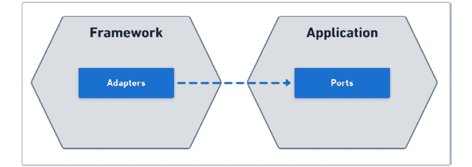
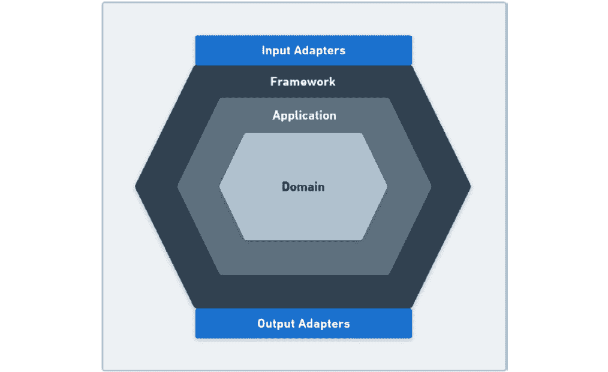
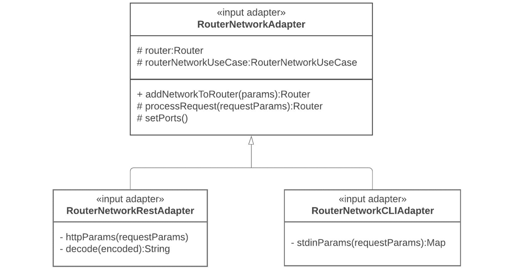
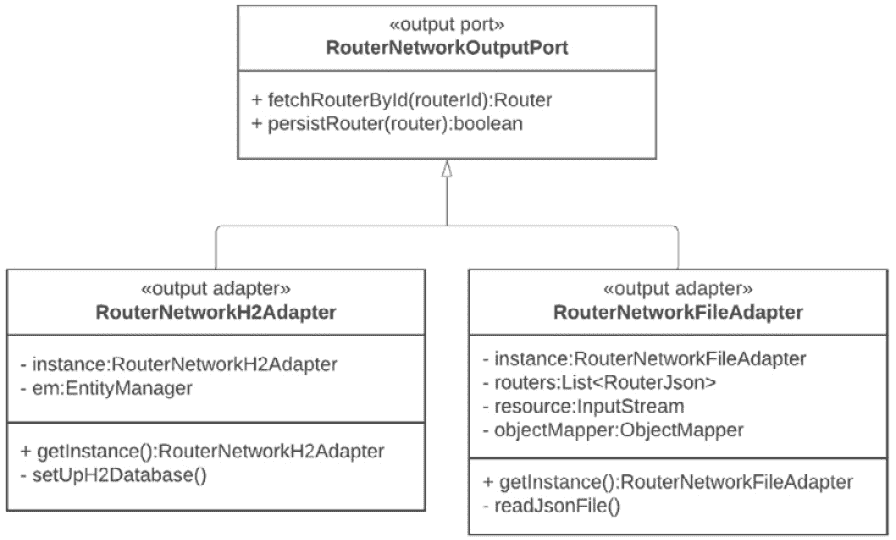
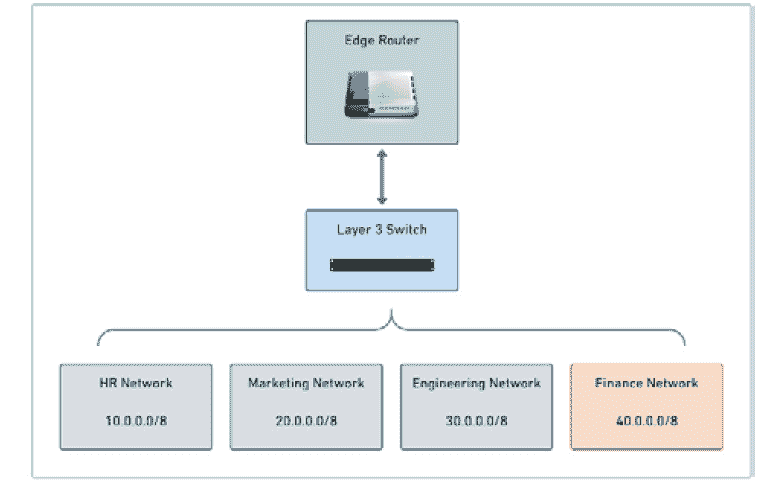

# 4

# 创建适配器以与外部世界交互

在软件开发过程中，存在一个时刻我们需要决定哪些技术将被系统所支持。在前面的章节中，我们讨论了技术选择不应该是开发六边形应用的主要驱动因素。实际上，基于这种架构的应用具有高度的可变性，使得系统可以尽可能少地摩擦与不同技术集成。这是因为**六边形架构**在代码的哪些部分与业务相关以及哪些部分与技术相关之间建立了一个清晰的边界。

在本章中，我们将探讨建立这种边界的六边形方法。我们将学习在需要设置技术或协议以使六边形应用能够与外部世界通信时，适配器所扮演的角色。

在本章中，我们将学习以下主题：

+   理解适配器

+   使用输入适配器以允许驱动操作

+   使用输出适配器与不同的数据源进行通信

到本章结束时，你将了解如何使用输入适配器，结合输入端口，将相同的软件功能暴露给不同的技术进行工作。同样，你将学习到输出适配器在使应用在与不同的数据源技术通信时更加灵活方面的强大作用。

# 技术需求

要编译和运行本章中展示的代码示例，你需要最新的`curl`和`jq`。所有这些工具都可在**Linux**、**Mac**和**Windows**操作系统上使用。

你可以在 GitHub 上找到本章的代码文件，链接为[`github.com/PacktPublishing/-Designing-Hexagonal-Architecture-with-Java---Second-Edition/tree/main/Chapter04`](https://github.com/PacktPublishing/-Designing-Hexagonal-Architecture-with-Java---Second-Edition/tree/main/Chapter04)。

# 理解适配器

在六边形架构中，适配器的作用与在面向对象语言中作为设计模式所使用的适配器不同。作为一个设计模式，我们使用适配器使两个不同类的接口兼容。在六边形架构中，我们使用适配器使系统能够与不同的技术或协议兼容。尽管适配器作为六边形架构概念或作为设计模式的作用可能不同，但可以正确地说，这两种方法具有相同的目的：使某物适应正确地嵌入到另一物中。

要理解适配器在六边形架构中扮演的角色，一个实用的类比是关于计算机的远程连接。每个现代操作系统都兼容远程连接协议。在过去（甚至在某些情况下，今天），使用**Telnet**打开到计算机的远程连接是常见的。随着时间的推移，出现了其他协议，如用于控制台连接的**SSH**、**RDP**以及用于图形替代的**虚拟网络计算**（**VNC**）。

这些协议仅定义了您如何访问操作系统，一旦您进入其中，您就可以执行命令并访问操作系统提供的功能。操作系统提供多个协议以允许远程连接并不罕见。这是好事，因为它扩大了通信的可能性。可能存在需要同时支持 Telnet 和 SSH 连接的情况，可能是因为有一个不寻常的客户，它只使用 Telnet。

通过使用前面的类比，我们可以将操作系统替换为使用**Java**（或任何其他编程语言）开发的程序，并将远程连接协议（如 SSH 和 Telnet）替换为基于 HTTP 的通信协议，如**REST**和**gRPC**。假设我们的 Java 应用程序是六边形的，这些应用程序提供的功能被组织为用例、端口和业务规则，这些规则来自**应用程序**和**领域**六边形。如果您想使这些功能对 REST 和 gRPC 客户端都可用，您需要创建 REST 和 gRPC 适配器。用于公开应用程序功能的适配器称为**输入适配器**。为了将这些输入适配器连接到我们系统的其余部分，我们将输入端口与输入适配器关联，如下图所示：



图 4.1 – 适配器与端口之间的关系

我们可以定义输入适配器，以便用户和其他系统与应用程序进行交互。同样，我们也可以定义输出适配器，以将六边形应用程序生成的数据转换为外部系统可理解的形式。在这里，我们可以看到输入和输出适配器都位于**框架**六边形的端点：



图 4.2 – 输入和输出适配器的位置

在下一节中，我们将探讨如何使用输入适配器。

# 使用输入适配器来允许驱动操作

你可能之前听说过，如果我们能始终依赖的东西，那就是事情总是会变化。当我们谈论技术变革时，这个说法就更加明显了。我们生活在一个计算机不再像过去那样昂贵的时代。无论我们是在处理台式机、移动设备还是云计算，每年，计算机资源总体上变得更加便宜，并且对每个人来说都更加容易获得。这种可访问性意味着更多的人倾向于参与，并且可以参与软件开发项目。

这种不断增长的协作导致了新的编程语言、工具和开发框架的产生，以支持用更好和更现代的解决方案来解决人们问题的创造性努力。在这个创新和技术异构的背景下，大量的当前软件开发工作得以进行。在这种背景下开发软件时出现的一个问题是，面对不断的技术变革，一个系统将如何保持相关性和盈利性。如果一个系统被设计成将业务规则与技术细节交织在一起，那么在不进行重大重构的情况下，很难融入新技术。在六边形架构中，输入适配器是帮助我们使软件与不同技术兼容的元素。

输入适配器就像在前一节中提到的示例中提到的远程通信协议。这种比较是有效的，因为输入适配器的工作方式就像协议一样，定义了哪些技术被支持，作为访问六边形系统提供的功能的一种手段。输入适配器在六边形内部和外部之间划定了明确的边界，并执行我们所说的驱动操作。

从六边形外部来看，可能有用户或其他系统与六边形应用程序进行交互。我们已经了解到，这些用户和系统也被称为主要演员，在塑造应用程序用例方面发挥着关键作用。主要演员与六边形应用程序之间的交互是通过输入适配器进行的。这种交互由驱动操作定义。我们称它们为驱动操作，因为在六边形系统中，主要演员驱动着，即它们启动并影响系统的状态和行为。

当输入适配器组合在一起时，就形成了六边形应用程序的 API。因为输入适配器处于这个边界，它将六边形系统暴露给外部世界，因此它们自然成为任何希望与系统交互的人的接口。随着我们在本书的进展，我们将看到如何利用输入适配器的布局来结构和暴露应用程序 API，使用诸如**Swagger**等工具。

我们强调了适配器的特性，以使系统与不同的技术或协议兼容。一种更**领域驱动设计（DDD**）的方法建议使用适配器的其他目的。

在基于 DDD 的架构中，一个普遍关注的问题是关于将遗留系统的元素集成到新系统中。这种情况发生在遗留系统（其中包含相关知识的领域模型）解决了某些重要问题但同时也显示出其设计的不一致性时。你不想放弃遗留系统，但也不想让新系统的设计受到遗留系统设计的影响。为了应对这种情况，你可以采用 Vaughn Vernon 的 *实现领域驱动设计* 和 Eric Evans 的 *领域驱动设计：软件核心的复杂性处理* 中所提到的 **反腐败层**。这个层基于用于将遗留系统和新系统的有界上下文集成的适配器。在这种情况下，适配器负责防止新系统的设计受到遗留系统设计的影响。

虽然我们不在六边形架构中应用这种适配器的使用方式，但重要的是要意识到我们可以使用这种基于 DDD 的适配器方法来构建六边形系统。

我们了解到主要演员与六边形应用程序之间的连接是通过输入适配器实现的。现在让我们看看如何使输入适配器连接到系统中的其他六边形。

## 创建输入适配器

**输入端口**是我们实现用例的手段，它指定了输入端口如何执行操作以实现用例目标。输入端口对象需要接收 Jacobson (1992) 所称的 *刺激* 来执行其操作。这种刺激不过是一个对象调用另一个对象。输入端口对象通过输入适配器发送的刺激接收执行其操作所需的所有必要数据。然而，正是在这个阶段，可能会发生最终的转换，将输入数据转换为与领域六边形兼容的格式。

在上一章中，我们创建了一个用例来向路由器添加网络。为了实现用例目标，我们将创建两个输入适配器：一个用于通过 HTTP REST 进行通信的适配器，另一个用于命令行执行。在下面的 UML 图中，我们有一个 **RouterNetworkAdapter** 作为抽象父类，由 **RouterNetworkRestAdapter** 和 **RouterNetworkCLIAdapter** 类扩展：



图 4.3 – 输入适配器的 UML 表示

我们将定义一个适配器抽象基类，随后是两个实现，一个用于适配器从 HTTP REST 连接接收数据，另一个用于控制台 `STDIN` 连接。为了模拟对这些两个适配器的访问，我们将创建一个客户端类来启动应用程序。

### 基础适配器

让我们先定义 `RouterNetworkAdapter` 抽象基类：

```java
public abstract class RouterNetworkAdapter {
    protected Router router;
    protected RouterNetworkUseCase;
    public Router addNetworkToRouter(
    Map<String, String> params){
        var routerId = RouterId.
               withId(params.get("routerId"));
        var network = new Network(IP.fromAddress(
               params.get("address")),
               params.get("name"),
               Integer.valueOf(params.get("cidr")));
        return routerNetworkUseCase.
               addNetworkToRouter(routerId, network);
    }
    public abstract Router processRequest(
                           Object requestParams);
}
```

这个基础适配器的想法是提供与适配器的对应输入端口通信的标准操作。在这种情况下，我们使用`addNetworkToRouter`适配器方法来接收构建`RouterID`和`Network`对象所需的参数，这些参数被用来启动用例操作，将网络添加到路由器。这些参数可能来自不同的来源，无论是通过 HTTP 请求还是通过 shell 控制台中的`STDIN`，但一旦到达`addNetworkToRouter`方法，它们都被以相同的方式处理。

我们不直接引用输入端口。相反，我们利用用例接口引用。这个用例引用由输入适配器的构造函数传递和初始化。

### REST 输入适配器

现在我们已经定义了基础的`RouterNetworkAdapter`抽象类，我们可以继续创建 REST 适配器。我们首先定义`RouterNetworkRestAdapter`构造函数：

```java
public RouterNetworkRestAdapter(RouterNetworkUseCase rout
  erNetworkUseCase){
    this.routerNetworkUseCase = routerNetworkUseCase;
}
```

我们使用`RouterNetworkRestAdapter`构造函数来接收和初始化`RouterNetworkUseCase`用例引用。

以下代码展示了客户端如何调用初始化这个`RouterNetworkRestAdapter`输入适配器：

```java
RouterNetworkOutputPort outputPort = RouterNet
  workH2Adapter.getInstance();
RouterNetworkUseCase usecase = new RouterNetworkInput
  Port(outputPort);
RouterManageNetworkAdapter inputAdapter = new RouterNet
  workRestAdapter(usecase);
```

此处的意图是表达 REST 输入适配器需要一个 H2 内存数据库输出适配器。在这里，我们明确指出输入适配器需要哪个输出适配器对象来执行其活动。这可以被认为是一种纯方法，其中我们不使用基于框架的依赖注入技术，如**CDI beans**。稍后，所有这些适配器构造函数都可以移除，以使用来自框架如**Quarkus**或**Spring**的依赖注入注解。

在定义了`RouterNetworkAdapter`构造函数之后，我们接着实现`processRequest`方法：

```java
/**
* When implementing a REST adapter, the processRequest
  method receives an Object type parameter
* that is always cast to an HttpServer type.
*/
@Override
public Router (Object requestParams){
/** code omitted **/
    httpserver.createContext("/network/add", (exchange -> {
      if ("GET".equals(exchange.getRequestMethod())) {
       var query = exchange.getRequestURI().getRawQuery();
       httpParams(query, params);
       router = this.addNetworkToRouter(params);
       ObjectMapper mapper = new ObjectMapper();
       var routerJson = mapper.writeValueAsString(
       RouterJsonFileMapper.toJson(router));
       exchange.getResponseHeaders().
       set("Content-Type","application/json");
       exchange.sendResponseHeaders(
       200,routerJson.getBytes().length);
       OutputStream output = exchange.getResponseBody();
       output.write(routerJson.getBytes());
       output.flush();
      } else {
        exchange.sendResponseHeaders(405, -1);
      }
/** code omitted **/
}
```

此方法接收一个`httpServer`对象，用于创建接收`/network/add`路径的`GET`请求的 HTTP 端点。调用`processRequest`的客户端代码类似于以下摘录：

```java
var httpserver = HttpServer.create(new InetSocket
  Address(8080), 0);
routerNetworkAdapter.processRequest(httpserver);
```

REST 适配器通过 HTTP 请求接收用户数据，解析请求参数，并使用它们来调用定义在`RouterNetworkAdapter`父类中的`addNetworkToRouter`：

```java
router = this.addNetworkToRouter(params);
```

记住，输入适配器负责将用户数据转换为触发输入端口所需的适当参数，这是通过使用其用例引用来完成的：

```java
routerNetworkUseCase.addNetworkToRouter(routerId, network);
```

在这个时候，数据离开框架六边形，并进入`STDIN`。

### CLI 输入适配器

要创建第二个输入适配器，我们再次扩展基础适配器类：

```java
public class RouterNetworkCLIAdapter extends RouterNetwork
  Adapter {
    public RouterNetworkCLIAdapter(
    RouterNetworkUseCase routerNetworkUseCase){
        this.routerNetworkUseCase = routerNetworkUseCase;
    }
/** code omitted **/
}
```

我们定义了`RouterNetworkCLIAdapter`构造函数，用于接收和初始化这个输入适配器所需的`RouterNetworkUseCase`用例。

对于 CLI 输入适配器，我们使用不同的输出适配器。而不是持久化内存数据库，这个输出适配器使用文件系统。

以下代码展示了客户端如何初始化`RouterNetworkCLIAdapter`输入适配器：

```java
RouterNetworkOutputPort outputPort = RouterNetworkFileA
  dapter.getInstance();
RouterNetworkUseCase usecase = new RouterNetworkInput
  Port(outputPort);
RouterManageNetworkAdapter inputAdapter = new RouterNet
  workCLIAdapter(routerNetworkUseCase);
```

首先，我们获取一个 `RouterNetworkOutputPort` 输出端口引用。然后，使用该引用，我们检索一个 `RouterNetworkUseCase` 用例。最后，我们使用之前定义的用例获取 `RouterNetworkAdapter`。

以下是我们为 CLI 适配器实现 `processRequest` 方法的步骤：

```java
@Override
public Router processRequest(Object requestParams){
    var params = stdinParams(requestParams);
    router = this.addNetworkToRouter(params);
    ObjectMapper mapper = new ObjectMapper();
    try {
        var routerJson = mapper.writeValueAsString
                     (RouterJsonFileMapper.toJson(router));
        System.out.println(routerJson);
    } catch (JsonProcessingException e) {
        e.printStackTrace();
    }
    return router;
}
```

在 REST 适配器中，我们有 `httpParams` 方法从 HTTP 请求中检索数据。现在，在 CLI 适配器的 `processRequest` 中，我们有 `stdinParams` 方法从控制台检索数据。

来自 REST 和 CLI 适配器的 `processRequest` 方法在处理输入数据方面存在差异，但它们有一个共同点。一旦它们将输入数据捕获到 `params` 变量中，它们都会调用从适配器基类继承的 `addNetworkToRouter` 方法：

```java
router = this.addNetworkToRouter(params);
```

从这一点开始，数据遵循与 REST 适配器场景中描述的相同流程，其中输入适配器通过用例接口引用调用输入端口。

现在我们已经完成了 REST 和 CLI 输入适配器的创建，让我们看看如何调用这些适配器。

### 调用输入适配器

这里是控制选择哪个适配器的客户端代码：

```java
public class App {
/** code omitted **/
    void setAdapter(String adapter) {
        switch (adapter){
            case "rest" -> {
                outputPort =
                RouterNetworkH2Adapter.getInstance();
                usecase =
                new RouterNetworkInputPort(outputPort);
                inputAdapter =
                new RouterNetworkRestAdapter(usecase);
                rest();
            }
            default -> {
                outputPort =
                RouterNetworkFileAdapter.getInstance();
                usecase =
                new RouterNetworkInputPort(outputPort);
                inputAdapter =
                new RouterNetworkCLIAdapter(usecase);
                cli();
            }
        }
    }
}
```

如果我们在执行程序时传递 `rest` 作为参数，`switch`-`case` 条件将创建一个 REST 适配器实例并调用 `rest` 方法：

```java
private void rest() {
    try {
        System.out.println("REST endpoint listening on
                           port 8080...");
        var httpserver = HttpServer.create(
        new netSocketAddress(8080), 0);
        routerNetworkAdapter.processRequest(httpserver);
    } catch (IOException e){
        e.printStackTrace();
    }
}
```

然后，`rest` 方法反过来调用 REST 输入适配器的 `processRequest` 方法。

否则，如果我们在执行程序时传递 `cli` 参数，`switch`-`case` 将默认创建一个 CLI 适配器并调用 `cli` 方法：

```java
private void cli() {
    Scanner = new Scanner(System.in);
    routerNetworkAdapter.processRequest(scanner);
}
```

`cli` 方法随后调用 CLI 输入适配器的 `processRequest` 方法。

调用输入适配器的步骤如下：

1.  在 `chapter4` 目录中的 GitHub 代码示例中，你可以通过运行以下命令来编译应用程序：

    ```java
    .jar file with the rest parameter:

    ```

    $ java -jar target/chapter04-1.0-SNAPSHOT-jar-with-dependencies.jar rest

    发送 GET 请求以创建和添加网络：

    ```java
    .jar file with no parameters:

    ```

    $ java -jar target/chapter04-1.0-SNAPSHOT-jar-with-dependencies.jar cli

    请告知路由器 ID：

    ca23800e-9b5a-11eb-a8b3-0242ac130003

    请告知 IP 地址：

    40.0.0.0

    请告知网络名称：

    金融

    请告知 CIDR：

    8

    ```java

    ```

    ```java

    ```

应用程序将要求你指定路由器 ID 和其他网络附加详细信息以调用 CLI 适配器。在这里，我们使用了与调用 REST 适配器相同的数据。

在本节中，我们学习了如何使用输入适配器来公开六边形应用程序功能。通过首先定义一个基本输入适配器，我们扩展了它以创建用于 HTTP 请求的 REST 适配器和用于控制台/`STDIN` 请求的 CLI 适配器。这种安排帮助我们理解输入适配器在探索以不同方式访问六边形系统中相同功能的基本作用。

输入适配器是我们进入所有六边形应用程序可以提供的功能的门户。通过输入适配器，我们可以轻松地使系统通过不同的技术变得可访问，而不会干扰业务逻辑。同样地，我们可以使六边形应用程序与不同的数据源进行通信。我们将在下一节中看到，这是通过输出适配器实现的。

# 使用输出适配器与不同的数据源进行通信

面向对象系统的特点在于其将数据和行为视为紧密相关的事物。这种紧密性恰好模仿了现实世界中的事物。无论是生物还是非生物，都具有属性，并能执行或成为某些动作的目标。对于刚开始学习面向对象编程的人来说，我们提供了例如汽车这样的例子，它有四个轮子并能驾驶——轮子是数据，驾驶是行为。这样的例子表达了这样一个基本原理：数据和行为不应被视为独立的事物，而应在我们所说的对象内部统一。

这种对象理念为过去几十年中庞大而复杂的系统的发展奠定了基础。这些系统中的很大一部分是在企业环境中运行的商业应用程序。面向对象范式征服了企业开发，因为其高级方法使得人们在创建软件以解决商业问题时更加高效和精确。过程范式对于企业的需求来说既繁琐又过于底层。

除了面向对象的语言之外，企业软件还依赖于获取和持久化数据的方法。很难想象一个没有与数据库、消息队列或文件服务器等数据源集成的系统，例如。存储东西的需求始终存在于计算中。然而，问题在于这种需求如何影响和决定了整个软件结构。随着**关系数据库管理系统（RDBMS**）的出现，也出现了通过**模式**正式化数据的要求。然后，这些模式作为建立数据关系以及应用程序如何处理这些关系的参考。过了一段时间，人们开始寻找替代方案以避免 RDBMSs 强加的正式化和严格的规范化原则。问题本身并不在于正式化，而在于在不必要的情况下使用 RDBMSs。

作为关系型数据库管理系统（RDBMS）的替代，出现了**NoSQL**数据库，提出了一种不依赖于表、列和模式作为数据组织手段的数据存储方式。NoSQL 方法提供了基于文档、键值存储、宽列存储和图的不同数据存储技术。不受 RDBMS 方法的限制，软件开发者开始使用这些 NoSQL 技术以更好地满足业务需求，并避免依赖于 RDBMS 的繁琐解决方案，因为当时没有替代品。

除了数据库之外，其他数据源也被用来满足软件处理数据的需求。文件系统、消息代理、基于目录的存储（**LDAP**）和主机存储，仅举几例，这些都是软件可以处理数据的方式。在云计算的世界里，将系统与不同的技术集成以发送或接收数据变得越来越自然。这种集成在软件开发中带来了一些挑战，因为系统现在需要理解并使自己在异构技术环境中易于理解。这种情况在如微服务这样的架构中变得更加严重，这些架构促进了这种异构性。为了应对这一挑战，我们需要克服技术异构环境挑战的技术。

在上一节中，我们看到了我们可以将多个输入适配器插入到同一个输入端口。这也适用于输出适配器和端口。接下来，我们将看到如何创建输出适配器并将它们插入到六边形系统的输出端口。

## 创建输出适配器

与输入适配器一起，输出适配器是构成框架六边形的第二个组件。在六边形架构中，输出适配器的角色是处理驱动操作。记住，驱动操作是由六边形应用程序本身发起的，以与外部系统交互发送或接收一些数据。这些驱动操作通过用例来描述，并由用例输入端口实现中的操作触发。每当用例声明需要处理存在于外部系统中的数据时，这意味着六边形应用程序至少需要一个输出适配器和端口来满足这些要求。

我们了解到，存在于应用程序六边形中的输出端口以抽象的方式表达与外部系统的交互。反过来，输出适配器有责任具体描述这些交互将如何发生。通过输出适配器，我们决定系统将使用哪些技术来实现数据持久性和其他类型的外部集成。

到目前为止，我们只讨论了基于我们在领域六边形中创建的领域模型表达的需求的数据。毕竟，是来自领域六边形的领域模型驱动了整个六边形系统的形状。技术问题只是必须遵守领域模型的细节，而不是相反。

通过在应用六边形中使用输出端口作为接口，以及在框架六边形中使用输出适配器作为该接口的实现，我们正在构建一个支持不同技术的六边形系统。在这个结构中，框架六边形中的输出适配器必须符合应用六边形中的输出端口接口，而应用六边形反过来必须依赖于来自领域六边形的领域模型。

在上一节中，你可能已经注意到了两种不同的输出适配器的使用 – `RouterNetworkH2Adapter` 适配器用于处理内存数据库中的数据，以及 `RouterNetworkFileAdapter` 适配器用于从本地文件系统中读取和持久化文件。这两个输出适配器是我们创建在应用六边形中的输出端口的实现：



图 4.4 – 输出适配器的 UML 表示

我们将首先实现 `RouterNetworkH2Adapter`。它使用 H2 内存数据库来设置所有必需的表和关系。这个适配器实现展示了如何将领域模型数据适配到关系型数据库中。然后，我们继续实现 `RouterNetworkFileAdapter`，它使用基于 **JSON** 文件的数据库结构。H2 和 JSON 文件实现都是基于我们一直在工作的拓扑和库存样本系统提供的数据。这两个适配器将允许以两种方式将附加网络连接到现有的交换机：



图 4.5 – 带有财务网络的拓扑和库存系统

使用上一节中相同的输入数据，我们将使用两种可用的输出适配器之一，将 **Finance Network** 连接到来自 **Edge Router** 的 **Layer 3 Switch**。

### H2 输出适配器

在实现 H2 输出适配器之前，我们首先需要定义拓扑和库存系统的数据库结构。为了确定这个结构，我们创建了一个包含以下 SQL 语句的 `resources/inventory.sql` 文件：

```java
CREATE TABLE routers(
    router_id UUID PRIMARY KEY NOT NULL,
    router_type VARCHAR(255)
);
CREATE TABLE switches (
    switch_id UUID PRIMARY KEY NOT NULL,
    router_id UUID,
    switch_type VARCHAR(255),
    switch_ip_protocol VARCHAR(255),
    switch_ip_address VARCHAR(255),
    PRIMARY KEY (switch_id),
    FOREIGN KEY (router_id) REFERENCES routers(router_id)
);
CREATE TABLE networks (
    network_id int NOT NULL PRIMARY KEY AUTO_INCREMENT,
    switch_id UUID,
    network_protocol VARCHAR(255),
    network_address VARCHAR(255),
    network_name VARCHAR(255),
    network_cidr VARCHAR(255),
    PRIMARY KEY (network_id),
    FOREIGN KEY (switch_id) REFERENCES switches(switch_id)
);
INSERT INTO routers(router_id, router_type) VALUES('ca23800e-9b5a-11eb-a8b3-0242ac130003', 'EDGE');
INSERT INTO switches(switch_id, router_id, switch_type, switch_ip_protocol, switch_ip_address)
VALUES('922dbcd5-d071-41bd-920b-00f83eb4bb46', 'ca23800e-9b5a-11eb-a8b3-0242ac130003', 'LAYER3', 'IPV4', '9.0.0.9');
INSERT INTO networks(switch_id, network_protocol, network_address, network_name, network_cidr)
VALUES('922dbcd5-d071-41bd-920b-00f83eb4bb46', 'IPV4', '10.0.0.0', 'HR', '8');
INSERT INTO networks(switch_id, network_protocol, network_address, network_name, network_cidr)
VALUES('922dbcd5-d071-41bd-920b-00f83eb4bb46', 'IPV4', '20.0.0.0', 'Marketing', '8');
INSERT INTO networks(switch_id, network_protocol, network_address, network_name, network_cidr)
VALUES('922dbcd5-d071-41bd-920b-00f83eb4bb46', 'IPV4', '30.0.0.0', 'Engineering', '8');
```

虽然 `switches` 和 `networks` 有主键，但我们把交换机视为实体，而 `networks` 视为领域模型中 `Router` 实体的组成部分。我们正在将我们的模型强加于技术安排，而不是相反。

我们在领域模型中不使用来自`switches`和`networks`表的这些主键作为参考。相反，我们使用`router_id`值来关联`Router`实体与其`Switch`和`Network`值对象及其相应的数据库表。这种关联使得可以形成一个聚合，其中`Router`是聚合根，而`Switch`和`Network`是用于组成聚合的对象。

现在，我们可以继续实现`RouterNetworkOutputPort`来创建`RouterNetworkH2Adapter`类：

```java
public class RouterNetworkH2Adapter implements RouterNet
  workOutputPort {
     private static RouterNetworkH2Adapter instance;
     @PersistenceContext
     private EntityManager em;
     private RouterNetworkH2Adapter(){
          setUpH2Database();
     }
     @Override
     public Router fetchRouterById(RouterId routerId) {
          var routerData = em.
              getReference(RouterData.class,
              routerId.getUUID());
          return RouterH2Mapper.toDomain(routerData);
     }
     @Override
     public boolean persistRouter(Router router) {
          var routerData = RouterH2Mapper.toH2(router);
          em.persist(routerData);
          return true;
     }
     private void setUpH2Database() {
          var entityManagerFactory = Persistence.
          createEntityManagerFactory("inventory");
          var em = entityManagerFactory.
          createEntityManager();
          this.em = em;
     }
/** code omitted **/
}
```

我们首先重写的方法是`fetchRouterById`，在这里我们接收`routerId`来使用我们的实体管理器引用从 H2 数据库中获取一个路由器。我们不能直接使用`Router`领域实体类映射到数据库。同样，我们也不能使用数据库实体作为领域实体。这就是为什么我们在`fetchRouterById`上使用`toDomain`方法来将 H2 数据库中的数据映射到领域。

我们执行相同的映射过程，使用`persistRouter`上的`toH2`方法将数据从领域模型实体转换为 H2 数据库实体。`setUpH2Database`方法在应用程序启动时初始化数据库。为了创建 H2 适配器的单个实例，我们使用`getInstance`方法定义一个单例：

```java
public static RouterNetworkH2Adapter getInstance() {
    if (instance == null) {
        instance = new RouterNetworkH2Adapter();
    }
    return instance;
}
```

`instance`字段用于提供一个 H2 输出适配器的单例对象。请注意，构造函数调用`setUpH2Database`方法使用`EntityManagerFactory`创建数据库连接。为了正确配置实体管理器，我们创建一个包含设置 H2 数据库属性的`resources/META-INF/persistence.xml`文件：

```java
<?xml version="1.0" encoding="UTF-8" ?>
<!-- code omitted -->
<property
     name="jakarta.persistence.jdbc.url"
          value="jdbc:h2:mem:inventory;
          MODE=MYSQL;
          DB_CLOSE_DELAY=-1;
          DB_CLOSE_ON_EXIT=FALSE;
          IGNORECASE=TRUE;
          INIT=CREATE SCHEMA IF NOT EXISTS inventory\;
          RUNSCRIPT FROM 'classpath:inventory.sql'" />
<!-- code omitted -->
```

记住，我们的领域模型是首要的，所以我们不想将系统与数据库技术耦合。这就是为什么我们需要创建一个直接映射到数据库类型的`RouterData` **ORM**类。在这里，我们使用**EclipseLink**，但你也可以使用任何**JPA 兼容**的实现：

```java
@Getter
@AllArgsConstructor
@NoArgsConstructor
@Entity
@Table(name = "routers")
@SecondaryTable(name = "switches")
@MappedSuperclass
@Converter(name="uuidConverter", converterClass=
  UUIDTypeConverter.class)
public class RouterData implements Serializable {
    @Id
    @Column(name="router_id",
            columnDefinition = "uuid",
            updatable = false )
    @Convert("uuidConverter")
    private UUID routerId;
    @Embedded
    @Enumerated(EnumType.STRING)
    @Column(name="router_type")
    private RouterTypeData routerType;
    @OneToOne(cascade = CascadeType.ALL)
    @JoinColumn(table = "switches",
            name = "router_id",
            referencedColumnName = "router_id")
    private SwitchData networkSwitch;
}
```

我们使用`@Getter`、`@NoArgsConstructor`和`@AllArgsConstructor`注解来减少类的冗长性。我们将在以后使用获取器和构造函数将数据类转换为领域模型类。

使用`@Table`和`@SecondaryTable`注解的目的是表示`routers`和`switches`表之间的关系。这种关系通过`@OntToOne`和`@JoinColumn`注解进行映射，指定两个表必须通过`router_id`属性相互链接。

要在 EclipseLink 中使用`UUID`作为 ID，我们需要创建以下转换类：

```java
public class UUIDTypeConverter implements Converter {
     @Override
     public UUID convertObjectValueToDataValue(Object
                    objectValue, Session session) {
          return (UUID) objectValue;
     }
     @Override
     public UUID convertDataValueToObjectValue(Object
                    dataValue, Session session) {
          return (UUID) dataValue;
     }
     @Override
     public boolean isMutable() {
          return true;
     }
     @Override
     public void initialize(
     DatabaseMapping mapping, Session session){
          DatabaseField field = mapping.getField();
          field.setSqlType(Types.OTHER);
          field.setTypeName("java.util.UUID");
          field.setColumnDefinition("UUID");
     }
}
```

这是我们在 `RouterData` 类顶部的 `@Converter` 注解中使用的类。如果没有这个转换器，将会抛出一个异常，指出在映射 `routerId` 属性时存在问题。在 `routerId` 声明之后，有一个名为 `routerType` 的 `RouterTypeData` 属性。对于每个 ORM 属性，我们都在类名后添加 `Data` 后缀。除了 `RouterData` 之外，我们还将 `RouterTypeData` 和 `SwitchData` 做同样处理。记住，在领域模型中，等效的类型是 `Router`、`RouterType` 和 `Switch`。

`RouterTypeData` 是我们存储路由类型的枚举：

```java
@Embeddable
public enum RouterTypeData {
     EDGE,
     CORE;
}
```

`@Embeddable` 注解允许使用 `@Embedded` 注解将枚举数据映射到数据库中的 `router_type` 字段：

```java
@Embedded
@Enumerated(EnumType.STRING)
@Column(name="router_type")
private RouterTypeData routerType;
```

作为最后一个 `RouterData` 字段，我们在 `networkSwitch` 变量中引用 `SwitchData`，我们使用它来创建路由和交换机之间的关系。让我们看看 `SwitchData` 类是如何实现的：

```java
@Getter
@AllArgsConstructor
@NoArgsConstructor
@Entity
@Table(name = "switches")
@SecondaryTable(name = "networks")
@MappedSuperclass
@Converter(name="uuidConverter", converterClass=
  UUIDTypeConverter.class)
public class SwitchData implements Serializable {
    @Id
    @Column(name="switch_id",
            columnDefinition = "uuid",
            updatable = false )
    @Convert("uuidConverter")
    private UUID switchId;
    @Column(name="router_id")
    @Convert("uuidConverter")
    private UUID routerId;
    @Enumerated(EnumType.STRING)
    @Embedded
    @Column(name = "switch_type")
    private SwitchTypeData switchType;
    @OneToMany
    @JoinColumn(table = "networks",
            name = "switch_id",
            referencedColumnName = "switch_id")
    private List<NetworkData> networks;
    @Embedded
    @AttributeOverrides({
            @AttributeOverride(
                    name = "address",
                    column = @Column(
                            name = "switch_ip_address")),
            @AttributeOverride(
                    name = "protocol",
                    column = @Column(
                            name = "switch_ip_protocol")),
    })
    private IPData ip;
}
```

我们将应用于 `RouterData` 的相同技术也应用于 `SwitchData`。不过，有一个细微的差别，那就是 `switches` 和 `networks` 表之间建立的关系。为了创建这种关系，我们使用 `@OneToMany` 和 `@JoinColumn` 注解，通过 `switch_id` 属性在 `SwitchData` 和 `NetworkData` 类型之间创建链接。由于 `@OneToMany` 注解，需要一个 `NetworkData` 对象列表的引用。

与 `RouterDataType` 类似，我们有 `SwitchDataType`，它是领域模型中 `SwitchType` 的枚举等效：

```java
@Embeddable
public enum SwitchTypeData {
     LAYER2,
     LAYER3;
}
```

在拓扑和库存系统中，我们直接将网络附加到交换机上。要将领域值对象映射到 H2 数据库实体，我们实现 `NetworkData` 类：

```java
@Getter
@AllArgsConstructor
@NoArgsConstructor
@Entity
@Table(name = "networks")
@MappedSuperclass
@Converter(name="uuidConverter", converterClass=
  UUIDTypeConverter.class)
public class NetworkData implements Serializable {
    @Id
    @Column(name="network_id")
    private int id;
    @Column(name="switch_id")
    @Convert("uuidConverter")
    private UUID switchId;
    @Embedded
    @AttributeOverrides({
            @AttributeOverride(
                    name = "address",
                    column = @Column(
                            name = "network_address")),
            @AttributeOverride(
                    name = "protocol",
                    column = @Column(
                            name = "network_protocol")),
    })
    IPData ip;
    @Column(name="network_name")
    String name;
    @Column(name="network_cidr")
    Integer cidr;
/** code omitted **/
}
```

在 `NetworkData` 中我们拥有的所有属性都与它的领域值对象对应物中存在的属性相同。唯一的区别是我们添加的注解，将其转换为数据库实体。

`SwitchData` 和 `NetworkData` 类都声明了 `IPData` 字段。在领域模型中，我们遇到类似的行为，其中 `Switch` 和 `Network` 类有一个 `IP` 属性。以下是实现 `IPData` 类的方法：

```java
@Embeddable
@Getter
public class IPData {
    private String address;
    @Enumerated(EnumType.STRING)
    @Embedded
    private ProtocolData protocol;
    private IPData(String address){
        if(address == null)
            throw new IllegalArgumentException("Null IP
                          address");
        this.address = address;
        if(address.length()<=15) {
            this.protocol = ProtocolData.IPV4;
        } else {
            this.protocol = ProtocolData.IPV6;
        }
    }
    public IPData() {}
    public static IPData fromAddress(String address){
        return new IPData(address);
    }
}
```

`ProtocolData` 遵循其他基于枚举的类型所使用的相同模式：

```java
@Embeddable
public enum ProtocolData {
     IPV4,
     IPV6;
}
```

我们可以争论说，创建所有这些类以将系统与数据库集成存在一些重复。这是真的。这是一个权衡，我们牺牲了可重用性以换取可变性，使应用程序能够更好地与 RDBMS 和其他数据源集成。

现在我们已经创建了所有 ORM 类以允许与 H2 数据库集成，我们需要将数据库对象转换为领域模型对象，反之亦然。我们通过创建一个具有映射方法的映射类来完成此操作。让我们从我们将数据库实体转换为领域实体的方法开始：

```java
public static Router toDomain(RouterData routerData){
/** code omitted **/
    return new Router(routerType, routerId, networkSwitch);
}
```

`toDomain` 方法接收一个表示数据库实体的 `RouterData` 类型，并返回一个 `Router` 领域实体。

将 `NetworkData` 数据库实体对象列表转换为 `Network` 领域值对象列表时，我们使用 `getNetworksFromData` 方法：

```java
private static List<Network> getNetworksFromData(List<Net
  workData> networkData){
    return networkData
            .stream()
            .map(network -> new Network(
                      IP.fromAddress(
                      network.getIp().getAddress()),
                      network.getName(),
                      network.getCidr()))
            .collect(Collectors.toList());
}
```

它接收一个 `NetworkData` 数据库实体对象列表并返回一个 `Network` 领域实体对象列表。然后，为了将领域模型实体转换为 H2 数据库实体，我们创建 `toH2` 映射方法：

```java
public static RouterData toH2(Router router){
/** code omitted **/
return new RouterData(routerId, routerTypeData,
  switchData);
}
```

`toH2` 方法接收一个 `Router` 领域实体对象作为参数，以进行适当的映射，然后返回一个 `RouterData` 对象。

最后，为了将 `Network` 领域值对象列表转换为 `NetworkData` 数据库实体对象列表，我们有 `getNetworksFromDomain` 方法：

```java
private static List<NetworkData> getNetworksFromDo
  main(List<Network> networks, UUID switchId){
    return  networks
             .stream()
             .map(network -> new NetworkData(
                    switchId,
                    IPData.fromAddress(
                    network.getAddress().getIPAddress()),
                    network.getName(),
                    network.getCidr()))
             .collect(Collectors.toList());
}
```

`getNetworksFromDomain` 方法接收一个 `Network` 领域值对象列表和一个 `UUID` 类型的开关 ID 作为参数。有了这些数据，该方法能够进行适当的映射，返回一个 `NetworkData` 数据库实体对象列表。

当我们需要将 H2 数据库对象转换为它的领域模型对应物时，使用 `toDomain` 静态方法：

```java
@Override
public Router fetchRouterById(RouterId routerId) {
     var routerData = em.getReference(
     RouterData.class, routerId.getUUID());
     return RouterH2Mapper.toDomain(routerData);
}
```

当将领域模型实体作为 H2 数据库实体持久化时，我们使用 `toH2` 静态方法：

```java
@Override
public boolean persistRouter(Router router) {
     var routerData = RouterH2Mapper.toH2(router);
     em.persist(routerData);
     return true;
}
```

`fetchRouterById` 和 `persistRouter` 方法是通过 `RouterNetworkInputPort` 对象调用的，使用 `RouterNetworkOutputPort` 接口引用：

```java
private Router fetchRouter(RouterId routerId) {
     return routerNetworkOutputPort.
     fetchRouterById(routerId);
}
/** code omitted **/
private boolean persistNetwork(Router router) {
     return routerNetworkOutputPort.
     persistRouter(router);
}
```

记住，`RouterNetworkOutputPort` 是根据我们传递给 `RouterNetworkInputPort` 构造函数的参数在运行时解析的。使用这种技术，我们使六边形系统对它需要去哪里获取数据一无所知。它可以是关系数据库或 `.json` 文件，我们将在下一节中看到。

### 文件适配器

要创建文件适配器，我们可以应用创建 H2 数据库适配器时使用的相同想法，只需对适应基于文件的数据库源进行一些小的调整。这个数据源是一个包含用于创建先前数据库的相同数据的 `.json` 文件。因此，首先，你可以在 `resources/inventory.json` 创建一个 `.json` 文件，其内容如下：

```java
[{
    "routerId": "ca23800e-9b5a-11eb-a8b3-0242ac130003",
    "routerType": "EDGE",
    "switch":{
      "switchId": "922dbcd5-d071-41bd-920b-00f83eb4bb46",
      "ip": {
        "protocol": "IPV4", "address": "9.0.0.9"
      },
      "switchType": "LAYER3",
      "networks":[
        {
          "ip": {
            "protocol": "IPV4", "address": "10.0.0.0"
          },
          "networkName": "HR", "networkCidr": "8"
        },
        {
          "ip": {
            "protocol": "IPV4", "address": "20.0.0.0"
          },
          "networkName": "Marketing", "networkCidr": "8"
        },
        {
          "ip": {
            "protocol": "IPV4", "address": "30.0.0.0"
          },
          "networkName": "Engineering", "networkCidr": "8"
        }
      ]
    }
}]
```

添加网络以满足我们的用例目标的目的保持不变，因此我们再次实现 `RouterNetworkOutputPort` 接口以创建 `RouterNetworkFileAdapter`：

```java
public class RouterNetworkFileAdapter implements RouterNet
  workOutputPort {
/** code omitted **/
    @Override
    public Router fetchRouterById(RouterId routerId) {
var router = new Router();
        for(RouterJson: routers){
              if(routerJson.getRouterId().
              equals(routerId.getUUID())){
                    router =  RouterJsonFileMapper.
                    toDomain(routerJson);
              break;
           }
        }
        return router;
    }
    @Override
    public boolean persistRouter(Router router) {
        var routerJson = RouterJsonFileMapper.
                         toJson(router);
        try {
            var localDir = Paths.get("").
                              toAbsolutePath().toString();
            var file = new File(localDir+
                        "/inventory.json");
            file.delete();
            objectMapper.writeValue(file, routerJson);
        } catch (IOException e) {
            e.printStackTrace();
        }
        return true;
    }
/** code omitted **/
}
```

`fetchRouterById` 方法通过使用 `RouterId` 参数解析 `.json` 文件来返回一个 `Router` 对象。`persistRouter` 方法将 `inventory.json` 文件中的更改持久化。

我们不使用实体管理器和 EclipseLink，而是使用 `Jackson` 库来序列化和反序列化 JSON 数据。为了将 `inventory.json` 文件加载到内存中，我们使用适配器构造函数调用 `readJsonFile` 方法将 `inventory.json` 文件加载到一个 `RouterJson` 对象列表中：

```java
private void readJsonFile(){
    try {
        this.routers = objectMapper.readValue(
             resource,
             new TypeReference<List<RouterJson>>(){});
        } catch (Exception e) {
           e.printStackTrace();
        }
}
private RouterNetworkFileAdapter() {
    this.objectMapper = new ObjectMapper();
    this.resource = getClass().getClassLoader().
    getResourceAsStream("inventory.json");
    readJsonFile();
}
```

在 H2 的情况下，与 JSON 一样，我们还需要创建特殊类来在 JSON 对象和领域模型对象之间进行映射。这些类的结构类似于 H2 ORM 类，主要区别在于用于创建适当映射的注解。让我们看看如何实现 `RouterJson` 类：

```java
/** Code omitted **/
@JsonInclude(value = JsonInclude.Include.NON_NULL)
public class RouterJson {
     @JsonProperty("routerId")
     private UUID routerId;
     @JsonProperty("routerType")
     private RouterTypeJson routerType;
     @JsonProperty("switch")
     private SwitchJson networkSwitch;
}
```

我们使用 `@JsonInclude` 和 `@JsonProperty` 注解将类属性映射到 JSON 字段。这些 JSON 映射比 H2 映射更直接，因为我们不需要处理数据库关系。`RouterTypeJson`、`SwitchJson` 以及所有其他 JSON 映射类都类似，它们使用相同的注解来转换 JSON 和领域模型对象。

要将 `RouterJson` 转换为 `Router`，我们使用 `RouterJsonFileMapper` 映射器类中的 `toDomain` 方法：

```java
RouterJsonFileMapper.toDomain(routerJson);
```

我们使用 `toJson` 方法将 `Router` 转换为 `RouterJson`：

```java
RouterJsonFileMapper.toJson(router);
```

`RouterJsonFileMapper` 与其 H2 对应物类似，但更简单，因为我们不需要处理 **一对多** 或 **一对一** 的关系。让我们从将 JSON 对象转换为领域对象的方法开始：

```java
public static Router toDomain(RouterJson routerJson){
    /** code omitted **/
    return new Router(routerType, routerId, networkSwitch);
}
```

这里 `toDomain` 方法接收一个 `RouterJson` 对象作为参数，执行适当的映射，然后返回一个 `Router` 对象。当我们需要将一系列 `NetworkJson` JSON 对象转换为一系列 `Network` 领域对象时，发生类似的流程：

```java
private static List<Network> getNetworksFromJson(List<Net
  workJson> networkJson){
    return networkJson
            .stream()
            .map(json ->  new Network(
                    IP.fromAddress(
                    json.getIp().getAddress()),
                    json.getNetworkName(),
                    Integer.valueOf(json.getCidr())))
            .collect(Collectors.toList());
}
```

`getNetworksFromJson` 方法接收一系列 `NetworkJson` 对象作为参数，并返回一个适当映射的 `Network` 对象列表。

让我们看看将领域对象转换为 JSON 对象所使用的方法：

```java
public static RouterJson toJson(Router router){
    /** code omitted **/
    return new RouterJson(
               routerId,
               routerTypeJson,
               switchJson);
}
```

`toJson` 方法与 `toDomain` 方法相反。这里 `toJson` 方法接收一个 `Router` 领域对象作为参数，执行适当的映射，并返回一个 `RouterJson` 对象。

最后，我们有一个需要将一系列 `Network` 领域对象转换为一系列 `NetworkJson` JSON 对象的情况：

```java
private static List<NetworkJson>  getNetworksFromDo
  main(List<Network> networks){
     return networks
             .stream()
             .map(network -> new NetworkJson(
                    IPJson.fromAddress(
                    network.getAddress().getIPAddress()),
                    network.getName(),
                    String.valueOf(network.getCidr())))
              .collect(Collectors.toList());
}
```

`getNetworksFromDomain` 方法通过接收一系列 `Network` 对象作为参数，可以继续映射所需的属性，并返回一系列 `NetworkJson` 对象。

现在我们已经完成了文件输出适配器的实现，让我们尝试调用文件和 H2 输出适配器。

### 调用输出适配器

在调用适配器之前，让我们编译应用程序。导航到 `Chapter04` 目录并运行以下命令：

```java
mvn clean package
```

要调用 H2 输出适配器，我们需要使用 REST 输入适配器。我们可以在执行 `.jar` 文件时提供 `rest` 参数：

```java
$ java -jar target/chapter04-1.0-SNAPSHOT-jar-with-dependencies.jar rest
$ curl -vv "http://localhost:8080/network/add?routerId=ca23800e-9b5a-11eb-a8b3-0242ac130003&address=40.0.0.0&name=Finance&cidr=8" | jq
```

文件输出适配器可以通过 CLI 输入适配器访问：

```java
$ java -jar target/chapter04-1.0-SNAPSHOT-jar-with-dependencies.jar
Please inform the Router ID:
ca23800e-9b5a-11eb-a8b3-0242ac130003
Please inform the IP address:
40.0.0.0
Please inform the Network Name:
Finance
Please inform the CIDR:
8
```

调用 H2 和文件输出适配器的结果将是相同的：

```java
{
  "routerId": "ca23800e-9b5a-11eb-a8b3-0242ac130003",
  "routerType": "EDGE",
  "switch": {
    "switchId": "922dbcd5-d071-41bd-920b-00f83eb4bb46",
    "ip": {
      "address": "9.0.0.9", "protocol": "IPV4"
    },
    "switchType": "LAYER3",
    "networks": [
      {
        "ip": {
          "address": "10.0.0.0", "protocol": "IPV4"
        },
        "networkName": "HR",
        "networkCidr": "8"
      },
      {
        "ip": {
          "address": "20.0.0.0", "protocol": "IPV4"
        },
        "networkName": "Marketing",
        "networkCidr": "8"
      },
      {
        "ip": {
          "address": "30.0.0.0", "protocol": "IPV4"
        },
        "networkName": "Engineering",
        "networkCidr": "8"
      },
      {
        "ip": {
          "address": "40.0.0.0", "protocol": "IPV4"
        },
        "networkName": "Finance",
        "networkCidr": "8"
      }
    ]
  }
}
```

注意输出末尾的 `Finance` 网络块，这确认了数据已被正确持久化。

通过创建这两个输出适配器，我们使六边形应用程序能够与不同的数据源进行通信。最好的部分是，我们不需要在领域或应用程序六边形中做任何更改。

创建输出适配器的唯一要求是从应用程序六边形实现一个输出端口接口。这些输出适配器示例展示了六边形方法如何保护业务逻辑不受技术问题的干扰。当然，当我们决定走这条路时，会有一定的权衡。然而，如果我们旨在创建以领域模型为中心的容变系统，六边形架构提供了实现这一目标的必要技术。

# 摘要

在本章中，我们了解到适配器用于定义六边形应用程序支持的技术。我们创建了两个输入适配器以允许驱动操作，即一个 REST 适配器用于接收来自 HTTP 连接的数据，一个 CLI 适配器用于接收来自`STDIN`的数据。这两个输入适配器连接到相同的输入端口，允许六边形系统使用相同的逻辑来处理以不同格式传入的请求。

然后，我们创建了一个 H2 数据库输出适配器和 JSON 文件输出适配器，以便六边形应用程序能够与不同的数据源进行通信。这两个输出适配器连接到相同的输出端口，使得六边形系统能够从外部源持久化和获取数据，这样数据源技术就不会影响业务逻辑。

通过了解输入和输出适配器的目的，并理解如何实现它们，我们现在可以创建能够容忍重大技术变化而无需大量重构的系统。这种好处是通过所有系统组件，包括适配器，都是围绕领域模型开发的来实现的。

为了全面理解适配器与其他六边形架构元素之间的动态关系，我们将在下一章探讨驱动和被驱动操作的生命周期。

# 问题

1.  我们应该在什么时候创建输入适配器？

1.  将多个输入适配器连接到同一输入端口的好处是什么？

1.  我们必须实现哪个接口来创建输出适配器？

1.  输入和输出适配器属于哪个六边形？

# 答案

1.  当我们需要将软件功能暴露给驱动操作者访问时，我们会创建输入适配器。这些操作者可以使用不同的技术或协议，如 HTTP REST 或通过命令行，来访问六边形应用程序。

1.  主要好处是，包含在输入端口中的相同逻辑可以用来处理来自不同输入适配器的数据。

1.  输出适配器必须始终实现输出端口。通过这样做，我们可以确保适配器符合领域模型所表达的要求。

1.  它们都来自框架六边形。

# 进一步阅读

+   《动手实践清洁架构：使用 Java 代码示例创建清洁 Web 应用程序的实用指南》，Tom Hombergs，Packt Publishing Ltd.，2019

+   《面向对象软件工程：一种用例驱动的方法》，Ivar Jacobson，Pearson Education，1992

+   *领域驱动设计：软件核心的复杂性处理*，埃里克·埃文斯，Pearson Education，2003

+   *实现领域驱动设计*，沃恩·弗农，Pearson Education，2013

+   *六边形架构* ([`alistair.cockburn.us/hexagonal-architecture/`](https://alistair.cockburn.us/hexagonal-architecture/))，阿利斯泰尔·科克本
