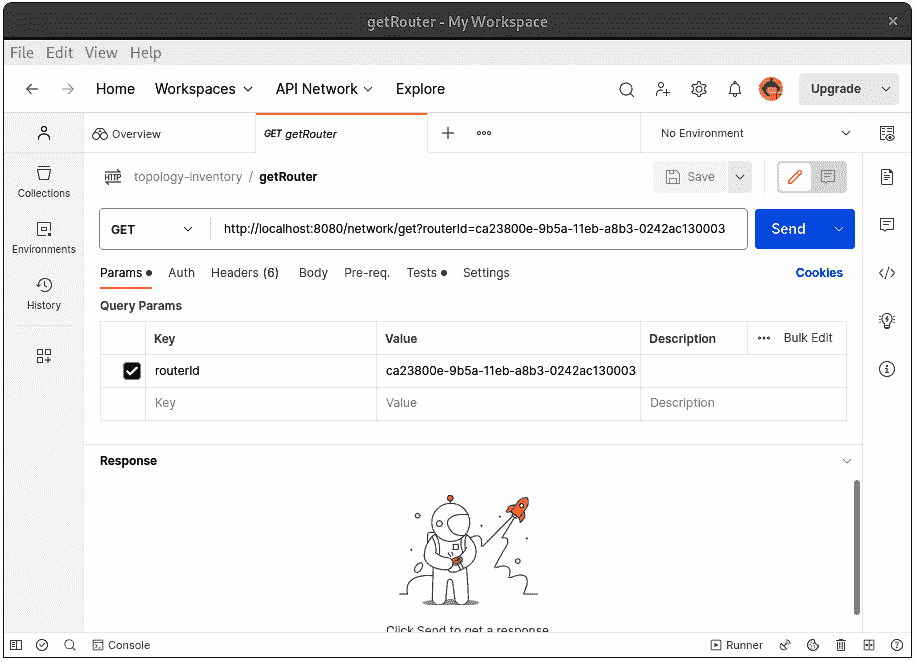

# 5

# 探索驾驶和被驱动操作的本质

在前面的章节中，我们分析了构成每个六边形的**六边形架构**的元素。我们学习了实体、值对象和业务规则，以及如何将它们安排在领域六边形中，以创建一个有意义的领域模型。之后，当处理应用六边形时，我们学习了如何利用用例和端口在领域模型之上创建完整的软件功能。最后，我们学习了如何创建适配器，以将六边形应用功能与不同技术集成。

为了更好地理解六边形系统，我们还需要了解其周围环境。这就是为什么在本章中，我们探讨了驱动和被驱动操作的本质，因为它们代表了与六边形应用交互的外部元素。在驱动方面，我们将看到前端应用如何作为主要演员，驱动六边形系统的行为。在被驱动方面，我们将学习使基于消息的系统能够被六边形系统驱动所必需的条件。

在本章中，我们将涵盖以下主题：

+   通过驱动操作达到六边形应用

+   将 Web 应用与六边形系统集成

+   运行测试代理并从其他应用程序调用六边形系统

+   使用驱动操作处理外部资源

到本章结束时，您将了解最常见的驱动和被驱动操作。一旦您理解了这些操作以及它们如何影响六边形系统的内部结构，您就将学会六边形架构的所有构建块，这将使您能够在利用迄今为止所展示的所有技术的同时开发完整的六边形应用。

# 技术要求

要编译和运行本章中展示的代码示例，您需要在您的计算机上安装**Java SE 开发工具包**（**JDK**）（版本 17 或更高）和**Maven 3.8**。它们都适用于**Linux**、**Mac**和**Windows**操作系统。您还需要下载以下工具：**Postman**、**Newman**（来自**npm**）和**Kafka**。我们建议使用 Linux 来正确运行 Kafka。如果您使用的是 Windows 系统，您可以使用**Windows 子系统（WSL**）来运行 Kafka。

您可以从[`kafka.apache.org/downloads.html`](https://kafka.apache.org/downloads.html)下载 Kafka 的最新版本。

您可以从[`www.postman.com/downloads`](https://www.postman.com/downloads)下载 Postman 的最新版本。

您可以从[`www.npmjs.com/package/newman`](https://www.npmjs.com/package/newman)下载 Newman 的最新版本。

您可以在 GitHub 上找到本章的代码文件：

[`github.com/PacktPublishing/-Designing-Hexagonal-Architecture-with-Java---Second-Edition/tree/main/Chapter05`](https://github.com/PacktPublishing/-Designing-Hexagonal-Architecture-with-Java---Second-Edition/tree/main/Chapter05)

# 使用驾驶操作到达六边形应用程序

我们可能认为一个系统可以自给自足，即没有人与之交互，并且这个系统不与其他用户或系统交互，这是不可想象的。这种安排违反了计算机架构的基本原则（冯·诺伊曼，1940 年），它假定任何计算机系统都存在输入和输出操作。事实上，很难想象一个有用的软件程序不会接收任何数据或产生任何结果。

通过六边形架构的视角，系统的输入侧由驾驶操作控制。我们称它们为*驾驶操作*，因为它们实际上启动并驱动六边形应用程序的行为。

在*第三章* *使用端口和用例处理行为*中，我们将驾驶操作与主要演员联系起来。这些演员负责在六边形系统中触发驾驶操作。驾驶操作可以采取不同的方面：它们可以是直接通过命令行控制台与系统交互的用户，是一个请求数据以在浏览器中展示的**用户界面**（**UI**）应用程序，是一个想要验证特定测试用例的测试代理，或者任何对六边形应用程序公开的功能感兴趣的任何系统。

所有这些不同的方面都被归类在**驾驶侧**，如下面的图所示：


图 5.1 – 驾驶侧和六边形应用程序

在上一章中，我们看到了如何使用**命令行界面**（**CLI**）和通过**HTTP REST**与六边形应用程序交互。现在，我们将探讨如何集成其他类型的驾驶操作，以与我们迄今为止一直在开发的拓扑和库存系统进行通信。

一旦我们建立了这些集成，我们将分析请求需要经过的路径，以便穿越所有六边形直到到达领域。这项练习将帮助我们理解每个六边形及其组件在处理驾驶操作请求中所扮演的角色。因此，让我们首先将一个网络 UI 与六边形系统集成起来。

# 将 Web 应用程序与六边形系统集成

现在，随着**HTML** **5**、现代**JavaScript**和不断改进的 Web 开发技术的出现，可以直接从 Web 浏览器运行高度复杂的系统。更快的互联网连接、更多的计算资源以及更好和更稳定的 Web 标准都为 Web 应用程序的改进做出了贡献。例如，旧的杂乱无章的**Flash**或**Java 小程序**系统已经被基于**Angular**、**React**或**Vue**等花哨框架的前端应用程序所取代。

不仅技术已经发展和变化，围绕 Web 开发的实践也发生了演变。受到`.ear`或`.war`包文件的鼓励，业务逻辑泄漏到表示代码中并不罕见。

**Java EE**（现在称为**Jakarta EE**）和其他框架，如**Struts**，利用了**Servlets**、**JSP**和**JSF**等技术，以实现表示层和业务代码之间的完全集成。过了一段时间，人们开始意识到，将前端和后端代码放得太近可能会成为他们软件项目的熵源。

作为对这些做法的回应，行业转向了解耦架构，其中前端系统是一个独立的、独立的应用程序，通过网络与一个或多个后端系统交互。

因此，我们将创建一个简单、独立的客户端应用程序，该应用程序从我们的拓扑和库存系统中获取数据。我们的应用程序将仅基于 HTML 5、CSS 和*vanilla* JavaScript。该应用程序旨在允许用户将网络添加到路由器，并从系统数据库中检索现有路由器。我们还将重构部分六边形应用程序，以实现与前端应用程序更好的集成。结果将是一个集成了六边形系统的网络浏览器应用程序，如下面的截图所示：


图 5.2 – 前端拓扑与库存应用程序

前端应用程序将允许用户将网络添加到现有路由器，并查看路由器和其网络的图形表示。

让我们从向`RouterNetworkUseCase`接口添加`getRouter`方法开始，增强六边形应用程序。

```java
public interface RouterNetworkUseCase {
    Router addNetworkToRouter(RouterId,
    Network network);
    Router getRouter(RouterId routerId);
}
```

`getRouter`方法签名很简单。它接收`RouterId`并返回一个`Router`对象。我们需要这种行为，以便前端应用程序能够显示一个路由器。

接下来，我们需要为`getRouter`方法提供一个实现。我们通过使用`RouterNetworkInputPort`类实现`RouterNetworkUseCase`接口来完成这一点：

```java
public class RouterNetworkInputPort implements RouterNet
  workUseCase {
/** code omitted **/
    @Override
    public Router getRouter(RouterId routerId) {
        return fetchRouter(routerId);
    }
    private Router fetchRouter(RouterId routerId) {
        return routerNetworkOutputPort.
               fetchRouterById(routerId);
    }
/** code omitted **/
}
```

注意到`fetchRouter`已经在输入端口实现中存在，但我们没有暴露的操作来检索路由器。然后`fetchRouter`方法不仅被`addNetworkToRouter`方法使用，现在也被`getRouter`使用。

有必要将输入端口的变化传播到输入适配器。我们通过在`RouterNetworkAdapter`抽象类中定义的基输入适配器上创建一个`getRouter`方法来完成这一点：

```java
public Router getRouter(Map<String, String> params) {
    var routerId = RouterId.
    withId(params.get("routerId"));
    return routerNetworkUseCase.getRouter(routerId);
}
```

记住`RouterNetworkAdapter`是`RouterNetworkCLIAdapter`和`RouterNetworkRestAdapter`两个适配器的基输入适配器。

为了允许前端应用程序与六边形系统通信，我们将使用 REST 适配器。因此，我们需要在`RouterNetworkRestAdapter`中进行一些更改，以允许这种通信：

```java
@Override
public Router processRequest(Object requestParams){
/** code omitted **/
    if (exchange.
      getRequestURI().getPath().equals("/network/add")) {
        try {
            router = this.addNetworkToRouter(params);
        } catch (Exception e) {
            exchange.sendResponseHeaders(
            400, e.getMessage().getBytes().length);
            OutputStream output = exchange.
            getResponseBody();
            output.write(e.getMessage().getBytes());
            output.flush();
        }
    }
    if (exchange.
      getRequestURI().getPath().contains("/network/get")) {
        router = this.getRouter(params);
    }
/** code omitted **/
}
```

对 `processRequest` 方法的更改是为了使其能够正确处理来自 `/network/add` 和 `/network/get` 路径的请求。

现在，我们可以转向拓扑和库存系统前端部分的开发。我们的重点将是 HTML 和 JavaScript 元素。我们将创建两个页面：第一个页面允许用户添加网络，第二个页面将允许用户获取路由器和其网络的图形视图。

## 创建添加网络页面

让我们从创建第一个 HTML 页面开始，如下面的截图所示：


图 5.3 – 前端应用拓扑和库存的添加网络页面

**添加网络** 页面包含一个表单，用户被要求输入添加现有路由器所需的数据。以下是表单的代码：

```java
<html>
  <head>
    <title>Topology & Inventory | Add Network</title>
    /** code omitted **/
  </head>
  <body>
      /** code omitted **/
      <form name="addNetwork" onsubmit="return
       false;">
      /** code omitted **/
      </form>
    <script src="img/networkTools.js"></script>
  </body>
</html>
```

为了处理 `networkTools.js` 文件中存在的 `addNetworkToRouter`，需要进行以下操作：

```java
function addNetworkToRouter() {
    const routerId = document.
    getElementById("routerId").value;
    const address = document.
    getElementById("address").value;
    const name = document.getElementById("name").value;
    const cidr = document.getElementById("cidr").value;
    const xhttp = new XMLHttpRequest();
    xhttp.open("GET",
    "http://localhost:8080/network/add?
        routerId=" + routerId + "&" +
        "address=" + address + "&" +
        "name=" + name + "&" +
        "cidr=" + cidr, true);
    xhttp.onload = function(
        if (xhttp.status === 200) {
            document.
            getElementById("message").
            innerHTML = "Network added with success!"
        } else {
            document.
            getElementById("message").
            innerHTML = "An error occurred while
            trying to add the network."
        }
    };
    xhttp.send();
}
```

我们使用 `XMLHttpRequest` 对象在六边形应用中 REST 适配器公开的 `/network/add` 端点中处理 `GET` 请求。这是一段简短的 JavaScript 代码，它捕获在 HTML 表单中输入的值，处理它们，然后如果一切顺利则显示成功消息，如果不顺利则显示错误消息，就像我们在这里看到的那样：


图 5.4 – 在拓扑和库存应用中添加新的网络

现在，让我们继续创建 **获取** **路由器** 页面。

## 创建获取路由器页面

**获取路由器** 页面包含一个 HTML 表单来处理用户请求，但它还基于从六边形应用获得的 JSON 响应提供图形视图。让我们首先考虑 HTML 表单：


图 5.5 – 前端应用拓扑和库存的获取路由器页面

**获取路由器** HTML 页面与我们之前在 **添加网络** 页面上使用的结构相同，但这个表单只使用一个参数从六边形应用中查询路由器。

为了创建基于 JSON 的路由器和其网络的图形视图，我们将使用一个名为 `D3` 的 JavaScript 库，该库消费 JSON 数据并生成图形视图。JavaScript 代码处理表单，然后使用 `D3` 库和 JSON 响应：

```java
function getRouter() {
    const routerId = document.
    getElementById("routerId").value;
    var xhttp = new XMLHttpRequest();
    xhttp.onreadystatechange = function() {
        console.log(this.responseText);
        if (this.readyState == 4 && this.status == 200) {
            const json = JSON.parse(this.responseText)
            createTree(json)
        }
    };
    xhttp.open(
    "GET",
    "http://localhost:8080/network/get?routerId="+routerId,
    true);
    xhttp.send();
}
function createTree(json) {
    const container = document.getElementById("container");
    const vt = new VTree(container);
    const reader = new Vtree.reader.Object();
    var data = reader.read(json);
    vt.data(data).update();
}
```

在这里，我们正在传递之前在六边形应用中定义的 `/network/get` 端点。`getRouter` 函数处理 `GET` 请求，并使用 JSON 响应作为 `createTree` 函数的参数，该函数将构建网络的图形视图。

如果我们填写表单中的路由器 ID，`ca23800e-9b5a-11eb-a8b3-0242ac130003`，以检索路由器，我们得到的结果如下所示：


图 5.6 – Get Router 页面提供的网络图形视图

记住，前面截图中的数据最终来源于我们直接附加到前端应用程序在此处使用的 REST 输入适配器的 H2 内存数据库。

现在，让我们看看测试代理如何与总线和库存系统集成。

## 运行测试代理

除了前端应用程序外，另一种常见的驱动操作来自测试和监控代理与六边形系统交互，以验证其功能是否运行良好。使用 Postman 等工具，我们可以创建全面的测试用例来验证应用程序在面临特定请求时的行为。

此外，我们可以定期向某些应用程序端点发出请求以检查它们是否健康。这种做法已经通过**Spring Actuator**等工具普及，这些工具在应用程序中提供了一个特定的端点，允许您检查其是否健康。还有一些技术涉及使用探针机制定期向应用程序发送请求以查看其是否存活。例如，如果应用程序不活跃或导致超时，则可以自动重启。在基于**Kubernetes**的云原生架构中，使用探针机制的系统很常见。

本节将探讨如何运行一个简单的测试用例以确认应用程序是否按我们的预期行为。我们不需要更改迄今为止一直在开发的总线和库存系统。在这里，我们将使用一个名为 Postman 的工具创建测试用例。在 Postman 中，测试用例被称为**测试集合**。一旦创建了这些测试集合，我们就可以使用**Newman**执行它们，Newman 是一个专门用于运行 Postman 集合的命令行工具。

要开始，您必须遵循以下步骤：

1.  下载 Postman 和 Newman。下载链接可在*技术要求*部分找到。本章使用的集合也存在于该章节的 GitHub 仓库中([`github.com/PacktPublishing/-Designing-Hexagonal-Architecture-with-Java---Second-Edition/blob/main/Chapter05/topology-inventory.postman_collection.json`](https://github.com/PacktPublishing/-Designing-Hexagonal-Architecture-with-Java---Second-Edition/blob/main/Chapter05/topology-inventory.postman_collection.json))。

1.  将集合导入 Postman。

1.  导入后，集合将显示两个请求。一个请求是针对`getRouter`端点，另一个是针对`addNetwork`。以下截图显示了将集合导入 Postman 后两个请求的显示方式：



图 5.7 – Postman 中的拓扑和库存集合

1.  在 Postman 上运行测试之前，请确保通过从项目的`root`目录运行以下命令来启动拓扑和库存应用程序：

    ```java
    getRouter request is to confirm whether the application returns an HTTP 200 response code when we try to retrieve a router by passing a router ID.
    ```

1.  然后，我们想要验证返回的值是否是我们所期望的。在这种情况下，我们期望在系统中只遇到三个网络：`HR`、`Marketing`和`Engineering`。在 Postman 中，我们为每个请求创建测试。因此，我们将为导入的集合中现有的两个请求创建测试。让我们先为`getRouter`请求创建一个测试：

    ```java
    pm.test("Status code is 200", () => {
      pm.expect(pm.response.code).to.eql(200);
    });
    pm.test("The response has all properties", () => {
      const responseJson = pm.response.json();
      pm.expect(
          responseJson.switch.networks).
          to.have.lengthOf(3);
      pm.expect(
          responseJson.switch.networks[0].networkName).
          to.eql('HR');
      pm.expect(
          responseJson.switch.networks[1].networkName).
          to.eql('Marketing');
      pm.expect(
          responseJson.switch.networks[2].networkName).
          to.eql('Engineering');
    });
    ```

    在前面的代码中，我们首先检查 HTTP 响应代码是否为`200`。然后，我们继续解析和预览 JSON 响应数据，以查看它是否与我们所期望的匹配。在这个测试中，我们期望一个包含由三个网络组成的交换机的路由器的响应。

1.  来自`addNetwork`请求的测试与`getRouter`请求的测试类似。然而，这次预期的响应中包含额外的`Finance`网络，正如我们在以下测试代码中所看到的：

    ```java
    pm.test("Status code is 200", () => {
      pm.expect(pm.response.code).to.eql(200);
    });
    pm.test("The response has all properties", () => {
      const responseJson = pm.response.json();
      pm.expect(
          responseJson.switch.networks).
          to.have.lengthOf(4);
      pm.expect(
          responseJson.switch.networks[3].networkName).
          to.eql('Finance');
    });
    ```

    该集合中的`addNetwork`请求添加了一个名为`Finance`的网络。这就是为什么我们只检查是否正确添加了`Finance`网络。此外，我们期望在添加`Finance`网络后，网络的列表长度为`4`。

1.  如果你想在 Postman 外部运行这些测试，你可以通过首先将集合导出为`.json`文件，然后使用 Newman 从该集合执行测试来实现：

    ```java
    newman run topology-inventory.postman_collection.json
    ```

    结果类似于以下截图所示：


图 5.8 – 使用 Newman 运行拓扑和库存应用程序测试

使用 Newman 进行此类测试执行非常适合将六边形应用程序集成到**持续集成**（**CI**）管道中。开发者使用 Postman 创建集合及其相应的测试，然后通过 CI 工具（如**Jenkins**）触发和验证这些相同的集合，这些工具可以使用 Newman 执行测试。

既然我们已经熟悉了前端应用程序和测试代理作为驱动操作的手段，让我们再看看另一种驱动操作类型。接下来，我们将讨论在分布式或微服务架构中发生的驱动操作，其中来自同一系统的不同应用程序通过网络进行通信。

## 从其他应用程序调用六边形系统

关于是否开发单体或微服务系统，有一个反复出现的争论。在单体中，数据直接在对象和方法调用之间流动。所有软件指令都组在同一个应用程序中，减少了通信开销并集中了系统生成的日志。

在微服务和分布式系统中，部分数据会在独立、自包含的应用程序之间通过网络流动，这些应用程序合作提供整个系统的功能。这种方法解耦了开发，允许更模块化的组件。它还因为包更小而提高了编译时间，有助于在 CI 工具中形成更快的反馈循环。然而，微服务也带来了一些挑战，因为日志不再集中，网络通信开销可能成为限制因素，这取决于系统的目的。

在分布式方法中，两个或更多六边形自包含系统可以组成整个基于六边形的系统。在这种情况下，启动请求的六边形**系统 A**充当主要参与者，并在六边形**系统 B**上触发驱动操作，如下所示：


图 5.9 – 多个六边形应用程序

注意**系统 A**通过其输出适配器之一触发请求。这个请求直接从**系统 B**的一个输入适配器接收。分布式架构的一个令人兴奋之处在于，你不需要使用相同的编程语言来开发所有系统组件。

在分布式架构场景中，我们可以用 Java 编写**系统 A**，用 Python 编写**系统 B**。只要它们就通信的公共媒介达成一致——例如 JSON 和 HTTP——它们就可以在同一系统中协作。随着容器技术如 Docker 和 Kubernetes 的出现，拥有一个技术混合系统并不是什么大问题。

本节探讨了驱动操作是什么以及我们如何使用它们与六边形系统交互。在下一节中，我们将看到硬币的另一面：驱动操作。

# 使用驱动操作处理外部资源

商业应用程序的一般特征是它们需要从其他系统发送或请求数据。我们已经看到，输出端口和适配器是我们用来允许六边形系统与外部资源交互而不损害业务逻辑的六边形架构组件。这些外部资源也被称为*次要参与者*，并提供六边形应用程序请求的数据或能力。

当六边形应用程序向一个次要参与者发送请求——通常是代表首先从一个六边形应用程序的使用案例中触发驱动操作的原始参与者——我们称这样的请求为*驱动*操作。这是因为这些操作由六边形系统控制和驱动。

因此，**驱动**操作来自主要演员的请求，这些请求驱动六边形系统的行为，而**驱动**操作是六边形应用程序本身向次要演员（如数据库或其他系统）发起的请求。以下图显示了驱动端和一些驱动操作的示例：


图 5.10 – 驱动端和六边形应用程序

本节将探讨六边形应用程序可以执行的一些可能的驱动操作，如图中所示。

## 数据持久性

基于数据持久性的驱动操作是最常见的。我们在*第四章*，“创建与外部世界交互的适配器”中创建的 H2 输出适配器是一个处理数据持久性的驱动操作的例子，它通过使用内存数据库来实现。这类驱动操作通常利用**对象关系映射**（**ORM**）技术来处理和转换六边形系统与数据库之间的对象。在 Java 世界中，**Hibernate**和**EclipseLink**提供了具有 ORM 功能的强大**Java 持久性 API**（**JPA**）实现。

事务机制也是基于持久性驱动的操作的一部分。当处理事务时，我们可以让六边形系统直接处理事务边界，或者将这项责任委托给应用程序服务器。

## 消息和事件

并非每个系统都只依赖于同步通信。根据情况，您可能希望在不妨碍应用程序运行时流程的情况下触发有关您的**东西**的事件。

有一些架构类型受到异步通信技术的影响很大。通过采用这些技术，这些系统变得更加松散耦合，因为它们的组件不再依赖于其他应用程序提供的接口。我们不再仅仅依赖于阻塞连接的 API，而是让消息和事件以非阻塞的方式驱动应用程序的行为。

通过**阻塞**，我们指的是那些需要等待响应以允许应用程序流程继续进行的连接。非阻塞方法允许应用程序发送请求并继续前进，而无需立即响应。也存在一些情况下，应用程序会响应消息或事件来采取某些行动。

基于消息的系统是受六边形应用驱动的次要参与者。与数据库不同，通信将从六边形应用开始，但在某些场景中，基于消息的系统将首先与六边形应用开始通信。但是，为了接收或发送消息，六边形系统始终需要首先与消息系统建立通信流程。在处理 Kafka 等技术时，这种情况很常见，其中应用可以是消息的消费者和生产者。为了与 Kafka 等消息系统集成，六边形应用需要通过加入 **Kafka** **主题** 来表达其意图。

为了更好地理解基于消息的系统如何与六边形应用集成，我们将在我们的拓扑和库存系统中实现一个功能，以便我们可以看到应用产生的事件。系统的后端六边形部分将发送事件到 Kafka，而前端将实时消费这些事件并在网页浏览器中显示它们。我们将通过执行以下步骤来实现此功能：

1.  让我们先启动 Kafka 并为我们的应用程序创建一个主题。Kafka 下载 URL 可在 *技术要求* 部分找到。一旦你下载了最新的 Kafka 版本，提取它：

    ```java
    $ curl "https://downloads.apache.org/kafka/3.4.0/kafka_2.12-3.4.0.tgz" -o ./kafka_2.12-3.4.0.tgz
    $ tar -xzf kafka_2.12-3.4.0.tgz
    zookeeper service:

    ```

    代理服务：

    ```java
    $ bin/kafka-server-start.sh config/server.properties
    ```

    ```java

    ```

1.  到目前为止，Kafka 已在你的环境中启动并运行。现在，让我们在第三个 shell 会话或标签中创建我们的应用程序的主题：

    ```java
    NotifyEventOutputPort output port:

    ```

    `public interface NotifyEventOutputPort {`

    `void sendEvent(String Event);`

    `String getEvent();`

    `}}`

    ```java

    ```

1.  接下来，我们实现输出端口，使用 `NotifyEventKafkaAdapter` 输出适配器。我们首先通过定义 Kafka 连接属性来启动 `NotifyEventKafkaAdapter` 适配器实现：

    ```java
    public class NotifyEventKafkaAdapter implements Noti
      fyEventOutputPort {
        private static String KAFKA_BROKERS =
          "localhost:9092";
        private static String
          GROUP_ID_CONFIG="consumerGroup1";
        private static String CLIENT_ID="hexagonal-
          client";
        private static String TOPIC_NAME=
        "topology-inventory-events";
        private static String
          OFFSET_RESET_EARLIER="earliest";
        private static Integer
          MAX_NO_MESSAGE_FOUND_COUNT=100;
        /** code omitted **/
    }
    ```

    注意，`KAFKA_BROKERS` 变量的值设置为 `localhost:9092`，对应于启动 Kafka 主题所使用的宿主机和端口。`TOPIC_NAME` 变量的值设置为 `topology-inventory-events`，代表我们用于产生和消费消息的主题。

1.  让我们继续创建将消息发送到我们的 Kafka 主题的方法：

    ```java
    private static Producer<Long, String> getProducer(){
        Properties properties = new Properties();
        properties.put(ProducerConfig.
        BOOTSTRAP_SERVERS_CONFIG, KAFKA_BROKERS);
        properties.put(ProducerConfig.
        CLIENT_ID_CONFIG, CLIENT_ID);
        properties.put(ProducerConfig.
        KEY_SERIALIZER_CLASS_CONFIG,
        LongSerializer.class.getName());
        properties.put(ProducerConfig.
        VALUE_SERIALIZER_CLASS_CONFIG,
        StringSerializer.class.getName());
        return new KafkaProducer<>(properties);
    }
    ```

    `getProducer` 方法通过在 `ProducerConfig` 类中设置所需的属性来配置生产者属性。然后，它返回一个 `KafkaProducer` 实例，我们使用该实例在 Kafka 主题中产生消息。

1.  另一方面，我们有 `getConsumer` 方法，它消费由 `Producer` 方法生成的消息：

    ```java
    public static Consumer<Long, String> getConsumer(){
        Properties properties = new Properties();
        properties.put(ConsumerConfig.
        BOOTSTRAP_SERVERS_CONFIG,KAFKA_BROKERS);
        properties.put(ConsumerConfig.
        GROUP_ID_CONFIG, GROUP_ID_CONFIG);
        properties.put(ConsumerConfig.
        KEY_DESERIALIZER_CLASS_CONFIG,
        LongDeserializer.class.getName());
        properties.put(ConsumerConfig.
        VALUE_DESERIALIZER_CLASS_CONFIG,
        StringDeserializer.class.getName());
        properties.put
          (ConsumerConfig.MAX_POLL_RECORDS_CONFIG,
                  1);
        properties.put(ConsumerConfig.
        ENABLE_AUTO_COMMIT_CONFIG,"false");
        properties.put(ConsumerConfig.
        AUTO_OFFSET_RESET_CONFIG, OFFSET_RESET_EARLIER);
        Consumer<Long, String> consumer =
        new KafkaConsumer<>(properties);
        consumer.
        subscribe(Collections.singletonList(TOPIC_NAME));
        return consumer;
    }
    ```

    使用 `getConsumer` 方法，我们使用 `ConsumerConfig` 类设置所需的属性。此方法返回一个 `KafkaConsumer` 实例，我们使用该实例从 Kafka 主题中消费和读取消息。

1.  接下来，我们覆盖在 `NotifyEventOutputPort` 中声明的第一个方法 `sendEvent`。我们将通过此方法将消息发送到 Kafka P`roducer` 实例：

    ```java
    @Override
    public void sendEvent(String eventMessage){
        var record = new ProducerRecord<Long, String>(
                TOPIC_NAME, eventMessage);
        try {
            var metadata = producer.send(record).get();
            System.out.println("Event message " +
                    "sent to the topic "+TOPIC_NAME+": "
                    +eventMessage+".");
            getEvent();
        }catch (Exception e){
            e.printStackTrace();
        }
    }
    ```

    `sendEvent`方法的第一行创建了一个`ProducerRecord`实例，该实例向构造函数参数传达了主题名称和我们打算作为事件发送的消息。在接近结尾的地方，我们调用了`getEvent`方法。

1.  正如我们将在下一部分更详细地看到的那样，我们调用这个方法来从 Kafka 消费消息并将它们转发到运行在端口`8887`上的`WebSocket`服务器：

    ```java
    @Override
    public String getEvent(){
        int noMessageToFetch = 0;
        AtomicReference<String> event =
        new AtomicReference<>("");
        while (true) {
        /** code omitted **/
            consumerRecords.forEach(record -> {
                event.set(record.value());
            });
        }
        var eventMessage = event.toString();
        if(sendToWebsocket)
        sendMessage(eventMessage);
        return eventMessage;
    }
    ```

    `getEvent`方法依赖于分配给`consumer`变量的`KafkaConsumer`实例。通过这个实例，它从 Kafka 主题中检索消息。

1.  在检索到消息后，`getEvent`方法调用`sendMessage`方法将那条消息转发到`WebSocket`服务器：

    ```java
    public void sendMessage(String message){
        try {
            var client = new WebSocketClientAdapter(
            new URI("ws://localhost:8887"));
            client.connectBlocking();
            client.send(message);
            client.closeBlocking();
        } catch (URISyntaxException |
                 InterruptedException e) {
            e.printStackTrace();
        }
    }
    ```

    `sendMessage`方法接收一个字符串参数，其中包含消费的 Kafka 主题消息。然后，它将那条消息转发到运行在端口`8887`上的`WebSocket`服务器。

让我们简要地看看这个`WebSocket`服务器是如何实现的：

```java
public class NotifyEventWebSocketAdapter extends WebSock
  etServer {
/** code omitted **/
public static void startServer() throws IOException, Inter
  ruptedException {
    var ws = new NotifyEventWebSocketAdapter(
    new InetSocketAddress("localhost", 8887));
    ws.setReuseAddr(true);
    ws.start();
    System.out.println("Topology & Inventory" +
    " webSocket started on port: " + ws.getPort());
    BufferedReader sysin =
    new BufferedReader(new InputStreamReader(System.in));
    while (true) {
        String in = sysin.readLine();
        ws.broadcast(in);
        if (in.equals("exit")) {
            ws.stop();
            break;
        }
    }
}
/** code omitted **/
}
```

`startServer`方法创建了一个`NotifyEventWebSocketAdapter`实例，其中包含了`WebSocket`服务器的地址和端口。当我们启动六边形应用时，最早发生的事情之一就是调用`startServer`方法，在端口`8887`上启动 WebSocket 服务器：

```java
void setAdapter(String adapter) throws IOException, Inter
  ruptedException {
    switch (adapter) {
        case "rest" -> {
            routerOutputPort =
            RouterNetworkH2Adapter.getInstance();
            notifyOutputPort =
            NotifyEventKafkaAdapter.getInstance();
            usecase =
            new RouterNetworkInputPort(routerOutputPort,
            notifyOutputPort);
            inputAdapter =
            new RouterNetworkRestAdapter(usecase);
            rest();
            NotifyEventWebSocketAdapter.startServer();
        }
        default -> {
            routerOutputPort =
            RouterNetworkFileAdapter.getInstance();
            usecase =
            new RouterNetworkInputPort(routerOutputPort);
            inputAdapter =
            new RouterNetworkCLIAdapter(usecase);
            cli();
        }
    }
}
```

除了 WebSocket 服务器类，我们还需要实现一个 WebSocket 客户端类来处理来自 Kafka 的事件：

```java
public class WebSocketClientAdapter extends
  org.java_websocket.client.WebSocketClient {
    public WebSocketClientAdapter(URI serverUri) {
        super(serverUri);
    }
    @Override
    public void onMessage(String message) {
        String channel = message;
    }
    @Override
    public void onOpen(ServerHandshake handshake) {
        System.out.println("Connection has opened");
    }
    @Override
    public void onClose(int code, String reason,
    boolean remote) {
        System.out.println("Connection has closed");
    }
    @Override
    public void onError(Exception e) {
        System.out.println(
        "An error occurred. Check the exception below:");
        e.printStackTrace();
    }
}
```

当从 Kafka 主题中消费消息时，六边形应用使用`WebSocketClientAdapter`将消息转发到 WebSocket 服务器。`onMessage`、`onOpen`、`onClose`和`onError`方法代表了`WebSocketClientAdapter`类需要支持的 WebSocket 协议操作。

在六边形应用中，我们需要做的最后一件事是让`addNetworkToRouter`和`getRouter`方法使用我们刚刚创建的端口和适配器发送事件：

```java
public class RouterNetworkInputPort implements RouterNet
  workUseCase {
    /** Code omitted **/
    @Override
    public Router addNetworkToRouter(
    RouterId routerId,  Network network) {
        var router = fetchRouter(routerId);
        notifyEventOutputPort.
        sendEvent("Adding "+network.getName()
        +" network to router "+router.getId().getUUID());
        return createNetwork(router, network);
    }
    @Override
    public Router getRouter(RouterId routerId) {
        notifyEventOutputPort.
        sendEvent(
        "Retrieving router ID"+routerId.getUUID());
        return fetchRouter(routerId);
    }
    /** Code omitted **/
}
```

注意，现在我们在两个方法（`addNetworkToRouter`和`getRouter`）上都调用了`sendEvent`，所以无论何时添加网络或检索路由器，六边形应用都会发送一个事件来通知我们发生了什么。

现在，我们可以添加一个**事件**页面，以便前端应用能够从六边形应用连接到 WebSocket 服务器。以下截图显示了我们将要创建的**事件**页面：


图 5.11 – 拓扑和库存应用事件页面

**事件**页面遵循我们在之前页面中使用的相同结构。这个页面的重要部分是用于将用户连接到我们六边形应用暴露的 WebSocket 服务器的 JavaScript 代码：

```java
var wsocket;
function connect() {
    wsocket = new WebSocket("ws://localhost:8887");
    wsocket.onopen = onopen;
    wsocket.onmessage = onmessage;
    wsocket.onclose = onclose;
}
    function onopen() {
    console.log("Connected!");
}
    function onmessage(event) {
    console.log("Data received: " + event.data);
    var tag = document.createElement("div");
    tag.id = "message";
    var text = document.createTextNode(">>"+event.data);
    tag.appendChild(text);
    var element = document.getElementById("events");
    element.appendChild(tag);
}
    function onclose(e) {
    console.log("Connection closed.");
}
window.addEventListener("load", connect, false);
```

`onmessage` 方法为从 WebSocket 连接接收到的每条新消息创建并附加一个新的 `div` HTML 元素。因此，由六边形应用程序生成的每个事件都将发送到 Kafka，并在前端应用程序中实时打印。前端、具有 WebSocket 的六边形应用程序和 Kafka 消息系统之间的通信在以下流程中表示：


图 5.12 – 前端、具有 WebSocket 的六边形应用程序和消息系统之间的流程

要测试此流程，请确保您的本地 Kafka 实例正在运行。然后，启动六边形应用程序：

```java
java -jar target/topology-inventory-1.0-SNAPSHOT-jar-with-dependencies.jar rest
REST endpoint listening on port 8080...
Topology & Inventory WebSocket started on port 8887...
```

要在您的浏览器和应用程序之间创建 WebSocket 连接，您需要打开 `ca23800e-9b5a-11eb-a8b3-0242ac130003` ID。事件条目将在 **事件** 页面上显示如下：


图 5.13 – 前端应用程序通过 WebSocket 连接接收来自 Kafka 的事件

使用 Kafka 和 WebSocket 的这种集成向我们展示了六边形应用程序如何处理消息驱动操作。我们不需要修改业务逻辑来添加这些技术。我们只需创建更多的端口和适配器来增强系统的功能。

现在，让我们简要地看看六边形应用程序可以处理的另一种驱动操作类型。

## 模拟服务器

软件开发的典型方法是有多个环境，例如开发、QA 和生产。第一个工作的软件版本开始进入开发环境，然后逐步进入生产环境。这种进入生产的过程通常由 CI 管道执行，它们持续验证并确保软件运行良好。

在 CI 验证中，单元和集成测试可能在管道执行期间发生。特别是集成测试，它依赖于外部组件，如其他应用程序、系统、数据库和服务，所有这些都在不同的环境中提供。

在开发环境中执行集成测试风险较低，但如果存在资源并发使用的情况，可能会引起问题。这种并发问题可能导致测试结果不一致。对于 QA 来说，情况稍微复杂一些，因为我们必须确保在处理专门针对特定场景量身定制的数据时的一致性。如果测试数据意外更改，我们可能会在测试结果中找到不一致性。我们需要小心，因为 QA 中测试失败的成本甚至高于开发环境。

为了克服测试障碍，一些工具模拟应用程序端点和它们的响应。这些工具被称为**模拟解决方案**，它们以各种形状和形式存在。你可以手动模拟应用程序所需服务的响应和端点；然而，这并不总是简单的事情，可能需要相当大的努力。此外，还有一些复杂的工具会做脏活，让你只需关注逻辑。这就是模拟服务器的角色。

由于模拟服务器充当一个提供有用资源的对外实体，我们也认为它们是六边形系统中的次要角色，该系统希望通过利用模拟服务器功能而不是实际系统。

我们绝对没有穷尽六边形系统可能拥有的所有可能的驱动操作。但，在本节中，我们窥视了六边形应用程序中存在的一些相关驱动操作。

# 摘要

在本章中，我们有深入了解驱动和驱动操作本质的机会。尽管我们已经在之前的章节中处理过它们，但我们对这些操作进行了更深入的探讨。

从**驱动操作**开始，我们了解到它们通过调用其输入适配器来驱动六边形应用程序的行为。为了说明驱动操作，我们首先创建了一个前端应用程序，扮演主要角色，通过拓扑和库存六边形应用程序提供的输入适配器请求数据。然后，为了探索作为驱动操作的测试工具，我们创建了一个基于六边形应用程序公开的 API 端点的 Postman 集合进行测试。

在**驱动操作**方面，我们看到了如何使六边形应用程序能够与基于消息的系统（如 Kafka）一起工作。为了更好地理解基于消息的系统对六边形应用程序的影响，我们创建了端口和适配器，使应用程序能够从 Kafka 发送和消费消息。此外，我们还创建了一个 WebSocket 服务器，让前端应用程序实时检索六边形系统生成的事件。

通过处理不同类型的驱动和驱动操作，我们现在可以更好地理解六边形系统的内部运作、其环境以及驱动和驱动操作如何影响六边形应用程序。

从本章和前几章获得的基本原理为使用六边形架构工具开始开发健壮、可容忍变化的系统提供了所有构建块。

在下一章中，我们将应用我们所学到的知识来启动构建一个生产级六边形系统的过程，该系统将结合 Java 模块系统和**Quarkus**框架的功能。

# 问题

1.  驱动操作是什么？

1.  请举一个驱动操作的例子。

1.  驱动操作是什么？

1.  请举一个驱动操作的例子。

# 答案

1.  驱动操作是由驱动六边形应用程序行为的主体角色发起的请求。

1.  一个前端应用程序通过其输入适配器之一调用六边形系统是驱动操作的例子。

1.  驱动操作是由六边形应用程序本身发起的请求，通常代表用例需求，向由六边形系统驱动的次要角色发起。

1.  当六边形应用程序访问数据库时。在这种情况下，数据库由六边形应用程序驱动。

# 第二部分：使用六边形创建坚实基础

通过跟随一个管理电信网络和拓扑库存的系统的真实世界示例，在本部分中，你将学习如何使用六边形架构思想构建创建此类系统的构建块。

这是一个实践部分，我们将有机会在应用六边形架构原则的同时亲自动手。我们首先实现领域六边形，其中包含拓扑和库存系统的领域模型。然后，我们通过用例和端口来表示系统行为，实现应用程序六边形。为了启用和暴露六边形系统提供的功能，我们使用适配器实现框架六边形。在本部分的结尾，我们学习如何使用 Java 模块在我们的六边形系统中应用依赖倒置。

本部分包含以下章节：

+   *第六章*, *构建领域六边形*

+   *第七章*, *构建应用程序六边形*

+   *第八章*, *构建框架六边形*

+   *第九章*, *使用 Java 模块实现依赖倒置*
