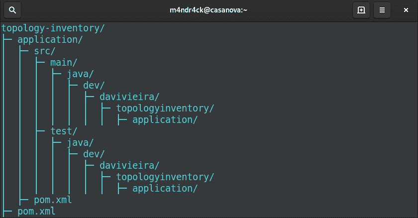

# 7

# 构建应用程序六边形

一旦我们有了领域六边形提供的基础，我们就可以在这个基础上构建系统的剩余部分。现在是时候考虑系统将如何协调处理不同的数据和行为以满足不同角色的需求了，我们将通过讨论用例示例来探讨这一点。为了实现这一点，我们需要在领域六边形定义的基础上创建应用程序六边形。

为了继续构建前一章中启动的模块化结构，其中我们将领域六边形配置为**Java**模块，我们将通过定义应用程序六边形作为我们六边形系统的第二个 Java 模块来继续使用模块化方法。

为了更好地展示系统的功能，一个推荐的方法是使用**Cucumber**，这是一种知名的行为驱动开发技术，它使用诸如特性和场景等概念来描述系统的行为。因此，对于应用程序六边形，我们将使用 Cucumber 来帮助我们塑造六边形系统的用例。

Cucumber 使我们能够以非技术的方式测试应用程序六边形并解释用例的结构。

在本章中，我们将学习以下主题：

+   引导应用程序六边形

+   定义用例

+   使用输入端口实现用例

+   测试应用程序六边形

在本章结束时，你将了解如何利用用例作为蓝图来驱动整个应用程序六边形的开发。通过通过用例表达用户意图并从中推导出对象以实现端口，你将能够以结构化的方式开发代码以实现用例目标。

# 技术要求

为了编译和运行本章中展示的代码示例，你需要在你的计算机上安装最新的**Java SE 开发工具包**（**JDK**）和**Maven 3.8**。它们都适用于**Linux**、**Mac**和**Windows**操作系统。

你可以在 GitHub 上找到本章的代码文件，链接为[`github.com/PacktPublishing/-Designing-Hexagonal-Architecture-with-Java---Second-Edition/tree/main/Chapter07`](https://github.com/PacktPublishing/-Designing-Hexagonal-Architecture-with-Java---Second-Edition/tree/main/Chapter07)。

# 引导应用程序六边形

应用程序六边形通过领域六边形协调内部请求，通过框架六边形协调外部请求。我们根据领域六边形提供的领域模型构建系统的特性，包括端口和用例。在应用程序六边形中，我们不指定任何约束或业务规则。相反，我们对于应用程序六边形的目的是定义和控制六边形系统中的数据流。

为了继续开发拓扑和库存系统，我们必须将应用程序六边形作为 Maven 和 Java 模块进行引导。让我们从 Maven 配置开始：

```java
mvn archetype:generate \
  -DarchetypeGroupId=de.rieckpil.archetypes  \
  -DarchetypeArtifactId=testing-toolkit \
  -DarchetypeVersion=1.0.0 \
  -DgroupId=dev.davivieira \
  -DartifactId=application \
  -Dversion=1.0-SNAPSHOT \
  -Dpackage=dev.davivieira.topologyinventory.application \
  -DinteractiveMode=false
```

之前的命令为应用程序六边形创建了基本的 Maven 项目结构。在这里，我们将模块的 `groupId` 坐标设置为 `dev.davivieira`，`version` 设置为 `1.0-SNAPSHOT`，与父项目使用相同。我们将 `artifactId` 设置为 `application` 以在 Maven 项目中唯一标识此模块。

您需要通过使用以下命令在 Maven 项目根目录中运行前面的 `mvn` 命令：

```java
$ cd topology-inventory
$ mvn archetype:generate ...
```

这为应用程序六边形创建了基本的项目结构。目录结构将类似于以下截图：



图 7.1 – 应用程序六边形的目录结构

根 `pom.xml` 文件应包含 `application` 和 `domain` Maven 模块：

```java
<modules>
    <module>domain</module>
    <module>application</module>
</modules>
```

在创建 Maven 模块项目之后，我们需要通过在 `application/src/java/module-info.java` 中创建 `module` 描述符文件来将应用程序六边形配置为 Java 模块：

```java
module application {
    requires domain;
    requires static lombok;
}
```

注意第一个 `requires` 条目 – 它声明 `application` 模块依赖于 `domain` 模块。我们需要在 `application/pom.xml` 中添加领域六边形的依赖项：

```java
<dependency>
    groupId>dev.davivieira</groupId>
    <artifactId>domain</artifactId>
    <version>1.0-SNAPSHOT</version>
    <scope>compile</scope>
</dependency>
```

Maven 坐标 `groupId`、`artifactId` 和 `version` 指定了获取领域六边形 Maven 模块的正确参数。

由于我们将使用 Cucumber 提供书面描述并测试我们的用例，因此我们需要将其依赖项添加到 `application/pom.xml` 文件中：

```java
<dependency>
    <groupId>io.cucumber</groupId>
    <artifactId>cucumber-java</artifactId>
    <version>6.10.4</version>
    <scope>test</scope>
</dependency>
<dependency>
    <groupId>io.cucumber</groupId>
    <artifactId>cucumber-junit</artifactId>
    <version>6.10.4</version>
    <scope>test</scope>
</dependency>
<dependency>
    <groupId>io.cucumber</groupId>
    <artifactId>cucumber-picocontainer</artifactId>
    <version>6.10.4</version>
    <scope>test</scope>
</dependency>
```

如本章引言所述，我们将使用 Cucumber 来构建和测试用例。在之前的代码示例中声明的 Maven 依赖项是启用应用程序六边形中 Cucumber 的必需条件。

一旦为拓扑和库存系统正确配置了应用程序六边形的 Maven 模块和 Java 模块，我们就可以继续并开始定义系统的用例。

# 定义用例

拓扑和库存系统允许用户管理网络资源，如路由器、交换机和网络。为了启用此管理，我们在上一章创建了一个表示这些资源之间关系的领域模型。我们现在必须从领域模型的角度构建系统的特性。这些特性代表了用户与系统交互时的意图。

为了能够以书面和代码形式表达用例，我们使用 Cucumber，这是一个有价值的工具，使非技术人员能够理解代码中存在的用例。

通过依赖 Cucumber 的概念，如特性和场景，我们可以创建易于遵循的用例描述。使用 Cucumber 形成的用例描述可以作为开发用例接口的参考。

在创建拓扑和库存系统的用例接口之前，我们首先需要结构化 Cucumber 使用功能文件中的用例。功能文件是我们将描述一系列书面语句以定义用例的地方。这个相同的书面描述随后在实现类以测试用例时使用。

## 为路由器管理用例编写描述

要开始，让我们创建`RouterAdd.feature`文件，该文件描述了将路由器添加到系统中的用例：

```java
@RouterAdd
Feature: Can I add an edge router to a core router?
  Scenario: Adding an edge router to a core router
    Given I have an edge router
    And I have a core router
    Then I add an edge router to a core router
  Scenario: Adding a core router to another core router
    Given I have a core router
    And I have another core router
    Then I add this core router to the core router
```

这个功能文件描述了两个场景——第一个是当用户想要将边缘路由器添加到核心路由器时；第二个是当用户想要将核心路由器添加到另一个核心路由器时。

之后，我们有`RouterCreate.feature`文件：

```java
@RouterCreate
Feature: Can I create a new router?
  Scenario: Creating a new core router
    Given I provide all required data to create a core
          router
    Then A new core router is created
  Scenario: Creating a new edge router
    Given I provide all required data to create an edge
      router
    Then A new edge router is created
```

这里，我们有两个场景，描述了核心路由器和边缘路由器的创建。

最后，是`RouterRemove.feature`文件：

```java
@RouterRemove
Feature: Can I remove routers?
  Scenario: Removing an edge router from a core router
    Given The core router has at least one edge
          router connected to it
    And The switch has no networks attached to it
    And The edge router has no switches attached to it
    Then I remove the edge router from the core router
  Scenario: Removing a core router from another core router
    Given The core router has at least one core router
          connected to it
    And The core router has no other routers connected to
        it
    Then I remove the core router from another core router
```

对于描述的两个场景中的每一个，我们定义一组特定的约束以允许移除路由器。一旦我们有 Cucumber 场景描述了关于路由器管理的支持行为，我们就可以定义将允许实现这些操作的用例接口。这些操作将启用这些行为。

## 定义路由器管理用例接口

一个好的路由器管理用例接口应该包含允许系统实现由`RouterAdd.feature`、`RouterCreate.feature`和`RouterRemove.feature`文件描述的场景的操作。以下用例接口是根据我们在 Cucumber 功能文件中描述的场景定义的：

```java
package dev.davivieira.topologyinventory.
  application.usecases;
import dev.davivieira.topologyinventory.domain.
  entity.CoreRouter;
import dev.davivieira.topologyinventory.domain.
  entity.Router;
import dev.davivieira.topologyinventory.domain.vo.IP;
import dev.davivieira.topologyinventory.domain.vo.Id;
import dev.davivieira.topologyinventory.domain.vo.Location;
import dev.davivieira.topologyinventory.domain.vo.Model;
import dev.davivieira.topologyinventory.domain.
  vo.RouterType;
import dev.davivieira.topologyinventory.domain.vo.Vendor;
public interface RouterManagementUseCase {
    Router createRouter(
            Vendor vendor,
            Model model,
            IP ip,
            Location location,
            RouterType routerType);
    CoreRouter addRouterToCoreRouter(
            Router router, CoreRouter coreRouter);
    Router removeRouterFromCoreRouter(
            Router router, CoreRouter coreRouter);
    Router retrieveRouter(Id id);
    Router persistRouter(Router router);
}
```

`createRouter`方法基于`RouterCreate.feature` Cucumber 文件。`addRouterToCoreRouter`和`removeRouterFromCoreRouter`方法分别对应于`RouterAdd.feature`和`RouterRemove.feature`文件。现在，让我们继续创建交换机管理用例的书面描述。

## 为交换机管理用例编写描述

我们将首先创建`SwitchAdd.feature`文件：

```java
@SwitchAdd
Feature: Can I add a switch to an edge router?
  Scenario: Adding a switch to an edge router
    Given I provide a switch
    Then I add the switch to the edge router
```

这是一个非常直接的用例场景。鉴于我们提供了一个有效的交换机，我们可以将其添加到边缘路由器中。没有提到核心路由器，因为它们不应该接收交换机连接。

然后，我们创建`SwitchCreate.feature`文件：

```java
@SwitchCreate
Feature: Can I create new switches?
  Scenario: Creating a new switch
    Given I provide all required data to create a switch
    RouterCreate.feature file, in the sense that if we provide all the required data, a new Switch object is created.
Finally, we create the `SwitchRemove.feature` file:

```

@SwitchRemove

Feature: 我能否从边缘路由器中移除一个交换机？

Scenario: 从边缘路由器中移除交换机

Given I know the switch I want to remove

And The switch has no networks

然后我从边缘路由器中移除了交换机

```java

 So, to remove a switch from an edge router, we have to make sure the switch has no networks connected to it. This is what the preceding scenario asserts.
Now, let’s define the use case interface for switch management, based on the Cucumber scenarios we just created.
Defining the use case interface for switch management
As we did with routers, we will do the same for switches by creating a use case interface to define the switch management operations, based on the written descriptions we made previously in our Cucumber feature files:

```

package dev.davivieira.topologyinventory.

application.usecases;

import dev.davivieira.topologyinventory.domain.

entity.EdgeRouter;

import dev.davivieira.topologyinventory.domain.

entity.Switch;

import dev.davivieira.topologyinventory.domain.vo.IP;

import dev.davivieira.topologyinventory.domain.vo.Location;

import dev.davivieira.topologyinventory.domain.vo.Model;

import dev.davivieira.topologyinventory.domain.

vo.SwitchType;

import dev.davivieira.topologyinventory.domain.vo.Vendor;

public interface SwitchManagementUseCase {

Switch createSwitch(

Vendor vendor,

Model model,

IP ip,

Location location,

SwitchType switchType

);

EdgeRouter addSwitchToEdgeRouter(Switch networkSwitch,

EdgeRouter edgeRouter);

EdgeRouter removeSwitchFromEdgeRouter(Switch

networkSwitch,

EdgeRouter edgeRouter);

}

```java

 The `createSwitch`, `addSwitchToEdgeRouter`, and `removeSwitchFromEdgeRouter` methods correspond to the Cucumber `SwitchCreate.feature`, `SwitchAdd.feature`, and `SwitchRemove.feature` feature files, respectively. The `createSwitch` method receives all the required parameters to construct a `Switch` object. Both the `addSwitchToEdgeRouter` and `removeSwitchFromEdgeRouter` methods receive a switch and an edge router as parameters, and both methods return `EdgeRouter`.
To finish the definition of use cases, we still need to create the Cucumber feature files and interfaces for networks. Let’s do that!
Creating written descriptions for network management use cases
For networks, we will continue to follow the same pattern of the add, create, and remove operations previously used on routers and switches. Let’s start with the `NetworkAdd.feature` file:

```

@NetworkAdd

功能：能否向交换机添加网络？

场景：向交换机添加网络

Given 我有一个网络

并且我有一个交换机来添加网络

然后，我将网络添加到交换机

```java

 This is a simple scenario to ensure that we’re able to add networks to a switch.
Following the addition of networks, we have the `NetworkCreate.feature` file:

```

@NetworkCreate

功能：能否创建新的网络？

场景：创建一个新的网络

Given 我提供了创建网络所需的所有数据

然后，创建了一个新的网络

```java

 For network creation, as we did with routers and switches, we make sure that all required data is properly provided so that a new network is created.
Finally, we have the `NetworkRemove.feature` file:

```

@NetworkRemove

功能：能否从一个交换机中删除网络？

场景：从交换机中删除网络

Given 我知道我想要删除的网络

并且我有一个交换机来删除网络

然后，我从交换机中删除网络

```java

 It follows the same structure as the adding scenario but checks the system’s capability to remove networks from a switch.
Now that we have Cucumber scenarios for network management, let’s define a use case interface to perform such scenarios.
Defining the use case interface for network management
The `NetworkManagementUseCase` interface follows the same structure as previously defined interfaces, where we declared methods for creation, addition, and removal operations:

```

package dev.davivieira.topologyinventory.

application.usecases;

import dev.davivieira.topologyinventory.domain.

entity.Switch;

import dev.davivieira.topologyinventory.domain.vo.IP;

import dev.davivieira.topologyinventory.domain.vo.Network;

public interface NetworkManagementUseCase {

Network createNetwork(

IP networkAddress,

String networkName,

int networkCidr);

Switch addNetworkToSwitch(Network network,

Switch networkSwitch);

Switch removeNetworkFromSwitch(Network network,

Switch networkSwitch);

}

```java

 Here, again, we declare the `createNetwork`, `addNetworkToSwitch`, and `removeNetworkFromSwitch` methods based on the written descriptions from the Cucumber feature files. These three method declarations in the `NetworkManagementUseCase` interface represent the first step in implementing the capabilities that will allow us to manage networks, as described in the scenarios we created using Cucumber.
In this section, we learned about an approach to start use case development by first describing the behaviors and scenarios expected from the system. Once the scenarios were thoroughly explored, we then utilized them as a reference to define the use case interfaces that will allow the system to perform the behaviors described in the scenarios.
Now that we have all the use case interfaces to manage routers, switches, and networks, we can provide an input port implementation for each of these use case interfaces.
Implementing use cases with input ports
Input ports are a central element of the Application hexagon. They play a crucial integration role because it is through them that we bridge the gap between the Domain and Framework hexagons. We can get external data from an output port and forward that data to the Domain hexagon by using output ports. Once the Domain hexagon’s business logic is applied to the data, the Application hexagon moves that data downstream until it reaches one of the output adapters in the Framework hexagon.
When creating the Application hexagon, you’re able to define output port interfaces, but because there is no Framework hexagon yet to provide an output adapter as an implementation, you’re not able to use these output ports.
You’ll see output port declarations in the following code, but they are not being used yet. We’re just preparing the Application hexagon to work when we have the Framework hexagon to provide the implementations.
The following steps will help us to implement use cases with input ports:

1.  We start by creating a `RouterManagementOutputPort` field in the `RouterManagementInputPort` class:

    ```

    package dev.davivieira.topologyinventory.application.

    ports.input;

    import dev.davivieira.topologyinventory.application.

    ports.output.RouterManagementOutputPort;

    import dev.davivieira.topologyinventory.application.

    usecases.RouterManagementUseCase;

    import dev.davivieira.topologyinventory.domain.entity.

    CoreRouter;

    import dev.davivieira.topologyinventory.domain.

    entity.Router;

    import dev.davivieira.topologyinventory.domain.entity.

    factory.RouterFactory;

    import dev.davivieira.topologyinventory.domain.vo.IP;

    import dev.davivieira.topologyinventory.domain.vo.Id;

    import dev.davivieira.topologyinventory.domain.

    vo.Location;

    import dev.davivieira.topologyinventory.domain.

    vo.Model;

    import dev.davivieira.topologyinventory.domain.

    vo.RouterType;

    import dev.davivieira.topologyinventory.domain.

    vo.Vendor;

    import lombok@NoArgsConstructor;

    @NoArgsConstructor

    public class RouterManagementInputPort implements

    RouterManagementUseCase {

    RouterManagementOutputPort

    routerManagementOutputPort;

    /** 代码省略

    }

    ```java

    We created this `RouterManagementOutputPort` interface field because we don’t want to depend directly on its implementation. Remember, output adapters implement output ports.

     2.  Next, we implement the `createRouter` method:

    ```

    @Override

    public Router createRouter(Vendor vendor,

    Model model,

    IP ip,

    Location location,

    RouterType routerType) {

    return RouterFactory.getRouter(

    vendor,model,ip,location,routerType);

    }

    ```java

    With the `createRouter` method, we’ll receive all the required parameters to construct a `Router` object. Object creation is delegated to the `getRouter` method from the `RouterFactory` class.

     3.  Next, we implement the `retrieveRouter` method:

    ```

    @Override

    public Router retrieveRouter(Id id) {

    return

    routerManagementOutputPort.retrieveRouter(id);

    }

    ```java

    It’s a very straightforward method that uses `Id` to obtain the `Router` objects, using the `retrieveRouter` method from the `RouterManagementOutputPort` output port.

     4.  Next, we implement the `persistRouter` method:

    ```

    @Override

    public Router persistRouter(Router router) {

    return

    routerManagementOutputPort.persistRouter(router);

    }

    ```java

    To persist a router, we need to pass the `Router` object we want to persist. This method is generally used after any operation that creates new `Router` objects or causes changes in existing ones.

     5.  Next, we implement the `addRouterToCoreRouter` method:

    ```

    @Override

    public CoreRouter addRouterToCoreRouter(Router router,

    CoreRouter coreRouter) {

    var addedRouter = coreRouter.addRouter(router);

    //persistRouter(addedRouter);

    return addedRouter;

    }

    ```java

    To add `Router` to `CoreRouter`, we call the `addRouter` method from `CoreRouter`. We’re not persisting `Router` because we don’t have an adapter to allow us to do that. So, we just return the added `Router` object.

     6.  Finally, we implement `removeRouterFromCoreRouter`:

    ```

    @Override

    public Router removeRouterFromCoreRouter(Router rout

    er,CoreRouter coreRouter) {

    var removedRouter =

    coreRouter.removeRouter(router);

    //persistRouter(removedRouter);

    return removedRouter;

    }

    ```java

    Again, we use one of the methods present in the `CoreRoute` class. Here, we call the `removeRouter` method to remove `Router` from `CoreRouter`. Then, we return `removedRouter`, instead of actually removing it from an external data source.

The first method we implemented, `createRouter`, can produce either core or edge routers. To accomplish this, we need to provide a factory method directly in the Domain hexagon, in a class called `RouterFactory`. The following is how we implement this `getRouter` factory method:

```

public static Router getRouter(Vendor vendor,

Model model,

IP ip,

Location location,

RouterType routerType){

switch (routerType){

case CORE → { return CoreRouter.builder().

id(Id.withoutId()).

vendor(vendor).

model(model).

ip(ip).

location(location).

routerType(routerType).

build();

}

/** 代码省略 **/

```java

 The `RouterType` parameter, which we pass to the `getRouter` method, has only two possible values – `CORE` and `EDGE`. The switch looks into one of these two values to determine which `builder` method to use. If `RouterType` is `CORE`, then the `builder` method from `CoreRouter` is called. Otherwise, the `builder` method from `EdgeRouter` is used, as we can see here:

```

case EDGE → {  return EdgeRouter.builder().

id(Id.withoutId()).

vendor(vendor).

model(model).

ip(ip).

location(location).

routerType(routerType).

build();

}

default → throw new UnsupportedOperationException(

"No valid router type informed");

```java

 If neither `CORE` nor `EDGE` is informed, the default behavior is to throw an exception saying that no valid router type was informed.
Let’s implement the `SwitchManagementUseCase` interface with `SwitchManagementInputPort`:

1.  We will start by implementing the `createSwitch` method:

    ```

    package dev.davivieira.topologyinventory.application.

    ports.input;

    import dev.davivieira.topologyinventory.application.

    usecases.SwitchManagementUseCase;

    import dev.davivieira.topologyinventory.domain.

    entity.EdgeRouter;

    import dev.davivieira.topologyinventory.domain.

    entity.Switch;

    import dev.davivieira.topologyinventory.domain.vo.IP;

    import dev.davivieira.topologyinventory.domain.vo.Id;

    import dev.davivieira.topologyinventory.domain.

    vo.Location;

    import dev.davivieira.topologyinventory.domain.

    vo.Model;

    import dev.davivieira.topologyinventory.domain.

    vo.SwitchType;

    import dev.davivieira.topologyinventory.domain.

    vo.Vendor;

    public class SwitchManagementInputPort implements

    SwitchManagementUseCase {

    @Override

    public Switch createSwitch(

    Vendor vendor,

    Model model,

    IP ip,

    Location location,

    SwitchType switchType) {

    return Switch.builder()

    .id(Id.withoutId())

    .vendor(vendor)

    .model(model)

    .ip(ip)

    .location(location).switchType

    (switchType).build();

    }

    /** 代码省略 **/

    }

    ```java

    For the `createSwitch` method, we don’t need a factory method to create objects because there are no `Switch` object variations as compared to routers. Instead, we generate `Switch` objects, using the `builder` method directly from the `Switch` class.

     2.  Next, we implement the `addSwitchToEdgeRouter` method:

    ```

    @Override

    public EdgeRouter addSwitchToEdgeRouter(

    Switch networkSwitch, EdgeRouter edgeRouter) {

    edgeRouter.addSwitch(networkSwitch);

    return edgeRouter;

    }

    ```java

    Then, we have `addSwitchToEdgeRouter`, which receives `Switch` and `EdgeRouter` as parameters, to add switches to an edge router. There is no way to persist switches without persisting routers as well. That’s why we did not put a persistence method here. By doing that, we enforce all switch persistence operations to occur only when we persist routers.

    Remember that `Router` is an aggregate (a cluster of domain objects) that controls the life cycle of other entities and value objects, including `Switch`-type objects.

     3.  Finally, we implement the `removeSwitchFromEdgeRouter` method:

    ```

    @Override

    public EdgeRouter removeSwitchFromEdgeRouter(

    Switch networkSwitch,EdgeRouter edgeRouter) {

    edgeRouter.removeSwitch(networkSwitch);

    return edgeRouter;

    }

    ```java

    The last method, `removeSwitchFromEdgeRouter`, receives the same parameters, `Switch` and `EdgeRouter`, and removes switches from edge routers using the `removeSwitch` method present in an `EdgeRouter` instance.

Now, let’s see how we can implement the `NetworkManagementUseCase` interface with `NetworkManagementInputPort`:

1.  We start by implementing the `createNetwork` method:

    ```

    package dev.davivieira.topologyinventory.

    application.ports.input;

    import dev.davivieira.topologyinventory.application.

    usecases.NetworkManagementUseCase;

    import dev.davivieira.topologyinventory.domain.

    entity.Switch;

    import dev.davivieira.topologyinventory.domain.vo.IP;

    import dev.davivieira.topologyinventory.domain.

    vo.Network;

    import lombokNoArgsConstructor;

    @NoArgsConstructor

    public class NetworkManagementInputPort implements

    NetworkManagementUseCase {

    @Override

    public Network createNetwork(

    IP networkAddress, String networkName,

    int networkCidr) {

    return  Network

    .builder()

    .networkAddress(networkAddress)

    .networkName(networkName)

    .networkCidr(networkCidr).build();

    }

    /** 代码省略 **/

    }

    ```java

    To create a new network, we use all the received method parameters in conjunction with the `builder` method from the `Network` class.

     2.  Next, we implement `addNetworkToSwitch`:

    ```

    @Override

    public Switch addNetworkToSwitch(

    Network network, Switch networkSwitch) {

    networkSwitch.addNetworkToSwitch(network);

    return networkSwitch;

    }

    ```java

    Here, we receive the `Network` and `Switch` objects. Then, we call the `addNetworkToSwitch` method on `Switch` by passing the `Network` object as a parameter. Then, we return a `Switch` object with the added `Network` object.

     3.  Finally, we implement the `removeNetworkFromSwitch` method:

    ```

    @Override

    public Switch removeNetworkFromSwitch(

    Network network, Switch networkSwitch) {

    networkSwitch.removeNetworkFromSwitch(network);

    return networkSwitch;

    }

    ```java

    We receive the `Network` and `Switch` objects as parameters, like in the `addNetworkToSwitch` method. However, to remove the network from a switch, we call `removeNetworkFromSwitch` from the `Switch` object.

That completes implementing input ports for router, switch, and network management. To ensure everything works as expected, let’s create Cucumber tests based on the written use case descriptions and the input ports we just created.
Testing the Application hexagon
An interesting and useful thing about Cucumber is that we can use the written scenario description provided in the feature file to tailor unit tests. In addition, these written scenarios provide an easy way to understand and implement the hexagonal system’s use cases. We’re also laying the groundwork for the development of unit tests in the Application hexagon.
So, the tests we’re about to build in this section are a continuation of the written scenario descriptions we created for the router, switch, and network management operations. Our goal here is to test input port implementations to ensure these ports work as expected when input adapters call them.
To get started, we need to create the `ApplicationTest` test class to enable Cucumber:

```

package dev.davivieira.topologyinventory.application;

import io.cucumber.junit.Cucumber;

import io.cucumber.junit.CucumberOptions;

import org.junit.runner.RunWith;

@RunWith(Cucumber.class)

@CucumberOptions(

plugin = {"pretty", "html:target/cucumber-result"}

)

public class ApplicationTest {

}

```java

 The important part is the `@RunWith` annotation, which triggers the initialization of the Cucumber engine.
Let’s start by creating tests to check whether the system is capable of adding routers.
In the same way that we created a `RouterAdd.feature` file, we’ll create its counterpart as a `RouterAdd.java` test class. The location for both files will resemble the following:

*   `src/test/java/dev/davivieira/topologyinventory/application/RouterAdd.java`
*   `src/test/resources/dev/davivieira/topologyinventory/application/routers/RouterAdd.feature`

The following steps walk you through adding an edge router to a core router:

1.  The first step is to get an edge router:

    ```

    @Given("我有一个边缘路由器")

    public void assert_edge_router_exists(){

    edgeRouter = (EdgeRouter)

    this.routerManagementUseCase.createRouter(

    Vendor.HP,

    Model.XYZ0004,

    IP.fromAddress("20.0.0.1"),

    locationA,

    EDGE

    );

    assertNotNull(edgeRouter);

    }

    ```java

    Here, we use the `createRouter` method from `RouterManagementUseCase` to create edge router objects. We need to cast the returned object to an `EdgeRouter` type because the `createRouter` method returns `Router`. Then, to make sure that we received a proper router object, we call `assertNotNull` on `edgeRouter`.

     2.  Now that we have `EdgeRouter`, we need to create `CoreRouter` by using the `createRouter` method again:

    ```

    @And("我有一个核心路由器")

    public void assert_core_router_exists(){

    coreRouter = (CoreRouter)

    this.routerManagementUseCase.createRouter(

    Vendor.CISCO,

    Model.XYZ0001,

    IP.fromAddress("30.0.0.1"),

    locationA,

    CORE

    );

    assertNotNull(coreRouter);

    }

    ```java

    This code follows the exact same pattern as the first step. The only difference is that we pass `CORE` as `RouterType` to the `createRouter` method from `RouterManagementUseCase`.

     3.  With these two objects, `EdgeRouter` and `CoreRouter`, we can now test adding the former to the latter:

    ```

    @Then("我添加了一个边缘路由器到核心路由器")

    public void add_edge_to_core_router(){

    var actualEdgeId = edgeRouter.getId();

    var routerWithEdge =

    (CoreRouter)  this.routerManagementUseCase.

    addRouterToCoreRouter(edgeRouter, coreRouter);

    var expectedEdgeId =

    routerWithEdge.getRouters().get(actualEdgeId).

    getId();

    assertEquals(actualEdgeId, expectedEdgeId);

    }

    ```java

    The `addRouterToCoreRouter` method receives `EdgeRouter` and `CoreRouter` as parameters. At the end of the method, we compare the actual and expected edge router IDs to confirm whether the edge router has been added correctly to the core router.

To test the execution of the Cucumber scenario steps from `RouterAdd.feature`, we have to run the following Maven command:

```

mvn test

```java

 The output will be similar to the one shown here:

```

@RouterAdd

Scenario: 将边缘路由器添加到核心路由器 # dev/davivieira/topologyinventory/application/routers/RouterAdd.feature:4

Given 我有一个边缘路由器 # dev.davivieira.topologyinventory.application.RouterAdd.assert_edge_router_exists()

And 我有一个核心路由器 # dev.davivieira.topologyinventory.application.RouterAdd.assert_core_router_exists()

然后我将一个边缘路由器添加到一个核心路由器上 # dev.davivieira.topologyinventory.application.RouterAdd.add_edge_to_core_router()

```java

 The Cucumber test passes through the testing methods in the `RouterAdd.java` file in the same order as they were declared in the `RouterAdd.feature` file.
Now, let’s see how we can implement the `RouterCreate.java` test class for the `RouterCreate.feature` file. Their file locations will resemble the following:

*   `RouterCreate.java` file: `src/test/java/dev/davivieira/topologyinventory/application/RouterCreate.java`
*   `RouterCreate.feature` file: `src/test/resources/dev/davivieira/topologyinventory/application/routers/RouterCreate.feature`

The following scenario steps walk through creating a new core router in the system:

1.  The first step is to create a new core router:

    ```

    @Given("我提供创建核心路由器所需的所有数据")

    router")

    public void create_core_router(){

    router =  this.routerManagementUseCase.

    createRouter(

    Vendor.CISCO,

    Model.XYZ0001,

    IP.fromAddress("20.0.0.1"),

    locationA,

    CORE

    );

    }

    ```java

    We provide all the required data to the `createRouter` method from `RouterManagementUseCase` in order to create the new core router.

     2.  Then, we proceed to confirm whether the router created was indeed a core router:

    ```

    @Then("创建了一个新的核心路由器")

    public void a_new_core_router_is_created(){

    assertNotNull(router);

    assertEquals(CORE, router.getRouterType());

    }

    ```java

    The first assertion checks whether we received a null pointer. The second assertion looks into the router’s type to confirm that it’s a core router.

The following scenario steps involve checking whether we can simply create an edge router by using the `createRouter` method from `RouterManagementUseCase`:

1.  First, we create an edge router:

    ```

    @Given("我提供创建边缘路由器所需的所有数据")

    router")

    public void create_edge_router(){

    router =

    this.routerManagementUseCase.createRouter(

    Vendor.HP,

    Model.XYZ0004,

    IP.fromAddress("30.0.0.1"),

    locationA,

    EDGE

    );

    }

    ```java

    We follow the same procedure for creating the core router objects, but now, we set the `EDGE` parameter as `RouterType` for object creation.

     2.  In the last scenario step, we just execute the assertions:

    ```

    @Then("创建了一个新的边缘路由器")

    public void a_new_edge_router_is_created(){

    assertNotNull(router);

    assertEquals(EDGE, router.getRouterType());

    }

    ```java

    The first assertion checks with the `assertNotNull` method whether the router reference is not `null`. Then, it proceeds by executing `assertEquals` to check whether the router created is `EdgeRouter`.

To run the tests related to the creation of routers, we will execute the following Maven command in the project root directory:

```

mvn test

```java

 The test result should contain the following output:

```

@RouterCreate

Scenario: 创建一个新的边缘路由器 # dev/davivieira/topologyinventory/application/routers/RouterCreate.feature:8

Given 我提供创建边缘路由器所需的所有数据 # dev.davivieira.topologyinventory.application.RouterCreate.create_edge_router()

然后创建一个新的边缘路由器 # dev.davivieira.topologyinventory.application.RouterCreate.a_new_edge_router_is_created()

```java

 Now that we’re done with the scenario to create routers, let’s see how to implement the `RouterRemove.java` test class for the `RouterRemove.feature` file. The file locations are as follows:

*   `src/test/java/dev/davivieira/topologyinventory/application/RouterRemove.java`
*   `src/test/resources/dev/davivieira/topologyinventory/application/routers/RouterRemove.feature`

We have to create the methods to test a scenario where we want to remove an edge router from a core router:

1.  To get started, we first need to know whether the core router we are working with has at least an edge router connected to it:

    ```

    @Given("核心路由器至少有一个边缘路由器

    连接到它")

    public void 核心路由器至少有一个边缘路由器连接到它

    router_connected_to_it(){

    var predicate =

    Router.getRouterTypePredicate(EDGE);

    edgeRouter = (EdgeRouter)

    this.coreRouter.getRouters().

    entrySet()

    stream().

    map(routerMap -> routerMap.getValue()).

    filter(predicate).

    findFirst().get();

    assertEquals(EDGE, edgeRouter.getRouterType());

    }

    ```java

    From a core router, we search for an edge router connected to it. Then, we store the returned edge router in the `edgeRouter` variable. Following that, we assert the type of router to confirm whether we have an edge router.

     2.  Next, we have to check that there are no networks attached to the switch connected to the edge router. We have to check this; otherwise, we will not be able to remove the switch from the edge router:

    ```

    @And("交换机没有连接到它的网络")

    public void 交换机没有连接到它的网络

    attached_to_it(){

    var networksSize =

    networkSwitch.getSwitchNetworks().size();

    assertEquals(1, networksSize);

    networkSwitch.removeNetworkFromSwitch(network);

    networksSize =

    networkSwitch.getSwitchNetworks().size();

    assertEquals(0, networksSize);

    }

    ```java

    To assert a switch has no networks connected to it, we first check the size of the networks on the switch. It should return `1`. Then, we remove the network and check the size again. It should return `0`.

    We must ensure that the switch has no networks attached to it to make that switch eligible for removal.

     3.  Next, we can proceed to check that there are no switches connected to the edge router:

    ```

    @And("边缘路由器没有连接到它的交换机")

    public void 边缘路由器没有连接到它的交换机

    attached_to_it(){

    var switchesSize =

    edgeRouter.getSwitches().size();

    assertEquals(1, switchesSize);

    edgeRouter.removeSwitch(networkSwitch);

    switchesSize = edgeRouter.getSwitches().size();

    assertEquals(0, switchesSize);

    }

    ```java

    Here, we remove the switch using the `removeSwitch` method, followed by an assertion to confirm that the edge router has no more switches connected.

     4.  Now, we can test the removal of the edge router from the core router:

    ```

    @Then("我从核心路由器中移除边缘路由器")

    public void 从核心路由器中移除边缘路由器(){

    var actualID = edgeRouter.getId();

    var expectedID = this.routerManagementUseCase.

    removeRouterFromCoreRouter(

    edgeRouter, coreRouter).

    getId();

    assertEquals(expectedID, actualID);

    }

    ```java

    To test the removal of an edge router from the core router, we first get the edge router ID of the router we intend to remove. We store this ID in the `actualID` variable. Then, we proceed to the actual removal. The `removeRouterFromCoreRouter` method returns the removed router. So, we can use the removed router ID, stored in the `expectedID` variable, to check with the `assertEquals` method whether the router was really removed.

To confirm the tests related to router removal are working, we execute the Maven test goal in the project root directory:

```

mvn test

```java

 The results you get after executing the tests should be similar to the following output:

```

@RouterRemove

场景：从核心路由器中移除边缘路由器 # dev/davivieira/topologyinventory/application/routers/RouterRemove.feature:4

Given 核心路由器至少有一个边缘路由器连接到它 # dev.davivieira.topologyinventory.application.RouterRemove.the_core_router_has_at_least_one_edge_router_connected_to_it()

并且交换机没有连接到它的网络 # dev.davivieira.topologyinventory.application.RouterRemove.the_switch_has_no_networks_attached_to_it()

并且边缘路由器没有连接到它的交换机 # dev.davivieira.topologyinventory.application.RouterRemove.the_edge_router_has_no_switches_attached_to_it()

然后我从核心路由器中移除边缘路由器 # dev.davivieira.topologyinventory.application.RouterRemove.edge_router_is_removed_from_core_router()

```java

 The preceding output provides the execution details of the four testing methods involved in removing the edge router from the core router.
We have completed the testing part of router management. For switch and network management, we follow the same ideas. In the book’s GitHub repository, you can access the topology and inventory code with all its tests.
Summary
In this chapter, on top of the Domain hexagon, we built the Application hexagon with use cases and ports. For use cases, we heavily relied on a behavior-driven development tool called Cucumber. With Cucumber, we can express use cases supported by the system not only in code terms but also in written text.
We started by creating Cucumber feature files containing the use case written descriptions, and then we used them as a reference to create use case interfaces. These interfaces were then implemented by input ports that provided a concrete way to achieve the use case goals. Finally, we built use case tests, based again on the written description provided by Cucumber.
By implementing and testing the Application hexagon in this way, we leveraged the special capabilities of Cucumber to express the system’s behavior in a declarative and straightforward form, and we used these same capabilities to implement and test the entire Application hexagon.
On top of the Application hexagon and the features it provides, we need to decide how such features will be exposed. Also, some of these require access to external data sources. We’ll address all these concerns by developing the Framework hexagon in the next chapter.
Questions

1.  What do we call files where we declare Cucumber scenarios?
2.  On which other Java module does the Application hexagon depend?
3.  Which hexagonal architecture component is used to implement use cases?

Answers

1.  They are called feature files.
2.  It depends on the Domain hexagon Java module.
3.  Input ports are utilized to implement use cases.

```
