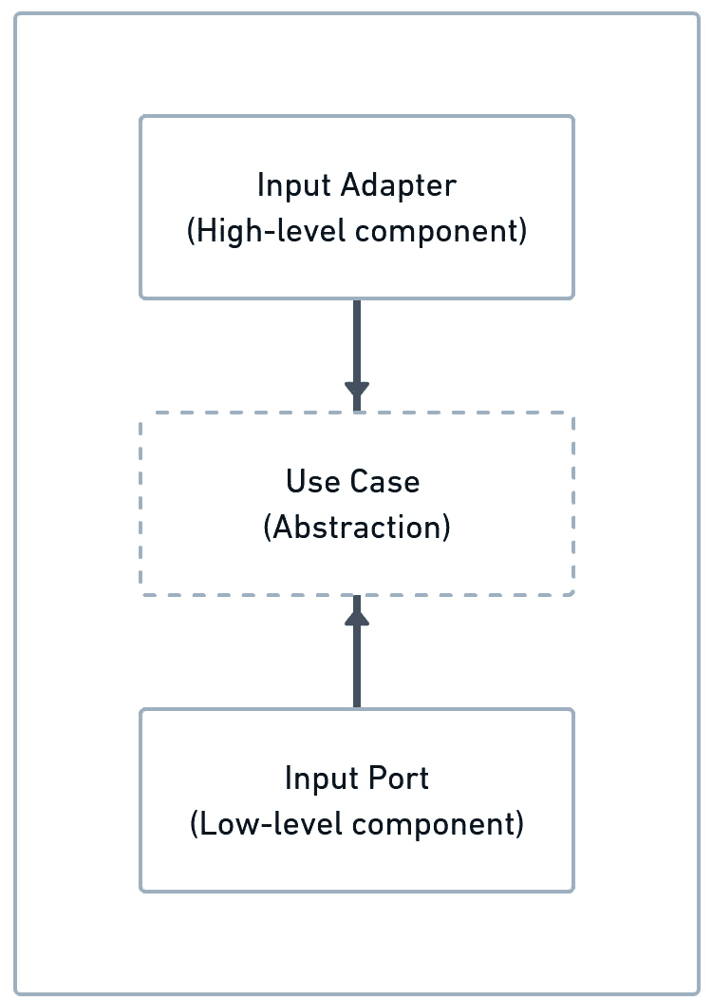
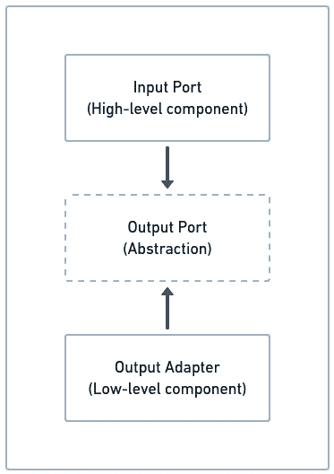

# 9

# 使用 Java 模块应用依赖反转

在前面的章节中，我们学习了如何将每个六边形作为 Java 模块来开发。通过这样做，我们开始强制实施架构中每个六边形的范围和职责。然而，我们没有深入挖掘 Java 模块的功能，例如封装和依赖反转，以及这些功能如何通过使系统更加健壮和松散耦合来增强六角系统的整体结构。

要理解 **Java 平台模块系统**（**JPMS**）在开发六角系统中所扮演的角色，我们需要了解 JPMS 旨在解决哪些问题。一旦我们知道在封装和依赖反转方面可以使用 JPMS 做些什么，我们就可以将这些技术与六角架构结合使用。

因此，在本章中，我们将学习如何将 JPMS 与六角架构结合使用，以创建一个封装良好、边界清晰、由系统的模块结构和依赖反转技术加强的系统。我们将涵盖以下主题：

+   介绍 JPMS

+   在六角应用程序中反转依赖

+   使用 Java 平台的 `ServiceLoader` 类来检索 JPMS 提供者实现

到本章结束时，您将学会如何使用 JPMS 中的服务、消费者和提供者来应用依赖反转和封装原则，以实现六角系统。

# 技术要求

要编译和运行本章中展示的代码示例，您需要在您的计算机上安装最新的 **Java SE 开发工具包** 和 **Maven 3.8**。它们都适用于 Linux、macOS 和 Windows 操作系统。

您可以在 GitHub 上找到本章的代码文件，链接为 [`github.com/PacktPublishing/-Designing-Hexagonal-Architecture-with-Java---Second-Edition/tree/main/Chapter09`](https://github.com/PacktPublishing/-Designing-Hexagonal-Architecture-with-Java---Second-Edition/tree/main/Chapter09)。

# 介绍 JPMS

在 `classpath` 参数之前。`classpath` 参数是我们放置以 **JAR 文件** 形式存在的依赖项的地方。然而，问题是无法确定特定依赖项来自哪个 JAR 文件。如果您有两个具有相同名称的类，它们位于同一个包中，并且存在于两个不同的 JAR 文件中，那么其中一个 JAR 文件会首先被加载，导致一个 JAR 文件被另一个 JAR 文件覆盖。

`classpath` 参数，但只加载了一个 JAR 文件，覆盖了其余的文件。这种 JAR 依赖项纠缠问题也被称为 `classpath` 参数，当我们看到系统运行时意外的 `ClassNotFoundException` 异常时。

JPMS 无法完全防止与依赖版本不匹配和阴影相关的 JAR 地狱问题。尽管如此，模块化方法帮助我们更好地了解系统所需的依赖。这种更广泛的依赖视角有助于防止和诊断此类依赖问题。

在 JPMS 之前，没有方法可以控制从不同的 JAR 文件中访问公共类型。**Java 虚拟机**（**JVM**）的默认行为是始终在其他 JAR 文件之间使这些公共类型可用，这通常会导致涉及具有相同名称和包的类的冲突。

JPMS 引入了`module`路径和严格的封装策略，默认情况下，该策略限制了不同模块之间对所有公共类型的访问。不再可以从其他依赖中访问所有公共类型。使用 JPMS 时，`module`必须声明包含公共类型的哪些包可供其他模块使用。我们通过在`domain`六边形模块上使用`exports`指令来实现这一点：

```java
module domain {
    exports dev.davivieira.topologyinventory.domain.entity;
    exports dev.davivieira.topologyinventory.domain.entity
      .factory;
    exports dev.davivieira.topologyinventory.domain
      .service;
    exports dev.davivieira.topologyinventory.domain
      .specification;
    exports dev.davivieira.topologyinventory.domain.vo;
    requires static lombok;
}
```

然后，为了访问`domain`六边形模块，我们在`application`六边形模块中使用了`requires`指令：

```java
module application {
    requires domain;
}
```

这种模块化机制通过一个新的 Java 结构`module`来组装代码。正如我们之前所看到的，`module`可能需要确定它打算导出哪个包以及它需要哪些其他模块。在这种安排中，我们对自己的应用程序暴露和消费的内容有更多的控制。

如果你针对基于云的环境进行开发，并关心性能和成本，`module`系统的本质允许你构建一个定制的 Java 运行时（过去被称为**JRE**），其中只包含运行应用程序所需的模块。使用较小的 Java 运行时，应用程序的启动时间和内存使用量都会降低。假设我们谈论的是在云中运行的数百甚至数千个 Java Kubernetes pod。使用较小的 Java 运行时，我们可以在计算资源消耗方面实现相当可观的经济效益。

既然我们对 JPMS 的动机和好处有了更多的了解，让我们回到开发我们的拓扑和库存系统。我们将学习如何使用更高级的 JPMS 功能来增强封装和遵循依赖反转原则。

# 在六边形应用程序中反转依赖

由罗伯特·C·马丁提出的**依赖反转原则**（**DIP**）表明，高级组件不应依赖于低级组件。相反，它们都应该依赖于抽象。乍一看，对于一些人来说，理解这样的概念可能并不明显。*毕竟，高级和低级组件是什么意思？* *我们所说的抽象是什么类型的？*

高级组件有一组操作，这些操作被编排起来以实现主要系统行为。高级组件可能依赖于低级组件来提供主要系统行为。反过来，低级组件利用一种专门的行为来支持高级组件的目标。我们称一段充当高级组件的客户端代码，因为它依赖于并消费低级组件提供的功能。

高级组件可以是具体或抽象的元素，而低级组件应该是具体的，因为它总是提供实现细节。

让我们考虑一些客户端代码作为一个高级组件，它调用服务端代码上的方法。反过来，服务端代码可以被视为一个低级组件。这个低级组件包含了实现细节。在过程式编程设计中，常见高级组件直接依赖于低级组件提供的实现细节。马丁说，这种对实现细节的直接依赖是糟糕的，因为它使得系统变得僵化。例如，如果我们更改低级组件的实现细节，这些更改可能会立即对直接依赖于它们的低级组件造成问题。这就是这种僵化的来源：我们不能改变代码的一部分而不在其他部分引起副作用。

要反转依赖关系，我们需要让高级组件依赖于低级组件所派生的相同抽象。在面向对象设计中，我们可以通过使用抽象类或接口来实现这一功能。低级组件实现了一个抽象，而高级组件则引用这个抽象而不是低级实现。因此，这就是我们正确反转依赖关系所必须做的。

JPMS 引入了一种机制来帮助我们避免对实现细节的依赖。这个机制基于消费者、服务和提供者。除了这三个 JPMS 元素之外，还有一个在之前的 Java 版本中就已经知道的元素，称为`ServiceLoader`，它使系统能够找到并检索给定抽象的实现。

我们将一个通过`uses`指令声明需要使用提供者模块提供服务的消费者模块称为消费者。这个`uses`指令声明了一个接口或抽象类，它代表我们打算使用的服务。反过来，服务是实现了接口或扩展了`uses`指令中提到的抽象类的对象。提供者是一个模块，它通过提供者和指令分别声明服务接口及其实现。

让我们看看我们如何使用 JPMS 将这种 DIP 应用到我们的六边形系统、拓扑和库存中。我们还将看到使用输入适配器、用例和输入端口来反转依赖关系的表示。

## 使用用例和输入端口提供服务

在开发拓扑和库存系统时，我们将用例设计为接口，将输入端口设计为这些接口的实现。我们可以将用例和输入端口视为与 JPMS 对服务定义相匹配的六边形架构组件。应用程序六边形模块可以被视为提供服务的模块。*那么消费者呢？* 框架六边形模块是应用程序六边形模块的直接消费者。

基于这个推理，我们将重新实现应用程序和框架六边形模块，以便框架六边形的输入适配器不再需要依赖于应用程序六边形的输入端口实现。相反，输入适配器将只依赖于用例接口类型，而不是输入端口的具体类型。在这种情况下，我们可以将输入适配器视为高级组件，将输入端口视为低级组件。输入适配器指的是用例接口。输入端口实现这些用例。以下图示说明了这一点：



图 9.1 – 使用输入适配器、用例和输入端口的依赖反转

上述图示说明了我们如何在六边形架构中实现依赖反转。此示例考虑了框架和应用六边形的依赖反转，但我们可以用领域六边形做同样的事情。

让我们考虑一下 `RouterManagementGenericAdapter` 当前是如何访问实现细节而不是抽象的：

```java
private RouterManagementUseCase;
public RouterManagementGenericAdapter(){
    setPorts();
}
private void setPorts(){
    this.routerManagementUseCase = new
      RouterManagementInputPort(
            RouterManagementH2Adapter.getInstance()
    );
}
```

通过调用 `new RouterManagementInputPort(RouterManagementH2Adapter.getInstance())`，我们使输入适配器依赖于 `RouterManagementInputPort` 输入端口和由 `RouterManagementH2Adapter` 表达的输出适配器的实现细节。

要使输入端口类有资格作为 JPMS 中的提供者类使用，我们需要做以下事情：

1.  首先，我们必须添加一个无参数构造函数：

    ```java
    @NoArgsConstructor
    public class RouterManagementInputPort implements
      RouterManagementUseCase {
    /** Code omitted **/
    }
    ```

1.  然后，我们必须在用例接口中声明 `setOutputPort` 方法：

    ```java
    public interface RouterManagementUseCase {
        void setOutputPort(
        RouterManagementOutputPort
          routerManagementOutputPort);
    }
    ```

1.  最后，我们必须在输入端口中实现 `setOutputPort` 方法：

    ```java
    @Override
    public void setOutputPort(RouterManagementOutputPort
      routerManagementOutputPort) {
        this.routerManagementOutputPort =
        routerManagementOutputPort;
    }
    ```

现在，我们可以更新应用程序六边形的 `module` 描述符来定义我们将通过使用用例接口及其输入端口的实现来提供的服务：

```java
module application {
    requires domain;
    requires static lombok;
    exports dev.davivieira.topologyinventory.application
      .ports.
    input;
    exports dev.davivieira.topologyinventory.application
      .ports.
    output;
    exports dev.davivieira.topologyinventory.application
      .usecases;
/** Code omitted **/
}
```

我们首先声明 `application` 模块对领域六边形和 `lombok` 模块的依赖。然后，我们使用 `exports` 来启用对输入端口、输出端口和用例的访问。

接下来，我们必须声明我们想要提供的服务。我们可以通过提供用例接口及其实现它的输入端口来完成此服务声明。让我们声明路由管理的服务提供者：

```java
    provides dev.davivieira.topologyinventory.application
      .usecases.
    RouterManagementUseCase
    with dev.davivieira.topologyinventory.application.ports
      .input.
    RouterManagementInputPort;
```

在前面的代码中，`RouterManagementUseCase` 是由 `RouterManagementInputPort` 提供的。

接下来，我们必须定义用于交换管理的服务提供商：

```java
    provides dev.davivieira.topologyinventory.application
      .usecases.
    SwitchManagementUseCase
    with dev.davivieira.topologyinventory.application.ports
      .input.
    SwitchManagementInputPort;
```

在前面的代码中，`SwitchManagementUseCase`是由`SwitchManagementInputPort`提供的。

最后，我们必须声明网络管理的服务提供商：

```java
    provides dev.davivieira.topologyinventory.application
      .usecases.
    NetworkManagementUseCase
    with dev.davivieira.topologyinventory.application.ports
      .input.
    NetworkManagementInputPort;
```

在这里，`NetworkManagementUseCase`是由`NetworkManagementInputPort`提供的。

在我们学习如何通过 JPMS 服务在输入适配器中访问这些输入端口之前，让我们学习如何在处理输出端口和输出适配器时反转依赖关系。

## 使用输出端口和输出适配器提供服务

在框架六边形中，我们将输出端口作为接口，将输出适配器作为它们的实现。输入端口依赖于输出端口。从这个意义上讲，输入端口可以被视为高级组件，因为它们依赖于输出端口提供的抽象。输出适配器作为低级组件，为输出端口抽象提供实现。以下图表展示了这种依赖反转安排的示意图：



图 9.2 – 使用输入端口、输出端口和输出适配器的依赖反转

注意，输入端口和输出适配器都指向相同的输出端口抽象。这意味着我们可以使用 JPMS 将这些架构组件应用于依赖反转原则。

然而，为了使用输出适配器作为实现提供商，我们必须满足一个要求。这个要求需要每个提供者类都有一个不带参数的公共构造函数，而我们在前几章中实现的输出适配器并不符合这一要求：

```java
private RouterManagementH2Adapter(){
    setUpH2Database();
}
```

我们将`RouterManagementH2Adapter`构造函数实现为`private`，以强制使用单例模式。为了展示如何将此输出适配器作为 JPMS 服务提供商使用，我们需要通过将构造函数的访问修饰符从`private`更改为`public`来禁用单例模式：

```java
public RouterManagementH2Adapter(){
    setUpH2Database();
}
```

现在，我们可以更新框架六边形的`module`（即`info.java`文件），以定义服务：

```java
module framework {
    requires domain;
    requires application;
    /** Code omitted **/
    exports dev.davivieira.topologyinventory.framework
      .adapters.
    output.h2.data;
    opens dev.davivieira.topologyinventory.framework
      .adapters.
    output.h2.data;
    provides dev.davivieira.topologyinventory.application
      .ports.
    output.RouterManagementOutputPort
    with dev.davivieira.topologyinventory.framework
      .adapters.output.
    h2.RouterManagementH2Adapter;
    provides dev.davivieira.topologyinventory.application
      .ports.
    output.SwitchManagementOutputPort
    with dev.davivieira.topologyinventory.framework
      .adapters.output.
    h2.SwitchManagementH2Adapter;
}
```

我们首先使用`requires`指令声明对域和应用六边形模块的模块依赖。然后，我们使用`exports`指令启用对`dev.davivieira.topologyinventory.framework.adapters.output.h2.data`包中所有公共类型的访问。我们使用`opens`指令允许对输出适配器进行运行时反射访问。我们需要这种反射访问，因为这些输出适配器有数据库库依赖项。

最后，我们使用`provides`和`with`指令来告知输出端口接口，包括`RouterManagementOutputPort`和`SwitchManagementOutputPort`，以及它们各自的输出适配器实现，即`RouterManagementH2Adapter`和`SwitchManagementH2Adapter`。

现在我们已经完成了配置，以启用输出端口和适配器之间的依赖反转，让我们学习如何配置输入适配器通过它们的抽象访问依赖项。

## 使输入适配器依赖于抽象

消费我们使用 `provides` 和 `with` 指令公开的服务的第一步是更新消费者 `framework` 六边形模块的 `module` 描述符，利用 `uses` 指令。我们将执行以下步骤来完成此操作：

1.  让我们首先更新模块描述符：

    ```java
    module framework {
        /** Code omitted **/
        uses dev.davivieira.topologyinventory.application
          .usecases
        .RouterManagementUseCase;
        uses dev.davivieira.topologyinventory.application
          .usecases
        .SwitchManagementUseCase;
        uses dev.davivieira.topologyinventory.application
          .usecases
        .NetworkManagementUseCase;
        uses dev.davivieira.topologyinventory.application
          .ports.output
        .RouterManagementOutputPort;
        uses dev.davivieira.topologyinventory.application
          .ports.output
        .SwitchManagementOutputPort;
    }
    ```

    前三个 `uses` 指令指向应用程序六边形模块提供的服务。最后两个 `uses` 指令指的是我们在框架六边形模块中公开的服务。

    现在我们已经适当地配置了 `module` 描述符，允许系统依赖于接口而不是实现，我们需要重构输入适配器，以便它们只依赖于应用程序六边形模块的使用情况接口，并输出框架六边形模块的端口接口。

1.  首先，我们必须配置 `RouterManagementGenericAdapter` 适配器：

    ```java
    public class RouterManagementGenericAdapter {
        private RouterManagementUseCase
          routerManagementUseCase;
        public RouterManagementGenericAdapter(
        RouterManagementUseCase routerManagementUseCase) {
            this.routerManagementUseCase =
              routerManagementUseCase;
        }
        /** Code omitted **/
    }
    ```

    注意，`RouterManagementGenericAdapter` 现在不再依赖于 `RouterManagementInputPort` 和 `RouterManagementH2Adapter`，就像之前那样。只有一个依赖项在 `RouterManagementUseCase` 接口上。

1.  对于 `SwitchManagementGenericAdapter` 输入适配器，这是我们应该配置依赖项的方式：

    ```java
    public class SwitchManagementGenericAdapter {
        private SwitchManagementUseCase
          switchManagementUseCase;
        private RouterManagementUseCase
          routerManagementUseCase;
        public SwitchManagementGenericAdapter (
        RouterManagementUseCase,
        SwitchManagementUseCase switchManagementUseCase){
            this.routerManagementUseCase =
              routerManagementUseCase;
            this.switchManagementUseCase =
              switchManagementUseCase;
        }
        /** Code omitted **/
    }
    ```

    `SwitchManagementGenericAdapter` 输入适配器依赖于 `RouterManagementUseCase` 和 `SwitchManagementUseCase` 使用情况接口以执行其活动。

1.  最后，我们必须调整 `NetworkManagementGenericAdapter` 适配器类：

    ```java
    public class NetworkManagementGenericAdapter {
        private SwitchManagementUseCase
          switchManagementUseCase;
        private NetworkManagementUseCase
          networkManagementUseCase;
        public NetworkManagementGenericAdapter(
        SwitchManagementUseCase,
        NetworkManagementUseCase networkManagementUseCase) {
            this.switchManagementUseCase =
              switchManagementUseCase;
            this.networkManagementUseCase =
              networkManagementUseCase;
        }
        /** Code omitted **/
    }
    ```

    `NetworkManagementGenericAdapter` 输入适配器遵循我们在之前输入适配器中使用的相同模式，并在输入适配器的构造函数中需要使用情况引用。在这里，我们正在使用 `SwitchManagementUseCase` 和 `NetworkManagementUseCase` 使用情况接口。

在本节中，我们提到了一个关键的 JPMS 功能：服务提供者。通过使用它们，我们可以将输入端口实现绑定到使用情况接口。这就是我们组织代码的方式。因此，输入适配器可以依赖于使用情况抽象来触发应用程序六边形上的操作。

现在，让我们学习如何使用 `ServiceLoader` 根据我们定义的 JPMS 提供者检索服务实现。

# 使用 Java 平台的 ServiceLoader 类检索 JPMS 提供者实现

到目前为止，我们已经配置了应用程序和框架六边形模块的 `module` 描述符。我们已经重构了输入适配器，以便它们只依赖于使用情况接口提供的抽象。*但是，我们如何检索实现这些使用情况接口的具体实例呢？* 这正是 `ServiceLoader` 类所做的事情。

`ServiceLoader`不是一个仅为了支持 JPMS 特性而创建的新类。相反，`ServiceLoader`自 Java 版本`module`描述符以来就存在于 Java 中，用于查找给定服务提供者接口的实现。

为了说明如何使用`ServiceLoader`，让我们通过创建一个名为`loadPortsAndUseCases`的方法来更新`FrameworkTestData`测试类。此方法使用`ServiceLoader`检索我们需要实例化输入适配器的对象。我们需要创建`loadPortsAndUseCases`方法，因为我们将在初始化输入适配器时通过`ServiceLoader`调用它。在创建`loadPortsAndUseCases`方法之前，我们需要声明我们将使用以分配由`ServiceLoader`辅助实例化的对象的输入适配器变量：

```java
public class FrameworkTestData {
  protected RouterManagementGenericAdapter
  routerManagementGenericAdapter;
  protected SwitchManagementGenericAdapter
  switchManagementGenericAdapter;
  protected NetworkManagementGenericAdapter
  networkManagementGenericAdapter;
  /** Code omitted **/
}
```

我们在这里声明的变量用于存储我们将使用从`ServiceLoader`类获得的输入端口和输出适配器对象创建的输入适配器的引用。

让我们先初始化`RouterManagementGenericAdapter`。

## 初始化`RouterManagementGenericAdapter`

我们将使用`ServiceLoader`实例检索创建`RouterManagementGenericAdapter`所需的必要对象来开始`loadPortsAndUseCases`方法的实现。我们将执行以下步骤来完成此操作：

1.  以下代码展示了`loadPortsAndUseCases`方法的初始实现：

    ```java
    protected void loadPortsAndUseCases() {
      // Load router implementations
      ServiceLoader<RouterManagementUseCase>
        loaderUseCaseRouter =
      ServiceLoader.load(RouterManagementUseCase.class);
      RouterManagementUseCase =
      loaderUseCaseRouter.findFirst().get();
      // Code omitted //
    }
    ```

    `ServiceLoader`的`load`方法接收一个`RouterManagementUseCase.class`文件作为参数。此方法可以找到`RouterManagementUseCase`接口的所有实现。由于`RouterManagementInputPort`是唯一可用于用例接口的实现，我们可以调用`loaderUseCaseRouter.findFirst().get()`来获取该实现。

    除了为`RouterManagementUseCase`接口提供适当的实现外，我们还需要为`RouterManagementOutputPort`接口提供实现。

1.  以下代码展示了如何检索`RouterManagementOutputPort`对象：

    ```java
    ServiceLoader<RouterManagementOutputPort> loaderOutpu
      tRouter =
    ServiceLoader.load(RouterManagementOutputPort.class);
    RouterManagementOutputPort = loaderOutputRouter.find
      First().get();
    ```

    对`loaderOutputRouter.findFirst().get()`的调用检索了一个`RouterManagementH2Adapter`对象，这是唯一可用于`RouterManagementOutputPort`接口的实现。

    通过从`ServiceLoader`加载`RouterManagementInputPort`和`RouterManagementH2Adapter`对象，我们拥有了创建输入适配器所需的必要对象。但在创建输入适配器之前，我们需要设置用例的输出端口。

1.  这就是我们在`RouterManagementUseCase`中设置`RouterManagementOutputPort`对象的方法：

    ```java
    routerManagementUseCase.setOutputPort(routerManagemen
      tOutputPort);
    ```

    通过调用`routerManagementUseCase.setOutputPort(routerManagementOutputPort)`，我们在`RouterManagementUseCase`中设置了`RouterManagementOutputPort`。

1.  现在，我们可以通过将我们刚刚创建的`RouterManagementUseCase`传递给其构造函数来创建一个新的`RouterManagementGenericAdapter`适配器：

    ```java
    this.routerManagementGenericAdapter =
    new RouterManagementGenericAdapter(routerManagemen
      tUseCase);
    ```

现在，让我们继续学习如何初始化`SwitchManagementGenericAdapter`。

## 初始化`SwitchManagementGenericAdapter`

仍然在 `loadPortsAndUseCases` 方法内部，我们需要使用 `ServiceLoader` 来找到 `SwitchManagementUseCase` 的可用实现。我们将执行以下步骤出于相同的原因：

1.  在以下代码中，我们正在检索一个 `SwitchManagementUseCase` 实现：

    ```java
    ServiceLoader<SwitchManagementUseCase> loaderUseCas
      eSwitch = ServiceLoader.load(SwitchManagementUse
        Case.class);
    SwitchManagementUseCase switchManagementUseCase =
      loaderUseCaseSwitch.findFirst().get();
    ```

    通过调用 `ServiceLoader.load(SwitchManagementUseCase.class)`，我们正在检索一个包含所有可用 `SwitchManagementUseCase` 实现的 `ServiceLoader` 对象。在我们的情况下，唯一的可用实现是 `SwitchManagementInputPort` 输入端口。要加载此类实现，我们必须调用 `loaderUseCaseSwitch.findFirst().get()`。

    我们还需要 `SwitchManagementOutputPort` 输出端口的实现。

1.  以下代码展示了我们如何获取 `SwitchManagementOutputPort` 实现：

    ```java
    ServiceLoader<SwitchManagementOutputPort> loaderOut
      putSwitch = ServiceLoader.load(SwitchManagementOut
        putPort.class);
    SwitchManagementOutputPort = loaderOutputSwitch.find
      First().get();
    ```

    输出适配器实现了输出端口。因此，要获取输出端口实现，我们应该调用 `ServiceLoader.load(SwitchManagementOutputPort.class)` 来加载 `SwitchManagementH2Adapter` 实现，然后调用 `loaderOutputSwitch.findFirst().get()` 来检索该实现对象。

1.  现在，我们可以使用输出端口对象将其设置在用例中：

    ```java
    switchManagementUseCase.setOutputPort(switchManagemen
      tOutputPort);
    ```

1.  最后，我们可以启动输入适配器：

    ```java
    this.switchManagementGenericAdapter =
    new SwitchManagementGenericAdapter(
    routerManagementUseCase, switchManagementUseCase);
    ```

    要实例化 `SwitchManagementGenericAdapter`，我们需要传递 `RouterManagementUseCase` 和 `SwitchManagementUseCase` 用例的引用。

现在，让我们继续学习如何初始化 `NetworkManagementGenericAdapter`。

## 初始化 NetworkManagementGenericAdapter

对于 `NetworkManagementGenericAdapter`，我们只需要加载 `NetworkManagementUseCase` 的实现。按照以下步骤操作：

1.  以下代码展示了我们应该如何使用 `ServiceLoader` 来获取 `NetworkManagementUseCase` 对象：

    ```java
    ServiceLoader<NetworkManagementUseCase> load
      erUseCaseNetwork = ServiceLoader.load(NetworkManage
        mentUseCase.class);
    NetworkManagementUseCase networkManagementUseCase =
      loaderUseCaseNetwork.findFirst().get()
    ```

1.  然后，我们必须重用之前加载的 `RouterManagementOutputPort`，以设置 `NetworkManagementUseCase`：

    ```java
    networkManagementUseCase.setOutputPort(routerManage
      mentOutputPort);
    ```

1.  最后，我们可以启动 `NetworkManagementGenericAdapter`：

    ```java
    this.networkManagementGenericAdapter = new NetworkMan
      agementGenericAdapter(switchManagementUseCase, net
        workManagementUseCase);
    ```

    要启动一个新的 `NetworkManagementGenericAdapter` 适配器，我们必须传递 `SwitchManagementUseCase` 和 `NetworkManagementUseCase` 用例的引用。

本节教我们如何使用 `ServiceLoader` 与 JPMS 服务提供者结合来检索接口实现。使用这种技术，我们可以构建只依赖于抽象而不是实现的代码。

# 摘要

在本章中，我们首先探讨了 JPMS 的动机和好处。我们发现 JPMS 解决的一个问题是 JAR 地狱，在那里很难控制应用程序应该暴露和使用的依赖项。JPMS 通过关闭对模块中每个公共类型的访问来解决这个问题，要求开发者明确声明哪些包含公共类型的包应该对其他模块可见。此外，开发者应在 `module` 描述符中声明给定模块所依赖的模块。

接下来，我们讨论了 DIP，并认识到使用案例、输入端口、输入适配器和输出适配器作为我们可以应用于 DIP 的组件。然后，我们使用 JPMS 功能，如消费者、服务和提供者，重构拓扑和库存系统，以实现与六边形架构组件结合的依赖倒置。

通过采用 DIP，我们创建了一个更灵活的设计，这在构建容错系统时是一个重要特性。我们了解到 JPMS 是一种 Java 技术，我们可以用它来实现 DIP。这种技术还使我们能够通过将相关代码隔离到模块中来提供强大的封装。如果我们希望建立和执行领域、应用和框架六边形的边界，这种能力至关重要。

在下一章中，我们将开始我们的云原生之旅，通过学习 Quarkus 框架以及如何使用它来准备和优化六边形系统以在云原生环境中运行。

# 问题

回答以下问题以测试你对本章知识的掌握：

1.  JPMS 旨在解决哪种 JAR 依赖问题？

1.  我们应该使用哪个 JPMS 指令来启用对包含公共类型的包的访问？

1.  要声明对模块的依赖，我们应该使用哪个 JPMS 指令？

1.  在应用依赖倒置原则于六边形架构时，哪些组件可以被视为高级、抽象和低级？

# 答案

这里是本章问题的答案：

1.  JAR 地狱问题。

1.  exports 指令。

1.  requires 指令。

1.  输入适配器、用例和输入端口，分别。

# 进一步阅读

+   *依赖倒置原则*，由 Robert C. Martin 撰写，C++ Report，1996 年。

# 第三部分：成为云原生

在本部分中，你将集成 Quarkus 框架到六边形应用程序中，使其真正成为现代云原生软件，准备好在云环境中部署。

我们将学习如何将 Quarkus 添加到我们现有的拓扑和库存系统中。然后，我们将探索一些令人兴奋的 Quarkus 特性，如 CDI Bean、RESTEasy Reactive 和 Hibernate Reactive。结合 Quarkus 和六边形架构后，我们将学习如何 docker 化并创建 Kubernetes 对象，以便将我们的六边形应用程序部署到 Kubernetes 集群。

本部分包含以下章节：

+   *第十章*，*将 Quarkus 添加到模块化的六边形应用程序中*

+   *第十一章*，*利用 CDI Bean 管理端口和用例*

+   *第十二章*，*使用 RESTEasy Reactive 实现输入适配器*

+   *第十三章*，*使用输出适配器和 Hibernate Reactive 持久化数据*

+   *第十四章*，*设置 Dockerfile 和 Kubernetes 对象以进行云部署*
