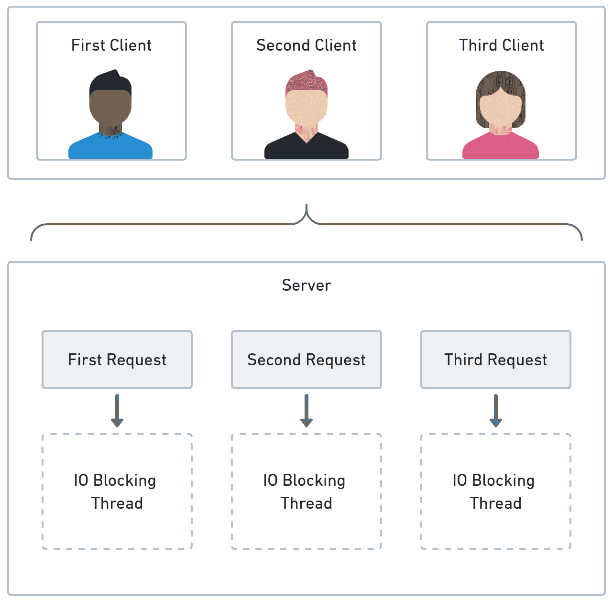
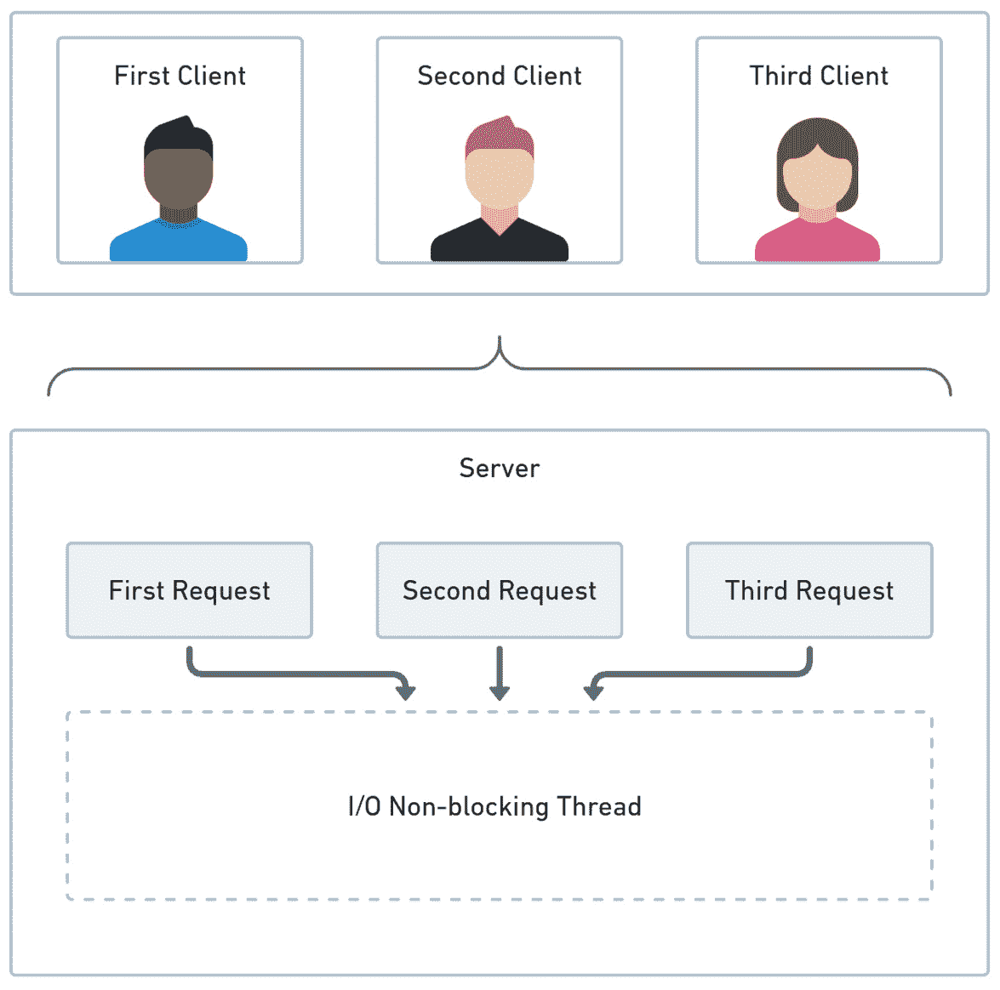
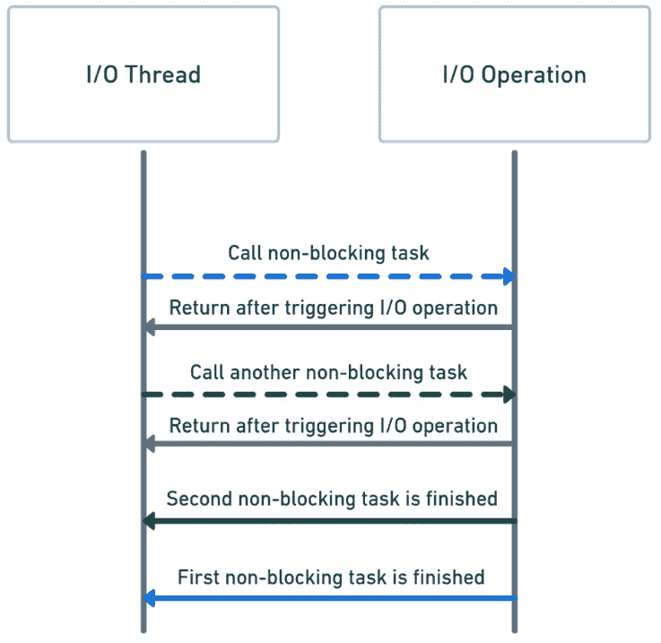
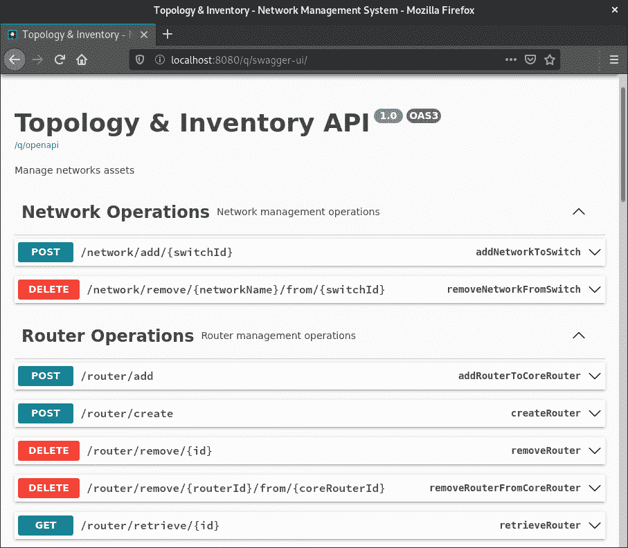

# 第十二章：使用 RESTEasy Reactive 实现输入适配器

**输入适配器**就像一扇前门，它展示了六角系统提供的所有功能。每当用户或其他应用程序想要与六角系统通信时，它们都会接触到可用的输入适配器之一。通过这样的适配器，我们可以在六角系统中提供不同的方式来访问相同的功能。如果客户端不支持 HTTP 通信，我们可以使用不同的协议实现适配器。这里的显著优势是，移除或添加新的适配器不会影响域逻辑。

由于六角架构的解耦和良好封装特性，我们可以在不改变系统域逻辑的情况下更改技术。

在本章中，我们将继续探索 Quarkus 的激动人心特性。与实现输入适配器非常契合的一个特性是**RESTEasy Reactive JAX-RS 实现**，它是 Quarkus 框架的一部分。RESTEasy Reactive 提出了一种异步和事件驱动的 HTTP 端点暴露方式。因此，我们将学习如何将这种反应能力与六角系统的输入适配器集成。

本章我们将涵盖以下主题：

+   探索处理服务器请求的方法

+   使用 RESTEasy Reactive 实现输入适配器

+   添加 OpenAPI 和 Swagger UI

+   测试反应式输入适配器

到本章结束时，你将了解如何实现和测试具有反应行为的输入适配器。你还将了解如何使用 OpenAPI 和 Swagger UI 发布这些输入适配器的 API。

# 技术要求

要编译和运行本章中展示的代码示例，你需要在计算机上安装最新的**Java SE 开发工具包**和**Maven 3.8**。它们适用于 Linux、Mac 和 Windows 操作系统。

你可以在 GitHub 上找到本章的代码文件，地址为[`github.com/PacktPublishing/-Designing-Hexagonal-Architecture-with-Java---Second-Edition/tree/main/Chapter12`](https://github.com/PacktPublishing/-Designing-Hexagonal-Architecture-with-Java---Second-Edition/tree/main/Chapter12)。

# 探索处理服务器请求的方法

在客户端-服务器通信中，我们有一个流程，其中客户端发送请求，服务器接收它并开始工作。一旦服务器完成工作，它就会向客户端发送一个结果。从客户端的角度来看，这个流程不会改变。它始终是发送请求和接收响应。不过，可以改变的是服务器如何内部处理请求。

处理服务器请求处理有两种方法：**反应式**和**命令式**。那么，让我们看看服务器如何以命令式处理请求。

## 命令式

在运行于**Tomcat**的传统 Web 应用程序中，服务器接收到的每个请求都会在所谓的**线程池**上触发创建一个工作线程。在 Tomcat 中，线程池是一种控制服务应用程序请求的工作线程的生命周期和可用性的机制。因此，当你发起一个服务器请求时，Tomcat 会从线程池中拉取一个专用线程来服务你的请求。这个工作线程依赖于阻塞 I/O 来访问数据库和其他系统。以下图表说明了命令式方法的工作原理：



图 12.1 – 命令式方法

如前图所示，**服务器**需要为每个请求创建一个新的 I/O 阻塞工作线程。

一旦创建并分配一个工作线程来服务一个请求，它就会在请求得到满足之前被阻塞。服务器有有限数量的线程。如果你有很多长时间运行的请求，并且在服务器完成它们之前继续发送这样的请求，服务器将耗尽线程，这会导致系统故障。

线程创建和管理也是昂贵的。服务器在创建和切换线程以服务客户端请求时消耗了宝贵的资源。

因此，命令式方法的底线是，工作线程一次只被阻塞来服务一个——并且只有一个——请求。为了并发服务更多的请求，你需要提供更多的工人线程。此外，命令式方法影响了代码的编写方式。命令式代码相对更容易理解，因为事物是按顺序处理的。

现在，让我们看看反应式方法与命令式方法是如何对比的。

## 反应式

如你所想，反应式方法背后的理念是，你不需要阻塞一个线程来满足请求。相反，系统可以使用相同的线程同时处理不同的请求。在命令式方法中，我们有只处理一个请求的工作线程，而在反应式方法中，我们有 I/O 非阻塞线程可以并发处理多个请求。在这里，我们可以看到反应式方法是如何工作的：



图 12.2 – 反应式方法

如前图所示，一个非阻塞线程可以处理多个请求。

在响应式方法中，我们有持续性的感觉。与命令式方法的顺序性不同，在响应式方法中，我们可以看到事物具有连续性。通过持续性，我们指的是每当一个响应式服务器接收到一个请求时，这样的请求会被作为一个带有持续性的 I/O 操作分发。这个持续性就像一个回调，一旦服务器返回响应，就会被触发并继续执行请求。如果这个请求需要获取数据库或任何远程系统，服务器在等待响应时不会阻塞 I/O 线程。相反，I/O 线程将触发一个带有持续性的 I/O 操作，并释放 I/O 线程以接受其他请求。

以下图示说明了 I/O 线程如何触发 I/O 操作：



图 12.3 – I/O 线程流程

如我们所见，I/O 线程调用一个非阻塞任务，该任务触发一个 I/O 操作并立即返回。这是因为 I/O 线程不需要等待第一个 I/O 操作完成就可以调用第二个操作。当第一个 I/O 操作仍在执行时，同一个 I/O 线程会调用另一个非阻塞任务。一旦 I/O 操作完成，I/O 线程通过完成非阻塞任务来继续执行。

通过避免在命令式方法中浪费任何时间和资源，响应式方法使得线程在等待 I/O 操作完成时得到优化利用。

接下来，我们将学习如何使用 Quarkus 提供的 RESTEasy Reactive JAX-RS 实现来实施响应式输入适配器。

# 使用 RESTEasy Reactive 实现输入适配器

**RESTEasy Reactive**是一个支持命令式和响应式 HTTP 端点的 JAX-RS 实现。这种实现与**Vert.x**集成，Vert.x 是一个我们可以用来构建分布式响应式系统的工具包。RESTEasy Reactive 和 Vert.x 在 Quarkus 中协同工作，以提供响应式功能。

要理解一个响应式端点是什么样的，我们将把 RESTEasy Reactive 与拓扑和库存系统的输入适配器集成。

让我们先配置所需的 Maven 依赖项：

```java
<dependencies>
  <dependency>
    <groupId>io.quarkus</groupId>
    <artifactId>quarkus-resteasy-reactive</artifactId>
  </dependency>
  <dependency>
    <groupId>io.quarkus</groupId>
    <artifactId>quarkus-resteasy-reactive-
      jackson</artifactId>
  </dependency>
</dependencies>
```

使用`quarkus-resteasy-reactive`，我们引入了响应式库，包括响应式 RESTEasy 和`Mutiny`库，我们将使用这些库以响应式的方式编写代码。我们将使用`quarkus-resteasy-reactive-jackson`来处理涉及响应式响应的反序列化任务。

一旦我们配置了依赖项，我们就可以开始实现拓扑和库存系统中的路由管理响应式输入适配器。

## 实现用于路由管理的响应式输入适配器

我们将在我们创建的现有输入适配器上工作，这些适配器在 *第八章*，*构建框架六边形* 中创建。我们将更改这些输入适配器以启用 JAX-RS 和响应式功能。我们将执行以下步骤来完成此操作：

1.  让我们从在 `RouterManagementAdapter` 类上定义与路由管理相关的请求的最高级路径开始：

    ```java
    @ApplicationScoped
    @Path("/router")
    public class RouterManagementAdapter {
        @Inject
        RouterManagementUseCase routerManagementUseCase;
        /** Code omitted **/
    }
    ```

    我们使用 `@Path` 注解将 URL 路径映射到系统中的资源。我们可以在类或方法上使用此注解。

    这个类的唯一字段是 `RouterManagementUseCase`，它使用 `@Inject` 注解注入。通过利用这个用例引用，我们可以访问与路由管理相关的系统功能。

1.  接下来，让我们定义一个响应式端点来检索一个路由：

    ```java
    @GET
    @Path("/{id}")
    public Uni<Response> retrieveRouter(Id id) {
        return Uni.createFrom()
                .item(
                   routerManagementUseCase.
                   retrieveRouter(id))
                .onItem()
                .transform(
                 router -> router != null ?
                 Response.ok(f) :
                 Response.ok(null))
                .onItem()
                .transform(Response.Response
                    Builder::build);
    ```

    `@GET` 注解表示只允许 `HTTP GET` 请求。方法级别的 `@Path("/{id}")` 注解与类级别的 `@Path("/router")` 注解连接。因此，要到达这个 `retrieveRouter` 方法，我们必须向 `/router/{id}` 发送请求。

    此外，请注意 `@PathParam("id")` 注解，我们使用它来从 URL 中捕获一个参数。

    使这个端点成为响应式的是它的 `Uni<Response>` 响应类型。`Uni` 是 `Mutiny` 库提供的两种类型之一。除了 `Uni`，还有一个 `Multi` 类型。

    我们使用 `Uni` 和 `Multi` 类型来表示我们正在处理的数据类型。例如，如果你的响应只返回一个项目，你应该使用 `Uni`。否则，如果你的响应类似于来自消息服务器的数据流，那么 `Multi` 可能更适合你的目的。

    通过调用 `Uni.createFrom().item(routerManagementUseCase.retrieveRouter(id))`，我们创建了一个执行 `routerManagementUseCase.retrieveRouter(id)` 的管道。结果被捕获在 `transform(f -> f != null ? Response.ok(f) : Response.ok(null))` 上。如果请求成功，我们得到 `Response.ok(f)`；否则，我们得到 `Response.ok(null)`。最后，我们调用 `transform(Response.ResponseBuilder::build)` 将结果转换为 `Uni<Response>` 对象。

    `Response.ResponseBuilder::build` 是一个方法引用，可以写成以下 lambda 表达式：（`Response.ResponseBuilder responseBuilder) -> responseBuilder.build()`）。`responseBuilder` 代表我们接收的对象参数，然后调用 `build` 方法来创建一个新的 `Response` 对象。我们倾向于使用方法引用方法，因为我们用更少的代码完成同样的事情。

    我们即将实现的其余端点都遵循之前描述的类似方法。

1.  在实现检索路由的端点之后，我们可以实现从系统中删除路由的端点：

    ```java
    @DELETE
    @Path("/{id}")
    public Uni<Response> removeRouter(@PathParam("id") Id
      id) {
        return Uni.createFrom()
                .item(
                 routerManagementUseCase.removeRouter(id))
                .onItem()
                .transform(
                 router -> router != null ?
                 Response.ok(router) :
                 Response.ok(null))
                .onItem()
                .transform(Response.Response
                  Builder::build);
    }
    ```

    `@DELETE`注解对应于`HTTP DELETE`方法。同样，我们正在在`@Path("/{id}")`注解上定义一个`Path`参数。方法体中有一个`Uni`管道，它执行`routerManagementUseCase.removeRouter(id)`并返回`Uni<Response>`。

1.  让我们实现创建新路由器的端点：

    ```java
    @POST
    @Path("/")
    public Uni<Response> createRouter(CreateRouter cre
      ateRouter) {
        /** Code omitted **/
        return Uni.createFrom()
                .item(
                   routerManagementUseCase.
                   persistRouter(router))
                .onItem()
                .transform(
                 router -> router != null ?
                 Response.ok(f) :
                 Response.ok(null))
                .onItem()
                .transform(Response.Response
                   Builder::build);
    }
    ```

    我们使用`@POST`注解，因为我们正在创建一个新的资源。在方法级别上，`@Path("/")`注解与类级别上的`@Path("/router")`注解连接，生成`/router/`路径。我们在方法体中有响应式代码来处理请求并返回`Uni<Response>`。

1.  接下来，我们将实现一个端点，以便可以将路由器添加到核心路由器：

    ```java
    @POST
    @Path("/add")
    public Uni<Response> addRouterToCoreRouter(AddRouter
      addRouter) {
        /** Code omitted **/
        return Uni.createFrom()
                .item(routerManagementUseCase.
                        addRouterToCoreRouter(router,
                          coreRouter))
                .onItem()
                .transform(
                 router -> router != null ?
                 Response.ok(router) :
                 Response.ok(null))
                .onItem()
                .transform(Response.Response
                   Builder::build);
    }
    ```

    同样，我们在这里使用`@POST`注解。在方法级别上，`@Path("/add")`注解与类级别上的`@Path("/router")`注解连接，生成`/router/add`路径。响应式代码创建了一个管道来执行`routerManagementUseCase.addRouterToCoreRouter(router, coreRouter)`并返回`Uni<Response>`。

1.  最后，我们必须实现一个端点来从核心路由器中移除一个路由器：

    ```java
    @DELETE
    @Path("/{routerId}/from/{coreRouterId}")
    public Uni<Response> removeRouterFromCoreRouter(
        /** Code omitted **/
        return Uni.createFrom()
                .item(routerManagementUseCase.
                        removeRouterFromCoreRouter(
                        router, coreRouter))
                .onItem()
                .transform(
                 router -> router != null ?
                      Response.ok(f) :
                      Response.ok(null))
                .onItem()
                .transform(Response.Response
                   Builder::build);
    }
    ```

    在这里，我们使用`@DELETE`注解来处理`HTTP DELETE`请求。在`@Path`注解中，我们有两个路径参数 - `routerId`和`coreRouterId`。当我们通过`Uni`提供的管道调用`routerManagementUseCase.removeRouterFromCoreRouter(router, coreRouter)`时，我们使用这两个参数来获取`Router`和`CoreRouter`对象。

如我们所见，当使用 Quarkus 时，从命令式转换为响应式实现 REST 端点并不需要太多工作。大部分工作都是在框架及其库的幕后完成的。

现在，让我们继续前进并实现用于开关管理的响应式输入适配器。

## 实现用于开关管理的响应式输入适配器

按照与上一节中类似的方法，我们可以通过执行以下步骤来实现用于开关管理的响应式输入适配器：

1.  我们将首先在`SwitchManagementAdapter`类上启用 JAX-RS：

    ```java
    @ApplicationScoped
    @Path("/switch")
    public class SwitchManagementAdapter {
        @Inject
        SwitchManagementUseCase switchManagementUseCase;
        @Inject
        RouterManagementUseCase routerManagementUseCase;
        /** Code omitted **/
    }
    ```

    这个类被注解为`@Path("/switch")`，因此所有与开关管理相关的请求都将被导向它。随后，我们注入了`SwitchManagementUseCase`和`RouterManagementUseCase`以在应用程序六边形上执行操作。

1.  为了在拓扑和库存系统中启用开关检索，我们需要在`retrieveSwitch`方法上实现响应式行为：

    ```java
    @GET
    @Path("/{id}")
    public Uni<Response> retrieveSwitch(@PathParam("id")
      Id switchId) {
        return Uni.createFrom()
                .item(
                 switchManagementUseCase.
                 retrieveSwitch(switchId))
                .onItem()
                .transform(
                 aSwitch -> aSwitch != null ?
                 Response.ok(aSwitch) :
                 Response.ok(null))
                .onItem()
                .transform(Response.Response
                   Builder::build);
    }
    ```

    通过添加`@GET`和`@Path`注解，我们激活了`retrieveSwitch`方法的 JAX-RS。我们将`switchManagementUseCase.retrieveSwitch(switchId)`放置在返回`Uni<Response>`的`Mutiny`管道中执行。

    对`item`的调用立即返回。它触发了由`retrieveSwitch`方法执行的操作，并允许线程继续服务其他请求。结果是在我们调用`onItem`时获得的，它代表了当我们调用`item`时触发的操作继续。

1.  接下来，我们必须向`createAndAddSwitchToEdgeRouter`方法添加响应式行为：

    ```java
    @POST
    @Path("/create/{edgeRouterId}")
    public Uni<Response> createAndAddSwitchToEdgeRouter(
                CreateSwitch createSwitch,
                @PathParam("edgeRouterId") Id
                  edgeRouterId){
        /** Code omitted **/
        return Uni.createFrom()
                .item((EdgeRouter)
                  routerManagementUseCase.
                  persistRouter(router))
                .onItem()
                .transform(
                 router -> router != null ?
                 Response.ok(f) :
                 Response.ok(null))
                .onItem()
                .transform(Response.Response
                  Builder::build);
    }
    ```

    前面的方法处理了创建开关对象并将其添加到边缘路由器的`HTTP POST`请求。在这里，我们调用`routerManagementUseCase.persistRouter(router)`方法，该方法被封装在一个`Mutiny`管道中，以返回`Uni<Response>`。

1.  最后，我们必须定义一个响应式端点来从一个边缘路由器中移除一个开关：

    ```java
    @DELETE
    @Path("/{switchId}/from/{edgeRouterId}")
    public Uni<Response> removeSwitchFromEdgeRouter(
            @PathParam("switchId") Id switchId,
            @PathParam("edgeRouterId") Id
              edgeRouterId) {
        /** Code omitted **/
        return Uni.createFrom()
                .item(
                 (EdgeRouter)routerManagementUseCase.
                  persistRouter(router))
                .onItem()
                .transform(
                 router -> router != null ?
                 Response.ok(f) :
                 Response.ok(null))
                .onItem()
                .transform(Response.Response
                  Builder::build);
    }
    ```

正如我们在之前的移除操作中所做的那样，我们从核心路由器中移除了一个路由器，我们使用`@DELETE`注解来使`removeSwitchFromEdgeRouter`方法只接受`HTTP DELETE`请求。我们传递`Path`参数`switchId`和`edgeRouterId`，以获取操作所需的开关和边缘路由器对象。

在定义了`retrieveSwitch`、`createAndAddSwitchToEdgeRouter`和`removeSwitchFromEdgeRouter`的响应式端点之后，我们可以开始实现网络管理的响应式输入适配器。

## 实现网络管理的响应式输入适配器

如你所想，`network`响应式输入适配器遵循与路由器和开关响应式适配器相同的标准。在以下步骤中，我们将为与网络管理相关的端点启用响应式行为：

1.  让我们从启用`NetworkManagementAdapter`输入适配器的 JAX-RS 开始：

    ```java
    @ApplicationScoped
    @Path("/network")
    public class NetworkManagementAdapter {
        @Inject
        SwitchManagementUseCase switchManagementUseCase;
        @Inject
        NetworkManagementUseCase networkManagementUseCase;
        /** Code omitted **/
    }
    ```

    在这个阶段，你可能已经熟悉了类级别的`@Path`注解。我们注入`SwitchManagementUseCase`和`NetworkManagementUseCase`用例，以协助执行此输入适配器所执行的操作。

1.  接下来，我们必须定义一个响应式端点，以便可以将网络添加到开关中：

    ```java
    @POST
    @Path("/add/{switchId}")
    public Uni<Response> addNetworkToSwitch(AddNetwork
      addNetwork, @PathParam("switchId") Id switchId) {
        /** Code omitted **/
        return Uni.createFrom()
                .item(
                  networkManagementUseCase.
                   addNetworkToSwitch(
                   network, networkSwitch))
                .onItem()
                .transform(
                  f -> f != null ?
                  Response.ok(f) :
                  Response.ok(null))
                .onItem()
                .transform(Response.Response
                   Builder::build);
    }
    ```

    我们在这里应用的想法与之前的应用相同。在`addNetworkToSwitch`方法内部，我们添加了一些将使用`Mutiny`管道调用`networkManagementUseCase.addNetworkToSwitch(network, networkSwitch)`并返回`Uni<Response>`的响应式代码。

1.  最后，我们必须定义一个响应式端点来从一个开关中移除一个网络：

    ```java
    @DELETE
    @Path("/{networkName}/from/{switchId}")
    public Uni<Response> removeNetworkFromSwitch(@Path
      Param("networkName") String networkName, @Path
        Param("switchId") Id         switchId) {
        /** Code omitted **/
        return Uni.createFrom()
                .item(
                 networkManagementUseCase.
                 removeNetworkFromSwitch(
                 networkName, networkSwitch))
                .onItem()
                .transform(
                  f -> f != null ?
                  Response.ok(f) :
                  Response.ok(null))
                .onItem()
                .transform(Response.Response
                  Builder::build);
    }
    ```

    在这里，我们使用`@DELETE`注解和两个路径参数`networkName`和`switchId`来从一个开关中移除一个网络。在`Mutiny`管道内部，我们调用`networkManagementUseCase.removeNetworkFromSwitch(networkName, networkSwitch)`。管道结果是`Uni<Response>`。

通过这样，我们已经完成了网络管理响应式输入适配器的实现。现在，`RouterManagementAdapter`、`SwitchManagementAdapter`和`NetworkManagementAdapter`输入适配器已准备好以响应式方式处理 HTTP 请求。

这三个输入适配器和它们的端点构成了六边形系统 API。

在本节中，我们不仅学习了如何创建普通的 REST 端点，而且还通过使用 RESTEasy Reactive 在输入适配器的端点上启用响应式行为而更进一步。这是利用响应式方法优势的基本步骤。采用响应式方法后，我们不再需要依赖于 I/O 阻塞线程，这些线程可能比 I/O 非阻塞线程消耗更多的计算资源。I/O 阻塞线程需要等待 I/O 操作完成。I/O 非阻塞线程更高效，因为同一个线程可以同时处理多个 I/O 操作。

下一节将介绍如何使用 OpenAPI 和 Swagger UI 发布系统 API。

# 添加 OpenAPI 和 Swagger UI

理解和与第三方系统交互有时是一项非同寻常的任务。在最佳情况下，我们可能拥有系统文档、一个有组织的代码库和一组 API，这些 API 共同帮助我们了解系统的作用。在最坏的情况下，我们可能没有这些。这种具有挑战性的情况需要勇气、耐心和毅力，去尝试理解一个错综复杂的代码库。

OpenAPI 代表了提高我们表达和理解系统作用能力的一项值得尊敬的努力。最初基于 Swagger 规范，OpenAPI 规范标准化了 API 的文档和描述方式，以便任何人都可以不费吹灰之力地掌握系统提供的功能。

我们在上一节中实现了构成我们六边形系统 API 的响应式输入适配器。为了使这个系统对其他人或系统更易于理解，我们将使用 OpenAPI 来描述输入适配器及其端点提供的功能。此外，我们还将启用**Swagger UI**，这是一个展示系统 API 清晰和组织视图的 Web 应用程序。

Quarkus 自带对**OpenAPI v3**规范的支持。要启用它，我们需要以下 Maven 依赖项：

```java
<dependencies>
  <dependency>
      <groupId>io.quarkus</groupId>
      <artifactId>quarkus-smallrye-openapi</artifactId>
  </dependency>
</dependencies>
```

`quarkus-smallrye-openapi`依赖项提供了包含我们可以用来描述输入适配器类上响应式端点方法的 OpenAPI 注解的库。此依赖项还允许我们配置 Swagger UI。

记住，我们配置了四个 Java 模块：`domain`、`application`、`framework`和`bootstrap`。为了激活和配置 Swagger UI，我们需要在`bootstrap`模块内部创建`resource/application.properties`文件。以下是配置此文件的方法：

```java
quarkus.swagger-ui.always-include=true
quarkus.swagger-ui.urls-primary-name=Topology & Inventory
quarkus.swagger-ui.theme=material
quarkus.swagger-ui.title=Topology & Inventory - Network
  Management System
quarkus.swagger-ui.footer=&#169; 2021 | Davi Vieira
quarkus.swagger-ui.display-operation-id=true
mp.openapi.extensions.smallrye.info.title=Topology & Inven
  tory API
mp.openapi.extensions.smallrye.info.version=1.0
mp.openapi.extensions.smallrye.info.description=Manage net
  works assets
```

我们将`quarkus.swagger-ui.always-include`设置为`true`，以确保当应用程序使用`prod`（生产）配置文件启动时，Swagger UI 也将可用——这是 Quarkus 内置配置文件之一。通过`quarkus.swagger-ui.theme`，我们可以配置界面主题。我们将使用剩余的属性来提供 API 的高级描述。

让我们学习如何使用 OpenAPI 注解来暴露和描述六边形系统的端点。看看以下来自`RouterManagementAdapter`类的示例：

```java
@ApplicationScoped
@Path("/router")
@Tag(name = "Router Operations", description = "Router man
  agement operations")
public class RouterManagementAdapter {
    @GET
    @Path("/retrieve/{id}")
    @Operation(operationId = "retrieveRouter",
    description = "Retrieve a router from the network
      inventory")
    public Uni<Response> retrieveRouter(@PathParam("id")
      Id id) {
     /** Code omitted **/
}
```

在类级别使用的`@Tag`注解使我们能够定义应用于`RouterManagementAdapter`类中定义的所有端点的元数据信息。这意味着方法端点，如`RouterManagementAdapter`类中的`retrieveRouter`方法，将继承该类级别的`@Tag`注解。

我们使用`@Operation`注解来提供操作的详细信息。在上面的代码中，我们描述了在`/retrieve/{id}`路径上执行的操作。这里我们有`operationId`参数，它用于唯一标识端点，以及`description`参数，它用于提供有意义的操作描述。

为了使 Quarkus 和 Swagger UI 显示我们六边形系统 API 的华丽 UI，我们只需将这些 OpenAPI 注解添加到我们想要在 Swagger UI 上公开的类和方法（正确配置了 JAX-RS）中。

您可以使用本书 GitHub 仓库中的代码编译和运行应用程序。确保在`chapter12`目录中执行以下命令：

```java
$ mvn clean package
$ java -jar bootstrap/target/bootstrap-1.0-SNAPSHOT-runner.jar
```

这将在您的浏览器上打开以下 URL：

```java
http://localhost:8080/q/swagger-ui/
```

此外，您将看到类似于以下截图的内容：



图 12.4 – 来自拓扑和库存系统的 Swagger UI

在前面的截图中，操作被分组到我们为每个输入适配器类插入的`@Tag`注解中。每个端点都继承了自己的`@Tag`元数据信息。

到目前为止，我们已经正确配置了我们的六边形系统，其中包含用 OpenAPI 和 Swagger UI 良好记录的反应式端点。现在，让我们学习如何测试这些端点以确保它们按预期工作。

# 测试反应式输入适配器

我们的测试工作从领域六边形开始，通过单元测试核心系统组件。然后，我们转向应用六边形，在那里我们可以使用**行为驱动设计**技术测试用例。现在，我们在框架六边形上实现了反应式 REST 端点，我们需要找到一种方法来测试它们。

幸运的是，Quarkus 在端点测试方面装备齐全。要开始，我们需要以下依赖项：

```java
<dependencies>
  <dependency>
    <groupId>io.rest-assured</groupId>
    <artifactId>rest-assured</artifactId>
    <scope>test</scope>
  </dependency>
</dependencies>
```

`rest-assured`依赖项使我们能够测试 HTTP 端点。它提供了一个直观的库，对于进行请求和从 HTTP 调用中提取响应非常有用。

为了了解它是如何工作的，让我们为`/router/retrieve/{routerId}`端点实现一个测试：

```java
@Test
@Order(1)
public void retrieveRouter() throws IOException {
    var expectedRouterId =
      "b832ef4f-f894-4194-8feb-a99c2cd4be0c";
    var routerStr = given()
            .contentType("application/json")
            .pathParam("routerId", expectedRouterId)
            .when()
            .get("/router/retrieve/{routerId}")
            .then()
            .statusCode(200)
            .extract()
            .asString();
    var actualRouterId =
    getRouterDeserialized(routerStr).getId().getUuid()
      .toString();
    assertEquals(expectedRouterId, actualRouterId);
}
```

为了创建一个请求，我们可以使用静态的`io.restassured.RestAssured.given`方法。我们可以使用`given`方法指定请求的内容类型、参数、HTTP 方法和正文。发送请求后，我们可以使用`statusCode`检查其状态。为了获取响应，我们调用`extract`。在下面的示例中，我们以字符串的形式获取响应。这是因为反应式端点的返回类型是`Uni<Response>`。因此，结果是 JSON 字符串。

在运行断言之前，我们需要将 JSON 字符串反序列化为`Router`对象。反序列化工作由`getRouterDeserialized`方法完成：

```java
public static Router getRouterDeserialized(String jsonStr)
  throws IOException {
    var mapper = new ObjectMapper();
    var module = new SimpleModule();
    module.addDeserializer(Router.class, new
      RouterDeserializer());
    mapper.registerModule(module);
    var router = mapper.readValue(jsonStr, Router.class);
    return router;
}
```

此方法接收一个 JSON 字符串作为参数。当我们调用`mapper.readValue(jsonStr, Router.class)`时，这个 JSON 字符串会被传递给一个`ObjectMapper`映射器。除了提供映射器外，我们还需要扩展并实现`com.fasterxml.jackson.databind.deser.std.StdDeserializer`类中的`deserialize`方法。在先前的示例中，这个实现由`RouterDeserializer`提供。这个反序列化器将 JSON 字符串转换为`Router`对象，如下面的代码所示：

```java
public class RouterDeserializer extends StdDeserial
  izer<Router> {
    /** Code omitted **/
    @Override
    public Router deserialize(JsonParser jsonParser,
    DeserializationContext ctxt)
            throws IOException {
        JsonNode node =
        jsonParser.getCodec().readTree(jsonParser);
        var id = node.get("id").get("uuid").asText();
        var vendor = node.get("vendor").asText();
        var model = node.get("model").asText();
        var ip = node.get("ip").get("ipAddress").asText();
        var location = node.get("location");
        var routerType = RouterType.valueOf(
          node.get("routerType").asText());
        var routersNode = node.get("routers");
        var switchesNode = node.get("switches");
        /** Code omitted **/
}
```

`deserialize`方法的目的是将每个相关的 JSON 属性映射到领域类型。我们通过从`JsonNode`对象中检索我们想要的值来完成这个映射。在映射我们想要的值之后，我们可以创建一个`router`对象，如下面的代码所示：

```java
var router = RouterFactory.getRouter(
        Id.withId(id),
        Vendor.valueOf(vendor),
        Model.valueOf(model),
        IP.fromAddress(ip),
        getLocation(location),
        routerType);
```

一旦所有值都被检索，我们调用`RouterFactory.getRouter`来生成一个`Router`对象。因为一个路由器可能有子路由器和开关，所以我们调用`fetchChildRouters`和`fetchChildSwitches`，以便它们也有`StdDeserializer`实现：

```java
fetchChildRouters(routerType, routersNode, router);
fetchChildSwitches(routerType, switchesNode, router);
```

我们调用`fetchChildRouters`和`fetchChildSwitches`方法，因为一个路由器可能有子路由器和开关需要反序列化。这些方法将执行所需的反序列化。

在反序列化 JSON 字符串响应之后，我们可以在`Router`对象上运行断言：

```java
var actualRouterId = getRouterDeserialized(router
  Str).getId().getUuid().toString();
assertEquals(expectedRouterId, actualRouterId);
```

为了测试`/router/retrieve/{routerId}`端点，我们正在检查通过反应式端点检索的路由器的 ID 是否与我们请求中传递的 ID 相等。

您可以通过在`Chapter12`目录内执行以下命令来运行此测试和其他本书 GitHub 仓库中可用的测试：

```java
$ mvn test
```

上述代码的输出将类似于以下内容：

```java
[INFO] -------------------------------------------------------
[INFO]  T E S T S
[INFO] -------------------------------------------------------
[INFO] Running dev.davivieira.topologyinventory.framework.adapters.input.rest.NetworkManagementAdapterTest
2021-09-29 00:47:36,825 INFO  [io.quarkus] (main) Quarkus 2.2.1.Final on JVM started in 2.550s. Listening on: http://localhost:8081
2021-09-29 00:47:36,827 INFO  [io.quarkus] (main) Profile test activated.
2021-09-29 00:47:36,827 INFO  [io.quarkus] (main) Installed features: [cdi, resteasy-reactive, resteasy-reactive-jackson, smallrye-context-propagation, smallrye-openapi, swagger-ui]
[EL Info]: 2021-09-29 00:47:38.812--ServerSession(751658062)--EclipseLink, version: Eclipse Persistence Services - 3.0.1.v202104070723
[INFO] Tests run: 2, Failures: 0, Errors: 0, Skipped: 0, Time elapsed: 5.418 s - in dev.davivieira.topologyinventory.framework.adapters.input.rest.NetworkManagementAdapterTest
[INFO] Running dev.davivieira.topologyinventory.framework.adapters.input.rest.RouterManagementAdapterTest
[INFO] Tests run: 5, Failures: 0, Errors: 0, Skipped: 0, Time elapsed: 0.226 s - in dev.davivieira.topologyinventory.framework.adapters.input.rest.RouterManagementAdapterTest
[INFO] Running dev.davivieira.topologyinventory.framework.adapters.input.rest.SwitchManagementAdapterTest
[INFO] Tests run: 3, Failures: 0, Errors: 0, Skipped: 0, Time elapsed: 0.085 s - in dev.davivieira.topologyinventory.framework.adapters.input.rest.SwitchManagementAdapterTest
2021-09-29 00:47:39,675 INFO  [io.quarkus] (main) Quarkus stopped in 0.032s
```

上述输出描述了针对`RouterManagementAdapter`、`SwitchManagementAdapter`和`NetworkManagementAdapter`输入适配器的反应式端点测试的执行。

执行这些端点测试的一个好处是，我们不仅测试了框架六边形上的端点功能，而且还进行了全面的测试，检查了系统所有六边形的行怍。

# 摘要

在本章中，我们有幸深入了解更多 Quarkus 功能，特别是 RESTEasy Reactive。我们首先回顾了在客户端-服务器通信的上下文中，命令式和响应式分别意味着什么。

然后，我们了解到 Quarkus 提供了 RESTEasy Reactive 作为其 JAX-RS 实现，使我们能够在输入适配器上实现响应式端点。之后，我们使用 OpenAPI 和 Swagger UI 暴露了六边形系统的 API。为了确保我们正确实现了响应式端点，我们使用 `rest-assured` 库编写了端点测试。

在下一章中，我们将继续探索 Quarkus 提供的响应式功能，并强调使用 Hibernate Reactive 的数据持久性方面。

# 问题

1.  命令式请求和响应式请求之间的区别是什么？

1.  Quarkus 提供的 JAX-RS 实现的名称是什么？

1.  OpenAPI 的目的是什么？

1.  在 Quarkus 中，我们应该使用哪个库来测试 HTTP 端点？

# 答案

1.  命令式只能通过一个 I/O 阻塞工作线程一次处理一个请求。响应式可以通过 I/O 非阻塞线程处理多个请求。

1.  RESTEasy Reactive。

1.  它用于标准化描述和记录 API 的方式。

1.  我们应该使用 `rest-assured` 库。
