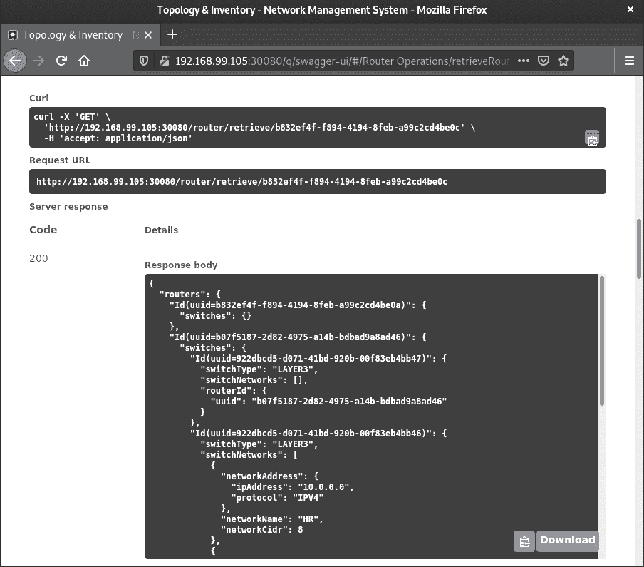

# 第十四章：设置 Dockerfile 和 Kubernetes 对象以进行云部署

我们在之前的章节中探讨了 Quarkus 提供的一些令人惊叹的功能，以帮助我们创建云原生应用程序。更进一步，我们还学习了如何将 Quarkus 集成到六边形系统中。

现在，我们需要准备六边形系统，以便它可以在云环境中部署。Docker 和 Kubernetes 是目前主导云场景的领先技术。如果您的应用程序已准备好在这些技术上运行，那么您可以在大多数云提供商上安全地运行它。

因此，在本章中，我们将学习如何将六边形系统封装在 Docker 镜像中，并在 Kubernetes 集群上运行它。对于 Docker 镜像，我们将探讨创建此类镜像的两种技术：一种依赖于可执行的 `.jar` 文件，另一种使用原生可执行文件。我们还将学习如何在基于本地**minikube**的 Kubernetes 集群中部署六边形系统。

本章将涵盖以下主题：

+   准备 Docker 镜像

+   创建 Kubernetes 对象

+   在 minikube 上部署

到本章结束时，您将了解如何使六边形系统在基于 Docker 和 Kubernetes 的云原生环境中运行。如今，大多数现代应用程序都在云端运行。通过将六边形系统转变为云原生系统，您将能够利用在云端存在的优势。

# 技术要求

要编译和运行本章中展示的代码示例，您需要在您的计算机上安装最新的**Java SE 开发工具包**和**Maven 3.8**。它们适用于 Linux、macOS 和 Windows 操作系统。

您还需要在您的机器上安装**Docker**和**minikube**。

您可以在 GitHub 上找到本章的代码文件，链接为 [`github.com/PacktPublishing/-Designing-Hexagonal-Architecture-with-Java---Second-Edition/tree/main/Chapter14`](https://github.com/PacktPublishing/-Designing-Hexagonal-Architecture-with-Java---Second-Edition/tree/main/Chapter14)。

# 准备 Docker 镜像

基于容器的虚拟化技术并非新事物。在 Docker 之前，就有像 OpenVZ 这样的技术，它们应用了 Docker 所应用的基本概念。即使今天，我们也有像**Linux 容器**（**LXC**）这样的替代方案，它提供了一个强大的基于容器的解决方案。Docker 的独特之处在于它使处理容器化应用程序变得非常简单直观。Docker 将可移植性提升到了另一个层次，简化了容器技术，使其对更广泛的受众成为可行的技术。

在过去，其他容器平台不像今天的 Docker 那样易于使用。容器是一个更多与系统管理员相关的话题，而不是与软件开发者相关。今天，由于我们拥有的简单而强大的基于容器的解决方案，情况已经不同。由于其简单性，Docker 迅速在开发者中流行起来，他们开始将其纳入他们的项目中。

如我之前所述，Docker 的优势在于其使用和学习简单。以 Docker 如何抽象化将应用程序包裹在容器内所需的复杂性为例。你只需要定义一个 Dockerfile，描述应用程序应在容器内如何配置和执行。你可以通过使用一组简单的指令来完成此操作。因此，Docker 保护用户免受先前容器技术中存在的底层复杂性。

使 Quarkus 如此特别的事情之一是它是一个以容器为先的框架。它旨在构建基于容器的应用程序。因此，如果你针对基于容器的环境，Quarkus 是一个极佳的选择。

使用 Quarkus，我们可以使用 `.jar` 艺术品或原生可执行艺术品生成 Docker 镜像。接下来，我们将探讨这两种方法。

## 使用 uber `.jar` 艺术品创建 Docker 镜像

我们的方法是将 uber `.jar` 艺术品包裹在 Docker 镜像中，以便容器可以通过执行该 `.jar` 文件来启动和运行应用程序。要构建 Docker 镜像，我们需要创建一个包含构建此类镜像指令的 Dockerfile。

以下代码显示了如何为使用 uber `.jar` 文件的拓扑和库存系统创建 Dockerfile：

```java
FROM eclipse-temurin:17.0.8_7-jdk-alpine
ENV APP_FILE_RUNNER bootstrap-1.0-SNAPSHOT-runner.jar
ENV APP_HOME /usr/apps
EXPOSE 8080
COPY bootstrap/target/$APP_FILE_RUNNER $APP_HOME/
WORKDIR $APP_HOME
ENTRYPOINT ["sh", "-c"]
CMD ["exec java -jar $APP_FILE_RUNNER"]
```

此 Dockerfile 应放置在项目的根目录中。

第一行是定义艺术品的名称和路径的 `APP_FILE_RUNNER` 和 `APP_HOME` 环境变量。由于 Quarkus 配置为在端口 `8080` 上运行，我们必须使用 `EXPOSE` 属性来外部暴露此端口。`COPY` 命令将复制 Maven 生成的艺术品。`WORKDIR` 定义了命令将在容器内执行的路径。通过 `ENTRYPOINT` 和 `CMD`，我们可以定义容器将如何执行应用程序的 uber `.jar` 文件。

按照以下步骤生成 Docker 镜像并启动容器：

1.  首先，我们需要编译并生成一个 uber `.jar` 文件：

    ```java
    $ mvn clean package
    ```

1.  然后，我们可以生成 Docker 镜像：

    ```java
    $ docker build . -t topology-inventory
    Sending build context to Docker daemon  38.68MB
    Step 1/8 : FROM eclipse-temurin:17.0.8_7-jdk-alpine
     ---> 9b2a4d2e14f6
    Step 2/8 : ENV APP_FILE_RUNNER bootstrap-1.0-SNAPSHOT-runner.jar
     ---> Using cache
     ---> 753b39c99e78
    Step 3/8 : ENV APP_HOME /usr/apps
     ---> Using cache
     ---> 652c7ce2bd47
    Step 4/8 : EXPOSE 8080
     ---> Using cache
     ---> 37c6928bcae4
    Step 5/8 : COPY bootstrap/target/$APP_FILE_RUNNER $APP_HOME/
     ---> Using cache
     ---> 389c28dc9fa7
    Step 6/8 : WORKDIR $APP_HOME
     ---> Using cache
     ---> 4ac09c0fe8cc
    Step 7/8 : ENTRYPOINT ["sh", "-c"]
     ---> Using cache
     ---> 737bbcf2402b
    Step 8/8 : CMD ["exec java -jar $APP_FILE_RUNNER"]
     ---> Using cache
     ---> 3b17c3fa0662
    Successfully built 3b17c3fa0662
    eclipse-temurin:17.0.8_7-jdk-alpine image. Then, it proceeds by defining the environment variables and handling the application artifact by preparing it to be executed every time a new container from that image is created.
    ```

1.  现在，我们可以使用以下命令启动容器：

    ```java
    -p parameter, we’re mapping the 5555 host port to the 8080 container port. So, we’ll need to use the 5555 port to access the system.
    ```

1.  要确认应用程序正在 Docker 容器上运行，我们可以访问 `http://localhost:5555/q/swagger-ui` 的 Swagger UI URL。

现在，让我们学习如何使用原生可执行文件生成 Docker 镜像。

## 使用原生可执行文件创建 Docker 镜像

在 *第十章*，“将 Quarkus 添加到模块化六边形应用程序”，我们了解到 Quarkus 使用 **Ahead-Of-Time** (**AOT**) 编译技术来优化字节码并生成提供改进性能的原生代码，主要在应用程序启动期间。

这个原生可执行文件是 Quarkus 执行的 AOT 编译的结果。与可以在不同操作系统和 CPU 架构上运行的 uber `.jar` 文件不同，原生可执行文件是平台相关的。但我们可以通过将原生可执行文件包装在一个可以分发到不同操作系统和 CPU 架构的 Docker 镜像中来克服这个限制。

生成原生可执行文件有不同的方法。其中一些需要我们安装 **GraalVM** 分发版和其他软件。然而，为了保持简单，我们将遵循一个简单且方便的方法，其中 Quarkus 在包含 GraalVM 的 Docker 容器内为我们生成原生可执行文件。

按照以下步骤生成包含原生可执行文件的 Docker 镜像：

1.  在项目根目录的 `pom.xml` 文件中，我们需要在 `</project>` 标签之前包含以下代码：

    ```java
    <profiles>
      <profile>
        <id>native</id>
        <properties>
          <quarkus.package.type>native
            </quarkus.package.type>
        </properties>
      </profile>
    </profiles>
    ```

    上述配置创建了一个配置文件，将 `quarkus.package.type` 属性设置为 `native`，导致 Quarkus 构建原生可执行文件。

1.  然后，我们必须在 `bootstrap` 六边形上创建 `ReflectionConfiguration` 类：

    ```java
    @RegisterForReflection(targets = {
            CoreRouter.class,
            EdgeRouter.class,
            Switch.class,
            Id.class,
            IP.class,
            Location.class,
            Model.class,
            Network.class,
            Protocol.class,
            RouterType.class,
            SwitchType.class,
            Vendor.class,
    })
    public class ReflectionConfiguration {}
    ```

    原生可执行文件的一个限制是它只提供部分反射支持。我们可以创建一个包含我们想要注册的类的 `.json` 配置文件，或者我们可以创建一个带有 `@RegisterForReflection` 注解的类，包含我们想要注册的类。在上面的代码中，我们使用的是后者，它依赖于注解的类。

1.  要生成原生可执行文件，我们必须运行以下命令：

    ```java
    6g is not enough for you, feel free to increase it to prevent errors.
    ```

1.  接下来，我们必须创建一个名为 `Dockerfile-native` 的文件，其中包含构建包含原生可执行文件的 Docker 镜像的指令：

    ```java
    FROM registry.access.redhat.com/ubi8/ubi-minimal
    ENV APP_FILE_RUNNER bootstrap-1.0-SNAPSHOT-runner
    ENV APP_HOME /work
    EXPOSE 8080
    COPY bootstrap/target/$APP_FILE_RUNNER $APP_HOME/
    WORKDIR $APP_HOME
    RUN echo $APP_FILE_RUNNER
    CMD ["./bootstrap-1.0-SNAPSHOT-runner", "-
      Dquarkus.http.host=0.0.0.0"]
    ```

    我们不是使用 JDK 17 基础镜像，而是使用来自官方 **Red Hat** 仓库的 `ubi-minimal` 镜像。这个镜像适合运行原生可执行文件。

1.  然后，我们必须使用以下命令生成 Docker 镜像：

    ```java
    -t topology-inventory-native:latest and -f Dockerfile-native to create a different Docker image based on the native executable rather than the uber .jar file. The output of this docker build command will be similar to the one we generated when we created the Docker image for the uber .jar file. The only difference will be the entries related to the native executable artifact.
    ```

1.  标记并上传您的镜像到您的个人 Docker 仓库：

    ```java
    $ docker tag topology-inventory-native:latest s4intlaurent/topology-inventory-native:latest
    $ docker push s4intlaurent/topology-inventory-native:latest
    The push refers to repository [docker.io/s4intlaurent/topology-inventory-native]
    f3216c6ba268: Pushed
    0b911edbb97f: Layer already exists
    54e42005468d: Layer already exists
    latest: digest: sha256:4037e5d9c2cef01bda9c4bb5722bccbe0d003336534c28f8245076223ce77273 size: 949
    ```

    当在 minikube 集群上部署应用程序时，我们将使用系统的原生镜像。

1.  现在，我们可以启动容器：

    ```java
    http://localhost:5555/q/swagger-ui.
    ```

通过这样，我们已经为 uber `.jar` 和原生可执行文件配置了 Docker 镜像。这些 Docker 镜像可以在 Kubernetes 集群上部署。但是，为了做到这一点，我们需要创建所需的 Kubernetes 对象以允许部署。因此，在下一节中，我们将学习如何为容器化的六边形系统创建 Kubernetes 对象。

# 创建 Kubernetes 对象

Docker 引擎不提供任何容错或高可用性机制。它只提供基于容器的虚拟化技术。因此，如果你计划使用 Docker 运行关键任务应用程序，你可能需要制定解决方案以确保容器在运行时是可靠的，或者将这项责任委托给容器编排器。

容器编排器作为对 IT 行业容器使用增加的回应而出现。在这些编排器中，我们可以引用 Docker Swarm、Rancher 以及在行业中占据主导地位的：**Kubernetes**。

最初在 Google 内部作为名为 Borg 的闭源软件构思，后来以 Kubernetes 的名字开源。这是一种强大的技术，可以在你的计算机上用于开发目的，或者控制成百上千的服务器节点，为运行中的应用程序提供 Pod。

你可能想知道，*什么是 Pod？* 我们很快就会找到答案。

我们在这里的目的不是深入研究 Kubernetes 的内部结构，但我们将回顾一些基本概念以确保我们处于同一页面上。

## 检查 Kubernetes 的主要对象

如我们之前所见，Kubernetes 是一个容器编排器，帮助我们管理容器。为了实现这一点，大多数——如果不是所有——Kubernetes 配置都可以通过 `.yaml` 文件完成。在 Kubernetes 中，我们有当前状态和期望状态的概念。当前者与后者相匹配时，我们就没问题。否则，我们就有问题。

这种目前期望状态方法的基础是基于 YAML 文件的 Kubernetes 配置机制。通过这些文件，我们可以表达集群内事物的期望状态。Kubernetes 将施展其魔法以确保当前状态始终与期望状态相匹配。但是，你可能想知道，*是什么状态？* 答案是 Kubernetes 对象的状态。让我们看看其中的一些：

+   **Pod**: Pod 是 Kubernetes 中的一个对象，它控制 Kubernetes 集群中容器的生活周期。可以将多个容器附加到同一个 Pod 上，尽管这不是一个常见的做法。

+   `Deployment` 对象控制 Pod 的生命周期。使用 Deployment，你可以指定为你的应用程序提供多少个 Pod。Kubernetes 将负责在集群中找到可用资源来启动这些 Pod。如果由于某种原因，其中一个 Pod 崩溃，Kubernetes 将尝试启动一个新的 Pod 来确保达到期望的状态。

+   附加到该 Pod 的 `Service` 对象。这个 `Service` 对象充当 DNS 入口点，为 Pod 提供基本的负载均衡访问。例如，如果你有三个 Pod 上运行着应用程序，`Service` 对象将处理位于 `Service` 对象后面的三个 Pod 之一的应用程序请求。通过使用如 **Istio** 这样的服务网格技术，可以实现更复杂的负载均衡功能。

+   `ConfigMap` 是可以帮助你的对象。

+   `ConfigMap`但可以用来存储敏感信息，如凭证或私钥。`Secret`对象中的数据应该使用`base64`编码。

既然我们已经熟悉了一些最重要的 Kubernetes 对象，让我们看看如何使用它们来准备我们的六边形系统以便在 Kubernetes 集群上部署。

## 配置六边形系统的 Kubernetes 对象

在创建 Kubernetes 对象之前，首先，让我们配置 Quarkus 以启用 YAML 配置以及健康检查机制。当我们将在 Kubernetes 上部署应用程序时，我们需要这两个配置：

```java
<dependencies>
  <dependency>
    <groupId>io.quarkus</groupId>
    <artifactId>quarkus-config-yaml</artifactId>
  </dependency>
  <dependency>
    <groupId>io.quarkus</groupId>
    <artifactId>quarkus-smallrye-health</artifactId>
  </dependency>
</dependencies>
```

使用`quarkus-config-yaml`，我们可以为大多数 Quarkus 配置使用`application.yaml`文件。并且为了启用健康检查端点，我们可以使用`quarkus-smallrye-health`。

在创建 Kubernetes 对象之前，让我们在`bootstrap`六边形上配置`application.yaml`文件：

```java
quarkus:
  datasource:
    username: ${QUARKUS_DATASOURCE_USERNAME:root}
    password: ${QUARKUS_DATASOURCE_PASSWORD:password}
    reactive:
      url: ${QUARKUS_DATASOURCE_REACTIVE_URL:
        mysql://localhost:3306/inventory}
```

这个`.yaml`文件允许我们使用大多数，但不是所有的 Quarkus 上的配置。因此，同时使用`application.yaml`和`application.properties`是正常的。我们使用 YAML 配置是因为我们可以使用一种称为**变量插值**的技术。以以下配置条目为例：

```java
${QUARKUS_DATASOURCE_USERNAME:root}
```

当应用程序启动时，它将尝试解析一个名为`QUARKUS_DATASOURCE_USERNAME`的环境变量。如果应用程序无法解析变量名，它将回退到默认值`root`。这种技术在定义本地开发中的默认配置时非常有用，因为环境变量可能没有设置。

你可能已经注意到了`QUARKUS_DATASOURCE_USERNAME`、`QUARKUS_DATASOURCE_PASSWORD`和`QUARKUS_DATASOURCE_REACTIVE_URL`环境变量的存在。Kubernetes 将通过`Secret`和`ConfigMap`对象提供这些环境变量。因此，让我们学习如何配置这些以及其他需要部署拓扑和库存系统（我们将在下面描述的文件被放置在项目根目录下的`k8s`目录中）所需的 Kubernetes 对象：

1.  我们将首先配置`configmap.yaml`文件：

    ```java
    apiVersion: v1
    kind: ConfigMap
    metadata:
      name: topology-inventory
    data:
      QUARKUS_DATASOURCE_REACTIVE_URL:
        «mysql://topology-inventory-mysql:3306/inventory»
    ```

    这个`ConfigMap`提供了一个名为`QUARKUS_DATASOURCE_REACTIVE_URL`的环境变量，其中包含应用程序连接到 MySQL 数据库所需的反应式数据库 URL。

1.  然后，我们必须配置`secret.yaml`文件：

    ```java
    apiVersion: v1
    kind: Secret
    metadata:
      name: topology-inventory
    type: Opaque
    data:
      QUARKUS_DATASOURCE_USERNAME: cm9vdAo=
      QUARKUS_DATASOUCE_PASSWORD: cGFzc3dvcmQK
    ```

    在前面的`Secret`中，我们定义了`QUARKUS_DATASOURCE_USERNAME`和`QUARKUS_DATASOUCE_PASSWORD`环境变量作为连接到系统 MySQL 数据库的凭证。

1.  要生成`base64`，你可以在基于 Unix 的系统上执行以下命令：

    ```java
    $ echo root | base64 && echo password | base64
    cm9vdAo=
    root and password values as the credentials to authenticate on the MySQL database.
    ```

1.  让我们配置`deployment.yaml`文件：

    ```java
    apiVersion: apps/v1
    kind: Deployment
    metadata:
      name: topology-inventory
      labels:
        app: topology-inventory
    spec:
      replicas: 1
      selector:
        matchLabels:
          app: topology-inventory
      template:
        metadata:
          labels:
            app: topology-inventory
    /** Code omitted **/
    ```

    在这里，我们描述了`deployment.yaml`文件中的一些元数据条目：

    +   `metadata.labels.app` 字段：Kubernetes `Service` 对象可以通过使用 `labels` 属性来识别属于同一 `Deployment` 的 Pods 来应用负载均衡。我们将很快看到 `Service` 对象如何引用该标签。

    +   `replicas` 字段：这定义了此 `Deployment` 将仅提供一个 Pod。

1.  仍然在 `deployment.yaml` 文件中，我们可以开始定义容器配置的条目：

    ```java
        spec:
          initContainers:
            - name: topology-inventory-mysql-init
              image: busybox
              command: [ ‹sh›, ‹-c›, ‹until nc -zv
                topology-inventory-mysql.default.svc.clus
                  ter.local 3306; do echo waiting
                for topology-inventory-mysql.de
                  fault.svc.cluster.local; sleep 5;
                done;› ]
          containers:
            - name: topology-inventory
              image: s4intlaurent/topology-
                inventory:latest
              envFrom:
              - configMapRef:
                  name: topology-inventory
              livenessProbe:
                httpGet:
                  path: /q/health/ready
                  port: 8080
                initialDelaySeconds: 30
                timeoutSeconds: 5
                periodSeconds: 3
              ports:
    - containerPort: 8080
    ```

    让我们看看用于容器配置的条目：

    +   `initContainers` 字段：当我们需要在主容器启动之前执行一些任务或等待某些事情时使用。在这里，我们使用一个 `init` 容器来等待 MySQL 数据库可用。加载数据库的 `.yaml` 文件可在本书的 GitHub 仓库中找到，针对本章内容。

    +   `Containers` 字段：这是设置 Pod 运行的容器配置的地方。

    +   `image` 字段：这是我们告知应用程序镜像位置的地方。它可以是公共或私有仓库。

    +   `configMapRef` 字段：此字段用于将 `ConfigMap` 数据注入到容器中。

    +   `livenessProbe` 字段：Kubernetes 可以发送探测数据包来检查应用程序是否存活。这是我们之前配置的健康检查机制将在这里使用的地方。

    +   `containerPort` 字段：这是我们告知暴露的 Docker 容器端口的地点。

1.  最后，我们将配置 `service.yaml` 文件：

    ```java
    apiVersion: v1
    kind: Service
    metadata:
      name: topology-inventory
      labels:
        app: topology-inventory
    spec:
      type: NodePort
      ports:
        - port: 8080
          targetPort: 8080
          nodePort: 30080
          protocol: TCP
      selector:
        app: topology-inventory
    ```

    Kubernetes 提供了三种不同的服务类型：`ClusterIP` 用于内部通信，以及 `NodePort` 和 `LoadBalance` 用于外部通信。我们使用 `NodePort` 从 Kubernetes 集群外部访问应用程序。让我们看看最重要的字段：

    +   `port` 字段：此字段声明 Kubernetes 集群内部其他 Pods 可用的服务端口

    +   `targetPort` 字段：此字段指定容器暴露的端口

    +   `nodePort` 字段：此字段指定外部端口，允许外部客户端访问应用程序

准备一个要在 Kubernetes 集群上部署的应用程序并非易事。在本节中，我们了解了 Kubernetes 的主要对象。理解这些对象是至关重要的，因为它们是任何在 Kubernetes 集群上运行的应用程序的基本构建块。

在所有必需的 Kubernetes 对象都得到充分配置后，我们可以在 Kubernetes 集群中部署菱形系统。

# 在 minikube 上部署

**minikube** 是一个专为开发目的而创建的 Kubernetes 集群。它允许我们轻松地创建和销毁集群。由于其简单性，我们将使用 minikube 通过以下步骤来部署我们的菱形系统（我建议遵循[`minikube.sigs.k8s.io/docs/start/`](https://minikube.sigs.k8s.io/docs/start/)上的说明来在您的机器上安装 minikube）：

1.  一旦您安装了 minikube，您可以通过以下命令启动您的集群：

    ```java
    $ minikube start
    :) minikube v1.4.0 on Fedora 30
       Creating virtualbox VM (CPUs=2, Memory=2000MB, Disk=20000MB) ...
       Preparing Kubernetes v1.16.0 on Docker 18.09.9 ...
       Pulling images ...
       Launching Kubernetes ...
       Waiting for: apiserver proxy etcd scheduler controller dns
       Done! kubectl is now configured to use "minikube"
    ```

    默认集群配置消耗 2 个 CPU、2GB 的 RAM 和 20GB 的磁盘空间。

1.  为了确认您的集群是活跃的，请运行以下命令：

    ```java
    $ kubectl get nodes
    NAME       STATUS   ROLES    AGE   VERSION
    minikube   Ready    master   5m    v1.16.0
    ```

    *太棒了！* 现在，我们可以将拓扑和库存系统部署到我们的本地 Kubernetes 集群。

1.  部署过程相当简单。我们只需应用上一节中创建的 Kubernetes YAML 文件：

    ```java
    $ kubectl apply -f k8s/
    configmap/topology-inventory created
    deployment.apps/topology-inventory-mysql created
    service/topology-inventory-mysql created
    deployment.apps/topology-inventory created
    secret/topology-inventory created
    service/topology-inventory created
    ```

1.  然后，我们可以运行以下命令来查看拓扑和库存系统是否正在运行：

    ```java
    $ kubectl get pods
    NAME                                       READY   STATUS    RESTARTS   AGE
    topology-inventory-76f4986846-zq5t8        1/1     Running   0          73s
    topology-inventory-mysql-dc9dbfc4b-7sct6   1/1     Running   0          73s
    ```

1.  要访问应用程序，我们需要使用 minikube 集群 IP。您可以使用以下代码在基于 Unix 的操作系统上检索该 IP：

    ```java
    $ minikube ssh "ip addr show eth0" | grep "inet\b" | awk '{print $2}' | cut -d/ -f1
    192.168.49.2
    ```

1.  使用该 IP，我们可以查询健康检查端点以查看拓扑和库存系统是否存活：

    ```java
    $ curl -s http://192.168.49.2:30080/q/health/ready | jq
    {
      "status": "UP",
      "checks": [
        {
          "name": "Reactive MySQL connections health
             check",
          "status": "UP",
          "data": {
            "<default>": "UP"
          }
        }
      ]
    http://192.168.49.2:30080/q/swagger-ui, as shown in the following screenshot:
    ```



图 14.1 – 在 minikube 上运行的拓扑和库存的 Swagger UI

注意，我们正在使用端口`30080`来访问 minikube 上的 Swagger UI URL。`30080`是我们配置的 Kubernetes 节点端口，用于启用对应用程序的外部访问。

有了这些，我们已经完成了将六边形系统转变为云原生系统的基本步骤。我们的应用程序已准备好部署到本地 minikube 集群和任何提供 Kubernetes 集群的云服务提供商。

# 摘要

我们以学习可用于创建六边形系统 Docker 镜像的构建块开始本章。然后，我们创建了两种 Docker 镜像类型。第一种是基于 uber `.jar` 文件，用于打包和运行应用程序，而第二种是基于原生态可执行文件，我们可以利用 Quarkus 提供的功能来创建原生态可执行文件。

然后，我们创建了在 Kubernetes 集群中部署六边形系统所需的 Kubernetes 对象。最后，我们在本地 minikube 集群中部署了六边形系统。现在，我们不仅有一个六边形系统，而且还有一个准备好利用云环境提供的优势的云原生六边形系统。

在下一章中，我们将学习六边形架构如何与分层架构相关联，这是一种许多应用程序使用的架构风格。了解这两种架构之间的差异有助于我们评估在启动或重构软件项目时，哪种架构可能更适合采用。

# 问题

1.  与 uber `.jar` 文件原生态可执行文件相比，其优势是什么？

1.  我们可以使用哪个 Kubernetes 对象来存储环境变量和挂载配置文件？

1.  我们使用什么服务类型来使 Kubernetes Pod 对外可用？

# 答案

1.  启动时间比传统的 uber `.jar` 文件原生态可执行文件快得多。

1.  我们可以使用`ConfigMap`对象。

1.  `NodePort`服务类型。

# 第四部分：六边形架构及其超越

在这部分，您将了解六边形架构与广泛使用的分层架构的区别。我们将突出两者的差异，并让您在开始下一个软件项目时做出更明智的决策，选择使用哪种架构。

然后，我们将探讨如何将 SOLID 原则与六边形架构理念相结合，以构建更好、更易于变更的应用程序。

最后，为了完成本书，我们将讨论一些您可以遵循的良好设计实践，以创建健壮的六边形系统。

本部分包含以下章节：

+   *第十五章*, *比较六边形架构与分层架构*

+   *第十六章*, *使用 SOLID 原则与六边形架构*

+   *第十七章*, *您的六边形应用程序的良好设计实践*
