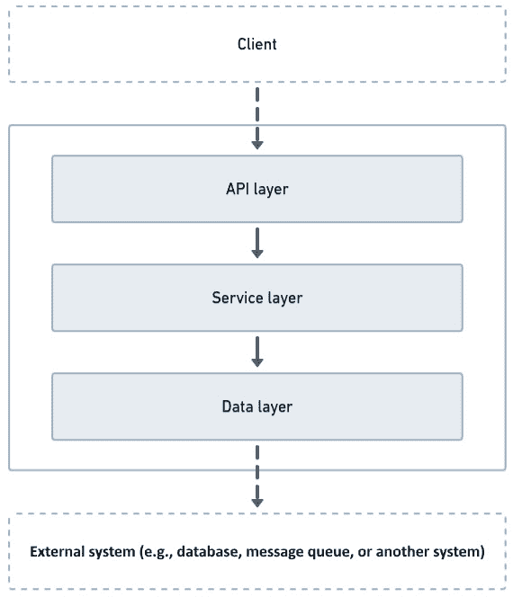

# 第十五章：比较六边形架构与分层架构

六边形架构只是几种软件架构方法之一。在这些方法中，一个突出的是所谓的分层架构，它在企业软件开发中已经广泛使用多年。其广泛采用的原因在于分层架构原则相对简单易用，并且这是在未做出关于新项目应使用哪种架构方法的有意识决策时可能自然出现的模式之一。

理解分层架构并意识到其在与六边形架构比较时的差异，这对我们做出更明智的决定很有帮助，即在选择开始或重构软件项目时使用哪种软件架构方法。这就是为什么在本章中，我们将首先回顾分层架构的概念。然后，基于这些概念，我们将实现一个简单的应用程序来学习如何应用分层架构的概念。接下来，我们将使用六边形架构的概念重构这个简单的应用程序，以便我们更好地掌握两种架构之间的对比。最后，我们将评估六边形和分层架构的优缺点。

本章将涵盖以下主题：

+   检查分层架构

+   使用分层架构创建应用程序

+   将分层架构应用程序重写为六边形架构

+   评估六边形和分层架构的利弊

到本章结束时，您将了解分层架构和六边形架构之间的区别，这将使您在下一个软件项目中做出更好的、有信息量的决策。

# 技术要求

要编译和运行本章中提供的代码示例，您需要在您的计算机上安装最新的**Java SE 开发工具包**和**Maven 3.8**。它们适用于 Linux、Mac 和 Windows 操作系统。

您可以在 GitHub 上找到本章的代码文件，网址为 [`github.com/PacktPublishing/-Designing-Hexagonal-Architecture-with-Java---Second-Edition/tree/main/Chapter15`](https://github.com/PacktPublishing/-Designing-Hexagonal-Architecture-with-Java---Second-Edition/tree/main/Chapter15)。

# 检查分层架构

在我看来，当负责一个项目的开发者群体没有停下来思考哪种架构更适合他们想要开发的软件时，分层架构可能会出现。我观察到在项目中，如果没有有意识的团队规划，代码结构会发展到一定程度的关注点分离，其中表示层/API 代码将与业务和基础设施代码相对隔离。例如，你不会在负责提供 REST 端点的类中看到核心业务逻辑。你可能会注意到，在这样的项目中，名为`model`、`repository`、`service`和`controller`的包作为基于分层架构思想的提示。它们是提示，因为每个包通常代表将特定软件责任分配的意图。`model`包中存在的代码用于表示数据库实体。`repository`包包含显示系统可以基于模型实体执行哪种数据库操作的类。`service`是一个包含一些业务逻辑的包，这些业务逻辑是在使用`repository`包中的类从数据库检索数据时执行的。最后，`controller`包包含暴露 API 端点的类，允许触发支持的应用程序行为之一。

作为分层架构的一种形式，我们可以看到基于`model`、`repository`、`service`和`controller`包的代码结构。每个包代表一个层，其责任直接依赖于来自下一个包/层或其下层的代码。控制器依赖于服务，服务依赖于仓库，仓库依赖于模型。看到这种模式略有变化并不罕见，即使引入了更多层，但向下依赖的一般思想始终存在。甚至可能存在某些情况下，一个层绕过下一层并依赖于另一层的类。以下图中我们可以看到基于分层架构的后端应用程序通常是如何结构的：



图 15.1 – 分层架构示例

与开发网络应用时可能需要的表示层不同，我们拥有包含具有 REST 端点逻辑的类的 API 层。这些类负责接收客户端请求并在服务层触发一些应用行为。这一层通常包含依赖于外部数据的业务逻辑。为了处理外部数据，我们拥有包含负责获取、持久化和映射外部数据的类的数据层。在这里我不使用“持久化”这个词，以避免暗示数据源将是数据库。数据可以来自任何地方，包括数据库。

我在大型企业和初创企业的几个软件开发项目中看到了这种模式的运用。有趣的是，如果你问参与项目的开发者他们使用了哪种架构，他们可能会说没有应用特定的架构，尽管他们的代码表明软件是基于分层架构开发的。

由于分层架构已经存在多年，它已经逐渐成为企业级软件项目的标准架构。基于高级系统组件划分责任的想法似乎能够满足我们在企业软件中看到的大部分需求，通常是因为这类软件大多数时候遵循相同的模式：接收输入，从某处获取数据，执行数据处理，然后将数据持久化或发送到另一个系统。鉴于许多企业应用程序都是按照这种模式开发的，这些应用程序之间显著的不同在于包含特定应用业务规则的数据处理部分。其他部分也可能发生变化，但变化并不大，因为 API 的暴露方式和数据检索/持久化的方式可能在不同组织的同一应用程序中标准化，尤其是在同一个团队维护这些应用程序时。

尽管分层架构有助于提供一定程度的解耦，但它并不能完全避免在某一层的变化也可能需要另一层做出改变的情况。当你有业务/服务层依赖于持久化层时，后者的变化可能会影响到前者。接下来，我将分享一个使用分层架构的经验。

我记得有一次，我所在的团队在项目进行到中途时决定更改数据库技术。在实施过程中，我们发现新数据库技术中可用的 ORM 功能在新数据库中不可用。问题是系统中有一些业务规则直接依赖于新数据库中缺失的这个功能。最终，我们不得不通过显著改变这些业务规则的处理方式来调整我们的方法。这个应用程序，特别是，在没有团队讨论应该遵循哪些架构原则的情况下演变而来，最终演变成了具有分层架构特征的项目。

为了更好地理解分层架构，让我们基于这个架构理念开发一个应用程序。

# 使用分层架构创建应用程序

在上一节中，我们看到了基于分层架构的后端应用程序是如何结构的。我们的示例有三个层：API、服务和数据。遵循这个结构，我们将开发一个简单的用户应用程序，允许用户注册和登录。我们将实现数据层，然后进行服务层，最后是 API 层。该应用程序将基于 Quarkus，因此我们可以依赖框架提供 REST 端点和连接到数据库。

## 实现数据层

数据层负责允许获取、持久化和映射外部数据。我们依赖数据库来存储用户应用程序的用户信息：

1.  因此，让我们首先准备 Quarkus，以便我们能够使用 H2 内存数据库：

    ```java
    quarkus.datasource.db-kind=h2
    quarkus.datasource.jdbc.url=jdbc:h2:mem:default;DB_CLO
      SE_DELAY=-1.;NON_KEYWORDS=user
    quarkus.hibernate-orm.database.generation=drop-and-
      create
    ```

    `quarkus.datasource.db-kind`属性告诉 Quarkus 使用 H2 驱动程序。`quarkus.datasource.jdbc.url`配置了一个在应用程序运行期间存在的内存数据库。最后，我们将`quarkus.hibernate-orm.database.generation`设置为允许在应用程序启动时自动创建数据库。

1.  在`dev.davivieira.layered.data.entity`包中，我们创建`User` ORM 实体类：

    ```java
    package dev.davivieira.layered.data.entity;
    import jakarta.persistence.Entity;
    import jakarta.persistence.GeneratedValue;
    import jakarta.persistence.GenerationType;
    import jakarta.persistence.Id;
    import lombok.*;
    @Entity
    @Getter
    @Setter
    @RequiredArgsConstructor
    @NoArgsConstructor
    public class User {
        @Id
        @GeneratedValue(strategy =
        GenerationType.IDENTITY)
        private Long id;
        @NonNull
        private String email;
        @NonNull
        private String password;
    }
    ```

    `User`是一个 ORM 实体，因为 Jakarta 的`@Entity`注解放置在类顶部。`id`属性被注解为`@GeneratedValue`，因此底层数据库生成`id`值。我们通过`email`和`password`属性完成了实现，这些属性对于新用户注册和登录是必需的。

1.  在`dev.davivieira.layered.data.repository`包中，我们创建`UserRepository`类：

    ```java
    package dev.davivieira.layered.data.repository;
    import dev.davivieira.layered.data.entity.User;
    import io.quarkus.hibernate.orm.
      panache.PanacheRepository;
    import jakarta.enterprise.context.ApplicationScoped;
    import java.util.Optional;
    @ApplicationScoped
    public class UserRepository implements PanacheReposi
      tory<User> {
        public Optional<User> findByEmail(String email) {
            return find("email",
            email).firstResultOptional();
        }
    }
    ```

    通过实现`PanacheRepository`，我们获得预定义的标准数据库操作，以允许获取、保存和删除数据。除了这些预定义的操作之外，我们还创建了`findByEmail`来使用电子邮件地址搜索`User`实体。如果没有找到数据，它将返回一个空的`Optional`。

`User`实体和仓库构成了数据层，使我们能够从数据库中持久化和检索用户数据。现在让我们实现服务层。

## 实现服务层

我们需要一个地方来放置逻辑，以检查在注册新用户或登录过程中验证用户凭据时电子邮件地址是否已存在。服务层是我们放置该逻辑的地方：

1.  在`dev.davivieira.layered.service`包中，我们开始实现`UserService`类：

    ```java
    @ApplicationScoped
    public class UserService {
        @Inject
        UserRepository userRepository;
        /** Code omitted **/
    }
    ```

    我们注入`UserRepository`以使服务类能够通过数据层处理外部数据。

1.  当接收到客户端请求时，我们不会直接将请求映射到 ORM 实体。相反，我们将这些请求映射到一个`UserDto`类：

    ```java
    public record UserDto (String email, String password)
      {}
    ```

    `record`类将自动生成电子邮件和密码字段的类构造函数、获取器和设置器。

1.  继续实现`UserService`类，我们实现了`createAccount`和`isEmailAlreadyUsed`方法：

    ```java
    @Transactional
    public String createAccount(UserDto userDto) throws
      Exception {
        isEmailAlreadyUsed(userDto.email());
        var user = new User(userDto.email(),
        userDto.password());
        userRepository.persist(user);
        return "User successfully created";
    }
    private void isEmailAlreadyUsed(String email) throws
      Exception {
        if(userRepository.findByEmail(email).isPresent()){
            throw new Exception("Email address already
                                 exist");
        }
    }
    ```

    `createAccount`方法接收`UserDto`参数。我们从该参数中获取电子邮件并将其传递给`isEmailAlreadyUsed`方法，该方法使用`UserRepository`的`findByEmail`来检查该电子邮件是否已存在。

1.  为了完成`UserService`的实现，我们创建了`login`和`isThePasswordValid`方法：

    ```java
    public String login(UserDto userDto) {
        var optionalUser =
        userRepository.findByEmail(userDto.email());
        if (optionalUser.isPresent()) {
            var user = optionalUser.get();
            var isThePasswordValid =
            isThePasswordValid(user, userDto);
            if (isThePasswordValid) {
                return "Authenticated with success";
            } else {
                return "Invalid credentials";
            }
        } else {
            return "Invalid credentials";
        }
    }
    private boolean isThePasswordValid(User user, UserDto
      userDto) {
        return
        user.getPassword().equals(userDto.password());
    }
    ```

    在`login`方法中，我们从`UserDto`获取电子邮件并使用它来检查是否存在该电子邮件的用户账户。如果没有，我们返回无效凭证信息。否则，我们检查`UserDto`中的密码是否与从数据库中通过`UserRepository`检索到的`User`实体中的密码匹配。

创建用户账户和验证登录凭证是服务层的责任。它通过依赖数据层从数据库获取用户数据来完成。现在我们需要公开一个 API，以便客户端可以向我们的应用程序发送请求。

## 实现 API 层

最后一个层，API 层，是我们实现用户创建和用户登录请求的 REST 端点：

1.  在`dev.davivieira.layered.api`包中，我们开始实现`UserEndpoint`类：

    ```java
    @Path("/user")
    public class UserEndpoint {
        @Inject
        UserService userService;
        /** Code omitted **/
    }
    ```

    我们注入`UserService`以访问服务层的`createAccount`和`login`方法。

1.  我们首先定义注册端点：

    ```java
    @POST
    @Produces(MediaType.TEXT_PLAIN)
    @Consumes(MediaType.APPLICATION_JSON)
    @Path("/register")
    public String register(UserDto userDto) throws Excep
      tion {
        return userService.createAccount(userDto);
    }
    ```

    这是一个简单的 REST 端点实现，接收映射到`UserDto`的 JSON 有效负载并返回纯文本。`UserDto`直接从服务层的`UserService`类传递到`createAccount`方法。

1.  最后，我们定义登录端点：

    ```java
    @POST
    @Produces(MediaType.TEXT_PLAIN)
    @Consumes(MediaType.APPLICATION_JSON)
    @Path("/login")
    public String login(UserDto userDto) {
        return userService.login(userDto);
    }
    ```

    就像我们在之前的注册端点中所做的那样，这里我们只是公开 REST 端点并将 DTO 直接传递到服务层。

    API 层只负责公开 REST 端点，不再做其他事情。我们避免在这个层上放置任何业务逻辑，以确保我们在这层和其他层之间分离关注点。

    现在我们来看看如何测试这个分层应用。

## 测试分层应用

我们将通过仅关注检查电子邮件是否已存在和凭证是否有效的逻辑来测试服务层。以下是一个测试示例：

```java
@QuarkusTest
public class UserServiceTest {
    @Inject
    UserService userService;
    @Test
    public void
     givenTheUserEmailAlreadyExistsAnExceptionIsThrown()
     throws Exception {
        var userDto = new UserDto("test@davivieira.dev",
        "password");
        userService.createAccount(userDto);
        Assertions.assertThrows(
                Exception.class,
                ()-> userService.createAccount(userDto)
        );
    }
    /** Code omitted **/
}
```

前面的测试检查当电子邮件地址已存在时是否会抛出异常。请注意，为了使此测试正常工作，服务层依赖于数据层，这需要数据库来持久化数据。因此，存在于服务层中的核心系统逻辑直接依赖于由 ORM 实体和仓库类组成的数据层。我们如何处理外部数据决定了我们在服务层中能做什么。

假设我们想要避免创建这种依赖，即核心系统逻辑依赖于并且紧邻数据处理代码。在这种情况下，六边形架构可以帮助我们以不同的安排来实现，其中核心系统逻辑不依赖于任何东西，并且提供了在无需担心外部数据处理方式的情况下演进核心逻辑的灵活性。让我们看看如何通过将我们的分层架构应用程序重构为六边形架构来实现这一点。

# 将分层架构应用程序重构为六边形架构

到目前为止，我们已经对如何实现分层架构应用程序有了概念。让我们将我们刚刚开发的应用程序重构为六边形架构。这个练习将突出两种架构之间的显著差异。

## 实现领域六边形

领域六边形包含具有核心系统逻辑的数据和行为。在以下步骤中，我们将看到如何使用六边形方法从分层应用程序中重构一些数据和行为的示例：

1.  在使用分层架构时，我们通过实现数据层开始开发系统。我们将将其重构为一个仅包含`User`领域实体类的领域六边形：

    ```java
    @Getter
    @Setter
    @RequiredArgsConstructor
    @NoArgsConstructor
    public class User {
        private Long id;
        @NonNull
        private String email;
        @NonNull
        private String password;
        public User(Long id, String email, String
        password) {
            this.id = id;
            this.email = email;
            this.password = password;
        }
        /** Code omitted **/
    }
    ```

    主要区别在于这个实体不是一个用于映射数据库实体的 ORM。这个实体是一个 POJO，它不仅包含数据，还包含行为。让我们实现这些行为。

1.  在`User`实体类中，我们实现了`isEmailAlreadyUsed`方法：

    ```java
    public void isEmailAlreadyUsed(Optional<User> op
      tionalUser) throws Exception {
        if(optionalUser.isPresent()) {
            throw new Exception(
            "Email address already exist");
        }
    }
    ```

    `isEmailAlreadyUsed`方法接收一个`Optional<User>`参数。如果值存在，则抛出异常。

1.  为了完成`User`实体类的实现，我们创建了`login`和`isPasswordValid`方法：

    ```java
    public String login(Optional<User> optionalUser) {
        if (optionalUser.isPresent()) {
            var user = optionalUser.get();
            var isThePasswordValid =
            isThePasswordValid(user);
            if (isThePasswordValid) {
                return "Authenticated with success";
            } else {
                return "Invalid credentials";
            }
        } else {
            return "Invalid credentials";
        }
    }
    private boolean isThePasswordValid(User user) {
        return user.getPassword().equals(this.password);
    }
    ```

    逻辑与我们在分层应用程序中实现的方法类似，但不同的是，我们不是使用`UserDto`类，而是直接在`User`领域实体类上操作。

    在六边形应用程序中，我们遵循领域驱动设计（DDD）方法，将逻辑从服务层推入领域六边形。原来在服务层上的包含核心系统逻辑的方法现在成为了领域六边形中`User`领域实体类的一部分。

    这里的重要区别在于领域六边形不依赖于任何东西。相比之下，在分层架构方法中，包含核心系统逻辑的服务层依赖于数据层。

## 实现应用程序六边形

我们在包含核心逻辑以处理用户注册和登录的领域六边形上实现了`User`领域实体类。我们需要定义以无差别的方式触发行为以及如何检索外部数据。这里的无差别是指表达对外部数据的需求，而不涉及提供此类数据的技术细节。我们在应用程序六边形中使用了用例和输入输出端口：

1.  让我们先定义`UserAccessUserCase`接口：

    ```java
    public interface UserAccessUseCase {
        String createAccount(User user) throws Exception;
        String login(User user);
    }
    ```

    创建账户和能够登录是我们应用程序支持的两种用例。

1.  为了允许处理外部数据，我们定义了`UserAccessOutputPort`接口：

    ```java
    public interface UserAccessOutputPort {
        Optional<User> findByEmail(String email);
        void persist(User user);
    }
    ```

    此接口仅包含`findByEmail`和`persist`方法定义的 POJO。在分层架构方法中，我们把这些方法作为数据层中仓库类的一部分。在仓库类中，数据来自数据库是隐含的。在六边形方法中，我们通过输出端口接口表达数据可以来自任何地方。

1.  我们以实现`UserAccessInputPort`类结束：

    ```java
    @ApplicationScoped
    public class UserAccessInputPort implements UserAcces
      sUseCase {
    @Inject
    UserAccessOutputPort userAccessOutputPort;
    @Override
    public String createAccount(User user) throws
    Exception {
            user.isEmailAlreadyUsed
              (userAccessOutputPort.findByEmail
                (user.getEmail()));
        userAccessOutputPort.persist(user);
        return "User successfully created";
    }
    @Override
    public String login(User user) {
        return
        user.login(
        userAccessOutputPort
        .findByEmail(user.getEmail()));
       }
    }
    ```

    `UserAccessInputPort`实现了`UserAccessUseCase`接口。注意我们正在注入`UserAccessOutputPort`。正是通过这个输出端口，输入端口将处理外部数据。`createAccount`方法通过依赖`User`领域实体类中提供的`isEmailAlreadyUsed`方法的逻辑来检查电子邮件是否已存在。`login`方法也依赖于领域六边形，通过调用存在于`User`领域实体类中的`login`方法。

应用六边形允许我们表达系统应该如何处理外部数据，同时结合领域六边形的核系统逻辑。与我们在分层架构方法中所做的方法相反，核心系统逻辑和外部数据处理已经被定义，而没有指定数据是来自数据库还是其他地方。

通过输出端口表达系统需要哪些数据，而不暴露系统将如何获取这些数据的方法，这是分层架构和六边形架构之间的重要区别。

## 实现框架六边形

应用六边形协调来自领域六边形的核系统逻辑和外部数据。然而，我们需要提供一种获取这些外部数据的方法。在分层架构方法中，数据层允许我们从数据库获取数据，API 层暴露了 REST 端点。在框架六边形中，我们使用输入适配器提供 REST 端点，使用输出适配器从数据库获取数据。让我们来实现它：

1.  我们从`UserAccessInputAdapter`类开始：

    ```java
    @Path("/user")
    public class UserAccessInputAdapter {
        @Inject
        UserAccessUseCase userAccessUseCase;
        /** Code omitted **/
    }
    ```

    我们注入`UserAccessUseCase`以访问应用六边形中可用的操作。

1.  在`UserAccessInputAdapter`类中，我们实现`register`方法：

    ```java
    @POST
    @Produces(MediaType.TEXT_PLAIN)
    @Consumes(MediaType.APPLICATION_JSON)
    @Path("/register")
    public String register(UserDto userDto) throws Excep
      tion {
        return userAccessUseCase.createAccount(new
        User(userDto.email(), userDto.password()));
    }
    ```

    我们直接将`UserDto`映射到`User`领域实体类。然后，我们将它传递给`UserAccessUseCase`中的`createAccount`方法。

1.  为了完成`UserAccessInputAdapter`的实现，我们创建`login`方法：

    ```java
    @POST
    @Produces(MediaType.TEXT_PLAIN)
    @Consumes(MediaType.APPLICATION_JSON)
    @Path("/login")
    public String login(UserDto userDto) {
        return userAccessUseCase.login(new
        User(userDto.email(), userDto.password()));
    }
    ```

    正如我们在`register`方法中所做的那样，我们将`UserDto`映射到`User`领域实体类，然后将其传递给`login`方法。

    我们仍然需要实现输出适配器。让我们来做这件事。

1.  `UserAccessOutputAdapter`实现了`UserAccessOutputPort`：

    ```java
    @ApplicationScoped
    public class UserAccessOutputAdapter implements
      UserAccessOutputPort {
        @Inject
        UserRepository userRepository;
        /** Code omitted **/
    }
    ```

    通过注入`UserRepository`，我们实际上将这个输出适配器转变为处理数据库的适配器。

1.  我们需要实现`findByEmail`方法：

    ```java
    @Override
    public Optional<User> findByEmail(String email) {
        return UserMapper
               .userDataToDomain(
               userRepository.findByEmail(email));
    }
    ```

    当从`UserAccessOutputPort`接口实现`findByEmail`时，我们使用`UserRepository`。`UserMapper`是一个辅助类，用于将 ORM 实体类`UserData`映射到`User`领域实体类。

1.  最后，我们实现`persist`方法：

    ```java
    @Transactional
    @Override
    public void persist(User user) {
        var userData = UserMapper.userDomainToData(user);
        userRepository.persist(userData);
    }
    ```

    我们再次使用`UserMapper`辅助类将`User`领域实体类映射到`UserData`ORM 实体类。这是必需的，因为我们不能持久化领域实体。因此，我们将`UserData`ORM 实体类传递给`UserRepository`中的`persist`方法。

    引入框架六边形允许客户端访问由输入适配器提供的系统 API，并将六边形应用程序连接到外部数据源，在我们的例子中是一个数据库。与 API 层提供的 REST 端点相比，框架六边形的输入适配器没有太大区别。两种方法都公开了类似的方法，依赖于 DTO 类来映射客户端请求，并将它们发送到服务层或应用程序六边形。

    显著变化的是外部数据是如何处理的。在六边形方法中，输出适配器实现了一个输出端口，提供了输出端口抽象的灵活性。可以不干扰核心系统逻辑实现一个新的输出适配器。另一方面，在分层架构方法中没有这样的抽象。服务层直接依赖于数据层的仓库类。

    现在我们来看看如何测试六边形应用程序。

## 测试六边形应用程序

因为核心系统逻辑是领域六边形的一部分，我们可以创建单元测试来验证`User`领域实体行为。以下是一个这样的单元测试的例子：

```java
@QuarkusTest
public class UserServiceTest {
@Test
public void givenTheUserEmailAlreadyExistsAnException
  IsThrown() {
    var user = new User("test@davivieira.dev", "password");
    var optionalUser = Optional.of(user);
    Assertions.assertThrows(
            Exception.class,
            ()-> user.isEmailAlreadyUsed(optionalUser)
    );
}
/** Code omitted **/
}
```

在分层方法中，我们必须注入一个服务类并提供一个数据库来测试电子邮件是否已经被使用。在六边形方法中，我们直接从`User`领域实体类测试逻辑。将核心系统逻辑从分层架构的服务层移动到六边形架构的领域六边形，提供了在不依赖外部资源的情况下运行更受限制的测试的灵活性。

基于我们使用分层和六边形架构实现相同应用程序的实践，让我们评估每种架构的优缺点。

# 评估六边形和分层架构的优缺点

分层应用程序的结构比六边形应用程序更简单。在分层方法中，我们有服务层直接依赖于数据层。这种依赖意味着核心系统逻辑依赖于数据层的 ORM 实体和仓库类。与六边形方法相反，没有关于外部数据访问的抽象，核心系统逻辑与处理外部数据的代码嵌入在一起。这是好是坏？就像软件开发中的大多数事情一样，这取决于你的上下文。

在本章开头分享的经验，即我的团队在项目中途不得不更改数据库技术，是一个例子，说明采用六边形方法将是有益的。如果你预计你的项目会有相当大的需求变化，那么六边形方法可能是一个好主意，以便使你的应用程序更容易适应这些变化。否则，分层架构是一个不错的选择，因为使用这种架构快速启动新应用程序是很快的。

分层架构提供了一种简单快捷的方法来开发新应用程序。大多数后端开发者都熟悉有一个 API 层来暴露端点，一个包含核心系统逻辑的服务层，以及通常提供数据库访问的数据层。因此，让新团队成员加入维护基于这种架构的应用程序是一项小任务。权衡的是，当需要更改基础设施组件时，这种架构提供的灵活性较少。

另一方面，六边形架构使我们能够将核心系统逻辑代码与基础设施/外部数据处理代码解耦。然而，这种解耦并非免费获得。由于增加了诸如端口、用例和适配器等额外组件，六边形架构略微增加了代码复杂性，这些组件我们使用以确保解耦。主要好处是具有变化容忍度的应用程序，可以免受意外系统需求不可预测性的影响。由于六边形架构不如其分层对应物广泛使用，因此吸纳新团队成员可能需要额外的努力。因此，人们需要更多的时间来掌握六边形方法的思想，以便开始为项目做出贡献。

# 摘要

本章探讨了分层架构及其与六边形架构的不同之处。我们首先回顾了分层架构的目的，即通过包含具有特定职责的代码的逻辑层，提供一定程度的关注点分离。在回顾了分层方法的概念之后，我们亲自动手从头开始实现了一个简单的用户访问应用程序，其中包含 API、服务和数据层。为了突出分层架构和六边形架构之间的差异，我们将用户访问应用程序重构为使用六边形方法。通过这样做，我们发现分层架构并不能完全保护应用程序免受重大变化的影响，例如那些触及基础设施组件，如外部数据访问处理的变化。最后，我们评估了分层架构和六边形架构的优缺点，得出结论：当预期项目需求没有重大变化时，分层架构是一个不错的选择；而当需要更易于适应变化的应用程序，能够容纳相当大的系统变化，尤其是在基础设施层面时，建议使用六边形架构。在下一章中，我们将探讨如何将 SOLID 原则与六边形架构结合使用。

# 问题

1.  为什么你会选择在新的项目中使用分层架构而不是六边形架构？

1.  虽然分层架构提供了一定程度的关注点分离，但它并没有完全解耦核心系统逻辑与基础设施代码。为什么？

1.  在哪种场景下使用六边形架构而不是分层架构是有意义的？

# 答案

1.  它提供了一种简单快捷的方式来启动新应用程序。

1.  由于核心系统逻辑直接依赖于基础设施代码，通常当存在依赖于数据层的服务层时。

1.  当预期项目需求会发生变化时，使用六边形架构可以创建能够适应那些需求的易于适应变化的应用程序。
