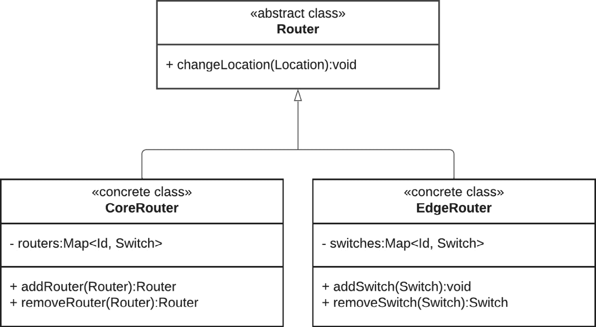
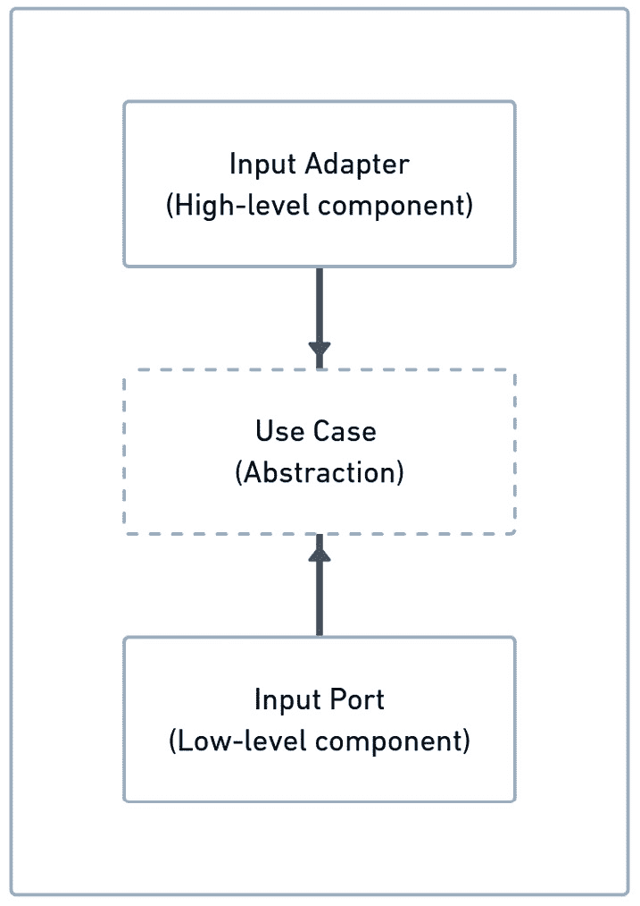

# 第十六章：使用 SOLID 原则与六边形架构

拥有一套原则来帮助我们开发更好的软件的想法让我感到有趣。多年来，程序员们面临了许多问题；有些问题发生得如此频繁，以至于出现了解决这类问题的模式，从而产生了所谓的**设计模式**。这些模式被用来解决特定的软件开发问题。为了补充那些主要针对重复和特定编码问题的设计模式，人们还提出了解决软件项目中可维护性问题的新思路。其中一套引人注目且具有影响力的思想被综合为众所周知的**SOLID 原则**。

本章将探讨 SOLID 原则以及我们如何在使用六边形架构时利用它们。我们将首先回顾每个原则，然后我们将继续探讨它们如何在六边形系统的背景下应用。最后，我们将讨论如何将建造者和抽象工厂等设计模式与六边形架构结合使用。

本章将涵盖以下主题：

+   理解 SOLID 原则

+   在六边形架构系统中应用 SOLID

+   探索其他设计模式

完成本章学习后，您将能够结合六边形架构技术使用 SOLID 原则。同时，您还将了解如何在开发六边形系统时使用设计模式，例如责任链模式、装饰者模式、建造者模式和单例模式。

# 技术要求

要编译和运行本章中展示的代码示例，您需要在您的计算机上安装最新的**Java SE 开发工具包**和**Maven 3.8**。它们适用于 Linux、MacOS 和 Windows 操作系统。

您可以在 GitHub 上找到本章的代码文件，链接为 [`github.com/PacktPublishing/-Designing-Hexagonal-Architecture-with-Java---Second-Edition/tree/main/Chapter16`](https://github.com/PacktPublishing/-Designing-Hexagonal-Architecture-with-Java---Second-Edition/tree/main/Chapter16)。

# 理解 SOLID 原则

自从编程诞生以来，开发者们一直在讨论想法并捕捉原则，以帮助开发更好的软件。这些原则的出现是为了应对处理高度复杂代码的需求。在多次遭受相同重复问题后，开发者开始认识到这些问题的模式，并设计了防止此类问题的技术。一个显著的例子是关于设计模式的**四人帮**（**GoF**）书籍，它在面向对象的世界中产生了巨大影响，并继续影响着一代又一代的开发者。另一个引人注目且具有影响力的例子是罗伯特·马丁提出的思想，这些思想导致了 SOLID 原则的形成。

SOLID 代表以下原则：

+   **单一职责原则**（**SRP**）

+   **开闭原则**（**OCP**）

+   **里氏替换原则**（**LSP**）

+   **接口隔离原则**（**ISP**）

+   **依赖倒置** **原则** （**DIP**）

这些原则旨在通过代码帮助开发者创建健壮且易于更改的软件，基于这些原则定义的一系列规则。我相信使用这些原则并不能完全保证软件没有可维护性问题。然而，这些原则可以显著提高整体代码质量。本质上，这全部关于采用允许以可持续的方式向代码库引入更改的技术。我的意思是，软件会增长，但它的复杂性将得到控制。

SOLID 原则与六边形架构以类似的方式工作，因为两者都旨在提供技术来开发更易于维护、更易于更改的软件。因此，探索这些原则如何在六边形应用程序的背景下应用是有意义的。让我们从回顾 SOLID 原则的每一个开始我们的探索。

## 单一职责原则（SRP）

我记得一个情况，我会目睹或成为导致副作用代码更改的作者，这种副作用只有在应用程序部署到预发布环境或更糟糕的生产环境后才会被发现。一个利益相关者会报告应用程序在导致副作用的更改部署后开始出现的问题。所以，尽管这个更改解决了某个利益相关者的问题，但它为另一个利益相关者创造了问题。为什么？因为导致问题的更改违反了 SRP。违反发生是因为相同的系统逻辑为两个不同的利益相关者服务。这个更改解决了某个利益相关者的问题，但为另一个利益相关者创造了副作用，导致了问题。

当我们过早地定义抽象时，也可能违反 SRP。假设我们定义了一个抽象类，其中包含我们认为将适用于该抽象类所有未来实现的一些数据和行为。然后，后来通过一个不幸的事故报告，我们发现该抽象类中的一些数据或行为在另一位开发者的最近实现中导致了意外的结果，这位开发者假设由该抽象提供的行为和数据将在导致问题的实现中工作。

SRP 确保一个方法或函数的更改仅基于一种利益相关者或行为者的请求，通常是一个组织的部门或一条业务线。确保部门 A 的逻辑，例如，不会干扰部门 B 的逻辑是很重要的，这可以通过以某种方式安排代码来实现，即服务于不同利益相关者的逻辑得到适当的分离。

## 开放-封闭原则（OCP）

这个原则背后的想法在于在不改变现有事物的情况下增加软件的功能。为了做到这一点，一个软件组件或模块应该是可扩展的，但不可修改的。我可以回忆起一个经历，当时我在实现报告功能。我没有使用一个类来处理所有类型的报告，而是创建了一个具有报告的基本属性的基础抽象类。每次需要实现新的报告类型时，就会通过实现基础抽象类创建一个新的具体类。额外的属性和功能会被附加到基础抽象类的基本属性上。

我们使用 OCP 来避免那些我们想要添加新功能，并且为了实现这个功能，我们也需要更改已经支持现有功能的一些逻辑的情况。通过这样做，我们违反了 OCP。相反，我们需要安排代码，以便我们可以在不修改现有代码的情况下添加新功能。

## 李斯克夫替换原则（LSP）

基于我在 OCP 描述中给出的报告示例，让我们假设我们有一个包含 `print` 方法声明的 `Report` 类。根据给定的问题域，`print` 方法是任何报告支持的行为。除了 `Report` 类之外，假设我们还有扩展它的 `WorkdayReport` 和 `WeekendReport` 类。LSP 规定，如果我们向期望 `Report` 类型的方法传递 `WorkdayReport` 或 `WeekendReport` 类型的对象，该方法将能够触发所有报告类型固有的行为——在这种情况下，就是 `print` 方法。总之，`Report` 类型应该被设计得使其声明的、在子类型中重写的方法与子类型的目的保持一致。

## 接口隔离原则（ISP）

当我们想要为客户提供只包含他们需要的声明的方法的接口时，ISP 是有帮助的。这个原则通常在我们有一个包含许多方法声明的单一接口，并且一个特定的客户端只实现一些方法并为不需要的方法提供占位实现时被使用。通过应用 ISP，我们打破了那个包含多个接口的单个接口，这些接口针对特定的客户端需求进行了定制。

## 依赖倒置原则（DIP）

稳定和不稳定的软件组件有截然不同的概念。*稳定*意味着那些不太经常变化的组件，而*不稳定*则相反。一个客户端组件直接依赖于一个不稳定的组件可能是危险的，因为不稳定代码的变化可能会触发客户端的变化。大多数情况下，不稳定组件是一个具有不需要暴露给其客户端的实现细节的具体类。

为了避免暴露此类实现细节并保护客户端免受依赖变更的影响，DIP 规定客户端应始终依赖于抽象而非具体实现。不稳定的组件——一个具有实现细节的具体类——应通过实现一个接口（例如）从抽象中派生出来。然后，客户端应依赖于一个稳定的组件，即不稳定组件（具体类）实现的接口。我们称接口为稳定组件，因为它充当合同，而合同更不易发生变化。

让我们在下一节中看看如何将 SOLID 原则应用于使用六边形架构开发的应用程序。

# 在六边形架构系统中应用 SOLID 原则

为了了解每个 SOLID 原则是如何应用的，我们将回到本书中开发的全局拓扑和库存系统。让我们首先看看 SRP 在拓扑和库存系统中是如何应用的。

## 应用 SRP

只是为了回顾，拓扑和库存系统管理网络资源，如路由器和交换机。这样的系统适合电信或**互联网服务提供商**（**ISP**）公司，他们希望对其为服务客户所使用的网络资源进行库存管理。

在拓扑和库存系统中，我们有核心路由器和边缘路由器。核心路由器处理来自一个或多个边缘路由器的高负载网络流量。边缘路由器用于处理来自最终用户的流量。边缘路由器连接到网络交换机。

考虑一个场景，核心路由器和边缘路由器更改位置。例如，现在位于法国的核心路由器由于某些原因需要重新配置到意大利，而位于法兰克福的边缘路由器需要重新配置到柏林。还要考虑网络跨国家变化由演员 A 处理，而网络跨城市变化由演员 B 处理。

让我们将拓扑和库存应用程序更改为满足描述的要求。以下描述的更改是在域六边形中进行的：

1.  创建 `AllowedCountrySpec` 规范类：

    ```java
    public final class AllowedCountrySpec extends Ab
      stractSpecification<Location> {
        private List<String> allowedCountries =
        List.of(
        "Germany", "France", "Italy", "United States");
        @Override
        public boolean isSatisfiedBy(Location location) {
            return allowedCountries
                    .stream()
                    .anyMatch(
                     allowedCountry -> allowedCountry
                     .equals(location.country()));
        }
        /** Code omitted **/
    }
    ```

    此规范限制了可以通过 `allowedCountries` 属性选择的哪些国家。这并不是在真实应用程序中应该如何表示它，但它足以说明 SRP 的概念。

1.  现在，创建 `AllowedCitySpec` 规范类：

    ```java
    public final class AllowedCitySpec extends Ab
      stractSpecification<Location> {
        private List<String> allowedCities =
        List.of(
        "Berlin", "Paris", "Rome", "New York");
        @Override
        public oolean isSatisfiedBy(Location location) {
            return allowedCities
                    .stream()
                    .anyMatch(
                     allowedCountry -> allowedCountry
                    .equals(location.city()));
        }
        /** Code omitted **/
    }
    ```

    沿用之前规范中的相同思路，我们在这里通过 `allowedCities` 属性限制允许的城市。

1.  在 `Router` 抽象类中声明 `changeLocation` 方法：

    ```java
    public abstract sealed class Router extends Equipment
      permits CoreRouter, EdgeRouter {
       /** Code omitted **/
       public abstract void changeLocation(
       Location location);
       /** Code omitted **/
    }
    ```

    注意，`Router` 是一个抽象密封类，只允许 `CoreRouter` 和 `EdgeRouter` 类实现它。

1.  为 `CoreRouter` 提供实现：

    ```java
    @Override
    public void changeLocation(Location location) {
        var allowedCountrySpec = new AllowedCountrySpec();
        allowedCountrySpec.check(location);
        this.location = location;
    }
    ```

    我们使用 `AllowedCountrySpec` 来检查新路由器 `Location` 是否被允许。如果提供了不允许的国家，将抛出异常。否则，将新位置分配给 `Router` 对象的 `location` 变量。

1.  为 `EdgeRouter` 提供实现：

    ```java
    @Override
    public void changeLocation(Location location) {
        var allowedCountrySpec = new AllowedCountrySpec();
        var allowedCitySpec = new AllowedCitySpec();
        allowedCountrySpec.check(location);
        allowedCitySpec.check(location);
        this.location = location;
    }
    ```

    `EdgeRouter` 的实现略有不同。除了 `AllowedCountrySpec`，我们还有 `AllowedCitySpec`。只有在这两个规范满足之后，才会为 `Router` 对象分配一个新的 `Location`。

    让我们回顾一下我们在这里做了什么。我们首先创建了 `AllowedCountrySpec` 和 `AllowedCitySpec` 规范；然后，我们在 `Router` 抽象类上声明了 `changeLocation` 方法。由于 `CoreRouter` 和 `EdgeRouter` 都实现了这个类，我们必须重写 `changeLocation` 方法来满足角色 A 和角色 B 的需求。角色 A 负责处理跨国家的位置更改——在这种情况下，是 `CoreRouter`。角色 B 负责处理跨城市的位置更改，这是 `EdgeRouter` 的责任。

    假设我们不是将 `changeLocation` 声明为抽象的，而是提供了一个由 `CoreRouter` 和 `EdgeRouter` 类共享的具体实现。这将违反 SRP，因为 `changeLocation` 逻辑将服务于不同的角色。

## 应用 OCP

我们尚未声明，但 `Router`、`CoreRouter` 和 `EdgeRouter` 类之间的安排代表了 OCP 的应用。观察以下统一建模语言（UML）图：



图 16.1 – 应用 OCP

OCP 确保模块或组件对更改是封闭的，但对扩展是开放的。我们不是提供一个包含处理核心和边缘路由器逻辑的单个类的类设计，而是利用 Java 的继承能力来扩展 `Router` 抽象类的可能性，而不改变其属性和行为。这种扩展通过 `CoreRouter` 和 `EdgeRouter` 具体类实现是可能的。

## 应用 LSP

为了演示 LSP 的应用，我们需要在拓扑和库存系统中进行更多更改。在应用 SRP 和 OCP 的同时，我们改变了域六边形。现在，我们将对应用程序六边形进行更改：

1.  在 `RouterManagementUseCase` 接口中声明 `changeLocation` 方法：

    ```java
    public interface RouterManagementUseCase {
        /** Code omitted **/
        Router changeLocation(
        Router router, Location location);
        /** Code omitted **/
    }
    ```

    更改路由器的位置是我们添加到拓扑和库存系统中的新用例，因此我们添加了 `changeLocation` 方法声明来表达该用例。

1.  在 `RouterManagementInputPort` 中实现 `changeLocation` 方法：

    ```java
    public class RouterManagementInputPort implements
      RouterManagementUseCase {
        /** Code omitted **/
        @Override
        public Router changeLocation(Router router,
        Location location) {
            router.changeLocation(location);
            return persistRouter(router);
        }
        /** Code omitted **/
    }
    ```

    `RouterManagementInputPort` 中的 `changeLocation` 方法通过传递一个 `Location` 对象来调用 `Router` 中的 `changeLocation`。`Router` 中的 `changeLocation` 具有检查提供的 `Location` 是否被允许的逻辑。如果一切正常，我们调用 `persitRouter` 来持久化带有其新 `Location` 的 `Router`。

    当我们在 `RouterManagementInputPort` 中实现 `changeLocation` 方法时，我们可以观察到 LSP 的应用。注意 `changeLocation` 期望一个 `Router` 类型：

    ```java
    public Router changeLocation(Router router,
      Location location) {
        router.changeLocation(location);
        return persistRouter(router);
    }
    ```

这意味着我们可以传递一个`CoreRouter`或一个`EdgeRouter`对象，因为它们都扩展了`Router`，并且它们都提供了`changeLocation`的实现，这是所有路由器固有的行为。

## 应用 ISP（接口隔离原则）

在应用 LSP（Liskov 替换原则）时，我们在应用程序六边形中创建了`RouterManagementUseCase`和`RouterManagementInputPort`。让我们通过在框架六边形中提供一个输入适配器来完成我们的实现，以将输入适配器连接到输入端口：

1.  在`RouterManagementAdapter`类中实现`changeLocation`方法：

    ```java
    @Transactional
    @POST
    @Path("/changeLocation/{routerId}")
    @Operation(operationId = "changeLocation", description
      = "Change a router location")
    public Uni<Response> changeLocation(@PathParam
      ("routerId") String routerId, LocationChange loca
        tionChange) {
        Router router = routerManagementUseCase
           .retrieveRouter(Id.withId(routerId));
        Location location =
            locationChange.mapToDomain();
            return Uni.createFrom()
           .item(routerManagementUseCase.changeLocation(ro
            uter, location))
           .onItem()
           .transform(f -> f != null ? Response.ok(f) :
                  Response.ok(null))
                 .onItem()
                 .transform(
                    Response.ResponseBuilder::build);
    }
    ```

    通过使用`POST`和`PATH`注解，我们将此方法转换为`REST`端点，以接收发送到`/router/changeLocation/{routerId}` URI 的请求。URI 中的路由部分来自`RouterManagementAdapter`类`PATH`注解的最高级定义。

    此输入适配器使用`RouterManagementUseCase`中的`retrieveRouter`方法获取`Router`。然后，它将`LocationRequest`对象转换为`Location`域对象。最后，它将`Router`和`Location`传递给`RouterManagementUseCase`中的`changeLocation`方法。

    为了确认我们的实现是有效的，让我们实现一个测试来检查整个流程。

1.  在`RouterManagementAdapterTest`类中实现以下测试：

    ```java
    @Test
    public void changeLocation() throws IOException {
        var routerId =
            "b832ef4f-f894-4194-8feb-a99c2cd4be0c";
        var expectedCountry = "Germany";
        var location = createLocation("Germany",
            "Berlin");
        var updatedRouterStr = given()
              .contentType("application/json")
              .pathParam("routerId", routerId)
              .body(location)
              .when()
              .post("/router/changeLocation/{routerId}")
              .then()
              .statusCode(200)
              .extract()
              .asString();
        var changedCountry =
        getRouterDeserialized(
        updatedRouterStr).getLocation().country();
        assertEquals(expectedCountry, changedCountry);
    }
    ```

    此测试更改了路由器的位置，这是一个位于美国的核心路由器。在发送包含国家为“德国”和城市为“柏林”的`Location`对象的`POST`请求后，我们运行一个断言以确保返回的`Router`对象具有更改后的位置——德国而不是美国。

ISP 可以通过使用例操作对输入适配器可用来观察到。我们有`RouterManagementInputPort`类实现了`RouterManagementUseCase`接口。ISP 被采用，因为`RouterManagementUseCase`接口的所有方法声明都由`RouterManagementInputPort`实现，并且都是相关的。

## 应用 DIP（依赖倒置原则）

我们在*第九章*，“使用 Java 模块应用依赖倒置”中讨论了依赖倒置，其中我们使用了**Java 平台模块系统**（**JPMS**）来应用依赖倒置。为了回顾，让我们查看以下图表：



图 16.2 – 依赖倒置的回顾

DIP 指出，客户端应该始终依赖于抽象而不是具体实现。这正是我们通过使`RouterManagementAdapter`依赖于`RouterManagementUseCase`接口，而不是`RouterManagementInputPort`具体类所做的事情：

```java
public class RouterManagementAdapter {
    @Inject
    RouterManagementUseCase routerManagementUseCase;
    /** Code omitted **/
}
```

在*第九章*，“使用 Java 模块应用依赖倒置”中，`RouterManagementUseCase`接口的实现——一个`RouterManagementInputPort`对象——由 JPMS 提供。在当前实现中，我们使用 Quarkus 和`@Inject`注解来提供`RouterManagementInputPort`。

# 探索其他设计模式

在前面的章节中，我们在开发拓扑和库存系统时应用了一些设计模式。这些模式帮助我们更好地组织代码以支持应用需求。因此，在本节中，我们将回顾我们在实现六边形架构时应用的设计模式。

## 单例模式

在介绍 Quarkus 到我们的拓扑和库存系统之前，我们必须提供自己的机制来创建一个单独的数据库连接对象。在处理基于数据库的连接时，通常只有一个实例连接到数据库，并将该连接与其他对象共享。

单例模式是我们用来创建单个数据库连接实例的模式，如下面的示例所示：

```java
public class RouterNetworkH2Adapter implements RouterNet
  workOutputPort {
    private static RouterNetworkH2Adapter instance;
    @PersistenceContext
    private EntityManager em;
    private RouterNetworkH2Adapter(){
        setUpH2Database();
    }
    private void setUpH2Database() {
        EntityManagerFactory entityManagerFactory =
        Persistence.createEntityManagerFactory
          ("inventory");
        EntityManager em =
        entityManagerFactory.createEntityManager();
        this.em = em;
    }
    public static RouterNetworkH2Adapter getInstance() {
        if (instance == null) {
            instance = new RouterNetworkH2Adapter();
        }
        return instance;
    }
}
```

为了确保只创建一个对象，我们创建一个私有的构造函数以防止客户端创建额外的实例。对象创建由`getInstance`方法处理，该方法检查实例属性是否为`null`。如果是`null`，则创建一个新的`RouterNetworkH2Adapter`并将其分配给`instance`变量。然后私有的构造函数使用`EntityManagerFactory`创建数据库连接。

当第二次执行`getInstance`方法时，我们不是创建一个新的`RouterNetworkH2Adapter`实例，而是返回之前创建的现有实例。

## 构建器

构建器是一种设计模式，它帮助我们以表达性的方式创建复杂的对象。它适用于具有许多参数和不同方式创建相同对象的场景。我们已使用该设计模式创建了`CoreRouter`和`EdgeRouter`对象。

考虑以下示例，其中我们使用其构造函数创建`CoreRouter`的一个实例：

```java
var router = new CoreRouter(
                  id,
                  parentRouterId,
                  vendor,
                  model,
                  ip,
                  location,
                  routerType,
                  routers);
```

直接使用构造函数的一个缺点是我们需要知道如何以正确的顺序传递参数。在先前的示例中，我们必须首先传递`id`，然后是`parentRouterId`，依此类推。

现在，让我们看看如何使用构建器进行对象创建：

```java
var router = CoreRouter.builder()
              .id(id == null ? Id.withoutId() : id)
              .vendor(vendor)
              .model(model)
              .ip(ip)
              .location(location)
              .routerType(routerType)
              .build();
```

除了跳过一些参数，如`parentRouterId`之外，我们通过`vendor`或`model`等构建器方法以任何顺序传递参数。一旦完成，我们调用`build`方法来返回`CoreRouter`实例。

在整本书中，我们没有提供自定义构建器的实现。相反，我们依靠有用的 Lombok 库，通过简单地在类的构造函数上添加`Builder`注解来创建构建器：

```java
@Builder
public CoreRouter(Id id, Id parentRouterId, Vendor vendor,
  Model model, IP ip, Location location, RouterType router
    Type, Map<Id, Router> routers) {
/** Code omitted **/
}
```

如果你没有对你对象创建的特殊要求，Lombok 可能就足够了。否则，你可以实现自己的构建器机制。这通常发生在你想要定义对象创建的强制或可选参数以及其他规则时。

## 抽象工厂

在上一节中，我们讨论了如何应用 LSP 使我们能够传递一个`CoreRouter`或`EdgeRouter`对象给期望`Router`类型的函数，然后我们可以使用该对象而没有任何问题。当我们实现`RouterFactory`类时，抽象工厂模式就派上用场了：

```java
public class RouterFactory {
    public static Router getRouter(Id id,
                                   Vendor vendor,
                                   Model model,
                                   IP ip,
                                   Location location,
                                   RouterType routerType){
        switch (routerType) {
            case CORE -> {
                 return CoreRouter.builder().
                     Id(id == null ? Id.withoutId() : id).
                     Vendor(vendor).
                     Model(model).
                     Ip(ip).
                     Location(location).
                     routerType(routerType).
                     Build();
            }
            case EDGE -> {
                 return EdgeRouter.builder().
                     Id(id==null ? Id.withoutId():id).
                     Vendor(vendor).
                     Model(model).
                     Ip(ip).
                     Location(location).
                     routerType(routerType).
                     Build();
            }
            default -> throw new
            UnsupportedOperationException(
            "No valid router type informed");
        }
    }
}
```

`RouterFactory`类只包含`getRouter`方法，该方法接收创建代码和边缘路由器所需的参数，并返回一个类型为`Router`的对象。请注意，我们传递了一个用于`switch`语句的`RouterType`参数，用于识别需要创建哪种类型的路由器，即`CoreRouter`或`EdgeRouter`。无论具体的路由器子类型如何，我们总是将其作为`Router`超类型返回以供使用，例如，在可以应用 LSP 的场景中。

# 摘要

本章让我们探索了如何将 SOLID 原则与六边形架构一起使用。我们在实现拓扑和库存系统时也回顾了我们的设计模式。我们首先简要地讨论了 SOLID 原则。

在对原则有了基本了解之后，我们继续探讨它们如何在六边形应用程序的上下文中应用。然后，我们将更改路由位置功能实现到拓扑和库存系统中。最后，我们回顾了在设计六边形系统时如何使用如建造者、单例和抽象工厂等设计模式。

下一章和最后一章将进一步探讨设计实践，以帮助我们构建更好的软件。

# 问题

1.  OCP 代表什么，它的目的是什么？

1.  DIP 的目标是什么？

1.  哪种设计模式可以支持 LSP？

# 答案

1.  它代表的是**开放封闭原则**。其目的是确保软件组件或模块对修改是封闭的，但对扩展是开放的。

1.  DIP 规定客户端应始终依赖于抽象而不是具体实现。通过这样做，我们保护客户端免受具体实现变化的影响，这些变化可能需要修改客户端代码。

1.  抽象工厂模式根据其超类型提供对象，这可以在 LSP 中使用，其中超类型被子类型替换，同时保持对象行为的一致性。
